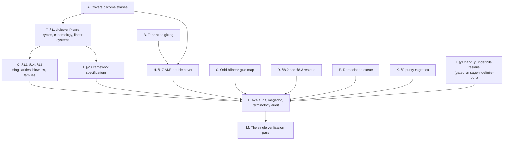

# Preamble execution priorities

This file owns work selection across `TODO.md`, `TODO-ORGANIZATION.md`, and `PORT_TODO.md`.
The detailed mathematical requirements remain in those files.

## Testing is deferred until every other item is done (always-on)

**Run no tests, no QC gates, no Sage and no notebooks against preamble work while
any item in these queues remains open.** Verification is the last phase of the
whole programme, not a step inside a work unit. There is exactly one verification
pass, and it happens after the architecture is complete.

This is not a preference about speed. The architecture is still moving: a category
changes owner, a functor gains its morphism half, an operation moves to the level
that actually defines it. A suite run against a half-built architecture measures a
shape nobody intends to keep. Its failures are noise, its passes are worse than
noise, and acting on either drags the design toward whatever happened to be green
that hour. Red is the expected state of these trees until the last unit lands.

So the unit of work is the construction plus the test that would falsify it,
written and committed **unverified**. Write the test. Do not run it. Say
"unverified" wherever a test is named in a report or a commit message.

Two narrow exceptions, and nothing else:

- Checking that a merged tree still imports, which is one short process and tells
  you whether the session exists at all.
- Provisioning a tool a row requires, such as instantiating a Julia project or
  confirming an executable is on `PATH`.

Neither of those is verification, and neither licenses a suite. A green run is not
evidence while the architecture is incomplete, so do not seek one, do not report
one, and do not let one decide a design question.

## Current objective and order

Develop a general scheme-theory toolkit built on the preamble's affine-local algebra, modules, and categorical constructions.
This research proceeds while `~/gitclones/sage-categories` develops the replacement category framework.
The preamble must remain usable, organized, and extensible throughout that work.

1. Build a coherent affine-local algebraic foundation: rings, ideals, modules, algebras, their morphisms, and their constructions.
2. Thread underlying structures and constructors through that foundation so higher constructions reuse its algorithms.
3. Build relative schemes, covers and sheaves, group actions, divisors, cycles, cohomology, and families through those algebraic owners.
4. Continue arithmetic lattice orbits, centralizers, embeddings, and reflection geometry as subsequent research applications.

Steps 1–3 form one dependency-driven work stream. General constructions become available in notebooks before the framework transfer.
An arithmetic calculation moves earlier when that geometry requires its result.
Integrate with `sage-categories` alongside this application order when it supports the complete construction being transferred.
Each work unit completes a reusable mathematical construction, including its maps, inherited operations, and supported algorithms.

## Remaining workstreams as a dependency graph

The queues are written by subject, which hides what actually orders the work.
This graph is that order. A node is a unit one agent, or a small parallel group,
can take end to end. An edge means the head cannot start until the tail lands,
not merely that it would be tidier to wait.



| Node | Unit | Depends on | Relative size | State |
| --- | --- | --- | --- | --- |
| A | A cover is a covering family; invertible sheaves re-site onto one. **Decided 2026-09-06, see below.** The scheme half has landed; the sheaf half has not | — | 0.75 remaining | ready |
| B | The toric variety becomes an owned glued scheme, its face-localization transitions written through the localization's universal property | — | 0.5 | done |
| C | The odd bilinear analogue of the primitive-extension correspondence, so the glue map is not even-only | — | 0.5 | ready |
| D | The general module through `rho: R -> End(M)`, linearity dispatch, rank stratifications on the spectrum | — | 0.75 | ready |
| E | The remediation queue in `TODO.md`: scheme and inheritance items, collection and finiteness, typing, and the defects the category witnesses found | — | 1 | ready |
| F | Divisors, Picard and class groups, line bundles and intersections, cohomology and sections, linear systems, cycles | A | 2 | blocked |
| G | Singularities of curves and schemes, complete intersections and blowups, families and higher direct images | F | 1 | blocked |
| H | The ADE double cover, which needs a line bundle on a variety that is not affine | A, B | 0.5 | blocked |
| I | The archived framework specifications: relative spectrum, jets, Bertini, linearizations, Lefschetz | F | 1 | blocked |
| J | The rational-integral coset rows and the indefinite recursion, which wait on generating sets for arithmetic subgroups and on `01_RatIntAutomorphy` | the port | — | externally gated |
| K | The purity migration: owned categories only in the mathematical graph, and the dynamic-peek surface | — | 2.5 | ready, run last |
| L | Port-completion audit, megadoc regeneration, fresh-context terminology audit | every content node | 0.75 | closing |
| M | The one verification pass | L | 0.5 to a day | terminal |

### Node A, decided: a cover is a covering family

Ruled by the owner, 2026-09-06:

> Atlases are classical. The modern notions come from étale cohomology,
> covering families. Smooth manifolds are just locally ringed spaces, atlases
> are covering families $\{X_i \to X\}$ with $\coprod_i X_i \to X$ a cover
> (⇒ locally diffeomorphic for smooth manifolds, locally homeomorphic for
> topological manifolds, generalize to $C^k$ manifolds).

So a cover is a covering family $\{X_i \to X\}$ whose coproduct maps onto $X$
by a cover. The classical atlas is the special case, not the general notion,
and the question the node used to pose — whether an atlas replaces the
distinguished affine cover or the affine cover adapts into an atlas — does not
arise: both are covering families differing in which maps they use.

**The scheme half has landed.** `glue_affine_atlas` takes arbitrary affine
charts, each pairwise overlap an object of `OpenImmersions(chart_i)`, verifies
the transitions invertible, transports triple overlaps and enforces the ordered
cocycle. The punctured plane demonstrates it: `overlap(0,1)` sits in chart 0
and `overlap(1,0)` in chart 1, and they are different objects. A glued scheme
has no `coordinate_algebra`, so it can never be handed to
`DistinguishedAffineCover`, which is affine-only by construction — it asks the
scheme for a coordinate algebra, forms an ideal from the elements and demands
the unit ideal.

**The sheaf half has not.** `ModuleGluingDatum` restricts both sides of a
transition to `cover.intersection(i, j)`, one shared ring, so a module
transition is an isomorphism over a single ring — which a covering family has
no notion of. `cover().intersection(...)` appears at eight sites in
`gluing.py`, and `InvertibleSheaf` inherits the assumption twice more, in
`trivial()` and in the transition-unit indexing. On a covering family the
transition must become $M_i|_{U_{ij}} \to \varphi_{ij}^*(M_j|_{U_{ji}})$, base
changing $M_j$ along the scheme transition's pullback.

**The ingredients are present.** `cover.restrict_module` already base changes
along a ring map, and the scheme-level analogue of the whole manoeuvre is in
`_FiniteSchemeGluingDatum`, which transports transitions to triple domains and
checks the cocycle there. This is a change of shape in the descent datum, not a
missing construction, and it is the only thing between here and F, G, H and I.

Relative size is calibrated against observed cadence rather than guessed: one
operation with its test has been running five to fifteen minutes on one agent,
one port section thirty to forty, and a wave of eight sections about forty
minutes of wall clock plus an hour of review and merging. The figures are for
comparing nodes against each other, and they are not commitments. Node M is the
only one that cannot be estimated, because everything above it is construction
and it alone is discovery.

Reading the graph:

- **A is small and gates the most.** It is the only thing standing between the
  present state and F, G, H and I, which together are the bulk of what remains.
- **K is the largest single body of work and the most parallel**, being mechanical
  and file-local, but it touches everything, so it runs last among ready nodes to
  avoid colliding with the geometry.
- **B, C, D and E are ready now** and touch files the geometry work does not, so
  they are what moves while A is undecided.
- **M is terminal by rule**, not by convenience. See the always-on section above.

## How much category theory to implement here

The preamble's category layer supplies the reuse needed by its mathematical algorithms.
`sage-categories` develops the more general replacement: declared structure functors, property subcategories, and functor-driven class and constructor inheritance.
Its intended scope and current public behavior are separate facts.
Consult its `specs/system.md`, `specs/leaves.md`, `specs/functor.md`, and `specs/leaf-scaffolding.md` at each relevant transfer boundary.

Classify the responsibility being changed, rather than the directory containing it:

| Responsibility | Work here before transfer | What the later leaf retains |
| --- | --- | --- |
| Mathematical ownership | Put each operation at the category where it is defined; consolidate repeated algorithms there. | Domains, codomains, hypotheses, algorithms, and their mathematical owner. |
| Underlying structures | Define the needed forgetful functor on objects and morphisms; make its image usable by inherited operations. | The functor, its actions, and the structure data. |
| Constructor threading | Repair the existing common construction path when dependent categories cannot initialize their inherited state. | The defining data at each level; framework-specific class assembly is replaced. |
| Universal constructions | Complete the product, tensor, quotient, kernel, or other construction needed by a real consumer, with its maps. | The domain-specific realization and universal data, using the framework's generic construction after transfer. |
| Property placement | Distinguish a property of an existing object from additional chosen structure. Place each at its mathematical owner. | The property or structure declaration and justified functor properties. |
| General framework machinery | Develop general functor classification, compiler, inheritance, and static-projection machinery in `sage-categories`. | The preamble consumes the resulting framework. |

### Repairs that earn their cost now

For a proposed shared repair, name the failing construction, the state or algorithm it needs, and the owner that supplies it.
Then trace the dependent constructor and at least one inherited operation through that owner.
A repair is useful when it completes that path and removes the reason for downstream implementations to repeat it.
The repair can span several files: its scope is the shared responsibility and affected consumers.

For example, an algebra built on a represented module must use that module's additive operations, presentation, and linear-map algorithms.
The algebra contributes multiplication, unit, and the conditions on algebra morphisms.
`categories/algebras/algebras.py` and `categories/functors/algebra_modules.py` are the current owners to inspect together.
An available method name alone is insufficient if it reads uninitialized state or uses the wrong underlying module.

Retain mathematical distinctions during reuse.
Forgetting an algebra morphism gives a module morphism, while the algebra Hom still imposes its own preservation conditions.
A forgetful functor does not imply full categorical inclusion, and a supercategory edge alone does not specify its action.
Record only functor properties justified for that functor; the new framework's general interpretation belongs upstream.
In particular, distinguish property-subcategory inclusions from functors forgetting selected structure, and state (op)fibration hypotheses where used.

### Implementation limitations to contain

Use `owned_category.py`, `refine.py`, and the existing functor implementation as the common runtime boundaries.
An explicit application of an underlying-structure functor can provide correct reuse while automatic inheritance remains incomplete.
Keep any required initialization or representation adaptation at that common boundary or the functor's owning implementation.
Public objects, morphisms, and results still have their stated mathematical meaning.

Accept manual declarations or explicit forwarding through the correct functor when they avoid copying an algorithm.
Existing centralized class-construction machinery can remain until the replacement supports the same consumer.
Its removal should leave the mathematical algorithm and defining data intact.
If an adaptation needs a separate copy in each leaf, repair the common owner instead.
If that repair becomes a new general compiler or functor calculus, develop it in `sage-categories` and retain explicit reuse here.

The stopping point for local Cat work is a coherent consumer with one owner for each operation and initialized inherited state.
Universal automation across unused categories can follow the replacement framework.
Implementation awkwardness at one isolated boundary is acceptable; incorrect mathematics or repeated domain algorithms require repair.
Replacement of a runtime repair later does not by itself make that repair wasted work.
It earns its place when it keeps current categories reusable and enables the needed mathematical construction before transfer.

### Transfer by complete mathematical dependency

Before replacing a preamble subsystem, establish the required public constructors, underlying-structure functors, and morphism actions in `sage-categories`.
Include an inherited operation and the domain-specific algorithm needed by its mathematical consumer.
The presence of a similarly named category or a production specification alone does not establish readiness.

Rewrite the subsystem's categories as leaves using the declared functors and constructor protocol.
Preserve its mathematics, exact engine algorithms, and notebook constructions.
Replace the preamble runtime responsibilities covered by that transfer in the same unit.
Transfer related dependency chains together where mixed object systems would require duplicate mathematical owners.
Broad annotation, collection, and package-layout sweeps follow the surviving interfaces; annotate and consolidate each active construction as it changes.

Before editing `src/dzack_research/preamble/**`, follow `AGENTS.md`: read all current root `*TODO*.md` files and the generated `docs/preamble-megadoc.md`; regenerate the megadoc first when it is stale relative to the live tree.
Preserve the dirty authoritative tree and unrelated work throughout.

## Selecting the next construction

Before a structural edit in a subsystem:

1. Identify the mathematical owner that should survive.

2. Check `TODO-ORGANIZATION.md` for a known duplicate/obsolete implementation.

3. Check `PORT_TODO.md` for a more foundational construction that the subsystem is expected to use later.

4. If two implementations express the same mathematics, consolidate them before improving either one's internals.

5. Do not split files or reorganize packages until ownership and dependencies have stabilized enough that the split reflects mathematics rather than current implementation accidents.

Use the existing collection implementations in each active construction.
Consolidate representations when this restores mathematical reuse or completes a shared mathematical construction.

Judge progress by `CONTRIBUTING.md` `DEV-36`.  The goal is source a mathematician can read against a definition; every count is a weak proxy for that.
A measure is usable only as a differential signal beside its upstream Sage comparator, and only when it makes someone open a file and read it.
Sage itself would fail several measures that look like defects here — its category package runs 154 of 229 modules in one dependency cycle — so an uncalibrated number is not evidence.

## Recorded consolidation work

The following record preserves the earlier work units and their reported completion notes.
Use the current objective above to select work; check a recorded claim against its live owner when the next construction depends on it.

<details>
<summary>Earlier priorities 0.5–6.2 and completion notes</summary>

## Priority 0.5 — Standing repairs, before the phase order resumes

These are open defects in code that has already landed, plus two mathematical
questions that must be answered before more code assumes an answer.
They run ahead of Priorities 1–10 because each one makes the work below it
unsound: a broken session import blocks every specimen, a sampled invariant
proves nothing about the objects it does not name, and a duplicated Hom object
is the defect the Mor conversion exists to remove.

Order within this phase is 0.5.1, then 0.5.2, then 0.5.3, then 0.5.4.
0.5.5 is answered before anything touches the code it governs, and 0.5.6 gates
all of it.

### 0.5.1 Four Hom objects claim to be the ambient Mor

`ConnectionSpace` and `ConnectionHomset` (`categories/modules/connections.py`),
`DerivationSpace` and `GradedDerivationSpace`
(`categories/algebras/derivations.py`), and `AbsoluteGaloisGroup`
(`categories/group/profinite/absolute_galois_group.py`) left `OwnedHomset` by
declaring `HomCategoryConstruction(<ambient category>)` and passing their own
endpoints.

`Modules(R).Mor(E, E ⊗ Ω)` and `OwnedFields().Mor(K̄, K̄)` already exist and are
reached through `HomCategory().Of(...)`.
So each of these is a second object for one category and one pair of endpoints
— the split `tests/categories/test_mor_is_one_category.py` was written to
forbid, and the same defect the formed-module Homsets had.
`ConnectionSpace` and `DerivationSpace` show it in their own bodies: each
stores an `_ambient_hom` built from `Modules(base).Mor(...)` beside the
`CategoricalHomset` it declares itself to be.

None of them is a Hom object in its own right.
Each is a subcategory of its ambient Mor carved by a predicate — Leibniz for
derivations and connections, fixing the structure map for the absolute Galois
group — which is the shape `Monos`, `Epis`, `Isos` and `Auts` already have.
`FixedRestrictedHomCategory` and the `Mono`/`Epi`/`Iso`/`Aut` constructions
express it; construct these through that machinery rather than declaring a new
Hom.
This is the mathematical half of Priority 3 step 10, left undone when the
mechanical half landed.

**Status: complete.**

### 0.5.2 Make the `Mor` invariant exhaustive rather than sampled

`tests/categories/test_mor_is_one_category.py` asserts that `A.Mor(B)` is one
interned category on seven hand-picked specimens: a finite ordinal, `ZZ`, a
free module, `U`, a discriminant form, an affine plane, a polynomial algebra.
"Every owned object" is unverified, and cannot be verified by adding specimens
one at a time.

The instrument that would make it exhaustive is the constructor-obligations
sweep, which does not exist in the live tree:
`test_constructors_meet_their_obligations.sage` is in
`archives/preamble/tests/` only.
`AGENTS.md` states as standing policy that every new constructor adds a row to
its `_constructions()` table, so that policy is currently unmeetable.

Restore the sweep on the live tree first.
Then the `Mor` invariant is checked over construction paths instead of seven
objects, and one table carries both audits.

**Status: complete.**

### 0.5.3 One cardinal sweep for `rank` and `cardinality`

"A rank is a cardinal" and "cardinality is total on `Sets`, valued in
cardinals" are one statement, and it is applied in one place.

`rank` is a cardinal in `categories/modules/framed/framed_free_modules.py`.
Elsewhere it is not:

- `categories/modules/framed/finitely_generated/finitely_presented_modules.py`
  returns `sum(1 for ...)`, a Python `int`;

- `categories/isotropic_orbits.py` returns `lattice().base_ring()(len(...))`,
  an owned ring element counted with `len`;

- `categories/rings/number_fields.py` returns an owned `ZZ` element;

- `categories/lattices.py` returns whatever the module it stores returns.

`categories/modules/pure/modules.py` `rank()` is the rank of a matrix
morphism.  That is a different notion and stays where it is; give it a name
that says so.

`cardinality` has 35 implementations.  `FiniteOrdinalSet.cardinality()`
(`categories/sets/set_categories.py`) returns the stored Python size, and
`_FormalSymbols.cardinality()` (`categories/_lattice.py`) returns Sage's
`Infinity`.  Call sites were normalized with `cardinal(...)` while passing
through; the sources were not.  Repair the sources and delete the call-site
normalization.

Two more members of the same sweep:

- `categories/rings/number_fields.py` `signature()` returns a bare pair
  \((r_1, r_2)\) — the defect `signature_pair` already removed elsewhere.

- `tensors/tensor.py` `tensor_order()` returns `len(...)` as a Python `int`,
  where the number of index slots is a cardinal.  `upper_ranks` and
  `lower_ranks` are still public names returning tuples; they were documented
  as private plumbing and not renamed.

**Status: complete.**

### 0.5.4 One owned crossing for numerals entering Sage constructors

`_engine_scalar` (`categories/rings/number_fields.py`), `_engine_dimension`
(`categories/schemes/schemes.py`) and `_states_a_rank`
(`categories/modules/framed/framed_free_modules.py`) are three near-identical
helpers, each written at the point where the defect was met.

They are one operation: an owned numeral crossing into a private Sage
constructor that cannot read it.  The operation has no owned home, which is
why it has three implementations.  `_states_a_rank`'s
`isinstance(labels, (int, Integer))` is that absence showing through as a type
probe.

Give the crossing one owner and delete the three helpers.

**Status: complete.**

### 0.5.5 Two questions to answer before more code assumes an answer

- **Equality of indexed families.**  `categories/sets/indexed_families.py`
  defines no `__eq__`, so sites compare two shapes, two factor families, or
  two invariant-factor families entrywise by hand.  Equality is decidable for
  finite index sets and undecidable in general, so the answer is the
  three-valued one, and nobody has made it.  Decide it before another site
  hand-rolls its own comparison.

- **Injectivity of a form embedding.**  `FormEmbedding.is_injective()`
  (`categories/modules/framed/formed/form_modules.py`) returns `True`
  unconditionally: a monomorphism by fiat.  The repo owns
  `MonoCategoryConstruction`.  A form embedding should be an element of the
  `Mono` subcategory carved out of `FormModules(R).Mor(...)`, where membership
  states injectivity instead of a method asserting it.  This is the same shape
  as the `is_form_morphism` question, which was answered.

**Status: complete.**

### 0.5.6 The live tree import gate

**Status: complete.**

The recorded `from dzack_research.preamble.all import *` failure while
`catalogue.py` built `NamedLattices.LK3.Aut()(...)` was an import-hoist name
collision: `tensors/tensor.py` imported the module-Hom `_engine_matrix` and then
overwrote that binding with its own tensor backend helper.  The module-Hom
helper is now bound as `_engine_module_matrix`; the session import passes and
the defining-module graph remains acyclic with no deferred project imports.

Every specimen below depends on the session import, so this gate stays first.
The working tree is dirty across roughly 126 files.  Commits `a7de990b`,
`1af9bafb` and the checkpoint commit after them carry another agent's
in-flight work under unrelated commit messages; the work is in history and
nothing is lost.

## Priority 1 — High-confidence deletion and consolidation

Do the large, already-identified reductions first.
These remove code that would otherwise be refactored multiple times.

### 1.1 Make generic categorical constructions actually categorical

**Status: complete.**

Target the switchboards in `categories/abstract_categories/constructions.py` and related construction-functor code.

- `Product`, `Coproduct`, `Biproduct`, `TensorProduct`, `Kernel`, `Cokernel`, `Pushout`, `FiberProduct`, etc. should delegate to the relevant owned category, Hom construction, or universal construction.

- The abstract layer must not contain a growing list of concrete theories such as modules, algebras, sets, and schemes.

- Repair the semantic owner when a construction is missing rather than adding a new concrete branch.

This comes before downstream refactors because many finite-coordinate and scheme-specific workarounds should disappear once the generic construction is usable.

### 1.2 Delete matrix-as-tensor duplication

**Status: complete.**

`categories/modules/pure/modules.py` now owns the mathematical identification

`M_{m x n}(R) = Hom_R(F_R([n]), F_R([m]))`

through the `MatrixSpaces` category.
(This lived in a `categories/matrices.py` that the Priority 3 purity pass folded into the module owner; the standalone file no longer exists.)

Before auditing `tensors/tensor.py` for collection/style issues, remove the legacy second linear-map system from type-(1,1) tensors where the operation is actually a matrix/Hom operation:

- linear solve;

- kernels/left kernels;

- matrix stack/block operations;

- matrix inverse;

- row/column API;

- determinant/trace/rank/transpose where duplicated by matrix Homs.

Tensor code should retain tensor mathematics.
Finite backend matrix arrays may remain private implementation details of matrix/Hom operations.

### 1.3 Collapse represented forms onto universal Hom objects

**Status: complete.**

Do not further elaborate the parallel finite represented Hom hierarchy in `categories/forms/forms.py` before this consolidation.

- Represented bilinear pairings should be literal elements of `Hom_R(M tensor_R N, W)` where the tensor product is represented.

- Represented bilinear forms use the diagonal specialization of the same object.

- Quadratic maps should route through the live `DividedSquare` / `Gamma^2` universal construction where appropriate.

- Keep a general callable/indexed form surface only where the relevant universal object is genuinely not represented yet.

- Delete duplicate Hom spaces, equality, pullback, cache, and coordinate machinery once the universal owners subsume them.

### 1.4 Collapse `PowerAlgebra` onto the graded direct-sum implementation

**Status: complete.**

`PowerAlgebra` and `GradedDirectSumModule` duplicate finite-support graded-sum storage and arithmetic.

- Make the power algebra use the existing graded direct sum as its underlying module/additive object.

- Add only the multiplication/unit/free-algebra structure specific to the power algebra.

- Delete the duplicate element normalization, homogeneous component, degree, addition, negation, scalar multiplication, equality, and display machinery.

Do this before further collection cleanup inside either duplicate implementation.

### 1.5 Make `Adjunction` derive redundant data

**Status: complete.**

Twenty-one adjunctions currently repeat equivalent mathematical data.
Choose the canonical representation and derive the rest.

Preferred direction:

- subclasses provide the functors plus unit and counit;

- the generic `Adjunction` derives `hom_set_isomorphism_forward` and `hom_set_isomorphism_inverse`;

- triangle/naturality laws are checked as mathematical specimens, not maintained by duplicate implementations.

Delete the independent transpose implementations after each adjunction is routed through the generic formulas.

### 1.6 Collapse variance/arity functors onto ordinary `Functor`

**Status: complete.**

- `ContravariantFunctor` should be a thin view of a functor from an opposite category.

- `Bifunctor` should be a thin view of a functor from a product category.

- Keep convenience calling syntax; remove duplicate object caches, endpoint validation, and morphism dispatch.

### 1.7 Deduplicate Homset/category infrastructure and caches

**Status: complete.**

After the preceding owners are stable:

- remove copied `ModuleHomset` method assignments from graded/group Homsets;

- remove duplicate `_element_constructor_` definitions;

- introduce the shared parameterized-category abstraction needed by the several `(base_ring, group)` category families;

- centralize identity-sensitive memoization instead of maintaining many local `id(...)` cache dictionaries;

- do not create another cache abstraction if an existing Sage cache or functor image cache already expresses the required identity semantics.

### 1.8 Collapse the four enumerated symbolic-function parents

**Status: complete.**

`TODO-ORGANIZATION.md` §16.  `FourierCharacters`, `HermitePolynomials`, `LaurentMonomials`, and `SincTranslates` under `categories/sets/enumerated/` are four copies of one `UniqueRepresentation, Parent` implementation: infinite cardinality, `rank`/`unrank`, membership by attempting `rank`, unbounded enumeration, and symbolic indexed element construction.

`function_sets.py` already owns `EnumeratedByNaturals`, `EnumeratedByIntegers`, and the index-conversion helpers; the abstraction stops one layer short of the shared indexed-symbol-set parent.
Introduce that parent and delete the four duplicates.

This has no foundational dependency and may be taken at any point in Priority 1.

## Priority 2 — Expose the true dependency DAG (`ARC-11`)

**Status: complete.**

Only after the large deletion/consolidation pass should dependency cleanup begin in earnest.

`TODO-ORGANIZATION.md` identifies package-aggregator imports and local/deferred imports as the principal organization problem.
Make `ARC-11` true on the surviving code:

1. Replace internal imports through package `__init__.py` aggregators with imports from defining modules.

2. Remove local imports whose only purpose is to break import cycles.

3. Use the resulting failures to identify real mathematical dependency inversions.

4. Move ownership/dependencies, not just import statements, until the defining module graph is a credible DAG.

5. Keep public aggregators as dependency leaves only.

Do **not** reorganize large files into new directories merely to change the graph shape.
First expose and repair the semantic graph; package boundaries come later.

## Priority 3 — Foundational owned-category graph and Hom architecture

Execute `PORT_TODO.md §0` breadth-first on the surviving DAG.

Order within this phase:

1. Remove Sage mathematical categories from foundational owned supercategory edges.

2. Replace Sage parameterized category bases that impose Sage membership on owned parameters.

3. Normalize category `__classcall__` logic through owned constructors after the parameterized-base migration.

4. Complete the owned `Hom_C / End_C / Aut_C` packet architecture.

5. Complete the generic owned ring-morphism Hom object and route quotient, localization, residue, structure, completion, and affine-Spec maps through it.

6. Remove public mathematical `Hom(..., SageSets/SageRings/SageGroups/...)` constructions; keep Sage Hom calls only at private engine boundaries.

7. Restore elementary methods that disappear when Sage supercategory edges are removed at their correct owned category owners.

8. Add graph-purity specimens for the foundational graph.

9. Make Hom categories own morphism equality, then delete the capability probes that currently stand in for the owned graph.

10. Convert the remaining 28 `OwnedHomset` subclasses into Mor categories, and carve the predicate-defined ones as subcategories.

Only after the foundational graph is stable should the same purity audit proceed through graded theories, forms, G-sets, divisors, lattices, Coxeter structures, schemes, and profinite groups.

Step 9 owns `TODO-ORGANIZATION.md` §9 and §12, which are one repair.
That repair has landed in the foundational scope: morphism equality is owned by the
relevant morphism/Hom theory, including presented-algebra maps; the old root
`_morphisms_agree` dispatcher is gone; foundational public mathematical methods no
longer use capability probing as a second type system.  Remaining probes in this
phase are constructor ingress, arbitrary-candidate dunders/membership, or private
engine adapters, as required by `DEV-36` and `DEV-32`.

Step 10 is also closed.  The earlier predicate-defined cases were repaired by
Priority 0.5.1/0.5.2 as restricted Hom/Mono/Aut subcategories over their existing
ambient `Mor` parents.  The live tree has exactly two `OwnedHomset` subclasses:
`CategoricalHomset`, the Sage-runtime carrier used by owned Hom categories, and
`UnderlyingSetHomset`, the private underlying-set adapter.  No mathematical
concrete Hom theory remains outside the owned Mor tree.

Step 9 must follow step 7: a probe cannot be deleted until the operation it gropes for exists at its owned owner.
Do not set a target count for it — `DEV-36` and `DEV-32` govern.

**Status: complete.**  The regenerated megadoc/category graph contains zero
reachable `sage.categories.*` mathematical nodes; the foundational architecture,
abstract-category, Hom, ring/algebra, group/module, and Priority 0.5.5 regression
gate passes 130/130.

## Priority 4 — Finish common collection/finiteness architecture on survivors

The collection spine is already partly implemented.
Complete the remaining **foundational** items from `TODO.md` before theory-specific collection cleanup.
Priority 0.5.3 is the cardinal-valued half of this phase and runs ahead of it: `rank` and `cardinality` answer with cardinals before anything below builds on their answers.

### 4.1 Free framings

- Finish the owned-`NN` positional framing route.

- Keep module/algebra framing index sets as owned ordered/enumerated sets.

- Keep framing images as indexed families.

- Remove duplicate positional tables/caches when `rank/unrank` already provides the operation.

- Bounded convenience methods must state their finite hypothesis explicitly.

**Status: complete.**  Module and algebra generator maps retain lazy
`IndexedFamily` data, including countably infinite framings; dict/sequence and
other bounded conveniences require finiteness explicitly, and positional lookup
uses the owned framing's `rank/unrank` interface rather than duplicate tables.
The focused framing/presentation/algebra gate passes 25/25.

### 4.2 Biproduct/tensor/InternalHom

- Biproduct framings are coproducts of framing sets.

- Tensor framings are Cartesian products of framing sets.

- Finite presentation matrix algorithms dispatch from `ModulesWithChosenFinitePresentation`, not merely from the existence property `FinitelyPresentedModules`.

- Apply the same chosen-data routing to `InternalHom` and the tensor/Hom adjunction.

- General Hom objects remain constructible without exhausting either framing.

**Status: complete.**  Biproduct/tensor framings use owned coproduct/Cartesian
index objects; finite matrix realization is gated by the chosen-presentation
category; `InternalHom` leaves general infinite-framing Hom carriers unmaterialized;
and tensor/Hom unit, counit, and induced Hom maps use callable/indexed-family
data rather than eager generator tables.  The focused biproduct/tensor/Hom gate
passes 13/13.

### 4.3 Abstract factor/index families

- Migrate `DiscreteCategory.objects`, direct-sum decompositions, abstract products/coproducts, and similar factor collections to owned indexed families.

- A finite theorem may refine cardinality; it does not justify replacing the collection by a Python sequence.

**Status: complete.**  Discrete object collections, selected direct-sum
decompositions, and abstract product/coproduct/tensor factor collections retain
their owned index sets and `IndexedFamily` representations.  The focused
abstract-collection gate passes 9/9, including infinite discrete objects and
direct retention of a supplied summand family.

### 4.4 Stop at deletion boundaries

Do not yet perform the final `tuple/list` sweep in:

- tensor code scheduled for matrix-API deletion;

- forms code scheduled for Hom/DividedSquare consolidation;

- power-algebra code scheduled for graded-direct-sum consolidation;

- scheme wrapper code scheduled for Spec/Hom normalization;

- duplicated group-Hom/category code scheduled for consolidation.

Migrate only the surviving abstraction after its owner is settled.

**Status: complete through the stated stop boundary.**

## Priority 5 — Repair semantic APIs before downstream numerical consumers

Follow `ARC-16`, `ARC-17`, `DEV-13`, and `STY-104`–`STY-111`. Mathematical consumers should compose semantic constructions; finite coordinate algorithms belong behind those constructions.

High-priority conversions:

1. `FreeResolution.is_exact()` should state exactness via image/kernel subobjects, not compare backend row modules.

   **Status: complete.**  Exactness now checks injectivity/surjectivity and the
   two inclusions `im(d_1) <= ker(epsilon)` and `ker(epsilon) <= im(d_1)` in
   the represented subobject category.  `FreeResolution` no longer carries a
   relation-matrix side channel for this predicate.  The live replacement gate
   is `tests/modules/test_free_resolutions.py` through the central Sage pytest
   runner, and passes 3/3.

2. Cohomology should be constructed as `ker(d_n) / im(d_{n-1})` through owned kernel/image/quotient operations, not by rebuilding relation matrices in the cohomology layer.

   **Status: complete.**  `Cohomology` now constructs `Cycles` and `Boundaries`
   through the differentials' owned `kernel()` and `image()` methods, factors
   the boundary inclusion through the cycle inclusion, and takes that factor
   map's owned cokernel.  The cohomology layer contains no presentation/matrix
   reconstruction.  The finite-PID presentation calculation needed by this
   semantic path now lives behind `ModuleMorphism.kernel()`: for
   `M=R^n/P -> N=R^m/Q` it computes the free preimage
   `S={x : F(x) in Q}` and returns the owned kernel `S/P` with its inclusion and
   exact lift.  Presented-module `subobject_on()` also accepts finite indexed
   families directly, so `image()` does not materialize them as Python data.
   The live semantic kernel/cohomology gate passes 5/5, including
   `Z/4 -> Z/2`, the polynomial-presentation syzygy backend, and cochain-map
   functoriality.

3. Subobject inverse image/intersection should be pullback/kernel constructions; finite-free matrix stacking belongs in the relevant Hom/subobject backend.

   **Status: complete.**  Inverse image is the right adjoint on fixed-ambient
   subobjects and is constructed as the source projection of
   `ker(f,-i)`; module-subobject intersection is the image of the left
   projection from `ker(i,-j)`.  Neither consumer stacks coordinate matrices.
   The finite free span/lift backend now restricts itself to the finite union
   of observed supports without requiring a ranking map for the ambient
   framing, so the semantic constructions also work inside `FreeModuleOn(ZZ,
   NN)`.  The live subobject-image/intersection gate passes 3/3.

4. `module_invariants` and `module_coinvariants` should be equalizer/coequalizer constructions of the action; finite group-generation is an algorithmic specialization.

   **Status: complete.**  The abstract construction vocabulary now owns
   `Equalizer`, `Coequalizer`, and their nonempty-family variants.  In
   `R-Mod`, the binary constructions are realized as `ker(f-g)` and
   `coker(f-g)`; finite wide equalizers use kernel/intersection and finite wide
   coequalizers use image/sum/cokernel.  `module_invariants()` and
   `module_coinvariants()` now only request the wide equalizer/coequalizer of
   the action with the identity.  Choosing a finite group generating family is
   confined to the `FinitelyPresentedGroupModules` backend.  The live action
   gate passes 5/5, including both adjunctions and a two-generator Klein-four
   action whose invariants are zero and coinvariants are `(Z/2)^2`.

5. `GroupLattice` form preservation should be expressed by an action into the appropriate formed-module automorphism Hom rather than exhaustive basis-pair checking in the constructor.

   **Status: complete.**  A `GroupLattice` now stores its selected action as a
   map `G -> Aut(L)`, where `Aut(L)` is the owned lattice-isometry Hom.  The
   constructor forces the chosen group-generator images through that Hom;
   Gram-tensor pullback and invertibility are therefore checked by the common
   lattice-morphism backend rather than by a local basis-pair sweep.
   `action_of(g)` is literally the resulting element of `Aut(L)`.  The live
   form-action gate passes 2/2, including rejection of a non-isometric action.

6. `Ann_R(M)` should be the kernel/ideal attached to the scalar action, with exhaustive finite enumeration only as a backend case.

   **Status: complete.**  The common module surface now defines
   `annihilator()` as `scalar_action().kernel()`, where the scalar action is the
   owned ring morphism `R -> End_R(M)`.  `RingMorphism.kernel()` delegates to a
   represented kernel-ideal backend attached to that action.  Smith/presentation
   calculations for finitely presented modules and exhaustive scalar/carrier
   enumeration for finite general modules now live only behind that backend;
   framed free modules provide the faithful free/zero-module kernel directly.
   The live annihilator gate passes 3/3 and explicitly checks equality with
   `scalar_action().kernel()` in the represented polynomial, PID, finite-carrier,
   free, and zero-module regimes.

7. Fiber dimension and minimal-generator/Nakayama operations should construct the semantic fiber/residue module first and ask that object for dimension; matrix rank belongs in the represented vector-space implementation.

   **Status: complete.**  `fiber_dimension(p)` is now literally
   `fiber(p).dimension()`, and a local module's minimal generator count is
   `residue_module().dimension()`.  The residue module is explicitly refined as
   a vector space over the residue field.  Minimal-generator selection asks that
   vector space for a basis subfamily of its selected generators and lifts the
   corresponding original generators.  Coordinate rank/echelon calculations
   now occur only in the selected finite-presentation vector-space backend;
   finite free vector spaces answer dimension/basis from their framing.
   Nakayama surjectivity already reduces the morphism and asks the residue
   morphism for surjectivity.  The live fiber/Nakayama gate passes 3/3 with
   direct assertions against `fiber().dimension()` and
   `residue_module().dimension()`.

8. Primitive/saturation/exactness/cohomology/lattice consumers should call the common semantic methods even when repairing those methods is part of the current feature task.

   **Status: complete.**  The downstream consumer audit found and removed the
   remaining local semantic bypasses in the specialized lattice/orbit layer.
   `VectorPrimitiveExtension` now constructs the rank-one subobject and asks
   its common `is_primitive()` predicate instead of recomputing primitivity as
   a coordinate gcd.  Isotropic transport and backend-witness verification now
   take direct images as `(g * i).image()` instead of mapping a chosen
   generating family and rebuilding the subobject locally.  The final census
   finds no consumer-side matrix/row criterion for exactness or cohomology and
   no primitive/saturation coordinate criterion; the primitive-embedding
   engine output is immediately reified as an embedding and validated by the
   common `embedding.is_primitive()` predicate.  Through the central Sage
   pytest runner, the live Priority-5 semantic gate passes 15/15 and the
   specialized primitive/saturation/isotropic-image gate passes 3/3.

This phase deliberately precedes specialized lattice/orbit work so those theories do not acquire another generation of local matrix workarounds.

## Priority 6 — Centralize provenance, realization, and runtime construction

After duplicate functor/adjunction infrastructure has been removed:

### 6.1 Functor provenance

Collapse the three competing mechanisms:

- functor object-image caches;

- `ImageOfFunctor` / `FunctorImageObject`;

- ad hoc `_preamble_*_source_*` fields.

Use one chosen-preimage/provenance mechanism.
Then remove bespoke `source_set()`, `source_algebra()`, `original_group_module()`, etc. where they only recover hidden source attributes.

**Status:** Complete. `Functor` now owns one identity-based provenance store for both object and morphism images; `chosen_preimage()` derives reverse lookup from that same store, including ambiguity detection. The separate `ImageOfFunctor`/`FunctorImageObject` runtime category and `ImageInclusionFunctor` are removed, concrete functors no longer override `chosen_preimage()` by reverse-engineering output structure, and the listed bespoke source accessors/hidden provenance fields are removed. Module-localization kernel transport recovers its source morphism through the localization functor provenance; the explicit fraction model retains only its constructor-owned source module as representation state. Regenerated megadoc/graph contain no runtime functor-image wrapper symbols. Focused Sage gate: 20/20 across functor provenance, inverse/adjunction laws, algebra scalar change, group induction/coinduction, and module localization.

### 6.2 Engine capability/realization boundary

Implement the `PORT_TODO.md` capability-routing direction:

- mathematical objects remain owned;

- CAS engines are private realizations/algorithms;

- multi-stage Singular/GAP/OSCAR/etc.
  computations move behind dedicated private adapters rather than being orchestrated across many Python crossings;

- repair `sage-julia-bridge` before adding more raw Julia subprocess machinery.

**Status: complete.**  Backend selection now has one ordered capability
registry with explicit availability and loud failure when no realization is
present.  The lattice OSCAR backend is a private adapter registered by
operation; the former raw Julia subprocess, temporary matrix files, and
stdout protocol are gone.  It uses the persistent `sage-julia-bridge`, its
structured codec and retained `JuliaHandle`s, and all returned engine data are
crossed back into owned lattices, morphisms, and finite groups before leaving
the adapter.  A production-tree census finds no raw process-management calls
under `src/dzack_research/preamble`; the existing Singular and libGAP crossings
are already concentrated private realizations rather than public mathematical
objects.  The bridge runtime negotiates protocol 1 and passes retained-handle
call/release invalidation; the focused capability/crossing gate passes 3/3.
The separate even-unimodular embedding specimen is currently blocked before
its mocked engine seam by the pre-existing owned-cardinal arithmetic defect,
so it is not counted in that gate.

</details>

## Constructor and refinement repairs

Apply `archives/preamble/src-TODO.md` to the construction needed by the active geometry work:

- constructors provide construction data;

- cooperative construction follows immediate supercategory structure;

- `refine()` adds constructor-computed properties/axioms only;

- remove history-dependent refinement used as delayed construction;

- eliminate import-order-dependent ring/module/algebra structure installation.

Repair shared initialization before adding dependent implementations. Use the local Cat boundary defined above to bound the repair.

**Status: complete.** The remaining delayed-construction uses of `refine()` were removed from enriched Hom/End objects, formed and discriminant modules, Kähler derivations, Lebesgue graded objects, root/group lattices, vector-space base changes, number-field/order views, finite product enumeration, and native-scheme adoption. Constructor-owned data now enter through the corresponding object/view construction paths; the scheme adapter performs its structural adoption explicitly rather than through the property-refinement helper. The remaining production `refine()` calls admit only constructor-computed properties or axioms (finite/finite-support, abelian/finite, prime-field, torsion, finite-presentation, nondegeneracy/lattice properties, and projectivity). The old import-time ring/module/algebra installer family is absent from the production source census.

## Fundamental scheme theory

[`PORT_TODO.md` §8.4](PORT_TODO.md#84-commutative-algebra-foundation-required-by-scheme-theory) owns the source-grounded dependency assessment.
It distinguishes existing constructions, their explicit restrictions, and the extensions required by §§9–16.
Work starts from those implementations: polynomial quotients, ideal submodules, presented-module kernels, localization functors, differential modules, and affine scheme maps.

The first shared construction is the family `xy=t` over the parameter line.
Retain its parameter algebra map, fiber construction, and the local ring of its special fiber at `(x,y)`.
The special fiber requires prime localization of a reducible quotient, which the current domain-only constructor rejects.
Its differential module and Fitting ideals reuse existing implementations; restricting those data requires the same local algebra as sheaves and singular loci.
For the special fiber `A = QQ[x,y]/(xy)`, the differential presentation has relation `y dx + x dy = 0`.
Its first Fitting ideal is `(x,y)`, obtained from that presentation at the module owner.
The remaining construction must connect this ideal to the singular closed subscheme and its stalk, with all restriction maps.
This connects the geometry to the precise algebraic extensions needed next.

Proceed along the following dependencies:

1. Preserve relative polynomial presentations through successive quotients, parameter maps, localization, and scalar change.
   Connect their ring and algebra maps to the existing affine-Spec and fiber-product operations.
2. Complete prime-local and localized-module arithmetic in these regimes, including units, ideals, equality, and exact maps.
   Reuse existing presentation and syzygy algorithms through the shared algebraic owners.
3. Supply restriction maps and compatible gluing for affine covers, modules, and algebras.
   Connect standard projective charts through graded localization and degree-zero parts.
4. Extend differentials through localization and base change, then construct smooth/singular loci and supported flatness/local-freeness criteria.
   The existing Fitting ideals and Nakayama operations supply parts of this work.
5. Develop invertible sheaves and finite cover algebras, generic actions and quotient algebras, and toric semigroup charts through these dependencies.
   Divisor and cycle computations additionally require height-one local algebra, lengths, normalization, and their comparison maps.
6. Extend local completions and resolutions for singularities and families.
   Construct the geometric/topological inputs needed by cohomology, Hodge invariants, fundamental groups, and higher direct images.
   Reuse the resulting module and formed-module operations for lattice realizations.

These are dependent constructions; independent parts can proceed together.
The existing local algebra supports work before its full generalization, while the shared restrictions above need correction before their consumers rely on them.
General noncommutative-algebra or differential-graded-framework expansion is selected only when a named construction requires it.
General scheme constructions become available in notebooks as these dependencies close.

## Arithmetic and reflection applications after the geometry prerequisites

Use existing implementations before selecting an unchecked port item. `PORT_TODO.md` records the relevant current source locations.
The first orbit application is a specified lattice's line/plane incidence and arithmetic-subgroup splitting, when required by the research.

Within this phase:

1. Deduplicate group-module category/Hom/action infrastructure first.

2. Route orbit/stabilizer computations through the common G-set/action layer, with GAP/libGAP private.

3. Finish group/discriminant/torsion-form collection ownership on the surviving APIs.

4. Finish lattice morphism/subobject/dual/discriminant semantics using common module/form/Hom constructions.

5. Only then clean finite Hodge/lattice/orbit/Coxeter collections and application catalogue data into owned sets/families.

6. Extend arithmetic-group, isotropic-orbit, centralizer, Vinberg/reduction, and higher-Witt-index algorithms through their existing owners and established engines.
   Distinguish a centralizer's discriminant image from the full arithmetic centralizer, and existence from a constructed embedding or isometry.

7. Profinite/Galois stage/embedding/conjugacy collection cleanup belongs here unless a needed fix is foundational for general groups/ring Homs.

The archive-derived lattice gaps remain mathematical requirements. Select one when its missing output is needed by an application.

## Filesystem and package organization

Organize each active subsystem around its surviving mathematical owners:

- split domain monoliths where the split corresponds to independent mathematical owners;

- consider a `categories/lattices/` subtree for the surviving lattice ecosystem;

- split large `ParentMethods` classes only along mathematical/category boundaries;

- update aggregators after the defining-module layout is stable.

Do not use LOC thresholds by themselves as split criteria.

## Broad collection and Python cleanup

Run broad cleanup after the framework transfer establishes the surviving interfaces.
The active construction's collection semantics, types, and reuse remain part of its implementation now.

1. Run the final mechanical audit of every `tuple(...)` / `list(...)` occurrence under `src/dzack_research/preamble`.

2. Every survivor must be one of:

   - finite syntactic ingress immediately parsed into an owned object; or

   - transient private serialization immediately consumed by a backend requiring a concrete finite array.

3. Replace mathematically finite tuple/list return values—roots, orbit representatives, connected components, finite stages, divisor terms, etc.—by owned finite sets/ordered sets/indexed families on the surviving APIs.

4. Run Ruff/simple Python cleanup and remove dead imports/helpers created by the preceding deletions.

5. Do final package/export cleanup only after all deletions and moves are complete.

Choose cleanup by the correctness and readability of the surviving mathematical construction.

## Dependency summary

The active dependency chain is:

```text
affine-local rings, modules, algebras, and their structure functors
    -> shared inheritance and constructor threading
        -> relative schemes, affine covers, stalks, and sheaf gluing
            -> actions, covers, cycles, invariants, and families
                -> notebook research and arithmetic applications

local part of a geometric computation
    -> restriction to charts or stalks
        -> algorithms at the algebraic category owner
            -> local results assembled through the geometric maps

sage-categories framework development proceeds alongside this chain
    -> complete prerequisite implementations for a preamble subsystem
        -> subsystem rewritten as leaves, retaining its mathematical algorithms
            -> cleanup of the resulting interfaces
```

Follow mathematical dependencies within the selected construction.
A shared repair belongs with the consumer that needs it, and its implementation belongs at the shared owner.
