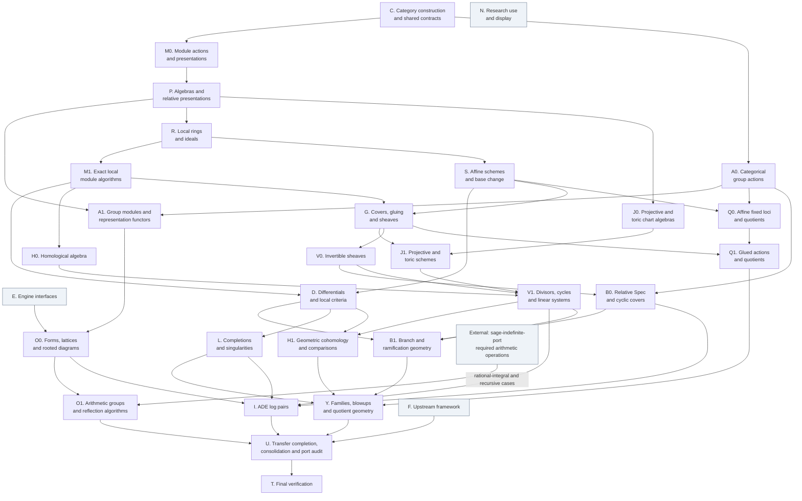

# Preamble TODO

This file owns the work queue for `src/dzack_research/preamble/`, including archive-derived requirements.
Read it before changing the preamble, together with the generated `docs/preamble-megadoc.md`.
The workstreams and their DAG organize execution; detailed requirements, source findings, and work claims follow.
Recorded findings and completion notes retain their original scope; inspect the current owner before using them to select work.

## Contents

- [Execution priorities](#execution-priorities): [DAG](#remaining-workstreams-as-a-dependency-graph), [workstreams](#workstreams), [requirement ownership](#requirement-ownership), [parallel releases](#selecting-parallel-releases), [architecture prerequisite](#architecture-before-dependent-implementation), [verification rule](#testing-is-deferred-until-every-other-item-is-done-always-on), [handoff](#handoff-2026-09-06), [objective](#current-objective-and-order), [framework boundary](#how-much-category-theory-to-implement-here).
- [Remediation queue](#remediation-queue): [scheme and inheritance work](#active-scheme-and-inheritance-work), [collections](#collection-and-finiteness-remediation), [typing](#typing-and-witnesses), [category witnesses](#witnesses-what-an_object-found).
- [Mathematical requirements](#mathematical-requirements): [architecture](#0-owned-category-and-backend-neutral-architecture), [modules](#8-remaining-module-level-algorithms), [commutative algebra](#84-commutative-algebra-foundation-required-by-scheme-theory), [schemes](#9-scheme-and-algebraic-geometry-foundation), [lattices](#3-integral-lattices-elements-reductions-and-arithmetic-groups-semantic-api-contracts), [port audit](#24-port-completion-audit).
- [Organization findings](#organization-findings): [current work](#current-organization-work), [earlier assessment](#earlier-assessment), [finiteness and coordinates](#finitary-and-coordinate-overfitting-audit).
- [Work coordination](#work-coordination): [edit locations](#edit-locations), [schedule](#parallel-schedule), [lock boundaries](#lock-boundaries), [claim and release](#claim-and-release), [active claims](#active-claims), [progress](#overall-progress).

## Execution priorities

Use these priorities to select work from the [remediation queue](#remediation-queue),
[mathematical requirements](#mathematical-requirements), and [organization findings](#organization-findings).

### Current objective and order

Develop a general scheme-theory toolkit built on the preamble's affine-local algebra, modules, and categorical constructions.
This research proceeds while `~/gitclones/sage-categories` develops the replacement category framework.
The preamble must remain usable, organized, and extensible throughout that work.

1. Complete the [construction and inheritance prerequisite](#architecture-before-dependent-implementation) for the foundation used by the next consumer.
2. Build affine-local rings, ideals, modules, algebras, and their constructions through those shared owners and structural functors.
3. Build relative schemes, covers and sheaves, group actions, divisors, cycles, cohomology, and families through those algebraic owners.
4. Continue arithmetic lattice orbits, centralizers, embeddings, and reflection geometry as subsequent research applications.

Steps 1–3 form one dependency-driven work stream. General constructions become available in notebooks before the framework transfer.
An arithmetic calculation moves earlier when that geometry requires its result.
Integrate with `sage-categories` alongside this application order when it supports the complete construction being transferred.
Each work unit completes a reusable mathematical construction, including its maps, inherited operations, and supported algorithms.

### Remaining workstreams as a dependency graph

This DAG and the workstream table own execution order for the full preamble TODO.
The detailed checklists and source assessments below retain their mathematical scope and completion records.

An arrow means that the target consumes a named construction, with its objects and maps, from the source.
It does not require every item in the source workstream to finish first.
Inspect an existing release against the current architecture contract before using it.
Dependencies describe mathematical inputs; file reservations describe which edits can proceed together.

A, M, J, V, H, Q, B, and O have separate release nodes where combining their stages would hide an input or impose a false barrier.
E, F, and N run alongside the mathematical work: engine integration and research use consume the particular released interface they need.
Their table rows state those task-specific inputs.
General geometry has scheduling priority over independent arithmetic applications.



### Workstreams

The letters retain the work-board owners. Numbered nodes are successive releases within one workstream.
For example, M0 and M1 both belong to M; the active Q claim belongs to Q1.
Each row links the detailed requirements that the executor must read.
The output column states the common mathematical acceptance condition for that release.

Scores follow [COMPLEXITY.md](COMPLEXITY.md) and assume the required inputs already satisfy their contracts.
Each reason identifies the responsibility that determines the score for the stated release.
Score a bounded algorithm or adapter separately when its placement and interface are already settled.
Score planning and orchestration separately under the guide, including decisions about shared interfaces and dependency order.
If a task must repair an input contract, include that foundational responsibility in its score before assigning the work.

| Node | Workstream and detailed requirements | Required inputs | Output | Complexity and reason |
| --- | --- | --- | --- | --- |
| **C — Category foundations and construction contracts** | Required defining data; owned category/Hom graphs; constructor and refinement boundaries; sets, cardinals, functors, adjunctions, and common contract discovery. [Architecture repair](#architecture-before-dependent-implementation); [§0](#0-owned-category-and-backend-neutral-architecture); [constructor/refinement](#constructor-and-refinement-repairs); [Priority 3](#priority-3--foundational-owned-category-graph-and-hom-architecture). | Existing architecture proposal and source | A constructed object, element, and nonidentity morphism expose their inherited data and operations through the declared mathematical owners. | **100** — Defines category-wide construction, refinement, Hom, and inherited-data contracts. |
| **E — Engine interfaces and provisioning** | Owned/Sage scalar crossings; Singular and GAP interfaces; persistent Julia/OSCAR/Hecke bridge; optional Macaulay2 and specialized polyhedral interfaces. [Engine obligations](#existing-engine-integration-obligations); [realization boundary](#62-engine-capabilityrealization-boundary). | Selected engine's interface and the consuming owner's data contract | A required engine operation returns owned mathematical results and structural maps through its existing private adapter. Provision only the engine required by a selected construction. | **35** — Integrates established bridges with owned scalar conversions, result objects, and capability dispatch. |
| **F — Framework development** | General structure-functor, monoidal-action, class-construction, and static-projection development in sage-categories; complete-dependency transfers at each mathematical owner. [Framework boundary](#how-much-category-theory-to-implement-here); [transfer contract](#transfer-by-complete-mathematical-dependency). | Upstream specifications | The selected upstream release supports the complete constructor, morphism, functor, and inherited-operation path required by the transferred preamble subsystem. | **100** — Defines the replacement framework's structure functors, class construction, and static projections. |
| **X — External arithmetic port** | Required rational-integral and recursive operations in sage-indefinite-port. [Arithmetic application requirements](#arithmetic-and-reflection-applications-after-the-geometry-prerequisites). | Settled arithmetic specifications and the external project's interfaces | The named external operations are available for O1's rational-integral and recursive constructions. | **40** — Integrates referenced arithmetic operations through the external interface; O1 owns their preamble use. |
| **N — Research use, display, and optional external examples** | Notebook integration of released constructions; 2D/3D polytope and diagram displays; rich representations; useful database examples and classified-polytope probes. [§19](#19-visualization-and-display-helpers-non-blocking); [§20 external examples](#20-archived-framework-specifications-without-complete-source-implementations). | Selected mathematical object's release | A notebook or display consumes the actual released mathematical object. Database and display work starts only when its owning construction exists. | **25** — Uses released objects in bounded notebooks, displays, and reference examples. |
| **M0 — Module actions, framings, and presentations** | Defining action into additive-group endomorphisms; chosen versus existing presentations; free modules, tensor/Hom/biproduct constructions, duality, graded powers, general rank and cardinality. [Module requirements](#8-remaining-module-level-algorithms); [collections](#collection-and-finiteness-remediation); [framing design](#framed-designed-and-not-built). | `C` | Direct-action and presentation constructors produce compatible structure morphisms. The noncommutative regular module and a free-plus-torsion module distinguish the contract. | **90** — Establishes the shared module action and chosen-presentation contracts used by later constructors. |
| **A0 — Group actions in a category** | Generic G-objects, G-sets, equivariant maps, restriction along group morphisms, and transport through functors. [§13.1](#131-group-actions-in-a-category). | `C` | A single action construction returns G-objects and equivariant morphisms in the supplied category. | **90** — Establishes generic action and equivariant-map semantics across supplied categories. |
| **P — Algebra structure and relative presentations** | General multiplication, Lie/associative/unital structure and preserving maps; underlying modules; free/graded algebras; quotients, scalar change, and parameter maps. [Algebra conversion](#the-algebra-node-conversion-designed-and-part-built); [equations and fibers](#equations-affine-maps-and-fibers). | `M0` | The general multiplication route and the associative unital structure-map route share their underlying module contract; relative presentations retain computable base changes. | **90** — Unifies algebra-defining data, preserving morphisms, and specialized constructors. |
| **A1 — Group modules and representation functors** | Group algebras/modules; restriction, induction, coinduction, invariants, coinvariants, and restricted automorphism actions. [§7](#7-representation-theory-of-rg-modules-and-group-lattices); [§8.3](#83-module-automorphism-groupsaction-homsets). | `A0`, `M0`, `P` | Group-module constructions use the existing scalar-change functors and preserve their action morphisms. | **55** — Combines group actions with scalar change and representation functors through established owners. |
| **R — Local rings, ideals, and normalization** | Quotient/localization comparison; prime-local units and ideals; residue maps; total quotient rings, local lengths, normalization, conductors, and local algebraic predicates. [Local algebra](#localizations-stalks-and-exact-modules); [divisor/completion inputs](#divisors-cycles-and-completed-local-geometry). | `P` | The reducible special fiber of xy=t has the required local ring, maximal ideal, residue map, and quotient/localization comparisons. | **60** — Keeps localization, ideals, normalization, and residue maps coherent across local algebra. |
| **J0 — Projective and toric chart algebras** | Graded localization, degree-zero projective charts, character/cocharacter modules, fans, polytopes, cone algebras, and face-localization maps. [Projective charts](#affine-covers-invertible-sheaves-and-cyclic-covers); [§16](#16-toric-schemes-and-varieties). | `P`, `M0` | A projective standard chart and a toric cone chart have their actual coordinate algebras, lattice data, and overlap localization maps. | **45** — Combines existing grading, localization, and lattice constructions into compatible chart algebras. |
| **M1 — Exact modules over local bases** | Localized equality, vanishing, and relation membership; exact maps; fibers, annihilators, Fitting ideals, rank strata, projectivity, and local trivializations. [§8.2](#82-presented-modules-over-more-general-bases); [local module algorithms](#localizations-stalks-and-exact-modules); [local criteria](#differentials-singular-loci-and-flatness). | `M0`, `R` | Localization kills QQ[x]/(x) when x is inverted, through the selected relation algorithm; transported and directly constructed maps use the same exact-module operations. | **55** — Integrates exact algorithms over local bases with relation membership and transported module maps. |
| **S — Affine schemes and base change** | Spec on ring maps; relative equations, successive closed embeddings, opens, stalks, scheme products, pullbacks, slices, and basic family morphisms. [§9.1–9.3](#9-scheme-and-algebraic-geometry-foundation); [§10](#10-categorical-scheme-operations-and-products); [scheme repairs](#active-scheme-and-inheritance-work). | `P`, `R` | The family xy=t, its special fiber, its local rings, and their structural maps are constructed through the common algebraic owners. | **65** — Threads contravariant algebra maps through affine schemes, relative products, stalks, and base change. |
| **O0 — Forms, lattices, finite invariants, and diagrams** | Form/module Hom ownership; lattice elements and subobjects; discriminant modules, odd/even gluing, embeddings, finite isometry data, configuration/polyhedral primitives, and rooted Coxeter diagrams. [§3](#3-integral-lattices-elements-reductions-and-arithmetic-groups-semantic-api-contracts); [§6.1–6.2](#6-coxeter-diagrams-reflection-groups-and-vinberg-theory); [form consolidation](#13-collapse-represented-forms-onto-universal-hom-objects). | `M0`, `A1`, `E` | The selected form, inclusion, discriminant map, or gluing correspondence returns its actual mathematical morphisms; odd bilinear gluing is included. | **85** — Repairs shared form-Hom and subobject ownership before lattice invariants and gluing reuse them. |
| **D — Differentials and geometric local criteria** | Relative differentials, conormal maps, tangent/cotangent objects, differential base change, Fitting loci, smoothness, singular loci, and supported flatness criteria. [Differential requirements](#differentials-singular-loci-and-flatness); [§12](#12-singularities-of-curves-and-schemes). | `M1`, `S` | The differential/Fitting calculation for xy=t determines its supported relative loci and tangent maps with the required hypotheses. | **55** — Combines differential modules and local algebra into geometric criteria with explicit hypotheses. |
| **H0 — Homological algebra** | Resolutions and chain-map lifting; functorial Tor/Ext; exactness; cohomology of supplied complexes; DGA multiplication through the algebra owner. [Resolutions and cohomology](#group-actions-toric-geometry-and-global-cohomology); [semantic API repairs](#priority-5--repair-semantic-apis-before-downstream-numerical-consumers). | `M1` | A nonidentity input map induces the required Tor/Ext or cohomology map through an actual chain map and the owned kernel/image/quotient construction. | **65** — Makes resolutions, chain maps, Tor/Ext, and multiplication agree with existing exact constructions. |
| **G — Covers, gluing, and sheaves** | Covering families, overlap maps, refinements, scheme/morphism gluing, structure sheaves, module/algebra descent, sections, and sheaf operations. [Covering-family design](#covering-families-and-atlases); [§9.4](#94-affine-covers-gluing-and-sheaves); [local-to-global inputs](#affine-covers-invertible-sheaves-and-cyclic-covers). | `S`, `M1` | Local sections and morphisms glue through the actual overlap pullbacks; the construction works for a covering family and its refinement. | **85** — Establishes common covering, refinement, and descent contracts for schemes, morphisms, and sheaves. |
| **Q0 — Affine fixed loci and quotients** | Scheme actions; fixed ideals/equalizers; supported invariant algebras and quotient maps; invariant-map factorization and affine freeness criteria. [§13.3](#133-fixed-subschemes-and-quotients). | `A0`, `S` | An affine action gives its fixed subscheme and quotient morphism, with factorization of a nonconstant invariant map. | **55** — Combines categorical actions, invariant algebras, and affine universal maps. |
| **O1 — Arithmetic groups and hyperbolic reflection** | Arithmetic subgroups, rational-integral cosets and transporters, centralizers, isotropic vectors/flags, indefinite recursion, parabolics, reduction complexes, and Vinberg/chamber algorithms. [§3.4–3.8](#34-orthogonal-and-arithmetic-groups-g--lo-and-subgroup-constructors); [§5](#5-indefinite-recursion-parabolic-induction-and-milestones); [§6.3](#63-hyperbolic-reflection-algorithms); [arithmetic application order](#arithmetic-and-reflection-applications-after-the-geometry-prerequisites). | `O0`, `A1`, `E`; external port for the named arithmetic cases | The selected orbit calculation returns representatives, stabilizers, and transporters under its exact arithmetic group. Rational-integral and recursive cases consume the required sage-indefinite-port operations. | **65** — Integrates referenced arithmetic algorithms with exact group actions, transporters, and recursive cases. |
| **J1 — Projective and toric schemes** | Assembly of projective/toric charts; fan morphisms; polytope polarizations; toric closed subschemes and supported geometric identifications. [§16](#16-toric-schemes-and-varieties); [non-affine products](#10-categorical-scheme-operations-and-products). | `J0`, `G` | Chart data assemble into an owned scheme and a nonidentity scheme morphism with the stated coordinate pullbacks. | **40** — Assembles established chart and gluing constructions into schemes and their maps. |
| **V0 — Invertible sheaves and line-bundle operations** | Rank-one descent, transition units, local trivializations, tensor products, powers, module duality, pullbacks, and section maps. [Line bundles](#112-line-bundlesintersections); [rank-one gluing](#affine-covers-invertible-sheaves-and-cyclic-covers). | `G`, `M1` | A nontrivial transition unit determines an invertible sheaf; its tensor powers and pullback use the same descent construction. | **45** — Specializes established descent and module operations to invertible sheaves. |
| **Q1 — Glued equivariant schemes and quotients** | Equivariant chart transitions, descended overlap maps, glued actions and quotients, descent of automorphisms, and global fixed-point-free criteria. [§13.3](#133-fixed-subschemes-and-quotients); [active Q reservation](#active-claims). | `Q0`, `G` | Compatible affine quotient charts assemble with their descended transitions and the required global quotient map. | **60** — Makes descended quotient transitions and global equivariant maps agree across overlaps. |
| **L — Completions and singularities** | Adic completions, local-base maximal ideals, normalization comparisons, singularity invariants and models, Milnor/Tjurina data, delta invariants, and formal local bases. [§12](#12-singularities-of-curves-and-schemes); [completed local geometry](#divisors-cycles-and-completed-local-geometry). | `R`, `M1`, `D` | A supported singular local polynomial quotient has its completion and structural comparisons; its local invariant is computed from the corresponding algebra. | **60** — Connects completion, normalization, differential data, and supported local invariants. |
| **B0 — Relative Spec and cyclic covers** | Algebra sheaves, relative Spec, cyclic-cover multiplication and local equations, deck actions, and base change. [§13.2](#132-relative-cyclic-covers-and-deck-groups); [relative Spec](#94-affine-covers-gluing-and-sheaves). | `P`, `V0`, `A0` | The algebra associated to a line bundle and branch section glues to the covering scheme, with its map to the base and deck action. | **60** — Combines algebra descent, line-bundle multiplication, group actions, and relative base change. |
| **V1 — Divisors, Picard groups, cycles, and linear systems** | Cartier/Weil/Pic/Cl constructions and comparisons; local multiplicities, intersections, Chow groups, projective bundles, sections, section/Cox rings, jets, and linear systems. [§11.1–11.5](#11-picard-groups-line-bundles-intersections-cohomology-and-sections); [local divisor inputs](#divisors-cycles-and-completed-local-geometry); [archived geometric specifications](#20-archived-framework-specifications-without-complete-source-implementations). | `V0`, `R`, `J1`, `H0` | A supported scheme supplies divisors and their invertible sheaves, comparison maps, and the stated intersection or section-space construction. | **65** — Reconciles divisor, sheaf, cycle, and section constructions through their comparison maps. |
| **B1 — Branch and ramification geometry** | Branch and ramification subschemes, supported smoothness criteria, canonical-bundle formulas, and lifts preserving the branch data. [§13.2](#132-relative-cyclic-covers-and-deck-groups); [relative Spec](#94-affine-covers-gluing-and-sheaves). | `B0`, `D`, `V1` | The covering morphism supplies its supported branch/ramification constructions through the differential and divisor owners. | **50** — Combines released cover, differential, and divisor constructions with the relevant geometric criteria. |
| **H1 — Geometric cohomology and comparison maps** | Geometric complexes, sheaf cohomology, integral topology and cup products, cycle maps, fundamental groups, Hodge data, and higher direct images. [§11.3](#113-cohomologysections); [§11.5–11.6](#115-algebraic-cycles-and-cycle-classes); [geometric complexes](#group-actions-toric-geometry-and-global-cohomology); [§15](#15-families-local-bases-and-higher-direct-images). | `H0`, `G`, `D`, `V1` | A specified geometric construction supplies the complex and comparison map whose cohomology is returned, including the selected coefficients and topology. | **75** — Selects and justifies geometric complexes and comparison maps across cohomology theories and topologies. |
| **I — ADE and toric log-pair applications** | Decorated ADE polygons and polytopes, toric boundaries, branch sections, double covers, deck involutions, log pairs, and source examples. [§17](#17-ade-and-toric-log-pair-geometry). | `J1`, `B0`, `V1`, `L`, `O0` | The selected ADE log pair is constructed from its toric base and branch section through the general cover, divisor, and diagram owners. | **40** — Constructs source-defined ADE examples through released toric, cover, divisor, and diagram operations. |
| **Y — Families, complete intersections, and quotient geometry** | Complete-intersection data and adjunction, del Pezzo geometry, blowups, DVR/formal/analytic families, higher-direct-image applications, monodromy, compatible cover/quotient families, and Enriques examples. [§14](#14-complete-intersections-del-pezzo-geometry-and-blowups); [§15](#15-families-local-bases-and-higher-direct-images); [§13 applications](#13-cyclic-covers-involutions-fixed-loci-and-quotients); [§20 geometric applications](#20-archived-framework-specifications-without-complete-source-implementations). | `S`, `L`, `V1`, `H1`, `B1`, `Q1` | A selected relative geometric construction retains its base morphism, fibers, and comparison maps; each claimed property follows from its supplying local or cohomological operation. | **65** — Combines local, cohomological, cover, and quotient constructions into compatible relative families. |
| **U — Transfer completion, consolidation, and port audit** | Remaining per-subsystem framework transfers; surviving package/export layout; broad collection and Python cleanup; complete archive-port audit; generated preamble documentation and terminology review. [Layout](#filesystem-and-package-organization); [cleanup](#broad-collection-and-python-cleanup); [§24](#24-port-completion-audit); [organization findings](#organization-findings). | `I`, `Y`, `O1`, `F` | Every required mathematical dependency has one surviving owner and all archive requirements have a recorded disposition; the generated documentation describes that source. | **85** — Settles surviving ownership and package boundaries across framework transfers and the archive audit. |
| **T — Final verification** | The final permitted execution phase, including the valid archived mathematical assertions and public construction examples. [Verification policy](#testing-is-deferred-until-every-other-item-is-done-always-on); [§24 examples](#24-port-completion-audit). | `U` | Execute the repository's prescribed mathematical verification after the required work is complete; repair failures at the owning construction. | **15** — Interprets prescribed mathematical assertions; each resulting repair takes its owning construction's score. |

### Requirement ownership

The workstream rows select mathematical owners rather than create a second checklist.
Use this map for source sections that contain work for several owners.
Record completion on the existing detailed item and its construction's release.

| Detailed source | Workstream assignment |
| --- | --- |
| [Architecture prerequisite](#architecture-before-dependent-implementation) | C owns shared construction and contracts; M0 owns module actions and chosen data; P owns multiplication; A0 owns generic actions; F supplies the replacement framework. |
| [Recorded priorities 0.5–6](#recorded-consolidation-work) | C: Hom identity, categories, sets/cardinals, abstract families, functors, adjunctions, symbolic-function ownership, and import/declaration boundaries. M0: module ranks, free framings, tensor/biproduct/internal-Hom construction. O0: form Hom and embeddings. P: graded power-algebra reuse. M1: annihilators, fibers, saturation, and local exactness. H0: resolutions and cohomology. A: invariants and action preservation. E: scalar/engine crossings. U: final layout and cleanup. Recorded completion notes keep their original scope. |
| [Active scheme and inheritance work](#active-scheme-and-inheritance-work) | R: local units and ideals. M1: localized equality and vanishing. P: relative/iterated quotients and underlying algebra modules. C: shared initialization. G: sheaves and gluing. The later geometric outcomes belong to J, V, H, B, Q, L, and Y. |
| [Collection/finiteness](#collection-and-finiteness-remediation) and [finitary overfitting](#finitary-and-coordinate-overfitting-audit) | C supplies sets/families; M0 supplies framings and multilinear constructions. A owns group/action collections, O owns lattice/Coxeter collections, J owns fan/polytope collections. Each mathematical stream fixes its active collections; U owns the remaining broad sweep. |
| [Typing and witnesses](#typing-and-witnesses), [witness findings](#witnesses-what-an_object-found) | C owns category parameters, generated class contracts, joins, and generic Hom/diagram constructors. M0/P own module/algebra state and grading. S/G/J own the named scheme objects and products. O0 owns formed-module placement. Types and examples for a specialized construction remain with that construction. |
| [§8.4 equations](#equations-affine-maps-and-fibers) and [localizations](#localizations-stalks-and-exact-modules) | P owns relative algebra presentations and scalar maps; R owns local rings/ideals; M1 owns local module algorithms; S owns the resulting geometric maps and fibers. |
| [§8.4 differentials](#differentials-singular-loci-and-flatness) | M1 owns annihilators, Fitting ideals, rank and local trivializations; D owns differential constructions and the geometric criteria that consume those results. |
| [§8.4 covers](#affine-covers-invertible-sheaves-and-cyclic-covers) | G owns restriction/gluing, J0 chart algebras, V0 invertible sheaves, P multiplication, and B relative Spec/covers. |
| [§8.4 divisors/completions](#divisors-cycles-and-completed-local-geometry) | R owns total quotient rings, normalization, conductors, and local lengths; V1 owns divisor/Picard comparisons; L owns completion and formal local bases. |
| [§8.4 actions/toric/cohomology](#group-actions-toric-geometry-and-global-cohomology) | A owns actions, Q invariant-algebra quotients, J toric constructions, H0 resolutions, and H1 geometric complexes and comparison maps. E owns the [engine obligations](#existing-engine-integration-obligations). |
| [§§9–10](#9-scheme-and-algebraic-geometry-foundation) | S owns affine schemes, subobjects, products, and base change; G extends these through gluing and supplies sheaf operations; J supplies projective/toric charts and schemes; D/L supply smoothness, normality, and singularity inputs; B owns relative Spec. |
| [§11](#11-picard-groups-line-bundles-intersections-cohomology-and-sections) | V0 owns invertible-sheaf construction; V1 owns divisors, cycle groups, intersections, sections, and linear systems; H0 supplies local Tor/Ext; H1 owns higher/geometric cohomology, cycle-class maps, topology, and Hodge comparisons. |
| [§13](#13-cyclic-covers-involutions-fixed-loci-and-quotients) and [§7](#7-representation-theory-of-rg-modules-and-group-lattices) | A owns the action/representation construction; Q owns fixed loci and quotients; B owns cyclic covers and deck actions; V1/H1 supply section/cohomology actions; Y owns the combined K3/Enriques and relative-family applications. |
| [§§12, 14, 15](#12-singularities-of-curves-and-schemes) | S supplies basic family morphisms and fibers; D local criteria; L singularities and formal bases; V1 canonical/divisor constructions; H1 higher direct images and topological comparisons; Y their complete-intersection, blowup, family, and monodromy applications. |
| [§3](#3-integral-lattices-elements-reductions-and-arithmetic-groups-semantic-api-contracts), [§5](#5-indefinite-recursion-parabolic-induction-and-milestones), and [§6](#6-coxeter-diagrams-reflection-groups-and-vinberg-theory) | O0 owns form/lattice and finite discriminant/gluing data, embeddings, finite configurations, polyhedral primitives, and rooted diagrams. O1 owns arithmetic subgroups, cosets, centralizers, isotropic flags, reduction/recursion, and hyperbolic reflection algorithms. M0/A/E supply shared module/action/engine operations. |
| [§16](#16-toric-schemes-and-varieties) and [§17](#17-ade-and-toric-log-pair-geometry) | J0/J1 own toric construction; V1/H1 own its divisor/cohomology outputs; I owns the ADE/log-pair application through B's cover and O0's diagram constructions. |
| [§20](#20-archived-framework-specifications-without-complete-source-implementations) | B: relative Spec. V1: section spaces, jets, Bertini, and divisor/eigensection comparisons. A/Q: linearizations and fixed-point evaluation. H1: Lefschetz comparisons. L/I: singular orbits and ADE parity cases. Y: complete-intersection and compatibility applications. G/Q/L retain their own gluing, quotient, and local-global comparison maps. N: useful database/classification examples. E/U: late polyhedral adapter consolidation. |
| [Organization findings](#organization-findings) | Apply each finding at the corresponding C/M/P/A/R/S/G/J/V/H/O owner; F supplies transfer support and U finishes surviving layout. [Earlier assessment](#earlier-assessment) is source evidence for those owners, not an additional execution sequence. |
| [§19](#19-visualization-and-display-helpers-non-blocking) and [§24](#24-port-completion-audit) | N owns optional display/research examples. U owns archive coverage and source consolidation. T owns execution of the required mathematical assertions under the standing verification policy. |

### Selecting parallel releases

Use the [task complexity guide](COMPLEXITY.md) to assign reasoning capability after identifying the required release and its contracts.

Start shared architecture work in C.
Engine provisioning/adapters in E and upstream framework development in F can proceed on their own declared interfaces.
N can consume an existing mathematical release when the current notebook policy permits it.

After C's relevant construction contract, M0 and A0 can proceed independently.
P follows M0; A1, R, and J0 then consume the particular module/algebra constructions they need.
S uses relative presentations and local-ring maps; M1 develops exact local-module algorithms alongside S.
D, H0, and G consume those released maps according to the DAG.

J1 assembles charts through G.
V0 supplies line bundles to B0 before divisor groups, intersection theory, or higher cohomology are required.
B1 adds differential/divisor criteria to the cover.
Q0's affine quotients precede Q1's gluing.
V1, L, and H1 supply the independent inputs consumed by Y and I.

O0 uses existing module, action, and engine releases; arithmetic work remains lower priority than the general geometry.
Only the O1 cases named in its row require the external arithmetic port.
An external dependency on O1 does not hold up O0, I, or the geometry streams.

Transfer a complete subsystem as soon as F supplies that subsystem's required public interface.
Its mathematical workstream owns the consumer conversion; U collects the remaining transfers and final consolidation.
U is complete after all required content terminals and transfer obligations are complete.
Each mathematical release includes its required public-session and notebook construction examples.
N's additional research use and optional display/database work do not delay the mathematical programme.
T remains the final execution phase under the existing verification rule.

Use [edit locations](#edit-locations) and [lock boundaries](#lock-boundaries) to choose concurrent writers.
Shared dependencies permit parallel work only when the actual edit paths and changing interfaces are compatible.

### Architecture before dependent implementation

The [construction and inheritance proposal](references/preamble-architecture.md) records the current source assessment and proposed mathematical design.
This section owns its implementation work.
Agree on the design before changing the shared architecture.
Prioritize the affected construction owners before expanding or polishing their dependent APIs.
Existing mathematical requirements retain their scope; the dependencies below determine when to implement them.

- [ ] Align the shared module, algebra, and chosen-presentation interfaces with `sage-categories`.
  Use the [existing general-algebra decision and unfinished conversion](#the-algebra-node-conversion-designed-and-part-built).
  Reconcile the sibling algebra specification with that node and its associative/unital and Lie subcategories.
  Settle the morphisms of selected presentations and the uniform defining-data contract.
  Use the existing module-object specification for the internal action parameters and the enriched endomorphism presentation.
  Keep generic monoidal, functor, class-construction, and static-projection machinery at the [framework owner](#how-much-category-theory-to-implement-here).

- [ ] Establish required defining data through the common construction path.
  Coordinate `owned_category.py`, `refine.py`, ordinary parents, engine adoption, and `CategoricalHomset` initialization.
  Each category constructs its own data and fulfills the corresponding accessors before returning an object.
  Property refinement retains that data.
  **First mathematical specimen:** the left regular module over `M_2(Q)`, its action into additive-group endomorphisms, and an inherited scalar operation.
  The defining action sends `E_12` to an additive endomorphism that is not `R`-linear.

- [ ] Thread all module constructors through the defining action.
  Start with general actions, free modules, selected finite presentations, restriction of scalars, localizations, and underlying algebra modules.
  Each route exposes the same module-owned structure morphism and uses it for scalar evaluation.
  Construct `Z/6Z` from a presentation and from its action, with an explicit intertwining isomorphism.
  Include a free-plus-torsion module and a module with infinite indexing data.
  Derived actions use the existing scalar-change and quotient functors on objects and morphisms.

- [ ] Construct algebra objects through the general multiplication owner and its underlying module.
  The multiplication route accepts its defining morphism at the stated generality.
  Finite tables and unit-recovery algorithms are specialized constructors.
  Thread associative unital central structure maps through this same construction.
  Place Lie identities over the general multiplication category and give the commutator functor its changed multiplication.
  Derive Hom conditions from preservation of the specified operations, including units where present.
  Give Lie cokernels their ideal-quotient construction; the Cartan inclusion in `sl_2(Q)` distinguishes it from a module quotient.

- [ ] Make the generic group-action constructor produce the action datum in its supplied category.
  Reuse the functor `BG -> C` and natural-transformation definitions.
  Finite G-sets and affine G-schemes construct that datum at their own owners.
  Move scheme-specific construction out of `GObjects._call_` and group-algebra specialization out of the generic module constructor.

- [ ] Require chosen framings and presentations at their construction owners.
  Keep finite-generation and finite-presentation properties separate from selected data.
  Preserve chosen presentation arrows and the transport maps produced by normalization.
  Invariant factors classify underlying PID modules; adding a contractible free summand distinguishes selected presentations with the same cokernel.

- [ ] Attach discoverable contracts to the surviving owners.
  Use required constructor inputs for defining data, abstract operations where needed, and Sage's inherited contract discovery.
  State public constructor and morphism types at those owners.
  Add focused Import Linter boundaries for the generic-to-specialized dependencies identified in the proposal.
  Write mathematical examples for alternate constructor routes, nonidentity functor images, and category-specific universal maps; record them as unverified.
  Apply the [verification rule](#testing-is-deferred-until-every-other-item-is-done-always-on) below.

Module and algebra repairs precede dependent ideal, tensor, scalar-change, local-ring, and scheme API expansion.
Inspect the immediate construction dependency before resuming each existing work item.
Broad annotation, package-layout, export, and leaf-method consolidation follow the interfaces that survive these repairs.
Independent mathematical algorithms can proceed when they use an established interface and add no competing construction owner.

### Testing is deferred until every other item is done (always-on)

**Run no tests, no QC gates, no Sage and no notebooks against preamble work while
any item in these queues remains open.** Verification is the last phase of the
whole programme, not a step inside a work unit. There is exactly one verification
pass, and it happens after the architecture is complete.

This is not a preference about speed. The architecture is still moving: a category
changes owner, a functor gains its morphism half, an operation moves to the level
that actually defines it. A suite run against a half-built architecture measures a
shape nobody intends to keep. Its failures are noise, its passes are worse than
noise, and acting on either drags the design toward whatever happened to be green
that hour. Red is the expected state of these trees until the last unit lands.

So the unit of work is the construction plus the test that would falsify it,
written and committed **unverified**. Write the test. Do not run it. Say
"unverified" wherever a test is named in a report or a commit message.

Two narrow exceptions, and nothing else:

- Checking that a merged tree still imports, which is one short process and tells
  you whether the session exists at all.
- Provisioning a tool a row requires, such as instantiating a Julia project or
  confirming an executable is on `PATH`.

Neither of those is verification, and neither licenses a suite. A green run is not
evidence while the architecture is incomplete, so do not seek one, do not report
one, and do not let one decide a design question.

### Handoff, 2026-09-06

Read this before selecting work. It is the state a session ended in, not a
summary of what was done; git history owns that.

#### One live defect, and it is in the headline operation

The discriminant group of a lattice builds or does not depending on what the
session constructed first. In a fresh session
`Lattices(ZZ)("A2").discriminant_group()` answers; after these four lines it
raises `TypeError: Cannot create a consistent method resolution order`:

```python
X = AffineSpace(2, QQ)
X.distinguished_open(X.coordinate_ring().algebra_generators()[0])
gl2 = Modules(ZZ).End(FreeModule(ZZ, 2))
MatrixAlgebras(ZZ).Mor(gl2, gl2)
Lattices(ZZ)("E8").module_rank()
```

**Cause.** Sage sorts its C3 merge on `_cmp_key`, whose second half is a global
counter assigned at first access. Sage's own graph is created during import, so
that order is fixed every run; the owned graph is created lazily as a session
reaches into it, so two sibling categories can linearize their shared
supercategories in opposite orders and a category above both cannot be built.

**Mitigation in place, and its limit.** `all.py` realizes owned categories at
import in name order, which fixes the tie-breaks for what it reaches. It
reaches only subclasses of `OwnedCategoryOverBaseRing` **bound in the session
surface**, over `ZZ` alone — so the Hom, End and Aut categories, the axiom
categories, joins, anything unexported, and every category over any other ring
still take their order from the session. That is why the four lines above still
fail.

**The fix exists and is unmerged: `cdf80a75` on `work/discgroup`.** It replaces
the counter with the declared depth and the qualified class name, and deletes
the realization loop. Coverage is then a property of the key rather than of a
sweep, so the Hom, End, Aut, axiom and unexported categories over every ring are
included without being enumerated. Its author verified 89 categories: none
lacking the graph key, no containment violating it, six of seven construction
orders clean.

**It has not been verified against the scheme layer by anyone but its author,
and that is exactly how the previous attempt broke `main`.** An earlier version
of the same key was merged and reverted for breaking `distinguished_open`
outright. Verify against `AffineSpace(2, QQ).distinguished_open(...)` and the
four lines above, in several orders, before merging.

**Why the earlier version broke, since the reason was misdiagnosed twice.** Not
a scale mismatch between an owned depth and Sage's counter — that is real but
there are no containments crossing the boundary, so there is nothing for it to
violate. The cause was four preamble categories declared on Sage's bare
`Category` rather than the owned base: `SubobjectCategory`, `RootLattices`,
`RingedSpaces` and `LocallyRingedSpaces`. Those kept counters in the hundreds
while their own subcategories took depths under twenty, so containment inverted
on those edges. `cdf80a75` gives all four the owned mixin.

**Two facts about the mechanism worth keeping.**
`_super_categories_for_classes` is handed to `dynamic_class` as the literal base
list, so Python's C3 requires a linear extension of every base's own MRO — which
constrains incomparable pairs, and is stronger than the two properties Sage
documents at `c3_controlled.pyx:395-403`. And an offset above Sage's counter is
not available in any case: the counter is global, unbounded and monotonic, so
there is no ceiling to sit above.

**The seventh construction order fails for an unrelated reason, live on `main`
— see below.**

#### A second live defect: recursion in the subobject Hom

`overlattice_from_isotropic_subobject` raises `RecursionError` in every
construction order, through

    HomCategory.Of -> SubobjectCategory.__contains__ -> inclusion()
      -> module_homset -> Mor -> Of

so Nikulin gluing is blocked on `main` right now. The cycle arrived with the Hom
packet-walk commits `e682549d`, `bc58132f` and `f84b9115`, after the overlattice
fix had merged and been verified — which is why the gluing specimen in
`c6e8e60b`'s history was true when written and is not reproducible today.

The shape is a containment test that constructs the thing whose construction
asks the containment test. Whoever takes it should decide what
`SubobjectCategory.__contains__` is entitled to do: asking an object for its
inclusion in order to decide membership is what closes the loop.

#### The algebra node conversion, designed and part-built

Ruled by the owner: `Algebras(R)` is the node — an algebra, however it
multiplies — with `Associative`, `Unital`, `Commutative` and `Lie` as axioms on
it reached by `with_axiom`, and `WithChosenMultiplication` as the data
refinement holding the multiplication morphism and the machinery that consumes
it. The present `Algebras(R)`, meaning unital associative, becomes
`Algebras(R).Associative().Unital()`, and the ring facts attach there, since a
non-unital non-associative algebra is not a ring. A Lie algebra is an algebra
whose multiplication satisfies alternating and Jacobi; its morphisms are algebra
morphisms, so `LieAlgebraMorphism` and `AssociativeAlgebraMorphism` both
disappear into the node's contract.

Executable order, established by attempt: the axiom Hom packet, then the node,
then `Lie`, then the morphism classes. The first has landed. The second is
written and red on branch `work/algnode`, with two failures standing:
`Algebras(R).Associative()` inherits three incompatible Homs and must declare
its own, and `CommutativeAlgebras(R)` composes to a `JoinCategory`, which is not
an axiom category and so carries no packet at all. The sweep is 11 edits rather
than the 46 call sites, because the composite is contained in the node and
membership sites keep passing.

`center` splits three ways: the submodule at the node, a subalgebra at
`.Associative()` since closure under multiplication needs associativity, a ring
only at `.Associative().Unital()`.

#### `Framed`, designed and not built

`Framed` is one axiom, registered once and stated at `Sets()`, whose ancestor
`Sets().Framed()` owns the **data model** and nothing else: the datum is a
morphism $F \to X$, or a complex $F_2 \to F_1 \to X$ for a presentation, plus
private helpers. It owns no notion of generator, because a set framing is a
chosen surjection and generates nothing. Each descendant introduces its own
vocabulary — `Groups().Framed()` gives `group_generators`, `Modules(R).Framed()`
gives `module_generators`, `Algebras(R).Framed()` gives `algebra_generators` —
and those names stay.

`Framed` is **structure**: the category of framed modules is the category of
pairs, so two framings of one module are two objects. `FinitelyGenerated` is a
**property** and owns no accessor at all; something can be finitely generated
with nothing to hand you. They are not one notion at two strengths. Sage's
`WithBasis` is the precedent for axiom syntax over a comma category, and
`FinitelyGeneratedAsMagma` is the precedent for disambiguating such an axiom by
structure in its own name.

The algebra-under-module relation is a **functor, not an inclusion**: a framed
algebra is $(A, F_{\mathrm{alg}}(S) \twoheadrightarrow A)$ and the induced
object is $(A, F_{\mathrm{mod}}(\mathrm{Words}\,S) \twoheadrightarrow A)$, the
same $A$ with a different second component, so they are different objects of
different comma categories. `FinitelyGeneratedModules`,
`FinitelyGeneratedFreeModules` and `FinitelyPresentedAlgebras` are ordinary
categories that supply accessors, which is the property/structure conflation in
code; leave them until `Framed` exists.

#### Smaller findings, each stated where it was found

- `MatrixSpaces(R)` declares $\operatorname{Hom}_R(F,G)$ a finitely generated
  free $R$-module on both the commutative and the noncommutative branch. Over
  noncommutative $R$ it is a module over the centre. Live specimen: $\operatorname{End}$
  of a free module over $M_2(\mathbb{Q})$.
- A category join can lose its base ring, which is why the orthogonal sum reads
  the ring off its summands.
- `DirectSumDecomposition` verifies a two-summand decomposition and trusts a
  three-summand one; a check gated on arity is incoherent either way.
- `Spec(A)` and `A.spectrum()` are the affine scheme and its underlying ordered
  set of primes. They are correctly distinct; the TODO row calling them two
  names for one notion is wrong.
- `OpenSubschemes` in TODO names the archived preamble's spelling; the live
  category is `OpenImmersions`.
- `validate_two_elementary_table` is worse than linear. The first ten rows cost
  0.5s each, predicting forty seconds for all seventy-five; it ran past thirteen
  minutes without finishing, twice. Sixty-five of the seventy-five rows are
  therefore **unchecked against their invariants**, and no Nikulin recipe has had
  its flat sum compared against its nested one. Do not assume that run is cheap.
  The cost is in the discriminant computation rather than in the sum.

#### Branches left standing

| Branch | Head | What it is |
| --- | --- | --- |
| `work/discgroup` | `cdf80a75` | the graph comparison key, all four preamble holes closed, realization loop deleted. Unmerged, unverified against schemes by anyone but its author |
| `work/algnode` | `57465081` | the algebra node split, written and red on the two failures above. Keep it — roughly 170 lines of correct and tedious partition that should not be retyped |
| `work/packetfilter` | `f84b9115` | merged |
| `work/algaxiom` | `9c63403b` | abandoned: the associativity check written under a superseded framing. Delete |

#### Covering families and atlases

The covering-family construction applies to locally ringed spaces and includes classical atlases.
For smooth manifolds its maps are local diffeomorphisms; for topological manifolds they are local homeomorphisms.
Include the corresponding construction for $C^k$ manifolds.

So a cover is a covering family $\{X_i \to X\}$ whose coproduct maps onto $X$
by a cover. The classical atlas is the special case, not the general notion,
and the question the node used to pose — whether an atlas replaces the
distinguished affine cover or the affine cover adapts into an atlas — does not
arise: both are covering families differing in which maps they use.

**The scheme half has landed.** `glue_affine_atlas` takes arbitrary affine
charts, each pairwise overlap an object of `OpenImmersions(chart_i)`, verifies
the transitions invertible, transports triple overlaps and enforces the ordered
cocycle. The punctured plane demonstrates it: `overlap(0,1)` sits in chart 0
and `overlap(1,0)` in chart 1, and they are different objects. A glued scheme
has no `coordinate_algebra`, so it can never be handed to
`DistinguishedAffineCover`, which is affine-only by construction — it asks the
scheme for a coordinate algebra, forms an ideal from the elements and demands
the unit ideal.

**The sheaf half has not.** `ModuleGluingDatum` restricts both sides of a
transition to `cover.intersection(i, j)`, one shared ring, so a module
transition is an isomorphism over a single ring — which a covering family has
no notion of. `cover().intersection(...)` appears at eight sites in
`gluing.py`, and `InvertibleSheaf` inherits the assumption twice more, in
`trivial()` and in the transition-unit indexing. On a covering family the
transition must become $M_i|_{U_{ij}} \to \varphi_{ij}^*(M_j|_{U_{ji}})$, base
changing $M_j$ along the scheme transition's pullback.

**The ingredients are present.** `cover.restrict_module` already base changes
along a ring map, and the scheme-level analogue of the whole manoeuvre is in
`_FiniteSchemeGluingDatum`, which transports transitions to triple domains and
checks the cocycle there. This is a change of shape in the descent datum, not a
missing construction, and it is the only thing between here and F, G, H and I.

Relative size is calibrated against observed cadence rather than guessed: one
operation with its test has been running five to fifteen minutes on one agent,
one port section thirty to forty, and a wave of eight sections about forty
minutes of wall clock plus an hour of review and merging. The figures are for
comparing nodes against each other, and they are not commitments. Node M is the
only one that cannot be estimated, because everything above it is construction
and it alone is discovery.

Reading the graph:

- **A is small and gates the most.** It is the only thing standing between the
  present state and F, G, H and I, which together are the bulk of what remains.
- **K is the largest single body of work and the most parallel**, being mechanical
  and file-local, but it touches everything, so it runs last among ready nodes to
  avoid colliding with the geometry.
- **B, C, D and E are ready now** and touch files the geometry work does not, so
  they are what moves while A is undecided.
- **M is terminal by rule**, not by convenience. See the always-on section above.

### How much category theory to implement here

The preamble's category layer supplies the reuse needed by its mathematical algorithms.
`sage-categories` develops the more general replacement: declared structure functors, property subcategories, and functor-driven class and constructor inheritance.
Its intended scope and current public behavior are separate facts.
Consult its `specs/system.md`, `specs/leaves.md`, `specs/functor.md`, and `specs/leaf-scaffolding.md` at each relevant transfer boundary.

Classify the responsibility being changed, rather than the directory containing it:

| Responsibility | Work here before transfer | What the later leaf retains |
| --- | --- | --- |
| Mathematical ownership | Put each operation at the category where it is defined; consolidate repeated algorithms there. | Domains, codomains, hypotheses, algorithms, and their mathematical owner. |
| Underlying structures | Define the needed forgetful functor on objects and morphisms; make its image usable by inherited operations. | The functor, its actions, and the structure data. |
| Constructor threading | Repair the existing common construction path when dependent categories cannot initialize their inherited state. | The defining data at each level; framework-specific class assembly is replaced. |
| Universal constructions | Complete the product, tensor, quotient, kernel, or other construction needed by a real consumer, with its maps. | The domain-specific realization and universal data, using the framework's generic construction after transfer. |
| Property placement | Distinguish a property of an existing object from additional chosen structure. Place each at its mathematical owner. | The property or structure declaration and justified functor properties. |
| General framework machinery | Develop general functor classification, compiler, inheritance, and static-projection machinery in `sage-categories`. | The preamble consumes the resulting framework. |

#### Repairs that earn their cost now

For a proposed shared repair, name the failing construction, the state or algorithm it needs, and the owner that supplies it.
Then trace the dependent constructor and at least one inherited operation through that owner.
A repair is useful when it completes that path and removes the reason for downstream implementations to repeat it.
The repair can span several files: its scope is the shared responsibility and affected consumers.

For example, an algebra built on a represented module must use that module's additive operations, presentation, and linear-map algorithms.
The algebra contributes multiplication, unit, and the conditions on algebra morphisms.
`categories/algebras/algebras.py` and `categories/functors/algebra_modules.py` are the current owners to inspect together.
An available method name alone is insufficient if it reads uninitialized state or uses the wrong underlying module.

Retain mathematical distinctions during reuse.
Forgetting an algebra morphism gives a module morphism, while the algebra Hom still imposes its own preservation conditions.
A forgetful functor does not imply full categorical inclusion, and a supercategory edge alone does not specify its action.
Record only functor properties justified for that functor; the new framework's general interpretation belongs upstream.
In particular, distinguish property-subcategory inclusions from functors forgetting selected structure, and state (op)fibration hypotheses where used.

#### Implementation limitations to contain

Use `owned_category.py`, `refine.py`, and the existing functor implementation as the common runtime boundaries.
An explicit application of an underlying-structure functor can provide correct reuse while automatic inheritance remains incomplete.
Keep any required initialization or representation adaptation at that common boundary or the functor's owning implementation.
Public objects, morphisms, and results still have their stated mathematical meaning.

Accept manual declarations or explicit forwarding through the correct functor when they avoid copying an algorithm.
Existing centralized class-construction machinery can remain until the replacement supports the same consumer.
Its removal should leave the mathematical algorithm and defining data intact.
If an adaptation needs a separate copy in each leaf, repair the common owner instead.
If that repair becomes a new general compiler or functor calculus, develop it in `sage-categories` and retain explicit reuse here.

The stopping point for local Cat work is a coherent consumer with one owner for each operation and initialized inherited state.
Universal automation across unused categories can follow the replacement framework.
Implementation awkwardness at one isolated boundary is acceptable; incorrect mathematics or repeated domain algorithms require repair.
Replacement of a runtime repair later does not by itself make that repair wasted work.
It earns its place when it keeps current categories reusable and enables the needed mathematical construction before transfer.

#### Transfer by complete mathematical dependency

Before replacing a preamble subsystem, establish the required public constructors, underlying-structure functors, and morphism actions in `sage-categories`.
Include an inherited operation and the domain-specific algorithm needed by its mathematical consumer.
The presence of a similarly named category or a production specification alone does not establish readiness.

Rewrite the subsystem's categories as leaves using the declared functors and constructor protocol.
Preserve its mathematics, exact engine algorithms, and notebook constructions.
Replace the preamble runtime responsibilities covered by that transfer in the same unit.
Transfer related dependency chains together where mixed object systems would require duplicate mathematical owners.
Broad annotation, collection, and package-layout sweeps follow the surviving interfaces; annotate and consolidate each active construction as it changes.

Before editing `src/dzack_research/preamble/**`, follow `AGENTS.md`: read this TODO and the generated `docs/preamble-megadoc.md`; regenerate the megadoc first when it is stale relative to the live tree.
Preserve the dirty authoritative tree and unrelated work throughout.

### Selecting the next construction

Before a structural edit in a subsystem:

1. Identify the mathematical owner that should survive.

2. Check [organization findings](#organization-findings) for a known duplicate/obsolete implementation.

3. Check [mathematical requirements](#mathematical-requirements) for a more foundational construction that the subsystem is expected to use later.

4. If two implementations express the same mathematics, consolidate them before improving either one's internals.

5. Do not split files or reorganize packages until ownership and dependencies have stabilized enough that the split reflects mathematics rather than current implementation accidents.

Use the existing collection implementations in each active construction.
Consolidate representations when this restores mathematical reuse or completes a shared mathematical construction.

Judge progress by `CONTRIBUTING.md` `DEV-36`.  The goal is source a mathematician can read against a definition; every count is a weak proxy for that.
A measure is usable only as a differential signal beside its upstream Sage comparator, and only when it makes someone open a file and read it.
Sage itself would fail several measures that look like defects here — its category package runs 154 of 229 modules in one dependency cycle — so an uncalibrated number is not evidence.

### Recorded consolidation work

The following record preserves the earlier work units and their reported completion notes.
Use the current objective above to select work; check a recorded claim against its live owner when the next construction depends on it.

<details>
<summary>Earlier priorities 0.5–6.2 and completion notes</summary>

### Priority 0.5 — Standing repairs, before the phase order resumes

These are open defects in code that has already landed, plus two mathematical
questions that must be answered before more code assumes an answer.
They run ahead of Priorities 1–10 because each one makes the work below it
unsound: a broken session import blocks every specimen, a sampled invariant
proves nothing about the objects it does not name, and a duplicated Hom object
is the defect the Mor conversion exists to remove.

Order within this phase is 0.5.1, then 0.5.2, then 0.5.3, then 0.5.4.
0.5.5 is answered before anything touches the code it governs, and 0.5.6 gates
all of it.

#### 0.5.1 Four Hom objects claim to be the ambient Mor

`ConnectionSpace` and `ConnectionHomset` (`categories/modules/connections.py`),
`DerivationSpace` and `GradedDerivationSpace`
(`categories/algebras/derivations.py`), and `AbsoluteGaloisGroup`
(`categories/group/profinite/absolute_galois_group.py`) left `OwnedHomset` by
declaring `HomCategoryConstruction(<ambient category>)` and passing their own
endpoints.

`Modules(R).Mor(E, E ⊗ Ω)` and `OwnedFields().Mor(K̄, K̄)` already exist and are
reached through `HomCategory().Of(...)`.
So each of these is a second object for one category and one pair of endpoints
— the split `tests/categories/test_mor_is_one_category.py` was written to
forbid, and the same defect the formed-module Homsets had.
`ConnectionSpace` and `DerivationSpace` show it in their own bodies: each
stores an `_ambient_hom` built from `Modules(base).Mor(...)` beside the
`CategoricalHomset` it declares itself to be.

None of them is a Hom object in its own right.
Each is a subcategory of its ambient Mor carved by a predicate — Leibniz for
derivations and connections, fixing the structure map for the absolute Galois
group — which is the shape `Monos`, `Epis`, `Isos` and `Auts` already have.
`FixedRestrictedHomCategory` and the `Mono`/`Epi`/`Iso`/`Aut` constructions
express it; construct these through that machinery rather than declaring a new
Hom.
This is the mathematical half of Priority 3 step 10, left undone when the
mechanical half landed.

**Status: complete.**

#### 0.5.2 Make the `Mor` invariant exhaustive rather than sampled

`tests/categories/test_mor_is_one_category.py` asserts that `A.Mor(B)` is one
interned category on seven hand-picked specimens: a finite ordinal, `ZZ`, a
free module, `U`, a discriminant form, an affine plane, a polynomial algebra.
"Every owned object" is unverified, and cannot be verified by adding specimens
one at a time.

The instrument that would make it exhaustive is the constructor-obligations
sweep, which does not exist in the live tree:
`test_constructors_meet_their_obligations.sage` is in
`archives/preamble/tests/` only.
`AGENTS.md` states as standing policy that every new constructor adds a row to
its `_constructions()` table, so that policy is currently unmeetable.

Restore the sweep on the live tree first.
Then the `Mor` invariant is checked over construction paths instead of seven
objects, and one table carries both audits.

**Status: complete.**

#### 0.5.3 One cardinal sweep for `rank` and `cardinality`

"A rank is a cardinal" and "cardinality is total on `Sets`, valued in
cardinals" are one statement, and it is applied in one place.

`rank` is a cardinal in `categories/modules/framed/framed_free_modules.py`.
Elsewhere it is not:

- `categories/modules/framed/finitely_generated/finitely_presented_modules.py`
  returns `sum(1 for ...)`, a Python `int`;

- `categories/isotropic_orbits.py` returns `lattice().base_ring()(len(...))`,
  an owned ring element counted with `len`;

- `categories/rings/number_fields.py` returns an owned `ZZ` element;

- `categories/lattices.py` returns whatever the module it stores returns.

`categories/modules/pure/modules.py` `rank()` is the rank of a matrix
morphism.  That is a different notion and stays where it is; give it a name
that says so.

`cardinality` has 35 implementations.  `FiniteOrdinalSet.cardinality()`
(`categories/sets/set_categories.py`) returns the stored Python size, and
`_FormalSymbols.cardinality()` (`categories/_lattice.py`) returns Sage's
`Infinity`.  Call sites were normalized with `cardinal(...)` while passing
through; the sources were not.  Repair the sources and delete the call-site
normalization.

Two more members of the same sweep:

- `categories/rings/number_fields.py` `signature()` returns a bare pair
  \((r_1, r_2)\) — the defect `signature_pair` already removed elsewhere.

- `tensors/tensor.py` `tensor_order()` returns `len(...)` as a Python `int`,
  where the number of index slots is a cardinal.  `upper_ranks` and
  `lower_ranks` are still public names returning tuples; they were documented
  as private plumbing and not renamed.

**Status: complete.**

#### 0.5.4 One owned crossing for numerals entering Sage constructors

`_engine_scalar` (`categories/rings/number_fields.py`), `_engine_dimension`
(`categories/schemes/schemes.py`) and `_states_a_rank`
(`categories/modules/framed/framed_free_modules.py`) are three near-identical
helpers, each written at the point where the defect was met.

They are one operation: an owned numeral crossing into a private Sage
constructor that cannot read it.  The operation has no owned home, which is
why it has three implementations.  `_states_a_rank`'s
`isinstance(labels, (int, Integer))` is that absence showing through as a type
probe.

Give the crossing one owner and delete the three helpers.

**Status: complete.**

#### 0.5.5 Two questions to answer before more code assumes an answer

- **Equality of indexed families.**  `categories/sets/indexed_families.py`
  defines no `__eq__`, so sites compare two shapes, two factor families, or
  two invariant-factor families entrywise by hand.  Equality is decidable for
  finite index sets and undecidable in general, so the answer is the
  three-valued one, and nobody has made it.  Decide it before another site
  hand-rolls its own comparison.

- **Injectivity of a form embedding.**  `FormEmbedding.is_injective()`
  (`categories/modules/framed/formed/form_modules.py`) returns `True`
  unconditionally: a monomorphism by fiat.  The repo owns
  `MonoCategoryConstruction`.  A form embedding should be an element of the
  `Mono` subcategory carved out of `FormModules(R).Mor(...)`, where membership
  states injectivity instead of a method asserting it.  This is the same shape
  as the `is_form_morphism` question, which was answered.

**Status: complete.**

#### 0.5.6 The live tree import gate

**Status: complete.**

The recorded `from dzack_research.preamble.all import *` failure while
`catalogue.py` built `NamedLattices.LK3.Aut()(...)` was an import-hoist name
collision: `tensors/tensor.py` imported the module-Hom `_engine_matrix` and then
overwrote that binding with its own tensor backend helper.  The module-Hom
helper is now bound as `_engine_module_matrix`; the session import passes and
the defining-module graph remains acyclic with no deferred project imports.

Every specimen below depends on the session import, so this gate stays first.
The working tree is dirty across roughly 126 files.  Commits `a7de990b`,
`1af9bafb` and the checkpoint commit after them carry another agent's
in-flight work under unrelated commit messages; the work is in history and
nothing is lost.

### Priority 1 — High-confidence deletion and consolidation

Do the large, already-identified reductions first.
These remove code that would otherwise be refactored multiple times.

#### 1.1 Make generic categorical constructions actually categorical

**Status: complete.**

Target the switchboards in `categories/abstract_categories/constructions.py` and related construction-functor code.

- `Product`, `Coproduct`, `Biproduct`, `TensorProduct`, `Kernel`, `Cokernel`, `Pushout`, `FiberProduct`, etc. should delegate to the relevant owned category, Hom construction, or universal construction.

- The abstract layer must not contain a growing list of concrete theories such as modules, algebras, sets, and schemes.

- Repair the semantic owner when a construction is missing rather than adding a new concrete branch.

This comes before downstream refactors because many finite-coordinate and scheme-specific workarounds should disappear once the generic construction is usable.

#### 1.2 Delete matrix-as-tensor duplication

**Status: complete.**

`categories/modules/pure/modules.py` now owns the mathematical identification

`M_{m x n}(R) = Hom_R(F_R([n]), F_R([m]))`

through the `MatrixSpaces` category.
(This lived in a `categories/matrices.py` that the Priority 3 purity pass folded into the module owner; the standalone file no longer exists.)

Before auditing `tensors/tensor.py` for collection/style issues, remove the legacy second linear-map system from type-(1,1) tensors where the operation is actually a matrix/Hom operation:

- linear solve;

- kernels/left kernels;

- matrix stack/block operations;

- matrix inverse;

- row/column API;

- determinant/trace/rank/transpose where duplicated by matrix Homs.

Tensor code should retain tensor mathematics.
Finite backend matrix arrays may remain private implementation details of matrix/Hom operations.

#### 1.3 Collapse represented forms onto universal Hom objects

**Status: complete.**

Do not further elaborate the parallel finite represented Hom hierarchy in `categories/forms/forms.py` before this consolidation.

- Represented bilinear pairings should be literal elements of `Hom_R(M tensor_R N, W)` where the tensor product is represented.

- Represented bilinear forms use the diagonal specialization of the same object.

- Quadratic maps should route through the live `DividedSquare` / `Gamma^2` universal construction where appropriate.

- Keep a general callable/indexed form surface only where the relevant universal object is genuinely not represented yet.

- Delete duplicate Hom spaces, equality, pullback, cache, and coordinate machinery once the universal owners subsume them.

#### 1.4 Collapse `PowerAlgebra` onto the graded direct-sum implementation

**Status: complete.**

`PowerAlgebra` and `GradedDirectSumModule` duplicate finite-support graded-sum storage and arithmetic.

- Make the power algebra use the existing graded direct sum as its underlying module/additive object.

- Add only the multiplication/unit/free-algebra structure specific to the power algebra.

- Delete the duplicate element normalization, homogeneous component, degree, addition, negation, scalar multiplication, equality, and display machinery.

Do this before further collection cleanup inside either duplicate implementation.

#### 1.5 Make `Adjunction` derive redundant data

**Status: complete.**

Twenty-one adjunctions currently repeat equivalent mathematical data.
Choose the canonical representation and derive the rest.

Preferred direction:

- subclasses provide the functors plus unit and counit;

- the generic `Adjunction` derives `hom_set_isomorphism_forward` and `hom_set_isomorphism_inverse`;

- triangle/naturality laws are checked as mathematical specimens, not maintained by duplicate implementations.

Delete the independent transpose implementations after each adjunction is routed through the generic formulas.

#### 1.6 Collapse variance/arity functors onto ordinary `Functor`

**Status: complete.**

- `ContravariantFunctor` should be a thin view of a functor from an opposite category.

- `Bifunctor` should be a thin view of a functor from a product category.

- Keep convenience calling syntax; remove duplicate object caches, endpoint validation, and morphism dispatch.

#### 1.7 Deduplicate Homset/category infrastructure and caches

**Status: complete.**

After the preceding owners are stable:

- remove copied `ModuleHomset` method assignments from graded/group Homsets;

- remove duplicate `_element_constructor_` definitions;

- introduce the shared parameterized-category abstraction needed by the several `(base_ring, group)` category families;

- centralize identity-sensitive memoization instead of maintaining many local `id(...)` cache dictionaries;

- do not create another cache abstraction if an existing Sage cache or functor image cache already expresses the required identity semantics.

#### 1.8 Collapse the four enumerated symbolic-function parents

**Status: complete.**

[organization findings](#organization-findings) §16.  `FourierCharacters`, `HermitePolynomials`, `LaurentMonomials`, and `SincTranslates` under `categories/sets/enumerated/` are four copies of one `UniqueRepresentation, Parent` implementation: infinite cardinality, `rank`/`unrank`, membership by attempting `rank`, unbounded enumeration, and symbolic indexed element construction.

`function_sets.py` already owns `EnumeratedByNaturals`, `EnumeratedByIntegers`, and the index-conversion helpers; the abstraction stops one layer short of the shared indexed-symbol-set parent.
Introduce that parent and delete the four duplicates.

This has no foundational dependency and may be taken at any point in Priority 1.

### Priority 2 — Expose the true dependency DAG (`ARC-11`)

**Status: complete.**

Only after the large deletion/consolidation pass should dependency cleanup begin in earnest.

[organization findings](#organization-findings) identifies package-aggregator imports and local/deferred imports as the principal organization problem.
Make `ARC-11` true on the surviving code:

1. Replace internal imports through package `__init__.py` aggregators with imports from defining modules.

2. Remove local imports whose only purpose is to break import cycles.

3. Use the resulting failures to identify real mathematical dependency inversions.

4. Move ownership/dependencies, not just import statements, until the defining module graph is a credible DAG.

5. Keep public aggregators as dependency leaves only.

Do **not** reorganize large files into new directories merely to change the graph shape.
First expose and repair the semantic graph; package boundaries come later.

### Priority 3 — Foundational owned-category graph and Hom architecture

Execute `mathematical requirements §0` breadth-first on the surviving DAG.

Order within this phase:

1. Remove Sage mathematical categories from foundational owned supercategory edges.

2. Replace Sage parameterized category bases that impose Sage membership on owned parameters.

3. Normalize category `__classcall__` logic through owned constructors after the parameterized-base migration.

4. Complete the owned `Hom_C / End_C / Aut_C` packet architecture.

5. Complete the generic owned ring-morphism Hom object and route quotient, localization, residue, structure, completion, and affine-Spec maps through it.

6. Remove public mathematical `Hom(..., SageSets/SageRings/SageGroups/...)` constructions; keep Sage Hom calls only at private engine boundaries.

7. Restore elementary methods that disappear when Sage supercategory edges are removed at their correct owned category owners.

8. Add graph-purity specimens for the foundational graph.

9. Make Hom categories own morphism equality, then delete the capability probes that currently stand in for the owned graph.

10. Convert the remaining 28 `OwnedHomset` subclasses into Mor categories, and carve the predicate-defined ones as subcategories.

Only after the foundational graph is stable should the same purity audit proceed through graded theories, forms, G-sets, divisors, lattices, Coxeter structures, schemes, and profinite groups.

Step 9 owns [organization findings](#organization-findings) §9 and §12, which are one repair.
That repair has landed in the foundational scope: morphism equality is owned by the
relevant morphism/Hom theory, including presented-algebra maps; the old root
`_morphisms_agree` dispatcher is gone; foundational public mathematical methods no
longer use capability probing as a second type system.  Remaining probes in this
phase are constructor ingress, arbitrary-candidate dunders/membership, or private
engine adapters, as required by `DEV-36` and `DEV-32`.

Step 10 is also closed.  The earlier predicate-defined cases were repaired by
Priority 0.5.1/0.5.2 as restricted Hom/Mono/Aut subcategories over their existing
ambient `Mor` parents.  The live tree has exactly two `OwnedHomset` subclasses:
`CategoricalHomset`, the Sage-runtime carrier used by owned Hom categories, and
`UnderlyingSetHomset`, the private underlying-set adapter.  No mathematical
concrete Hom theory remains outside the owned Mor tree.

Step 9 must follow step 7: a probe cannot be deleted until the operation it gropes for exists at its owned owner.
Do not set a target count for it — `DEV-36` and `DEV-32` govern.

**Status: complete.**  The regenerated megadoc/category graph contains zero
reachable `sage.categories.*` mathematical nodes; the foundational architecture,
abstract-category, Hom, ring/algebra, group/module, and Priority 0.5.5 regression
gate passes 130/130.

### Priority 4 — Finish common collection/finiteness architecture on survivors

The collection spine is already partly implemented.
Complete the remaining **foundational** items from `TODO.md` before theory-specific collection cleanup.
Priority 0.5.3 is the cardinal-valued half of this phase and runs ahead of it: `rank` and `cardinality` answer with cardinals before anything below builds on their answers.

#### 4.1 Free framings

- Finish the owned-`NN` positional framing route.

- Keep module/algebra framing index sets as owned ordered/enumerated sets.

- Keep framing images as indexed families.

- Remove duplicate positional tables/caches when `rank/unrank` already provides the operation.

- Bounded convenience methods must state their finite hypothesis explicitly.

**Status: complete.**  Module and algebra generator maps retain lazy
`IndexedFamily` data, including countably infinite framings; dict/sequence and
other bounded conveniences require finiteness explicitly, and positional lookup
uses the owned framing's `rank/unrank` interface rather than duplicate tables.
The focused framing/presentation/algebra gate passes 25/25.

#### 4.2 Biproduct/tensor/InternalHom

- Biproduct framings are coproducts of framing sets.

- Tensor framings are Cartesian products of framing sets.

- Finite presentation matrix algorithms dispatch from `ModulesWithChosenFinitePresentation`, not merely from the existence property `FinitelyPresentedModules`.

- Apply the same chosen-data routing to `InternalHom` and the tensor/Hom adjunction.

- General Hom objects remain constructible without exhausting either framing.

**Status: complete.**  Biproduct/tensor framings use owned coproduct/Cartesian
index objects; finite matrix realization is gated by the chosen-presentation
category; `InternalHom` leaves general infinite-framing Hom carriers unmaterialized;
and tensor/Hom unit, counit, and induced Hom maps use callable/indexed-family
data rather than eager generator tables.  The focused biproduct/tensor/Hom gate
passes 13/13.

#### 4.3 Abstract factor/index families

- Migrate `DiscreteCategory.objects`, direct-sum decompositions, abstract products/coproducts, and similar factor collections to owned indexed families.

- A finite theorem may refine cardinality; it does not justify replacing the collection by a Python sequence.

**Status: complete.**  Discrete object collections, selected direct-sum
decompositions, and abstract product/coproduct/tensor factor collections retain
their owned index sets and `IndexedFamily` representations.  The focused
abstract-collection gate passes 9/9, including infinite discrete objects and
direct retention of a supplied summand family.

#### 4.4 Stop at deletion boundaries

Do not yet perform the final `tuple/list` sweep in:

- tensor code scheduled for matrix-API deletion;

- forms code scheduled for Hom/DividedSquare consolidation;

- power-algebra code scheduled for graded-direct-sum consolidation;

- scheme wrapper code scheduled for Spec/Hom normalization;

- duplicated group-Hom/category code scheduled for consolidation.

Migrate only the surviving abstraction after its owner is settled.

**Status: complete through the stated stop boundary.**

### Priority 5 — Repair semantic APIs before downstream numerical consumers

Follow `ARC-16`, `ARC-17`, `DEV-13`, and `STY-104`–`STY-111`. Mathematical consumers should compose semantic constructions; finite coordinate algorithms belong behind those constructions.

High-priority conversions:

1. `FreeResolution.is_exact()` should state exactness via image/kernel subobjects, not compare backend row modules.

   **Status: complete.**  Exactness now checks injectivity/surjectivity and the
   two inclusions `im(d_1) <= ker(epsilon)` and `ker(epsilon) <= im(d_1)` in
   the represented subobject category.  `FreeResolution` no longer carries a
   relation-matrix side channel for this predicate.  The live replacement gate
   is `tests/modules/test_free_resolutions.py` through the central Sage pytest
   runner, and passes 3/3.

2. Cohomology should be constructed as `ker(d_n) / im(d_{n-1})` through owned kernel/image/quotient operations, not by rebuilding relation matrices in the cohomology layer.

   **Status: complete.**  `Cohomology` now constructs `Cycles` and `Boundaries`
   through the differentials' owned `kernel()` and `image()` methods, factors
   the boundary inclusion through the cycle inclusion, and takes that factor
   map's owned cokernel.  The cohomology layer contains no presentation/matrix
   reconstruction.  The finite-PID presentation calculation needed by this
   semantic path now lives behind `ModuleMorphism.kernel()`: for
   `M=R^n/P -> N=R^m/Q` it computes the free preimage
   `S={x : F(x) in Q}` and returns the owned kernel `S/P` with its inclusion and
   exact lift.  Presented-module `subobject_on()` also accepts finite indexed
   families directly, so `image()` does not materialize them as Python data.
   The live semantic kernel/cohomology gate passes 5/5, including
   `Z/4 -> Z/2`, the polynomial-presentation syzygy backend, and cochain-map
   functoriality.

3. Subobject inverse image/intersection should be pullback/kernel constructions; finite-free matrix stacking belongs in the relevant Hom/subobject backend.

   **Status: complete.**  Inverse image is the right adjoint on fixed-ambient
   subobjects and is constructed as the source projection of
   `ker(f,-i)`; module-subobject intersection is the image of the left
   projection from `ker(i,-j)`.  Neither consumer stacks coordinate matrices.
   The finite free span/lift backend now restricts itself to the finite union
   of observed supports without requiring a ranking map for the ambient
   framing, so the semantic constructions also work inside `FreeModuleOn(ZZ,
   NN)`.  The live subobject-image/intersection gate passes 3/3.

4. `module_invariants` and `module_coinvariants` should be equalizer/coequalizer constructions of the action; finite group-generation is an algorithmic specialization.

   **Status: complete.**  The abstract construction vocabulary now owns
   `Equalizer`, `Coequalizer`, and their nonempty-family variants.  In
   `R-Mod`, the binary constructions are realized as `ker(f-g)` and
   `coker(f-g)`; finite wide equalizers use kernel/intersection and finite wide
   coequalizers use image/sum/cokernel.  `module_invariants()` and
   `module_coinvariants()` now only request the wide equalizer/coequalizer of
   the action with the identity.  Choosing a finite group generating family is
   confined to the `FinitelyPresentedGroupModules` backend.  The live action
   gate passes 5/5, including both adjunctions and a two-generator Klein-four
   action whose invariants are zero and coinvariants are `(Z/2)^2`.

5. `GroupLattice` form preservation should be expressed by an action into the appropriate formed-module automorphism Hom rather than exhaustive basis-pair checking in the constructor.

   **Status: complete.**  A `GroupLattice` now stores its selected action as a
   map `G -> Aut(L)`, where `Aut(L)` is the owned lattice-isometry Hom.  The
   constructor forces the chosen group-generator images through that Hom;
   Gram-tensor pullback and invertibility are therefore checked by the common
   lattice-morphism backend rather than by a local basis-pair sweep.
   `action_of(g)` is literally the resulting element of `Aut(L)`.  The live
   form-action gate passes 2/2, including rejection of a non-isometric action.

6. `Ann_R(M)` should be the kernel/ideal attached to the scalar action, with exhaustive finite enumeration only as a backend case.

   **Status: complete.**  The common module surface now defines
   `annihilator()` as `scalar_action().kernel()`, where the scalar action is the
   owned ring morphism `R -> End_R(M)`.  `RingMorphism.kernel()` delegates to a
   represented kernel-ideal backend attached to that action.  Smith/presentation
   calculations for finitely presented modules and exhaustive scalar/carrier
   enumeration for finite general modules now live only behind that backend;
   framed free modules provide the faithful free/zero-module kernel directly.
   The live annihilator gate passes 3/3 and explicitly checks equality with
   `scalar_action().kernel()` in the represented polynomial, PID, finite-carrier,
   free, and zero-module regimes.

7. Fiber dimension and minimal-generator/Nakayama operations should construct the semantic fiber/residue module first and ask that object for dimension; matrix rank belongs in the represented vector-space implementation.

   **Status: complete.**  `fiber_dimension(p)` is now literally
   `fiber(p).dimension()`, and a local module's minimal generator count is
   `residue_module().dimension()`.  The residue module is explicitly refined as
   a vector space over the residue field.  Minimal-generator selection asks that
   vector space for a basis subfamily of its selected generators and lifts the
   corresponding original generators.  Coordinate rank/echelon calculations
   now occur only in the selected finite-presentation vector-space backend;
   finite free vector spaces answer dimension/basis from their framing.
   Nakayama surjectivity already reduces the morphism and asks the residue
   morphism for surjectivity.  The live fiber/Nakayama gate passes 3/3 with
   direct assertions against `fiber().dimension()` and
   `residue_module().dimension()`.

8. Primitive/saturation/exactness/cohomology/lattice consumers should call the common semantic methods even when repairing those methods is part of the current feature task.

   **Status: complete.**  The downstream consumer audit found and removed the
   remaining local semantic bypasses in the specialized lattice/orbit layer.
   `VectorPrimitiveExtension` now constructs the rank-one subobject and asks
   its common `is_primitive()` predicate instead of recomputing primitivity as
   a coordinate gcd.  Isotropic transport and backend-witness verification now
   take direct images as `(g * i).image()` instead of mapping a chosen
   generating family and rebuilding the subobject locally.  The final census
   finds no consumer-side matrix/row criterion for exactness or cohomology and
   no primitive/saturation coordinate criterion; the primitive-embedding
   engine output is immediately reified as an embedding and validated by the
   common `embedding.is_primitive()` predicate.  Through the central Sage
   pytest runner, the live Priority-5 semantic gate passes 15/15 and the
   specialized primitive/saturation/isotropic-image gate passes 3/3.

This phase deliberately precedes specialized lattice/orbit work so those theories do not acquire another generation of local matrix workarounds.

### Priority 6 — Centralize provenance, realization, and runtime construction

After duplicate functor/adjunction infrastructure has been removed:

#### 6.1 Functor provenance

Collapse the three competing mechanisms:

- functor object-image caches;

- `ImageOfFunctor` / `FunctorImageObject`;

- ad hoc `_preamble_*_source_*` fields.

Use one chosen-preimage/provenance mechanism.
Then remove bespoke `source_set()`, `source_algebra()`, `original_group_module()`, etc. where they only recover hidden source attributes.

**Status:** Complete. `Functor` now owns one identity-based provenance store for both object and morphism images; `chosen_preimage()` derives reverse lookup from that same store, including ambiguity detection. The separate `ImageOfFunctor`/`FunctorImageObject` runtime category and `ImageInclusionFunctor` are removed, concrete functors no longer override `chosen_preimage()` by reverse-engineering output structure, and the listed bespoke source accessors/hidden provenance fields are removed. Module-localization kernel transport recovers its source morphism through the localization functor provenance; the explicit fraction model retains only its constructor-owned source module as representation state. Regenerated megadoc/graph contain no runtime functor-image wrapper symbols. Focused Sage gate: 20/20 across functor provenance, inverse/adjunction laws, algebra scalar change, group induction/coinduction, and module localization.

#### 6.2 Engine capability/realization boundary

Implement the [mathematical requirements](#mathematical-requirements) capability-routing direction:

- mathematical objects remain owned;

- CAS engines are private realizations/algorithms;

- multi-stage Singular/GAP/OSCAR/etc.
  computations move behind dedicated private adapters rather than being orchestrated across many Python crossings;

- repair `sage-julia-bridge` before adding more raw Julia subprocess machinery.

**Status: complete.**  Backend selection now has one ordered capability
registry with explicit availability and loud failure when no realization is
present.  The lattice OSCAR backend is a private adapter registered by
operation; the former raw Julia subprocess, temporary matrix files, and
stdout protocol are gone.  It uses the persistent `sage-julia-bridge`, its
structured codec and retained `JuliaHandle`s, and all returned engine data are
crossed back into owned lattices, morphisms, and finite groups before leaving
the adapter.  A production-tree census finds no raw process-management calls
under `src/dzack_research/preamble`; the existing Singular and libGAP crossings
are already concentrated private realizations rather than public mathematical
objects.  The bridge runtime negotiates protocol 1 and passes retained-handle
call/release invalidation; the focused capability/crossing gate passes 3/3.
The separate even-unimodular embedding specimen is currently blocked before
its mocked engine seam by the pre-existing owned-cardinal arithmetic defect,
so it is not counted in that gate.

</details>

### Constructor and refinement repairs

Apply these constructor requirements to the construction needed by the active geometry work:

- constructors provide construction data;

- cooperative construction follows immediate supercategory structure;

- `refine()` adds constructor-computed properties/axioms only;

- remove history-dependent refinement used as delayed construction;

- eliminate import-order-dependent ring/module/algebra structure installation.

The [architecture prerequisite](#architecture-before-dependent-implementation) owns this repair and its completion state.
Apply it to ordinary and adopted parents, enriched Hom/End objects, formed and discriminant modules, derivations, graded objects, scalar changes, number-field/order constructions, and scheme adoption.
The [current source assessment](references/preamble-architecture.md#class-assembly-and-initialization-have-separate-paths) identifies the initialization paths that must meet the same contract.

### Fundamental scheme theory

[mathematical requirements §8.4](#84-commutative-algebra-foundation-required-by-scheme-theory) owns the source-grounded dependency assessment.
It distinguishes existing constructions, their explicit restrictions, and the extensions required by §§9–16.
Work starts from those implementations: polynomial quotients, ideal submodules, presented-module kernels, localization functors, differential modules, and affine scheme maps.

The first shared construction is the family `xy=t` over the parameter line.
Retain its parameter algebra map, fiber construction, and the local ring of its special fiber at `(x,y)`.
The special fiber requires prime localization of a reducible quotient, which the current domain-only constructor rejects.
Its differential module and Fitting ideals reuse existing implementations; restricting those data requires the same local algebra as sheaves and singular loci.
For the special fiber `A = QQ[x,y]/(xy)`, the differential presentation has relation `y dx + x dy = 0`.
Its first Fitting ideal is `(x,y)`, obtained from that presentation at the module owner.
The remaining construction must connect this ideal to the singular closed subscheme and its stalk, with all restriction maps.
This connects the geometry to the precise algebraic extensions needed next.

Proceed along the following dependencies:

1. Preserve relative polynomial presentations through successive quotients, parameter maps, localization, and scalar change.
   Connect their ring and algebra maps to the existing affine-Spec and fiber-product operations.
2. Complete prime-local and localized-module arithmetic in these regimes, including units, ideals, equality, and exact maps.
   Reuse existing presentation and syzygy algorithms through the shared algebraic owners.
3. Supply restriction maps and compatible gluing for affine covers, modules, and algebras.
   Connect standard projective charts through graded localization and degree-zero parts.
4. Extend differentials through localization and base change, then construct smooth/singular loci and supported flatness/local-freeness criteria.
   The existing Fitting ideals and Nakayama operations supply parts of this work.
5. Develop invertible sheaves and finite cover algebras, generic actions and quotient algebras, and toric semigroup charts through these dependencies.
   Divisor and cycle computations additionally require height-one local algebra, lengths, normalization, and their comparison maps.
6. Extend local completions and resolutions for singularities and families.
   Construct the geometric/topological inputs needed by cohomology, Hodge invariants, fundamental groups, and higher direct images.
   Reuse the resulting module and formed-module operations for lattice realizations.

These are dependent constructions; independent parts can proceed together.
The existing local algebra supports work before its full generalization, while the shared restrictions above need correction before their consumers rely on them.
General noncommutative-algebra or differential-graded-framework expansion is selected only when a named construction requires it.
General scheme constructions become available in notebooks as these dependencies close.

### Arithmetic and reflection applications after the geometry prerequisites

Use existing implementations before selecting an unchecked port item. [mathematical requirements](#mathematical-requirements) records the relevant current source locations.
The first orbit application is a specified lattice's line/plane incidence and arithmetic-subgroup splitting, when required by the research.

Within this phase:

1. Deduplicate group-module category/Hom/action infrastructure first.

2. Route orbit/stabilizer computations through the common G-set/action layer, with GAP/libGAP private.

3. Finish group/discriminant/torsion-form collection ownership on the surviving APIs.

4. Finish lattice morphism/subobject/dual/discriminant semantics using common module/form/Hom constructions.

5. Only then clean finite Hodge/lattice/orbit/Coxeter collections and application catalogue data into owned sets/families.

6. Extend arithmetic-group, isotropic-orbit, centralizer, Vinberg/reduction, and higher-Witt-index algorithms through their existing owners and established engines.
   Distinguish a centralizer's discriminant image from the full arithmetic centralizer, and existence from a constructed embedding or isometry.

7. Profinite/Galois stage/embedding/conjugacy collection cleanup belongs here unless a needed fix is foundational for general groups/ring Homs.

The archive-derived lattice gaps remain mathematical requirements. Select one when its missing output is needed by an application.

### Filesystem and package organization

Organize each active subsystem around its surviving mathematical owners:

- split domain monoliths where the split corresponds to independent mathematical owners;

- consider a `categories/lattices/` subtree for the surviving lattice ecosystem;

- split large `ParentMethods` classes only along mathematical/category boundaries;

- update aggregators after the defining-module layout is stable.

Do not use LOC thresholds by themselves as split criteria.

### Broad collection and Python cleanup

Run broad cleanup after the framework transfer establishes the surviving interfaces.
The active construction's collection semantics, types, and reuse remain part of its implementation now.

1. Run the final mechanical audit of every `tuple(...)` / `list(...)` occurrence under `src/dzack_research/preamble`.

2. Every survivor must be one of:

   - finite syntactic ingress immediately parsed into an owned object; or

   - transient private serialization immediately consumed by a backend requiring a concrete finite array.

3. Replace mathematically finite tuple/list return values—roots, orbit representatives, connected components, finite stages, divisor terms, etc.—by owned finite sets/ordered sets/indexed families on the surviving APIs.

4. Run Ruff/simple Python cleanup and remove dead imports/helpers created by the preceding deletions.

5. Do final package/export cleanup only after all deletions and moves are complete.

Choose cleanup by the correctness and readability of the surviving mathematical construction.

### Dependency summary

The [DAG](#remaining-workstreams-as-a-dependency-graph) and [requirement ownership](#requirement-ownership) define the order.
A geometric construction uses local algebra through its restriction and gluing maps.
The local algorithm stays at its algebraic owner; its consumer assembles the result.
Framework transfer follows the complete-dependency rule above.

## Remediation queue

Select a reported defect when it blocks the active construction or causes dependent implementations to repeat an algorithm.
The witness observations record earlier findings; inspect the current owner before treating one as an outstanding defect.

### Active scheme and inheritance work

The source-grounded dependency assessment is [mathematical requirements §8.4](#84-commutative-algebra-foundation-required-by-scheme-theory).
Use the existing quotient, localization, differential, and presented-module constructions as the starting point.

- [ ] Repair the shared prime-local unit and ideal operations in `rings/ring_foundation.py` and `rings/commutative_algebra.py`.
  Extend prime localization to reducible and nonreduced polynomial quotients, with their residue and comparison maps.
- [ ] Connect localized-module equality and vanishing to exact presentation algorithms in `modules/localizations.py`.
  Retain the existing localization functor and its transport of morphisms and exact constructions.
- [ ] Route successive affine closed embeddings through the existing quotient-of-presentation operation in `algebras/free_algebras.py`.
  Preserve relative presentations through parameter maps and scalar change, and connect all required owned map types to affine `Spec` and pushouts.
- [ ] Complete the underlying-module construction for each algebra used by the geometry, including its action on morphisms and initialized module state.
  Reuse module arithmetic, presentations, and linear-map algorithms through that structure.
  Inspect `categories/algebras/algebras.py` together with `categories/functors/algebra_modules.py`.
- [ ] Repair the shared constructor or functor path when an inherited operation cannot use its required state.
  Keep the repair in `owned_category.py`, `refine.py`, or the owning functor as appropriate.
  Use the [local Cat work criteria](#how-much-category-theory-to-implement-here) to decide between automatic inheritance and explicit functor application.
- [ ] Extend existing affine structure-sheaf values to restriction morphisms, compatible covers, and sheaf gluing in [mathematical requirements](#mathematical-requirements) §§8.4–10.
  Restriction to charts and stalks must expose the same algebraic objects and inherited algorithms used outside scheme theory.
- [ ] Build the general actions, toric lattices, divisors, cycles, cohomology, local singularity theory, covers, and families in [mathematical requirements](#mathematical-requirements) §§11–16.
  Expose the resulting objects and maps through the notebook session as each construction becomes usable.
  Keep the detailed requirements and supported computational hypotheses in that section.

### Collection and finiteness remediation

Apply this queue to the active construction and its shared owners. Broad sweeps follow the surviving framework interfaces.

`CONTRIBUTING.md` policies `SET-01` and `CAT-08` are authoritative for this queue: mathematical collections in the preamble are owned sets/families, not Python sequences; iteration is lazy; whole-family `list`/`tuple` materialization is allowed only as transient private serialization after finiteness and order have been established mathematically.

- [x] Rebuild the ordered/enumerated-set spine so finite and infinite ordered sets share `__iter__`, membership, `cardinality`, `rank`/`unrank`, and positional access without requiring eager materialization.  `FiniteOrderedSet` must not store a mathematical collection as a Python list/tuple or silently consume an iterable of unknown cardinality.
- [x] Add/use owned indexed-family/image objects for families whose labels are distinct even when values repeat; in particular framing images and morphism generator images are indexed families rather than tuples or deduplicating sets.
- [x] Migrate free-module/framing APIs to retain their owned index sets/families throughout.  Finish the owned-`NN` positional-basis route, remove eager generator-position tables for infinite framings, and make bounded/finite convenience APIs explicit.
- [x] Repair `CartesianProductOfFamily`: callable sections over arbitrary index sets remain lazy; sequence-valued construction and full enumeration are finite specializations; never enumerate the index set merely to validate a section.
- [x] Rebuild module biproduct framings as tagged coproducts of framing sets and tensor-product framings as owned Cartesian products.  Dispatch finite presentation matrix backends only from `ModulesWithChosenFinitePresentation`, not the weaker existence property `FinitelyPresentedModules`.
- [x] Apply the same chosen-finite-presentation routing to `InternalHom` and the tensor/Hom adjunction; the Hom carrier remains constructible without enumerating either framing.
- [x] Rebuild `Sym^n`, `Lambda^n`, `Gamma^n`, and tensor-power indexing from actual combinatorial index sets (products, subsets, finite-support exponent families) rather than `len(tuple(framing))`; specialize to finite presentation matrices only at the finite backend boundary.
- [x] Rebuild alternating/divided-power algebra generator sets and construction comparison maps so they operate from graded/indexed sets and the finite support of the element being evaluated, never by enumerating the complete algebra generating set.
- [x] Make connection data an indexed family/callable over the module framing.  Do not evaluate a callable connection on every generator at construction time; finite relation checks consume only a chosen finite presentation.
- [x] Separate general callable forms/pairings from finite coordinate matrices.  `values_matrix`, coordinate pullback, and extensional equality must either require finite framing explicitly or return/use an indexed value family rather than exhaust an infinite framing.
- [x] Rewrite finite submodule basis computation over an infinite free module to restrict the backend coordinate problem to the finite union of supports of the supplied generators, rather than materializing the ambient basis.
- [ ] Replace mathematical tuples/lists of group generators, cosets, orbits, class-function values, discriminant elements/subgroups, lattice roots/orbits, Coxeter vertices, and catalogue configurations by owned sets or indexed families.  Finite GAP/Sage/OSCAR arrays remain private serialization only.
- [ ] Audit tensor component/shape/index storage and abstract product/direct-sum factor storage under `SET-01`; retain owned index/family objects and serialize finite arrays only in private tensor/CAS adapters.
- [ ] Finish scheme/polytope collection ownership (facets/fans and remaining factor collections) and profinite/Galois stage/embedding/conjugacy collections under the same rule.
- [ ] Final mechanical sweep of every remaining `tuple(...)`/`list(...)` occurrence under `src/dzack_research/preamble`: each survivor must be either syntactic ingress immediately parsed into an owned object or a private finite backend serialization boundary.

### Typing and witnesses

`just preamble-megadoc` constructs every owned category from a running session.  What it
cannot construct, it reports.  Both causes below are the same defect seen twice: the code
does not say, in a form anything can read, what a mathematical parameter *is*.

- [ ] **`LEX-12`, `LEX-14`: annotate the active construction and its shared interfaces.**
  Name the mathematical parameter domains and result categories as their owners are repaired.
  Preserve those domains when categories become `sage-categories` leaves.
  Complete the broad annotation pass against the surviving interfaces after transfer.

- [ ] **`LEX-01`, `LEX-12`: `OwnedParameterizedCategory` erases what its parameter is.**
  Every subclass declares `(parameter)` whatever the mathematics is, and the four in the
  session want four different structures: `Subgroups` a group, `DifferentialGradedModules`
  a DGA, `GradedAlgebraModules` a graded algebra, and `PredicateSubgroups` an entire
  category.  A wrong argument then fails deep inside — `TypeError: this API expects a
  preamble group`, `AttributeError: 'Owned_OwnedRingParent_with_category' object has no
  attribute 'grading_monoid'` — naming nothing about what was wanted.  Annotate the
  parameter with the category its values range over; the family is then constructible as
  `C(D.an_object())`.
  `categories/group/groups.py`, `categories/group/predicate_subgroups.py`,
  `categories/modules/dg_modules.py`.

- [ ] **`DEV-11`: complete the owned `an_object()` implementations needed by each construction.**
  `OwnedCategory` declares the contract in `categories/abstract_categories/objects.py`.
  Each specimen must inhabit its stated category and use its own constructors and inherited operations.
  The remaining witness observations below identify candidates for this work.

- [ ] **`STY-49`: graded-commutative algebras hard-refuse every grading but `ZZ`.**
  `GradedCommutativeAlgebras(R, M)` and `StrictlyGradedCommutativeAlgebras(R, M)` compare
  `M` against `ZZ` by identity and raise `NotImplementedError: Koszul graded commutativity
  is currently represented for the integer grading` otherwise.  Koszul signs need a parity
  homomorphism to `ZZ/2`, not the integers: assert the hypothesis the mathematics actually
  has — `assert M in Monoids()`, then the parity map — instead of an identity test against
  one monoid.  `categories/algebras/graded_commutative_algebras.py`.

- [ ] **`OwnedCategoryOverBaseRing` is exported into the session but is not a category.**
  `from dzack_research.preamble.all import *` binds it, and building it raises
  `NotImplementedError: <abstract method super_categories>`.  An abstract base belongs to
  the implementation, not to the session surface.
  `categories/rings/ring_foundation.py`.

- [ ] **`LEX-01`: four form functors have no `_repr_`.**  `FreeBilinearFormFunctor`,
  `BilinearUnderlyingModuleFunctor`, `FreeQuadraticFormFunctor` and
  `QuadraticUnderlyingModuleFunctor` fall back to Python's default, so
  `BilinearFreeFormAdjunction` and `QuadraticFreeFormAdjunction` print their adjoints as
  `<... object at 0x...>`.  Every sibling in `categories/functors/` names itself.
  `categories/functors/free_forms.py`.

### Witnesses: what `an_object()` found

`OwnedCategory.an_object()` is the contract (`DEV-11`); 121 of 153 owned categories
answer it with an object verified on both counts — the object is **in** the category,
and it is **owned**, not a Sage object refined into place.  Each item below is a
category whose canonical object fails one of those.  The witness is left as the
mathematics names it: relaxing it to something that passes would delete the finding
and leave the defect.

- [ ] **An object is not a module or an algebra over itself.**  `ZZ` is in
  `Algebras(ZZ)`, but `QQ`, `RR` and `GF(2)` are not in `Algebras` of themselves, and
  **no** ring is in `CommutativeAlgebras` of itself.  The same gap one level up: a
  graded algebra `A` is not in `GradedAlgebraModules(A)`, and a differential graded
  algebra is not in `DifferentialGradedModules` of itself.  Consequences reach far —
  `KahlerDifferentials(R)` raises `Kähler calculus requires a commutative algebra`,
  `Spec` must be fed a polynomial ring instead of the base, an `R[x]`-connection
  cannot be built over most `R`, and `tests/algebras/test_augmented.py` — a committed
  test — is red for this reason alone.  The obligations sweep's row
  `a ring as an algebra over itself` passes only because its specimen is `ZZ`.
  `categories/algebras/algebras.py`.

- [ ] **The scheme layer returns Sage objects.**  `AffineSpace`, `ProjectiveSpace`,
  `Spec` and `scheme_product` all return `sage.schemes.*`, refined into owned
  categories rather than owned.  Fourteen scheme categories report it; the cause is
  one.  Every other part of the preamble owns its objects.
  `categories/schemes/schemes.py`.

- [ ] **`End_R(Free_R([2]))` is placed in none of the categories a matrix algebra
  belongs to.**  It is what a matrix algebra *is* here — `MatrixSpace(R, 2)` returns
  exactly that Hom — yet it is in neither `MatrixAlgebras(R)`, `LieAlgebras(R)` nor
  `CommutatorLieAlgebras(R)`, over any of `ZZ`, `QQ`, `RR`.  So the endomorphism
  algebra of a free module reaches no algebra placement at all.
  `categories/algebras/algebras.py`, `categories/modules/pure/modules.py`.

- [ ] **The form-module joins do not contain their own members.**  U is in
  `FormModules(R)` and in `FramedFreeModules(R)`, and `FreeFormModules(R)` declares
  exactly those two as its supercategories, yet U is not in it.  Same for
  `FormedModules`, `PairedModules`, `FinitelyGeneratedFormModules` and
  `FinitelyGeneratedFreeFormModules`.  `Lattices` does not refine any of them.
  `categories/modules/framed/formed/form_modules.py`.

- [ ] **A free module over a field is not in `VectorSpaces(K)`**, whose only
  supercategory is `Modules(K)`.  `categories/modules/pure/modules.py`.

- [ ] **`A^1` is not normal and nothing is a variety.**  `NormalSchemes`,
  `Varieties`, `Curves` and `Surfaces` do not contain affine or projective space of
  the matching dimension, which are the standard objects of each.
  `categories/schemes/schemes.py`, `categories/schemes/varieties.py`.

- [ ] **A fiber product of schemes cannot be built.**
  `A^1 \times_{Spec R} A^1` fails with `no represented pushout is owned by a common
  category of R, R[x], R[x]`, over `ZZ` and over `QQ` alike — although `Pushout` of
  two commutative algebras over the same base does build.  So the scheme layer is not
  reaching the owned algebra pushout.  `categories/schemes/schemes.py`.

- [ ] **`scheme_product` cannot square a projective space**: two copies of `P^1`
  raise `variable name 'x0' appears more than once`; the second factor's coordinates
  are not renamed.  `categories/schemes/schemes.py`.

- [ ] **`closed_subscheme` requires a field.**  Cutting a hypersurface out of `A^2`
  over `ZZ` reaches Singular syzygies, which refuse a non-field coefficient ring, so
  no closed subscheme over `ZZ` can be built at all.
  `categories/schemes/schemes.py`.

- [ ] **`OpenSubschemes` has no constructor.**  It is the one owned category with no
  witness, because nothing in the preamble builds an open subscheme: no route
  produces the complement of a closed subscheme, and the name appears at no
  construction site.  The distinguished open `D(x) \subset A^1` is the smallest thing
  missing.  `categories/schemes/schemes.py`.

- [ ] **A parameterized category does not declare what its parameter is.**  `GSets`
  takes a group, `PredicateSubgroups` a category, `ModulesWithConnection` an algebra,
  `LocalizedModules` a localization ring — and none of that is in a type, so nothing
  can compute the parameter's own `an_object()` to instantiate the family.  This is
  the `LEX-14` item above, measured: the witness audit has to carry a hand-written
  table of ten specimens for exactly these categories.

- [ ] **`Spec(A)` and `A.spectrum()` are different objects.**  One prints
  `Spectrum of R`, the other `Spec(R)`, and they are not identical.  So the
  session has two names for what should be one notion, and `Spec` cannot leave
  the global surface until they are reconciled -- `ARC-12` has no owned
  spelling to move it to.  `categories/rings/commutative_algebra.py`,
  `categories/schemes/schemes.py`.

- [ ] **Ring constructions are not interned.**  Two calls to `R.localization(f)`,
  `R.localize_at_prime(p)`, `R.quotient_ring(I)` or `R.ideal(g)` return distinct
  objects that are not `is`-identical, and the first three are not even equal.
  `R.fraction_field()`, `R.adic_completion(I)`, `f.kernel()` and `f.cokernel()`
  are interned, so the discipline exists and these four are outside it.  Every
  `is` check and every coercion between two "equal" localizations is affected.
  `categories/rings/commutative_algebra.py`.

- [ ] **A folded construction is not the construction over the index set.**
  `C.product(factors)` folds the category's binary construction, so three
  factors give `(M_0 x M_1) x M_2` rather than the object over the three-element
  index set.  Both satisfy the universal property, and they are not the same
  object; `Sets.product` already builds the n-ary one directly, so the other
  categories are the ones to bring up to it.
  `categories/abstract_categories/objects.py`.

- [ ] **`Schemes.ParentMethods.product(self, *others)` still takes an arity.**
  A construction is taken over an index set (`CON-14`), so this reads a family
  like the category methods do, or it is operator notation.
  `categories/schemes/schemes.py`.


- [ ] **A span is not yet an object.**  `C.pushout(left_leg, right_leg)` names
  the two legs because no span diagram is constructed; the diagram vocabulary
  can express one (`DiagramCategory` is `[J,C]`, and `ConeCategory(diagram)`
  already owns its cones), so the span should be built over the shape
  `. <- . -> .` and own its own colimit -- `span.pushout()`, with
  `C.pushout(span)` the category-side spelling.
  `categories/abstract_categories/products.py`.

- [ ] **Sage's `join` and `meet` on categories are inverted relative to the
  inclusion order, and 27 owned call sites use them directly.**  Measured:
  `Category.join([Modules(ZZ), FiniteSets()])` is below both, so it is the
  *meet* of the inclusion-ordered lattice, while `Category.meet(...)` returns
  `Sets`, which is above both.  Sage names it for joining the axioms.  Both are
  operations on categories reached with the categories in argument position, so
  they belong on `Cat` (`ARC-12`), which is also where the naming can stop
  being inverted.  24 `Category.join` and 3 `Category.meet` across the preamble.

## Mathematical requirements

Mathematical requirements for the preamble, including work originating in `archives/preamble/`.
For each port, read the archived notion, reconcile it against the live owner, and write the construction and its falsifying test.
Commit the work unverified under the [verification rule](#testing-is-deferred-until-every-other-item-is-done-always-on).
An unchecked row can include an implemented case whose extension remains open.
Inspect the current source before selecting its missing mathematical output.
Original section numbers are retained for source references.

[execution priorities](#current-objective-and-order) owns execution order and the boundary for local category work.
General scheme theory is the active mathematical program, developed alongside `sage-categories`.
Its foundation is a coherent algebraic subtree with reusable module, ring, algebra, and functor constructions.

### Geometry delivery sequence

The checklist below records geometry outcomes.
Use the [workstream assignments](#requirement-ownership) and [DAG](#remaining-workstreams-as-a-dependency-graph) to select their order and shared inputs.

- [ ] Close the quotient/localization/module dependencies in §8.4 using the family `xy=t`, its reducible special fiber, and its local rings.
  Extend the existing distinguished-open construction with restriction maps on functions and modules.
- [ ] Complete affine `Spec` on ring morphisms, closed immersions, and fiber products through the algebra constructions in §§8.4–10.
- [ ] Supply structure sheaves, localized modules, projective affine charts, and gluing from §§8.4 and 9.4, with their restriction and transition maps.
- [ ] Build general group actions from §13.1 and reuse them for sets, modules, schemes, and induced actions on invariants.
- [ ] Connect the toric character and cocharacter constructions in §16 to the preamble's module and lattice operations.
- [ ] Build the divisor, line-bundle, cycle, and cohomology constructions in §11 with their comparison maps and computational hypotheses.
- [ ] Construct relative cyclic covers, fixed subschemes, and supported quotients through the sheaf and action constructions in §13.
- [ ] Extend the local theory in §12 and the families and higher direct images in §15 through the same algebraic and sheaf owners.
- [ ] Make each general construction available through the notebook session with its defining maps and supported algorithms.

The sequence selects complete constructions along their mathematical dependencies.
Develop the algebraic foundation before its dependent geometric operation, while allowing independent constructions to proceed together.
Affine charts and stalks expose objects in that foundation, where categories supply the applicable algorithms.
The scheme layer assembles local results through restriction and gluing maps.
State computational regimes explicitly and extend them through established engines while retaining general mathematical ownership.

### Existing mathematical implementations to extend

These source locations establish implementation scope, not current execution results:

| Construction | Current owner under `src/dzack_research/preamble/` | Extension boundary |
| --- | --- | --- |
| Algebra structure and underlying module | `categories/algebras/algebras.py`, `categories/functors/algebra_modules.py` | Complete constructor threading and inherited module operations for each geometric algebra. |
| Isotropic subobjects, flags, orbit representatives, transporters, and stabilizers | `categories/isotropic_orbits.py`, `categories/lattice_morphisms.py` | Compose the existing operations into the required incidence and research calculations. |
| Arithmetic-subgroup orbit splitting | `categories/orthogonal_quotients.py`, `categories/group/predicate_subgroups.py` | Extend the represented character-subgroup cases to the subgroup required by the application. |
| Centralizer image on the discriminant form | `categories/lattice_morphisms.py::centralizer_discriminant_image`, `categories/lattice_engines.py` | The full arithmetic centralizer and equivariant orbit calculations are distinct outputs. |
| Embeddings and isometries | `categories/lattice_morphisms.py`, `categories/lattices.py` | Extend supported target and witness regimes; distinguish existence, a morphism, and orbit classification. |
| Rooted Coxeter diagrams and elliptic/parabolic subdiagrams | `categories/coxeter_diagrams.py` | Extend to required chamber, reflection, and subdiagram-orbit constructions. |

Retain the existing definite-lattice, finite-form, gluing, module, and algebra algorithms when categories become framework leaves.
Their defining data and exact engine calculations remain useful across the transfer.

### 0. Owned-category and backend-neutral architecture

Apply these obligations to the active construction and its shared dependencies under the local Cat work criteria in [execution priorities](#execution-priorities).
Reuse the existing implementations; earlier completion notes are retained there.
General automatic interpretation of declared functors and constructor inheritance is developed in `sage-categories`.
Local repairs provide coherent reuse until the corresponding framework consumer is ready.

- [ ] Complete the graph-purity migration: every mathematical `super_categories()` edge in the live preamble must run only between owned categories. Sage category nodes (`sage.categories.*`) may be queried privately to recognize capabilities of a concrete engine object, but must never be semantic supercategories, public theorem hypotheses, or part of the owned category graph.
- [ ] Replace remaining subclasses/usages of Sage parameterized category bases whose constructors impose Sage mathematical-category membership. In particular, categories parameterized by a ring/module/group/etc. must store the owned base object directly; the owned base need not itself lie in Sage's corresponding category graph.
- [ ] Audit all category constructors with custom `__classcall__`/`__classcall_private__` logic after the parameterized-category migration. Normalize parameters through owned constructors (`own_ring`, owned groups, etc.) and do not use Sage category membership as the criterion that the parameter is mathematically valid.
- [ ] Complete the owned Hom/End/Aut packet architecture at foundational levels. `Hom_C(A,B)`, `End_C(A)`, and `Aut_C(A)` are owned category constructions; runtime inheritance from Sage Homsets may be used only where Python's `Morphism` machinery requires it, never to define the mathematical Hom notion.
- [ ] Complete and consistently use the existing `RingHomset` and `RingMorphism` in `categories/rings/ring_foundation.py`.
  Extend their kernel, factorization, and algebra-map connections as specified in §8.4.
  Quotient, localization, residue, completion, and structure maps must retain the owned Hom and their mathematical endpoints.
- [ ] Remove public uses of `Hom(..., SageRings())`, `Hom(..., SageSets())`, `Hom(..., SageGroups())`, Sage `Modules(R)`, Sage `Algebras(R)`, and analogous constructions whenever the intended arrow is a mathematical arrow in an owned category. Replace them by the corresponding owned Hom object; retain Sage Hom calls only at explicit private engine boundaries.
- [ ] Remove Sage mathematical categories from foundational owned categories: `Sets`, finite/infinite/countable set refinements, magma/semigroup/monoid/additive variants, groups/abelian/finite groups, semirings/rngs/rings/commutative rings/domains/division rings/fields/finite fields, modules/vector spaces, associative/unital/commutative algebras, graded variants, and any descendants whose semantic inheritance still reaches a Sage category node.
- [ ] Do the same purity audit in the less central branches after the foundation is stable: graded modules/algebras, profinite groups, G-sets, forms/value modules, connections, function spaces, enumerated/ordered sets, divisors, lattices, Coxeter structures, schemes, and other category families. Backend predicates can witness owned placement; they cannot be inherited semantic structure.
- [ ] Separate object identity from computational realization uniformly. There is one owned mathematical object such as `R/I`, `S^{-1}R`, `S^{-1}M`, `Spec(R)`, `O(L)`, etc.; Sage/Singular/GAP/OSCAR/Hecke/Maxima/Macaulay2/`py_polyhedral` implementations are interchangeable private engines or algorithms. Never expose a "native" versus "fallback" mathematical class distinction merely because different computations are available.
- [ ] Where a mathematically canonical owned carrier is useful (literal quotient cosets, localization fractions, arbitrary set/action modules, categorical subobjects, etc.), retain it independently of backend availability. Attach cached engine realizations/conversions opportunistically rather than replacing the public parent with the engine parent.
- [ ] Conversely, do not require every object to be copied into a bespoke Python carrier when an existing parent is an efficient storage realization. A Sage parent or Julia handle may back the owned object, but its engine category/class must remain private metadata and may be swapped without changing the mathematical API.
- [ ] Introduce a small capability/realization registry on owned objects or private backend adapters: ask for operations such as Groebner basis, syzygy, Smith form, primary decomposition, normalization, group stabilizer, lattice isometry, etc.; select Sage/Singular/GAP/OSCAR/etc. internally; cross results back to owned objects/morphisms/subobjects.
- [ ] Remove wording and APIs that describe mathematically equivalent carriers as "fallback" objects. Use terms such as owned carrier, represented carrier, engine realization, or backend adapter only when the distinction is genuinely computational.
- [ ] Eliminate reliance on Sage generic coercion discovery for constructors whose semantics the preamble owns. Owned parents (tensor modules, general/localized modules, quotient/localization rings, Hom parents, lattices, etc.) should construct known input forms directly instead of asking Sage to synthesize conversion maps through its category graph.
- [ ] Audit `Parent.__call__` paths for dict/tuple/callable/generator-image constructors. In owned Hom parents and other structured parents, route these inputs directly to the owned `_element_constructor_`/explicit constructor so Python input types do not trigger Sage's generic `Hom(..., SetsWithPartialMaps())` machinery.
- [ ] Restore any elementary operations that were accidentally inherited only from Sage category mixins (`zero`, `one`, additive/scalar actions, identities, etc.) as explicit owned-category/object methods. Removing Sage supercategory edges must expose missing owned mathematics rather than be repaired by reattaching the Sage edge.
- [ ] Audit all uses of `candidate in SageSets()/SageRings()/SageGroups()/...`: distinguish private engine recognition from public mathematical membership. Public `Sets()/Rings()/Groups()/...` membership must work for owned carriers even when they are not Sage objects of the analogous category.
- [ ] Make owned set membership broad enough to contain every owned mathematical parent through the owned graph. Set-valued Hom objects, subobjects, spectra, lattices, modules, schemes, etc. must not need parallel Sage-set classification merely to be legitimate objects of `Sets()`.
- [ ] Keep size/enumerability/commutativity/domain/field/etc. engine predicates as placement witnesses only. Once witnessed, refine into owned property categories; callers should then ask owned predicates/categories rather than Sage categories.
- [ ] Add graph-purity regressions that recursively inspect the foundational owned category graph and fail if a Sage mathematical category appears in `super_categories()`. Permit Sage runtime classes only in explicit implementation fields/engine adapters, not semantic edges.
- [ ] Add backend-independence regressions for representative objects: construct or realize the same quotient/localization/module/group/lattice computation through two available engines/carriers where practical and verify the public owned category, structure maps, and mathematical operations agree without engine-specific branches in user code.
- [ ] Audit `engine_ring`/analogous helpers so they mean "selected computation realization" rather than "the true underlying object". Generalize the pattern to other domains where multiple engines are useful; avoid APIs that assume Sage is privileged as the unique backend.
- [ ] Keep the current dirty-tree migration safe while doing the graph-purity pass: repair exposed missing owned operations incrementally and run broad foundational regressions after each cluster; do not restore Sage supercategory edges merely to make an old constructor pass.

### 8. Remaining module-level algorithms

#### 8.2 Presented modules over more general bases

- [ ] Extend Smith/Hermite/presentation operations beyond `ZZ`/fields only where theorem/backend support exists.
- [ ] Extend the now-live general module carrier (arbitrary represented set with explicit additive structure and scalar action, stored as `rho:R -> End(M)`) through the rest of the owned module graph: make the additive-group structure itself a first-class owned construction where useful, remove remaining dependence of `Modules(R)` on Sage's native module category as mathematical structure, and preserve Sage modules only as optimized computational realizations.
- [ ] Extend linearity verification dispatch for elementwise module morphisms: generator-defined framed/FP maps remain linear by construction with relation checks; finite represented carriers/rings are exhaustively checked; add exact engine/symbolic/PID-specific checks where they genuinely prove the callable agrees with a linear map, and keep DEBUG-only diagnostics for declared callables outside decidable regimes.
- [ ] Extend the now-live rank distinction beyond represented finite modules: `rank_at(p)=dim_{kappa(p)}(M tensor_R kappa(p))`, finite-projective local rank, and generic/Matsumura rank over domains are separate APIs and must remain so. Add rank-function objects/stratifications on `Spec(R)` and locally constant rank for finite projectives; support infinite-cardinal generic rank only when the module/cardinal infrastructure genuinely represents it.
- [ ] Extend the existing fraction-module localization and its transported presentations through exact relation computations over local rings; §8.4 owns the source-grounded scope.
  Preserve the existing module fibers, residue modules, minimal generating sets, and Nakayama surjectivity operations.
- [ ] Extend the existing Fitting/support/fiber-dimension operations to local-freeness loci with their trivializations and comparison maps.
  Extend annihilators beyond their Smith and cyclic-presentation cases at the scalar-action kernel owner.
- [ ] Generalize torsion/torsion-free predicates, including `is_torsion_free` beyond `ZZ`, without guessed booleans; the archived implementation returns `True` unconditionally off `ZZ`.
- [ ] Generalize module cardinality using the cardinality of the base and the actual module decomposition; the archived implementation returns `aleph_0` for every non-torsion module.
- [ ] Generalize exponent/annihilator vocabulary only where meaningful; the archived implementation reports exponent `1` for nonzero free modules.

#### 8.3 Module automorphism groups/action homsets

- [ ] Audit archived `ModuleAutomorphism`, `ModuleAutomorphismGroup`, `AutomorphismSubgroup`, `SubFramingMorphism` against live generic machinery.
- [ ] Port only missing mathematical operations: actual automorphism groups, subgroup inclusions, sections/retractions/one-sided inverses, and action homsets.

#### 8.4 Commutative-algebra foundation required by scheme theory

The following assessment traces the requested geometry through the working source inspected on 2026-09-05, including uncommitted implementations.
It establishes source-level construction paths and explicit restrictions; it does not establish fresh Sage execution results.
The named owners below were read at their constructors and dependent operations.
A definition search across `src/dzack_research/preamble/` supplied the surrounding scope; archive implementations and external engine coverage remain separate investigations.

The existing foundation is substantial: polynomial presentations, quotient maps, ideal submodules, module kernels, scalar change, differentials, and affine constructions.
The immediate problem is closure under the operations geometry applies to them.
A polynomial quotient can supply a differential module while its prime localization is rejected.
A localization can retain a module presentation while its fraction equality cannot use that presentation.
Closing these paths supplies several geometric constructions from the same algebraic work.

##### Equations, affine maps, and fibers

[`free_algebras.py`](src/dzack_research/preamble/categories/algebras/free_algebras.py) constructs polynomial and Laurent algebras, selected polynomial quotients, coefficient base change, coproducts, and pushouts.
`_quotient_by_algebra_elements_backend` already combines new equations with an existing presentation's relations.
[`schemes.py`](src/dzack_research/preamble/categories/schemes/schemes.py) contains affine spaces, equation-defined embeddings, distinguished-open immersions, and affine fiber products using these operations.
[`AffineSpecFunctor`](src/dzack_research/preamble/categories/schemes/affine_spec.py) already acts on objects and morphisms of commutative algebras over a fixed ring.
`Schemes` also supplies slice objects over `Spec(R)` through the shared `SliceOver` construction.

The boundaries occur at the maps and presentations.
`AffineSchemes.closed_subscheme` calls `FinitelyPresentedAlgebra` directly on its coordinate algebra, whose constructor requires a symmetric algebra.
Thus a second closed embedding into a presented quotient needs the existing quotient-of-presentation operation.
The pushout backend accepts concrete `AlgebraMorphism` instances; presented and ring morphisms have separate implementations.
`Spec` and `affine_spec_morphism` require Sage realizations, and the latter requires a common represented algebra base.
[`RingMorphism.kernel`](src/dzack_research/preamble/categories/rings/ring_foundation.py) currently delegates only to a selected module-annihilator provider.

- [ ] Consolidate successive quotients, ring and algebra quotient presentations, and their maps while preserving the chosen scalar ring.
  The same presentation must serve subschemes, fibers, module coefficients, and differentials.
- [ ] Make the existing coproduct, pushout, and affine-Spec paths accept the required owned ring/algebra maps through their mathematical Hom owners.
  Supply quotient factorization, localization factorization, kernels, images, and ideal extension/contraction in supported presentation regimes.
- [ ] Represent a chosen parameter map as an algebra structure with a usable relative presentation.
  `own_algebra(structure_map)` currently makes an unframed algebra, while algebra scalar extension requires a chosen finite polynomial presentation.
  Thread the presentation through parameter changes so explicit families retain computable fibers and relative differentials.
  Extend the existing slice construction to the required general scheme bases and commuting family morphisms.

##### Localizations, stalks, and exact modules

[`CommutativeIdeal`](src/dzack_research/preamble/categories/rings/commutative_ideals.py) already constructs ideals as submodules of the regular module.
It uses engine syzygies, or a principal-domain case, to obtain their presentations.
Its methods include sum, product, intersection, powers, radical, colon, saturation, primary decomposition, and associated primes when the engine supplies them.
This is broader than integer and number-order ideals.
Localization extension is implemented; contraction uses a remembered source ideal and a finitely generated denominator monoid.

[`commutative_algebra.py`](src/dzack_research/preamble/categories/rings/commutative_algebra.py) contains prime spectra, specialization, `V(I)`, `D(f)`, quotients, and localizations.
`PrimeLocalization` explicitly requires an integral domain and selects its fraction field as engine.
`quotient_localization_comparison` supplies maps in both directions for finitely generated denominator monoids.
General prime complements fall outside that comparison.

[`finitely_presented_modules.py`](src/dzack_research/preamble/categories/modules/framed/finitely_generated/finitely_presented_modules.py) supplies presented kernels over PIDs and polynomial quotients over fields through Singular syzygies.
It lifts coefficient-ring relations into the free-module presentation for quotient-coefficient equality.
[`ModuleLocalizationFunctor`](src/dzack_research/preamble/categories/functors/module_localization.py) transports objects, morphisms, inclusions, and kernel/cokernel comparisons.
[`LocalizedModule`](src/dzack_research/preamble/categories/modules/localizations.py) transports selected presentations too.
Its fraction-equality implementation uses source equality, a torsion-free case, and finite-set enumeration; it does not consume the transported relation presentation for general torsion modules.

- [ ] Extend prime localization and its ideal/module operations to represented reducible and nonreduced polynomial quotients.
  The local ring of `QQ[x,y]/(xy)` at `(x,y)` is a first required case for singular fibers.
  Preserve residue maps and the comparison between quotient-then-localize and localize-then-quotient.
- [ ] Correct local unit and ideal semantics in the shared ring implementation.
  `LocalizationRings` asks its engine about units; `PrimeLocalizations` selects a fraction field, where every nonzero element is a unit.
  Unit testing in `QQ[x]_(x)` must instead reflect its maximal ideal.
  `OwnedRings.Commutative.ideal` also selects `LocalizedMaximalIdeal` views for prime-localized ideals; connect these to the same ideal-submodule operations.
- [ ] Compute equality, vanishing, and relation membership of localized finitely presented modules using supported saturation/local-algebra algorithms.
  Localizing `QQ[x]/(x)` at `x` must produce the zero module through those algorithms.
  Its infinite underlying set is irrelevant to that computation.
- [ ] Extend exact module calculations to maps constructed directly over localized coefficient rings, alongside the existing transport of known source kernels.
  Reuse this path for overlap compatibility, sheaf kernels, conormal modules, and finite algebra calculations.
- [ ] Preserve represented spectrum points, residue fields, and scalar maps across these constructions.
  Extend local homomorphisms and maximal-ideal compatibility through that same path.

##### Differentials, singular loci, and flatness

[`KahlerDifferentials`](src/dzack_research/preamble/categories/algebras/kahler_differentials.py) already constructs the differential module from the derivatives of polynomial relations.
It retains the universal derivation and factorization to a target module.
Its presentation reader in [`derivations.py`](src/dzack_research/preamble/categories/algebras/derivations.py) accepts symmetric algebras and chosen finite polynomial presentations.
The presented-module owner already computes Fitting ideals, support, and fiber-dimension loci.
`Modules` supplies residue modules and fibers; the presented owner selects minimal module generating sets by residue linear algebra.
`ModuleMorphism.is_surjective_by_nakayama` already uses the residue morphism.
Annihilators currently have Smith and cyclic-presentation implementations.

- [ ] Connect differential modules to localization, scalar change, the conormal sequence, and change of relative base.
  Route cotangent spaces and tangent maps through the existing module fiber and Hom operations.
- [ ] Construct smooth and singular loci from the differential/Fitting calculations with the correct relative hypotheses and scheme structures.
  Supply local dimension, regularity, and component data where the criterion needs more than the differential presentation.
- [ ] Extend annihilators beyond Smith and cyclic presentations, using the existing scalar-action kernel owner.
  Use the resulting ideals for support and local-freeness calculations.
- [ ] Establish finite projectivity, local freeness, and flatness in the supported presentation regimes.
  `ProjectiveModules` currently records placement and computes rank through fibers; it does not decide projectivity from a presentation.
  Supply actual local trivializations and comparison maps for invertible modules and finite locally free algebras.
- [ ] For families over a DVR, connect supported torsion and module calculations to the applicable flatness criterion.
  A chosen morphism to the base alone supplies neither flatness nor its locus.

##### Affine covers, invertible sheaves, and cyclic covers

[`StructureSheaf`](src/dzack_research/preamble/categories/schemes/ringed_spaces.py) delegates global sections, distinguished-open sections, and affine stalks to scheme methods.
The affine methods return the existing algebra, its localizations, and prime local rings.
This supplies local values; §9.4 still needs the restriction morphisms and compatible overlap/gluing constructions.
The sections method accepts a distinguished-open inclusion in the prime spectrum, while `AffineSchemes.distinguished_open` returns a scheme with its inclusion.
Connect these representations so the same geometric open determines its sections and restriction maps.
`ProjectiveSpace` currently adopts the Sage space; its standard charts must connect to the same algebraic theory through graded localization and degree-zero parts.

[`algebra_from_multiplication`](src/dzack_research/preamble/categories/algebras/algebras.py) already builds an algebra from a module multiplication map.
The presented-algebra constructor also selects finite-free module data for supported one-variable quotients.
[`AlgebraUnderlyingModuleFunctor`](src/dzack_research/preamble/categories/functors/algebra_modules.py) transports free tensor/symmetric algebras through graded module sums and otherwise returns the existing algebra object.
These are useful beginnings for finite cover algebras; usable inherited module data and the affine-Spec realization must agree.

- [ ] Supply restriction maps between localizations and their composition, cover refinements, and gluing of objects and morphisms through §9.4.
  Localize the same module presentation for sheaf restrictions and stalks.
- [ ] Build graded localization, degree-zero chart algebras, and overlap maps for `Proj` through the existing graded algebra owners.
- [ ] Glue rank-one locally free modules with their transition units, tensor powers, and section maps.
  Use these for Cartier divisors, line bundles, and the cyclic cover algebra in §13.2.
- [ ] Make the cyclic algebra's multiplication, underlying finite module, local equation presentation, and scalar changes share one construction.
  Relative `Spec` then glues its affine spectra and structure maps.
  Ramification calculations use the differential and Fitting operations above.

##### Divisors, cycles, and completed local geometry

The constructors in [`divisors/`](src/dzack_research/preamble/categories/divisors/) equip supplied modules with divisor, class-group, or Picard roles.
`PicardGroup(module)` requires a supplied framed module; it does not compute a scheme's invertible sheaves or their quotient by isomorphism.
The finite module and formed-module structures can receive the geometric results once those are constructed.

`AdicCompletion` in `commutative_algebra.py` accepts a principal ideal and calls the selected engine's completion operation.
`PowerSeriesRing` and `DualNumbers` provide additional local examples.
Their local-base constructors currently store only the new variable in the maximal ideal; extension of the base maximal ideal needs repair.
A multigenerator maximal-adic completion of a singular affine algebra is outside the completion constructor's explicit input regime.

- [ ] Supply total quotient rings where needed, regular-element predicates, height-one localizations, orders of vanishing, and finite local lengths.
  Use these for Cartier/Weil comparison, principal divisors, fundamental-cycle multiplicities, and local intersections.
- [ ] Extend finite/integral algebra theory with normalization, integral closure, conductor ideals, and the maps needed for curve normalization and divisor classes.
  Retain dimension, prime-height, minimal-prime, Artinian-factor, and support computations at their algebraic owners.
- [ ] Implement the supported normality, regularity, and local-factoriality criteria required by the comparisons in §11.
  Construct Picard and class groups from their geometric relations before equipping the results with module or form structure.
- [ ] Extend completion to local polynomial quotients, multigenerator ideals, and finite modules, with quotient/localization comparison maps.
  Retain adic inverse systems and the Noetherian hypotheses for exactness, separatedness, and flatness.
  Keep finite precision attached to the engine realization.
- [ ] Correct local-base power-series and dual-number maximal ideals, including the image of the base maximal ideal.
  Reuse the resulting DVR, residue-field, valuation, and completion maps in formal families and singularity calculations.

##### Group actions, toric geometry, and global cohomology

[`GSets`](src/dzack_research/preamble/categories/group/g_sets.py) has a finite enumerated permutation realization with equivariant maps, orbits, and fixed-point sets.
[`GroupModule`](src/dzack_research/preamble/categories/modules/group_modules/group_modules.py) uses a selected finite module presentation and supplies module invariants and coinvariants.
The action constructors are specialized to these objects; §13.1 must supply their common categorical construction and its scheme specialization.
For an affine quotient, a module of invariants must additionally obtain its algebra multiplication and a computable algebra presentation.
Finite-point fixed-set enumeration cannot supply a scheme-theoretic fixed ideal.

[`polytopes.py`](src/dzack_research/preamble/categories/schemes/polytopes.py) already uses a preamble free integer module and a private normal-fan engine.
The required continuation is characters/cocharacters, semigroup algebras of cones, and their localization maps and gluing in §16.
These depend on the same presented-algebra and cover machinery above.

[`Cohomology`](src/dzack_research/preamble/categories/modules/cochain_complexes.py) computes a kernel/image quotient of a supplied complex.
[`CohomologyAlgebra`](src/dzack_research/preamble/categories/algebras/cohomology_algebras.py) obtains products from a supplied DGA.
[`DeRhamAlgebra`](src/dzack_research/preamble/categories/algebras/de_rham_algebras.py) reuses differential modules and exterior powers for affine algebraic de Rham theory.
`modules/hodge.py` constructs exterior-algebra duality and Hodge-star operations on finite free modules with extra data.
These operations do not construct the singular cochains or Hodge structure of a scheme.
The selected presented-module `free_resolution` builds a length-one PID resolution; higher local homological computations need a wider resolution regime.

- [ ] Build the common action construction through the existing Hom and functor owners, then add scheme equalizers and supported invariant-algebra quotients.
- [ ] Extend the toric algebra and gluing constructions in §16 using the existing integer modules and polytope computations.
- [ ] Supply supported longer resolutions and `Tor`/`Ext` calculations for the local intersection and sheaf computations that need them.
  Reuse existing tensor, internal-Hom, kernel, cokernel, and cohomology operations.
- [ ] Construct the geometric complexes and comparison maps required for coherent cohomology, integral singular cohomology, and higher direct images.
  Covers and local algebra supply inputs; topology, cup products, cycle classes, and monodromy require their own justified constructions.
  Connect their output modules to the existing formed-module and lattice theory.

##### Existing engine integration obligations

- [ ] Backend routing policy: keep mathematical objects, inclusions, structure maps, universal properties, and functorial laws in the preamble, but delegate algorithmic engine work to established CAS backends wherever available. Backend-specific matrices/ideals/handles/process protocols remain private and every public result must be crossed back into live owned objects/morphisms/subobjects.
- [ ] Use Sage's native commutative-algebra interfaces, and hence Singular where Sage routes there, for Groebner bases, syzygies, elimination, ideal membership/reduction, saturation/colon computations, dimensions/Hilbert data, polynomial quotient calculations, resolutions, and primary-decomposition/associated-prime computations in the regimes those backends actually support. Do not reimplement these algorithms in Python.
- [ ] Audit Sage's Singular bridge before adding any owned algorithmic code for polynomial/local singularity computations; use direct Singular only when Sage does not expose the needed exact operation cleanly, and keep the direct interface behind one private adapter.
- [ ] Use `libgap`/Sage's GAP-backed parents for finite/combinatorial group calculations, automorphism groups, stabilizers, orbit calculations, and group homomorphism algorithms rather than duplicating GAP algorithms in the preamble.
- [ ] Restore `sage-julia-bridge` as the canonical persistent Julia/OSCAR/Hecke boundary. Instantiate/provision the bridge's Julia project so its declared `JSON` dependency is available, initialize `using Oscar` through the bridge, and make bridge availability a normal backend capability rather than bypassing it.
- [ ] Replace the current raw `julia` subprocess + temporary-matrix-file + stdout-parsing code in `categories/lattice_engines.py` with `sage-julia-bridge` calls/handles and structured Sage<->Julia conversions; preserve the owned row/column/tensor convention checks at the private crossing only.
- [ ] Reuse the bridge's structured integer/rational/vector/matrix codec and opaque `JuliaHandle` support; add conversion registrations to `sage-julia-bridge` when a reusable mathematical Sage<->OSCAR conversion is missing instead of building one-off text protocols in the preamble.
- [ ] Prefer OSCAR/Hecke through `sage-julia-bridge` for lattice/quadratic-form, number-field/order, normalization, and exact algebra computations when it is materially stronger than Sage's native backend; verify returned data at the owned mathematical boundary rather than duplicating the engine algorithm.
- [ ] Treat Macaulay2 as an optional advanced commutative-algebra backend: Sage's M2 interface is present but no `M2`/`Macaulay2` executable is currently provisioned. Once available, use it where it materially improves free resolutions, Betti data, local/cohomological algebra, or primary decomposition instead of recreating those algorithms.
- [ ] Use Maxima only for symbolic-calculus operations it actually owns; do not route exact algebraic ideal/module computations through Maxima merely because the executable is present.
- [ ] Maintain a small backend-capability layer selecting among Sage/Singular, `libgap`, OSCAR via `sage-julia-bridge`, optional Macaulay2, Maxima, and specialized wrappers such as `py_polyhedral`; mathematical code should ask for an operation/capability rather than shelling out to a particular executable itself.

### 9. Scheme and algebraic-geometry foundation

#### 9.1 Ringed spaces and schemes

- [ ] Affine and projective spaces over `Spec(R)` with their structure morphisms, affine or homogeneous coordinate algebras, and standard charts.
- [ ] Construct closed subschemes from equations in those algebras, with homogeneity required in the projective case; retain the ideal sheaf and embedding.
- [ ] Complete `Spec` as a contravariant functor on the owned ring-Hom construction.
  Make affine pullback intrinsic data of the scheme Hom, using shared Hom and functor machinery for endpoints and construction reuse.
- [ ] Extend the now-live affine stalks `O_{Spec R,p}=R_p` beyond the current domain/prime-localization regime and integrate them with general ringed-space/local-intersection constructions.
- [ ] Populate exact generic membership/refinement for quasi-affine, quasi-projective, integral, separated, finite-type, normal, and smooth scheme properties beyond the currently placed base/affine/projective spaces.

#### 9.2 Subschemes

- [ ] Integrate closed-subscheme inclusions with the generic `SubobjectCategory`; native equation-defined closed embeddings already land as live scheme morphisms.
- [ ] Extend the existing distinguished-open immersions to general represented open subschemes and their gluing.
- [ ] Complete function and module restriction maps on principal opens, reusing their existing localization maps.
- [ ] Scheme-theoretic intersections.
- [ ] Intersection multiplicity from correct local/stalk/Tor definitions with hypotheses visible.

#### 9.3 Varieties, curves, surfaces

- [ ] `Varieties(S)` with finite-type/separated/integral hypotheses explicit.
- [ ] `Curves(S)` and `Surfaces(S)` as dimension subcategories.
- [ ] Toric varieties through the toric-scheme layer.
- [ ] Separate arithmetic genus from geometric genus for singular curves instead of routing both through one engine `genus()` value.
- [ ] Curve normalization data and relation to delta invariants.

#### 9.4 Affine covers, gluing, and sheaves

- [ ] Represent affine covers by open immersions, with overlap opens, transition isomorphisms, and their restriction maps.
  Refine overlaps by affine covers when needed; retain the refinements and comparison maps.
- [ ] Glue schemes and scheme morphisms from compatible local data.
  Check inverse and cocycle conditions on represented overlaps through the underlying algebra morphisms where equality is decidable.
  Use the mapping properties in [Stacks, gluing schemes](https://stacks.math.columbia.edu/tag/01JA).
- [ ] Construct sheaves of `O_X`-modules and `O_X`-algebras from modules and algebras on affine opens and compatible overlap identifications.
  Reuse localization and scalar extension for restrictions; glue morphisms as well as objects.
- [ ] Compute sections on supported covers from compatible local sections, with their restriction maps.
  Compute stalks through the existing local-ring and module-localization constructions.
- [ ] Supply sheaf kernels, cokernels, tensor products, and local presentations through their algebraic owners.
  State the sheaf category and hypotheses required for each operation.
- [ ] Implement inverse image, direct image, and pullback of modules along a scheme morphism with their correct source and target categories.
  Distinguish inverse image of a sheaf from scalar extension defining module pullback.
- [ ] Construct relative `Spec_X(A)` for a quasi-coherent `O_X`-algebra from affine spectra and their gluing maps.
  Retain its structure morphism and compatibility with base change.

### 10. Categorical scheme operations and products

- [ ] Products of schemes as categorical products over the stated base.
- [ ] Extend the now-live products of projective spaces and finitely presented affine schemes to the remaining general affine/projective cases while preserving actual categorical projections.
- [ ] Mixed affine/projective/base-change products without backend strings as API.
- [ ] Extend the now-live affine fiber products/pullback squares `Spec(B tensor_A C)` to non-affine/mixed cases and verify gluing/base-change compatibility.
- [ ] Inverse images of closed subschemes.
- [ ] Diagonals as morphisms/subobjects.
- [ ] Graph morphisms/subschemes.
- [ ] Equalizers and fixed subschemes.
- [ ] Scheme-theoretic image.
- [ ] Base change of schemes with identity/composition laws.
- [ ] Slice and coslice categories using the shared categorical constructions, with their objects and commuting morphisms.
  Schemes over `S` and families `X -> S` use `Sch/S`; pointed constructions use the appropriate coslice.
- [ ] Base change on objects, morphisms, and automorphisms over a base, with the induced commuting squares.
- [ ] Composition along a base morphism and its relation to pullback in slice categories.
  Lift or descend automorphisms only with the required compatibility and descent data.
- [ ] Parameter spaces of sections and relative `Spec` through the sheaf constructions in §9.4 and families in §15.

### 11. Picard groups, line bundles, intersections, cohomology, and sections

#### 11.1 Picard and divisor groups

- [ ] Attach live `PicardGroup`, `ClassGroup`, `CartierDivisorGroup`, `WeilDivisorGroup` functorially to schemes where defined.
- [ ] Natural Cartier/Picard to Weil/class comparisons under correct hypotheses.
- [ ] Compute Cartier divisors by local equations with their associated invertible sheaves; compute Weil multiplicities and principal divisors at their divisor owners.
- [ ] Supply exact supported predicates for normality, regularity, and local factoriality, and use them to establish the applicable comparison isomorphisms.
  For locally Noetherian integral schemes, use [the Picard-to-class-group comparison](https://stacks.math.columbia.edu/tag/02SI).
- [ ] Distinguished `O(1)` on projective space.
- [ ] Field cases `Pic(A^n)=0`, `Cl(A^n)=0`, `Pic(P^n)=Z`, `Cl(P^n)=Z` through the general objects.
- [ ] Rebuild `Pic(A^n)`, `Cl(A^n)`, `Pic(P^n)`, and `Cl(P^n)` through the scheme/divisor-group layer with hypotheses and base contributions visible; in particular do not hard-code `Pic(P^n_S) = Z` over arbitrary `S`.
- [ ] `Pic(P^1 x P^1) ~= Z^2` and standard generators.
- [ ] Picard lattice/intersection pairing on surfaces such as `P^1 x P^1`.
- [ ] Keep `Pic(X)` as an abelian group or `ZZ`-module; equip it with the intersection form where defined.
  Expose the Néron–Severi group and numerical divisor classes with their quotient maps when those are the computed objects.
  Specialize to preamble lattices when the chosen group is finite free and satisfies the required form hypotheses.
  Record the polarization when a higher-dimensional intersection pairing requires one.

#### 11.2 Line bundles/intersections

- [ ] `O(d_1,...,d_r)` on products of projective spaces.
- [ ] Tensor product/addition, dual/inverse, powers.
- [ ] Pullback and base change.
- [ ] Canonical and anticanonical bundles.
- [ ] Ampleness predicates where exact.
- [ ] Intersection pairings and top self-intersections.
- [ ] Complete-intersection adjunction through the actual canonical bundle.

#### 11.3 Cohomology/sections

- [ ] `H^i(X,L)` as actual modules/vector spaces.
- [ ] Exact cohomology dimensions on supported projective spaces/products.
- [ ] Pullback/restriction maps on global sections as actual linear morphisms with kernels/cokernels.
- [ ] Sections <-> homogeneous polynomials.
- [ ] Section rings as graded algebras.
- [ ] Cox rings with Picard/multigrading.
- [ ] Homogeneous-degree lookup in the Cox ring.

#### 11.4 Linear systems

- [ ] Complete linear systems `|L|`.
- [ ] Associated projective morphism.
- [ ] Base loci and basepoint-freeness.
- [ ] Restriction/evaluation maps to closed subschemes.
- [ ] Jets and imposed-singularity conditions.
- [ ] Parameter spaces of sections.
- [ ] Bertini-family interfaces only with correct genericity statements.

#### 11.5 Algebraic cycles and cycle classes

- [ ] Construct the codimension-graded cycle groups `Z^r(X)` in supported dimension regimes.
  Send a closed subscheme to its fundamental cycle, using local lengths for component multiplicities.
- [ ] Form Chow groups `CH^r(X)` by rational equivalence, with cycle representatives and quotient maps where computable.
  Relate codimension-one cycles, Weil divisor classes, and `Pic(X)` through the comparisons in §11.1.
- [ ] Supply proper pushforward, flat pullback, and supported intersection products with their hypotheses and degree shifts.
- [ ] Construct cycle class maps to the supported cohomology or homology theory, with coefficients and grading explicit.
  Relate divisor classes to first Chern classes and intersection products to cup products where the comparison applies.

#### 11.6 Topological invariants and cohomology forms

- [ ] For schemes with a specified complex realization, compute supported singular cohomology groups `H^i(X; ZZ)` and their graded ring structure.
  Preserve integral torsion and induced maps; keep coherent-sheaf cohomology in §11.3 distinct.
- [ ] Realize cup-product pairings as preamble formed modules in the regimes where evaluation gives the required value module.
  For smooth projective surfaces, construct the middle-cohomology lattice on `H^2(X; ZZ)` modulo torsion.
  Support the torsion-free K3 case directly, with divisor cycle classes as actual module morphisms.
- [ ] Extend these constructions to specified mild singularities using the appropriate ordinary, intersection, or resolution cohomology.
  State comparison maps and the hypotheses for nondegeneracy or duality for the selected theory.
- [ ] Compute supported fundamental groups with a base point and induced homomorphisms when the pointed morphism is available.
- [ ] Compute supported Hodge numbers; state purity or mixed-Hodge grading and connect to the relevant cohomology objects.
- [ ] Use established topological and geometric algorithms for global invariants.
  Reuse affine-local algebra for their local inputs and module algorithms for the resulting groups, maps, and pairings.

### 12. Singularities of curves and schemes

- [ ] Local regularity/singularity testing through `O_{X,x}`, its maximal ideal, residue field, and completion.
  Retain the localization, residue, and completion maps and their supported computational presentations.
- [ ] Construct the smooth locus of a morphism as an open subscheme in supported finite-presentation settings.
  Construct the singular or nonsmooth closed subscheme using a stated ideal-sheaf convention and hypotheses.
  Distinguish regularity of local rings from smoothness over the specified base.
- [ ] Zariski tangent spaces.
- [ ] Jacobian criterion in supported finite-type settings.
- [ ] Milnor algebras/numbers for isolated hypersurface singularities.
- [ ] Tjurina algebras/numbers.
- [ ] ADE normal-form/type recognition with explicit scope/hypotheses.
- [ ] Classify supported pointed singularities using their local or completed local algebras and established algorithms.
  Return the equivalence notion and any constructed coordinate change with the classification.
- [ ] Archived `A_n` and `D_n` plane-curve families.
- [ ] Delta invariants and relation to normalization/geometric genus.

### 16. Toric schemes and varieties

- [ ] `ToricSchemes(S)` as schemes with torus/fan structure, not hard-coded fan recognition.
- [ ] Represent the character and cocharacter lattices `M` and `N` of a split torus through existing preamble free `ZZ`-modules and their module duality.
  Elements represent actual characters and cocharacters, with the perfect evaluation pairing `M x N -> ZZ`.
  A chosen frame gives the standard `ZZ^n` presentation and permits reuse of `I_{n,0}` operations through its underlying module.
  Keep the chosen positive form distinct from the character–cocharacter pairing.
- [ ] Construct affine toric charts from cone semigroup algebras and glue along face-localization maps through §§8.4 and 9.4.
- [ ] Use lattice homomorphisms compatible with fans to construct toric morphisms and the induced algebra maps.
- [ ] Compute supported toric divisor, class, Picard, and cohomology data through the general objects in §11.
- [ ] Construction from rational fans.
- [ ] Construction from lattice polytopes via normal fans.
- [ ] Preserve polarizing-polytope relation.
- [ ] Native Sage toric varieties only as backend realizations.
- [ ] Toric closed subschemes as ordinary closed subschemes; general hypersurfaces are not toric automatically.
- [ ] Standard identifications (`P^n`, `P^1 x P^1`, weighted projective spaces, Hirzebruch surfaces, etc.) only as proven isomorphisms or exact derived display metadata.

### 13. Cyclic covers, involutions, fixed loci, and quotients

#### 13.1 Group actions in a category

- [ ] Construct objects with a `G`-action from a group morphism `G -> Aut_C(X)`, using the existing group, Hom, and functor machinery.
  Define morphisms by equivariance in `C`, with the forgetful functor to `C` explicit on objects and morphisms.
- [ ] Develop `G`-sets and equivariant maps at that generic owner.
  Relate linear actions on `R`-modules to `R[G]`-modules, including `ZZ[G]`, through the module and algebra constructions.
- [ ] Specialize the same construction to `C = Sch/S` and reuse it for induced actions on sheaves, sections, divisors, and cohomology.
  Record variance and any preserved form on the induced action.
- [ ] Support restriction along a group homomorphism and transport through functors when the required functorial action is defined.
- [ ] Distinguish abstract-group actions from group-scheme actions over a general base; use each with its actual morphisms and hypotheses.

#### 13.2 Relative cyclic covers and deck groups

- [ ] Cyclic-cover data `(L,s,n)` with branch section in `H^0(X,L^n)`.
- [ ] Cover algebra `oplus_{i=0}^{n-1} L^{-i}` with multiplication from the branch section.
- [ ] Construct the cover by relative `Spec` of that `O_X`-algebra, using its module operations and affine gluing.
- [ ] Finite cover morphism as an object of `Sch/X`, with its base changes and morphisms over `X`.
- [ ] Branch and ramification subschemes.
- [ ] Canonical-bundle formula under correct hypotheses.
- [ ] Smoothness criteria in supported cases.
- [ ] Deck group as the automorphism group of the cover object over its base, with its action on the covering scheme.
  Determine when the cyclic construction supplies a `mu_n`-action and when it identifies with the intended constant cyclic group.
  Retain characteristic, roots-of-unity, and separability hypotheses in ramification and quotient computations.
- [ ] Lifts of base automorphisms preserving/scaling the branch section; two lifts for double covers when they exist.
- [ ] Action on holomorphic top forms when cohomology is present.
- [ ] `(4,4)` K3 double-cover family and two lifts of the diagonal sign involution.

#### 13.3 Fixed subschemes and quotients

- [ ] Fixed subschemes of automorphisms as equalizers, and common fixed subschemes for represented group actions.
  Compute fixed ideals on affine charts through the ring-morphism and ideal algorithms, then glue.
- [ ] Decide emptiness of supported fixed subschemes and expose the resulting fixed-point-free predicate.
  Distinguish absence of common fixed points from freeness of the whole group action.
- [ ] Fixed-point evaluation and equivariant section-space actions.
- [ ] Fixed-locus/representation/Lefschetz compatibility under the applicable geometric and topological hypotheses.
- [ ] Construct quotients for supported cyclic groups and involutions, with the quotient morphism and universal property.
  Compute affine invariant rings through established algebra algorithms and glue when the quotient hypotheses permit it.
- [ ] Descend equivariant morphisms and compatible automorphisms through those quotients.
  State the hypotheses for compatibility with base change, including for families.
- [ ] Enriques quotient only after fixed-point-free and compatibility conditions are actual predicates/morphisms.

### 14. Complete intersections, del Pezzo geometry, and blowups

- [ ] Complete-intersection detection and defining degrees.
- [ ] Mathematical complete-intersection datum/object rather than generic certificate records.
- [ ] Normality and Gorenstein predicates where exactly decidable.
- [ ] Canonical/anticanonical bundles by adjunction.
- [ ] Del Pezzo degree and predicate via ampleness of `-K`.
- [ ] Blowups of the projective plane and supported smooth surfaces.
- [ ] Exceptional divisors and Picard/intersection changes.
- [ ] Strict transforms of curves/divisors.
- [ ] Archived del Pezzo blowup benchmarks.

### 15. Families, local bases, and higher direct images

- [ ] Represent families as morphisms `f: X -> S` in the slice category, with fibers and base changes through §10.
  Record flatness, properness, and smoothness as additional properties of the morphism when established.
- [ ] Construct a family from polynomial equations by specifying the parameter algebra and its map into the coordinate algebra.
  Selecting `z` as parameter in equations in `x,y,z` gives a morphism to the `z`-line.
  Compute fibers using the corresponding residue-field base change and determine flatness in supported regimes.
- [ ] Support bases given by DVRs and their spectra, generic and special fibers, and base change to completions.
  Reuse the valuation, localization, residue-field, and completion constructions in §8.4.
- [ ] Support complex-disc families in the analytic category, with explicit comparison to algebraic or formal models when available.
  State which topology each sheaf and cohomology operation uses.
- [ ] Construct supported higher direct images of the constant integral sheaf and their stalks.
  Supply the comparison with fiber cohomology when the hypotheses of [proper base change in topology](https://stacks.math.columbia.edu/tag/09V4) apply.
- [ ] On suitable smooth strata, represent the resulting local systems and monodromy as actual group actions on cohomology modules.
  Retain specialization and comparison maps when supported, using the same module, sheaf, and action owners.
- [ ] Build relative cyclic covers and compatible quotient families by applying §13 over the specified base.

### 7. Representation theory of `R[G]`-modules and group lattices

- [ ] Restricted automorphism actions on invariant/isotypic pieces.
- [ ] `(4,4)` involution example with `13+12` section-space decomposition after geometry lands.

### 3. Integral Lattices, Elements, Reductions, and Arithmetic Groups (Semantic API Contracts)

#### 3.1 Lattices (`L`)

- [ ] `B = L.gram_tensor()`: actual symmetric $(0,2)$-tensor.
- [ ] `M = L.gram_matrix(basis=None)`: coordinate presentation of $B$.
- [ ] `L.b(v, w)`: bilinear pairing $b_L(v,w)$.
- [ ] `L.q(v)`: quadratic evaluation $b_L(v,v)$ without $1/2$ factor.
- [ ] `L.metric_map()`: canonical map $L \to L.\operatorname{linear\_dual}()$.
- [ ] `L.linear_dual()`: exact module dual $\operatorname{Hom}_{\mathbb{Z}}(L, \mathbb{Z})$.
- [ ] `L.dual_lattice()`: dual lattice $L^\vee$ inside $L \otimes \mathbb{Q}$.
- [ ] `L.discriminant_module()`: finite formed module $A_L = L^\vee/L$ with quadratic form $q(x + L) \in \mathbb{Q}/2\mathbb{Z}$ (even) or bilinear form (odd).
- [ ] Invariant predicates: `L.signature()`, `L.radical()`, `L.is_even()`, `L.is_nondegenerate()`.
- [ ] `L.sublattice_from(vectors, saturate=False)`: returns a subobject pair $(S, \iota: S \hookrightarrow L)$ with inclusion morphism, never an unattached Gram matrix.
- [ ] `L.primitive_sublattice_from(vectors)`: saturated subobject via Smith normal form of the quotient.
- [ ] `L.orthogonal_complement(I)` / `L.perp(I)`: orthogonal subobject pair $(I^\perp, \iota: I^\perp \hookrightarrow L)$.
- [ ] `L.O()`: full finitely generated arithmetic group $O(L)$.
- [ ] `L.O_plus()`: stable orthogonal group $\widetilde{O}(L) = \ker(O(L) \to O(A_L))$.
- [ ] `L.O_component()`: positive cone component group $O^\Omega(L)$, when a component is specified.
- [ ] `L.isometry_to(M)`: returns an actual `LatticeIsometry` morphism $f: L \to M$ or `None`.
- [ ] `L.is_isometric_to(M)`: verified boolean predicate.
- [ ] Locus objects: `L.vector_locus(norm=m, primitive=False)`, `L.isotropic_sublattice_locus(rank=k)`, `L.isotropic_flag_locus(ranks=(d1, ..., dr))`.

#### Archive-derived lattice and finite-form requirements

- [ ] Resolve or explicitly retain the `Isom(L,M)` gap for indefinite binary lattices and for genera splitting into several improper spinor genera when the available backend cannot place a given lattice in a spinor genus.
- [ ] Extend embedding existence/enumeration beyond the current exact regimes: enumeration for indefinite codomains and existence for indefinite codomains that are not even unimodular.
- [ ] Add the bilinear analogue of `is_anti_isometric`; the quadratic torsion-form surface has the operation but the bilinear surface does not.

#### 3.2 Lattice Elements (`v`)

- [ ] `v.parent()`: lattice $L$.
- [ ] `v.to_vector(basis=None)`: coordinate row vector.
- [ ] `v.to_covector()`: dual evaluation $\beta_L(v) \in L.\operatorname{linear\_dual}()$.
- [ ] `v.is_primitive()`: primitivity test in $L$.
- [ ] `v.divisor()`: positive generator of the ideal $b(v, L) \subset \mathbb{Z}$.
- [ ] `v.discriminant_class()`: associated class $[v / \operatorname{div}(v)] \in A_L$ for primitive $v$.
- [ ] `v.is_isotropic()`: test $L.q(v) == 0$.
- [ ] `v.sublattice()`: rank-1 subobject $\mathbb{Z}v \hookrightarrow L$ with inclusion morphism.
- [ ] `v.orthogonal_complement()` / `v.perp()`: orthogonal complement $(v^\perp, \iota: v^\perp \hookrightarrow L)$.
- [ ] `v.isotropic_reduction()`: rank-1 isotropic reduction object.

#### 3.3 Sublattices and Isotropic Reductions (`I`, `R`)

- [ ] `I.ambient_lattice()`: derived codomain of inclusion morphism $\iota.\operatorname{codomain}()$.
- [ ] `I.inclusion()`: embedding morphism $\iota: I \hookrightarrow L$.
- [ ] `I.basis()`: basis elements of $I$.
- [ ] `I.rank()`: rank of $I$.
- [ ] `I.saturation()`: saturated closure $I_{\text{sat}} \hookrightarrow L$.
- [ ] `I.is_primitive()`: saturation test via Smith invariants of $L/I$.
- [ ] `I.is_totally_isotropic()`: test $b(x,y) = 0$ for all $x,y \in I$.
- [ ] `I.perp()`: orthogonal complement $(I^\perp, I^\perp \hookrightarrow L)$.
- [ ] `R = I.isotropic_reduction()`: structured reduction object for $K_I := I^\perp / I$ (torsion-free, non-degenerate of signature $(p-k, q-k)$ for $\operatorname{rk}(I)=k$ and $\operatorname{sig}(L)=(p,q)$):
  - `R.isotropic_sublattice()`: original subobject $I$.
  - `R.orthogonal_complement()`: $I^\perp$.
  - `R.quotient_lattice()`: non-degenerate formed quotient lattice $K_I = I^\perp / I$.
  - `R.inclusion()`: inclusion morphism $I \hookrightarrow I^\perp$.
  - `R.projection()`: canonical projection morphism $I^\perp \twoheadrightarrow K_I$.
  - `R.levi_action()`.
  - `R.unipotent_kernel()`.
  - `R.lift_isometry(...)`.

#### 3.4 Orthogonal and Arithmetic Groups (`G = L.O()`) and Subgroup Constructors

- [ ] `G.ambient_lattice()`: underlying lattice $L$.
- [ ] `G.gens()`, `G.one()`, `G.element(matrix)`, `G.contains(g)`.
- [ ] `G.discriminant_representation()`: reduction homomorphism $\rho_A: G \to O(A_L)$.
- [ ] `G.component_character()`: character $\chi_\Omega$, when defined.
- [ ] `G.kernel(phi)`: kernel subgroup for homomorphisms $\phi$.
- [ ] `G.preimage(phi, H)`: preimage subgroup.
- [ ] `G.stable_subgroup()`: kernel of $\rho_A$ on discriminant form.
- [ ] `G.component_subgroup()`.
- [ ] `G.centralizer(f)`: centralizer $Z_G(f)$.
- [ ] `G.stabilizer(v)`: point stabilizer of vector $v$.
- [ ] `G.stabilizer(I, action="setwise")` and `G.stabilizer(I, action="pointwise")`: setwise and pointwise stabilizers of sublattice $I$.
- [ ] `G.intersection(H1, ..., Hr)`: intersection of subgroups.
- [ ] `G.transporter(x, y)`: element $g \in G$ mapping $x \mapsto y$.
- [ ] `G.orbit_decomposition(X)`: orbit representatives, stabilizers, and transporters on locus $X$.
- [ ] Structured subgroup parents retaining construction provenance:
  - `GeneratedSubgroup(generators)`
  - `KernelSubgroup(phi)`
  - `PreimageSubgroup(phi, H)`
  - `StabilizerSubgroup(G, object, action)`
  - `CentralizerSubgroup(G, f)`
  - `IntersectionSubgroup(G1, ..., Gr)`
- [ ] Finite-quotient double coset splitting for $\Gamma = \rho^{-1}(H) \leq O(L)$: $P_x \backslash G / \Gamma \cong \rho(P_x) \backslash \rho(G) / H$ computed via libGAP.

#### 3.5 Rational Matrix Groups and Integral Lattice Stabilizers

- [ ] `integral_stabilizer(G_Q, L)`: computes $G \cap \operatorname{GL}(L) = \rho^{-1}(\operatorname{Stab}_{\rho(G)}(S_L))$ for rational matrix group $G = \langle g_1, \dots, g_r \rangle \leq \operatorname{GL}(V_{\mathbb{Q}})$ and commensurable lattice $dM \subseteq L \subseteq M$.
- [ ] `integral_transporter(G_Q, L1, L2)`: computes rational element making $g L_1 = L_2$ integral.
- [ ] `integral_right_cosets(G_Q, L)`: computes right-coset transversals of $G_L$ in $G$.
- [ ] `integral_double_cosets(V_Q, G_Q, L)`: computes $V \backslash G / G_L$ on finite quotient module $F_M = M/dM$ via libGAP.

#### 3.6 Centralizers $O(L,f)$ and Equivariant Lattices

- [ ] Involution centralizer algorithm for $f^2 = 1$: eigenspaces $V_\pm = \ker(f \mp 1)$, sublattices $L_\pm = L \cap V_\pm$, gluing subgroup $H_L = L/(L_+ \oplus L_-) \subset A_{L_+} \oplus A_{L_-}$, and $O(L,f) \cong \{(g_+, g_-) \in O(L_+) \times O(L_-) : (g_+, g_-)(H_L) = H_L\}$.
- [ ] Cyclotomic decomposition for finite-order $f$: $\bigoplus_{d \mid \operatorname{ord}(f)} V_{\Phi_d}$, sublattices $L_d = L \cap V_{\Phi_d}$, and equivariant gluing stabilizer.
- [ ] Semantic decorated lattice types: `Lf = L.with_isometry(f)`, `Lf.centralizer_group()`, `Lf.equivariant_sublattice(...)`, `Lf.equivariant_isometry_to(Mg)`.
- [ ] Equivariant orbit enumeration on decorated objects $(L,f)$ preserving $b_L$ and $f$ at every stage.

#### 3.7 Finite Configuration, Graph Labeling, and Polyhedral Primitives

- [ ] **Pairing configuration graphs**: Encoding vector/facet pairings into colored graphs with vertex/edge invariants.
- [ ] **Graph canonization interface**: Interface to Sage's Bliss/Nauty backend for canonical graph labeling and automorphism groups.
- [ ] **Permutation lifting**: Lifting graph automorphism permutations to integral lattice isometries via `libgap`.
- [ ] **Exact rational polyhedral cones**: Facet enumeration, extreme rays, incidence, and face stabilizers delegating to Normaliz, cddlib, or PPL.

#### 3.8 Reduction Complex, Transporters, and Lorentzian Base Case

- [ ] **Reduction cell and transporter interfaces**: Structured `ReductionCell` and `AdjacentCell` records.
- [ ] **Lorentzian perfect-domain engine**: Signature $(1,n)$ component group $O^\Omega(L)$ and full group $O(L) = O^\Omega(L) \times \langle -I \rangle$.
- [ ] **Marked-vector cell extension**: Traversal of perfect domains carrying marked nonzero-norm vector sets for general Lorentzian vector orbits.

### 5. Indefinite Recursion, Parabolic Induction, and Milestones

#### 5.1 Higher-Witt-Index $2U$-Eichler Approximate Models and Recursion

- [ ] **$2U$-Eichler model**: For $L = U \oplus U \oplus K$, generate $A(L) = \langle SL_2(\mathbb{Z})_{\text{left}}, SL_2(\mathbb{Z})_{\text{right}}, E_{f,x}, \operatorname{Aut}_K(A_L) \rangle$ where $E_{f,x}(y) = y + b(y,x)f - \frac{q(x)}{2}b(y,f)f - b(y,f)x$.
- [ ] **Covering representatives**: Compute finite covering list $C(L, \beta)$ from discriminant classes $[v/\operatorname{div}(v)] \in A_L$ and square divisors.
- [ ] **Full orthogonal group generation**: Compute $O(L) = \langle A(L), P_v, t_1, \dots, t_s \rangle$ from approximate subgroup $A(L)$, recursive stabilizer $P_v = \operatorname{Stab}_{O(L)}(v)$, and transporters $t_i$.
- [ ] **Recursive lattice equivalence**: Splitting vector selection, covering list enumeration, and recursive vector transporters.

#### 5.2 Primitive Isotropic Vectors & Cusp Orbits

- [ ] Priority API: `L.primitive_isotropic_vectors()` returning the domain/enumeration of primitive isotropic vectors $v \in L$ ($b_L(v,v)=0$, $\operatorname{div}(v)=1$ in $\mathbb{Z}v$).
- [ ] Priority API: `O.orbit_decomposition(X)` for primitive isotropic vectors returning exact cusp orbit representatives, stabilizers $\Gamma_v$, and transporter isometries.
- [ ] Exact cusp invariants: divisibility $\operatorname{div}(v) = \gcd(b_L(v, L))$ and associated discriminant class $[v/\operatorname{div}(v)] \in A_L = L^\vee/L$.

#### 5.3 Primitive Isotropic Sublattices & Flags via Exact Gluing Parabolics

- [ ] Priority API: `L.primitive_isotropic_sublattices(rank=k)` returning saturated isotropic submodules $(I, \iota: I \hookrightarrow L)$ satisfying $I^\perp \cap I = I$ (primitivity certified by Smith invariants of $L/I$, never raw basis matrices).
- [ ] Semantic separation: Vector $v$ vs. rank-1 sublattice $\mathbb{Z}v$ vs. rational $k$-plane $W \subset L \otimes \mathbb{Q}$ vs. integral saturated sublattice $L \cap W$.
- [ ] Exact gluing-based parabolic stabilizer replacing the "helping lattice" heuristic: rational Witt decomposition $L_{\mathbb{Q}} \cong I_{\mathbb{Q}} \oplus K_{\mathbb{Q}} \oplus I'_{\mathbb{Q}}$ with exact SES $1 \to U_I(\mathbb{Z}) \to P_I \to M_I \to 1$ where $M_I \leq \operatorname{GL}(I) \times O(K_I)$ preserves the gluing subgroup $H_L = L/(I \oplus K \oplus I')$.
- [ ] Inductive orbit step via double cosets $Q_u \backslash O(K_I) / H_I$ where $Q_u = \operatorname{Stab}_{O(K_I)}(u)$ and $H_I = \pi_I(P_I) \leq O(K_I)$.

#### 5.4 Mathematical Verification Milestones

- [ ] Milestone 1 ($h=1$): $L = U \oplus E_8(-1)$ — full Lorentzian $O(L)$, $O^\Omega(L)$, primitive isotropic vector orbit, cusp stabilizer $\twoheadrightarrow O(E_8)$, unipotent radical, and transporters.
- [ ] Milestone 2 ($h=2$): $N = U \oplus U(2) \oplus E_8(-2)$ — full $O(N)$, stable $O^+(N)$, line and plane orbits, stabilizers, Tits-building incidence, and $\Gamma$-orbit splitting for finite-index $\Gamma = \rho_A^{-1}(H)$.
- [ ] Milestone 3 (Equivariant): K3 lattice $\Lambda_{K3} = 3U \oplus 2E_8(-1)$ with Enriques involution $\iota$ — invariant/anti-invariant decomposition $S_{\text{En}} \oplus T_{\text{En}}$, $O(\Lambda_{K3}, \iota)$ via gluing stabilizer, intersection with polarization stabilizer, and anti-invariant isotropic orbits.

### 6. Coxeter diagrams, reflection groups, and Vinberg theory

#### 6.1 Coxeter diagrams

- [ ] Preserve root realizations/root-to-diagram morphisms, not only graphs.
- [ ] Associated Coxeter/finitely-presented Coxeter groups.
- [ ] Elliptic and parabolic subdiagram orbit posets.
- [ ] Maximal elliptic and parabolic subdiagram posets.
- [ ] Root-intersection graphs.
- [ ] Restore mathematically valid finite/affine/noncrystallographic literature regressions from `coxeter_tdd_specs`.

#### 6.2 Vinberg invariant matrices and weighted graphs

- [ ] Exact reflection-cosine values.
- [ ] Vinberg invariant matrix from Gram/root data.
- [ ] Combinatorial Vinberg invariant matrices.
- [ ] Projective weighted graphs/digraphs and symmetric variants as mathematical objects.
- [ ] Conversion to/from Coxeter matrices where valid.
- [ ] Exact edge/vertex weights and projectivization.
- [ ] Crystallographic, simply-laced, compact-hyperbolic, and paracompact-hyperbolic predicates with exact hypotheses.
- [ ] Schlaeflian/determinant invariants and literature examples.

#### 6.3 Hyperbolic reflection algorithms

- [ ] Dominant cone/fundamental chamber.
- [ ] Vinberg's algorithm over integral hyperbolic lattices.
- [ ] Number-field-root-row backend where mathematically valid.
- [ ] Root-length bounds and local-obstruction cases from archived tests.
- [ ] Reflectivity testing when the algorithm actually proves the result.
- [ ] Cocompactness from chamber/diagram data.
- [ ] Weyl/reflection groups as actual subgroups of `O(L)`.
- [ ] Isotropic vectors below a Vinberg height bound.
- [ ] Chamber-complex data.
- [ ] Lorentz/Allcock edge-walk fundamental-domain backend.
- [ ] Bogachev--Kolpakov exact regression examples.

### 17. ADE and toric log-pair geometry

- [ ] `LogPairs` as equipped `(X,Delta)` objects.
- [ ] Toric log pairs `(V,Delta_toric)`.
- [ ] ADE log pairs.
- [ ] Exact ADE type/variant range, including affine families where intended.
- [ ] Integral ADE polygons `Q` and distinguished point `p*`.
- [ ] Side decorations as exact combinatorial classification data.
- [ ] Toric base `Y=V_Q`.
- [ ] Boundary/blue divisor `C` and complementary divisor `C'`.
- [ ] Branch polynomial/section with Newton polygon `Q` and branch divisor `B`.
- [ ] Pyramidal 3-polytope `P` and toric threefold `V_P`.
- [ ] Double cover `X=V(z^2+f(x,y))->Y` through the general cyclic-cover construction.
- [ ] Del Pezzo involution as deck involution.
- [ ] Boundary divisor `D=pi^*C`.
- [ ] ADE base/cover surfaces as equipped geometric objects, not duplicate records.
- [ ] Polarizing-polytope invariants from the general polytope layer.
- [ ] Dynkin/ADE diagrams through the Coxeter/root-system layer.
- [ ] Alexeev--Thompson regression examples.

### 20. Archived framework specifications without complete source implementations

- [ ] Relative-Spec primitive and affine parameter spaces of sections.
- [ ] Jets and imposed-singularity linear systems.
- [ ] Bertini-family machinery.
- [ ] Linearizations of line bundles/group actions.
- [ ] Equivariant evaluation at fixed points.
- [ ] Holomorphic Lefschetz examples.
- [ ] Invariant divisors versus eigensections.
- [ ] Singular orbits and parity-forced odd `A_n` cases.
- [ ] General complete-intersection families.
- [ ] Local-global singularity compatibility cycles.
- [ ] Quotient compatibility cycles.
- [ ] Gluing-independence cycles.
- [ ] External database adapters/examples (LMFDB, curve/field databases, OEIS, GRDB) only if useful to live research API.
- [ ] Kreuzer--Skarke reflexive-polytope probes after lattice-polytopes land.
- [ ] Fanography/classified Fano-family probes after the toric layer lands.
- [ ] Late backend cleanup: wire a leaner adaptation of the required `polyhedral_common` binaries through the `py_polyhedral` bridge, preserving the wrapper boundary and PATH-based executable resolution.

### 19. Visualization and display helpers (non-blocking)

- [ ] 2D polygon SVG generation if still useful.
- [ ] 3D polytope HTML/Three.js generation if still useful.
- [ ] Coxeter/ADE TikZ only after diagram objects exist live.
- [ ] Custom rich representations only as views of live mathematical objects.
- [ ] Reassess implicit display-hook installation separately from mathematical ports.

### 24. Port-completion audit

- [ ] Compare public mathematical nouns/operations in every archived `categories/**/*.sage`/`.py` file against live API.
- [ ] Re-run every mathematically valid archived `test_known_mathematics.sage` assertion through live public constructions.
- [ ] Re-run valid `coxeter_tdd_specs` literature examples through live Coxeter/Vinberg surface.
- [ ] Rebuild valid framework scenarios against live scheme/geometry surface.
- [ ] Confirm every intentionally unported archived construction is recorded above as superseded, rejected, or spec-only.

## Organization findings

### Current organization work

[work coordination](#work-coordination) owns the parallel schedule, shared-file boundaries, active reservations, and current progress.
Consolidation work claims the common owner and its affected consumers through that board.

[execution priorities](#how-much-category-theory-to-implement-here) owns the criteria for work before the `sage-categories` transfer.
Apply the findings below to the module, affine-local algebra, and general scheme constructions first.
Recheck each finding at its live owner; the assessment records an earlier source tree.
The current algebra-to-geometry assessment is [mathematical requirements §8.4](#84-commutative-algebra-foundation-required-by-scheme-theory).
Its construction traces identify the immediate consolidation work.

The useful unit of consolidation is one mathematical responsibility and its dependent constructions.
An algebra should obtain module operations from its underlying module; geometric constructions should use the resulting algebra and module maps.
Affine charts, restrictions, and stalks must return objects in that same algebraic subtree.
Local computations dispatch through their categories; restriction and gluing maps assemble the geometric result.
Sheaves of modules and algebras reuse these local operations, with their compatibility data owned at the sheaf level.
Global invariants retain their own hypotheses and algorithms, including the topology needed for singular cohomology.
Fix the shared construction path when this reuse requires initialized inherited state.
The current `owned_category.py` adapter makes implementation classes available through the category inheritance chain.
Treat repairs to that common path according to the consumer they enable and the duplication they remove.

- [ ] Consolidate repeated mathematical operations at the owner used by the active geometry construction.
- [ ] Connect ring quotients and presented algebra quotients through their scalar maps and shared presentation operations.
  Nested subschemes, differential modules, and fibers must consume the same relations.
- [ ] Consolidate localization, quotient, tensor, and presentation calculations across affine schemes, stalks, sheaves, and cover algebras.
  Extend the existing localization functor and transported module presentations with the required exact local algorithms.
- [ ] Unify the existing finite G-set and finitely presented group-module action constructions at the common categorical owner.
  Extend it to schemes and their invariants with the required morphisms and computational regimes.
- [ ] Realize toric character modules, divisor groups, and cohomology pairings through existing module and formed-module categories.
- [ ] Make each required underlying-structure functor explicit on objects and morphisms, with the correct initialized image.
- [ ] Keep framework-specific initialization and class assembly within the existing common runtime boundaries.
- [ ] Use explicit functor application where it gives correct shared implementation before automatic threading is available.
- [ ] Organize the active subsystem around its defining data, mathematical maps, algorithms, and private engine realizations.
- [ ] Transfer the subsystem to framework leaves when its required constructors and inherited operations are available.

Mathematical definitions, algorithm placement, exact engine computations, and coherent dependency organization survive the transfer.
General compiler and functor-classification mechanisms belong to the replacement framework.
Broad package, annotation, and collection sweeps follow the surviving interfaces.

### Earlier assessment

The measurements, source locations, and proposed repairs below describe the tree at the time of assessment.
Use them to locate a responsibility for inspection. Current work selection is defined above and in [execution priorities](#execution-priorities).

<details>
<summary>Source assessment and mathematical consolidation examples</summary>

The current live tree at `src/dzack_research/preamble` is already a medium-sized mathematical software system, not a “preamble” in the usual sense.

| Metric | Current tree |
|---|---:|
| Python modules | 203 |
| Physical source lines | 65,020 |
| Code lines | 50,334 |
| Source size | ~2.37 MB |
| Directories | 25 |
| Modules under `categories/` | 182 / 203 |
| Lines under `categories/` | 58,810 / 65,020 = 90.4% |
| Functions | 5,609 |
| Classes | 887 |
| Median file size | 201 lines |
| Files ≥500 lines | 38 |
| Files ≥1,000 lines | 15 |
| Largest file | `categories/lattices.py`, 2,297 lines |
| Preamble-related test files | 63 |
| Test functions | 424 |
| Test LOC | 10,322 |
| Approx. `preamble.all` public names | 748 |
| Currently changed source files | 139 / 203 = 68.5% |

The largest domains by physical LOC are:

- `categories/modules/`: 45 files, 15,990 lines
- flat `categories/*.py`: 15 files, 7,929 lines
- `categories/algebras/`: 22 files, 7,020 lines
- `categories/functors/`: 25 files, 5,926 lines
- `categories/group/`: 21 files, 5,792 lines
- `categories/rings/`: 9 files, 4,186 lines
- `categories/sets/`: 15 files, 3,818 lines
- `categories/abstract_categories/`: 10 files, 3,807 lines

So the nominal package decomposition is fairly good. Most files are also not individually pathological: median function length is 4 lines, 90th percentile 19, and the simple cyclomatic-complexity estimate has median 1, 95th percentile 7. Only 29 functions reached complexity ≥20. The difficulty is therefore much more architectural than “everything consists of giant spaghetti functions.”

The current organization score is about **60/100**.

The largest deduction is dependency structure. The repository now explicitly says in `ARC-11` that package `__init__.py` aggregators must be dependency leaves, yet the actual tree has **530 imports through package aggregators in 135 ordinary source files**. The largest offenders are:

- `categories.rings`: 179 import sites across 98 files
- `categories.sets`: 149 across 78
- `categories.modules`: 87 across 39
- `tensors`: 35 across 27
- `abstract_categories`: 29 across 22
- `categories.algebras`: 28 across 17

This is not merely theoretical. The top-level import graph is acyclic, but **1,378 of 2,840 import statements—48.5%—are function/local imports**. Once those latent dependencies are included, the internal graph has roughly 1,200 edges and one SCC containing **133 modules**. Even after completely removing `__init__.py` modules from the graph, the largest SCC still contains **87 modules**.

That is the principal complexity problem: deferred imports are currently acting as a cycle-breaking mechanism. The filesystem looks layered, while the semantic dependency graph is substantially entangled. It also explains why import-order/coherence problems can appear in surprising places.

The second major issue is the unresolved collection/finiteness architecture. This is already recorded explicitly in `TODO.md`, so it is not inference from grep statistics. The remediation queue spans the owned ordered/enumerated-set spine, framings, Cartesian products, biproducts, tensor/Hom, symmetric/exterior/divided powers, algebra generators, connections, forms, submodules, group/lattice orbits, discriminant objects, Coxeter data, tensors, schemes, and Galois constructions. The source currently contains 827 AST-level `tuple(...)` calls and 58 `list(...)` calls. Those counts are not themselves 885 bugs—backend serialization can legitimately account for some—but they show the scale of the required audit. The fact that one representation mistake propagates across that many theories is itself evidence that the collection abstraction sits too low-level or was introduced too late.

Third, several files/classes have become domain monoliths. The notable cases are:

- `categories/lattices.py`: 2,297 lines; `Lattices` class spans 1,918 lines and its `ParentMethods` 1,576.
- `categories/modules/framed/finitely_generated/finitely_presented_modules.py`: 1,576 lines.
- `tensors/tensor.py`: 1,568.
- `categories/rings/rings.py`: 1,450.
- `categories/modules/framed/formed/torsion_form_modules.py`: 1,376.
- `categories/group/groups.py`: 1,332.
- `categories/modules/module_morphisms/module_morphisms.py`: 1,268.
- `categories/_lattice.py`: 1,261.
- `categories/lattice_morphisms.py`: 1,251.
- `categories/rings/commutative_algebra.py`: 1,237.

This is not primarily a function-complexity issue; it is responsibility density. `lattices.py`, for example, contains 105 nested imports alone. A class spanning ~1,900 lines means Sage-style `ParentMethods` organization has effectively become a second module system embedded inside Python classes.

There is also an obvious asymmetry in filesystem organization: the lattice ecosystem is still largely spread across the flat `categories/` root—`_lattice`, `lattices`, `lattice_morphisms`, `lattice_engines`, `lattice_properties`, `definite_lattices`, `rational_lattices`, `root_lattices`, `orthogonal_quotients`, `isotropic_orbits`, `vector_orbits`, `coxeter_diagrams`, etc.—whereas modules, algebras, groups, rings, and sets have dedicated subtrees. The flat root alone is nearly 8,000 lines. A `categories/lattices/` subtree would reflect the actual scale much better.

The huge session namespace is a lesser issue. `all.py` is 817 lines and exposes roughly **748 public names**. That is defensible given the deliberate “closed mathematical universe” model, and importantly ordinary internal source does not appear to import through `preamble.all`. So the size of `all.py` itself is not an architectural failure. The corresponding package aggregators, however, are currently being used internally, contrary to the intended architecture.

On the positive side, the semantic directory decomposition is strong, names generally correspond to actual mathematical theories/constructions, the project has a substantial test suite—424 preamble tests over 63 files—and complexity is not dominated by long procedural algorithms. The architecture documents are also now quite explicit about the intended invariants. The problem is that the implementation has not yet converged to those invariants.

A rough scoring decomposition is:

| Aspect | Score |
|---|---:|
| Mathematical/domain decomposition | 17/20 |
| Dependency architecture | 5/25 |
| Representation/abstraction coherence | 10/20 |
| File/class granularity | 10/15 |
| Public API/discoverability | 8/10 |
| Tests/maintenance structure | 9/10 |
| **Total** | **59/100** |

The tree is therefore **well-conceived but currently strongly coupled**. The highest-value structural remediation is not splitting arbitrary large files. It is first making `ARC-11` true—eliminating aggregator dependencies and exposing the real DAG of defining modules—while completing the owned collection/finiteness spine. Once those two are repaired, the remaining large-file/package boundaries should become substantially easier to determine from actual mathematical dependency boundaries rather than cosmetic LOC thresholds.

Yes. The main problem is not ordinary Python ugliness. The code is comparatively clean at the statement level; the serious slop is architectural duplication and failure to cash out the mathematical abstractions the tree has already built.

I audited the current dirty tree, excluding the collection/finiteness problems already in `TODO.md` except where they expose a separate abstraction failure.

A useful headline is:

| Layer | Assessment |
|---|---:|
| Ordinary Python idiom | ~85/100 |
| DRY / reuse | ~55/100 |
| Use of mathematical abstractions | ~45/100 |
| Separation of mathematics from engineering | ~45/100 |

Ruff finds only 44 ordinary simplification/idiom issues over ~65K source lines. So this is emphatically not a codebase full of trivial Python mistakes. The expensive slop is deeper.

#### 1. Generic categorical constructions are implemented as a central switchboard — severe

`categories/abstract_categories/constructions.py:11-194` has generic names such as

`TensorProduct`, `Biproduct`, `Product`, `Coproduct`, `Pushout`, `FiberProduct`, `Kernel`, `Cokernel`

but their implementations explicitly import and branch over modules, algebras, sets, and schemes.

For example, `Product` asks whether the objects are commutative algebras, then modules, then sets. `FiberProduct` explicitly tests for `SchemeMorphism`. `Kernel` explicitly recognizes modules.

`abstract_categories/functors.py:385-443` repeats this problem when constructing product/coproduct morphisms: it explicitly distinguishes modules from sets.

This is backwards. The abstract layer should not know the list of concrete mathematical theories below it. The relevant category/Hom/category-construction should provide its product/kernel/tensor implementation, and the generic operation should delegate.

This is probably the single clearest example of “mathematically sensible API turning into engineering switchboard code.”

#### 2. Type-(1,1) tensors still implement a second matrix/linear-map system — severe

The newly added `categories/matrices.py` gets the ontology right:

> a matrix is the existing `Hom_R(F_R(S), F_R(T))`

and `CONTRIBUTING.md` explicitly says that a linear map matrix must not be represented by `tensor.matrix(...)`.

But `tensors/tensor.py` still has a substantial legacy linear-map API on tensors:

- `determinant`
- `rank`
- `solve_right`
- `stack`
- `trace`
- `kernel_tensor`
- `left_kernel_tensor`
- `row`
- `transpose`
- `inverse`
- `inverse_tensor`

Those methods alone occupy roughly 145 lines, before counting the corresponding branches in the 150-line `_CoordinateTensor.__mul__` and surrounding matrix-specialized machinery.

Some of them now literally duplicate methods in `categories/matrices.py`: rows, transpose, trace, determinant, etc.

This is a direct ARC-09/ARC-10/API-02 violation left over from the old representation. A genuine tensor may have type `(1,1)`, but that does not make it the canonical matrix carrier. Linear-system/kernel/matrix-ring operations should be on the Hom object. Tensor operations should remain tensor operations.

This should delete a meaningful chunk of `tensor.py`, not merely reorganize it.

#### 3. `forms/forms.py` is explicitly an obsolete workaround — severe

Its module docstring currently says:

> “The active module layer does not materialize a general tensor-product parent yet…”

But it now does: `modules/tensor_products.py` contains `TensorProductModules`, the selected universal bilinear map, and the induced morphism out of a tensor product.

Consequently `forms/forms.py` has retained a parallel homemade Hom hierarchy after its stated reason for existence ceased to be true:

- `_FormSpace`
- `BilinearFormSpace`
- `PairingSpace`
- `BilinearFormMorphism`
- `PairingMorphism`
- three separate global caches
- custom evaluation
- custom extensional equality
- custom pullback
- custom Gram-array representation

Yet the file itself correctly states mathematically that

\[
\operatorname{Pairings}(X,Y;W)
=\operatorname{Hom}_R(X\otimes_RY,W).
\]

For represented tensor products, that should be literal.

Likewise quadratic maps now have `DividedSquare`/`Gamma^2` infrastructure. The quadratic layer should be organized through that universal object rather than maintaining yet another parallel map representation.

There can still be a more general callable pairing abstraction where the tensor product genuinely cannot yet be materialized, but the represented finite cases should no longer have a second Hom carrier.

#### 4. `Adjunction` requires four equivalent pieces of mathematical data independently — severe DRY failure

`functors/core.py::Adjunction` requires subclasses to implement all four:

- `unit`
- `counit`
- `hom_set_isomorphism_forward`
- `hom_set_isomorphism_inverse`

Twenty-one adjunction classes implement the entire quartet independently. Those methods currently occupy **899 source lines**. Forward/inverse Hom bijections alone occupy about **615 lines**.

This is unnecessary mathematical duplication.

Given \(F\dashv U\), unit \(\eta\), and counit \(\epsilon\), the Hom bijection is forced:

\[
\Phi(f)=U(f)\circ\eta_A,\qquad
\Phi^{-1}(g)=\epsilon_B\circ F(g).
\]

Indeed,
\[
\Phi^{-1}\Phi(f)
=\epsilon_B\circ FU(f)\circ F\eta_A
=f\circ\epsilon_{FA}\circ F\eta_A=f
\]
by naturality of \(\epsilon\) and the first triangle identity. Similarly
\[
\Phi\Phi^{-1}(g)
=U\epsilon_B\circ UF(g)\circ\eta_A
=U\epsilon_B\circ\eta_{UB}\circ g=g
\]
by naturality of \(\eta\) and the second triangle identity.

So the abstraction should choose one equivalent presentation of an adjunction and derive the rest. Requiring four independently implemented versions creates hundreds of lines whose primary job is to stay mutually coherent.

This is exactly the kind of boilerplate that a mathematically designed API should eliminate.

#### 5. Functor provenance is being recorded with arbitrary hidden attributes despite already having a functor-image abstraction

There are **676 `_preamble_*` references**, involving **171 distinct names across 69 files**. There are 260 assignment sites for 139 distinct attributes.

Not all of this is bad—selected mathematical structure has to live somewhere—but a particularly clear bad subset is functor provenance.

Examples include:

- `_preamble_trivial_g_set_source_set`
- `_preamble_free_g_set_source_set`
- `_preamble_cofree_g_set_source_set`
- `_preamble_scalar_extension_source_module`
- `_preamble_localization_source_module`
- `_preamble_scalar_extension_source_group_module`
- `_preamble_restriction_source_group_module`
- `_preamble_induction_source_group_module`
- `_preamble_coinduction_source_group_module`
- `_preamble_scalar_extension_source_algebra`

The functor code then contains bespoke `source_set()`, `source_algebra()`, `original_group_module()`, etc. that recover these attributes.

But `Functor` already has an object-image cache, and the tree already has `ImageOfFunctor` / `FunctorImageObject`, whose entire mathematical purpose is “an image equipped with a chosen preimage.”

So there are currently at least three mechanisms for essentially the same concern:

1. the functor's image cache;
2. the formal `ImageOfFunctor` construction;
3. arbitrary attributes attached to output objects.

That should collapse to one coherent mechanism.

#### 6. Runtime refinement has become a second object system

`refine.py` is only ~110 lines, but it is extraordinarily consequential. It:

- walks category superclasses and their MROs;
- manufactures dynamic classes;
- assigns `parent.__class__`;
- rebuilds `parent.element_class`;
- assigns `morphism.__class__`.

There are **128 live `refine(...)` call sites**.

Some centralized workaround is probably unavoidable if Sage's category MRO cannot satisfy the owned graph's semantics. So `refine.py` itself is not automatically bad code.

The problem is how extensively it is being used to manufacture mathematical state incrementally. For example, direct-sum decompositions can refine already-existing objects after asking for a decomposition; rings acquire canonical module/algebra structure through later mutations; scheme category membership is accumulated in hidden fields.

At that point the runtime class of an object is partly a history of which operations have happened to it. That is difficult to reason about mathematically and difficult to debug as Python.

The desired endpoint should be stable implementation classes plus category refinement for genuine properties/structures—not refinement as general-purpose object construction.

#### 7. Ring structure is currently import-order-dependent

`categories/rings/rings.py::_refine_canonical_self_module_and_algebra` is especially concerning.

`_own_ring()` attempts to install the canonical \(R\)-module and \(R\)-algebra structures on \(R\). But the installation is guarded by:

- `_preamble_self_structures_done`
- `_preamble_self_structures_in_progress`
- imports of module/algebra packages inside the operation
- `except ImportError: return ring`

The docstring explicitly says refinement may be “deferred until the next lookup”.

So asking for the same mathematical ring at different points during package initialization can mutate its available categorical structure.

The mathematical fact “\(R\) is canonically an \(R\)-module and \(R\)-algebra” should not be a side effect of eventually getting far enough through Python's import graph.

This is a major source of inscrutable engineering.

#### 8. Scheme code has accumulated a substantial parallel object/provenance system

`categories/schemes/schemes.py` is one of the clearest engineering thickets.

It contains:

- an identity cache `_SCHEME_MORPHISM_WRAPPERS`;
- a `SchemeMorphism` wrapper around native Sage morphisms;
- separate domain/codomain overrides;
- native unwrap/rewrap logic;
- `_preamble_coordinate_algebra_morphism`;
- `_preamble_scheme_base_ring`;
- `_preamble_scheme_category_types`;
- manually attached identity and structure morphisms;
- special product-projective point behavior;
- affine-coordinate special cases.

In particular, `Spec` is mathematically a contravariant functor, but the implementation is primarily a cached constructor plus side-channel fields attaching the contravariant algebra morphism afterward.

This should converge toward an actual `Spec` functor and ordinary scheme Hom objects whose coordinate-ring pullback is intrinsic data. Products/fiber products should then use the generic cone/product machinery rather than accumulating more scheme-specific object metadata.

I would treat the scheme layer as one of the largest local cleanup targets.

#### 9. Abstract morphism equality knows about concrete theories

`abstract_categories/arrow_categories.py::_morphisms_agree` is an abstraction inversion.

The supposedly abstract equality routine contains special cases for:

- commutative squares;
- scheme coordinate pullbacks;
- native Sage scheme identities;
- finite enumerated sets;
- finitely generated groups;
- framed modules.

It even imports groups/modules to decide how two abstract arrows should be compared.

Equality/extensionality belongs to the relevant Hom category. The arrow-category layer should ask whether its component morphisms are equal, not reproduce the theorem “maps from this kind of object are determined by these generators.”

This function should become tiny if Hom objects own equality correctly.

#### 10. `PowerAlgebra` reimplements `GradedDirectSumModule`

This is an unusually clean DRY example.

`GradedDirectSumElement` is 83 lines. `PowerAlgebraElement` is 87 lines. They repeat almost verbatim:

- component normalization;
- `homogeneous_components`;
- `homogeneous_component`;
- homogeneity/degree;
- monomial coefficients;
- addition;
- negation;
- scalar multiplication;
- equality;
- display.

The parents also repeat `module_generating_set`, `module_generator`, `linear_combination`, component constructors, zero, and scalar multiplication.

And `power_algebras.py` itself says the algebra is assembled as the direct sum of its graded pieces.

The correct organization seems quite direct: use the existing graded direct sum as the additive/module carrier and refine it with multiplication/unit/free-algebra structure. Do not implement another finite-support graded sum.

This is probably a >100 LOC deletion by itself.

#### 11. Group-module code contains multiple conspicuous parallel implementations

Several separate issues occur here.

`GroupModules`, `FinitelyGeneratedFreeGroupModules`, `FinitelyPresentedGroupModules`, and `GroupLattices` all independently implement essentially the same `(base_ring, group)` category canonicalization and storage. There is already `OwnedCategoryOverBaseRing`; what is missing is the analogous common parameterized category base for “over \(R\), acted on by \(G\).”

`GroupModuleHomset` and `GradedModuleHomset` then copy **25 method assignments** directly from `ModuleHomset`, e.g.

`base_ring = ModuleHomset.base_ring`,
`elementwise = ModuleHomset.elementwise`,
`evaluation = ModuleHomset.evaluation`, …

`GroupModuleHomset` even assigns `_element_constructor_` twice. This is manual inheritance disguised as assignment.

There is also a more substantial duplication: `GroupModules.ParentMethods.base_change()` already implements transport of the action under scalar extension, while `GroupModuleScalarExtensionFunctor._apply_object()` independently reconstructs essentially the same action-matrix transport. The functor should call the canonical mathematical operation, as `AlgebraScalarExtensionFunctor` already does.

#### 12. Closed-universe code frequently distrusts its own categorical interfaces

There are 52 `hasattr(...)` sites, plus many `try/except AttributeError` capability probes.

Some are reasonable at backend ingress. Others are not.

For example `functors/group_scalar_change.py` defines:

```python id="nzm5vu"
def _unacted_module(group_module):
    try:
        return group_module.unacted_module()
    except AttributeError:
        return group_module
```

and analogous fallbacks for forgetting/equipping the action.

But this functor's domain is explicitly `GroupModules(...)`. If an operation requires chosen unacted-module/equip/forget data, then either that is part of the category's contract or the domain should be the finer category carrying that data. Silently switching semantics on `AttributeError` is a second, duck-typed type system beside the mathematical category graph.

This occurs elsewhere with rank/unrank, presentations, algebra-generation facilities, etc. The strongest cases should be replaced by category dispatch or explicit chosen-data categories.

#### 13. Multi-step engine code still lives inside mathematical implementations

The worst example I found is

`modules/framed/finitely_generated/finitely_presented_modules.py::_singular_presentation_kernel`

at about **309 lines**, with estimated cyclomatic complexity **56**.

The mathematics is straightforward: form an augmented presentation, compute syzygies, compute the relations among the resulting kernel generators, and return the owned kernel/inclusion.

The Python implementation, however, handles all of the Singular matrix layout, row/column flattening, ring translation, augmented matrices, repeated syzygy marshaling, and lifting itself.

That is precisely the case covered by the repository's own `ENG-04`: multi-stage engine computations should execute natively in the engine when doing so removes cross-boundary orchestration.

The owned Python layer should state the mathematical input/output and reconstruct the owned kernel. The Singular routine should do the Singular calculation.

Similarly, `torsion_form_modules.py:862-987` directly performs GAP `Orbit` and `Stabilizer` calls and bespoke element conversion even though the tree now has a general G-set/action layer. This indicates the G-set API is missing generic orbit/stabilizer operations that special theories are then forced to reinvent.

#### 14. `ContravariantFunctor` and `Bifunctor` duplicate ordinary `Functor`

`functors/core.py` separately implements:

- `Functor`
- `ContravariantFunctor`
- `Bifunctor`

Each has its own domains, codomain, object cache, endpoint validation, morphism validation, and call dispatch.

But the tree already has `OppositeCategory` and `ProductCategory`.

Mathematically,

\[
F:C^{op}\to D
\]

is just a functor, and

\[
F:C\times D\to E
\]

is just a functor.

A two-argument convenience call for a bifunctor is fine. Reimplementing the functor machinery is unnecessary. These should be thin interfaces over ordinary `Functor(OppositeCategory(C),D)` and `Functor(ProductCategory(C,D),E)`.

#### 15. Cache policy is reinvented repeatedly

There are at least **15 named module-global dictionary caches**, including separate caches for:

- cohomology;
- divided squares;
- tensor products;
- module powers;
- fixed-size selections;
- three form-space types;
- power algebras;
- restricted graded algebras;
- Kähler differentials;
- de Rham algebras;
- cohomology algebras;
- sparse free algebras;
- underlying modules.

This is in addition to Sage `cached_function` / `cached_method` and the functor caches.

Identity-sensitive caching is genuinely needed in places. The slop is having each theory invent its own id-key/identity-check/lifetime pattern. One correct identity-memoization abstraction would remove boilerplate and make object-lifetime semantics reviewable in one place.

#### 16. The enumerated symbolic-function classes are four copies of one class

`FourierCharacters`, `HermitePolynomials`, `LaurentMonomials`, and `SincTranslates` all repeat essentially the same `UniqueRepresentation, Parent` implementation:

- infinite cardinality;
- rank/unrank;
- membership by attempting `rank`;
- infinite `while True` enumeration;
- symbolic indexed element construction.

`function_sets.py` already contains `EnumeratedByNaturals`, `EnumeratedByIntegers`, and the index conversion/symbol helpers, but the abstraction stops one layer before eliminating the duplicated parent implementation.

This is a straightforward generic `IndexedSymbolSet`/indexed-function-set abstraction.

#### 17. There is real non-idiomatic Python, but it is secondary

Assertions are **not** themselves a defect in this Sage research preamble.  Mathematical assertions are desirable executable statements of the proof context: finite-rank assumptions, nondegeneracy, category containment, parentage, shape compatibility, and identities should be stated loudly with informative `assert` statements.  Method placement follows **mathematical definability**, not the current algorithmic domain: `cardinality()` belongs to sets even when some represented sets have no current exact cardinality algorithm, and `is_nondegenerate()` belongs to formed modules even when some infinite/callable forms are not presently decidable.  Such general methods may implement the cases currently understood and assertion-gate the unhandled computational remainder.  The concrete defect in `Tensor.tensor_shape()` and `tensor_valence()` is stronger: `assert False` is the entire method body, so there is no implemented case at all.  A genuine abstract implementation contract uses Sage's `@abstract_method`; a method that is not mathematically defined on the broader category should not be visible there.  A final `assert False` (or `typing.assert_never` when the type partition is statically exhaustive) can be reasonable only as the fallback after real implemented cases.  Mathematical code should not use `NotImplementedError` or exception-driven fallback as an alternate output.

There is an important distinction between the mathematical domain of an operation and the domain of the current algorithm.  If an operation itself belongs only to a narrower category, put the method there.  If the operation is mathematically general but the current implementation requires stronger hypotheses, keep it at the correct mathematical owner and assert those hypotheses at the head of the implementation so the remainder is total under an explicit finite set of assumptions.

There are also the 44 Ruff simplification findings and the duplicate `_element_constructor_` assignment noted above. These are worth mechanically cleaning, but they are not where the complexity comes from.

`preamble/utilities.py` is a session-surface case, not dead-code evidence.  `lmap`, `lzip`, `to_var_names`, and `zipsum` may exist specifically as notebook/REPL conveniences and therefore need not have internal callers.  Their value is judged by session ergonomics and deliberate exposure through `preamble.all`, not by `src/` call counts.  Internal-unusedness must be treated cautiously throughout this repository because the preamble itself is a user-facing interactive environment.

#### Expected payoff

I would not attack this as “make large files smaller.” The likely high-value order is:

1. make categorical construction dispatch genuinely categorical;
2. eliminate matrix-as-tensor operations;
3. collapse forms onto tensor-product/DividedSquare Hom objects;
4. make `Adjunction` derive redundant data;
5. centralize functor-image provenance;
6. reduce dynamic refinement/state mutation;
7. normalize scheme/Spec architecture;
8. deduplicate graded direct sums, group-category infrastructure, Homsets, and identity caches;
9. push multi-step CAS calculations behind proper engine boundaries;
10. then run the mechanical Python cleanup.

There is comfortably **more than 1,000 LOC of genuine deletion/consolidation available without reducing mathematical functionality**, before counting the potentially much larger scheme/refinement cleanup. The strongest evidence is the 615 lines of independently implemented adjunction transposes, the duplicated graded-direct-sum carriers, obsolete form Hom hierarchy, duplicated tensor/matrix operations, construction switchboards, group-module parallel implementations, and repeated provenance/cache machinery.

So I would characterize the tree as **not Python-sloppy, but abstraction-sloppy**: many individual functions are perfectly reasonable implementations of things that should not need an individual implementation at all. That is the dominant source of both LOC and inscrutability.

No files were changed during this audit.

### Finitary and coordinate overfitting audit

A separate high-value failure mode is **premature semantic lowering**: mathematical code descends to finite enumeration, chosen coordinates, raw matrix rows/columns, or exhaustive carrier checks before the surrounding theorem requires that representation.  This is more serious than a local `tuple(...)` style violation because it makes finiteness contagious: future infinite/lazy/theorem-backed implementations then require rewriting every consumer that learned the coordinate representation.

The static complexity audit currently finds **106 direct `list`/`tuple` materializations of named mathematical collections**, **49 explicit loops over named mathematical collections**, and **98 raw matrix/coordinate representation peeks** (`rows`, `columns`, `row`, `column`, `basis_matrix`, kernel matrices, flattened `list`, etc.).  These are review candidates, not automatic violations: finite CAS serialization is legitimate at a private backend boundary.  The defects are sites where the mathematical consumer itself depends on those representations.

High-confidence current cases:

1. **`categories/abstract_categories/functors.py::DiscreteCategory.objects` exhausts the object set.**  It returns `tuple(self(value) for value in self.object_set())` whenever the set is iterable.  The objects of a discrete category are the owned image of the underlying set and may be infinite.  `objects()` should return that owned/lazy set, not silently strengthen enumerability to finite exhaustibility.

2. **`categories/abstract_categories/direct_sum_objects.py::DirectSumDecomposition` represents the selected family as `tuple(summands)` and validates essentially only finite/binary cases.**  The selected decomposition should be an owned indexed family with its index set retained.  Binary/finite matrix verification is one computational specialization of the biproduct/direct-sum universal property, not the representation of the decomposition itself.

3. **`categories/divisors/divisor_groups.py::FormalDivisorGroup` confuses finite support with a finite prime-divisor set.**  It constructs `FreshFreeModuleOn(ring, finite_ordered_set(prime_divisors))`.  A formal divisor has finite support, but the group of formal divisors may be free on an infinite owned set of prime divisors.  The parent should retain the arbitrary prime-divisor set; each element carries finite support.

4. **`categories/modules/free_resolutions.py::FreeResolution.is_exact` proves exactness by comparing backend row modules.**  Exactness is the semantic statement `im(d_1) = ker(augmentation)` together with the surrounding zero/composition conditions.  `is_exact()` should ask image/kernel subobjects/Homs; their finite-free implementations may use row modules privately.  The current code bakes finite matrix realization into the theorem itself.

5. **`categories/modules/cochain_complexes.py::Cohomology` reconstructs `ker(d_n)/im(d_{n-1})` through raw lift matrices, kernel basis matrices, projected rows, coordinate vectors, and synthesized relation matrices.**  This is one of the strongest coordinate-overfitting sites.  Cohomology should be constructed from the already-owned kernel/image/subobject/quotient operations.  A finite-presentation backend may optimize the complete computation without exposing row orientation or basis choices to the cohomology layer.

6. **`categories/functors/subobject_images.py::_inverse_image_subobject` and `categories/modules/subobjects.py::intersection` state the correct universal property in comments and then implement it through matrix stacking and kernel rows.**  Inverse image and intersection are pullbacks of inclusions (or the corresponding additive kernel construction).  Construct the pullback/kernel subobject semantically and let finite-free Hom/subobject code choose the matrix algorithm.

7. **`categories/modules/group_modules/group_lattices.py::GroupLattice` verifies form preservation by assuming finite rank and finite group generation, materializing lattice generators, and checking every pair of generator images.**  The action should be a morphism `G -> Aut(L,b)` (or be checked in the formed-module automorphism Hom), with preservation of the form/correlation morphism owned there.  A finite Gram check may implement that Hom predicate, but the GroupLattice constructor should not acquire finiteness assumptions merely to validate structure.

8. **`categories/modules/group_modules/group_modules.py::module_invariants` / `module_coinvariants` make existence depend on chosen finite group generators.**  Invariants are the fixed-point/equalizer subobject of the action; coinvariants are the corresponding coequalizer/quotient.  Finite group generators give a finite algorithm, not the mathematical definition.  The action/G-set/module machinery should own the general construction and route to finite-generator computations where available.

9. **`categories/modules/general_modules.py::annihilator` uses exhaustive enumeration of the scalar ring and entire module.**  `Ann_R(M)` is structurally the ideal/kernel of the scalar-action morphism `R -> End(M)` (or the equivalent annihilator construction).  Exhaustive finite enumeration may be a fallback computational case, but it should not be the general architecture.  `_verify_module_laws_when_decidable` similarly performs exhaustive finite carrier/scalar law checking; useful as a diagnostic case, but the durable structure should come from the supplied additive/scalar morphisms and category contracts.

10. **`categories/modules/pure/finitely_generated/finitely_generated_modules.py::fiber_dimension` and `minimal_number_of_generators` manually specialize relation rows and compute backend matrix rank before falling back to the semantic fiber/residue module.**  Reverse the priority: construct `M(p)` / `M/mM` first and ask the resulting vector space for dimension.  Its represented finite implementation can use presentation-matrix rank internally.  This keeps localization, scalar extension, residue fields, and vector-space dimension as the reusable spine.

11. **Matrix-like tensor operations remain a concentrated semantic-lowering hazard.**  `tensors/tensor.py` still exposes stack/kernel/solve/inverse/row-style operations by lowering type-`(1,1)` tensors to engine matrices.  The canonical matrix carrier is the free-module Hom object.  In particular block operations should be expressed as morphisms between biproducts/direct sums from their component Homs, so a future infinite/formal block implementation changes the Hom backend rather than every consumer assembling row arrays.

12. **Many mathematically finite collections are still returned as Python tuples.**  Examples include definite-lattice root sets, lattice orbit representatives/stabilizer generators, Coxeter connected components, genus representatives, and divisor term/component families.  Even where a theorem guarantees finiteness, the result should normally be an owned finite set/ordered set/indexed family or lazy enumeration; finiteness is mathematical metadata, not a reason to replace the collection by a Python sequence.

The corrective architectural rule is: **mathematical consumers ask semantic questions; representation-specific code answers them.**  The intended layering is

```text
cohomology / exactness / action / geometry / subobject consumer
    -> kernel, image, quotient, pullback, Hom, product, dimension, action invariant, ...
        -> category/representation-specific algorithm
            -> finite coordinates / matrix / CAS backend when applicable
```

not

```text
mathematical consumer
    -> rows / columns / coordinate vectors / exhaustive enumeration
        -> reconstruct the semantic object manually
```

This is now also encoded in `CONTRIBUTING.md` policies `ARC-16`, `SET-04`, and `STY-91`–`STY-103`, and measured by `just preamble-complexity`.

### LLM-local-patch amplification: semantic API debt becomes numerical bloat

A recurring failure mode deserves separate treatment from ordinary finitary overfitting: an implementation task starts with a mathematically meaningful owned object, but the local patch immediately lowers it to coordinates because that is the shortest path visible to the agent. For example, a consumer receives `f : M -> N`, calls `f.matrix()`, computes a nullspace, rebuilds a module from basis rows, and manually manufactures an inclusion instead of calling or repairing `f.kernel()`. The local code may be correct in one finite-free case while duplicating the kernel construction, chosen-basis semantics, row/column conventions, backend selection, and subobject reconstruction.

This behavior amplifies when the semantic API is incomplete. An agent that finds `kernel()`, `pullback()`, `image()`, `cokernel()`, `dimension()`, block-Hom construction, or a structural predicate awkward or missing tends to patch around the gap rather than improve it. The first workaround becomes precedent; later consumers copy it; eventually every downstream theory contains its own finite-coordinate fragment. That is a major source of LOC bloat and gives infinite generalization a large blast radius.

The corrective architecture is the reverse. Mathematical consumers compose semantic operations; those semantic owners route among finite-coordinate, sparse/infinite, theorem-backed, or external-engine algorithms. Thus `is_primitive(i)` should read as `i.cokernel().is_torsion_free()`, not as a gcd/minor criterion in a lattice consumer. Exactness should compare `image()` and `kernel()` subobjects, not row modules. Cohomology should be `ker/im`, not an augmented-matrix program. If these semantic calls cannot yet support the requested feature, repairing them is part of the feature task rather than out-of-scope refactoring.

This is especially important for LLM-authored changes: minimizing the geographical size of the diff is not the objective. The review question is whether the new code would mostly disappear if the common semantic API were complete. If yes, strengthen that API first. `CONTRIBUTING.md` policies `ARC-17`, `DEV-13`, and `STY-104`--`STY-111` are authoritative for this failure mode.

</details>

## Work coordination

Use this board to select parallel work, reserve edit paths, release reservations, and update progress.
Read [active claims](#active-claims) before editing a shared owner.
Scheme foundations precede orbit applications; each construction follows its mathematical dependencies.

### Edit locations

Paths are relative to `src/dzack_research/preamble/categories/` unless stated otherwise.
The [workstream table](#workstreams) owns scope and dependencies; this table identifies the existing source owners to inspect.
A numbered release retains its parent stream's edit locations.

| Stream | Principal edit locations |
| --- | --- |
| C | `abstract_categories/`, `sets/`, `functors/core.py`; common runtime files `src/dzack_research/preamble/owned_category.py`, `owned_category_bases.py`, and `refine.py`. |
| R | `rings/ring_foundation.py`, `rings/commutative_algebra.py`, `rings/commutative_ideals.py`. |
| M | `modules/localizations.py`, `modules/framed/finitely_generated/finitely_presented_modules.py`, `modules/module_morphisms/module_morphisms.py`, `modules/pure/modules.py`, `functors/module_localization.py`. M0 also uses `modules/general_modules.py`, framed free modules, tensors, internal Hom, powers, and their existing functors. |
| P | `algebras/free_algebras.py`, `algebras/algebras.py`, `algebras/restricted_scalars.py`, `functors/algebra_scalar_change.py`, `functors/algebra_modules.py`. |
| D | `algebras/derivations.py`, `algebras/kahler_differentials.py`; M owns new Fitting/local-freeness algorithms. |
| S | `schemes/schemes.py`, `schemes/affine_spec.py`, `schemes/ringed_spaces.py`. |
| G | `schemes/ringed_spaces.py`, `schemes/schemes.py`; claim new cover/sheaf files by exact path. |
| J | `algebras/graded_algebras.py`, `schemes/polytopes.py`; claim projective/toric files separately. Shared presentation changes belong to P. |
| A | `group/g_sets.py`, `modules/group_modules/group_modules.py`, `functors/g_sets.py`, `functors/group_actions.py`, `functors/group_scalar_change.py`. |
| Q | Claim scheme action/quotient files separately; shared `schemes/schemes.py` and `algebras/free_algebras.py` require their own locks. |
| V | `divisors/`; claim line-bundle/cycle files separately. Ring algorithms stay with R, module/form algorithms with M or their existing owner. |
| B | Claim relative-Spec/cover files separately; shared algebra multiplication and underlying modules require C/P locks. |
| L | `rings/commutative_algebra.py` overlaps R; claim local-singularity files separately. |
| H | `modules/cochain_complexes.py`, `modules/dg_modules.py`, `algebras/cohomology_algebras.py`, `algebras/de_rham_algebras.py`, relevant functors; M owns shared kernel/resolution edits. |
| N | Exact files in `computations/notebooks/`; the live kernel is a separate shared resource. |
| F | Upstream development stays in `~/gitclones/sage-categories`. A transfer claims common runtime and every affected preamble leaf/consumer. |
| O | Exact lattice, arithmetic-group, Coxeter, or engine files selected for the construction. |
| E | Existing ring/engine adapters, `lattice_engines.py`, and the owning external bridge repositories when a shared conversion requires repair. |
| Y | The selected family, blowup, complete-intersection, or quotient application and its existing scheme/sheaf owners. |
| I | `schemes/ade_surfaces.py` and the selected toric, cover, divisor, or diagram consumer. |
| U/T | Exact surviving source, export, generated-document, archive-comparison, or verification files required by the closing task. |

### Parallel schedule

Use [selecting parallel releases](#selecting-parallel-releases) and the [DAG](#remaining-workstreams-as-a-dependency-graph).
The active claims below retain their resources and owners; changing the workstream map does not release a reservation.

### Lock boundaries

A workstream identifies mathematical responsibility. A lock reserves a concrete editing resource.
Lock the smallest complete set of paths needed for the next construction.
Use repository-relative file paths or directory paths ending in `/`; directory locks include all descendants and new files.
Two reservations conflict when their paths are equal or either directory contains the other path.
Renaming requires both source and destination reservations.

| Shared resource | Reserve together when changing its contract | Affected work |
| --- | --- | --- |
| Runtime category construction | `src/dzack_research/preamble/owned_category.py`, `owned_category_bases.py`, `refine.py` under that same root; exact affected files in `categories/abstract_categories/` and `categories/functors/core.py` | C/F; coordinate affected leaf constructors before resuming consumers. |
| Ring localization and ideal representation | The R files in [edit locations](#edit-locations) | R/M/D/G/V/L; R and L cannot independently edit their shared file. |
| Module presentations and exact maps | The M files in [edit locations](#edit-locations); add `modules/internal_hom.py`, `tensor_products.py`, `base_change.py`, or `functors/scalar_change.py` only when edited | M/D/V/H/A; shared algorithms have one writer. |
| Algebra presentations and underlying modules | The P files in [edit locations](#edit-locations) | C/P/D/J/B/Q; constructor and morphism changes need a common released interface. |
| Affine schemes and restriction/gluing | The S/G files in [edit locations](#edit-locations) | S/G/J/Q/V/B/L; serialize shared files, then narrow claims as distinct owners emerge. |
| Actions | The A files in [edit locations](#edit-locations); exact group/Hom files when needed | A/Q/B/O; reserve common abstract-category files separately. |
| Forms and lattices | Exact files in `categories/modules/framed/formed/`, `categories/forms/`, and the existing lattice owners | V/H/J/O; using their public operations needs no write lock. |
| Imports and generated documentation | Exact `__init__.py`/session entrypoints; `docs/preamble-megadoc.md` and `docs/preamble-graph.{json,dot,html}` as one generated set | All streams. One worker integrates exports and regenerates a coherent source snapshot. |
| Live notebook kernel | `kernel:<server>:<kernel-id>`, plus each edited notebook path | One worker changes a kernel's state at a time. Read/execution use follows the repo's japi rules. |
| Git index and work-board updates | The transaction mutex below | All workers sharing this checkout; commits and claim updates serialize. |

Ordinary source reading needs no reservation. Record the dependency commit used.
Use a `read` reservation when a live source snapshot must remain stable, such as megadoc generation.
Read reservations can overlap; a `write` reservation conflicts with either mode.
A shared-file lock alone does not stabilize an interface: record affected consumers and the release commit for contract changes.
On a shared checkout, pause affected consumers during that edit. Separate worktrees can read their pinned dependency commits.

### Claim and release

The authoritative live board is `/home/dzack/research/TODO.md` on this machine.
Every local worktree and clone participating in this preamble work uses this same board and mutex.
Their copied boards are snapshots. This local protocol requires coordination before adding writers on another machine.
Locks are cooperative reservations; `flock` makes board transactions mutually exclusive, not arbitrary filesystem writes.

Acquire the transaction mutex in a persistent terminal:

```sh
flock -n -E 75 /home/dzack/research/.git/preamble-coordination.lock bash --noprofile --norc
```

Exit 75 means another transaction owns it. Read the board and do independent work, then retry.
Keep that shell open while performing the following transaction; type `exit` to release the mutex.
The lock file remains in place. Process exit releases the OS lock; file deletion is unnecessary.
The shell/PTY must remain alive when an agent edits through another tool call.

**Claim:** under the mutex, reread this board and run:

```sh
git -C /home/dzack/research status --short
git -C /home/dzack/research diff --cached --name-only
git -C /home/dzack/research rev-parse HEAD
git -C /home/dzack/research worktree list
```

1. Select one concrete release in the workstream table and inspect its current dependencies.
2. Compare every intended path with active claims and existing uncommitted work.
3. Reserve all required paths together. If any conflict, acquire none; narrow the work or wait for release.
4. Add an active-claim row with a unique claim ID, task/session reference, checkout, exact paths/mode, base commit, and UTC update time.
5. Update that stream's progress row to name the claimed construction and its unmet prerequisite, if any.
6. Commit only the board change, then exit the mutex shell. Source editing can now proceed under the recorded reservation.

The durable claim remains active after the transaction shell exits.
Waiting for a dependency releases reservations that the worker cannot currently use.
Acquire additional paths through another all-or-nothing board transaction before editing them.
Two workers may claim one stream when their concrete releases and paths are disjoint and their interfaces are stable.

**Checkpoint/progress:** reacquire the mutex before staging or committing in the shared checkout.
Inspect the index first; preserve another worker's staged work and wait for its commit.
Commit only owned paths. Update progress with the resulting commit and the exact available operation or remaining gap.
Then release the mutex while retaining any active source reservations.
Use the repo's scope-specific verification rules; distinguish source inspection from execution evidence.

**Release:** stop writing the reserved paths and commit the owned source changes first.
Under the mutex, update overall progress and prerequisite release commits, then remove the active-claim row.
Commit that board update before releasing the mutex. Partial work records its remaining operation and stays incomplete.
A worktree result becomes available to shared-checkout consumers only after integration; record both commits where they differ.

**Handoff/recovery:** transfer a claim only after its owner stops editing and supplies the checkpoint and remaining work.
An old timestamp or a crashed terminal does not cancel a durable claim.
Check the referenced task, checkout, and uncommitted files before resolving an abandoned claim.
If ownership remains uncertain, preserve the reservation and ask the owner/user; unrelated claims can continue.
The UTC field records the latest claim, checkpoint, handoff, or release transaction. It is not a lease expiry.

### Active claims

| Claim | Stream / concrete release | Owner task/session and checkout | Reserved resources and mode | Base / checkpoint | Updated UTC |
| --- | --- | --- | --- | --- | --- |
| C-construction-contracts-20260907 | C — common defining-data initialization and nested construction/refinement hooks for ordinary parents and Homsets; complexity 100 | `/root/construction_contracts`; `/home/dzack/research` | write: `src/dzack_research/preamble/owned_category.py`; `src/dzack_research/preamble/refine.py`; `src/dzack_research/preamble/categories/abstract_categories/hom_categories.py`; `tests/categories/test_owned_construction_contracts.py`; `tests/test_constructors_meet_their_obligations.py` | `ca8ecad8`; constructor and Hom source inspection; assertions remain unverified until T | 2026-09-07T02:09:24Z |
| Q-glued-invariant-quotient-20260906 | Q — assemble a finite glued quotient from affine G-chart quotients and explicit descended quotient-overlap isomorphisms; verify source-transition equivariance and quotient descent squares, retain an actual global action, quotient morphism, and affine-target universal factorization | ChatGPT continuation `2026-09-06-glued-invariant-quotient-continuation`; `/home/dzack/research` | write: `src/dzack_research/preamble/categories/schemes/invariant_quotient_gluing.py`; `src/dzack_research/preamble/categories/schemes/__init__.py`; `src/dzack_research/preamble/all.py`; `tests/schemes/test_glued_invariant_quotients.py`; `docs/preamble-megadoc.md`; `docs/preamble-graph.json`; `docs/preamble-graph.dot`; `docs/preamble-graph.html` | `88e0a575`; Q source is integrated in mixed concurrent commit `1847d9c1`; the committed Q tree is Ruff-clean and passes the 18/18 Q + affine-quotient + finite-gluing gate, while full schemes remains 50 passed / 1 recorded pre-Q `xy=t` failure. The repaired public API uses owned `IndexedFamily` atlas/transition data and the Q implementation/regression have no dynamic-peek/cast diagnostics. The normal board/source gate returns the repository Sage-aware mypy baseline of 8,711 errors in 149 files (9 source files checked), with no diagnostic in either Q file. Formal release still requires a durable board commit. | 2026-09-06T08:25:16Z |

#### Existing work awaiting adoption

At setup, the checkout has uncommitted changes across ring, module, algebra, scheme, action, form/lattice, export-adjacent, and generated-doc owners.
Those changes belong to their existing workers; this board has not identified those workers or certified their completion claims.
Before a new claim, use the live `git status --short` output to identify its exact overlapping paths.
Treat every dirty path outside a recorded claim as reserved to an unidentified existing owner.
That owner can adopt the paths into a claim and checkpoint them, or explicitly hand them over.
Clean paths remain claimable when their interface dependencies are stable.
The whole pre-existing dirty tree was checkpointed as one commit on 2026-09-05; correctness is measured against the current tree, and a broad past reservation never blocks a stream whose files are idle.

### Overall progress

Update this table at each release or handoff. It records current usable results and the next missing construction.
Acceptance follows the mathematical requirements' mathematical requirements; edit counts and completed administrative steps do not measure mathematical completion.
`Unclaimed` describes this board's ownership only; ongoing pre-adoption work can still exist.
Replace the initial source-assessment references with inspected implementation commits as workers adopt the streams.

| Stream | Current result / evidence | Next release or prerequisite | Claim state |
| --- | --- | --- | --- |
| C | Existing cooperative constructors and native Sage hooks supply the runtime substrate; the [architecture assessment](references/preamble-architecture.md#class-assembly-and-initialization-have-separate-paths) identifies the remaining split between construction routes. | Common defining-data initialization for ordinary objects and fixed-endpoint Homsets; the supplied module action must exist before scalar registration. Broader C obligations remain in the architecture queue. | Claimed: C-construction-contracts-20260907 |
| R | `8e4b7ae7`: represented quotient ideals compute exact module relations by lifting generators and defining equations to the polynomial cover; quotient Krull dimension and nested quotient computations use the same cover data. The `xy=0` origin is prime/maximal, its prime localization has the expected local units/maximal ideal/residue map, and finite/prime localization preserves algebra bases and validates external fraction denominators. `64755e6d`: `LocalizationRings.ParentMethods.localize_module()` restores the public ring-side module-localization dispatch through the owned localization functor. `84a15b05`: localization equality uses owned addition/negation for cross-products, explicit quotient lifts for quotient rings, and saturation of the selected exact coefficient presentation for finitely generated localizations. `70d7b363`: contraction of a localized ideal from a selected quotient presentation lifts the ideal, defining relations, and denominator product to the presentation ring before saturation; for `A=k[x,y]/(xy)`, localizing `(x,y)` at `x` now contracts to the unit ideal. `cf3a11fe`: radicals of ideals in selected quotient presentations lift the ideal together with the defining relations to the polynomial cover, take the exact radical there, and descend it; in `A=k[x,y]/(xy)`, `sqrt((x^2))=(x)`. The isolated and live radical/localization regressions pass 2/2; the isolated full commutative-algebra file is 23 passed with only the same four unrelated `Mor`/`Coproduct`/`Pushout` baseline failures. | No R localization, contraction, or radical prerequisite remains for the current D localization release. Further R work resumes when distinguished-open/stalk or completion consumers expose a concrete missing local operation. | Released: `cf3a11fe` |
| M | `55c16f43`: represented finite-presentation localization has exact fraction equality and finite-generator vanishing from cyclic annihilators, retains the exact prime-localized module used by fibers, preserves `ModuleSubobjects` and their chosen inclusion through `ModuleLocalizationFunctor`, and transports kernels directly instead of recomputing an image over the localized ring. `65fe44e6`: selected Fitting ideals commute with localization. `da64cc2e`: module flatness is decided in the represented field/PID regimes from torsion-freeness. `b9a9770a`: a torsion-free finitely presented PID module now has an explicit invariant-factor isomorphism to a finite free module; `is_projective()` and `is_locally_free()` are justified by that witness, and `local_free_trivialization(point)` localizes both inverse maps. The same tranche fixes free-summand indexing in `torsion_free_quotient_projection()` for Smith patterns such as `(1,0)`. Focused trivialization regressions pass 2/2; the full module suite is 42 passed / 7 unchanged baseline failures. Ruff is clean on the changed source/test, Semgrep is exactly the 630-finding repository baseline, and the staged gate reaches the global Sage/mypy baseline at 8,715 errors in 150 files without a new claim-local diagnostic. | Fundamental Scheme Theory step 4 is complete in the current PID/hypersurface regime. Resume M when step 5 consumers require finite locally free algebras or invertible-module trivializations beyond the PID-global-free case. | Released: `b9a9770a` |
| P | `66466ec7`: relative `xy=t`, special fiber, and scalar-preserving successive algebra quotients. `86ed6a99`: free/presented pushout spans. `289d4756`: number-field algebras retain their field engine and chosen primitive presentation. S consumed the represented algebra maps at `7b40b82a`, where affine Spec/FiberProduct maps now preserve owned endpoints. The public ring-side quotient remains an explicit R prerequisite. | No P prerequisite remains for the first `xy=t` family/special-fiber scheme release; resume quotient/localization factorization when R releases presented-quotient ideals and local arithmetic. | Released: `289d4756` |
| D | `8298c13d`: represented localizations satisfy `Omega^1_{S^{-1}A/R} = S^{-1}Omega^1_{A/R}`. `f06a8c7d`: selected finite commutative presentations retain the exact conormal sequence data and field-base singular Fitting locus. `da64cc2e`: for `T=QQ[t]` and `A=T[x,y]/(xy-t)`, elimination proves `ker(T -> A)=0`; since `T` is a PID and `A` is a domain, `A` is torsion-free and hence flat. A scalar-killed integral control `T[z,w]/(t)` has kernel `(t)` and is correctly nonflat. Primitive hypersurface content gives constant fibre dimension, and over `k[t]` with `k` perfect the represented flat hypersurface criterion constructs the relative nonsmooth locus as `V(Fitt_d Omega)`; for `xy=t` this is exactly `V(x,y)`, whose quotient forces `t=0`. Focused flatness/nonsmooth regressions pass 2/2; the full module suite remains 41 passed / 7 pre-existing failures and the full schemes suite is 45 passed / 1 pre-existing scalar-base pushout failure. Ruff diagnostic multiset is unchanged from `e05dcd2d`. The staged commit gate reaches the global Sage/mypy baseline at 8,722 errors in 151 files, with no claim-local diagnostic introduced and no checker modification or suppression. | Fundamental Scheme Theory step 4 is complete for the current PID/hypersurface regime; downstream step 5 consumers may request broader locally-free criteria when they expose a concrete missing case. | Released: `da64cc2e` |
| S | `d73b5709`: affine `Spec` carries an explicit scheme base. `dbef76cc`: the relative `xy=t` family and its closed-point base change are represented. `da64cc2e`: affine schemes expose represented flatness through their coordinate module, and a flat primitive hypersurface over `k[t]` with `k` perfect has a represented relative nonsmooth Fitting subscheme; for `xy=t` this is `V(x,y)`. | The first relative smooth/nonsmooth family criterion is complete in the supported hypersurface regime. Further S work consumes M's local-free trivializations or later geometric consumers. | Released: `da64cc2e` |
| G | `f02a69f8`: finite distinguished affine covers `X = union D(f_i)` are represented when the `f_i` generate the unit ideal; repeated `D(f)` construction reuses one stable represented open and coordinate localization. The structure sheaf identifies `O_X(D(f))` with that localization and represents restrictions `A_f -> A_h` exactly when the target inverts the source denominator family, with overlaps `D(f_i f_j)` and both chart-to-overlap composites checked. For an `A`-module `M`, the associated affine module sheaf has sections `M_f` and restriction maps represented as `A_f`-linear maps into scalar restriction of `M_h`. `da4bf50b`: a finite distinguished cover now accepts finitely framed local modules, base-changes them to every represented intersection, represents chart/pair/triple restriction maps, validates transition isomorphisms and their inverses on framings, restricts transitions to finer intersections, and enforces the triple cocycle. The resulting glued module sheaf has an actual ambient-`A` module of compatible local-section tuples with componentwise addition and scalar action through `A -> A_{f_i}`. Free rank-one descent with a nontrivial unit transition, a three-chart cocycle/refinement specimen, and a genuinely finitely presented local-module specimen all pass; the focused G gate is 6/6, the full `tests/schemes` gate is 31 passed with only the independently reproduced pre-G `xy=t` node deselected, and the legacy structure-sheaf/stalk node passes.  `9a7cf0d7`: module descent data on one represented affine cover are now actual objects of an identity-canonical `ModuleGluingData(cover)` category, and `source.Mor(target)` is an endpoint-owned Hom whose elements are compatible chartwise module morphisms. Local maps restrict to the exact cached intersection modules; every overlap square is checked against the two transition isomorphisms; identities and composition remain in the corresponding descent Hom; and `global_sections_map()` is the induced ambient-module morphism on compatible tuples. The focused gluing file passes 6/6; the full schemes suite is 34 passed with only the already-recorded `xy=t` scalar-base pullback failure. Megadoc/graph regeneration produced no semantic descent entry and only unrelated process-address drift, which was not retained.  `bf68bc59`: finite algebra descent now restricts local chosen-finite-presentation algebras through `AlgebraScalarExtensionFunctor`, sharing the exact restricted parent with the underlying-module descent cache. Algebra transition isomorphisms are checked in their overlap Homs, restrict to finer intersections, and satisfy the triple cocycle; compatible sections carry the inherited algebra base, componentwise unit and multiplication, and commutative placement when appropriate. Algebra-descent morphisms are endpoint-owned Homs whose local algebra maps compose and induce algebra maps on compatible global sections, while the forgetful construction reuses the released module-descent contract. The combined algebra/module gluing gate passes 9/9; the full schemes suite is 37 passed with only the already-recorded `xy=t` scalar-base pullback failure. Megadoc/graph regeneration retained only deterministic source-location shifts; the cover-parameterized descent categories remain runtime constructions rather than static catalogue nodes.   `68c141e5`: two affine chart roles now glue along a represented isomorphism of affine open subobjects. A private Sage `GluedScheme` supplies the binary topological carrier, while the owned datum verifies the overlap isomorphism and openness, keeps the chart roles as an indexed family, realizes distinct fresh chart images in `OpenImmersions(X)`, and records each chart map through its isomorphism onto that open image; the resulting chart maps are accepted by the scheme mono Hom from that witness. Maps from the glued scheme are the endpoint-owned scheme Hom elements represented by compatible chart maps, with equality, identity, structure map, restriction to charts, and postcomposition all determined chartwise, realizing the Stacks maps-out property in this supported binary case. The focused gluing gate passes 3/3; the full schemes suite is 40 passed with only the already-recorded `xy=t` scalar-base pullback failure. `gluing.py` and the new regression are Ruff-clean; `schemes.py` has exactly the same 40 Ruff findings as the `ef6b8fa0` claim base, with no new diagnostic class or count. Regenerated megadoc/graph contain only deterministic source-location shifts after removal of the known process-address noise. `b9a2927f`: finite affine atlases now glue from an arbitrary finite ordered chart family with one represented distinguished-affine overlap isomorphism per chart pair. The datum retains the indexed charts and canonical pair transitions, verifies each stated inverse, represents every triple overlap exactly as `D(f_ij f_ik)`, transports transitions to those triple domains by localization factorization, rejects domain mismatch, and enforces the ordered triple cocycle. The owned finite glued-scheme carrier is not a recursive binary Sage gluing; chart images/embeddings remain distinct indexed open subobjects, and maps out are exactly compatible indexed chart maps. String-labelled three-chart descent, a nontrivial scaling cocycle `2*3=6` with a broken `5` rejection, malformed inverse rejection, and incompatible triple-domain rejection pass 6/6. The full schemes suite is 43 passed with only the already-recorded pre-G `xy=t` scalar-base pushout failure; `gluing.py` and its regression are Ruff-clean, while `schemes.py` has the same 40 Ruff diagnostic multiset as the claim base. The staged commit gate reaches the known global Sage/mypy baseline (8,698 errors in 150 files after checking 12 staged-source files) without checker modification or suppression.| Q can now build the first global/glued finite quotient from compatible affine invariant quotients using released finite scheme gluing; no further G prerequisite is scheduled for that release. | Released: `b9a2927f` |
| J | Graded algebras and module-based polytopes in PORT §§8.4, 16. | Degree-zero projective charts and character-module toric charts. | Unclaimed |
| A | `0e25eedb`: the owned group algebra `R[G]` with group inclusion, augmentation, centre and Maschke; `Groups().group_algebra(R)` on subgroup inclusions. `2ddbfcb4`: group modules are `Modules(R[G])`, refining `GObjects(G, Modules(R))`; `GroupModules` retired. `d73b5709`: G-set vocabulary on `FiniteSets()`/`FiniteGSets(G)`; lattices with an action are `Lattices(ZZ[G])`. `5ad9314c`: `Modules(S)(M, rho)` from a ring morphism `S -> End(M)`; `Hom_R(S, -)` as `Modules(R).coextension_of_scalars(f)` for `S` finitely framed over `R`, with `Res_f -\| Hom_R(S, -)`; the scalar-change triple spelled on `Modules(R)`. `bd7a44e8`: induction/restriction/coinduction are scalar extension/restriction/coextension along `R[H] -> R[G]`, recognized on the map and realized on a transversal; `Modules(R[G])(M, rho)` restricts a ring morphism along `G -> R[G]`. `fd12b070`: the trivial action, invariants and coinvariants are restriction, coextension and scalar extension along the augmentation `R[G] -> R`, taken as a ring morphism; the standalone adjunction functions left the session. `233963af`: restriction along `R -> R[G]` forgets the action, so `Res -\| Hom_R(R[G], -)` along the structure map has its unit and counit; group modules multiply by group-algebra scalars. `4150e30b`: every commutative owned ring is a commutative algebra over itself while retaining its proper scalar-restriction towers; self-algebra `.Mor` keeps ring-morphism dispatch, base scalars embed canonically in endomorphism rings, regular `R[G]` modules/actions are preserved, and `R[G].augmentation()` is an `R`-algebra morphism. Predicate subrings and regular-module localization remain coherent under the new placement. | Coextension along `ZZ -> ZZ[x]` needs countable products of modules. Torsor membership and transporters; stabilizers as predicate subgroups; submonoids of `NN`/`ZZ`; the scheme specialization `GObjects(G, Schemes)` for Q. Known red: the two G-set adjunction tests in `tests/groups/test_group_adjunctions.py` (chosen preimage of the underlying-set functor) fail on `bd7a44e8` and before it. | Released: `4150e30b` |
| Q | `28b23405`: `GObjects(G, Schemes(R))` equips a represented affine scheme with a fresh acted copy carrying represented coordinate pullbacks and computes common fixed subschemes. `dfdb460d`: for supported finite linear actions on polynomial affine space over a field, the scheme computes a finite presentation of `A^G`, represents `A^G -> A` and `Spec(A) -> Spec(A^G)`, and factors invariant affine maps through that quotient. `1847d9c1` (mixed concurrent notebook integration commit): the finite glued quotient now takes an owned indexed family of affine `G`-charts together with indexed source and descended quotient transitions, verifies source equivariance on the chosen group generators and the quotient descent squares, glues both atlases through G, and retains the global action, quotient morphism, and affine-target universal factorization. The three-chart scaling cocycle and malformed-descent / nonequivariant / noninvariant rejections pass; Q + affine quotient + finite gluing is 18/18, and full schemes is 50 passed with only the recorded pre-Q `xy=t` scalar-base pushout failure. The touched Q Python files are Ruff-clean and contain no dynamic-peek/cast workaround; the normal gate reaches the repository mypy baseline of 8,711 errors in 149 files with no Q-file diagnostic. | Source is integrated in `1847d9c1`; formal Q release waits only on a normal board commit. Until that durable release transaction lands, retain the Q reservation and do not claim a later stream in this checkout. | Source integrated / release commit-blocked: `1847d9c1` |
| V | `0e70a242`: rank-one finite-free module descent data now defines an `InvertibleSheaf` on the represented affine cover. The object retains the G gluing datum and transition units `u_ij`, supplies literal local trivializations, compatible global sections, and descent-induced morphisms/section maps, and constructs tensor products, arbitrary tensor powers, duals, and the trivial bundle by multiplying/inverting transition units while delegating cocycle verification back to G. Nontrivial `x`-transition, dual/square/trivial powers, section maps, and rejection of rank-two local data pass 3/3; combined V+G passes 9/9. The full schemes+divisors run is 48 passed with only the pre-existing `xy=t` scalar-base pushout failure. New files are Ruff-clean, `all.py` keeps its exact 170-diagnostic Ruff count, Semgrep remains exactly 630, and targeted Sage-aware mypy is clean for the new implementation/test; the full staged gate reaches the global baseline at 8,731 errors in 150 files because the existing aggregator/session files enter the diff scope. | First invertible-sheaf release is complete. Local divisor/order-of-vanishing work still waits on R; B can now build cyclic cover algebras from tensor powers and transition units. | Released: `0e70a242` |
| B | `5193615d`: `CyclicCoverAlgebra(L,s,n)` validates that the supplied branch descent is `L^n`, writes `s=f_i e_i^n` on the chosen affine trivializations, constructs the local finite-free quotients `R_i[z_i]/(z_i^n-f_i)`, and glues them by `z_i -> u_ij^-1 z_j` through G's `AlgebraGluingDatum`. Each local quotient is literally the same object carrying its rank-`n` module basis, chosen algebra presentation, multiplication morphism, branch equation, and scalar extensions; restrictions remain rank `n` and retain multiplication/presentation. A nontrivial `u=x`, `s=(1,x^2)` double cover, incompatible branch descent rejection, and degree-three rank preservation pass 3/3; together with existing algebra descent the gate is 6/6. The owner prerequisite is repaired in `OwnedRings._fresh_free_module_on`: a ring object equipped as a module over a distinct stored base now builds structured free tensors over that module base rather than over itself; the independent finite-quotient multiplication regression passes, and tensor/power/relative-presentation consumers pass 11/11. Full schemes remains 45 passed / 1 pre-existing scalar-base pushout failure; module-structure remains its same three Gaussian-order failures plus seven passes. New B files are Ruff-clean, legacy Ruff multiset is unchanged modulo line shifts, Semgrep is exactly 630, targeted Sage-aware mypy is clean on B and the changed ring/test files, and the staged gate reaches the global baseline at 8,739 errors in 152 files. | First cyclic-cover algebra descent release is complete. Relative `Spec` of the glued finite algebra can be assembled when a scheme consumer requires the cyclic cover itself; ramification/smoothness then consumes D's differential/Fitting APIs. | Released: `5193615d` |
| L | Principal-ideal completion and local examples in PORT §§8.4, 12, 15. | Supported local-quotient completion and structural comparison maps. | Unclaimed |
| H | `2845d8fe`: `Tor(n, M, N)` and `Ext(n, M, N)` green over ZZ and QQ[x]; internal Homs between presented modules are presented by their model; matrix spaces are free modules; the chosen free resolution is one object. | Functoriality of Tor/Ext in the resolved argument (chain-map lifting); `ext`/`tor`/`projective_dimension` methods on presented modules; longer resolutions beyond PIDs. | Unclaimed |
| N | Notebook work is independently owned by file and kernel. | Consume released operations; record missing ones at their mathematical owner. | Unclaimed |
| F | Independent upstream development; no upstream release is certified by this board. | Record the upstream revision and a complete consumer before claiming a preamble transfer. | External / transfer unclaimed |
| O | Existing arithmetic implementations and remaining PORT requirements. | Select after the general geometry required by research is usable. | Unclaimed |
