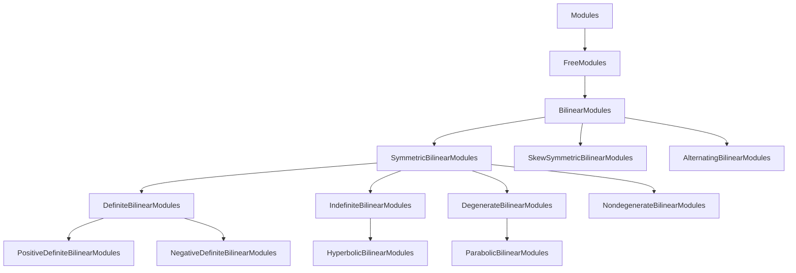

<!--
Origin: gitclones/Coxeter-v2/docs/authority/CORE_ARCHITECTURE.md
Copied 2026-08-20 by the Coxeter-corpora enrichment migration
(PLAN-coxeter-deletion-audit-registry). Content below is unmodified.

This is a PROVENANCE RECORD: a corpus map or superseded design plan, kept
so the routing decisions of the migration stay legible. It is not a
statement about the current repository.
-->

# Core Architecture Authority Document

This document defines the technical architecture and design patterns for the Coxeter project. It consolidates literal extractions from category designs, infrastructure plans, and architectural archives.

## 1. Category Delegation Pattern

The central architectural innovation is the use of SageMath's category framework to extend existing module functionality rather than reimplementing foundation classes.

- **Core Principle**: Do NOT reimplement free modules. Add bilinear form functionality to existing `FreeModule` instances via a dedicated category.
- **Mechanism**: Use `ParentMethods` and `ElementMethods` in a `BilinearModules` category to inject behavior into existing classes.

### Category Hierarchy

## 2. Implementation Strategy

### Element Method Injection
The `*` operator is overloaded at the category level to provide natural mathematical notation for bilinear forms.
- **Logic**: For elements $v, w$, $v * w$ evaluates the bilinear pairing.
- **Traceability**: `v * w = self.parent().bilinear_form(self, other)`

### Parent Wrapper (BilinearModule)
Functional wrappers encapsulate an internal `_free_module` and provide the bilinear form implementation.
- **Input**: Existing `FreeModule` + Bilinear form data (Matrix or Function).
- **Constructor**: Automatic determination of specialized subcategories (e.g., `Symmetric`, `Definite`).

### Constructor Factory Pattern
A unified `BilinearModule` factory supports three construction paths:
1. **Gram matrix**: Automatic free module creation.
2. **Existing module**: Wrapping an initialized Sage module.
3. **Symbolic generators**: Algebraic construction using the `AlgebraicLattice` pattern.

## 3. Homotopical & Categorical Foundations

The architecture supports an $\infty$-categorical enhancement, enabling higher homotopical operations.

### Stable $\infty$-Category of Bilinear Modules
- **Derived Category**: $D(\text{Bil}R\text{-Mod})$ is the homotopy category of a stable $\infty$-category.
- **Suspension Functor**: $\Sigma M = H \oplus M \oplus H$, where $H$ is the hyperbolic plane.
- **Stabilization**: $Sp(\text{Bil}R\text{-Mod})$ is the $\infty$-categorical colimit of the suspension sequence.

### Dold-Kan Correspondence
Equivalence between non-negative chain complexes and simplicial bilinear modules:
$$Ch_{\geq 0}(\text{Bil}R\text{-Mod}) \simeq s\text{Bil}R\text{-Mod}$$
- **Normalized Chains**: $N(X)_n = \bigcap_{i=1}^n \text{ker}(d_i: X_n \to X_{n-1})$.

### Presentable $\infty$-Category Attributes
- **Accessibility**: Generated by $\kappa$-compact objects (finitely presented modules).
- **Adjunctions**: Tensor-hom adjunction $M \otimes^L N$ and $RHom(M, N)$ satisfy standard identities in the stable setting.

## 4. Design Constraints

- **Dependency Integrity**: Build on SageMath's validated lattice infrastructure; do NOT bypass existing mathematical checks.
- **Notation Rigor**: 
    - Use `v.inner_product(w)` and `v * w` interchangeably.
    - Attribute notation $L.e, L.f$ for symbolic basis access.
- **Forbidden Patterns**:
    - No duplication of `FreeModule` code.
    - No hard-coding of matrices for standard Coxeter types (use LaTeX string parsing).
    - No coordinate-dependent definitions for coordinate-independent properties.
