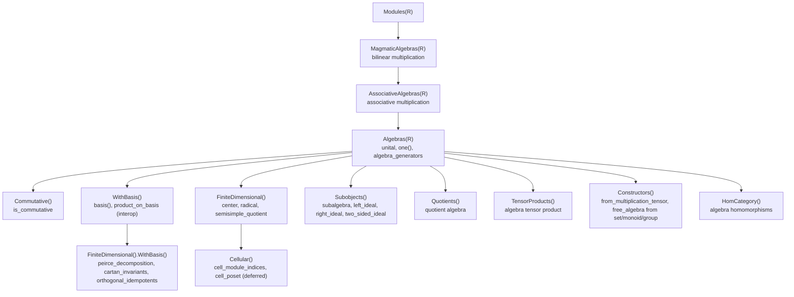

# Algebras Category Hierarchy

```mermaid
graph TD
    Modules["Modules(R)"]
    Modules --> Magmatic["MagmaticAlgebras(R)<br/>bilinear multiplication"]
    Magmatic --> Associative["AssociativeAlgebras(R)<br/>associative multiplication"]
    Associative --> Algebras["Algebras(R)<br/>unital, one(), algebra_generators"]
    
    Algebras --> Commutative["Commutative()<br/>is_commutative"]
    Algebras --> WithBasis["WithBasis()<br/>basis(), product_on_basis (interop)"]
    Algebras --> FiniteDimensional["FiniteDimensional()<br/>center, radical, semisimple_quotient"]
    Algebras --> Subobjects["Subobjects()<br/>subalgebra, left_ideal, right_ideal, two_sided_ideal"]
    Algebras --> Quotients["Quotients()<br/>quotient algebra"]
    Algebras --> TensorProducts["TensorProducts()<br/>algebra tensor product"]
    
    FiniteDimensional --> Cellular["Cellular()<br/>cell_module_indices, cell_poset (deferred)"]
    
    WithBasis --> FiniteDimWithBasis["FiniteDimensional().WithBasis()<br/>peirce_decomposition, cartan_invariants, orthogonal_idempotents"]
    
    Algebras --> Constructors["Constructors()<br/>from_multiplication_tensor, free_algebra from set/monoid/group"]
    Algebras --> HomCategory["HomCategory()<br/>algebra homomorphisms"]
```
