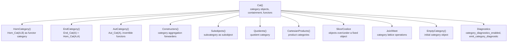

# Category of Categories Hierarchy

```mermaid
graph TD
    Cat["Cat()<br/>category objects, containment, functors"]
    Cat --> HomCategory["HomCategory()<br/>Hom_Cat(A,B) as functor category"]
    Cat --> EndCategory["EndCategory()<br/>End_Cat(A) = Hom_Cat(A,A)"]
    Cat --> AutCategory["AutCategory()<br/>Aut_Cat(A), invertible functors"]
    Cat --> Constructors["Constructors()<br/>category aggregation forwarders"]
    Cat --> Subobjects["Subobjects()<br/>subcategory as subobject"]
    Cat --> Quotients["Quotients()<br/>quotient category"]
    Cat --> CartesianProducts["CartesianProducts()<br/>product categories"]
    Cat --> SliceCoslice["Slice/Coslice<br/>objects over/under a fixed object"]
    Cat --> JoinMeet["Join/Meet<br/>category lattice operations"]
    Cat --> EmptyCategory["EmptyCategory()<br/>initial category object"]
    Cat --> Diagnostics["Diagnostics<br/>category_diagnostics_enabled, emit_category_diagnostic"]
```
