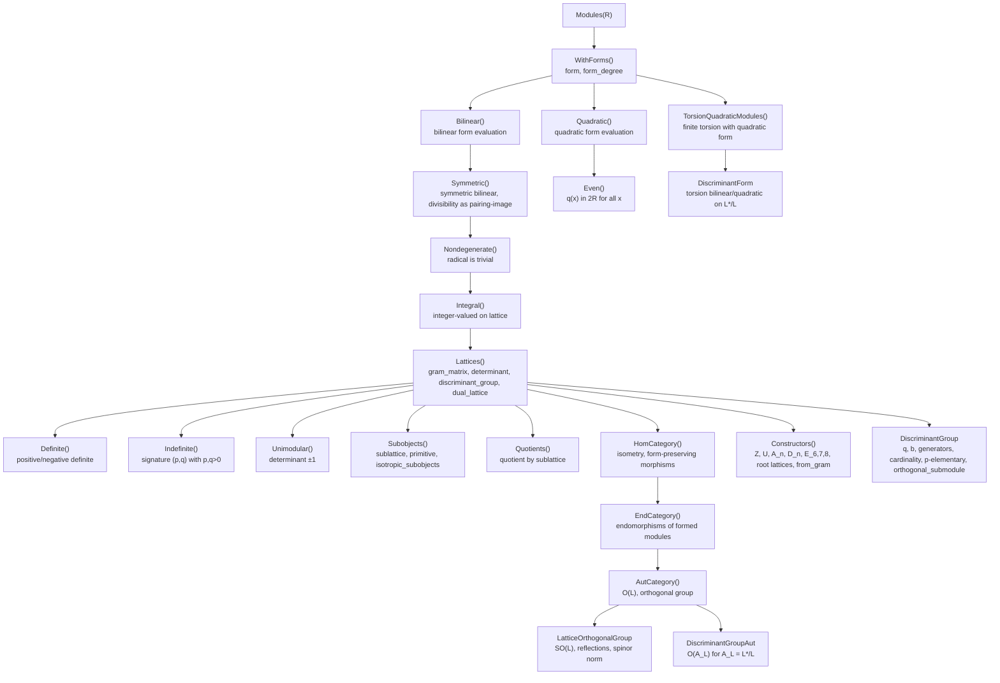

# Forms and Lattices Category Hierarchy

```mermaid
graph TD
    Modules["Modules(R)"]
    Modules --> WithForms["WithForms()<br/>form, form_degree"]
    WithForms --> Bilinear["Bilinear()<br/>bilinear form evaluation"]
    Bilinear --> Symmetric["Symmetric()<br/>symmetric bilinear, divisibility as pairing-image"]
    Symmetric --> Nondegenerate["Nondegenerate()<br/>radical is trivial"]
    Nondegenerate --> Integral["Integral()<br/>integer-valued on lattice"]
    Integral --> Lattices["Lattices()<br/>gram_matrix, determinant, discriminant_group, dual_lattice"]
    
    WithForms --> Quadratic["Quadratic()<br/>quadratic form evaluation"]
    Quadratic --> Even["Even()<br/>q(x) in 2R for all x"]
    
    Lattices --> Definite["Definite()<br/>positive/negative definite"]
    Lattices --> Indefinite["Indefinite()<br/>signature (p,q) with p,q>0"]
    Lattices --> Unimodular["Unimodular()<br/>determinant ±1"]
    
    Lattices --> Subobjects["Subobjects()<br/>sublattice, primitive, isotropic_subobjects"]
    Lattices --> Quotients["Quotients()<br/>quotient by sublattice"]
    Lattices --> HomCategory["HomCategory()<br/>isometry, form-preserving morphisms"]
    
    HomCategory --> EndCategory["EndCategory()<br/>endomorphisms of formed modules"]
    EndCategory --> AutCategory["AutCategory()<br/>O(L), orthogonal group"]
    
    AutCategory --> OrthogonalGroup["LatticeOrthogonalGroup<br/>SO(L), reflections, spinor norm"]
    AutCategory --> DiscriminantAut["DiscriminantGroupAut<br/>O(A_L) for A_L = L*/L"]
    
    Lattices --> Constructors["Constructors()<br/>Z, U, A_n, D_n, E_6,7,8, root lattices, from_gram"]
    Lattices --> DiscriminantGroup["DiscriminantGroup<br/>q, b, generators, cardinality, p-elementary, orthogonal_submodule"]
    
    %% Torsion forms (separate branch)
    WithForms --> TorsionQuadratic["TorsionQuadraticModules()<br/>finite torsion with quadratic form"]
    TorsionQuadratic --> DiscriminantFormBridge["DiscriminantForm<br/>torsion bilinear/quadratic on L*/L"]
```
