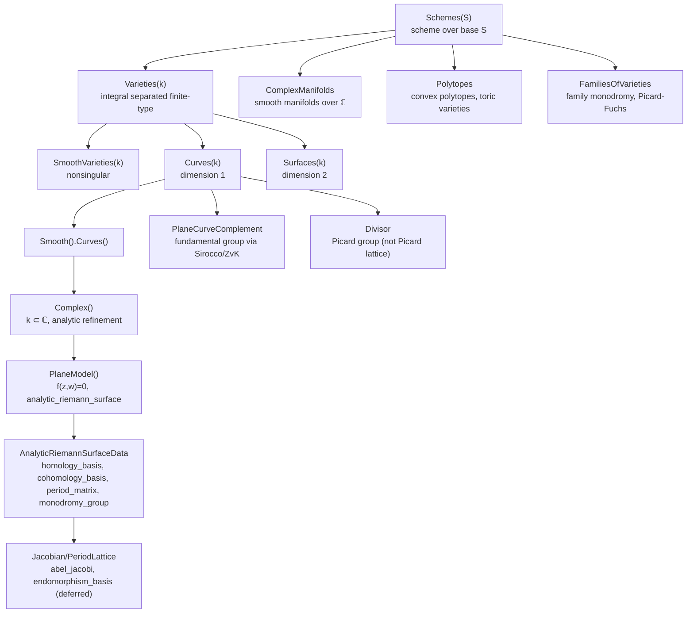

# Geometry Category Interfaces (provisional)

```mermaid
graph TD
    Schemes["Schemes(S)<br/>scheme over base S"]
    Schemes --> Varieties["Varieties(k)<br/>integral separated finite-type"]
    Varieties --> SmoothVarieties["SmoothVarieties(k)<br/>nonsingular"]
    Varieties --> Curves["Curves(k)<br/>dimension 1"]
    Varieties --> Surfaces["Surfaces(k)<br/>dimension 2"]
    
    Curves --> SmoothCurves["Smooth().Curves()"]
    SmoothCurves --> ComplexCurves["Complex()<br/>k ⊂ ℂ, analytic refinement"]
    ComplexCurves --> PlaneModel["PlaneModel()<br/>f(z,w)=0, analytic_riemann_surface"]
    
    PlaneModel --> RiemannData["AnalyticRiemannSurfaceData<br/>homology_basis, cohomology_basis, period_matrix, monodromy_group"]
    RiemannData --> Jacobian["Jacobian/PeriodLattice<br/>abel_jacobi, endomorphism_basis (deferred)"]
    
    Schemes --> ComplexManifolds["ComplexManifolds<br/>smooth manifolds over ℂ"]
    Schemes --> Polytopes["Polytopes<br/>convex polytopes, toric varieties"]
    Schemes --> Families["FamiliesOfVarieties<br/>family monodromy, Picard-Fuchs"]
    
    Curves --> PlaneCurveComplement["PlaneCurveComplement<br/>fundamental group via Sirocco/ZvK"]
    Curves --> Divisor["Divisor<br/>Picard group (not Picard lattice)"]
```
