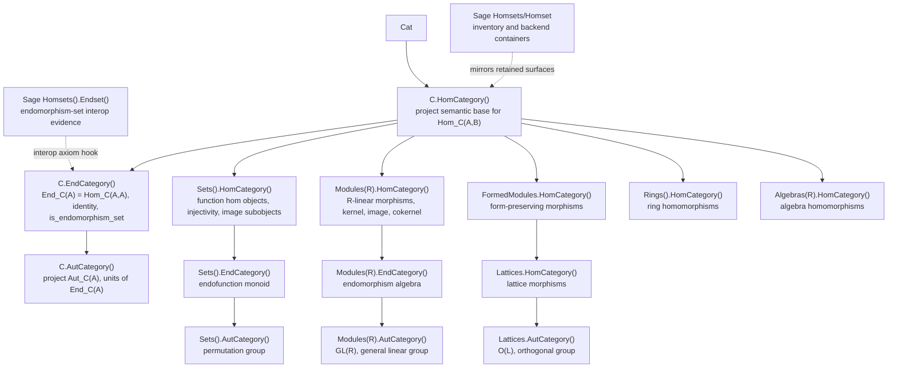

# Hom/End/Aut Categories Hierarchy

```mermaid
graph TD
    Cat["Cat"]
    SageHomsets["Sage Homsets/Homset<br/>inventory and backend containers"]
    SageEndset["Sage Homsets().Endset()<br/>endomorphism-set interop evidence"]
    Cat --> HomCategory["C.HomCategory()<br/>project semantic base for Hom_C(A,B)"]
    SageHomsets -. mirrors retained surfaces .-> HomCategory
    HomCategory --> EndCategory["C.EndCategory()<br/>End_C(A) = Hom_C(A,A), identity, is_endomorphism_set"]
    SageEndset -. interop axiom hook .-> EndCategory
    EndCategory --> AutCategory["C.AutCategory()<br/>project Aut_C(A), units of End_C(A)"]
    
    HomCategory --> SetHom["Sets().HomCategory()<br/>function hom objects, injectivity, image subobjects"]
    SetHom --> SetEnd["Sets().EndCategory()<br/>endofunction monoid"]
    SetEnd --> SetAut["Sets().AutCategory()<br/>permutation group"]
    
    HomCategory --> ModuleHom["Modules(R).HomCategory()<br/>R-linear morphisms, kernel, image, cokernel"]
    ModuleHom --> ModuleEnd["Modules(R).EndCategory()<br/>endomorphism algebra"]
    ModuleEnd --> ModuleAut["Modules(R).AutCategory()<br/>GL(R), general linear group"]
    
    HomCategory --> FormHom["FormedModules.HomCategory()<br/>form-preserving morphisms"]
    FormHom --> LatticeHom["Lattices.HomCategory()<br/>lattice morphisms"]
    LatticeHom --> LatticeAut["Lattices.AutCategory()<br/>O(L), orthogonal group"]
    
    HomCategory --> RingHom["Rings().HomCategory()<br/>ring homomorphisms"]
    HomCategory --> AlgHom["Algebras(R).HomCategory()<br/>algebra homomorphisms"]
```
