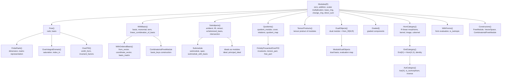

# Modules Category Hierarchy

```mermaid
graph TD
    Modules["Modules(R)<br/>zero, addition, scalar multiplication, base_ring, change_ring, direct_sum"]
    Modules --> Free["Free()<br/>rank, basis"]
    Modules --> WithBasis["WithBasis()<br/>basis, monomial, term, linear_combination_of_basis"]
    Modules --> Subobjects["Subobjects()<br/>ambient, lift, retract, echelonized_basis, intersection"]
    Modules --> Quotients["Quotients()<br/>quotient_module, cover, relations, quotient_map"]
    Modules --> TensorProducts["TensorProducts()<br/>tensor product of modules"]
    Modules --> DualObjects["DualObjects()<br/>dual module = Hom_R(M,R)"]
    Modules --> Graded["Graded()<br/>graded components"]
    Modules --> HomCategory["HomCategory()<br/>R-linear morphisms, kernel, image, cokernel"]
    
    Free --> FiniteRank["FiniteRank()<br/>dimension, matrix representation"]
    Free --> OverIntegralDomain["OverIntegralDomain()<br/>saturation, index_in"]
    Free --> OverPID["OverPID()<br/>smith_form, invariant_factors"]
    
    WithBasis --> WithOrderedBasis["WithOrderedBasis()<br/>from_vector, coordinate_vector, basis_matrix"]
    WithBasis --> CombinatorialFree["CombinatorialFreeModule<br/>basis_keys construction"]
    
    Subobjects --> Submodule["Submodule<br/>submodule, span, submodule_with_basis"]
    Subobjects --> Ideals["Ideals as modules<br/>ideal, principal_ideal"]
    
    Quotients --> FinitelyPresentedPID["FinitelyPresentedOverPID<br/>invariants, torsion_part, free_part"]
    
    DualObjects --> DualModule["ModuleDualObjects<br/>dual basis, evaluation map"]
    
    HomCategory --> EndCategory["EndCategory()<br/>End(X) = Hom(X,X), identity"]
    EndCategory --> AutCategory["AutCategory()<br/>Aut(X), is_isomorphism, inverse"]
    
    Modules --> WithForms["WithForms()<br/>form evaluation, is_isotropic"]
    Modules --> Constructors["Constructors()<br/>FreeModule, VectorSpace, CombinatorialFreeModule"]
```
