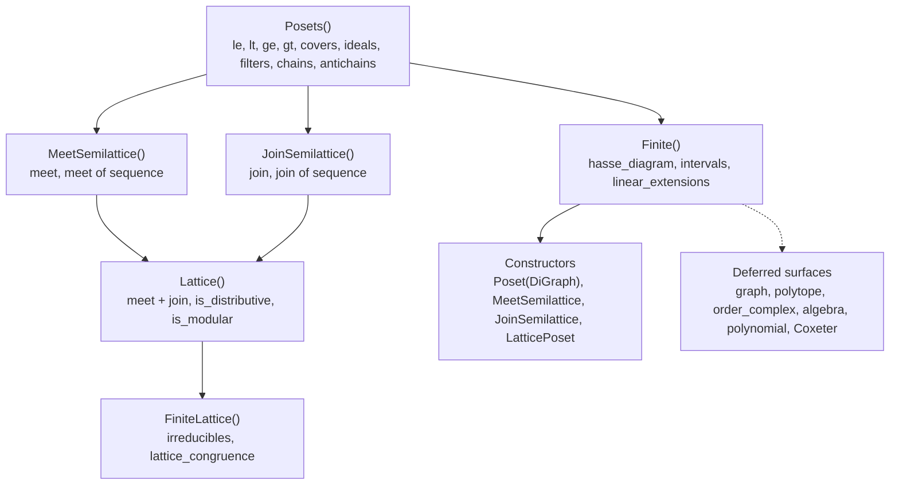

# Posets Category Hierarchy

```mermaid
graph TD
    Posets["Posets()<br/>le, lt, ge, gt, covers, ideals, filters, chains, antichains"]
    Posets --> Finite["Finite()<br/>hasse_diagram, intervals, linear_extensions"]
    Posets --> MeetSemilattice["MeetSemilattice()<br/>meet, meet of sequence"]
    Posets --> JoinSemilattice["JoinSemilattice()<br/>join, join of sequence"]
    
    MeetSemilattice --> Lattice["Lattice()<br/>meet + join, is_distributive, is_modular"]
    JoinSemilattice --> Lattice
    
    Lattice --> FiniteLattice["FiniteLattice()<br/>irreducibles, lattice_congruence"]
    
    Finite --> PosetConstructors["Constructors<br/>Poset(DiGraph), MeetSemilattice, JoinSemilattice, LatticePoset"]
    
    %% Deferred non-core surfaces
    Finite -.-> Deferred["Deferred surfaces<br/>graph, polytope, order_complex, algebra, polynomial, Coxeter"]
```
