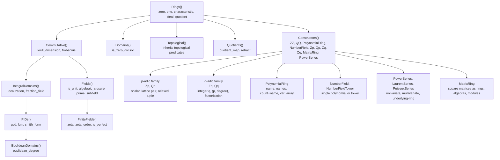

# Rings Category Hierarchy

```mermaid
graph TD
    Rings["Rings()<br/>zero, one, characteristic, ideal, quotient"]
    Rings --> Commutative["Commutative()<br/>krull_dimension, frobenius"]
    Rings --> Domains["Domains()<br/>is_zero_divisor"]
    Rings --> Topological["Topological()<br/>inherits topological predicates"]
    
    Commutative --> IntegralDomains["IntegralDomains()<br/>localization, fraction_field"]
    Commutative --> Fields["Fields()<br/>is_unit, algebraic_closure, prime_subfield"]
    
    IntegralDomains --> PIDs["PIDs()<br/>gcd, lcm, smith_form"]
    PIDs --> EuclideanDomains["EuclideanDomains()<br/>euclidean_degree"]
    
    Fields --> FiniteFields["FiniteFields()<br/>zeta, zeta_order, is_perfect"]
    
    Rings --> Quotients["Quotients()<br/>quotient_map, retract"]
    Rings --> Constructors["Constructors()<br/>ZZ, QQ, PolynomialRing, NumberField, Zp, Qp, Zq, Qq, MatrixRing, PowerSeries"]
    
    Constructors --> PAdic["p-adic family<br/>Zp, Qp<br/>scalar, lattice pair, relaxed tuple"]
    Constructors --> QAdic["q-adic family<br/>Zq, Qq<br/>integer q, (p, degree), factorization"]
    Constructors --> Polynomial["PolynomialRing<br/>name, names, count+name, var_array"]
    Constructors --> NumberField["NumberField, NumberFieldTower<br/>single polynomial or tower"]
    Constructors --> Series["PowerSeries, LaurentSeries, PuiseuxSeries<br/>univariate, multivariate, underlying-ring"]
    Constructors --> Matrix["MatrixRing<br/>square matrices as rings, algebras, modules"]
```
