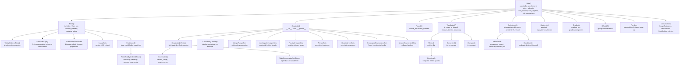

# Sets Category Hierarchy

```mermaid
graph TD
    Sets["Sets()<br/>cardinality, an_element, union, subsets, free_module, free_algebra, rich comparison"]
    Sets --> Finite["Finite()<br/>is_finite→True, len, random_element, subsets_lattice"]
    Sets --> Countable["Countable()<br/>__iter__, rank, __getitem__"]
    Sets --> Facade["Facade()<br/>facade_for, facade_element"]
    Sets --> Topological["Topological()<br/>is_open, is_closed, closure, interior, boundary"]
    Sets --> Subobjects["Subobjects()<br/>intersection, difference, ambient, lift, retract"]
    Sets --> Quotients["Quotients()<br/>quotient, equivalence_classes"]
    Sets --> Graded["Graded()<br/>grading_set, graded_component"]
    Sets --> GSets["GSets(G)<br/>group action surface"]
    
    Countable --> CountableFinite["Countable().Finite()<br/>list, tuple, len, finite random"]
    Countable --> CountableInfinite["Countable().Infinite()<br/>infinite semantics, no list/tuple"]
    
    Finite --> TotallyOrderedFinite["TotallyOrderedFinite()<br/>le, element comparison"]
    Finite --> FiniteSetMaps["FiniteSetMaps()<br/>finite enumeration, element constructors"]
    
    CountableFinite --> Enumerated["Enumerated()<br/>iterator_range, unrank_range"]
    CountableFinite --> FiniteEnumeratedSet["FiniteEnumeratedSetObjects<br/>tuple-backed facade set"]
    
    Countable --> IntegerRange["IntegerRangeSets<br/>arithmetic progression"]
    Countable --> NonNegativeIntegers["NonNegativeIntegerSets<br/>countably infinite facade"]
    Countable --> PositiveIntegers["PositiveIntegerSets<br/>positive integer range"]
    Countable --> Primes["PrimesSets<br/>one-object category"]
    Countable --> DisjointUnion["DisjointUnionSets<br/>countable coproduct"]
    Countable --> RecursivelyEnumerated["RecursivelyEnumeratedSets<br/>forest constructor family"]
    Countable --> IteratorEnumerated["IteratorEnumeratedSets<br/>callable-backed"]
    
    Finite --> CartesianProduct["CartesianProductSets<br/>binary product, element projections"]
    Finite --> Image["ImageSets<br/>ambient, lift, retract"]
    
    Subobjects --> RealSubset["RealSubset<br/>component_count, measure, convex_hull"]
    Subobjects --> ConditionSet["ConditionSet<br/>predicate-defined (internal)"]
    
    Topological --> Metric["Metric()<br/>metric, dist"]
    Metric --> Complete["Complete()<br/>complete metric spaces"]
    Topological --> Connected["Connected()<br/>is_connected"]
    Topological --> Compact["Compact()<br/>is_compact"]
    
    Finite --> Partitioned["Partitioned()<br/>base_set, blocks, meet, join"]
    Partitioned --> FiniteTotallyOrderedBase["FiniteTotallyOrderedBase()<br/>crossings, nestings, ordered_coarsening"]
    
    %% Family and constructions
    Sets --> Family["Families<br/>indexed family, items, map, zip"]
    Sets --> Constructions["Constructions<br/>ImageSubobject, SetPartitions, RealSetInterval, etc."]
```
