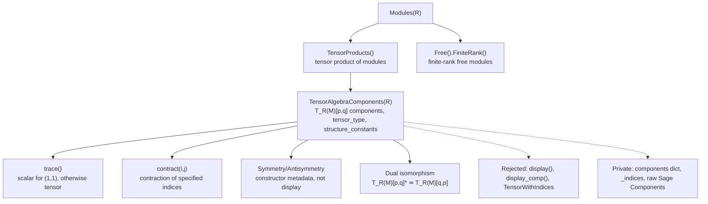

# Tensor Algebra Components Hierarchy

```mermaid
graph TD
    Modules["Modules(R)"]
    Modules --> TensorProducts["TensorProducts()<br/>tensor product of modules"]
    Modules --> FreeFiniteRank["Free().FiniteRank()<br/>finite-rank free modules"]
    
    TensorProducts --> TensorComponents["TensorAlgebraComponents(R)<br/>T_R(M)[p,q] components, tensor_type, structure_constants"]
    
    TensorComponents --> Trace["trace()<br/>scalar for (1,1), otherwise tensor"]
    TensorComponents --> Contract["contract(i,j)<br/>contraction of specified indices"]
    TensorComponents --> SymmetryData["Symmetry/Antisymmetry<br/>constructor metadata, not display"]
    
    TensorComponents --> DualIsomorphism["Dual isomorphism<br/>T_R(M)[p,q]* ≃ T_R(M)[q,p]"]
    
    %% Rejected/Interop surfaces
    TensorComponents -.-> DisplayRejected["Rejected: display(), display_comp(), TensorWithIndices"]
    TensorComponents -.-> StoragePrivate["Private: components dict, _indices, raw Sage Components"]
```
