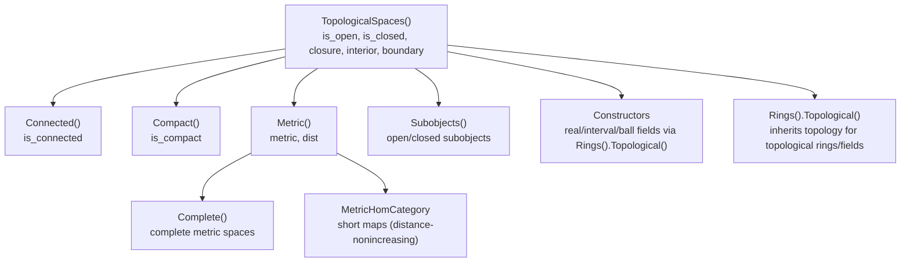

# Topological Spaces Category Hierarchy

```mermaid
graph TD
    Topological["TopologicalSpaces()<br/>is_open, is_closed, closure, interior, boundary"]
    Topological --> Connected["Connected()<br/>is_connected"]
    Topological --> Compact["Compact()<br/>is_compact"]
    Topological --> Metric["Metric()<br/>metric, dist"]
    
    Metric --> Complete["Complete()<br/>complete metric spaces"]
    Metric --> HomCategory["MetricHomCategory<br/>short maps (distance-nonincreasing)"]
    
    Topological --> Subobjects["Subobjects()<br/>open/closed subobjects"]
    Topological --> Constructors["Constructors<br/>real/interval/ball fields via Rings().Topological()"]
    
    Topological --> RingRefinement["Rings().Topological()<br/>inherits topology for topological rings/fields"]
```
