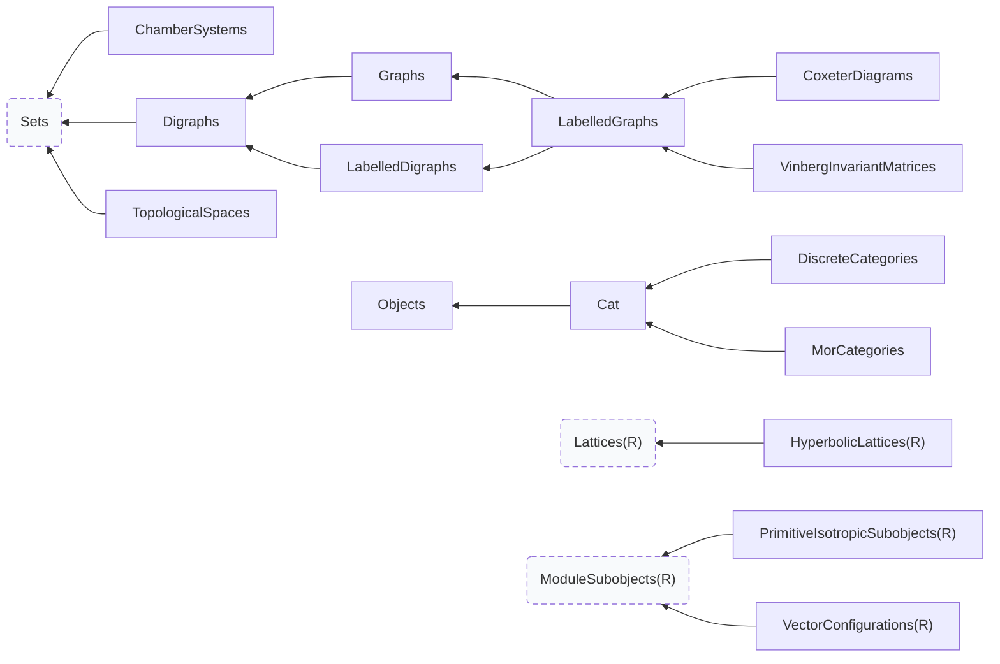
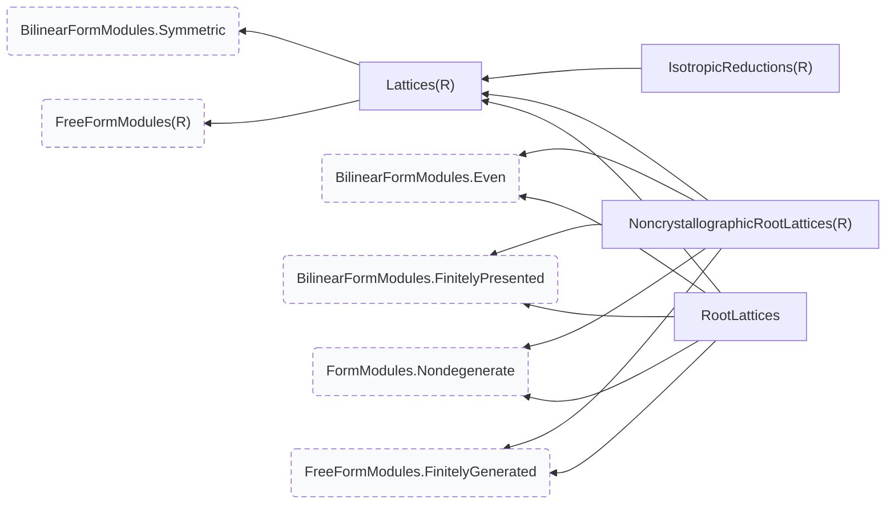
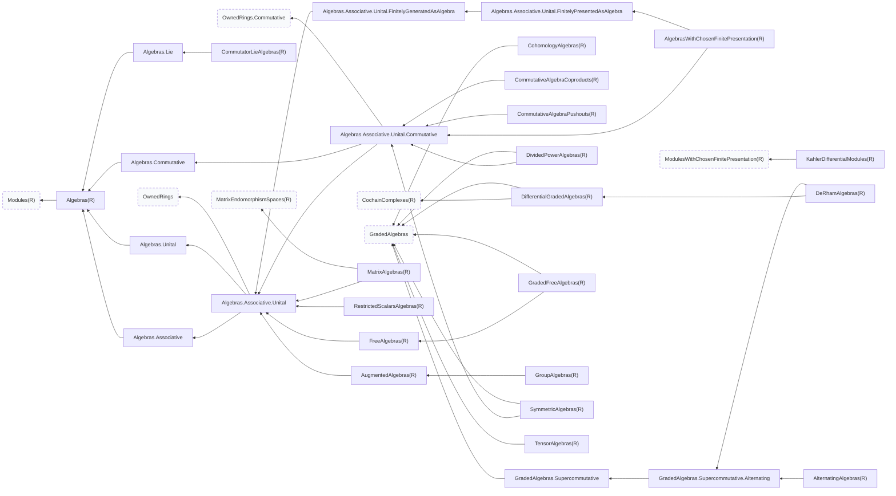
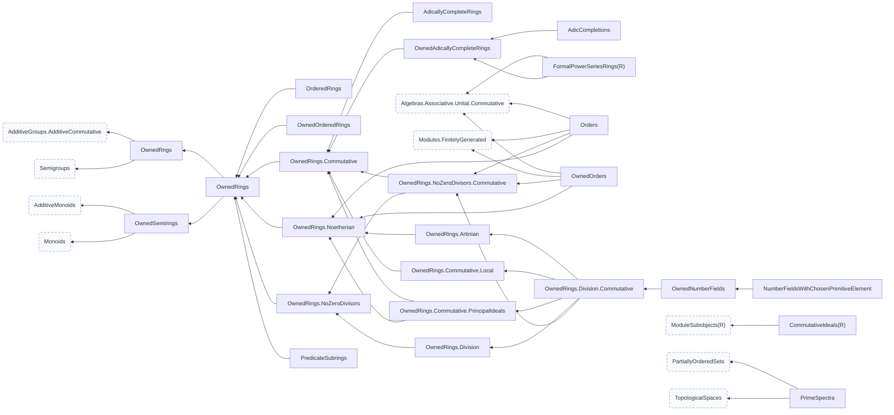
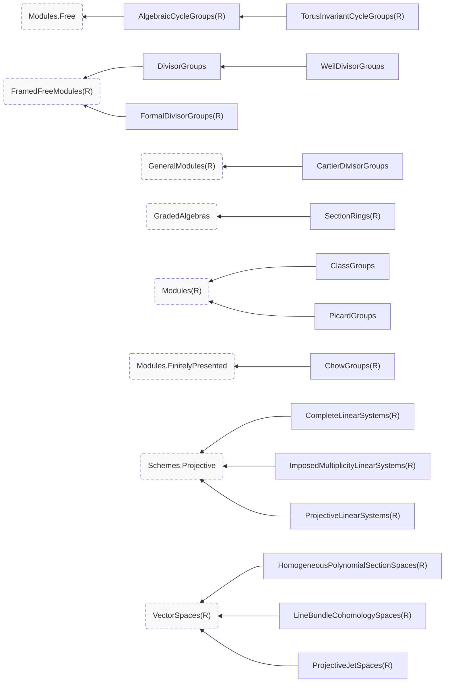
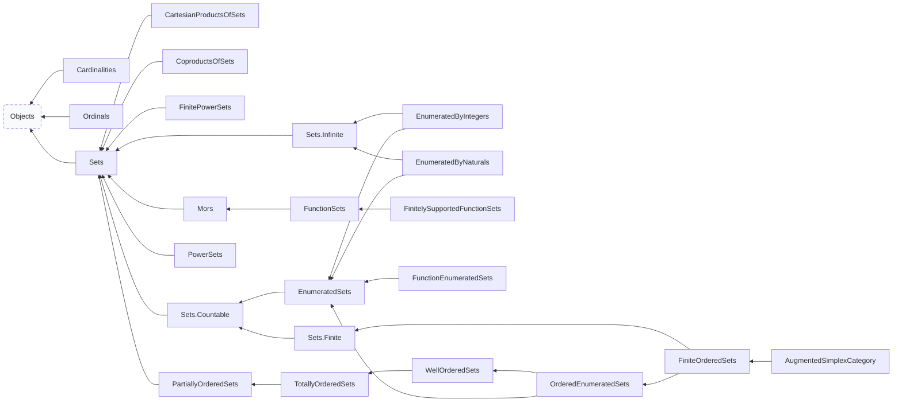
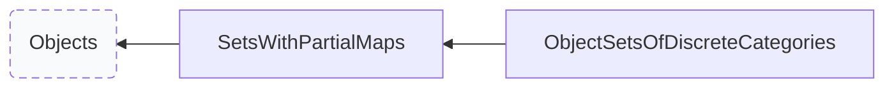

# The preamble, surveyed from a live session

This is the reference for what a session can build on: which categories exist, what sits above and below each one, which operations an object of each category answers to and where each operation is defined, which functors move between categories, and which named specimens are on hand.

Everything here was read from a running session, not from the source text.
`super_categories` is a method, the base ring is an argument, and the operations an object carries are assembled by Sage from the category graph at runtime -- so a category's place and its methods are facts only a live object can report.

```python
from dzack_research.preamble.all import *
```

## How to read an entry

A category parameterized by a ring is written `C(R)` and was probed at `R = ZZ`; the relations hold for the parameter generally, and the **probed as** line shows the object the survey actually held.

**Above** and **below** are the direct edges of the poset: `super_categories` and its inverse.
**Refines** is the transitive closure upward.

**Operations introduced here** are the ones this category *defines*. Every operation is written out once, at the category that owns it; a descendant lists it under **inherited** with a link, because that is where placement lives.
So an object of `C` answers to the union of the operations introduced by `C` and by everything in its ancestry.

Operations are split by what they act on: **objects** of the category, **elements** of those objects, and **morphisms** between them.

A category the survey could not build, or an operation whose signature would not resolve, is recorded with the error rather than dropped.

The same survey is serialized to `docs/preamble-graph.json`, which carries every operation name, so a question this prose cannot index is a `jq` away:

```bash
# which category owns discriminant_group?
jq -r '.categories | to_entries[]
      | select(.value.operations.objects[]?.name == "discriminant_group")
      | .key' docs/preamble-graph.json
```

The poset is drawn in `docs/preamble-graph.html` (pan and zoom), from `docs/preamble-graph.dot`.

|  |  |
| :--- | ---: |
| categories in the poset | 300 |
| of those, built and interrogated | 221 |
| operations, each written once at its owner | 2310 |
| functors | 4, 2 of them with a domain and codomain resolved here |
| adjunctions | 1 |

## The category poset

An edge points from a category to a category it refines.
In the drawing the arrow runs leftward and the chapters are boxed, so reading left is forgetting structure and reading right is adding it; a dashed node is a category Sage provides rather than one the preamble owns.

The top of the poset, refining nothing further: [`Objects`](#cat-objects).

The whole graph at once is [`preamble-graph.html`](preamble-graph.html); the diagrams below are its restriction to one chapter, together with any immediate supercategory that lies outside it.

## Getting from one category to another

Every functor the survey could build, indexed by where it starts.
This is the table to read when the object you have and the object you want are in different categories.

| from | functor | to |
| :--- | :--- | :--- |
| Category of discrete categories | [`ObjectSetFunctor`](#fun-objectsetfunctor) | Category of sets |
| Category of modules over commutative rings | [`ModuleBaseRingProjection`](#fun-modulebaseringprojection) | Category of commutative rings |

3 further functors take data the survey does not choose for you (a ring map, a group, a subgroup pair); they are written out in their chapters with the arguments they want.

## Named specimens

Objects the catalogue has already built, with the invariants the survey could compute from them.

### `Embeddings` {#embeddings}

`src/dzack_research/preamble/catalogue.py:1056`

| name | is | domain | codomain | category |
| :--- | :--- | :--- | :--- | :--- |
| `Embeddings.E8_2_into_TdP` | Generic morphism: From: Integral lattice of rank 8 and signature (0, 8) To: Integral lattice of rank 20 and signature (2, 18) | Integral lattice of rank 8 and signature (0, 8) | Integral lattice of rank 20 and signature (2, 18) | Category of homsets of sets |
| `Embeddings.TCo_into_TEn` | Generic morphism: From: Integral lattice of rank 11 and signature (2, 9) To: Integral lattice of rank 12 and signature (2, 10) | Integral lattice of rank 11 and signature (2, 9) | Integral lattice of rank 12 and signature (2, 10) | Category of homsets of sets |
| `Embeddings.TEn_into_TdP` | Generic morphism: From: Integral lattice of rank 12 and signature (2, 10) To: Integral lattice of rank 20 and signature (2, 18) | Integral lattice of rank 12 and signature (2, 10) | Integral lattice of rank 20 and signature (2, 18) | Category of homsets of sets |
| `Embeddings.TdP_into_LK3` | Generic morphism: From: Integral lattice of rank 20 and signature (2, 18) To: Integral lattice of rank 22 and signature (3, 19) | Integral lattice of rank 20 and signature (2, 18) | Integral lattice of rank 22 and signature (3, 19) | Category of homsets of sets |
| `Embeddings.TEn_into_LK3` | Generic morphism: From: Integral lattice of rank 12 and signature (2, 10) To: Integral lattice of rank 22 and signature (3, 19) | Integral lattice of rank 12 and signature (2, 10) | Integral lattice of rank 22 and signature (3, 19) | Category of homsets of sets |
| `Embeddings.U_E8_2_into_TEn` | Generic morphism: From: Integral lattice of rank 10 and signature (1, 9) To: Integral lattice of rank 12 and signature (2, 10) | Integral lattice of rank 10 and signature (1, 9) | Integral lattice of rank 12 and signature (2, 10) | Category of homsets of sets |

### `Involutions` {#involutions}

Named involutions of the K3 lattice in its displayed block framing.

`src/dzack_research/preamble/catalogue.py:1016`

| name | is | domain | codomain | category |
| :--- | :--- | :--- | :--- | :--- |
| `Involutions.I_dP` | Generic endomorphism of Integral lattice of rank 22 and signature (3, 19) | Integral lattice of rank 22 and signature (3, 19) | Integral lattice of rank 22 and signature (3, 19) | Join of Category of groups and Category of endsets and Category of homsets of sets |
| `Involutions.I_En` | Generic endomorphism of Integral lattice of rank 22 and signature (3, 19) | Integral lattice of rank 22 and signature (3, 19) | Integral lattice of rank 22 and signature (3, 19) | Join of Category of groups and Category of endsets and Category of homsets of sets |
| `Involutions.I_Nik` | Generic endomorphism of Integral lattice of rank 22 and signature (3, 19) | Integral lattice of rank 22 and signature (3, 19) | Integral lattice of rank 22 and signature (3, 19) | Join of Category of groups and Category of endsets and Category of homsets of sets |

### `NamedLattices` {#namedlattices}

The named lattices, each constructed when its name is first read.

`src/dzack_research/preamble/catalogue.py:85`

| name | is | module_rank | signature_pair | discriminant | category |
| :--- | :--- | :--- | :--- | :--- | :--- |
| `NamedLattices.Zero` | Integral lattice of rank 0 and signature (0, 0) | 0 | (0, 0) | 1 | Category of finitely generated unimodular even lattices |
| `NamedLattices.Z` | Integral lattice of rank 1 and signature (1, 0) | 1 | (1, 0) | 1 | Category of finitely generated unimodular lattices |
| `NamedLattices.Z_2` | Integral lattice of rank 1 and signature (1, 0) | 1 | (1, 0) | 2 | Category of finitely generated nondegenerate even lattices |
| `NamedLattices.Z_m2` | Integral lattice of rank 1 and signature (0, 1) | 1 | (0, 1) | -2 | Category of finitely generated nondegenerate even lattices |
| `NamedLattices.U` | Integral lattice of rank 2 and signature (1, 1) | 2 | (1, 1) | 1 | Category of finitely generated unimodular even lattices |
| `NamedLattices.H` | Integral lattice of rank 2 and signature (1, 1) | 2 | (1, 1) | 1 | Category of finitely generated unimodular even lattices |
| `NamedLattices.U_2` | Integral lattice of rank 2 and signature (1, 1) | 2 | (1, 1) | 4 | Category of finitely generated nondegenerate even lattices |
| `NamedLattices.H_2` | Integral lattice of rank 2 and signature (1, 1) | 2 | (1, 1) | 4 | Category of finitely generated nondegenerate even lattices |
| `NamedLattices.A1` | Integral lattice of rank 1 and signature (0, 1) | 1 | (0, 1) | -2 | Category of root lattices |
| `NamedLattices.A2` | Integral lattice of rank 2 and signature (0, 2) | 2 | (0, 2) | -3 | Category of root lattices |
| `NamedLattices.D4` | Integral lattice of rank 4 and signature (0, 4) | 4 | (0, 4) | 4 | Category of root lattices |
| `NamedLattices.D6` | Integral lattice of rank 6 and signature (0, 6) | 6 | (0, 6) | -4 | Category of root lattices |
| `NamedLattices.D8` | Integral lattice of rank 8 and signature (0, 8) | 8 | (0, 8) | 4 | Category of root lattices |
| `NamedLattices.E7` | Integral lattice of rank 7 and signature (0, 7) | 7 | (0, 7) | 2 | Category of root lattices |
| `NamedLattices.E8` | Integral lattice of rank 8 and signature (0, 8) | 8 | (0, 8) | 1 | Category of unimodular root lattices |
| `NamedLattices.E8_2` | Integral lattice of rank 8 and signature (0, 8) | 8 | (0, 8) | 256 | Category of finitely generated nondegenerate even lattices |
| `NamedLattices.E10` | Integral lattice of rank 10 and signature (1, 9) | 10 | (1, 9) | 1 | Category of finitely generated unimodular even chosen lattice biproducts |
| `NamedLattices.E10_2` | Integral lattice of rank 10 and signature (1, 9) | 10 | (1, 9) | 1024 | Category of finitely generated nondegenerate even chosen lattice biproducts |
| `NamedLattices.Sdp` | Integral lattice of rank 2 and signature (1, 1) | 2 | (1, 1) | 4 | Category of finitely generated nondegenerate even lattices |
| `NamedLattices.SEn` | Integral lattice of rank 10 and signature (1, 9) | 10 | (1, 9) | 1024 | Category of finitely generated nondegenerate even chosen lattice biproducts |
| `NamedLattices.Tco` | Integral lattice of rank 11 and signature (2, 9) | 11 | (2, 9) | 2048 | Category of finitely generated nondegenerate even lattices |
| `NamedLattices.Sco` | Integral lattice of rank 11 and signature (1, 10) | 11 | (1, 10) | -2048 | Category of finitely generated nondegenerate even lattices |
| `NamedLattices.TEn` | Integral lattice of rank 12 and signature (2, 10) | 12 | (2, 10) | 1024 | Category of finitely generated nondegenerate even lattices |
| `NamedLattices.TdP` | Integral lattice of rank 20 and signature (2, 18) | 20 | (2, 18) | 4 | Category of finitely generated nondegenerate even lattices |
| `NamedLattices.L_20_2_0` | Integral lattice of rank 20 and signature (2, 18) | 20 | (2, 18) | 4 | Category of finitely generated nondegenerate even lattices |
| `NamedLattices.LK3` | Integral lattice of rank 22 and signature (3, 19) | 22 | (3, 19) | 1 | Category of finitely generated unimodular even lattices |
| `NamedLattices.LK3_2` | Integral lattice of rank 21 and signature (2, 19) | 21 | (2, 19) | -2 | Category of finitely generated nondegenerate even lattices |
| `NamedLattices.LK3_4` | Integral lattice of rank 21 and signature (2, 19) | 21 | (2, 19) | -4 | Category of finitely generated nondegenerate even lattices |
| `NamedLattices.LpNik` | Integral lattice of rank 14 and signature (3, 11) | 14 | (3, 11) | 256 | Category of finitely generated nondegenerate even lattices |
| `NamedLattices.LmNik` | Integral lattice of rank 8 and signature (0, 8) | 8 | (0, 8) | 256 | Category of finitely generated nondegenerate even lattices |
| `NamedLattices.Mukai` | Integral lattice of rank 24 and signature (4, 20) | 24 | (4, 20) | 1 | Category of finitely generated unimodular even lattices |
| `NamedLattices.MukaiExtended` | Integral lattice of rank 26 and signature (5, 21) | 26 | (5, 21) | 1 | Category of finitely generated unimodular even lattices |
| `NamedLattices.MukaiAbelian` | Integral lattice of rank 8 and signature (4, 4) | 8 | (4, 4) | 1 | Category of finitely generated unimodular even lattices |
| `NamedLattices.MukaiAbelianExtended` | Integral lattice of rank 10 and signature (5, 5) | 10 | (5, 5) | 1 | Category of finitely generated unimodular even lattices |
| `NamedLattices.U_E8_2` | Integral lattice of rank 10 and signature (1, 9) | 10 | (1, 9) | 256 | Category of finitely generated nondegenerate even chosen lattice biproducts |
| `NamedLattices.BogachevKolpakovNonReflective` | Integral lattice of rank 3 and signature (1, 2) | 3 | (1, 2) | -2401 | Category of finitely generated nondegenerate lattices |
| `NamedLattices.BogachevKolpakovWithoutRoots` | Integral lattice of rank 3 and signature (1, 2) | 3 | (1, 2) | -117649 | Category of finitely generated nondegenerate lattices |

## Abstract Category Theory & Universal Constructions

> Category of categories (Cat), Arrow and Slice categories, Limits, Colimits, Biproducts, Subobjects, and Diagram categories.



### Categories

Ordered by depth: the least structured first.

#### `Objects` {#cat-objects}

The root of the owned mathematical category graph.

```text
This category carries no mathematical supercategory. Sage's own
``Objects``/``Sets`` categories remain runtime substrate only and are not
semantic ancestors of owned categories.
```

- **not exported**: reachable only as a supercategory

- **probed as** `Category of represented mathematical objects`

- **below** [`AffineGroupSchemes(R)`](#cat-affinegroupschemes), [`Cardinalities`](#cat-cardinalities), [`Cat`](#cat-cat), [`Ordinals`](#cat-ordinals), [`Sets`](#cat-sets), [`SetsWithPartialMaps`](#cat-setswithpartialmaps), [`SheafedSpaces`](#cat-sheafedspaces)

- **build an object** `Objects(x, *args, **opts)`

**Operations introduced here** (4 on objects)

*on objects*

- `ElementType(...)`

  - The owned root of every element chain: the host element runtime.

- `has_selected_resolution(owner) -> bool`

  - Whether a chosen resolution relative to owner is stored.

- `selected_resolution(owner)`

  - Return the chosen resolution relative to owner.

- `selected_resolution_generating_set(owner)`

  - The set `S` of the chosen resolution relative to owner, realizing it only when unstated.

**Inherited operations**, defined where they are owned:

| from | objects | elements | morphisms |
| :--- | ---: | ---: | ---: |
| `SageObject` | 8 | 8 |  |
| `Parent` | 15 |  |  |
| `CategoryObject` | 14 |  |  |
| `Element` |  | 9 |  |

#### `Cat` {#cat-cat}

The represented category of categories.

```text
A category is an object of ``Cat`` by placement: the owned category bases
record ``Cat()`` as a category's category when it is built
(``OwnedCategoryObject`` in ``owned_category.py``), a fixed Mor category
records ``MorCategories()``, and ``Cat`` records itself.  The expectation
``Cat() in Cat()`` (``tests/constructions/test_categorical_constructions_construct.py``)
is that last placement; ``Cat`` is not built on the owned base, which
would ask for ``Cat()`` while ``Cat`` is under construction.
```

- **defined at** `src/dzack_research/preamble/categories/abstract_categories/cat.py:269`

- **probed as** `Cat: categories with functors as morphisms`

- **above** [`Objects`](#cat-objects)

- **below** [`DiscreteCategories`](#cat-discretecategories), [`MorCategories`](#cat-morcategories)

- **refines**, transitively, in Sage's linearization order: [`Objects`](#cat-objects)

- **build an object** `Cat(x, *args, **opts)`

- **specimens** `Ord`

**Operations introduced here** (63 on objects)

*on objects*

- `ArrowCategory() -> 'Category'`

  - Return $\mathrm{Ar}(C) = [[1], C]$, the functor category out of the walking arrow.

- `Aut(obj: 'Parent') -> 'Category'`

- `AutCategory() -> 'Category'`

- `AutomorphismArrowCategory() -> 'Category'`

  - Return the full arrow subcategory on automorphisms.

- `Colimits(index_category: 'Category') -> 'Category'`

  - Return the selected-colimit construction category for this target.

- `CoproductCocones(factors) -> 'Category'`

  - Return the category of coproduct cocones on `factors` in this category.

- `Coproducts(index_category: 'Category') -> 'Category'`

  - Return the selected-coproduct construction category for this target.

- `Core() -> 'Category'`

  - Return the core of this category: its objects and its isomorphisms.

- `CosliceUnder(base_object: 'Parent') -> 'Category'`

  - Return the coslice $X/C$.

- `CoveredObjectCategory(base_object: 'Parent') -> 'Category'`

  - Return the category of epic quotients covered by `base_object` here.

- `CoveredObjects(base_object: 'Parent') -> 'Category'`

- `CoveringObjectCategory(base_object: 'Parent') -> 'Category'`

  - Return the category of epic objects covering `base_object` here.

- `CoveringObjects(base_object: 'Parent') -> 'Category'`

- `ElementType() -> 'type[ElementOfCategoryObject]'` <sub>read as an attribute</sub>

  - The implementation type for elements of those objects.

- `End(obj: 'Parent') -> 'Category'`

- `EndArrowCategory() -> 'Category'`

  - Return the full arrow subcategory on endomorphisms.

- `EndCategory() -> 'Category'`

- `Epi(source: 'Parent', target: 'Parent') -> 'Category'`

- `EpiCategory() -> 'Category'`

- `EpimorphismArrowCategory() -> 'Category'`

  - Return the full arrow subcategory on represented epimorphisms.

- `Iso(source: 'Parent', target: 'Parent') -> 'Category'`

- `IsoArrowCategory() -> 'Category'`

  - Return the full arrow subcategory on represented isomorphisms.

- `IsoCategory() -> 'Category'`

- `Limits(index_category: 'Category') -> 'Category'`

  - Return the selected-limit construction category for this target.

- `Mono(source: 'Parent', target: 'Parent') -> 'Category'`

- `MonoCategory() -> 'Category'`

- `MonomorphismArrowCategory() -> 'Category'`

  - Return the full arrow subcategory on represented monomorphisms.

- `Mor(source: 'Parent', target: 'Parent') -> 'Category'`

- `MorCategory() -> 'Category'`

- `ObjectType() -> 'type[ObjectOfCategory]'` <sub>read as an attribute</sub>

  - The implementation type for objects of this category.

- `ProductCones(factors) -> 'Category'`

  - Return the category of product cones on `factors` in this category.

- `Products(index_category: 'Category') -> 'Category'`

  - Return the selected-product construction category for this target.

- `SliceOver(base_object: 'Parent') -> 'Category'`

  - Return the slice $C/X$.

- `SubobjectCategory(base_object: 'Parent') -> 'Category'`

  - Return the category of subobjects of `base_object` here.

- `Subobjects(base_object: 'Parent') -> 'Category'`

- `SuperobjectCategory(base_object: 'Parent') -> 'Category'`

  - Return the category of monic superobjects of `base_object` here.

- `Superobjects(base_object: 'Parent') -> 'Category'`

- `WideSubcategory(arrow_category: 'Category') -> 'Category'`

  - Return the wide subcategory with the selected arrow class.

- `category_packet()`

  - Return the Mor/End/Mono/Epi/Iso/Aut packet owned by this category.

- `codomain_functor()`

  - Return the codomain functor `Ar(self) -> self`.

- `coequalizer(left_morphism: 'Morphism', right_morphism: 'Morphism') -> 'ObjectOfCategory'`

  - Return this category's represented coequalizer of a parallel pair.

- `coequalizer_construction(left_morphism: 'Morphism', right_morphism: 'Morphism')`

  - Return this category's selected coequalizer construction.

- `coequalizer_of_family(morphisms) -> 'ObjectOfCategory'`

  - Return this category's represented wide coequalizer.

- `coequalizer_of_family_construction(morphisms)`

  - Return the selected wide coequalizer with its indexed diagram and universal cocone.

- `colimit_functor(index_category: 'Category')`

  - Return the selected colimit functor `[index_category,self] -> self`.

- `coproduct_construction(factors)`

  - Return this category's selected coproduct construction on `factors`.

- `coproduct_functor()`

  - Return this category's selected binary-coproduct functor.

- `diagonal_functor()`

  - Return the diagonal functor `self -> self x self`.

- `domain_functor()`

  - Return the domain functor `Ar(self) -> self`.

- `equalizer(left_morphism: 'Morphism', right_morphism: 'Morphism') -> 'ObjectOfCategory'`

  - Return this category's represented equalizer of a parallel pair.

- `equalizer_construction(left_morphism: 'Morphism', right_morphism: 'Morphism')`

  - Return this category's selected equalizer construction.

- `equalizer_of_family(morphisms) -> 'ObjectOfCategory'`

  - Return this category's represented wide equalizer.

- `equalizer_of_family_construction(morphisms)`

  - Return the selected wide equalizer with its indexed diagram and universal cone.

- `fiber_product(left_leg: 'Morphism', right_leg: 'Morphism') -> 'ObjectOfCategory'`

  - Return the fiber product of the cospan these two legs form.

- `inclusion_into(supercategory: 'Category')`

  - Return the canonical inclusion functor into a declared supercategory.

- `limit_functor(index_category: 'Category')`

  - Return the selected limit functor `[index_category,self] -> self`.

- `opposite() -> 'Category'`

  - Return $C^{op}$.

- `presheaves(value_category: 'Category | None' = None) -> 'Category'`

  - Return $\mathrm{Presh}(C, D) = [C^{op}, D]$, with $D = \mathbf{Set}$ by default.

- `product_construction(factors)`

  - Return this category's selected product construction on `factors`.

- `product_functor()`

  - Return this category's selected binary-product functor.

- `pushout(left_leg: 'Morphism', right_leg: 'Morphism') -> 'ObjectOfCategory'`

  - Return the pushout of the span these two legs form.

- `span(left_leg: 'Morphism', right_leg: 'Morphism') -> 'ObjectOfCategory'`

  - Return the span these two legs form, as an object of this category.

- `yoneda_embedding()`

  - Return $y: C \to [C^{op}, \mathbf{Set}]$, $X \mapsto \mathrm{Mor}_C(-, X)$.

#### `ChamberSystems` {#cat-chambersystems}

Chamber systems with type-preserving adjacency-preserving morphisms.

- **defined at** `src/dzack_research/preamble/categories/chamber_systems.py:144`

- **probed as** `Category of chamber systems`

- **above** [`Sets`](#cat-sets)

- **refines**, transitively, in Sage's linearization order: [`Sets`](#cat-sets) · [`Objects`](#cat-objects)

- **build an object** `ChamberSystems(x, *args, **opts)`

**Operations introduced here** (2 on objects, 1 on morphisms)

*on objects*

- `ElementType(...)`

  - Chamber systems with type-preserving adjacency-preserving morphisms.

- `Mor(codomain, category=None)`

  - Return the type- and adjacency-preserving Mor into `codomain`.

*on morphisms*

- `underlying_set_morphism()`

**Inherited operations**, defined where they are owned:

| from | objects | elements | morphisms |
| :--- | ---: | ---: | ---: |
| `SageObject` | 8 | 8 |  |
| `Parent` | 15 |  |  |
| `CategoryObject` | 14 |  |  |
| [`Sets`](#cat-sets) | 13 |  |  |
| `Element` |  | 9 |  |
| [`Objects`](#cat-objects) | 3 |  |  |

#### `Digraphs` {#cat-digraphs}

Finite directed graphs with graph homomorphisms.

- **defined at** `src/dzack_research/preamble/categories/graph_categories.py:231`

- **probed as** `Category of finite directed graphs`

- **above** [`Sets`](#cat-sets)

- **below** [`Graphs`](#cat-graphs), [`LabelledDigraphs`](#cat-labelleddigraphs)

- **refines**, transitively, in Sage's linearization order: [`Sets`](#cat-sets) · [`Objects`](#cat-objects)

- **build an object** `Digraphs(x, *args, **opts)`

**Operations introduced here** (2 on objects, 1 on morphisms)

*on objects*

- `ElementType(...)`

  - Finite directed graphs with graph homomorphisms.

- `Mor(codomain, category=None)`

  - Return the adjacency-preserving Mor into `codomain`.

*on morphisms*

- `underlying_set_morphism()`

**Inherited operations**, defined where they are owned:

| from | objects | elements | morphisms |
| :--- | ---: | ---: | ---: |
| `SageObject` | 8 | 8 |  |
| `Parent` | 15 |  |  |
| `CategoryObject` | 14 |  |  |
| [`Sets`](#cat-sets) | 13 |  |  |
| `Element` |  | 9 |  |
| [`Objects`](#cat-objects) | 3 |  |  |

#### `DiscreteCategories` {#cat-discretecategories}

The category of represented discrete categories.

- **defined at** `src/dzack_research/preamble/categories/abstract_categories/functors.py:326`

- **probed as** `Category of discrete categories`

- **above** [`Cat`](#cat-cat)

- **refines**, transitively, in Sage's linearization order: [`Cat`](#cat-cat) · [`Objects`](#cat-objects)

- **build an object** `DiscreteCategories(x, *args, **opts)`

**Operations introduced here** (1 on objects)

*on objects*

- `ElementType()`

  - The category of represented discrete categories.

**Inherited operations**, defined where they are owned:

| from | objects | elements | morphisms |
| :--- | ---: | ---: | ---: |
| [`Cat`](#cat-cat) | 63 |  |  |

#### `MorCategories` {#cat-morcategories}

The category of represented fixed-endpoint Mor categories.

```text
Its objects are the categories ``Hom_C(A,B)``, each built by the ``Of``
entry of the Mor family of its base category ``C``.
```

- **defined at** `src/dzack_research/preamble/categories/abstract_categories/mor_categories.py:1226`

- **probed as** `Category of mor categories`

- **above** [`Cat`](#cat-cat)

- **refines**, transitively, in Sage's linearization order: [`Cat`](#cat-cat) · [`Objects`](#cat-objects)

- **build an object** `MorCategories(x, *args, **opts)`

**Operations introduced here** (1 on objects)

*on objects*

- `ElementType()`

  - The category of represented fixed-endpoint Mor categories.

**Inherited operations**, defined where they are owned:

| from | objects | elements | morphisms |
| :--- | ---: | ---: | ---: |
| [`Cat`](#cat-cat) | 63 |  |  |

#### `TopologicalSpaces` {#cat-topologicalspaces}

Sets equipped with a topology, with continuous maps as morphisms.

- **defined at** `src/dzack_research/preamble/categories/topological_spaces.py:235`

- **probed as** `Category of topological spaces`

- **above** [`Sets`](#cat-sets)

- **below** [`PrimeSpectra`](#cat-primespectra)

- **refines**, transitively, in Sage's linearization order: [`Sets`](#cat-sets) · [`Objects`](#cat-objects)

- **build an object** `TopologicalSpaces(x, *args, **opts)`

**Operations introduced here** (6 on objects, 1 on morphisms)

*on objects*

- `ElementType(...)`

  - Sets equipped with a topology, with continuous maps as morphisms.

- `Mor(codomain, category=None)`

  - Return the continuous maps into `codomain`.

- `continuous_map(codomain, map_)`

- `is_open_subset(subset) -> bool`

  - Whether `subset` is open in this topology.

- `open_subsets()`

  - The set of open subsets defining this topology.

- `topology()`

  - The set of open subsets defining this topology.

*on morphisms*

- `underlying_set_morphism()`

**Inherited operations**, defined where they are owned:

| from | objects | elements | morphisms |
| :--- | ---: | ---: | ---: |
| `SageObject` | 8 | 8 |  |
| `Parent` | 15 |  |  |
| `CategoryObject` | 14 |  |  |
| [`Sets`](#cat-sets) | 13 |  |  |
| `Element` |  | 9 |  |
| [`Objects`](#cat-objects) | 3 |  |  |

#### `Graphs` {#cat-graphs}

Finite undirected graphs, viewed as symmetric directed graphs.

- **defined at** `src/dzack_research/preamble/categories/graph_categories.py:275`

- **probed as** `Category of finite graphs`

- **above** [`Digraphs`](#cat-digraphs)

- **below** [`LabelledGraphs`](#cat-labelledgraphs)

- **refines**, transitively, in Sage's linearization order: [`Digraphs`](#cat-digraphs) · [`Sets`](#cat-sets) · [`Objects`](#cat-objects)

- **build an object** `Graphs(x, *args, **opts)`

**Operations introduced here** (1 on objects)

*on objects*

- `ElementType(...)`

  - Finite undirected graphs, viewed as symmetric directed graphs.

**Inherited operations**, defined where they are owned:

| from | objects | elements | morphisms |
| :--- | ---: | ---: | ---: |
| `SageObject` | 8 | 8 |  |
| `Parent` | 15 |  |  |
| `CategoryObject` | 14 |  |  |
| [`Sets`](#cat-sets) | 13 |  |  |
| `Element` |  | 9 |  |
| [`Objects`](#cat-objects) | 3 |  |  |
| [`Digraphs`](#cat-digraphs) | 1 |  |  |

#### `LabelledDigraphs` {#cat-labelleddigraphs}

Finite digraphs with selected vertex and edge labels.

- **defined at** `src/dzack_research/preamble/categories/graph_categories.py:311`

- **probed as** `Category of labelled finite directed graphs`

- **above** [`Digraphs`](#cat-digraphs)

- **below** [`LabelledGraphs`](#cat-labelledgraphs)

- **refines**, transitively, in Sage's linearization order: [`Digraphs`](#cat-digraphs) · [`Sets`](#cat-sets) · [`Objects`](#cat-objects)

- **build an object** `LabelledDigraphs(x, *args, **opts)`

**Operations introduced here** (2 on objects)

*on objects*

- `ElementType(...)`

  - Finite digraphs with selected vertex and edge labels.

- `Mor(codomain, category=None)`

  - Return the label-preserving graph Mor into `codomain`.

**Inherited operations**, defined where they are owned:

| from | objects | elements | morphisms |
| :--- | ---: | ---: | ---: |
| `SageObject` | 8 | 8 |  |
| `Parent` | 15 |  |  |
| `CategoryObject` | 14 |  |  |
| [`Sets`](#cat-sets) | 13 |  |  |
| `Element` |  | 9 |  |
| [`Objects`](#cat-objects) | 3 |  |  |
| [`Digraphs`](#cat-digraphs) | 1 |  |  |

#### `LabelledGraphs` {#cat-labelledgraphs}

Finite undirected graphs with selected vertex and edge labels.

- **defined at** `src/dzack_research/preamble/categories/graph_categories.py:375`

- **probed as** `Category of labelled finite graphs`

- **above** [`Graphs`](#cat-graphs), [`LabelledDigraphs`](#cat-labelleddigraphs)

- **below** [`CoxeterDiagrams`](#cat-coxeterdiagrams), [`VinbergInvariantMatrices`](#cat-vinberginvariantmatrices)

- **refines**, transitively, in Sage's linearization order: [`LabelledDigraphs`](#cat-labelleddigraphs) · [`Graphs`](#cat-graphs) · [`Digraphs`](#cat-digraphs) · [`Sets`](#cat-sets) · [`Objects`](#cat-objects)

- **build an object** `LabelledGraphs(x, *args, **opts)`

**Operations introduced here** (1 on objects)

*on objects*

- `ElementType(...)`

  - Finite undirected graphs with selected vertex and edge labels.

**Inherited operations**, defined where they are owned:

| from | objects | elements | morphisms |
| :--- | ---: | ---: | ---: |
| `SageObject` | 8 | 8 |  |
| `Parent` | 15 |  |  |
| `CategoryObject` | 14 |  |  |
| [`Sets`](#cat-sets) | 13 |  |  |
| `Element` |  | 9 |  |
| [`Objects`](#cat-objects) | 3 |  |  |
| [`Digraphs`](#cat-digraphs) | 1 |  |  |
| [`LabelledDigraphs`](#cat-labelleddigraphs) | 1 |  |  |

#### `CoxeterDiagrams` {#cat-coxeterdiagrams}

Finite Coxeter diagrams: labelled graphs encoding a symmetric angle matrix.

- **defined at** `src/dzack_research/preamble/categories/coxeter_diagrams.py:184`

- **probed as** `Category of Coxeter diagrams`

- **above** [`LabelledGraphs`](#cat-labelledgraphs)

- **refines**, transitively, in Sage's linearization order: [`LabelledGraphs`](#cat-labelledgraphs) · [`LabelledDigraphs`](#cat-labelleddigraphs) · [`Graphs`](#cat-graphs) · [`Digraphs`](#cat-digraphs) · [`Sets`](#cat-sets) · [`Objects`](#cat-objects)

- **build an object** `CoxeterDiagrams(x, *args, **opts)`

**Operations introduced here** (68 on objects, 2 on morphisms)

*on objects*

- `ElementType(...)`

  - Finite Coxeter diagrams: labelled graphs encoding a symmetric angle matrix.

- `Aut()`

  - Return the group of diagram automorphisms.

- `Mor(codomain, category=None)`

  - Return the Coxeter-entry-preserving Mor into `codomain`.

- `cardinality()`

- `component_scaled_cartan_types()`

  - Return the component-indexed family of scaled Cartan types, retaining multiplicity.

- `connected_components()`

  - Return the connected components, as induced subdiagrams.

- `coxeter_entry(left, right)`

- `coxeter_group()`

  - Return the Coxeter group $W$ of this diagram.

- `coxeter_matrix()`

- `drawing_conventions()`

- `edge_label(left, right)`

- `edge_weight(left, right)`

- `edges()`

- `elliptic_subdiagram_orbit_poset(*, connected=False)`

  - Return the elliptic subdiagram orbits in the orbit order.

- `elliptic_subdiagram_orbits(*, connected=False)`

  - Return one elliptic induced subdiagram per :meth:`Aut`-orbit.

- `elliptic_subdiagram_poset(*, connected=False)`

  - Return the elliptic induced subdiagrams ordered by inclusion.

- `elliptic_subdiagrams(*, connected=False)`

  - Return the elliptic induced subdiagrams.

- `equivariant_positions(automorphism)`

  - Return exact planar positions intertwining a finite diagram automorphism.

- `finitely_presented_coxeter_group()`

  - Return the same owned Coxeter group, which retains its defining presentation.

- `graph()`

  - Return the Coxeter graph: one vertex per mirror, edges labelled by the bond.

- `has_edge(left, right) -> bool`

- `index_set()`

- `induced_subdiagram(vertices)`

- `is_connected() -> bool`

  - Return whether this diagram has exactly one connected component.

- `is_directed() -> bool`

- `is_elliptic() -> bool`

- `is_hyperbolic() -> bool`

- `is_parabolic() -> bool`

- `is_parent_of(vertex) -> bool`

- `is_rooted() -> bool`

- `is_symmetric() -> bool`

- `maximal_elliptic_subdiagrams(*, connected=False)`

  - Return the elliptic induced subdiagrams maximal for inclusion.

- `maximal_parabolic_subdiagrams(*, connected=False)`

  - Return the parabolic induced subdiagrams maximal for inclusion.

- `mirrors_are_divergent(left, right) -> bool`

  - Return whether the two mirrors diverge (are ultraparallel).

- `mirrors_are_parallel(left, right) -> bool`

  - Return whether the two mirrors are parallel.

- `negative_inertia_index()`

  - Return $n_-$, the negative index of inertia of the Schlaefli form.

- `node_color(vertex)`

  - Return the archived rooted-diagram fill convention determined by root square.

- `num_vertices()`

- `parabolic_subdiagram_orbit_poset(*, connected=False)`

  - Return the parabolic subdiagram orbits in the orbit order.

- `parabolic_subdiagram_orbits(*, connected=False)`

  - Return one parabolic induced subdiagram per :meth:`Aut`-orbit.

- `parabolic_subdiagram_poset(*, connected=False)`

  - Return the parabolic induced subdiagrams ordered by inclusion.

- `parabolic_subdiagrams(*, connected=False)`

  - Return the parabolic induced subdiagrams.

- `plot(**options)`

- `positive_inertia_index()`

  - Return $n_+$, the positive index of inertia of the Schlaefli form.

- `preferred_positions()`

  - Return stored presentation coordinates, or a computed graph layout.

- `root(vertex)`

  - Return the selected realizing root attached to `vertex`.

- `root_gram_tensor()`

- `root_intersection_graph()`

  - Return the graph of root squares and root pairings.

- `root_lattice()`

  - Return the abstract lattice presented by the root Gram.

- `root_morphism()`

  - Return the morphism carrying each formal root to its realization.

- `root_realization()`

  - Return the lattice in which the diagram roots are realized.

- `roots()`

- `scaled_cartan_type()`

  - Recognize a connected elliptic crystallographic rooted diagram as `(type, scale)`.

- `schlafli_tensor()`

  - Return the normalized reflection Gram tensor `S_ii=1`.

- `schlaflian()`

  - Return $\det C$ for the Schlaefli matrix $C$ of this diagram.

- `subdiagram(vertices)`

- `subdiagram_orbit_poset(orbits)`

  - Return the orbit-inclusion poset on the supplied representatives.

- `subdiagram_orbits()`

  - Return one induced subdiagram per :meth:`Aut`-orbit.

- `subdiagram_poset()`

  - Return every induced subdiagram, ordered by inclusion of vertices.

- `tikz(**_options)`

- `tikz_picture()`

  - Return a TikZ view of this live Coxeter diagram.

- `vertex(position)`

- `vertex_label(vertex)`

- `vertex_names()`

- `vertex_weight(vertex)`

- `vertices()`

- `vinberg_invariant_matrix()`

  - Return the Vinberg invariant matrix of this diagram.

- `zero_inertia_index()`

  - Return $n_0$, the dimension of the radical of the Schlaefli form.

*on morphisms*

- `images()`

  - Return the images in source-vertex order.

- `is_identity() -> bool`

  - Morphism.is_identity(self)

**Inherited operations**, defined where they are owned:

| from | objects | elements | morphisms |
| :--- | ---: | ---: | ---: |
| `SageObject` | 8 | 8 |  |
| `Parent` | 15 |  |  |
| `CategoryObject` | 14 |  |  |
| [`Sets`](#cat-sets) | 13 |  |  |
| `Element` |  | 9 |  |
| [`Objects`](#cat-objects) | 3 |  |  |
| [`Digraphs`](#cat-digraphs) | 1 |  |  |
| [`LabelledDigraphs`](#cat-labelleddigraphs) | 1 |  |  |

#### `VinbergInvariantMatrices` {#cat-vinberginvariantmatrices}

Symmetric matrices of Vinberg invariants on a finite set of mirrors.

```text
The entries are points ``[4 b(r,s)^2 : q(r)q(s)]`` of a projective line,
not scalars of the coefficient ring, so this is not an object of
``MatrixSpaces(R)``.  The same data is exactly the symmetric labelled graph
whose non-orthogonal pairs are edges and whose projective invariants are
vertex and edge labels; that is the immediate owned placement used here.
```

- **defined at** `src/dzack_research/preamble/categories/vinberg_invariants.py:409`

- **probed as** `Category of Vinberg invariant matrices`

- **above** [`LabelledGraphs`](#cat-labelledgraphs)

- **refines**, transitively, in Sage's linearization order: [`LabelledGraphs`](#cat-labelledgraphs) · [`LabelledDigraphs`](#cat-labelleddigraphs) · [`Graphs`](#cat-graphs) · [`Digraphs`](#cat-digraphs) · [`Sets`](#cat-sets) · [`Objects`](#cat-objects)

- **build an object** `VinbergInvariantMatrices(x, *args, **opts)`

**Operations introduced here** (27 on objects)

*on objects*

- `ElementType(...)`

  - Symmetric matrices of Vinberg invariants on a finite set of mirrors.

- `base_ring()`

- `cardinality()`

- `coxeter_diagram()`

  - Return the Coxeter diagram of this invariant matrix.

- `coxeter_entry(left, right)`

  - Return the Coxeter bond $m$ between the two mirrors.

- `coxeter_matrix()`

  - Return the Coxeter matrix this invariant matrix determines.

- `edge_label(left, right)`

- `edges()`

- `has_edge(left, right) -> bool`

- `index_set()`

  - Return the ordered set of mirrors this matrix is indexed by.

- `is_compact_hyperbolic() -> bool`

  - Return whether this is a Lannér diagram.

- `is_crystallographic() -> bool`

  - Return whether every bond is $2, 3, 4, 6$ or $\infty$.

- `is_directed() -> bool`

- `is_elliptic() -> bool`

  - Return whether the Schlaefli form is positive definite.

- `is_hyperbolic() -> bool`

  - Return whether the Schlaefli form has negative index of inertia one.

- `is_parabolic() -> bool`

  - Return whether the Schlaefli form is positive semidefinite of corank one.

- `is_paracompact_hyperbolic() -> bool`

  - Return whether this is a quasi-Lannér diagram.

- `is_parent_of(mirror) -> bool`

- `is_simply_laced() -> bool`

  - Return whether every bond is $2$ or $3$.

- `is_symmetric() -> bool`

- `projective_line()`

  - Return $\mathbb P^1(R)$, where the invariants take their values.

- `submatrix(mirrors)`

  - Return the invariant matrix on the selected mirrors.

- `vertex_label(vertex)`

- `vertices()`

- `vinberg_invariant(left, right)`

  - Return $[4b(r,s)^2 : q(r)q(s)]\in\mathbb P^1(R)$ for the two mirrors.

- `vinberg_ratio(left, right)`

  - Return the dehomogenized invariant $t=4\cos^2(\pi/m)$.

- `weighted_graph()`

  - Return the projectively weighted graph of mirrors.

**Inherited operations**, defined where they are owned:

| from | objects | elements | morphisms |
| :--- | ---: | ---: | ---: |
| `SageObject` | 8 | 8 |  |
| `Parent` | 15 |  |  |
| `CategoryObject` | 14 |  |  |
| [`Sets`](#cat-sets) | 13 |  |  |
| `Element` |  | 9 |  |
| [`Objects`](#cat-objects) | 3 |  |  |
| [`Digraphs`](#cat-digraphs) | 1 |  |  |
| [`LabelledDigraphs`](#cat-labelleddigraphs) | 1 |  |  |

#### `PrimitiveIsotropicSubobjects(R)` {#cat-primitiveisotropicsubobjects}

Primitive totally isotropic subobjects of a lattice over `R`.

```text
Membership states two facts about the chosen monomorphism ``iota``: the
form of the codomain restricts to zero along it, and its cokernel is
torsion free.  Both are checked by the ambient lattice's admission method.
```

- **defined at** `src/dzack_research/preamble/categories/isotropic_parabolics.py:45`

- **probed as** `Category of primitive totally isotropic subobjects`

- **above** [`ModuleSubobjects(R)`](#cat-modulesubobjects)

- **refines**, transitively, in Sage's linearization order: [`ModuleSubobjects(R)`](#cat-modulesubobjects) · [`Modules(R)`](#cat-modules) · [`ModulesOverCommutativeRings`](#cat-modulesovercommutativerings) · [`AdditiveGroups.AdditiveCommutative`](#cat-additivegroups-additivecommutative) · [`AdditiveGroups`](#cat-additivegroups) · [`AdditiveMonoids`](#cat-additivemonoids) · [`AdditiveSemigroups`](#cat-additivesemigroups) · [`AdditiveMagmas`](#cat-additivemagmas) · [`Sets`](#cat-sets) · [`Objects`](#cat-objects)

- **build an object** `PrimitiveIsotropicSubobjects(R)(x, *args, **opts)`

**Operations introduced here** (17 on objects)

*on objects*

- `ElementType(...)`

  - Primitive totally isotropic subobjects of a lattice over `R`.

- `acts_trivially_on_isotropic_reduction(automorphism) -> bool`

  - Return whether `(g - 1)(I^perp)` lies in `iota(I)`.

- `ambient_lattice()`

  - Return the lattice this isotropic subobject sits in.

- `eichler_transvection(orthogonal_vector)`

  - Return the Eichler transvection `E_{f,x}` of this isotropic line.

- `into_perpendicular()` <sub>cached</sub>

  - Return `I -> I^perp`, the inclusion factored through its own perpendicular.

- `is_equivalent_to(other) -> bool`

  - Return whether `O(L)` carries this isotropic subobject to `other`.

- `is_totally_isotropic() -> bool`

  - Return whether the codomain's form restricts to zero along the inclusion.

- `isotropic_perpendicular()` <sub>cached</sub>

  - Return `I^perp` as a subobject of the same lattice.

- `isotropic_quotient()` <sub>cached</sub>

  - Return the represented module `I^perp/I`.

- `isotropic_quotient_projection()`

  - Return the projection `I^perp ->> I^perp/I`.

- `levi_quotient_action(automorphism)`

  - Return the descent of `g` to `I^perp/I` for `g` in `P_I`.

- `levi_restriction(automorphism)`

  - Return `g|_I` in `GL(I)` for `g` in the parabolic subgroup.

- `parabolic_subgroup()` <sub>cached</sub>

  - Return `P_I = Stab_{O(L)}(I)` as a predicate subgroup of `O(L)`.

- `stabilizes(automorphism) -> bool`

  - Return whether `automorphism` carries this subobject onto itself.

- `transporter_witness_to(other)`

  - Return one `g` in `O(L)` with `g(I) = other`, or `None`.

- `unipotent_group_generators()`

  - Return the Eichler transvections on a framing of `f^perp`.

- `unipotent_radical()` <sub>cached</sub>

  - Return `U_I`, the kernel of `P_I -> GL(I) x O(I^perp/I)`.

**Inherited operations**, defined where they are owned:

| from | objects | elements | morphisms |
| :--- | ---: | ---: | ---: |
| [`Modules(R)`](#cat-modules) | 78 |  |  |
| `SageObject` | 8 | 8 |  |
| `Parent` | 15 |  |  |
| `CategoryObject` | 14 |  |  |
| [`Sets`](#cat-sets) | 13 |  |  |
| [`ModuleSubobjects(R)`](#cat-modulesubobjects) | 11 |  |  |
| `Element` |  | 9 |  |
| [`Objects`](#cat-objects) | 3 |  |  |
| [`AdditiveMonoids`](#cat-additivemonoids) | 1 |  |  |

#### `VectorConfigurations(R)` {#cat-vectorconfigurations}

Sublattices with a chosen ordered framing, regarded as vector configurations.

```text
Membership adds no property to the sublattice: it selects the framing as
the datum the operations below consume, which is what distinguishes a
configuration from the sublattice it spans.
```

- **defined at** `src/dzack_research/preamble/categories/vector_configurations.py:44`

- **probed as** `Category of vector configurations`

- **above** [`ModuleSubobjects(R)`](#cat-modulesubobjects)

- **refines**, transitively, in Sage's linearization order: [`ModuleSubobjects(R)`](#cat-modulesubobjects) · [`Modules(R)`](#cat-modules) · [`ModulesOverCommutativeRings`](#cat-modulesovercommutativerings) · [`AdditiveGroups.AdditiveCommutative`](#cat-additivegroups-additivecommutative) · [`AdditiveGroups`](#cat-additivegroups) · [`AdditiveMonoids`](#cat-additivemonoids) · [`AdditiveSemigroups`](#cat-additivesemigroups) · [`AdditiveMagmas`](#cat-additivemagmas) · [`Sets`](#cat-sets) · [`Objects`](#cat-objects)

- **build an object** `VectorConfigurations(R)(x, *args, **opts)`

**Operations introduced here** (12 on objects)

*on objects*

- `ElementType(...)`

  - Sublattices with a chosen ordered framing, regarded as vector configurations.

- `ambient_isometry(position_map)`

  - Return the lifted element of `O(L)` when the framing bases `L`.

- `ambient_isometry_from_automorphism(automorphism)`

  - Lift a graph automorphism to `O(L)` when the configuration frames `L`.

- `canonical_pairing_matrix(algorithm=None)`

  - Return the Gram matrix in the canonical pairing-graph order.

- `canonical_position_map(algorithm=None)`

  - Return the framing-position map to canonical graph positions.

- `configuration_automorphism_group(algorithm=None)` <sub>cached</sub>

  - Return framing permutations preserving every pairing.

- `configuration_isometry(position_map)`

  - Return the isometry of the framed sublattice permuting the framing.

- `configuration_isometry_from_automorphism(automorphism)`

  - Lift one owned pairing-graph automorphism through libGAP.

- `configuration_positions()`

  - Return the ordered index set framing this configuration.

- `diagram_automorphism_isometries()`

  - Return the sublattice isometries lifted from every graph automorphism.

- `frames_its_lattice() -> bool`

  - Return whether the framing is a basis of the whole lattice.

- `preserves_every_pairing(position_map) -> bool`

  - Return whether a framing permutation preserves all squares and pairings.

**Inherited operations**, defined where they are owned:

| from | objects | elements | morphisms |
| :--- | ---: | ---: | ---: |
| [`Modules(R)`](#cat-modules) | 78 |  |  |
| `SageObject` | 8 | 8 |  |
| `Parent` | 15 |  |  |
| `CategoryObject` | 14 |  |  |
| [`Sets`](#cat-sets) | 13 |  |  |
| [`ModuleSubobjects(R)`](#cat-modulesubobjects) | 11 |  |  |
| `Element` |  | 9 |  |
| [`Objects`](#cat-objects) | 3 |  |  |
| [`AdditiveMonoids`](#cat-additivemonoids) | 1 |  |  |

#### `HyperbolicLattices(R)` {#cat-hyperboliclattices}

Lattices whose form has exactly one negative index of inertia.

```text
A lattice enters this category by being handed to it:
``HyperbolicLattices(ZZ)(L)`` checks the signature and refines ``L``,
returning the same object with the reflection algorithms available on it.
```

- **defined at** `src/dzack_research/preamble/categories/hyperbolic_lattices.py:609`

- **probed as** `Category of hyperbolic lattices`

- **above** [`Lattices(R)`](#cat-lattices)

- **refines**, transitively, in Sage's linearization order: [`Lattices(R)`](#cat-lattices) · [`FreeFormModules(R)`](#cat-freeformmodules) · [`BilinearFormModules.Symmetric`](#cat-bilinearformmodules-symmetric) · [`FramedFreeModules(R)`](#cat-framedfreemodules) · [`BilinearFormModules(R)`](#cat-bilinearformmodules) · [`Modules.Free`](#cat-modules-free) · [`Modules.Projective`](#cat-modules-projective) · [`FormModules(R)`](#cat-formmodules) · [`Modules(R)`](#cat-modules) · [`ModulesOverCommutativeRings`](#cat-modulesovercommutativerings) · [`AdditiveGroups.AdditiveCommutative`](#cat-additivegroups-additivecommutative) · [`AdditiveGroups`](#cat-additivegroups) · [`AdditiveMonoids`](#cat-additivemonoids) · [`AdditiveSemigroups`](#cat-additivesemigroups) · [`AdditiveMagmas`](#cat-additivemagmas) · [`Sets`](#cat-sets) · [`Objects`](#cat-objects)

- **build an object** `HyperbolicLattices(R)(x, *args, **opts)`

**Operations introduced here** (19 on objects)

*on objects*

- `ElementType(...)`

  - Lattices whose form has exactly one negative index of inertia.

- `allcock_edgewalk()`

  - Return Allcock's full owned fundamental-domain report.

- `chamber_complex(controlling_vector=None, *, max_roots=None, max_decompositions=None)`

  - Return the lazy Weyl complex generated by the exact fundamental chamber.

- `coxeter_polyhedron(timelike, controlling_vector=None, *, max_roots=None, max_decompositions=None)`

  - Projectivize the exact root chamber in the component selected by `timelike`.

- `dominant_cone(controlling_vector=None, *, max_roots=None, max_decompositions=None)`

  - Return the closed dominant cone defined by the selected simple roots.

- `edgewalk_is_reflective() -> bool`

  - Return whether $W(L)$ has finite index in $O(L)$.

- `edgewalk_simple_roots()`

  - Return the simple roots of the polyhedron the edgewalk walked.

- `fundamental_chamber(controlling_vector=None, *, max_roots=None, max_decompositions=None)`

  - Return the exact root-half-space cone cut out by Vinberg's walls.

- `hyperbolic_space(timelike)` <sub>cached</sub>

  - Return the projectivization of the positive-cone component containing `timelike`.

- `is_cocompact(controlling_vector=None, *, max_roots=None, max_decompositions=None)`

  - Return whether $W(L)$ acts cocompactly, or `Unknown`.

- `is_reflective(controlling_vector=None, *, max_roots=None, max_decompositions=None)`

  - Return whether $W(L)$ has finite index in $O(L)$, or `Unknown`.

- `isotropic_elements_below_height(timelike, height)`

  - Return the isotropic $v\in L$ with $\lvert b(v,t)\rvert\leq h$.

- `positive_cone_component(timelike)` <sub>cached</sub>

  - Return the chosen component of `{x:q(x)>0}` containing `timelike`.

- `possible_root_lengths()`

  - Return the values $\lvert q(r)\rvert$ a root of this lattice can take.

- `reflection_coxeter_diagram(controlling_vector=None, *, max_roots=None, max_decompositions=None)`

  - Return the Coxeter diagram of the fundamental polyhedron.

- `reflection_group(controlling_vector=None, *, max_roots=None, max_decompositions=None)`

  - Return $W(L)\leq O(L)$, generated by the reflections in the roots.

- `vinberg_algorithm(controlling_vector=None, *, max_roots=None, max_decompositions=None)`

  - Return the roots accepted by Vinberg's algorithm.

- `vinberg_simple_roots(controlling_vector=None, *, max_roots=None, max_decompositions=None)`

  - Return the roots Vinberg's algorithm accepted.

- `weyl_group(controlling_vector=None, *, max_roots=None, max_decompositions=None)`

  - Return the reflection/Weyl subgroup $W(L)\leq O(L)$.

**Inherited operations**, defined where they are owned:

| from | objects | elements | morphisms |
| :--- | ---: | ---: | ---: |
| [`Lattices(R)`](#cat-lattices) | 164 | 17 |  |
| [`Modules(R)`](#cat-modules) | 82 |  |  |
| [`FormModules(R)`](#cat-formmodules) | 18 | 5 |  |
| `SageObject` | 8 | 8 |  |
| `Parent` | 15 |  |  |
| `CategoryObject` | 14 |  |  |
| [`Sets`](#cat-sets) | 13 |  |  |
| [`FramedFreeModules(R)`](#cat-framedfreemodules) | 9 | 1 |  |
| `Element` |  | 9 |  |
| [`BilinearFormModules(R)`](#cat-bilinearformmodules) | 8 |  |  |
| [`FreeFormModules(R)`](#cat-freeformmodules) | 5 |  |  |
| [`Objects`](#cat-objects) | 3 |  |  |
| [`AdditiveMonoids`](#cat-additivemonoids) | 1 |  |  |

#### `CoveringFamilies` {#cat-coveringfamilies}

Represented finite covering families in one category `C`.

```text
An object is a finite family of arrows ``u_i: U_i -> U`` of ``C`` with a
common target, together with a chosen overlap for each pair of indices:
a span ``U_i <- U_ij -> U_j`` of ``C`` whose two composites with the cover
arrows agree.  Forgetting which vertices are target/member/overlap leaves
the finite presentation functor ``J -> C`` itself, hence an object of the
slice ``Cat/C``.  Morphisms in this covering-family level are the
cover comparisons/refinements above: an index map, component maps and a
target map.  Every coverage, which selects some of these objects, builds them by
:meth:`SubcategoryMethods.family`.

Unverified specimen: the cover is literally placed over its presentation
functor, not recognized afterwards from methods on an arbitrary object::

    sage: from dzack_research.preamble.categories.sets.set_categories import Sets
    sage: from dzack_research.preamble.categories.sets.finite_ordered_sets import finite_ordered_set
    sage: points = finite_ordered_set(("a", "b"))
    sage: identity = Sets().Mor(points, points).identity()
    sage: covers = CoveringFamilies(Sets())
    sage: cover = covers.family(points, (identity,), {})
    sage: cover.presentation().codomain() is Sets()
    True
    sage: cover in covers.presentation_category()
    True
```

- **defined at** `src/dzack_research/preamble/categories/abstract_categories/presheaves.py:674`

- **not placed**: `CoveringFamilies(site_category: 'Category')` annotates no parameter, so the survey has nothing to construct it from (`LEX-12`)

**Operations introduced here** (12 on objects)

*on objects*

- `coverage() -> 'Category'`

  - The coverage this family was built in: the category of covering families selecting it.

- `covered_object()`

- `covering_family_category() -> 'Category'`

- `index_set()`

- `member(index) -> 'Morphism'`

- `members() -> 'IndexedFamily'`

- `overlap_span(left_index, right_index)`

  - The overlap span `U_i <- U_ij -> U_j` of two members, in either order.

- `overlaps() -> 'IndexedFamily'`

- `pair_index_set()`

- `presentation() -> 'Functor'`

  - The finite diagram `J -> C` carrying this cover presentation.

- `site_category() -> 'Category'`

- `target()`

#### `DescentDataOnCover` {#cat-descentdataoncover}

Represented descent data relative to one covering family.

```text
This is the placement common to concrete descent theories: modules,
algebras, or objects of another represented fibre theory may carry
different local data and different Mor constructions, but they are all
descent data on the same cover.  The concrete theory remains responsible
for its transition maps, cocycle law, and morphisms; this category records
the cover-relative mathematical placement instead of rediscovering it by
inspecting the implementation class afterwards.

The root ``Objects()`` declaration below is deliberate.  A descent datum
in the sense of Definition 31.3 of ``mathematical-theory-foundations.md``
is relative to a fibred category.  Module and algebra descent therefore
have no stronger *same-object* common parent: forgetting to the family of
local objects or to its Čech diagram changes the object and is a functor,
not a supercategory declaration (``CAT-16``).  The cover itself has a
genuine in-place presentation parent, ``Cat/C``, supplied by
:class:`CoveringFamilies`; the fibre theory remains with each concrete
descent category.
```

- **defined at** `src/dzack_research/preamble/categories/abstract_categories/presheaves.py:907`

- **not placed**: `DescentDataOnCover(coverage: 'Category', covering_family)` annotates no parameter, so the survey has nothing to construct it from (`LEX-12`)

#### `DirectSumObjects` {#cat-directsumobjects}

Objects of `C` carrying a selected ordered family of direct summands.

- **defined at** `src/dzack_research/preamble/categories/abstract_categories/direct_sum_objects.py:29`

- **not placed**: `DirectSumObjects(base_category: sage.categories.category.Category)` annotates no parameter, so the survey has nothing to construct it from (`LEX-12`)

- **below** [`BiproductModules(R)`](#cat-biproductmodules)

**Operations introduced here** (4 on objects)

*on objects*

- `number_of_summands() -> dzack_research.preamble.categories.sets.cardinals.Cardinalities.parent_class`

- `summand(label: ~LabelT) -> ObjectOfCategory`

- `summand_index_set() -> dzack_research.preamble.categories.sets.set_categories.Sets.parent_class`

- `summands() -> dzack_research.preamble.categories.sets.indexed_families.IndexedFamily`

#### `DirectedSystem` {#cat-directedsystem}

A diagram category whose index category represents a directed order.

- **defined at** `src/dzack_research/preamble/categories/abstract_categories/products.py:101`

- **not placed**: `DirectedSystem(index_category: 'Category', target_category: 'Category')` annotates no parameter, so the survey has nothing to construct it from (`LEX-12`)

#### `DiscreteCategory` {#cat-discretecategory}

The discrete category on one set.

```text
Unverified specimens retain unhashable labels and distinguish two equal
underlying sets supplied as different objects::

    sage: from dzack_research.preamble.categories.sets.finite_ordered_sets import finite_ordered_set
    sage: labels = finite_ordered_set(([0], [1]))
    sage: category = DiscreteCategory(labels)
    sage: category([0]) is category([0])
    True
    sage: category.objects().value([0]) is category([0])
    True
    sage: category.Mor(category([0]), category([1])).cardinality() == cardinal(0)
    True
    sage: identity = category.identity(category([0]))
    sage: identity * identity == identity
    True
    sage: other_labels = finite_ordered_set(([0], [1]))
    sage: DiscreteCategory(other_labels).object_set() is other_labels
    True
    sage: DiscreteCategory(other_labels) is not category
    True
```

- **defined at** `src/dzack_research/preamble/categories/abstract_categories/functors.py:135`

- **not placed**: `DiscreteCategory(object_set: 'Parent')` annotates no parameter, so the survey has nothing to construct it from (`LEX-12`)

**Operations introduced here** (3 on objects)

*on objects*

- `Mor(codomain)`

  - Return the Mor in this discrete category to `codomain`.

- `discrete_category() -> 'DiscreteCategory'`

- `value()`

#### `InverseSystem` {#cat-inversesystem}

The diagram category `[J^op,C]` for inverse systems indexed by `J`.

- **defined at** `src/dzack_research/preamble/categories/abstract_categories/products.py:105`

- **not placed**: `InverseSystem(index_category: 'Category', target_category: 'Category')` annotates no parameter, so the survey has nothing to construct it from (`LEX-12`)

#### `LatticeMor` {#cat-latticemor}

A represented Mor object which is both a Sage Mor and a category.

```text
This mixed runtime parent deliberately retains Sage's raw ``Category`` base.
Its ``Parent.category()`` records the Mor object's enrichment placement;
replacing that parent role by ``OwnedCategoryObject`` would instead force
``category()`` to be ``Cat()`` and erase the represented Mor object structure.
Pure category objects in this module use :class:`OwnedCategoryBase`; this
one is the boundary where the two runtime roles genuinely coincide.

This is the live counterpart of the archived owned Mor-category base.  It
keeps Sage's hard requirement that every ``Morphism`` be parented by an
actual ``Mor``, while also making that same parent the discrete category
``Hom_C(A,B)``.  Concrete categories subclass this and add enrichment to
the *same object*.
```

- **defined at** `src/dzack_research/preamble/categories/lattice_morphisms.py:1049`

- **not placed**: `LatticeMor(mor_family, domain, codomain)` annotates no parameter, so the survey has nothing to construct it from (`LEX-12`)

#### `PosetCategory` {#cat-posetcategory}

The thin category attached to an owned partially ordered set `P`.

```text
Objects are the points of ``P`` and there is one arrow ``p -> q`` exactly
when ``p <= q``.  The object family is lazy, so an infinite poset remains
an infinite represented indexing category rather than an eagerly traversed
sequence.  ``le`` may be supplied when the owned set carries its order only
by construction rather than by element comparison.
```

- **defined at** `src/dzack_research/preamble/categories/abstract_categories/products.py:181`

- **not placed**: `PosetCategory(ordered_set, le=None)` annotates no parameter, so the survey has nothing to construct it from (`LEX-12`)

**Operations introduced here** (1 on objects)

*on objects*

- `value()`

#### `Resolutions` {#cat-resolutions}

The category of chosen n-truncated resolutions with levels in P.

- **defined at** `src/dzack_research/preamble/categories/abstract_categories/resolutions.py:359`

- **not placed**: `Resolutions(base_category: 'Category', projective_class: 'Category', truncation=0, level_category=None)` annotates no parameter, so the survey has nothing to construct it from (`LEX-12`)

**Operations introduced here** (23 on objects)

*on objects*

- `augmentation()`

- `base_category() -> 'Category'`

- `degeneracy(degree: 'int', index: 'int')`

- `face(degree: 'int', index: 'int')`

- `generating_set()`

  - Return the selected generator labels carried by degree-zero data.

- `generator(label)`

- `generator_count()`

- `generator_morphism()`

  - Return the selected map from generator labels to the target.

- `generators(*, name)` <sub>cached</sub>

- `is_acyclic_through_truncation() -> 'bool'`

- `length()`

  - Return the resolution length, independently of truncation.

- `level(degree: 'int')`

- `level_category() -> 'Category'`

- `model() -> 'str'`

- `projective_class() -> 'Category'`

- `relation_source()`

- `relations()`

- `resolution_category() -> 'Category'`

- `resolution_length()`

  - Return the resolution length, independently of truncation.

- `resolved_object()`

- `target()`

- `term(degree: 'int')`

- `truncation()`

#### `Sheaves` {#cat-sheaves}

The full subcategory `Sh(C,D)` of presheaves satisfying descent.

```text
An object is a presheaf ``F: C^op -> D`` built with a descent datum for
the coverage: an object of the presheaf category ``[C^op, D]``, threaded
through that category's construction on the functor, with the descent
datum as the one datum this level adds.  Its morphisms are the natural
transformations of the presheaf category.
```

- **defined at** `src/dzack_research/preamble/categories/abstract_categories/presheaves.py:1408`

- **not placed**: `Sheaves(coverage: 'Category', value_category: 'Category')` annotates no parameter, so the survey has nothing to construct it from (`LEX-12`)

**Operations introduced here** (1 on objects)

*on objects*

- `descent_data() -> 'DescentData'`

#### `SubobjectMor` {#cat-subobjectmor}

A represented Mor object which is both a Sage Mor and a category.

```text
This mixed runtime parent deliberately retains Sage's raw ``Category`` base.
Its ``Parent.category()`` records the Mor object's enrichment placement;
replacing that parent role by ``OwnedCategoryObject`` would instead force
``category()`` to be ``Cat()`` and erase the represented Mor object structure.
Pure category objects in this module use :class:`OwnedCategoryBase`; this
one is the boundary where the two runtime roles genuinely coincide.

This is the live counterpart of the archived owned Mor-category base.  It
keeps Sage's hard requirement that every ``Morphism`` be parented by an
actual ``Mor``, while also making that same parent the discrete category
``Hom_C(A,B)``.  Concrete categories subclass this and add enrichment to
the *same object*.
```

- **defined at** `src/dzack_research/preamble/categories/abstract_categories/arrow_categories.py:1062`

- **not placed**: `SubobjectMor(family: 'MorCategoryConstruction', domain: 'Parent', codomain: 'Parent')` annotates no parameter, so the survey has nothing to construct it from (`LEX-12`)

#### `TopologicalSpaceMor` {#cat-topologicalspacemor}

Continuous maps between two represented topological spaces.

- **defined at** `src/dzack_research/preamble/categories/topological_spaces.py:178`

- **not placed**: `TopologicalSpaceMor(family: '_MorCategoryOf', domain: 'Parent', codomain: 'Parent', *, category: 'Category | None' = None, base: 'Parent | None' = None)` annotates no parameter, so the survey has nothing to construct it from (`LEX-12`)

#### `TrivialCoveringFamilies` {#cat-trivialcoveringfamilies}

Singleton identity covers, the trivial coverage on `C`.

- **defined at** `src/dzack_research/preamble/categories/abstract_categories/presheaves.py:852`

- **not placed**: `TrivialCoveringFamilies(site_category: 'Category')` annotates no parameter, so the survey has nothing to construct it from (`LEX-12`)

### Functors and adjunctions

#### `ObjectSetFunctor` {#fun-objectsetfunctor}

Take the object set of a represented discrete category.

- **defined at** `src/dzack_research/preamble/categories/abstract_categories/functors.py:373`

- **acts** Category of discrete categories → Category of sets

- **built by** `ObjectSetFunctor()`

### Objects

#### `CategoryObject` <sub>OBJECT</sub>

A category regarded as a Mor endpoint, retaining its placement in `Cat`.

```text
A represented discrete category remains an object of
``DiscreteCategories`` at a functor endpoint.  This is selected when the
endpoint is constructed, not recovered by a containment predicate.
A Mor parent's independent set/module enrichment is not a category of
categories and must not be transferred to this endpoint.  Its constructed
placement among ``MorCategories`` is retained instead.  The endpoint
represents that exact category; it does not select another fixed Mor.
```

- **defined at** `src/dzack_research/preamble/categories/abstract_categories/cat.py:43`

- **built by** `CategoryObject(category_of_categories: 'Cat', represented_category: 'Category')`

**Operations**

- `category_of_categories() -> 'Cat'`

- `represented_category() -> 'Category'`

### Morphisms and homsets

#### `CategoricalIsomorphism` <sub>MORPHISM</sub>

An isomorphism represented by mutually inverse arrows.

- **defined at** `src/dzack_research/preamble/categories/abstract_categories/mor_categories.py:1042`

- **built by** `CategoricalIsomorphism(parent: 'Parent', forward: 'Morphism', inverse: 'Morphism', *, verify: 'bool' = True)`

**Operations**

- `forward() -> 'Morphism'`

- `inverse() -> 'Morphism'`

#### `CategoryFunctorMorphism` <sub>MORPHISM</sub>

A live functor regarded as a morphism in `Cat`.

- **defined at** `src/dzack_research/preamble/categories/abstract_categories/cat.py:84`

- **built by** `CategoryFunctorMorphism(parent: 'CategoryFunctorMor', functor: 'Functor')`

**Operations**

- `functor() -> 'Functor'`

#### `CommutativeSquare` <sub>MORPHISM</sub>

A morphism of `Ar(C)`: a natural transformation between two arrows.

```text
For arrows ``f: A -> B`` and ``g: A' -> B'`` of ``C``, read as functors out
of the walking arrow, the components at ``0`` and ``1`` are the left edge
``A -> A'`` and the right edge ``B -> B'``, and naturality at ``0 -> 1`` is
the square ``g left = right f``.
```

- **defined at** `src/dzack_research/preamble/categories/abstract_categories/arrow_categories.py:110`

- **built by** `CommutativeSquare(parent: 'NaturalTransformationMor', transformation: 'NaturalTransformation')`

**Operations**

- `components()`

  - The two natural-transformation components in their owned product.

- `left() -> 'Morphism'`

  - The component at `0`: the edge between the sources.

- `right() -> 'Morphism'`

  - The component at `1`: the edge between the targets.

#### `ContinuousMap` <sub>MORPHISM</sub>

A continuous map, retaining its underlying set morphism.

- **defined at** `src/dzack_research/preamble/categories/topological_spaces.py:135`

- **built by** `ContinuousMap(parent, set_morphism)`

**Operations**

- `underlying_set_morphism()`

#### `LatticeEmbedding` <sub>MORPHISM</sub>

A form-preserving monomorphism of lattices.

- **defined at** `src/dzack_research/preamble/categories/lattice_morphisms.py:383`

- **built by** `LatticeEmbedding(parent, images, *, elementwise=False)`

**Operations**

- `is_injective() -> bool`

  - Return whether `ker(self)=0` when the kernel is computable.

#### `LatticeIsometry` <sub>MORPHISM</sub>

An invertible lattice morphism.

- **defined at** `src/dzack_research/preamble/categories/lattice_morphisms.py:579`

- **built by** `LatticeIsometry(parent, images)`

**Operations**

- `centralizer_discriminant_image()` <sub>cached</sub>

  - Return `rho_L(Z_{O(L)}(self)) <= O(A_L)` when OSCAR computes it.

- `centralizer_group()`

  - Return `Z_{O(L)}(self)` through the owned primitive-extension data.

- `cyclic_subgroup()`

  - Return the literal subgroup `<self> <= O(L)`.

- `cyclotomic_decomposition(order)` <sub>cached</sub>

  - Return the integral cyclotomic decomposition for this finite-order automorphism.

- `cyclotomic_summand(order)`

  - Return `ker Phi_d(self)` as a primitive sublattice.

- `determinant()`

  - Return the determinant of this automorphism/isometry tensor.

- `discriminant_isometry()` <sub>cached</sub>

  - Return the induced isometry `Disc(self): A_L -> A_M`.

- `discriminant_morphism()` <sub>cached</sub>

  - Return `Disc(self)` parented by `O(A_L)` for an automorphism.

- `equivariant_flag(terms)`

  - Return the represented nested flag of sublattices stable under this automorphism.

- `equivariant_flag_orbit_decomposition(flags)`

  - Return exact centralizer orbits on a finite stable family of equivariant flags.

- `equivariant_isometry_to(other)`

  - Return `h` with `h*self = other*h` when exactly decidable.

- `equivariant_sublattice(sublattice)`

  - Return this automorphism restricted to a stable represented sublattice.

- `equivariant_sublattice_orbit_decomposition(sublattices)`

  - Return exact centralizer orbits on a finite stable family of sublattices.

- `equivariant_vector_orbit_decomposition(square)`

  - Return exact centralizer orbits on vectors of the selected square.

- `equivariant_vector_orbit_representatives(square)`

  - Return vector-orbit representatives under `Z_{O(L)}(self)` in the supported regime.

- `formed_coinvariants()` <sub>cached</sub>

  - Return `(L^self)^perp` as a formed subobject of `L`.

- `invariant_lattice()` <sub>cached</sub>

  - Return `ker(self-id)` as a formed subobject of the lattice.

- `inverse()`

  - Return the inverse isometry.

- `is_involution() -> bool`

  - Return whether this lattice automorphism satisfies `self^2 = 1`.

- `is_surjective() -> bool`

  - Return whether `coker(self)=0` when the cokernel is computable.

- `polarized(polarization)` <sub>cached</sub>

  - Retain an invariant nonzero polarization together with this automorphism.

- `preserves_positive_cone() -> bool`

  - Return whether an isometry preserves a component of the positive cone.

- `primitive_extension()` <sub>cached</sub>

  - Return the retained primitive extension cut out by this isometry.

- `transport_isotropic_object(obj)`

  - Transport a primitive isotropic subobject or flag along this isometry.

#### `LatticeMorphism` <sub>MORPHISM</sub>

A module morphism preserving the lattice form.

- **defined at** `src/dzack_research/preamble/categories/lattice_morphisms.py:351`

- **built by** `LatticeMorphism(parent, images, *, elementwise=False)`

#### `NaturalTransformationMorphism` <sub>MORPHISM</sub>

A natural transformation as a morphism in a functor category.

- **defined at** `src/dzack_research/preamble/categories/abstract_categories/cat.py:1125`

- **built by** `NaturalTransformationMorphism(parent: 'NaturalTransformationMor', transformation: 'NaturalTransformation')`

**Operations**

- `component(obj: 'Parent') -> 'Morphism'`

- `naturality_source_composite(morphism: 'Map') -> 'Morphism'`

- `naturality_square(morphism: 'Map')`

- `naturality_target_composite(morphism: 'Map') -> 'Morphism'`

- `transformation() -> 'NaturalTransformation'`

#### `OppositeMorphism` <sub>MORPHISM</sub>

An arrow of `C^op` represented by the reverse arrow in `C`.

- **defined at** `src/dzack_research/preamble/categories/abstract_categories/category_constructions.py:26`

- **built by** `OppositeMorphism(parent: 'OppositeMor', underlying_arrow: 'Morphism')`

**Operations**

- `underlying_arrow() -> 'Morphism'`

#### `ProductMorphism` <sub>MORPHISM</sub>

A pair of morphisms in a product category.

- **defined at** `src/dzack_research/preamble/categories/abstract_categories/category_constructions.py:197`

- **built by** `ProductMorphism(parent: 'ProductMor', first: 'Morphism', second: 'Morphism')`

**Operations**

- `first() -> 'Morphism'`

- `second() -> 'Morphism'`

#### `ResolutionMorphism` <sub>MORPHISM</sub>

A map of chosen truncated resolutions.

- **defined at** `src/dzack_research/preamble/categories/abstract_categories/resolutions.py:76`

- **built by** `ResolutionMorphism(parent, components, *, target_morphism=None)`

**Operations**

- `base_morphism()`

- `component(degree: 'int')`

- `target_morphism()`

#### `SubobjectMorphism` <sub>MORPHISM</sub>

The unique commuting-triangle map between two represented subobjects.

- **defined at** `src/dzack_research/preamble/categories/abstract_categories/arrow_categories.py:994`

- **built by** `SubobjectMorphism(parent: 'SubobjectMor', factor_morphism: 'Morphism', *, verify: 'bool' = True)`

**Operations**

- `factor_morphism() -> 'Morphism'`

### Supporting classes

#### `DescentData` <sub>CLASS</sub>

Chosen equalizer-comparison data for every family of one coverage.

```text
``inverse_for`` is proof data, not a predicate.  Given the canonical
:class:`DescentEqualizer` for a represented cover it returns the inverse
arrow to the canonical comparison.  The two inverse identities are then
checked by :class:`CategoricalIsomorphism` when that cover is requested.
Thus an unbounded coverage is represented by a rule for all of its covers,
rather than by pretending they can be enumerated.

This is selected proof/construction data carried by a sheaf object.  The
sheaf itself is constructed by :class:`Sheaves`; no category of these
retained records is introduced.

Unverified separating specimen: the same presheaf fails descent for a
two-member cover but has canonical descent data for the trivial coverage::

    sage: from dzack_research.preamble.categories.abstract_categories.products import PosetCategory
    sage: from dzack_research.preamble.categories.sets.finite_ordered_sets import finite_ordered_set
    sage: from dzack_research.preamble.categories.sets.set_categories import Sets
    sage: labels = finite_ordered_set(("U", "U0", "U1", "U01"))
    sage: relations = {("U0", "U"), ("U1", "U"), ("U01", "U0"), ("U01", "U1"), ("U01", "U")}
    sage: site = PosetCategory(labels, le=lambda left, right: left == right or (left, right) in relations)
    sage: families = CoveringFamilies(site)
    sage: cover = families.family(
    ....:     site("U"),
    ....:     (
    ....:         site.Mor(site("U0"), site("U")).unique(),
    ....:         site.Mor(site("U1"), site("U")).unique(),
    ....:     ),
    ....:     {(0, 1): (
    ....:         site("U01"),
    ....:         site.Mor(site("U01"), site("U0")).unique(),
    ....:         site.Mor(site("U01"), site("U1")).unique(),
    ....:     )},
    ....: )
    sage: coverage = Coverage(site, families)
    sage: coverage is families
    True
    sage: two = finite_ordered_set((0, 1)); one = finite_ordered_set((0,))
    sage: class FailingPresheaf(Functor):
    ....:     def __init__(self):
    ....:         super().__init__(site.opposite(), Sets())
    ....:     def _apply_object(self, obj):
    ....:         return two if obj.underlying_object() is site("U") else one
    ....:     def _apply_morphism(self, arrow):
    ....:         source, target = self(arrow.domain()), self(arrow.codomain())
    ....:         if source is target:
    ....:             return Sets().Mor(source, target).identity()
    ....:         return Sets().Mor(source, target)(lambda _point: target(0))
    sage: presheaf = FailingPresheaf()
    sage: bad = DescentData(
    ....:     coverage,
    ....:     presheaf,
    ....:     lambda equalizer: Sets().Mor(equalizer.equalizer_object(), two)(lambda _point: two(0)),
    ....: )
    sage: bad.comparison(cover)
    Traceback (most recent call last):
    ...
    ValueError: the supplied maps do not establish a left inverse
    sage: trivial = DescentData.trivial(presheaf)
    sage: identity_cover = trivial.coverage().family(site("U"))
    sage: trivial.comparison(identity_cover).isomorphism().domain() is two
    True
```

- **defined at** `src/dzack_research/preamble/categories/abstract_categories/presheaves.py:1220`

- **built by** `DescentData(coverage: 'Category', presheaf, inverse_for: 'Callable[[DescentEqualizer], Morphism | DescentEqualizerComparison]', *, equalizer_for=None)`

**Operations**

- `comparison(covering_family: 'Parent') -> 'DescentEqualizerComparison'` <sub>cached</sub>

- `coverage() -> 'Category'`

- `presheaf() -> 'Functor'`

- `trivial(presheaf)`

  - Return the canonical descent data for the trivial coverage.

- `value_category() -> 'Category'`

#### `DescentEqualizer` <sub>CLASS</sub>

The canonical Čech equalizer comparison for one presheaf and cover.

```text
This is a retained construction record, not a second public category of
equalizer outputs: the products and equalizer are selected universal
constructions of the value category, and the comparison is an owned
morphism between their owned objects.
```

- **defined at** `src/dzack_research/preamble/categories/abstract_categories/presheaves.py:1013`

- **built by** `DescentEqualizer(coverage: 'Category', presheaf, covering_family: 'Parent', *, equalizer_selector=None)`

**Operations**

- `canonical_map() -> 'Morphism'`

- `comparison(inverse: 'Morphism') -> 'CategoricalIsomorphism'`

- `cover()`

- `coverage() -> 'Category'`

- `covering_family()`

- `equalizer_construction()`

- `equalizer_object() -> 'ObjectOfCategory'`

- `local_product_construction()`

- `matching_product_construction()`

- `parallel_maps()`

- `presheaf() -> 'Functor'`

- `restriction_to_product() -> 'Morphism'`

- `value_category() -> 'Category'`

#### `DescentEqualizerComparison` <sub>CLASS</sub>

An actual isomorphism from `F(U)` to its selected descent equalizer.

```text
The record retains the Čech construction beside the already-owned
:class:`CategoricalIsomorphism`; it does not classify a new kind of object.
```

- **defined at** `src/dzack_research/preamble/categories/abstract_categories/presheaves.py:1194`

- **built by** `DescentEqualizerComparison(equalizer: 'DescentEqualizer', inverse: 'Morphism')`

**Operations**

- `comparison() -> 'CategoricalIsomorphism'`

- `covering_family()`

- `descent_equalizer() -> 'DescentEqualizer'`

- `isomorphism() -> 'CategoricalIsomorphism'`

- `presheaf() -> 'Functor'`

#### `FiniteCommensurabilityQuotient` <sub>CLASS</sub>

The finite module `F_M=M/dM` controlling a commensurability class.

```text
The selected reference lattice is a monomorphism ``M -> Res(V)``.  Its
actual stabilizer ``G_M={g in G:g(M)=M}`` acts on ``M`` and hence on
``M/dM``; no hypothesis that all of ``G`` preserves ``M`` is smuggled into
the construction.  The action is retained as an actual functor
``B G_M -> ZZ-Mod``; no finite image is guessed or enumerated here.

For an intermediate lattice ``dM <= L <= M``, :meth:`intermediate_image`
returns the actual subobject ``S_L=L/dM <= F_M``.  This supplies the finite
quotient and action needed by the external integralization theorem while
keeping the later lift back into ``G`` as a separate obligation.
```

- **defined at** `src/dzack_research/preamble/categories/rational_integral_stabilizers.py:254`

- **built by** `FiniteCommensurabilityQuotient(rational_group, reference_inclusion, modulus)`

**Operations**

- `action_functor()` <sub>cached</sub>

  - Return the genuine action functor `B G_M -> ZZ-Mod` on `F_M`.

- `ambient_restricted_space()`

- `intermediate_image(lattice_inclusion)`

  - Return `S_L=L/dM` inside `F_M` for `dM <= L <= M`.

- `modulus()`

- `quotient_automorphism(automorphism)`

  - Return the induced automorphism of `F_M`.

- `quotient_module()` <sub>cached</sub>

  - Return `F_M=M/dM` as the actual cokernel of multiplication by `d`.

- `quotient_projection()` <sub>cached</sub>

  - Return the quotient morphism `M -> M/dM`.

- `rational_group()`

- `reference_inclusion()`

- `reference_lattice()`

- `reference_stabilizer()` <sub>cached</sub>

  - Return `G_M={g in G:g(M)=M}`, the group acting on `M/dM`.

- `restricted_automorphism(automorphism)`

  - Restrict one `g in G` to the stable reference lattice `M`.

- `scaling_morphism()` <sub>cached</sub>

  - Return multiplication by `d` on `M`.

#### `IntegralStructureAction` <sub>CLASS</sub>

The action of a rational isometry group on one selected integral lattice.

```text
The defining datum is the pair ``(G, i: L -> Res(V))``.  Stabilizers,
transporters, and the associated coset decompositions are operations of
that action; the finite quotient ``L/dL`` is a further construction from
the same selected lattice.
```

- **defined at** `src/dzack_research/preamble/categories/rational_integral_stabilizers.py:136`

- **built by** `IntegralStructureAction(rational_group, lattice_inclusion)`

**Operations**

- `double_cosets(subgroup)`

  - Return `subgroup \\ G / G_L` with all three sides retained.

- `finite_quotient(modulus)`

  - Return the finite commensurability quotient `L/modulus*L`.

- `lattice_inclusion()`

- `rational_group()`

- `right_cosets()`

  - Return `G/G_L` with the selected lattice stabilizer on the right.

- `stabilizer()`

  - Return `{g in G : g(L)=L}` for the selected lattice `L`.

- `transporter(target_inclusion)`

  - Return one `g in G` with `g(L_1)=L_2`, or `None`.

#### `IsometryPrimitiveExtension` <sub>CLASS</sub>

The primitive extension `L^f + (L^f)^perp -> L` cut out by `f`.

```text
Every field below is an owned object: the two primitive sublattices with
their inclusions, the finite index of their orthogonal sum, and the glue
anti-isometry presenting the extension.
```

- **defined at** `src/dzack_research/preamble/categories/lattice_centralizers.py:723`

- **built by** `IsometryPrimitiveExtension(isometry)`

**Operations**

- `acts_as_negation_on_coinvariants() -> bool`

  - Return whether `f` restricts to `-1` on `(L^f)^perp`.

- `centralizer_discriminant_image()`

  - Return `rho_L(O(L,f)) <= O(A_L)`, the finite image of the centralizer.

- `centralizer_element(invariant_part, coinvariant_part)`

  - Assemble `g` in `O(L,f)` from a compatible pair of restrictions.

- `centralizer_group()`

  - Return `O(L,f) = Z_{O(L)}(f)` as a predicate subgroup of `O(L)`.

- `coinvariant_extension_subgroup()` <sub>cached</sub>

  - Return the coinvariant restriction image in the full-glue involution case.

- `coinvariant_isotropic_equivalence_witness(left, right, *, flag=False)`

  - Return an ambient centralizer element carrying `left` to `right`.

- `coinvariant_isotropic_orbit_representatives(rank, *, flag=False)`

  - Return anti-invariant isotropic orbits under the ambient centralizer image.

- `coinvariant_restriction(automorphism)`

  - Return `g|_{(L^f)^perp}` in `O((L^f)^perp)` for `g` in the centralizer.

- `equivariant_vector_orbit_decomposition(square)`

  - Return the exact decorated-vector orbit package for this isometry.

- `equivariant_vector_orbit_representatives(square)`

  - Return `O(L,f)`-orbit representatives of the vectors of `square`.

- `glue()` <sub>cached</sub>

  - Return the Nikulin anti-isometry `H_+ -> H_-(-1)` of this extension.

- `glue_graph()`

  - Return the graph of `gamma` inside `A_{L^f} x A_{(L^f)^perp}(-1)`.

- `gluing_subgroup()`

  - Return `H_+ = L/(L^f + (L^f)^perp)` seen inside `A_{L^f}`.

- `index()` <sub>cached</sub>

  - Return `[L : L^f + (L^f)^perp]`, the order of the glue subgroup.

- `invariant_inclusion()`

  - Return the retained primitive inclusion of the invariant lattice.

- `invariant_restriction(automorphism)`

  - Return `g|_{L^f}` in `O(L^f)` for `g` in the centralizer.

- `lift_coinvariant_extension_element(coinvariant_part)`

  - Lift `g_-` from the anti-invariant extension group to `O(L,f)`.

- `orthogonal_complement_inclusion()`

  - Return the retained primitive inclusion of the orthogonal complement.

- `orthogonal_sum_inclusion()` <sub>cached</sub>

  - Return the finite-index inclusion `L^f + (L^f)^perp -> L`.

- `pair_preserves_glue_graph(invariant_part, coinvariant_part) -> bool`

  - Return whether `(g_+, g_-)` carries the graph of `gamma` onto itself.

#### `IsotropicFlag` <sub>CLASS</sub>

A primitive totally isotropic flag, recorded by its nested lattice subobjects.

- **defined at** `src/dzack_research/preamble/categories/isotropic_orbits.py:349`

- **built by** `IsotropicFlag(lattice, basis)`

**Operations**

- `flag_length()`

  - Return how many terms this flag has.

- `isotropic_basis()`

- `lattice()`

- `terms()`

- `top()`

#### `VectorPrimitiveExtension` <sub>CLASS</sub>

Nikulin's primitive extension cut out by one anisotropic primitive vector.

```text
For ``w in L`` this records

``M = Zw ⊥ w^perp -> L``

together with its finite index, the two discriminant inclusions into
``A_M``, the gluing subgroup ``H=L/M <= A_M``, and representatives of
``A_L`` in ``H^perp``.
```

- **defined at** `src/dzack_research/preamble/categories/vector_orbits.py:28`

- **built by** `VectorPrimitiveExtension(lattice, element)`

**Operations**

- `class_of_representative(element)`

  - Return the class of `A_L` represented by an element of `H^perp`.

- `complement_is_definite() -> bool`

  - Return whether the orthogonal complement is definite.

- `representative_of(discriminant_class)`

  - Return the selected representative in `A_M` of a class of `A_L`.

### Functions

#### `Coverage` <sub>FUNCTION</sub>

The coverage on `site_category` whose covers are the objects of `covering_families`.

```text
A coverage selects the families that cover each object.  Represented,
that selection is a subcategory of ``CoveringFamilies(site_category)``,
whose objects are built in it, so the coverage is that subcategory and
no family is admitted by an after-the-fact predicate or registry.
```

- **defined at** `src/dzack_research/preamble/categories/abstract_categories/presheaves.py:891`

- **built by** `Coverage(site_category: 'Category', covering_families: 'Category') -> 'Category'`

#### `reflection_cosines` <sub>FUNCTION</sub>

Return \(X_{\mathrm{ref}}=\{\cos(\pi/n) : n\in\mathbb Z_{\geq 1}\}\).

```text
The values a Coxeter bond can take as a cosine, as an owned set: countably
infinite, enumerated by \(n\), and with exact membership through
:func:`_reflection_cosine_index`.  Position \(k\) of the enumeration
carries \(n=k+1\): the index set is \(\omega\) and the cosines start at
\(n=1\).

Membership is decided in \(\overline{\mathbb Q}\) and never by rounding,
so \(1/2\) and \((1+\sqrt 5)/4\) belong, being \(\cos(\pi/3)\) and
\(\cos(\pi/5)\), while \(1/3\) does not.
```

- **defined at** `src/dzack_research/preamble/categories/vinberg_invariants.py:365`

- **built by** `reflection_cosines()`

#### `signature_pair` <sub>FUNCTION</sub>

Return \((p,q)\) as an object of :func:`signature_pairs`.

- **defined at** `src/dzack_research/preamble/categories/_lattice.py:1322`

- **built by** `signature_pair(positive, negative)`

#### `signature_pairs` <sub>FUNCTION</sub>

Return \(\mathbf{Card}\times\mathbf{Card}\), where a signature pair lives.

```text
An index of inertia can be infinite -- \(\mathbb Z^{(\mathbb N)}\) with
its standard form has \((p,q)=(\aleph_0,0)\) -- so each entry is a
cardinal and the pair is an object of the product category.
```

- **defined at** `src/dzack_research/preamble/categories/_lattice.py:1311`

- **built by** `signature_pairs()`

#### `trivial_coverage` <sub>FUNCTION</sub>

Return the trivial coverage consisting only of identity singleton covers.

- **defined at** `src/dzack_research/preamble/categories/abstract_categories/presheaves.py:967`

- **built by** `trivial_coverage(site_category: 'Category') -> 'Category'`

## Functors & Adjunctions

> Functorial constructions, Adjunctions, Base change, Free/Forgetful, Cohomology, De Rham, Group actions, and Induction.

### Functors and adjunctions

#### `Adjunction` {#fun-adjunction}

Construction/proof data for an adjunction `F ⊣ U`.

```text
Unlike a functor or a natural transformation, the current category tree
has no category whose objects are adjunction presentations.  This retained
record therefore does not pretend to be a Sage mathematical object: its
constituent functors and its unit/counit are placed at their actual owners.

The defining datum is the unit-counit presentation (Mathlib,
``CategoryTheory.Adjunction.CoreUnitCounit``): functors
``F: C -> D`` and ``U: D -> C`` with natural transformations
``eta: 1_C => UF`` and ``epsilon: FU => 1_D`` satisfying the triangle
identities ``U(epsilon) o eta_U = 1_U`` and ``epsilon_F o F(eta) = 1_F``.
A subclass supplies exactly this datum through the private component
formulas :meth:`_unit_component` and :meth:`_counit_component`.  Construction
fixes those formulas in one :class:`_UnitCounitPresentation`; subclasses
cannot replace any of the public equivalent-data interfaces independently.

Everything else is derived from it and is not supplied again: the natural
Mor object bijection ``Phi: Hom_D(F(A), B) -> Hom_C(A, U(B))``, with
``Phi(f) = U(f) o eta_A`` and ``Phi^{-1}(g) = epsilon_B o F(g)``, and the
unit and counit as natural transformations.  The triangle identities are
theorems about the supplied datum, established where it is constructed,
not re-checked here.
```

- **defined at** `src/dzack_research/preamble/categories/functors/core.py:702`

- **built by** `Adjunction(left_adjoint: 'Functor', right_adjoint: 'Functor')`

- **not resolved here**: parameterized by data the survey does not choose for you

**Operations**

- `counit(obj: 'Parent') -> 'Morphism'`

  - Return the counit component `epsilon_B: F(U(B)) -> B` from the selected presentation.

- `counit_transformation()`

  - The counit `epsilon: FU => 1_D` as a natural transformation, from :meth:`counit`.

- `left_adjoint() -> 'Functor'`

- `mor_set_isomorphism_forward(morphism: 'Morphism', source: 'Parent') -> 'Morphism'`

  - Transpose `f:F(A)->B` to `U(f) after eta_A` for the stated `A`.

- `mor_set_isomorphism_inverse(morphism: 'Morphism', codomain: 'Parent') -> 'Morphism'`

  - Transpose `g:A->U(B)` to `epsilon_B after F(g)` for the stated `B`.

- `right_adjoint() -> 'Functor'`

- `then(second: "'Adjunction'") -> "'Adjunction'"`

  - Compose this adjunction with `second`.

- `unit(obj: 'Parent') -> 'Morphism'`

  - Return the unit component `eta_A: A -> U(F(A))` from the selected presentation.

- `unit_transformation()`

  - The unit `eta: 1_C => UF` as a natural transformation, from :meth:`unit`.

#### `Functor` {#fun-functor}

Construction data for a functor with explicit object and arrow actions.

```text
The mathematical object is ``self.object()`` in the existing functor
category ``[C,D]``.  This class is the retained action engine used by that
object and by the corresponding arrow of ``Cat``; it is not a second
uncategorized functor object.

Unverified specimen: a proposed identity on underlying sets is not a
functor to the category of injections when applied to a noninjective map::

    sage: from dzack_research.preamble.categories.sets.set_categories import Sets
    sage: from dzack_research.preamble.categories.sets.finite_ordered_sets import finite_ordered_set
    sage: injections = Sets().WideSubcategory(Sets().MonomorphismArrowCategory())
    sage: class ProposedInclusion(Functor):
    ....:     def __init__(self):
    ....:         super().__init__(Sets(), injections)
    ....:     def _apply_object(self, obj):
    ....:         return obj
    ....:     def _apply_morphism(self, arrow):
    ....:         return arrow
    sage: points = finite_ordered_set(("a", "b"))
    sage: maps = Sets().Mor(points, points)
    sage: swap = maps(lambda point: {"a": "b", "b": "a"}[point])
    sage: proposed = ProposedInclusion()
    sage: proposed(swap) is swap
    True
    sage: proposed(maps(lambda point: "a"))
    Traceback (most recent call last):
    ...
    TypeError: the image is not a morphism of the functor's codomain
```

- **defined at** `src/dzack_research/preamble/categories/functors/core.py:45`

- **built by** `Functor(domain: 'Category', codomain: 'Category')`

- **not resolved here**: parameterized by data the survey does not choose for you

**Operations**

- `Cocones()`

  - Return the category of cocones under this diagram.

- `Cones()`

  - Return the category of cones over this diagram.

- `CoproductCocones()`

  - Return the category of coproduct cocones under this discrete diagram.

- `Image()` <sub>cached</sub>

  - Return the category of functor outputs with an explicit chosen preimage.

- `ProductCones()`

  - Return the category of product cones over this discrete diagram.

- `Spans()`

  - Return the span category carried by this discrete diagram.

- `adopt_object_image(preimage: 'ObjectOfCategory', image: 'ObjectOfCategory') -> 'ObjectOfCategory'`

  - Use the stated exact object as this functor instance's forward image of `preimage`.

- `algebras()` <sub>cached</sub>

  - Return the category of algebras `T(X) -> X` of this endofunctor.

- `arrow()`

  - Return this same functor as the corresponding morphism in `Cat`.

- `codomain() -> 'Category'`

- `domain() -> 'Category'`

- `factors()`

- `functor_category()`

  - Return the represented functor category containing this functor.

- `induced_aut_functor(obj: 'Parent', *, on_two_morphism: 'Callable[[Morphism], Morphism] | None' = None)`

  - Lift to `Aut(obj)` with the same 2-arrow datum as `induced_mor_functor`.

- `induced_end_functor(obj: 'Parent', *, on_two_morphism: 'Callable[[Morphism], Morphism] | None' = None)`

  - Lift to `End(obj)` with the same 2-arrow datum as `induced_mor_functor`.

- `induced_mor_functor(domain_object: 'Parent', codomain_object: 'Parent', *, on_two_morphism: 'Callable[[Morphism], Morphism] | None' = None)`

  - Lift this functor to one Mor category with the specified 2-arrow action.

- `is_faithful() -> 'bool | UnknownClass'`

  - Return the declared faithfulness decision, or `Unknown` when none is declared.

- `morphism_image(morphism: 'Map') -> 'Map'`

  - The image `F(f): F(A) -> F(B)` of an arrow `f: A -> B` of the domain.

- `natural_isomorphism_to(target: 'Functor', components: 'Callable[[Parent], Morphism]', inverse_components: 'Callable[[Parent], Morphism]')`

  - Return the selected natural isomorphism `self ≅ target`.

- `natural_transformations_to(target: 'Functor')`

  - Return the Mor of natural transformations `self ⇒ target`.

- `object()`

  - Return this datum as the object of its functor category `[C,D]`.

- `object_image(obj: 'ObjectOfCategory') -> 'ObjectOfCategory'`

- `on_morphism(morphism: 'Map') -> 'Map'`

- `on_object(obj: 'ObjectOfCategory') -> 'ObjectOfCategory'`

- `restrict(indexing_functor: 'Functor') -> 'Functor'`

  - Return this diagram precomposed by `indexing_functor`.

- `then(other: 'Functor') -> 'Functor'`

  - Return `other ∘ self`, retaining the nonidentity factor when possible.

#### `IdentityFunctor` {#fun-identityfunctor}

Construction data for a functor with explicit object and arrow actions.

```text
The mathematical object is ``self.object()`` in the existing functor
category ``[C,D]``.  This class is the retained action engine used by that
object and by the corresponding arrow of ``Cat``; it is not a second
uncategorized functor object.

Unverified specimen: a proposed identity on underlying sets is not a
functor to the category of injections when applied to a noninjective map::

    sage: from dzack_research.preamble.categories.sets.set_categories import Sets
    sage: from dzack_research.preamble.categories.sets.finite_ordered_sets import finite_ordered_set
    sage: injections = Sets().WideSubcategory(Sets().MonomorphismArrowCategory())
    sage: class ProposedInclusion(Functor):
    ....:     def __init__(self):
    ....:         super().__init__(Sets(), injections)
    ....:     def _apply_object(self, obj):
    ....:         return obj
    ....:     def _apply_morphism(self, arrow):
    ....:         return arrow
    sage: points = finite_ordered_set(("a", "b"))
    sage: maps = Sets().Mor(points, points)
    sage: swap = maps(lambda point: {"a": "b", "b": "a"}[point])
    sage: proposed = ProposedInclusion()
    sage: proposed(swap) is swap
    True
    sage: proposed(maps(lambda point: "a"))
    Traceback (most recent call last):
    ...
    TypeError: the image is not a morphism of the functor's codomain
```

- **defined at** `src/dzack_research/preamble/categories/functors/core.py:394`

- **built by** `IdentityFunctor(category: 'Category')`

- **not resolved here**: parameterized by data the survey does not choose for you

**Operations**

- `factors()`

- `is_faithful() -> 'bool'`

  - Return the declared faithfulness decision, or `Unknown` when none is declared.

### Supporting classes

#### `NaturalTransformation` <sub>CLASS</sub>

Construction data for a natural transformation `source => target`.

```text
The datum is the family of components ``eta_X: F(X) -> G(X)`` indexed by
the objects of the common domain.  Naturality is the equation
``G(f) eta_A = eta_B F(f)`` for every ``f: A -> B``; it is a property of
the family that its constructor states, not a check performed per arrow.
```

- **defined at** `src/dzack_research/preamble/categories/functors/core.py:507`

- **built by** `NaturalTransformation(source: 'Functor', target: 'Functor', component: 'Callable[[Parent], Morphism]')`

**Operations**

- `component(obj: 'Parent') -> 'Morphism'` <sub>cached</sub>

  - The component `eta_X`, an arrow of `Hom_D(F(X), G(X))`.

- `morphism()`

  - Return this datum as the arrow `F => G` of the functor category.

- `naturality_source_composite(morphism: 'Map') -> 'Morphism'`

  - Return `eta_B o F(f)` for this transformation `eta:F=>G`.

- `naturality_square(morphism: 'Map')`

  - Return the two paths of the naturality square at `f: A -> B`.

- `naturality_target_composite(morphism: 'Map') -> 'Morphism'`

  - Return `G(f) o eta_A` for this transformation `eta:F=>G`.

- `source() -> 'Functor'`

- `target() -> 'Functor'`

## Lattices, Quadratic Forms & Invariants

> Free modules with quadratic forms, Genus, Definite/Root/Rational lattices, Isometries, Embeddings, Orbits, and Diagrams.



### Categories

Ordered by depth: the least structured first.

#### `Lattices(R)` {#cat-lattices}

The category of lattices over a base ring, and the constructor for its objects.

```text
Sage's ``IntegralLattice`` factory constructs finite nondegenerate
integral forms but does not provide the mathematical category used here.
``Lattices(R)`` owns the broader category of free `R`-modules with an
`R`-valued symmetric form; finite rank and nondegeneracy are refinements,
not hidden constructor assumptions.      Named descriptors (``U``, a finite
simply-laced Cartan type, a Euclidean rank) are owned Gram tensors.

Sage's meet/join lattices are :class:`LatticePosets`, a different
mathematical object.

EXAMPLES::

    sage: from dzack_research.preamble.categories.lattices import Lattices
    sage: Lattices(ZZ)
    Lattices(ZZ)
    sage: Lattices(ZZ).super_categories()
    [Category of framed free modules,
     Category of modules with a symmetric bilinear form,
     Category of formed modules]

    sage: C = Lattices(ZZ)
    sage: L = C("U")
    sage: L
    Integral lattice of rank 2 and signature (1, 1)
    sage: L in C
    True
    sage: C("A2")
    Integral lattice of rank 2 and signature (0, 2)
    sage: latex(L)
    \begin{gathered}
    L \in \mathrm{Lattices}(\mathbb{Z}), \quad \mathrm{rk}(L) = 2, \quad \mathrm{sig}(L) = (1, 1), \quad \mathrm{disc}(L) = 1 \\
    L = U \\
    G_L = \left(\begin{array}{rr}
    \cdot & 1 \\
    1 & \cdot
    \end{array}\right) \\
    \end{gathered}
    sage: latex(Lattices(ZZ))
    \mathrm{Lattices}(\mathbb{Z}) \in \mathrm{Cat}
```

- **defined at** `src/dzack_research/preamble/categories/lattices.py:536`

- **probed as** `Lattices(Integer Ring)`

- **above** [`BilinearFormModules.Symmetric`](#cat-bilinearformmodules-symmetric), [`FreeFormModules(R)`](#cat-freeformmodules)

- **below** [`HyperbolicLattices(R)`](#cat-hyperboliclattices), [`IsotropicReductions(R)`](#cat-isotropicreductions), [`NoncrystallographicRootLattices(R)`](#cat-noncrystallographicrootlattices), [`RootLattices`](#cat-rootlattices)

- **refines**, transitively, in Sage's linearization order: [`FreeFormModules(R)`](#cat-freeformmodules) · [`BilinearFormModules.Symmetric`](#cat-bilinearformmodules-symmetric) · [`FramedFreeModules(R)`](#cat-framedfreemodules) · [`BilinearFormModules(R)`](#cat-bilinearformmodules) · [`Modules.Free`](#cat-modules-free) · [`Modules.Projective`](#cat-modules-projective) · [`FormModules(R)`](#cat-formmodules) · [`Modules(R)`](#cat-modules) · [`ModulesOverCommutativeRings`](#cat-modulesovercommutativerings) · [`AdditiveGroups.AdditiveCommutative`](#cat-additivegroups-additivecommutative) · [`AdditiveGroups`](#cat-additivegroups) · [`AdditiveMonoids`](#cat-additivemonoids) · [`AdditiveSemigroups`](#cat-additivesemigroups) · [`AdditiveMagmas`](#cat-additivemagmas) · [`Sets`](#cat-sets) · [`Objects`](#cat-objects)

- **build an object** `Lattices(R)(data: 'object', *args: 'object', **options: 'object') -> 'Lattices.ParentMethods'`

- **specimens** `NamedLattices.Zero`, `NamedLattices.Z`, `NamedLattices.Z_2`, `NamedLattices.Z_m2`, `NamedLattices.U`, `NamedLattices.H`, `NamedLattices.U_2`, `NamedLattices.H_2`, `NamedLattices.E8_2`, `NamedLattices.Sdp`, `NamedLattices.Tco`, `NamedLattices.Sco`, and 14 more

**Operations introduced here** (165 on objects, 17 on elements)

*on objects*

- `ElementType(...)`

  - Operations generic to every lattice element.

- `Aut()`

  - Return `Isom(L,L)`, the orthogonal automorphism Mor.

- `BKZ(block_size=20)`

  - Return the same formed lattice in a BKZ-reduced framing.

- `Emb(codomain)`

  - Return the set of form-preserving embeddings into `codomain`.

- `HKZ()`

  - Return the full-block BKZ (HKZ) reframing.

- `I_perp_mod_I(vectors)`

  - Return `I^perp/I` for the primitive isotropic span of `vectors`.

- `Isom(codomain)`

  - Return the set of isometries to `codomain`.

- `LLL()`

  - Return the same formed lattice in an LLL-reduced framing.

- `Mor(codomain, category=None)`

- `O()`

  - Return `O(L,b)=Aut(L,b)` as the owned isometry group.

- `O_component()`

  - Return the subgroup preserving the selected positive-cone component.

- `O_plus()` <sub>cached</sub>

  - Return $O^+(L)=O(L)\cap\ker\mathrm{sn}_{\mathbb R}$ (Gritsenko--Hulek--Sankaran, arXiv:0810.1614, §1).

- `SO(*args, **kwargs)`

- `ambient_lattice()`

  - Return the ambient lattice of a represented lattice subobject.

- `approximate_closest_vector(target)`

- `are_in_one_stable_orbit(left, right) -> 'bool'`

  - Decide whether two primitive vectors share one `ker(rho_L)` orbit.

- `babai(target)`

- `base_change(ring_map)` <sub>cached</sub>

  - Return $L\otimes_R S$ along `ring_map` $\varphi\colon R\to S$, a lattice over $S$.

- `basis_vector(position)`

  - Return the selected lattice basis vector at integer `position`.

- `bilinear_orthogonal_group()`

  - Return `O(L,b)`; explicit name for the lattice pairing.

- `bkz_reduction(block_size=20)`

- `center_density()`

- `close_vectors(target, square_bound)`

  - Return the lattice vectors within the stated quadratic bound of `target`.

- `closest_vector(target)`

- `component_character()` <sub>cached</sub>

  - Return $\chi_\Omega\colon O(L)\to C_2$, the character of the positive cone.

- `contact_polytope()`

- `correlation()`

- `correlation_morphism()` <sub>cached</sub>

  - Return `L -> L^#`, `v |-> b(v,-)`, whose selected-basis matrix is `G`.

- `covering_discriminant_classes(square)`

  - Return discriminant classes covering primitive vectors of `square`.

- `covering_radius()`

- `cusps(rank=1)`

  - Return the `O(L)`-orbits of primitive isotropic rank-`rank` subobjects.

- `decomposition()` <sub>cached</sub>

  - Return the represented direct-sum decomposition, or `None` when this lattice was not built as one.

- `decomposition_names()`

  - Return the registered name of each indecomposable summand.

- `definite_complement_extensions(left, right)`

  - Return all isometries `g` with `g(left)=right` in the definite-complement regime.

- `delta()`

  - Return Nikulin's `delta` for an even 2-elementary lattice.

- `determinant()`

  - Return the determinant of a finite-rank lattice form.

- `discriminant()`

  - Return $d_\pm(b)=(-1)^{n(n-1)/2}\det G$, the signed determinant.

- `discriminant_bilinear_form()` <sub>cached</sub>

  - Return `A_L` with its descended `K/R`-valued bilinear form.

- `discriminant_class(dual_lattice_element)`

  - Project an element of `L^#` to its discriminant class.

- `discriminant_group()`

  - Return the `ZZ` discriminant group with every form supported by `L`.

- `discriminant_image()` <sub>cached</sub>

  - Return the computed image of `rho_L` when `O(L)` generators are known.

- `discriminant_length()`

  - Return the minimal number of generators of `A_L` over `ZZ`.

- `discriminant_module()` <sub>cached</sub>

  - Return `A_L = coker(L -> L^#)` with the selected dual-basis presentation.

- `discriminant_projection()`

  - Return the quotient morphism `L^# -> A_L`.

- `discriminant_quadratic_form()`

  - Return `A_L` with its `K/2R`-valued quadratic form when `L` is even.

- `discriminant_reduction_sequence()` <sub>cached</sub>

  - Return $1\to\tilde O(L)\to O(L)\xrightarrow{f}O(A_L)\to C_L\to 1$.

- `discriminant_representation()` <sub>cached</sub>

  - Return `rho_L:O(L)->O(A_L)` by functoriality of discriminants.

- `discriminant_representation_is_surjective() -> 'bool'` <sub>cached</sub>

  - Return whether the computed discriminant image equals `O(A_L)`.

- `div(element)`

  - Return the divisibility `gcd{b(element,x): x in L}` over `ZZ`.

- `divided_discriminant_class(element)`

  - Return the class represented by `correlation(element)/div(element)`.

- `divisibility_ideal(element)`

  - Return the ideal $b(v, L) = \{b(v,x) : x\in L\}$ of the base ring.

- `dual_basis()`

  - Return the selected basis of `L^#` dual to the selected basis of `L`.

- `dual_lattice()` <sub>cached</sub>

  - Return the metric dual `L^#` in the rational span of L.

- `eichler_criterion_applies() -> 'bool'`

  - Return whether Eichler's criterion classifies primitive-vector orbits here.

- `eichler_transvection(isotropic, orthogonal)`

  - Return the Eichler transvection $t(e,a)\in O(L)$.

- `embed_in_even_unimodular(positive, negative)`

  - Return one primitive embedding into an even unimodular lattice.

- `embeds_in_even_unimodular(positive, negative) -> 'bool'`

  - Decide primitive embeddability into an even unimodular `II_{p,q}`.

- `even_overlattice_inclusions()`

  - Return all even overlattice inclusions `L -> L'`.

- `gaussian_heuristic(*, exact_form=False)`

- `generator_pairings(element)`

  - Return the pairings of `element` against the selected generators.

- `genus()` <sub>cached</sub>

  - Return the genus from signature and discriminant quadratic form.

- `get_isotropic_type(element) -> 'str'`

  - Classify a primitive isotropic vector in an even 2-elementary lattice.

- `glue_map(first, second)`

  - Return the glue anti-isometry presenting a primitive extension.

- `gluing_route_discriminant_classes(left, right)`

  - Return admissible `O(A_L)` classes from the primitive-extension gluing route.

- `gram_matrix(basis=None)`

  - Return the finite coordinate matrix of the selected form.

- `gram_tensor()`

  - Return the Gram tensor of the form: type $(0,2)$, not a matrix.

- `hadamard_ratio()`

- `hermite_invariant()`

- `hkz_reduction()`

- `hyperbolic_plane_summand_count()`

  - Return the number of represented indecomposable hyperbolic-plane summands.

- `identity_morphism()`

  - Return `id_L` in the lattice endomorphism Mor.

- `indecomposable_name()`

- `indecomposable_summands()`

  - Return the family of indecomposable summands, in order.

- `is_coeven() -> 'bool'`

  - Return whether the discriminant quadratic form is integer-valued.

- `is_coodd() -> 'bool'`

  - Return the negation of :meth:`is_coeven`.

- `is_decomposable()`

- `is_definite() -> 'bool'`

- `is_elliptic() -> 'bool'`

  - Return whether this finite-rank lattice is negative definite.

- `is_even() -> 'bool'`

  - Return whether `b(x,x)` lies in `2R` for every lattice vector.

- `is_isometric(other)`

  - Return whether `self` and `other` are isometric when decidable.

- `is_isometric_to(other)`

  - Return the verified boolean isometry decision.

- `is_locally_isometric(other, prime) -> 'bool'`

  - Return whether `self` and `other` are isometric over `ZZ_p`.

- `is_negative_definite() -> 'bool'`

- `is_p_elementary(prime) -> 'bool'`

  - Return whether `A_L` is an elementary abelian `prime`-group.

- `is_parabolic() -> 'bool'`

  - Return whether the form has signature `(0,n-1,1)`.

- `is_positive_definite() -> 'bool'`

- `is_similar(other, scale)`

  - Return whether a similarity of the stated scale exists.

- `is_totally_isotropic() -> 'bool'`

  - Return whether the form vanishes identically: $\operatorname{rad}(L)=L$.

- `isometry_to(other)`

  - Return an explicit isometry `self -> other` when one is constructible.

- `isotropic_flag(*basis)`

- `isotropic_flag_locus(ranks)`

  - Return nested represented isotropic sublattices with the stated ranks.

- `isotropic_flag_orbit_representatives(rank=2)`

- `isotropic_line_orbit_representatives()`

- `isotropic_plane_orbit_representatives()`

- `isotropic_reduction()`

  - Return `S^perp/S` when this lattice is represented as a subobject.

- `isotropic_sublattice_locus(rank)`

  - Return represented totally isotropic rank-`rank` sublattices.

- `kissing_number()`

- `lattice_basis()`

  - Return the selected lattice basis as actual lattice elements.

- `lattice_category()`

  - Return the base-ring lattice category owning this object.

- `level()`

  - Return the level of a finite nondegenerate integral lattice.

- `linear_dual()`

  - Return the exact algebraic dual `Hom_R(L,R)`.

- `lll_reduction()`

- `local_modification(prime, *discriminant_classes)`

  - Return the isotropic `p`-primary overlattice modification.

- `lorentzian_reduction_complex(marked_vectors=None)`

  - Return the completed Lorentzian perfect-domain traversal of this lattice.

- `maximal_overlattice()`

  - Return one maximal integral/even overlattice inclusion of `L`.

- `metric_dual()`

  - Return the metric dual `L^#`; explicit synonym for `dual_lattice`.

- `metric_map()`

  - Return `L -> L.linear_dual()`, `v |-> b(v,-)`.

- `minimum()`

- `number_field_vinberg(real_embedding)`

  - Retain the selected real place for number-field Vinberg enumeration.

- `orthogonal_complement(sublattice=None)`

  - Return an orthogonal lattice subobject.

- `orthogonal_group()`

  - Return `O(L,b)=Aut(L,b)` as the owned isometry group.

- `orthogonal_group_base_change(ring_map)`

  - Return $O(L)\to O(L\otimes_R S)$, $g\mapsto g\otimes S$, along `ring_map`.

- `overlattice(*discriminant_classes)`

  - Return the inclusion `L -> L'` generated by discriminant classes.

- `packing_density()`

- `packing_radius()`

- `perp(sublattice=None)`

  - Synonym for :meth:`orthogonal_complement`.

- `positive_cone_subgroup()`

  - Return the positive-cone-preserving subgroup in signature `(1,n)`.

- `primitive_dual(element)`

  - Return `correlation(element)/div(element)` in `L^#`.

- `primitive_isotropic_sublattices(rank=1)`

  - Return primitive totally isotropic rank-`rank` subobjects of this lattice.

- `primitive_isotropic_subobject(*basis)`

  - Return the primitive totally isotropic sublattice spanned by `basis`.

- `primitive_isotropic_vectors()` <sub>cached</sub>

  - Return the exact locus of nonzero primitive isotropic vectors.

- `primitive_sublattice_from(vectors)`

  - Return the saturated lattice subobject generated by `vectors`.

- `quadratic_orthogonal_group()`

  - Return `O(L,q)` for `q(x)=b(x,x)`.

- `radical()`

  - Return `rad(L)=id_L(L)^perp` as a subobject of `L`.

- `radical_quotient()`

  - Return the nondegenerate quotient `L/rad(L)`.

- `rank()`

  - Return the lattice rank.

- `rational_polyhedral_cone(halfspace_covectors, *, equation_covectors=(), wall_roots=None, complete=None)`

  - Return the exact rational polyhedral cone cut out in this lattice.

- `reduction_cell(inequalities, *, equations=())`

  - Return the homogeneous rational cell `{x : a(x) >= 0, e(x) = 0}` in this lattice.

- `reduction_complex_exploration(cells, adjacencies, *, complete=False)`

  - Return the selected finite exact reduction-complex exploration.

- `reflection(root)`

  - Return the integral orthogonal reflection in `root`.

- `root_sublattice()`

- `roots()`

- `roots_of_square(square)`

- `saturation()`

  - Return the primitive closure as a lattice subobject of the same ambient lattice.

- `shortest_vectors()`

- `signature()`

  - Return the inertia pair `(p,q)` of the lattice form.

- `signature_pair()`

  - Return $(p,q)$: the positive and negative indices of inertia.

- `similarity(scale, images=None, codomain=None)`

  - Return an explicit similarity as an isometry from `L(scale)`.

- `similarity_mor(other, scale)`

  - Return similarities of scale `scale` as `Isom(L(scale),other)`.

- `special_orthogonal_group()` <sub>cached</sub>

  - Return `SO(L)=ker(det:O(L)->{+-1})` as a predicate subgroup.

- `spinor_kernel(field_map=None, form_multiplier=None)`

  - Return $O_{\mathrm{sn}_{K'}}(L)=O(L)\cap\ker\mathrm{sn}_{K'}$ for :meth:`spinor_norm`.

- `spinor_norm(field_map=None, form_multiplier=None)`

  - Return the spinor norm $g\mapsto\mathrm{sn}_{K'}(g\otimes K')$ on $O(L)$.

- `spinor_norm_sequence(form_multiplier=None)` <sub>cached</sub>

  - Return $1\to K_{\mathrm{sn}_K}\to O(L_K)\xrightarrow{\mathrm{sn}_K}K^\times/(K^\times)^2\to C_{\mathrm{sn}_K}\to 1$.

- `spinorial_kernel()` <sub>cached</sub>

  - Return the spinorial kernel $O'(L)=SO(L)\cap\ker\mathrm{sn}_{\mathbb Q}$.

- `splits_two_hyperbolic_planes() -> 'bool'`

  - Return whether the represented decomposition splits at least two copies of `U`.

- `stable_complement_root_reflections(element)`

  - Return stable reflections in root-orbit representatives of `element^perp`.

- `stable_orthogonal_group()` <sub>cached</sub>

  - Return $\tilde O(L)=\ker(O(L)\to O(A_L))$, the stable orthogonal group.

- `sublattice_from(vectors, *, saturate=False)`

  - Return the lattice subobject spanned by `vectors`.

- `subobject_on(module_generating_set)`

  - Return the span with the restricted lattice form.

- `successive_minima()`

- `theta_series(precision=20, variable='q')`

- `tits_building_incidence()`

  - Return finite line/plane incidence in the `O(L)` quotient building.

- `twist(scalar)`

  - Keep the module and rescale its form by `scalar`.

- `two_elementary_invariants()`

  - Return Nikulin's $(r,a,\delta)$ for an even 2-elementary lattice.

- `two_u_eichler_model()`

  - Return the represented `U + U + self` Eichler model.

- `vector_configuration(module_generating_set)`

  - Return the sublattice framed by the stated ordered vector family.

- `vector_locus(norm, primitive=False)`

  - Return vectors of square `norm`, optionally restricted to primitive vectors.

- `vector_primitive_extension(element)`

  - Return the primitive-extension/gluing datum cut out by `element`.

- `vectors_of_square(square)`

- `vectors_of_square_and_divisibility(square, divisibility)`

- `voronoi_cell(bound=None)`

  - Return the Voronoi cell of this definite lattice, a convex polytope in `L tensor QQ`.

- `voronoi_facets()`

  - Return the facets of the Voronoi cell, indexed by their relevant vectors.

- `voronoi_relevant_vectors()`

  - Return the Voronoi-relevant vectors, the normals of the facets of the cell.

- `with_isometry(isometry)`

  - Return the infinite-cyclic action on this lattice generated by `isometry`.

- `witt_index()` <sub>cached</sub>

  - Return the Witt index of $L_K=L\otimes_R K$, $K=\operatorname{Frac}(R)$.

*on elements*

- `discriminant_class()`

  - Return `[v/div(v)]` in the discriminant module for primitive `v`.

- `div()`

  - Return the positive integer generator of `b(v,L)` over `ZZ`.

- `divided_discriminant_class()`

- `divisibility_ideal()`

- `divisor()`

  - Return the positive generator of `b(v,L)` over `ZZ`.

- `e_perp_mod_e()`

  - Return `v^perp/Rv`; archived synonym for :meth:`isotropic_reduction`.

- `is_primitive() -> 'bool'`

  - Return whether $Rv\hookrightarrow L$ has torsion-free cokernel.

- `is_root() -> 'bool'`

  - Return whether the orthogonal reflection in this vector is integral.

- `isotropic_reduction()`

  - Return $v^\perp/Rv$ for an isotropic vector, with its parabolic data.

- `norm()`

  - Return the form norm `b(v,v)`.

- `orthogonal_complement()`

  - Return $v^\perp\hookrightarrow L$ as a subobject of the lattice.

- `perp()`

  - Synonym for :meth:`orthogonal_complement`.

- `primitive_dual()`

  - Return `v/div(v)` under the metric embedding `L -> L^#`.

- `primitive_dual_in_discriminant_bilinear_form()`

  - Return the class of `v/div(v)` in the discriminant bilinear form.

- `primitive_dual_in_discriminant_quadratic_form()`

  - Return the class of `v/div(v)` in the discriminant quadratic form.

- `sublattice()`

  - Return $Rv\hookrightarrow L$: the rank-one subobject spanned by this vector, with its inclusion.

- `to_covector()`

  - Return $b(v,-)\in\operatorname{Hom}_R(L,R)$, the image of $v$ under the algebraic correlation.

**Inherited operations**, defined where they are owned:

| from | objects | elements | morphisms |
| :--- | ---: | ---: | ---: |
| [`Modules(R)`](#cat-modules) | 82 |  |  |
| [`FormModules(R)`](#cat-formmodules) | 18 | 5 |  |
| `SageObject` | 8 | 8 |  |
| `Parent` | 15 |  |  |
| `CategoryObject` | 14 |  |  |
| [`Sets`](#cat-sets) | 13 |  |  |
| [`FramedFreeModules(R)`](#cat-framedfreemodules) | 9 | 1 |  |
| `Element` |  | 9 |  |
| [`BilinearFormModules(R)`](#cat-bilinearformmodules) | 8 |  |  |
| [`FreeFormModules(R)`](#cat-freeformmodules) | 5 |  |  |
| [`Objects`](#cat-objects) | 3 |  |  |
| [`AdditiveMonoids`](#cat-additivemonoids) | 1 |  |  |

#### `IsotropicReductions(R)` {#cat-isotropicreductions}

Lattices \(K_I=I^\perp/I\) built from a totally isotropic \(\iota:I\hookrightarrow L\).

```text
An object is the quotient lattice itself, together with the data that
built it: the embedding \(\iota\), the complement \(I^\perp\), the
inclusion \(I\hookrightarrow I^\perp\) and the chosen lifts of the
framing of \(K_I\) into \(I^\perp\).  The parabolic subgroup
\(P_I=\operatorname{Stab}_{O(L)}(I)\) acts on \(K_I\) through its Levi
quotient; the kernel of that action together with the restriction to
\(I\) is the unipotent radical.
```

- **defined at** `src/dzack_research/preamble/categories/lattices.py:3875`

- **probed as** `Category of isotropic reductions`

- **above** [`Lattices(R)`](#cat-lattices)

- **refines**, transitively, in Sage's linearization order: [`Lattices(R)`](#cat-lattices) · [`FreeFormModules(R)`](#cat-freeformmodules) · [`BilinearFormModules.Symmetric`](#cat-bilinearformmodules-symmetric) · [`FramedFreeModules(R)`](#cat-framedfreemodules) · [`BilinearFormModules(R)`](#cat-bilinearformmodules) · [`Modules.Free`](#cat-modules-free) · [`Modules.Projective`](#cat-modules-projective) · [`FormModules(R)`](#cat-formmodules) · [`Modules(R)`](#cat-modules) · [`ModulesOverCommutativeRings`](#cat-modulesovercommutativerings) · [`AdditiveGroups.AdditiveCommutative`](#cat-additivegroups-additivecommutative) · [`AdditiveGroups`](#cat-additivegroups) · [`AdditiveMonoids`](#cat-additivemonoids) · [`AdditiveSemigroups`](#cat-additivesemigroups) · [`AdditiveMagmas`](#cat-additivemagmas) · [`Sets`](#cat-sets) · [`Objects`](#cat-objects)

- **build an object** `IsotropicReductions(R)(x, *args, **opts)`

**Operations introduced here** (21 on objects)

*on objects*

- `ElementType(...)`

  - Lattices $K_I=I^\perp/I$ built from a totally isotropic $\iota:I\hookrightarrow L$.

- `inclusion()`

  - Return $I\hookrightarrow I^\perp$, the inclusion defining the quotient.

- `isotropic_embedding()`

  - Return $\iota:I\hookrightarrow L$, the embedding this reduces.

- `isotropic_inclusion()`

  - Return $I\hookrightarrow I^\perp$.

- `isotropic_sublattice()`

  - Return $I$, the totally isotropic sublattice.

- `levi_action()` <sub>cached</sub>

  - Return $P_I\to O(K_I)$, $g\mapsto\bar g$, the action on $I^\perp/I$.

- `levi_image()` <sub>cached</sub>

  - Return the exact subgroup `im(P_I -> O(K_I))` for definite `K_I`.

- `levi_image_generators()` <sub>cached</sub>

  - Return exact generators of the image of `P_I -> O(K_I)` when `K_I` is definite.

- `levi_lift(isometry)`

  - Return a parabolic lift of `isometry` exactly when the gluing permits one.

- `lift_isometry(isometry)`

  - Return $g\in P_I$ with $\bar g=$ `isometry`, when $L$ splits along the lifts.

- `orthogonal_complement()`

  - Return $I^\perp\hookrightarrow L$ as a subobject of the lattice.

- `parabolic_levi_exact_sequence()` <sub>cached</sub>

  - Return `1 -> U_I -> P_I^1 -> M_I^1 -> 1` in the represented rank-one regime.

- `parabolic_subgroup()` <sub>cached</sub>

  - Return $P_I=\operatorname{Stab}_{O(L)}(I)$, the setwise stabilizer of $I$.

- `pointwise_levi_image()` <sub>cached</sub>

  - Return the image of `P_I^1` in `O(K_I)` for a rank-one definite reduction.

- `pointwise_levi_lift(isometry)`

  - Return a lift in `P_I^1` exactly when `isometry` lies in its Levi image.

- `pointwise_parabolic_subgroup()` <sub>cached</sub>

  - Return `P_I^1`, the subgroup fixing the isotropic sublattice pointwise.

- `projection()` <sub>cached</sub>

  - Return the quotient morphism $\pi:I^\perp\twoheadrightarrow K_I$.

- `quotient_lattice()`

  - Return $K_I=I^\perp/I$, which is this lattice.

- `rational_witt_decomposition()` <sub>cached</sub>

  - Return the exact rational Witt decomposition for a rank-one isotropic line.

- `reduction_lifts()`

  - Return the chosen lifts of the framing of $K_I$ into $I^\perp$.

- `unipotent_kernel()` <sub>cached</sub>

  - Return $U_I=\ker(P_I\to GL(I)\times O(K_I))$, the unipotent radical.

**Inherited operations**, defined where they are owned:

| from | objects | elements | morphisms |
| :--- | ---: | ---: | ---: |
| [`Lattices(R)`](#cat-lattices) | 164 | 17 |  |
| [`Modules(R)`](#cat-modules) | 82 |  |  |
| [`FormModules(R)`](#cat-formmodules) | 18 | 5 |  |
| `SageObject` | 8 | 8 |  |
| `Parent` | 15 |  |  |
| `CategoryObject` | 14 |  |  |
| [`Sets`](#cat-sets) | 13 |  |  |
| [`FramedFreeModules(R)`](#cat-framedfreemodules) | 9 | 1 |  |
| `Element` |  | 9 |  |
| [`BilinearFormModules(R)`](#cat-bilinearformmodules) | 8 |  |  |
| [`FreeFormModules(R)`](#cat-freeformmodules) | 5 |  |  |
| [`Objects`](#cat-objects) | 3 |  |  |
| [`AdditiveMonoids`](#cat-additivemonoids) | 1 |  |  |

#### `NoncrystallographicRootLattices(R)` {#cat-noncrystallographicrootlattices}

Finite noncrystallographic root lattices over their exact coefficient order.

- **defined at** `src/dzack_research/preamble/categories/lattices.py:4354`

- **probed as** `Category of noncrystallographic root lattices`

- **above** [`BilinearFormModules.Even`](#cat-bilinearformmodules-even), [`BilinearFormModules.FinitelyPresented`](#cat-bilinearformmodules-finitelypresented), [`FormModules.Nondegenerate`](#cat-formmodules-nondegenerate), [`FreeFormModules.FinitelyGenerated`](#cat-freeformmodules-finitelygenerated), [`Lattices(R)`](#cat-lattices)

- **refines**, transitively, in Sage's linearization order: [`FreeFormModules.FinitelyGenerated`](#cat-freeformmodules-finitelygenerated) · [`Lattices(R)`](#cat-lattices) · [`FramedFreeModules.FinitelyGenerated`](#cat-framedfreemodules-finitelygenerated) · [`FreeFormModules(R)`](#cat-freeformmodules) · [`BilinearFormModules.FinitelyPresented`](#cat-bilinearformmodules-finitelypresented) · [`BilinearFormModules.Symmetric`](#cat-bilinearformmodules-symmetric) · [`FramedFreeModules(R)`](#cat-framedfreemodules) · [`FormModules.FinitelyPresented`](#cat-formmodules-finitelypresented) · [`ModulesWithChosenFinitePresentation(R)`](#cat-moduleswithchosenfinitepresentation) · [`BilinearFormModules.Even`](#cat-bilinearformmodules-even) · [`BilinearFormModules(R)`](#cat-bilinearformmodules) · [`FormModules.Nondegenerate`](#cat-formmodules-nondegenerate) · [`Modules.FinitelyPresented`](#cat-modules-finitelypresented) · [`Modules.Free`](#cat-modules-free) · [`Modules.FinitelyGenerated`](#cat-modules-finitelygenerated) · [`Modules.Projective`](#cat-modules-projective) · [`FormModules(R)`](#cat-formmodules) · [`Modules(R)`](#cat-modules) · [`ModulesOverCommutativeRings`](#cat-modulesovercommutativerings) · [`AdditiveGroups.AdditiveCommutative`](#cat-additivegroups-additivecommutative) · [`AdditiveGroups`](#cat-additivegroups) · [`AdditiveMonoids`](#cat-additivemonoids) · [`AdditiveSemigroups`](#cat-additivesemigroups) · [`AdditiveMagmas`](#cat-additivemagmas) · [`Sets`](#cat-sets) · [`Objects`](#cat-objects)

- **build an object** `NoncrystallographicRootLattices(R)(x, *args, **opts)`

**Operations introduced here** (6 on objects)

*on objects*

- `ElementType(...)`

  - Finite noncrystallographic root lattices over their exact coefficient order.

- `coxeter_number()`

- `coxeter_type()`

- `roots()` <sub>cached</sub>

  - Return the finite H-root system from its Coxeter reflection group.

- `simple_reflections()`

- `simple_roots()`

**Inherited operations**, defined where they are owned:

| from | objects | elements | morphisms |
| :--- | ---: | ---: | ---: |
| [`Lattices(R)`](#cat-lattices) | 164 | 17 |  |
| [`Modules(R)`](#cat-modules) | 97 |  |  |
| [`FormModules(R)`](#cat-formmodules) | 19 | 5 |  |
| `SageObject` | 8 | 8 |  |
| `Parent` | 15 |  |  |
| `CategoryObject` | 14 |  |  |
| [`FramedFreeModules(R)`](#cat-framedfreemodules) | 13 | 1 |  |
| [`Sets`](#cat-sets) | 13 |  |  |
| [`FreeFormModules(R)`](#cat-freeformmodules) | 12 |  |  |
| `Element` |  | 9 |  |
| [`BilinearFormModules(R)`](#cat-bilinearformmodules) | 8 |  |  |
| [`ModulesWithChosenFinitePresentation(R)`](#cat-moduleswithchosenfinitepresentation) | 8 |  |  |
| [`Objects`](#cat-objects) | 3 |  |  |
| [`AdditiveMonoids`](#cat-additivemonoids) | 1 |  |  |

#### `RootLattices` {#cat-rootlattices}

Negative-definite ADE root lattices with a chosen simple-root framing.

- **defined at** `src/dzack_research/preamble/categories/lattices.py:4426`

- **probed as** `Category of root lattices`

- **above** [`BilinearFormModules.Even`](#cat-bilinearformmodules-even), [`BilinearFormModules.FinitelyPresented`](#cat-bilinearformmodules-finitelypresented), [`FormModules.Nondegenerate`](#cat-formmodules-nondegenerate), [`FreeFormModules.FinitelyGenerated`](#cat-freeformmodules-finitelygenerated), [`Lattices(R)`](#cat-lattices)

- **refines**, transitively, in Sage's linearization order: [`FreeFormModules.FinitelyGenerated`](#cat-freeformmodules-finitelygenerated) · [`Lattices(R)`](#cat-lattices) · [`FramedFreeModules.FinitelyGenerated`](#cat-framedfreemodules-finitelygenerated) · [`FreeFormModules(R)`](#cat-freeformmodules) · [`BilinearFormModules.FinitelyPresented`](#cat-bilinearformmodules-finitelypresented) · [`BilinearFormModules.Symmetric`](#cat-bilinearformmodules-symmetric) · [`FramedFreeModules(R)`](#cat-framedfreemodules) · [`FormModules.FinitelyPresented`](#cat-formmodules-finitelypresented) · [`ModulesWithChosenFinitePresentation(R)`](#cat-moduleswithchosenfinitepresentation) · [`BilinearFormModules.Even`](#cat-bilinearformmodules-even) · [`BilinearFormModules(R)`](#cat-bilinearformmodules) · [`FormModules.Nondegenerate`](#cat-formmodules-nondegenerate) · [`Modules.FinitelyPresented`](#cat-modules-finitelypresented) · [`Modules.Free`](#cat-modules-free) · [`Modules.FinitelyGenerated`](#cat-modules-finitelygenerated) · [`Modules.Projective`](#cat-modules-projective) · [`FormModules(R)`](#cat-formmodules) · [`Modules(R)`](#cat-modules) · [`ModulesOverCommutativeRings`](#cat-modulesovercommutativerings) · [`AdditiveGroups.AdditiveCommutative`](#cat-additivegroups-additivecommutative) · [`AdditiveGroups`](#cat-additivegroups) · [`AdditiveMonoids`](#cat-additivemonoids) · [`AdditiveSemigroups`](#cat-additivesemigroups) · [`AdditiveMagmas`](#cat-additivemagmas) · [`Sets`](#cat-sets) · [`Objects`](#cat-objects)

- **build an object** `RootLattices(x, *args, **opts)`

- **specimens** `NamedLattices.A1`, `NamedLattices.A2`, `NamedLattices.D4`, `NamedLattices.D6`, `NamedLattices.D8`, `NamedLattices.E7`, `NamedLattices.E8`

**Operations introduced here** (7 on objects, 4 on elements)

*on objects*

- `ElementType(...)`

  - Operations generic to every lattice element.

- `cartan_type()`

- `coxeter_number()`

- `fundamental_weights()`

  - Return the weights dual to the simple coroots.

- `highest_root()`

  - Return the highest root in the selected simple-root framing.

- `simple_reflections()`

- `simple_roots()`

  - Return the selected framing, which is the chosen simple system.

*on elements*

- `coroot()`

  - Return `alpha^vee = 2*b(alpha,-)/b(alpha,alpha)` in `L^#`.

- `height()`

- `is_negative_root() -> 'bool'`

- `is_positive_root() -> 'bool'`

**Inherited operations**, defined where they are owned:

| from | objects | elements | morphisms |
| :--- | ---: | ---: | ---: |
| [`Lattices(R)`](#cat-lattices) | 164 | 17 |  |
| [`Modules(R)`](#cat-modules) | 97 |  |  |
| [`FormModules(R)`](#cat-formmodules) | 19 | 5 |  |
| `SageObject` | 8 | 8 |  |
| `Parent` | 15 |  |  |
| `CategoryObject` | 14 |  |  |
| [`FramedFreeModules(R)`](#cat-framedfreemodules) | 13 | 1 |  |
| [`Sets`](#cat-sets) | 13 |  |  |
| [`FreeFormModules(R)`](#cat-freeformmodules) | 12 |  |  |
| `Element` |  | 9 |  |
| [`BilinearFormModules(R)`](#cat-bilinearformmodules) | 8 |  |  |
| [`ModulesWithChosenFinitePresentation(R)`](#cat-moduleswithchosenfinitepresentation) | 8 |  |  |
| [`Objects`](#cat-objects) | 3 |  |  |
| [`AdditiveMonoids`](#cat-additivemonoids) | 1 |  |  |

### Supporting classes

#### `Genus` <sub>CLASS</sub>

The genus determined by signature and discriminant quadratic form.

- **defined at** `src/dzack_research/preamble/categories/lattices.py:380`

- **built by** `Genus(signature, discriminant_quadratic_form)`

**Operations**

- `class_number()`

- `determinant()`

  - Return the determinant of a representative of this genus.

- `discriminant_form()`

  - Return the finite discriminant quadratic form component.

- `excess(prime)`

- `exists() -> 'bool'`

  - Return whether the signature/discriminant-form datum is realizable.

- `level(prime)`

- `local_symbol(prime)`

  - Return the owned exact `ZZ_p` genus symbol at `prime`.

- `mass()`

  - Return the Smith--Minkowski--Siegel mass for a definite genus.

- `representative()`

  - Return one owned integral lattice representing this genus.

- `representatives()`

  - Return the owned representatives enumerated by the exact genus computation.

- `signature_pair()`

  - Return the archimedean signature component `(t_+,t_-)`.

### Functions

#### `EvenLattices` <sub>FUNCTION</sub>

`Lattices(R).Even()`, under the name the session catalogue uses.

- **defined at** `src/dzack_research/preamble/categories/lattices.py:3545`

- **built by** `EvenLattices(base_ring)`

#### `FiniteRankLattices` <sub>FUNCTION</sub>

`Lattices(R).FinitelyGenerated()`, under the name the session catalogue uses.

- **defined at** `src/dzack_research/preamble/categories/lattices.py:3535`

- **built by** `FiniteRankLattices(base_ring)`

#### `NondegenerateLattices` <sub>FUNCTION</sub>

`Lattices(R).Nondegenerate()`, under the name the session catalogue uses.

- **defined at** `src/dzack_research/preamble/categories/lattices.py:3540`

- **built by** `NondegenerateLattices(base_ring)`

#### `nikulin_invariants` <sub>FUNCTION</sub>

Return \((r,a,\delta)\) as a point of \(\mathbb N^3\).

- **defined at** `src/dzack_research/preamble/categories/lattices.py:176`

- **built by** `nikulin_invariants(rank, discriminant_length, delta)`

## Modules, Complexes & Homological Algebra

> Framed free modules, Finitely presented modules, Formed modules, Group modules, Cochain complexes, Connections, and DG modules.

This chapter holds 44 categories, too many to draw legibly here; see [the interactive graph](preamble-graph.html).

### Categories

Ordered by depth: the least structured first.

#### `ModulesOverCommutativeRings` {#cat-modulesovercommutativerings}

The Grothendieck category of `R |-> Modules(R)` on commutative rings.

```text
Objects are modules ``M`` together with their commutative scalar ring
``R = M.base_ring()``.  An arrow ``M/R -> N/S`` lies over a ring map
``sigma : R -> S`` and retains the compatible additive map as the
``R``-linear arrow ``M -> Res_sigma(N)``.  Scalar extension and restriction
give the cocartesian/cartesian transports of the represented fibration.
```

- **defined at** `src/dzack_research/preamble/categories/modules/fibered_modules.py:320`

- **probed as** `Category of modules over commutative rings`

- **above** [`AdditiveGroups.AdditiveCommutative`](#cat-additivegroups-additivecommutative)

- **below** [`Modules(R)`](#cat-modules)

- **refines**, transitively, in Sage's linearization order: [`AdditiveGroups.AdditiveCommutative`](#cat-additivegroups-additivecommutative) · [`AdditiveGroups`](#cat-additivegroups) · [`AdditiveMonoids`](#cat-additivemonoids) · [`AdditiveSemigroups`](#cat-additivesemigroups) · [`AdditiveMagmas`](#cat-additivemagmas) · [`Sets`](#cat-sets) · [`Objects`](#cat-objects)

- **build an object** `ModulesOverCommutativeRings(x, *args, **opts)`

**Operations introduced here** (1 on objects, 8 on morphisms)

*on objects*

- `ElementType(...)`

  - The Grothendieck category of `R |-> Modules(R)` on commutative rings.

*on morphisms*

- `additive_map()` <sub>cached</sub>

  - Return the underlying additive map `M -> N` of this semilinear arrow.

- `extended_source()`

- `linearization()` <sub>cached</sub>

  - Return the adjoint transpose `S tensor_R M -> N` when represented.

- `restricted_codomain()`

  - Return `Res_sigma(N)`, the target read in the source fibre.

- `restricted_morphism()`

  - Return the defining `R`-linear map `M -> Res_sigma(N)`.

- `scalar_map()`

- `source()`

- `target()`

**Inherited operations**, defined where they are owned:

| from | objects | elements | morphisms |
| :--- | ---: | ---: | ---: |
| `SageObject` | 8 | 8 |  |
| `Parent` | 15 |  |  |
| `CategoryObject` | 14 |  |  |
| [`Sets`](#cat-sets) | 13 |  |  |
| `Element` |  | 9 |  |
| [`Objects`](#cat-objects) | 3 |  |  |
| [`AdditiveMonoids`](#cat-additivemonoids) | 1 |  |  |

#### `Modules(R)` {#cat-modules}

Modules over a ring, on the owned additive and scalar spines.

- **defined at** `src/dzack_research/preamble/categories/modules/pure/modules.py:191`

- **probed as** `Category of modules`

- **above** [`ModulesOverCommutativeRings`](#cat-modulesovercommutativerings)

- **below** [`Algebras(R)`](#cat-algebras), [`ClassGroups`](#cat-classgroups), [`DividedPowerModules`](#cat-dividedpowermodules), [`FormModules(R)`](#cat-formmodules), [`FractionFieldQuotients(R)`](#cat-fractionfieldquotients), [`FractionalIdeals(R)`](#cat-fractionalideals), [`GeneralModules(R)`](#cat-generalmodules), [`LinearMorModules(R)`](#cat-linearmormodules), [`LocalizedModules(R)`](#cat-localizedmodules), [`ModuleSubobjects(R)`](#cat-modulesubobjects), [`Modules.FinitelyGenerated`](#cat-modules-finitelygenerated), [`Modules.Projective`](#cat-modules-projective), [`Modules.Torsion`](#cat-modules-torsion), [`PicardGroups`](#cat-picardgroups), [`RestrictedScalarsModules(R)`](#cat-restrictedscalarsmodules), [`TensorProductModules(R)`](#cat-tensorproductmodules), [`VectorSpaces(R)`](#cat-vectorspaces)

- **refines**, transitively, in Sage's linearization order: [`ModulesOverCommutativeRings`](#cat-modulesovercommutativerings) · [`AdditiveGroups.AdditiveCommutative`](#cat-additivegroups-additivecommutative) · [`AdditiveGroups`](#cat-additivegroups) · [`AdditiveMonoids`](#cat-additivemonoids) · [`AdditiveSemigroups`](#cat-additivesemigroups) · [`AdditiveMagmas`](#cat-additivemagmas) · [`Sets`](#cat-sets) · [`Objects`](#cat-objects)

- **build an object** `Modules(R)(x, *args, **opts)`

**Operations introduced here** (79 on objects, 49 on morphisms)

*on objects*

- `ElementType(...)`

  - The owned root of every element chain: the host element runtime.

- `Aut()`

  - Return `Aut_R(M)`, the automorphisms of this module.

- `End()`

  - Return `End_R(M)`, the endomorphism ring of this module.

- `Mono(codomain)`

  - Return the declared injective linear maps into `codomain`.

- `Mor(codomain, category=None)`

- `annihilator()`

  - Return `Ann_R(M)=ker(R -> End_R(M))`.

- `base_change(ring_map)` <sub>abstract, a contract on implementations</sub>

  - Return `S tensor_R M` along `ring_map : R -> S`.

- `base_ring()`

  - Return the ring acting on this module.

- `bilinear_forms(value_module)`

  - Return bilinear forms `self x self -> value_module`.

- `connections()`

  - Return the space of algebraic connections on this module.

- `determinant_line()`

  - Return `det(self) = Lambda^rank(self) self`.

- `divided_power_algebra()`

  - Return the divided-power algebra `Gamma_R(self)`.

- `divided_power_element(degree, element)`

  - Return `gamma_degree(element)` in `Gamma^degree(self)`.

- `divided_power_invariant_inclusion(degree)`

  - Return `Gamma^degree(self) -> self^tensor degree` by orbit sum.

- `divided_power_module(degree)`

  - Return the divided-power module `Gamma^degree(self)`.

- `divided_power_product(left_degree, left, right_degree, right)`

  - Multiply homogeneous divided powers of `self`.

- `divided_square()`

  - Return `Gamma^2_R(self)`, the universal target for quadratic maps.

- `divided_square_invariant_inclusion()`

  - Return the degree-two divided-power invariant inclusion.

- `divided_to_symmetric()`

  - Return `Gamma(self) -> Sym(self)` when the factorials are invertible.

- `dual_module()`

  - Return the linear dual `Hom_R(M, R)` over a commutative ring.

- `equip_bilinear_form(value_module, datum)`

  - Return this module construction equipped with the selected bilinear form.

- `equip_quadratic_form(value_module, datum)`

  - Return this module construction equipped with the selected quadratic form.

- `exterior_algebra()`

  - Return the exterior algebra `Lambda_R(self)`.

- `exterior_forms(degree)`

  - Return `Lambda^degree(self^vee)`.

- `exterior_power(degree)`

  - Return `Lambda^degree(self)`.

- `exterior_power_product(left_degree, left, right_degree, right)`

  - Multiply homogeneous exterior powers of `self` by the wedge product.

- `framing_morphism()` <sub>cached</sub>

  - Return the selected degree-zero augmentation.

- `framing_object()`

  - Return the selected module augmentation as an arrow object.

- `framing_source()`

  - Return the free degree-zero term of the selected module resolution.

- `framing_volume_trivialization(unit=None)`

  - Trivialize `det(self)` using the selected framing.

- `generic_fibre_map()` <sub>cached</sub>

  - Return the unit `M -> K tensor_R M` of scalar extension to `Frac(R)`.

- `has_selected_module_resolution() -> bool`

- `inject_variables(scope=None, verbose=True)`

- `is_finite()`

- `is_finitely_generated() -> bool`

- `is_flat() -> bool`

  - Decide flatness in the field and PID regimes.

- `is_framed_module() -> bool`

  - Whether this module was constructed with chosen generators, a degree-zero resolution.

- `is_free() -> bool`

- `is_module() -> bool`

- `is_torsion_free() -> bool`

  - Return whether `Tor(M)=0`, that is whether `M -> K tensor_R M` is injective.

- `linear_combination(coefficients)`

  - Return the linear combination of the selected module generators.

- `localization(*datum)`

  - Return `S^{-1}M` by scalar extension to `S^{-1}R`.

- `localization_at_prime(prime)`

  - Return the localized module `M_p` at a represented prime.

- `localize(*datum)`

  - Return `S^{-1}M` by scalar extension to `S^{-1}R`.

- `localize_at_prime(prime)`

  - Return the localized module `M_p` at a represented prime.

- `mixed_tensor_algebra()`

  - Return `T(self) tensor T(self^*)` with finite bidegree support.

- `module_category()`

- `module_generating_set()`

- `module_generator(label)`

- `module_generator_morphism()`

- `module_generators()`

- `number_of_module_generators()`

- `pairings_with(right_module, value_module)`

  - Return bilinear pairings `self x right_module -> value_module`.

- `poincare_duality(volume, degree)`

  - Return Poincare duality in exterior degree `degree`.

- `quadratic_forms(value_module)`

  - Return quadratic forms `self -> value_module` through `Gamma^2(self)`.

- `quadratic_map(value_module, function)`

  - Return the quadratic map classified by `function`.

- `quadratic_map_from_morphism(morphism)`

  - Recover the quadratic map classified by a map out of `Gamma^2(self)`.

- `restrict_scalars(ring_map)`

  - Read this module over the domain of `ring_map`.

- `scalar_action()`

- `scalar_multiple(scalar, element)`

  - Return `r*m = rho_M(r)(m)`.

- `selected_module_resolution()`

- `sub_framing_morphism(codomain)`

  - Return the inclusion induced by the selected generators.

- `symmetric_algebra()`

  - Return the symmetric algebra `Sym_R(self)`.

- `symmetric_power(degree)`

  - Return `Sym^degree(self)`.

- `symmetric_to_divided()`

  - Return the canonical comparison `Sym(self) -> Gamma(self)`.

- `tensor_algebra()`

  - Return the tensor algebra `T_R(self)`.

- `tensor_power(degree)`

  - Return `self^{tensor degree}`.

- `tensor_power_permutation(degree, positions)`

  - Return the endomorphism permuting the factors of `self^tensor degree`.

- `tensor_power_polarization(degree)`

  - Return `self^tensor degree -> Gamma^degree(self)` by polarization.

- `tensor_product(other)`

  - Return this module tensored with `other` over the common base ring.

- `tensor_square_polarization()`

  - Return the degree-two tensor polarization map.

- `tensor_to_alternating()`

  - Return the canonical quotient `T(self) -> Lambda(self)`.

- `tensor_to_symmetric()`

  - Return the canonical quotient `T(self) -> Sym(self)`.

- `torsion_submodule()`

  - Return `Tor(M) = ker(M -> K tensor_R M)` over an integral domain.

- `twist_scalar_action(ring_endomorphism)`

  - Twist this module's scalar action along an endomorphism `R -> R`.

- `underlying_additive_group()`

  - Return the additive group on which this module's scalars act.

- `unformed_module()`

  - Return the module this module is built on.

- `vector_space()`

  - Return `M tensor_R Frac(R)` along the canonical fraction-field map.

- `volume_trivialization(forward, inverse)`

  - Return the stated isomorphism `det(self) ~= R`.

*on morphisms*

- `adic_completion(ideal, *, precision=20)`

  - Return `self tensor_R R_hat` using one shared completion parent.

- `alternating_extension()`

  - Extend this linear map through the exterior-algebra universal property.

- `as_automorphism()`

  - Return this invertible endomorphism as an element of `Aut_R(M)`.

- `base_change(ring_map)`

  - Extend this represented linear map along `ring_map : R -> S`.

- `base_change_to_completion(completion)`

  - Return `self tensor_R R_hat` for one already selected completion.

- `biproduct_map(other, *, source=None, target=None)`

  - Return the induced map `self direct-sum other` on selected biproducts.

- `cokernel()` <sub>cached</sub>

  - Return the selected quotient `codomain(self) / image(self)`.

- `cokernel_projection()` <sub>cached</sub>

  - Return the quotient map `q : B -> coker(self)`.

- `completion_cokernel_comparison(ideal, *, precision=20)`

  - Return the isomorphism `coker(self) tensor R_hat ~= coker(self tensor R_hat)`.

- `divided_power(degree)`

  - Return `Gamma^degree(self)`.

- `divided_square()`

  - Return `Gamma^2(self)` on the divided squares of the endpoints.

- `ext_map(other, degree=0, *, argument=1, lift=None)`

  - Return the map on `Ext^degree` induced by this module morphism.

- `exterior_power(degree)`

  - Return `Lambda^degree(self)`.

- `factor_through(target_embedding)`

  - Return the unique factor through a represented module embedding.

- `factor_through_or_none(target_embedding)`

  - Return the unique represented factor, or None when containment fails.

- `has_selected_lift() -> bool`

  - Return whether this map carries a selected lift callback.

- `image()`

  - Return `im(self)` as a subobject of the codomain.

- `index()`

  - Return the cardinality of the cokernel.

- `internal_mor_map(target_map, *, source_internal_mor=None, target_internal_mor=None)`

  - Return the internal-Mor map induced by pre- and postcomposition.

- `inverse()`

  - Return the two-sided inverse in the same module category.

- `is_in_image(element) -> bool`

  - Return whether `element` has a preimage under this injective map.

- `is_injective() -> bool`

  - Return whether `ker(self)=0` when the kernel is computable.

- `is_primitive() -> bool`

  - Return whether this monomorphism has torsion-free cokernel.

- `is_saturated() -> bool`

  - Return whether this monomorphism has torsion-free cokernel.

- `is_surjective() -> bool`

  - Return whether `coker(self)=0` when the cokernel is computable.

- `is_surjective_by_nakayama() -> bool`

  - Use Nakayama: a map onto a finite local module is surjective iff its residue map is.

- `is_surjective_mod_maximal_ideal() -> bool`

  - Return whether `f tensor_R k` is surjective.

- `kernel()` <sub>cached</sub>

  - Return `ker(self)` as a subobject of the domain.

- `lift(element)`

  - Return the unique preimage of `element`; an element outside the image is rejected with `ValueError`.

- `linearity_decision()`

  - Return `True` when linearity is established, otherwise `Unknown`.

- `module_generator_images()`

- `module_generator_morphism()`

- `orthogonal_complement()`

  - Return `im(self)^perp` when the codomain carries a scalar-valued pairing.

- `preimage(element)`

  - Return one preimage of `element` when it lies in the represented image.

- `reduction_mod_maximal_ideal()`

  - Return `f tensor_R k` for a morphism of finite modules over a local ring.

- `residue_morphism()`

  - Return `f tensor_R k` for a morphism of finite modules over a local ring.

- `retraction()`

  - Return `r` with `r . self` the identity, for a split monomorphism.

- `saturation()`

  - Return the saturation of the image of an injective morphism.

- `scalar_extension_functor()`

  - Return the functor `S tensor_R -` this morphism is the image under, else `None`.

- `scalar_extension_of()`

  - Return `f` when this morphism was constructed as `S tensor_R f`, else `None`.

- `section()`

  - Return `s` with `self . s` the identity when the represented codomain is projective.

- `selected_lift_exactness_decision()`

  - Return whether absence reported by the selected lift is construction-derived.

- `selected_presentation_morphism()` <sub>cached</sub>

  - Lift this map to a commuting square of selected presentations.

- `stack(other)`

  - Return `(self,other)` into the biproduct of the codomains.

- `subobject_image_adjunction()`

  - Return `f_* ⊣ f^{-1}` on fixed-ambient module subobjects.

- `symmetric_power(degree)`

  - Return `Sym^degree(self)`.

- `tensor_product_map(other, *, source=None, target=None)`

  - Return the induced map `self tensor other` on selected tensor products.

- `then(other)`

  - Return `other ∘ self`.

- `tor_map(other, degree=0, *, argument=1, lift=None)`

  - Return the map on `Tor_degree` induced by this module morphism.

**Inherited operations**, defined where they are owned:

| from | objects | elements | morphisms |
| :--- | ---: | ---: | ---: |
| `SageObject` | 8 | 8 |  |
| `Parent` | 15 |  |  |
| `CategoryObject` | 14 |  |  |
| [`Sets`](#cat-sets) | 13 |  |  |
| `Element` |  | 9 |  |
| [`Objects`](#cat-objects) | 3 |  |  |
| [`AdditiveMonoids`](#cat-additivemonoids) | 1 |  |  |

#### `DividedPowerModules` {#cat-dividedpowermodules}

- **not exported**: reachable only as a supercategory

- **probed as** `Category of divided powers of modules`

- **above** [`Modules(R)`](#cat-modules)

- **below** [`DividedSquareModules(R)`](#cat-dividedsquaremodules)

- **refines**, transitively, in Sage's linearization order: [`Modules(R)`](#cat-modules) · [`ModulesOverCommutativeRings`](#cat-modulesovercommutativerings) · [`AdditiveGroups.AdditiveCommutative`](#cat-additivegroups-additivecommutative) · [`AdditiveGroups`](#cat-additivegroups) · [`AdditiveMonoids`](#cat-additivemonoids) · [`AdditiveSemigroups`](#cat-additivesemigroups) · [`AdditiveMagmas`](#cat-additivemagmas) · [`Sets`](#cat-sets) · [`Objects`](#cat-objects)

- **build an object** `DividedPowerModules(x, *args, **opts)`

**Operations introduced here** (2 on objects)

*on objects*

- `ElementType(...)`

  - The owned root of every element chain: the host element runtime.

- `ambient_power_algebra()` <sub>cached</sub>

**Inherited operations**, defined where they are owned:

| from | objects | elements | morphisms |
| :--- | ---: | ---: | ---: |
| [`Modules(R)`](#cat-modules) | 78 |  |  |
| `SageObject` | 8 | 8 |  |
| `Parent` | 15 |  |  |
| `CategoryObject` | 14 |  |  |
| [`Sets`](#cat-sets) | 13 |  |  |
| `Element` |  | 9 |  |
| [`Objects`](#cat-objects) | 3 |  |  |
| `_PowerModuleParentMethods` | 3 |  |  |
| [`AdditiveMonoids`](#cat-additivemonoids) | 1 |  |  |

#### `FormModules(R)` {#cat-formmodules}

Modules over `R` equipped with a form.

```text
``FormModules(R)(b)`` for a form ``b`` stated on ``M`` is the one entry:
the formed module is built on the data of ``M``, retains ``M`` as its
datum and answers ``unformed_module()`` with it, and elements pass
between the two by coercion, ``F(m)`` and ``M(f)``.
```

- **defined at** `src/dzack_research/preamble/categories/modules/framed/formed/form_modules.py:1002`

- **probed as** `Category of form modules`

- **above** [`Modules(R)`](#cat-modules)

- **below** [`BilinearFormModules(R)`](#cat-bilinearformmodules), [`FormModules.FinitelyPresented`](#cat-formmodules-finitelypresented), [`FormModules.Nondegenerate`](#cat-formmodules-nondegenerate), [`FreeFormModules(R)`](#cat-freeformmodules), [`QuadraticFormModules(R)`](#cat-quadraticformmodules)

- **refines**, transitively, in Sage's linearization order: [`Modules(R)`](#cat-modules) · [`ModulesOverCommutativeRings`](#cat-modulesovercommutativerings) · [`AdditiveGroups.AdditiveCommutative`](#cat-additivegroups-additivecommutative) · [`AdditiveGroups`](#cat-additivegroups) · [`AdditiveMonoids`](#cat-additivemonoids) · [`AdditiveSemigroups`](#cat-additivesemigroups) · [`AdditiveMagmas`](#cat-additivemagmas) · [`Sets`](#cat-sets) · [`Objects`](#cat-objects)

- **build an object** `FormModules(R)(x, *args, **opts)`

**Operations introduced here** (19 on objects, 5 on elements, 5 on morphisms)

*on objects*

- `ElementType(...)`

  - The owned root of every element chain: the host element runtime.

- `Mono(codomain)`

  - Return the form-preserving monomorphisms into `codomain`.

- `Mor(codomain, category=None)`

- `b(left, right)`

  - Evaluate the (polar) bilinear form on two elements of this module.

- `base_change(ring_map)`

  - Base-change a scalar-valued finite free form along `R -> S`.

- `fibered_formed_mor(codomain, ring_map)`

  - Return formed morphisms from this module to `codomain` over `ring_map`.

- `form()`

  - Return the selected form datum, stated on the unformed module.

- `formed_mor(module_morphism, value_morphism)`

  - Construct the general fixed-fiber formed morphism `(f,h)`.

- `gram_tensor()`

  - Return the scalar Gram as its intrinsic type-`(0,2)` tensor.

- `left_module()`

- `lower_index(tensor, slot=0)`

  - Lower one upper tensor index using this formed module.

- `norm(element)`

  - Return `q(x)` for a quadratic form, else `b(x, x)`.

- `pairing(left, right)`

- `raise_index(tensor, slot=0)`

  - Raise one lower tensor index using this formed module.

- `raise_index_over_fraction_field(tensor, slot=0)`

  - Raise one lower index after the canonical fraction-field extension.

- `right_module()`

- `twist(scalar)`

- `unformed_module()`

  - Return the module the form was stated on: the datum this module is built on.

- `value_module()`

*on elements*

- `b(other)`

  - Return the polar bilinear value `b(self, other)`.

- `is_isotropic() -> bool`

  - Return whether this element has zero represented norm.

- `is_orthogonal_to(other) -> bool`

  - Return whether the polar/bilinear value `b(self, other)` is zero.

- `q()`

  - Return the represented quadratic/norm value of this element.

- `represents(value) -> bool`

  - Return whether this element has represented norm `value`.

*on morphisms*

- `is_injective() -> bool`

  - Return whether the underlying module map is injective.

- `map_value(value)`

- `module_morphism()`

- `preserves_form_exactly() -> bool`

  - Return whether the value-object map is the identity.

- `value_morphism()`

**Inherited operations**, defined where they are owned:

| from | objects | elements | morphisms |
| :--- | ---: | ---: | ---: |
| [`Modules(R)`](#cat-modules) | 78 |  |  |
| `SageObject` | 8 | 8 |  |
| `Parent` | 15 |  |  |
| `CategoryObject` | 14 |  |  |
| [`Sets`](#cat-sets) | 13 |  |  |
| `Element` |  | 9 |  |
| [`Objects`](#cat-objects) | 3 |  |  |
| [`AdditiveMonoids`](#cat-additivemonoids) | 1 |  |  |

#### `FractionFieldQuotients(R)` {#cat-fractionfieldquotients}

Modules `Frac(R) / a` for a fractional ideal `a` of `R`.

```text
The active computation engine specializes this construction to
``R = ZZ``, where Sage's :class:`QmodnZ` computes ``QQ / n ZZ``.
```

- **defined at** `src/dzack_research/preamble/categories/modules/framed/fraction_field_quotients.py:43`

- **probed as** `Category of fraction-field quotients`

- **above** [`Modules(R)`](#cat-modules)

- **refines**, transitively, in Sage's linearization order: [`Modules(R)`](#cat-modules) · [`ModulesOverCommutativeRings`](#cat-modulesovercommutativerings) · [`AdditiveGroups.AdditiveCommutative`](#cat-additivegroups-additivecommutative) · [`AdditiveGroups`](#cat-additivegroups) · [`AdditiveMonoids`](#cat-additivemonoids) · [`AdditiveSemigroups`](#cat-additivesemigroups) · [`AdditiveMagmas`](#cat-additivemagmas) · [`Sets`](#cat-sets) · [`Objects`](#cat-objects)

- **build an object** `FractionFieldQuotients(R)(x, *args, **opts)`

**Operations introduced here** (10 on objects, 2 on elements)

*on objects*

- `ElementType(parent, backend_element) -> None`

  - What a class in $\operatorname{Frac}(R)/R$ is.

- `an_element()`

- `base_ring()`

- `divisibility_chain(index)`

  - Return the chosen cofinal divisibility chain element `d_index`.

- `fraction_field()`

- `lift(element)`

  - Return the selected representative of `element` in the fraction field.

- `modulus()`

  - Return a generator of the fractional ideal being quotiented out.

- `projection_from_fraction_field()`

  - Return the quotient map `Frac(R) -> Frac(R) / a` as an owned set map.

- `subobject_on(module_generators)`

  - Return the cyclic submodule generated by finitely many classes.

- `zero()`

*on elements*

- `additive_order()`

  - ModuleElement.additive_order(self)

- `lift()`

  - Return this class's representative in $K$ under the chosen section.

**Inherited operations**, defined where they are owned:

| from | objects | elements | morphisms |
| :--- | ---: | ---: | ---: |
| [`Modules(R)`](#cat-modules) | 78 |  |  |
| `SageObject` | 8 | 8 |  |
| `Parent` | 15 |  |  |
| `CategoryObject` | 14 |  |  |
| [`Sets`](#cat-sets) | 13 |  |  |
| `Element` |  | 9 |  |
| [`Objects`](#cat-objects) | 3 |  |  |
| `ModuleElement` |  | 2 |  |
| [`AdditiveMonoids`](#cat-additivemonoids) | 1 |  |  |

#### `GeneralModules(R)` {#cat-generalmodules}

Modules presented by an abelian group and a ring morphism `rho : R -> End(A)`.

- **defined at** `src/dzack_research/preamble/categories/modules/general_modules.py:40`

- **probed as** `Category of general modules`

- **above** [`Modules(R)`](#cat-modules)

- **below** [`CartierDivisorGroups`](#cat-cartierdivisorgroups)

- **refines**, transitively, in Sage's linearization order: [`Modules(R)`](#cat-modules) · [`ModulesOverCommutativeRings`](#cat-modulesovercommutativerings) · [`AdditiveGroups.AdditiveCommutative`](#cat-additivegroups-additivecommutative) · [`AdditiveGroups`](#cat-additivegroups) · [`AdditiveMonoids`](#cat-additivemonoids) · [`AdditiveSemigroups`](#cat-additivesemigroups) · [`AdditiveMagmas`](#cat-additivemagmas) · [`Sets`](#cat-sets) · [`Objects`](#cat-objects)

- **build an object** `GeneralModules(R)(x, *args, **opts)`

**Operations introduced here** (8 on objects, 2 on elements)

*on objects*

- `ElementType(parent, value) -> None`

  - One element of the module, which is one element of the underlying set.

- `cardinality()`

  - Return the cardinality of the set this module is built on.

- `is_finite()`

  - Whether the underlying set is placed as finite: `True`, `False` or `Unknown`.

- `module_laws_decision()`

  - Return the admission decision for the stated module laws.

- `scalar_action_input()`

  - Return the supplied `rho` when the module was given one.

- `underlying_additive_group()`

- `underlying_set()`

  - Return the set this module is built on.

- `zero()`

*on elements*

- `underlying_element()`

  - Return this element read in the underlying set.

- `value()`

  - Return this element read in the underlying set.

**Inherited operations**, defined where they are owned:

| from | objects | elements | morphisms |
| :--- | ---: | ---: | ---: |
| [`Modules(R)`](#cat-modules) | 78 |  |  |
| `SageObject` | 8 | 8 |  |
| `Parent` | 15 |  |  |
| `CategoryObject` | 14 |  |  |
| [`Sets`](#cat-sets) | 13 |  |  |
| `Element` |  | 9 |  |
| [`Objects`](#cat-objects) | 3 |  |  |
| `ModuleElement` |  | 2 |  |
| [`AdditiveMonoids`](#cat-additivemonoids) | 1 |  |  |

#### `LinearMorModules(R)` {#cat-linearmormodules}

Represented Mor parents closed under pointwise `R`-linear operations.

- **defined at** `src/dzack_research/preamble/categories/modules/pure/modules.py:2431`

- **probed as** `Category of linear Mor modules`

- **above** [`Modules(R)`](#cat-modules)

- **below** [`InternalMorModules(R)`](#cat-internalmormodules)

- **refines**, transitively, in Sage's linearization order: [`Modules(R)`](#cat-modules) · [`ModulesOverCommutativeRings`](#cat-modulesovercommutativerings) · [`AdditiveGroups.AdditiveCommutative`](#cat-additivegroups-additivecommutative) · [`AdditiveGroups`](#cat-additivegroups) · [`AdditiveMonoids`](#cat-additivemonoids) · [`AdditiveSemigroups`](#cat-additivesemigroups) · [`AdditiveMagmas`](#cat-additivemagmas) · [`Sets`](#cat-sets) · [`Objects`](#cat-objects)

- **build an object** `LinearMorModules(R)(x, *args, **opts)`

**Operations introduced here** (8 on objects)

*on objects*

- `ElementType(...)`

  - Represented Mor parents closed under pointwise `R`-linear operations.

- `as_morphism(element)`

- `base_ring()`

  - The ring acting pointwise on `Hom_R(M, N)`: `R` when commutative, else its centre.

- `evaluation(map_element, source_element)`

- `from_morphism(morphism)`

- `scalar_multiple(scalar, morphism)`

  - Use the Mor representation's pointwise scalar action without rebuilding the generic module action.

- `source_module()`

- `target_module()`

**Inherited operations**, defined where they are owned:

| from | objects | elements | morphisms |
| :--- | ---: | ---: | ---: |
| [`Modules(R)`](#cat-modules) | 78 |  |  |
| `SageObject` | 8 | 8 |  |
| `Parent` | 15 |  |  |
| `CategoryObject` | 14 |  |  |
| [`Sets`](#cat-sets) | 13 |  |  |
| `Element` |  | 9 |  |
| [`Objects`](#cat-objects) | 3 |  |  |
| [`AdditiveMonoids`](#cat-additivemonoids) | 1 |  |  |

#### `LocalizedModules(R)` {#cat-localizedmodules}

Modules represented as `S^{-1}M` for a chosen localization `S^{-1}R`.

- **defined at** `src/dzack_research/preamble/categories/modules/localizations.py:28`

- **probed as** `Category of localized modules`

- **above** [`Modules(R)`](#cat-modules)

- **refines**, transitively, in Sage's linearization order: [`Modules(R)`](#cat-modules) · [`ModulesOverCommutativeRings`](#cat-modulesovercommutativerings) · [`AdditiveGroups.AdditiveCommutative`](#cat-additivegroups-additivecommutative) · [`AdditiveGroups`](#cat-additivegroups) · [`AdditiveMonoids`](#cat-additivemonoids) · [`AdditiveSemigroups`](#cat-additivesemigroups) · [`AdditiveMagmas`](#cat-additivemagmas) · [`Sets`](#cat-sets) · [`Objects`](#cat-objects)

- **build an object** `LocalizedModules(R)(x, *args, **opts)`

**Operations introduced here** (16 on objects, 3 on elements)

*on objects*

- `ElementType(parent, numerator, denominator) -> None`

  - A represented fraction `m/s` in `S^{-1}M`.

- `base()`

- `base_ring()`

- `fraction(numerator, denominator=None)`

  - Return the fraction `m/s` of `m` in `M` and `s` in `S`.

- `inverted_elements()`

  - Return the chosen generators of the submonoid `S` inverted here.

- `is_finite()`

  - Finite numerator modules have finite localizations.

- `is_zero()`

  - Decide whether `S^{-1}M = 0`.

- `localization_functor()`

- `localization_prime_point()`

  - Return the point of `Spec(R)` whose local ring this localizes at.

- `localization_ring()`

- `localization_submonoid()`

- `localization_unit()`

- `numerator_module()`

  - The module the numerators of these fractions lie in: the `M` this is `S^{-1}M` of.

- `restriction_to(target_ring)`

  - Return `S^{-1}M -> T^{-1}M` over the ring restriction `S^{-1}R -> T^{-1}R`.

- `source_ring()`

- `zero()`

*on elements*

- `denominator()`

- `equality_status(other)`

  - Return `True`, `False`, or `Unknown` for fraction equality.

- `numerator()`

**Inherited operations**, defined where they are owned:

| from | objects | elements | morphisms |
| :--- | ---: | ---: | ---: |
| [`Modules(R)`](#cat-modules) | 78 |  |  |
| `SageObject` | 8 | 8 |  |
| `Parent` | 15 |  |  |
| `CategoryObject` | 14 |  |  |
| [`Sets`](#cat-sets) | 13 |  |  |
| `Element` |  | 9 |  |
| [`Objects`](#cat-objects) | 3 |  |  |
| `ModuleElement` |  | 2 |  |
| [`AdditiveMonoids`](#cat-additivemonoids) | 1 |  |  |

#### `ModuleSubobjects(R)` {#cat-modulesubobjects}

Modules carrying a chosen monomorphism into another module.

- **defined at** `src/dzack_research/preamble/categories/modules/pure/modules.py:2639`

- **probed as** `Category of module subobjects`

- **above** [`Modules(R)`](#cat-modules)

- **below** [`CommutativeIdeals(R)`](#cat-commutativeideals), [`DiscriminantModules(R)`](#cat-discriminantmodules), [`FractionalIdeals(R)`](#cat-fractionalideals), [`PrimitiveIsotropicSubobjects(R)`](#cat-primitiveisotropicsubobjects), [`VectorConfigurations(R)`](#cat-vectorconfigurations)

- **refines**, transitively, in Sage's linearization order: [`Modules(R)`](#cat-modules) · [`ModulesOverCommutativeRings`](#cat-modulesovercommutativerings) · [`AdditiveGroups.AdditiveCommutative`](#cat-additivegroups-additivecommutative) · [`AdditiveGroups`](#cat-additivegroups) · [`AdditiveMonoids`](#cat-additivemonoids) · [`AdditiveSemigroups`](#cat-additivesemigroups) · [`AdditiveMagmas`](#cat-additivemagmas) · [`Sets`](#cat-sets) · [`Objects`](#cat-objects)

- **build an object** `ModuleSubobjects(R)(x, *args, **opts)`

**Operations introduced here** (12 on objects)

*on objects*

- `ElementType(...)`

  - Modules carrying a chosen monomorphism into another module.

- `ambient_module()`

  - Return the ambient module, i.e. the codomain of the inclusion.

- `embedded_module_generators()`

  - Return the indexed family of selected generator images.

- `inclusion()` <sub>cached</sub>

  - Return the chosen monomorphism represented by constructor data.

- `index()`

- `intersection(other)`

  - Return the meet as the image of the kernel of `(i,-j)`.

- `is_primitive() -> bool`

- `is_saturated() -> bool`

- `module_subobject_construction()`

  - Return the selected construction defining this module subobject.

- `orthogonal_complement()`

  - Return the orthogonal complement by deferring to the inclusion.

- `saturation()`

  - Return the primitive closure by deferring to the inclusion.

- `sum(other)`

  - Return the join of two subobjects of the same codomain.

**Inherited operations**, defined where they are owned:

| from | objects | elements | morphisms |
| :--- | ---: | ---: | ---: |
| [`Modules(R)`](#cat-modules) | 78 |  |  |
| `SageObject` | 8 | 8 |  |
| `Parent` | 15 |  |  |
| `CategoryObject` | 14 |  |  |
| [`Sets`](#cat-sets) | 13 |  |  |
| `Element` |  | 9 |  |
| [`Objects`](#cat-objects) | 3 |  |  |
| [`AdditiveMonoids`](#cat-additivemonoids) | 1 |  |  |

#### `Modules.FinitelyGenerated` {#cat-modules-finitelygenerated}

Modules admitting a finite generating set.

- **not exported**: reachable only as a supercategory

- **probed as** `Category of finitely generated modules`

- **above** [`Modules(R)`](#cat-modules)

- **below** [`Modules.FinitelyPresented`](#cat-modules-finitelypresented), [`Orders`](#cat-orders), [`OwnedOrders`](#cat-ownedorders)

- **refines**, transitively, in Sage's linearization order: [`Modules(R)`](#cat-modules) · [`ModulesOverCommutativeRings`](#cat-modulesovercommutativerings) · [`AdditiveGroups.AdditiveCommutative`](#cat-additivegroups-additivecommutative) · [`AdditiveGroups`](#cat-additivegroups) · [`AdditiveMonoids`](#cat-additivemonoids) · [`AdditiveSemigroups`](#cat-additivesemigroups) · [`AdditiveMagmas`](#cat-additivemagmas) · [`Sets`](#cat-sets) · [`Objects`](#cat-objects)

- **build an object** `Modules.FinitelyGenerated(x, *args, **opts)`

Introduces no operations of its own: membership is the whole statement, and everything an object here answers to is inherited.

**Inherited operations**, defined where they are owned:

| from | objects | elements | morphisms |
| :--- | ---: | ---: | ---: |
| [`Modules(R)`](#cat-modules) | 90 |  |  |
| `SageObject` | 8 | 8 |  |
| `Parent` | 15 |  |  |
| `CategoryObject` | 14 |  |  |
| [`Sets`](#cat-sets) | 13 |  |  |
| `Element` |  | 9 |  |
| [`Objects`](#cat-objects) | 3 |  |  |
| [`AdditiveMonoids`](#cat-additivemonoids) | 1 |  |  |

#### `Modules.Projective` {#cat-modules-projective}

Direct summands of free modules.

- **not exported**: reachable only as a supercategory

- **probed as** `Category of projective modules`

- **above** [`Modules(R)`](#cat-modules)

- **below** [`Modules.Free`](#cat-modules-free)

- **refines**, transitively, in Sage's linearization order: [`Modules(R)`](#cat-modules) · [`ModulesOverCommutativeRings`](#cat-modulesovercommutativerings) · [`AdditiveGroups.AdditiveCommutative`](#cat-additivegroups-additivecommutative) · [`AdditiveGroups`](#cat-additivegroups) · [`AdditiveMonoids`](#cat-additivemonoids) · [`AdditiveSemigroups`](#cat-additivesemigroups) · [`AdditiveMagmas`](#cat-additivemagmas) · [`Sets`](#cat-sets) · [`Objects`](#cat-objects)

- **build an object** `Modules.Projective(x, *args, **opts)`

Introduces no operations of its own: membership is the whole statement, and everything an object here answers to is inherited.

**Inherited operations**, defined where they are owned:

| from | objects | elements | morphisms |
| :--- | ---: | ---: | ---: |
| [`Modules(R)`](#cat-modules) | 82 |  |  |
| `SageObject` | 8 | 8 |  |
| `Parent` | 15 |  |  |
| `CategoryObject` | 14 |  |  |
| [`Sets`](#cat-sets) | 13 |  |  |
| `Element` |  | 9 |  |
| [`Objects`](#cat-objects) | 3 |  |  |
| [`AdditiveMonoids`](#cat-additivemonoids) | 1 |  |  |

#### `Modules.Torsion` {#cat-modules-torsion}

Modules whose generic fibre vanishes.

- **not exported**: reachable only as a supercategory

- **probed as** `Category of torsion modules`

- **above** [`Modules(R)`](#cat-modules)

- **below** [`Modules.FinitelyPresented.Torsion`](#cat-modules-finitelypresented-torsion)

- **refines**, transitively, in Sage's linearization order: [`Modules(R)`](#cat-modules) · [`ModulesOverCommutativeRings`](#cat-modulesovercommutativerings) · [`AdditiveGroups.AdditiveCommutative`](#cat-additivegroups-additivecommutative) · [`AdditiveGroups`](#cat-additivegroups) · [`AdditiveMonoids`](#cat-additivemonoids) · [`AdditiveSemigroups`](#cat-additivesemigroups) · [`AdditiveMagmas`](#cat-additivemagmas) · [`Sets`](#cat-sets) · [`Objects`](#cat-objects)

- **build an object** `Modules.Torsion(x, *args, **opts)`

Introduces no operations of its own: membership is the whole statement, and everything an object here answers to is inherited.

**Inherited operations**, defined where they are owned:

| from | objects | elements | morphisms |
| :--- | ---: | ---: | ---: |
| [`Modules(R)`](#cat-modules) | 80 |  |  |
| `SageObject` | 8 | 8 |  |
| `Parent` | 15 |  |  |
| `CategoryObject` | 14 |  |  |
| [`Sets`](#cat-sets) | 13 |  |  |
| `Element` |  | 9 |  |
| [`Objects`](#cat-objects) | 3 |  |  |
| [`AdditiveMonoids`](#cat-additivemonoids) | 1 |  |  |

#### `RestrictedScalarsModules(R)` {#cat-restrictedscalarsmodules}

Modules `Res_f(M)`: an `S`-module `M` read over `R` along `f: R -> S`.

```text
The datum is the pair ``(M, f)``.  The underlying additive group is that
of ``M`` and ``r`` acts as ``f(r)``.  When ``S`` is finite free over ``R``
on ``(s_i)`` and ``M`` is finitely framed over ``S`` on ``(m_j)``, the
products ``s_i m_j`` frame ``Res_f(M)``, and a chosen finite presentation
of ``M`` induces one of ``Res_f(M)``.
```

- **defined at** `src/dzack_research/preamble/categories/modules/pure/modules.py:3372`

- **probed as** `Category of restricted-scalars modules`

- **above** [`Modules(R)`](#cat-modules)

- **refines**, transitively, in Sage's linearization order: [`Modules(R)`](#cat-modules) · [`ModulesOverCommutativeRings`](#cat-modulesovercommutativerings) · [`AdditiveGroups.AdditiveCommutative`](#cat-additivegroups-additivecommutative) · [`AdditiveGroups`](#cat-additivegroups) · [`AdditiveMonoids`](#cat-additivemonoids) · [`AdditiveSemigroups`](#cat-additivesemigroups) · [`AdditiveMagmas`](#cat-additivemagmas) · [`Sets`](#cat-sets) · [`Objects`](#cat-objects)

- **build an object** `RestrictedScalarsModules(R)(x, *args, **opts)`

**Operations introduced here** (9 on objects, 1 on elements)

*on objects*

- `ElementType(parent, underlying_element) -> None`

  - An element of `Res_f(M)`, which is an element of `M` read over `R`.

- `an_element()`

- `extension_ring()`

- `module_over_extension()`

  - Return the original `S`-module before restriction of scalars.

- `ring_map()`

  - Return the selected scalar map `R -> S`.

- `scalar_multiple(scalar, element)`

- `underlying_additive_group()`

  - Return the unchanged additive group of the extension-ring module.

- `wrap(underlying_element)`

  - Read an element of `M` as the same element of `Res_f(M)`.

- `zero()`

*on elements*

- `underlying_element()`

  - Return this element read in `M`.

**Inherited operations**, defined where they are owned:

| from | objects | elements | morphisms |
| :--- | ---: | ---: | ---: |
| [`Modules(R)`](#cat-modules) | 78 |  |  |
| `SageObject` | 8 | 8 |  |
| `Parent` | 15 |  |  |
| `CategoryObject` | 14 |  |  |
| [`Sets`](#cat-sets) | 13 |  |  |
| `Element` |  | 9 |  |
| [`Objects`](#cat-objects) | 3 |  |  |
| `ModuleElement` |  | 2 |  |
| [`AdditiveMonoids`](#cat-additivemonoids) | 1 |  |  |

#### `TensorProductModules(R)` {#cat-tensorproductmodules}

Modules carrying a selected tensor-product universal object.

- **defined at** `src/dzack_research/preamble/categories/modules/pure/modules.py:3803`

- **probed as** `Category of chosen tensor-product modules`

- **above** [`Modules(R)`](#cat-modules)

- **refines**, transitively, in Sage's linearization order: [`Modules(R)`](#cat-modules) · [`ModulesOverCommutativeRings`](#cat-modulesovercommutativerings) · [`AdditiveGroups.AdditiveCommutative`](#cat-additivegroups-additivecommutative) · [`AdditiveGroups`](#cat-additivegroups) · [`AdditiveMonoids`](#cat-additivemonoids) · [`AdditiveSemigroups`](#cat-additivesemigroups) · [`AdditiveMagmas`](#cat-additivemagmas) · [`Sets`](#cat-sets) · [`Objects`](#cat-objects)

- **build an object** `TensorProductModules(R)(x, *args, **opts)`

**Operations introduced here** (6 on objects)

*on objects*

- `ElementType(...)`

  - Modules carrying a selected tensor-product universal object.

- `from_bilinear_map(codomain, bilinear)`

  - Classify a stated R-bilinear evaluation without inferring its law from framing values.

- `pure_tensor(left_element, right_element)`

  - Return the universal pure tensor of two elements.

- `tensor_factor(index)`

- `tensor_factors()`

  - Return the family of factors, indexed by the product's own index set.

- `universal_bilinear_map()`

**Inherited operations**, defined where they are owned:

| from | objects | elements | morphisms |
| :--- | ---: | ---: | ---: |
| [`Modules(R)`](#cat-modules) | 78 |  |  |
| `SageObject` | 8 | 8 |  |
| `Parent` | 15 |  |  |
| `CategoryObject` | 14 |  |  |
| [`Sets`](#cat-sets) | 13 |  |  |
| `Element` |  | 9 |  |
| [`Objects`](#cat-objects) | 3 |  |  |
| [`AdditiveMonoids`](#cat-additivemonoids) | 1 |  |  |

#### `VectorSpaces(R)` {#cat-vectorspaces}

Vector spaces over a field.

- **defined at** `src/dzack_research/preamble/categories/modules/pure/modules.py:2762`

- **probed as** `Category of vector spaces`

- **above** [`Modules(R)`](#cat-modules)

- **below** [`HomogeneousPolynomialSectionSpaces(R)`](#cat-homogeneouspolynomialsectionspaces), [`LineBundleCohomologySpaces(R)`](#cat-linebundlecohomologyspaces), [`ProjectiveJetSpaces(R)`](#cat-projectivejetspaces)

- **refines**, transitively, in Sage's linearization order: [`Modules(R)`](#cat-modules) · [`ModulesOverCommutativeRings`](#cat-modulesovercommutativerings) · [`AdditiveGroups.AdditiveCommutative`](#cat-additivegroups-additivecommutative) · [`AdditiveGroups`](#cat-additivegroups) · [`AdditiveMonoids`](#cat-additivemonoids) · [`AdditiveSemigroups`](#cat-additivesemigroups) · [`AdditiveMagmas`](#cat-additivemagmas) · [`Sets`](#cat-sets) · [`Objects`](#cat-objects)

- **build an object** `VectorSpaces(R)(x, *args, **opts)`

**Operations introduced here** (3 on objects)

*on objects*

- `ElementType(...)`

  - Vector spaces over a field.

- `basis_generator_labels()`

  - Return selected framing labels whose classes form a basis.

- `dimension()`

  - Return the dimension from this vector space's represented basis.

**Inherited operations**, defined where they are owned:

| from | objects | elements | morphisms |
| :--- | ---: | ---: | ---: |
| [`Modules(R)`](#cat-modules) | 78 |  |  |
| `SageObject` | 8 | 8 |  |
| `Parent` | 15 |  |  |
| `CategoryObject` | 14 |  |  |
| [`Sets`](#cat-sets) | 13 |  |  |
| `Element` |  | 9 |  |
| [`Objects`](#cat-objects) | 3 |  |  |
| [`AdditiveMonoids`](#cat-additivemonoids) | 1 |  |  |

#### `BilinearFormModules(R)` {#cat-bilinearformmodules}

A category over a ring, normalized to the session's owned ring.

- **defined at** `src/dzack_research/preamble/categories/modules/framed/formed/form_modules.py:1311`

- **probed as** `Category of modules with a bilinear form`

- **above** [`FormModules(R)`](#cat-formmodules)

- **below** [`BilinearFormModules.Even`](#cat-bilinearformmodules-even), [`BilinearFormModules.FinitelyPresented`](#cat-bilinearformmodules-finitelypresented), [`BilinearFormModules.Symmetric`](#cat-bilinearformmodules-symmetric)

- **refines**, transitively, in Sage's linearization order: [`FormModules(R)`](#cat-formmodules) · [`Modules(R)`](#cat-modules) · [`ModulesOverCommutativeRings`](#cat-modulesovercommutativerings) · [`AdditiveGroups.AdditiveCommutative`](#cat-additivegroups-additivecommutative) · [`AdditiveGroups`](#cat-additivegroups) · [`AdditiveMonoids`](#cat-additivemonoids) · [`AdditiveSemigroups`](#cat-additivesemigroups) · [`AdditiveMagmas`](#cat-additivemagmas) · [`Sets`](#cat-sets) · [`Objects`](#cat-objects)

- **build an object** `BilinearFormModules(R)(x, *args, **opts)`

**Operations introduced here** (3 on objects)

*on objects*

- `ElementType(...)`

  - The owned root of every element chain: the host element runtime.

- `algebraic_correlation_morphism()`

  - Return `b^flat : M -> Hom_R(M,R)` for this scalar-valued bilinear form.

- `q(vector)`

  - Return the quadratic form $q(v)=b(v,v)$ of the bilinear form.

**Inherited operations**, defined where they are owned:

| from | objects | elements | morphisms |
| :--- | ---: | ---: | ---: |
| [`Modules(R)`](#cat-modules) | 78 |  |  |
| [`FormModules(R)`](#cat-formmodules) | 18 | 5 |  |
| `SageObject` | 8 | 8 |  |
| `Parent` | 15 |  |  |
| `CategoryObject` | 14 |  |  |
| [`Sets`](#cat-sets) | 13 |  |  |
| `Element` |  | 9 |  |
| [`Objects`](#cat-objects) | 3 |  |  |
| [`AdditiveMonoids`](#cat-additivemonoids) | 1 |  |  |

#### `BiproductModules(R)` {#cat-biproductmodules}

A category over a ring, normalized to the session's owned ring.

- **defined at** `src/dzack_research/preamble/categories/modules/pure/modules.py:4199`

- **probed as** `Category of chosen module biproducts`

- **above** [`DirectSumObjects`](#cat-directsumobjects)

- **refines**, transitively, in Sage's linearization order: [`DirectSumObjects`](#cat-directsumobjects) · [`Modules(R)`](#cat-modules) · [`ModulesOverCommutativeRings`](#cat-modulesovercommutativerings) · [`AdditiveGroups.AdditiveCommutative`](#cat-additivegroups-additivecommutative) · [`AdditiveGroups`](#cat-additivegroups) · [`AdditiveMonoids`](#cat-additivemonoids) · [`AdditiveSemigroups`](#cat-additivesemigroups) · [`AdditiveMagmas`](#cat-additivemagmas) · [`Sets`](#cat-sets) · [`Objects`](#cat-objects)

- **build an object** `BiproductModules(R)(x, *args, **opts)`

**Operations introduced here** (15 on objects)

*on objects*

- `ElementType(...)`

  - The owned root of every element chain: the host element runtime.

- `biproduct_factor(index)`

- `biproduct_factors()`

- `from_coproduct_cocone(legs)`

  - The unique map $\bigoplus_i M_i \to X$ with the stated legs.

- `from_product_cone(legs)`

  - The unique map $X \to \prod_i M_i$ with the stated legs.

- `from_summands(left_map, right_map)`

  - Return the unique map `self -> X` extending both summand maps.

- `injection(index)`

  - Return $\iota_i : M_i \to \bigoplus_{j \in I} M_j$.

- `left_inclusion()`

  - Return $\iota_0$, the injection at the first index.

- `left_injection()`

  - Return $\iota_0$, the injection at the first index.

- `left_projection()`

  - Return $\pi_0$, the projection at the first index.

- `projection(index)`

  - Return $\pi_i : \bigoplus_{j \in I} M_j \to M_i$.

- `right_inclusion()`

  - Return $\iota_1$, the injection at the second index.

- `right_injection()`

  - Return $\iota_1$, the injection at the second index.

- `right_projection()`

  - Return $\pi_1$, the projection at the second index.

- `to_product(left_map, right_map)`

  - Return the unique map `X -> self` with the specified projections.

**Inherited operations**, defined where they are owned:

| from | objects | elements | morphisms |
| :--- | ---: | ---: | ---: |
| [`Modules(R)`](#cat-modules) | 78 |  |  |
| `SageObject` | 8 | 8 |  |
| `Parent` | 15 |  |  |
| `CategoryObject` | 14 |  |  |
| [`Sets`](#cat-sets) | 13 |  |  |
| `Element` |  | 9 |  |
| [`DirectSumObjects`](#cat-directsumobjects) | 4 |  |  |
| [`Objects`](#cat-objects) | 3 |  |  |
| [`AdditiveMonoids`](#cat-additivemonoids) | 1 |  |  |

#### `CochainComplexes(R)` {#cat-cochaincomplexes}

A category over a ring, normalized to the session's owned ring.

- **defined at** `src/dzack_research/preamble/categories/modules/cochain_complexes.py:38`

- **probed as** `Category of cochain complexes`

- **above** [`GradedModules`](#cat-gradedmodules)

- **below** [`DifferentialGradedAlgebras(R)`](#cat-differentialgradedalgebras), [`ToricWeightCohomologyComplexes(R)`](#cat-toricweightcohomologycomplexes)

- **refines**, transitively, in Sage's linearization order: [`GradedModules`](#cat-gradedmodules) · [`Modules(R)`](#cat-modules) · [`ModulesOverCommutativeRings`](#cat-modulesovercommutativerings) · [`AdditiveGroups.AdditiveCommutative`](#cat-additivegroups-additivecommutative) · [`AdditiveGroups`](#cat-additivegroups) · [`AdditiveMonoids`](#cat-additivemonoids) · [`AdditiveSemigroups`](#cat-additivesemigroups) · [`AdditiveMagmas`](#cat-additivemagmas) · [`Sets`](#cat-sets) · [`Objects`](#cat-objects)

- **build an object** `CochainComplexes(R)(x, *args, **opts)`

**Operations introduced here** (6 on objects, 1 on morphisms)

*on objects*

- `ElementType(...)`

  - The owned root of every element chain: the host element runtime.

- `boundaries(degree)`

  - Return `im(d^(degree-1))` as a subobject of `C^degree`.

- `cohomology(degree)`

- `cycles(degree)`

  - Return `ker(d^degree)` as a subobject of `C^degree`.

- `d(element)`

- `differential()` <sub>cached</sub>

*on morphisms*

- `component(degree)`

**Inherited operations**, defined where they are owned:

| from | objects | elements | morphisms |
| :--- | ---: | ---: | ---: |
| [`Modules(R)`](#cat-modules) | 78 |  |  |
| `SageObject` | 8 | 8 |  |
| `Parent` | 15 |  |  |
| `CategoryObject` | 14 |  |  |
| [`GradedModules`](#cat-gradedmodules) | 10 | 4 |  |
| [`Sets`](#cat-sets) | 13 |  |  |
| `Element` |  | 9 |  |
| [`Objects`](#cat-objects) | 3 |  |  |
| [`AdditiveMonoids`](#cat-additivemonoids) | 1 |  |  |

#### `DividedSquareModules(R)` {#cat-dividedsquaremodules}

Degree-two divided powers, classifying quadratic maps.

- **defined at** `src/dzack_research/preamble/categories/modules/powers.py:459`

- **probed as** `Category of divided-square modules`

- **above** [`DividedPowerModules`](#cat-dividedpowermodules)

- **refines**, transitively, in Sage's linearization order: [`DividedPowerModules`](#cat-dividedpowermodules) · [`Modules(R)`](#cat-modules) · [`ModulesOverCommutativeRings`](#cat-modulesovercommutativerings) · [`AdditiveGroups.AdditiveCommutative`](#cat-additivegroups-additivecommutative) · [`AdditiveGroups`](#cat-additivegroups) · [`AdditiveMonoids`](#cat-additivemonoids) · [`AdditiveSemigroups`](#cat-additivesemigroups) · [`AdditiveMagmas`](#cat-additivemagmas) · [`Sets`](#cat-sets) · [`Objects`](#cat-objects)

- **build an object** `DividedSquareModules(R)(x, *args, **opts)`

**Operations introduced here** (5 on objects)

*on objects*

- `ElementType(...)`

  - Degree-two divided powers, classifying quadratic maps.

- `divided_square_source()`

- `from_quadratic(quadratic, codomain)`

  - Factor a quadratic map uniquely through the divided square.

- `polar(left, right)`

  - Return `gamma_2(x+y)-gamma_2(x)-gamma_2(y)`.

- `quadratic(element)`

  - Return the universal quadratic value `gamma_2(element)`.

**Inherited operations**, defined where they are owned:

| from | objects | elements | morphisms |
| :--- | ---: | ---: | ---: |
| [`Modules(R)`](#cat-modules) | 78 |  |  |
| `SageObject` | 8 | 8 |  |
| `Parent` | 15 |  |  |
| `CategoryObject` | 14 |  |  |
| [`Sets`](#cat-sets) | 13 |  |  |
| `Element` |  | 9 |  |
| [`Objects`](#cat-objects) | 3 |  |  |
| `_PowerModuleParentMethods` | 3 |  |  |
| [`AdditiveMonoids`](#cat-additivemonoids) | 1 |  |  |
| [`DividedPowerModules`](#cat-dividedpowermodules) | 1 |  |  |

#### `FormModules.Nondegenerate` {#cat-formmodules-nondegenerate}

Form modules whose correlation morphism has zero kernel.

- **not exported**: reachable only as a supercategory

- **probed as** `Category of nondegenerate form modules`

- **above** [`FormModules(R)`](#cat-formmodules)

- **below** [`NoncrystallographicRootLattices(R)`](#cat-noncrystallographicrootlattices), [`RootLattices`](#cat-rootlattices)

- **refines**, transitively, in Sage's linearization order: [`FormModules(R)`](#cat-formmodules) · [`Modules(R)`](#cat-modules) · [`ModulesOverCommutativeRings`](#cat-modulesovercommutativerings) · [`AdditiveGroups.AdditiveCommutative`](#cat-additivegroups-additivecommutative) · [`AdditiveGroups`](#cat-additivegroups) · [`AdditiveMonoids`](#cat-additivemonoids) · [`AdditiveSemigroups`](#cat-additivesemigroups) · [`AdditiveMagmas`](#cat-additivemagmas) · [`Sets`](#cat-sets) · [`Objects`](#cat-objects)

- **build an object** `FormModules.Nondegenerate(x, *args, **opts)`

- **specimens** `NamedLattices.Z_2`, `NamedLattices.Z_m2`, `NamedLattices.U_2`, `NamedLattices.H_2`, `NamedLattices.E8_2`, `NamedLattices.E10_2`, `NamedLattices.Sdp`, `NamedLattices.SEn`, `NamedLattices.Tco`, `NamedLattices.Sco`, `NamedLattices.TEn`, `NamedLattices.TdP`, and 8 more

Introduces no operations of its own: membership is the whole statement, and everything an object here answers to is inherited.

**Inherited operations**, defined where they are owned:

| from | objects | elements | morphisms |
| :--- | ---: | ---: | ---: |
| [`Modules(R)`](#cat-modules) | 78 |  |  |
| [`FormModules(R)`](#cat-formmodules) | 19 | 5 |  |
| `SageObject` | 8 | 8 |  |
| `Parent` | 15 |  |  |
| `CategoryObject` | 14 |  |  |
| [`Sets`](#cat-sets) | 13 |  |  |
| `Element` |  | 9 |  |
| [`Objects`](#cat-objects) | 3 |  |  |
| [`AdditiveMonoids`](#cat-additivemonoids) | 1 |  |  |

#### `FractionalIdeals(R)` {#cat-fractionalideals}

Fractional ideals of an integral domain, as modules in its fraction field.

- **defined at** `src/dzack_research/preamble/categories/modules/fractional_ideals.py:44`

- **probed as** `Category of fractional ideals`

- **above** [`ModuleSubobjects(R)`](#cat-modulesubobjects), [`Modules(R)`](#cat-modules)

- **refines**, transitively, in Sage's linearization order: [`ModuleSubobjects(R)`](#cat-modulesubobjects) · [`Modules(R)`](#cat-modules) · [`ModulesOverCommutativeRings`](#cat-modulesovercommutativerings) · [`AdditiveGroups.AdditiveCommutative`](#cat-additivegroups-additivecommutative) · [`AdditiveGroups`](#cat-additivegroups) · [`AdditiveMonoids`](#cat-additivemonoids) · [`AdditiveSemigroups`](#cat-additivesemigroups) · [`AdditiveMagmas`](#cat-additivemagmas) · [`Sets`](#cat-sets) · [`Objects`](#cat-objects)

- **build an object** `FractionalIdeals(R)(x, *args, **opts)`

**Operations introduced here** (13 on objects)

*on objects*

- `ElementType(parent, value) -> None`

  - File: /home/dzack/gitclones/sage-dev-allopts/src/sage/structure/element.pyx (starting at line 2367)

- `an_element()`

- `fraction_field()`

- `ideal_generators()`

  - Return the selected generators of this fractional ideal.

- `intersection(other)`

  - Return `I intersect J` inside the common fraction field.

- `inverse()`

  - Return `I^{-1}={x in K : xI subseteq R}` for an invertible ideal.

- `is_principal() -> bool`

- `is_projective() -> bool`

- `principal_generator()`

  - Return `a` with `I=aR` when this ideal is principal.

- `ring()`

  - Return the coefficient ring `R` of this fractional ideal.

- `scalar_multiple(scalar, element)`

- `sum(other)`

  - Return `I+J` inside the common fraction field.

- `zero()`

**Inherited operations**, defined where they are owned:

| from | objects | elements | morphisms |
| :--- | ---: | ---: | ---: |
| [`Modules(R)`](#cat-modules) | 78 |  |  |
| `SageObject` | 8 | 8 |  |
| `Parent` | 15 |  |  |
| `CategoryObject` | 14 |  |  |
| [`Sets`](#cat-sets) | 13 |  |  |
| [`ModuleSubobjects(R)`](#cat-modulesubobjects) | 11 |  |  |
| `Element` |  | 9 |  |
| [`Objects`](#cat-objects) | 3 |  |  |
| `ModuleElement` |  | 2 |  |
| [`AdditiveMonoids`](#cat-additivemonoids) | 1 |  |  |

#### `InternalMorModules(R)` {#cat-internalmormodules}

The canonical full enriched Mor modules `Hom_R(M,N)`.

- **defined at** `src/dzack_research/preamble/categories/modules/pure/modules.py:2484`

- **probed as** `Category of internal Mor modules`

- **above** [`LinearMorModules(R)`](#cat-linearmormodules)

- **below** [`MatrixSpaces(R)`](#cat-matrixspaces)

- **refines**, transitively, in Sage's linearization order: [`LinearMorModules(R)`](#cat-linearmormodules) · [`Modules(R)`](#cat-modules) · [`ModulesOverCommutativeRings`](#cat-modulesovercommutativerings) · [`AdditiveGroups.AdditiveCommutative`](#cat-additivegroups-additivecommutative) · [`AdditiveGroups`](#cat-additivegroups) · [`AdditiveMonoids`](#cat-additivemonoids) · [`AdditiveSemigroups`](#cat-additivesemigroups) · [`AdditiveMagmas`](#cat-additivemagmas) · [`Sets`](#cat-sets) · [`Objects`](#cat-objects)

- **build an object** `InternalMorModules(R)(x, *args, **opts)`

**Operations introduced here** (2 on objects)

*on objects*

- `ElementType(...)`

  - The canonical full enriched Mor modules `Hom_R(M,N)`.

- `inclusion_into_generator_maps()`

  - The inclusion of the presented model of `Hom(M, N)` into `N^{gens(M)}`.

**Inherited operations**, defined where they are owned:

| from | objects | elements | morphisms |
| :--- | ---: | ---: | ---: |
| [`Modules(R)`](#cat-modules) | 78 |  |  |
| `SageObject` | 8 | 8 |  |
| `Parent` | 15 |  |  |
| `CategoryObject` | 14 |  |  |
| [`Sets`](#cat-sets) | 13 |  |  |
| `Element` |  | 9 |  |
| [`LinearMorModules(R)`](#cat-linearmormodules) | 7 |  |  |
| [`Objects`](#cat-objects) | 3 |  |  |
| [`AdditiveMonoids`](#cat-additivemonoids) | 1 |  |  |

#### `Modules.FinitelyPresented` {#cat-modules-finitelypresented}

Modules admitting a finite presentation.

- **not exported**: reachable only as a supercategory

- **probed as** `Category of finitely presented finitely generated modules`

- **above** [`Modules.FinitelyGenerated`](#cat-modules-finitelygenerated)

- **below** [`ChowGroups(R)`](#cat-chowgroups), [`CohomologyModules(R)`](#cat-cohomologymodules), [`FormModules.FinitelyPresented`](#cat-formmodules-finitelypresented), [`IntegralTopologicalCohomologyGroups(R)`](#cat-integraltopologicalcohomologygroups), [`Modules.FinitelyPresented.Torsion`](#cat-modules-finitelypresented-torsion), [`ModulesWithChosenFinitePresentation(R)`](#cat-moduleswithchosenfinitepresentation)

- **refines**, transitively, in Sage's linearization order: [`Modules.FinitelyGenerated`](#cat-modules-finitelygenerated) · [`Modules(R)`](#cat-modules) · [`ModulesOverCommutativeRings`](#cat-modulesovercommutativerings) · [`AdditiveGroups.AdditiveCommutative`](#cat-additivegroups-additivecommutative) · [`AdditiveGroups`](#cat-additivegroups) · [`AdditiveMonoids`](#cat-additivemonoids) · [`AdditiveSemigroups`](#cat-additivesemigroups) · [`AdditiveMagmas`](#cat-additivemagmas) · [`Sets`](#cat-sets) · [`Objects`](#cat-objects)

- **build an object** `Modules.FinitelyPresented(x, *args, **opts)`

Introduces no operations of its own: membership is the whole statement, and everything an object here answers to is inherited.

**Inherited operations**, defined where they are owned:

| from | objects | elements | morphisms |
| :--- | ---: | ---: | ---: |
| [`Modules(R)`](#cat-modules) | 94 |  |  |
| `SageObject` | 8 | 8 |  |
| `Parent` | 15 |  |  |
| `CategoryObject` | 14 |  |  |
| [`Sets`](#cat-sets) | 13 |  |  |
| `Element` |  | 9 |  |
| [`Objects`](#cat-objects) | 3 |  |  |
| [`AdditiveMonoids`](#cat-additivemonoids) | 1 |  |  |

#### `Modules.Free` {#cat-modules-free}

Modules admitting a basis.

- **not exported**: reachable only as a supercategory

- **probed as** `Category of free projective modules`

- **above** [`Modules.Projective`](#cat-modules-projective)

- **below** [`AlgebraicCycleGroups(R)`](#cat-algebraiccyclegroups), [`FramedFreeModules(R)`](#cat-framedfreemodules)

- **refines**, transitively, in Sage's linearization order: [`Modules.Projective`](#cat-modules-projective) · [`Modules(R)`](#cat-modules) · [`ModulesOverCommutativeRings`](#cat-modulesovercommutativerings) · [`AdditiveGroups.AdditiveCommutative`](#cat-additivegroups-additivecommutative) · [`AdditiveGroups`](#cat-additivegroups) · [`AdditiveMonoids`](#cat-additivemonoids) · [`AdditiveSemigroups`](#cat-additivesemigroups) · [`AdditiveMagmas`](#cat-additivemagmas) · [`Sets`](#cat-sets) · [`Objects`](#cat-objects)

- **build an object** `Modules.Free(x, *args, **opts)`

Introduces no operations of its own: membership is the whole statement, and everything an object here answers to is inherited.

**Inherited operations**, defined where they are owned:

| from | objects | elements | morphisms |
| :--- | ---: | ---: | ---: |
| [`Modules(R)`](#cat-modules) | 83 |  |  |
| `SageObject` | 8 | 8 |  |
| `Parent` | 15 |  |  |
| `CategoryObject` | 14 |  |  |
| [`Sets`](#cat-sets) | 13 |  |  |
| `Element` |  | 9 |  |
| [`Objects`](#cat-objects) | 3 |  |  |
| [`AdditiveMonoids`](#cat-additivemonoids) | 1 |  |  |

#### `QuadraticFormModules(R)` {#cat-quadraticformmodules}

A category over a ring, normalized to the session's owned ring.

- **defined at** `src/dzack_research/preamble/categories/modules/framed/formed/form_modules.py:1763`

- **probed as** `Category of modules with a quadratic form`

- **above** [`FormModules(R)`](#cat-formmodules)

- **below** [`QuadraticFormModules.FinitelyPresented`](#cat-quadraticformmodules-finitelypresented)

- **refines**, transitively, in Sage's linearization order: [`FormModules(R)`](#cat-formmodules) · [`Modules(R)`](#cat-modules) · [`ModulesOverCommutativeRings`](#cat-modulesovercommutativerings) · [`AdditiveGroups.AdditiveCommutative`](#cat-additivegroups-additivecommutative) · [`AdditiveGroups`](#cat-additivegroups) · [`AdditiveMonoids`](#cat-additivemonoids) · [`AdditiveSemigroups`](#cat-additivesemigroups) · [`AdditiveMagmas`](#cat-additivemagmas) · [`Sets`](#cat-sets) · [`Objects`](#cat-objects)

- **build an object** `QuadraticFormModules(R)(x, *args, **opts)`

**Operations introduced here** (3 on objects)

*on objects*

- `ElementType(...)`

  - The owned root of every element chain: the host element runtime.

- `associated_bilinear_module()`

  - Return the bilinear module polarized from this quadratic form.

- `q(element)`

  - Evaluate the equipped quadratic form on `element`.

**Inherited operations**, defined where they are owned:

| from | objects | elements | morphisms |
| :--- | ---: | ---: | ---: |
| [`Modules(R)`](#cat-modules) | 78 |  |  |
| [`FormModules(R)`](#cat-formmodules) | 18 | 5 |  |
| `SageObject` | 8 | 8 |  |
| `Parent` | 15 |  |  |
| `CategoryObject` | 14 |  |  |
| [`Sets`](#cat-sets) | 13 |  |  |
| `Element` |  | 9 |  |
| [`Objects`](#cat-objects) | 3 |  |  |
| [`AdditiveMonoids`](#cat-additivemonoids) | 1 |  |  |

#### `BilinearFormModules.Even` {#cat-bilinearformmodules-even}

Modules with a bilinear form satisfying `b(x, x) in 2W` for every `x`.

- **not exported**: reachable only as a supercategory

- **probed as** `Category of even modules with a bilinear form`

- **above** [`BilinearFormModules(R)`](#cat-bilinearformmodules)

- **below** [`NoncrystallographicRootLattices(R)`](#cat-noncrystallographicrootlattices), [`RootLattices`](#cat-rootlattices)

- **refines**, transitively, in Sage's linearization order: [`BilinearFormModules(R)`](#cat-bilinearformmodules) · [`FormModules(R)`](#cat-formmodules) · [`Modules(R)`](#cat-modules) · [`ModulesOverCommutativeRings`](#cat-modulesovercommutativerings) · [`AdditiveGroups.AdditiveCommutative`](#cat-additivegroups-additivecommutative) · [`AdditiveGroups`](#cat-additivegroups) · [`AdditiveMonoids`](#cat-additivemonoids) · [`AdditiveSemigroups`](#cat-additivesemigroups) · [`AdditiveMagmas`](#cat-additivemagmas) · [`Sets`](#cat-sets) · [`Objects`](#cat-objects)

- **build an object** `BilinearFormModules.Even(x, *args, **opts)`

- **specimens** `NamedLattices.Zero`, `NamedLattices.Z_2`, `NamedLattices.Z_m2`, `NamedLattices.U`, `NamedLattices.H`, `NamedLattices.U_2`, `NamedLattices.H_2`, `NamedLattices.E8_2`, `NamedLattices.E10`, `NamedLattices.E10_2`, `NamedLattices.Sdp`, `NamedLattices.SEn`, and 15 more

Introduces no operations of its own: membership is the whole statement, and everything an object here answers to is inherited.

**Inherited operations**, defined where they are owned:

| from | objects | elements | morphisms |
| :--- | ---: | ---: | ---: |
| [`Modules(R)`](#cat-modules) | 78 |  |  |
| [`FormModules(R)`](#cat-formmodules) | 18 | 5 |  |
| `SageObject` | 8 | 8 |  |
| `Parent` | 15 |  |  |
| `CategoryObject` | 14 |  |  |
| [`Sets`](#cat-sets) | 13 |  |  |
| `Element` |  | 9 |  |
| [`BilinearFormModules(R)`](#cat-bilinearformmodules) | 3 |  |  |
| [`Objects`](#cat-objects) | 3 |  |  |
| [`AdditiveMonoids`](#cat-additivemonoids) | 1 |  |  |

#### `BilinearFormModules.Symmetric` {#cat-bilinearformmodules-symmetric}

Modules with a symmetric bilinear form.

- **not exported**: reachable only as a supercategory

- **probed as** `Category of symmetric modules with a bilinear form`

- **above** [`BilinearFormModules(R)`](#cat-bilinearformmodules)

- **below** [`Lattices(R)`](#cat-lattices)

- **refines**, transitively, in Sage's linearization order: [`BilinearFormModules(R)`](#cat-bilinearformmodules) · [`FormModules(R)`](#cat-formmodules) · [`Modules(R)`](#cat-modules) · [`ModulesOverCommutativeRings`](#cat-modulesovercommutativerings) · [`AdditiveGroups.AdditiveCommutative`](#cat-additivegroups-additivecommutative) · [`AdditiveGroups`](#cat-additivegroups) · [`AdditiveMonoids`](#cat-additivemonoids) · [`AdditiveSemigroups`](#cat-additivesemigroups) · [`AdditiveMagmas`](#cat-additivemagmas) · [`Sets`](#cat-sets) · [`Objects`](#cat-objects)

- **build an object** `BilinearFormModules.Symmetric(x, *args, **opts)`

Introduces no operations of its own: membership is the whole statement, and everything an object here answers to is inherited.

**Inherited operations**, defined where they are owned:

| from | objects | elements | morphisms |
| :--- | ---: | ---: | ---: |
| [`Modules(R)`](#cat-modules) | 78 |  |  |
| [`FormModules(R)`](#cat-formmodules) | 18 | 5 |  |
| `SageObject` | 8 | 8 |  |
| `Parent` | 15 |  |  |
| `CategoryObject` | 14 |  |  |
| [`Sets`](#cat-sets) | 13 |  |  |
| [`BilinearFormModules(R)`](#cat-bilinearformmodules) | 9 |  |  |
| `Element` |  | 9 |  |
| [`Objects`](#cat-objects) | 3 |  |  |
| [`AdditiveMonoids`](#cat-additivemonoids) | 1 |  |  |

#### `CohomologyModules(R)` {#cat-cohomologymodules}

Cohomology modules retaining their represented cycle quotient.

- **defined at** `src/dzack_research/preamble/categories/modules/cochain_complexes.py:165`

- **probed as** `Category of cohomology modules`

- **above** [`Modules.FinitelyPresented`](#cat-modules-finitelypresented)

- **refines**, transitively, in Sage's linearization order: [`Modules.FinitelyPresented`](#cat-modules-finitelypresented) · [`Modules.FinitelyGenerated`](#cat-modules-finitelygenerated) · [`Modules(R)`](#cat-modules) · [`ModulesOverCommutativeRings`](#cat-modulesovercommutativerings) · [`AdditiveGroups.AdditiveCommutative`](#cat-additivegroups-additivecommutative) · [`AdditiveGroups`](#cat-additivegroups) · [`AdditiveMonoids`](#cat-additivemonoids) · [`AdditiveSemigroups`](#cat-additivesemigroups) · [`AdditiveMagmas`](#cat-additivemagmas) · [`Sets`](#cat-sets) · [`Objects`](#cat-objects)

- **build an object** `CohomologyModules(R)(x, *args, **opts)`

**Operations introduced here** (6 on objects)

*on objects*

- `ElementType(...)`

  - Cohomology modules retaining their represented cycle quotient.

- `class_of_cycle(cycle)`

  - Return the cohomology class of a closed element of `C^p`.

- `cochain_complex()`

- `cohomological_degree()`

- `cycle_representative(cohomology_class)`

  - Return the selected closed representative in `C^p`.

- `degree()`

**Inherited operations**, defined where they are owned:

| from | objects | elements | morphisms |
| :--- | ---: | ---: | ---: |
| [`Modules(R)`](#cat-modules) | 93 |  |  |
| `SageObject` | 8 | 8 |  |
| `Parent` | 15 |  |  |
| `CategoryObject` | 14 |  |  |
| [`Sets`](#cat-sets) | 13 |  |  |
| `Element` |  | 9 |  |
| [`Objects`](#cat-objects) | 3 |  |  |
| [`AdditiveMonoids`](#cat-additivemonoids) | 1 |  |  |

#### `FramedFreeModules(R)` {#cat-framedfreemodules}

Free modules equipped with the canonical basis map.

- **defined at** `src/dzack_research/preamble/categories/modules/framed/framed_free_modules.py:332`

- **probed as** `Category of framed free modules`

- **above** [`Modules.Free`](#cat-modules-free)

- **below** [`DivisorGroups`](#cat-divisorgroups), [`FormalDivisorGroups(R)`](#cat-formaldivisorgroups), [`FramedFreeModules.FinitelyGenerated`](#cat-framedfreemodules-finitelygenerated), [`FreeFormModules(R)`](#cat-freeformmodules)

- **refines**, transitively, in Sage's linearization order: [`Modules.Free`](#cat-modules-free) · [`Modules.Projective`](#cat-modules-projective) · [`Modules(R)`](#cat-modules) · [`ModulesOverCommutativeRings`](#cat-modulesovercommutativerings) · [`AdditiveGroups.AdditiveCommutative`](#cat-additivegroups-additivecommutative) · [`AdditiveGroups`](#cat-additivegroups) · [`AdditiveMonoids`](#cat-additivemonoids) · [`AdditiveSemigroups`](#cat-additivesemigroups) · [`AdditiveMagmas`](#cat-additivemagmas) · [`Sets`](#cat-sets) · [`Objects`](#cat-objects)

- **build an object** `FramedFreeModules(R)(x, *args, **opts)`

**Operations introduced here** (10 on objects, 1 on elements)

*on objects*

- `ElementType(...)`

  - The owned root of every element chain: the host element runtime.

- `base_change(ring_map, *, _extra_construction_data=None)`

  - Return `S tensor_R M` along the specified ring map `R -> S`.

- `cardinality()`

  - Return `|R^(S)|`: `|R|^|S|` for finite `S`, else `max(|R|, |S|)` by finite support.

- `diagonal_gram(exceptions, default=1)`

  - Return the diagonal type-`(0,2)` tensor in this selected basis.

- `is_finite() -> bool`

  - Return whether the underlying free module is finite.

- `is_torsion_free() -> bool`

  - A free module over a domain is torsion-free.

- `module_rank()`

  - Return the cardinality of the module generating set.

- `subobject_on(module_generating_set)`

  - Return the submodule spanned by the specified elements.

- `vector_space()` <sub>cached</sub>

  - Return `M tensor_R Frac(R)` along the canonical fraction-field map.

- `whole_subobject()`

  - Return this free module as the full subobject of itself.

*on elements*

- `to_vector()`

  - The coordinates of this element in the chosen basis `I`.

**Inherited operations**, defined where they are owned:

| from | objects | elements | morphisms |
| :--- | ---: | ---: | ---: |
| [`Modules(R)`](#cat-modules) | 82 |  |  |
| `SageObject` | 8 | 8 |  |
| `Parent` | 15 |  |  |
| `CategoryObject` | 14 |  |  |
| [`Sets`](#cat-sets) | 13 |  |  |
| `Element` |  | 9 |  |
| [`Objects`](#cat-objects) | 3 |  |  |
| [`AdditiveMonoids`](#cat-additivemonoids) | 1 |  |  |

#### `ModulesWithChosenFinitePresentation(R)` {#cat-moduleswithchosenfinitepresentation}

Finitely presented modules carrying one selected finite presentation.

- **defined at** `src/dzack_research/preamble/categories/modules/pure/modules.py:2814`

- **probed as** `Category of modules with a chosen finite presentation`

- **above** [`Modules.FinitelyPresented`](#cat-modules-finitelypresented)

- **below** [`FramedFreeModules.FinitelyGenerated`](#cat-framedfreemodules-finitelygenerated), [`KahlerDifferentialModules(R)`](#cat-kahlerdifferentialmodules)

- **refines**, transitively, in Sage's linearization order: [`Modules.FinitelyPresented`](#cat-modules-finitelypresented) · [`Modules.FinitelyGenerated`](#cat-modules-finitelygenerated) · [`Modules(R)`](#cat-modules) · [`ModulesOverCommutativeRings`](#cat-modulesovercommutativerings) · [`AdditiveGroups.AdditiveCommutative`](#cat-additivegroups-additivecommutative) · [`AdditiveGroups`](#cat-additivegroups) · [`AdditiveMonoids`](#cat-additivemonoids) · [`AdditiveSemigroups`](#cat-additivesemigroups) · [`AdditiveMagmas`](#cat-additivemagmas) · [`Sets`](#cat-sets) · [`Objects`](#cat-objects)

- **build an object** `ModulesWithChosenFinitePresentation(R)(morphism, category=None, **construction_data)`

**Operations introduced here** (9 on objects)

*on objects*

- `ElementType(...)`

  - Finitely presented modules carrying one selected finite presentation.

- `adic_completion(ideal, *, precision=20)`

  - Return `M tensor_R R_hat` along the represented `I`-adic completion.

- `adic_module_projection(completion, exponent)` <sub>cached</sub>

  - Return `M_hat -> Res(M/I^exponent M)` over `R_hat`.

- `adic_module_transition_map(completion, higher_exponent, lower_exponent)` <sub>cached</sub>

  - Return `M/I^higher M -> Res(M/I^lower M)` for one selected completion.

- `adic_module_truncation(completion, exponent)` <sub>cached</sub>

  - Return `M tensor_R R/I^exponent` from the same selected presentation.

- `base_change_to_completion(completion)`

  - Return `M tensor_R R_hat` for one already selected completion.

- `completion_unit(completion)`

  - Return the canonical `R`-linear map `M -> Res_R(M_hat)` for one selected completion.

- `presentation_object()` <sub>cached</sub>

  - Return this module's selected presentation as an arrow object.

- `tensor_mor_adjunction()` <sub>cached</sub>

  - Return `- tensor self ⊣ Hom_R(self,-)` on chosen finite presentations.

**Inherited operations**, defined where they are owned:

| from | objects | elements | morphisms |
| :--- | ---: | ---: | ---: |
| [`Modules(R)`](#cat-modules) | 93 |  |  |
| `SageObject` | 8 | 8 |  |
| `Parent` | 15 |  |  |
| `CategoryObject` | 14 |  |  |
| [`Sets`](#cat-sets) | 13 |  |  |
| `Element` |  | 9 |  |
| [`Objects`](#cat-objects) | 3 |  |  |
| [`AdditiveMonoids`](#cat-additivemonoids) | 1 |  |  |

#### `FormModules.FinitelyPresented` {#cat-formmodules-finitelypresented}

Form modules admitting a finite presentation.

- **not exported**: reachable only as a supercategory

- **probed as** `Category of finitely presented finitely generated form modules`

- **above** [`FormModules(R)`](#cat-formmodules), [`Modules.FinitelyPresented`](#cat-modules-finitelypresented)

- **below** [`BilinearFormModules.FinitelyPresented`](#cat-bilinearformmodules-finitelypresented), [`FreeFormModules.FinitelyGenerated`](#cat-freeformmodules-finitelygenerated), [`QuadraticFormModules.FinitelyPresented`](#cat-quadraticformmodules-finitelypresented)

- **refines**, transitively, in Sage's linearization order: [`Modules.FinitelyPresented`](#cat-modules-finitelypresented) · [`Modules.FinitelyGenerated`](#cat-modules-finitelygenerated) · [`FormModules(R)`](#cat-formmodules) · [`Modules(R)`](#cat-modules) · [`ModulesOverCommutativeRings`](#cat-modulesovercommutativerings) · [`AdditiveGroups.AdditiveCommutative`](#cat-additivegroups-additivecommutative) · [`AdditiveGroups`](#cat-additivegroups) · [`AdditiveMonoids`](#cat-additivemonoids) · [`AdditiveSemigroups`](#cat-additivesemigroups) · [`AdditiveMagmas`](#cat-additivemagmas) · [`Sets`](#cat-sets) · [`Objects`](#cat-objects)

- **build an object** `FormModules.FinitelyPresented(x, *args, **opts)`

Introduces no operations of its own: membership is the whole statement, and everything an object here answers to is inherited.

**Inherited operations**, defined where they are owned:

| from | objects | elements | morphisms |
| :--- | ---: | ---: | ---: |
| [`Modules(R)`](#cat-modules) | 93 |  |  |
| [`FormModules(R)`](#cat-formmodules) | 20 | 5 |  |
| `SageObject` | 8 | 8 |  |
| `Parent` | 15 |  |  |
| `CategoryObject` | 14 |  |  |
| [`Sets`](#cat-sets) | 13 |  |  |
| `Element` |  | 9 |  |
| [`Objects`](#cat-objects) | 3 |  |  |
| [`AdditiveMonoids`](#cat-additivemonoids) | 1 |  |  |

#### `Modules.FinitelyPresented.Torsion` {#cat-modules-finitelypresented-torsion}

Finitely presented torsion modules over a PID.

- **not exported**: reachable only as a supercategory

- **probed as** `Category of finitely presented finitely generated torsion modules`

- **above** [`Modules.FinitelyPresented`](#cat-modules-finitelypresented), [`Modules.Torsion`](#cat-modules-torsion)

- **below** [`BilinearFormModules.FinitelyPresented.Torsion`](#cat-bilinearformmodules-finitelypresented-torsion), [`DiscriminantModules(R)`](#cat-discriminantmodules), [`QuadraticFormModules.FinitelyPresented.Torsion`](#cat-quadraticformmodules-finitelypresented-torsion)

- **refines**, transitively, in Sage's linearization order: [`Modules.FinitelyPresented`](#cat-modules-finitelypresented) · [`Modules.FinitelyGenerated`](#cat-modules-finitelygenerated) · [`Modules.Torsion`](#cat-modules-torsion) · [`Modules(R)`](#cat-modules) · [`ModulesOverCommutativeRings`](#cat-modulesovercommutativerings) · [`AdditiveGroups.AdditiveCommutative`](#cat-additivegroups-additivecommutative) · [`AdditiveGroups`](#cat-additivegroups) · [`AdditiveMonoids`](#cat-additivemonoids) · [`AdditiveSemigroups`](#cat-additivesemigroups) · [`AdditiveMagmas`](#cat-additivemagmas) · [`Sets`](#cat-sets) · [`Objects`](#cat-objects)

- **build an object** `Modules.FinitelyPresented.Torsion(x, *args, **opts)`

Introduces no operations of its own: membership is the whole statement, and everything an object here answers to is inherited.

**Inherited operations**, defined where they are owned:

| from | objects | elements | morphisms |
| :--- | ---: | ---: | ---: |
| [`Modules(R)`](#cat-modules) | 98 |  |  |
| `SageObject` | 8 | 8 |  |
| `Parent` | 15 |  |  |
| `CategoryObject` | 14 |  |  |
| [`Sets`](#cat-sets) | 13 |  |  |
| `Element` |  | 9 |  |
| [`Objects`](#cat-objects) | 3 |  |  |
| [`AdditiveMonoids`](#cat-additivemonoids) | 1 |  |  |

#### `FreeFormModules(R)` {#cat-freeformmodules}

A category over a ring, normalized to the session's owned ring.

- **defined at** `src/dzack_research/preamble/categories/modules/framed/formed/form_modules.py:2157`

- **probed as** `Category of free form modules`

- **above** [`FormModules(R)`](#cat-formmodules), [`FramedFreeModules(R)`](#cat-framedfreemodules)

- **below** [`FreeFormModules.FinitelyGenerated`](#cat-freeformmodules-finitelygenerated), [`Lattices(R)`](#cat-lattices)

- **refines**, transitively, in Sage's linearization order: [`FramedFreeModules(R)`](#cat-framedfreemodules) · [`Modules.Free`](#cat-modules-free) · [`Modules.Projective`](#cat-modules-projective) · [`FormModules(R)`](#cat-formmodules) · [`Modules(R)`](#cat-modules) · [`ModulesOverCommutativeRings`](#cat-modulesovercommutativerings) · [`AdditiveGroups.AdditiveCommutative`](#cat-additivegroups-additivecommutative) · [`AdditiveGroups`](#cat-additivegroups) · [`AdditiveMonoids`](#cat-additivemonoids) · [`AdditiveSemigroups`](#cat-additivesemigroups) · [`AdditiveMagmas`](#cat-additivemagmas) · [`Sets`](#cat-sets) · [`Objects`](#cat-objects)

- **build an object** `FreeFormModules(R)(x, *args, **opts)`

**Operations introduced here** (6 on objects)

*on objects*

- `ElementType(...)`

  - The owned root of every element chain: the host element runtime.

- `base_change(ring_map)`

  - Base-change a scalar-valued finite free form along `R -> S`.

- `correlation_morphism()` <sub>cached</sub>

  - Return the algebraic correlation `M -> Hom_R(M,R)`.

- `is_nondegenerate() -> bool`

  - Return whether the algebraic correlation is injective.

- `is_unimodular() -> bool`

  - Return whether the algebraic correlation is an isomorphism.

- `subobject_on(module_generating_set)`

  - Return the span equipped with the pulled-back form.

**Inherited operations**, defined where they are owned:

| from | objects | elements | morphisms |
| :--- | ---: | ---: | ---: |
| [`Modules(R)`](#cat-modules) | 82 |  |  |
| [`FormModules(R)`](#cat-formmodules) | 18 | 5 |  |
| `SageObject` | 8 | 8 |  |
| `Parent` | 15 |  |  |
| `CategoryObject` | 14 |  |  |
| [`Sets`](#cat-sets) | 13 |  |  |
| [`FramedFreeModules(R)`](#cat-framedfreemodules) | 9 | 1 |  |
| `Element` |  | 9 |  |
| [`Objects`](#cat-objects) | 3 |  |  |
| [`AdditiveMonoids`](#cat-additivemonoids) | 1 |  |  |

#### `BilinearFormModules.FinitelyPresented` {#cat-bilinearformmodules-finitelypresented}

Finitely presented modules with a bilinear form.

- **not exported**: reachable only as a supercategory

- **probed as** `Category of finitely presented finitely generated modules with a bilinear form`

- **above** [`BilinearFormModules(R)`](#cat-bilinearformmodules), [`FormModules.FinitelyPresented`](#cat-formmodules-finitelypresented)

- **below** [`BilinearFormModules.FinitelyPresented.Torsion`](#cat-bilinearformmodules-finitelypresented-torsion), [`NoncrystallographicRootLattices(R)`](#cat-noncrystallographicrootlattices), [`RootLattices`](#cat-rootlattices)

- **refines**, transitively, in Sage's linearization order: [`FormModules.FinitelyPresented`](#cat-formmodules-finitelypresented) · [`BilinearFormModules(R)`](#cat-bilinearformmodules) · [`Modules.FinitelyPresented`](#cat-modules-finitelypresented) · [`Modules.FinitelyGenerated`](#cat-modules-finitelygenerated) · [`FormModules(R)`](#cat-formmodules) · [`Modules(R)`](#cat-modules) · [`ModulesOverCommutativeRings`](#cat-modulesovercommutativerings) · [`AdditiveGroups.AdditiveCommutative`](#cat-additivegroups-additivecommutative) · [`AdditiveGroups`](#cat-additivegroups) · [`AdditiveMonoids`](#cat-additivemonoids) · [`AdditiveSemigroups`](#cat-additivesemigroups) · [`AdditiveMagmas`](#cat-additivemagmas) · [`Sets`](#cat-sets) · [`Objects`](#cat-objects)

- **build an object** `BilinearFormModules.FinitelyPresented(x, *args, **opts)`

- **specimens** `NamedLattices.Zero`, `NamedLattices.Z`, `NamedLattices.Z_2`, `NamedLattices.Z_m2`, `NamedLattices.U`, `NamedLattices.H`, `NamedLattices.U_2`, `NamedLattices.H_2`, `NamedLattices.E8_2`, `NamedLattices.E10`, `NamedLattices.E10_2`, `NamedLattices.Sdp`, and 18 more

Introduces no operations of its own: membership is the whole statement, and everything an object here answers to is inherited.

**Inherited operations**, defined where they are owned:

| from | objects | elements | morphisms |
| :--- | ---: | ---: | ---: |
| [`Modules(R)`](#cat-modules) | 93 |  |  |
| [`FormModules(R)`](#cat-formmodules) | 19 | 5 |  |
| `SageObject` | 8 | 8 |  |
| `Parent` | 15 |  |  |
| `CategoryObject` | 14 |  |  |
| [`Sets`](#cat-sets) | 13 |  |  |
| `Element` |  | 9 |  |
| [`BilinearFormModules(R)`](#cat-bilinearformmodules) | 3 |  |  |
| [`Objects`](#cat-objects) | 3 |  |  |
| [`AdditiveMonoids`](#cat-additivemonoids) | 1 |  |  |

#### `DiscriminantModules(R)` {#cat-discriminantmodules}

Cokernels `A_L = coker(L -> L^#)` of nondegenerate finite lattices.

- **defined at** `src/dzack_research/preamble/categories/modules/framed/formed/discriminant_modules.py:43`

- **probed as** `Category of discriminant modules`

- **above** [`ModuleSubobjects(R)`](#cat-modulesubobjects), [`Modules.FinitelyPresented.Torsion`](#cat-modules-finitelypresented-torsion)

- **below** [`DiscriminantBilinearModules(R)`](#cat-discriminantbilinearmodules)

- **refines**, transitively, in Sage's linearization order: [`Modules.FinitelyPresented.Torsion`](#cat-modules-finitelypresented-torsion) · [`Modules.FinitelyPresented`](#cat-modules-finitelypresented) · [`Modules.FinitelyGenerated`](#cat-modules-finitelygenerated) · [`Modules.Torsion`](#cat-modules-torsion) · [`ModuleSubobjects(R)`](#cat-modulesubobjects) · [`Modules(R)`](#cat-modules) · [`ModulesOverCommutativeRings`](#cat-modulesovercommutativerings) · [`AdditiveGroups.AdditiveCommutative`](#cat-additivegroups-additivecommutative) · [`AdditiveGroups`](#cat-additivegroups) · [`AdditiveMonoids`](#cat-additivemonoids) · [`AdditiveSemigroups`](#cat-additivesemigroups) · [`AdditiveMagmas`](#cat-additivemagmas) · [`Sets`](#cat-sets) · [`Objects`](#cat-objects)

- **build an object** `DiscriminantModules(R)(x, *args, **opts)`

**Operations introduced here** (12 on objects)

*on objects*

- `ElementType(...)`

  - Cokernels `A_L = coker(L -> L^#)` of nondegenerate finite lattices.

- `correlation()`

  - Return `L -> L^#`, the presentation defining the discriminant quotient.

- `cover()`

  - Return the metric dual lattice whose quotient gives this discriminant module.

- `discriminant_class(dual_lattice_element)`

  - Return the class of an element of `L^#` in `A_L`.

- `dual_lattice()`

  - Return the selected metric dual `L^#` covering this quotient.

- `dual_lattice_lift(element)`

  - Return a representative of `element` in the selected metric dual `L^#`.

- `primary_components()`

  - Return the family $p\mapsto A_p$ over the primes dividing $|A|$.

- `primary_part(prime)`

  - Return the `prime`-primary subgroup `A_prime <= A`.

- `projection()` <sub>cached</sub>

  - Return the quotient map `L^# -> A_L` on the selected dual basis.

- `source_lattice()`

- `subgroup_on(generators)`

  - Return the finite subgroup generated by `generators` with its inclusion.

- `subgroups()` <sub>cached</sub>

  - Return all finite subgroups, exhaustively, for the represented finite module.

**Inherited operations**, defined where they are owned:

| from | objects | elements | morphisms |
| :--- | ---: | ---: | ---: |
| [`Modules(R)`](#cat-modules) | 97 |  |  |
| `SageObject` | 8 | 8 |  |
| `Parent` | 15 |  |  |
| `CategoryObject` | 14 |  |  |
| [`Sets`](#cat-sets) | 13 |  |  |
| [`ModuleSubobjects(R)`](#cat-modulesubobjects) | 11 |  |  |
| `Element` |  | 9 |  |
| [`Objects`](#cat-objects) | 3 |  |  |
| [`AdditiveMonoids`](#cat-additivemonoids) | 1 |  |  |

#### `QuadraticFormModules.FinitelyPresented` {#cat-quadraticformmodules-finitelypresented}

Finitely presented modules with a quadratic form.

- **not exported**: reachable only as a supercategory

- **probed as** `Category of finitely presented finitely generated modules with a quadratic form`

- **above** [`FormModules.FinitelyPresented`](#cat-formmodules-finitelypresented), [`QuadraticFormModules(R)`](#cat-quadraticformmodules)

- **below** [`QuadraticFormModules.FinitelyPresented.Torsion`](#cat-quadraticformmodules-finitelypresented-torsion)

- **refines**, transitively, in Sage's linearization order: [`FormModules.FinitelyPresented`](#cat-formmodules-finitelypresented) · [`QuadraticFormModules(R)`](#cat-quadraticformmodules) · [`Modules.FinitelyPresented`](#cat-modules-finitelypresented) · [`Modules.FinitelyGenerated`](#cat-modules-finitelygenerated) · [`FormModules(R)`](#cat-formmodules) · [`Modules(R)`](#cat-modules) · [`ModulesOverCommutativeRings`](#cat-modulesovercommutativerings) · [`AdditiveGroups.AdditiveCommutative`](#cat-additivegroups-additivecommutative) · [`AdditiveGroups`](#cat-additivegroups) · [`AdditiveMonoids`](#cat-additivemonoids) · [`AdditiveSemigroups`](#cat-additivesemigroups) · [`AdditiveMagmas`](#cat-additivemagmas) · [`Sets`](#cat-sets) · [`Objects`](#cat-objects)

- **build an object** `QuadraticFormModules.FinitelyPresented(x, *args, **opts)`

Introduces no operations of its own: membership is the whole statement, and everything an object here answers to is inherited.

**Inherited operations**, defined where they are owned:

| from | objects | elements | morphisms |
| :--- | ---: | ---: | ---: |
| [`Modules(R)`](#cat-modules) | 93 |  |  |
| [`FormModules(R)`](#cat-formmodules) | 19 | 5 |  |
| `SageObject` | 8 | 8 |  |
| `Parent` | 15 |  |  |
| `CategoryObject` | 14 |  |  |
| [`Sets`](#cat-sets) | 13 |  |  |
| `Element` |  | 9 |  |
| [`Objects`](#cat-objects) | 3 |  |  |
| [`QuadraticFormModules(R)`](#cat-quadraticformmodules) | 3 |  |  |
| [`AdditiveMonoids`](#cat-additivemonoids) | 1 |  |  |

#### `FramedFreeModules.FinitelyGenerated` {#cat-framedfreemodules-finitelygenerated}

Free modules framed by a finite basis.

- **not exported**: reachable only as a supercategory

- **probed as** `Category of finitely generated framed free modules`

- **above** [`FramedFreeModules(R)`](#cat-framedfreemodules), [`ModulesWithChosenFinitePresentation(R)`](#cat-moduleswithchosenfinitepresentation)

- **below** [`FreeFormModules.FinitelyGenerated`](#cat-freeformmodules-finitelygenerated), [`MatrixSpaces(R)`](#cat-matrixspaces)

- **refines**, transitively, in Sage's linearization order: [`FramedFreeModules(R)`](#cat-framedfreemodules) · [`ModulesWithChosenFinitePresentation(R)`](#cat-moduleswithchosenfinitepresentation) · [`Modules.FinitelyPresented`](#cat-modules-finitelypresented) · [`Modules.Free`](#cat-modules-free) · [`Modules.FinitelyGenerated`](#cat-modules-finitelygenerated) · [`Modules.Projective`](#cat-modules-projective) · [`Modules(R)`](#cat-modules) · [`ModulesOverCommutativeRings`](#cat-modulesovercommutativerings) · [`AdditiveGroups.AdditiveCommutative`](#cat-additivegroups-additivecommutative) · [`AdditiveGroups`](#cat-additivegroups) · [`AdditiveMonoids`](#cat-additivemonoids) · [`AdditiveSemigroups`](#cat-additivesemigroups) · [`AdditiveMagmas`](#cat-additivemagmas) · [`Sets`](#cat-sets) · [`Objects`](#cat-objects)

- **build an object** `FramedFreeModules.FinitelyGenerated(x, *args, **opts)`

- **specimens** `AA`, `CDF`, `QQ`, `RDF`, `RR`

Introduces no operations of its own: membership is the whole statement, and everything an object here answers to is inherited.

**Inherited operations**, defined where they are owned:

| from | objects | elements | morphisms |
| :--- | ---: | ---: | ---: |
| [`Modules(R)`](#cat-modules) | 97 |  |  |
| `SageObject` | 8 | 8 |  |
| [`FramedFreeModules(R)`](#cat-framedfreemodules) | 14 | 1 |  |
| `Parent` | 15 |  |  |
| `CategoryObject` | 14 |  |  |
| [`Sets`](#cat-sets) | 13 |  |  |
| `Element` |  | 9 |  |
| [`ModulesWithChosenFinitePresentation(R)`](#cat-moduleswithchosenfinitepresentation) | 8 |  |  |
| [`Objects`](#cat-objects) | 3 |  |  |
| [`AdditiveMonoids`](#cat-additivemonoids) | 1 |  |  |

#### `BilinearFormModules.FinitelyPresented.Torsion` {#cat-bilinearformmodules-finitelypresented-torsion}

Finitely presented torsion modules with a bilinear form.

- **not exported**: reachable only as a supercategory

- **probed as** `Category of finitely presented finitely generated torsion modules with a bilinear form`

- **above** [`BilinearFormModules.FinitelyPresented`](#cat-bilinearformmodules-finitelypresented), [`Modules.FinitelyPresented.Torsion`](#cat-modules-finitelypresented-torsion)

- **below** [`DiscriminantBilinearModules(R)`](#cat-discriminantbilinearmodules)

- **refines**, transitively, in Sage's linearization order: [`BilinearFormModules.FinitelyPresented`](#cat-bilinearformmodules-finitelypresented) · [`Modules.FinitelyPresented.Torsion`](#cat-modules-finitelypresented-torsion) · [`FormModules.FinitelyPresented`](#cat-formmodules-finitelypresented) · [`BilinearFormModules(R)`](#cat-bilinearformmodules) · [`Modules.FinitelyPresented`](#cat-modules-finitelypresented) · [`Modules.FinitelyGenerated`](#cat-modules-finitelygenerated) · [`Modules.Torsion`](#cat-modules-torsion) · [`FormModules(R)`](#cat-formmodules) · [`Modules(R)`](#cat-modules) · [`ModulesOverCommutativeRings`](#cat-modulesovercommutativerings) · [`AdditiveGroups.AdditiveCommutative`](#cat-additivegroups-additivecommutative) · [`AdditiveGroups`](#cat-additivegroups) · [`AdditiveMonoids`](#cat-additivemonoids) · [`AdditiveSemigroups`](#cat-additivesemigroups) · [`AdditiveMagmas`](#cat-additivemagmas) · [`Sets`](#cat-sets) · [`Objects`](#cat-objects)

- **build an object** `BilinearFormModules.FinitelyPresented.Torsion(x, *args, **opts)`

Introduces no operations of its own: membership is the whole statement, and everything an object here answers to is inherited.

**Inherited operations**, defined where they are owned:

| from | objects | elements | morphisms |
| :--- | ---: | ---: | ---: |
| [`Modules(R)`](#cat-modules) | 97 |  |  |
| [`BilinearFormModules(R)`](#cat-bilinearformmodules) | 41 |  |  |
| [`FormModules(R)`](#cat-formmodules) | 19 | 5 |  |
| `SageObject` | 8 | 8 |  |
| `Parent` | 15 |  |  |
| `CategoryObject` | 14 |  |  |
| [`Sets`](#cat-sets) | 13 |  |  |
| `Element` |  | 9 |  |
| [`Objects`](#cat-objects) | 3 |  |  |
| [`AdditiveMonoids`](#cat-additivemonoids) | 1 |  |  |

#### `QuadraticFormModules.FinitelyPresented.Torsion` {#cat-quadraticformmodules-finitelypresented-torsion}

Finitely presented torsion modules with a quadratic form.

- **not exported**: reachable only as a supercategory

- **probed as** `Category of finitely presented finitely generated torsion modules with a quadratic form`

- **above** [`Modules.FinitelyPresented.Torsion`](#cat-modules-finitelypresented-torsion), [`QuadraticFormModules.FinitelyPresented`](#cat-quadraticformmodules-finitelypresented)

- **below** [`DiscriminantQuadraticModules(R)`](#cat-discriminantquadraticmodules)

- **refines**, transitively, in Sage's linearization order: [`QuadraticFormModules.FinitelyPresented`](#cat-quadraticformmodules-finitelypresented) · [`Modules.FinitelyPresented.Torsion`](#cat-modules-finitelypresented-torsion) · [`FormModules.FinitelyPresented`](#cat-formmodules-finitelypresented) · [`QuadraticFormModules(R)`](#cat-quadraticformmodules) · [`Modules.FinitelyPresented`](#cat-modules-finitelypresented) · [`Modules.FinitelyGenerated`](#cat-modules-finitelygenerated) · [`Modules.Torsion`](#cat-modules-torsion) · [`FormModules(R)`](#cat-formmodules) · [`Modules(R)`](#cat-modules) · [`ModulesOverCommutativeRings`](#cat-modulesovercommutativerings) · [`AdditiveGroups.AdditiveCommutative`](#cat-additivegroups-additivecommutative) · [`AdditiveGroups`](#cat-additivegroups) · [`AdditiveMonoids`](#cat-additivemonoids) · [`AdditiveSemigroups`](#cat-additivesemigroups) · [`AdditiveMagmas`](#cat-additivemagmas) · [`Sets`](#cat-sets) · [`Objects`](#cat-objects)

- **build an object** `QuadraticFormModules.FinitelyPresented.Torsion(x, *args, **opts)`

Introduces no operations of its own: membership is the whole statement, and everything an object here answers to is inherited.

**Inherited operations**, defined where they are owned:

| from | objects | elements | morphisms |
| :--- | ---: | ---: | ---: |
| [`Modules(R)`](#cat-modules) | 97 |  |  |
| [`QuadraticFormModules(R)`](#cat-quadraticformmodules) | 41 |  |  |
| [`FormModules(R)`](#cat-formmodules) | 19 | 5 |  |
| `SageObject` | 8 | 8 |  |
| `Parent` | 15 |  |  |
| `CategoryObject` | 14 |  |  |
| [`Sets`](#cat-sets) | 13 |  |  |
| `Element` |  | 9 |  |
| [`Objects`](#cat-objects) | 3 |  |  |
| [`AdditiveMonoids`](#cat-additivemonoids) | 1 |  |  |

#### `MatrixSpaces(R)` {#cat-matrixspaces}

Mor objects between finitely generated framed free `R`-modules.

- **defined at** `src/dzack_research/preamble/categories/modules/pure/modules.py:4428`

- **probed as** `Category of matrix Mor objects`

- **above** [`FramedFreeModules.FinitelyGenerated`](#cat-framedfreemodules-finitelygenerated), [`InternalMorModules(R)`](#cat-internalmormodules)

- **below** [`MatrixEndomorphismSpaces(R)`](#cat-matrixendomorphismspaces)

- **refines**, transitively, in Sage's linearization order: [`FramedFreeModules.FinitelyGenerated`](#cat-framedfreemodules-finitelygenerated) · [`FramedFreeModules(R)`](#cat-framedfreemodules) · [`ModulesWithChosenFinitePresentation(R)`](#cat-moduleswithchosenfinitepresentation) · [`InternalMorModules(R)`](#cat-internalmormodules) · [`Modules.FinitelyPresented`](#cat-modules-finitelypresented) · [`Modules.Free`](#cat-modules-free) · [`Modules.FinitelyGenerated`](#cat-modules-finitelygenerated) · [`LinearMorModules(R)`](#cat-linearmormodules) · [`Modules.Projective`](#cat-modules-projective) · [`Modules(R)`](#cat-modules) · [`ModulesOverCommutativeRings`](#cat-modulesovercommutativerings) · [`AdditiveGroups.AdditiveCommutative`](#cat-additivegroups-additivecommutative) · [`AdditiveGroups`](#cat-additivegroups) · [`AdditiveMonoids`](#cat-additivemonoids) · [`AdditiveSemigroups`](#cat-additivesemigroups) · [`AdditiveMagmas`](#cat-additivemagmas) · [`Sets`](#cat-sets) · [`Objects`](#cat-objects)

- **build an object** `MatrixSpaces(R)(x, *args, **opts)`

**Operations introduced here** (10 on objects, 21 on elements)

*on objects*

- `ElementType(...)`

  - The owned root of every element chain: the host element runtime.

- `column_index_set()`

- `from_flat_entries(entries)`

- `from_rows(rows)`

  - Construct the matrix morphism with the stated row entries.

- `from_tensor(coordinate_tensor)`

  - Read a compatible type-`(1,1)` tensor as this linear map.

- `matrix_shape()`

- `matrix_unit(row_label, column_label)`

- `ncols()`

- `nrows()`

- `row_index_set()`

*on elements*

- `T()`

- `change_ring(ring)`

  - Return the same finite coordinate matrix over `ring`.

- `column(column_label)`

- `columns()`

- `det()`

- `determinant()`

- `invariant_factors()`

- `inverse()`

  - Return the inverse matrix morphism with reversed endpoints.

- `matrix()`

  - Return the canonical matrix Mor in the selected finite framings.

- `matrix_entry(row_label, column_label)`

- `matrix_rank()`

- `matrix_shape()`

- `multiplicative_order()`

  - Return the exact multiplicative order of this square matrix when finite.

- `ncols()`

- `nrows()`

- `row(row_label)`

- `rows()`

- `smith_form()`

  - Return the named product `(D,U,V)` from invariant-factor presentation normalization.

- `smith_normal_form()`

- `solve_right(target)`

  - Return `x` in the domain with `self(x)=target`.

- `transpose()`

**Inherited operations**, defined where they are owned:

| from | objects | elements | morphisms |
| :--- | ---: | ---: | ---: |
| [`Modules(R)`](#cat-modules) | 97 |  |  |
| `SageObject` | 8 | 8 |  |
| `Parent` | 15 |  |  |
| `CategoryObject` | 14 |  |  |
| [`FramedFreeModules(R)`](#cat-framedfreemodules) | 13 | 1 |  |
| [`Sets`](#cat-sets) | 13 |  |  |
| `Element` |  | 9 |  |
| [`ModulesWithChosenFinitePresentation(R)`](#cat-moduleswithchosenfinitepresentation) | 8 |  |  |
| [`LinearMorModules(R)`](#cat-linearmormodules) | 7 |  |  |
| [`Objects`](#cat-objects) | 3 |  |  |
| [`AdditiveMonoids`](#cat-additivemonoids) | 1 |  |  |
| [`InternalMorModules(R)`](#cat-internalmormodules) | 1 |  |  |

#### `FreeFormModules.FinitelyGenerated` {#cat-freeformmodules-finitelygenerated}

Form modules framed by a finite basis.

- **not exported**: reachable only as a supercategory

- **probed as** `Category of finitely generated free form modules`

- **above** [`FormModules.FinitelyPresented`](#cat-formmodules-finitelypresented), [`FramedFreeModules.FinitelyGenerated`](#cat-framedfreemodules-finitelygenerated), [`FreeFormModules(R)`](#cat-freeformmodules)

- **below** [`NoncrystallographicRootLattices(R)`](#cat-noncrystallographicrootlattices), [`RootLattices`](#cat-rootlattices)

- **refines**, transitively, in Sage's linearization order: [`FramedFreeModules.FinitelyGenerated`](#cat-framedfreemodules-finitelygenerated) · [`FreeFormModules(R)`](#cat-freeformmodules) · [`FramedFreeModules(R)`](#cat-framedfreemodules) · [`FormModules.FinitelyPresented`](#cat-formmodules-finitelypresented) · [`ModulesWithChosenFinitePresentation(R)`](#cat-moduleswithchosenfinitepresentation) · [`Modules.FinitelyPresented`](#cat-modules-finitelypresented) · [`Modules.Free`](#cat-modules-free) · [`Modules.FinitelyGenerated`](#cat-modules-finitelygenerated) · [`Modules.Projective`](#cat-modules-projective) · [`FormModules(R)`](#cat-formmodules) · [`Modules(R)`](#cat-modules) · [`ModulesOverCommutativeRings`](#cat-modulesovercommutativerings) · [`AdditiveGroups.AdditiveCommutative`](#cat-additivegroups-additivecommutative) · [`AdditiveGroups`](#cat-additivegroups) · [`AdditiveMonoids`](#cat-additivemonoids) · [`AdditiveSemigroups`](#cat-additivesemigroups) · [`AdditiveMagmas`](#cat-additivemagmas) · [`Sets`](#cat-sets) · [`Objects`](#cat-objects)

- **build an object** `FreeFormModules.FinitelyGenerated(x, *args, **opts)`

- **specimens** `NamedLattices.Zero`, `NamedLattices.Z`, `NamedLattices.Z_2`, `NamedLattices.Z_m2`, `NamedLattices.U`, `NamedLattices.H`, `NamedLattices.U_2`, `NamedLattices.H_2`, `NamedLattices.E8_2`, `NamedLattices.E10`, `NamedLattices.E10_2`, `NamedLattices.Sdp`, and 18 more

Introduces no operations of its own: membership is the whole statement, and everything an object here answers to is inherited.

**Inherited operations**, defined where they are owned:

| from | objects | elements | morphisms |
| :--- | ---: | ---: | ---: |
| [`Modules(R)`](#cat-modules) | 97 |  |  |
| [`FormModules(R)`](#cat-formmodules) | 19 | 5 |  |
| `SageObject` | 8 | 8 |  |
| `Parent` | 15 |  |  |
| `CategoryObject` | 14 |  |  |
| [`FramedFreeModules(R)`](#cat-framedfreemodules) | 13 | 1 |  |
| [`FreeFormModules(R)`](#cat-freeformmodules) | 13 |  |  |
| [`Sets`](#cat-sets) | 13 |  |  |
| `Element` |  | 9 |  |
| [`ModulesWithChosenFinitePresentation(R)`](#cat-moduleswithchosenfinitepresentation) | 8 |  |  |
| [`Objects`](#cat-objects) | 3 |  |  |
| [`AdditiveMonoids`](#cat-additivemonoids) | 1 |  |  |

#### `DiscriminantBilinearModules(R)` {#cat-discriminantbilinearmodules}

Discriminant modules with `K/R`-valued bilinear form.

- **defined at** `src/dzack_research/preamble/categories/modules/framed/formed/discriminant_modules.py:163`

- **probed as** `Category of discriminant bilinear modules`

- **above** [`BilinearFormModules.FinitelyPresented.Torsion`](#cat-bilinearformmodules-finitelypresented-torsion), [`DiscriminantModules(R)`](#cat-discriminantmodules)

- **below** [`DiscriminantQuadraticModules(R)`](#cat-discriminantquadraticmodules)

- **refines**, transitively, in Sage's linearization order: [`BilinearFormModules.FinitelyPresented.Torsion`](#cat-bilinearformmodules-finitelypresented-torsion) · [`DiscriminantModules(R)`](#cat-discriminantmodules) · [`BilinearFormModules.FinitelyPresented`](#cat-bilinearformmodules-finitelypresented) · [`Modules.FinitelyPresented.Torsion`](#cat-modules-finitelypresented-torsion) · [`FormModules.FinitelyPresented`](#cat-formmodules-finitelypresented) · [`BilinearFormModules(R)`](#cat-bilinearformmodules) · [`Modules.FinitelyPresented`](#cat-modules-finitelypresented) · [`Modules.FinitelyGenerated`](#cat-modules-finitelygenerated) · [`Modules.Torsion`](#cat-modules-torsion) · [`FormModules(R)`](#cat-formmodules) · [`ModuleSubobjects(R)`](#cat-modulesubobjects) · [`Modules(R)`](#cat-modules) · [`ModulesOverCommutativeRings`](#cat-modulesovercommutativerings) · [`AdditiveGroups.AdditiveCommutative`](#cat-additivegroups-additivecommutative) · [`AdditiveGroups`](#cat-additivegroups) · [`AdditiveMonoids`](#cat-additivemonoids) · [`AdditiveSemigroups`](#cat-additivesemigroups) · [`AdditiveMagmas`](#cat-additivemagmas) · [`Sets`](#cat-sets) · [`Objects`](#cat-objects)

- **build an object** `DiscriminantBilinearModules(R)(x, *args, **opts)`

**Operations introduced here** (27 on objects)

*on objects*

- `ElementType(...)`

  - Discriminant modules with `K/R`-valued bilinear form.

- `O()`

- `associated_quadratic_form()`

  - Return the canonical quadratic refinement when the source lattice is even.

- `automorphism_group()` <sub>cached</sub>

  - Return `O(A,b)` as live form automorphisms.

- `b(left, right)`

- `bilinear_value_module()`

- `discriminant_form_of_overlattice(subgroup)`

  - Return the Nikulin subquotient `H^perp/H` for the glued lattice.

- `form_vanishes_on(elements) -> bool`

  - Return whether the bilinear form vanishes on all pairs.

- `invariant_factor_form()` <sub>cached</sub>

  - Return the bilinear isometry to a normalized framed torsion form.

- `is_anti_isometric(other) -> bool`

- `is_isometric_to(other) -> bool`

- `is_isomorphic(other) -> bool`

- `is_metabolic() -> bool`

- `isotropic_subgroups()` <sub>cached</sub>

  - Return all subgroups on which the bilinear form vanishes.

- `lagrangian_subgroups()` <sub>cached</sub>

  - Return totally isotropic `H` with `|H|^2=|A|`.

- `maximal_isotropic_subgroups()` <sub>cached</sub>

  - Return the isotropic subgroups maximal under inclusion.

- `metabolizer()`

  - Return one Lagrangian subgroup, refusing a nonmetabolic form.

- `normal_form()`

- `orthogonal_group()`

- `orthogonal_quotient(subgroup)`

  - Return `H^perp/H` with its descended bilinear form.

- `orthogonal_subgroup(subgroup)`

  - Return `H^perp` for a subgroup `H <= A`.

- `overlattice_from_isotropic_subobject(subgroup)`

  - Return `L -> L'` for bilinear-isotropic glue `H <= A_L`.

- `p_adic_jordan_decomposition()`

- `p_adic_jordan_form()`

- `p_adic_jordan_module_generators()`

- `pontryagin_dual_identification()`

  - Return `A -> Hom(A,QQ/ZZ)`, `x |-> b(x,-)`.

- `value_module()`

**Inherited operations**, defined where they are owned:

| from | objects | elements | morphisms |
| :--- | ---: | ---: | ---: |
| [`Modules(R)`](#cat-modules) | 97 |  |  |
| [`BilinearFormModules(R)`](#cat-bilinearformmodules) | 40 |  |  |
| [`FormModules(R)`](#cat-formmodules) | 19 | 5 |  |
| `SageObject` | 8 | 8 |  |
| `Parent` | 15 |  |  |
| `CategoryObject` | 14 |  |  |
| [`Sets`](#cat-sets) | 13 |  |  |
| [`DiscriminantModules(R)`](#cat-discriminantmodules) | 11 |  |  |
| [`ModuleSubobjects(R)`](#cat-modulesubobjects) | 11 |  |  |
| `Element` |  | 9 |  |
| [`Objects`](#cat-objects) | 3 |  |  |
| [`AdditiveMonoids`](#cat-additivemonoids) | 1 |  |  |

#### `DiscriminantQuadraticModules(R)` {#cat-discriminantquadraticmodules}

Even-lattice discriminant modules with quadratic form in `K/2R`.

- **defined at** `src/dzack_research/preamble/categories/modules/framed/formed/discriminant_modules.py:425`

- **probed as** `Category of discriminant quadratic modules`

- **above** [`DiscriminantBilinearModules(R)`](#cat-discriminantbilinearmodules), [`QuadraticFormModules.FinitelyPresented.Torsion`](#cat-quadraticformmodules-finitelypresented-torsion)

- **refines**, transitively, in Sage's linearization order: [`DiscriminantBilinearModules(R)`](#cat-discriminantbilinearmodules) · [`BilinearFormModules.FinitelyPresented.Torsion`](#cat-bilinearformmodules-finitelypresented-torsion) · [`QuadraticFormModules.FinitelyPresented.Torsion`](#cat-quadraticformmodules-finitelypresented-torsion) · [`DiscriminantModules(R)`](#cat-discriminantmodules) · [`QuadraticFormModules.FinitelyPresented`](#cat-quadraticformmodules-finitelypresented) · [`BilinearFormModules.FinitelyPresented`](#cat-bilinearformmodules-finitelypresented) · [`Modules.FinitelyPresented.Torsion`](#cat-modules-finitelypresented-torsion) · [`FormModules.FinitelyPresented`](#cat-formmodules-finitelypresented) · [`QuadraticFormModules(R)`](#cat-quadraticformmodules) · [`BilinearFormModules(R)`](#cat-bilinearformmodules) · [`Modules.FinitelyPresented`](#cat-modules-finitelypresented) · [`Modules.FinitelyGenerated`](#cat-modules-finitelygenerated) · [`Modules.Torsion`](#cat-modules-torsion) · [`FormModules(R)`](#cat-formmodules) · [`ModuleSubobjects(R)`](#cat-modulesubobjects) · [`Modules(R)`](#cat-modules) · [`ModulesOverCommutativeRings`](#cat-modulesovercommutativerings) · [`AdditiveGroups.AdditiveCommutative`](#cat-additivegroups-additivecommutative) · [`AdditiveGroups`](#cat-additivegroups) · [`AdditiveMonoids`](#cat-additivemonoids) · [`AdditiveSemigroups`](#cat-additivesemigroups) · [`AdditiveMagmas`](#cat-additivemagmas) · [`Sets`](#cat-sets) · [`Objects`](#cat-objects)

- **build an object** `DiscriminantQuadraticModules(R)(x, *args, **opts)`

**Operations introduced here** (29 on objects, 1 on elements)

*on objects*

- `ElementType(...)`

  - The owned root of every element chain: the host element runtime.

- `O()`

- `associated_bilinear_form()` <sub>cached</sub>

  - Return the `QQ/ZZ`-valued polarization as a distinct object.

- `automorphism_group()` <sub>cached</sub>

  - Return `O(A,q)` as live quadratic-form automorphisms.

- `brown_invariant()` <sub>cached</sub>

  - Return the Brown invariant in `ZZ/8ZZ` from the exact Gauss sum.

- `discriminant_form_of_overlattice(subgroup)`

  - Return `H^perp/H`, the discriminant form of the glued overlattice.

- `form_vanishes_on(elements) -> bool`

  - Return whether `q` vanishes on every supplied element.

- `invariant_factor_form()` <sub>cached</sub>

  - Return the quadratic isometry to invariant-factor framing.

- `is_anisotropic() -> bool`

- `is_anti_isometric(other) -> bool`

- `is_isometric_to(other) -> bool`

- `is_isomorphic(other) -> bool`

- `is_metabolic() -> bool`

- `isotropic_elements()` <sub>cached</sub>

  - Return the classes on which the quadratic form vanishes.

- `isotropic_subgroups()` <sub>cached</sub>

  - Return all subgroups on which `q` vanishes identically.

- `lagrangian_subgroups()` <sub>cached</sub>

  - Return isotropic `H` with `|H|^2=|A|`.

- `maximal_isotropic_subgroups()` <sub>cached</sub>

  - Return the quadratic-isotropic subgroups maximal under inclusion.

- `metabolizer()`

  - Return one Lagrangian subgroup, refusing a nonmetabolic form.

- `normal_form()`

- `orthogonal_group()`

- `orthogonal_quotient(subgroup)`

  - Return `H^perp/H` with its descended quadratic form.

- `overlattice_from_isotropic_subobject(subgroup)`

  - Return `L -> L'` for q-isotropic glue `H <= A_L`.

- `p_adic_jordan_decomposition()`

- `p_adic_jordan_form()`

- `p_adic_jordan_module_generators()`

- `q(element)`

- `quadratic_value_module()`

- `twist(scalar)`

  - Return the same discriminant module equipped with `scalar*q`.

- `value_module()`

*on elements*

- `is_characteristic() -> bool`

  - Return whether this class is characteristic for the quadratic form.

**Inherited operations**, defined where they are owned:

| from | objects | elements | morphisms |
| :--- | ---: | ---: | ---: |
| [`Modules(R)`](#cat-modules) | 97 |  |  |
| [`BilinearFormModules(R)`](#cat-bilinearformmodules) | 40 |  |  |
| [`QuadraticFormModules(R)`](#cat-quadraticformmodules) | 40 |  |  |
| [`DiscriminantBilinearModules(R)`](#cat-discriminantbilinearmodules) | 26 |  |  |
| [`FormModules(R)`](#cat-formmodules) | 19 | 5 |  |
| `SageObject` | 8 | 8 |  |
| `Parent` | 15 |  |  |
| `CategoryObject` | 14 |  |  |
| [`Sets`](#cat-sets) | 13 |  |  |
| [`DiscriminantModules(R)`](#cat-discriminantmodules) | 11 |  |  |
| [`ModuleSubobjects(R)`](#cat-modulesubobjects) | 11 |  |  |
| `Element` |  | 9 |  |
| [`Objects`](#cat-objects) | 3 |  |  |
| [`AdditiveMonoids`](#cat-additivemonoids) | 1 |  |  |

#### `MatrixEndomorphismSpaces(R)` {#cat-matrixendomorphismspaces}

The matrix realization of `End_R(F)` for a finite framed free module `F`.

- **defined at** `src/dzack_research/preamble/categories/modules/pure/modules.py:4846`

- **probed as** `Category of matrix endomorphism objects`

- **above** [`AdditiveEndomorphismRings`](#cat-additiveendomorphismrings), [`MatrixSpaces(R)`](#cat-matrixspaces)

- **below** [`MatrixAlgebras(R)`](#cat-matrixalgebras)

- **refines**, transitively, in Sage's linearization order: [`AdditiveEndomorphismRings`](#cat-additiveendomorphismrings) · [`Algebras.Associative.Unital`](#cat-algebras-associative-unital) · [`OwnedRings`](#cat-ownedrings) · [`OwnedSemirings`](#cat-ownedsemirings) · [`Monoids`](#cat-monoids) · [`OwnedRngs`](#cat-ownedrngs) · [`Semigroups`](#cat-semigroups) · [`Magmas`](#cat-magmas) · [`MatrixSpaces(R)`](#cat-matrixspaces) · [`FramedFreeModules.FinitelyGenerated`](#cat-framedfreemodules-finitelygenerated) · [`FramedFreeModules(R)`](#cat-framedfreemodules) · [`ModulesWithChosenFinitePresentation(R)`](#cat-moduleswithchosenfinitepresentation) · [`InternalMorModules(R)`](#cat-internalmormodules) · [`Algebras.Associative`](#cat-algebras-associative) · [`Modules.FinitelyPresented`](#cat-modules-finitelypresented) · [`Algebras.Unital`](#cat-algebras-unital) · [`Modules.Free`](#cat-modules-free) · [`Modules.FinitelyGenerated`](#cat-modules-finitelygenerated) · [`LinearMorModules(R)`](#cat-linearmormodules) · [`Algebras(R)`](#cat-algebras) · [`Modules.Projective`](#cat-modules-projective) · [`Modules(R)`](#cat-modules) · [`ModulesOverCommutativeRings`](#cat-modulesovercommutativerings) · [`AdditiveMorGroups`](#cat-additivemorgroups) · [`AdditiveGroups.AdditiveCommutative`](#cat-additivegroups-additivecommutative) · [`AdditiveGroups`](#cat-additivegroups) · [`AdditiveMonoids`](#cat-additivemonoids) · [`AdditiveSemigroups`](#cat-additivesemigroups) · [`AdditiveMagmas`](#cat-additivemagmas) · [`Sets`](#cat-sets) · [`Objects`](#cat-objects)

- **build an object** `MatrixEndomorphismSpaces(R)(x, *args, **opts)`

**Operations introduced here** (4 on objects, 2 on elements)

*on objects*

- `ElementType(...)`

  - The owned root of every element chain: the host element runtime.

- `diagonal(entries)`

- `identity_matrix()`

- `is_commutative()`

  - Return whether $\operatorname{End}_R(F)\cong M_n(R)$ commutes.

*on elements*

- `is_unit() -> bool`

  - Return whether this endomorphism is invertible in $\operatorname{End}_R(M)$.

- `trace()`

**Inherited operations**, defined where they are owned:

| from | objects | elements | morphisms |
| :--- | ---: | ---: | ---: |
| [`Modules(R)`](#cat-modules) | 97 |  |  |
| [`Algebras(R)`](#cat-algebras) | 41 |  |  |
| [`MatrixSpaces(R)`](#cat-matrixspaces) | 9 | 21 |  |
| `SageObject` | 8 | 8 |  |
| [`OwnedRings`](#cat-ownedrings) | 15 |  |  |
| `Parent` | 15 |  |  |
| `CategoryObject` | 14 |  |  |
| [`FramedFreeModules(R)`](#cat-framedfreemodules) | 13 | 1 |  |
| [`Sets`](#cat-sets) | 13 |  |  |
| [`AdditiveEndomorphismRings`](#cat-additiveendomorphismrings) | 10 |  |  |
| `Element` |  | 9 |  |
| [`ModulesWithChosenFinitePresentation(R)`](#cat-moduleswithchosenfinitepresentation) | 8 |  |  |
| [`LinearMorModules(R)`](#cat-linearmormodules) | 7 |  |  |
| [`Objects`](#cat-objects) | 3 |  |  |
| [`Monoids`](#cat-monoids) | 2 |  |  |
| [`AdditiveMonoids`](#cat-additivemonoids) | 1 |  |  |
| [`AdditiveMorGroups`](#cat-additivemorgroups) | 1 |  |  |
| [`InternalMorModules(R)`](#cat-internalmormodules) | 1 |  |  |

#### `CochainMor` {#cat-cochainmor}

A represented Mor object which is both a Sage Mor and a category.

```text
This mixed runtime parent deliberately retains Sage's raw ``Category`` base.
Its ``Parent.category()`` records the Mor object's enrichment placement;
replacing that parent role by ``OwnedCategoryObject`` would instead force
``category()`` to be ``Cat()`` and erase the represented Mor object structure.
Pure category objects in this module use :class:`OwnedCategoryBase`; this
one is the boundary where the two runtime roles genuinely coincide.

This is the live counterpart of the archived owned Mor-category base.  It
keeps Sage's hard requirement that every ``Morphism`` be parented by an
actual ``Mor``, while also making that same parent the discrete category
``Hom_C(A,B)``.  Concrete categories subclass this and add enrichment to
the *same object*.
```

- **defined at** `src/dzack_research/preamble/categories/modules/cochain_complexes.py:570`

- **not placed**: `CochainMor(mor_family, domain, codomain)` annotates no parameter, so the survey has nothing to construct it from (`LEX-12`)

#### `ConnectionMor` {#cat-connectionmor}

A restricted Mor category that also carries independent enrichment.

```text
Its elements may be structured witnesses (for example derivations) whose
actual categorical arrows live in :meth:`arrow_set`.  Unlike
:class:`CategoricalMor`, this parent is therefore not itself a Mor
and cannot become a second Mor for the same fixed endpoints.

The owned category base already makes it a parent; what this level adds
is the category its *elements* form (a set, a module, a group), recorded
and realized exactly as the owned root records a category on an object:
the category is written on the parent and its owned methods are realized,
with no second class rewrite.
```

- **defined at** `src/dzack_research/preamble/categories/modules/connections.py:708`

- **not placed**: `ConnectionMor(family, domain, codomain)` annotates no parameter, so the survey has nothing to construct it from (`LEX-12`)

#### `ConnectionSpace` {#cat-connectionspace}

A restricted Mor category that also carries independent enrichment.

```text
Its elements may be structured witnesses (for example derivations) whose
actual categorical arrows live in :meth:`arrow_set`.  Unlike
:class:`CategoricalMor`, this parent is therefore not itself a Mor
and cannot become a second Mor for the same fixed endpoints.

The owned category base already makes it a parent; what this level adds
is the category its *elements* form (a set, a module, a group), recorded
and realized exactly as the owned root records a category on an object:
the category is written on the parent and its owned methods are realized,
with no second class rewrite.
```

- **defined at** `src/dzack_research/preamble/categories/modules/connections.py:435`

- **not placed**: `ConnectionSpace(family, restricted_source, restricted_target)` annotates no parameter, so the survey has nothing to construct it from (`LEX-12`)

#### `DifferentialGradedModules` {#cat-differentialgradedmodules}

Right differential graded modules over one selected DGA `(A,d)`.

- **defined at** `src/dzack_research/preamble/categories/modules/dg_modules.py:54`

- **not placed**: `DifferentialGradedModules(parameter: sage.structure.parent.Parent)` annotates no parameter, so the survey has nothing to construct it from (`LEX-12`)

**Operations introduced here** (4 on objects)

*on objects*

- `dga()`

- `differential_component(degree)`

- `is_differential_graded_module() -> bool`

- `unformed_module()`

#### `FiberedFormedModuleMor` {#cat-fiberedformedmodulemor}

A represented Mor object which is both a Sage Mor and a category.

```text
This mixed runtime parent deliberately retains Sage's raw ``Category`` base.
Its ``Parent.category()`` records the Mor object's enrichment placement;
replacing that parent role by ``OwnedCategoryObject`` would instead force
``category()`` to be ``Cat()`` and erase the represented Mor object structure.
Pure category objects in this module use :class:`OwnedCategoryBase`; this
one is the boundary where the two runtime roles genuinely coincide.

This is the live counterpart of the archived owned Mor-category base.  It
keeps Sage's hard requirement that every ``Morphism`` be parented by an
actual ``Mor``, while also making that same parent the discrete category
``Hom_C(A,B)``.  Concrete categories subclass this and add enrichment to
the *same object*.
```

- **defined at** `src/dzack_research/preamble/categories/modules/framed/formed/form_modules.py:749`

- **not placed**: `FiberedFormedModuleMor(domain, codomain, ring_map)` annotates no parameter, so the survey has nothing to construct it from (`LEX-12`)

#### `FinitelyGeneratedModules` {#cat-finitelygeneratedmodules}

Modules admitting a finite generating set.

- **defined at** `src/dzack_research/preamble/categories/modules/pure/modules.py:1966`

- **not placed**: `FinitelyGeneratedModules(base_category: 'SageCategory')` annotates no parameter, so the survey has nothing to construct it from (`LEX-12`)

**Operations introduced here** (11 on objects)

*on objects*

- `fiber(point)` <sub>cached</sub>

  - Return `M(p)=M tensor_R kappa(p)` at `p in Spec(R)`.

- `fiber_dimension(point)`

  - Return `dim_{kappa(p)} M(p)` when the finite fiber is represented.

- `generic_rank()`

  - Return `dim_K(M tensor_R K)` for an integral-domain base `R`.

- `is_finitely_generated() -> bool`

- `is_torsion() -> bool`

  - Return whether `K tensor_R M = 0` over an integral domain.

- `local_minimal_generators(point)`

  - Return a selected minimal generating set of `M_p` when represented.

- `local_number_of_generators(point)`

  - Return the minimal number of generators of `M_p` by Nakayama.

- `minimal_number_of_generators()`

  - Return `dim_k(M/mM)` for a finite module over a local ring.

- `rank_at(point)`

  - Return the local fiber rank `dim_{kappa(p)} M(p)`.

- `rank_function()`

  - Return `r_M : Spec(R) -> NN`, `p |-> dim_{kappa(p)} M(p)`.

- `residue_module()`

  - Return `M/mM = M tensor_R k` for a represented local base ring.

#### `FinitelyPresentedModules` {#cat-finitelypresentedmodules}

Modules admitting a finite presentation.

- **defined at** `src/dzack_research/preamble/categories/modules/pure/modules.py:2087`

- **not placed**: `FinitelyPresentedModules(base_category: 'SageCategory')` annotates no parameter, so the survey has nothing to construct it from (`LEX-12`)

**Operations introduced here** (4 on objects)

*on objects*

- `ext(other, degree=0)`

  - Return `Ext^degree(self, other)` from the selected free resolution.

- `is_finitely_presented() -> bool`

- `projective_dimension()`

  - Return the projective dimension in the regimes where it is decided exactly.

- `tor(other, degree=0)`

  - Return `Tor_degree(self, other)` from the selected free resolution.

#### `FinitelyPresentedTorsionModules` {#cat-finitelypresentedtorsionmodules}

Finitely presented torsion modules over a PID.

- **defined at** `src/dzack_research/preamble/categories/modules/pure/modules.py:2160`

- **not placed**: `FinitelyPresentedTorsionModules(base_category: 'SageCategory')` annotates no parameter, so the survey has nothing to construct it from (`LEX-12`)

**Operations introduced here** (3 on objects)

*on objects*

- `elements()` <sub>cached</sub>

  - Return all elements through the private finite Smith workspace.

- `invariants()`

  - Return the invariant factors of this finite presented torsion module.

- `is_torsion() -> bool`

#### `FormedModuleMor` {#cat-formedmodulemor}

A represented Mor object which is both a Sage Mor and a category.

```text
This mixed runtime parent deliberately retains Sage's raw ``Category`` base.
Its ``Parent.category()`` records the Mor object's enrichment placement;
replacing that parent role by ``OwnedCategoryObject`` would instead force
``category()`` to be ``Cat()`` and erase the represented Mor object structure.
Pure category objects in this module use :class:`OwnedCategoryBase`; this
one is the boundary where the two runtime roles genuinely coincide.

This is the live counterpart of the archived owned Mor-category base.  It
keeps Sage's hard requirement that every ``Morphism`` be parented by an
actual ``Mor``, while also making that same parent the discrete category
``Hom_C(A,B)``.  Concrete categories subclass this and add enrichment to
the *same object*.
```

- **defined at** `src/dzack_research/preamble/categories/modules/framed/formed/form_modules.py:492`

- **not placed**: `FormedModuleMor(mor_family, domain, codomain)` annotates no parameter, so the survey has nothing to construct it from (`LEX-12`)

#### `FreeModules` {#cat-freemodules}

Modules admitting a basis.

- **defined at** `src/dzack_research/preamble/categories/modules/pure/modules.py:2342`

- **not placed**: `FreeModules(base_category: 'SageCategory')` annotates no parameter, so the survey has nothing to construct it from (`LEX-12`)

**Operations introduced here** (1 on objects)

*on objects*

- `is_free() -> bool`

#### `GradedAlgebraModules` {#cat-gradedalgebramodules}

Right graded modules over one selected graded algebra `A`.

- **defined at** `src/dzack_research/preamble/categories/modules/dg_modules.py:10`

- **not placed**: `GradedAlgebraModules(parameter: sage.structure.parent.Parent)` annotates no parameter, so the survey has nothing to construct it from (`LEX-12`)

**Operations introduced here** (3 on objects)

*on objects*

- `act(module_element, algebra_element)`

- `graded_algebra()`

- `right_action()`

#### `GradedModules` {#cat-gradedmodules}

Modules with a direct-sum decomposition indexed by a set.

```text
Mathlib CategoryTheory/GradedObject defines I-graded objects for any type I,
with componentwise arrows and a total coproduct.  Multiplying degrees
requires a monoid; shifts and parity require their additional data.
The default indexing set is the additive group of integers.
```

- **defined at** `src/dzack_research/preamble/categories/modules/graded_modules.py:269`

- **not placed**: `GradedModules(base_ring, grading_monoid: sage.structure.parent.Parent, parity_key)` annotates no parameter, so the survey has nothing to construct it from (`LEX-12`)

- **below** [`CochainComplexes(R)`](#cat-cochaincomplexes)

**Operations introduced here** (10 on objects, 4 on elements)

*on objects*

- `combine_degrees(left, right)`

  - The monoid product of two degrees.

- `concentrated_degree()`

- `degree_on_module_generator(module_generator)`

  - Return the selected degree of one homogeneous framing generator.

- `graded_piece(degree)`

  - Return the represented degree piece as a subobject of this module.

- `grading_index_set()`

- `grading_monoid()`

- `homogeneous_degree(element)`

  - Return the selected degree of one nonzero homogeneous element.

- `is_graded() -> bool`

- `module_generators_of_degree(degree)`

  - Return the selected framing generators lying in `degree`.

- `parity_homomorphism()`

  - Return the parity `M -> ZZ/2` stated with this module's grading.

*on elements*

- `degree()`

  - Return the largest degree occurring in the selected finite support.

- `homogeneous_components()`

  - Return the degree-indexed nonzero homogeneous components.

- `is_homogeneous() -> bool`

  - Whether all nonzero framing terms lie in one degree.

- `truncate(degree)`

  - Return the sum of homogeneous terms of degree strictly below `degree`.

#### `GroupModuleMor` {#cat-groupmodulemor}

Python implementation shared by module-enriched Mor parents.

```text
This is not a mathematical Mor category.  Concrete Mor parents remain
distinct categories and use this class only to share ordinary module-Mor
operations.
```

- **defined at** `src/dzack_research/preamble/categories/modules/group_modules/group_modules.py:1147`

- **not placed**: `GroupModuleMor(mor_family, domain, codomain)` annotates no parameter, so the survey has nothing to construct it from (`LEX-12`)

#### `ModuleResolutions` {#cat-moduleresolutions}

The Dold--Kan chain-complex realization of one module resolution category.

```text
This category stores the exact simplicial resolution category whose
Dold--Kan image it represents.  It is not declared as a subcategory of that
category: a normalized chain complex and its simplicial preimage are
equivalent resolution data, not literally the same object.
```

- **defined at** `src/dzack_research/preamble/categories/modules/resolutions.py:54`

- **not placed**: `ModuleResolutions(simplicial_resolution_category)` annotates no parameter, so the survey has nothing to construct it from (`LEX-12`)

**Operations introduced here** (20 on objects)

*on objects*

- `augmentation()`

- `base_category()`

- `differential(degree: 'int')`

- `generating_set()`

- `generator(label)`

- `generator_count()`

- `generator_morphism()`

- `generators(*, name)` <sub>cached</sub>

- `is_acyclic_through_truncation() -> 'bool'`

- `length()`

- `level(degree)`

- `level_category()`

- `model()`

- `projective_class()`

- `resolution_category()`

- `resolution_length()`

- `resolved_object()`

- `target()`

- `term(degree)`

- `truncation()`

#### `ModulesWithConnection` {#cat-moduleswithconnection}

Modules over `A` equipped with an `A/R`-connection.

- **defined at** `src/dzack_research/preamble/categories/modules/connections.py:40`

- **not placed**: `ModulesWithConnection(parameter: sage.structure.parent.Parent)` annotates no parameter, so the survey has nothing to construct it from (`LEX-12`)

**Operations introduced here** (3 on objects)

*on objects*

- `Mor(codomain, category=None)`

- `connection()` <sub>cached</sub>

  - Return the selected connection datum on :meth:`unformed_module`.

- `unformed_module()`

  - Return the module on which the selected connection was stated.

#### `ModulesWithFlatConnection` {#cat-moduleswithflatconnection}

Modules whose selected connection has zero curvature.

- **defined at** `src/dzack_research/preamble/categories/modules/connections.py:159`

- **not placed**: `ModulesWithFlatConnection(parameter: sage.structure.parent.Parent)` annotates no parameter, so the survey has nothing to construct it from (`LEX-12`)

**Operations introduced here** (1 on objects)

*on objects*

- `is_flat_connection() -> bool`

#### `PairedModules` {#cat-pairedmodules}

Pairings \(X\otimes_R Y\to W\), the comma category of the tensor functor over `W`.

```text
An object is a morphism ``X (x) Y -> W`` of ``Modules(R)``, so its
underlying arrow is an object of the slice ``Modules(R)/W``.  A ring
given as the parameter names its regular module.  Equipping ``X`` with
a pairing ``X (x) X -> W`` is :class:`FormModules`.
```

- **defined at** `src/dzack_research/preamble/categories/modules/framed/formed/form_modules.py:826`

- **not placed**: `PairedModules(parameter: sage.structure.parent.Parent)` annotates no parameter, so the survey has nothing to construct it from (`LEX-12`)

**Operations introduced here** (4 on objects)

*on objects*

- `left_module()`

- `pairing(left, right)`

  - Evaluate the pairing on a pair of elements.

- `right_module()`

- `value_module()`

#### `ProjectiveModules` {#cat-projectivemodules}

Direct summands of free modules.

- **defined at** `src/dzack_research/preamble/categories/modules/pure/modules.py:2356`

- **not placed**: `ProjectiveModules(base_category: 'SageCategory')` annotates no parameter, so the survey has nothing to construct it from (`LEX-12`)

**Operations introduced here** (3 on objects)

*on objects*

- `is_projective() -> bool`

- `local_free_trivialization(point)`

  - Return the isomorphism `R_p^r -> M_p` at a point of the spectrum.

- `projective_rank(point)`

  - Return the local free rank of a finite projective module at `point`.

#### `SemilinearModuleMor` {#cat-semilinearmodulemor}

All semilinear arrows between two modules over commutative rings.

- **defined at** `src/dzack_research/preamble/categories/modules/fibered_modules.py:200`

- **not placed**: `SemilinearModuleMor(family: '_MorCategoryOf', domain: 'Parent', codomain: 'Parent', *, category: 'Category | None' = None, base: 'Parent | None' = None)` annotates no parameter, so the survey has nothing to construct it from (`LEX-12`)

#### `SymmetricBilinearFormModules` {#cat-symmetricbilinearformmodules}

Modules with a symmetric bilinear form.

- **defined at** `src/dzack_research/preamble/categories/modules/framed/formed/form_modules.py:1357`

- **not placed**: `SymmetricBilinearFormModules(base_category: 'SageCategory')` annotates no parameter, so the survey has nothing to construct it from (`LEX-12`)

**Operations introduced here** (6 on objects)

*on objects*

- `correlation_isomorphism()`

- `hodge_discriminant(volume)`

- `hodge_star(volume, degree)`

- `hodge_star_over_fraction_field(volume, degree)`

- `multivector_hodge_star(volume, degree)`

- `to_quadratic_module()`

  - Return `q(v)=b(v,v)/2` when this symmetric form is even.

#### `TorsionBilinearFormModules` {#cat-torsionbilinearformmodules}

Finitely presented torsion modules with a bilinear form.

- **defined at** `src/dzack_research/preamble/categories/modules/framed/formed/form_modules.py:1444`

- **not placed**: `TorsionBilinearFormModules(base_category: 'SageCategory')` annotates no parameter, so the survey has nothing to construct it from (`LEX-12`)

**Operations introduced here** (38 on objects)

*on objects*

- `O()`

- `automorphism_group()` <sub>cached</sub>

  - Return `O(A,b)` as a finite owned group of live automorphisms.

- `form_vanishes_on(elements) -> bool`

- `gram_matrix()`

  - Return canonical rational representatives of the finite-form Gram values.

- `invariant_factor_form()` <sub>cached</sub>

  - Return the form-preserving isomorphism to invariant-factor framing.

- `is_anisotropic() -> bool`

- `is_anti_isometric(other) -> bool`

  - Return whether `(self,b)` is isometric to `(other,-b)`.

- `is_isometric_to(other) -> bool`

  - Decide isometry of represented finite symmetric bilinear forms.

- `is_isomorphic(other) -> bool`

  - Decide isometry of represented finite symmetric bilinear forms.

- `is_metabolic() -> bool`

- `isotropic_subobjects()` <sub>cached</sub>

  - Return all subobjects on which the bilinear form vanishes.

- `lagrangian_subobjects()` <sub>cached</sub>

- `maximal_isotropic_subobjects()` <sub>cached</sub>

  - Return the bilinear-isotropic subobjects maximal by inclusion.

- `metabolizer()`

- `normal_form()`

  - Return the explicit isometry to this form in Jordan framing.

- `normal_form_isometry()`

  - Return the normal-form-to-original morphism.

- `orbit(element, group=None)`

  - Return the orbit of `element` under `group` or the full orthogonal group.

- `orbits(group=None)` <sub>cached</sub>

  - Return the orbit partition of the finite underlying module.

- `orbits_on_isotropic_subobjects(group=None)`

  - Return the orthogonal-group orbits on isotropic subobjects.

- `orbits_on_subobjects(group=None)`

  - Return the orthogonal-group orbits on all form-bearing subobjects.

- `orthogonal_group()`

- `orthogonal_quotient(subobject)`

- `orthogonal_subobject(subobject)`

- `p_adic_jordan_decomposition()`

  - Return the chosen Jordan generators indexed by their prime.

- `p_adic_jordan_form()`

  - Return the explicit isometry to this form in Jordan framing.

- `p_adic_jordan_module_generators()`

  - Return the chosen prime-by-prime Jordan generating family.

- `pontryagin_dual_identification()`

  - Return `A -> Hom(A,K/R)`, `x |-> b(x,-)`, for perfect `b`.

- `primary_components()` <sub>cached</sub>

  - Return the prime-indexed family of primary form-bearing subobjects.

- `primary_decomposition(*args, **kwargs)`

- `primary_part(prime)`

  - Return the `prime`-primary bilinear-form-bearing subobject.

- `reframing_isometry(generators)` <sub>cached</sub>

  - Return the explicit isometry to this form on the selected generating family.

- `regenerate(generators)`

  - Return this finite form written on the selected generating family.

- `restricted_form(subobject)`

- `scale_submodule()` <sub>cached</sub>

  - Return the submodule of the value module generated by pairing values.

- `subobject_generated_by(generators)`

  - Return the span as a bilinear-form-bearing subobject.

- `subobjects()` <sub>cached</sub>

  - Return all form-bearing subobjects of this finite form.

- `subquotient_form(subobject, over)`

- `twist(scalar)`

  - Return the same finite module equipped with `scalar*b`.

#### `TorsionModules` {#cat-torsionmodules}

Modules whose generic fibre vanishes.

- **defined at** `src/dzack_research/preamble/categories/modules/pure/modules.py:2398`

- **not placed**: `TorsionModules(base_category: 'SageCategory')` annotates no parameter, so the survey has nothing to construct it from (`LEX-12`)

**Operations introduced here** (1 on objects)

*on objects*

- `is_torsion() -> bool`

#### `TorsionQuadraticFormModules` {#cat-torsionquadraticformmodules}

Finitely presented torsion modules with a quadratic form.

- **defined at** `src/dzack_research/preamble/categories/modules/framed/formed/form_modules.py:1824`

- **not placed**: `TorsionQuadraticFormModules(base_category: 'SageCategory')` annotates no parameter, so the survey has nothing to construct it from (`LEX-12`)

**Operations introduced here** (38 on objects)

*on objects*

- `O()`

- `associated_bilinear_form()`

  - Polarize `q:A->QQ/2ZZ` to `b_q:A^2->QQ/ZZ`.

- `automorphism_group()` <sub>cached</sub>

  - Return `O(A,q)` as a finite owned group of live automorphisms.

- `form_vanishes_on(elements) -> bool`

- `gram_matrix()`

  - Return canonical rational representatives of the finite-form Gram values.

- `invariant_factor_form()` <sub>cached</sub>

  - Return the quadratic-form isomorphism to invariant-factor framing.

- `is_anisotropic() -> bool`

- `is_anti_isometric(other) -> bool`

  - Return whether `(self,q)` is isometric to `(other,-q)`.

- `is_isometric_to(other) -> bool`

  - Decide isometry of represented finite quadratic forms.

- `is_isomorphic(other) -> bool`

  - Decide isometry of represented finite quadratic forms.

- `is_metabolic() -> bool`

- `isotropic_subobjects()` <sub>cached</sub>

  - Return all subobjects on which the quadratic form vanishes.

- `lagrangian_subobjects()` <sub>cached</sub>

- `maximal_isotropic_subobjects()` <sub>cached</sub>

  - Return the quadratic-isotropic subobjects maximal by inclusion.

- `metabolizer()`

- `normal_form()`

  - Return the explicit isometry to this quadratic form in Jordan framing.

- `normal_form_isometry()`

  - Return the normal-form-to-original morphism.

- `orbit(element, group=None)`

  - Return the orbit of `element` under `group` or the full orthogonal group.

- `orbits(group=None)` <sub>cached</sub>

  - Return the orbit partition of the finite underlying module.

- `orbits_on_isotropic_subobjects(group=None)`

  - Return the orthogonal-group orbits on isotropic subobjects.

- `orbits_on_subobjects(group=None)`

  - Return the orthogonal-group orbits on all form-bearing subobjects.

- `orthogonal_group()`

- `orthogonal_quotient(subobject)`

- `orthogonal_subobject(subobject)`

- `p_adic_jordan_decomposition()`

  - Return the chosen quadratic Jordan generators indexed by prime.

- `p_adic_jordan_form()`

  - Return the explicit isometry to this quadratic form in Jordan framing.

- `p_adic_jordan_module_generators()`

  - Return the chosen prime-by-prime quadratic Jordan generators.

- `primary_components()` <sub>cached</sub>

  - Return the prime-indexed family of primary form-bearing subobjects.

- `primary_decomposition(*args, **kwargs)`

- `primary_part(prime)`

  - Return the `prime`-primary quadratic-form-bearing subobject.

- `reframing_isometry(generators)` <sub>cached</sub>

  - Return the explicit isometry to this form on the selected generating family.

- `regenerate(generators)`

  - Return this finite form written on the selected generating family.

- `restricted_form(subobject)`

- `scale_submodule()` <sub>cached</sub>

  - Return the submodule of the value module generated by quadratic values.

- `subobject_generated_by(generators)`

  - Return the span as a quadratic-form-bearing subobject.

- `subobjects()` <sub>cached</sub>

  - Return all form-bearing subobjects of this finite form.

- `subquotient_form(subobject, over)`

- `twist(scalar)`

  - Return the same finite module equipped with `scalar*q`.

### Functors and adjunctions

#### `ModuleBaseRingProjection` {#fun-modulebaseringprojection}

The projection `(R,M) |-> R` from modules over varying rings.

- **defined at** `src/dzack_research/preamble/categories/modules/fibered_modules.py:304`

- **acts** Category of modules over commutative rings → Category of commutative rings

- **built by** `ModuleBaseRingProjection()`

### Elements

#### `Connection` <sub>ELEMENT</sub>

An `R`-connection `E -> E tensor_A Omega^1_{A/R}`.

- **defined at** `src/dzack_research/preamble/categories/modules/connections.py:195`

- **built by** `Connection(parent, generator_images)`

**Operations**

- `algebra()`

- `as_morphism()` <sub>cached</sub>

- `curvature_on_generator(label)`

- `curvature_target()`

- `de_rham_module()`

  - Return the DG-module de Rham complex attached to this flat connection.

- `generator_image(label)`

- `is_flat()`

- `module()`

- `one_forms()`

- `target_module()`

- `underlying_linear_morphism()` <sub>cached</sub>

#### `ConnectionMorphism` <sub>ELEMENT</sub>

An `A`-linear map horizontal for the selected connections.

- **defined at** `src/dzack_research/preamble/categories/modules/connections.py:555`

- **built by** `ConnectionMorphism(parent, images)`

**Operations**

- `as_morphism()`

- `codomain()`

- `domain()`

- `underlying_linear_morphism()`

### Morphisms and homsets

#### `BilinearFormMorphism` <sub>MORPHISM</sub>

A linear map out of a chosen tensor product, hence a bilinear map.

- **defined at** `src/dzack_research/preamble/categories/modules/module_morphisms/module_morphisms.py:2499`

- **built by** `BilinearFormMorphism(parent, images, *, elementwise=False, scalar_extension_of=None, scalar_extension_functor=None, lift=None)`

**Operations**

- `coordinate_values()`

- `left_module()`

- `module()`

- `norm(element)`

- `polar_form()`

- `pullback(morphism)`

- `right_module()`

#### `CochainMorphism` <sub>MORPHISM</sub>

A degree-zero morphism commuting with the selected differentials.

- **defined at** `src/dzack_research/preamble/categories/modules/cochain_complexes.py:464`

- **built by** `CochainMorphism(parent, components)`

**Operations**

- `component(degree)`

#### `FiberedFormedModuleMorphism` <sub>MORPHISM</sub>

A formed-module morphism over a coefficient-ring map `g:S1 -> S2`.

```text
The actual linear data live in the target fiber, exactly as required by
the Grothendieck/fibered-category formulation:

``module_morphism : S2 tensor_S1 L1 -> L2`` and
``value_morphism  : S2 tensor_S1 W1 -> W2``.

The represented scalar-extension computation currently materializes this for the
scalar-valued finite-free formed objects supported by ``FormModules(R)``'s
``base_change`` method.  Unsupported scalar extensions fail at object
construction rather than being represented by a semilinear fiction.
```

- **defined at** `src/dzack_research/preamble/categories/modules/framed/formed/form_modules.py:574`

- **built by** `FiberedFormedModuleMorphism(parent, module_morphism, value_morphism)`

**Operations**

- `base_changed_domain()`

- `map_value(value)`

- `module_morphism()`

- `ring_map()`

- `underlying_semilinear_morphism()`

  - Forget the form and retain the arrow in the varying-ring module category.

- `value_morphism()`

#### `FormEmbedding` <sub>MORPHISM</sub>

A form-preserving morphism whose module map is a monomorphism.

- **defined at** `src/dzack_research/preamble/categories/modules/framed/formed/form_modules.py:344`

- **built by** `FormEmbedding(parent, module_morphism, value_morphism, *, quadratic: bool)`

**Operations**

- `is_quadratic() -> bool`

- `lift(element)`

  - Return the unique preimage through this formed monomorphism.

- `orthogonal_complement()` <sub>cached</sub>

  - Return the orthogonal complement of this embedded formed submodule.

#### `FormedModuleMorphism` <sub>MORPHISM</sub>

A morphism of formed modules in one coefficient-ring fiber.

```text
The datum is a pair ``(f,h)`` with a module map on the underlying modules
and a module map on the value objects, satisfying the form square.  The
form is preserved exactly, and the morphism is an isometry onto its image,
exactly when ``h`` is the identity; :meth:`preserves_form_exactly` asks that.
```

- **defined at** `src/dzack_research/preamble/categories/modules/framed/formed/form_modules.py:175`

- **built by** `FormedModuleMorphism(parent, module_morphism, value_morphism)`

**Operations**

- `is_injective() -> bool`

  - Return whether the underlying module map is injective.

- `map_value(value)`

- `module_morphism()`

- `preserves_form_exactly() -> bool`

  - Return whether the value-object map is the identity.

- `value_morphism()`

#### `GroupModuleMorphism` <sub>MORPHISM</sub>

An `R`-linear map commuting with the chosen `G`-actions.

- **defined at** `src/dzack_research/preamble/categories/modules/group_modules/group_modules.py:979`

- **built by** `GroupModuleMorphism(parent, images, *, elementwise=False, lift=None)`

**Operations**

- `as_automorphism()`

  - Return this invertible equivariant endomorphism in `Aut_{R[G]}(M)`.

- `inverse()`

  - The inverse of an equivariant isomorphism, still equivariant.

- `natural_transformation()`

  - Return this equivariant map as the corresponding transformation `BG => C`.

- `restrict_to(inclusion)`

  - Restrict this equivariant endomorphism along an equivariant inclusion.

- `underlying_arrow()`

  - The same map in `Hom_R(Res M, Res N)`.

- `underlying_module_morphism()`

  - The same map in `Hom_R(Res M, Res N)`.

#### `ModuleEmbedding` <sub>MORPHISM</sub>

An admitted injective module morphism.

- **defined at** `src/dzack_research/preamble/categories/modules/module_morphisms/module_morphisms.py:1955`

- **built by** `ModuleEmbedding(parent, images, **options)`

**Operations**

- `is_injective() -> bool`

  - Return whether `ker(self)=0` when the kernel is computable.

#### `PairingMorphism` <sub>MORPHISM</sub>

A linear map out of a chosen tensor product, hence a bilinear map.

- **defined at** `src/dzack_research/preamble/categories/modules/module_morphisms/module_morphisms.py:2499`

- **built by** `PairingMorphism(parent, images, *, elementwise=False, scalar_extension_of=None, scalar_extension_functor=None, lift=None)`

**Operations**

- `coordinate_values()`

- `left_module()`

- `module()`

- `norm(element)`

- `polar_form()`

- `pullback(morphism)`

- `right_module()`

#### `QuadraticFormMorphism` <sub>MORPHISM</sub>

A classifier `Gamma^2(M) -> W`, read as the quadratic map `M -> W`.

- **defined at** `src/dzack_research/preamble/categories/modules/powers.py:217`

- **built by** `QuadraticFormMorphism(parent, images, *, lift_coordinate_values=None)`

**Operations**

- `b(left, right)`

- `classifying_morphism()`

- `gram_tensor()`

- `has_selected_bilinear_lift() -> bool`

  - Whether this quadratic classifier retains chosen bilinear coordinates.

- `lift_coordinate_values()`

- `lift_pairing(left, right)`

- `module()`

- `polar_coordinate_values()`

- `polar_form()`

- `pullback(morphism)`

#### `SemilinearModuleMorphism` <sub>MORPHISM</sub>

A module arrow over a morphism of commutative scalar rings.

```text
If ``sigma : R -> S``, the defining map is the equivalent ``R``-linear map
``M -> Res_sigma(N)``.  The ``S``-linear transpose
``S tensor_R M -> N`` is derived from the scalar-extension/restriction
adjunction when that represented scalar extension is available.
```

- **defined at** `src/dzack_research/preamble/categories/modules/fibered_modules.py:51`

- **built by** `SemilinearModuleMorphism(parent, scalar_map, restricted_morphism)`

**Operations**

- `additive_map()` <sub>cached</sub>

  - Return the underlying additive map `M -> N` of this semilinear arrow.

- `extended_source()`

- `linearization()` <sub>cached</sub>

  - Return the adjoint transpose `S tensor_R M -> N` when represented.

- `restricted_codomain()`

  - Return `Res_sigma(N)`, the target read in the source fibre.

- `restricted_morphism()`

  - Return the defining `R`-linear map `M -> Res_sigma(N)`.

- `scalar_map()`

- `source()`

- `target()`

#### `TorsionFormIsometry` <sub>MORPHISM</sub>

An explicit isomorphism of finite framed torsion modules preserving a form.

- **defined at** `src/dzack_research/preamble/categories/modules/framed/formed/torsion_form_modules.py:155`

- **built by** `TorsionFormIsometry(parent, forward, inverse, *, quadratic: bool)`

**Operations**

- `inverse_morphism()`

  - Return the underlying inverse module morphism.

- `is_quadratic() -> bool`

### Supporting classes

#### `CochainDifferential` <sub>CLASS</sub>

The degree-`+1` differential of a represented cochain complex.

- **defined at** `src/dzack_research/preamble/categories/modules/cochain_complexes.py:241`

- **built by** `CochainDifferential(complex_)`

**Operations**

- `complex()`

- `component(degree)`

- `degree_shift()`

#### `ConnectionDeRhamModule` <sub>CLASS</sub>

Factory namespace for a flat connection's de Rham DG-module.

- **defined at** `src/dzack_research/preamble/categories/modules/connections.py:920`

- **built by** `ConnectionDeRhamModule(connection)`

#### `FreeResolution` <sub>CLASS</sub>

The exact resolution `0 -> F_n -> ... -> F_0 -> M -> 0` by free modules.

```text
The datum is an indexed family of free modules over the degrees carrying a
term, together with the family of differentials over the degrees that carry
one, which are the nonzero ones.  A module over a principal ideal domain
resolves in one step, while ``k = R/(x,y)`` over ``R = k[x,y]`` needs the
Koszul complex and two, so the degrees are what varies and the top degree is
read off them.  Outside those degrees everything is the zero module and the
zero map, which is what makes the resolution finite.
```

- **defined at** `src/dzack_research/preamble/categories/modules/pure/modules.py:3012`

- **built by** `FreeResolution(_module: sage.structure.parent.Parent, _degrees: sage.structure.parent.Parent, _terms: dzack_research.preamble.categories.sets.indexed_families.IndexedFamily, _differentials: dzack_research.preamble.categories.sets.indexed_families.IndexedFamily, _augmentation: dzack_research.preamble.categories.modules.module_morphisms.module_morphisms.ModuleMorphism, _zero_term: sage.structure.parent.Parent)`

**Operations**

- `augmentation()`

- `degrees()`

  - Return the degrees carrying a term, an owned ordered set.

- `differential(degree)`

- `is_exact()`

  - Decide exactness of `0 -> F_n -> ... -> F_0 -> M -> 0`.

- `length()`

  - Return the largest degree carrying a nonzero term.

- `lift_morphism(morphism, target_resolution=None)`

  - Lift `morphism : M -> N` to a chain map of selected free resolutions.

- `module()`

- `term(degree)`

### Functions

#### `BilinearMap` <sub>FUNCTION</sub>

Construct the represented bilinear map in `Hom_R(left tensor right, codomain)`.

```text
``BilinearMap`` is generator-image ingress, not a second representation of
a pairing.  The returned object is the actual tensor-domain module
morphism.  Consequently its ordinary module-Mor admission is the one
authority that checks every selected tensor relation.
```

- **defined at** `src/dzack_research/preamble/categories/modules/pure/modules.py:3704`

- **built by** `BilinearMap(left, right, codomain, generator_images)`

#### `FinitelyGeneratedFreeModules` <sub>FUNCTION</sub>

`FramedFreeModules(R).FinitelyGenerated()`, under the name the session catalogue uses.

- **defined at** `src/dzack_research/preamble/categories/modules/pure/modules.py:2422`

- **built by** `FinitelyGeneratedFreeModules(base_ring)`

## Algebras & Differential Graded Algebras

> Associative/Commutative algebras, DGAs, Cohomology algebras, De Rham algebras, Derivations, and Graded algebras.



### Categories

Ordered by depth: the least structured first.

#### `Algebras(R)` {#cat-algebras}

Algebras over a commutative ring `R`: an `R`-module with an `R`-bilinear multiplication.

```text
The defining datum is the pair ``(M, m)``, ``m: M (x)_R M -> M``, and
``Algebras(R)(M, m)`` is the one entry.  The algebra is built on the data
of ``M``, retains ``M`` as ``unformed_module()`` and ``m`` as
``multiplication()``, and its elements pass to and from ``M`` by
coercion.  A unit, associativity, commutativity and the Lie identities are
axioms above this node.
```

- **defined at** `src/dzack_research/preamble/categories/algebras/algebras.py:916`

- **probed as** `Category of algebras`

- **above** [`Modules(R)`](#cat-modules)

- **below** [`Algebras.Associative`](#cat-algebras-associative), [`Algebras.Commutative`](#cat-algebras-commutative), [`Algebras.Lie`](#cat-algebras-lie), [`Algebras.Unital`](#cat-algebras-unital)

- **refines**, transitively, in Sage's linearization order: [`Modules(R)`](#cat-modules) · [`ModulesOverCommutativeRings`](#cat-modulesovercommutativerings) · [`AdditiveGroups.AdditiveCommutative`](#cat-additivegroups-additivecommutative) · [`AdditiveGroups`](#cat-additivegroups) · [`AdditiveMonoids`](#cat-additivemonoids) · [`AdditiveSemigroups`](#cat-additivesemigroups) · [`AdditiveMagmas`](#cat-additivemagmas) · [`Sets`](#cat-sets) · [`Objects`](#cat-objects)

- **build an object** `Algebras(R)(x, *args, **opts)`

**Operations introduced here** (40 on objects, 7 on morphisms)

*on objects*

- `ElementType(...)`

  - The owned root of every element chain: the host element runtime.

- `Mor(codomain, category=None)`

- `affine_equation_family(relative_variables, equations)`

  - Return the relative affine family defined over this parameter algebra.

- `algebra_base_ring()`

  - The scalar ring established by this algebra's module constructor.

- `algebra_framing_morphism()`

- `algebra_framing_owner()`

  - Return the algebra owner relative to which the chosen resolution is stored.

- `algebra_framing_source()`

- `algebra_generating_set()`

- `algebra_generator(label)`

- `algebra_generator_morphism()`

- `algebra_generators()`

- `algebra_ideal_generated_by(subobject)`

  - The two-sided algebra ideal generated by a submodule `I`.

- `algebra_quotient_ideal()`

  - The ideal `I` of an algebra built as `A.quotient_by_algebra_ideal(I)`: the kernel of its projection.

- `algebra_quotient_projection()`

  - The projection `A -> A/I` of an algebra built as `A.quotient_by_algebra_ideal(I)`, as a linear map.

- `algebra_structure_morphism()` <sub>cached</sub>

  - The structure morphism $\rho$ of this $R$-algebra.

- `alternation_decision()`

  - Return the retained decision supporting alternation of a Lie bracket, else `Unknown`.

- `associativity_decision()`

  - Return the retained decision supporting associative placement, else `Unknown`.

- `center()` <sub>cached</sub>

  - The centre $Z(A)=\{z : zx = xz\ \text{for all}\ x\}$.

- `center_inclusion()`

  - The inclusion $Z(A)\hookrightarrow A$.

- `commutativity_decision()`

  - Return the retained decision supporting commutative placement, else `Unknown`.

- `derivations(target_module=None)`

  - Return `Der_R(self, M)` for the selected `self`-module `M`.

- `finite_algebra_generators()`

- `is_algebra() -> bool`

- `is_central(element)`

- `is_commutative()`

  - Whether `xy = yx`: decided on module generators of `M` against `m`, else `Unknown`.

- `is_framed_algebra() -> bool`

- `jacobi_decision()`

  - Return the retained decision supporting the Jacobi identity, else `Unknown`.

- `multiplication()`

  - The multiplication `m: M (x)_R M -> M` this algebra was stated with, an element of `M.bilinear_forms(M)`.

- `multiplication_morphism()` <sub>cached</sub>

  - The linear classifier `A tensor_R A -> A` of the product.

- `number_of_algebra_generators()`

- `product(left, right)`

  - Evaluate this algebra's multiplication on two elements.

- `product_on_algebra_generators(left, right)`

- `quotient_by_algebra_ideal(ideal)`

  - `A/I` for a two-sided ideal `I` of `A`.

- `quotient_by_generated_algebra_ideal(subobject)`

  - The quotient by the algebra ideal generated by `subobject`.

- `restrict_scalars(ring_map)`

  - Return this algebra with scalars restricted along `ring_map`.

- `selected_algebra_resolution()`

- `underlying_module()`

  - This algebra under the forgetful functor `Alg_R -> Mod_R` of its category.

- `unformed_module()`

  - The module `M` this algebra is built on: the `M` of `Algebras(R)(M, m)`, or the algebra itself when it realizes its own module.

- `unit_laws_decision()`

  - Return the retained decision supporting the selected two-sided unit, else `Unknown`.

- `vector_fields()`

  - Return `Der_R(self,self)` with values in the regular module.

*on morphisms*

- `cokernel()` <sub>cached</sub>

  - The algebra cokernel: the quotient by the ideal the image generates.

- `cokernel_projection()` <sub>cached</sub>

  - The multiplication-preserving quotient map onto `coker(self)`.

- `corestrict_to_center()`

  - Factor this algebra morphism through the represented centre of its codomain.

- `is_multiplicative()`

  - `True` when $f\,m_A = m_B\,(f\otimes f)$ was decided, `Unknown` when it is the stated hypothesis.

- `linearity_decision()`

  - Return the retained linearity decision of the underlying module map.

- `tensor_square_morphism()` <sub>cached</sub>

  - $f\otimes f\colon A\otimes_R A\to B\otimes_R B$.

- `underlying_morphism()`

  - The linear map this algebra morphism is, in the module Mor.

**Inherited operations**, defined where they are owned:

| from | objects | elements | morphisms |
| :--- | ---: | ---: | ---: |
| [`Modules(R)`](#cat-modules) | 78 |  |  |
| `SageObject` | 8 | 8 |  |
| `Parent` | 15 |  |  |
| `CategoryObject` | 14 |  |  |
| [`Sets`](#cat-sets) | 13 |  |  |
| `Element` |  | 9 |  |
| [`Objects`](#cat-objects) | 3 |  |  |
| [`AdditiveMonoids`](#cat-additivemonoids) | 1 |  |  |

#### `Algebras.Associative` {#cat-algebras-associative}

Algebras whose multiplication is associative.

- **not exported**: reachable only as a supercategory

- **probed as** `Category of associative algebras`

- **above** [`Algebras(R)`](#cat-algebras)

- **below** [`Algebras.Associative.Unital`](#cat-algebras-associative-unital)

- **refines**, transitively, in Sage's linearization order: [`Algebras(R)`](#cat-algebras) · [`Modules(R)`](#cat-modules) · [`ModulesOverCommutativeRings`](#cat-modulesovercommutativerings) · [`AdditiveGroups.AdditiveCommutative`](#cat-additivegroups-additivecommutative) · [`AdditiveGroups`](#cat-additivegroups) · [`AdditiveMonoids`](#cat-additivemonoids) · [`AdditiveSemigroups`](#cat-additivesemigroups) · [`AdditiveMagmas`](#cat-additivemagmas) · [`Sets`](#cat-sets) · [`Objects`](#cat-objects)

- **build an object** `Algebras.Associative(x, *args, **opts)`

Introduces no operations of its own: membership is the whole statement, and everything an object here answers to is inherited.

**Inherited operations**, defined where they are owned:

| from | objects | elements | morphisms |
| :--- | ---: | ---: | ---: |
| [`Modules(R)`](#cat-modules) | 78 |  |  |
| [`Algebras(R)`](#cat-algebras) | 40 |  |  |
| `SageObject` | 8 | 8 |  |
| `Parent` | 15 |  |  |
| `CategoryObject` | 14 |  |  |
| [`Sets`](#cat-sets) | 13 |  |  |
| `Element` |  | 9 |  |
| [`Objects`](#cat-objects) | 3 |  |  |
| [`AdditiveMonoids`](#cat-additivemonoids) | 1 |  |  |

#### `Algebras.Commutative` {#cat-algebras-commutative}

Algebras whose multiplication is commutative.

- **not exported**: reachable only as a supercategory

- **probed as** `Category of commutative algebras`

- **above** [`Algebras(R)`](#cat-algebras)

- **below** [`Algebras.Associative.Unital.Commutative`](#cat-algebras-associative-unital-commutative)

- **refines**, transitively, in Sage's linearization order: [`Algebras(R)`](#cat-algebras) · [`Modules(R)`](#cat-modules) · [`ModulesOverCommutativeRings`](#cat-modulesovercommutativerings) · [`AdditiveGroups.AdditiveCommutative`](#cat-additivegroups-additivecommutative) · [`AdditiveGroups`](#cat-additivegroups) · [`AdditiveMonoids`](#cat-additivemonoids) · [`AdditiveSemigroups`](#cat-additivesemigroups) · [`AdditiveMagmas`](#cat-additivemagmas) · [`Sets`](#cat-sets) · [`Objects`](#cat-objects)

- **build an object** `Algebras.Commutative(x, *args, **opts)`

Introduces no operations of its own: membership is the whole statement, and everything an object here answers to is inherited.

**Inherited operations**, defined where they are owned:

| from | objects | elements | morphisms |
| :--- | ---: | ---: | ---: |
| [`Modules(R)`](#cat-modules) | 78 |  |  |
| [`Algebras(R)`](#cat-algebras) | 41 |  |  |
| `SageObject` | 8 | 8 |  |
| `Parent` | 15 |  |  |
| `CategoryObject` | 14 |  |  |
| [`Sets`](#cat-sets) | 13 |  |  |
| `Element` |  | 9 |  |
| [`Objects`](#cat-objects) | 3 |  |  |
| [`AdditiveMonoids`](#cat-additivemonoids) | 1 |  |  |

#### `Algebras.Lie` {#cat-algebras-lie}

Algebras whose bilinear multiplication is a Lie bracket: alternating and satisfying the Jacobi identity.

```text
No associativity or unit is implied: the multiplication at this node
is the bracket itself, so the algebra Mor already has the right
morphisms, the linear maps preserving it.
```

- **not exported**: reachable only as a supercategory

- **probed as** `Category of Lie algebras`

- **above** [`Algebras(R)`](#cat-algebras)

- **below** [`CommutatorLieAlgebras(R)`](#cat-commutatorliealgebras)

- **refines**, transitively, in Sage's linearization order: [`Algebras(R)`](#cat-algebras) · [`Modules(R)`](#cat-modules) · [`ModulesOverCommutativeRings`](#cat-modulesovercommutativerings) · [`AdditiveGroups.AdditiveCommutative`](#cat-additivegroups-additivecommutative) · [`AdditiveGroups`](#cat-additivegroups) · [`AdditiveMonoids`](#cat-additivemonoids) · [`AdditiveSemigroups`](#cat-additivesemigroups) · [`AdditiveMagmas`](#cat-additivemagmas) · [`Sets`](#cat-sets) · [`Objects`](#cat-objects)

- **build an object** `Algebras.Lie(x, *args, **opts)`

Introduces no operations of its own: membership is the whole statement, and everything an object here answers to is inherited.

**Inherited operations**, defined where they are owned:

| from | objects | elements | morphisms |
| :--- | ---: | ---: | ---: |
| [`Modules(R)`](#cat-modules) | 78 |  |  |
| [`Algebras(R)`](#cat-algebras) | 41 |  |  |
| `SageObject` | 8 | 8 |  |
| `Parent` | 15 |  |  |
| `CategoryObject` | 14 |  |  |
| [`Sets`](#cat-sets) | 13 |  |  |
| `Element` |  | 9 |  |
| [`Objects`](#cat-objects) | 3 |  |  |
| [`AdditiveMonoids`](#cat-additivemonoids) | 1 |  |  |

#### `Algebras.Unital` {#cat-algebras-unital}

Algebras with a two-sided unit, without associativity.

```text
The unit is unique when it exists, so this is a property.  Its
witness, the unit ``1`` of ``M``, is decided against the
multiplication by the entry that states it, or supplied by the
theorem of the construction that builds the algebra, and is retained
by the construction.
```

- **not exported**: reachable only as a supercategory

- **probed as** `Category of unital algebras`

- **above** [`Algebras(R)`](#cat-algebras)

- **below** [`Algebras.Associative.Unital`](#cat-algebras-associative-unital)

- **refines**, transitively, in Sage's linearization order: [`Algebras(R)`](#cat-algebras) · [`Modules(R)`](#cat-modules) · [`ModulesOverCommutativeRings`](#cat-modulesovercommutativerings) · [`AdditiveGroups.AdditiveCommutative`](#cat-additivegroups-additivecommutative) · [`AdditiveGroups`](#cat-additivegroups) · [`AdditiveMonoids`](#cat-additivemonoids) · [`AdditiveSemigroups`](#cat-additivesemigroups) · [`AdditiveMagmas`](#cat-additivemagmas) · [`Sets`](#cat-sets) · [`Objects`](#cat-objects)

- **build an object** `Algebras.Unital(x, *args, **opts)`

Introduces no operations of its own: membership is the whole statement, and everything an object here answers to is inherited.

**Inherited operations**, defined where they are owned:

| from | objects | elements | morphisms |
| :--- | ---: | ---: | ---: |
| [`Modules(R)`](#cat-modules) | 78 |  |  |
| [`Algebras(R)`](#cat-algebras) | 42 |  |  |
| `SageObject` | 8 | 8 |  |
| `Parent` | 15 |  |  |
| `CategoryObject` | 14 |  |  |
| [`Sets`](#cat-sets) | 13 |  |  |
| `Element` |  | 9 |  |
| [`Objects`](#cat-objects) | 3 |  |  |
| [`AdditiveMonoids`](#cat-additivemonoids) | 1 |  |  |

#### `CommutatorLieAlgebras(R)` {#cat-commutatorliealgebras}

Associative algebras read as Lie algebras under \([x,y]=xy-yx\).

```text
The bracket is stated by
associative refinement ``Algebras(R).Associative()``,
which owns the product it is built from; this category adds the Lie
structure that product determines.  The passage is named by
``Algebras(R).Associative().commutator_lie_algebra()``.

Membership is a fact about every associative algebra over a commutative
ring, and the associative refinement states it once for all of them.  This
category does not name the associative algebras in turn: knowing that a
bracket is a commutator does not hand back the product it came from, since
many associative products share one commutator.  The passage in that
direction is the functor, not an edge.
```

- **defined at** `src/dzack_research/preamble/categories/algebras/lie_algebras.py:25`

- **probed as** `Category of commutator Lie algebras`

- **above** [`Algebras.Lie`](#cat-algebras-lie)

- **refines**, transitively, in Sage's linearization order: [`Algebras.Lie`](#cat-algebras-lie) · [`Algebras(R)`](#cat-algebras) · [`Modules(R)`](#cat-modules) · [`ModulesOverCommutativeRings`](#cat-modulesovercommutativerings) · [`AdditiveGroups.AdditiveCommutative`](#cat-additivegroups-additivecommutative) · [`AdditiveGroups`](#cat-additivegroups) · [`AdditiveMonoids`](#cat-additivemonoids) · [`AdditiveSemigroups`](#cat-additivesemigroups) · [`AdditiveMagmas`](#cat-additivemagmas) · [`Sets`](#cat-sets) · [`Objects`](#cat-objects)

- **build an object** `CommutatorLieAlgebras(R)(x, *args, **opts)`

**Operations introduced here** (1 on objects)

*on objects*

- `ElementType(...)`

  - Associative algebras read as Lie algebras under $[x,y]=xy-yx$.

**Inherited operations**, defined where they are owned:

| from | objects | elements | morphisms |
| :--- | ---: | ---: | ---: |
| [`Modules(R)`](#cat-modules) | 78 |  |  |
| [`Algebras(R)`](#cat-algebras) | 40 |  |  |
| `SageObject` | 8 | 8 |  |
| `Parent` | 15 |  |  |
| `CategoryObject` | 14 |  |  |
| [`Sets`](#cat-sets) | 13 |  |  |
| `Element` |  | 9 |  |
| [`Objects`](#cat-objects) | 3 |  |  |
| [`AdditiveMonoids`](#cat-additivemonoids) | 1 |  |  |

#### `KahlerDifferentialModules(R)` {#cat-kahlerdifferentialmodules}

Selected modules `Omega^1_{A/R}` for the coefficient algebra `A`.

- **defined at** `src/dzack_research/preamble/categories/algebras/kahler_differentials.py:22`

- **probed as** `Category of Kähler differential modules`

- **above** [`ModulesWithChosenFinitePresentation(R)`](#cat-moduleswithchosenfinitepresentation)

- **refines**, transitively, in Sage's linearization order: [`ModulesWithChosenFinitePresentation(R)`](#cat-moduleswithchosenfinitepresentation) · [`Modules.FinitelyPresented`](#cat-modules-finitelypresented) · [`Modules.FinitelyGenerated`](#cat-modules-finitelygenerated) · [`Modules(R)`](#cat-modules) · [`ModulesOverCommutativeRings`](#cat-modulesovercommutativerings) · [`AdditiveGroups.AdditiveCommutative`](#cat-additivegroups-additivecommutative) · [`AdditiveGroups`](#cat-additivegroups) · [`AdditiveMonoids`](#cat-additivemonoids) · [`AdditiveSemigroups`](#cat-additivesemigroups) · [`AdditiveMagmas`](#cat-additivemagmas) · [`Sets`](#cat-sets) · [`Objects`](#cat-objects)

- **build an object** `KahlerDifferentialModules(R)(x, *args, **opts)`

**Operations introduced here** (16 on objects)

*on objects*

- `ElementType(...)`

  - Selected modules `Omega^1_{A/R}` for the coefficient algebra `A`.

- `ambient_differentials()`

  - Return `Omega^1_{P/R} tensor_P A` in the selected conormal sequence.

- `conormal_module()`

  - Return `A tensor_P I ~= I/I^2` for the selected quotient `P -> A`.

- `conormal_morphism()`

  - Return `I/I^2 -> Omega^1_{P/R} tensor_P A`, `f |-> df`.

- `conormal_morphism_at(point)`

  - Base-change the selected conormal map to `kappa(point)`.

- `cotangent_space(point)` <sub>cached</sub>

  - Return `Omega^1_{A/R} tensor_A kappa(point)`.

- `derivation_classifier_isomorphism(target_module)`

  - Return `Hom_A(Omega^1_{A/R},M) ~= Der_R(A,M)` as an `A`-module isomorphism.

- `differential_generator(algebra_generator_label)`

- `differential_projection()`

  - Return the quotient map onto `Omega^1_{A/R}` in the conormal sequence.

- `from_derivation(derivation)`

- `non_smooth_locus(relative_dimension)`

  - Return `V(Fitt_d(Omega^1_{A/R}))` for the supplied relative dimension `d`.

- `representing_isomorphism(target_module)`

  - Return `Hom_A(Omega^1_{A/R},M) ~= Der_R(A,M)` as an `A`-module isomorphism.

- `source_algebra()`

- `tangent_dimension(point)`

  - Return the dimension of the relative Zariski tangent space.

- `tangent_space(point)` <sub>cached</sub>

  - Return the relative Zariski tangent space dual to `cotangent_space(point)`.

- `universal_derivation()` <sub>cached</sub>

**Inherited operations**, defined where they are owned:

| from | objects | elements | morphisms |
| :--- | ---: | ---: | ---: |
| [`Modules(R)`](#cat-modules) | 93 |  |  |
| `SageObject` | 8 | 8 |  |
| `Parent` | 15 |  |  |
| `CategoryObject` | 14 |  |  |
| [`Sets`](#cat-sets) | 13 |  |  |
| `Element` |  | 9 |  |
| [`ModulesWithChosenFinitePresentation(R)`](#cat-moduleswithchosenfinitepresentation) | 8 |  |  |
| [`Objects`](#cat-objects) | 3 |  |  |
| [`AdditiveMonoids`](#cat-additivemonoids) | 1 |  |  |

#### `Algebras.Associative.Unital` {#cat-algebras-associative-unital}

Associative unital algebras: the ring objects among algebras.

- **not exported**: reachable only as a supercategory

- **probed as** `Category of algebras`

- **above** [`Algebras.Associative`](#cat-algebras-associative), [`Algebras.Unital`](#cat-algebras-unital), [`OwnedRings`](#cat-ownedrings)

- **below** [`AdditiveEndomorphismRings`](#cat-additiveendomorphismrings), [`Algebras.Associative.Unital.Commutative`](#cat-algebras-associative-unital-commutative), [`Algebras.Associative.Unital.FinitelyGeneratedAsAlgebra`](#cat-algebras-associative-unital-finitelygeneratedasalgebra), [`AugmentedAlgebras(R)`](#cat-augmentedalgebras), [`FreeAlgebras(R)`](#cat-freealgebras), [`MatrixAlgebras(R)`](#cat-matrixalgebras), [`RestrictedScalarsAlgebras(R)`](#cat-restrictedscalarsalgebras)

- **refines**, transitively, in Sage's linearization order: [`OwnedRings`](#cat-ownedrings) · [`OwnedSemirings`](#cat-ownedsemirings) · [`Monoids`](#cat-monoids) · [`OwnedRngs`](#cat-ownedrngs) · [`Semigroups`](#cat-semigroups) · [`Magmas`](#cat-magmas) · [`Algebras.Associative`](#cat-algebras-associative) · [`Algebras.Unital`](#cat-algebras-unital) · [`Algebras(R)`](#cat-algebras) · [`Modules(R)`](#cat-modules) · [`ModulesOverCommutativeRings`](#cat-modulesovercommutativerings) · [`AdditiveGroups.AdditiveCommutative`](#cat-additivegroups-additivecommutative) · [`AdditiveGroups`](#cat-additivegroups) · [`AdditiveMonoids`](#cat-additivemonoids) · [`AdditiveSemigroups`](#cat-additivesemigroups) · [`AdditiveMagmas`](#cat-additivemagmas) · [`Sets`](#cat-sets) · [`Objects`](#cat-objects)

- **build an object** `Algebras.Associative.Unital(x, *args, **opts)`

Introduces no operations of its own: membership is the whole statement, and everything an object here answers to is inherited.

**Inherited operations**, defined where they are owned:

| from | objects | elements | morphisms |
| :--- | ---: | ---: | ---: |
| [`Modules(R)`](#cat-modules) | 78 |  |  |
| [`Algebras(R)`](#cat-algebras) | 42 |  |  |
| `SageObject` | 8 | 8 |  |
| [`OwnedRings`](#cat-ownedrings) | 15 |  |  |
| `Parent` | 15 |  |  |
| `CategoryObject` | 14 |  |  |
| [`Sets`](#cat-sets) | 13 |  |  |
| `Element` |  | 9 |  |
| [`Objects`](#cat-objects) | 3 |  |  |
| [`Monoids`](#cat-monoids) | 2 |  |  |
| [`AdditiveMonoids`](#cat-additivemonoids) | 1 |  |  |

#### `Algebras.Associative.Unital.FinitelyGeneratedAsAlgebra` {#cat-algebras-associative-unital-finitelygeneratedasalgebra}

Algebras that admit a finite algebra generating set.

- **not exported**: reachable only as a supercategory

- **probed as** `Category of finitely generated algebras`

- **above** [`Algebras.Associative.Unital`](#cat-algebras-associative-unital)

- **below** [`Algebras.Associative.Unital.FinitelyPresentedAsAlgebra`](#cat-algebras-associative-unital-finitelypresentedasalgebra)

- **refines**, transitively, in Sage's linearization order: [`Algebras.Associative.Unital`](#cat-algebras-associative-unital) · [`OwnedRings`](#cat-ownedrings) · [`OwnedSemirings`](#cat-ownedsemirings) · [`Monoids`](#cat-monoids) · [`OwnedRngs`](#cat-ownedrngs) · [`Semigroups`](#cat-semigroups) · [`Magmas`](#cat-magmas) · [`Algebras.Associative`](#cat-algebras-associative) · [`Algebras.Unital`](#cat-algebras-unital) · [`Algebras(R)`](#cat-algebras) · [`Modules(R)`](#cat-modules) · [`ModulesOverCommutativeRings`](#cat-modulesovercommutativerings) · [`AdditiveGroups.AdditiveCommutative`](#cat-additivegroups-additivecommutative) · [`AdditiveGroups`](#cat-additivegroups) · [`AdditiveMonoids`](#cat-additivemonoids) · [`AdditiveSemigroups`](#cat-additivesemigroups) · [`AdditiveMagmas`](#cat-additivemagmas) · [`Sets`](#cat-sets) · [`Objects`](#cat-objects)

- **build an object** `Algebras.Associative.Unital.FinitelyGeneratedAsAlgebra(x, *args, **opts)`

Introduces no operations of its own: membership is the whole statement, and everything an object here answers to is inherited.

**Inherited operations**, defined where they are owned:

| from | objects | elements | morphisms |
| :--- | ---: | ---: | ---: |
| [`Modules(R)`](#cat-modules) | 78 |  |  |
| [`Algebras(R)`](#cat-algebras) | 43 |  |  |
| `SageObject` | 8 | 8 |  |
| [`OwnedRings`](#cat-ownedrings) | 15 |  |  |
| `Parent` | 15 |  |  |
| `CategoryObject` | 14 |  |  |
| [`Sets`](#cat-sets) | 13 |  |  |
| `Element` |  | 9 |  |
| [`Objects`](#cat-objects) | 3 |  |  |
| [`Monoids`](#cat-monoids) | 2 |  |  |
| [`AdditiveMonoids`](#cat-additivemonoids) | 1 |  |  |

#### `AugmentedAlgebras(R)` {#cat-augmentedalgebras}

Associative unital \(R\)-algebras equipped with an augmentation.

```text
An \(R\)-algebra is a ring \(A\) together with a ring homomorphism
\(R\to A\). If it is further equipped with an \(R\)-algebra homomorphism
the other way,
\[
\varepsilon\colon A\to R,
\]
then it is an *augmented* \(R\)-algebra. The kernel of \(\varepsilon\) is
the augmentation ideal. This is the nLab definition of an augmented
algebra (Cartan–Eilenberg: a supplemented algebra).
```

- **defined at** `src/dzack_research/preamble/categories/algebras/augmented_algebras.py:55`

- **probed as** `Category of augmented algebras`

- **above** [`Algebras.Associative.Unital`](#cat-algebras-associative-unital)

- **below** [`GroupAlgebras(R)`](#cat-groupalgebras)

- **refines**, transitively, in Sage's linearization order: [`Algebras.Associative.Unital`](#cat-algebras-associative-unital) · [`OwnedRings`](#cat-ownedrings) · [`OwnedSemirings`](#cat-ownedsemirings) · [`Monoids`](#cat-monoids) · [`OwnedRngs`](#cat-ownedrngs) · [`Semigroups`](#cat-semigroups) · [`Magmas`](#cat-magmas) · [`Algebras.Associative`](#cat-algebras-associative) · [`Algebras.Unital`](#cat-algebras-unital) · [`Algebras(R)`](#cat-algebras) · [`Modules(R)`](#cat-modules) · [`ModulesOverCommutativeRings`](#cat-modulesovercommutativerings) · [`AdditiveGroups.AdditiveCommutative`](#cat-additivegroups-additivecommutative) · [`AdditiveGroups`](#cat-additivegroups) · [`AdditiveMonoids`](#cat-additivemonoids) · [`AdditiveSemigroups`](#cat-additivesemigroups) · [`AdditiveMagmas`](#cat-additivemagmas) · [`Sets`](#cat-sets) · [`Objects`](#cat-objects)

- **build an object** `AugmentedAlgebras(R)(x, *args, **opts)`

**Operations introduced here** (3 on objects)

*on objects*

- `ElementType(...)`

  - Associative unital $R$-algebras equipped with an augmentation.

- `augmentation()` <sub>cached</sub>

- `is_augmented() -> bool`

**Inherited operations**, defined where they are owned:

| from | objects | elements | morphisms |
| :--- | ---: | ---: | ---: |
| [`Modules(R)`](#cat-modules) | 78 |  |  |
| [`Algebras(R)`](#cat-algebras) | 41 |  |  |
| `SageObject` | 8 | 8 |  |
| [`OwnedRings`](#cat-ownedrings) | 15 |  |  |
| `Parent` | 15 |  |  |
| `CategoryObject` | 14 |  |  |
| [`Sets`](#cat-sets) | 13 |  |  |
| `Element` |  | 9 |  |
| [`Objects`](#cat-objects) | 3 |  |  |
| [`Monoids`](#cat-monoids) | 2 |  |  |
| [`AdditiveMonoids`](#cat-additivemonoids) | 1 |  |  |

#### `FreeAlgebras(R)` {#cat-freealgebras}

A category over a ring, normalized to the session's owned ring.

- **defined at** `src/dzack_research/preamble/categories/algebras/free_algebras.py:964`

- **probed as** `Category of free algebras`

- **above** [`Algebras.Associative.Unital`](#cat-algebras-associative-unital)

- **below** [`GradedFreeAlgebras(R)`](#cat-gradedfreealgebras)

- **refines**, transitively, in Sage's linearization order: [`Algebras.Associative.Unital`](#cat-algebras-associative-unital) · [`OwnedRings`](#cat-ownedrings) · [`OwnedSemirings`](#cat-ownedsemirings) · [`Monoids`](#cat-monoids) · [`OwnedRngs`](#cat-ownedrngs) · [`Semigroups`](#cat-semigroups) · [`Magmas`](#cat-magmas) · [`Algebras.Associative`](#cat-algebras-associative) · [`Algebras.Unital`](#cat-algebras-unital) · [`Algebras(R)`](#cat-algebras) · [`Modules(R)`](#cat-modules) · [`ModulesOverCommutativeRings`](#cat-modulesovercommutativerings) · [`AdditiveGroups.AdditiveCommutative`](#cat-additivegroups-additivecommutative) · [`AdditiveGroups`](#cat-additivegroups) · [`AdditiveMonoids`](#cat-additivemonoids) · [`AdditiveSemigroups`](#cat-additivesemigroups) · [`AdditiveMagmas`](#cat-additivemagmas) · [`Sets`](#cat-sets) · [`Objects`](#cat-objects)

- **build an object** `FreeAlgebras(R)(x, *args, **opts)`

**Operations introduced here** (3 on objects)

*on objects*

- `ElementType(...)`

  - The owned root of every element chain: the host element runtime.

- `Mor(codomain, category=None)`

  - Use the free-algebra universal Mor before the inherited ring Mor.

- `is_free() -> bool`

**Inherited operations**, defined where they are owned:

| from | objects | elements | morphisms |
| :--- | ---: | ---: | ---: |
| [`Modules(R)`](#cat-modules) | 78 |  |  |
| [`Algebras(R)`](#cat-algebras) | 41 |  |  |
| `SageObject` | 8 | 8 |  |
| [`OwnedRings`](#cat-ownedrings) | 15 |  |  |
| `Parent` | 15 |  |  |
| `CategoryObject` | 14 |  |  |
| [`Sets`](#cat-sets) | 13 |  |  |
| `Element` |  | 9 |  |
| [`Objects`](#cat-objects) | 3 |  |  |
| [`Monoids`](#cat-monoids) | 2 |  |  |
| [`AdditiveMonoids`](#cat-additivemonoids) | 1 |  |  |

#### `RestrictedScalarsAlgebras(R)` {#cat-restrictedscalarsalgebras}

`R`-algebras obtained by restricting an algebra along `R -> S`.

- **defined at** `src/dzack_research/preamble/categories/algebras/restricted_scalars.py:36`

- **probed as** `Category of restricted-scalars algebras`

- **above** [`Algebras.Associative.Unital`](#cat-algebras-associative-unital)

- **refines**, transitively, in Sage's linearization order: [`Algebras.Associative.Unital`](#cat-algebras-associative-unital) · [`OwnedRings`](#cat-ownedrings) · [`OwnedSemirings`](#cat-ownedsemirings) · [`Monoids`](#cat-monoids) · [`OwnedRngs`](#cat-ownedrngs) · [`Semigroups`](#cat-semigroups) · [`Magmas`](#cat-magmas) · [`Algebras.Associative`](#cat-algebras-associative) · [`Algebras.Unital`](#cat-algebras-unital) · [`Algebras(R)`](#cat-algebras) · [`Modules(R)`](#cat-modules) · [`ModulesOverCommutativeRings`](#cat-modulesovercommutativerings) · [`AdditiveGroups.AdditiveCommutative`](#cat-additivegroups-additivecommutative) · [`AdditiveGroups`](#cat-additivegroups) · [`AdditiveMonoids`](#cat-additivemonoids) · [`AdditiveSemigroups`](#cat-additivesemigroups) · [`AdditiveMagmas`](#cat-additivemagmas) · [`Sets`](#cat-sets) · [`Objects`](#cat-objects)

- **build an object** `RestrictedScalarsAlgebras(R)(x, *args, **opts)`

**Operations introduced here** (6 on objects)

*on objects*

- `ElementType(...)`

  - `R`-algebras obtained by restricting an algebra along `R -> S`.

- `algebra_over_extension()`

  - Return the original `S`-algebra before scalar restriction.

- `extension_ring()`

- `restricted_algebra_generator_labels()`

- `restricted_scalar_generator_labels()`

- `ring_map()`

  - Return the selected scalar map `R -> S`.

**Inherited operations**, defined where they are owned:

| from | objects | elements | morphisms |
| :--- | ---: | ---: | ---: |
| [`Modules(R)`](#cat-modules) | 78 |  |  |
| [`Algebras(R)`](#cat-algebras) | 41 |  |  |
| `SageObject` | 8 | 8 |  |
| [`OwnedRings`](#cat-ownedrings) | 15 |  |  |
| `Parent` | 15 |  |  |
| `CategoryObject` | 14 |  |  |
| [`Sets`](#cat-sets) | 13 |  |  |
| `Element` |  | 9 |  |
| [`Objects`](#cat-objects) | 3 |  |  |
| [`Monoids`](#cat-monoids) | 2 |  |  |
| [`AdditiveMonoids`](#cat-additivemonoids) | 1 |  |  |

#### `Algebras.Associative.Unital.FinitelyPresentedAsAlgebra` {#cat-algebras-associative-unital-finitelypresentedasalgebra}

Algebras that admit a finite algebra presentation.

```text
A property: the presentation exists and none is chosen.
``AlgebrasWithChosenFinitePresentation`` is the data category.
```

- **not exported**: reachable only as a supercategory

- **probed as** `Category of finitely presented algebras`

- **above** [`Algebras.Associative.Unital.FinitelyGeneratedAsAlgebra`](#cat-algebras-associative-unital-finitelygeneratedasalgebra)

- **below** [`AlgebrasWithChosenFinitePresentation(R)`](#cat-algebraswithchosenfinitepresentation)

- **refines**, transitively, in Sage's linearization order: [`Algebras.Associative.Unital.FinitelyGeneratedAsAlgebra`](#cat-algebras-associative-unital-finitelygeneratedasalgebra) · [`Algebras.Associative.Unital`](#cat-algebras-associative-unital) · [`OwnedRings`](#cat-ownedrings) · [`OwnedSemirings`](#cat-ownedsemirings) · [`Monoids`](#cat-monoids) · [`OwnedRngs`](#cat-ownedrngs) · [`Semigroups`](#cat-semigroups) · [`Magmas`](#cat-magmas) · [`Algebras.Associative`](#cat-algebras-associative) · [`Algebras.Unital`](#cat-algebras-unital) · [`Algebras(R)`](#cat-algebras) · [`Modules(R)`](#cat-modules) · [`ModulesOverCommutativeRings`](#cat-modulesovercommutativerings) · [`AdditiveGroups.AdditiveCommutative`](#cat-additivegroups-additivecommutative) · [`AdditiveGroups`](#cat-additivegroups) · [`AdditiveMonoids`](#cat-additivemonoids) · [`AdditiveSemigroups`](#cat-additivesemigroups) · [`AdditiveMagmas`](#cat-additivemagmas) · [`Sets`](#cat-sets) · [`Objects`](#cat-objects)

- **build an object** `Algebras.Associative.Unital.FinitelyPresentedAsAlgebra(x, *args, **opts)`

Introduces no operations of its own: membership is the whole statement, and everything an object here answers to is inherited.

**Inherited operations**, defined where they are owned:

| from | objects | elements | morphisms |
| :--- | ---: | ---: | ---: |
| [`Modules(R)`](#cat-modules) | 78 |  |  |
| [`Algebras(R)`](#cat-algebras) | 44 |  |  |
| `SageObject` | 8 | 8 |  |
| [`OwnedRings`](#cat-ownedrings) | 15 |  |  |
| `Parent` | 15 |  |  |
| `CategoryObject` | 14 |  |  |
| [`Sets`](#cat-sets) | 13 |  |  |
| `Element` |  | 9 |  |
| [`Objects`](#cat-objects) | 3 |  |  |
| [`Monoids`](#cat-monoids) | 2 |  |  |
| [`AdditiveMonoids`](#cat-additivemonoids) | 1 |  |  |

#### `GroupAlgebras(R)` {#cat-groupalgebras}

Algebras of the form \(R[G]\), interned on their group.

```text
A data subcategory of \(R\)-algebras: an object is \(R[G]\) together with
the group \(G\) framing it.  It is the algebra on the free module
\(F_R(G)\) whose multiplication \(F_R(G)\otimes_R F_R(G)\to F_R(G)\)
extends the group law, and the augmentation is determined by \(G\), so it
is an augmented algebra.
```

- **defined at** `src/dzack_research/preamble/categories/algebras/group_algebras.py:45`

- **probed as** `Category of group algebras`

- **above** [`AugmentedAlgebras(R)`](#cat-augmentedalgebras)

- **refines**, transitively, in Sage's linearization order: [`AugmentedAlgebras(R)`](#cat-augmentedalgebras) · [`Algebras.Associative.Unital`](#cat-algebras-associative-unital) · [`OwnedRings`](#cat-ownedrings) · [`OwnedSemirings`](#cat-ownedsemirings) · [`Monoids`](#cat-monoids) · [`OwnedRngs`](#cat-ownedrngs) · [`Semigroups`](#cat-semigroups) · [`Magmas`](#cat-magmas) · [`Algebras.Associative`](#cat-algebras-associative) · [`Algebras.Unital`](#cat-algebras-unital) · [`Algebras(R)`](#cat-algebras) · [`Modules(R)`](#cat-modules) · [`ModulesOverCommutativeRings`](#cat-modulesovercommutativerings) · [`AdditiveGroups.AdditiveCommutative`](#cat-additivegroups-additivecommutative) · [`AdditiveGroups`](#cat-additivegroups) · [`AdditiveMonoids`](#cat-additivemonoids) · [`AdditiveSemigroups`](#cat-additivesemigroups) · [`AdditiveMagmas`](#cat-additivemagmas) · [`Sets`](#cat-sets) · [`Objects`](#cat-objects)

- **build an object** `GroupAlgebras(R)(x, *args, **opts)`

**Operations introduced here** (6 on objects)

*on objects*

- `ElementType(...)`

  - Algebras of the form $R[G]$, interned on their group.

- `center()` <sub>cached</sub>

  - The centre $Z(R[G])$, the algebra on the span of the conjugacy-class sums.

- `group()`

  - The group $G$ this algebra is $R[G]$ of.

- `group_inclusion()` <sub>cached</sub>

  - The monoid morphism $G\to R[G]$, $g\mapsto g$.

- `is_semisimple() -> bool`

  - Maschke's theorem in its ring form (Lam, FC, Theorem 6.1).

- `regular_representation()` <sub>cached</sub>

  - `R[G]` as a module over itself by left multiplication.

**Inherited operations**, defined where they are owned:

| from | objects | elements | morphisms |
| :--- | ---: | ---: | ---: |
| [`Modules(R)`](#cat-modules) | 78 |  |  |
| [`Algebras(R)`](#cat-algebras) | 41 |  |  |
| `SageObject` | 8 | 8 |  |
| [`OwnedRings`](#cat-ownedrings) | 15 |  |  |
| `Parent` | 15 |  |  |
| `CategoryObject` | 14 |  |  |
| [`Sets`](#cat-sets) | 13 |  |  |
| `Element` |  | 9 |  |
| [`Objects`](#cat-objects) | 3 |  |  |
| [`AugmentedAlgebras(R)`](#cat-augmentedalgebras) | 2 |  |  |
| [`Monoids`](#cat-monoids) | 2 |  |  |
| [`AdditiveMonoids`](#cat-additivemonoids) | 1 |  |  |

#### `Algebras.Associative.Unital.Commutative` {#cat-algebras-associative-unital-commutative}

Commutative associative unital `R`-algebras.

- **not exported**: reachable only as a supercategory

- **probed as** `Category of commutative algebras`

- **above** [`Algebras.Associative.Unital`](#cat-algebras-associative-unital), [`Algebras.Commutative`](#cat-algebras-commutative), [`OwnedRings.Commutative`](#cat-ownedrings-commutative)

- **below** [`AlgebrasWithChosenFinitePresentation(R)`](#cat-algebraswithchosenfinitepresentation), [`CommutativeAlgebraCoproducts(R)`](#cat-commutativealgebracoproducts), [`CommutativeAlgebraPushouts(R)`](#cat-commutativealgebrapushouts), [`DividedPowerAlgebras(R)`](#cat-dividedpoweralgebras), [`FormalPowerSeriesRings(R)`](#cat-formalpowerseriesrings), [`Orders`](#cat-orders), [`OwnedOrders`](#cat-ownedorders), [`SymmetricAlgebras(R)`](#cat-symmetricalgebras)

- **refines**, transitively, in Sage's linearization order: [`Algebras.Associative.Unital`](#cat-algebras-associative-unital) · [`OwnedRings.Commutative`](#cat-ownedrings-commutative) · [`OwnedRings`](#cat-ownedrings) · [`OwnedSemirings`](#cat-ownedsemirings) · [`Monoids`](#cat-monoids) · [`OwnedRngs`](#cat-ownedrngs) · [`Semigroups`](#cat-semigroups) · [`Magmas`](#cat-magmas) · [`Algebras.Commutative`](#cat-algebras-commutative) · [`Algebras.Associative`](#cat-algebras-associative) · [`Algebras.Unital`](#cat-algebras-unital) · [`Algebras(R)`](#cat-algebras) · [`Modules(R)`](#cat-modules) · [`ModulesOverCommutativeRings`](#cat-modulesovercommutativerings) · [`AdditiveGroups.AdditiveCommutative`](#cat-additivegroups-additivecommutative) · [`AdditiveGroups`](#cat-additivegroups) · [`AdditiveMonoids`](#cat-additivemonoids) · [`AdditiveSemigroups`](#cat-additivesemigroups) · [`AdditiveMagmas`](#cat-additivemagmas) · [`Sets`](#cat-sets) · [`Objects`](#cat-objects)

- **build an object** `Algebras.Associative.Unital.Commutative(x, *args, **opts)`

- **specimens** `AA`, `CC`, `CDF`, `QQ`, `QQbar`, `RDF`, `RR`

Introduces no operations of its own: membership is the whole statement, and everything an object here answers to is inherited.

**Inherited operations**, defined where they are owned:

| from | objects | elements | morphisms |
| :--- | ---: | ---: | ---: |
| [`Modules(R)`](#cat-modules) | 78 |  |  |
| [`Algebras(R)`](#cat-algebras) | 43 |  |  |
| [`OwnedRings`](#cat-ownedrings) | 30 | 1 |  |
| `SageObject` | 8 | 8 |  |
| `Parent` | 15 |  |  |
| `CategoryObject` | 14 |  |  |
| [`Sets`](#cat-sets) | 13 |  |  |
| `Element` |  | 9 |  |
| `_CommutativeUnitalAlgebraParentMethods` | 4 |  |  |
| [`Objects`](#cat-objects) | 3 |  |  |
| [`Monoids`](#cat-monoids) | 2 |  |  |
| [`AdditiveMonoids`](#cat-additivemonoids) | 1 |  |  |

#### `CohomologyAlgebras(R)` {#cat-cohomologyalgebras}

Graded algebras `H^*(B)` represented from a DGA `B`.

- **defined at** `src/dzack_research/preamble/categories/algebras/cohomology_algebras.py:77`

- **probed as** `Category of cohomology algebras`

- **above** [`GradedAlgebras`](#cat-gradedalgebras)

- **refines**, transitively, in Sage's linearization order: [`GradedAlgebras`](#cat-gradedalgebras) · [`Algebras.Associative.Unital`](#cat-algebras-associative-unital) · [`OwnedRings`](#cat-ownedrings) · [`OwnedSemirings`](#cat-ownedsemirings) · [`Monoids`](#cat-monoids) · [`OwnedRngs`](#cat-ownedrngs) · [`Semigroups`](#cat-semigroups) · [`Magmas`](#cat-magmas) · [`GradedModules`](#cat-gradedmodules) · [`Algebras.Associative`](#cat-algebras-associative) · [`Algebras.Unital`](#cat-algebras-unital) · [`Algebras(R)`](#cat-algebras) · [`Modules(R)`](#cat-modules) · [`ModulesOverCommutativeRings`](#cat-modulesovercommutativerings) · [`AdditiveGroups.AdditiveCommutative`](#cat-additivegroups-additivecommutative) · [`AdditiveGroups`](#cat-additivegroups) · [`AdditiveMonoids`](#cat-additivemonoids) · [`AdditiveSemigroups`](#cat-additivesemigroups) · [`AdditiveMagmas`](#cat-additivemagmas) · [`Sets`](#cat-sets) · [`Objects`](#cat-objects)

- **build an object** `CohomologyAlgebras(R)(x, *args, **opts)`

**Operations introduced here** (1 on objects, 1 on morphisms)

*on objects*

- `ElementType(...)`

  - Graded algebras `H^*(B)` represented from a DGA `B`.

*on morphisms*

- `underlying_dga_morphism()`

**Inherited operations**, defined where they are owned:

| from | objects | elements | morphisms |
| :--- | ---: | ---: | ---: |
| [`Modules(R)`](#cat-modules) | 78 |  |  |
| [`Algebras(R)`](#cat-algebras) | 41 |  |  |
| `SageObject` | 8 | 8 |  |
| [`OwnedRings`](#cat-ownedrings) | 15 |  |  |
| `Parent` | 15 |  |  |
| `CategoryObject` | 14 |  |  |
| [`GradedModules`](#cat-gradedmodules) | 10 | 4 |  |
| [`Sets`](#cat-sets) | 13 |  |  |
| `Element` |  | 9 |  |
| [`GradedAlgebras`](#cat-gradedalgebras) | 6 | 2 |  |
| [`Objects`](#cat-objects) | 3 |  |  |
| [`Monoids`](#cat-monoids) | 2 |  |  |
| [`AdditiveMonoids`](#cat-additivemonoids) | 1 |  |  |
| `_CohomologyAlgebra` | 1 |  |  |

#### `GradedAlgebras.Supercommutative` {#cat-gradedalgebras-supercommutative}

Graded algebras with `xy = (-1)^(eps(p) eps(q)) yx` on homogeneous elements.

```text
``eps`` is the parity stated with the grading, so a grading that
recorded none has no supercommutative refinement.  Sage's
``Supercommutative`` axiom states the same rule for ``ZZ/2``-gradings.
```

- **not exported**: reachable only as a supercategory

- **probed as** `Category of supercommutative graded algebras over Integer Ring`

- **above** [`GradedAlgebras`](#cat-gradedalgebras)

- **below** [`GradedAlgebras.Supercommutative.Alternating`](#cat-gradedalgebras-supercommutative-alternating)

- **refines**, transitively, in Sage's linearization order: [`GradedAlgebras`](#cat-gradedalgebras) · [`Algebras.Associative.Unital`](#cat-algebras-associative-unital) · [`OwnedRings`](#cat-ownedrings) · [`OwnedSemirings`](#cat-ownedsemirings) · [`Monoids`](#cat-monoids) · [`OwnedRngs`](#cat-ownedrngs) · [`Semigroups`](#cat-semigroups) · [`Magmas`](#cat-magmas) · [`GradedModules`](#cat-gradedmodules) · [`Algebras.Associative`](#cat-algebras-associative) · [`Algebras.Unital`](#cat-algebras-unital) · [`Algebras(R)`](#cat-algebras) · [`Modules(R)`](#cat-modules) · [`ModulesOverCommutativeRings`](#cat-modulesovercommutativerings) · [`AdditiveGroups.AdditiveCommutative`](#cat-additivegroups-additivecommutative) · [`AdditiveGroups`](#cat-additivegroups) · [`AdditiveMonoids`](#cat-additivemonoids) · [`AdditiveSemigroups`](#cat-additivesemigroups) · [`AdditiveMagmas`](#cat-additivemagmas) · [`Sets`](#cat-sets) · [`Objects`](#cat-objects)

- **build an object** `GradedAlgebras.Supercommutative(x, *args, **opts)`

Introduces no operations of its own: membership is the whole statement, and everything an object here answers to is inherited.

**Inherited operations**, defined where they are owned:

| from | objects | elements | morphisms |
| :--- | ---: | ---: | ---: |
| [`Modules(R)`](#cat-modules) | 78 |  |  |
| [`Algebras(R)`](#cat-algebras) | 41 |  |  |
| `SageObject` | 8 | 8 |  |
| [`OwnedRings`](#cat-ownedrings) | 15 |  |  |
| `Parent` | 15 |  |  |
| `CategoryObject` | 14 |  |  |
| [`GradedModules`](#cat-gradedmodules) | 10 | 4 |  |
| [`Sets`](#cat-sets) | 13 |  |  |
| `Element` |  | 9 |  |
| [`GradedAlgebras`](#cat-gradedalgebras) | 7 | 2 |  |
| [`Objects`](#cat-objects) | 3 |  |  |
| [`Monoids`](#cat-monoids) | 2 |  |  |
| [`AdditiveMonoids`](#cat-additivemonoids) | 1 |  |  |

#### `TensorAlgebras(R)` {#cat-tensoralgebras}

Tensor algebras of represented modules.

- **defined at** `src/dzack_research/preamble/categories/algebras/free_algebras.py:1177`

- **probed as** `Category of tensor algebras`

- **above** [`GradedAlgebras`](#cat-gradedalgebras)

- **refines**, transitively, in Sage's linearization order: [`GradedAlgebras`](#cat-gradedalgebras) · [`Algebras.Associative.Unital`](#cat-algebras-associative-unital) · [`OwnedRings`](#cat-ownedrings) · [`OwnedSemirings`](#cat-ownedsemirings) · [`Monoids`](#cat-monoids) · [`OwnedRngs`](#cat-ownedrngs) · [`Semigroups`](#cat-semigroups) · [`Magmas`](#cat-magmas) · [`GradedModules`](#cat-gradedmodules) · [`Algebras.Associative`](#cat-algebras-associative) · [`Algebras.Unital`](#cat-algebras-unital) · [`Algebras(R)`](#cat-algebras) · [`Modules(R)`](#cat-modules) · [`ModulesOverCommutativeRings`](#cat-modulesovercommutativerings) · [`AdditiveGroups.AdditiveCommutative`](#cat-additivegroups-additivecommutative) · [`AdditiveGroups`](#cat-additivegroups) · [`AdditiveMonoids`](#cat-additivemonoids) · [`AdditiveSemigroups`](#cat-additivesemigroups) · [`AdditiveMagmas`](#cat-additivemagmas) · [`Sets`](#cat-sets) · [`Objects`](#cat-objects)

- **build an object** `TensorAlgebras(R)(x, *args, **opts)`

**Operations introduced here** (8 on objects, 2 on elements)

*on objects*

- `ElementType(...)`

  - The owned root of every element chain: the host element runtime.

- `center_inclusion()` <sub>cached</sub>

  - Return the inclusion `Z(T) -> T` under the selected center identification.

- `from_component(degree, component)`

  - Embed `T^degree(M)` through the shared graded-piece inclusion.

- `generating_module()`

  - The exact input M of this chosen tensor-algebra construction.

- `homogeneous_component(element, degree)`

  - Project an element onto the authoritative tensor-power piece.

- `homogeneous_components(element)`

  - Return all nonzero tensor-degree components as tensor-power elements.

- `homogeneous_degree(element)`

  - Return the degree of a homogeneous tensor-algebra element.

- `ring_center()` <sub>cached</sub>

  - Return the exact center of the represented free tensor algebra.

*on elements*

- `homogeneous_component(degree)`

- `homogeneous_components()`

**Inherited operations**, defined where they are owned:

| from | objects | elements | morphisms |
| :--- | ---: | ---: | ---: |
| [`Modules(R)`](#cat-modules) | 78 |  |  |
| [`Algebras(R)`](#cat-algebras) | 41 |  |  |
| `SageObject` | 8 | 8 |  |
| [`OwnedRings`](#cat-ownedrings) | 15 |  |  |
| `Parent` | 15 |  |  |
| `CategoryObject` | 14 |  |  |
| [`GradedModules`](#cat-gradedmodules) | 10 | 4 |  |
| [`Sets`](#cat-sets) | 13 |  |  |
| `Element` |  | 9 |  |
| [`GradedAlgebras`](#cat-gradedalgebras) | 6 | 2 |  |
| [`Objects`](#cat-objects) | 3 |  |  |
| [`Monoids`](#cat-monoids) | 2 |  |  |
| [`AdditiveMonoids`](#cat-additivemonoids) | 1 |  |  |

#### `CommutativeAlgebraCoproducts(R)` {#cat-commutativealgebracoproducts}

Commutative `R`-algebras equipped as selected binary coproducts.

- **defined at** `src/dzack_research/preamble/categories/algebras/algebras.py:2470`

- **probed as** `Category of commutative algebra coproducts`

- **above** [`Algebras.Associative.Unital.Commutative`](#cat-algebras-associative-unital-commutative)

- **refines**, transitively, in Sage's linearization order: [`Algebras.Associative.Unital.Commutative`](#cat-algebras-associative-unital-commutative) · [`Algebras.Associative.Unital`](#cat-algebras-associative-unital) · [`OwnedRings.Commutative`](#cat-ownedrings-commutative) · [`OwnedRings`](#cat-ownedrings) · [`OwnedSemirings`](#cat-ownedsemirings) · [`Monoids`](#cat-monoids) · [`OwnedRngs`](#cat-ownedrngs) · [`Semigroups`](#cat-semigroups) · [`Magmas`](#cat-magmas) · [`Algebras.Commutative`](#cat-algebras-commutative) · [`Algebras.Associative`](#cat-algebras-associative) · [`Algebras.Unital`](#cat-algebras-unital) · [`Algebras(R)`](#cat-algebras) · [`Modules(R)`](#cat-modules) · [`ModulesOverCommutativeRings`](#cat-modulesovercommutativerings) · [`AdditiveGroups.AdditiveCommutative`](#cat-additivegroups-additivecommutative) · [`AdditiveGroups`](#cat-additivegroups) · [`AdditiveMonoids`](#cat-additivemonoids) · [`AdditiveSemigroups`](#cat-additivesemigroups) · [`AdditiveMagmas`](#cat-additivemagmas) · [`Sets`](#cat-sets) · [`Objects`](#cat-objects)

- **build an object** `CommutativeAlgebraCoproducts(R)(x, *args, **opts)`

**Operations introduced here** (9 on objects)

*on objects*

- `ElementType(...)`

  - Commutative `R`-algebras equipped as selected binary coproducts.

- `coproduct_factors()`

  - Return the family of factors, indexed by the product's own index set.

- `coproduct_injection(index)` <sub>cached</sub>

- `coproduct_injections()`

- `from_cocone(left_map, right_map)`

- `left_coproduct_map()`

- `right_coproduct_map()`

- `tensor_factors()`

  - Return the family of factors, indexed by the product's own index set.

- `tensor_map(left_map, right_map)`

**Inherited operations**, defined where they are owned:

| from | objects | elements | morphisms |
| :--- | ---: | ---: | ---: |
| [`Modules(R)`](#cat-modules) | 78 |  |  |
| [`Algebras(R)`](#cat-algebras) | 42 |  |  |
| [`OwnedRings`](#cat-ownedrings) | 30 | 1 |  |
| `SageObject` | 8 | 8 |  |
| `Parent` | 15 |  |  |
| `CategoryObject` | 14 |  |  |
| [`Sets`](#cat-sets) | 13 |  |  |
| `Element` |  | 9 |  |
| `_CommutativeUnitalAlgebraParentMethods` | 4 |  |  |
| [`Objects`](#cat-objects) | 3 |  |  |
| [`Monoids`](#cat-monoids) | 2 |  |  |
| [`AdditiveMonoids`](#cat-additivemonoids) | 1 |  |  |

#### `CommutativeAlgebraPushouts(R)` {#cat-commutativealgebrapushouts}

Commutative `R`-algebras equipped as selected pushouts of one span.

- **defined at** `src/dzack_research/preamble/categories/algebras/algebras.py:2537`

- **probed as** `Category of commutative algebra pushouts`

- **above** [`Algebras.Associative.Unital.Commutative`](#cat-algebras-associative-unital-commutative)

- **refines**, transitively, in Sage's linearization order: [`Algebras.Associative.Unital.Commutative`](#cat-algebras-associative-unital-commutative) · [`Algebras.Associative.Unital`](#cat-algebras-associative-unital) · [`OwnedRings.Commutative`](#cat-ownedrings-commutative) · [`OwnedRings`](#cat-ownedrings) · [`OwnedSemirings`](#cat-ownedsemirings) · [`Monoids`](#cat-monoids) · [`OwnedRngs`](#cat-ownedrngs) · [`Semigroups`](#cat-semigroups) · [`Magmas`](#cat-magmas) · [`Algebras.Commutative`](#cat-algebras-commutative) · [`Algebras.Associative`](#cat-algebras-associative) · [`Algebras.Unital`](#cat-algebras-unital) · [`Algebras(R)`](#cat-algebras) · [`Modules(R)`](#cat-modules) · [`ModulesOverCommutativeRings`](#cat-modulesovercommutativerings) · [`AdditiveGroups.AdditiveCommutative`](#cat-additivegroups-additivecommutative) · [`AdditiveGroups`](#cat-additivegroups) · [`AdditiveMonoids`](#cat-additivemonoids) · [`AdditiveSemigroups`](#cat-additivesemigroups) · [`AdditiveMagmas`](#cat-additivemagmas) · [`Sets`](#cat-sets) · [`Objects`](#cat-objects)

- **build an object** `CommutativeAlgebraPushouts(R)(x, *args, **opts)`

**Operations introduced here** (6 on objects)

*on objects*

- `ElementType(...)`

  - Commutative `R`-algebras equipped as selected pushouts of one span.

- `from_pushout_cocone(left_map, right_map)`

- `left_pushout_map()`

- `pushout_maps()` <sub>cached</sub>

- `pushout_span()`

- `right_pushout_map()`

**Inherited operations**, defined where they are owned:

| from | objects | elements | morphisms |
| :--- | ---: | ---: | ---: |
| [`Modules(R)`](#cat-modules) | 78 |  |  |
| [`Algebras(R)`](#cat-algebras) | 42 |  |  |
| [`OwnedRings`](#cat-ownedrings) | 30 | 1 |  |
| `SageObject` | 8 | 8 |  |
| `Parent` | 15 |  |  |
| `CategoryObject` | 14 |  |  |
| [`Sets`](#cat-sets) | 13 |  |  |
| `Element` |  | 9 |  |
| `_CommutativeUnitalAlgebraParentMethods` | 4 |  |  |
| [`Objects`](#cat-objects) | 3 |  |  |
| [`Monoids`](#cat-monoids) | 2 |  |  |
| [`AdditiveMonoids`](#cat-additivemonoids) | 1 |  |  |

#### `DifferentialGradedAlgebras(R)` {#cat-differentialgradedalgebras}

A category over a ring, normalized to the session's owned ring.

- **defined at** `src/dzack_research/preamble/categories/algebras/differential_graded_algebras.py:87`

- **probed as** `Category of differential graded algebras`

- **above** [`CochainComplexes(R)`](#cat-cochaincomplexes), [`GradedAlgebras`](#cat-gradedalgebras)

- **below** [`DeRhamAlgebras(R)`](#cat-derhamalgebras)

- **refines**, transitively, in Sage's linearization order: [`GradedAlgebras`](#cat-gradedalgebras) · [`Algebras.Associative.Unital`](#cat-algebras-associative-unital) · [`OwnedRings`](#cat-ownedrings) · [`OwnedSemirings`](#cat-ownedsemirings) · [`Monoids`](#cat-monoids) · [`OwnedRngs`](#cat-ownedrngs) · [`Semigroups`](#cat-semigroups) · [`Magmas`](#cat-magmas) · [`CochainComplexes(R)`](#cat-cochaincomplexes) · [`GradedModules`](#cat-gradedmodules) · [`Algebras.Associative`](#cat-algebras-associative) · [`Algebras.Unital`](#cat-algebras-unital) · [`Algebras(R)`](#cat-algebras) · [`Modules(R)`](#cat-modules) · [`ModulesOverCommutativeRings`](#cat-modulesovercommutativerings) · [`AdditiveGroups.AdditiveCommutative`](#cat-additivegroups-additivecommutative) · [`AdditiveGroups`](#cat-additivegroups) · [`AdditiveMonoids`](#cat-additivemonoids) · [`AdditiveSemigroups`](#cat-additivesemigroups) · [`AdditiveMagmas`](#cat-additivemagmas) · [`Sets`](#cat-sets) · [`Objects`](#cat-objects)

- **build an object** `DifferentialGradedAlgebras(R)(x, *args, **opts)`

**Operations introduced here** (13 on objects, 5 on morphisms)

*on objects*

- `ElementType(...)`

  - The owned root of every element chain: the host element runtime.

- `act(module_element, algebra_element)`

- `cohomology_algebra()`

  - Return the represented graded cohomology algebra `H^*(self)`.

- `d(element)`

- `degree_index_set()`

  - Return the grading object as the inherited cochain degree set.

- `dga()`

- `differential()`

- `differential_component(degree)`

- `graded_algebra()`

- `is_differential_graded_module() -> bool`

- `regular_dg_module()` <sub>cached</sub>

  - Return the canonical right DG-module built on this DGA's module datum.

- `right_action()`

- `underlying_graded_algebra()`

  - Return the exact graded algebra equipped with this differential.

*on morphisms*

- `component(degree)`

  - Return the degree-`degree` linear component of this DGA map.

- `degree_preservation_decision()`

- `differential_compatibility_decision()`

- `underlying_algebra_morphism()`

- `underlying_graded_algebra_morphism()`

**Inherited operations**, defined where they are owned:

| from | objects | elements | morphisms |
| :--- | ---: | ---: | ---: |
| [`Modules(R)`](#cat-modules) | 78 |  |  |
| [`Algebras(R)`](#cat-algebras) | 41 |  |  |
| `SageObject` | 8 | 8 |  |
| [`OwnedRings`](#cat-ownedrings) | 15 |  |  |
| `Parent` | 15 |  |  |
| `CategoryObject` | 14 |  |  |
| [`GradedModules`](#cat-gradedmodules) | 10 | 4 |  |
| [`Sets`](#cat-sets) | 13 |  |  |
| `Element` |  | 9 |  |
| [`GradedAlgebras`](#cat-gradedalgebras) | 6 | 2 |  |
| [`CochainComplexes(R)`](#cat-cochaincomplexes) | 5 |  |  |
| [`Objects`](#cat-objects) | 3 |  |  |
| [`Monoids`](#cat-monoids) | 2 |  |  |
| [`AdditiveMonoids`](#cat-additivemonoids) | 1 |  |  |

#### `GradedAlgebras.Supercommutative.Alternating` {#cat-gradedalgebras-supercommutative-alternating}

Supercommutative graded algebras with `x^2 = 0` for `eps(deg x) = 1`.

```text
Bourbaki, Algebra III §4.9, "alternating graded algebra"; Sage's
``commutative_dga`` calls the differential graded case strictly
commutative.  The condition is independent of the sign rule over
rings with 2-torsion.
```

- **not exported**: reachable only as a supercategory

- **probed as** `Category of supercommutative alternating graded algebras over Integer Ring`

- **above** [`GradedAlgebras.Supercommutative`](#cat-gradedalgebras-supercommutative)

- **below** [`AlternatingAlgebras(R)`](#cat-alternatingalgebras), [`DeRhamAlgebras(R)`](#cat-derhamalgebras)

- **refines**, transitively, in Sage's linearization order: [`GradedAlgebras.Supercommutative`](#cat-gradedalgebras-supercommutative) · [`GradedAlgebras`](#cat-gradedalgebras) · [`Algebras.Associative.Unital`](#cat-algebras-associative-unital) · [`OwnedRings`](#cat-ownedrings) · [`OwnedSemirings`](#cat-ownedsemirings) · [`Monoids`](#cat-monoids) · [`OwnedRngs`](#cat-ownedrngs) · [`Semigroups`](#cat-semigroups) · [`Magmas`](#cat-magmas) · [`GradedModules`](#cat-gradedmodules) · [`Algebras.Associative`](#cat-algebras-associative) · [`Algebras.Unital`](#cat-algebras-unital) · [`Algebras(R)`](#cat-algebras) · [`Modules(R)`](#cat-modules) · [`ModulesOverCommutativeRings`](#cat-modulesovercommutativerings) · [`AdditiveGroups.AdditiveCommutative`](#cat-additivegroups-additivecommutative) · [`AdditiveGroups`](#cat-additivegroups) · [`AdditiveMonoids`](#cat-additivemonoids) · [`AdditiveSemigroups`](#cat-additivesemigroups) · [`AdditiveMagmas`](#cat-additivemagmas) · [`Sets`](#cat-sets) · [`Objects`](#cat-objects)

- **build an object** `GradedAlgebras.Supercommutative.Alternating(x, *args, **opts)`

Introduces no operations of its own: membership is the whole statement, and everything an object here answers to is inherited.

**Inherited operations**, defined where they are owned:

| from | objects | elements | morphisms |
| :--- | ---: | ---: | ---: |
| [`Modules(R)`](#cat-modules) | 78 |  |  |
| [`Algebras(R)`](#cat-algebras) | 41 |  |  |
| `SageObject` | 8 | 8 |  |
| [`OwnedRings`](#cat-ownedrings) | 15 |  |  |
| `Parent` | 15 |  |  |
| `CategoryObject` | 14 |  |  |
| [`GradedModules`](#cat-gradedmodules) | 10 | 4 |  |
| [`Sets`](#cat-sets) | 13 |  |  |
| `Element` |  | 9 |  |
| [`GradedAlgebras`](#cat-gradedalgebras) | 7 | 2 |  |
| [`Objects`](#cat-objects) | 3 |  |  |
| [`Monoids`](#cat-monoids) | 2 |  |  |
| [`AdditiveMonoids`](#cat-additivemonoids) | 1 |  |  |

#### `GradedFreeAlgebras(R)` {#cat-gradedfreealgebras}

A category over a ring, normalized to the session's owned ring.

- **defined at** `src/dzack_research/preamble/categories/algebras/free_algebras.py:994`

- **probed as** `Category of graded free algebras`

- **above** [`FreeAlgebras(R)`](#cat-freealgebras), [`GradedAlgebras`](#cat-gradedalgebras)

- **refines**, transitively, in Sage's linearization order: [`GradedAlgebras`](#cat-gradedalgebras) · [`FreeAlgebras(R)`](#cat-freealgebras) · [`Algebras.Associative.Unital`](#cat-algebras-associative-unital) · [`OwnedRings`](#cat-ownedrings) · [`OwnedSemirings`](#cat-ownedsemirings) · [`Monoids`](#cat-monoids) · [`OwnedRngs`](#cat-ownedrngs) · [`Semigroups`](#cat-semigroups) · [`Magmas`](#cat-magmas) · [`GradedModules`](#cat-gradedmodules) · [`Algebras.Associative`](#cat-algebras-associative) · [`Algebras.Unital`](#cat-algebras-unital) · [`Algebras(R)`](#cat-algebras) · [`Modules(R)`](#cat-modules) · [`ModulesOverCommutativeRings`](#cat-modulesovercommutativerings) · [`AdditiveGroups.AdditiveCommutative`](#cat-additivegroups-additivecommutative) · [`AdditiveGroups`](#cat-additivegroups) · [`AdditiveMonoids`](#cat-additivemonoids) · [`AdditiveSemigroups`](#cat-additivesemigroups) · [`AdditiveMagmas`](#cat-additivemagmas) · [`Sets`](#cat-sets) · [`Objects`](#cat-objects)

- **build an object** `GradedFreeAlgebras(R)(x, *args, **opts)`

**Operations introduced here** (6 on objects)

*on objects*

- `ElementType(...)`

  - The owned root of every element chain: the host element runtime.

- `degree_on_module_generator(module_generator)`

  - Return the degree of one represented homogeneous algebra basis element.

- `from_graded_piece(degree, element)`

  - Include an element of the canonical degree piece into this algebra.

- `graded_piece(degree)`

  - Return the canonical degree piece of this free construction.

- `graded_piece_monomials(degree)`

  - Return the selected algebra basis of the canonical degree piece.

- `ideal_generators_in_degree(relations, degree)`

  - Return generators of the degree-`degree` ideal generated in degree one.

**Inherited operations**, defined where they are owned:

| from | objects | elements | morphisms |
| :--- | ---: | ---: | ---: |
| [`Modules(R)`](#cat-modules) | 78 |  |  |
| [`Algebras(R)`](#cat-algebras) | 41 |  |  |
| `SageObject` | 8 | 8 |  |
| [`OwnedRings`](#cat-ownedrings) | 15 |  |  |
| `Parent` | 15 |  |  |
| `CategoryObject` | 14 |  |  |
| [`GradedModules`](#cat-gradedmodules) | 10 | 4 |  |
| [`Sets`](#cat-sets) | 13 |  |  |
| `Element` |  | 9 |  |
| [`GradedAlgebras`](#cat-gradedalgebras) | 6 | 2 |  |
| [`Objects`](#cat-objects) | 3 |  |  |
| [`FreeAlgebras(R)`](#cat-freealgebras) | 2 |  |  |
| [`Monoids`](#cat-monoids) | 2 |  |  |
| [`AdditiveMonoids`](#cat-additivemonoids) | 1 |  |  |

#### `AlternatingAlgebras(R)` {#cat-alternatingalgebras}

Exterior/alternating algebras.

- **defined at** `src/dzack_research/preamble/categories/algebras/free_algebras.py:1427`

- **probed as** `Category of alternating algebras`

- **above** [`GradedAlgebras.Supercommutative.Alternating`](#cat-gradedalgebras-supercommutative-alternating)

- **refines**, transitively, in Sage's linearization order: [`GradedAlgebras.Supercommutative.Alternating`](#cat-gradedalgebras-supercommutative-alternating) · [`GradedAlgebras.Supercommutative`](#cat-gradedalgebras-supercommutative) · [`GradedAlgebras`](#cat-gradedalgebras) · [`Algebras.Associative.Unital`](#cat-algebras-associative-unital) · [`OwnedRings`](#cat-ownedrings) · [`OwnedSemirings`](#cat-ownedsemirings) · [`Monoids`](#cat-monoids) · [`OwnedRngs`](#cat-ownedrngs) · [`Semigroups`](#cat-semigroups) · [`Magmas`](#cat-magmas) · [`GradedModules`](#cat-gradedmodules) · [`Algebras.Associative`](#cat-algebras-associative) · [`Algebras.Unital`](#cat-algebras-unital) · [`Algebras(R)`](#cat-algebras) · [`Modules(R)`](#cat-modules) · [`ModulesOverCommutativeRings`](#cat-modulesovercommutativerings) · [`AdditiveGroups.AdditiveCommutative`](#cat-additivegroups-additivecommutative) · [`AdditiveGroups`](#cat-additivegroups) · [`AdditiveMonoids`](#cat-additivemonoids) · [`AdditiveSemigroups`](#cat-additivesemigroups) · [`AdditiveMagmas`](#cat-additivemagmas) · [`Sets`](#cat-sets) · [`Objects`](#cat-objects)

- **build an object** `AlternatingAlgebras(R)(x, *args, **opts)`

**Operations introduced here** (2 on objects)

*on objects*

- `ElementType(...)`

  - Exterior/alternating algebras.

- `Mor(codomain, category=None)`

**Inherited operations**, defined where they are owned:

| from | objects | elements | morphisms |
| :--- | ---: | ---: | ---: |
| [`Modules(R)`](#cat-modules) | 78 |  |  |
| [`Algebras(R)`](#cat-algebras) | 41 |  |  |
| `SageObject` | 8 | 8 |  |
| [`OwnedRings`](#cat-ownedrings) | 15 |  |  |
| `Parent` | 15 |  |  |
| `CategoryObject` | 14 |  |  |
| [`GradedModules`](#cat-gradedmodules) | 10 | 4 |  |
| [`Sets`](#cat-sets) | 13 |  |  |
| `Element` |  | 9 |  |
| [`GradedAlgebras`](#cat-gradedalgebras) | 6 | 2 |  |
| `_PowerAlgebra` | 7 |  |  |
| [`Objects`](#cat-objects) | 3 |  |  |
| [`Monoids`](#cat-monoids) | 2 |  |  |
| [`AdditiveMonoids`](#cat-additivemonoids) | 1 |  |  |

#### `AlgebrasWithChosenFinitePresentation(R)` {#cat-algebraswithchosenfinitepresentation}

Finitely presented algebras carrying one selected finite presentation.

- **defined at** `src/dzack_research/preamble/categories/algebras/algebras.py:2206`

- **probed as** `Category of algebras with a chosen finite presentation`

- **above** [`Algebras.Associative.Unital.Commutative`](#cat-algebras-associative-unital-commutative), [`Algebras.Associative.Unital.FinitelyPresentedAsAlgebra`](#cat-algebras-associative-unital-finitelypresentedasalgebra)

- **refines**, transitively, in Sage's linearization order: [`Algebras.Associative.Unital.FinitelyPresentedAsAlgebra`](#cat-algebras-associative-unital-finitelypresentedasalgebra) · [`Algebras.Associative.Unital.Commutative`](#cat-algebras-associative-unital-commutative) · [`Algebras.Associative.Unital.FinitelyGeneratedAsAlgebra`](#cat-algebras-associative-unital-finitelygeneratedasalgebra) · [`Algebras.Associative.Unital`](#cat-algebras-associative-unital) · [`OwnedRings.Commutative`](#cat-ownedrings-commutative) · [`OwnedRings`](#cat-ownedrings) · [`OwnedSemirings`](#cat-ownedsemirings) · [`Monoids`](#cat-monoids) · [`OwnedRngs`](#cat-ownedrngs) · [`Semigroups`](#cat-semigroups) · [`Magmas`](#cat-magmas) · [`Algebras.Commutative`](#cat-algebras-commutative) · [`Algebras.Associative`](#cat-algebras-associative) · [`Algebras.Unital`](#cat-algebras-unital) · [`Algebras(R)`](#cat-algebras) · [`Modules(R)`](#cat-modules) · [`ModulesOverCommutativeRings`](#cat-modulesovercommutativerings) · [`AdditiveGroups.AdditiveCommutative`](#cat-additivegroups-additivecommutative) · [`AdditiveGroups`](#cat-additivegroups) · [`AdditiveMonoids`](#cat-additivemonoids) · [`AdditiveSemigroups`](#cat-additivesemigroups) · [`AdditiveMagmas`](#cat-additivemagmas) · [`Sets`](#cat-sets) · [`Objects`](#cat-objects)

- **build an object** `AlgebrasWithChosenFinitePresentation(R)(x, *args, **opts)`

**Operations introduced here** (12 on objects)

*on objects*

- `ElementType(...)`

  - Finitely presented algebras carrying one selected finite presentation.

- `algebra_presentation_morphism()`

- `base_change(ring_map)`

  - Extend this chosen commutative presentation along `ring_map`.

- `generating_module()`

  - Return the exact module on which the selected free algebra is built.

- `is_torsion_free() -> bool`

  - Decide torsion-freeness in the supported integral PID-algebra regime.

- `lift_to_presentation(element)`

- `presentation()`

- `presentation_ideal()`

- `presentation_normal_form_terms(element)`

  - Return the selected reduced presentation representative as owned monomial terms.

- `presentation_ring()`

- `relations()`

- `selected_algebra_presentation()`

  - Return the one chosen truncation-one algebra resolution.

**Inherited operations**, defined where they are owned:

| from | objects | elements | morphisms |
| :--- | ---: | ---: | ---: |
| [`Modules(R)`](#cat-modules) | 78 |  |  |
| [`Algebras(R)`](#cat-algebras) | 44 |  |  |
| [`OwnedRings`](#cat-ownedrings) | 30 | 1 |  |
| `SageObject` | 8 | 8 |  |
| `Parent` | 15 |  |  |
| `CategoryObject` | 14 |  |  |
| [`Sets`](#cat-sets) | 13 |  |  |
| `Element` |  | 9 |  |
| `_CommutativeUnitalAlgebraParentMethods` | 4 |  |  |
| [`Objects`](#cat-objects) | 3 |  |  |
| [`Monoids`](#cat-monoids) | 2 |  |  |
| [`AdditiveMonoids`](#cat-additivemonoids) | 1 |  |  |

#### `DividedPowerAlgebras(R)` {#cat-dividedpoweralgebras}

Divided-power algebras `Gamma(M)` with their canonical grading.

- **defined at** `src/dzack_research/preamble/categories/algebras/free_algebras.py:1625`

- **probed as** `Category of divided power algebras`

- **above** [`Algebras.Associative.Unital.Commutative`](#cat-algebras-associative-unital-commutative), [`GradedAlgebras`](#cat-gradedalgebras)

- **refines**, transitively, in Sage's linearization order: [`GradedAlgebras`](#cat-gradedalgebras) · [`Algebras.Associative.Unital.Commutative`](#cat-algebras-associative-unital-commutative) · [`Algebras.Associative.Unital`](#cat-algebras-associative-unital) · [`OwnedRings.Commutative`](#cat-ownedrings-commutative) · [`OwnedRings`](#cat-ownedrings) · [`OwnedSemirings`](#cat-ownedsemirings) · [`Monoids`](#cat-monoids) · [`OwnedRngs`](#cat-ownedrngs) · [`Semigroups`](#cat-semigroups) · [`Magmas`](#cat-magmas) · [`GradedModules`](#cat-gradedmodules) · [`Algebras.Commutative`](#cat-algebras-commutative) · [`Algebras.Associative`](#cat-algebras-associative) · [`Algebras.Unital`](#cat-algebras-unital) · [`Algebras(R)`](#cat-algebras) · [`Modules(R)`](#cat-modules) · [`ModulesOverCommutativeRings`](#cat-modulesovercommutativerings) · [`AdditiveGroups.AdditiveCommutative`](#cat-additivegroups-additivecommutative) · [`AdditiveGroups`](#cat-additivegroups) · [`AdditiveMonoids`](#cat-additivemonoids) · [`AdditiveSemigroups`](#cat-additivesemigroups) · [`AdditiveMagmas`](#cat-additivemagmas) · [`Sets`](#cat-sets) · [`Objects`](#cat-objects)

- **build an object** `DividedPowerAlgebras(R)(x, *args, **opts)`

**Operations introduced here** (2 on objects)

*on objects*

- `ElementType(...)`

  - Divided-power algebras `Gamma(M)` with their canonical grading.

- `Mor(codomain, category=None)`

**Inherited operations**, defined where they are owned:

| from | objects | elements | morphisms |
| :--- | ---: | ---: | ---: |
| [`Modules(R)`](#cat-modules) | 78 |  |  |
| [`Algebras(R)`](#cat-algebras) | 42 |  |  |
| [`OwnedRings`](#cat-ownedrings) | 30 | 1 |  |
| `SageObject` | 8 | 8 |  |
| `Parent` | 15 |  |  |
| `CategoryObject` | 14 |  |  |
| [`GradedModules`](#cat-gradedmodules) | 10 | 4 |  |
| [`Sets`](#cat-sets) | 13 |  |  |
| `Element` |  | 9 |  |
| [`GradedAlgebras`](#cat-gradedalgebras) | 6 | 2 |  |
| `_PowerAlgebra` | 7 |  |  |
| `_CommutativeUnitalAlgebraParentMethods` | 4 |  |  |
| [`Objects`](#cat-objects) | 3 |  |  |
| [`Monoids`](#cat-monoids) | 2 |  |  |
| [`AdditiveMonoids`](#cat-additivemonoids) | 1 |  |  |

#### `SymmetricAlgebras(R)` {#cat-symmetricalgebras}

Symmetric algebras of represented modules.

- **defined at** `src/dzack_research/preamble/categories/algebras/free_algebras.py:1311`

- **probed as** `Category of symmetric algebras`

- **above** [`Algebras.Associative.Unital.Commutative`](#cat-algebras-associative-unital-commutative), [`GradedAlgebras`](#cat-gradedalgebras)

- **refines**, transitively, in Sage's linearization order: [`GradedAlgebras`](#cat-gradedalgebras) · [`Algebras.Associative.Unital.Commutative`](#cat-algebras-associative-unital-commutative) · [`Algebras.Associative.Unital`](#cat-algebras-associative-unital) · [`OwnedRings.Commutative`](#cat-ownedrings-commutative) · [`OwnedRings`](#cat-ownedrings) · [`OwnedSemirings`](#cat-ownedsemirings) · [`Monoids`](#cat-monoids) · [`OwnedRngs`](#cat-ownedrngs) · [`Semigroups`](#cat-semigroups) · [`Magmas`](#cat-magmas) · [`GradedModules`](#cat-gradedmodules) · [`Algebras.Commutative`](#cat-algebras-commutative) · [`Algebras.Associative`](#cat-algebras-associative) · [`Algebras.Unital`](#cat-algebras-unital) · [`Algebras(R)`](#cat-algebras) · [`Modules(R)`](#cat-modules) · [`ModulesOverCommutativeRings`](#cat-modulesovercommutativerings) · [`AdditiveGroups.AdditiveCommutative`](#cat-additivegroups-additivecommutative) · [`AdditiveGroups`](#cat-additivegroups) · [`AdditiveMonoids`](#cat-additivemonoids) · [`AdditiveSemigroups`](#cat-additivesemigroups) · [`AdditiveMagmas`](#cat-additivemagmas) · [`Sets`](#cat-sets) · [`Objects`](#cat-objects)

- **build an object** `SymmetricAlgebras(R)(x, *args, **opts)`

**Operations introduced here** (5 on objects, 3 on elements)

*on objects*

- `ElementType(...)`

  - The owned root of every element chain: the host element runtime.

- `from_component(degree, component)`

  - Embed `Sym^degree(M)` through the shared graded-piece inclusion.

- `generating_module()`

  - The exact input M of this chosen symmetric-algebra construction.

- `homogeneous_component(element, degree)`

  - Project onto the canonical symmetric-power degree piece.

- `homogeneous_components(element)`

  - Return all nonzero polynomial-degree components.

*on elements*

- `homogeneous_component(degree)`

- `homogeneous_components()`

- `number_field(*args, **kwargs)`

  - Return the number field defined by this polynomial.

**Inherited operations**, defined where they are owned:

| from | objects | elements | morphisms |
| :--- | ---: | ---: | ---: |
| [`Modules(R)`](#cat-modules) | 78 |  |  |
| [`Algebras(R)`](#cat-algebras) | 42 |  |  |
| [`OwnedRings`](#cat-ownedrings) | 30 | 1 |  |
| `SageObject` | 8 | 8 |  |
| `Parent` | 15 |  |  |
| `CategoryObject` | 14 |  |  |
| [`GradedModules`](#cat-gradedmodules) | 10 | 4 |  |
| [`Sets`](#cat-sets) | 13 |  |  |
| `Element` |  | 9 |  |
| [`GradedAlgebras`](#cat-gradedalgebras) | 6 | 2 |  |
| `_CommutativeUnitalAlgebraParentMethods` | 4 |  |  |
| [`Objects`](#cat-objects) | 3 |  |  |
| [`Monoids`](#cat-monoids) | 2 |  |  |
| [`AdditiveMonoids`](#cat-additivemonoids) | 1 |  |  |

#### `DeRhamAlgebras(R)` {#cat-derhamalgebras}

A category over a ring, normalized to the session's owned ring.

- **defined at** `src/dzack_research/preamble/categories/algebras/de_rham_algebras.py:39`

- **probed as** `Category of algebraic de Rham algebras`

- **above** [`DifferentialGradedAlgebras(R)`](#cat-differentialgradedalgebras), [`GradedAlgebras.Supercommutative.Alternating`](#cat-gradedalgebras-supercommutative-alternating)

- **refines**, transitively, in Sage's linearization order: [`GradedAlgebras.Supercommutative.Alternating`](#cat-gradedalgebras-supercommutative-alternating) · [`DifferentialGradedAlgebras(R)`](#cat-differentialgradedalgebras) · [`GradedAlgebras.Supercommutative`](#cat-gradedalgebras-supercommutative) · [`GradedAlgebras`](#cat-gradedalgebras) · [`Algebras.Associative.Unital`](#cat-algebras-associative-unital) · [`OwnedRings`](#cat-ownedrings) · [`OwnedSemirings`](#cat-ownedsemirings) · [`Monoids`](#cat-monoids) · [`OwnedRngs`](#cat-ownedrngs) · [`Semigroups`](#cat-semigroups) · [`Magmas`](#cat-magmas) · [`CochainComplexes(R)`](#cat-cochaincomplexes) · [`GradedModules`](#cat-gradedmodules) · [`Algebras.Associative`](#cat-algebras-associative) · [`Algebras.Unital`](#cat-algebras-unital) · [`Algebras(R)`](#cat-algebras) · [`Modules(R)`](#cat-modules) · [`ModulesOverCommutativeRings`](#cat-modulesovercommutativerings) · [`AdditiveGroups.AdditiveCommutative`](#cat-additivegroups-additivecommutative) · [`AdditiveGroups`](#cat-additivegroups) · [`AdditiveMonoids`](#cat-additivemonoids) · [`AdditiveSemigroups`](#cat-additivesemigroups) · [`AdditiveMagmas`](#cat-additivemagmas) · [`Sets`](#cat-sets) · [`Objects`](#cat-objects)

- **build an object** `DeRhamAlgebras(R)(x, *args, **opts)`

**Operations introduced here** (3 on objects)

*on objects*

- `ElementType(...)`

  - The owned root of every element chain: the host element runtime.

- `de_rham_source_algebra()`

- `kahler_differentials()`

**Inherited operations**, defined where they are owned:

| from | objects | elements | morphisms |
| :--- | ---: | ---: | ---: |
| [`Modules(R)`](#cat-modules) | 78 |  |  |
| [`Algebras(R)`](#cat-algebras) | 41 |  |  |
| `SageObject` | 8 | 8 |  |
| [`OwnedRings`](#cat-ownedrings) | 15 |  |  |
| `Parent` | 15 |  |  |
| `CategoryObject` | 14 |  |  |
| [`GradedModules`](#cat-gradedmodules) | 10 | 4 |  |
| [`Sets`](#cat-sets) | 13 |  |  |
| [`DifferentialGradedAlgebras(R)`](#cat-differentialgradedalgebras) | 12 |  |  |
| `Element` |  | 9 |  |
| [`GradedAlgebras`](#cat-gradedalgebras) | 6 | 2 |  |
| [`CochainComplexes(R)`](#cat-cochaincomplexes) | 5 |  |  |
| [`Objects`](#cat-objects) | 3 |  |  |
| [`Monoids`](#cat-monoids) | 2 |  |  |
| [`AdditiveMonoids`](#cat-additivemonoids) | 1 |  |  |

#### `MatrixAlgebras(R)` {#cat-matrixalgebras}

Finite matrix endomorphism Mor objects with their canonical algebra structure.

- **defined at** `src/dzack_research/preamble/categories/algebras/algebras.py:2119`

- **probed as** `Category of matrix algebras`

- **above** [`Algebras.Associative.Unital`](#cat-algebras-associative-unital), [`MatrixEndomorphismSpaces(R)`](#cat-matrixendomorphismspaces)

- **refines**, transitively, in Sage's linearization order: [`MatrixEndomorphismSpaces(R)`](#cat-matrixendomorphismspaces) · [`AdditiveEndomorphismRings`](#cat-additiveendomorphismrings) · [`Algebras.Associative.Unital`](#cat-algebras-associative-unital) · [`OwnedRings`](#cat-ownedrings) · [`OwnedSemirings`](#cat-ownedsemirings) · [`Monoids`](#cat-monoids) · [`OwnedRngs`](#cat-ownedrngs) · [`Semigroups`](#cat-semigroups) · [`Magmas`](#cat-magmas) · [`MatrixSpaces(R)`](#cat-matrixspaces) · [`FramedFreeModules.FinitelyGenerated`](#cat-framedfreemodules-finitelygenerated) · [`FramedFreeModules(R)`](#cat-framedfreemodules) · [`ModulesWithChosenFinitePresentation(R)`](#cat-moduleswithchosenfinitepresentation) · [`InternalMorModules(R)`](#cat-internalmormodules) · [`Algebras.Associative`](#cat-algebras-associative) · [`Modules.FinitelyPresented`](#cat-modules-finitelypresented) · [`Algebras.Unital`](#cat-algebras-unital) · [`Modules.Free`](#cat-modules-free) · [`Modules.FinitelyGenerated`](#cat-modules-finitelygenerated) · [`LinearMorModules(R)`](#cat-linearmormodules) · [`Algebras(R)`](#cat-algebras) · [`Modules.Projective`](#cat-modules-projective) · [`Modules(R)`](#cat-modules) · [`ModulesOverCommutativeRings`](#cat-modulesovercommutativerings) · [`AdditiveMorGroups`](#cat-additivemorgroups) · [`AdditiveGroups.AdditiveCommutative`](#cat-additivegroups-additivecommutative) · [`AdditiveGroups`](#cat-additivegroups) · [`AdditiveMonoids`](#cat-additivemonoids) · [`AdditiveSemigroups`](#cat-additivesemigroups) · [`AdditiveMagmas`](#cat-additivemagmas) · [`Sets`](#cat-sets) · [`Objects`](#cat-objects)

- **build an object** `MatrixAlgebras(R)(x, *args, **opts)`

**Operations introduced here** (4 on objects)

*on objects*

- `ElementType(...)`

  - Finite matrix endomorphism Mor objects with their canonical algebra structure.

- `algebra_base_ring()`

  - `R` for `End_R(F)`: the base ring of the Mor module this algebra is.

- `is_commutative() -> bool`

  - `M_n(R)` commutes exactly when `n <= 1`.

- `one()`

  - The unit of `End_R(F)`: the identity, the unit of composition.

**Inherited operations**, defined where they are owned:

| from | objects | elements | morphisms |
| :--- | ---: | ---: | ---: |
| [`Modules(R)`](#cat-modules) | 97 |  |  |
| [`Algebras(R)`](#cat-algebras) | 41 |  |  |
| [`MatrixSpaces(R)`](#cat-matrixspaces) | 9 | 21 |  |
| `SageObject` | 8 | 8 |  |
| [`OwnedRings`](#cat-ownedrings) | 15 |  |  |
| `Parent` | 15 |  |  |
| `CategoryObject` | 14 |  |  |
| [`FramedFreeModules(R)`](#cat-framedfreemodules) | 13 | 1 |  |
| [`Sets`](#cat-sets) | 13 |  |  |
| [`AdditiveEndomorphismRings`](#cat-additiveendomorphismrings) | 10 |  |  |
| `Element` |  | 9 |  |
| [`ModulesWithChosenFinitePresentation(R)`](#cat-moduleswithchosenfinitepresentation) | 8 |  |  |
| [`LinearMorModules(R)`](#cat-linearmormodules) | 7 |  |  |
| [`MatrixEndomorphismSpaces(R)`](#cat-matrixendomorphismspaces) | 3 | 2 |  |
| [`Objects`](#cat-objects) | 3 |  |  |
| [`Monoids`](#cat-monoids) | 2 |  |  |
| [`AdditiveMonoids`](#cat-additivemonoids) | 1 |  |  |
| [`AdditiveMorGroups`](#cat-additivemorgroups) | 1 |  |  |
| [`InternalMorModules(R)`](#cat-internalmormodules) | 1 |  |  |

#### `AlgebraMor` {#cat-algebramor}

Shared equality protocol for represented algebra Mor parents.

- **defined at** `src/dzack_research/preamble/categories/algebras/algebras.py:3039`

- **not placed**: `AlgebraMor(mor_family, domain, codomain)` annotates no parameter, so the survey has nothing to construct it from (`LEX-12`)

#### `CohomologyAlgebraMor` {#cat-cohomologyalgebramor}

A represented Mor object which is both a Sage Mor and a category.

```text
This mixed runtime parent deliberately retains Sage's raw ``Category`` base.
Its ``Parent.category()`` records the Mor object's enrichment placement;
replacing that parent role by ``OwnedCategoryObject`` would instead force
``category()`` to be ``Cat()`` and erase the represented Mor object structure.
Pure category objects in this module use :class:`OwnedCategoryBase`; this
one is the boundary where the two runtime roles genuinely coincide.

This is the live counterpart of the archived owned Mor-category base.  It
keeps Sage's hard requirement that every ``Morphism`` be parented by an
actual ``Mor``, while also making that same parent the discrete category
``Hom_C(A,B)``.  Concrete categories subclass this and add enrichment to
the *same object*.
```

- **defined at** `src/dzack_research/preamble/categories/algebras/cohomology_algebras.py:174`

- **not placed**: `CohomologyAlgebraMor(mor_family, domain, codomain)` annotates no parameter, so the survey has nothing to construct it from (`LEX-12`)

#### `DGAMor` {#cat-dgamor}

A represented Mor object which is both a Sage Mor and a category.

```text
This mixed runtime parent deliberately retains Sage's raw ``Category`` base.
Its ``Parent.category()`` records the Mor object's enrichment placement;
replacing that parent role by ``OwnedCategoryObject`` would instead force
``category()`` to be ``Cat()`` and erase the represented Mor object structure.
Pure category objects in this module use :class:`OwnedCategoryBase`; this
one is the boundary where the two runtime roles genuinely coincide.

This is the live counterpart of the archived owned Mor-category base.  It
keeps Sage's hard requirement that every ``Morphism`` be parented by an
actual ``Mor``, while also making that same parent the discrete category
``Hom_C(A,B)``.  Concrete categories subclass this and add enrichment to
the *same object*.
```

- **defined at** `src/dzack_research/preamble/categories/algebras/differential_graded_algebras.py:559`

- **not placed**: `DGAMor(mor_family, domain, codomain)` annotates no parameter, so the survey has nothing to construct it from (`LEX-12`)

#### `DerivationSpace` {#cat-derivationspace}

The `A`-module `Der_R(A,M)` with its restricted Mor inclusion.

```text
The actual subobject of ``Hom_R(A,Res_R M)`` is
``Res_R Der_R(A,M)``.  Keeping these two scalar structures distinct is
essential: the derivation module is canonically an ``A``-module, whereas
its inclusion into the existing ``R``-linear Mor is only ``R``-linear.
```

- **defined at** `src/dzack_research/preamble/categories/algebras/derivations.py:370`

- **not placed**: `DerivationSpace(family, algebra, restricted_target)` annotates no parameter, so the survey has nothing to construct it from (`LEX-12`)

#### `FinitelyPresentedAlgebras` {#cat-finitelypresentedalgebras}

Algebras that admit a finite algebra presentation.

```text
A property: the presentation exists and none is chosen.
``AlgebrasWithChosenFinitePresentation`` is the data category.
```

- **defined at** `src/dzack_research/preamble/categories/algebras/algebras.py:1700`

- **not placed**: `FinitelyPresentedAlgebras(base_category: 'SageCategory')` annotates no parameter, so the survey has nothing to construct it from (`LEX-12`)

**Operations introduced here** (1 on objects)

*on objects*

- `is_finitely_presented() -> bool`

#### `GradedAlgebraMor` {#cat-gradedalgebramor}

A represented Mor object which is both a Sage Mor and a category.

```text
This mixed runtime parent deliberately retains Sage's raw ``Category`` base.
Its ``Parent.category()`` records the Mor object's enrichment placement;
replacing that parent role by ``OwnedCategoryObject`` would instead force
``category()`` to be ``Cat()`` and erase the represented Mor object structure.
Pure category objects in this module use :class:`OwnedCategoryBase`; this
one is the boundary where the two runtime roles genuinely coincide.

This is the live counterpart of the archived owned Mor-category base.  It
keeps Sage's hard requirement that every ``Morphism`` be parented by an
actual ``Mor``, while also making that same parent the discrete category
``Hom_C(A,B)``.  Concrete categories subclass this and add enrichment to
the *same object*.
```

- **defined at** `src/dzack_research/preamble/categories/algebras/graded_algebras.py:188`

- **not placed**: `GradedAlgebraMor(mor_family, domain, codomain)` annotates no parameter, so the survey has nothing to construct it from (`LEX-12`)

#### `GradedAlgebras` {#cat-gradedalgebras}

Associative unital algebras graded by a monoid.

```text
Let \(M\) be a monoid. An \(M\)-graded \(R\)-algebra is an associative
unital \(R\)-algebra \(A\) together with a direct-sum decomposition
\(A = \bigoplus_{m \in M} A_m\) of the underlying module such that the
product sends \(A_m \times A_{m'}\) into \(A_{mm'}\).

The default monoid is \(\mathbb{Z}\) (additive), which is Sage's graded
algebra axiom. The additive monoid \(\mathbb{N}\) is the nonnegative
case. This is the nLab definition of a graded algebra; Stacks Project
tag 00JL is the special case \(M = \mathbb{N}\).
```

- **defined at** `src/dzack_research/preamble/categories/algebras/graded_algebras.py:243`

- **not placed**: `GradedAlgebras(base_ring, graded_modules: sage.structure.parent.Parent)` annotates no parameter, so the survey has nothing to construct it from (`LEX-12`)

- **below** [`CohomologyAlgebras(R)`](#cat-cohomologyalgebras), [`DifferentialGradedAlgebras(R)`](#cat-differentialgradedalgebras), [`DividedPowerAlgebras(R)`](#cat-dividedpoweralgebras), [`GradedAlgebras.Supercommutative`](#cat-gradedalgebras-supercommutative), [`GradedFreeAlgebras(R)`](#cat-gradedfreealgebras), [`SectionRings(R)`](#cat-sectionrings), [`SymmetricAlgebras(R)`](#cat-symmetricalgebras), [`TensorAlgebras(R)`](#cat-tensoralgebras)

**Operations introduced here** (6 on objects, 2 on elements)

*on objects*

- `degree_zero_chart(localization)` <sub>cached</sub>

  - Return `(S_f)_0`, the degree-zero part of a graded localization.

- `degree_zero_chart_restriction(source_localization, target_localization)`

  - Return the overlap map `(S_f)_0 -> (S_fg)_0` of two standard charts.

- `graded_derivations(target=None, shift=0)`

  - Return degree-`shift` graded derivations into `target`.

- `grading_compatibility_decision()`

  - Return the retained decision that multiplication respects the selected grading.

- `homogeneous_degree(element)`

  - Return the selected degree of one nonzero homogeneous element.

- `restrict_scalars(ring_map)`

  - Restrict scalars while retaining this algebra's grading.

*on elements*

- `degree()`

- `is_homogeneous()`

#### `GradedAugmentedAlgebras` {#cat-gradedaugmentedalgebras}

Graded algebras over an augmented \(R\)-algebra.

```text
Let \(B\) be an augmented \(R\)-algebra and let \(A\) be a graded
\(B\)-algebra that is itself augmented over \(B\). The composite of
the two augmentations is an augmentation of \(A\) over \(R\):
\[
A \to B \to R.
\]
For a connected grading, \(B = A_u = R\) and the second map is the
identity. This is the nLab graded-plus-augmented situation
(Cartan–Eilenberg: a supplemented graded algebra).
```

- **defined at** `src/dzack_research/preamble/categories/algebras/augmented_algebras.py:119`

- **not placed**: `GradedAugmentedAlgebras(base_ring, grading_monoid)` annotates no parameter, so the survey has nothing to construct it from (`LEX-12`)

**Operations introduced here** (1 on objects)

*on objects*

- `ground_ring_augmentation()`

  - The composite augmentation $A\to A_u\to R$.

#### `GradedCommutativeAlgebras` {#cat-gradedcommutativealgebras}

Graded algebras with `xy = (-1)^(eps(p) eps(q)) yx` on homogeneous elements.

```text
``eps`` is the parity stated with the grading, so a grading that
recorded none has no supercommutative refinement.  Sage's
``Supercommutative`` axiom states the same rule for ``ZZ/2``-gradings.
```

- **defined at** `src/dzack_research/preamble/categories/algebras/graded_algebras.py:299`

- **not placed**: `GradedCommutativeAlgebras(base_category)` annotates no parameter, so the survey has nothing to construct it from (`LEX-12`)

#### `GradedDerivationSpace` {#cat-gradedderivationspace}

The `R`-submodule of degree-`r` graded derivations in `Hom_R`.

- **defined at** `src/dzack_research/preamble/categories/algebras/derivations.py:854`

- **not placed**: `GradedDerivationSpace(family, algebra, target)` annotates no parameter, so the survey has nothing to construct it from (`LEX-12`)

#### `LieAlgebras` {#cat-liealgebras}

Algebras whose bilinear multiplication is a Lie bracket: alternating and satisfying the Jacobi identity.

```text
No associativity or unit is implied: the multiplication at this node
is the bracket itself, so the algebra Mor already has the right
morphisms, the linear maps preserving it.
```

- **defined at** `src/dzack_research/preamble/categories/algebras/algebras.py:1816`

- **not placed**: `LieAlgebras(base_category: 'SageCategory')` annotates no parameter, so the survey has nothing to construct it from (`LEX-12`)

**Operations introduced here** (1 on objects)

*on objects*

- `bracket(left, right)`

#### `StrictlyGradedCommutativeAlgebras` {#cat-strictlygradedcommutativealgebras}

Supercommutative graded algebras with `x^2 = 0` for `eps(deg x) = 1`.

```text
Bourbaki, Algebra III §4.9, "alternating graded algebra"; Sage's
``commutative_dga`` calls the differential graded case strictly
commutative.  The condition is independent of the sign rule over
rings with 2-torsion.
```

- **defined at** `src/dzack_research/preamble/categories/algebras/graded_algebras.py:327`

- **not placed**: `StrictlyGradedCommutativeAlgebras(base_category: 'SageCategory')` annotates no parameter, so the survey has nothing to construct it from (`LEX-12`)

### Elements

#### `Derivation` <sub>ELEMENT</sub>

An actual `R`-linear arrow `A -> Res_R(M)` satisfying Leibniz.

```text
The public codomain of a derivation remains the original ``A``-module
``M``.  :meth:`underlying_linear_morphism` is the corresponding element of
the canonical ``Hom_R(A, Res_R(M))`` containing this derivation subobject.
```

- **defined at** `src/dzack_research/preamble/categories/algebras/derivations.py:106`

- **built by** `Derivation(parent, generator_images)`

**Operations**

- `as_morphism()` <sub>cached</sub>

- `codomain()`

- `domain()`

- `generator_image(label)`

- `interior_product()`

  - Return contraction `i_X` on the algebraic de Rham complex.

- `lie_bracket(other)`

  - Return the Lie bracket of two vector fields on one algebra.

- `lie_derivative()`

  - Return the Lie derivative `L_X=[d,i_X]` on de Rham forms.

- `restricted_codomain()`

- `underlying_linear_morphism()` <sub>cached</sub>

#### `Differential` <sub>ELEMENT</sub>

A represented degree-one square-zero graded derivation.

- **defined at** `src/dzack_research/preamble/categories/algebras/differential_graded_algebras.py:340`

- **built by** `Differential(algebra, function)`

**Operations**

- `square_zero_decision()`

#### `GradedDerivation` <sub>ELEMENT</sub>

A homogeneous graded derivation of a represented graded algebra.

```text
For shift ``r`` this represents a map ``D : A^p -> M^(p+r)`` satisfying
``D(ab) = D(a)b + (-1)^(r p) a D(b)`` on homogeneous ``a``.  It is an
actual ``R``-linear morphism, lying in a represented submodule of
``Hom_R(A,M)``.
```

- **defined at** `src/dzack_research/preamble/categories/algebras/derivations.py:607`

- **built by** `GradedDerivation(parent, function)`

**Operations**

- `algebra()`

- `as_morphism()` <sub>cached</sub>

- `check_on_generators()`

  - Refute degree/Leibniz on finite selected generators when decidable.

- `degree_preservation_decision()`

- `degree_shift()`

- `graded_commutator(other)`

  - Return the graded commutator with another endo-derivation.

- `graded_leibniz_decision()`

- `linearity_decision()`

- `target()`

- `underlying_linear_morphism()` <sub>cached</sub>

### Morphisms and homsets

#### `AlgebraMorphism` <sub>MORPHISM</sub>

An `R`-algebra morphism specified by the images of algebra generators.

- **defined at** `src/dzack_research/preamble/categories/algebras/algebras.py:2608`

- **built by** `AlgebraMorphism(parent, images)`

**Operations**

- `algebra_generator_images()`

- `algebra_generator_morphism()`

- `corestrict_to_center()`

  - Factor this algebra morphism through the represented centre of its codomain.

#### `CohomologyAlgebraMorphism` <sub>MORPHISM</sub>

The graded algebra morphism induced on cohomology by a DGA morphism.

- **defined at** `src/dzack_research/preamble/categories/algebras/cohomology_algebras.py:120`

- **built by** `CohomologyAlgebraMorphism(parent, dga_morphism)`

**Operations**

- `underlying_dga_morphism()`

#### `DGAMorphism` <sub>MORPHISM</sub>

A graded algebra morphism commuting with the selected differentials.

- **defined at** `src/dzack_research/preamble/categories/algebras/differential_graded_algebras.py:442`

- **built by** `DGAMorphism(parent, morphism, *, differential_compatibility=None)`

**Operations**

- `component(degree)`

  - Return the degree-`degree` linear component of this DGA map.

- `degree_preservation_decision()`

- `differential_compatibility_decision()`

- `underlying_algebra_morphism()`

- `underlying_graded_algebra_morphism()`

#### `DegreewiseLinearMorphism` <sub>MORPHISM</sub>

An `R`-linear map between two represented homogeneous pieces.

```text
This is deliberately independent of a selected finite framing. When the
source and target pieces admit the finite module-morphism realization,
:meth:`represented_module_morphism` exposes it and therefore enables the
usual kernel/image algorithms; otherwise the component remains a genuine
morphism with exact evaluation but no fabricated finite presentation.
```

- **defined at** `src/dzack_research/preamble/categories/algebras/differential_graded_algebras.py:27`

- **built by** `DegreewiseLinearMorphism(domain, codomain, function)`

**Operations**

- `image()`

- `kernel()`

- `represented_module_morphism()`

#### `DifferentialComponentMorphism` <sub>MORPHISM</sub>

A degreewise component of a represented DGA differential.

- **defined at** `src/dzack_research/preamble/categories/algebras/differential_graded_algebras.py:83`

- **built by** `DifferentialComponentMorphism(domain, codomain, function)`

#### `GradedAlgebraMorphism` <sub>MORPHISM</sub>

An algebra morphism preserving the selected grading.

- **defined at** `src/dzack_research/preamble/categories/algebras/graded_algebras.py:106`

- **built by** `GradedAlgebraMorphism(parent, images)`

**Operations**

- `degree_preservation_decision()`

  - Return `True` when degree preservation is established, else its `Unknown` hypothesis.

- `underlying_algebra_morphism()`

### Supporting classes

#### `CyclicCoverAlgebra` <sub>CLASS</sub>

The algebra `oplus_{i=0}^{n-1} L^{-i}` attached to `(L,s,n)`.

```text
On a chart trivializing ``L`` by ``e_i``, write
``s = f_i e_i^n``.  The local algebra is the selected finite-free quotient
``R_i[z_i]/(z_i^n-f_i)``.  If ``e_i = u_ij e_j`` on an overlap, the algebra
transition is ``z_i -> u_ij^{-1} z_j``.  The supplied branch section is
required to carry exactly the ``u_ij^n`` transition data of ``L^n``.
```

- **defined at** `src/dzack_research/preamble/categories/algebras/cyclic_cover_algebras.py:79`

- **built by** `CyclicCoverAlgebra(line_bundle: 'Parent', branch_section: 'Element', degree: 'Integer', *, relative_spectrum_engine=None, relative_spectrum_data=None)`

**Operations**

- `base_change(ring_map)`

- `branch_power() -> 'ObjectOfCategory'`

- `branch_section() -> 'ElementOfCategoryObject'`

- `chart_index_set() -> 'SetObject'`

  - Return the exact finite index set labelling the cyclic-cover atlas.

- `constant_deck_transformation()`

  - Return the deck generator when the scalar base contains a primitive `n`-th root.

- `cover() -> 'DistinguishedAffineCovers().ObjectType'`

- `deck_transformation(root_of_unity)`

  - Return the global deck automorphism `z_i -> root*z_i` when `root^n=1`.

- `degree() -> 'Integer'`

- `global_sections() -> 'ObjectOfCategory'`

  - `Gamma(X, A)`, the `O(X)`-algebra of compatible local sections.

- `gluing_datum() -> 'ObjectOfCategory'`

  - The algebra descent datum `(B_i, phi_ij)` on the cover.

- `lift_linearized_group_element(linearization, group_element)`

  - Lift `group_element` through the selected line-bundle linearization.

- `line_bundle() -> 'ObjectOfCategory'`

- `local_algebra(index: 'Integer') -> 'ObjectOfCategory'`

- `local_algebras() -> 'IndexedFamily'`

  - Return the chart algebras as the family they are, labelled by the atlas.

- `local_branch_coefficient(index: 'Integer') -> 'ElementOfCategoryObject'`

- `local_deck_group_scheme_action(chart_index)`

  - Return the canonical `mu_n` action on one affine cover chart.

- `local_deck_transformation(chart_index, root_of_unity)`

- `local_equation(index: 'Integer') -> 'ElementOfCategoryObject'`

- `local_multiplication(index: 'Integer') -> 'ModuleMorphism'`

- `local_presentation(index: 'Integer') -> 'IndexedFamily'`

- `local_underlying_module(index: 'Integer') -> 'ObjectOfCategory'`

  - Return the same local algebra object, carrying its rank-`n` module basis.

- `relative_spectrum()` <sub>cached</sub>

  - Return the finite cover as the relative spectrum of this descended algebra.

- `restricted_algebra(chart_index: 'Integer', *intersection_indices: 'Integer') -> 'ObjectOfCategory'`

- `scheme() -> 'ObjectOfCategory'`

- `sections() -> 'ObjectOfCategory'`

  - `Gamma(X, A)`, the `O(X)`-algebra of compatible local sections.

- `sheaf() -> 'ObjectOfCategory'`

  - The sheaf of `O_X`-algebras glued from the descent datum.

- `transition(source_index: 'Integer', target_index: 'Integer') -> 'CategoricalIsomorphism'`

- `underlying_module_datum() -> 'ObjectOfCategory'`

### Functions

#### `CohomologyAlgebraElement` <sub>FUNCTION</sub>

Read homogeneous cohomology classes in their constructed algebra.

- **defined at** `src/dzack_research/preamble/categories/algebras/cohomology_algebras.py:114`

- **built by** `CohomologyAlgebraElement(parent, components)`

#### `LieAlgebraMor` <sub>FUNCTION</sub>

The ordinary algebra Mor between the specified Lie algebras.

- **defined at** `src/dzack_research/preamble/categories/algebras/lie_algebras.py:17`

- **built by** `LieAlgebraMor(domain, codomain)`

#### `LieAlgebraMorphism` <sub>FUNCTION</sub>

Read the bracket-preserving linear map through the root algebra equation.

- **defined at** `src/dzack_research/preamble/categories/algebras/lie_algebras.py:7`

- **built by** `LieAlgebraMorphism(parent, linear)`

#### `RestrictedGradedAlgebra` <sub>FUNCTION</sub>

- **defined at** `src/dzack_research/preamble/categories/algebras/restricted_graded_algebras.py:136`

- **built by** `RestrictedGradedAlgebra(extension_algebra, ring_map)`

#### `RestrictedGradedAlgebraElement` <sub>FUNCTION</sub>

- **defined at** `src/dzack_research/preamble/categories/algebras/restricted_graded_algebras.py:132`

- **built by** `RestrictedGradedAlgebraElement(parent, components)`

#### `StrictlyCommutativeDifferentialGradedAlgebras` <sub>FUNCTION</sub>

The computed join `DifferentialGradedAlgebras(R).Supercommutative().Alternating()`.

```text
The specification names the category; the join has no class of its own.
```

- **defined at** `src/dzack_research/preamble/categories/algebras/differential_graded_algebras.py:332`

- **built by** `StrictlyCommutativeDifferentialGradedAlgebras(base_ring)`

## Groups, Profinite Groups & Galois Theory

> Groups, Finitely presented groups, G-Sets, Actions, Profinite groups, Absolute Galois groups, Characters, and Inertia.

```mermaid
graph RL
  AbsoluteGaloisGroups["AbsoluteGaloisGroups"]
  AbsoluteGaloisGroupsOfFiniteFields["AbsoluteGaloisGroupsOfFiniteFields"]
  AdditiveEndomorphismRings["AdditiveEndomorphismRings"]
  AdditiveGroups["AdditiveGroups"]
  AdditiveGroups.AdditiveCommutative["AdditiveGroups.AdditiveCommutative"]
  AdditiveMagmas["AdditiveMagmas"]
  AdditiveMonoids["AdditiveMonoids"]
  AdditiveMorGroups["AdditiveMorGroups"]
  AdditiveSemigroups["AdditiveSemigroups"]
  CyclicGroups["CyclicGroups"]
  Groups["Groups"]
  GroupsWithChosenFinitePresentation["GroupsWithChosenFinitePresentation"]
  Magmas["Magmas"]
  Monoids["Monoids"]
  OrbitSets["OrbitSets"]
  OwnedGroups["OwnedGroups"]
  OwnedGroups.Commutative["OwnedGroups.Commutative"]
  OwnedGroups.FinitelyGeneratedAsMagma["OwnedGroups.FinitelyGeneratedAsMagma"]
  OwnedGroups.FinitelyPresentedAsGroup["OwnedGroups.FinitelyPresentedAsGroup"]
  ProfiniteGroups["ProfiniteGroups"]
  Semigroups["Semigroups"]
  TopologicalGroups["TopologicalGroups"]
  Algebras.Associative.Unital("Algebras.Associative.Unital")
  Sets("Sets")
  Sets.Finite("Sets.Finite")
  AbsoluteGaloisGroups --> ProfiniteGroups
  AbsoluteGaloisGroupsOfFiniteFields --> AbsoluteGaloisGroups
  AbsoluteGaloisGroupsOfFiniteFields --> OwnedGroups.Commutative
  AdditiveEndomorphismRings --> AdditiveMorGroups
  AdditiveEndomorphismRings --> Algebras.Associative.Unital
  AdditiveGroups --> AdditiveMonoids
  AdditiveGroups.AdditiveCommutative --> AdditiveGroups
  AdditiveMagmas --> Sets
  AdditiveMonoids --> AdditiveSemigroups
  AdditiveMorGroups --> AdditiveGroups.AdditiveCommutative
  AdditiveSemigroups --> AdditiveMagmas
  CyclicGroups --> OwnedGroups.Commutative
  Groups --> Monoids
  GroupsWithChosenFinitePresentation --> OwnedGroups.FinitelyPresentedAsGroup
  Magmas --> Sets
  Monoids --> Semigroups
  OrbitSets --> Sets.Finite
  OwnedGroups --> Monoids
  OwnedGroups.Commutative --> OwnedGroups
  OwnedGroups.FinitelyGeneratedAsMagma --> OwnedGroups
  OwnedGroups.FinitelyPresentedAsGroup --> OwnedGroups.FinitelyGeneratedAsMagma
  ProfiniteGroups --> TopologicalGroups
  Semigroups --> Magmas
  TopologicalGroups --> OwnedGroups
  classDef outside stroke-dasharray:6 4,fill:#f8fafc;
  class Algebras.Associative.Unital,Sets,Sets.Finite outside;
```



### Categories

Ordered by depth: the least structured first.

#### `AdditiveMagmas` {#cat-additivemagmas}

- **not exported**: reachable only as a supercategory

- **probed as** `Category of additive magmas`

- **above** [`Sets`](#cat-sets)

- **below** [`AdditiveSemigroups`](#cat-additivesemigroups)

- **refines**, transitively, in Sage's linearization order: [`Sets`](#cat-sets) · [`Objects`](#cat-objects)

- **build an object** `AdditiveMagmas(x, *args, **opts)`

**Operations introduced here** (1 on objects)

*on objects*

- `ElementType(...)`

  - The owned root of every element chain: the host element runtime.

**Inherited operations**, defined where they are owned:

| from | objects | elements | morphisms |
| :--- | ---: | ---: | ---: |
| `SageObject` | 8 | 8 |  |
| `Parent` | 15 |  |  |
| `CategoryObject` | 14 |  |  |
| [`Sets`](#cat-sets) | 13 |  |  |
| `Element` |  | 9 |  |
| [`Objects`](#cat-objects) | 3 |  |  |

#### `Magmas` {#cat-magmas}

- **not exported**: reachable only as a supercategory

- **probed as** `Category of magmas`

- **above** [`Sets`](#cat-sets)

- **below** [`Semigroups`](#cat-semigroups)

- **refines**, transitively, in Sage's linearization order: [`Sets`](#cat-sets) · [`Objects`](#cat-objects)

- **build an object** `Magmas(x, *args, **opts)`

**Operations introduced here** (1 on objects)

*on objects*

- `ElementType(...)`

  - The owned root of every element chain: the host element runtime.

**Inherited operations**, defined where they are owned:

| from | objects | elements | morphisms |
| :--- | ---: | ---: | ---: |
| `SageObject` | 8 | 8 |  |
| `Parent` | 15 |  |  |
| `CategoryObject` | 14 |  |  |
| [`Sets`](#cat-sets) | 13 |  |  |
| `Element` |  | 9 |  |
| [`Objects`](#cat-objects) | 3 |  |  |

#### `AdditiveSemigroups` {#cat-additivesemigroups}

- **not exported**: reachable only as a supercategory

- **probed as** `Category of additive semigroups`

- **above** [`AdditiveMagmas`](#cat-additivemagmas)

- **below** [`AdditiveMonoids`](#cat-additivemonoids)

- **refines**, transitively, in Sage's linearization order: [`AdditiveMagmas`](#cat-additivemagmas) · [`Sets`](#cat-sets) · [`Objects`](#cat-objects)

- **build an object** `AdditiveSemigroups(x, *args, **opts)`

**Operations introduced here** (1 on objects)

*on objects*

- `ElementType(...)`

  - The owned root of every element chain: the host element runtime.

**Inherited operations**, defined where they are owned:

| from | objects | elements | morphisms |
| :--- | ---: | ---: | ---: |
| `SageObject` | 8 | 8 |  |
| `Parent` | 15 |  |  |
| `CategoryObject` | 14 |  |  |
| [`Sets`](#cat-sets) | 13 |  |  |
| `Element` |  | 9 |  |
| [`Objects`](#cat-objects) | 3 |  |  |

#### `Semigroups` {#cat-semigroups}

- **not exported**: reachable only as a supercategory

- **probed as** `Category of semigroups`

- **above** [`Magmas`](#cat-magmas)

- **below** [`Monoids`](#cat-monoids), [`OwnedRngs`](#cat-ownedrngs)

- **refines**, transitively, in Sage's linearization order: [`Magmas`](#cat-magmas) · [`Sets`](#cat-sets) · [`Objects`](#cat-objects)

- **build an object** `Semigroups(x, *args, **opts)`

**Operations introduced here** (1 on objects)

*on objects*

- `ElementType(...)`

  - The owned root of every element chain: the host element runtime.

**Inherited operations**, defined where they are owned:

| from | objects | elements | morphisms |
| :--- | ---: | ---: | ---: |
| `SageObject` | 8 | 8 |  |
| `Parent` | 15 |  |  |
| `CategoryObject` | 14 |  |  |
| [`Sets`](#cat-sets) | 13 |  |  |
| `Element` |  | 9 |  |
| [`Objects`](#cat-objects) | 3 |  |  |

#### `AdditiveMonoids` {#cat-additivemonoids}

- **not exported**: reachable only as a supercategory

- **probed as** `Category of additive monoids`

- **above** [`AdditiveSemigroups`](#cat-additivesemigroups)

- **below** [`AdditiveGroups`](#cat-additivegroups), [`OwnedSemirings`](#cat-ownedsemirings)

- **refines**, transitively, in Sage's linearization order: [`AdditiveSemigroups`](#cat-additivesemigroups) · [`AdditiveMagmas`](#cat-additivemagmas) · [`Sets`](#cat-sets) · [`Objects`](#cat-objects)

- **build an object** `AdditiveMonoids(x, *args, **opts)`

- **specimens** `NonNegativeReals`

**Operations introduced here** (2 on objects)

*on objects*

- `ElementType(...)`

  - The owned root of every element chain: the host element runtime.

- `monoidal_unit()`

**Inherited operations**, defined where they are owned:

| from | objects | elements | morphisms |
| :--- | ---: | ---: | ---: |
| `SageObject` | 8 | 8 |  |
| `Parent` | 15 |  |  |
| `CategoryObject` | 14 |  |  |
| [`Sets`](#cat-sets) | 13 |  |  |
| `Element` |  | 9 |  |
| [`Objects`](#cat-objects) | 3 |  |  |

#### `Monoids` {#cat-monoids}

- **not exported**: reachable only as a supercategory

- **probed as** `Category of monoids`

- **above** [`Semigroups`](#cat-semigroups)

- **below** [`Groups`](#cat-groups), [`OwnedGroups`](#cat-ownedgroups), [`OwnedSemirings`](#cat-ownedsemirings)

- **refines**, transitively, in Sage's linearization order: [`Semigroups`](#cat-semigroups) · [`Magmas`](#cat-magmas) · [`Sets`](#cat-sets) · [`Objects`](#cat-objects)

- **build an object** `Monoids(x, *args, **opts)`

**Operations introduced here** (3 on objects)

*on objects*

- `ElementType(...)`

  - The owned root of every element chain: the host element runtime.

- `generated_submonoid(generators, *, description=None, structure_data=None)`

  - Return the represented submonoid generated by `generators`.

- `predicate_submonoid(predicate, description, *, placements=(), structure_data=None)`

  - Return the represented submonoid cut out by `predicate`.

**Inherited operations**, defined where they are owned:

| from | objects | elements | morphisms |
| :--- | ---: | ---: | ---: |
| `SageObject` | 8 | 8 |  |
| `Parent` | 15 |  |  |
| `CategoryObject` | 14 |  |  |
| [`Sets`](#cat-sets) | 13 |  |  |
| `Element` |  | 9 |  |
| [`Objects`](#cat-objects) | 3 |  |  |

#### `OrbitSets` {#cat-orbitsets}

The finite orbit quotients \(X/G\) of a finite \(G\)-set.

- **defined at** `src/dzack_research/preamble/categories/group/g_sets.py:392`

- **probed as** `Category of orbit sets`

- **above** [`Sets.Finite`](#cat-sets-finite)

- **refines**, transitively, in Sage's linearization order: [`Sets.Finite`](#cat-sets-finite) · [`Sets.Countable`](#cat-sets-countable) · [`Sets`](#cat-sets) · [`Objects`](#cat-objects)

- **build an object** `OrbitSets(x, *args, **opts)`

**Operations introduced here** (5 on objects, 9 on elements)

*on objects*

- `ElementType(parent, index) -> None`

  - What an orbit is.

- `g_set()`

- `orbit_of(point)`

- `orbit_points(orbit)`

- `ranking_map()` <sub>cached</sub>

  - The enumeration the orbit classes were built with.

*on elements*

- `acting_group()`

- `elements()`

- `group()`

- `members()`

- `points()`

- `representative()`

- `stabilizer()`

  - Return the stabilizer of the selected representative.

- `supergroup()`

- `transporter_from(point)`

  - Return one group element carrying `point` to the representative.

**Inherited operations**, defined where they are owned:

| from | objects | elements | morphisms |
| :--- | ---: | ---: | ---: |
| `SageObject` | 8 | 8 |  |
| `Parent` | 15 |  |  |
| `CategoryObject` | 14 |  |  |
| [`Sets`](#cat-sets) | 13 |  |  |
| `Element` |  | 9 |  |
| [`Objects`](#cat-objects) | 3 |  |  |

#### `AdditiveGroups` {#cat-additivegroups}

Base class for categories belonging to the owned mathematical graph.

```text
Over :class:`owned_category_bases.Category`, which ties this category's
``ParentMethods`` / ``ElementMethods`` / ``MorphismMethods`` into the
named classes as real bases.  Sage's own builder passes
``prepend_cls_bases=False``, so only a copy of the container's
``__dict__`` reaches the MRO -- a copy carries no bases, so it cannot
carry ``Parent``, so it cannot carry fields or a constructor.  That, and
nothing else, is why a level would otherwise need a hand-written parent
class beside its category.
```

- **defined at** `src/dzack_research/preamble/categories/group/magmas.py:142`

- **probed as** `Category of additive groups`

- **above** [`AdditiveMonoids`](#cat-additivemonoids)

- **below** [`AdditiveGroups.AdditiveCommutative`](#cat-additivegroups-additivecommutative)

- **refines**, transitively, in Sage's linearization order: [`AdditiveMonoids`](#cat-additivemonoids) · [`AdditiveSemigroups`](#cat-additivesemigroups) · [`AdditiveMagmas`](#cat-additivemagmas) · [`Sets`](#cat-sets) · [`Objects`](#cat-objects)

- **build an object** `AdditiveGroups(x, *args, **opts)`

**Operations introduced here** (1 on objects)

*on objects*

- `ElementType(...)`

  - The owned root of every element chain: the host element runtime.

**Inherited operations**, defined where they are owned:

| from | objects | elements | morphisms |
| :--- | ---: | ---: | ---: |
| `SageObject` | 8 | 8 |  |
| `Parent` | 15 |  |  |
| `CategoryObject` | 14 |  |  |
| [`Sets`](#cat-sets) | 13 |  |  |
| `Element` |  | 9 |  |
| [`Objects`](#cat-objects) | 3 |  |  |
| [`AdditiveMonoids`](#cat-additivemonoids) | 1 |  |  |

#### `Groups` {#cat-groups}

Groups whose notebook-facing group interface is owned by the preamble.

- **defined at** `src/dzack_research/preamble/categories/group/groups.py:2232`

- **probed as** `Category of groups`

- **above** [`Monoids`](#cat-monoids)

- **refines**, transitively, in Sage's linearization order: [`Monoids`](#cat-monoids) · [`Semigroups`](#cat-semigroups) · [`Magmas`](#cat-magmas) · [`Sets`](#cat-sets) · [`Objects`](#cat-objects)

- **build an object** `Groups(x, *args, **opts)`

Introduces no operations of its own: membership is the whole statement, and everything an object here answers to is inherited.

**Inherited operations**, defined where they are owned:

| from | objects | elements | morphisms |
| :--- | ---: | ---: | ---: |
| [`OwnedGroups`](#cat-ownedgroups) | 33 | 2 |  |
| `SageObject` | 8 | 8 |  |
| `Parent` | 15 |  |  |
| `CategoryObject` | 14 |  |  |
| [`Sets`](#cat-sets) | 13 |  |  |
| `Element` |  | 9 |  |
| [`Objects`](#cat-objects) | 3 |  |  |
| [`Monoids`](#cat-monoids) | 2 |  |  |

#### `OwnedGroups` {#cat-ownedgroups}

Groups whose notebook-facing group interface is owned by the preamble.

- **not exported**: reachable only as a supercategory

- **probed as** `Category of groups`

- **above** [`Monoids`](#cat-monoids)

- **below** [`GeometricFundamentalGroups`](#cat-geometricfundamentalgroups), [`OwnedGroups.Commutative`](#cat-ownedgroups-commutative), [`OwnedGroups.FinitelyGeneratedAsMagma`](#cat-ownedgroups-finitelygeneratedasmagma), [`TopologicalGroups`](#cat-topologicalgroups), [`ToricFundamentalGroups`](#cat-toricfundamentalgroups)

- **refines**, transitively, in Sage's linearization order: [`Monoids`](#cat-monoids) · [`Semigroups`](#cat-semigroups) · [`Magmas`](#cat-magmas) · [`Sets`](#cat-sets) · [`Objects`](#cat-objects)

- **build an object** `OwnedGroups(x, *args, **opts)`

- **specimens** `Involutions.I_dP`, `Involutions.I_En`, `Involutions.I_Nik`

**Operations introduced here** (33 on objects, 2 on elements)

*on objects*

- `ElementType(...)`

  - The owned root of every element chain: the host element runtime.

- `Aut()` <sub>cached</sub>

- `End()`

- `Mor(codomain, category=None)`

- `cardinality()`

- `center()` <sub>cached</sub>

  - Return the center as an owned subgroup in the represented finite case.

- `centralizer(element)`

  - Return the subgroup of elements commuting with `element`.

- `classifying_category()` <sub>cached</sub>

  - Return `BG`, with one object and this group's elements as arrows.

- `commutator_subgroup()` <sub>cached</sub>

  - Return `[G,G]` as the represented derived subgroup when finite.

- `conjugation_morphism()`

  - The morphism `G -> Aut(G)` stated on the selected generators.

- `derived_subgroup(*args, **kwargs)`

- `finite_image_lifts(image, *, generators=None, multiply=None, image_bound=None)`

  - Retain one source lift above every element of a finite generated image.

- `group_generating_set()`

- `group_generator(label)`

- `group_generator_morphism()`

- `group_generators()`

- `has_selected_finite_group_generating_set() -> bool`

  - Whether the selected group resolution has finitely many degree-zero generators.

- `has_selected_group_resolution() -> bool`

- `inclusion()`

- `is_abelian()`

- `is_arithmetic_group()`

- `is_finite()`

- `is_finitely_generated()`

- `is_finitely_presented()`

- `is_isomorphic_to(other)`

- `number_of_group_generators()`

- `order()`

  - The set cardinality, read as an integer when finite.

- `order_is_invertible_in(ring) -> bool`

  - Return whether `|G|` is a unit in `ring` for this finite group.

- `predicate_subgroup(predicate, description, *, character_data=None, character_data_complete=None)`

  - Return the subgroup of elements satisfying `predicate`.

- `selected_group_resolution()`

- `subgroup(generators)`

- `subgroups()` <sub>cached</sub>

  - Return the represented subgroups as an owned finite ordered set.

- `supergroup()`

  - The group this one was constructed as a subgroup of; a group that is not is its own.

*on elements*

- `cyclic_subgroup()`

  - Return the literal cyclic subgroup generated by this element.

- `inverse()`

  - Return the group inverse.

**Inherited operations**, defined where they are owned:

| from | objects | elements | morphisms |
| :--- | ---: | ---: | ---: |
| `SageObject` | 8 | 8 |  |
| `Parent` | 15 |  |  |
| `CategoryObject` | 14 |  |  |
| [`Sets`](#cat-sets) | 13 |  |  |
| `Element` |  | 9 |  |
| [`Objects`](#cat-objects) | 3 |  |  |
| [`Monoids`](#cat-monoids) | 2 |  |  |

#### `AdditiveGroups.AdditiveCommutative` {#cat-additivegroups-additivecommutative}

Additive groups whose addition is commutative.

- **not exported**: reachable only as a supercategory

- **probed as** `Category of commutative additive groups`

- **above** [`AdditiveGroups`](#cat-additivegroups)

- **below** [`AdditiveMorGroups`](#cat-additivemorgroups), [`ModulesOverCommutativeRings`](#cat-modulesovercommutativerings), [`OwnedRngs`](#cat-ownedrngs)

- **refines**, transitively, in Sage's linearization order: [`AdditiveGroups`](#cat-additivegroups) · [`AdditiveMonoids`](#cat-additivemonoids) · [`AdditiveSemigroups`](#cat-additivesemigroups) · [`AdditiveMagmas`](#cat-additivemagmas) · [`Sets`](#cat-sets) · [`Objects`](#cat-objects)

- **build an object** `AdditiveGroups.AdditiveCommutative(x, *args, **opts)`

Introduces no operations of its own: membership is the whole statement, and everything an object here answers to is inherited.

**Inherited operations**, defined where they are owned:

| from | objects | elements | morphisms |
| :--- | ---: | ---: | ---: |
| `SageObject` | 8 | 8 |  |
| `Parent` | 15 |  |  |
| `CategoryObject` | 14 |  |  |
| [`Sets`](#cat-sets) | 13 |  |  |
| `Element` |  | 9 |  |
| [`Objects`](#cat-objects) | 3 |  |  |
| [`AdditiveGroups`](#cat-additivegroups) | 1 |  |  |
| [`AdditiveMonoids`](#cat-additivemonoids) | 1 |  |  |

#### `OwnedGroups.Commutative` {#cat-ownedgroups-commutative}

- **not exported**: reachable only as a supercategory

- **probed as** `Category of abelian groups`

- **above** [`OwnedGroups`](#cat-ownedgroups)

- **below** [`AbsoluteGaloisGroupsOfFiniteFields`](#cat-absolutegaloisgroupsoffinitefields), [`CyclicGroups`](#cat-cyclicgroups)

- **refines**, transitively, in Sage's linearization order: [`OwnedGroups`](#cat-ownedgroups) · [`Monoids`](#cat-monoids) · [`Semigroups`](#cat-semigroups) · [`Magmas`](#cat-magmas) · [`Sets`](#cat-sets) · [`Objects`](#cat-objects)

- **build an object** `OwnedGroups.Commutative(x, *args, **opts)`

Introduces no operations of its own: membership is the whole statement, and everything an object here answers to is inherited.

**Inherited operations**, defined where they are owned:

| from | objects | elements | morphisms |
| :--- | ---: | ---: | ---: |
| [`OwnedGroups`](#cat-ownedgroups) | 37 | 2 |  |
| `SageObject` | 8 | 8 |  |
| `Parent` | 15 |  |  |
| `CategoryObject` | 14 |  |  |
| [`Sets`](#cat-sets) | 13 |  |  |
| `Element` |  | 9 |  |
| [`Objects`](#cat-objects) | 3 |  |  |
| [`Monoids`](#cat-monoids) | 2 |  |  |

#### `OwnedGroups.FinitelyGeneratedAsMagma` {#cat-ownedgroups-finitelygeneratedasmagma}

Groups admitting some finite generating set.

- **not exported**: reachable only as a supercategory

- **probed as** `Category of finitely generated groups`

- **above** [`OwnedGroups`](#cat-ownedgroups)

- **below** [`OwnedGroups.FinitelyPresentedAsGroup`](#cat-ownedgroups-finitelypresentedasgroup)

- **refines**, transitively, in Sage's linearization order: [`OwnedGroups`](#cat-ownedgroups) · [`Monoids`](#cat-monoids) · [`Semigroups`](#cat-semigroups) · [`Magmas`](#cat-magmas) · [`Sets`](#cat-sets) · [`Objects`](#cat-objects)

- **build an object** `OwnedGroups.FinitelyGeneratedAsMagma(x, *args, **opts)`

Introduces no operations of its own: membership is the whole statement, and everything an object here answers to is inherited.

**Inherited operations**, defined where they are owned:

| from | objects | elements | morphisms |
| :--- | ---: | ---: | ---: |
| [`OwnedGroups`](#cat-ownedgroups) | 34 | 2 |  |
| `SageObject` | 8 | 8 |  |
| `Parent` | 15 |  |  |
| `CategoryObject` | 14 |  |  |
| [`Sets`](#cat-sets) | 13 |  |  |
| `Element` |  | 9 |  |
| [`Objects`](#cat-objects) | 3 |  |  |
| [`Monoids`](#cat-monoids) | 2 |  |  |

#### `TopologicalGroups` {#cat-topologicalgroups}

Owned groups equipped with a represented compatible topology.

- **not exported**: reachable only as a supercategory

- **probed as** `Category of topological groups`

- **above** [`OwnedGroups`](#cat-ownedgroups)

- **below** [`ProfiniteGroups`](#cat-profinitegroups)

- **refines**, transitively, in Sage's linearization order: [`OwnedGroups`](#cat-ownedgroups) · [`Monoids`](#cat-monoids) · [`Semigroups`](#cat-semigroups) · [`Magmas`](#cat-magmas) · [`Sets`](#cat-sets) · [`Objects`](#cat-objects)

- **build an object** `TopologicalGroups(x, *args, **opts)`

**Operations introduced here** (2 on objects)

*on objects*

- `ElementType(...)`

  - Owned groups equipped with a represented compatible topology.

- `is_topological_group() -> bool`

**Inherited operations**, defined where they are owned:

| from | objects | elements | morphisms |
| :--- | ---: | ---: | ---: |
| [`OwnedGroups`](#cat-ownedgroups) | 32 | 2 |  |
| `SageObject` | 8 | 8 |  |
| `Parent` | 15 |  |  |
| `CategoryObject` | 14 |  |  |
| [`Sets`](#cat-sets) | 13 |  |  |
| `Element` |  | 9 |  |
| [`Objects`](#cat-objects) | 3 |  |  |
| [`Monoids`](#cat-monoids) | 2 |  |  |

#### `AdditiveMorGroups` {#cat-additivemorgroups}

Additively enriched Mor groups with pointwise operations.

- **not exported**: reachable only as a supercategory

- **probed as** `Category of additive mor groups`

- **above** [`AdditiveGroups.AdditiveCommutative`](#cat-additivegroups-additivecommutative)

- **below** [`AdditiveEndomorphismRings`](#cat-additiveendomorphismrings)

- **refines**, transitively, in Sage's linearization order: [`AdditiveGroups.AdditiveCommutative`](#cat-additivegroups-additivecommutative) · [`AdditiveGroups`](#cat-additivegroups) · [`AdditiveMonoids`](#cat-additivemonoids) · [`AdditiveSemigroups`](#cat-additivesemigroups) · [`AdditiveMagmas`](#cat-additivemagmas) · [`Sets`](#cat-sets) · [`Objects`](#cat-objects)

- **build an object** `AdditiveMorGroups(x, *args, **opts)`

**Operations introduced here** (2 on objects)

*on objects*

- `ElementType(...)`

  - The owned root of every element chain: the host element runtime.

- `zero()`

**Inherited operations**, defined where they are owned:

| from | objects | elements | morphisms |
| :--- | ---: | ---: | ---: |
| `SageObject` | 8 | 8 |  |
| `Parent` | 15 |  |  |
| `CategoryObject` | 14 |  |  |
| [`Sets`](#cat-sets) | 13 |  |  |
| `Element` |  | 9 |  |
| [`Objects`](#cat-objects) | 3 |  |  |
| [`AdditiveMonoids`](#cat-additivemonoids) | 1 |  |  |

#### `CyclicGroups` {#cat-cyclicgroups}

Groups generated by one chosen element.

```text
The generator is the datum: a cyclic group is one for which such an element
exists, and an object of this category has selected one.  Everything below
is computed by walking that generator.
```

- **defined at** `src/dzack_research/preamble/categories/group/cyclic_subgroups.py:28`

- **probed as** `Category of cyclic groups`

- **above** [`OwnedGroups.Commutative`](#cat-ownedgroups-commutative)

- **refines**, transitively, in Sage's linearization order: [`OwnedGroups.Commutative`](#cat-ownedgroups-commutative) · [`OwnedGroups`](#cat-ownedgroups) · [`Monoids`](#cat-monoids) · [`Semigroups`](#cat-semigroups) · [`Magmas`](#cat-magmas) · [`Sets`](#cat-sets) · [`Objects`](#cat-objects)

- **build an object** `CyclicGroups(x, *args, **opts)`

**Operations introduced here** (7 on objects)

*on objects*

- `ElementType(...)`

  - Groups generated by one chosen element.

- `cardinality()`

- `group_generator()`

  - Return the element this group is generated by.

- `is_abelian()`

- `is_finite()`

  - Whether `<g>` is finite: always in a finite group, else exactly when `g` has finite order.

- `one()`

- `order()`

**Inherited operations**, defined where they are owned:

| from | objects | elements | morphisms |
| :--- | ---: | ---: | ---: |
| [`OwnedGroups`](#cat-ownedgroups) | 36 | 2 |  |
| `SageObject` | 8 | 8 |  |
| `Parent` | 15 |  |  |
| `CategoryObject` | 14 |  |  |
| [`Sets`](#cat-sets) | 13 |  |  |
| `Element` |  | 9 |  |
| [`Objects`](#cat-objects) | 3 |  |  |
| [`Monoids`](#cat-monoids) | 2 |  |  |

#### `OwnedGroups.FinitelyPresentedAsGroup` {#cat-ownedgroups-finitelypresentedasgroup}

Groups admitting some finite presentation.

- **not exported**: reachable only as a supercategory

- **probed as** `Category of finitely presented groups`

- **above** [`OwnedGroups.FinitelyGeneratedAsMagma`](#cat-ownedgroups-finitelygeneratedasmagma)

- **below** [`GroupsWithChosenFinitePresentation`](#cat-groupswithchosenfinitepresentation)

- **refines**, transitively, in Sage's linearization order: [`OwnedGroups.FinitelyGeneratedAsMagma`](#cat-ownedgroups-finitelygeneratedasmagma) · [`OwnedGroups`](#cat-ownedgroups) · [`Monoids`](#cat-monoids) · [`Semigroups`](#cat-semigroups) · [`Magmas`](#cat-magmas) · [`Sets`](#cat-sets) · [`Objects`](#cat-objects)

- **build an object** `OwnedGroups.FinitelyPresentedAsGroup(x, *args, **opts)`

Introduces no operations of its own: membership is the whole statement, and everything an object here answers to is inherited.

**Inherited operations**, defined where they are owned:

| from | objects | elements | morphisms |
| :--- | ---: | ---: | ---: |
| [`OwnedGroups`](#cat-ownedgroups) | 36 | 2 |  |
| `SageObject` | 8 | 8 |  |
| `Parent` | 15 |  |  |
| `CategoryObject` | 14 |  |  |
| [`Sets`](#cat-sets) | 13 |  |  |
| `Element` |  | 9 |  |
| [`Objects`](#cat-objects) | 3 |  |  |
| [`Monoids`](#cat-monoids) | 2 |  |  |

#### `ProfiniteGroups` {#cat-profinitegroups}

Base class for categories belonging to the owned mathematical graph.

```text
Over :class:`owned_category_bases.Category`, which ties this category's
``ParentMethods`` / ``ElementMethods`` / ``MorphismMethods`` into the
named classes as real bases.  Sage's own builder passes
``prepend_cls_bases=False``, so only a copy of the container's
``__dict__`` reaches the MRO -- a copy carries no bases, so it cannot
carry ``Parent``, so it cannot carry fields or a constructor.  That, and
nothing else, is why a level would otherwise need a hand-written parent
class beside its category.
```

- **defined at** `src/dzack_research/preamble/categories/group/profinite/profinite_groups.py:9`

- **probed as** `Category of profinite groups`

- **above** [`TopologicalGroups`](#cat-topologicalgroups)

- **below** [`AbsoluteGaloisGroups`](#cat-absolutegaloisgroups)

- **refines**, transitively, in Sage's linearization order: [`TopologicalGroups`](#cat-topologicalgroups) · [`OwnedGroups`](#cat-ownedgroups) · [`Monoids`](#cat-monoids) · [`Semigroups`](#cat-semigroups) · [`Magmas`](#cat-magmas) · [`Sets`](#cat-sets) · [`Objects`](#cat-objects)

- **build an object** `ProfiniteGroups(x, *args, **opts)`

**Operations introduced here** (4 on objects)

*on objects*

- `ElementType(...)`

  - The owned root of every element chain: the host element runtime.

- `continuous_morphisms_to(codomain)`

  - Return the owned group Mor used by represented continuous morphisms.

- `is_profinite()`

- `topological_group_generators()` <sub>abstract, a contract on implementations</sub>

  - Return a family of elements generating a dense subgroup.

**Inherited operations**, defined where they are owned:

| from | objects | elements | morphisms |
| :--- | ---: | ---: | ---: |
| [`OwnedGroups`](#cat-ownedgroups) | 32 | 2 |  |
| `SageObject` | 8 | 8 |  |
| `Parent` | 15 |  |  |
| `CategoryObject` | 14 |  |  |
| [`Sets`](#cat-sets) | 13 |  |  |
| `Element` |  | 9 |  |
| [`Objects`](#cat-objects) | 3 |  |  |
| [`Monoids`](#cat-monoids) | 2 |  |  |
| [`TopologicalGroups`](#cat-topologicalgroups) | 1 |  |  |

#### `AbsoluteGaloisGroups` {#cat-absolutegaloisgroups}

Groups (G_K=\operatorname{Aut}_K(\bar K)) with a chosen base point.

- **defined at** `src/dzack_research/preamble/categories/group/profinite/absolute_galois_groups.py:34`

- **probed as** `Category of absolute Galois groups`

- **above** [`ProfiniteGroups`](#cat-profinitegroups)

- **below** [`AbsoluteGaloisGroupsOfFiniteFields`](#cat-absolutegaloisgroupsoffinitefields)

- **refines**, transitively, in Sage's linearization order: [`ProfiniteGroups`](#cat-profinitegroups) · [`TopologicalGroups`](#cat-topologicalgroups) · [`OwnedGroups`](#cat-ownedgroups) · [`Monoids`](#cat-monoids) · [`Semigroups`](#cat-semigroups) · [`Magmas`](#cat-magmas) · [`Sets`](#cat-sets) · [`Objects`](#cat-objects)

- **build an object** `AbsoluteGaloisGroups(x, *args, **opts)`

**Operations introduced here** (6 on objects)

*on objects*

- `ElementType(...)`

  - Groups (G_K=\operatorname{Aut}_K(\bar K)) with a chosen base point.

- `characteristic()`

- `group_generators_are_computable() -> bool`

  - Whether an algebraic generating set is computable here.

- `has_computed_group_generators() -> bool`

  - Whether an algebraic generating set has been materialized.

- `is_abelian()`

- `is_profinite() -> bool`

**Inherited operations**, defined where they are owned:

| from | objects | elements | morphisms |
| :--- | ---: | ---: | ---: |
| [`OwnedGroups`](#cat-ownedgroups) | 32 | 2 |  |
| `SageObject` | 8 | 8 |  |
| `Parent` | 15 |  |  |
| `CategoryObject` | 14 |  |  |
| [`Sets`](#cat-sets) | 13 |  |  |
| `Element` |  | 9 |  |
| [`Objects`](#cat-objects) | 3 |  |  |
| [`ProfiniteGroups`](#cat-profinitegroups) | 3 |  |  |
| [`Monoids`](#cat-monoids) | 2 |  |  |
| [`TopologicalGroups`](#cat-topologicalgroups) | 1 |  |  |

#### `GroupsWithChosenFinitePresentation` {#cat-groupswithchosenfinitepresentation}

Finitely presented groups with a chosen finite presentation.

- **defined at** `src/dzack_research/preamble/categories/group/groups.py:3394`

- **probed as** `Category of groups with chosen finite presentation`

- **above** [`OwnedGroups.FinitelyPresentedAsGroup`](#cat-ownedgroups-finitelypresentedasgroup)

- **refines**, transitively, in Sage's linearization order: [`OwnedGroups.FinitelyPresentedAsGroup`](#cat-ownedgroups-finitelypresentedasgroup) · [`OwnedGroups.FinitelyGeneratedAsMagma`](#cat-ownedgroups-finitelygeneratedasmagma) · [`OwnedGroups`](#cat-ownedgroups) · [`Monoids`](#cat-monoids) · [`Semigroups`](#cat-semigroups) · [`Magmas`](#cat-magmas) · [`Sets`](#cat-sets) · [`Objects`](#cat-objects)

- **build an object** `GroupsWithChosenFinitePresentation(x, *args, **opts)`

**Operations introduced here** (6 on objects)

*on objects*

- `ElementType(...)`

  - Finitely presented groups with a chosen finite presentation.

- `defining_relations()`

  - The chosen relators, as elements of the presenting free group.

- `presentation_isomorphism()` <sub>cached</sub>

  - Return the canonical isomorphism from this presented model to its source group.

- `presentation_source_group()`

  - Return the exact group for which this presentation was selected.

- `presenting_free_group()`

- `quotient_by_relators(relators)`

  - Return `G / <<relators>>`, the quotient by the normal closure of `relators`.

**Inherited operations**, defined where they are owned:

| from | objects | elements | morphisms |
| :--- | ---: | ---: | ---: |
| [`OwnedGroups`](#cat-ownedgroups) | 35 | 2 |  |
| `SageObject` | 8 | 8 |  |
| `Parent` | 15 |  |  |
| `CategoryObject` | 14 |  |  |
| [`Sets`](#cat-sets) | 13 |  |  |
| `Element` |  | 9 |  |
| [`Objects`](#cat-objects) | 3 |  |  |
| [`Monoids`](#cat-monoids) | 2 |  |  |

#### `AbsoluteGaloisGroupsOfFiniteFields` {#cat-absolutegaloisgroupsoffinitefields}

The procyclic absolute Galois groups of finite fields.

- **defined at** `src/dzack_research/preamble/categories/group/profinite/absolute_galois_groups.py:72`

- **probed as** `Category of absolute Galois groups of finite fields`

- **above** [`AbsoluteGaloisGroups`](#cat-absolutegaloisgroups), [`OwnedGroups.Commutative`](#cat-ownedgroups-commutative)

- **refines**, transitively, in Sage's linearization order: [`AbsoluteGaloisGroups`](#cat-absolutegaloisgroups) · [`ProfiniteGroups`](#cat-profinitegroups) · [`TopologicalGroups`](#cat-topologicalgroups) · [`OwnedGroups.Commutative`](#cat-ownedgroups-commutative) · [`OwnedGroups`](#cat-ownedgroups) · [`Monoids`](#cat-monoids) · [`Semigroups`](#cat-semigroups) · [`Magmas`](#cat-magmas) · [`Sets`](#cat-sets) · [`Objects`](#cat-objects)

- **build an object** `AbsoluteGaloisGroupsOfFiniteFields(x, *args, **opts)`

**Operations introduced here** (8 on objects)

*on objects*

- `ElementType(...)`

  - The procyclic absolute Galois groups of finite fields.

- `cardinality()`

- `is_abelian() -> bool`

- `is_finite() -> bool`

- `is_finitely_generated() -> bool`

- `order()`

- `topological_generating_family()`

  - Return the selected owned family topologically generating `G_K`.

- `topological_group_generators()`

**Inherited operations**, defined where they are owned:

| from | objects | elements | morphisms |
| :--- | ---: | ---: | ---: |
| [`OwnedGroups`](#cat-ownedgroups) | 36 | 2 |  |
| `SageObject` | 8 | 8 |  |
| `Parent` | 15 |  |  |
| `CategoryObject` | 14 |  |  |
| [`Sets`](#cat-sets) | 13 |  |  |
| `Element` |  | 9 |  |
| [`AbsoluteGaloisGroups`](#cat-absolutegaloisgroups) | 5 |  |  |
| [`Objects`](#cat-objects) | 3 |  |  |
| [`ProfiniteGroups`](#cat-profinitegroups) | 3 |  |  |
| [`Monoids`](#cat-monoids) | 2 |  |  |
| [`TopologicalGroups`](#cat-topologicalgroups) | 1 |  |  |

#### `AdditiveEndomorphismRings` {#cat-additiveendomorphismrings}

Endomorphism algebras over their selected commutative scalar ring.

- **not exported**: reachable only as a supercategory

- **probed as** `Category of additive endomorphism rings`

- **above** [`AdditiveMorGroups`](#cat-additivemorgroups), [`Algebras.Associative.Unital`](#cat-algebras-associative-unital)

- **below** [`MatrixEndomorphismSpaces(R)`](#cat-matrixendomorphismspaces)

- **refines**, transitively, in Sage's linearization order: [`Algebras.Associative.Unital`](#cat-algebras-associative-unital) · [`OwnedRings`](#cat-ownedrings) · [`OwnedSemirings`](#cat-ownedsemirings) · [`Monoids`](#cat-monoids) · [`OwnedRngs`](#cat-ownedrngs) · [`Semigroups`](#cat-semigroups) · [`Magmas`](#cat-magmas) · [`Algebras.Associative`](#cat-algebras-associative) · [`Algebras.Unital`](#cat-algebras-unital) · [`Algebras(R)`](#cat-algebras) · [`Modules(R)`](#cat-modules) · [`ModulesOverCommutativeRings`](#cat-modulesovercommutativerings) · [`AdditiveMorGroups`](#cat-additivemorgroups) · [`AdditiveGroups.AdditiveCommutative`](#cat-additivegroups-additivecommutative) · [`AdditiveGroups`](#cat-additivegroups) · [`AdditiveMonoids`](#cat-additivemonoids) · [`AdditiveSemigroups`](#cat-additivesemigroups) · [`AdditiveMagmas`](#cat-additivemagmas) · [`Sets`](#cat-sets) · [`Objects`](#cat-objects)

- **build an object** `AdditiveEndomorphismRings(x, *args, **opts)`

**Operations introduced here** (11 on objects)

*on objects*

- `ElementType(...)`

  - Endomorphism algebras over their selected commutative scalar ring.

- `associativity_decision()`

  - Composition of endomorphisms is associative by construction.

- `identity()` <sub>cached</sub>

- `is_central(morphism)`

  - Scalar endomorphisms commute with all linear endomorphisms.

- `is_commutative()`

  - Return the undetermined value for a general endomorphism ring.

- `multiplication()` <sub>cached</sub>

  - Classify composition as the bilinear multiplication of the endomorphism algebra.

- `multiplication_morphism()`

  - Return the retained tensor classifier of composition.

- `one()`

- `scalar_multiple(scalar, morphism)`

- `unformed_module()`

  - The endomorphism algebra is built on this already-constructed Mor module.

- `unit_laws_decision()`

  - The identity endomorphism is a two-sided unit for composition.

**Inherited operations**, defined where they are owned:

| from | objects | elements | morphisms |
| :--- | ---: | ---: | ---: |
| [`Modules(R)`](#cat-modules) | 78 |  |  |
| [`Algebras(R)`](#cat-algebras) | 41 |  |  |
| `SageObject` | 8 | 8 |  |
| [`OwnedRings`](#cat-ownedrings) | 15 |  |  |
| `Parent` | 15 |  |  |
| `CategoryObject` | 14 |  |  |
| [`Sets`](#cat-sets) | 13 |  |  |
| `Element` |  | 9 |  |
| [`Objects`](#cat-objects) | 3 |  |  |
| [`Monoids`](#cat-monoids) | 2 |  |  |
| [`AdditiveMonoids`](#cat-additivemonoids) | 1 |  |  |
| [`AdditiveMorGroups`](#cat-additivemorgroups) | 1 |  |  |

#### `FiniteGSets` {#cat-finitegsets}

The represented finite objects of `GObjects(G, Sets())`.

- **defined at** `src/dzack_research/preamble/categories/group/g_sets.py:57`

- **not placed**: `FiniteGSets(group)` annotates no parameter, so the survey has nothing to construct it from (`LEX-12`)

**Operations introduced here** (14 on objects)

*on objects*

- `Mor(codomain)`

  - Return the equivariant Mor from this G-set to `codomain`.

- `fixed_points()`

  - The fixed-point set `X^G`.

- `is_free_action()`

  - Whether every point stabilizer is trivial, when decidable.

- `is_parent_of(point) -> bool`

- `is_torsor()`

  - Whether this finite represented action is free and transitive.

- `is_transitive_action() -> bool`

  - Whether the action has one orbit.

- `orbit_stabilizers()`

  - The family of point stabilizers indexed by the orbit classes.

- `orbits()`

  - The orbit set `X / G`.

- `permutation_representation()`

  - Return the chosen action as the group morphism `G -> Sym(X)`.

- `point_set()`

  - Return the finite set used to present the points of this `G`-set.

- `ranking_map()` <sub>cached</sub>

  - The point set's own enumeration, read on this $G$-set.

- `stabilizer(point)`

  - The subgroup `G_point = {g in G : g.point = point}`.

- `transporter(source, target)`

  - Return the unique transporter between two points of a torsor.

- `transporter_witness(source, target)`

  - Return one `g` with `g.source = target` when one exists.

#### `GObjectMor` {#cat-gobjectmor}

The represented `Mor_G(X, Y)`: the equivariant morphisms of `C`.

```text
Equivariance is decided on a determining family of the acting group:
selected generators when present, or every element when the group is
represented as finite.
```

- **defined at** `src/dzack_research/preamble/categories/group/g_objects.py:637`

- **not placed**: `GObjectMor(mor_family, domain, codomain)` annotates no parameter, so the survey has nothing to construct it from (`LEX-12`)

#### `GObjects` {#cat-gobjects}

The category of objects of `C` with a chosen `G`-action.

- **defined at** `src/dzack_research/preamble/categories/group/g_objects.py:716`

- **not placed**: `GObjects(group, category)` annotates no parameter, so the survey has nothing to construct it from (`LEX-12`)

**Operations introduced here** (11 on objects)

*on objects*

- `act(group_element, element)`

  - Return `group_element . element`.

- `acting_group()`

- `action()` <sub>cached</sub>

  - Return the chosen action as the set morphism `G -> Mor_C(X, X)`.

- `action_functor()` <sub>cached</sub>

  - Return this represented action as the actual functor `BG -> C`.

- `action_is_free()`

  - Decide whether the identity is the only element with a fixed point.

- `action_of(group_element)` <sub>cached</sub>

  - Return the automorphism of `X` in `C` induced by `group_element`.

- `fixed_subobject_of(group_element)`

  - Return `X^g`, the equalizer of `rho(g)` and the identity of `X`.

- `is_invariant(element)`

  - Decide `g . element = element` on a determining family of the acting group.

- `nontrivial_stabilizer_subscheme()`

  - Return the locus of points fixed by some nonidentity element.

- `restrict_action(group_morphism)`

  - Return this object acted on by `H` through `phi: H -> G`.

- `underlying_category()`

  - Return the category in which this object is acted on.

#### `GSetMor` {#cat-gsetmor}

The equivariant Mor category between represented finite `G`-sets.

- **defined at** `src/dzack_research/preamble/categories/group/g_sets.py:376`

- **not placed**: `GSetMor(mor_family, domain, codomain)` annotates no parameter, so the survey has nothing to construct it from (`LEX-12`)

#### `GroupAutomorphismGroup` {#cat-groupautomorphismgroup}

The canonical owned `Mor(G,H)`.

- **defined at** `src/dzack_research/preamble/categories/group/groups.py:2056`

- **not placed**: `GroupAutomorphismGroup(mor_family, group)` annotates no parameter, so the survey has nothing to construct it from (`LEX-12`)

#### `GroupMor` {#cat-groupmor}

The canonical owned `Mor(G,H)`.

- **defined at** `src/dzack_research/preamble/categories/group/groups.py:1813`

- **not placed**: `GroupMor(mor_family, domain, codomain, *, category=None)` annotates no parameter, so the survey has nothing to construct it from (`LEX-12`)

#### `IndexedFreeGroupMor` {#cat-indexedfreegroupmor}

The canonical Mor object out of the free group on a chosen set.

- **defined at** `src/dzack_research/preamble/categories/group/groups.py:1619`

- **not placed**: `IndexedFreeGroupMor(mor_family, domain, codomain)` annotates no parameter, so the survey has nothing to construct it from (`LEX-12`)

#### `InternalGroupActions` {#cat-internalgroupactions}

Actions of one internal group object by morphisms GxX->X.

- **defined at** `src/dzack_research/preamble/categories/group/g_objects.py:442`

- **not placed**: `InternalGroupActions(group_object)` annotates no parameter, so the survey has nothing to construct it from (`LEX-12`)

#### `InternalGroupObjects` {#cat-internalgroupobjects}

Internal group objects in a category with represented finite products.

```text
The data are an object G of C and owned C-morphisms m:GxG->G,
e:1->G, and i:G->G satisfying the group diagrams.  This is distinct
from GObjects: an action of an external abstract group is a functor BG->C.
```

- **defined at** `src/dzack_research/preamble/categories/group/g_objects.py:197`

- **not placed**: `InternalGroupObjects(category)` annotates no parameter, so the survey has nothing to construct it from (`LEX-12`)

#### `OpenAbsoluteGaloisSubgroups` {#cat-openabsolutegaloissubgroups}

Open subgroups (G_E\subseteq G_K) carrying the embedding (E\to\bar K).

- **defined at** `src/dzack_research/preamble/categories/group/profinite/absolute_galois_groups.py:117`

- **not placed**: `OpenAbsoluteGaloisSubgroups(parameter: sage.structure.parent.Parent)` annotates no parameter, so the survey has nothing to construct it from (`LEX-12`)

**Operations introduced here** (6 on objects)

*on objects*

- `ambient()`

  - Return the ambient absolute Galois group `G_K`.

- `embedding()`

- `fixed_extension()`

- `fixed_field()`

- `inclusion()` <sub>cached</sub>

- `index()`

#### `PredicateSubgroups` {#cat-predicatesubgroups}

An owned category parameterized by one object of a stated category.

```text
``parameter_category`` is the statement.  ``Subgroups`` is parameterized
by a group, ``GObjects(G, Sets())`` by a group, ``DifferentialGradedModules`` by a
differential graded algebra, ``GradedAlgebraModules`` by a graded algebra,
``PredicateSubgroups`` by a whole category.  Each of those is a different
structure, and a family that does not say which one it wants can only
report a wrong argument from wherever inside the first operation happened
to need it -- ``this API expects a preamble group``, ``no attribute
'grading_monoid'`` -- naming nothing about what was wanted.

Stating it does two things.  A wrong parameter is refused at the boundary,
against the category it should have been in, and a member of the family
becomes constructible without knowing anything else about it: it is
``type(C)(C.parameter_category().an_object())``, which is what lets a
survey of the owned graph reach a parameterized family at all instead of
carrying a hand-written table of specimens.

A family that has not stated it says so by name, through Sage's optional
abstract-method protocol, and construction proceeds unchecked until it
does.
```

- **defined at** `src/dzack_research/preamble/categories/group/predicate_subgroups.py:25`

- **not placed**: `PredicateSubgroups(parameter: sage.structure.parent.Parent)` annotates no parameter, so the survey has nothing to construct it from (`LEX-12`)

**Operations introduced here** (16 on objects)

*on objects*

- `cardinality()`

  - `|H|`: from the retained character data, else by counting a finite supergroup.

- `character_data_is_complete() -> bool`

  - Whether the retained finite characters define this whole subgroup.

- `contains_character_kernel() -> bool`

- `cusps(rank=1)`

  - Return this arithmetic subgroup's primitive-isotropic cusp orbits.

- `defining_predicate()`

- `finite_character_quotient()`

- `intersection(other)`

- `is_finite()`

  - A subgroup of a finite group is finite; finite-index character preimages inherit infinitude.

- `isotropic_are_equivalent(left, right, *, flag=False) -> bool`

- `isotropic_equivalence_witness(left, right, *, flag=False)`

- `isotropic_orbit_representatives(rank, *, flag=False)`

- `one()`

- `tits_building_incidence()`

  - Return this subgroup's line/plane quotient-building incidence.

- `vector_equivalence_witness(left, right)`

- `vector_orbit_representatives(square)`

- `vectors_are_equivalent(left, right) -> bool`

#### `Subgroups` {#cat-subgroups}

Groups represented as a specified subgroup of one ambient owned group.

```text
The datum is the containing group ``G``; the subgroup's elements are
elements of ``G``, so the inclusion is the identity on elements.
```

- **defined at** `src/dzack_research/preamble/categories/group/groups.py:3569`

- **not placed**: `Subgroups(parameter: sage.structure.parent.Parent)` annotates no parameter, so the survey has nothing to construct it from (`LEX-12`)

**Operations introduced here** (2 on objects)

*on objects*

- `inclusion()` <sub>cached</sub>

- `supergroup()`

#### `Torsors` {#cat-torsors}

The owned category of free transitive `G`-sets.

- **defined at** `src/dzack_research/preamble/categories/group/g_sets.py:651`

- **not placed**: `Torsors(parameter: sage.structure.parent.Parent)` annotates no parameter, so the survey has nothing to construct it from (`LEX-12`)

**Operations introduced here** (2 on objects)

*on objects*

- `an_element()`

  - Return the selected point trivializing this represented torsor.

- `cardinality()`

  - `|T| = |G|` for a `G`-torsor.

### Elements

#### `AbsoluteGaloisGroupElement` <sub>ELEMENT</sub>

A coherent, progressively realized automorphism of the chosen closure.

```text
A global exact map may be supplied directly.  A lift from a finite
quotient instead starts with one exact finite coordinate; additional
coordinates can be installed only after their compatibility is checked.
```

- **defined at** `src/dzack_research/preamble/categories/group/profinite/absolute_galois_group.py:56`

- **built by** `AbsoluteGaloisGroupElement(parent, *, exact_action: dzack_research.preamble.categories.rings.field_morphisms.ExactFieldMorphism | None = None, coordinates=(), frobenius_exponent=None)`

**Operations**

- `as_morphism()` <sub>cached</sub>

- `codomain()`

- `conjugacy_class()`

- `domain()`

- `exact_action()`

- `extend_coordinate(restriction_map, coordinate) -> None`

  - Install a higher finite coordinate after checking compatibility.

- `fixes_base_field() -> bool`

- `frobenius_exponent()`

- `inverse()`

- `is_globally_evaluable() -> bool`

- `realized_stages()`

- `restrict(stage)`

- `restriction_coordinate(stage)`

- `underlying_field_morphism(*args, **kwargs)`

#### `FiniteGaloisAutomorphism` <sub>ELEMENT</sub>

An exact `K`-automorphism of a represented finite extension `L/K`.

```text
The element implementation of the finite field-automorphism engine:
an element is its position in the group's enumeration of the
``K``-automorphisms of ``L``.
```

- **defined at** `src/dzack_research/preamble/categories/group/profinite/galois_quotient.py:219`

- **built by** `FiniteGaloisAutomorphism(parent, index: int)`

**Operations**

- `action() -> dzack_research.preamble.categories.rings.field_morphisms.ExactFieldMorphism`

- `as_morphism() -> dzack_research.preamble.categories.rings.field_morphisms.ExactFieldMorphism`

- `inverse()`

- `multiplicative_order()`

#### `FrobeniusElement` <sub>ELEMENT</sub>

An integral power of the canonical (q)-Frobenius.

- **defined at** `src/dzack_research/preamble/categories/group/profinite/absolute_galois_group.py:236`

- **built by** `FrobeniusElement(parent, exponent=1)`

### Morphisms and homsets

#### `CyclotomicCharacter` <sub>MORPHISM</sub>

The continuous character (\chi_n:G_K\to(\mathbb Z/n)^{\times}).

- **defined at** `src/dzack_research/preamble/categories/group/profinite/galois_characters.py:99`

- **built by** `CyclotomicCharacter(domain, n)`

**Operations**

- `modulus()`

- `primitive_root()`

#### `EquivariantMorphism` <sub>MORPHISM</sub>

A morphism of `C` between two `G`-objects that commutes with the actions.

- **defined at** `src/dzack_research/preamble/categories/group/g_objects.py:572`

- **built by** `EquivariantMorphism(parent, arrow)`

**Operations**

- `natural_transformation()`

  - Return the corresponding natural transformation between action functors.

- `underlying_arrow()`

  - Return the same morphism read in the underlying category.

#### `FiniteGroupClassFunction` <sub>MORPHISM</sub>

A class function `G -> A` stored on chosen conjugacy representatives.

```text
A class function is constant on conjugacy classes, so it is determined by
its values on one representative of each class; the table on all of
``G`` is expanded once, class by class.
```

- **defined at** `src/dzack_research/preamble/categories/group/class_functions.py:14`

- **built by** `FiniteGroupClassFunction(group, codomain, representatives, values)`

**Operations**

- `conjugacy_class_representatives()`

- `degree()`

  - The value at the identity: for a character, the dimension of its representation.

- `values()`

#### `GSetMorphism` <sub>MORPHISM</sub>

A set map checked to commute with the represented group actions.

- **defined at** `src/dzack_research/preamble/categories/group/g_sets.py:333`

- **built by** `GSetMorphism(parent, function)`

**Operations**

- `is_injective() -> bool`

- `is_surjective() -> bool`

  - Map.is_surjective(self)

- `natural_transformation()`

  - Return this equivariant map as the corresponding transformation `BG => Set`.

#### `IndexedFreeGroupMorphism` <sub>MORPHISM</sub>

A morphism out of the free group on a chosen set.

```text
The universal property of the free group ``F(S)`` makes a group morphism
``F(S) -> H`` the same datum as a set map ``S -> H``, which is what this
morphism stores; it is evaluated on reduced words.  The free group on an
arbitrary set has no elementwise GAP model, so no GAP morphism is used.
```

- **defined at** `src/dzack_research/preamble/categories/group/groups.py:1555`

- **built by** `IndexedFreeGroupMorphism(parent, generator_morphism)`

**Operations**

- `generator_morphism()`

- `postcompose(morphism)`

#### `ProfiniteCharacter` <sub>MORPHISM</sub>

A character factoring through one represented finite Galois quotient.

- **defined at** `src/dzack_research/preamble/categories/group/profinite/galois_characters.py:55`

- **built by** `ProfiniteCharacter(domain, codomain, extension: <function FiniteGaloisExtension>)`

**Operations**

- `extension() -> <function FiniteGaloisExtension>`

  - Return the finite Galois extension through which this character factors.

- `factor_extension() -> <function FiniteGaloisExtension>`

- `factorization()`

- `is_continuous() -> bool`

- `kernel()`

- `restrict(subgroup)`

#### `QuadraticCharacter` <sub>MORPHISM</sub>

The character attached to (K(\sqrt a)/K) in characteristic not two.

- **defined at** `src/dzack_research/preamble/categories/group/profinite/galois_characters.py:191`

- **built by** `QuadraticCharacter(domain, a)`

**Operations**

- `square_class()`

- `square_root()`

#### `RestrictedProfiniteCharacter` <sub>MORPHISM</sub>

Map(parent, codomain=None)

```text
File: /home/dzack/gitclones/sage-dev-allopts/src/sage/categories/map.pyx (starting at line 83)

Basic class for all maps.

.. NOTE::

    The call method is of course not implemented in this base class. This must
    be done in the sub classes, by overloading ``_call_`` and possibly also
    ``_call_with_args``.

EXAMPLES:

Usually, instances of this class will not be constructed directly, but
for example like this::

    sage: from sage.categories.morphism import SetMorphism
    sage: X.<x> = ZZ[]
    sage: Y = ZZ
    sage: phi = SetMorphism(Hom(X, Y, Rings()), lambda p: p[0])
    sage: phi(x^2+2*x-1)
    -1
    sage: R.<x,y> = QQ[]
    sage: f = R.hom([x+y, x-y], R)
    sage: f(x^2+2*x-1)
    x^2 + 2*x*y + y^2 + 2*x + 2*y - 1
```

- **defined at** `src/dzack_research/preamble/categories/group/profinite/galois_characters.py:34`

- **built by** `RestrictedProfiniteCharacter(character, subgroup)`

**Operations**

- `is_continuous() -> bool`

### Functions

#### `AbelianGroups` <sub>FUNCTION</sub>

The category of abelian groups.

- **defined at** `src/dzack_research/preamble/categories/group/groups.py:3697`

- **built by** `AbelianGroups()`

#### `AbsoluteDecompositionGroup` <sub>FUNCTION</sub>

Construct the profinite subgroup `D_pbar <= G_K` from its finite images.

- **defined at** `src/dzack_research/preamble/categories/group/profinite/galois_decomposition.py:236`

- **built by** `AbsoluteDecompositionGroup(supergroup, prime, prolongation)`

#### `AbsoluteGaloisGroup` <sub>FUNCTION</sub>

Return the represented absolute Galois group of `field`.

```text
The canonical closure/embedding realization is one object per owned field.
Stated realization data construct a distinct object through the same
absolute-Galois group category entry.
```

- **defined at** `src/dzack_research/preamble/categories/group/profinite/absolute_galois_group.py:767`

- **built by** `AbsoluteGaloisGroup(field, closure=None, embedding=None)`

#### `AbsoluteInertiaGroup` <sub>FUNCTION</sub>

Construct the profinite subgroup `I_pbar <= G_K` from its finite images.

- **defined at** `src/dzack_research/preamble/categories/group/profinite/galois_decomposition.py:308`

- **built by** `AbsoluteInertiaGroup(supergroup, prime, prolongation)`

#### `DecompositionGroupConjugacyClass` <sub>FUNCTION</sub>

Construct the conjugacy class of decomposition subgroups as a set.

- **defined at** `src/dzack_research/preamble/categories/group/profinite/galois_decomposition.py:370`

- **built by** `DecompositionGroupConjugacyClass(supergroup, prime)`

#### `ElementConjugacyClass` <sub>FUNCTION</sub>

The represented conjugacy orbit of `representative` as a subset of `G_K`.

```text
In the currently decidable absolute-Galois regime the group is abelian, so
the orbit is the singleton ``{representative}``.  Outside that regime the
predicate retains the existing assertion frontier rather than identifying
conjugacy with equality.
```

- **defined at** `src/dzack_research/preamble/categories/group/profinite/absolute_galois_group.py:264`

- **built by** `ElementConjugacyClass(supergroup, representative)`

#### `FiniteAbelianGroups` <sub>FUNCTION</sub>

The category of finite abelian groups.

```text
One category cut out by two axioms, not a third class beside them.
```

- **defined at** `src/dzack_research/preamble/categories/group/groups.py:3702`

- **built by** `FiniteAbelianGroups()`

#### `FiniteElementConjugacyClass` <sub>FUNCTION</sub>

Return the actual conjugacy orbit of `representative` in a finite group.

- **defined at** `src/dzack_research/preamble/categories/group/profinite/galois_decomposition.py:121`

- **built by** `FiniteElementConjugacyClass(supergroup, representative)`

#### `FiniteGaloisExtension` <sub>FUNCTION</sub>

Construct the finite stage `K -> L -> Kbar` as a factorization.

```text
For the fixed geometric point ``e: K -> Kbar``, a finite stage is exactly
an object of the slice ``(K / Fields) / e``: its source object is
``K -> L`` and its arrow to ``e`` has right edge ``L -> Kbar``.  The
optional ``extension_object`` is the already-constructed object ``e`` of
``K / Fields``; absolute Galois groups supply it so every stage is visibly
a factorization of that very geometric point.
```

- **defined at** `src/dzack_research/preamble/categories/group/profinite/galois_quotient.py:139`

- **built by** `FiniteGaloisExtension(base_field, field, base_embedding: dzack_research.preamble.categories.rings.field_morphisms.ExactFieldMorphism, closure, closure_embedding: dzack_research.preamble.categories.rings.field_morphisms.ExactFieldMorphism, *, extension_object=None)`

#### `FiniteGaloisQuotient` <sub>FUNCTION</sub>

Gal(L/K): Aut_K(L) when the finite separable extension is normal.

- **defined at** `src/dzack_research/preamble/categories/group/profinite/galois_quotient.py:449`

- **built by** `FiniteGaloisQuotient(extension)`

#### `FiniteGaloisSubgroup` <sub>FUNCTION</sub>

The subgroup of the finite group `supergroup` whose elements are `elements`.

```text
The element set is checked to contain the identity and to be closed under
the law, which makes it a subgroup of a finite group; the subgroup is the
predicate subgroup cut out by membership in that set.
```

- **defined at** `src/dzack_research/preamble/categories/group/profinite/galois_decomposition.py:98`

- **built by** `FiniteGaloisSubgroup(supergroup, elements, description)`

#### `FiniteGroups` <sub>FUNCTION</sub>

The category of finite groups.

- **defined at** `src/dzack_research/preamble/categories/group/groups.py:3687`

- **built by** `FiniteGroups()`

#### `FinitelyGeneratedGroups` <sub>FUNCTION</sub>

The category of finitely generated groups.

- **defined at** `src/dzack_research/preamble/categories/group/groups.py:3677`

- **built by** `FinitelyGeneratedGroups()`

#### `FinitelyPresentedGroups` <sub>FUNCTION</sub>

The category of finitely presented groups.

- **defined at** `src/dzack_research/preamble/categories/group/groups.py:3682`

- **built by** `FinitelyPresentedGroups()`

#### `FrobeniusConjugacyClass` <sub>FUNCTION</sub>

Construct the choice-independent global Frobenius datum.

- **defined at** `src/dzack_research/preamble/categories/group/profinite/galois_decomposition.py:479`

- **built by** `FrobeniusConjugacyClass(supergroup, prime)`

#### `Grp` <sub>FUNCTION</sub>

Return the category of internal group objects in category.

- **defined at** `src/dzack_research/preamble/categories/group/g_objects.py:567`

- **built by** `Grp(category)`

#### `InertiaGroupConjugacyClass` <sub>FUNCTION</sub>

Construct the conjugacy class of inertia subgroups as a set.

- **defined at** `src/dzack_research/preamble/categories/group/profinite/galois_decomposition.py:431`

- **built by** `InertiaGroupConjugacyClass(supergroup, prime)`

#### `LiftCoset` <sub>FUNCTION</sub>

The actual fiber `{sigma in G_K : sigma|_L = element}` as a subset of `G_K`.

- **defined at** `src/dzack_research/preamble/categories/group/profinite/galois_quotient.py:568`

- **built by** `LiftCoset(restriction_map: dzack_research.preamble.categories.group.profinite.galois_quotient.GaloisRestrictionMap, element)`

#### `OpenAbsoluteGaloisSubgroup` <sub>FUNCTION</sub>

Construct the open subgroup of `supergroup` fixing `extension`.

- **defined at** `src/dzack_research/preamble/categories/group/profinite/absolute_galois_group.py:957`

- **built by** `OpenAbsoluteGaloisSubgroup(supergroup, extension)`

#### `OpenGaloisSubgroupConjugacyClass` <sub>FUNCTION</sub>

Construct the conjugacy orbit of an open subgroup as a represented set.

- **defined at** `src/dzack_research/preamble/categories/group/profinite/absolute_galois_group.py:1084`

- **built by** `OpenGaloisSubgroupConjugacyClass(supergroup, extension_field)`

#### `OwnedAbelianGroups` <sub>FUNCTION</sub>

The category of abelian groups.

- **defined at** `src/dzack_research/preamble/categories/group/groups.py:3697`

- **built by** `OwnedAbelianGroups()`

#### `OwnedFiniteAbelianGroups` <sub>FUNCTION</sub>

The category of finite abelian groups.

```text
One category cut out by two axioms, not a third class beside them.
```

- **defined at** `src/dzack_research/preamble/categories/group/groups.py:3702`

- **built by** `OwnedFiniteAbelianGroups()`

#### `OwnedFiniteGroups` <sub>FUNCTION</sub>

The category of finite groups.

- **defined at** `src/dzack_research/preamble/categories/group/groups.py:3687`

- **built by** `OwnedFiniteGroups()`

#### `OwnedFinitelyGeneratedGroups` <sub>FUNCTION</sub>

The category of finitely generated groups.

- **defined at** `src/dzack_research/preamble/categories/group/groups.py:3677`

- **built by** `OwnedFinitelyGeneratedGroups()`

#### `OwnedFinitelyPresentedGroups` <sub>FUNCTION</sub>

The category of finitely presented groups.

- **defined at** `src/dzack_research/preamble/categories/group/groups.py:3682`

- **built by** `OwnedFinitelyPresentedGroups()`

#### `PrimeProlongation` <sub>FUNCTION</sub>

Construct a chosen prime prolongation as represented mathematical data.

- **defined at** `src/dzack_research/preamble/categories/group/profinite/galois_decomposition.py:53`

- **built by** `PrimeProlongation(base_prime, at_stage)`

## Rings, Fields & Commutative Algebra

> Owned rings, Fields, Number fields, Prime spectrum, Completions, Localizations, Exact real field, and Predicate subrings.



### Categories

Ordered by depth: the least structured first.

#### `PrimeSpectra` {#cat-primespectra}

The prime spectra \(\operatorname{Spec}R\), ordered by inclusion.

- **defined at** `src/dzack_research/preamble/categories/rings/commutative_algebra.py:115`

- **probed as** `Category of prime spectra`

- **above** [`PartiallyOrderedSets`](#cat-partiallyorderedsets), [`TopologicalSpaces`](#cat-topologicalspaces)

- **refines**, transitively, in Sage's linearization order: [`PartiallyOrderedSets`](#cat-partiallyorderedsets) · [`TopologicalSpaces`](#cat-topologicalspaces) · [`Sets`](#cat-sets) · [`Objects`](#cat-objects)

- **build an object** `PrimeSpectra(x, *args, **opts)`

**Operations introduced here** (11 on objects, 16 on elements)

*on objects*

- `ElementType(parent, ideal) -> None`

  - What a prime point is.

- `D(function)`

- `V(ideal)`

- `cardinality()`

  - Return the exact number of prime points in supported finite spectra.

- `closed_set(ideal)`

- `coordinate_ring()`

- `distinguished_open(function)`

- `generic_point()`

- `le(left, right) -> bool`

- `ring()`

- `ringed_space()`

  - Return the affine locally ringed space `Spec(R)` this spectrum underlies.

*on elements*

- `closure_dimension()` <sub>cached</sub>

  - Return `dim closure({p}) = dim R/p` for this prime point.

- `embedding_dimension()` <sub>cached</sub>

  - Return `dim_kappa(p) pR_p/(pR_p)^2`.

- `generic_local_length(ideal)`

  - Return `length_{R_p}((R/I)_p)` at an associated generic point.

- `height()` <sub>cached</sub>

  - Return the height of this point, the codimension of its closure.

- `ideal()`

- `is_locally_factorial()` <sub>cached</sub>

  - Return local factoriality where it follows from represented regularity.

- `is_regular() -> bool` <sub>cached</sub>

  - Return whether the local ring `R_p` is regular.

- `local_length(ideal)`

  - Return `length_{R_p}((R/I)_p)` for a finite local quotient.

- `local_ring()` <sub>cached</sub>

- `order_of_vanishing(function)`

  - Return `ord_p(f)` at this height-one point.

- `prime_ideal()`

- `residue_degree()` <sub>cached</sub>

  - Return the finite degree `[kappa(p):k]` of a closed affine point.

- `residue_field()` <sub>cached</sub>

- `residue_map()` <sub>cached</sub>

  - Return the canonical map `R -> kappa(p)` attached to this point.

- `specializes_to(other) -> bool`

- `stalk(*args, **kwargs)`

**Inherited operations**, defined where they are owned:

| from | objects | elements | morphisms |
| :--- | ---: | ---: | ---: |
| `SageObject` | 8 | 8 |  |
| `Parent` | 15 |  |  |
| `CategoryObject` | 14 |  |  |
| [`Sets`](#cat-sets) | 13 |  |  |
| `Element` |  | 9 |  |
| [`TopologicalSpaces`](#cat-topologicalspaces) | 5 |  |  |
| [`Objects`](#cat-objects) | 3 |  |  |

#### `OwnedSemirings` {#cat-ownedsemirings}

Semirings on the owned operation spine.

- **defined at** `src/dzack_research/preamble/categories/rings/semirings.py:103`

- **probed as** `Category of owned semirings`

- **above** [`AdditiveMonoids`](#cat-additivemonoids), [`Monoids`](#cat-monoids)

- **below** [`OwnedRings`](#cat-ownedrings)

- **refines**, transitively, in Sage's linearization order: [`Monoids`](#cat-monoids) · [`Semigroups`](#cat-semigroups) · [`Magmas`](#cat-magmas) · [`AdditiveMonoids`](#cat-additivemonoids) · [`AdditiveSemigroups`](#cat-additivesemigroups) · [`AdditiveMagmas`](#cat-additivemagmas) · [`Sets`](#cat-sets) · [`Objects`](#cat-objects)

- **build an object** `OwnedSemirings(x, *args, **opts)`

**Operations introduced here** (1 on objects)

*on objects*

- `ElementType(...)`

  - Semirings on the owned operation spine.

**Inherited operations**, defined where they are owned:

| from | objects | elements | morphisms |
| :--- | ---: | ---: | ---: |
| `SageObject` | 8 | 8 |  |
| `Parent` | 15 |  |  |
| `CategoryObject` | 14 |  |  |
| [`Sets`](#cat-sets) | 13 |  |  |
| `Element` |  | 9 |  |
| [`Objects`](#cat-objects) | 3 |  |  |
| [`Monoids`](#cat-monoids) | 2 |  |  |
| [`AdditiveMonoids`](#cat-additivemonoids) | 1 |  |  |

#### `OwnedRngs` {#cat-ownedrngs}

Rngs on the owned operation spine.

- **defined at** `src/dzack_research/preamble/categories/rings/semirings.py:150`

- **probed as** `Category of owned rngs`

- **above** [`AdditiveGroups.AdditiveCommutative`](#cat-additivegroups-additivecommutative), [`Semigroups`](#cat-semigroups)

- **below** [`OwnedRings`](#cat-ownedrings)

- **refines**, transitively, in Sage's linearization order: [`Semigroups`](#cat-semigroups) · [`Magmas`](#cat-magmas) · [`AdditiveGroups.AdditiveCommutative`](#cat-additivegroups-additivecommutative) · [`AdditiveGroups`](#cat-additivegroups) · [`AdditiveMonoids`](#cat-additivemonoids) · [`AdditiveSemigroups`](#cat-additivesemigroups) · [`AdditiveMagmas`](#cat-additivemagmas) · [`Sets`](#cat-sets) · [`Objects`](#cat-objects)

- **build an object** `OwnedRngs(x, *args, **opts)`

**Operations introduced here** (1 on objects, 8 on morphisms)

*on objects*

- `ElementType(...)`

  - Rngs on the owned operation spine.

*on morphisms*

- `as_algebra()`

  - Return the codomain viewed as the algebra defined by this structure map.

- `compose(before)`

- `contraction_of_ideal(ideal)`

  - Return `f^{-1}(J)`, the contraction of an ideal of the codomain.

- `extension_of_ideal(ideal)`

  - Return `I S`, the ideal of the codomain generated by the images of `I`.

- `is_group_algebra_augmentation() -> bool`

  - Return whether this map is the represented augmentation `R[G] -> R`.

- `is_group_algebra_subgroup_inclusion() -> bool`

  - Return whether this map is induced by a represented subgroup inclusion.

- `is_identity() -> bool`

  - Morphism.is_identity(self)

- `kernel()`

  - Return the kernel ideal `f^{-1}(0)` of this ring morphism.

**Inherited operations**, defined where they are owned:

| from | objects | elements | morphisms |
| :--- | ---: | ---: | ---: |
| `SageObject` | 8 | 8 |  |
| `Parent` | 15 |  |  |
| `CategoryObject` | 14 |  |  |
| [`Sets`](#cat-sets) | 13 |  |  |
| `Element` |  | 9 |  |
| [`Objects`](#cat-objects) | 3 |  |  |
| [`AdditiveMonoids`](#cat-additivemonoids) | 1 |  |  |

#### `CommutativeIdeals(R)` {#cat-commutativeideals}

Ideals of `R`: subobjects of the rank-one `R`-module `R`.

- **defined at** `src/dzack_research/preamble/categories/rings/commutative_ideals.py:120`

- **probed as** `Category of commutative ideals`

- **above** [`ModuleSubobjects(R)`](#cat-modulesubobjects)

- **refines**, transitively, in Sage's linearization order: [`ModuleSubobjects(R)`](#cat-modulesubobjects) · [`Modules(R)`](#cat-modules) · [`ModulesOverCommutativeRings`](#cat-modulesovercommutativerings) · [`AdditiveGroups.AdditiveCommutative`](#cat-additivegroups-additivecommutative) · [`AdditiveGroups`](#cat-additivegroups) · [`AdditiveMonoids`](#cat-additivemonoids) · [`AdditiveSemigroups`](#cat-additivesemigroups) · [`AdditiveMagmas`](#cat-additivemagmas) · [`Sets`](#cat-sets) · [`Objects`](#cat-objects)

- **build an object** `CommutativeIdeals(R)(x, *args, **opts)`

**Operations introduced here** (26 on objects)

*on objects*

- `ElementType(...)`

  - Ideals of `R`: subobjects of the rank-one `R`-module `R`.

- `associated_primes()`

- `colon(other)`

  - Return the ideal quotient `(I : J)`.

- `congruent(left, right) -> bool`

  - Return whether left and right have the same image in the quotient ring.

- `contains_ambient_element(element) -> bool`

  - Return whether an ambient ring element lies in this ideal.

- `contraction()`

  - Contract this selected localized extension back to its source ring.

- `contraction_from_localization()`

  - Contract this selected localized extension back to its source ring.

- `extension_to_localization(localization_ring)`

  - Return the represented localization `S^{-1}I <= S^{-1}R`.

- `hilbert_polynomial_value(argument)`

  - Return the value at \`argument\` of the Hilbert polynomial of \`R/I\`.

- `ideal_generators()`

- `ideal_quotient(other)`

  - Return the ideal quotient `(I : J)`.

- `ideal_saturation(other)`

  - Return `(I : J^infinity)`.

- `image_under_fraction_field_automorphism(morphism)`

  - Return the conjugate ideal under an automorphism of the fraction field.

- `intersection(other)`

- `is_maximal()`

- `is_prime()`

- `power(exponent)`

- `primary_decomposition()`

- `product(other)`

- `quotient_ring()`

- `radical()`

  - Return `sqrt(I)`.

- `residue_cardinality()`

  - Return the cardinality of the quotient ring when it is finite.

- `ring()`

- `saturation(other)`

  - Return `(I : J^infinity)`.

- `sum(other)`

- `syzygy_matrix()`

**Inherited operations**, defined where they are owned:

| from | objects | elements | morphisms |
| :--- | ---: | ---: | ---: |
| [`Modules(R)`](#cat-modules) | 78 |  |  |
| `SageObject` | 8 | 8 |  |
| `Parent` | 15 |  |  |
| `CategoryObject` | 14 |  |  |
| [`Sets`](#cat-sets) | 13 |  |  |
| [`ModuleSubobjects(R)`](#cat-modulesubobjects) | 11 |  |  |
| `Element` |  | 9 |  |
| [`Objects`](#cat-objects) | 3 |  |  |
| [`AdditiveMonoids`](#cat-additivemonoids) | 1 |  |  |

#### `OwnedRings` {#cat-ownedrings}

Unital rings whose notebook-facing ring interface is owned here.

- **defined at** `src/dzack_research/preamble/categories/rings/ring_foundation.py:1562`

- **probed as** `Category of owned rings`

- **above** [`OwnedRngs`](#cat-ownedrngs), [`OwnedSemirings`](#cat-ownedsemirings)

- **below** [`Algebras.Associative.Unital`](#cat-algebras-associative-unital), [`OrderedRings`](#cat-orderedrings), [`OwnedOrderedRings`](#cat-ownedorderedrings), [`OwnedRings.Commutative`](#cat-ownedrings-commutative), [`OwnedRings.NoZeroDivisors`](#cat-ownedrings-nozerodivisors), [`OwnedRings.Noetherian`](#cat-ownedrings-noetherian), [`PredicateSubrings`](#cat-predicatesubrings)

- **refines**, transitively, in Sage's linearization order: [`OwnedSemirings`](#cat-ownedsemirings) · [`Monoids`](#cat-monoids) · [`OwnedRngs`](#cat-ownedrngs) · [`Semigroups`](#cat-semigroups) · [`Magmas`](#cat-magmas) · [`AdditiveGroups.AdditiveCommutative`](#cat-additivegroups-additivecommutative) · [`AdditiveGroups`](#cat-additivegroups) · [`AdditiveMonoids`](#cat-additivemonoids) · [`AdditiveSemigroups`](#cat-additivesemigroups) · [`AdditiveMagmas`](#cat-additivemagmas) · [`Sets`](#cat-sets) · [`Objects`](#cat-objects)

- **build an object** `OwnedRings(x, *args, **opts)`

**Operations introduced here** (16 on objects)

*on objects*

- `ElementType(...)`

  - Unital rings whose notebook-facing ring interface is owned here.

- `Mor(codomain, category=None)`

- `cardinality()`

  - Return the exact represented cardinal of the underlying set.

- `cyclic_cover_presentation(branch_coefficient, degree)`

  - Return `self[z]/(z^degree - branch_coefficient)`.

- `formal_spectrum(ideal_of_definition)`

  - Return `Spf(self, ideal_of_definition)`.

- `fraction_field()`

  - Return the fraction field through its nonzero-element localization.

- `free_module(rank_or_index_set)`

  - Return the canonical free module over this ring on the stated labels.

- `is_central(element)`

  - Return whether `element` is central in the foundational ring regimes.

- `laurent_polynomial_ring(*args, **kwargs)`

  - Return the Laurent polynomial ring over this ring with the stated variables.

- `matrix_space(nrows, ncols=None)`

  - Return the finite matrix Mor over this ring, as an algebra when square.

- `polynomial_ring(*args, **kwargs)`

  - Return the polynomial ring over this ring with the stated variables.

- `power_series_ring(*args, **kwargs)`

  - Return the formal power-series ring over this ring.

- `predicate_subring(predicate, description, category=None)`

  - Return the represented subring of elements satisfying `predicate`.

- `regular_module()` <sub>cached</sub>

  - Return `{}_R R`, the rank-one left regular module.

- `ring_center()` <sub>cached</sub>

  - Return the centre `Z(R)` as a predicate-defined subring.

- `unit_group()` <sub>cached</sub>

  - Return `self^×`, the group of units of this ring.

**Inherited operations**, defined where they are owned:

| from | objects | elements | morphisms |
| :--- | ---: | ---: | ---: |
| `SageObject` | 8 | 8 |  |
| `Parent` | 15 |  |  |
| `CategoryObject` | 14 |  |  |
| [`Sets`](#cat-sets) | 13 |  |  |
| `Element` |  | 9 |  |
| [`Objects`](#cat-objects) | 3 |  |  |
| [`Monoids`](#cat-monoids) | 2 |  |  |
| [`AdditiveMonoids`](#cat-additivemonoids) | 1 |  |  |

#### `OrderedRings` {#cat-orderedrings}

Rings with a chosen total order compatible with the operations.

```text
A ring can support several orders (a real quadratic field has two), so
the order is a chosen datum.
```

- **defined at** `src/dzack_research/preamble/categories/rings/ring_foundation.py:2387`

- **probed as** `Category of owned ordered rings`

- **above** [`OwnedRings`](#cat-ownedrings)

- **refines**, transitively, in Sage's linearization order: [`OwnedRings`](#cat-ownedrings) · [`OwnedSemirings`](#cat-ownedsemirings) · [`Monoids`](#cat-monoids) · [`OwnedRngs`](#cat-ownedrngs) · [`Semigroups`](#cat-semigroups) · [`Magmas`](#cat-magmas) · [`AdditiveGroups.AdditiveCommutative`](#cat-additivegroups-additivecommutative) · [`AdditiveGroups`](#cat-additivegroups) · [`AdditiveMonoids`](#cat-additivemonoids) · [`AdditiveSemigroups`](#cat-additivesemigroups) · [`AdditiveMagmas`](#cat-additivemagmas) · [`Sets`](#cat-sets) · [`Objects`](#cat-objects)

- **build an object** `OrderedRings(x, *args, **opts)`

Introduces no operations of its own: membership is the whole statement, and everything an object here answers to is inherited.

**Inherited operations**, defined where they are owned:

| from | objects | elements | morphisms |
| :--- | ---: | ---: | ---: |
| `SageObject` | 8 | 8 |  |
| [`OwnedRings`](#cat-ownedrings) | 15 |  |  |
| `Parent` | 15 |  |  |
| `CategoryObject` | 14 |  |  |
| [`Sets`](#cat-sets) | 13 |  |  |
| `Element` |  | 9 |  |
| [`Objects`](#cat-objects) | 3 |  |  |
| [`Monoids`](#cat-monoids) | 2 |  |  |
| [`AdditiveMonoids`](#cat-additivemonoids) | 1 |  |  |
| [`OwnedOrderedRings`](#cat-ownedorderedrings) | 1 |  |  |

#### `OwnedOrderedRings` {#cat-ownedorderedrings}

Rings with a chosen total order compatible with the operations.

```text
A ring can support several orders (a real quadratic field has two), so
the order is a chosen datum.
```

- **not exported**: reachable only as a supercategory

- **probed as** `Category of owned ordered rings`

- **above** [`OwnedRings`](#cat-ownedrings)

- **refines**, transitively, in Sage's linearization order: [`OwnedRings`](#cat-ownedrings) · [`OwnedSemirings`](#cat-ownedsemirings) · [`Monoids`](#cat-monoids) · [`OwnedRngs`](#cat-ownedrngs) · [`Semigroups`](#cat-semigroups) · [`Magmas`](#cat-magmas) · [`AdditiveGroups.AdditiveCommutative`](#cat-additivegroups-additivecommutative) · [`AdditiveGroups`](#cat-additivegroups) · [`AdditiveMonoids`](#cat-additivemonoids) · [`AdditiveSemigroups`](#cat-additivesemigroups) · [`AdditiveMagmas`](#cat-additivemagmas) · [`Sets`](#cat-sets) · [`Objects`](#cat-objects)

- **build an object** `OwnedOrderedRings(x, *args, **opts)`

- **specimens** `QQ`, `ZZ`

**Operations introduced here** (1 on objects)

*on objects*

- `ElementType(...)`

  - The owned root of every element chain: the host element runtime.

**Inherited operations**, defined where they are owned:

| from | objects | elements | morphisms |
| :--- | ---: | ---: | ---: |
| `SageObject` | 8 | 8 |  |
| [`OwnedRings`](#cat-ownedrings) | 15 |  |  |
| `Parent` | 15 |  |  |
| `CategoryObject` | 14 |  |  |
| [`Sets`](#cat-sets) | 13 |  |  |
| `Element` |  | 9 |  |
| [`Objects`](#cat-objects) | 3 |  |  |
| [`Monoids`](#cat-monoids) | 2 |  |  |
| [`AdditiveMonoids`](#cat-additivemonoids) | 1 |  |  |

#### `OwnedRings.Commutative` {#cat-ownedrings-commutative}

Commutative unital rings in the owned mathematical graph.

- **not exported**: reachable only as a supercategory

- **probed as** `Category of commutative rings`

- **above** [`OwnedRings`](#cat-ownedrings)

- **below** [`AdicallyCompleteRings`](#cat-adicallycompleterings), [`Algebras.Associative.Unital.Commutative`](#cat-algebras-associative-unital-commutative), [`OwnedAdicallyCompleteRings`](#cat-ownedadicallycompleterings), [`OwnedRings.Commutative.Local`](#cat-ownedrings-commutative-local), [`OwnedRings.Commutative.PrincipalIdeals`](#cat-ownedrings-commutative-principalideals), [`OwnedRings.NoZeroDivisors.Commutative`](#cat-ownedrings-nozerodivisors-commutative)

- **refines**, transitively, in Sage's linearization order: [`OwnedRings`](#cat-ownedrings) · [`OwnedSemirings`](#cat-ownedsemirings) · [`Monoids`](#cat-monoids) · [`OwnedRngs`](#cat-ownedrngs) · [`Semigroups`](#cat-semigroups) · [`Magmas`](#cat-magmas) · [`AdditiveGroups.AdditiveCommutative`](#cat-additivegroups-additivecommutative) · [`AdditiveGroups`](#cat-additivegroups) · [`AdditiveMonoids`](#cat-additivemonoids) · [`AdditiveSemigroups`](#cat-additivesemigroups) · [`AdditiveMagmas`](#cat-additivemagmas) · [`Sets`](#cat-sets) · [`Objects`](#cat-objects)

- **build an object** `OwnedRings.Commutative(x, *args, **opts)`

Introduces no operations of its own: membership is the whole statement, and everything an object here answers to is inherited.

**Inherited operations**, defined where they are owned:

| from | objects | elements | morphisms |
| :--- | ---: | ---: | ---: |
| [`OwnedRings`](#cat-ownedrings) | 31 | 1 |  |
| `SageObject` | 8 | 8 |  |
| `Parent` | 15 |  |  |
| `CategoryObject` | 14 |  |  |
| [`Sets`](#cat-sets) | 13 |  |  |
| `Element` |  | 9 |  |
| [`Objects`](#cat-objects) | 3 |  |  |
| [`Monoids`](#cat-monoids) | 2 |  |  |
| [`AdditiveMonoids`](#cat-additivemonoids) | 1 |  |  |

#### `OwnedRings.NoZeroDivisors` {#cat-ownedrings-nozerodivisors}

Domains: rings in which `xy = 0` forces `x = 0` or `y = 0`.

- **not exported**: reachable only as a supercategory

- **probed as** `Category of domains`

- **above** [`OwnedRings`](#cat-ownedrings)

- **below** [`OwnedRings.Division`](#cat-ownedrings-division), [`OwnedRings.NoZeroDivisors.Commutative`](#cat-ownedrings-nozerodivisors-commutative)

- **refines**, transitively, in Sage's linearization order: [`OwnedRings`](#cat-ownedrings) · [`OwnedSemirings`](#cat-ownedsemirings) · [`Monoids`](#cat-monoids) · [`OwnedRngs`](#cat-ownedrngs) · [`Semigroups`](#cat-semigroups) · [`Magmas`](#cat-magmas) · [`AdditiveGroups.AdditiveCommutative`](#cat-additivegroups-additivecommutative) · [`AdditiveGroups`](#cat-additivegroups) · [`AdditiveMonoids`](#cat-additivemonoids) · [`AdditiveSemigroups`](#cat-additivesemigroups) · [`AdditiveMagmas`](#cat-additivemagmas) · [`Sets`](#cat-sets) · [`Objects`](#cat-objects)

- **build an object** `OwnedRings.NoZeroDivisors(x, *args, **opts)`

Introduces no operations of its own: membership is the whole statement, and everything an object here answers to is inherited.

**Inherited operations**, defined where they are owned:

| from | objects | elements | morphisms |
| :--- | ---: | ---: | ---: |
| [`OwnedRings`](#cat-ownedrings) | 16 |  |  |
| `SageObject` | 8 | 8 |  |
| `Parent` | 15 |  |  |
| `CategoryObject` | 14 |  |  |
| [`Sets`](#cat-sets) | 13 |  |  |
| `Element` |  | 9 |  |
| [`Objects`](#cat-objects) | 3 |  |  |
| [`Monoids`](#cat-monoids) | 2 |  |  |
| [`AdditiveMonoids`](#cat-additivemonoids) | 1 |  |  |

#### `OwnedRings.Noetherian` {#cat-ownedrings-noetherian}

Noetherian rings: the ascending chain condition on ideals.

- **not exported**: reachable only as a supercategory

- **probed as** `Category of noetherian rings`

- **above** [`OwnedRings`](#cat-ownedrings)

- **below** [`Orders`](#cat-orders), [`OwnedOrders`](#cat-ownedorders), [`OwnedRings.Artinian`](#cat-ownedrings-artinian), [`OwnedRings.Commutative.PrincipalIdeals`](#cat-ownedrings-commutative-principalideals)

- **refines**, transitively, in Sage's linearization order: [`OwnedRings`](#cat-ownedrings) · [`OwnedSemirings`](#cat-ownedsemirings) · [`Monoids`](#cat-monoids) · [`OwnedRngs`](#cat-ownedrngs) · [`Semigroups`](#cat-semigroups) · [`Magmas`](#cat-magmas) · [`AdditiveGroups.AdditiveCommutative`](#cat-additivegroups-additivecommutative) · [`AdditiveGroups`](#cat-additivegroups) · [`AdditiveMonoids`](#cat-additivemonoids) · [`AdditiveSemigroups`](#cat-additivesemigroups) · [`AdditiveMagmas`](#cat-additivemagmas) · [`Sets`](#cat-sets) · [`Objects`](#cat-objects)

- **build an object** `OwnedRings.Noetherian(x, *args, **opts)`

Introduces no operations of its own: membership is the whole statement, and everything an object here answers to is inherited.

**Inherited operations**, defined where they are owned:

| from | objects | elements | morphisms |
| :--- | ---: | ---: | ---: |
| [`OwnedRings`](#cat-ownedrings) | 17 |  |  |
| `SageObject` | 8 | 8 |  |
| `Parent` | 15 |  |  |
| `CategoryObject` | 14 |  |  |
| [`Sets`](#cat-sets) | 13 |  |  |
| `Element` |  | 9 |  |
| [`Objects`](#cat-objects) | 3 |  |  |
| [`Monoids`](#cat-monoids) | 2 |  |  |
| [`AdditiveMonoids`](#cat-additivemonoids) | 1 |  |  |

#### `PredicateSubrings` {#cat-predicatesubrings}

Base class for categories belonging to the owned mathematical graph.

```text
Over :class:`owned_category_bases.Category`, which ties this category's
``ParentMethods`` / ``ElementMethods`` / ``MorphismMethods`` into the
named classes as real bases.  Sage's own builder passes
``prepend_cls_bases=False``, so only a copy of the container's
``__dict__`` reaches the MRO -- a copy carries no bases, so it cannot
carry ``Parent``, so it cannot carry fields or a constructor.  That, and
nothing else, is why a level would otherwise need a hand-written parent
class beside its category.
```

- **defined at** `src/dzack_research/preamble/categories/rings/ring_foundation.py:519`

- **probed as** `Category of predicate subrings`

- **above** [`OwnedRings`](#cat-ownedrings)

- **refines**, transitively, in Sage's linearization order: [`OwnedRings`](#cat-ownedrings) · [`OwnedSemirings`](#cat-ownedsemirings) · [`Monoids`](#cat-monoids) · [`OwnedRngs`](#cat-ownedrngs) · [`Semigroups`](#cat-semigroups) · [`Magmas`](#cat-magmas) · [`AdditiveGroups.AdditiveCommutative`](#cat-additivegroups-additivecommutative) · [`AdditiveGroups`](#cat-additivegroups) · [`AdditiveMonoids`](#cat-additivemonoids) · [`AdditiveSemigroups`](#cat-additivesemigroups) · [`AdditiveMagmas`](#cat-additivemagmas) · [`Sets`](#cat-sets) · [`Objects`](#cat-objects)

- **build an object** `PredicateSubrings(x, *args, **opts)`

**Operations introduced here** (6 on objects)

*on objects*

- `ElementType(...)`

  - The owned root of every element chain: the host element runtime.

- `ambient_ring()`

- `defining_predicate()`

- `inclusion()`

- `one()`

- `zero()`

**Inherited operations**, defined where they are owned:

| from | objects | elements | morphisms |
| :--- | ---: | ---: | ---: |
| `SageObject` | 8 | 8 |  |
| [`OwnedRings`](#cat-ownedrings) | 15 |  |  |
| `Parent` | 15 |  |  |
| `CategoryObject` | 14 |  |  |
| [`Sets`](#cat-sets) | 13 |  |  |
| `Element` |  | 9 |  |
| [`Objects`](#cat-objects) | 3 |  |  |
| [`Monoids`](#cat-monoids) | 2 |  |  |
| [`AdditiveMonoids`](#cat-additivemonoids) | 1 |  |  |

#### `AdicallyCompleteRings` {#cat-adicallycompleterings}

Commutative rings with a chosen ideal of definition for which they are adically complete.

```text
The ideal is a chosen datum: every ring is complete for its zero ideal.
```

- **defined at** `src/dzack_research/preamble/categories/rings/ring_foundation.py:2465`

- **probed as** `Category of owned adically complete rings`

- **above** [`OwnedRings.Commutative`](#cat-ownedrings-commutative)

- **refines**, transitively, in Sage's linearization order: [`OwnedRings.Commutative`](#cat-ownedrings-commutative) · [`OwnedRings`](#cat-ownedrings) · [`OwnedSemirings`](#cat-ownedsemirings) · [`Monoids`](#cat-monoids) · [`OwnedRngs`](#cat-ownedrngs) · [`Semigroups`](#cat-semigroups) · [`Magmas`](#cat-magmas) · [`AdditiveGroups.AdditiveCommutative`](#cat-additivegroups-additivecommutative) · [`AdditiveGroups`](#cat-additivegroups) · [`AdditiveMonoids`](#cat-additivemonoids) · [`AdditiveSemigroups`](#cat-additivesemigroups) · [`AdditiveMagmas`](#cat-additivemagmas) · [`Sets`](#cat-sets) · [`Objects`](#cat-objects)

- **build an object** `AdicallyCompleteRings(x, *args, **opts)`

Introduces no operations of its own: membership is the whole statement, and everything an object here answers to is inherited.

**Inherited operations**, defined where they are owned:

| from | objects | elements | morphisms |
| :--- | ---: | ---: | ---: |
| [`OwnedRings`](#cat-ownedrings) | 30 | 1 |  |
| `SageObject` | 8 | 8 |  |
| `Parent` | 15 |  |  |
| `CategoryObject` | 14 |  |  |
| [`Sets`](#cat-sets) | 13 |  |  |
| `Element` |  | 9 |  |
| [`Objects`](#cat-objects) | 3 |  |  |
| [`OwnedAdicallyCompleteRings`](#cat-ownedadicallycompleterings) | 3 |  |  |
| [`Monoids`](#cat-monoids) | 2 |  |  |
| [`AdditiveMonoids`](#cat-additivemonoids) | 1 |  |  |

#### `OwnedAdicallyCompleteRings` {#cat-ownedadicallycompleterings}

Commutative rings with a chosen ideal of definition for which they are adically complete.

```text
The ideal is a chosen datum: every ring is complete for its zero ideal.
```

- **not exported**: reachable only as a supercategory

- **probed as** `Category of owned adically complete rings`

- **above** [`OwnedRings.Commutative`](#cat-ownedrings-commutative)

- **below** [`AdicCompletions`](#cat-adiccompletions), [`FormalPowerSeriesRings(R)`](#cat-formalpowerseriesrings)

- **refines**, transitively, in Sage's linearization order: [`OwnedRings.Commutative`](#cat-ownedrings-commutative) · [`OwnedRings`](#cat-ownedrings) · [`OwnedSemirings`](#cat-ownedsemirings) · [`Monoids`](#cat-monoids) · [`OwnedRngs`](#cat-ownedrngs) · [`Semigroups`](#cat-semigroups) · [`Magmas`](#cat-magmas) · [`AdditiveGroups.AdditiveCommutative`](#cat-additivegroups-additivecommutative) · [`AdditiveGroups`](#cat-additivegroups) · [`AdditiveMonoids`](#cat-additivemonoids) · [`AdditiveSemigroups`](#cat-additivesemigroups) · [`AdditiveMagmas`](#cat-additivemagmas) · [`Sets`](#cat-sets) · [`Objects`](#cat-objects)

- **build an object** `OwnedAdicallyCompleteRings(x, *args, **opts)`

**Operations introduced here** (3 on objects)

*on objects*

- `ElementType(...)`

  - Commutative rings with a chosen ideal of definition for which they are adically complete.

- `ideal_of_definition()`

- `is_adically_complete()`

**Inherited operations**, defined where they are owned:

| from | objects | elements | morphisms |
| :--- | ---: | ---: | ---: |
| [`OwnedRings`](#cat-ownedrings) | 30 | 1 |  |
| `SageObject` | 8 | 8 |  |
| `Parent` | 15 |  |  |
| `CategoryObject` | 14 |  |  |
| [`Sets`](#cat-sets) | 13 |  |  |
| `Element` |  | 9 |  |
| [`Objects`](#cat-objects) | 3 |  |  |
| [`Monoids`](#cat-monoids) | 2 |  |  |
| [`AdditiveMonoids`](#cat-additivemonoids) | 1 |  |  |

#### `OwnedRings.Artinian` {#cat-ownedrings-artinian}

Artinian rings: the descending chain condition on ideals.

- **not exported**: reachable only as a supercategory

- **probed as** `Category of artinian rings`

- **above** [`OwnedRings.Noetherian`](#cat-ownedrings-noetherian)

- **below** [`OwnedRings.Division.Commutative`](#cat-ownedrings-division-commutative)

- **refines**, transitively, in Sage's linearization order: [`OwnedRings.Noetherian`](#cat-ownedrings-noetherian) · [`OwnedRings`](#cat-ownedrings) · [`OwnedSemirings`](#cat-ownedsemirings) · [`Monoids`](#cat-monoids) · [`OwnedRngs`](#cat-ownedrngs) · [`Semigroups`](#cat-semigroups) · [`Magmas`](#cat-magmas) · [`AdditiveGroups.AdditiveCommutative`](#cat-additivegroups-additivecommutative) · [`AdditiveGroups`](#cat-additivegroups) · [`AdditiveMonoids`](#cat-additivemonoids) · [`AdditiveSemigroups`](#cat-additivesemigroups) · [`AdditiveMagmas`](#cat-additivemagmas) · [`Sets`](#cat-sets) · [`Objects`](#cat-objects)

- **build an object** `OwnedRings.Artinian(x, *args, **opts)`

Introduces no operations of its own: membership is the whole statement, and everything an object here answers to is inherited.

**Inherited operations**, defined where they are owned:

| from | objects | elements | morphisms |
| :--- | ---: | ---: | ---: |
| [`OwnedRings`](#cat-ownedrings) | 18 |  |  |
| `SageObject` | 8 | 8 |  |
| `Parent` | 15 |  |  |
| `CategoryObject` | 14 |  |  |
| [`Sets`](#cat-sets) | 13 |  |  |
| `Element` |  | 9 |  |
| [`Objects`](#cat-objects) | 3 |  |  |
| [`Monoids`](#cat-monoids) | 2 |  |  |
| [`AdditiveMonoids`](#cat-additivemonoids) | 1 |  |  |

#### `OwnedRings.Commutative.Local` {#cat-ownedrings-commutative-local}

Local rings: one maximal ideal.

- **not exported**: reachable only as a supercategory

- **probed as** `Category of local rings`

- **above** [`OwnedRings.Commutative`](#cat-ownedrings-commutative)

- **below** [`OwnedRings.Division.Commutative`](#cat-ownedrings-division-commutative)

- **refines**, transitively, in Sage's linearization order: [`OwnedRings.Commutative`](#cat-ownedrings-commutative) · [`OwnedRings`](#cat-ownedrings) · [`OwnedSemirings`](#cat-ownedsemirings) · [`Monoids`](#cat-monoids) · [`OwnedRngs`](#cat-ownedrngs) · [`Semigroups`](#cat-semigroups) · [`Magmas`](#cat-magmas) · [`AdditiveGroups.AdditiveCommutative`](#cat-additivegroups-additivecommutative) · [`AdditiveGroups`](#cat-additivegroups) · [`AdditiveMonoids`](#cat-additivemonoids) · [`AdditiveSemigroups`](#cat-additivesemigroups) · [`AdditiveMagmas`](#cat-additivemagmas) · [`Sets`](#cat-sets) · [`Objects`](#cat-objects)

- **build an object** `OwnedRings.Commutative.Local(x, *args, **opts)`

Introduces no operations of its own: membership is the whole statement, and everything an object here answers to is inherited.

**Inherited operations**, defined where they are owned:

| from | objects | elements | morphisms |
| :--- | ---: | ---: | ---: |
| [`OwnedRings`](#cat-ownedrings) | 36 | 1 |  |
| `SageObject` | 8 | 8 |  |
| `Parent` | 15 |  |  |
| `CategoryObject` | 14 |  |  |
| [`Sets`](#cat-sets) | 13 |  |  |
| `Element` |  | 9 |  |
| [`Objects`](#cat-objects) | 3 |  |  |
| [`Monoids`](#cat-monoids) | 2 |  |  |
| [`AdditiveMonoids`](#cat-additivemonoids) | 1 |  |  |

#### `OwnedRings.Division` {#cat-ownedrings-division}

Division rings: every nonzero element is a unit.

- **not exported**: reachable only as a supercategory

- **probed as** `Category of division rings`

- **above** [`OwnedRings.NoZeroDivisors`](#cat-ownedrings-nozerodivisors)

- **below** [`OwnedRings.Division.Commutative`](#cat-ownedrings-division-commutative)

- **refines**, transitively, in Sage's linearization order: [`OwnedRings.NoZeroDivisors`](#cat-ownedrings-nozerodivisors) · [`OwnedRings`](#cat-ownedrings) · [`OwnedSemirings`](#cat-ownedsemirings) · [`Monoids`](#cat-monoids) · [`OwnedRngs`](#cat-ownedrngs) · [`Semigroups`](#cat-semigroups) · [`Magmas`](#cat-magmas) · [`AdditiveGroups.AdditiveCommutative`](#cat-additivegroups-additivecommutative) · [`AdditiveGroups`](#cat-additivegroups) · [`AdditiveMonoids`](#cat-additivemonoids) · [`AdditiveSemigroups`](#cat-additivesemigroups) · [`AdditiveMagmas`](#cat-additivemagmas) · [`Sets`](#cat-sets) · [`Objects`](#cat-objects)

- **build an object** `OwnedRings.Division(x, *args, **opts)`

Introduces no operations of its own: membership is the whole statement, and everything an object here answers to is inherited.

**Inherited operations**, defined where they are owned:

| from | objects | elements | morphisms |
| :--- | ---: | ---: | ---: |
| [`OwnedRings`](#cat-ownedrings) | 16 |  |  |
| `SageObject` | 8 | 8 |  |
| `Parent` | 15 |  |  |
| `CategoryObject` | 14 |  |  |
| [`Sets`](#cat-sets) | 13 |  |  |
| `Element` |  | 9 |  |
| [`Objects`](#cat-objects) | 3 |  |  |
| [`Monoids`](#cat-monoids) | 2 |  |  |
| [`AdditiveMonoids`](#cat-additivemonoids) | 1 |  |  |

#### `AdicCompletions` {#cat-adiccompletions}

Adic completions equipped with source and ideal of definition.

- **defined at** `src/dzack_research/preamble/categories/rings/commutative_algebra.py:1637`

- **probed as** `Category of adic completions`

- **above** [`OwnedAdicallyCompleteRings`](#cat-ownedadicallycompleterings)

- **refines**, transitively, in Sage's linearization order: [`OwnedAdicallyCompleteRings`](#cat-ownedadicallycompleterings) · [`OwnedRings.Commutative`](#cat-ownedrings-commutative) · [`OwnedRings`](#cat-ownedrings) · [`OwnedSemirings`](#cat-ownedsemirings) · [`Monoids`](#cat-monoids) · [`OwnedRngs`](#cat-ownedrngs) · [`Semigroups`](#cat-semigroups) · [`Magmas`](#cat-magmas) · [`AdditiveGroups.AdditiveCommutative`](#cat-additivegroups-additivecommutative) · [`AdditiveGroups`](#cat-additivegroups) · [`AdditiveMonoids`](#cat-additivemonoids) · [`AdditiveSemigroups`](#cat-additivesemigroups) · [`AdditiveMagmas`](#cat-additivemagmas) · [`Sets`](#cat-sets) · [`Objects`](#cat-objects)

- **build an object** `AdicCompletions(x, *args, **opts)`

**Operations introduced here** (23 on objects)

*on objects*

- `ElementType(...)`

  - Adic completions equipped with source and ideal of definition.

- `adic_artin_truncation(exponent)`

  - Return `A/I^exponent` after requiring it to be Artinian.

- `adic_inverse_system()` <sub>cached</sub>

  - Return the represented inverse system `n |-> A/I^(n+1)`.

- `adic_limit_cone()` <sub>cached</sub>

  - Return the canonical cone `A_hat -> (A/I^n)_n`.

- `adic_limit_construction()` <sub>cached</sub>

  - Return the selected inverse-limit construction defining this completion.

- `adic_projection(exponent)` <sub>cached</sub>

  - Return the canonical projection `A_hat -> A/I^exponent`.

- `adic_transition_map(higher_exponent, lower_exponent)` <sub>cached</sub>

  - Return `A/I^higher -> A/I^lower` for `higher >= lower`.

- `adic_truncation(exponent)` <sub>cached</sub>

  - Return the canonical adic quotient `A / I^exponent`.

- `algebra_structure_morphism()` <sub>cached</sub>

  - Return the coefficient structure map without duplicating the completion map.

- `completion_map()`

- `completion_map_kernel()` <sub>cached</sub>

  - Return `ker(A -> A^)` in the represented exact regimes.

- `completion_source()`

- `computation_precision()`

- `extended_ideal()`

  - Return `I A^`, retaining its extension construction separately.

- `ideal_extension()` <sub>cached</sub>

  - Return the construction `I -> I A^` along the completion map.

- `induced_map(source_morphism, target_completion)`

  - Return the continuous map of completions induced by `source_morphism`.

- `is_adically_separated() -> bool`

  - Return whether the represented source embeds in this completion.

- `is_completion_map_injective() -> bool`

  - Return injectivity exactly when the represented kernel is known.

- `is_flat_over_source()`

  - Return flatness of `A^` over `A` in the Noetherian regime.

- `maximal_localization_comparison()` <sub>cached</sub>

  - Return `R^_m ~= (R_m)^` when the ideal of definition is maximal.

- `residue_map()` <sub>cached</sub>

  - Return `A^ -> A/I` when the adic ideal is maximal.

- `source_residue_map()` <sub>cached</sub>

  - Return the comparison `A -> A^ -> kappa(I)` for maximal `I`.

- `truncation_ideal_extension(exponent)` <sub>cached</sub>

  - Return the image ideal of `I` in `A/I^exponent` with its map.

**Inherited operations**, defined where they are owned:

| from | objects | elements | morphisms |
| :--- | ---: | ---: | ---: |
| [`OwnedRings`](#cat-ownedrings) | 30 | 1 |  |
| `SageObject` | 8 | 8 |  |
| `Parent` | 15 |  |  |
| `CategoryObject` | 14 |  |  |
| [`Sets`](#cat-sets) | 13 |  |  |
| `Element` |  | 9 |  |
| [`Objects`](#cat-objects) | 3 |  |  |
| [`Monoids`](#cat-monoids) | 2 |  |  |
| [`OwnedAdicallyCompleteRings`](#cat-ownedadicallycompleterings) | 2 |  |  |
| [`AdditiveMonoids`](#cat-additivemonoids) | 1 |  |  |

#### `OwnedRings.Commutative.PrincipalIdeals` {#cat-ownedrings-commutative-principalideals}

Principal ideal rings: every ideal is principal (Mathlib's `IsPrincipalIdealRing`).

- **not exported**: reachable only as a supercategory

- **probed as** `Category of principal ideal rings`

- **above** [`OwnedRings.Commutative`](#cat-ownedrings-commutative), [`OwnedRings.Noetherian`](#cat-ownedrings-noetherian)

- **below** [`OwnedRings.Division.Commutative`](#cat-ownedrings-division-commutative)

- **refines**, transitively, in Sage's linearization order: [`OwnedRings.Noetherian`](#cat-ownedrings-noetherian) · [`OwnedRings.Commutative`](#cat-ownedrings-commutative) · [`OwnedRings`](#cat-ownedrings) · [`OwnedSemirings`](#cat-ownedsemirings) · [`Monoids`](#cat-monoids) · [`OwnedRngs`](#cat-ownedrngs) · [`Semigroups`](#cat-semigroups) · [`Magmas`](#cat-magmas) · [`AdditiveGroups.AdditiveCommutative`](#cat-additivegroups-additivecommutative) · [`AdditiveGroups`](#cat-additivegroups) · [`AdditiveMonoids`](#cat-additivemonoids) · [`AdditiveSemigroups`](#cat-additivesemigroups) · [`AdditiveMagmas`](#cat-additivemagmas) · [`Sets`](#cat-sets) · [`Objects`](#cat-objects)

- **build an object** `OwnedRings.Commutative.PrincipalIdeals(x, *args, **opts)`

- **specimens** `ZZ`

Introduces no operations of its own: membership is the whole statement, and everything an object here answers to is inherited.

**Inherited operations**, defined where they are owned:

| from | objects | elements | morphisms |
| :--- | ---: | ---: | ---: |
| [`OwnedRings`](#cat-ownedrings) | 32 | 1 |  |
| `SageObject` | 8 | 8 |  |
| `Parent` | 15 |  |  |
| `CategoryObject` | 14 |  |  |
| [`Sets`](#cat-sets) | 13 |  |  |
| `Element` |  | 9 |  |
| [`Objects`](#cat-objects) | 3 |  |  |
| [`Monoids`](#cat-monoids) | 2 |  |  |
| [`AdditiveMonoids`](#cat-additivemonoids) | 1 |  |  |

#### `OwnedRings.NoZeroDivisors.Commutative` {#cat-ownedrings-nozerodivisors-commutative}

Integral domains, spelled as Sage spells them: `Domains().Commutative()`.

- **not exported**: reachable only as a supercategory

- **probed as** `Category of integral domains`

- **above** [`OwnedRings.Commutative`](#cat-ownedrings-commutative), [`OwnedRings.NoZeroDivisors`](#cat-ownedrings-nozerodivisors)

- **below** [`Orders`](#cat-orders), [`OwnedOrders`](#cat-ownedorders), [`OwnedRings.Division.Commutative`](#cat-ownedrings-division-commutative)

- **refines**, transitively, in Sage's linearization order: [`OwnedRings.NoZeroDivisors`](#cat-ownedrings-nozerodivisors) · [`OwnedRings.Commutative`](#cat-ownedrings-commutative) · [`OwnedRings`](#cat-ownedrings) · [`OwnedSemirings`](#cat-ownedsemirings) · [`Monoids`](#cat-monoids) · [`OwnedRngs`](#cat-ownedrngs) · [`Semigroups`](#cat-semigroups) · [`Magmas`](#cat-magmas) · [`AdditiveGroups.AdditiveCommutative`](#cat-additivegroups-additivecommutative) · [`AdditiveGroups`](#cat-additivegroups) · [`AdditiveMonoids`](#cat-additivemonoids) · [`AdditiveSemigroups`](#cat-additivesemigroups) · [`AdditiveMagmas`](#cat-additivemagmas) · [`Sets`](#cat-sets) · [`Objects`](#cat-objects)

- **build an object** `OwnedRings.NoZeroDivisors.Commutative(x, *args, **opts)`

Introduces no operations of its own: membership is the whole statement, and everything an object here answers to is inherited.

**Inherited operations**, defined where they are owned:

| from | objects | elements | morphisms |
| :--- | ---: | ---: | ---: |
| [`OwnedRings`](#cat-ownedrings) | 36 | 1 |  |
| `SageObject` | 8 | 8 |  |
| `Parent` | 15 |  |  |
| `CategoryObject` | 14 |  |  |
| [`Sets`](#cat-sets) | 13 |  |  |
| `Element` |  | 9 |  |
| [`Objects`](#cat-objects) | 3 |  |  |
| [`Monoids`](#cat-monoids) | 2 |  |  |
| [`AdditiveMonoids`](#cat-additivemonoids) | 1 |  |  |

#### `OwnedRings.Division.Commutative` {#cat-ownedrings-division-commutative}

Fields, spelled as Sage spells them: `DivisionRings().Commutative()`.

- **not exported**: reachable only as a supercategory

- **probed as** `Category of fields`

- **above** [`OwnedRings.Artinian`](#cat-ownedrings-artinian), [`OwnedRings.Commutative.Local`](#cat-ownedrings-commutative-local), [`OwnedRings.Commutative.PrincipalIdeals`](#cat-ownedrings-commutative-principalideals), [`OwnedRings.Division`](#cat-ownedrings-division), [`OwnedRings.NoZeroDivisors.Commutative`](#cat-ownedrings-nozerodivisors-commutative)

- **below** [`OwnedNumberFields`](#cat-ownednumberfields)

- **refines**, transitively, in Sage's linearization order: [`OwnedRings.Division`](#cat-ownedrings-division) · [`OwnedRings.NoZeroDivisors.Commutative`](#cat-ownedrings-nozerodivisors-commutative) · [`OwnedRings.Commutative.Local`](#cat-ownedrings-commutative-local) · [`OwnedRings.Artinian`](#cat-ownedrings-artinian) · [`OwnedRings.Commutative.PrincipalIdeals`](#cat-ownedrings-commutative-principalideals) · [`OwnedRings.Noetherian`](#cat-ownedrings-noetherian) · [`OwnedRings.NoZeroDivisors`](#cat-ownedrings-nozerodivisors) · [`OwnedRings.Commutative`](#cat-ownedrings-commutative) · [`OwnedRings`](#cat-ownedrings) · [`OwnedSemirings`](#cat-ownedsemirings) · [`Monoids`](#cat-monoids) · [`OwnedRngs`](#cat-ownedrngs) · [`Semigroups`](#cat-semigroups) · [`Magmas`](#cat-magmas) · [`AdditiveGroups.AdditiveCommutative`](#cat-additivegroups-additivecommutative) · [`AdditiveGroups`](#cat-additivegroups) · [`AdditiveMonoids`](#cat-additivemonoids) · [`AdditiveSemigroups`](#cat-additivesemigroups) · [`AdditiveMagmas`](#cat-additivemagmas) · [`Sets`](#cat-sets) · [`Objects`](#cat-objects)

- **build an object** `OwnedRings.Division.Commutative(x, *args, **opts)`

- **specimens** `AA`, `CC`, `CDF`, `QQbar`, `RDF`, `RR`

**Operations introduced here** (5 on morphisms)

*on morphisms*

- `agrees_on_field(other) -> bool`

  - Whether two exact maps with the same endpoints agree.

- `extensions_along(embedding, candidates)`

  - Return the candidate extensions `sigma` satisfying `sigma j = j self`.

- `inverse()`

  - Return the inverse exact field morphism of this field automorphism.

- `is_injective() -> bool`

- `restrict_along(embedding)`

  - Solve `j tau = self j` for the exact restriction `tau`.

**Inherited operations**, defined where they are owned:

| from | objects | elements | morphisms |
| :--- | ---: | ---: | ---: |
| [`OwnedRings`](#cat-ownedrings) | 52 | 1 |  |
| `SageObject` | 8 | 8 |  |
| `Parent` | 15 |  |  |
| `CategoryObject` | 14 |  |  |
| [`Sets`](#cat-sets) | 13 |  |  |
| `Element` |  | 9 |  |
| [`Objects`](#cat-objects) | 3 |  |  |
| [`Monoids`](#cat-monoids) | 2 |  |  |
| [`AdditiveMonoids`](#cat-additivemonoids) | 1 |  |  |

#### `OwnedNumberFields` {#cat-ownednumberfields}

Finite extensions of `QQ`.

- **defined at** `src/dzack_research/preamble/categories/rings/number_fields.py:85`

- **probed as** `Category of number fields`

- **above** [`OwnedRings.Division.Commutative`](#cat-ownedrings-division-commutative)

- **below** [`NumberFieldsWithChosenPrimitiveElement`](#cat-numberfieldswithchosenprimitiveelement)

- **refines**, transitively, in Sage's linearization order: [`OwnedRings.Division.Commutative`](#cat-ownedrings-division-commutative) · [`OwnedRings.Division`](#cat-ownedrings-division) · [`OwnedRings.NoZeroDivisors.Commutative`](#cat-ownedrings-nozerodivisors-commutative) · [`OwnedRings.Commutative.Local`](#cat-ownedrings-commutative-local) · [`OwnedRings.Artinian`](#cat-ownedrings-artinian) · [`OwnedRings.Commutative.PrincipalIdeals`](#cat-ownedrings-commutative-principalideals) · [`OwnedRings.Noetherian`](#cat-ownedrings-noetherian) · [`OwnedRings.NoZeroDivisors`](#cat-ownedrings-nozerodivisors) · [`OwnedRings.Commutative`](#cat-ownedrings-commutative) · [`OwnedRings`](#cat-ownedrings) · [`OwnedSemirings`](#cat-ownedsemirings) · [`Monoids`](#cat-monoids) · [`OwnedRngs`](#cat-ownedrngs) · [`Semigroups`](#cat-semigroups) · [`Magmas`](#cat-magmas) · [`AdditiveGroups.AdditiveCommutative`](#cat-additivegroups-additivecommutative) · [`AdditiveGroups`](#cat-additivegroups) · [`AdditiveMonoids`](#cat-additivemonoids) · [`AdditiveSemigroups`](#cat-additivesemigroups) · [`AdditiveMagmas`](#cat-additivemagmas) · [`Sets`](#cat-sets) · [`Objects`](#cat-objects)

- **build an object** `OwnedNumberFields(x, *args, **opts)`

- **specimens** `QQ`

**Operations introduced here** (20 on objects, 9 on elements, 1 on morphisms)

*on objects*

- `ElementType(...)`

  - The owned root of every element chain: the host element runtime.

- `Mor(codomain, category=None)`

- `as_algebra()`

  - Return this field with its selected finite `QQ`-algebra presentation.

- `base_change_functor(base_ring=None)`

  - Return scalar extension from the selected base ring to `QQ`.

- `class_number()`

  - Return the class number of the ring of integers.

- `degree()`

  - Return `[K:QQ]` as an owned integer.

- `discriminant()`

  - Return the discriminant of the ring of integers of `K`.

- `embeddings(target)` <sub>cached</sub>

  - Return the owned field embeddings `K -> target`.

- `extension(polynomial, name='a')`

  - Return the finite extension defined by an owned polynomial over `self`.

- `galois_group()`

  - Return `Gal(K/QQ)`; this name is reserved for Galois `K`.

- `is_galois() -> bool`

  - Return whether `K/QQ` is Galois.

- `maximal_order()`

  - Return the maximal order `O_K` as an owned ring.

- `normal_closure()`

  - Return a chosen normal closure of `K/QQ`.

- `normal_closure_galois_group()`

  - Return the Galois group of a chosen normal closure of `K`.

- `order_generated_by(*generators)`

  - Return the order `ZZ[generators]` inside this number field.

- `primes_above(prime)`

  - Return the prime ideals of `O_K` above a rational prime.

- `ramified_primes()`

  - Return the rational primes ramified in `K`.

- `ring_of_integers()`

  - Return the maximal order `O_K` as an owned ring.

- `signature()`

  - Return the signature pair `(r_1,r_2)` with `r_1+2r_2=[K:QQ]`.

- `underlying_algebra(base_ring=None)`

  - Return the selected integral form `R[alpha]` of this number field.

*on elements*

- `characteristic_polynomial()`

  - Return the characteristic polynomial of multiplication by `self` over `QQ`.

- `conjugates(target)`

  - Return the images of `self` under all owned embeddings into `target`.

- `inverse()`

  - Return the multiplicative inverse of this nonzero field element.

- `is_integral() -> bool`

  - Return whether `self` is an algebraic integer.

- `minimal_polynomial()`

  - Return the minimal polynomial of `self` over `QQ`.

- `multiplication_matrix()`

  - Return the matrix of multiplication by `self` over `QQ`.

- `multiplication_morphism()` <sub>cached</sub>

  - Return multiplication by `self` on the selected finite `QQ`-module presentation.

- `norm()`

  - Return the field norm `N_{K/QQ}(self)`.

- `trace()`

  - Return the field trace `Tr_{K/QQ}(self)`.

*on morphisms*

- `is_injective() -> bool`

**Inherited operations**, defined where they are owned:

| from | objects | elements | morphisms |
| :--- | ---: | ---: | ---: |
| [`OwnedRings`](#cat-ownedrings) | 51 | 1 |  |
| `SageObject` | 8 | 8 |  |
| `Parent` | 15 |  |  |
| `CategoryObject` | 14 |  |  |
| [`Sets`](#cat-sets) | 13 |  |  |
| `Element` |  | 9 |  |
| [`Objects`](#cat-objects) | 3 |  |  |
| [`Monoids`](#cat-monoids) | 2 |  |  |
| [`AdditiveMonoids`](#cat-additivemonoids) | 1 |  |  |

#### `FormalPowerSeriesRings(R)` {#cat-formalpowerseriesrings}

Formal power-series rings `R[[t]]` over the owned ring `R`.

- **defined at** `src/dzack_research/preamble/categories/rings/commutative_algebra.py:3486`

- **probed as** `Category of formal power-series rings`

- **above** [`Algebras.Associative.Unital.Commutative`](#cat-algebras-associative-unital-commutative), [`OwnedAdicallyCompleteRings`](#cat-ownedadicallycompleterings)

- **refines**, transitively, in Sage's linearization order: [`Algebras.Associative.Unital.Commutative`](#cat-algebras-associative-unital-commutative) · [`Algebras.Associative.Unital`](#cat-algebras-associative-unital) · [`OwnedAdicallyCompleteRings`](#cat-ownedadicallycompleterings) · [`OwnedRings.Commutative`](#cat-ownedrings-commutative) · [`OwnedRings`](#cat-ownedrings) · [`OwnedSemirings`](#cat-ownedsemirings) · [`Monoids`](#cat-monoids) · [`OwnedRngs`](#cat-ownedrngs) · [`Semigroups`](#cat-semigroups) · [`Magmas`](#cat-magmas) · [`Algebras.Commutative`](#cat-algebras-commutative) · [`Algebras.Associative`](#cat-algebras-associative) · [`Algebras.Unital`](#cat-algebras-unital) · [`Algebras(R)`](#cat-algebras) · [`Modules(R)`](#cat-modules) · [`ModulesOverCommutativeRings`](#cat-modulesovercommutativerings) · [`AdditiveGroups.AdditiveCommutative`](#cat-additivegroups-additivecommutative) · [`AdditiveGroups`](#cat-additivegroups) · [`AdditiveMonoids`](#cat-additivemonoids) · [`AdditiveSemigroups`](#cat-additivesemigroups) · [`AdditiveMagmas`](#cat-additivemagmas) · [`Sets`](#cat-sets) · [`Objects`](#cat-objects)

- **build an object** `FormalPowerSeriesRings(R)(x, *args, **opts)`

**Operations introduced here** (5 on objects, 1 on elements)

*on objects*

- `ElementType(...)`

  - The owned root of every element chain: the host element runtime.

- `cardinality()`

  - Return `|R|^aleph0` for a nonconstant formal series ring.

- `formal_parameter(label)`

  - Return the image of one polynomial variable in the completion.

- `formal_parameter_set()`

  - Return the selected formal variables, not algebra generators.

- `power_series_variable()`

*on elements*

- `coefficient(degree)`

**Inherited operations**, defined where they are owned:

| from | objects | elements | morphisms |
| :--- | ---: | ---: | ---: |
| [`Modules(R)`](#cat-modules) | 78 |  |  |
| [`Algebras(R)`](#cat-algebras) | 42 |  |  |
| [`OwnedRings`](#cat-ownedrings) | 30 | 1 |  |
| `SageObject` | 8 | 8 |  |
| `Parent` | 15 |  |  |
| `CategoryObject` | 14 |  |  |
| [`Sets`](#cat-sets) | 13 |  |  |
| `Element` |  | 9 |  |
| `_CommutativeUnitalAlgebraParentMethods` | 4 |  |  |
| [`Objects`](#cat-objects) | 3 |  |  |
| [`Monoids`](#cat-monoids) | 2 |  |  |
| [`OwnedAdicallyCompleteRings`](#cat-ownedadicallycompleterings) | 2 |  |  |
| [`AdditiveMonoids`](#cat-additivemonoids) | 1 |  |  |

#### `NumberFieldsWithChosenPrimitiveElement` {#cat-numberfieldswithchosenprimitiveelement}

Number fields carrying the primitive element selected by their presentation.

- **defined at** `src/dzack_research/preamble/categories/rings/number_fields.py:536`

- **probed as** `Category of number fields with a chosen primitive element`

- **above** [`OwnedNumberFields`](#cat-ownednumberfields)

- **refines**, transitively, in Sage's linearization order: [`OwnedNumberFields`](#cat-ownednumberfields) · [`OwnedRings.Division.Commutative`](#cat-ownedrings-division-commutative) · [`OwnedRings.Division`](#cat-ownedrings-division) · [`OwnedRings.NoZeroDivisors.Commutative`](#cat-ownedrings-nozerodivisors-commutative) · [`OwnedRings.Commutative.Local`](#cat-ownedrings-commutative-local) · [`OwnedRings.Artinian`](#cat-ownedrings-artinian) · [`OwnedRings.Commutative.PrincipalIdeals`](#cat-ownedrings-commutative-principalideals) · [`OwnedRings.Noetherian`](#cat-ownedrings-noetherian) · [`OwnedRings.NoZeroDivisors`](#cat-ownedrings-nozerodivisors) · [`OwnedRings.Commutative`](#cat-ownedrings-commutative) · [`OwnedRings`](#cat-ownedrings) · [`OwnedSemirings`](#cat-ownedsemirings) · [`Monoids`](#cat-monoids) · [`OwnedRngs`](#cat-ownedrngs) · [`Semigroups`](#cat-semigroups) · [`Magmas`](#cat-magmas) · [`AdditiveGroups.AdditiveCommutative`](#cat-additivegroups-additivecommutative) · [`AdditiveGroups`](#cat-additivegroups) · [`AdditiveMonoids`](#cat-additivemonoids) · [`AdditiveSemigroups`](#cat-additivesemigroups) · [`AdditiveMagmas`](#cat-additivemagmas) · [`Sets`](#cat-sets) · [`Objects`](#cat-objects)

- **build an object** `NumberFieldsWithChosenPrimitiveElement(x, *args, **opts)`

**Operations introduced here** (4 on objects)

*on objects*

- `ElementType(...)`

  - Number fields carrying the primitive element selected by their presentation.

- `defining_polynomial()`

  - Return the owned defining polynomial of the selected primitive element.

- `embedding_images(target)`

  - Return the images of the selected primitive element under `K -> target`.

- `primitive_element()`

  - Return the selected primitive element `alpha`.

**Inherited operations**, defined where they are owned:

| from | objects | elements | morphisms |
| :--- | ---: | ---: | ---: |
| [`OwnedRings`](#cat-ownedrings) | 51 | 1 |  |
| [`OwnedNumberFields`](#cat-ownednumberfields) | 19 | 9 |  |
| `SageObject` | 8 | 8 |  |
| `Parent` | 15 |  |  |
| `CategoryObject` | 14 |  |  |
| [`Sets`](#cat-sets) | 13 |  |  |
| `Element` |  | 9 |  |
| [`Objects`](#cat-objects) | 3 |  |  |
| [`Monoids`](#cat-monoids) | 2 |  |  |
| [`AdditiveMonoids`](#cat-additivemonoids) | 1 |  |  |

#### `Orders` {#cat-orders}

Orders: integral domains finitely generated as `ZZ`-modules (Neukirch I §12).

```text
The number field is ``Frac(O) = O (x) QQ``, determined by the ring, and
the category is the intersection of its two declared supercategories:
finite generation is the module axiom on the ring as a ``ZZ``-algebra.
The class is the home of the operations of orders (their embeddings, the
adjunction with number fields, maximality); it adds no condition.
```

- **defined at** `src/dzack_research/preamble/categories/rings/ring_foundation.py:2501`

- **probed as** `Category of owned orders`

- **above** [`Algebras.Associative.Unital.Commutative`](#cat-algebras-associative-unital-commutative), [`Modules.FinitelyGenerated`](#cat-modules-finitelygenerated), [`OwnedRings.NoZeroDivisors.Commutative`](#cat-ownedrings-nozerodivisors-commutative), [`OwnedRings.Noetherian`](#cat-ownedrings-noetherian)

- **refines**, transitively, in Sage's linearization order: [`Algebras.Associative.Unital.Commutative`](#cat-algebras-associative-unital-commutative) · [`Algebras.Associative.Unital`](#cat-algebras-associative-unital) · [`OwnedRings.NoZeroDivisors.Commutative`](#cat-ownedrings-nozerodivisors-commutative) · [`OwnedRings.Noetherian`](#cat-ownedrings-noetherian) · [`OwnedRings.NoZeroDivisors`](#cat-ownedrings-nozerodivisors) · [`OwnedRings.Commutative`](#cat-ownedrings-commutative) · [`OwnedRings`](#cat-ownedrings) · [`OwnedSemirings`](#cat-ownedsemirings) · [`Monoids`](#cat-monoids) · [`OwnedRngs`](#cat-ownedrngs) · [`Semigroups`](#cat-semigroups) · [`Magmas`](#cat-magmas) · [`Algebras.Commutative`](#cat-algebras-commutative) · [`Algebras.Associative`](#cat-algebras-associative) · [`Algebras.Unital`](#cat-algebras-unital) · [`Modules.FinitelyGenerated`](#cat-modules-finitelygenerated) · [`Algebras(R)`](#cat-algebras) · [`Modules(R)`](#cat-modules) · [`ModulesOverCommutativeRings`](#cat-modulesovercommutativerings) · [`AdditiveGroups.AdditiveCommutative`](#cat-additivegroups-additivecommutative) · [`AdditiveGroups`](#cat-additivegroups) · [`AdditiveMonoids`](#cat-additivemonoids) · [`AdditiveSemigroups`](#cat-additivesemigroups) · [`AdditiveMagmas`](#cat-additivemagmas) · [`Sets`](#cat-sets) · [`Objects`](#cat-objects)

- **build an object** `Orders(x, *args, **opts)`

Introduces no operations of its own: membership is the whole statement, and everything an object here answers to is inherited.

**Inherited operations**, defined where they are owned:

| from | objects | elements | morphisms |
| :--- | ---: | ---: | ---: |
| [`Modules(R)`](#cat-modules) | 89 |  |  |
| [`Algebras(R)`](#cat-algebras) | 42 |  |  |
| [`OwnedRings`](#cat-ownedrings) | 36 | 1 |  |
| `SageObject` | 8 | 8 |  |
| `Parent` | 15 |  |  |
| `CategoryObject` | 14 |  |  |
| [`Sets`](#cat-sets) | 13 |  |  |
| `Element` |  | 9 |  |
| `_CommutativeUnitalAlgebraParentMethods` | 4 |  |  |
| [`Objects`](#cat-objects) | 3 |  |  |
| [`OwnedOrders`](#cat-ownedorders) | 3 |  |  |
| [`Monoids`](#cat-monoids) | 2 |  |  |
| [`AdditiveMonoids`](#cat-additivemonoids) | 1 |  |  |

#### `OwnedOrders` {#cat-ownedorders}

Orders: integral domains finitely generated as `ZZ`-modules (Neukirch I §12).

```text
The number field is ``Frac(O) = O (x) QQ``, determined by the ring, and
the category is the intersection of its two declared supercategories:
finite generation is the module axiom on the ring as a ``ZZ``-algebra.
The class is the home of the operations of orders (their embeddings, the
adjunction with number fields, maximality); it adds no condition.
```

- **not exported**: reachable only as a supercategory

- **probed as** `Category of owned orders`

- **above** [`Algebras.Associative.Unital.Commutative`](#cat-algebras-associative-unital-commutative), [`Modules.FinitelyGenerated`](#cat-modules-finitelygenerated), [`OwnedRings.NoZeroDivisors.Commutative`](#cat-ownedrings-nozerodivisors-commutative), [`OwnedRings.Noetherian`](#cat-ownedrings-noetherian)

- **refines**, transitively, in Sage's linearization order: [`Algebras.Associative.Unital.Commutative`](#cat-algebras-associative-unital-commutative) · [`Algebras.Associative.Unital`](#cat-algebras-associative-unital) · [`OwnedRings.NoZeroDivisors.Commutative`](#cat-ownedrings-nozerodivisors-commutative) · [`OwnedRings.Noetherian`](#cat-ownedrings-noetherian) · [`OwnedRings.NoZeroDivisors`](#cat-ownedrings-nozerodivisors) · [`OwnedRings.Commutative`](#cat-ownedrings-commutative) · [`OwnedRings`](#cat-ownedrings) · [`OwnedSemirings`](#cat-ownedsemirings) · [`Monoids`](#cat-monoids) · [`OwnedRngs`](#cat-ownedrngs) · [`Semigroups`](#cat-semigroups) · [`Magmas`](#cat-magmas) · [`Algebras.Commutative`](#cat-algebras-commutative) · [`Algebras.Associative`](#cat-algebras-associative) · [`Algebras.Unital`](#cat-algebras-unital) · [`Modules.FinitelyGenerated`](#cat-modules-finitelygenerated) · [`Algebras(R)`](#cat-algebras) · [`Modules(R)`](#cat-modules) · [`ModulesOverCommutativeRings`](#cat-modulesovercommutativerings) · [`AdditiveGroups.AdditiveCommutative`](#cat-additivegroups-additivecommutative) · [`AdditiveGroups`](#cat-additivegroups) · [`AdditiveMonoids`](#cat-additivemonoids) · [`AdditiveSemigroups`](#cat-additivesemigroups) · [`AdditiveMagmas`](#cat-additivemagmas) · [`Sets`](#cat-sets) · [`Objects`](#cat-objects)

- **build an object** `OwnedOrders(x, *args, **opts)`

**Operations introduced here** (3 on objects)

*on objects*

- `ElementType(...)`

  - Orders: integral domains finitely generated as `ZZ`-modules (Neukirch I §12).

- `Mor(codomain, category=None)`

- `is_maximal() -> bool`

  - Return whether this is the maximal order of its fraction field.

**Inherited operations**, defined where they are owned:

| from | objects | elements | morphisms |
| :--- | ---: | ---: | ---: |
| [`Modules(R)`](#cat-modules) | 89 |  |  |
| [`Algebras(R)`](#cat-algebras) | 42 |  |  |
| [`OwnedRings`](#cat-ownedrings) | 36 | 1 |  |
| `SageObject` | 8 | 8 |  |
| `Parent` | 15 |  |  |
| `CategoryObject` | 14 |  |  |
| [`Sets`](#cat-sets) | 13 |  |  |
| `Element` |  | 9 |  |
| `_CommutativeUnitalAlgebraParentMethods` | 4 |  |  |
| [`Objects`](#cat-objects) | 3 |  |  |
| [`Monoids`](#cat-monoids) | 2 |  |  |
| [`AdditiveMonoids`](#cat-additivemonoids) | 1 |  |  |

#### `DistinguishedOpenSubobjects` {#cat-distinguishedopensubobjects}

Distinguished open subsets of one prime spectrum, retaining `f`.

- **defined at** `src/dzack_research/preamble/categories/rings/commutative_algebra.py:625`

- **not placed**: `DistinguishedOpenSubobjects(parameter: sage.structure.parent.Parent)` annotates no parameter, so the survey has nothing to construct it from (`LEX-12`)

**Operations introduced here** (2 on objects)

*on objects*

- `coordinate_ring()`

- `function()`

#### `OwnedCategoryOverBaseRing` {#cat-ownedcategoryoverbasering}

A category over a ring, normalized to the session's owned ring.

- **defined at** `src/dzack_research/preamble/categories/rings/ring_foundation.py:2680`

- **abstract declaration base**: not a concrete category to instantiate

#### `ZariskiClosedSubobjects` {#cat-zariskiclosedsubobjects}

Closed subsets of one prime spectrum, retaining their defining ideal.

- **defined at** `src/dzack_research/preamble/categories/rings/commutative_algebra.py:604`

- **not placed**: `ZariskiClosedSubobjects(parameter: sage.structure.parent.Parent)` annotates no parameter, so the survey has nothing to construct it from (`LEX-12`)

**Operations introduced here** (1 on objects)

*on objects*

- `defining_ideal()`

### Objects

#### `ExactRealField` <sub>OBJECT</sub>

The exact field of real numbers represented by closed exact expressions.

- **defined at** `src/dzack_research/preamble/rings/real.py:535`

- **built by** `ExactRealField()`

**Operations**

- `Element(parent: 'ExactRealField', expression: 'Expression') -> 'None'`

  - An exact, explicitly real number.

- `cardinality()`

- `characteristic()`

- `e() -> 'ExactRealNumber'`

- `fraction_field()`

- `is_commutative() -> 'bool'`

  - A field is commutative; answered by the class so `Modules(RR)` can place itself during construction.

- `is_exact() -> 'bool'`

  - Parent.is_exact(self) -> bool

- `is_finite() -> 'bool'`

- `one() -> 'ExactRealNumber'`

  - Ring.one(self)

- `pi() -> 'ExactRealNumber'`

- `relation(left: 'ExactRealNumber', right: 'ExactRealNumber', relation)`

  - Return a decided Boolean or an exact real relation predicate.

- `zero() -> 'ExactRealNumber'`

  - Ring.zero(self)

### Elements

#### `ExactRealNumber` <sub>ELEMENT</sub>

An exact, explicitly real number.

- **defined at** `src/dzack_research/preamble/rings/real.py:269`

- **built by** `ExactRealNumber(parent: 'ExactRealField', expression: 'Expression')`

**Operations**

- `cos()`

- `cosh()`

- `exp()`

- `expression() -> 'Expression'`

  - Return the exact symbolic expression representing this real.

- `inverse_of_unit()`

  - `x^{-1}`: every nonzero real number is a unit.

- `is_negative()`

- `is_one()`

  - RingElement.is_one(self)

- `is_positive()`

- `is_real() -> 'bool'`

- `is_square() -> 'bool'`

  - Whether this is `y^2` for a real `y`: exactly when it is nonnegative.

- `is_zero()`

  - Element.is_zero(self)

- `log(base=None)`

- `n(prec: 'int' = 53, digits: 'int | None' = None, **kwds)`

  - Return an explicit floating-point approximation of `self`.

- `numerical_approx(prec: 'int' = 53, digits: 'int | None' = None, **kwds)`

  - Return an explicit floating-point approximation of `self`.

- `sech()`

- `sgn()`

  - The sign of this real number, in the integers: $1$, $0$ or $-1$.

- `sin()`

- `sinh()`

- `sqrt()`

- `tan()`

- `tanh()`

- `zeta()`

  - The Riemann zeta function at this real number, which must exceed 1.

### Morphisms and homsets

#### `ExactFieldMorphism` <sub>MORPHISM</sub>

A field morphism with owned endpoints and an exact Sage field map retained privately.

```text
The private map is admitted by the exact field Mor's element constructor,
which checks it is a field homomorphism between the engine fields of the
endpoints.
```

- **defined at** `src/dzack_research/preamble/categories/rings/field_morphisms.py:66`

- **built by** `ExactFieldMorphism(parent, engine_morphism: sage.categories.map.Map)`

**Operations**

- `agrees_on_field(other) -> bool`

  - Whether two exact maps with the same endpoints agree.

- `extensions_along(embedding, candidates)`

  - Return the candidate extensions `sigma` satisfying `sigma j = j self`.

- `inverse()`

  - Return the inverse exact field morphism of this field automorphism.

- `is_injective() -> bool`

- `restrict_along(embedding)`

  - Solve `j tau = self j` for the exact restriction `tau`.

### Objects the session already holds

#### `AA` <sub>LIVE OBJECT</sub>

An owned ring parent with one private computational realization.

- **is** Real Algebraic Field

- **in** Join of Category of commutative algebras and Category of fields and Category of finitely generated framed free modules and Category of infinite countable sets

#### `CC` <sub>LIVE OBJECT</sub>

An owned ring parent with one private computational realization.

- **is** Complex field with 53 bits precision

- **in** Category of commutative associative unital division no zero divisors noetherian artinian local principal ideals uncountable algebras

#### `CDF` <sub>LIVE OBJECT</sub>

An owned ring parent with one private computational realization.

- **is** Complex double field

- **in** Join of Category of commutative algebras and Category of fields and Category of finitely generated framed free modules and Category of uncountable sets

#### `NonNegativeReals` <sub>LIVE OBJECT</sub>

The additive monoid $([0,\infty],+)$.

- **is** Nonnegative extended real numbers

- **in** Category of infinite additive monoids

#### `QQ` <sub>LIVE OBJECT</sub>

An owned ring parent with one private computational realization.

- **is** Rational Field

- **in** Join of Category of number fields and Category of commutative algebras and Category of prime fields and Category of owned ordered rings and Category of finitely generated framed free modules and Category of infinite countable sets

#### `QQbar` <sub>LIVE OBJECT</sub>

An owned ring parent with one private computational realization.

- **is** Algebraic Closure of Rational Field

- **in** Category of infinite commutative associative unital division no zero divisors noetherian artinian local principal ideals countable algebras

#### `RDF` <sub>LIVE OBJECT</sub>

An owned ring parent with one private computational realization.

- **is** Real double field

- **in** Join of Category of commutative algebras and Category of fields and Category of finitely generated framed free modules and Category of uncountable sets

#### `RR` <sub>LIVE OBJECT</sub>

The exact field of real numbers represented by closed exact expressions.

- **is** Real Field

- **in** Join of Category of commutative algebras and Category of fields and Category of finitely generated framed free modules and Category of uncountable sets

#### `UnitInterval` <sub>LIVE OBJECT</sub>

The interval as a set, with endpoints zero and one.

- **is** Unit interval [0, 1]

- **in** Category of infinite sets

#### `ZZ` <sub>LIVE OBJECT</sub>

An owned ring parent with one private computational realization.

- **is** Integer Ring

- **in** Join of Category of orders with a chosen integral basis and Category of principal ideal rings and Category of owned ordered rings and Category of infinite countable sets

### Functions

#### `ArtinianRings` <sub>FUNCTION</sub>

`OwnedRings().Commutative().Artinian()`, the session name for Artinian rings.

- **defined at** `src/dzack_research/preamble/categories/rings/ring_foundation.py:2455`

- **built by** `ArtinianRings()`

#### `CommutativeRings` <sub>FUNCTION</sub>

The category of commutative unital rings.

```text
The session name for ``OwnedRings().Commutative()``: commutativity is an
axiom on the operation, and this is the category it cuts out.
```

- **defined at** `src/dzack_research/preamble/categories/rings/ring_foundation.py:4337`

- **built by** `CommutativeRings()`

#### `CompleteLocalRings` <sub>FUNCTION</sub>

`OwnedRings().Commutative().Local().Complete()`, the session name for complete local rings.

- **defined at** `src/dzack_research/preamble/categories/rings/ring_foundation.py:2486`

- **built by** `CompleteLocalRings()`

#### `ComplexField` <sub>FUNCTION</sub>

- **defined at** `src/dzack_research/preamble/rings/__init__.py:144`

- **built by** `ComplexField(*args, **kwargs)`

#### `CyclotomicField` <sub>FUNCTION</sub>

- **defined at** `src/dzack_research/preamble/rings/__init__.py:148`

- **built by** `CyclotomicField(*args, **kwargs)`

#### `DivisionRings` <sub>FUNCTION</sub>

`OwnedRings().Division()`, the session name for division rings.

- **defined at** `src/dzack_research/preamble/categories/rings/ring_foundation.py:2491`

- **built by** `DivisionRings()`

#### `Fields` <sub>FUNCTION</sub>

`OwnedRings().Division().Commutative()`, the session name for fields.

- **defined at** `src/dzack_research/preamble/categories/rings/ring_foundation.py:2496`

- **built by** `Fields()`

#### `FiniteField` <sub>FUNCTION</sub>

- **defined at** `src/dzack_research/preamble/rings/__init__.py:117`

- **built by** `FiniteField(*args, **kwargs)`

#### `GF` <sub>FUNCTION</sub>

- **defined at** `src/dzack_research/preamble/rings/__init__.py:117`

- **built by** `GF(*args, **kwargs)`

#### `IntegerModRing` <sub>FUNCTION</sub>

- **defined at** `src/dzack_research/preamble/rings/__init__.py:128`

- **built by** `IntegerModRing(*args, **kwargs)`

#### `Integers` <sub>FUNCTION</sub>

- **defined at** `src/dzack_research/preamble/rings/__init__.py:128`

- **built by** `Integers(*args, **kwargs)`

#### `IntegralDomains` <sub>FUNCTION</sub>

`OwnedRings().Commutative().NoZeroDivisors()`, the session name for integral domains.

- **defined at** `src/dzack_research/preamble/categories/rings/ring_foundation.py:2407`

- **built by** `IntegralDomains()`

#### `LocalRings` <sub>FUNCTION</sub>

`OwnedRings().Commutative().Local()`, the session name for local rings.

- **defined at** `src/dzack_research/preamble/categories/rings/ring_foundation.py:2460`

- **built by** `LocalRings()`

#### `NoetherianRings` <sub>FUNCTION</sub>

`OwnedRings().Commutative().Noetherian()`, the session name for Noetherian rings.

- **defined at** `src/dzack_research/preamble/categories/rings/ring_foundation.py:2450`

- **built by** `NoetherianRings()`

#### `OwnedDivisionRings` <sub>FUNCTION</sub>

`OwnedRings().Division()`, the session name for division rings.

- **defined at** `src/dzack_research/preamble/categories/rings/ring_foundation.py:2491`

- **built by** `OwnedDivisionRings()`

#### `OwnedFields` <sub>FUNCTION</sub>

`OwnedRings().Division().Commutative()`, the session name for fields.

- **defined at** `src/dzack_research/preamble/categories/rings/ring_foundation.py:2496`

- **built by** `OwnedFields()`

#### `PrimeField` <sub>FUNCTION</sub>

- **defined at** `src/dzack_research/preamble/rings/__init__.py:124`

- **built by** `PrimeField(characteristic)`

#### `PrimeFields` <sub>FUNCTION</sub>

`OwnedRings().Division().Commutative().Prime()`, the session name for prime fields.

- **defined at** `src/dzack_research/preamble/categories/rings/ring_foundation.py:2575`

- **built by** `PrimeFields()`

#### `PrincipalIdealDomains` <sub>FUNCTION</sub>

`OwnedRings().Commutative().NoZeroDivisors().PrincipalIdeals()`, the session name for PIDs.

- **defined at** `src/dzack_research/preamble/categories/rings/ring_foundation.py:2412`

- **built by** `PrincipalIdealDomains()`

#### `Qp` <sub>FUNCTION</sub>

- **defined at** `src/dzack_research/preamble/rings/__init__.py:136`

- **built by** `Qp(*args, **kwargs)`

#### `QuadraticField` <sub>FUNCTION</sub>

- **defined at** `src/dzack_research/preamble/rings/__init__.py:152`

- **built by** `QuadraticField(*args, **kwargs)`

#### `RealApproximation` <sub>FUNCTION</sub>

Return the owned finite-precision real represented by `value`.

- **defined at** `src/dzack_research/preamble/rings/real.py:63`

- **built by** `RealApproximation(value)`

#### `RealField` <sub>FUNCTION</sub>

- **defined at** `src/dzack_research/preamble/rings/__init__.py:140`

- **built by** `RealField(*args, **kwargs)`

#### `Zmod` <sub>FUNCTION</sub>

- **defined at** `src/dzack_research/preamble/rings/__init__.py:128`

- **built by** `Zmod(*args, **kwargs)`

#### `Zp` <sub>FUNCTION</sub>

- **defined at** `src/dzack_research/preamble/categories/rings/commutative_algebra.py:3579`

- **built by** `Zp(*args, **kwargs)`

#### `binomial` <sub>FUNCTION</sub>

The binomial coefficient \(\binom{x}{m}\), for a natural number \(m\).

- **defined at** `src/dzack_research/preamble/categories/rings/ring_foundation.py:4332`

- **built by** `binomial(x, m)`

#### `cos` <sub>FUNCTION</sub>

The cosine of `x`.

- **defined at** `src/dzack_research/preamble/rings/real.py:714`

- **built by** `cos(x)`

#### `cosh` <sub>FUNCTION</sub>

The hyperbolic cosine of `x`.

- **defined at** `src/dzack_research/preamble/rings/real.py:741`

- **built by** `cosh(x)`

#### `exp` <sub>FUNCTION</sub>

The exponential of `x`.

- **defined at** `src/dzack_research/preamble/rings/real.py:687`

- **built by** `exp(x)`

#### `log` <sub>FUNCTION</sub>

The logarithm of `x`, natural unless `base` is given.

- **defined at** `src/dzack_research/preamble/rings/real.py:696`

- **built by** `log(x, base=None)`

#### `sech` <sub>FUNCTION</sub>

The hyperbolic secant of `x`.

- **defined at** `src/dzack_research/preamble/rings/real.py:759`

- **built by** `sech(x)`

#### `sgn` <sub>FUNCTION</sub>

The sign of `x`: \(1\), \(0\) or \(-1\) for a real number.

- **defined at** `src/dzack_research/preamble/rings/real.py:768`

- **built by** `sgn(x)`

#### `sin` <sub>FUNCTION</sub>

The sine of `x`.

- **defined at** `src/dzack_research/preamble/rings/real.py:705`

- **built by** `sin(x)`

#### `sinh` <sub>FUNCTION</sub>

The hyperbolic sine of `x`.

- **defined at** `src/dzack_research/preamble/rings/real.py:732`

- **built by** `sinh(x)`

#### `sqrt` <sub>FUNCTION</sub>

The square root of `x`; of a real number, the nonnegative real root.

- **defined at** `src/dzack_research/preamble/rings/real.py:678`

- **built by** `sqrt(x)`

#### `tan` <sub>FUNCTION</sub>

The tangent of `x`.

- **defined at** `src/dzack_research/preamble/rings/real.py:723`

- **built by** `tan(x)`

#### `tanh` <sub>FUNCTION</sub>

The hyperbolic tangent of `x`.

- **defined at** `src/dzack_research/preamble/rings/real.py:750`

- **built by** `tanh(x)`

#### `zeta` <sub>FUNCTION</sub>

The Riemann zeta function at `x`.

- **defined at** `src/dzack_research/preamble/rings/real.py:777`

- **built by** `zeta(x)`

## Schemes & Algebraic Geometry

> Schemes, Affine/Projective schemes, Subschemes, Varieties, Curves, Surfaces, Polytopes, and Structure sheaves.

This chapter holds 41 categories, too many to draw legibly here; see [the interactive graph](preamble-graph.html).

### Categories

Ordered by depth: the least structured first.

#### `AffineGroupSchemes(R)` {#cat-affinegroupschemes}

Affine group schemes over `Spec(R)`, represented by their structure maps.

- **defined at** `src/dzack_research/preamble/categories/schemes/group_schemes.py:42`

- **probed as** `Category of affine group schemes over Integer Ring`

- **above** [`Objects`](#cat-objects)

- **refines**, transitively, in Sage's linearization order: [`Objects`](#cat-objects)

- **build an object** `AffineGroupSchemes(R)(x, *args, **opts)`

**Operations introduced here** (1 on objects, 1 on morphisms)

*on objects*

- `ElementType(...)`

  - Affine group schemes over `Spec(R)`, represented by their structure maps.

*on morphisms*

- `underlying_arrow()`

**Inherited operations**, defined where they are owned:

| from | objects | elements | morphisms |
| :--- | ---: | ---: | ---: |
| `SageObject` | 8 | 8 |  |
| `Parent` | 15 |  |  |
| `CategoryObject` | 14 |  |  |
| `Element` |  | 9 |  |
| [`Objects`](#cat-objects) | 3 |  |  |

#### `SheafedSpaces` {#cat-sheafedspaces}

Represented spaces equipped with a chosen sheaf.

```text
A sheafed-space object retains its underlying space as construction data;
it is not identified with that underlying point-set parent.  Consequently
this category remains an object-level owner, while ``underlying_space()``
returns the actual object of ``TopologicalSpaces``.
```

- **defined at** `src/dzack_research/preamble/categories/schemes/ringed_spaces.py:165`

- **probed as** `Category of sheafed spaces`

- **above** [`Objects`](#cat-objects)

- **below** [`RingedSpaces`](#cat-ringedspaces)

- **refines**, transitively, in Sage's linearization order: [`Objects`](#cat-objects)

- **build an object** `SheafedSpaces(x, *args, **opts)`

**Operations introduced here** (1 on objects)

*on objects*

- `ElementType(...)`

  - Represented spaces equipped with a chosen sheaf.

**Inherited operations**, defined where they are owned:

| from | objects | elements | morphisms |
| :--- | ---: | ---: | ---: |
| `SageObject` | 8 | 8 |  |
| `Parent` | 15 |  |  |
| `CategoryObject` | 14 |  |  |
| `Element` |  | 9 |  |
| [`Objects`](#cat-objects) | 3 |  |  |

#### `RingedSpaces` {#cat-ringedspaces}

Ringed spaces `(X,O_X)`.

- **defined at** `src/dzack_research/preamble/categories/schemes/ringed_spaces.py:1617`

- **probed as** `Category of ringed spaces`

- **above** [`SheafedSpaces`](#cat-sheafedspaces)

- **below** [`LocallyRingedSpaces`](#cat-locallyringedspaces)

- **refines**, transitively, in Sage's linearization order: [`SheafedSpaces`](#cat-sheafedspaces) · [`Objects`](#cat-objects)

- **build an object** `RingedSpaces(x, *args, **opts)`

**Operations introduced here** (5 on objects)

*on objects*

- `ElementType(...)`

  - Ringed spaces `(X,O_X)`.

- `cartier_divisor_group()` <sub>cached</sub>

  - Return `CDiv(X)=Gamma(X,K_X^*/O_X^*)`.

- `cartier_divisor_sheaf()` <sub>cached</sub>

  - Return the quotient sheaf `K_X^*/O_X^*`.

- `structure_sheaf()` <sub>cached</sub>

- `underlying_space()` <sub>cached</sub>

**Inherited operations**, defined where they are owned:

| from | objects | elements | morphisms |
| :--- | ---: | ---: | ---: |
| `SageObject` | 8 | 8 |  |
| `Parent` | 15 |  |  |
| `CategoryObject` | 14 |  |  |
| `Element` |  | 9 |  |
| [`Objects`](#cat-objects) | 3 |  |  |

#### `LocallyRingedSpaces` {#cat-locallyringedspaces}

Ringed spaces whose stalks are local rings.

- **defined at** `src/dzack_research/preamble/categories/schemes/ringed_spaces.py:1678`

- **probed as** `Category of locally ringed spaces`

- **above** [`RingedSpaces`](#cat-ringedspaces)

- **below** [`Schemes(R)`](#cat-schemes)

- **refines**, transitively, in Sage's linearization order: [`RingedSpaces`](#cat-ringedspaces) · [`SheafedSpaces`](#cat-sheafedspaces) · [`Objects`](#cat-objects)

- **build an object** `LocallyRingedSpaces(x, *args, **opts)`

**Operations introduced here** (3 on objects)

*on objects*

- `ElementType(...)`

  - Ringed spaces whose stalks are local rings.

- `covering_family(charts, embeddings, overlaps, *, ambient_chart_index)`

  - Return the represented covering family in `LRS/X`.

- `stalk(point)`

**Inherited operations**, defined where they are owned:

| from | objects | elements | morphisms |
| :--- | ---: | ---: | ---: |
| `SageObject` | 8 | 8 |  |
| `Parent` | 15 |  |  |
| `CategoryObject` | 14 |  |  |
| `Element` |  | 9 |  |
| [`RingedSpaces`](#cat-ringedspaces) | 4 |  |  |
| [`Objects`](#cat-objects) | 3 |  |  |

#### `RegularPolytopes` {#cat-regularpolytopes}

Finite spherical regular abstract polytopes named by Schlaefli symbols.

```text
The Schlaefli symbol ``{p_1,...,p_{n-1}}`` determines the string Coxeter
diagram ``[p_1,...,p_{n-1}]`` of the full reflection symmetry group.  This
owner records that abstract regular-polytope datum; it is distinct from the
rational-coordinate convex-polytope owner below, since examples such as the
dodecahedron require ``sqrt(5)`` coordinates in a Euclidean realization.
Its underlying combinatorial object is the graded face poset, hence the
immediate placement in ``PartiallyOrderedSets``.
```

- **defined at** `src/dzack_research/preamble/categories/schemes/polytopes.py:47`

- **probed as** `Category of finite spherical regular polytopes`

- **above** [`PartiallyOrderedSets`](#cat-partiallyorderedsets)

- **refines**, transitively, in Sage's linearization order: [`PartiallyOrderedSets`](#cat-partiallyorderedsets) · [`Sets`](#cat-sets) · [`Objects`](#cat-objects)

- **build an object** `RegularPolytopes(x, *args, **opts)`

**Operations introduced here** (5 on objects)

*on objects*

- `ElementType(...)`

  - Finite spherical regular abstract polytopes named by Schlaefli symbols.

- `dimension()`

- `schlafli_symbol()`

- `symmetry_coxeter_diagram()`

- `symmetry_group()`

**Inherited operations**, defined where they are owned:

| from | objects | elements | morphisms |
| :--- | ---: | ---: | ---: |
| `SageObject` | 8 | 8 |  |
| `Parent` | 15 |  |  |
| `CategoryObject` | 14 |  |  |
| [`Sets`](#cat-sets) | 13 |  |  |
| `Element` |  | 9 |  |
| [`Objects`](#cat-objects) | 3 |  |  |

#### `Schemes(R)` {#cat-schemes}

Schemes over `Spec(R)` for the represented base ring `R`.

```text
Objects are schemes ``X`` with a structure morphism ``X -> Spec R``;
morphisms are morphisms over ``Spec R``.  The level datum is ``R`` itself
and the private Sage scheme realizing ``X``, or ``None`` for a scheme
presented without one.
```

- **defined at** `src/dzack_research/preamble/categories/schemes/schemes.py:1867`

- **probed as** `Category of schemes over Integer Ring`

- **above** [`LocallyRingedSpaces`](#cat-locallyringedspaces)

- **below** [`ClosedSubschemes(R)`](#cat-closedsubschemes), [`FiberProductSchemes(R)`](#cat-fiberproductschemes), [`LogPairs(R)`](#cat-logpairs), [`ProductSchemes(R)`](#cat-productschemes), [`RelativeProjectivizations(R)`](#cat-relativeprojectivizations), [`Schemes.FiniteType`](#cat-schemes-finitetype), [`Schemes.Integral`](#cat-schemes-integral), [`Schemes.Normal`](#cat-schemes-normal), [`Schemes.Separated`](#cat-schemes-separated), [`Schemes.Smooth`](#cat-schemes-smooth)

- **refines**, transitively, in Sage's linearization order: [`LocallyRingedSpaces`](#cat-locallyringedspaces) · [`RingedSpaces`](#cat-ringedspaces) · [`SheafedSpaces`](#cat-sheafedspaces) · [`Objects`](#cat-objects)

- **build an object** `Schemes(R)(x, *args, **opts)`

**Operations introduced here** (35 on objects)

*on objects*

- `ElementType(...)`

  - Schemes over `Spec(R)` for the represented base ring `R`.

- `Mor(codomain, category=None)`

- `as_slice_object()`

- `base_change(ring_map)`

  - `X_{R'} = X x_{Spec R} Spec R'` along a scalar morphism `R -> R'`.

- `base_change_to_completion()`

  - `X x_{Spec R} Spec R^`, the base change to the `m`-adic completion of a local base.

- `base_scheme()`

- `c2_chartwise_invariant_quotient(acting_group, local_actions, *, _engine=None, construction_data=None)`

  - This scheme modulo a `C_2` action preserving each chart, glued from the charts' invariant quotients.

- `categorical_identity_morphism()`

  - `id_X`, the identity of this scheme's endomorphism Mor.

- `chartwise_closed_subscheme(local_closed_subschemes, *, name='Chartwise closed subscheme', _engine=None, construction_data=None)`

  - The closed subscheme glued from closed subschemes `Z_i <= U_i` that agree on the overlaps.

- `chartwise_fixed_subscheme(local_automorphisms)`

  - The fixed subscheme of an automorphism preserving each chart, glued from the charts' fixed subschemes.

- `diagonal_morphism()` <sub>cached</sub>

  - `Delta: X -> X x_S X`, the cone map with both legs the identity.

- `diagonal_subscheme()` <sub>cached</sub>

  - The closed subscheme `Delta(X) <= X x_S X` for affine `X`.

- `dimension()`

  - The Krull dimension of `Spec A` for affine `X`, else the realization's.

- `fiber(base_morphism)`

  - `X x_{Spec R} T`, the fibre of `X -> Spec R` over a morphism `T -> Spec R`.

- `fiber_over_ideal(ideal)`

  - The fibre over the closed subscheme `V(I) <= Spec R` of an ideal `I` of `R`.

- `finite_affine_atlas()` <sub>cached</sub>

  - Return the finite affine atlas selected when this scheme was glued.

- `generic_fiber()`

  - `X x_{Spec R} Spec Frac(R)`, the base change to the fraction field of a domain.

- `gluing_datum()`

  - The affine gluing datum this scheme was glued from (Stacks, Tag 01JA).

- `has_selected_finite_affine_atlas() -> bool`

  - Whether construction selected a concrete finite affine atlas for this scheme.

- `is_covered_by_open_immersions(embeddings) -> bool`

  - Decide joint coverage for the represented open-cover regimes owned here.

- `is_smooth() -> bool`

  - Whether `X -> Spec R` is smooth: by placement, else by the realization's Jacobian criterion.

- `log_pair(boundary_divisor)`

  - Return the log pair `(self, boundary_divisor)`.

- `morphism_from_finite_atlas(codomain, local_maps, *, atlas=None)`

  - Glue a morphism from compatible maps on one selected finite affine atlas.

- `point_count(extension_degree=1)`

  - Return `#X(F_{q^n})` for the stated extension degree `n`.

- `point_counts(extension_degree)`

  - Return `(#X(F_q),...,#X(F_{q^n}))` for a finite base field.

- `point_morphism(coordinates)`

  - The `R`-point `Spec R -> X` with the stated coordinates.

- `product_with(other)`

  - Return `X x_S Y`, the product asked of the two objects.

- `projective_morphism_from_coordinates(target, coordinates)`

  - Return the projective morphism defined by a basepoint-free coordinate family.

- `relative_dimension()`

  - The relative dimension of `X -> Spec R`.

- `scheme_base_ring()`

- `scheme_category()`

- `selected_finite_affine_atlas()`

  - Return this scheme's construction-selected finite affine atlas.

- `special_fiber()`

  - `X x_{Spec R} Spec R/m`, the base change to the residue field of a local base.

- `special_fiber_comparison()`

  - The isomorphism `(X_{R^})_k -> X_k` of the two special fibres over a local base.

- `structure_morphism()` <sub>cached</sub>

  - `X -> Spec R`: `Spec` of the algebra structure for affine `X`, glued from the charts' for a glued `X`, else the realization's.

**Inherited operations**, defined where they are owned:

| from | objects | elements | morphisms |
| :--- | ---: | ---: | ---: |
| `SageObject` | 8 | 8 |  |
| `Parent` | 15 |  |  |
| `CategoryObject` | 14 |  |  |
| `Element` |  | 9 |  |
| [`RingedSpaces`](#cat-ringedspaces) | 4 |  |  |
| [`Objects`](#cat-objects) | 3 |  |  |
| [`LocallyRingedSpaces`](#cat-locallyringedspaces) | 2 |  |  |

#### `ClosedSubschemes(R)` {#cat-closedsubschemes}

Closed subschemes of schemes over `R`: a scheme with its closed immersion.

```text
``ClosedEmbeddings(X)`` is the fibre of this category over one scheme
``X``; this category collects those fibres over all ``R``-schemes so that
being a closed subscheme is a placement a session can ask without naming
the codomain of the immersion.  Its objects are constructed in both.
```

- **defined at** `src/dzack_research/preamble/categories/schemes/schemes.py:5547`

- **probed as** `Category of closed subschemes of schemes over Integer Ring`

- **above** [`Schemes(R)`](#cat-schemes)

- **below** [`ProjectiveCompleteIntersections(R)`](#cat-projectivecompleteintersections)

- **refines**, transitively, in Sage's linearization order: [`Schemes(R)`](#cat-schemes) · [`LocallyRingedSpaces`](#cat-locallyringedspaces) · [`RingedSpaces`](#cat-ringedspaces) · [`SheafedSpaces`](#cat-sheafedspaces) · [`Objects`](#cat-objects)

- **build an object** `ClosedSubschemes(R)(x, *args, **opts)`

**Operations introduced here** (1 on objects)

*on objects*

- `ElementType(...)`

  - Closed subschemes of schemes over `R`: a scheme with its closed immersion.

**Inherited operations**, defined where they are owned:

| from | objects | elements | morphisms |
| :--- | ---: | ---: | ---: |
| [`Schemes(R)`](#cat-schemes) | 34 |  |  |
| `SageObject` | 8 | 8 |  |
| `Parent` | 15 |  |  |
| `CategoryObject` | 14 |  |  |
| `Element` |  | 9 |  |
| [`RingedSpaces`](#cat-ringedspaces) | 4 |  |  |
| [`Objects`](#cat-objects) | 3 |  |  |
| [`LocallyRingedSpaces`](#cat-locallyringedspaces) | 2 |  |  |

#### `FiberProductSchemes(R)` {#cat-fiberproductschemes}

Schemes constructed as the selected pullback of one cospan.

```text
The level datum is the :class:`SchemeFiberProductConstruction`.
```

- **defined at** `src/dzack_research/preamble/categories/schemes/schemes.py:4863`

- **probed as** `Category of fiber products of schemes over Integer Ring`

- **above** [`Schemes(R)`](#cat-schemes)

- **refines**, transitively, in Sage's linearization order: [`Schemes(R)`](#cat-schemes) · [`LocallyRingedSpaces`](#cat-locallyringedspaces) · [`RingedSpaces`](#cat-ringedspaces) · [`SheafedSpaces`](#cat-sheafedspaces) · [`Objects`](#cat-objects)

- **build an object** `FiberProductSchemes(R)(x, *args, **opts)`

**Operations introduced here** (8 on objects)

*on objects*

- `ElementType(...)`

  - Schemes constructed as the selected pullback of one cospan.

- `fiber_product_base()`

- `fiber_product_construction()`

  - Return the selected pullback construction defining this scheme.

- `fiber_product_cospan()`

- `fiber_product_projections()` <sub>cached</sub>

  - `(X x_S Y -> X, X x_S Y -> Y)`, built from their defining data.

- `from_pullback_cone(left_map, right_map)`

  - Return the factorization of a cone through this pullback.

- `left_projection()`

- `right_projection()`

**Inherited operations**, defined where they are owned:

| from | objects | elements | morphisms |
| :--- | ---: | ---: | ---: |
| [`Schemes(R)`](#cat-schemes) | 34 |  |  |
| `SageObject` | 8 | 8 |  |
| `Parent` | 15 |  |  |
| `CategoryObject` | 14 |  |  |
| `Element` |  | 9 |  |
| [`RingedSpaces`](#cat-ringedspaces) | 4 |  |  |
| [`Objects`](#cat-objects) | 3 |  |  |
| [`LocallyRingedSpaces`](#cat-locallyringedspaces) | 2 |  |  |

#### `LogPairs(R)` {#cat-logpairs}

Pairs `(X, Delta)` of a variety and a chosen boundary divisor.

- **defined at** `src/dzack_research/preamble/categories/schemes/log_pairs.py:21`

- **probed as** `Category of log pairs over Integer Ring`

- **above** [`Schemes(R)`](#cat-schemes)

- **below** [`ToricLogPairs(R)`](#cat-toriclogpairs)

- **refines**, transitively, in Sage's linearization order: [`Schemes(R)`](#cat-schemes) · [`LocallyRingedSpaces`](#cat-locallyringedspaces) · [`RingedSpaces`](#cat-ringedspaces) · [`SheafedSpaces`](#cat-sheafedspaces) · [`Objects`](#cat-objects)

- **build an object** `LogPairs(R)(x, *args, **opts)`

**Operations introduced here** (7 on objects)

*on objects*

- `ElementType(...)`

  - Pairs `(X, Delta)` of a variety and a chosen boundary divisor.

- `boundary_divisor()`

  - The boundary `Delta`.

- `boundary_divisor_group()`

  - The divisor group `Delta` is an element of.

- `canonical_divisor()`

  - The canonical divisor `K_X`, asked of the variety.

- `is_log_calabi_yau() -> bool`

  - Whether `K_X + Delta` is the zero divisor.

- `log_canonical_divisor()`

  - `K_X + Delta`, the class whose vanishing is log Calabi--Yau.

- `log_scheme()`

  - The variety `X` of the pair.

**Inherited operations**, defined where they are owned:

| from | objects | elements | morphisms |
| :--- | ---: | ---: | ---: |
| [`Schemes(R)`](#cat-schemes) | 34 |  |  |
| `SageObject` | 8 | 8 |  |
| `Parent` | 15 |  |  |
| `CategoryObject` | 14 |  |  |
| `Element` |  | 9 |  |
| [`RingedSpaces`](#cat-ringedspaces) | 4 |  |  |
| [`Objects`](#cat-objects) | 3 |  |  |
| [`LocallyRingedSpaces`](#cat-locallyringedspaces) | 2 |  |  |

#### `ProductSchemes(R)` {#cat-productschemes}

Products `prod_{i in I} X_i` of schemes, with their indexed factors and projections.

```text
The level data are the indexed family of factors and, over the same index
set, the defining datum of each projection in ``Mor(X, X_i)``; the
projection arrows are built from those data once the product exists.
```

- **defined at** `src/dzack_research/preamble/categories/schemes/schemes.py:4200`

- **probed as** `Category of scheme products over Integer Ring`

- **above** [`Schemes(R)`](#cat-schemes)

- **below** [`ProductProjectiveSpaces(R)`](#cat-productprojectivespaces)

- **refines**, transitively, in Sage's linearization order: [`Schemes(R)`](#cat-schemes) · [`LocallyRingedSpaces`](#cat-locallyringedspaces) · [`RingedSpaces`](#cat-ringedspaces) · [`SheafedSpaces`](#cat-sheafedspaces) · [`Objects`](#cat-objects)

- **build an object** `ProductSchemes(R)(x, *args, **opts)`

**Operations introduced here** (7 on objects)

*on objects*

- `ElementType(...)`

  - Products `prod_{i in I} X_i` of schemes, with their indexed factors and projections.

- `factors()`

  - Return the exact indexed family whose product this is.

- `from_product_cone(legs)`

  - Return the unique represented map into this product.

- `number_of_factors()`

- `projection(index)` <sub>cached</sub>

  - Return the projection to the factor at `index`.

- `projection_label(projection)`

  - Return the factor label selected by one of this product's projections.

- `projections()` <sub>cached</sub>

  - Return the projections, indexed by the same set as :meth:`factors`.

**Inherited operations**, defined where they are owned:

| from | objects | elements | morphisms |
| :--- | ---: | ---: | ---: |
| [`Schemes(R)`](#cat-schemes) | 34 |  |  |
| `SageObject` | 8 | 8 |  |
| `Parent` | 15 |  |  |
| `CategoryObject` | 14 |  |  |
| `Element` |  | 9 |  |
| [`RingedSpaces`](#cat-ringedspaces) | 4 |  |  |
| [`Objects`](#cat-objects) | 3 |  |  |
| [`LocallyRingedSpaces`](#cat-locallyringedspaces) | 2 |  |  |

#### `RelativeProjectivizations(R)` {#cat-relativeprojectivizations}

Relative projectivizations `Proj_X(Sym(F))` as exact schemes over `R`.

```text
This category owns the construction independently of whether a finite
standard-open atlas is currently computable.  A materialized finite-atlas
realization may use the same source sheaf and symmetric algebra privately;
lack of such a realization never changes the defining scheme, projection,
tautological invertible sheaf, or universal quotient.
```

- **defined at** `src/dzack_research/preamble/categories/schemes/relative_proj.py:608`

- **probed as** `Category of relative projectivizations over Integer Ring`

- **above** [`Schemes(R)`](#cat-schemes)

- **refines**, transitively, in Sage's linearization order: [`Schemes(R)`](#cat-schemes) · [`LocallyRingedSpaces`](#cat-locallyringedspaces) · [`RingedSpaces`](#cat-ringedspaces) · [`SheafedSpaces`](#cat-sheafedspaces) · [`Objects`](#cat-objects)

- **build an object** `RelativeProjectivizations(R)(x, *args, **opts)`

**Operations introduced here** (8 on objects)

*on objects*

- `ElementType(...)`

  - Relative projectivizations `Proj_X(Sym(F))` as exact schemes over `R`.

- `projectivization_base_change(ring_map)` <sub>cached</sub>

- `projectivization_projection()` <sub>cached</sub>

- `projectivization_source_sheaf()`

- `pulled_source_sheaf()` <sub>cached</sub>

- `symmetric_algebra()` <sub>cached</sub>

  - Return the represented symmetric-algebra datum defining this relative Proj.

- `tautological_line_bundle()` <sub>cached</sub>

- `universal_quotient()` <sub>cached</sub>

**Inherited operations**, defined where they are owned:

| from | objects | elements | morphisms |
| :--- | ---: | ---: | ---: |
| [`Schemes(R)`](#cat-schemes) | 34 |  |  |
| `SageObject` | 8 | 8 |  |
| `Parent` | 15 |  |  |
| `CategoryObject` | 14 |  |  |
| `Element` |  | 9 |  |
| [`RingedSpaces`](#cat-ringedspaces) | 4 |  |  |
| [`Objects`](#cat-objects) | 3 |  |  |
| [`LocallyRingedSpaces`](#cat-locallyringedspaces) | 2 |  |  |

#### `Schemes.FiniteType` {#cat-schemes-finitetype}

Schemes of finite type over the base.

- **not exported**: reachable only as a supercategory

- **probed as** `Category of finite type schemes over Integer Ring`

- **above** [`Schemes(R)`](#cat-schemes)

- **below** [`Schemes.Projective`](#cat-schemes-projective), [`Schemes.QuasiAffine.FiniteType`](#cat-schemes-quasiaffine-finitetype), [`Varieties(R)`](#cat-varieties)

- **refines**, transitively, in Sage's linearization order: [`Schemes(R)`](#cat-schemes) · [`LocallyRingedSpaces`](#cat-locallyringedspaces) · [`RingedSpaces`](#cat-ringedspaces) · [`SheafedSpaces`](#cat-sheafedspaces) · [`Objects`](#cat-objects)

- **build an object** `Schemes.FiniteType(x, *args, **opts)`

Introduces no operations of its own: membership is the whole statement, and everything an object here answers to is inherited.

**Inherited operations**, defined where they are owned:

| from | objects | elements | morphisms |
| :--- | ---: | ---: | ---: |
| [`Schemes(R)`](#cat-schemes) | 36 |  |  |
| `SageObject` | 8 | 8 |  |
| `Parent` | 15 |  |  |
| `CategoryObject` | 14 |  |  |
| `Element` |  | 9 |  |
| [`RingedSpaces`](#cat-ringedspaces) | 4 |  |  |
| [`Objects`](#cat-objects) | 3 |  |  |
| [`LocallyRingedSpaces`](#cat-locallyringedspaces) | 2 |  |  |

#### `Schemes.Integral` {#cat-schemes-integral}

Schemes that are reduced and irreducible.

- **not exported**: reachable only as a supercategory

- **probed as** `Category of integral schemes over Integer Ring`

- **above** [`Schemes(R)`](#cat-schemes)

- **below** [`Varieties(R)`](#cat-varieties)

- **refines**, transitively, in Sage's linearization order: [`Schemes(R)`](#cat-schemes) · [`LocallyRingedSpaces`](#cat-locallyringedspaces) · [`RingedSpaces`](#cat-ringedspaces) · [`SheafedSpaces`](#cat-sheafedspaces) · [`Objects`](#cat-objects)

- **build an object** `Schemes.Integral(x, *args, **opts)`

Introduces no operations of its own: membership is the whole statement, and everything an object here answers to is inherited.

**Inherited operations**, defined where they are owned:

| from | objects | elements | morphisms |
| :--- | ---: | ---: | ---: |
| [`Schemes(R)`](#cat-schemes) | 36 |  |  |
| `SageObject` | 8 | 8 |  |
| `Parent` | 15 |  |  |
| `CategoryObject` | 14 |  |  |
| `Element` |  | 9 |  |
| [`RingedSpaces`](#cat-ringedspaces) | 4 |  |  |
| [`Objects`](#cat-objects) | 3 |  |  |
| [`LocallyRingedSpaces`](#cat-locallyringedspaces) | 2 |  |  |

#### `Schemes.Normal` {#cat-schemes-normal}

Schemes whose local rings are integrally closed domains.

- **not exported**: reachable only as a supercategory

- **probed as** `Category of normal schemes over Integer Ring`

- **above** [`Schemes(R)`](#cat-schemes)

- **below** [`ToricSchemes(R)`](#cat-toricschemes)

- **refines**, transitively, in Sage's linearization order: [`Schemes(R)`](#cat-schemes) · [`LocallyRingedSpaces`](#cat-locallyringedspaces) · [`RingedSpaces`](#cat-ringedspaces) · [`SheafedSpaces`](#cat-sheafedspaces) · [`Objects`](#cat-objects)

- **build an object** `Schemes.Normal(x, *args, **opts)`

Introduces no operations of its own: membership is the whole statement, and everything an object here answers to is inherited.

**Inherited operations**, defined where they are owned:

| from | objects | elements | morphisms |
| :--- | ---: | ---: | ---: |
| [`Schemes(R)`](#cat-schemes) | 36 |  |  |
| `SageObject` | 8 | 8 |  |
| `Parent` | 15 |  |  |
| `CategoryObject` | 14 |  |  |
| `Element` |  | 9 |  |
| [`RingedSpaces`](#cat-ringedspaces) | 4 |  |  |
| [`Objects`](#cat-objects) | 3 |  |  |
| [`LocallyRingedSpaces`](#cat-locallyringedspaces) | 2 |  |  |

#### `Schemes.Separated` {#cat-schemes-separated}

Schemes whose diagonal is a closed immersion.

- **not exported**: reachable only as a supercategory

- **probed as** `Category of separated schemes over Integer Ring`

- **above** [`Schemes(R)`](#cat-schemes)

- **below** [`Schemes.QuasiAffine`](#cat-schemes-quasiaffine), [`Schemes.QuasiProjective`](#cat-schemes-quasiprojective), [`Varieties(R)`](#cat-varieties)

- **refines**, transitively, in Sage's linearization order: [`Schemes(R)`](#cat-schemes) · [`LocallyRingedSpaces`](#cat-locallyringedspaces) · [`RingedSpaces`](#cat-ringedspaces) · [`SheafedSpaces`](#cat-sheafedspaces) · [`Objects`](#cat-objects)

- **build an object** `Schemes.Separated(x, *args, **opts)`

Introduces no operations of its own: membership is the whole statement, and everything an object here answers to is inherited.

**Inherited operations**, defined where they are owned:

| from | objects | elements | morphisms |
| :--- | ---: | ---: | ---: |
| [`Schemes(R)`](#cat-schemes) | 36 |  |  |
| `SageObject` | 8 | 8 |  |
| `Parent` | 15 |  |  |
| `CategoryObject` | 14 |  |  |
| `Element` |  | 9 |  |
| [`RingedSpaces`](#cat-ringedspaces) | 4 |  |  |
| [`Objects`](#cat-objects) | 3 |  |  |
| [`LocallyRingedSpaces`](#cat-locallyringedspaces) | 2 |  |  |

#### `Schemes.Smooth` {#cat-schemes-smooth}

Schemes smooth over the base.

- **not exported**: reachable only as a supercategory

- **probed as** `Category of smooth schemes over Integer Ring`

- **above** [`Schemes(R)`](#cat-schemes)

- **below** [`AffineSpaces(R)`](#cat-affinespaces), [`ProductProjectiveSpaces(R)`](#cat-productprojectivespaces), [`ProjectivePointBlowups(R)`](#cat-projectivepointblowups), [`ProjectiveSpaces(R)`](#cat-projectivespaces)

- **refines**, transitively, in Sage's linearization order: [`Schemes(R)`](#cat-schemes) · [`LocallyRingedSpaces`](#cat-locallyringedspaces) · [`RingedSpaces`](#cat-ringedspaces) · [`SheafedSpaces`](#cat-sheafedspaces) · [`Objects`](#cat-objects)

- **build an object** `Schemes.Smooth(x, *args, **opts)`

Introduces no operations of its own: membership is the whole statement, and everything an object here answers to is inherited.

**Inherited operations**, defined where they are owned:

| from | objects | elements | morphisms |
| :--- | ---: | ---: | ---: |
| [`Schemes(R)`](#cat-schemes) | 36 |  |  |
| `SageObject` | 8 | 8 |  |
| `Parent` | 15 |  |  |
| `CategoryObject` | 14 |  |  |
| `Element` |  | 9 |  |
| [`RingedSpaces`](#cat-ringedspaces) | 4 |  |  |
| [`Objects`](#cat-objects) | 3 |  |  |
| [`LocallyRingedSpaces`](#cat-locallyringedspaces) | 2 |  |  |

#### `GeometricFundamentalGroups` {#cat-geometricfundamentalgroups}

Groups built as `pi_1(X(CC), x)` of a specified pointed complex realization.

```text
An object is a group together with the pointed realization it is the
fundamental group of; forgetting that datum leaves the group.
```

- **defined at** `src/dzack_research/preamble/categories/schemes/geometric_cohomology.py:303`

- **probed as** `Category of fundamental groups of specified pointed geometric realizations`

- **above** [`OwnedGroups`](#cat-ownedgroups)

- **refines**, transitively, in Sage's linearization order: [`OwnedGroups`](#cat-ownedgroups) · [`Monoids`](#cat-monoids) · [`Semigroups`](#cat-semigroups) · [`Magmas`](#cat-magmas) · [`Sets`](#cat-sets) · [`Objects`](#cat-objects)

- **build an object** `GeometricFundamentalGroups(x, *args, **opts)`

**Operations introduced here** (4 on objects)

*on objects*

- `ElementType(...)`

  - Groups built as `pi_1(X(CC), x)` of a specified pointed complex realization.

- `base_point()`

- `realization_description()`

- `topological_scheme()`

**Inherited operations**, defined where they are owned:

| from | objects | elements | morphisms |
| :--- | ---: | ---: | ---: |
| [`OwnedGroups`](#cat-ownedgroups) | 32 | 2 |  |
| `SageObject` | 8 | 8 |  |
| `Parent` | 15 |  |  |
| `CategoryObject` | 14 |  |  |
| [`Sets`](#cat-sets) | 13 |  |  |
| `Element` |  | 9 |  |
| [`Objects`](#cat-objects) | 3 |  |  |
| [`Monoids`](#cat-monoids) | 2 |  |  |

#### `Schemes.QuasiAffine` {#cat-schemes-quasiaffine}

Schemes that are open subschemes of an affine scheme.

- **not exported**: reachable only as a supercategory

- **probed as** `Category of quasi affine separated schemes over Integer Ring`

- **above** [`Schemes.Separated`](#cat-schemes-separated)

- **below** [`Schemes.Affine`](#cat-schemes-affine), [`Schemes.QuasiAffine.FiniteType`](#cat-schemes-quasiaffine-finitetype)

- **refines**, transitively, in Sage's linearization order: [`Schemes.Separated`](#cat-schemes-separated) · [`Schemes(R)`](#cat-schemes) · [`LocallyRingedSpaces`](#cat-locallyringedspaces) · [`RingedSpaces`](#cat-ringedspaces) · [`SheafedSpaces`](#cat-sheafedspaces) · [`Objects`](#cat-objects)

- **build an object** `Schemes.QuasiAffine(x, *args, **opts)`

Introduces no operations of its own: membership is the whole statement, and everything an object here answers to is inherited.

**Inherited operations**, defined where they are owned:

| from | objects | elements | morphisms |
| :--- | ---: | ---: | ---: |
| [`Schemes(R)`](#cat-schemes) | 37 |  |  |
| `SageObject` | 8 | 8 |  |
| `Parent` | 15 |  |  |
| `CategoryObject` | 14 |  |  |
| `Element` |  | 9 |  |
| [`RingedSpaces`](#cat-ringedspaces) | 4 |  |  |
| [`Objects`](#cat-objects) | 3 |  |  |
| [`LocallyRingedSpaces`](#cat-locallyringedspaces) | 2 |  |  |

#### `Schemes.QuasiProjective` {#cat-schemes-quasiprojective}

Schemes quasi-projective over the base.

- **not exported**: reachable only as a supercategory

- **probed as** `Category of quasi projective separated schemes over Integer Ring`

- **above** [`Schemes.Separated`](#cat-schemes-separated)

- **below** [`Schemes.Projective`](#cat-schemes-projective), [`Schemes.QuasiAffine.FiniteType`](#cat-schemes-quasiaffine-finitetype)

- **refines**, transitively, in Sage's linearization order: [`Schemes.Separated`](#cat-schemes-separated) · [`Schemes(R)`](#cat-schemes) · [`LocallyRingedSpaces`](#cat-locallyringedspaces) · [`RingedSpaces`](#cat-ringedspaces) · [`SheafedSpaces`](#cat-sheafedspaces) · [`Objects`](#cat-objects)

- **build an object** `Schemes.QuasiProjective(x, *args, **opts)`

Introduces no operations of its own: membership is the whole statement, and everything an object here answers to is inherited.

**Inherited operations**, defined where they are owned:

| from | objects | elements | morphisms |
| :--- | ---: | ---: | ---: |
| [`Schemes(R)`](#cat-schemes) | 37 |  |  |
| `SageObject` | 8 | 8 |  |
| `Parent` | 15 |  |  |
| `CategoryObject` | 14 |  |  |
| `Element` |  | 9 |  |
| [`RingedSpaces`](#cat-ringedspaces) | 4 |  |  |
| [`Objects`](#cat-objects) | 3 |  |  |
| [`LocallyRingedSpaces`](#cat-locallyringedspaces) | 2 |  |  |

#### `ToricFundamentalGroups` {#cat-toricfundamentalgroups}

Groups built as `pi_1` of a supported toric complex realization at a torus-fixed point.

- **defined at** `src/dzack_research/preamble/categories/schemes/geometric_cohomology.py:353`

- **probed as** `Category of fundamental groups of supported toric complex realizations`

- **above** [`OwnedGroups`](#cat-ownedgroups)

- **refines**, transitively, in Sage's linearization order: [`OwnedGroups`](#cat-ownedgroups) · [`Monoids`](#cat-monoids) · [`Semigroups`](#cat-semigroups) · [`Magmas`](#cat-magmas) · [`Sets`](#cat-sets) · [`Objects`](#cat-objects)

- **build an object** `ToricFundamentalGroups(x, *args, **opts)`

**Operations introduced here** (4 on objects)

*on objects*

- `ElementType(...)`

  - Groups built as `pi_1` of a supported toric complex realization at a torus-fixed point.

- `base_point_cone()`

  - Return the maximal cone indexing the selected torus-fixed basepoint.

- `realization_description()`

- `topological_scheme()`

**Inherited operations**, defined where they are owned:

| from | objects | elements | morphisms |
| :--- | ---: | ---: | ---: |
| [`OwnedGroups`](#cat-ownedgroups) | 32 | 2 |  |
| `SageObject` | 8 | 8 |  |
| `Parent` | 15 |  |  |
| `CategoryObject` | 14 |  |  |
| [`Sets`](#cat-sets) | 13 |  |  |
| `Element` |  | 9 |  |
| [`Objects`](#cat-objects) | 3 |  |  |
| [`Monoids`](#cat-monoids) | 2 |  |  |

#### `ToricLogPairs(R)` {#cat-toriclogpairs}

Log pairs whose variety is toric and whose boundary is torus-invariant.

- **defined at** `src/dzack_research/preamble/categories/schemes/log_pairs.py:97`

- **probed as** `Category of toric log pairs over Integer Ring`

- **above** [`LogPairs(R)`](#cat-logpairs)

- **below** [`ADELogPairs(R)`](#cat-adelogpairs)

- **refines**, transitively, in Sage's linearization order: [`LogPairs(R)`](#cat-logpairs) · [`Schemes(R)`](#cat-schemes) · [`LocallyRingedSpaces`](#cat-locallyringedspaces) · [`RingedSpaces`](#cat-ringedspaces) · [`SheafedSpaces`](#cat-sheafedspaces) · [`Objects`](#cat-objects)

- **build an object** `ToricLogPairs(R)(x, *args, **opts)`

**Operations introduced here** (3 on objects)

*on objects*

- `ElementType(...)`

  - Log pairs whose variety is toric and whose boundary is torus-invariant.

- `fan()`

  - The fan of the variety of the pair.

- `is_toric_boundary() -> bool`

  - Whether `Delta` is the full toric boundary `sum_rho D_rho`.

**Inherited operations**, defined where they are owned:

| from | objects | elements | morphisms |
| :--- | ---: | ---: | ---: |
| [`Schemes(R)`](#cat-schemes) | 34 |  |  |
| `SageObject` | 8 | 8 |  |
| `Parent` | 15 |  |  |
| `CategoryObject` | 14 |  |  |
| `Element` |  | 9 |  |
| [`LogPairs(R)`](#cat-logpairs) | 6 |  |  |
| [`RingedSpaces`](#cat-ringedspaces) | 4 |  |  |
| [`Objects`](#cat-objects) | 3 |  |  |
| [`LocallyRingedSpaces`](#cat-locallyringedspaces) | 2 |  |  |

#### `ADELogPairs(R)` {#cat-adelogpairs}

Toric log pairs equipped with an ADE type, its polygon and `p*`.

- **defined at** `src/dzack_research/preamble/categories/schemes/ade_surfaces.py:246`

- **probed as** `Category of ADE log pairs over Integer Ring`

- **above** [`ToricLogPairs(R)`](#cat-toriclogpairs)

- **refines**, transitively, in Sage's linearization order: [`ToricLogPairs(R)`](#cat-toriclogpairs) · [`LogPairs(R)`](#cat-logpairs) · [`Schemes(R)`](#cat-schemes) · [`LocallyRingedSpaces`](#cat-locallyringedspaces) · [`RingedSpaces`](#cat-ringedspaces) · [`SheafedSpaces`](#cat-sheafedspaces) · [`Objects`](#cat-objects)

- **build an object** `ADELogPairs(R)(x, *args, **opts)`

**Operations introduced here** (32 on objects)

*on objects*

- `ElementType(...)`

  - Toric log pairs equipped with an ADE type, its polygon and `p*`.

- `ade_svg()`

  - Return a deterministic SVG view of the retained ADE polygon data.

- `base()`

  - Return this base ADE log pair itself.

- `blue_divisor()`

  - `C`: the invariant divisors whose facet of `Q` contains `p*`.

- `blue_line_divisor()`

  - Return the blue divisor `C`; archived mathematical name.

- `codimension_in_toric_scheme()`

  - Return zero: the base scheme is its own toric ambient scheme.

- `complementary_divisor()`

  - `C'`: the rest of the toric boundary, so that `C + C' = Delta`.

- `cover_toric_threefold()`

  - `V_P`, the toric threefold the double cover is cut out of.

- `coxeter_diagram()` <sub>cached</sub>

  - The owned Coxeter/Dynkin diagram of this finite or affine ADE type.

- `distinguished_boundary_points()` <sub>cached</sub>

  - Return the integral boundary points lying on a blue facet of `Q`.

- `distinguished_point()`

  - The distinguished rational point `p*` on the boundary of `Q`.

- `dynkin_diagram()`

  - Return the selected ADE Dynkin diagram; archived mathematical name.

- `dynkin_letter() -> str`

- `dynkin_rank()`

- `dynkin_variant()`

  - The decorations naming this member of its family.

- `integral_invariants()` <sub>cached</sub>

  - Return the archived integral polygon invariants as an owned family.

- `is_affine() -> bool`

  - Return whether this is an affine ADE family member.

- `is_affine_type() -> bool`

- `is_base() -> bool`

- `is_cover() -> bool`

- `letter() -> str`

  - Return the ADE letter; archived synonym for :meth:`dynkin_letter`.

- `p_star()`

  - Return the distinguished point `p*`; archived mathematical name.

- `polarizing_polytope()`

  - Return the ADE polarizing polygon `Q`.

- `polygon()`

  - The integral ADE polygon `Q`.

- `polygon_vertex_order()`

  - Return the boundary-ordered vertices used by the ADE side data.

- `pyramid()` <sub>cached</sub>

  - The 3-polytope `P`: the cone over `Q` with apex `(p*, 2)`.

- `rank()`

  - Return the ADE rank; archived synonym for :meth:`dynkin_rank`.

- `scheme()`

  - Return the scheme of this ADE base log pair, namely `Y=V_Q`.

- `side_decorations()`

  - The decorations of the sides of `Q` incident to `p*`.

- `toric_scheme()`

  - Return the ambient toric scheme of this base pair, again `Y=V_Q`.

- `variant()`

  - Return the selected ADE side-decoration variant.

- `vertices()` <sub>cached</sub>

  - Return the vertices of `Q` as the polygon's owned finite set.

**Inherited operations**, defined where they are owned:

| from | objects | elements | morphisms |
| :--- | ---: | ---: | ---: |
| [`Schemes(R)`](#cat-schemes) | 34 |  |  |
| `SageObject` | 8 | 8 |  |
| `Parent` | 15 |  |  |
| `CategoryObject` | 14 |  |  |
| `Element` |  | 9 |  |
| [`LogPairs(R)`](#cat-logpairs) | 6 |  |  |
| [`RingedSpaces`](#cat-ringedspaces) | 4 |  |  |
| [`Objects`](#cat-objects) | 3 |  |  |
| [`LocallyRingedSpaces`](#cat-locallyringedspaces) | 2 |  |  |
| [`ToricLogPairs(R)`](#cat-toriclogpairs) | 2 |  |  |

#### `Schemes.Affine` {#cat-schemes-affine}

Schemes isomorphic to `Spec A`.

```text
The level datum is the coordinate algebra ``A``; ``Spec`` is an
equivalence ``CAlg_R^op -> AffSch_R`` (Stacks, Tag 01I1), so ``A``
determines the scheme and is no choice.
```

- **not exported**: reachable only as a supercategory

- **probed as** `Category of affine quasi affine separated schemes over Integer Ring`

- **above** [`Schemes.QuasiAffine`](#cat-schemes-quasiaffine)

- **below** [`AffineSpaces(R)`](#cat-affinespaces)

- **refines**, transitively, in Sage's linearization order: [`Schemes.QuasiAffine`](#cat-schemes-quasiaffine) · [`Schemes.Separated`](#cat-schemes-separated) · [`Schemes(R)`](#cat-schemes) · [`LocallyRingedSpaces`](#cat-locallyringedspaces) · [`RingedSpaces`](#cat-ringedspaces) · [`SheafedSpaces`](#cat-sheafedspaces) · [`Objects`](#cat-objects)

- **build an object** `Schemes.Affine(x, *args, **opts)`

Introduces no operations of its own: membership is the whole statement, and everything an object here answers to is inherited.

**Inherited operations**, defined where they are owned:

| from | objects | elements | morphisms |
| :--- | ---: | ---: | ---: |
| [`Schemes(R)`](#cat-schemes) | 57 |  |  |
| `SageObject` | 8 | 8 |  |
| `Parent` | 15 |  |  |
| `CategoryObject` | 14 |  |  |
| `Element` |  | 9 |  |
| [`RingedSpaces`](#cat-ringedspaces) | 4 |  |  |
| [`Objects`](#cat-objects) | 3 |  |  |
| [`LocallyRingedSpaces`](#cat-locallyringedspaces) | 2 |  |  |

#### `Schemes.Projective` {#cat-schemes-projective}

Schemes projective over the base.

- **not exported**: reachable only as a supercategory

- **probed as** `Category of projective quasi projective separated finite type schemes over Integer Ring`

- **above** [`Schemes.FiniteType`](#cat-schemes-finitetype), [`Schemes.QuasiProjective`](#cat-schemes-quasiprojective)

- **below** [`CompleteLinearSystems(R)`](#cat-completelinearsystems), [`ImposedMultiplicityLinearSystems(R)`](#cat-imposedmultiplicitylinearsystems), [`ProductProjectiveSpaces(R)`](#cat-productprojectivespaces), [`ProjectiveCompleteIntersections(R)`](#cat-projectivecompleteintersections), [`ProjectiveLinearSystems(R)`](#cat-projectivelinearsystems), [`ProjectivePointBlowups(R)`](#cat-projectivepointblowups), [`ProjectiveSpaces(R)`](#cat-projectivespaces)

- **refines**, transitively, in Sage's linearization order: [`Schemes.QuasiProjective`](#cat-schemes-quasiprojective) · [`Schemes.Separated`](#cat-schemes-separated) · [`Schemes.FiniteType`](#cat-schemes-finitetype) · [`Schemes(R)`](#cat-schemes) · [`LocallyRingedSpaces`](#cat-locallyringedspaces) · [`RingedSpaces`](#cat-ringedspaces) · [`SheafedSpaces`](#cat-sheafedspaces) · [`Objects`](#cat-objects)

- **build an object** `Schemes.Projective(x, *args, **opts)`

Introduces no operations of its own: membership is the whole statement, and everything an object here answers to is inherited.

**Inherited operations**, defined where they are owned:

| from | objects | elements | morphisms |
| :--- | ---: | ---: | ---: |
| [`Schemes(R)`](#cat-schemes) | 40 |  |  |
| `SageObject` | 8 | 8 |  |
| `Parent` | 15 |  |  |
| `CategoryObject` | 14 |  |  |
| `Element` |  | 9 |  |
| [`RingedSpaces`](#cat-ringedspaces) | 4 |  |  |
| [`Objects`](#cat-objects) | 3 |  |  |
| [`LocallyRingedSpaces`](#cat-locallyringedspaces) | 2 |  |  |

#### `Varieties(R)` {#cat-varieties}

Integral separated schemes of finite type over the stated base.

- **defined at** `src/dzack_research/preamble/categories/schemes/varieties.py:27`

- **probed as** `Category of varieties over Integer Ring`

- **above** [`Schemes.FiniteType`](#cat-schemes-finitetype), [`Schemes.Integral`](#cat-schemes-integral), [`Schemes.Separated`](#cat-schemes-separated)

- **below** [`Curves(R)`](#cat-curves), [`Surfaces(R)`](#cat-surfaces), [`ToricSchemes(R)`](#cat-toricschemes)

- **refines**, transitively, in Sage's linearization order: [`Schemes.Separated`](#cat-schemes-separated) · [`Schemes.Integral`](#cat-schemes-integral) · [`Schemes.FiniteType`](#cat-schemes-finitetype) · [`Schemes(R)`](#cat-schemes) · [`LocallyRingedSpaces`](#cat-locallyringedspaces) · [`RingedSpaces`](#cat-ringedspaces) · [`SheafedSpaces`](#cat-sheafedspaces) · [`Objects`](#cat-objects)

- **build an object** `Varieties(R)(x, *args, **opts)`

**Operations introduced here** (1 on objects)

*on objects*

- `ElementType(...)`

  - Integral separated schemes of finite type over the stated base.

**Inherited operations**, defined where they are owned:

| from | objects | elements | morphisms |
| :--- | ---: | ---: | ---: |
| [`Schemes(R)`](#cat-schemes) | 37 |  |  |
| `SageObject` | 8 | 8 |  |
| `Parent` | 15 |  |  |
| `CategoryObject` | 14 |  |  |
| `Element` |  | 9 |  |
| [`RingedSpaces`](#cat-ringedspaces) | 4 |  |  |
| [`Objects`](#cat-objects) | 3 |  |  |
| [`LocallyRingedSpaces`](#cat-locallyringedspaces) | 2 |  |  |

#### `Curves(R)` {#cat-curves}

Varieties of relative dimension one over the stated base.

- **defined at** `src/dzack_research/preamble/categories/schemes/varieties.py:53`

- **probed as** `Category of curves over Integer Ring`

- **above** [`Varieties(R)`](#cat-varieties)

- **refines**, transitively, in Sage's linearization order: [`Varieties(R)`](#cat-varieties) · [`Schemes.Separated`](#cat-schemes-separated) · [`Schemes.Integral`](#cat-schemes-integral) · [`Schemes.FiniteType`](#cat-schemes-finitetype) · [`Schemes(R)`](#cat-schemes) · [`LocallyRingedSpaces`](#cat-locallyringedspaces) · [`RingedSpaces`](#cat-ringedspaces) · [`SheafedSpaces`](#cat-sheafedspaces) · [`Objects`](#cat-objects)

- **build an object** `Curves(R)(x, *args, **opts)`

**Operations introduced here** (14 on objects)

*on objects*

- `ElementType(...)`

  - Varieties of relative dimension one over the stated base.

- `arithmetic_genus()`

  - Return the arithmetic genus `p_a(C)=1-P_C(0)`.

- `curve()`

  - Compatibility spelling for a curve carrying chosen normalization data.

- `genus()`

  - Return geometric genus, never arithmetic genus by convention.

- `genus_comparison()` <sub>cached</sub>

- `geometric_genus()`

  - The genus of the normalization, or the arithmetic genus when smooth.

- `is_geometrically_integral() -> bool`

  - The selected normalization by `P^1` certifies geometric integrality in this representation.

- `local_contributions()`

- `local_delta_contributions()`

- `normalization_curve()`

- `normalization_data()` <sub>cached</sub>

  - Return this curve with its retained normalization and local-defect construction data.

- `normalization_is_connected() -> bool`

  - The selected normalization `P^1` is connected.

- `normalization_morphism()` <sub>cached</sub>

  - Corestrict the chosen normalization coordinates to this curve.

- `total_delta_contribution()`

**Inherited operations**, defined where they are owned:

| from | objects | elements | morphisms |
| :--- | ---: | ---: | ---: |
| [`Schemes(R)`](#cat-schemes) | 37 |  |  |
| `SageObject` | 8 | 8 |  |
| `Parent` | 15 |  |  |
| `CategoryObject` | 14 |  |  |
| `Element` |  | 9 |  |
| [`RingedSpaces`](#cat-ringedspaces) | 4 |  |  |
| [`Objects`](#cat-objects) | 3 |  |  |
| [`LocallyRingedSpaces`](#cat-locallyringedspaces) | 2 |  |  |

#### `Schemes.QuasiAffine.FiniteType` {#cat-schemes-quasiaffine-finitetype}

Quasi-affine schemes of finite type over the base.

```text
A quasi-affine morphism of finite type is quasi-projective (Stacks,
Tag 0B3H, Lemma 29.41.7), so this join declares quasi-projectivity.
Neither hypothesis alone gives it.
```

- **not exported**: reachable only as a supercategory

- **probed as** `Category of quasi affine quasi projective separated finite type schemes over Integer Ring`

- **above** [`Schemes.FiniteType`](#cat-schemes-finitetype), [`Schemes.QuasiAffine`](#cat-schemes-quasiaffine), [`Schemes.QuasiProjective`](#cat-schemes-quasiprojective)

- **below** [`AffineSpaces(R)`](#cat-affinespaces)

- **refines**, transitively, in Sage's linearization order: [`Schemes.QuasiProjective`](#cat-schemes-quasiprojective) · [`Schemes.QuasiAffine`](#cat-schemes-quasiaffine) · [`Schemes.Separated`](#cat-schemes-separated) · [`Schemes.FiniteType`](#cat-schemes-finitetype) · [`Schemes(R)`](#cat-schemes) · [`LocallyRingedSpaces`](#cat-locallyringedspaces) · [`RingedSpaces`](#cat-ringedspaces) · [`SheafedSpaces`](#cat-sheafedspaces) · [`Objects`](#cat-objects)

- **build an object** `Schemes.QuasiAffine.FiniteType(x, *args, **opts)`

Introduces no operations of its own: membership is the whole statement, and everything an object here answers to is inherited.

**Inherited operations**, defined where they are owned:

| from | objects | elements | morphisms |
| :--- | ---: | ---: | ---: |
| [`Schemes(R)`](#cat-schemes) | 39 |  |  |
| `SageObject` | 8 | 8 |  |
| `Parent` | 15 |  |  |
| `CategoryObject` | 14 |  |  |
| `Element` |  | 9 |  |
| [`RingedSpaces`](#cat-ringedspaces) | 4 |  |  |
| [`Objects`](#cat-objects) | 3 |  |  |
| [`LocallyRingedSpaces`](#cat-locallyringedspaces) | 2 |  |  |

#### `Surfaces(R)` {#cat-surfaces}

Varieties of relative dimension two over the stated base.

- **defined at** `src/dzack_research/preamble/categories/schemes/varieties.py:260`

- **probed as** `Category of surfaces over Integer Ring`

- **above** [`Varieties(R)`](#cat-varieties)

- **refines**, transitively, in Sage's linearization order: [`Varieties(R)`](#cat-varieties) · [`Schemes.Separated`](#cat-schemes-separated) · [`Schemes.Integral`](#cat-schemes-integral) · [`Schemes.FiniteType`](#cat-schemes-finitetype) · [`Schemes(R)`](#cat-schemes) · [`LocallyRingedSpaces`](#cat-locallyringedspaces) · [`RingedSpaces`](#cat-ringedspaces) · [`SheafedSpaces`](#cat-sheafedspaces) · [`Objects`](#cat-objects)

- **build an object** `Surfaces(R)(x, *args, **opts)`

**Operations introduced here** (1 on objects)

*on objects*

- `ElementType(...)`

  - Varieties of relative dimension two over the stated base.

**Inherited operations**, defined where they are owned:

| from | objects | elements | morphisms |
| :--- | ---: | ---: | ---: |
| [`Schemes(R)`](#cat-schemes) | 37 |  |  |
| `SageObject` | 8 | 8 |  |
| `Parent` | 15 |  |  |
| `CategoryObject` | 14 |  |  |
| `Element` |  | 9 |  |
| [`RingedSpaces`](#cat-ringedspaces) | 4 |  |  |
| [`Objects`](#cat-objects) | 3 |  |  |
| [`LocallyRingedSpaces`](#cat-locallyringedspaces) | 2 |  |  |

#### `ProjectiveCompleteIntersections(R)` {#cat-projectivecompleteintersections}

Closed complete intersections in projective space over a regular base.

```text
Over a field, a localization, and a polynomial parameter algebra over a
field, the homogeneous coordinate ring is regular.  Each selected equation
must be a nonzerodivisor modulo its predecessors, and the final quotient
must be nonzero; the engine checks those exact conditions before placement.
```

- **defined at** `src/dzack_research/preamble/categories/schemes/complete_intersections.py:128`

- **probed as** `Category of projective complete intersections over Integer Ring`

- **above** [`ClosedSubschemes(R)`](#cat-closedsubschemes), [`Schemes.Projective`](#cat-schemes-projective)

- **refines**, transitively, in Sage's linearization order: [`Schemes.Projective`](#cat-schemes-projective) · [`Schemes.QuasiProjective`](#cat-schemes-quasiprojective) · [`Schemes.Separated`](#cat-schemes-separated) · [`Schemes.FiniteType`](#cat-schemes-finitetype) · [`ClosedSubschemes(R)`](#cat-closedsubschemes) · [`Schemes(R)`](#cat-schemes) · [`LocallyRingedSpaces`](#cat-locallyringedspaces) · [`RingedSpaces`](#cat-ringedspaces) · [`SheafedSpaces`](#cat-sheafedspaces) · [`Objects`](#cat-objects)

- **build an object** `ProjectiveCompleteIntersections(R)(x, *args, **opts)`

**Operations introduced here** (29 on objects)

*on objects*

- `ElementType(...)`

  - Closed complete intersections in projective space over a regular base.

- `adjunction_isomorphism()` <sub>cached</sub>

  - The adjunction isomorphism `omega_X ~= omega_P|_X tensor det N_{X/P}`.

- `adjunction_target()`

  - `omega_P|_X tensor det N_{X/P}`, the codomain of the adjunction isomorphism.

- `adjunction_twist_degree()`

  - Return `sum(d_i) - n - 1` in `K_X = O_X(sum d_i-n-1)`.

- `anticanonical_bundle(*args, **kwargs)`

- `anticanonical_line_bundle()` <sub>cached</sub>

- `anticanonical_twist_degree()`

  - Return `n + 1 - sum(d_i)` for `-K_X`.

- `base_change(ring_map)`

  - Base change through the scheme owner; the new equations decide regularity.

- `base_change_projection()`

  - The projection `X_{R'} -> X` of the scalar base-change pullback.

- `base_change_source_complete_intersection()`

  - `X` for `X_{R'} = X x_{Spec R} Spec R'`: the domain of the left cospan leg.

- `canonical_bundle()`

- `canonical_line_bundle()`

- `complete_intersection_ambient()`

  - The projective space `P^n_R` this complete intersection is cut out of.

- `complete_intersection_codimension()`

- `defining_degrees()`

  - The degrees `d_1, ..., d_r` of the selected regular sequence.

- `del_pezzo_degree()`

  - Return `(-K_X)^2 = (n + 1 - sum d_i)^2 prod d_i` for a del Pezzo complete intersection.

- `expected_dimension()`

- `family_base_scheme()`

- `family_morphism()`

  - Return the relative projective complete-intersection morphism to its base.

- `hodge_structure()` <sub>cached</sub>

- `integral_singular_cohomology(degree)`

- `integral_topology()` <sub>cached</sub>

- `is_complete_intersection() -> bool`

- `is_del_pezzo() -> bool`

  - Decide the del Pezzo condition for a smooth complete-intersection surface.

- `is_gorenstein() -> bool`

  - Return `True`: a quotient of a regular ring by a regular sequence is Gorenstein.

- `is_normal() -> bool`

  - Decide normality by Serre's criterion in characteristic zero.

- `normal_determinant_line_bundle()` <sub>cached</sub>

  - `det N_{X/P} = O_X(sum d_i)` for the selected regular sequence.

- `projective_degree()`

  - Return the complete-intersection degree `prod d_i`.

- `restricted_ambient_canonical_bundle()` <sub>cached</sub>

  - `omega_P|_X = O_X(-n-1)`, the restricted canonical bundle of the ambient.

**Inherited operations**, defined where they are owned:

| from | objects | elements | morphisms |
| :--- | ---: | ---: | ---: |
| [`Schemes(R)`](#cat-schemes) | 39 |  |  |
| `SageObject` | 8 | 8 |  |
| `Parent` | 15 |  |  |
| `CategoryObject` | 14 |  |  |
| `Element` |  | 9 |  |
| [`RingedSpaces`](#cat-ringedspaces) | 4 |  |  |
| [`Objects`](#cat-objects) | 3 |  |  |
| [`LocallyRingedSpaces`](#cat-locallyringedspaces) | 2 |  |  |

#### `ProjectivePointBlowups(R)` {#cat-projectivepointblowups}

Blowups `Bl_p(P^2)` of the projective plane at one rational point `p`.

- **defined at** `src/dzack_research/preamble/categories/schemes/blowups.py:43`

- **probed as** `Category of projective-plane point blowups over Integer Ring`

- **above** [`Schemes.Projective`](#cat-schemes-projective), [`Schemes.Smooth`](#cat-schemes-smooth)

- **refines**, transitively, in Sage's linearization order: [`Schemes.Projective`](#cat-schemes-projective) · [`Schemes.QuasiProjective`](#cat-schemes-quasiprojective) · [`Schemes.Smooth`](#cat-schemes-smooth) · [`Schemes.Separated`](#cat-schemes-separated) · [`Schemes.FiniteType`](#cat-schemes-finitetype) · [`Schemes(R)`](#cat-schemes) · [`LocallyRingedSpaces`](#cat-locallyringedspaces) · [`RingedSpaces`](#cat-ringedspaces) · [`SheafedSpaces`](#cat-sheafedspaces) · [`Objects`](#cat-objects)

- **build an object** `ProjectivePointBlowups(R)(x, *args, **opts)`

**Operations introduced here** (35 on objects)

*on objects*

- `ElementType(...)`

  - Blowups `Bl_p(P^2)` of the projective plane at one rational point `p`.

- `anticanonical_bundle(*args, **kwargs)`

- `anticanonical_line_bundle()` <sub>cached</sub>

- `blowdown(*args, **kwargs)`

- `blowup_center()`

  - The center `V(f, g) <= P^2` cut out by the selected regular sequence.

- `blowup_morphism()` <sub>cached</sub>

  - The blowdown `Bl_p(P^2) -> P^2`: the first projection along the inclusion.

- `blowup_point()`

  - The rational point `p: Spec R -> P^2` that is blown up.

- `blowup_source()`

  - The projective plane `P^2` that is blown up.

- `canonical_bundle()`

- `canonical_comparison()` <sub>cached</sub>

  - The isomorphism `omega_B ~= pi^* omega_{P^2} tensor O_B(E)`.

- `canonical_line_bundle()`

- `center_equations_in_graph_ring()`

  - The center equations `f, g` written in the bihomogeneous coordinate ring.

- `curve_degree(curve)`

- `curve_multiplicity_at_center(curve)`

- `del_pezzo_degree()`

  - `(-K_B)^2 = (3H - E)^2`.

- `exceptional_divisor()` <sub>cached</sub>

  - `E = pi^{-1}(p)`, cut out in the blowup by the center equations.

- `exceptional_line_bundle()` <sub>cached</sub>

  - Return `O_B(E)=O_{P^2 x P^1}(1,-1)|_B`.

- `exceptional_picard_class()`

- `graph_ambient_product()`

  - `P^2 x P^1`, the codomain of the graph inclusion.

- `graph_relation()`

  - The bihomogeneous equation `f V - g U` cutting the blowup out.

- `graph_section_space()`

  - The sections of `O(1, 1)` whose coordinate ring the graph relation is written in.

- `hyperplane_picard_class()`

- `is_del_pezzo() -> bool`

- `picard_group()` <sub>cached</sub>

- `picard_intersection_pairing()` <sub>cached</sub>

- `picard_pullback_morphism()` <sub>cached</sub>

- `pullback_line_bundle(source_bundle)`

  - `pi^* O_{P^2}(d) = O_{P^2 x P^1}(d, 0)|_B`.

- `pulled_back_source_canonical_bundle()` <sub>cached</sub>

  - `pi^* omega_{P^2} = O_{P^2 x P^1}(-3, 0)|_B`.

- `scheme_theoretic_inverse_image(hypersurface)`

  - `pi^{-1}(C)`, cut out in the blowup by the pulled-back equation of `C`.

- `source_coordinate_embedding()`

  - The homogeneous coordinate ring of `P^2` inside the bihomogeneous one.

- `source_picard_group()` <sub>cached</sub>

- `strict_transform(hypersurface)`

  - The strict transform: the saturation of `(f V - g U, pi^* h)` by the center ideal.

- `strict_transform_picard_class(curve)`

- `total_transform(hypersurface)`

  - The total transform `pi^*C`, cut out by the pulled-back equation of `C`.

- `total_transform_picard_class(curve)`

**Inherited operations**, defined where they are owned:

| from | objects | elements | morphisms |
| :--- | ---: | ---: | ---: |
| [`Schemes(R)`](#cat-schemes) | 40 |  |  |
| `SageObject` | 8 | 8 |  |
| `Parent` | 15 |  |  |
| `CategoryObject` | 14 |  |  |
| `Element` |  | 9 |  |
| [`RingedSpaces`](#cat-ringedspaces) | 4 |  |  |
| [`Objects`](#cat-objects) | 3 |  |  |
| [`LocallyRingedSpaces`](#cat-locallyringedspaces) | 2 |  |  |

#### `ProjectiveSpaces(R)` {#cat-projectivespaces}

Projective spaces `P^n_R` with chosen homogeneous coordinates `x_0, ..., x_n`.

- **defined at** `src/dzack_research/preamble/categories/schemes/schemes.py:3847`

- **probed as** `Category of projective spaces over Integer Ring`

- **above** [`Schemes.Projective`](#cat-schemes-projective), [`Schemes.Smooth`](#cat-schemes-smooth)

- **refines**, transitively, in Sage's linearization order: [`Schemes.Projective`](#cat-schemes-projective) · [`Schemes.QuasiProjective`](#cat-schemes-quasiprojective) · [`Schemes.Smooth`](#cat-schemes-smooth) · [`Schemes.Separated`](#cat-schemes-separated) · [`Schemes.FiniteType`](#cat-schemes-finitetype) · [`Schemes(R)`](#cat-schemes) · [`LocallyRingedSpaces`](#cat-locallyringedspaces) · [`RingedSpaces`](#cat-ringedspaces) · [`SheafedSpaces`](#cat-sheafedspaces) · [`Objects`](#cat-objects)

- **build an object** `ProjectiveSpaces(R)(x, *args, **opts)`

**Operations introduced here** (29 on objects)

*on objects*

- `ElementType(...)`

  - Projective spaces `P^n_R` with chosen homogeneous coordinates `x_0, ..., x_n`.

- `O(degree)`

  - Return the standard invertible sheaf `O(d)` on this projective space.

- `anticanonical_bundle(*args, **kwargs)`

- `anticanonical_line_bundle()` <sub>cached</sub>

  - Return `omega_{P^n_R}^{-1} = O(n+1)`.

- `basic_open(homogeneous_element)`

  - Return `D_+(homogeneous_element)` as the complement of its zero locus.

- `canonical_bundle(*args, **kwargs)`

- `canonical_line_bundle()` <sub>cached</sub>

  - Return `omega_{P^n_R} = O(-n-1)` in the standard smooth projective regime.

- `class_group()`

- `coordinate_hyperplane_section_restriction(degree, coordinate_index)`

  - Restrict `O(degree)` sections to the selected coordinate hyperplane.

- `coordinate_point_jet_evaluation(degree, coordinate_index, jet_order)`

  - Evaluate `O(degree)` jets at the selected coordinate point.

- `coordinate_swap_action(group=None)`

  - Return the C2 action interchanging the two coordinates of this projective line.

- `fan()` <sub>cached</sub>

  - Return the owned standard fan of `P^n`.

- `glued_from_standard_charts()`

  - `P^n_R` presented as the gluing of its standard affine charts.

- `homogeneous_coordinate_generators()`

  - Return the chosen homogeneous coordinate generators of this projective space.

- `hyperplane(index=0)`

  - Return the coordinate hyperplane `V(x_index)`.

- `imposed_multiplicity_linear_system(degree, coordinate_index, vanishing_order)`

  - Projectivize sections satisfying a coordinate-point multiplicity condition.

- `is_covered_by_open_immersions(embeddings) -> bool`

  - Recognize the standard projective cover before the general scheme cases.

- `picard_group(base_picard_group=None)`

  - Return the represented Picard group of this projective space.

- `picard_to_class_group_morphism(base_picard_group=None, base_class_group=None, base_picard_to_class=None)` <sub>cached</sub>

  - Return the projective-bundle comparison `Pic(P^n_S) -> Cl(P^n_S)`.

- `point_blowup(point)`

  - Blow up this represented projective plane at `point`.

- `sections_vanishing_to_order(degree, coordinate_index, vanishing_order)`

  - Return `O(degree)` sections vanishing to the stated order.

- `standard_affine_atlas()` <sub>cached</sub>

  - Return the verified standard affine atlas on this exact projective space.

- `standard_affine_chart(index)`

  - `U_i = D_+(x_i)`, the `i`-th standard affine chart.

- `standard_affine_chart_embedding(index)` <sub>cached</sub>

  - The standard open immersion `U_i = D_+(x_i) -> P^n_R`.

- `standard_affine_charts()` <sub>cached</sub>

  - The family `(U_0, ..., U_n)` of standard affine charts of `P^n_R`.

- `standard_chart_overlap(chart_index, other_index)`

  - `U_i cap U_j = D(x_j/x_i)`, an open of the `i`-th chart.

- `standard_chart_transition(source_index, target_index)`

  - `phi_{ji}: U_i cap U_j -> U_j cap U_i`, the chart change and its inverse.

- `variable_names()`

  - The names of the chosen homogeneous coordinates `x_0, ..., x_n`.

- `zeta_function()`

  - Return `Z(P^d/F_q, T) = prod_{i=0}^d (1 - q^i T)^{-1}`.

**Inherited operations**, defined where they are owned:

| from | objects | elements | morphisms |
| :--- | ---: | ---: | ---: |
| [`Schemes(R)`](#cat-schemes) | 40 |  |  |
| `SageObject` | 8 | 8 |  |
| `Parent` | 15 |  |  |
| `CategoryObject` | 14 |  |  |
| `Element` |  | 9 |  |
| [`RingedSpaces`](#cat-ringedspaces) | 4 |  |  |
| [`Objects`](#cat-objects) | 3 |  |  |
| [`LocallyRingedSpaces`](#cat-locallyringedspaces) | 2 |  |  |

#### `ToricSchemes(R)` {#cat-toricschemes}

Toric varieties over the stated base field, each constructed from its fan.

```text
The level datum is the fan ``Sigma`` and the lattice polytope it was
obtained from, or ``None``.  An object is the scheme glued from the charts
of the maximal cones (:func:`_toric_variety`), placed here at construction;
its private Sage scheme is Sage's ``ToricVariety`` of the same fan.
```

- **defined at** `src/dzack_research/preamble/categories/schemes/toric/toric_schemes.py:453`

- **probed as** `Category of toric varieties over Integer Ring`

- **above** [`Schemes.Normal`](#cat-schemes-normal), [`Varieties(R)`](#cat-varieties)

- **below** [`ToricFixedPointBlowups(R)`](#cat-toricfixedpointblowups)

- **refines**, transitively, in Sage's linearization order: [`Varieties(R)`](#cat-varieties) · [`Schemes.Normal`](#cat-schemes-normal) · [`Schemes.Separated`](#cat-schemes-separated) · [`Schemes.Integral`](#cat-schemes-integral) · [`Schemes.FiniteType`](#cat-schemes-finitetype) · [`Schemes(R)`](#cat-schemes) · [`LocallyRingedSpaces`](#cat-locallyringedspaces) · [`RingedSpaces`](#cat-ringedspaces) · [`SheafedSpaces`](#cat-sheafedspaces) · [`Objects`](#cat-objects)

- **build an object** `ToricSchemes(R)(x, *args, **opts)`

**Operations introduced here** (92 on objects)

*on objects*

- `ElementType(...)`

  - Toric varieties over the stated base field, each constructed from its fan.

- `O1(*args, **kwargs)`

- `affine_chart(cone)`

  - The affine chart `U_sigma = Spec k[S_sigma]` of one cone.

- `affine_cover()`

  - The charts of the maximal cones, which cover `X_Sigma`.

- `ample_divisor_intersection(left, right)`

  - Return `left . right` by polarization on a smooth complete toric surface.

- `ample_divisor_self_intersection(divisor)`

  - Return `D^2` from the normalized area of `P_D`.

- `anticanonical_bundle(*args, **kwargs)`

- `anticanonical_line_bundle()` <sub>cached</sub>

  - Return `omega_X^{-1} = O_X(-K_X)`.

- `associated_projective_morphism(divisor)`

  - Return the morphism `phi_|D|: X -> |D|` for a basepoint-free divisor.

- `canonical_bundle(*args, **kwargs)`

- `canonical_divisor()`

  - `K_X = -sum_rho D_rho` (CLS Thm.
    8.2.3).

- `canonical_line_bundle()` <sub>cached</sub>

  - Return `omega_X = O_X(K_X)` in the represented toric Cartier regime.

- `cartier_datum(divisor, cone)`

  - `m_sigma` in `M` with `<m_sigma, u_rho> = -a_rho` on `sigma(1)`.

- `character_cocharacter_pairing()`

  - The perfect pairing `M ⊗ N -> ZZ`.

- `character_divisor_morphism()` <sub>cached</sub>

  - `M -> Div_T(X)`, `m |-> div(chi^m)` (CLS Thm.
    4.1.3).

- `character_lattice()`

  - The lattice `M` of characters of the torus.

- `chow_group(cycle_dimension)` <sub>cached</sub>

  - Return the integral Chow group `A_k(X)` in the selected degree.

- `class_group()` <sub>cached</sub>

  - `Cl(X) = Div_T(X)/div(chi^M)` (CLS Thm.
    4.1.3).

- `class_group_projection()` <sub>cached</sub>

  - The quotient `Div_T(X) ->> Cl(X)`.

- `cocharacter_lattice()`

  - The lattice `N` of one-parameter subgroups of the torus.

- `compatible_divisor_section(divisor, section, *, line_bundle=None)`

  - Descend one character-basis section of `O(D)` to the toric affine atlas.

- `complete_linear_system(divisor)`

  - Return `|D|` as the projectivization of the represented section space.

- `cox_monomial_of_section(divisor, character)`

  - Return the Cox monomial representing `chi^m` as a section of `O(D)`.

- `cox_ring()` <sub>cached</sub>

  - Return the Cox homogeneous coordinate ring graded by `Cl(X)`.

- `cycle_class_isomorphism(codimension)` <sub>cached</sub>

  - Return the integral cycle-class isomorphism in the supported toric complex realization.

- `dimension()`

  - The rank of `N` (CLS Thm.
    3.1.19).

- `divisor_class(divisor)`

  - The class in `Cl(X)` of a torus-invariant divisor.

- `divisor_intersection(left, right)`

  - Return `left . right` on a smooth complete toric surface.

- `divisor_polytope(divisor)`

  - `P_D = {m in M_R : <m,u_rho> >= -a_rho for all rho}` (CLS (4.3.2)).

- `divisor_section_characters(divisor)`

  - The characters spanning `H^0(X, O_X(D))` (CLS Prop.
    4.3.3).

- `divisor_section_space(divisor)` <sub>cached</sub>

  - Return `H^0(X,O_X(D))` with the character basis of `P_D cap M`.

- `face_localization(face, cone)`

  - The open immersion `U_tau -> U_sigma` of a face inclusion.

- `fan()`

  - The fan `Sigma` in `N_R` this variety was built from.

- `fundamental_group(base_point_cone=None)` <sub>cached</sub>

  - Return the pointed fundamental group of the supported complex realization.

- `has_torus_factor() -> bool`

  - Whether `X` splits off a torus factor (CLS Prop.
    3.3.9).

- `hodge_structure()` <sub>cached</sub>

  - Return the pure Hodge-number data tied to the integral cohomology objects.

- `homogeneous_polynomial_section_space(divisor)` <sub>cached</sub>

  - Return `H^0(X,O(D))` with its actual Cox monomials as basis labels.

- `hyperplane_divisor()` <sub>cached</sub>

  - Return a torus-invariant hyperplane divisor on toric `P^n`.

- `hyperplane_line_bundle()` <sub>cached</sub>

  - Return `O_{P^n}(1)` from the selected hyperplane divisor.

- `integral_singular_cohomology(degree)` <sub>cached</sub>

  - Return `H^degree(X(CC),ZZ)` in the supported smooth complete toric `QQ` regime.

- `invertible_sheaf_of_divisor(divisor)`

  - Return `O_X(D)` from the Cartier characters on the toric atlas.

- `is_ample(divisor) -> bool`

  - Whether `D` is ample (CLS Thm.
    6.1.14).

- `is_basepoint_free(divisor) -> bool`

  - Whether `O_X(D)` is generated by its global sections (CLS Thm.
    6.1.7).

- `is_cartier(divisor) -> bool`

  - Whether `D = sum a_rho D_rho` is Cartier (CLS Thm.
    4.2.8).

- `is_complete() -> bool`

  - `X_Sigma` is complete exactly when `Sigma` is (CLS Thm.
    3.4.1).

- `is_hirzebruch_surface(twist) -> bool`

  - Whether `X` is the Hirzebruch surface `F_a`.

- `is_isomorphic_to(other) -> bool`

  - Whether an isomorphism of fans identifies the two varieties.

- `is_normal() -> bool`

  - Every toric variety of a fan is normal (CLS Thm.
    1.3.5).

- `is_orbifold() -> bool`

  - `X_Sigma` has finite quotient singularities iff `Sigma` is simplicial.

- `is_polarized() -> bool`

  - Whether this variety was constructed from a polytope.

- `is_projective_space() -> bool`

  - Whether `X` is `P^n` for `n` its own dimension.

- `is_smooth() -> bool`

  - `X_Sigma` is smooth exactly when every cone is smooth (CLS Thm.
    3.1.19).

- `is_toric() -> bool`

  - True: an object of this category was built from a fan.

- `is_weighted_projective_space(weights) -> bool`

  - Whether `X` is `P(q_0,...,q_n)` for the stated weights.

- `line_bundle_cohomology(divisor, degree)` <sub>cached</sub>

  - Return `H^degree(X,O_X(D))` from the represented toric weight complexes.

- `line_bundle_cohomology_dimensions(divisor)`

  - Return the degree-indexed dimensions of represented `H^i(X,O_X(D))`.

- `local_character_divisor_morphism(cone)` <sub>cached</sub>

  - `M -> Div_T(U_sigma)`, the principal divisors on one chart.

- `local_divisor_group(cone)` <sub>cached</sub>

  - `Div_T(U_sigma)`, free on the rays of one cone (CLS §4.1).

- `local_divisor_restriction(divisor, cone)`

  - `sum_{rho in sigma(1)} -a_rho D_rho` in `Div_T(U_sigma)`.

- `log_pair(boundary_divisor=None)`

  - Return `(X, Delta)` for a torus-invariant boundary `Delta`.

- `middle_cohomology_form()` <sub>cached</sub>

  - Return the cup-product form on `H^2(X(CC),ZZ)` for a smooth complete toric surface.

- `order_of_character_along_prime_divisor(character, ray)`

  - Return `ord_{D_rho}(chi^m)=<m,u_rho>` (CLS Prop.
    4.1.2).

- `picard_group()` <sub>cached</sub>

  - `Pic(X) = CDiv_T(X)/M` (CLS Thm.
    4.2.1).

- `picard_intersection_pairing()` <sub>cached</sub>

  - Return the integral intersection pairing on `Pic(X)` for a smooth complete toric surface.

- `picard_to_chow_isomorphism()` <sub>cached</sub>

  - Return `Pic(X) -> CH^1(X)` in the represented smooth complete surface regime.

- `picard_to_class_group_morphism()` <sub>cached</sub>

  - The natural comparison `Pic(X) -> Cl(X)` for a smooth toric variety.

- `polarizing_divisor()` <sub>cached</sub>

  - Return the torus-invariant Cartier divisor whose polytope is the selected `P`.

- `polarizing_polytope()`

  - The lattice polytope `P` with `X = X_P`.

- `principal_divisor_of_character(character)`

  - Return `div(chi^m)` as an element of the represented Weil group.

- `relative_dimension()`

  - `dim X_Sigma` over the base field, which is the rank of `N`.

- `section_homogeneous_polynomial_isomorphism(divisor)` <sub>cached</sub>

  - Identify character sections with homogeneous Cox polynomials linearly.

- `section_ring(divisor)` <sub>cached</sub>

  - Return `oplus_{n>=0} H^0(X,O_X(nD))` as an owned graded algebra.

- `toric_boundary_divisor()` <sub>cached</sub>

  - The toric boundary `sum_rho D_rho`, the complement of the torus.

- `toric_fixed_point_blowup(center_cone)`

  - Blow up the torus-fixed point indexed by `center_cone`.

- `toric_morphism(lattice_morphism, codomain)`

  - The toric morphism induced by a fan-compatible lattice map.

- `torus()` <sub>cached</sub>

  - The dense torus `T_N = Spec k[M]`, the chart of the zero cone.

- `torus_invariant_cartier_class_projection()` <sub>cached</sub>

  - The quotient `CDiv_T(X) -> Pic(X)` for a smooth toric variety.

- `torus_invariant_cartier_divisor_group()` <sub>cached</sub>

  - Return `CDiv_T(X)=Div_T(X)` for a smooth fan.

- `torus_invariant_cartier_to_weil_morphism()` <sub>cached</sub>

  - The inclusion `CDiv_T(X) -> Div_T(X)` for a smooth fan.

- `torus_invariant_cycle_class_map(cycle_dimension)` <sub>cached</sub>

  - Return the rational-equivalence quotient from invariant cycles to `CH_k(X)`.

- `torus_invariant_cycle_group(cycle_dimension)` <sub>cached</sub>

  - Return the free group on orbit closures of dimension `cycle_dimension`.

- `torus_invariant_divisor_group()` <sub>cached</sub>

  - `Div_T(X) = ⊕_rho ZZ D_rho`, free on the rays (CLS §4.1).

- `torus_invariant_divisor_support_subscheme(divisor)`

  - Return the reduced union of torus-invariant primes in an effective divisor.

- `torus_invariant_prime_divisor(ray)`

  - The prime divisor `D_rho` of one ray of the fan.

- `torus_orbits(orbit_dimension)`

  - The torus orbits of the stated dimension, as cones of the fan.

- `weight_cohomology(divisor, weight, degree)`

  - Return one weight piece `H^degree(X,O_X(D))_weight`.

- `weight_cohomology_complex(divisor, weight)`

  - Return the finite complex computing one toric line-bundle weight piece.

- `weight_scalar_cochain_map(divisor, weight, scalar)`

  - Return scalar multiplication on the selected toric weight complex.

- `weight_scalar_cohomology_map(divisor, weight, degree, scalar)`

  - Return the cohomology map induced by scalar multiplication on a weight complex.

- `weil_divisor_group(*args, **kwargs)`

- `weil_multiplicity(divisor, ray)`

  - Return the coefficient of `D_rho` in a torus-invariant Weil divisor.

- `zero_subscheme_of_divisor_section(divisor, section, *, line_bundle=None, _engine=None, construction_data=None)`

  - Return the effective Cartier zero scheme of a represented toric section.

**Inherited operations**, defined where they are owned:

| from | objects | elements | morphisms |
| :--- | ---: | ---: | ---: |
| [`Schemes(R)`](#cat-schemes) | 38 |  |  |
| `SageObject` | 8 | 8 |  |
| `Parent` | 15 |  |  |
| `CategoryObject` | 14 |  |  |
| `Element` |  | 9 |  |
| [`RingedSpaces`](#cat-ringedspaces) | 4 |  |  |
| [`Objects`](#cat-objects) | 3 |  |  |
| [`LocallyRingedSpaces`](#cat-locallyringedspaces) | 2 |  |  |

#### `IntegralTopologicalCohomologyGroups(R)` {#cat-integraltopologicalcohomologygroups}

Integral cohomology groups of a specified topological realization/theory.

- **defined at** `src/dzack_research/preamble/categories/schemes/geometric_cohomology.py:225`

- **probed as** `Category of integral cohomology groups of specified topological realizations`

- **above** [`Modules.FinitelyPresented`](#cat-modules-finitelypresented)

- **below** [`IntegralSingularCohomologyGroups(R)`](#cat-integralsingularcohomologygroups), [`ResolutionIntegralCohomologyGroups(R)`](#cat-resolutionintegralcohomologygroups)

- **refines**, transitively, in Sage's linearization order: [`Modules.FinitelyPresented`](#cat-modules-finitelypresented) · [`Modules.FinitelyGenerated`](#cat-modules-finitelygenerated) · [`Modules(R)`](#cat-modules) · [`ModulesOverCommutativeRings`](#cat-modulesovercommutativerings) · [`AdditiveGroups.AdditiveCommutative`](#cat-additivegroups-additivecommutative) · [`AdditiveGroups`](#cat-additivegroups) · [`AdditiveMonoids`](#cat-additivemonoids) · [`AdditiveSemigroups`](#cat-additivesemigroups) · [`AdditiveMagmas`](#cat-additivemagmas) · [`Sets`](#cat-sets) · [`Objects`](#cat-objects)

- **build an object** `IntegralTopologicalCohomologyGroups(R)(x, *args, **opts)`

**Operations introduced here** (6 on objects)

*on objects*

- `ElementType(...)`

  - Integral cohomology groups of a specified topological realization/theory.

- `cohomological_degree()`

- `cohomology_coefficients()`

- `cohomology_topology()`

- `realization_description()`

- `topological_scheme()`

**Inherited operations**, defined where they are owned:

| from | objects | elements | morphisms |
| :--- | ---: | ---: | ---: |
| [`Modules(R)`](#cat-modules) | 93 |  |  |
| `SageObject` | 8 | 8 |  |
| `Parent` | 15 |  |  |
| `CategoryObject` | 14 |  |  |
| [`Sets`](#cat-sets) | 13 |  |  |
| `Element` |  | 9 |  |
| [`Objects`](#cat-objects) | 3 |  |  |
| [`AdditiveMonoids`](#cat-additivemonoids) | 1 |  |  |

#### `ProductProjectiveSpaces(R)` {#cat-productprojectivespaces}

Finite products of projective spaces over one base ring, on Sage's multiprojective realization.

- **defined at** `src/dzack_research/preamble/categories/schemes/schemes.py:4375`

- **probed as** `Category of products of projective spaces over Integer Ring`

- **above** [`ProductSchemes(R)`](#cat-productschemes), [`Schemes.Projective`](#cat-schemes-projective), [`Schemes.Smooth`](#cat-schemes-smooth)

- **refines**, transitively, in Sage's linearization order: [`Schemes.Projective`](#cat-schemes-projective) · [`Schemes.QuasiProjective`](#cat-schemes-quasiprojective) · [`Schemes.Smooth`](#cat-schemes-smooth) · [`ProductSchemes(R)`](#cat-productschemes) · [`Schemes.Separated`](#cat-schemes-separated) · [`Schemes.FiniteType`](#cat-schemes-finitetype) · [`Schemes(R)`](#cat-schemes) · [`LocallyRingedSpaces`](#cat-locallyringedspaces) · [`RingedSpaces`](#cat-ringedspaces) · [`SheafedSpaces`](#cat-sheafedspaces) · [`Objects`](#cat-objects)

- **build an object** `ProductProjectiveSpaces(R)(x, *args, **opts)`

**Operations introduced here** (9 on objects)

*on objects*

- `ElementType(...)`

  - Finite products of projective spaces over one base ring, on Sage's multiprojective realization.

- `O(*degrees)`

  - Return `O(d_1, ..., d_r)` on this product of projective spaces.

- `anticanonical_bundle(*args, **kwargs)`

- `anticanonical_line_bundle()` <sub>cached</sub>

- `c2_diagonal_sign_action(group=None)`

  - Return the diagonal sign action on every projective-line factor.

- `canonical_bundle(*args, **kwargs)`

- `canonical_line_bundle()` <sub>cached</sub>

- `is_covered_by_open_immersions(embeddings) -> bool`

  - Recognize the standard product-projective cover before general cases.

- `standard_affine_atlas()` <sub>cached</sub>

  - Return the product of the factors' standard affine atlases.

**Inherited operations**, defined where they are owned:

| from | objects | elements | morphisms |
| :--- | ---: | ---: | ---: |
| [`Schemes(R)`](#cat-schemes) | 40 |  |  |
| `SageObject` | 8 | 8 |  |
| `Parent` | 15 |  |  |
| `CategoryObject` | 14 |  |  |
| `Element` |  | 9 |  |
| [`ProductSchemes(R)`](#cat-productschemes) | 6 |  |  |
| [`RingedSpaces`](#cat-ringedspaces) | 4 |  |  |
| [`Objects`](#cat-objects) | 3 |  |  |
| [`LocallyRingedSpaces`](#cat-locallyringedspaces) | 2 |  |  |

#### `ToricFixedPointBlowups(R)` {#cat-toricfixedpointblowups}

Smooth toric surfaces obtained by blowing up one torus-fixed point.

```text
A torus-fixed point of a smooth toric surface is indexed by a maximal
two-dimensional cone ``sigma = <u,v>``.  Its blowup is the star subdivision
introducing the primitive ray ``u+v`` and replacing ``sigma`` by
``<u,u+v>`` and ``<u+v,v>`` (CLS Prop. 3.3.15).  The identity lattice map
from the subdivided fan to the original fan is the blowdown morphism.

The level datum is the blown-up surface, the center cone and the
exceptional ray; an object is the toric variety of the subdivided fan,
constructed in this category by :func:`_toric_fixed_point_blowup`.
```

- **defined at** `src/dzack_research/preamble/categories/schemes/toric/blowups.py:10`

- **probed as** `Category of toric fixed-point blowups over Integer Ring`

- **above** [`ToricSchemes(R)`](#cat-toricschemes)

- **refines**, transitively, in Sage's linearization order: [`ToricSchemes(R)`](#cat-toricschemes) · [`Varieties(R)`](#cat-varieties) · [`Schemes.Normal`](#cat-schemes-normal) · [`Schemes.Separated`](#cat-schemes-separated) · [`Schemes.Integral`](#cat-schemes-integral) · [`Schemes.FiniteType`](#cat-schemes-finitetype) · [`Schemes(R)`](#cat-schemes) · [`LocallyRingedSpaces`](#cat-locallyringedspaces) · [`RingedSpaces`](#cat-ringedspaces) · [`SheafedSpaces`](#cat-sheafedspaces) · [`Objects`](#cat-objects)

- **build an object** `ToricFixedPointBlowups(R)(x, *args, **opts)`

**Operations introduced here** (14 on objects)

*on objects*

- `ElementType(...)`

  - Smooth toric surfaces obtained by blowing up one torus-fixed point.

- `blowdown(*args, **kwargs)`

- `blowup_center_cone()`

  - Return the maximal source-fan cone indexing the blown-up fixed point.

- `blowup_morphism()` <sub>cached</sub>

  - The blowdown `Bl_p X -> X`, induced by the identity of `N`.

- `blowup_source()`

  - The smooth toric surface whose fixed point was blown up.

- `del_pezzo_degree()`

  - Return `(-K)^2` for a represented toric del Pezzo blowup.

- `exceptional_divisor()`

- `exceptional_picard_class()`

- `exceptional_ray()`

  - The ray `u+v` of the subdivided fan, whose divisor is exceptional.

- `exceptional_self_intersection()`

- `is_del_pezzo() -> bool`

  - Decide the del Pezzo condition in the complete toric-surface regime.

- `is_toric_fixed_point_blowup() -> bool`

- `picard_pullback_morphism()` <sub>cached</sub>

  - Return `f^*: Pic(X) -> Pic(Bl_p X)` for the toric blowdown.

- `strict_transform_divisor(divisor)`

  - Return the strict transform of a torus-invariant divisor.

**Inherited operations**, defined where they are owned:

| from | objects | elements | morphisms |
| :--- | ---: | ---: | ---: |
| [`ToricSchemes(R)`](#cat-toricschemes) | 91 |  |  |
| [`Schemes(R)`](#cat-schemes) | 38 |  |  |
| `SageObject` | 8 | 8 |  |
| `Parent` | 15 |  |  |
| `CategoryObject` | 14 |  |  |
| `Element` |  | 9 |  |
| [`RingedSpaces`](#cat-ringedspaces) | 4 |  |  |
| [`Objects`](#cat-objects) | 3 |  |  |
| [`LocallyRingedSpaces`](#cat-locallyringedspaces) | 2 |  |  |

#### `ToricGeometricLineBundleCohomologySpaces(R)` {#cat-toricgeometriclinebundlecohomologyspaces}

Total toric line-bundle cohomology assembled from its live weight complexes.

- **defined at** `src/dzack_research/preamble/categories/schemes/geometric_cohomology.py:66`

- **probed as** `Category of geometric toric line-bundle cohomology spaces`

- **above** [`LineBundleCohomologySpaces(R)`](#cat-linebundlecohomologyspaces)

- **refines**, transitively, in Sage's linearization order: [`LineBundleCohomologySpaces(R)`](#cat-linebundlecohomologyspaces) · [`VectorSpaces(R)`](#cat-vectorspaces) · [`Modules(R)`](#cat-modules) · [`ModulesOverCommutativeRings`](#cat-modulesovercommutativerings) · [`AdditiveGroups.AdditiveCommutative`](#cat-additivegroups-additivecommutative) · [`AdditiveGroups`](#cat-additivegroups) · [`AdditiveMonoids`](#cat-additivemonoids) · [`AdditiveSemigroups`](#cat-additivesemigroups) · [`AdditiveMagmas`](#cat-additivemagmas) · [`Sets`](#cat-sets) · [`Objects`](#cat-objects)

- **build an object** `ToricGeometricLineBundleCohomologySpaces(R)(x, *args, **opts)`

**Operations introduced here** (5 on objects)

*on objects*

- `ElementType(...)`

  - Total toric line-bundle cohomology assembled from its live weight complexes.

- `cohomology_weight_inclusion(weight)`

- `cohomology_weight_piece(weight)`

- `cohomology_weight_projection(weight)`

- `cohomology_weight_support()`

**Inherited operations**, defined where they are owned:

| from | objects | elements | morphisms |
| :--- | ---: | ---: | ---: |
| [`Modules(R)`](#cat-modules) | 78 |  |  |
| `SageObject` | 8 | 8 |  |
| `Parent` | 15 |  |  |
| `CategoryObject` | 14 |  |  |
| [`Sets`](#cat-sets) | 13 |  |  |
| `Element` |  | 9 |  |
| [`LineBundleCohomologySpaces(R)`](#cat-linebundlecohomologyspaces) | 3 |  |  |
| [`Objects`](#cat-objects) | 3 |  |  |
| [`VectorSpaces(R)`](#cat-vectorspaces) | 2 |  |  |
| [`AdditiveMonoids`](#cat-additivemonoids) | 1 |  |  |

#### `ToricWeightCohomologyComplexes(R)` {#cat-toricweightcohomologycomplexes}

Shifted reduced simplicial complexes computing one toric sheaf-cohomology weight.

- **defined at** `src/dzack_research/preamble/categories/schemes/geometric_cohomology.py:36`

- **probed as** `Category of toric weight cohomology complexes`

- **above** [`CochainComplexes(R)`](#cat-cochaincomplexes)

- **refines**, transitively, in Sage's linearization order: [`CochainComplexes(R)`](#cat-cochaincomplexes) · [`GradedModules`](#cat-gradedmodules) · [`Modules(R)`](#cat-modules) · [`ModulesOverCommutativeRings`](#cat-modulesovercommutativerings) · [`AdditiveGroups.AdditiveCommutative`](#cat-additivegroups-additivecommutative) · [`AdditiveGroups`](#cat-additivegroups) · [`AdditiveMonoids`](#cat-additivemonoids) · [`AdditiveSemigroups`](#cat-additivesemigroups) · [`AdditiveMagmas`](#cat-additivemagmas) · [`Sets`](#cat-sets) · [`Objects`](#cat-objects)

- **build an object** `ToricWeightCohomologyComplexes(R)(x, *args, **opts)`

**Operations introduced here** (5 on objects)

*on objects*

- `ElementType(...)`

  - Shifted reduced simplicial complexes computing one toric sheaf-cohomology weight.

- `cohomology_divisor()`

- `cohomology_scheme()`

- `cohomology_weight()`

- `comparison_description()`

**Inherited operations**, defined where they are owned:

| from | objects | elements | morphisms |
| :--- | ---: | ---: | ---: |
| [`Modules(R)`](#cat-modules) | 78 |  |  |
| `SageObject` | 8 | 8 |  |
| `Parent` | 15 |  |  |
| `CategoryObject` | 14 |  |  |
| [`GradedModules`](#cat-gradedmodules) | 10 | 4 |  |
| [`Sets`](#cat-sets) | 13 |  |  |
| `Element` |  | 9 |  |
| [`CochainComplexes(R)`](#cat-cochaincomplexes) | 5 |  |  |
| [`Objects`](#cat-objects) | 3 |  |  |
| [`AdditiveMonoids`](#cat-additivemonoids) | 1 |  |  |

#### `AffineSpaces(R)` {#cat-affinespaces}

Affine spaces `A^n_R` with chosen coordinates `x_1, ..., x_n`.

```text
The chosen coordinates are the free generators of the coordinate algebra,
so an object is ``Spec`` of a polynomial algebra with its generators; the
same scheme with another coordinate system is another object.
```

- **defined at** `src/dzack_research/preamble/categories/schemes/schemes.py:3737`

- **probed as** `Category of affine spaces over Integer Ring`

- **above** [`Schemes.Affine`](#cat-schemes-affine), [`Schemes.QuasiAffine.FiniteType`](#cat-schemes-quasiaffine-finitetype), [`Schemes.Smooth`](#cat-schemes-smooth)

- **refines**, transitively, in Sage's linearization order: [`Schemes.QuasiAffine.FiniteType`](#cat-schemes-quasiaffine-finitetype) · [`Schemes.Affine`](#cat-schemes-affine) · [`Schemes.QuasiProjective`](#cat-schemes-quasiprojective) · [`Schemes.QuasiAffine`](#cat-schemes-quasiaffine) · [`Schemes.Smooth`](#cat-schemes-smooth) · [`Schemes.Separated`](#cat-schemes-separated) · [`Schemes.FiniteType`](#cat-schemes-finitetype) · [`Schemes(R)`](#cat-schemes) · [`LocallyRingedSpaces`](#cat-locallyringedspaces) · [`RingedSpaces`](#cat-ringedspaces) · [`SheafedSpaces`](#cat-sheafedspaces) · [`Objects`](#cat-objects)

- **build an object** `AffineSpaces(R)(x, *args, **opts)`

**Operations introduced here** (5 on objects)

*on objects*

- `ElementType(...)`

  - Affine spaces `A^n_R` with chosen coordinates `x_1, ..., x_n`.

- `basic_open(element)`

  - Archived spelling for the distinguished open `D(element)`.

- `class_group()` <sub>cached</sub>

  - Return `Cl(A^n_k) = 0` over a field.

- `picard_group()` <sub>cached</sub>

  - Return `Pic(A^n_k) = 0` over a field.

- `zeta_function()`

  - Return `Z(A^d/F_q, T) = 1/(1 - q^d T)`.

**Inherited operations**, defined where they are owned:

| from | objects | elements | morphisms |
| :--- | ---: | ---: | ---: |
| [`Schemes(R)`](#cat-schemes) | 59 |  |  |
| `SageObject` | 8 | 8 |  |
| `Parent` | 15 |  |  |
| `CategoryObject` | 14 |  |  |
| `Element` |  | 9 |  |
| [`RingedSpaces`](#cat-ringedspaces) | 4 |  |  |
| [`Objects`](#cat-objects) | 3 |  |  |
| [`LocallyRingedSpaces`](#cat-locallyringedspaces) | 2 |  |  |

#### `IntegralSingularCohomologyGroups(R)` {#cat-integralsingularcohomologygroups}

Ordinary integral singular cohomology of specified complex realizations.

- **defined at** `src/dzack_research/preamble/categories/schemes/geometric_cohomology.py:270`

- **probed as** `Category of ordinary integral singular cohomology groups`

- **above** [`IntegralTopologicalCohomologyGroups(R)`](#cat-integraltopologicalcohomologygroups)

- **below** [`ToricIntegralSingularCohomologyGroups(R)`](#cat-toricintegralsingularcohomologygroups)

- **refines**, transitively, in Sage's linearization order: [`IntegralTopologicalCohomologyGroups(R)`](#cat-integraltopologicalcohomologygroups) · [`Modules.FinitelyPresented`](#cat-modules-finitelypresented) · [`Modules.FinitelyGenerated`](#cat-modules-finitelygenerated) · [`Modules(R)`](#cat-modules) · [`ModulesOverCommutativeRings`](#cat-modulesovercommutativerings) · [`AdditiveGroups.AdditiveCommutative`](#cat-additivegroups-additivecommutative) · [`AdditiveGroups`](#cat-additivegroups) · [`AdditiveMonoids`](#cat-additivemonoids) · [`AdditiveSemigroups`](#cat-additivesemigroups) · [`AdditiveMagmas`](#cat-additivemagmas) · [`Sets`](#cat-sets) · [`Objects`](#cat-objects)

- **build an object** `IntegralSingularCohomologyGroups(R)(x, *args, **opts)`

**Operations introduced here** (1 on objects)

*on objects*

- `ElementType(...)`

  - Ordinary integral singular cohomology of specified complex realizations.

**Inherited operations**, defined where they are owned:

| from | objects | elements | morphisms |
| :--- | ---: | ---: | ---: |
| [`Modules(R)`](#cat-modules) | 93 |  |  |
| `SageObject` | 8 | 8 |  |
| `Parent` | 15 |  |  |
| `CategoryObject` | 14 |  |  |
| [`Sets`](#cat-sets) | 13 |  |  |
| `Element` |  | 9 |  |
| [`IntegralTopologicalCohomologyGroups(R)`](#cat-integraltopologicalcohomologygroups) | 5 |  |  |
| [`Objects`](#cat-objects) | 3 |  |  |
| [`AdditiveMonoids`](#cat-additivemonoids) | 1 |  |  |

#### `ResolutionIntegralCohomologyGroups(R)` {#cat-resolutionintegralcohomologygroups}

Integral cohomology computed on a specified resolution/normalization.

- **defined at** `src/dzack_research/preamble/categories/schemes/geometric_cohomology.py:281`

- **probed as** `Category of integral resolution cohomology groups`

- **above** [`IntegralTopologicalCohomologyGroups(R)`](#cat-integraltopologicalcohomologygroups)

- **refines**, transitively, in Sage's linearization order: [`IntegralTopologicalCohomologyGroups(R)`](#cat-integraltopologicalcohomologygroups) · [`Modules.FinitelyPresented`](#cat-modules-finitelypresented) · [`Modules.FinitelyGenerated`](#cat-modules-finitelygenerated) · [`Modules(R)`](#cat-modules) · [`ModulesOverCommutativeRings`](#cat-modulesovercommutativerings) · [`AdditiveGroups.AdditiveCommutative`](#cat-additivegroups-additivecommutative) · [`AdditiveGroups`](#cat-additivegroups) · [`AdditiveMonoids`](#cat-additivemonoids) · [`AdditiveSemigroups`](#cat-additivesemigroups) · [`AdditiveMagmas`](#cat-additivemagmas) · [`Sets`](#cat-sets) · [`Objects`](#cat-objects)

- **build an object** `ResolutionIntegralCohomologyGroups(R)(x, *args, **opts)`

**Operations introduced here** (1 on objects)

*on objects*

- `ElementType(...)`

  - Integral cohomology computed on a specified resolution/normalization.

**Inherited operations**, defined where they are owned:

| from | objects | elements | morphisms |
| :--- | ---: | ---: | ---: |
| [`Modules(R)`](#cat-modules) | 93 |  |  |
| `SageObject` | 8 | 8 |  |
| `Parent` | 15 |  |  |
| `CategoryObject` | 14 |  |  |
| [`Sets`](#cat-sets) | 13 |  |  |
| `Element` |  | 9 |  |
| [`IntegralTopologicalCohomologyGroups(R)`](#cat-integraltopologicalcohomologygroups) | 5 |  |  |
| [`Objects`](#cat-objects) | 3 |  |  |
| [`AdditiveMonoids`](#cat-additivemonoids) | 1 |  |  |

#### `ToricIntegralSingularCohomologyGroups(R)` {#cat-toricintegralsingularcohomologygroups}

Integral singular cohomology of a specified smooth complete toric complex realization.

- **defined at** `src/dzack_research/preamble/categories/schemes/geometric_cohomology.py:292`

- **probed as** `Category of integral singular cohomology groups of smooth complete toric varieties`

- **above** [`IntegralSingularCohomologyGroups(R)`](#cat-integralsingularcohomologygroups)

- **refines**, transitively, in Sage's linearization order: [`IntegralSingularCohomologyGroups(R)`](#cat-integralsingularcohomologygroups) · [`IntegralTopologicalCohomologyGroups(R)`](#cat-integraltopologicalcohomologygroups) · [`Modules.FinitelyPresented`](#cat-modules-finitelypresented) · [`Modules.FinitelyGenerated`](#cat-modules-finitelygenerated) · [`Modules(R)`](#cat-modules) · [`ModulesOverCommutativeRings`](#cat-modulesovercommutativerings) · [`AdditiveGroups.AdditiveCommutative`](#cat-additivegroups-additivecommutative) · [`AdditiveGroups`](#cat-additivegroups) · [`AdditiveMonoids`](#cat-additivemonoids) · [`AdditiveSemigroups`](#cat-additivesemigroups) · [`AdditiveMagmas`](#cat-additivemagmas) · [`Sets`](#cat-sets) · [`Objects`](#cat-objects)

- **build an object** `ToricIntegralSingularCohomologyGroups(R)(x, *args, **opts)`

**Operations introduced here** (1 on objects)

*on objects*

- `ElementType(...)`

  - Integral singular cohomology of a specified smooth complete toric complex realization.

**Inherited operations**, defined where they are owned:

| from | objects | elements | morphisms |
| :--- | ---: | ---: | ---: |
| [`Modules(R)`](#cat-modules) | 93 |  |  |
| `SageObject` | 8 | 8 |  |
| `Parent` | 15 |  |  |
| `CategoryObject` | 14 |  |  |
| [`Sets`](#cat-sets) | 13 |  |  |
| `Element` |  | 9 |  |
| [`IntegralTopologicalCohomologyGroups(R)`](#cat-integraltopologicalcohomologygroups) | 5 |  |  |
| [`Objects`](#cat-objects) | 3 |  |  |
| [`AdditiveMonoids`](#cat-additivemonoids) | 1 |  |  |

#### `AffineGSchemes` {#cat-affinegschemes}

Represented affine schemes with a chosen action of one group.

```text
This is the affine specialization of ``GObjects(G, Schemes(R))`` and the
construction owner for represented affine actions.  An object is ``Spec A``
with the chosen left action ``rho: G -> Aut(Spec A)``; the scheme the
action was stated on is retained as the constructor's input and returned
by :meth:`unacted_scheme`.
```

- **defined at** `src/dzack_research/preamble/categories/schemes/schemes.py:3236`

- **not placed**: `AffineGSchemes(group, base_ring)` annotates no parameter, so the survey has nothing to construct it from (`LEX-12`)

**Operations introduced here** (12 on objects)

*on objects*

- `Mor(codomain, category=None)`

- `affine_quotient() -> ObjectOfCategory` <sub>cached</sub>

  - Return `Spec(A^G)` for the supported affine linear action.

- `descend_invariant_family(family_morphism)`

  - Descend an invariant affine family map through the quotient.

- `factor_through_affine_quotient(morphism)`

  - Factor one invariant affine morphism uniquely through `Spec(A^G)`.

- `fixed_ideal()` <sub>cached</sub>

  - Return the ideal defining the common fixed subscheme `X^G`.

- `fixed_subscheme()` <sub>cached</sub>

  - Return the common fixed subscheme `X^G` of this affine action.

- `invariant_algebra() -> ObjectOfCategory`

  - Return the represented invariant algebra `A^G`.

- `invariant_algebra_element(element) -> ElementOfCategoryObject`

  - Express one invariant element of `A` in `A^G`.

- `invariant_algebra_inclusion() -> AlgebraHomomorphism`

  - Return the represented inclusion `A^G -> A`.

- `quotient_base_change_comparison(ring_map)`

- `quotient_morphism()` <sub>cached</sub>

  - Return the represented affine quotient map `Spec(A) -> Spec(A^G)`.

- `unacted_scheme()`

  - Return the affine scheme the action was stated on.

#### `AffineGroupSchemeActions` {#cat-affinegroupschemeactions}

Affine schemes over the same base with an action of one affine group scheme.

- **defined at** `src/dzack_research/preamble/categories/schemes/group_schemes.py:180`

- **not placed**: `AffineGroupSchemeActions(group_scheme)` annotates no parameter, so the survey has nothing to construct it from (`LEX-12`)

#### `AlgebraSheaves` {#cat-algebrasheaves}

Sheaves of `O_X`-algebras on one represented ringed space `X`.

- **defined at** `src/dzack_research/preamble/categories/schemes/ringed_spaces.py:233`

- **not placed**: `AlgebraSheaves(parameter: sage.structure.parent.Parent)` annotates no parameter, so the survey has nothing to construct it from (`LEX-12`)

#### `ClosedEmbeddings` {#cat-closedembeddings}

Subobjects of `X` whose inclusion is a closed immersion.

```text
For affine \(X=\operatorname{Spec}A\) this is
\(\operatorname{Spec}(A/I)\hookrightarrow X\), induced by the quotient
\(A\twoheadrightarrow A/I\).  The level datum is the finite family of
equations cutting the subscheme out.
```

- **defined at** `src/dzack_research/preamble/categories/schemes/schemes.py:5231`

- **not placed**: `ClosedEmbeddings(parameter: sage.structure.parent.Parent)` annotates no parameter, so the survey has nothing to construct it from (`LEX-12`)

**Operations introduced here** (15 on objects)

*on objects*

- `O(degree)` <sub>cached</sub>

  - Return `O_Z(d) = i^* O_P(d)` for a closed subscheme of projective space.

- `codimension()`

  - `dim X - dim Z`; for affine `X` the codimension of the defining ideal.

- `corestriction(morphism)`

  - The factorization `T -> Z` of a morphism `T -> X` landing in `Z`.

- `defining_equations()`

  - The supplied global equation family; chartwise presentations keep their local ideals.

- `defining_ideal_owned()` <sub>cached</sub>

  - Return the ideal generated by the equations cutting this subscheme out.

- `fundamental_cycle()`

  - Return this closed subscheme's cycle with generic local multiplicities.

- `homogeneous_defining_equations(coordinate_ring)`

  - Raise projective defining equations into a selected owned coordinate algebra.

- `ideal_sheaf()`

  - `I_Z = I~`, the quasi-coherent ideal sheaf of `Z = V(I)` on affine `X`.

- `intersection(other)`

  - `Z cap W = V(I + J)`, the scheme-theoretic intersection in `X`.

- `intersection_multiplicity(other, point)`

  - `i(p; Z . W)`, the multiplicity of the intersection at `p`.

- `is_empty() -> bool`

  - Return whether this closed subscheme is empty.

- `open_complement()`

  - `X - Z`, the open subscheme on which the ideal of `Z` is the unit ideal.

- `proper_pushforward_cycle(cycle)`

  - Push `cycle` forward along this closed immersion.

- `serre_intersection(other, point)`

  - Return the local Tor intersection with `other` at `point`.

- `serre_intersection_multiplicity(other, point)`

  - Return Serre's alternating Tor-length intersection multiplicity.

#### `ConvexPolytopes` {#cat-convexpolytopes}

Rational convex polytopes in a chosen coordinate lattice.

```text
Public coordinate data live in the owned modules ``ZZ^n`` and ``QQ^n``.
Sage's exact ``Polyhedron`` is retained only as the private polyhedral
computation engine.
```

- **defined at** `src/dzack_research/preamble/categories/schemes/polytopes.py:136`

- **not placed**: `ConvexPolytopes(parameter: sage.structure.parent.Parent)` annotates no parameter, so the survey has nothing to construct it from (`LEX-12`)

**Operations introduced here** (29 on objects)

*on objects*

- `ambient_lattice()`

  - Return the owned coordinate lattice `ZZ^n`.

- `ambient_space()`

  - Return the owned rational coordinate module `QQ^n`.

- `boundary_integral_points()`

- `contains_point(point) -> bool`

- `dimension()`

- `ehrhart_polynomial(variable='t')`

  - Return the exact owned Ehrhart polynomial by interpolation.

- `facets()`

  - Return the codimension-one faces as owned polytopes.

- `h_star_vector()`

  - Return the owned Ehrhart `h*` vector `(h*_0,...,h*_d)`.

- `integral_points()`

- `interior_contains_point(point) -> bool`

- `interior_integral_points()`

- `is_compact() -> bool`

- `is_lattice_polytope() -> bool`

- `is_reflexive() -> bool`

- `is_smooth() -> bool`

- `n_boundary_points()`

- `n_integral_points()`

- `n_interior_points()`

- `n_vertices()`

- `normal_fan()` <sub>cached</sub>

  - Return the normal fan `Sigma_P` in `N_R` (CLS Def.
    2.3.2).

- `normal_supports_point(normal, point) -> bool`

  - Whether `point` lies where the inner normal is minimized.

- `normal_value(normal, point)`

  - Return `<point, normal>` in the owned rational coordinate frame.

- `normalized_volume()`

- `polar_dual()`

- `rational_point(point)`

  - Return `point` of `M` or `M_QQ` as a point of `M_QQ = M tensor QQ`.

- `threejs_html()`

  - Return a local Three.js HTML view of a three-dimensional polytope.

- `toric_variety(base_ring)`

  - Return `X_P`, the toric variety of the normal fan of `P`.

- `vertices()`

- `volume()`

#### `CyclicCovers` {#cat-cycliccovers}

Degree-`n` cyclic covers of `Spec(A)`, with their deck action.

```text
An object is the affine ``A``-scheme ``Spec(A[z]/(z^n - f))`` equipped with
the deck action of ``C_n``; its structure morphism to the terminal affine
``A``-scheme is the finite cover morphism, so a cover is an object of
``Sch/Spec(A)`` with no further construction.  The category is a
subcategory of the affine ``C_n``-schemes over ``A``, which is where the
common fixed locus and the quotient of an action are already owned; the
deck fixed locus is the ramification subscheme ``V(z)``, because the
generator's fixed ideal is generated by ``(zeta - 1) z`` and ``zeta - 1``
is a unit.
```

- **defined at** `src/dzack_research/preamble/categories/schemes/cyclic_covers.py:617`

- **not placed**: `CyclicCovers(base_algebra, degree)` annotates no parameter, so the survey has nothing to construct it from (`LEX-12`)

**Operations introduced here** (17 on objects)

*on objects*

- `affine_quotient()`

  - Return `X`: a cyclic cover is the quotient map onto its base.

- `branch_section()`

  - Return `f`, the section of `L^n = O_X` the cover is branched along.

- `branch_subscheme()` <sub>cached</sub>

  - Return the branch subscheme `V(f)` of the base.

- `constant_deck_action()`

  - Return the constant `C_n` action selected by a primitive root of unity.

- `constant_deck_transformation(group_element)`

  - Return the selected constant deck automorphism of this cover.

- `cover_degree()`

  - Return `n`: the cover is finite locally free of this rank.

- `cover_variable()`

  - Return `z`, whose `n`-th power is the branch section.

- `deck_group_scheme()`

  - Return the canonical deck group scheme `mu_n`.

- `deck_group_scheme_action()` <sub>cached</sub>

  - Return the canonical action `mu_n x X -> X`, the coaction `z |-> u z`.

- `deck_root_of_unity()`

  - Return a primitive root identifying `mu_n` with the constant `C_n` here.

- `invariant_algebra()`

  - Return `A`: the deck invariants are the degree-zero summand.

- `invariant_algebra_inclusion()`

  - Return `A -> A[z]/(z^n - f)`, the algebra structure morphism.

- `is_etale_cover() -> bool`

  - Return whether the supported finite cyclic cover is everywhere étale.

- `quotient_morphism()`

  - Return the cover morphism, which is the deck quotient map.

- `ramification_subscheme()` <sub>cached</sub>

  - Return the Fitting ramification scheme `V(n z^(n-1))` upstairs.

- `ramification_support_subscheme()` <sub>cached</sub>

  - Return the reduced-support model `V(z)` of the ramification locus.

- `ramification_to_branch_morphism()` <sub>cached</sub>

  - Return the map from the ramification support to `V(f)` downstairs.

#### `DistinguishedAffineCovers` {#cat-distinguishedaffinecovers}

Represented distinguished affine covering families.

```text
With no parameter this is the catalogue containing every represented
distinguished affine cover.  ``DistinguishedAffineCovers(X)`` is its fibre
over one affine scheme ``X``; that fibre is a subcategory of covering
families in the slice ``AffSch_R/X`` and is the selected family category
for the distinguished-affine coverage of ``X``.
```

- **defined at** `src/dzack_research/preamble/categories/schemes/ringed_spaces.py:683`

- **not placed**: `DistinguishedAffineCovers(scheme=None)` annotates no parameter, so the survey has nothing to construct it from (`LEX-12`)

**Operations introduced here** (20 on objects)

*on objects*

- `ambient_scheme()`

  - The affine scheme `X` this is a cover of.

- `atlas()`

  - The set the charts are indexed by, and the only source of chart labels.

- `cech_coverage() -> sage.categories.category.Category` <sub>cached</sub>

  - Return the coverage generated by this cover's Čech family.

- `cech_covering_family()` <sub>cached</sub>

  - The chart family as a covering family of :meth:`cech_site`.

- `cech_site()` <sub>cached</sub>

  - The finite Čech site of this cover.

- `chart_label(index)`

  - Read `index` as a label of this cover's atlas.

- `chart_position(index)`

  - Where the chart at `index` sits in the atlas order.

- `common_refinement(other)`

  - The span of refinements from `{D(f_i g_j)}` to these two covers.

- `defining_element(index)`

  - `f_i`, the element whose distinguished open is the chart at `index`.

- `defining_elements()`

- `glue_algebras(local_algebras, transitions)`

  - Return the glued algebra sheaf on this affine cover.

- `glue_modules(local_modules, transitions)`

  - Return the glued module sheaf on this affine cover.

- `intersection(*indices)`

  - Return `D(prod_i f_i)`, the intersection of the selected charts.

- `intersection_indices(*indices)`

  - Read the stated chart labels, deduplicated and in the atlas order.

- `open(index)`

  - `D(f_i)`, the chart at `index`.

- `opens()`

- `overlap(left_index, right_index)`

- `restrict_algebra(algebra, chart_index, *intersection_indices)` <sub>cached</sub>

  - Return `A_i|_{U_I}` by algebra scalar extension along `O(U_i) -> O(U_I)`.

- `restrict_module(module, chart_index, *intersection_indices)` <sub>cached</sub>

  - Return `M_i|_{U_I}` by scalar extension along `O(U_i) -> O(U_I)`.

- `structure_sheaf_restriction(chart_index, other_index)`

  - `O(U_i) -> O(U_i cap U_j)`.

#### `ModuleSheaves` {#cat-modulesheaves}

Sheaves of `O_X`-modules on one represented ringed space `X`.

- **defined at** `src/dzack_research/preamble/categories/schemes/ringed_spaces.py:187`

- **not placed**: `ModuleSheaves(parameter: sage.structure.parent.Parent)` annotates no parameter, so the survey has nothing to construct it from (`LEX-12`)

#### `OpenImmersions` {#cat-openimmersions}

Subobjects of `X` whose inclusion is an open immersion.

```text
``X.distinguished_open(f)`` builds ``D(f) = Spec A_f`` here, included by
``Spec`` of the localization map ``A -> A_f``.  The element ``f`` is not a
function of the open subscheme (``D(f) = D(uf) = D(f^2)``); it is the
localization datum the coordinate algebra ``A_f`` retains, and the
operations below that need it read it there.
```

- **defined at** `src/dzack_research/preamble/categories/schemes/schemes.py:5568`

- **not placed**: `OpenImmersions(parameter: sage.structure.parent.Parent)` annotates no parameter, so the survey has nothing to construct it from (`LEX-12`)

**Operations introduced here** (6 on objects)

*on objects*

- `contains_image_of(morphism)`

  - Whether `g: T -> X` lands in this open `U <= X`, that is, factors through `U`.

- `corestriction(morphism)`

  - The factorization `T -> U` of a morphism `g: T -> X` landing in this open `U`.

- `distinguished_open_element()`

  - The element `f` with this open equal to `D(f)`, read from its coordinate algebra `A_f`.

- `flat_pullback_cycle(cycle)`

  - Pull `cycle` back along this flat open immersion.

- `inclusion_into(larger_open)`

  - The open immersion `D(g) -> D(f)` when `D(g) <= D(f)` in one affine scheme.

- `is_distinguished_open()`

  - Whether this open is `D(f)` for an element `f` of the coordinate algebra of its affine codomain.

#### `QuasiCoherentSheaves` {#cat-quasicoherentsheaves}

Quasi-coherent `O_X`-modules on one scheme `X`.

```text
On an affine ``X = Spec A`` the association ``M |-> M~`` is an equivalence
onto this category, inverse to global sections (Stacks, Tag 01I8).  The
represented affine operations are therefore read through ``Modules(A)``
rather than defined a second time.  For the
same reason a morphism of quasi-coherent sheaves on an affine scheme is
determined by a morphism of the two modules.  The represented sheaf arrow
retains the sheaves themselves as categorical endpoints and stores that
module map as its affine realization.

On a non-affine represented scheme, quasi-coherent sheaves are carried by
the finite-atlas/descent objects in ``schemes.gluing``.  The affine
equivalence methods below deliberately retain their affine assertion;
placement in this category no longer means that every object has one
global coordinate-algebra presentation.
```

- **defined at** `src/dzack_research/preamble/categories/schemes/ringed_spaces.py:1390`

- **not placed**: `QuasiCoherentSheaves(parameter: sage.structure.parent.Parent)` annotates no parameter, so the survey has nothing to construct it from (`LEX-12`)

**Operations introduced here** (2 on objects)

*on objects*

- `projectivization()` <sub>cached</sub>

  - Return `P_quot(F) = Proj_X(Sym(F))` with its universal quotient.

- `projectivization_base_change(ring_map)`

  - Return the represented base-change comparison for `P_quot(self)`.

#### `RationalPolyhedralFans` {#cat-rationalpolyhedralfans}

Fans of strongly convex rational polyhedral cones in one lattice `N`.

```text
The parameter is the cocharacter lattice ``N``, an owned finitely
generated free ``ZZ``-module.  A fan is a finite set whose elements are
its cones, so the category refines finite sets.
```

- **defined at** `src/dzack_research/preamble/categories/schemes/toric/fans.py:96`

- **not placed**: `RationalPolyhedralFans(parameter: sage.structure.parent.Parent)` annotates no parameter, so the survey has nothing to construct it from (`LEX-12`)

**Operations introduced here** (17 on objects, 18 on elements)

*on objects*

- `cardinality()`

  - The number of cones, the origin included.

- `character_cocharacter_pairing()`

  - The perfect pairing `M ⊗ N -> ZZ` of the torus of this fan.

- `character_cocharacter_value(character, cocharacter)`

  - Return the scalar integer `<character, cocharacter>`.

- `character_lattice()`

  - The character lattice `M` of the torus of this fan.

- `cocharacter_lattice()`

  - The cocharacter lattice `N` this fan lives in.

- `cones(dimension)`

  - The cones of the stated dimension, as a finite ordered set.

- `dimension()`

  - The rank of `N`, which is the dimension of the toric variety.

- `is_compatible_with(lattice_morphism, codomain_fan) -> bool`

  - Whether `phi` carries every cone of this fan into a cone of `codomain_fan`.

- `is_complete() -> bool`

  - Whether the cones cover `N_R` (CLS Def.
    3.1.18).

- `is_isomorphic(other) -> bool`

  - Whether a lattice isomorphism carries this fan onto `other`.

- `is_simplicial() -> bool`

- `is_smooth() -> bool`

  - Whether every cone is generated by part of a basis of `N` (CLS Def.
    1.2.16).

- `lattice()`

  - The cocharacter lattice `N` this fan lives in.

- `maximal_cone_containing_image(lattice_morphism, source_cone)`

  - A maximal cone of this fan containing `phi(sigma)`, or `None`.

- `maximal_cones()`

- `rays()`

  - The primitive ray generators, as elements of `N`.

- `toric_variety(base_ring, *, polarizing_polytope=None, placements=(), **level_data)`

  - Return `X_Sigma` over the stated base.

*on elements*

- `character_lattice()`

  - The character lattice `M` the dual cone lives in.

- `contains(element) -> bool`

- `dimension()`

- `dual_cone_contains(character) -> bool`

  - Whether `m` is in `sigma^vee`, i.e. `<m,u> >= 0` on every ray.

- `face_supporting_character(face)` <sub>cached</sub>

  - The character `m` with `sigma cap m^perp = tau` (CLS Prop.
    1.3.16).

- `face_supporting_generators(face)` <sub>cached</sub>

  - The chosen generators of `S_sigma` that vanish on the face `tau` (CLS Prop.
    1.3.16).

- `faces(dimension)`

  - The faces of the stated dimension, as cones of the same fan.

- `intersection(other)`

  - `sigma cap tau`, a cone of the same fan (CLS Def.
    3.1.2).

- `is_face_of(other) -> bool`

- `is_simplicial() -> bool`

- `is_smooth() -> bool`

- `lattice()`

- `orthogonal_contains(character) -> bool`

  - Whether `m` is in `sigma^perp`, i.e. `<m,u> = 0` on every ray.

- `pair_with(character)`

  - The evaluation `<m, -> ` of a character on this cone's rays.

- `rays()`

  - The primitive ray generators of this cone, as elements of `N`.

- `relative_interior_contains(element) -> bool`

- `semigroup_coefficients(character)`

  - The multiplicities writing `m` over the chosen generators of `S_sigma`.

- `semigroup_generators()` <sub>cached</sub>

  - The Hilbert basis of `S_sigma = sigma^vee cap M` (CLS Prop.
    1.2.17).

#### `SchemeMonomorphisms` {#cat-schememonomorphisms}

Monomorphisms of schemes.

```text
A closed immersion and an open immersion are monomorphisms.  Which of the
two an inclusion is, is placed where the subobject is constructed, and
this reads that placement; a glued chart embedding is a monomorphism
because it factors as an isomorphism onto an open subscheme followed by its
inclusion.  Injectivity on points is neither necessary nor sufficient for a
scheme monomorphism.
```

- **defined at** `src/dzack_research/preamble/categories/schemes/schemes.py:5695`

- **not placed**: `SchemeMonomorphisms(base_category: 'Category')` annotates no parameter, so the survey has nothing to construct it from (`LEX-12`)

#### `SheafObjects` {#cat-sheafobjects}

Represented sheaves on one base space.

```text
This is the semantic placement shared by represented sheaves on one
ringed space.  A sheaf that materializes a
specific site/coverage additionally lies in the corresponding
:class:`~dzack_research.preamble.categories.abstract_categories.presheaves.Sheaves`
full subcategory; this base-space category does not replace that descent
datum or pretend that every represented space currently exposes one common
site presentation.
```

- **defined at** `src/dzack_research/preamble/categories/schemes/ringed_spaces.py:137`

- **not placed**: `SheafObjects(parameter: sage.structure.parent.Parent)` annotates no parameter, so the survey has nothing to construct it from (`LEX-12`)

#### `ZariskiCoveringFamilies` {#cat-zariskicoveringfamilies}

Finite covering families in the big Zariski site `Sch_R/X`.

```text
For a scheme ``X`` over ``R`` the underlying site category is the slice
``Sch_R/X``.  This category is the represented Zariski coverage on that
slice: its objects are finite covering families selected by Zariski-open
cover constructions.  Specializations such as finite affine atlases build
their objects here rather than using all covering families of the slice as
though every family were a Zariski cover.

The singleton identity family is the canonical specimen and is available
for every scheme, affine or not::

    sage: from dzack_research.preamble.all import QQ, ProjectiveSpaces
    sage: line = ProjectiveSpaces(QQ)(1)
    sage: coverage = zariski_coverage(line)
    sage: coverage.site_category().base_object() is line
    True
    sage: identity_cover = coverage.an_object()
    sage: identity_cover in coverage
    True
    sage: identity_cover.target().arrow() == line.categorical_identity_morphism()
    True
```

- **defined at** `src/dzack_research/preamble/categories/schemes/ringed_spaces.py:582`

- **not placed**: `ZariskiCoveringFamilies(parameter: sage.structure.parent.Parent)` annotates no parameter, so the survey has nothing to construct it from (`LEX-12`)

### Morphisms and homsets

#### `DistinguishedAffineCoverRefinement` <sub>MORPHISM</sub>

A refinement morphism between distinguished affine covers of one affine scheme.

```text
This is a morphism in :class:`DistinguishedAffineCovers`, hence already a
morphism of :class:`CoveringFamilies` in ``AffSch_R/X``.  Its component on
a fine chart is the corresponding inclusion in that slice; geometric
consumers can recover the underlying scheme inclusion with
:meth:`inclusion`.
```

- **defined at** `src/dzack_research/preamble/categories/schemes/ringed_spaces.py:527`

- **built by** `DistinguishedAffineCoverRefinement(parent, index_map, member_maps, *, target_map=None)`

**Operations**

- `ambient_scheme()`

- `chart_map(fine_index)`

- `coarse_cover()`

- `fine_cover()`

- `geometric_cochain_map(sheaf)`

- `geometric_cohomology_comparison(sheaf, degree)`

- `inclusion(fine_index)`

#### `SchemeMorphism` <sub>MORPHISM</sub>

A morphism of owned schemes, an element of the owned Mor of its endpoints.

```text
The defining datum is one of: the coordinate pullback ``O(Y) -> O(X)``
between affine endpoints; homogeneous coordinates into a projective space
(:class:`_ProjectiveCoordinateMorphism`); or a native Sage morphism
between the engines of the endpoints.  The endpoints are always the owned
schemes of the Mor, never read off the engine.  A morphism induced by a
universal cone additionally retains that cone.

Protected contract, used only by composition and equality inside this
class family: :meth:`_represented_coordinate_pullback` returns the
pullback datum or ``None``, and :meth:`_represented_point_coordinates`
the selected point coordinates or ``None``.
```

- **defined at** `src/dzack_research/preamble/categories/schemes/schemes.py:533`

- **built by** `SchemeMorphism(native_morphism, *, mor, pullback=None, cone_construction=None, point_coordinates=None)`

**Operations**

- `base_change(ring_map)`

  - `f_{R'}: X_{R'} -> Y_{R'}`, the morphism the base-change functor induces.

- `compose(before)`

- `cone_construction()`

  - Return the selected universal-cone datum defining this map, or `None`.

- `coordinate_algebra_morphism()`

  - `f^#: O(Y) -> O(X)`, the pullback representing a morphism of affine schemes.

- `direct_image(sheaf)`

  - `f_* N~ = (Res_{f^#} N)~` for affine `f: Spec B -> Spec A` (Stacks, Tag 01I9).

- `direct_image_functor()`

  - Return `f_* : QCoh(X) -> QCoh(Y)` for this affine morphism.

- `evaluate_at(point)`

  - The image of a represented point under this morphism.

- `fixed_subscheme()`

  - `X^f = Eq(f, id_X)`, the fixed subscheme of an endomorphism.

- `graph_morphism()` <sub>cached</sub>

  - `Gamma_f = (id, f): X -> X x_S Y`.

- `graph_subscheme()` <sub>cached</sub>

  - The closed subscheme `Gamma_f <= X x_S Y` cut out by `1 tensor b - f^#(b) tensor 1`.

- `inverse_image(closed_subscheme)`

  - `f^{-1}(Z) = X x_Y Z` as a closed subscheme of `X`.

- `is_closed_immersion() -> bool`

  - Whether `f^#` is surjective, for affine `f` (Stacks, Tag 01HV).

- `is_open_immersion() -> bool`

  - Whether this arrow is the inclusion of an open subscheme of its codomain.

- `module_pullback(sheaf)` <sub>cached</sub>

  - Return the represented object `f^*F`.

- `module_pullback_functor()`

  - Return `f^* : QCoh(Y) -> QCoh(X)` for this affine morphism.

- `point_coordinates()`

  - Return the selected owned coordinate family of this represented point.

- `pullback_on_coordinate_algebras()`

  - `f^#: O(Y) -> O(X)`, the pullback representing a morphism of affine schemes.

- `quasi_coherent_adjunction()` <sub>cached</sub>

  - Return the affine adjunction `f^* -| f_*` on represented quasi-coherent sheaves.

- `scheme_theoretic_image()` <sub>cached</sub>

  - The closed subscheme `V(ker f^#) <= Y` for affine `f: Spec A -> Spec B`.

- `slice_base_change_adjunction()`

  - Return `Sigma_self -| self^*` between the two scheme slice categories.

- `then(after)`

- `with_cone_construction(construction)`

  - This morphism, retaining the universal cone it was induced by.

### Supporting classes

#### `CurveLocalDeltaContribution` <sub>CLASS</sub>

One closed singular point with its local delta and residue degree.

- **defined at** `src/dzack_research/preamble/categories/schemes/curve_genus.py:45`

- **built by** `CurveLocalDeltaContribution(singularity, point, *, projective_support=None)`

**Operations**

- `delta_invariant()` <sub>cached</sub>

- `local_point()`

- `projective_support()`

- `residue_degree()` <sub>cached</sub>

- `singularity()`

- `weighted_contribution()` <sub>cached</sub>

#### `FiniteGluedInvariantQuotient` <sub>CLASS</sub>

The quotient of a finite equivariant affine gluing by a finite group.

```text
The input is a finite indexed family of affine ``G``-schemes on the charts,
the source-overlap isomorphisms, and their descended quotient-overlap
isomorphisms, indexed by the chart pairs.  The construction verifies that
every source transition is ``G``-equivariant and that every descended
transition closes its quotient descent square, then glues the source and
quotient atlases in ``Schemes(R)``.  A glued source already constructed on
the same charts and transitions is used as the source.
```

- **defined at** `src/dzack_research/preamble/categories/schemes/invariant_quotient_gluing.py:58`

- **built by** `FiniteGluedInvariantQuotient(base_ring, acting_group, acted_charts, source_transitions, quotient_transitions, source_scheme=None, *, quotient_scheme_engine=None, quotient_scheme_data=None)`

**Operations**

- `acted_chart(index)`

- `acted_charts()`

  - The affine `G`-schemes on the charts.

- `acting_group() -> ObjectOfCategory`

- `action()` <sub>cached</sub>

  - The action `G -> End(X)`, `g |-> (g: X -> X)`.

- `action_is_free() -> bool`

  - Decide freeness locally on the invariant affine cover.

- `action_of(group_element)`

  - `g: X -> X`, glued from the chart actions by the Mor out of `X`.

- `base_ring() -> ObjectOfCategory`

- `chart_index_set() -> SetObject`

- `chart_indices() -> SetObject`

- `common_fixed_locus_is_empty() -> bool`

  - Decide whether `X^G` is empty by the invariant affine atlas.

- `descend_invariant_family(family_morphism)`

  - Descend an invariant family map from the glued source to an affine base.

- `factor_invariant_affine_morphism(morphism)`

  - The unique factor `X/G -> Y` of an invariant morphism `X -> Y` to an affine `Y`.

- `fixed_locus_is_empty(group_element) -> bool`

  - Decide emptiness of `X^g` on the invariant affine atlas.

- `global_action(*args, **kwargs)`

- `local_quotient(index)`

- `local_quotient_morphism(index)`

  - The affine quotient map of the acted chart `i`.

- `local_quotients()` <sub>cached</sub>

  - The affine quotients `U_i/G` indexed by the charts.

- `local_source_quotient_morphism(index)`

  - `U_i -> U_i/G` on the chart `U_i` itself.

- `nontrivial_stabilizer_locus_is_empty() -> bool`

  - Decide whether every nonidentity stabilizer locus misses every chart.

- `normalize_chart_index(index)`

- `pair_index_set() -> SetObject`

- `quotient(*args, **kwargs)`

- `quotient_morphism()` <sub>cached</sub>

  - `X -> X/G`, glued from the affine quotient maps of the charts.

- `quotient_overlap_factor(source_index, target_index)`

  - `U_ij -> U_ij/G`, the local quotient map landing in the descended quotient overlap.

- `quotient_scheme()` <sub>cached</sub>

  - `X/G`, glued from the `U_i/G` along the descended transitions.

- `quotient_transition_between(source_index, target_index)`

- `quotient_transitions()`

  - The descended isomorphisms `U_ij/G -> U_ji/G` on the chart pairs.

- `source()`

  - `X`, glued from the charts along the source transitions.

- `source_chart(index)`

- `source_chart_action(index, group_element)`

  - `g` acting on the chart `U_i`, read from the acted chart on the same algebra.

- `source_charts()` <sub>cached</sub>

  - The charts `U_i` the actions were stated on.

- `source_overlap_action(source_index, target_index, group_element)`

  - `g` restricted to the `G`-stable overlap `U_ij <= U_i`.

- `source_scheme()`

  - `X`, glued from the charts along the source transitions.

- `source_transition_between(source_index, target_index)`

- `source_transitions()`

#### `HesseBertiniFamily` <sub>CLASS</sub>

The Hesse cubic pencil with its exact good and exceptional parameter loci.

- **defined at** `src/dzack_research/preamble/categories/schemes/bertini_families.py:31`

- **built by** `HesseBertiniFamily()`

**Operations**

- `base_locus()`

- `base_locus_point()`

- `base_ring()`

- `basepoint()`

- `basepoint_first_jet_evaluation()`

- `basepoint_value_evaluation()`

- `discriminant()`

- `exceptional_member()` <sub>cached</sub>

- `exceptional_parameter_locus()`

  - Return `V(t^3-1)`, the singular-fibre locus on this chart.

- `family()`

- `family_morphism()`

- `fiber(value)`

- `general_member()` <sub>cached</sub>

- `good_locus_restriction_map()`

- `good_parameter_locus()`

  - Return `D(t^3-1)`, exactly the smooth-fibre locus on this chart.

- `linear_system()`

- `parameter()`

- `parameter_is_good(value) -> bool`

- `parameter_ring()`

- `parameter_scheme()`

- `restriction_to_good_locus()` <sub>cached</sub>

- `theorem_conclusion_is_exact() -> bool`

  - Record the computed conclusion without upgrading it to every fibre.

- `theorem_hypotheses() -> bool`

  - The selected Hesse/Bertini calculation uses characteristic zero.

#### `HorikawaK3Family` <sub>CLASS</sub>

Invariant `(4,4)` branch sections and their double covers.

- **defined at** `src/dzack_research/preamble/categories/schemes/k3_families.py:54`

- **built by** `HorikawaK3Family(base_ring=None)`

**Operations**

- `acting_group()`

- `anti_invariant_branch_sections()`

- `base_action()`

- `base_ring()`

- `base_surface()`

- `branch_group_module()`

- `branch_isotypic_decomposition()` <sub>cached</sub>

- `branch_line_bundle()`

- `branch_linearization()`

- `branch_section_space()`

- `cover_line_bundle()`

- `default_branch_section()` <sub>cached</sub>

- `enriques_linearization()`

- `factor_labels()`

- `invariant_branch_sections()`

- `member(branch_section=None)`

- `nikulin_linearization()`

#### `IsolatedHypersurfaceSingularity` <sub>CLASS</sub>

A hypersurface germ at the origin with finite Jacobian algebra.

- **defined at** `src/dzack_research/preamble/categories/schemes/singularities.py:134`

- **built by** `IsolatedHypersurfaceSingularity(polynomial_ring, equation)`

**Operations**

- `ade_normal_form_type()`

  - Return the selected ADE label when this equation is exactly a supported normal form.

- `ade_type_via_linear_right_equivalence(forward_images, inverse_images)`

  - Recognize an ADE normal form after one supplied linear coordinate change.

- `ambient_tangent_space()` <sub>cached</sub>

  - Return the coordinate tangent space of the ambient affine space at the origin.

- `completed_local_ring(*, precision=20)`

- `conductor_ideal_at_origin()`

  - Return the conductor ideal in the local ring at the selected origin.

- `delta_contribution_over_base(point)`

  - Return `delta_p [kappa(p):k]` without splitting the closed point.

- `delta_invariant()`

  - Return the local plane-curve delta invariant at the selected origin.

- `delta_invariant_at(point)`

  - Return the local delta invariant at a represented closed point.

- `differential_at_origin()` <sub>cached</sub>

  - Return the differential `df_0 : T_0 A^n -> k` whose kernel is the Zariski tangent space.

- `equation()`

- `is_regular_at_origin() -> bool`

  - Return the hypersurface Jacobian criterion at the selected origin.

- `is_singular_at_origin() -> bool`

- `jacobian_generators()`

- `linear_right_equivalence_to(target, forward_images, inverse_images)`

  - Return an explicit linear right-equivalence to `target`.

- `local_tjurina_number()`

  - Return the local Tjurina number from the same selected germ calculation.

- `milnor_algebra()`

- `milnor_number()`

- `number_of_branches_at_origin()`

  - Return the number of geometric branches of the reduced plane-curve germ.

- `polynomial_ring()`

- `tjurina_algebra()`

- `tjurina_number()`

- `zariski_tangent_embedding()` <sub>cached</sub>

  - Return the inclusion `T_0 X -> T_0 A^n` of the kernel.

- `zariski_tangent_space()` <sub>cached</sub>

  - Return `T_0 X = ker(df_0)`, a subobject of the ambient tangent space.

#### `LegendreMonodromyFamily` <sub>CLASS</sub>

The Legendre degeneration together with `R^1 pi_* ZZ` on a punctured disc.

- **defined at** `src/dzack_research/preamble/categories/schemes/monodromy.py:81`

- **built by** `LegendreMonodromyFamily()`

**Operations**

- `base_point()`

- `cohomological_degree()`

- `family_morphism()`

- `family_scheme()`

- `fiber_cohomology(point)`

- `higher_direct_image()`

  - The represented restriction of `R^1 pi_* ZZ` to the smooth stratum.

- `local_system()`

- `monodromy_preserves_pairing() -> bool`

- `monodromy_representation()`

- `parameter_algebra()`

- `pointed_fundamental_group()`

- `positive_monodromy()`

- `proper_base_change_hypotheses_hold(point) -> bool`

- `singular_fiber()`

- `singular_parameter()`

- `smooth_reference_fiber()`

- `smooth_stratum()`

- `stalk_to_fiber_comparison()`

  - Topological proper-base-change comparison at the selected smooth point.

#### `NodalCubicIntegralTopology` <sub>CLASS</sub>

Ordinary and normalization-resolution cohomology of the rational nodal cubic.

```text
Analytically, identifying the two preimages of the node in ``P^1`` gives
``C(C) ~= S^2 vee S^1``.  Thus ordinary cohomology has ``H^1=Z``, while
resolution cohomology means the ordinary cohomology of the normalization
``P^1`` and has ``H^1=0``.  The normalization morphism supplies the actual
contravariant comparison map between the two selected theories.
```

- **defined at** `src/dzack_research/preamble/categories/schemes/geometric_cohomology.py:904`

- **built by** `NodalCubicIntegralTopology(scheme=None)`

**Operations**

- `base_point()` <sub>cached</sub>

- `fundamental_group()` <sub>cached</sub>

- `normalization_base_point()` <sub>cached</sub>

- `normalization_fundamental_group()` <sub>cached</sub>

- `normalization_fundamental_group_map()` <sub>cached</sub>

  - Return the induced map `pi_1(P^1)->pi_1(C)` of the pointed normalization.

- `normalization_morphism()` <sub>cached</sub>

- `normalization_pullback(degree)` <sub>cached</sub>

  - Return `nu^*:H^degree(C,Z)->H^degree(P^1,Z)` for the normalization.

- `normalization_scheme()`

- `ordinary_cohomology(degree)` <sub>cached</sub>

- `resolution_cohomology(degree)` <sub>cached</sub>

- `scheme()`

#### `PGL2IntegralTopology` <sub>CLASS</sub>

Ordinary integral cohomology of `PGL_2(C)` via its `SO(3)` retract.

```text
Polar decomposition retracts ``PGL_2(C)`` onto ``PU(2) ~= SO(3) ~= RP^3``.
Hence the integral cohomology has ``Z`` in degrees 0 and 3, ``Z/2`` in
degree 2, and zero otherwise.  This torsion is deliberately retained and
disappears after rational coefficient change.
```

- **defined at** `src/dzack_research/preamble/categories/schemes/geometric_cohomology.py:1048`

- **built by** `PGL2IntegralTopology(scheme=None)`

**Operations**

- `base_point()` <sub>cached</sub>

- `coefficient_change_to_rationals(degree)` <sub>cached</sub>

- `fundamental_group()` <sub>cached</sub>

- `integral_cohomology(degree)` <sub>cached</sub>

- `rational_cohomology(degree)` <sub>cached</sub>

- `realization_description()`

- `scheme()`

#### `PointedAnalyticFundamentalGroup` <sub>CLASS</sub>

A represented pointed `pi_1` with its actual group and base point.

- **defined at** `src/dzack_research/preamble/categories/schemes/monodromy.py:43`

- **built by** `PointedAnalyticFundamentalGroup(space, base_point, group, generator)`

**Operations**

- `base_point()`

- `group()`

- `positive_loop_generator()`

- `space()`

#### `SideDecoration` <sub>CLASS</sub>

The decoration of one side of `Q` incident to `p*`.

```text
``side`` is the point of ``NN x NN`` naming the two vertices the side
joins, ``length_class`` is ``"long"`` or ``"short"``, and
``vertex_colour`` is ``"white"`` or ``"black"``.  The classification is
Alexeev--Thompson's, and it distinguishes ADE types whose polygons
otherwise agree.
```

- **defined at** `src/dzack_research/preamble/categories/schemes/ade_surfaces.py:62`

- **built by** `SideDecoration(side: Any, length_class: str, vertex_colour: str)`

### Functions

#### `AffineInvariantQuotientBaseChangeComparison` <sub>FUNCTION</sub>

Return the canonical morphism `X_{k'}/G -> (X/G)_{k'}`.

- **defined at** `src/dzack_research/preamble/categories/schemes/quotients.py:199`

- **built by** `AffineInvariantQuotientBaseChangeComparison(acted_scheme, ring_map)`

#### `AffineSchemes` <sub>FUNCTION</sub>

`Schemes(R).Affine()`, under the name the session catalogue uses.

- **defined at** `src/dzack_research/preamble/categories/schemes/schemes.py:3111`

- **built by** `AffineSchemes(base_ring)`

#### `AnalyticDiscFamily` <sub>FUNCTION</sub>

Return the selected holomorphic family as an object of `ComplexManifolds()/Delta`.

```text
The algebraic source is ``A^2_QQ -> A^1_QQ``, ``(x,t) |-> t``.  Under the
selected embedding ``QQ -> CC`` its analytification is ``C^2 -> C``.
Restricting the base to ``Delta={|t|<r}`` and the total space to its inverse
image gives the represented slice object.
```

- **defined at** `src/dzack_research/preamble/categories/schemes/analytic_families.py:198`

- **built by** `AnalyticDiscFamily(radius=1)`

#### `ConvexPolygons` <sub>FUNCTION</sub>

The category of convex polygons.

- **defined at** `src/dzack_research/preamble/categories/schemes/polytopes.py:781`

- **built by** `ConvexPolygons(lattice) -> sage.categories.category.Category`

#### `CyclicCoverBaseChangeComparison` <sub>FUNCTION</sub>

Return the actual commuting square comparing a cyclic cover with its scalar change.

- **defined at** `src/dzack_research/preamble/categories/schemes/cyclic_covers.py:277`

- **built by** `CyclicCoverBaseChangeComparison(cyclic_algebra, ring_map)`

#### `HorikawaEnriquesSurface` <sub>FUNCTION</sub>

Return the fixed-point-free Horikawa quotient as the quotient scheme itself.

- **defined at** `src/dzack_research/preamble/categories/schemes/enriques_families.py:245`

- **built by** `HorikawaEnriquesSurface(k3_member=None)`

#### `IntegralSchemes` <sub>FUNCTION</sub>

`Schemes(R).Integral()`, under the name the session catalogue uses.

- **defined at** `src/dzack_research/preamble/categories/schemes/schemes.py:3121`

- **built by** `IntegralSchemes(base_ring)`

#### `LatticePolygons` <sub>FUNCTION</sub>

The category of lattice polygons.

- **defined at** `src/dzack_research/preamble/categories/schemes/polytopes.py:786`

- **built by** `LatticePolygons(lattice) -> sage.categories.category.Category`

#### `LatticePolytopes` <sub>FUNCTION</sub>

The category of lattice polytopes.

- **defined at** `src/dzack_research/preamble/categories/schemes/polytopes.py:776`

- **built by** `LatticePolytopes(lattice) -> sage.categories.category.Category`

#### `NodalCubic` <sub>FUNCTION</sub>

Return the rational nodal cubic `y^2 z = x^2(x+z)` in `P^2`.

- **defined at** `src/dzack_research/preamble/categories/schemes/geometric_cohomology.py:845`

- **built by** `NodalCubic()`

#### `NodalCubicNormalization` <sub>FUNCTION</sub>

Return the explicit normalization `P^1 -> C` of :func:`NodalCubic`.

- **defined at** `src/dzack_research/preamble/categories/schemes/geometric_cohomology.py:859`

- **built by** `NodalCubicNormalization()`

#### `NormalSchemes` <sub>FUNCTION</sub>

`Schemes(R).Normal()`, under the name the session catalogue uses.

- **defined at** `src/dzack_research/preamble/categories/schemes/schemes.py:3126`

- **built by** `NormalSchemes(base_ring)`

#### `ProjectiveGeneralLinearGroup2` <sub>FUNCTION</sub>

Return `PGL_2` over `QQ` as `P^3 - V(ad-bc)`.

- **defined at** `src/dzack_research/preamble/categories/schemes/geometric_cohomology.py:1016`

- **built by** `ProjectiveGeneralLinearGroup2()`

#### `ProjectiveSchemes` <sub>FUNCTION</sub>

`Schemes(R).Projective()`, under the name the session catalogue uses.

- **defined at** `src/dzack_research/preamble/categories/schemes/schemes.py:3116`

- **built by** `ProjectiveSchemes(base_ring)`

#### `RelativeCyclicCoverLift` <sub>FUNCTION</sub>

Construct the lift as the commuting endomorphism square of its cover map.

- **defined at** `src/dzack_research/preamble/categories/schemes/cyclic_covers.py:463`

- **built by** `RelativeCyclicCoverLift(cyclic_algebra, linearization, group_element, base_automorphism, local_automorphisms, automorphism)`

#### `SmoothSchemes` <sub>FUNCTION</sub>

`Schemes(R).Smooth()`, under the name the session catalogue uses.

- **defined at** `src/dzack_research/preamble/categories/schemes/schemes.py:3131`

- **built by** `SmoothSchemes(base_ring)`

#### `distinguished_affine_coverage` <sub>FUNCTION</sub>

The distinguished-open coverage in `AffSch_R/X`.

- **defined at** `src/dzack_research/preamble/categories/schemes/ringed_spaces.py:1079`

- **built by** `distinguished_affine_coverage(scheme) -> sage.categories.category.Category`

#### `rational_quintic_with_nonrational_node_normalization` <sub>FUNCTION</sub>

Return a rational quintic with one degree-two singular closed point.

```text
``C: Y^2 Z^3 = X(X^2+Z^2)^2`` is normalized by

``[s:t] |-> [s^2 t^3 : s(s^4+t^4) : t^5]``.

On ``Z=1`` the singular prime ``(x^2+1,y)`` has residue degree two.  Its
local delta is one at each conjugate geometric point, so the one closed
point contributes ``2`` over ``QQ``; it is never expanded into two entries.
```

- **defined at** `src/dzack_research/preamble/categories/schemes/curve_genus.py:185`

- **built by** `rational_quintic_with_nonrational_node_normalization()`

#### `rational_quintic_with_two_nodes_normalization` <sub>FUNCTION</sub>

Return a rational quintic with two affine nodes and one point at infinity.

```text
``C: Y^2 Z^3 = X(X-Z)^2(X-4Z)^2`` has the normalization

``[s:t] |-> [s^2 t^3 : s(s^2-t^2)(s^2-4t^2) : t^5]``.
```

- **defined at** `src/dzack_research/preamble/categories/schemes/curve_genus.py:145`

- **built by** `rational_quintic_with_two_nodes_normalization()`

#### `zariski_coverage` <sub>FUNCTION</sub>

The represented finite Zariski coverage of `Sch_R/X`.

- **defined at** `src/dzack_research/preamble/categories/schemes/ringed_spaces.py:675`

- **built by** `zariski_coverage(scheme) -> sage.categories.category.Category`

## Divisors & Picard Theory

> Divisor groups, Cartier divisors, Weil divisors, Picard groups, Class groups, and Formal divisors.



### Categories

Ordered by depth: the least structured first.

#### `ClassGroups` {#cat-classgroups}

Weil divisor class groups \(\operatorname{Cl}(X)\) with a chosen presentation.

```text
An object is a framed abelian group presenting the divisor class group of
one scheme \(X\).  Its underlying group is built by a module construction:
\(\operatorname{coker}(\rho)\) of a principal-divisor morphism
\(\rho\colon P \to \operatorname{Div}\) (the entry), or the biproduct
\(\operatorname{Cl}(S) \oplus \mathbb{Z}[H]\) of the projective bundle
formula.  This level adds \(X\).
```

- **defined at** `src/dzack_research/preamble/categories/divisors/class_groups.py:19`

- **probed as** `Category of class groups`

- **above** [`Modules(R)`](#cat-modules)

- **refines**, transitively, in Sage's linearization order: [`Modules(R)`](#cat-modules) · [`ModulesOverCommutativeRings`](#cat-modulesovercommutativerings) · [`AdditiveGroups.AdditiveCommutative`](#cat-additivegroups-additivecommutative) · [`AdditiveGroups`](#cat-additivegroups) · [`AdditiveMonoids`](#cat-additivemonoids) · [`AdditiveSemigroups`](#cat-additivesemigroups) · [`AdditiveMagmas`](#cat-additivemagmas) · [`Sets`](#cat-sets) · [`Objects`](#cat-objects)

- **build an object** `ClassGroups(x, *args, **opts)`

**Operations introduced here** (3 on objects)

*on objects*

- `ElementType(...)`

  - Weil divisor class groups $\operatorname{Cl}(X)$ with a chosen presentation.

- `class_group_scheme()`

  - The scheme whose divisor classes this group presents.

- `principal_to_weil_morphism()`

  - The principal-divisor morphism $\rho_W\colon P \to \operatorname{Div}$ with $\operatorname{Cl}(X) = \operatorname{coker}\rho_W$.

**Inherited operations**, defined where they are owned:

| from | objects | elements | morphisms |
| :--- | ---: | ---: | ---: |
| [`Modules(R)`](#cat-modules) | 78 |  |  |
| `SageObject` | 8 | 8 |  |
| `Parent` | 15 |  |  |
| `CategoryObject` | 14 |  |  |
| [`Sets`](#cat-sets) | 13 |  |  |
| `Element` |  | 9 |  |
| [`Objects`](#cat-objects) | 3 |  |  |
| [`AdditiveMonoids`](#cat-additivemonoids) | 1 |  |  |

#### `CompleteLinearSystems(R)` {#cat-completelinearsystems}

Projective spaces `|D| = P(H^0(X,O_X(D)))` with their defining data.

- **defined at** `src/dzack_research/preamble/categories/divisors/linear_systems.py:40`

- **probed as** `Category of complete linear systems`

- **above** [`Schemes.Projective`](#cat-schemes-projective)

- **refines**, transitively, in Sage's linearization order: [`Schemes.Projective`](#cat-schemes-projective) · [`Schemes.QuasiProjective`](#cat-schemes-quasiprojective) · [`Schemes.Separated`](#cat-schemes-separated) · [`Schemes.FiniteType`](#cat-schemes-finitetype) · [`Schemes(R)`](#cat-schemes) · [`LocallyRingedSpaces`](#cat-locallyringedspaces) · [`RingedSpaces`](#cat-ringedspaces) · [`SheafedSpaces`](#cat-sheafedspaces) · [`Objects`](#cat-objects)

- **build an object** `CompleteLinearSystems(R)(x, *args, **opts)`

**Operations introduced here** (8 on objects)

*on objects*

- `ElementType(...)`

  - Projective spaces `|D| = P(H^0(X,O_X(D)))` with their defining data.

- `associated_morphism()`

  - Return the map defined by this complete linear system when basepoint-free.

- `linear_system_divisor()`

- `linear_system_scheme()`

- `projective_dimension()`

- `quotient_projectivization()` <sub>cached</sub>

  - Return the quotient-convention realization `P_quot(H^0(D)^*)`.

- `quotient_projectivization_comparison()` <sub>cached</sub>

  - Return the chartwise isomorphism `P_quot(H^0(D)^*) ~= |D|`.

- `section_space()`

**Inherited operations**, defined where they are owned:

| from | objects | elements | morphisms |
| :--- | ---: | ---: | ---: |
| [`Schemes(R)`](#cat-schemes) | 39 |  |  |
| `SageObject` | 8 | 8 |  |
| `Parent` | 15 |  |  |
| `CategoryObject` | 14 |  |  |
| `Element` |  | 9 |  |
| [`RingedSpaces`](#cat-ringedspaces) | 4 |  |  |
| [`Objects`](#cat-objects) | 3 |  |  |
| [`LocallyRingedSpaces`](#cat-locallyringedspaces) | 2 |  |  |

#### `ImposedMultiplicityLinearSystems(R)` {#cat-imposedmultiplicitylinearsystems}

Projective parameter spaces of sections satisfying one jet condition.

- **defined at** `src/dzack_research/preamble/categories/divisors/linear_systems.py:535`

- **probed as** `Category of linear systems with imposed multiplicity`

- **above** [`Schemes.Projective`](#cat-schemes-projective)

- **refines**, transitively, in Sage's linearization order: [`Schemes.Projective`](#cat-schemes-projective) · [`Schemes.QuasiProjective`](#cat-schemes-quasiprojective) · [`Schemes.Separated`](#cat-schemes-separated) · [`Schemes.FiniteType`](#cat-schemes-finitetype) · [`Schemes(R)`](#cat-schemes) · [`LocallyRingedSpaces`](#cat-locallyringedspaces) · [`RingedSpaces`](#cat-ringedspaces) · [`SheafedSpaces`](#cat-sheafedspaces) · [`Objects`](#cat-objects)

- **build an object** `ImposedMultiplicityLinearSystems(R)(x, *args, **opts)`

**Operations introduced here** (5 on objects)

*on objects*

- `ElementType(...)`

  - Projective parameter spaces of sections satisfying one jet condition.

- `ambient_section_space()`

- `constrained_section_space()`

- `imposed_jet_evaluation()`

- `imposed_vanishing_order()`

**Inherited operations**, defined where they are owned:

| from | objects | elements | morphisms |
| :--- | ---: | ---: | ---: |
| [`Schemes(R)`](#cat-schemes) | 39 |  |  |
| `SageObject` | 8 | 8 |  |
| `Parent` | 15 |  |  |
| `CategoryObject` | 14 |  |  |
| `Element` |  | 9 |  |
| [`RingedSpaces`](#cat-ringedspaces) | 4 |  |  |
| [`Objects`](#cat-objects) | 3 |  |  |
| [`LocallyRingedSpaces`](#cat-locallyringedspaces) | 2 |  |  |

#### `PicardGroups` {#cat-picardgroups}

Picard groups \(\operatorname{Pic}(X)\) with a chosen presentation.

```text
An object is a framed abelian group presenting the Picard group of one
scheme \(X\).  Its underlying group is built by a module construction:
\(\operatorname{coker}(\rho)\) of a principal Cartier divisor morphism
\(\rho\colon P \to \operatorname{CDiv}\) (the entry), or the biproduct
\(\operatorname{Pic}(S) \oplus \mathbb{Z}[\mathcal{O}(1)]\) of the projective
bundle formula, whose injections are the base inclusion and the hyperplane
class.  This level adds \(X\).
```

- **defined at** `src/dzack_research/preamble/categories/divisors/picard_groups.py:21`

- **probed as** `Category of Picard groups`

- **above** [`Modules(R)`](#cat-modules)

- **refines**, transitively, in Sage's linearization order: [`Modules(R)`](#cat-modules) · [`ModulesOverCommutativeRings`](#cat-modulesovercommutativerings) · [`AdditiveGroups.AdditiveCommutative`](#cat-additivegroups-additivecommutative) · [`AdditiveGroups`](#cat-additivegroups) · [`AdditiveMonoids`](#cat-additivemonoids) · [`AdditiveSemigroups`](#cat-additivesemigroups) · [`AdditiveMagmas`](#cat-additivemagmas) · [`Sets`](#cat-sets) · [`Objects`](#cat-objects)

- **build an object** `PicardGroups(x, *args, **opts)`

**Operations introduced here** (6 on objects)

*on objects*

- `ElementType(...)`

  - Picard groups $\operatorname{Pic}(X)$ with a chosen presentation.

- `base_picard_inclusion()`

  - The inclusion $\operatorname{Pic}(S) \to \operatorname{Pic}(\mathbb{P}^n_S)$ of the base summand.

- `hyperplane_class()`

  - The class $[\mathcal{O}(1)]$ of the hyperplane summand.

- `picard_scheme()`

  - The scheme whose Picard group this presents.

- `projective_base_picard_group()`

  - The summand $\operatorname{Pic}(S)$ of $\operatorname{Pic}(\mathbb{P}^n_S) = \operatorname{Pic}(S) \oplus \mathbb{Z}[\mathcal{O}(1)]$.

- `projective_hyperplane_factor()`

  - The summand $\mathbb{Z}[\mathcal{O}(1)]$ of the projective-bundle presentation.

**Inherited operations**, defined where they are owned:

| from | objects | elements | morphisms |
| :--- | ---: | ---: | ---: |
| [`Modules(R)`](#cat-modules) | 78 |  |  |
| `SageObject` | 8 | 8 |  |
| `Parent` | 15 |  |  |
| `CategoryObject` | 14 |  |  |
| [`Sets`](#cat-sets) | 13 |  |  |
| `Element` |  | 9 |  |
| [`Objects`](#cat-objects) | 3 |  |  |
| [`AdditiveMonoids`](#cat-additivemonoids) | 1 |  |  |

#### `ProjectiveLinearSystems(R)` {#cat-projectivelinearsystems}

Projective parameter spaces of represented section subspaces of `O(d)`.

- **defined at** `src/dzack_research/preamble/categories/divisors/linear_systems.py:359`

- **probed as** `Category of projective linear systems`

- **above** [`Schemes.Projective`](#cat-schemes-projective)

- **refines**, transitively, in Sage's linearization order: [`Schemes.Projective`](#cat-schemes-projective) · [`Schemes.QuasiProjective`](#cat-schemes-quasiprojective) · [`Schemes.Separated`](#cat-schemes-separated) · [`Schemes.FiniteType`](#cat-schemes-finitetype) · [`Schemes(R)`](#cat-schemes) · [`LocallyRingedSpaces`](#cat-locallyringedspaces) · [`RingedSpaces`](#cat-ringedspaces) · [`SheafedSpaces`](#cat-sheafedspaces) · [`Objects`](#cat-objects)

- **build an object** `ProjectiveLinearSystems(R)(x, *args, **opts)`

**Operations introduced here** (14 on objects)

*on objects*

- `ElementType(...)`

  - Projective parameter spaces of represented section subspaces of `O(d)`.

- `ambient_section_space()`

- `associated_morphism()` <sub>cached</sub>

- `base_locus()`

- `domain_of_definition()` <sub>cached</sub>

- `is_basepoint_free() -> bool`

- `line_bundle()`

- `projective_dimension()`

- `quotient_projectivization()` <sub>cached</sub>

  - Return the quotient-convention realization of the selected lines.

- `quotient_projectivization_comparison()` <sub>cached</sub>

  - Return the chartwise isomorphism from P_quot(V^*) to this system.

- `restriction_map(closed_subscheme)`

- `section_embedding()`

- `selected_section_space()`

- `selected_sections()`

**Inherited operations**, defined where they are owned:

| from | objects | elements | morphisms |
| :--- | ---: | ---: | ---: |
| [`Schemes(R)`](#cat-schemes) | 39 |  |  |
| `SageObject` | 8 | 8 |  |
| `Parent` | 15 |  |  |
| `CategoryObject` | 14 |  |  |
| `Element` |  | 9 |  |
| [`RingedSpaces`](#cat-ringedspaces) | 4 |  |  |
| [`Objects`](#cat-objects) | 3 |  |  |
| [`LocallyRingedSpaces`](#cat-locallyringedspaces) | 2 |  |  |

#### `CartierDivisorGroups` {#cat-cartierdivisorgroups}

The groups `CDiv(X)=Gamma(X,K_X^*/O_X^*)` of Cartier divisors.

```text
The defining datum of an object is the quotient sheaf
``K_X^*/O_X^*``.  Since every abelian group is canonically a ``ZZ``-module,
the group is represented through ``GeneralModules(ZZ)`` without choosing a
framing or presentation.

Unverified specimen: a finite-atlas local equation is an element of the
one owned Cartier divisor group::

    sage: from dzack_research.preamble.all import QQ, ProjectiveSpaces
    sage: line = ProjectiveSpaces(QQ)(1)
    sage: atlas = line.standard_affine_atlas()
    sage: left = atlas.chart(0).coordinate_algebra()
    sage: right = atlas.chart(1).coordinate_algebra()
    sage: x0_over_x1 = right.algebra_generator("x0_over_x1")
    sage: cartier = CartierDivisorGroups().of_scheme(line)
    sage: point = cartier.finite_atlas_section(
    ....:     atlas, {0: left.one(), 1: x0_over_x1}
    ....: )
    sage: point in cartier
    True
    sage: point.parent() is cartier
    True
    sage: cartier.quotient_sheaf().global_sections() is cartier
    True
```

- **defined at** `src/dzack_research/preamble/categories/divisors/cartier_divisor_groups.py:579`

- **probed as** `Category of Cartier divisor groups`

- **above** [`GeneralModules(R)`](#cat-generalmodules)

- **refines**, transitively, in Sage's linearization order: [`GeneralModules(R)`](#cat-generalmodules) · [`Modules(R)`](#cat-modules) · [`ModulesOverCommutativeRings`](#cat-modulesovercommutativerings) · [`AdditiveGroups.AdditiveCommutative`](#cat-additivegroups-additivecommutative) · [`AdditiveGroups`](#cat-additivegroups) · [`AdditiveMonoids`](#cat-additivemonoids) · [`AdditiveSemigroups`](#cat-additivesemigroups) · [`AdditiveMagmas`](#cat-additivemagmas) · [`Sets`](#cat-sets) · [`Objects`](#cat-objects)

- **build an object** `CartierDivisorGroups(x, *args, **opts)`

**Operations introduced here** (4 on objects, 5 on elements)

*on objects*

- `ElementType(parent, value) -> None`

  - One element of the module, which is one element of the underlying set.

- `divisor_scheme()`

  - The scheme `X` in `CDiv(X)`.

- `finite_atlas_section(atlas, local_equations)`

  - Construct the section represented by `(U_i,f_i)` on `atlas`.

- `quotient_sheaf()`

  - The sheaf `K_X^*/O_X^*` whose global sections form this group.

*on elements*

- `associated_invertible_sheaf()`

  - Return `O_X(D)` from the transition units of this finite-atlas lift.

- `gluing_datum()`

  - The finite atlas of this represented local-equation lift.

- `line_bundle()`

  - Return `O_X(D)` from the transition units of this finite-atlas lift.

- `local_equation(index)`

  - The chosen local lift `f_i` on one chart.

- `transition_unit(source_index, target_index)`

  - The regular unit `f_i/f_j` on the selected overlap.

**Inherited operations**, defined where they are owned:

| from | objects | elements | morphisms |
| :--- | ---: | ---: | ---: |
| [`Modules(R)`](#cat-modules) | 78 |  |  |
| `SageObject` | 8 | 8 |  |
| `Parent` | 15 |  |  |
| `CategoryObject` | 14 |  |  |
| [`Sets`](#cat-sets) | 13 |  |  |
| `Element` |  | 9 |  |
| [`GeneralModules(R)`](#cat-generalmodules) | 7 | 2 |  |
| [`Objects`](#cat-objects) | 3 |  |  |
| `ModuleElement` |  | 2 |  |
| [`AdditiveMonoids`](#cat-additivemonoids) | 1 |  |  |

#### `HomogeneousPolynomialSectionSpaces(R)` {#cat-homogeneouspolynomialsectionspaces}

Degree-\(d\) homogeneous polynomial section spaces \(H^0(\mathbb{P}^n, \mathcal{O}(d))\).

```text
An object is the free module on the degree-\(d\) monomials of a homogeneous
coordinate algebra of a projective scheme \(X\).  The free-module level
consumes the monomials; this level adds \(X\), the degree \(d\), the
coordinate algebra, and the exponent vector of each monomial.
```

- **defined at** `src/dzack_research/preamble/categories/divisors/linear_systems.py:96`

- **probed as** `Category of homogeneous polynomial section spaces`

- **above** [`VectorSpaces(R)`](#cat-vectorspaces)

- **refines**, transitively, in Sage's linearization order: [`VectorSpaces(R)`](#cat-vectorspaces) · [`Modules(R)`](#cat-modules) · [`ModulesOverCommutativeRings`](#cat-modulesovercommutativerings) · [`AdditiveGroups.AdditiveCommutative`](#cat-additivegroups-additivecommutative) · [`AdditiveGroups`](#cat-additivegroups) · [`AdditiveMonoids`](#cat-additivemonoids) · [`AdditiveSemigroups`](#cat-additivesemigroups) · [`AdditiveMagmas`](#cat-additivemagmas) · [`Sets`](#cat-sets) · [`Objects`](#cat-objects)

- **build an object** `HomogeneousPolynomialSectionSpaces(R)(x, *args, **opts)`

**Operations introduced here** (9 on objects)

*on objects*

- `ElementType(...)`

  - Degree-$d$ homogeneous polynomial section spaces $H^0(\mathbb{P}^n, \mathcal{O}(d))$.

- `homogeneous_coordinate_ring()`

  - The homogeneous coordinate algebra whose monomials frame this space.

- `homogeneous_degree()`

  - The degree $d$ of the homogeneous polynomials.

- `homogeneous_polynomial(section)`

  - Return the homogeneous polynomial represented by `section`.

- `monomial_exponents(monomial)`

  - The exponent vector of the framing monomial `monomial`.

- `pullback(morphism)`

  - Pull homogeneous sections back along a represented product projection.

- `pullback_by_projective_automorphism(morphism)`

  - Return `morphism^*:H^0(P,O(d))->H^0(P,O(d))` by homogeneous substitution.

- `section_from_homogeneous_polynomial(polynomial)`

  - Return the section represented by one homogeneous polynomial of this degree.

- `section_scheme()`

  - The projective scheme whose sections these are.

**Inherited operations**, defined where they are owned:

| from | objects | elements | morphisms |
| :--- | ---: | ---: | ---: |
| [`Modules(R)`](#cat-modules) | 78 |  |  |
| `SageObject` | 8 | 8 |  |
| `Parent` | 15 |  |  |
| `CategoryObject` | 14 |  |  |
| [`Sets`](#cat-sets) | 13 |  |  |
| `Element` |  | 9 |  |
| [`Objects`](#cat-objects) | 3 |  |  |
| [`VectorSpaces(R)`](#cat-vectorspaces) | 2 |  |  |
| [`AdditiveMonoids`](#cat-additivemonoids) | 1 |  |  |

#### `LineBundleCohomologySpaces(R)` {#cat-linebundlecohomologyspaces}

Vector spaces represented as \(H^i(X, \mathcal{O}_X(D))\) for one divisor.

```text
An object is a finite free module over the base field together with the
scheme \(X\), the divisor \(D\) and the degree \(i\) it represents.  The
free-module level consumes the framing; this level adds \(X\), \(D\) and
\(i\).
```

- **defined at** `src/dzack_research/preamble/categories/divisors/cohomology.py:10`

- **probed as** `Category of line-bundle cohomology spaces`

- **above** [`VectorSpaces(R)`](#cat-vectorspaces)

- **below** [`ToricGeometricLineBundleCohomologySpaces(R)`](#cat-toricgeometriclinebundlecohomologyspaces)

- **refines**, transitively, in Sage's linearization order: [`VectorSpaces(R)`](#cat-vectorspaces) · [`Modules(R)`](#cat-modules) · [`ModulesOverCommutativeRings`](#cat-modulesovercommutativerings) · [`AdditiveGroups.AdditiveCommutative`](#cat-additivegroups-additivecommutative) · [`AdditiveGroups`](#cat-additivegroups) · [`AdditiveMonoids`](#cat-additivemonoids) · [`AdditiveSemigroups`](#cat-additivesemigroups) · [`AdditiveMagmas`](#cat-additivemagmas) · [`Sets`](#cat-sets) · [`Objects`](#cat-objects)

- **build an object** `LineBundleCohomologySpaces(R)(x, *args, **opts)`

**Operations introduced here** (4 on objects)

*on objects*

- `ElementType(...)`

  - Vector spaces represented as $H^i(X, \mathcal{O}_X(D))$ for one divisor.

- `cohomological_degree()`

  - The degree $i$ of $H^i(X, \mathcal{O}_X(D))$.

- `cohomology_divisor()`

  - The divisor $D$ of $H^i(X, \mathcal{O}_X(D))$.

- `cohomology_scheme()`

  - The scheme $X$ of $H^i(X, \mathcal{O}_X(D))$.

**Inherited operations**, defined where they are owned:

| from | objects | elements | morphisms |
| :--- | ---: | ---: | ---: |
| [`Modules(R)`](#cat-modules) | 78 |  |  |
| `SageObject` | 8 | 8 |  |
| `Parent` | 15 |  |  |
| `CategoryObject` | 14 |  |  |
| [`Sets`](#cat-sets) | 13 |  |  |
| `Element` |  | 9 |  |
| [`Objects`](#cat-objects) | 3 |  |  |
| [`VectorSpaces(R)`](#cat-vectorspaces) | 2 |  |  |
| [`AdditiveMonoids`](#cat-additivemonoids) | 1 |  |  |

#### `ProjectiveJetSpaces(R)` {#cat-projectivejetspaces}

Finite local jet realizations `O(d)_p / m_p^r O(d)_p` on projective space.

```text
An object is the free module on the centered monomials of total degree
below \(r\) in an affine chart containing \(p\), realizing
\(\mathcal{O}(d)_p / \mathfrak{m}_p^r \mathcal{O}(d)_p\).  The free-module
level consumes the monomials; this level adds the line bundle, the order
\(r\), the point, the chart, the point of the chart's spectrum, and the
local quotient \(\mathcal{O}_{\mathbb{P},p}/\mathfrak{m}_p^r\).
```

- **defined at** `src/dzack_research/preamble/categories/divisors/linear_systems.py:450`

- **probed as** `Category of projective jet spaces`

- **above** [`VectorSpaces(R)`](#cat-vectorspaces)

- **refines**, transitively, in Sage's linearization order: [`VectorSpaces(R)`](#cat-vectorspaces) · [`Modules(R)`](#cat-modules) · [`ModulesOverCommutativeRings`](#cat-modulesovercommutativerings) · [`AdditiveGroups.AdditiveCommutative`](#cat-additivegroups-additivecommutative) · [`AdditiveGroups`](#cat-additivegroups) · [`AdditiveMonoids`](#cat-additivemonoids) · [`AdditiveSemigroups`](#cat-additivesemigroups) · [`AdditiveMagmas`](#cat-additivemagmas) · [`Sets`](#cat-sets) · [`Objects`](#cat-objects)

- **build an object** `ProjectiveJetSpaces(R)(x, *args, **opts)`

**Operations introduced here** (13 on objects)

*on objects*

- `ElementType(...)`

  - Finite local jet realizations `O(d)_p / m_p^r O(d)_p` on projective space.

- `jet_affine_chart()`

- `jet_coordinate_index()`

- `jet_homogeneous_degree()`

- `jet_line_bundle()`

- `jet_local_quotient()`

- `jet_maximal_ideal()`

- `jet_order()`

- `jet_point()`

- `jet_projective_space()`

- `jet_residue_field()`

- `jet_spectrum_point()`

- `jet_stalk()`

  - The local ring $\mathcal{O}_{\mathbb{P},p}$ the jet quotient is taken of.

**Inherited operations**, defined where they are owned:

| from | objects | elements | morphisms |
| :--- | ---: | ---: | ---: |
| [`Modules(R)`](#cat-modules) | 78 |  |  |
| `SageObject` | 8 | 8 |  |
| `Parent` | 15 |  |  |
| `CategoryObject` | 14 |  |  |
| [`Sets`](#cat-sets) | 13 |  |  |
| `Element` |  | 9 |  |
| [`Objects`](#cat-objects) | 3 |  |  |
| [`VectorSpaces(R)`](#cat-vectorspaces) | 2 |  |  |
| [`AdditiveMonoids`](#cat-additivemonoids) | 1 |  |  |

#### `AlgebraicCycleGroups(R)` {#cat-algebraiccyclegroups}

Free groups of algebraic cycles of one dimension on one scheme.

```text
An object is the free module \(\bigoplus_V R\,[V]\) on a set of
\(k\)-dimensional integral closed subschemes \(V\) of a scheme \(X\): all of
\(Z_k(X)\) when the set is every such subscheme, and the subgroup they
generate otherwise.  The set is consumed by the free-module level; this
level adds \(X\) and \(k\).
```

- **defined at** `src/dzack_research/preamble/categories/divisors/chow_groups.py:22`

- **probed as** `Category of algebraic cycle groups`

- **above** [`Modules.Free`](#cat-modules-free)

- **below** [`TorusInvariantCycleGroups(R)`](#cat-torusinvariantcyclegroups)

- **refines**, transitively, in Sage's linearization order: [`Modules.Free`](#cat-modules-free) · [`Modules.Projective`](#cat-modules-projective) · [`Modules(R)`](#cat-modules) · [`ModulesOverCommutativeRings`](#cat-modulesovercommutativerings) · [`AdditiveGroups.AdditiveCommutative`](#cat-additivegroups-additivecommutative) · [`AdditiveGroups`](#cat-additivegroups) · [`AdditiveMonoids`](#cat-additivemonoids) · [`AdditiveSemigroups`](#cat-additivesemigroups) · [`AdditiveMagmas`](#cat-additivemagmas) · [`Sets`](#cat-sets) · [`Objects`](#cat-objects)

- **build an object** `AlgebraicCycleGroups(R)(x, *args, **opts)`

**Operations introduced here** (5 on objects)

*on objects*

- `ElementType(...)`

  - Free groups of algebraic cycles of one dimension on one scheme.

- `cycle_codimension()`

- `cycle_dimension()`

  - The dimension $k$ of the prime cycles framing this group.

- `cycle_scheme()`

  - The scheme whose cycles this group is framed by.

- `prime_cycle(point)`

**Inherited operations**, defined where they are owned:

| from | objects | elements | morphisms |
| :--- | ---: | ---: | ---: |
| [`Modules(R)`](#cat-modules) | 82 |  |  |
| `SageObject` | 8 | 8 |  |
| `Parent` | 15 |  |  |
| `CategoryObject` | 14 |  |  |
| [`Sets`](#cat-sets) | 13 |  |  |
| `Element` |  | 9 |  |
| [`Objects`](#cat-objects) | 3 |  |  |
| [`AdditiveMonoids`](#cat-additivemonoids) | 1 |  |  |

#### `ChowGroups(R)` {#cat-chowgroups}

Chow groups \(A_k(X)\) of one scheme, with a chosen presentation.

```text
An object is \(\operatorname{coker}(\rho)\) of a rational-equivalence
morphism \(\rho\) into a group of \(k\)-cycles on \(X\), framed by the
generators of that group.  The presentation is consumed by the
presented-module level; this level adds \(X\) and \(k\).
```

- **defined at** `src/dzack_research/preamble/categories/divisors/chow_groups.py:71`

- **probed as** `Category of Chow groups`

- **above** [`Modules.FinitelyPresented`](#cat-modules-finitelypresented)

- **refines**, transitively, in Sage's linearization order: [`Modules.FinitelyPresented`](#cat-modules-finitelypresented) · [`Modules.FinitelyGenerated`](#cat-modules-finitelygenerated) · [`Modules(R)`](#cat-modules) · [`ModulesOverCommutativeRings`](#cat-modulesovercommutativerings) · [`AdditiveGroups.AdditiveCommutative`](#cat-additivegroups-additivecommutative) · [`AdditiveGroups`](#cat-additivegroups) · [`AdditiveMonoids`](#cat-additivemonoids) · [`AdditiveSemigroups`](#cat-additivesemigroups) · [`AdditiveMagmas`](#cat-additivemagmas) · [`Sets`](#cat-sets) · [`Objects`](#cat-objects)

- **build an object** `ChowGroups(R)(x, *args, **opts)`

**Operations introduced here** (5 on objects)

*on objects*

- `ElementType(...)`

  - Chow groups $A_k(X)$ of one scheme, with a chosen presentation.

- `chow_scheme()`

  - The scheme whose Chow group this presents.

- `cycle_codimension()`

- `cycle_dimension()`

  - The dimension $k$ of $A_k(X)$.

- `rational_equivalence_morphism()`

  - The rational-equivalence morphism $\rho$ into the $k$-cycles with $A_k(X) = \operatorname{coker}\rho$.

**Inherited operations**, defined where they are owned:

| from | objects | elements | morphisms |
| :--- | ---: | ---: | ---: |
| [`Modules(R)`](#cat-modules) | 93 |  |  |
| `SageObject` | 8 | 8 |  |
| `Parent` | 15 |  |  |
| `CategoryObject` | 14 |  |  |
| [`Sets`](#cat-sets) | 13 |  |  |
| `Element` |  | 9 |  |
| [`Objects`](#cat-objects) | 3 |  |  |
| [`AdditiveMonoids`](#cat-additivemonoids) | 1 |  |  |

#### `DivisorGroups` {#cat-divisorgroups}

Free abelian groups on specified prime divisors.

```text
An object is the free \(\mathbb{Z}\)-module \(\bigoplus_{P \in S} \mathbb{Z}P\)
on a set \(S\) of prime divisors, framed by \(S\).  The set \(S\) is the
defining datum and the free-module level consumes it; this level adds no
datum of its own.
```

- **defined at** `src/dzack_research/preamble/categories/divisors/divisor_groups.py:59`

- **probed as** `Category of divisor groups`

- **above** [`FramedFreeModules(R)`](#cat-framedfreemodules)

- **below** [`WeilDivisorGroups`](#cat-weildivisorgroups)

- **refines**, transitively, in Sage's linearization order: [`FramedFreeModules(R)`](#cat-framedfreemodules) · [`Modules.Free`](#cat-modules-free) · [`Modules.Projective`](#cat-modules-projective) · [`Modules(R)`](#cat-modules) · [`ModulesOverCommutativeRings`](#cat-modulesovercommutativerings) · [`AdditiveGroups.AdditiveCommutative`](#cat-additivegroups-additivecommutative) · [`AdditiveGroups`](#cat-additivegroups) · [`AdditiveMonoids`](#cat-additivemonoids) · [`AdditiveSemigroups`](#cat-additivesemigroups) · [`AdditiveMagmas`](#cat-additivemagmas) · [`Sets`](#cat-sets) · [`Objects`](#cat-objects)

- **build an object** `DivisorGroups(x, *args, **opts)`

**Operations introduced here** (1 on objects)

*on objects*

- `ElementType(...)`

  - Free abelian groups on specified prime divisors.

**Inherited operations**, defined where they are owned:

| from | objects | elements | morphisms |
| :--- | ---: | ---: | ---: |
| [`Modules(R)`](#cat-modules) | 82 |  |  |
| `SageObject` | 8 | 8 |  |
| `Parent` | 15 |  |  |
| `CategoryObject` | 14 |  |  |
| [`Sets`](#cat-sets) | 13 |  |  |
| [`FramedFreeModules(R)`](#cat-framedfreemodules) | 9 | 1 |  |
| `Element` |  | 9 |  |
| [`Objects`](#cat-objects) | 3 |  |  |
| [`AdditiveMonoids`](#cat-additivemonoids) | 1 |  |  |

#### `FormalDivisorGroups(R)` {#cat-formaldivisorgroups}

Formal divisors with coefficients in a specified ring.

- **defined at** `src/dzack_research/preamble/categories/divisors/divisor_groups.py:87`

- **probed as** `Category of formal divisor groups`

- **above** [`FramedFreeModules(R)`](#cat-framedfreemodules)

- **refines**, transitively, in Sage's linearization order: [`FramedFreeModules(R)`](#cat-framedfreemodules) · [`Modules.Free`](#cat-modules-free) · [`Modules.Projective`](#cat-modules-projective) · [`Modules(R)`](#cat-modules) · [`ModulesOverCommutativeRings`](#cat-modulesovercommutativerings) · [`AdditiveGroups.AdditiveCommutative`](#cat-additivegroups-additivecommutative) · [`AdditiveGroups`](#cat-additivegroups) · [`AdditiveMonoids`](#cat-additivemonoids) · [`AdditiveSemigroups`](#cat-additivesemigroups) · [`AdditiveMagmas`](#cat-additivemagmas) · [`Sets`](#cat-sets) · [`Objects`](#cat-objects)

- **build an object** `FormalDivisorGroups(R)(x, *args, **opts)`

**Operations introduced here** (5 on objects)

*on objects*

- `ElementType(...)`

  - Formal divisors with coefficients in a specified ring.

- `components(divisor)`

- `divisor_latex(divisor) -> str`

- `divisor_repr(divisor) -> str`

- `terms(divisor)`

**Inherited operations**, defined where they are owned:

| from | objects | elements | morphisms |
| :--- | ---: | ---: | ---: |
| [`Modules(R)`](#cat-modules) | 82 |  |  |
| `SageObject` | 8 | 8 |  |
| `Parent` | 15 |  |  |
| `CategoryObject` | 14 |  |  |
| [`Sets`](#cat-sets) | 13 |  |  |
| [`FramedFreeModules(R)`](#cat-framedfreemodules) | 9 | 1 |  |
| `Element` |  | 9 |  |
| [`Objects`](#cat-objects) | 3 |  |  |
| [`AdditiveMonoids`](#cat-additivemonoids) | 1 |  |  |

#### `TorusInvariantCycleGroups(R)` {#cat-torusinvariantcyclegroups}

Free groups on the torus-orbit closures of one dimension on a toric scheme.

- **defined at** `src/dzack_research/preamble/categories/divisors/chow_groups.py:192`

- **probed as** `Category of torus-invariant cycle groups`

- **above** [`AlgebraicCycleGroups(R)`](#cat-algebraiccyclegroups)

- **refines**, transitively, in Sage's linearization order: [`AlgebraicCycleGroups(R)`](#cat-algebraiccyclegroups) · [`Modules.Free`](#cat-modules-free) · [`Modules.Projective`](#cat-modules-projective) · [`Modules(R)`](#cat-modules) · [`ModulesOverCommutativeRings`](#cat-modulesovercommutativerings) · [`AdditiveGroups.AdditiveCommutative`](#cat-additivegroups-additivecommutative) · [`AdditiveGroups`](#cat-additivegroups) · [`AdditiveMonoids`](#cat-additivemonoids) · [`AdditiveSemigroups`](#cat-additivesemigroups) · [`AdditiveMagmas`](#cat-additivemagmas) · [`Sets`](#cat-sets) · [`Objects`](#cat-objects)

- **build an object** `TorusInvariantCycleGroups(R)(x, *args, **opts)`

**Operations introduced here** (1 on objects)

*on objects*

- `ElementType(...)`

  - Free groups on the torus-orbit closures of one dimension on a toric scheme.

**Inherited operations**, defined where they are owned:

| from | objects | elements | morphisms |
| :--- | ---: | ---: | ---: |
| [`Modules(R)`](#cat-modules) | 82 |  |  |
| `SageObject` | 8 | 8 |  |
| `Parent` | 15 |  |  |
| `CategoryObject` | 14 |  |  |
| [`Sets`](#cat-sets) | 13 |  |  |
| `Element` |  | 9 |  |
| [`AlgebraicCycleGroups(R)`](#cat-algebraiccyclegroups) | 4 |  |  |
| [`Objects`](#cat-objects) | 3 |  |  |
| [`AdditiveMonoids`](#cat-additivemonoids) | 1 |  |  |

#### `WeilDivisorGroups` {#cat-weildivisorgroups}

Weil divisor groups of a scheme, framed by chosen prime divisors.

```text
An object is the free \(\mathbb{Z}\)-module \(\bigoplus_{P \in S} \mathbb{Z}P\)
on a set \(S\) of prime divisors of one scheme \(X\).  When \(S\) is the
whole height-one locus of \(X\) the object is \(\operatorname{Div}(X)\)
itself (``full_weil_divisor_group`` on an affine scheme); otherwise it is
the subgroup generated by the chosen prime divisors.  The set \(S\) is
consumed by the free-module level; this level adds the scheme \(X\).
```

- **defined at** `src/dzack_research/preamble/categories/divisors/weil_divisor_groups.py:11`

- **probed as** `Category of Weil divisor groups`

- **above** [`DivisorGroups`](#cat-divisorgroups)

- **refines**, transitively, in Sage's linearization order: [`DivisorGroups`](#cat-divisorgroups) · [`FramedFreeModules(R)`](#cat-framedfreemodules) · [`Modules.Free`](#cat-modules-free) · [`Modules.Projective`](#cat-modules-projective) · [`Modules(R)`](#cat-modules) · [`ModulesOverCommutativeRings`](#cat-modulesovercommutativerings) · [`AdditiveGroups.AdditiveCommutative`](#cat-additivegroups-additivecommutative) · [`AdditiveGroups`](#cat-additivegroups) · [`AdditiveMonoids`](#cat-additivemonoids) · [`AdditiveSemigroups`](#cat-additivesemigroups) · [`AdditiveMagmas`](#cat-additivemagmas) · [`Sets`](#cat-sets) · [`Objects`](#cat-objects)

- **build an object** `WeilDivisorGroups(x, *args, **opts)`

**Operations introduced here** (8 on objects)

*on objects*

- `ElementType(...)`

  - Weil divisor groups of a scheme, framed by chosen prime divisors.

- `affine_divisor_coordinate_ring()`

  - The coordinate algebra of the affine scheme whose prime divisors frame this group.

- `divisor_scheme()`

  - The scheme whose Weil divisors this group is framed by.

- `multiplicity(divisor, point)`

  - The coefficient of the prime divisor at `point` in `divisor`.

- `prime_divisor(point)`

  - The generator $1 \cdot P$ of the prime divisor at the height-one point `point`.

- `prime_divisor_locus()`

  - The prime divisors of the scheme that frame this group.

- `prime_is_cartier_at(prime, point) -> bool`

  - Whether the prime Weil divisor `V(prime)` is Cartier at `point`.

- `principal_divisor(rational_function)`

  - $\operatorname{div}(f)$ of a nonzero rational function on the affine scheme.

**Inherited operations**, defined where they are owned:

| from | objects | elements | morphisms |
| :--- | ---: | ---: | ---: |
| [`Modules(R)`](#cat-modules) | 82 |  |  |
| `SageObject` | 8 | 8 |  |
| `Parent` | 15 |  |  |
| `CategoryObject` | 14 |  |  |
| [`Sets`](#cat-sets) | 13 |  |  |
| [`FramedFreeModules(R)`](#cat-framedfreemodules) | 9 | 1 |  |
| `Element` |  | 9 |  |
| [`Objects`](#cat-objects) | 3 |  |  |
| [`AdditiveMonoids`](#cat-additivemonoids) | 1 |  |  |

#### `SectionRings(R)` {#cat-sectionrings}

Section rings \(R(X, L) = \bigoplus_{n \ge 0} H^0(X, L^{\otimes n})\).

```text
An object is a nonnegatively graded algebra presented as an affine
semigroup algebra.  The algebra levels consume the presentation; this
level adds the scheme \(X\) and the line bundle \(L\) the ring is stated
on, given either as \(L\) itself or as a Cartier divisor \(D\) with
\(L = \mathcal{O}_X(D)\).
```

- **defined at** `src/dzack_research/preamble/categories/divisors/section_rings.py:20`

- **probed as** `Category of section rings`

- **above** [`GradedAlgebras`](#cat-gradedalgebras)

- **refines**, transitively, in Sage's linearization order: [`GradedAlgebras`](#cat-gradedalgebras) · [`Algebras.Associative.Unital`](#cat-algebras-associative-unital) · [`OwnedRings`](#cat-ownedrings) · [`OwnedSemirings`](#cat-ownedsemirings) · [`Monoids`](#cat-monoids) · [`OwnedRngs`](#cat-ownedrngs) · [`Semigroups`](#cat-semigroups) · [`Magmas`](#cat-magmas) · [`GradedModules`](#cat-gradedmodules) · [`Algebras.Associative`](#cat-algebras-associative) · [`Algebras.Unital`](#cat-algebras-unital) · [`Algebras(R)`](#cat-algebras) · [`Modules(R)`](#cat-modules) · [`ModulesOverCommutativeRings`](#cat-modulesovercommutativerings) · [`AdditiveGroups.AdditiveCommutative`](#cat-additivegroups-additivecommutative) · [`AdditiveGroups`](#cat-additivegroups) · [`AdditiveMonoids`](#cat-additivemonoids) · [`AdditiveSemigroups`](#cat-additivesemigroups) · [`AdditiveMagmas`](#cat-additivemagmas) · [`Sets`](#cat-sets) · [`Objects`](#cat-objects)

- **build an object** `SectionRings(R)(x, *args, **opts)`

**Operations introduced here** (11 on objects)

*on objects*

- `ElementType(...)`

  - Section rings $R(X, L) = \bigoplus_{n \ge 0} H^0(X, L^{\otimes n})$.

- `generator_degree(label)`

- `graded_piece(degree)` <sub>cached</sub>

  - The section module $H^0(X, L^{\otimes n})$ in nonnegative degree `n`.

- `homogeneous_component_element(degree, section)`

  - Return one homogeneous section as the corresponding section-ring element.

- `homogeneous_component_map(degree)` <sub>cached</sub>

  - Return the map `H^0(X,L^n) -> R(L)` into the degree-`n` component.

- `homogeneous_degree(element)`

  - Return the nonnegative degree of one homogeneous section-ring element.

- `section_divisor()`

  - The divisor $D$ with $L = \mathcal{O}_X(D)$, when the ring was stated on a divisor.

- `section_line_bundle()`

  - The line bundle $L$, when the ring was stated on a line bundle.

- `section_multiplication(left_degree, right_degree)`

  - Multiply sections in two graded pieces of a projective line-bundle ring.

- `section_scheme()`

  - The scheme $X$ whose sections form this ring.

- `section_semigroup_generators()` <sub>cached</sub>

**Inherited operations**, defined where they are owned:

| from | objects | elements | morphisms |
| :--- | ---: | ---: | ---: |
| [`Modules(R)`](#cat-modules) | 78 |  |  |
| [`Algebras(R)`](#cat-algebras) | 41 |  |  |
| `SageObject` | 8 | 8 |  |
| [`OwnedRings`](#cat-ownedrings) | 15 |  |  |
| `Parent` | 15 |  |  |
| `CategoryObject` | 14 |  |  |
| [`GradedModules`](#cat-gradedmodules) | 10 | 4 |  |
| [`Sets`](#cat-sets) | 13 |  |  |
| `Element` |  | 9 |  |
| [`GradedAlgebras`](#cat-gradedalgebras) | 6 | 2 |  |
| [`Objects`](#cat-objects) | 3 |  |  |
| [`Monoids`](#cat-monoids) | 2 |  |  |
| [`AdditiveMonoids`](#cat-additivemonoids) | 1 |  |  |

#### `CoxRings` {#cat-coxrings}

Cox rings graded by the represented divisor class group of one toric scheme.

```text
An object is \(k[x_\rho \mid \rho \in \Sigma(1)]\) graded by
\(\deg x_\rho = [D_\rho] \in \operatorname{Cl}(X)\).  The polynomial algebra
level consumes the presentation; this level adds the toric scheme \(X\).
```

- **defined at** `src/dzack_research/preamble/categories/divisors/cox_rings.py:16`

- **not placed**: `CoxRings(scheme)` annotates no parameter, so the survey has nothing to construct it from (`LEX-12`)

**Operations introduced here** (4 on objects)

*on objects*

- `cox_rays()`

- `cox_scheme()`

  - The toric scheme whose Cox ring this is.

- `generator_degree(label)`

- `homogeneous_degree(element)`

  - Return the class-group degree of a nonzero homogeneous Cox polynomial.

## Function Spaces & Analysis

> Lebesgue modules, Lp, ell, C(X), Graded Lebesgue algebras, and Convolution algebras.

### Functions

#### `C` <sub>FUNCTION</sub>

The notation `C` for differentiability classes.

```text
``C(k, X, Y)`` and ``(C^k)(X, Y)`` are \(C^k(X,Y)\), and ``C(k, X)`` is
\(C^k(X,X)\).  The regularity \(k\) is a parameter; \(\infty\) is a value
of \(k\), not a separate constructor.

EXAMPLES::

    sage: from dzack_research.preamble.all import Algebras, C, RR, VectorSpaces, exp
    sage: (C^Infinity)(RR) is C(Infinity, RR, RR)
    True
    sage: (C^2)(RR, RR) is C(2, RR)
    True
    sage: (C^Infinity)(RR) in VectorSpaces(RR)
    True
    sage: (C^Infinity)(RR) in Algebras(RR)
    True
    sage: x = (C^Infinity)(RR).coordinate()
    sage: x(3)
    3
    sage: f = (C^Infinity)(RR)(exp)
    sage: f(0)
    1
    sage: (f * x)(0)
    0
    sage: f(x * x)(0)
    1
    sage: (C^Infinity)(RR).integral(x, 0)(2)
    2
```

- **defined at** `src/dzack_research/preamble/categories/functions/real_functions.py:1066`

- **built by** `C(k, domain, codomain=None)`

#### `GradedLebesgueAlgebra` <sub>FUNCTION</sub>

The module direct-sum engine with literal ingress for an integrable map.

```text
Arithmetic, homogeneous components, scalar action, injections, projections
and reconstruction under extra structure belong to the direct-sum owner.
Only reading a map in its summand is specific to the Lebesgue presentation.
```

- **built by** `GradedLebesgueAlgebra(...)`

#### `GradedLebesgueModule` <sub>FUNCTION</sub>

The finite-support direct sum of the integrable-map spaces in Hölder degree.

```text
Hölder degrees are finite.  Extending this grading to the extended
nonnegative monoid puts the zero module in degree infinity; it does not
introduce a nonexistent integrability exponent zero.
```

- **defined at** `src/dzack_research/preamble/categories/functions/lebesgue_graded.py:195`

- **built by** `GradedLebesgueModule(grading_monoid)`

#### `GradedTensorProductModules` <sub>FUNCTION</sub>

- **built by** `GradedTensorProductModules(ring)`

#### `GradedTensorSquare` <sub>FUNCTION</sub>

- **built by** `GradedTensorSquare(module)`

#### `LebesgueConvolutionAlgebra` <sub>FUNCTION</sub>

- **built by** `LebesgueConvolutionAlgebra(...)`

#### `LebesgueConvolutionModule` <sub>FUNCTION</sub>

- **built by** `LebesgueConvolutionModule(...)`

#### `LebesgueGradedModules` <sub>FUNCTION</sub>

Graded modules whose homogeneous pieces are Lebesgue spaces \(L^{1/s}\).

- **built by** `LebesgueGradedModules(...)`

#### `Lp` <sub>FUNCTION</sub>

The real Lebesgue space \(L^p(\mathbb R)\), represented by its \(p\)-integrable maps.

- **defined at** `src/dzack_research/preamble/categories/functions/real_functions.py:1290`

- **built by** `Lp(p)`

#### `ell` <sub>FUNCTION</sub>

The notation `ell` for sequence spaces.

```text
``ell(p)``, ``ell(p, RR)`` and ``(ell^p)(RR)`` are \(\ell^p(\mathbb R)\).

EXAMPLES::

    sage: from dzack_research.preamble.all import (
    ....:     FormModules, PairedModules, QQ, RR, VectorSpaces, ell,
    ....: )
    sage: ell(2) is ell(2, RR)
    True
    sage: ell(2) in FormModules(RR)
    True
    sage: ell(1) in FormModules(RR)
    False
    sage: n = ell(2).indeterminate()
    sage: geometric = ell(2)(2 ** (-n))
    sage: geometric(3)
    1/8
    sage: ell(2).b(geometric, geometric)
    4/3
    sage: t = QQ.polynomial_ring("t").gen()
    sage: truncated = ell(2)(1 + t + t**2)
    sage: truncated(3)
    0
    sage: ell(2).b(truncated, truncated)
    3
    sage: ell(2) * ell(2) is ell(2)
    True
    sage: ell(1) * ell(Infinity) in PairedModules(RR)
    True
    sage: ell(1) * ell(Infinity) in FormModules(RR)
    False
```

- **defined at** `src/dzack_research/preamble/categories/functions/real_functions.py:1385`

- **built by** `ell(p, values=None)`

#### `graded_lebesgue_algebra` <sub>FUNCTION</sub>

The pointwise algebra, constructed on the module by its tensor classifier.

```text
Hölder gives the product of the summands.  Pointwise associativity and
commutativity extend to finite sums, and the constant one in degree zero
is a two-sided unit.  These are the construction's axioms, not conclusions
drawn from sampling functions or the grading monoid.
```

- **defined at** `src/dzack_research/preamble/categories/functions/lebesgue_graded.py:231`

- **built by** `graded_lebesgue_algebra()`

#### `lebesgue_convolution_algebra` <sub>FUNCTION</sub>

- **built by** `lebesgue_convolution_algebra()`

## Sets, Cardinals & Ordinals

> Sets, Cardinalities, Ordinals, Enumerated sets, Fourier characters, Hermite polynomials, and Power sets.



### Categories

Ordered by depth: the least structured first.

#### `Cardinalities` {#cat-cardinalities}

The thin category associated to the represented cardinal order.

- **defined at** `src/dzack_research/preamble/categories/sets/cardinals.py:390`

- **probed as** `Card: cardinalities with a unique morphism kappa -> lambda exactly when kappa <= lambda`

- **above** [`Objects`](#cat-objects)

- **refines**, transitively, in Sage's linearization order: [`Objects`](#cat-objects)

- **build an object** `Cardinalities(x, *args, **opts)`

- **specimens** `aleph0`, `continuum`

**Operations introduced here** (16 on objects, 1 on morphisms)

*on objects*

- `ElementType(...)`

  - The thin category associated to the represented cardinal order.

- `Mor(codomain: 'Cardinal | SupportsInt | AnInfinity', category: 'Category | None' = None) -> 'CardinalityMor'`

- `aleph_index() -> 'Ordinal'`

- `cardinality() -> 'Cardinal'`

  - `|kappa| = kappa`.

- `expression() -> '_CardinalExpression'`

- `finite_value() -> 'int'`

  - Return the ordinary nonnegative integer representing this finite cardinal.

- `initial_ordinal() -> 'Ordinal'`

- `is_aleph() -> 'bool'`

- `is_continuum() -> 'bool'`

- `is_countable() -> 'bool'`

- `is_countably_infinite() -> 'bool'`

- `is_finite() -> 'bool'`

- `is_infinite() -> 'bool'`

- `is_uncountable() -> 'bool'`

  - Whether `kappa > aleph_0`.

- `is_uncountably_infinite() -> 'bool'`

- `sort_key() -> 'tuple[int, str]'`

*on morphisms*

- `is_identity() -> 'bool'`

  - Morphism.is_identity(self)

**Inherited operations**, defined where they are owned:

| from | objects | elements | morphisms |
| :--- | ---: | ---: | ---: |
| `SageObject` | 8 | 8 |  |
| `Parent` | 15 |  |  |
| `CategoryObject` | 14 |  |  |
| `Element` |  | 9 |  |
| [`Objects`](#cat-objects) | 3 |  |  |

#### `Ordinals` {#cat-ordinals}

The thin category `Ord` of represented ordinals under `<=`.

```text
Ordinals are objects, not elements of a distinguished semiring object.
Natural (Hessenberg) sum and product are the commutative-semiring
operations on these objects.  Ordinary ordinal sum, product and power
remain object operations because they are not that commutative semiring
structure.
```

- **defined at** `src/dzack_research/preamble/categories/sets/cardinals.py:1059`

- **probed as** `Ord: ordinals with a unique morphism alpha -> beta exactly when alpha <= beta`

- **above** [`Objects`](#cat-objects)

- **refines**, transitively, in Sage's linearization order: [`Objects`](#cat-objects)

- **build an object** `Ordinals(x, *args, **opts)`

- **specimens** `omega0`

**Operations introduced here** (10 on objects, 1 on morphisms)

*on objects*

- `ElementType(...)`

  - The thin category `Ord` of represented ordinals under `<=`.

- `Mor(codomain: 'Ordinal | Cardinal | SupportsInt', category: 'Category | None' = None) -> 'OrdinalMor'`

- `cardinality() -> 'Cardinal'`

  - `|alpha|`, the cardinality of the von Neumann ordinal `alpha`.

- `cnf_terms() -> 'tuple[tuple[Ordinal, Integer], ...]'`

  - The canonical Cantor-normal-form terms of this ordinal.

- `expression() -> '_OrdinalExpression'`

- `initial_index() -> 'Ordinal'`

- `is_initial() -> 'bool'`

- `ordinal_power(exponent: 'Ordinal | SupportsInt') -> 'Ordinal'`

- `ordinal_product(other: 'Ordinal | SupportsInt') -> 'Ordinal'`

- `ordinal_sum(other: 'Ordinal | SupportsInt') -> 'Ordinal'`

*on morphisms*

- `is_identity() -> 'bool'`

  - Morphism.is_identity(self)

**Inherited operations**, defined where they are owned:

| from | objects | elements | morphisms |
| :--- | ---: | ---: | ---: |
| `SageObject` | 8 | 8 |  |
| `Parent` | 15 |  |  |
| `CategoryObject` | 14 |  |  |
| `Element` |  | 9 |  |
| [`Objects`](#cat-objects) | 3 |  |  |

#### `Sets` {#cat-sets}

The owned category of sets.

```text
All Sage set objects are admitted.  The category owns the mathematical
constructions the preamble adds; Sage remains the implementation of
ordinary set maps.

``Objects()`` is the owned mathematical root.  Sage's ``Sets()`` is also a
required runtime root edge: ``Parent._init_category_`` and Sage's coercion
machinery rebuild parents and Hom objects through that category, so every
owned set parent must also be a Sage set parent at the implementation
boundary.
```

- **defined at** `src/dzack_research/preamble/categories/sets/set_categories.py:632`

- **probed as** `Category of sets`

- **above** [`Objects`](#cat-objects)

- **below** [`AdditiveMagmas`](#cat-additivemagmas), [`CartesianProductsOfSets`](#cat-cartesianproductsofsets), [`ChamberSystems`](#cat-chambersystems), [`CoproductsOfSets`](#cat-coproductsofsets), [`Digraphs`](#cat-digraphs), [`FinitePowerSets`](#cat-finitepowersets), [`Magmas`](#cat-magmas), [`Mors`](#cat-mors), [`PartiallyOrderedSets`](#cat-partiallyorderedsets), [`PowerSets`](#cat-powersets), [`Sets.Countable`](#cat-sets-countable), [`Sets.Infinite`](#cat-sets-infinite), [`TopologicalSpaces`](#cat-topologicalspaces)

- **refines**, transitively, in Sage's linearization order: [`Objects`](#cat-objects)

- **build an object** `Sets(x, *args, **opts)`

- **specimens** `Propositions`

**Operations introduced here** (14 on objects)

*on objects*

- `ElementType(...)`

  - The owned category of sets.

- `Mor(codomain: 'Parent', category: 'Category | None' = None) -> 'Category'`

- `cardinality() -> 'Cardinalities.ObjectType'`

  - The cardinality `|X|`, an object of `Card`.

- `condition_set(predicate) -> 'Sets().ObjectType'`

  - Return the represented subset of `self` cut out by `predicate`.

- `coproduct_with(other: 'Parent') -> 'Sets().ObjectType'`

  - Return $X \sqcup Y$, the coproduct asked of the objects.

- `counting_well_order()`

  - Return the standard finite or countable well-order indexing this enumeration.

- `exponential(exponent: 'Parent') -> 'Sets().ObjectType'`

- `finite_multisets()`

  - All finite multisets in this alphabet, including the empty multiset.

- `finite_subsets() -> 'Sets().ObjectType'`

- `finite_words()`

  - All finite words in this alphabet, including the empty word.

- `image_set(map_, *, inverse=None) -> 'Sets().ObjectType'`

  - Return the image of `self` under `map_`, with `inverse` on the image when one is selected.

- `power_set() -> 'Sets().ObjectType'`

- `product_with(other: 'Parent') -> 'Sets().ObjectType'`

  - Return $X \times Y$, the product asked of the objects.

- `subsets_of_size(size: 'int') -> 'Sets().ObjectType'`

**Inherited operations**, defined where they are owned:

| from | objects | elements | morphisms |
| :--- | ---: | ---: | ---: |
| `SageObject` | 8 | 8 |  |
| `Parent` | 15 |  |  |
| `CategoryObject` | 14 |  |  |
| `Element` |  | 9 |  |
| [`Objects`](#cat-objects) | 3 |  |  |

#### `CartesianProductsOfSets` {#cat-cartesianproductsofsets}

Dependent products of families of sets.

```text
The defining datum is the family \((X_i)_{i\in I}\), which carries its
index set; the object is \(\prod_{i\in I}X_i\), a point of which is a
section \(i\mapsto x_i\in X_i\).

Unverified specimens for nonordinal labels and canonical finite products::

    sage: from dzack_research.preamble.categories.sets.finite_ordered_sets import finite_ordered_set
    sage: labels = finite_ordered_set(("red", "blue"))
    sage: points = finite_ordered_set(("a", "b"))
    sage: family = indexed_family(labels, lambda label: points)
    sage: product = Sets().product(family)
    sage: product.index_set() is labels
    True
    sage: product is Sets().product(indexed_family(labels, lambda label: points))
    True
    sage: section = product(lambda label: "a" if label == "red" else "b")
    sage: product.projection("red")(section), product.projection("blue")(section)
    ('a', 'b')
    sage: coproduct = Sets().coproduct(family)
    sage: point = coproduct.injection("blue")("a")
    sage: point.summand_index(), point.summand_element()
    ('blue', 'a')
    sage: coproduct.index_set() is labels
    True

Unverified specimens for unhashable labels and empty products::

    sage: labels = finite_ordered_set(([0], [1]))
    sage: product = Sets().product(indexed_family(labels, lambda label: points))
    sage: section = product(("a", "b"))
    sage: product.projection([0])(section), product.projection([1])(section)
    ('a', 'b')
    sage: product.ranking_map().inverse()(product.ranking_map()(section)) == section
    True
    sage: len(tuple(product))
    4
    sage: unit = points ** 0
    sage: unit.cardinality() == cardinal(1)
    True
    sage: unit(()) == unit.ranking_map().inverse()(0)
    True
```

- **defined at** `src/dzack_research/preamble/categories/sets/set_categories.py:2691`

- **probed as** `Category of cartesian products of sets`

- **above** [`Sets`](#cat-sets)

- **refines**, transitively, in Sage's linearization order: [`Sets`](#cat-sets) · [`Objects`](#cat-objects)

- **build an object** `CartesianProductsOfSets(x, *args, **opts)`

**Operations introduced here** (8 on objects, 1 on elements)

*on objects*

- `ElementType(parent: 'Parent', components: 'Callable[[IndexT], SourcePointT]', *, positional_components: 'tuple[SourcePointT, ...] | None' = None) -> 'None'`

  - What an element of a product of a family is.

- `factor(index: 'IndexT') -> 'Sets().ObjectType'`

- `family() -> 'IndexedFamily[IndexT, Sets().ObjectType]'`

- `from_maps(source: 'Parent', maps: 'Callable[[IndexT], SetMorphism]') -> 'SetMorphism'`

  - Return the unique map into the product with the stated components.

- `has_finite_index_set() -> 'bool'`

- `index_set() -> 'Sets().ObjectType'`

- `projection(index: 'IndexT') -> 'SetMorphism'`

- `ranking_map() -> 'CategoricalIsomorphism'` <sub>cached</sub>

*on elements*

- `component(index: 'IndexT') -> 'SourcePointT'`

**Inherited operations**, defined where they are owned:

| from | objects | elements | morphisms |
| :--- | ---: | ---: | ---: |
| `SageObject` | 8 | 8 |  |
| `Parent` | 15 |  |  |
| `CategoryObject` | 14 |  |  |
| [`Sets`](#cat-sets) | 13 |  |  |
| `Element` |  | 9 |  |
| [`Objects`](#cat-objects) | 3 |  |  |

#### `CoproductsOfSets` {#cat-coproductsofsets}

Dependent coproducts (disjoint unions) of families of sets.

- **defined at** `src/dzack_research/preamble/categories/sets/set_categories.py:3083`

- **probed as** `Category of coproducts of sets`

- **above** [`Sets`](#cat-sets)

- **refines**, transitively, in Sage's linearization order: [`Sets`](#cat-sets) · [`Objects`](#cat-objects)

- **build an object** `CoproductsOfSets(x, *args, **opts)`

**Operations introduced here** (7 on objects, 2 on elements)

*on objects*

- `ElementType(parent: 'Parent', index: 'IndexT', value: 'SourcePointT') -> 'None'`

  - What an element of a coproduct of a family is.

- `cofactor(index: 'IndexT') -> 'Sets().ObjectType'`

- `family() -> 'IndexedFamily[IndexT, Sets().ObjectType]'`

- `from_maps(target: 'Parent', maps: 'Callable[[IndexT], SetMorphism]') -> 'SetMorphism'`

  - Return the unique map out of the coproduct extending the stated maps.

- `index_set() -> 'Sets().ObjectType'`

- `injection(index: 'IndexT') -> 'SetMorphism'`

- `is_parent_of(element) -> 'bool'`

*on elements*

- `summand_element() -> 'SourcePointT'`

- `summand_index() -> 'IndexT'`

**Inherited operations**, defined where they are owned:

| from | objects | elements | morphisms |
| :--- | ---: | ---: | ---: |
| `SageObject` | 8 | 8 |  |
| `Parent` | 15 |  |  |
| `CategoryObject` | 14 |  |  |
| [`Sets`](#cat-sets) | 13 |  |  |
| `Element` |  | 9 |  |
| [`Objects`](#cat-objects) | 3 |  |  |

#### `FinitePowerSets` {#cat-finitepowersets}

Finite power objects \(P_{fin}(X)\), the finite subsets of \(X\).

- **defined at** `src/dzack_research/preamble/categories/sets/set_categories.py:2409`

- **probed as** `Category of finite power sets`

- **above** [`Sets`](#cat-sets)

- **refines**, transitively, in Sage's linearization order: [`Sets`](#cat-sets) · [`Objects`](#cat-objects)

- **build an object** `FinitePowerSets(source)`

**Operations introduced here** (3 on objects)

*on objects*

- `ElementType(...)`

  - Finite power objects $P_{fin}(X)$, the finite subsets of $X$.

- `power_set() -> 'Sets().ObjectType'`

- `source() -> 'Sets().ObjectType'`

**Inherited operations**, defined where they are owned:

| from | objects | elements | morphisms |
| :--- | ---: | ---: | ---: |
| `SageObject` | 8 | 8 |  |
| `Parent` | 15 |  |  |
| `CategoryObject` | 14 |  |  |
| [`Sets`](#cat-sets) | 13 |  |  |
| `Element` |  | 9 |  |
| [`Objects`](#cat-objects) | 3 |  |  |

#### `Mors` {#cat-mors}

Mor objects \(\operatorname{Hom}(X,Y)\), which are sets.

- **not exported**: reachable only as a supercategory

- **probed as** `Category of mors`

- **above** [`Sets`](#cat-sets)

- **below** [`FunctionSets`](#cat-functionsets)

- **refines**, transitively, in Sage's linearization order: [`Sets`](#cat-sets) · [`Objects`](#cat-objects)

- **build an object** `Mors(x, *args, **opts)`

**Operations introduced here** (2 on objects)

*on objects*

- `ElementType(...)`

  - Mor objects $\operatorname{Hom}(X,Y)$, which are sets.

- `is_endomorphism_set() -> 'bool'`

**Inherited operations**, defined where they are owned:

| from | objects | elements | morphisms |
| :--- | ---: | ---: | ---: |
| `SageObject` | 8 | 8 |  |
| `Parent` | 15 |  |  |
| `CategoryObject` | 14 |  |  |
| [`Sets`](#cat-sets) | 13 |  |  |
| `Element` |  | 9 |  |
| [`Objects`](#cat-objects) | 3 |  |  |

#### `PartiallyOrderedSets` {#cat-partiallyorderedsets}

Sets equipped with a partial order.

- **defined at** `src/dzack_research/preamble/categories/sets/set_categories.py:3669`

- **probed as** `Category of partially ordered sets`

- **above** [`Sets`](#cat-sets)

- **below** [`PrimeSpectra`](#cat-primespectra), [`RegularPolytopes`](#cat-regularpolytopes), [`TotallyOrderedSets`](#cat-totallyorderedsets)

- **refines**, transitively, in Sage's linearization order: [`Sets`](#cat-sets) · [`Objects`](#cat-objects)

- **build an object** `PartiallyOrderedSets(x, *args, **opts)`

**Operations introduced here** (1 on objects)

*on objects*

- `ElementType(...)`

  - Sets equipped with a partial order.

**Inherited operations**, defined where they are owned:

| from | objects | elements | morphisms |
| :--- | ---: | ---: | ---: |
| `SageObject` | 8 | 8 |  |
| `Parent` | 15 |  |  |
| `CategoryObject` | 14 |  |  |
| [`Sets`](#cat-sets) | 13 |  |  |
| `Element` |  | 9 |  |
| [`Objects`](#cat-objects) | 3 |  |  |

#### `PowerSets` {#cat-powersets}

The power object \(P(X)\), represented by subobjects of `X`.

- **defined at** `src/dzack_research/preamble/categories/sets/set_categories.py:2095`

- **probed as** `Category of power sets`

- **above** [`Sets`](#cat-sets)

- **refines**, transitively, in Sage's linearization order: [`Sets`](#cat-sets) · [`Objects`](#cat-objects)

- **build an object** `PowerSets(base_set)`

**Operations introduced here** (11 on objects)

*on objects*

- `ElementType(...)`

  - The power object $P(X)$, represented by subobjects of `X`.

- `base_set() -> 'Sets().ObjectType'`

- `bottom()`

- `cardinality_comparison() -> 'CardinalityMorphism'`

- `characteristic_mor() -> 'SetMorCategory'`

- `direct_image_morphism(morphism: 'SetMorphism') -> 'SetMorphism'`

  - Direct image $A\mapsto f(A)$ on subsets, as a set map $P(X)\to P(Y)$.

- `from_characteristic_morphism(characteristic_morphism: 'SetMorphism')`

  - The subset classified by $\chi\colon X\to\Delta[1]$: where $\chi=1$.

- `from_predicate(predicate: 'Callable[[SourcePointT], bool]')`

  - The subset $\{x\in X : P(x)\}$ with its inclusion.

- `inverse_image_morphism(morphism: 'SetMorphism') -> 'SetMorphism'`

- `top()`

- `truth_values() -> 'Sets().ObjectType'`

**Inherited operations**, defined where they are owned:

| from | objects | elements | morphisms |
| :--- | ---: | ---: | ---: |
| `SageObject` | 8 | 8 |  |
| `Parent` | 15 |  |  |
| `CategoryObject` | 14 |  |  |
| [`Sets`](#cat-sets) | 13 |  |  |
| `Element` |  | 9 |  |
| [`Objects`](#cat-objects) | 3 |  |  |

#### `Sets.Countable` {#cat-sets-countable}

Sets whose cardinality is at most \(\aleph_0\).

- **not exported**: reachable only as a supercategory

- **probed as** `Category of countable sets`

- **above** [`Sets`](#cat-sets)

- **below** [`EnumeratedSets`](#cat-enumeratedsets), [`Sets.Finite`](#cat-sets-finite)

- **refines**, transitively, in Sage's linearization order: [`Sets`](#cat-sets) · [`Objects`](#cat-objects)

- **build an object** `Sets.Countable(x, *args, **opts)`

Introduces no operations of its own: membership is the whole statement, and everything an object here answers to is inherited.

**Inherited operations**, defined where they are owned:

| from | objects | elements | morphisms |
| :--- | ---: | ---: | ---: |
| `SageObject` | 8 | 8 |  |
| `Parent` | 15 |  |  |
| `CategoryObject` | 14 |  |  |
| [`Sets`](#cat-sets) | 14 |  |  |
| `Element` |  | 9 |  |
| [`Objects`](#cat-objects) | 3 |  |  |

#### `Sets.Infinite` {#cat-sets-infinite}

Sets whose cardinality is infinite.

- **not exported**: reachable only as a supercategory

- **probed as** `Category of infinite sets`

- **above** [`Sets`](#cat-sets)

- **below** [`EnumeratedByIntegers`](#cat-enumeratedbyintegers), [`EnumeratedByNaturals`](#cat-enumeratedbynaturals)

- **refines**, transitively, in Sage's linearization order: [`Sets`](#cat-sets) · [`Objects`](#cat-objects)

- **build an object** `Sets.Infinite(x, *args, **opts)`

- **specimens** `NonNegativeReals`, `UnitInterval`

Introduces no operations of its own: membership is the whole statement, and everything an object here answers to is inherited.

**Inherited operations**, defined where they are owned:

| from | objects | elements | morphisms |
| :--- | ---: | ---: | ---: |
| `SageObject` | 8 | 8 |  |
| `Parent` | 15 |  |  |
| `CategoryObject` | 14 |  |  |
| [`Sets`](#cat-sets) | 14 |  |  |
| `Element` |  | 9 |  |
| [`Objects`](#cat-objects) | 3 |  |  |

#### `EnumeratedSets` {#cat-enumeratedsets}

Sets equipped with a represented ranking/enumeration.

- **defined at** `src/dzack_research/preamble/categories/sets/set_categories.py:136`

- **probed as** `Category of enumerated sets`

- **above** [`Sets.Countable`](#cat-sets-countable)

- **below** [`EnumeratedByIntegers`](#cat-enumeratedbyintegers), [`EnumeratedByNaturals`](#cat-enumeratedbynaturals), [`FunctionEnumeratedSets`](#cat-functionenumeratedsets), [`OrderedEnumeratedSets`](#cat-orderedenumeratedsets)

- **refines**, transitively, in Sage's linearization order: [`Sets.Countable`](#cat-sets-countable) · [`Sets`](#cat-sets) · [`Objects`](#cat-objects)

- **build an object** `EnumeratedSets(x, *args, **opts)`

**Operations introduced here** (6 on objects)

*on objects*

- `ElementType(...)`

  - Sets equipped with a represented ranking/enumeration.

- `fixed_size_selections(selection_size, *, repetition)`

  - Return the ordered selections of the stated size from this ranked set.

- `le(left, right) -> 'bool'`

  - The order the enumeration transports from its ordinal: `x <= y` when `x` is ranked no later.

- `multisets_of_size(size)`

  - Return increasing `size`-element selections with repetition.

- `ordered_subsets_of_size(size)`

  - Return increasing `size`-element selections without repetition.

- `ranking_map() -> 'CategoricalIsomorphism'` <sub>abstract, a contract on implementations</sub>

  - Return the isomorphism onto the standard well-order counting this set.

**Inherited operations**, defined where they are owned:

| from | objects | elements | morphisms |
| :--- | ---: | ---: | ---: |
| `SageObject` | 8 | 8 |  |
| `Parent` | 15 |  |  |
| `CategoryObject` | 14 |  |  |
| [`Sets`](#cat-sets) | 13 |  |  |
| `Element` |  | 9 |  |
| [`Objects`](#cat-objects) | 3 |  |  |

#### `FunctionSets` {#cat-functionsets}

The essential image of Mor_Set: Set^op x Set -> Set.

```text
Its objects are exactly the canonical parents Mor_Set(X,Y)=Y^X, not
wrappers around those parents.  Each is simultaneously a discrete
category and a set.
```

- **not exported**: reachable only as a supercategory

- **probed as** `Category of function sets`

- **above** [`Mors`](#cat-mors)

- **below** [`FinitelySupportedFunctionSets`](#cat-finitelysupportedfunctionsets)

- **refines**, transitively, in Sage's linearization order: [`Mors`](#cat-mors) · [`Sets`](#cat-sets) · [`Objects`](#cat-objects)

- **build an object** `FunctionSets(x, *args, **opts)`

**Operations introduced here** (1 on objects)

*on objects*

- `ElementType(...)`

  - The essential image of Mor_Set: Set^op x Set -> Set.

**Inherited operations**, defined where they are owned:

| from | objects | elements | morphisms |
| :--- | ---: | ---: | ---: |
| `SageObject` | 8 | 8 |  |
| `Parent` | 15 |  |  |
| `CategoryObject` | 14 |  |  |
| [`Sets`](#cat-sets) | 13 |  |  |
| `Element` |  | 9 |  |
| [`Objects`](#cat-objects) | 3 |  |  |
| [`Mors`](#cat-mors) | 1 |  |  |

#### `Sets.Finite` {#cat-sets-finite}

Sets whose cardinality is finite.

- **not exported**: reachable only as a supercategory

- **probed as** `Category of finite countable sets`

- **above** [`Sets.Countable`](#cat-sets-countable)

- **below** [`FiniteOrderedSets`](#cat-finiteorderedsets), [`OrbitSets`](#cat-orbitsets)

- **refines**, transitively, in Sage's linearization order: [`Sets.Countable`](#cat-sets-countable) · [`Sets`](#cat-sets) · [`Objects`](#cat-objects)

- **build an object** `Sets.Finite(x, *args, **opts)`

Introduces no operations of its own: membership is the whole statement, and everything an object here answers to is inherited.

**Inherited operations**, defined where they are owned:

| from | objects | elements | morphisms |
| :--- | ---: | ---: | ---: |
| `SageObject` | 8 | 8 |  |
| `Parent` | 15 |  |  |
| `CategoryObject` | 14 |  |  |
| [`Sets`](#cat-sets) | 14 |  |  |
| `Element` |  | 9 |  |
| [`Objects`](#cat-objects) | 3 |  |  |

#### `TotallyOrderedSets` {#cat-totallyorderedsets}

Sets equipped with a total order.

- **defined at** `src/dzack_research/preamble/categories/sets/set_categories.py:3680`

- **probed as** `Category of totally ordered sets`

- **above** [`PartiallyOrderedSets`](#cat-partiallyorderedsets)

- **below** [`WellOrderedSets`](#cat-wellorderedsets)

- **refines**, transitively, in Sage's linearization order: [`PartiallyOrderedSets`](#cat-partiallyorderedsets) · [`Sets`](#cat-sets) · [`Objects`](#cat-objects)

- **build an object** `TotallyOrderedSets(x, *args, **opts)`

**Operations introduced here** (1 on objects)

*on objects*

- `ElementType(...)`

  - Sets equipped with a total order.

**Inherited operations**, defined where they are owned:

| from | objects | elements | morphisms |
| :--- | ---: | ---: | ---: |
| `SageObject` | 8 | 8 |  |
| `Parent` | 15 |  |  |
| `CategoryObject` | 14 |  |  |
| [`Sets`](#cat-sets) | 13 |  |  |
| `Element` |  | 9 |  |
| [`Objects`](#cat-objects) | 3 |  |  |

#### `FinitelySupportedFunctionSets` {#cat-finitelysupportedfunctionsets}

Exponentials Y^X over a finite exponent X.

```text
Every function out of a finite set has finite support, whichever base
point of Y support is measured against, so these are the function sets
on which finite support is a theorem rather than a hypothesis.
```

- **defined at** `src/dzack_research/preamble/categories/sets/set_categories.py:2311`

- **probed as** `Category of finitely supported function sets`

- **above** [`FunctionSets`](#cat-functionsets)

- **refines**, transitively, in Sage's linearization order: [`FunctionSets`](#cat-functionsets) · [`Mors`](#cat-mors) · [`Sets`](#cat-sets) · [`Objects`](#cat-objects)

- **build an object** `FinitelySupportedFunctionSets(x, *args, **opts)`

**Operations introduced here** (1 on objects)

*on objects*

- `ElementType(...)`

  - Exponentials Y^X over a finite exponent X.

**Inherited operations**, defined where they are owned:

| from | objects | elements | morphisms |
| :--- | ---: | ---: | ---: |
| `SageObject` | 8 | 8 |  |
| `Parent` | 15 |  |  |
| `CategoryObject` | 14 |  |  |
| [`Sets`](#cat-sets) | 13 |  |  |
| `Element` |  | 9 |  |
| [`Objects`](#cat-objects) | 3 |  |  |
| [`Mors`](#cat-mors) | 1 |  |  |

#### `FunctionEnumeratedSets` {#cat-functionenumeratedsets}

Enumerated sets whose elements stand for functions.

```text
The formal-symbol presentation is a private engine of this existing
category.  Prefixes and print names do not define a new category of sets.
```

- **defined at** `src/dzack_research/preamble/categories/sets/enumerated/function_sets.py:140`

- **probed as** `Category of function enumerated sets`

- **above** [`EnumeratedSets`](#cat-enumeratedsets)

- **refines**, transitively, in Sage's linearization order: [`EnumeratedSets`](#cat-enumeratedsets) · [`Sets.Countable`](#cat-sets-countable) · [`Sets`](#cat-sets) · [`Objects`](#cat-objects)

- **build an object** `FunctionEnumeratedSets(x, *args, **opts)`

**Operations introduced here** (1 on objects)

*on objects*

- `ElementType(...)`

  - Enumerated sets whose elements stand for functions.

**Inherited operations**, defined where they are owned:

| from | objects | elements | morphisms |
| :--- | ---: | ---: | ---: |
| `SageObject` | 8 | 8 |  |
| `Parent` | 15 |  |  |
| `CategoryObject` | 14 |  |  |
| [`Sets`](#cat-sets) | 13 |  |  |
| `Element` |  | 9 |  |
| [`EnumeratedSets`](#cat-enumeratedsets) | 5 |  |  |
| [`Objects`](#cat-objects) | 3 |  |  |

#### `WellOrderedSets` {#cat-wellorderedsets}

Well-ordered sets with order-preserving maps.

- **defined at** `src/dzack_research/preamble/categories/sets/set_categories.py:3802`

- **probed as** `Category of well ordered sets`

- **above** [`TotallyOrderedSets`](#cat-totallyorderedsets)

- **below** [`OrderedEnumeratedSets`](#cat-orderedenumeratedsets)

- **refines**, transitively, in Sage's linearization order: [`TotallyOrderedSets`](#cat-totallyorderedsets) · [`PartiallyOrderedSets`](#cat-partiallyorderedsets) · [`Sets`](#cat-sets) · [`Objects`](#cat-objects)

- **build an object** `WellOrderedSets(x, *args, **opts)`

**Operations introduced here** (2 on objects, 2 on morphisms)

*on objects*

- `ElementType(...)`

  - Well-ordered sets with order-preserving maps.

- `order_type()` <sub>abstract, a contract on implementations</sub>

  - Return the ordinal represented by this well-order.

*on morphisms*

- `is_identity()`

  - Morphism.is_identity(self)

- `underlying_set_morphism()`

**Inherited operations**, defined where they are owned:

| from | objects | elements | morphisms |
| :--- | ---: | ---: | ---: |
| `SageObject` | 8 | 8 |  |
| `Parent` | 15 |  |  |
| `CategoryObject` | 14 |  |  |
| [`Sets`](#cat-sets) | 13 |  |  |
| `Element` |  | 9 |  |
| [`Objects`](#cat-objects) | 3 |  |  |

#### `EnumeratedByIntegers` {#cat-enumeratedbyintegers}

Infinite enumerated sets whose functions are indexed by \(\mathbb Z\).

```text
The ranking map still runs through \(\mathbb N\); :meth:`function` takes the
integer index, and indexing takes the corresponding natural number.
```

- **defined at** `src/dzack_research/preamble/categories/sets/enumerated/function_sets.py:271`

- **probed as** `Category of enumerated by integers`

- **above** [`EnumeratedSets`](#cat-enumeratedsets), [`Sets.Infinite`](#cat-sets-infinite)

- **refines**, transitively, in Sage's linearization order: [`EnumeratedSets`](#cat-enumeratedsets) · [`Sets.Infinite`](#cat-sets-infinite) · [`Sets.Countable`](#cat-sets-countable) · [`Sets`](#cat-sets) · [`Objects`](#cat-objects)

- **build an object** `EnumeratedByIntegers(x, *args, **opts)`

**Operations introduced here** (3 on objects)

*on objects*

- `ElementType(...)`

  - Infinite enumerated sets whose functions are indexed by $\mathbb Z$.

- `function(index: <class 'SupportsIndex'>)`

- `index_set() -> dzack_research.preamble.categories.sets.set_categories.Sets.parent_class`

**Inherited operations**, defined where they are owned:

| from | objects | elements | morphisms |
| :--- | ---: | ---: | ---: |
| `SageObject` | 8 | 8 |  |
| `Parent` | 15 |  |  |
| `CategoryObject` | 14 |  |  |
| [`Sets`](#cat-sets) | 13 |  |  |
| `Element` |  | 9 |  |
| [`EnumeratedSets`](#cat-enumeratedsets) | 5 |  |  |
| [`Objects`](#cat-objects) | 3 |  |  |

#### `EnumeratedByNaturals` {#cat-enumeratedbynaturals}

Infinite enumerated sets ranked by \(\mathbb N\).

- **defined at** `src/dzack_research/preamble/categories/sets/enumerated/function_sets.py:244`

- **probed as** `Category of enumerated by naturals`

- **above** [`EnumeratedSets`](#cat-enumeratedsets), [`Sets.Infinite`](#cat-sets-infinite)

- **refines**, transitively, in Sage's linearization order: [`EnumeratedSets`](#cat-enumeratedsets) · [`Sets.Infinite`](#cat-sets-infinite) · [`Sets.Countable`](#cat-sets-countable) · [`Sets`](#cat-sets) · [`Objects`](#cat-objects)

- **build an object** `EnumeratedByNaturals(x, *args, **opts)`

**Operations introduced here** (3 on objects)

*on objects*

- `ElementType(...)`

  - Infinite enumerated sets ranked by $\mathbb N$.

- `function(index: <class 'SupportsIndex'>)`

- `index_set() -> dzack_research.preamble.categories.sets.set_categories.Sets.parent_class`

**Inherited operations**, defined where they are owned:

| from | objects | elements | morphisms |
| :--- | ---: | ---: | ---: |
| `SageObject` | 8 | 8 |  |
| `Parent` | 15 |  |  |
| `CategoryObject` | 14 |  |  |
| [`Sets`](#cat-sets) | 13 |  |  |
| `Element` |  | 9 |  |
| [`EnumeratedSets`](#cat-enumeratedsets) | 5 |  |  |
| [`Objects`](#cat-objects) | 3 |  |  |

#### `OrderedEnumeratedSets` {#cat-orderedenumeratedsets}

Sets presented by a chosen enumeration from an index set.

```text
The defining datum is the enumeration: an index set \(I\), the bijection
``element_at`` from \(I\) onto the set, its inverse ``index_of``, which
answers ``None`` for a candidate that is not a point, and optionally a
membership decision ``contains``.  The total order is the one the
enumeration transports from \(I\), which ``EnumeratedSets`` answers.
```

- **not exported**: reachable only as a supercategory

- **probed as** `Category of ordered enumerated sets`

- **above** [`EnumeratedSets`](#cat-enumeratedsets), [`WellOrderedSets`](#cat-wellorderedsets)

- **below** [`FiniteOrderedSets`](#cat-finiteorderedsets)

- **refines**, transitively, in Sage's linearization order: [`EnumeratedSets`](#cat-enumeratedsets) · [`WellOrderedSets`](#cat-wellorderedsets) · [`TotallyOrderedSets`](#cat-totallyorderedsets) · [`Sets.Countable`](#cat-sets-countable) · [`PartiallyOrderedSets`](#cat-partiallyorderedsets) · [`Sets`](#cat-sets) · [`Objects`](#cat-objects)

- **build an object** `OrderedEnumeratedSets(index_set, element_at, **datum)`

**Operations introduced here** (7 on objects)

*on objects*

- `ElementType(...)`

  - Sets presented by a chosen enumeration from an index set.

- `enumeration() -> collections.abc.Callable[[~IndexT], ~PointT]`

  - The chosen bijection from the index set onto this set.

- `enumeration_inverse() -> collections.abc.Callable[[~PointT], ~IndexT | None]`

  - The chosen inverse on this set, with `None` allowed off it.

- `index_set() -> dzack_research.preamble.categories.sets.set_categories.Sets.parent_class`

- `is_parent_of(element) -> bool`

- `order_type()`

  - Return the ordinal order type of this ranked well-order.

- `ranking_map() -> dzack_research.preamble.categories.abstract_categories.mor_categories.CategoricalIsomorphism` <sub>cached</sub>

  - The chosen enumeration of this set, as one isomorphism.

**Inherited operations**, defined where they are owned:

| from | objects | elements | morphisms |
| :--- | ---: | ---: | ---: |
| `SageObject` | 8 | 8 |  |
| `Parent` | 15 |  |  |
| `CategoryObject` | 14 |  |  |
| [`Sets`](#cat-sets) | 13 |  |  |
| `Element` |  | 9 |  |
| [`EnumeratedSets`](#cat-enumeratedsets) | 5 |  |  |
| [`Objects`](#cat-objects) | 3 |  |  |
| [`WellOrderedSets`](#cat-wellorderedsets) | 1 |  |  |

#### `FiniteOrderedSets` {#cat-finiteorderedsets}

Ordered enumerated sets over a finite index set, without sequence-valued storage.

```text
The datum is that of :class:`OrderedEnumeratedSets`; this category adds
finiteness and the operations it permits.  Every other route -- a finite
set, finitely many points, an indexed presentation -- computes that datum
and enters through it.
```

- **not exported**: reachable only as a supercategory

- **probed as** `Category of finite ordered sets`

- **above** [`OrderedEnumeratedSets`](#cat-orderedenumeratedsets), [`Sets.Finite`](#cat-sets-finite)

- **below** [`AugmentedSimplexCategory`](#cat-augmentedsimplexcategory)

- **refines**, transitively, in Sage's linearization order: [`OrderedEnumeratedSets`](#cat-orderedenumeratedsets) · [`EnumeratedSets`](#cat-enumeratedsets) · [`WellOrderedSets`](#cat-wellorderedsets) · [`Sets.Finite`](#cat-sets-finite) · [`TotallyOrderedSets`](#cat-totallyorderedsets) · [`Sets.Countable`](#cat-sets-countable) · [`PartiallyOrderedSets`](#cat-partiallyorderedsets) · [`Sets`](#cat-sets) · [`Objects`](#cat-objects)

- **build an object** `FiniteOrderedSets(x, *args, **opts)`

**Operations introduced here** (5 on objects)

*on objects*

- `ElementType(...)`

  - Ordered enumerated sets over a finite index set, without sequence-valued storage.

- `difference(other)`

  - The points of this set that do not lie in `other`, in this set's order.

- `filtered(predicate, *, name=None)`

  - Return the ordered subset of this set cut out by `predicate`.

- `intersection(other)`

  - The points of this set that lie in `other`, in this set's order.

- `union(other)`

  - The finite set of the points of this set and of the finite set `other`.

**Inherited operations**, defined where they are owned:

| from | objects | elements | morphisms |
| :--- | ---: | ---: | ---: |
| `SageObject` | 8 | 8 |  |
| `Parent` | 15 |  |  |
| `CategoryObject` | 14 |  |  |
| [`Sets`](#cat-sets) | 13 |  |  |
| `Element` |  | 9 |  |
| [`OrderedEnumeratedSets`](#cat-orderedenumeratedsets) | 6 |  |  |
| [`EnumeratedSets`](#cat-enumeratedsets) | 5 |  |  |
| [`Objects`](#cat-objects) | 3 |  |  |
| [`WellOrderedSets`](#cat-wellorderedsets) | 1 |  |  |

#### `AugmentedSimplexCategory` {#cat-augmentedsimplexcategory}

The standard finite linear orders \([n] = \{0 < \dots < n-1\}\).

```text
With order-preserving maps these form the augmented simplex category: the
skeleton of finite linear orders that also contains the empty order.  An
individual object is the von Neumann finite ordinal ``n``, but this
category is not ``Ord``: its objects are represented finite ordered
sets, not ordinal order types.
```

- **defined at** `src/dzack_research/preamble/categories/sets/set_categories.py:203`

- **probed as** `Category of augmented simplex category`

- **above** [`FiniteOrderedSets`](#cat-finiteorderedsets)

- **refines**, transitively, in Sage's linearization order: [`FiniteOrderedSets`](#cat-finiteorderedsets) · [`OrderedEnumeratedSets`](#cat-orderedenumeratedsets) · [`EnumeratedSets`](#cat-enumeratedsets) · [`WellOrderedSets`](#cat-wellorderedsets) · [`Sets.Finite`](#cat-sets-finite) · [`TotallyOrderedSets`](#cat-totallyorderedsets) · [`Sets.Countable`](#cat-sets-countable) · [`PartiallyOrderedSets`](#cat-partiallyorderedsets) · [`Sets`](#cat-sets) · [`Objects`](#cat-objects)

- **build an object** `AugmentedSimplexCategory(x, *args, **opts)`

**Operations introduced here** (4 on objects)

*on objects*

- `ElementType(...)`

  - The standard finite linear orders $[n] = \{0 < \dots < n-1\}$.

- `is_parent_of(element) -> 'bool'`

  - Whether `element` names a position `0 <= k < n`.

- `order_type() -> 'Ordinal'`

  - The ordinal order type `n` of this standard well-order.

- `ranking_map() -> 'CategoricalIsomorphism'` <sub>cached</sub>

  - The identity: an ordinal already *is* the ordinal counting it.

**Inherited operations**, defined where they are owned:

| from | objects | elements | morphisms |
| :--- | ---: | ---: | ---: |
| `SageObject` | 8 | 8 |  |
| `Parent` | 15 |  |  |
| `CategoryObject` | 14 |  |  |
| [`Sets`](#cat-sets) | 13 |  |  |
| `Element` |  | 9 |  |
| [`OrderedEnumeratedSets`](#cat-orderedenumeratedsets) | 6 |  |  |
| [`EnumeratedSets`](#cat-enumeratedsets) | 5 |  |  |
| [`FiniteOrderedSets`](#cat-finiteorderedsets) | 4 |  |  |
| [`Objects`](#cat-objects) | 3 |  |  |
| [`WellOrderedSets`](#cat-wellorderedsets) | 1 |  |  |

### Morphisms and homsets

#### `SetInclusion` <sub>MORPHISM</sub>

A represented subobject inclusion \(A\hookrightarrow X\).

```text
A subobject of \(X\) is the pair \((A, i\colon A\hookrightarrow X)\): the
set \(A\) is the domain, \(X\) the codomain, and every question about
the subset -- membership, enumeration, cardinality -- is asked of the
set \(A\).  The characteristic morphism \(\chi_A\colon X\to\Delta[1]\)
is derived from membership in \(A\); nothing is stored beside the two
endpoints.
```

- **defined at** `src/dzack_research/preamble/categories/sets/set_categories.py:1948`

- **built by** `SetInclusion(domain: 'Parent', codomain: 'Parent')`

**Operations**

- `cardinality() -> 'Cardinalities.ObjectType'`

  - The cardinality of the subset $A\subseteq X$ this inclusion presents as an element of $P(X)$.

- `characteristic_morphism() -> 'SetMorphism'`

  - The characteristic map $\chi_A\colon X\to\Delta[1]$, read off membership.

- `complement() -> 'SetInclusion'`

- `difference(other: 'SetInclusion') -> 'SetInclusion'`

- `factor_through(target_inclusion: 'SetInclusion') -> 'SetMorphism'`

  - Return the canonical map of subset objects when this subset is contained.

- `factor_through_or_none(target_inclusion: 'SetInclusion')`

  - Return the canonical subset factor, or None when containment fails.

- `inclusion() -> 'Self'`

- `intersection(other: 'SetInclusion') -> 'SetInclusion'`

- `is_injective() -> 'bool'`

  - Decide `f(x) = f(y) => x = y` by counting the image.

- `symmetric_difference(other: 'SetInclusion') -> 'SetInclusion'`

- `underlying_set() -> 'Sets().ObjectType'`

  - The set $A$, which is the domain of the inclusion.

- `union(other: 'SetInclusion') -> 'SetInclusion'`

#### `SetInjection` <sub>MORPHISM</sub>

A set morphism whose injectivity is decided or construction-derived.

- **defined at** `src/dzack_research/preamble/categories/sets/set_categories.py:1704`

- **built by** `SetInjection(parent, function)`

**Operations**

- `is_injective() -> 'bool'`

  - Decide `f(x) = f(y) => x = y` by counting the image.

#### `SetSurjection` <sub>MORPHISM</sub>

A set morphism whose surjectivity is decided or construction-derived.

- **defined at** `src/dzack_research/preamble/categories/sets/set_categories.py:1756`

- **built by** `SetSurjection(parent, function)`

**Operations**

- `is_surjective() -> 'bool'`

  - Decide that every point of the codomain is a value.

### Objects the session already holds

#### `NN` <sub>LIVE OBJECT</sub>

- **is** NN = {0, 1, 2, ...}

- **in** Category of natural number sets

#### `Ord` <sub>LIVE OBJECT</sub>

The thin category `Ord` of represented ordinals under `<=`.

- **is** Ord: ordinals with a unique morphism alpha -> beta exactly when alpha <= beta

- **in** Cat: categories with functors as morphisms

#### `aleph0` <sub>LIVE OBJECT</sub>

- **is** ℵ_0

- **in** Card: cardinalities with a unique morphism kappa -> lambda exactly when kappa <= lambda

#### `continuum` <sub>LIVE OBJECT</sub>

- **is** (2)^(ℵ_0)

- **in** Card: cardinalities with a unique morphism kappa -> lambda exactly when kappa <= lambda

#### `omega0` <sub>LIVE OBJECT</sub>

- **is** ω_0

- **in** Ord: ordinals with a unique morphism alpha -> beta exactly when alpha <= beta

### Supporting classes

#### `CardinalComparison` <sub>CLASS</sub>

Create a collection of name/value pairs.

```text
Example enumeration:

>>> class Color(Enum):
...     RED = 1
...     BLUE = 2
...     GREEN = 3

Access them by:

- attribute access:

  >>> Color.RED
  <Color.RED: 1>

- value lookup:

  >>> Color(1)
  <Color.RED: 1>

- name lookup:

  >>> Color['RED']
  <Color.RED: 1>

Enumerations can be iterated over, and know how many members they have:

>>> len(Color)
3

>>> list(Color)
[<Color.RED: 1>, <Color.BLUE: 2>, <Color.GREEN: 3>]

Methods can be added to enumerations, and members can have their own
attributes -- see the documentation for details.
```

- **defined at** `src/dzack_research/preamble/categories/sets/cardinals.py:285`

- **built by** `CardinalComparison(*values)`

### Functions

#### `CountableSets` <sub>FUNCTION</sub>

The category of countable sets.

- **defined at** `src/dzack_research/preamble/categories/sets/set_categories.py:1612`

- **built by** `CountableSets() -> 'Category'`

#### `CountablyInfiniteSets` <sub>FUNCTION</sub>

The category of countably infinite sets.

- **defined at** `src/dzack_research/preamble/categories/sets/set_categories.py:1617`

- **built by** `CountablyInfiniteSets() -> 'Category'`

#### `FiniteSets` <sub>FUNCTION</sub>

The category of finite sets.

- **defined at** `src/dzack_research/preamble/categories/sets/set_categories.py:1602`

- **built by** `FiniteSets() -> 'Category'`

#### `FourierCharacters` <sub>FUNCTION</sub>

The enumerated set \(\{e^{i n x} : n\in\mathbb Z\}\) as symbols \(F_n\in\mathrm{SR}\).

```text
Each character is the formal symbol \(F_n\), not an evaluated
exponential, so \(F_0\) does not collapse to \(1\).
```

- **defined at** `src/dzack_research/preamble/categories/sets/enumerated/fourier_characters.py:11`

- **built by** `FourierCharacters() -> SetObject`

#### `HermitePolynomials` <sub>FUNCTION</sub>

The enumerated set \(\{H_n : n\in\mathbb N\}\subset\mathrm{SR}\).

- **defined at** `src/dzack_research/preamble/categories/sets/enumerated/hermite_polynomials.py:15`

- **built by** `HermitePolynomials() -> SetObject`

#### `InfiniteSets` <sub>FUNCTION</sub>

The category of infinite sets.

- **defined at** `src/dzack_research/preamble/categories/sets/set_categories.py:1607`

- **built by** `InfiniteSets() -> 'Category'`

#### `LaurentMonomials` <sub>FUNCTION</sub>

The enumerated set \(\{z^n : n\in\mathbb Z\}\subset\mathrm{SR}\).

- **defined at** `src/dzack_research/preamble/categories/sets/enumerated/laurent_monomials.py:15`

- **built by** `LaurentMonomials() -> SetObject`

#### `LebesgueConvolution` <sub>FUNCTION</sub>

A family `(x_i)_{i in I}` retaining its indexing set.

```text
A family is not the set of its values: different indices may have equal
values, so it is not injective and has no ranking map of its own.  Its
index set may have one, and positional access goes through that.
Consumers iterate values lazily or address them through ``value(index)``.
```

- **built by** `LebesgueConvolution(...)`

#### `Set` <sub>FUNCTION</sub>

Notebook notation for the set of the supplied points, with no chosen order.

```text
``Set`` is the ordinary-set constructor.  In particular, applying it to
a finite ordered set forgets that order instead of returning the ordered
object unchanged.  Constructions that require an order use
:func:`finite_ordered_set` explicitly.
```

- **defined at** `src/dzack_research/preamble/categories/sets/set_categories.py:1688`

- **built by** `Set(source: 'Parent | Iterable[SourcePointT]') -> 'Sets().ObjectType'`

#### `SincTranslates` <sub>FUNCTION</sub>

The enumerated set \(\{\operatorname{sinc}(\,\cdot\,-n):n\in\mathbb Z\}\subset\mathrm{SR}\).

```text
Each translate is the formal symbol \(\mathrm{sinc}_n\), not Sage's
evaluated \(\operatorname{sinc}\).
```

- **defined at** `src/dzack_research/preamble/categories/sets/enumerated/sinc_translates.py:15`

- **built by** `SincTranslates() -> SetObject`

#### `UncountableSets` <sub>FUNCTION</sub>

The category of uncountable sets.

- **defined at** `src/dzack_research/preamble/categories/sets/set_categories.py:1622`

- **built by** `UncountableSets() -> 'Category'`

#### `aleph` <sub>FUNCTION</sub>

- **defined at** `src/dzack_research/preamble/categories/sets/cardinals.py:1530`

- **built by** `aleph(index: 'Ordinal | SupportsInt') -> 'Cardinal'`

#### `cardinal` <sub>FUNCTION</sub>

Notation for `Cardinalities()(value)`: `value` itself when it is a cardinal.

- **defined at** `src/dzack_research/preamble/categories/sets/cardinals.py:1523`

- **built by** `cardinal(value: 'Cardinal | SupportsInt | AnInfinity') -> 'Cardinal'`

#### `finite_ordered_set` <sub>FUNCTION</sub>

The finite ordered set a finite set or finitely many points present.

- **defined at** `src/dzack_research/preamble/categories/sets/finite_ordered_sets.py:510`

- **built by** `finite_ordered_set(elements: sage.structure.parent.Parent | collections.abc.Iterable[PointT]) -> dzack_research.preamble.categories.sets.finite_ordered_sets.FiniteOrderedSets.parent_class`

#### `omega` <sub>FUNCTION</sub>

- **defined at** `src/dzack_research/preamble/categories/sets/cardinals.py:1511`

- **built by** `omega(index: 'Ordinal | SupportsInt') -> 'Ordinal'`

#### `ordinal` <sub>FUNCTION</sub>

- **defined at** `src/dzack_research/preamble/categories/sets/cardinals.py:1507`

- **built by** `ordinal(value: 'Ordinal | SupportsInt') -> 'Ordinal'`

## Named Catalogue & Classification Tables

> Named integral lattices (U, E8, LK3, Mukai, etc.), 2-elementary tables, Nikulin involutions, and Primitive embeddings.

### Functions

#### `signature_orthogonal_sums` <sub>FUNCTION</sub>

Enumerate multisets of the supplied blocks with the target signature.

- **defined at** `src/dzack_research/preamble/catalogue.py:961`

- **built by** `signature_orthogonal_sums(target_signature, blocks)`

#### `two_elementary_orthogonal_sums` <sub>FUNCTION</sub>

Return block-orthogonal realizations of the stated 2-elementary invariants.

- **defined at** `src/dzack_research/preamble/catalogue.py:900`

- **built by** `two_elementary_orthogonal_sums(target_signature, a, delta)`

## Tensor Calculus

> Multilinear tensors, Tensor modules, Tensor shapes, and Tensor products.

### Supporting classes

#### `Tensor` <sub>CLASS</sub>

A tensor of type $(p,q)$.

```text
A type-$(p,q)$ tensor on a module \(M\) is an element of
\(M^{\otimes p}\otimes(M^*)^{\otimes q}\).  When the index modules
differ, it is an element of the corresponding mixed tensor product.
At infinite rank a type-$(0,2)$ pairing lives in
\((M\otimes M)^*\), not in \((M^*)^{\otimes 2}\).

This class carries no storage.  Every tensor, of every valence, is an
element of a :func:`TensorModule` over the owned base ring, and its
type and index ranks are those of that module: the parent is the tensor
space, so the element states neither again.
```

- **defined at** `src/dzack_research/preamble/tensors/tensor.py:244`

- **built by** `Tensor()`

**Operations**

- `change_ring(ring)`

  - Change coefficients without changing tensor variance.

- `contract(*vectors, slot=0, other_slot=0)`

  - Contract represented tensor slots or fully evaluate a covariant tensor.

- `contravariant_index_generating_sets()`

  - Return the selected generating sets of the contravariant index modules.

- `contravariant_index_modules()`

  - Return the family of contravariant index modules.

- `covariant_index_generating_sets()`

  - Return the selected generating sets of the covariant index modules.

- `covariant_index_modules()`

  - Return the family of covariant index modules.

- `dual_pairing()`

  - Return the covariant pairing induced on the algebraic dual.

- `dual_tensor()`

  - Dualize a nondegenerate pairing or copairing.

- `gram_connected_component_cuts()`

  - Return cuts between consecutive connected Gram blocks.

- `gram_graph()`

  - Return the weighted graph presented by this type-`(0,2)` Gram tensor.

- `index_modules()`

  - Return the contravariant/covariant module families as an object of `Objects x Objects`.

- `is_equal_tensor(other: 'Tensor') -> bool`

  - Return whether the tensor `other` is the same tensor mathematically.

- `is_symmetric() -> bool`

  - Return whether a square two-index tensor is symmetric in its slots.

- `lower_index(formed_module, slot=0)`

  - Lower one upper index with the Gram tensor of `formed_module`.

- `pullback(morphism)`

  - Pull this covariant tensor back along an owned linear morphism.

- `raise_index(formed_module, slot=0)`

  - Raise one lower index with the inverse Gram tensor of `formed_module`.

- `tensor_indices()`

  - Return the two variance-indexed generating-set families as an object of `Objects x Objects`.

- `tensor_order()`

  - Return the cardinal number of tensor indices.

- `tensor_product(other)`

  - Return the outer tensor product, preserving upper/lower slot order.

- `tensor_shape()`

  - Return the family assigning each index slot the rank of its module.

- `tensor_space()`

  - Return the module of which this tensor is an element.

- `tensor_type() -> Any`

  - Return $(p,q)$: $p$ contravariant indices and $q$ covariant indices.

- `tensor_valence() -> Any`

  - Return the type $(p,q)$ of this tensor's module; synonym of :meth:`tensor_type`.

- `trace(slot=0, other_slot=0)`

  - Contract one upper and one lower slot of this tensor.

### Functions

#### `TensorModule` <sub>FUNCTION</sub>

Return the module of type-$(p,q)$ tensors with the given index ranks.

```text
If every contravariant index is a copy of \(M=R^n\) and every covariant
index is a copy of \(M\), this is
\(M^{\otimes p}\otimes(M^*)^{\otimes q}\).  A type-$(0,q)$ tensor
at infinite rank is an element of \((M^{\otimes q})^*\), not of
\((M^*)^{\otimes q}\).

The module on this rank vector, built by Modules(base_ring) through its
private component engine: equal rank vectors over one ring give the same
module.

EXAMPLES::

    sage: from dzack_research.preamble.tensors import tensor
    sage: G = tensor(ZZ, (), (2, 2), [[0, 1], [1, 0]])
    sage: G.parent()
    ((ZZ^2)*)^{⊗2}
    sage: G.tensor_type()
    (0, 2)
    sage: latex(G.parent())
    ((\mathbb{Z}^{2})^{*})^{\otimes 2}
```

- **defined at** `src/dzack_research/preamble/tensors/tensor.py:1769`

- **built by** `TensorModule(base_ring, upper_ranks, lower_ranks)`

#### `tensor` <sub>FUNCTION</sub>

General tensor constructor with variance encoded in the rank vectors.

```text
``tensor.vector(R, data)``, ``tensor.covector(R, data)``, and
``tensor.matrix(R, data)`` are small typed conveniences over the main
``tensor(R, ps, qs, data)`` call.  They accept owned rings and mathematical
component data only; Sage constructor/storage compatibility is not public
API.

The main call is ``tensor(R, ps, qs, data)``.  ``ps`` lists upper-index
dimensions and ``qs`` lower-index dimensions.  Hence vectors and covectors
are different constructor calls even though both have one index.
```

- **defined at** `src/dzack_research/preamble/tensors/tensor.py:2037`

- **built by** `tensor(base_ring: sage.structure.parent.Parent, upper_ranks, lower_ranks, components=None, **kwds) -> dzack_research.preamble.tensors.tensor.Tensor`

## Logic & Predicates

> Three-valued logic predicates, queries, and certainty propagation.

### Elements

#### `Predicate` <sub>ELEMENT</sub>

Private element realization for a represented closed proposition.

- **built by** `Predicate(parent=None)`

### Objects the session already holds

#### `Propositions` <sub>LIVE OBJECT</sub>

Private realization of the set of represented closed propositions.

- **is** Set of represented closed propositions

- **in** Category of sets

### Functions

#### `ask` <sub>FUNCTION</sub>

Return the truth value of `statement`, or `Unknown` if undecided.

```text
``True`` and ``False`` pass through unchanged.  Predicates own their
evaluation algorithms.  ``Unknown`` also passes through, so callers can
compose this with existing Sage three-valued predicates.
```

- **defined at** `src/dzack_research/preamble/logic.py:80`

- **built by** `ask(statement: bool | sage.misc.unknown.UnknownClass | dzack_research.preamble.logic.Sets.element_class[_PropositionElement], *, max_prec: int = 4096) -> bool | sage.misc.unknown.UnknownClass`

## Specialized Geometries (Coble & Sterk)

> Coble surfaces, Sterk invariant theory, and Automorphic forms.

### Supporting classes

#### `Coble` <sub>CLASS</sub>

- **defined at** `src/dzack_research/preamble/coble.py:11`

- **built by** `Coble()`

**Operations**

- `isotropic_vectors()`

- `isotropic_vectors_in_TEn()`

- `isotropic_vectors_in_TdP()`

- `rank_ten_coxeter_roots()`

- `rank_ten_diagram()`

#### `Sterk` <sub>CLASS</sub>

- **defined at** `src/dzack_research/preamble/sterk.py:87`

- **built by** `Sterk()`

**Operations**

- `diagram_layouts()`

  - Return copies of the optional exact presentation coordinates.

- `diagrams()`

- `isotropic_vectors()`

- `roots_18_0_0()`

- `roots_18_2_0()`

- `selected_isotropic_vectors()`

- `sterk5_in_U_E8_2()`

  - Return Sterk 5's fourteen roots in `U + E8(2)` coordinates.

- `sterk_roots()`

- `sterks_in_TEn()`

  - Return the alternative Sterk 1--3 roots in `TEn` coordinates.

## Preamble Entrypoints & Utilities

> Top-level session loaders, environment initializers, and refinement helpers.



### Categories

Ordered by depth: the least structured first.

#### `SetsWithPartialMaps` {#cat-setswithpartialmaps}

The category whose objects are sets and whose morphisms are maps that are allowed to raise a :exc:`ValueError` on some inputs.

```text
This category is equivalent to the category of pointed sets,
via the equivalence sending an object X to X union {error},
a morphism f to the morphism of pointed sets that sends x
to f(x) if f does not raise an error on x, or to error if it
does.

EXAMPLES::

    sage: SetsWithPartialMaps()
    Category of sets with partial maps

    sage: SetsWithPartialMaps().super_categories()
    [Category of objects]

TESTS::

    sage: TestSuite(SetsWithPartialMaps()).run()
```

- **not exported**: reachable only as a supercategory

- **probed as** `Category of sets with partial maps`

- **above** [`Objects`](#cat-objects)

- **below** [`ObjectSetsOfDiscreteCategories`](#cat-objectsetsofdiscretecategories)

- **refines**, transitively, in Sage's linearization order: [`Objects`](#cat-objects)

- **build an object** `SetsWithPartialMaps(x, *args, **opts)`

Introduces no operations of its own: membership is the whole statement, and everything an object here answers to is inherited.

#### `ObjectSetsOfDiscreteCategories` {#cat-objectsetsofdiscretecategories}

The category of sets.

```text
The base category for collections of elements with = (equality).

This is also the category whose objects are all parents.

EXAMPLES::

    sage: Sets()
    Category of sets
    sage: Sets().super_categories()
    [Category of sets with partial maps]
    sage: Sets().all_super_categories()
    [Category of sets, Category of sets with partial maps, Category of objects]

Let us consider an example of set::

    sage: P = Sets().example("inherits")
    sage: P
    Set of prime numbers

See ``P??`` for the code.


P is in the category of sets::

    sage: P.category()
    Category of sets

and therefore gets its methods from the following classes::

    sage: for cl in P.__class__.mro(): print(cl)
    <class 'sage.categories.examples.sets_cat.PrimeNumbers_Inherits_with_category'>
    <class 'sage.categories.examples.sets_cat.PrimeNumbers_Inherits'>
    <class 'sage.categories.examples.sets_cat.PrimeNumbers_Abstract'>
    <class 'sage.structure.unique_representation.UniqueRepresentation'>
    <class 'sage.misc.fast_methods.WithEqualityById'>
    <class 'sage.structure.unique_representation.CachedRepresentation'>
    <class 'sage.structure.unique_representation.WithPicklingByInitArgs'>
    <class 'sage.structure.parent.Parent'>
    <class 'sage.structure.category_object.CategoryObject'>
    <class 'sage.structure.sage_object.SageObject'>
    <class 'sage.categories.sets_cat.Sets.parent_class'>
    <class 'sage.categories.sets_with_partial_maps.SetsWithPartialMaps.parent_class'>
    <class 'sage.categories.objects.Objects.parent_class'>
    <class 'object'>

We run some generic checks on P::

    sage: TestSuite(P).run(verbose=True)                                            # needs sage.libs.pari
    running ._test_an_element() . . . pass
    running ._test_cardinality() . . . pass
    running ._test_category() . . . pass
    running ._test_construction() . . . pass
    running ._test_elements() . . .
      Running the test suite of self.an_element()
      running ._test_category() . . . pass
      running ._test_eq() . . . pass
      running ._test_new() . . . pass
      running ._test_not_implemented_methods() . . . pass
      running ._test_pickling() . . . pass
      pass
    running ._test_elements_eq_reflexive() . . . pass
    running ._test_elements_eq_symmetric() . . . pass
    running ._test_elements_eq_transitive() . . . pass
    running ._test_elements_neq() . . . pass
    running ._test_eq() . . . pass
    running ._test_new() . . . pass
    running ._test_not_implemented_methods() . . . pass
    running ._test_pickling() . . . pass
    running ._test_some_elements() . . . pass

Now, we manipulate some elements of P::

    sage: P.an_element()
    47
    sage: x = P(3)
    sage: x.parent()
    Set of prime numbers
    sage: x in P, 4 in P
    (True, False)
    sage: x.is_prime()
    True

They get their methods from the following classes::

    sage: for cl in x.__class__.mro(): print(cl)
    <class 'sage.categories.examples.sets_cat.PrimeNumbers_Inherits_with_category.element_class'>
    <class 'sage.categories.examples.sets_cat.PrimeNumbers_Inherits.Element'>
    <class 'sage.rings.integer.IntegerWrapper'>
    <class 'sage.rings.integer.Integer'>
    <class 'sage.structure.element.EuclideanDomainElement'>
    <class 'sage.structure.element.PrincipalIdealDomainElement'>
    <class 'sage.structure.element.DedekindDomainElement'>
    <class 'sage.structure.element.IntegralDomainElement'>
    <class 'sage.structure.element.CommutativeRingElement'>
    <class 'sage.structure.element.RingElement'>
    <class 'sage.structure.element.ModuleElement'>
    <class 'sage.categories.examples.sets_cat.PrimeNumbers_Abstract.Element'>
    <class 'sage.structure.element.Element'>
    <class 'sage.structure.sage_object.SageObject'>
    <class 'sage.categories.sets_cat.Sets.element_class'>
    <class 'sage.categories.sets_with_partial_maps.SetsWithPartialMaps.element_class'>
    <class 'sage.categories.objects.Objects.element_class'>
    <... 'object'>

FIXME: Objects.element_class is not very meaningful ...


TESTS::

      sage: TestSuite(Sets()).run()
```

- **defined at** `/home/dzack/gitclones/sage-dev-allopts/.venv/lib/python3.14/site-packages/sage/categories/sets_cat.py:102`

- **probed as** `Category of sets`

- **above** [`SetsWithPartialMaps`](#cat-setswithpartialmaps)

- **refines**, transitively, in Sage's linearization order: [`SetsWithPartialMaps`](#cat-setswithpartialmaps) · [`Objects`](#cat-objects)

- **build an object** `ObjectSetsOfDiscreteCategories(x, *args, **opts)`

Introduces no operations of its own: membership is the whole statement, and everything an object here answers to is inherited.

**Inherited operations**, defined where they are owned:

| from | objects | elements | morphisms |
| :--- | ---: | ---: | ---: |
| [`Sets`](#cat-sets) | 7 | 1 | 2 |

### Functions

#### `ComplexNumber` <sub>FUNCTION</sub>

- **defined at** `src/dzack_research/preamble/language_runtime.py:46`

- **built by** `ComplexNumber(real, imag=None)`

#### `Integer` <sub>FUNCTION</sub>

- **defined at** `src/dzack_research/preamble/language_runtime.py:30`

- **built by** `Integer(value=0)`

#### `RealNumber` <sub>FUNCTION</sub>

- **defined at** `src/dzack_research/preamble/language_runtime.py:36`

- **built by** `RealNumber(value)`

#### `ellipsis_iter` <sub>FUNCTION</sub>

- **defined at** `src/dzack_research/preamble/language_runtime.py:107`

- **built by** `ellipsis_iter(*args)`

#### `ellipsis_range` <sub>FUNCTION</sub>

- **defined at** `src/dzack_research/preamble/language_runtime.py:100`

- **built by** `ellipsis_range(*args)`

#### `factorial` <sub>FUNCTION</sub>

- **defined at** `src/dzack_research/preamble/language_runtime.py:93`

- **built by** `factorial(value)`

#### `lmap` <sub>FUNCTION</sub>

- **defined at** `src/dzack_research/preamble/utilities.py:11`

- **built by** `lmap(function: collections.abc.Callable[[T], U], values: collections.abc.Iterable[T]) -> list[U]`

#### `load` <sub>FUNCTION</sub>

Load a Sage file and restore this session's owned scalar vocabulary.

- **defined at** `src/dzack_research/preamble/all.py:546`

- **built by** `load(filename: str, globals: dict | None = None, attach: bool = False) -> None`

#### `lzip` <sub>FUNCTION</sub>

- **defined at** `src/dzack_research/preamble/utilities.py:15`

- **built by** `lzip(*iterables: collections.abc.Iterable[T]) -> list[tuple[T, ...]]`

#### `matrix` <sub>FUNCTION</sub>

Construct the owned matrix-Mor represented by a rectangular row family.

- **defined at** `src/dzack_research/preamble/language_runtime.py:58`

- **built by** `matrix(rows)`

#### `to_var_names` <sub>FUNCTION</sub>

- **defined at** `src/dzack_research/preamble/utilities.py:19`

- **built by** `to_var_names(names: str) -> list[str]`

#### `zipsum` <sub>FUNCTION</sub>

Return the sum of pairwise terms from two equally sized iterables.

- **defined at** `src/dzack_research/preamble/utilities.py:23`

- **built by** `zipsum(coefficients: collections.abc.Iterable[C], elements: collections.abc.Iterable[G], zero: T, *, term: collections.abc.Callable[[C, G], T] | None = None) -> T`

## Every exported name

| name | kind | chapter |
| :--- | :--- | :--- |
| `AA` | live object | Rings, Fields & Commutative Algebra |
| [`ADELogPairs`](#cat-adelogpairs) | category | Schemes & Algebraic Geometry |
| `AbelianGroups` | function | Groups, Profinite Groups & Galois Theory |
| `AbsoluteDecompositionGroup` | function | Groups, Profinite Groups & Galois Theory |
| `AbsoluteGaloisGroup` | function | Groups, Profinite Groups & Galois Theory |
| `AbsoluteGaloisGroupElement` | element | Groups, Profinite Groups & Galois Theory |
| [`AbsoluteGaloisGroups`](#cat-absolutegaloisgroups) | category | Groups, Profinite Groups & Galois Theory |
| [`AbsoluteGaloisGroupsOfFiniteFields`](#cat-absolutegaloisgroupsoffinitefields) | category | Groups, Profinite Groups & Galois Theory |
| `AbsoluteInertiaGroup` | function | Groups, Profinite Groups & Galois Theory |
| [`AdditiveGroups`](#cat-additivegroups) | category | Groups, Profinite Groups & Galois Theory |
| [`AdicCompletions`](#cat-adiccompletions) | category | Rings, Fields & Commutative Algebra |
| [`AdicallyCompleteRings`](#cat-adicallycompleterings) | category | Rings, Fields & Commutative Algebra |
| [`Adjunction`](#fun-adjunction) | adjunction | Functors & Adjunctions |
| [`AffineGSchemes`](#cat-affinegschemes) | category | Schemes & Algebraic Geometry |
| [`AffineGroupSchemeActions`](#cat-affinegroupschemeactions) | category | Schemes & Algebraic Geometry |
| [`AffineGroupSchemes`](#cat-affinegroupschemes) | category | Schemes & Algebraic Geometry |
| `AffineInvariantQuotientBaseChangeComparison` | function | Schemes & Algebraic Geometry |
| `AffineSchemes` | function | Schemes & Algebraic Geometry |
| [`AffineSpaces`](#cat-affinespaces) | category | Schemes & Algebraic Geometry |
| [`AlgebraMor`](#cat-algebramor) | category | Algebras & Differential Graded Algebras |
| `AlgebraMorphism` | morphism | Algebras & Differential Graded Algebras |
| [`AlgebraSheaves`](#cat-algebrasheaves) | category | Schemes & Algebraic Geometry |
| [`AlgebraicCycleGroups`](#cat-algebraiccyclegroups) | category | Divisors & Picard Theory |
| [`Algebras`](#cat-algebras) | category | Algebras & Differential Graded Algebras |
| [`AlgebrasWithChosenFinitePresentation`](#cat-algebraswithchosenfinitepresentation) | category | Algebras & Differential Graded Algebras |
| [`AlternatingAlgebras`](#cat-alternatingalgebras) | category | Algebras & Differential Graded Algebras |
| `AnalyticDiscFamily` | function | Schemes & Algebraic Geometry |
| `ArtinianRings` | function | Rings, Fields & Commutative Algebra |
| [`AugmentedAlgebras`](#cat-augmentedalgebras) | category | Algebras & Differential Graded Algebras |
| [`AugmentedSimplexCategory`](#cat-augmentedsimplexcategory) | category | Sets, Cardinals & Ordinals |
| [`BilinearFormModules`](#cat-bilinearformmodules) | category | Modules, Complexes & Homological Algebra |
| `BilinearFormMorphism` | morphism | Modules, Complexes & Homological Algebra |
| `BilinearMap` | function | Modules, Complexes & Homological Algebra |
| [`BiproductModules`](#cat-biproductmodules) | category | Modules, Complexes & Homological Algebra |
| `C` | function | Function Spaces & Analysis |
| `CC` | live object | Rings, Fields & Commutative Algebra |
| `CDF` | live object | Rings, Fields & Commutative Algebra |
| `CardinalComparison` | class | Sets, Cardinals & Ordinals |
| [`Cardinalities`](#cat-cardinalities) | category | Sets, Cardinals & Ordinals |
| [`CartesianProductsOfSets`](#cat-cartesianproductsofsets) | category | Sets, Cardinals & Ordinals |
| [`CartierDivisorGroups`](#cat-cartierdivisorgroups) | category | Divisors & Picard Theory |
| [`Cat`](#cat-cat) | category | Abstract Category Theory & Universal Constructions |
| `CategoricalIsomorphism` | morphism | Abstract Category Theory & Universal Constructions |
| `CategoryFunctorMorphism` | morphism | Abstract Category Theory & Universal Constructions |
| `CategoryObject` | object | Abstract Category Theory & Universal Constructions |
| [`ChamberSystems`](#cat-chambersystems) | category | Abstract Category Theory & Universal Constructions |
| [`ChowGroups`](#cat-chowgroups) | category | Divisors & Picard Theory |
| [`ClassGroups`](#cat-classgroups) | category | Divisors & Picard Theory |
| [`ClosedEmbeddings`](#cat-closedembeddings) | category | Schemes & Algebraic Geometry |
| [`ClosedSubschemes`](#cat-closedsubschemes) | category | Schemes & Algebraic Geometry |
| `Coble` | class | Specialized Geometries (Coble & Sterk) |
| [`CochainComplexes`](#cat-cochaincomplexes) | category | Modules, Complexes & Homological Algebra |
| `CochainDifferential` | class | Modules, Complexes & Homological Algebra |
| [`CochainMor`](#cat-cochainmor) | category | Modules, Complexes & Homological Algebra |
| `CochainMorphism` | morphism | Modules, Complexes & Homological Algebra |
| `CohomologyAlgebraElement` | function | Algebras & Differential Graded Algebras |
| [`CohomologyAlgebraMor`](#cat-cohomologyalgebramor) | category | Algebras & Differential Graded Algebras |
| `CohomologyAlgebraMorphism` | morphism | Algebras & Differential Graded Algebras |
| [`CohomologyAlgebras`](#cat-cohomologyalgebras) | category | Algebras & Differential Graded Algebras |
| [`CohomologyModules`](#cat-cohomologymodules) | category | Modules, Complexes & Homological Algebra |
| [`CommutativeAlgebraCoproducts`](#cat-commutativealgebracoproducts) | category | Algebras & Differential Graded Algebras |
| [`CommutativeAlgebraPushouts`](#cat-commutativealgebrapushouts) | category | Algebras & Differential Graded Algebras |
| [`CommutativeIdeals`](#cat-commutativeideals) | category | Rings, Fields & Commutative Algebra |
| `CommutativeRings` | function | Rings, Fields & Commutative Algebra |
| `CommutativeSquare` | morphism | Abstract Category Theory & Universal Constructions |
| [`CommutatorLieAlgebras`](#cat-commutatorliealgebras) | category | Algebras & Differential Graded Algebras |
| [`CompleteLinearSystems`](#cat-completelinearsystems) | category | Divisors & Picard Theory |
| `CompleteLocalRings` | function | Rings, Fields & Commutative Algebra |
| `ComplexField` | function | Rings, Fields & Commutative Algebra |
| `ComplexNumber` | function | Preamble Entrypoints & Utilities |
| `Connection` | element | Modules, Complexes & Homological Algebra |
| `ConnectionDeRhamModule` | class | Modules, Complexes & Homological Algebra |
| [`ConnectionMor`](#cat-connectionmor) | category | Modules, Complexes & Homological Algebra |
| `ConnectionMorphism` | element | Modules, Complexes & Homological Algebra |
| [`ConnectionSpace`](#cat-connectionspace) | category | Modules, Complexes & Homological Algebra |
| `ContinuousMap` | morphism | Abstract Category Theory & Universal Constructions |
| `ConvexPolygons` | function | Schemes & Algebraic Geometry |
| [`ConvexPolytopes`](#cat-convexpolytopes) | category | Schemes & Algebraic Geometry |
| [`CoproductsOfSets`](#cat-coproductsofsets) | category | Sets, Cardinals & Ordinals |
| `CountableSets` | function | Sets, Cardinals & Ordinals |
| `CountablyInfiniteSets` | function | Sets, Cardinals & Ordinals |
| `Coverage` | function | Abstract Category Theory & Universal Constructions |
| [`CoveringFamilies`](#cat-coveringfamilies) | category | Abstract Category Theory & Universal Constructions |
| [`CoxRings`](#cat-coxrings) | category | Divisors & Picard Theory |
| [`CoxeterDiagrams`](#cat-coxeterdiagrams) | category | Abstract Category Theory & Universal Constructions |
| `CurveLocalDeltaContribution` | class | Schemes & Algebraic Geometry |
| [`Curves`](#cat-curves) | category | Schemes & Algebraic Geometry |
| `CyclicCoverAlgebra` | class | Algebras & Differential Graded Algebras |
| `CyclicCoverBaseChangeComparison` | function | Schemes & Algebraic Geometry |
| [`CyclicCovers`](#cat-cycliccovers) | category | Schemes & Algebraic Geometry |
| [`CyclicGroups`](#cat-cyclicgroups) | category | Groups, Profinite Groups & Galois Theory |
| `CyclotomicCharacter` | morphism | Groups, Profinite Groups & Galois Theory |
| `CyclotomicField` | function | Rings, Fields & Commutative Algebra |
| [`DGAMor`](#cat-dgamor) | category | Algebras & Differential Graded Algebras |
| `DGAMorphism` | morphism | Algebras & Differential Graded Algebras |
| [`DeRhamAlgebras`](#cat-derhamalgebras) | category | Algebras & Differential Graded Algebras |
| `DecompositionGroupConjugacyClass` | function | Groups, Profinite Groups & Galois Theory |
| `DegreewiseLinearMorphism` | morphism | Algebras & Differential Graded Algebras |
| `Derivation` | element | Algebras & Differential Graded Algebras |
| [`DerivationSpace`](#cat-derivationspace) | category | Algebras & Differential Graded Algebras |
| `DescentData` | class | Abstract Category Theory & Universal Constructions |
| [`DescentDataOnCover`](#cat-descentdataoncover) | category | Abstract Category Theory & Universal Constructions |
| `DescentEqualizer` | class | Abstract Category Theory & Universal Constructions |
| `DescentEqualizerComparison` | class | Abstract Category Theory & Universal Constructions |
| `Differential` | element | Algebras & Differential Graded Algebras |
| `DifferentialComponentMorphism` | morphism | Algebras & Differential Graded Algebras |
| [`DifferentialGradedAlgebras`](#cat-differentialgradedalgebras) | category | Algebras & Differential Graded Algebras |
| [`DifferentialGradedModules`](#cat-differentialgradedmodules) | category | Modules, Complexes & Homological Algebra |
| [`Digraphs`](#cat-digraphs) | category | Abstract Category Theory & Universal Constructions |
| [`DirectSumObjects`](#cat-directsumobjects) | category | Abstract Category Theory & Universal Constructions |
| [`DirectedSystem`](#cat-directedsystem) | category | Abstract Category Theory & Universal Constructions |
| [`DiscreteCategories`](#cat-discretecategories) | category | Abstract Category Theory & Universal Constructions |
| [`DiscreteCategory`](#cat-discretecategory) | category | Abstract Category Theory & Universal Constructions |
| [`DiscriminantBilinearModules`](#cat-discriminantbilinearmodules) | category | Modules, Complexes & Homological Algebra |
| [`DiscriminantModules`](#cat-discriminantmodules) | category | Modules, Complexes & Homological Algebra |
| [`DiscriminantQuadraticModules`](#cat-discriminantquadraticmodules) | category | Modules, Complexes & Homological Algebra |
| `DistinguishedAffineCoverRefinement` | morphism | Schemes & Algebraic Geometry |
| [`DistinguishedAffineCovers`](#cat-distinguishedaffinecovers) | category | Schemes & Algebraic Geometry |
| [`DistinguishedOpenSubobjects`](#cat-distinguishedopensubobjects) | category | Rings, Fields & Commutative Algebra |
| [`DividedPowerAlgebras`](#cat-dividedpoweralgebras) | category | Algebras & Differential Graded Algebras |
| [`DividedSquareModules`](#cat-dividedsquaremodules) | category | Modules, Complexes & Homological Algebra |
| `DivisionRings` | function | Rings, Fields & Commutative Algebra |
| [`DivisorGroups`](#cat-divisorgroups) | category | Divisors & Picard Theory |
| `ElementConjugacyClass` | function | Groups, Profinite Groups & Galois Theory |
| [`Embeddings`](#embeddings) | catalogue | Named Catalogue & Classification Tables |
| [`EnumeratedByIntegers`](#cat-enumeratedbyintegers) | category | Sets, Cardinals & Ordinals |
| [`EnumeratedByNaturals`](#cat-enumeratedbynaturals) | category | Sets, Cardinals & Ordinals |
| [`EnumeratedSets`](#cat-enumeratedsets) | category | Sets, Cardinals & Ordinals |
| `EquivariantMorphism` | morphism | Groups, Profinite Groups & Galois Theory |
| `EvenLattices` | function | Lattices, Quadratic Forms & Invariants |
| `ExactFieldMorphism` | morphism | Rings, Fields & Commutative Algebra |
| `ExactRealField` | object | Rings, Fields & Commutative Algebra |
| `ExactRealNumber` | element | Rings, Fields & Commutative Algebra |
| [`FiberProductSchemes`](#cat-fiberproductschemes) | category | Schemes & Algebraic Geometry |
| [`FiberedFormedModuleMor`](#cat-fiberedformedmodulemor) | category | Modules, Complexes & Homological Algebra |
| `FiberedFormedModuleMorphism` | morphism | Modules, Complexes & Homological Algebra |
| `Fields` | function | Rings, Fields & Commutative Algebra |
| `FiniteAbelianGroups` | function | Groups, Profinite Groups & Galois Theory |
| `FiniteCommensurabilityQuotient` | class | Abstract Category Theory & Universal Constructions |
| `FiniteElementConjugacyClass` | function | Groups, Profinite Groups & Galois Theory |
| `FiniteField` | function | Rings, Fields & Commutative Algebra |
| [`FiniteGSets`](#cat-finitegsets) | category | Groups, Profinite Groups & Galois Theory |
| `FiniteGaloisAutomorphism` | element | Groups, Profinite Groups & Galois Theory |
| `FiniteGaloisExtension` | function | Groups, Profinite Groups & Galois Theory |
| `FiniteGaloisQuotient` | function | Groups, Profinite Groups & Galois Theory |
| `FiniteGaloisSubgroup` | function | Groups, Profinite Groups & Galois Theory |
| `FiniteGluedInvariantQuotient` | class | Schemes & Algebraic Geometry |
| `FiniteGroupClassFunction` | morphism | Groups, Profinite Groups & Galois Theory |
| `FiniteGroups` | function | Groups, Profinite Groups & Galois Theory |
| [`FinitePowerSets`](#cat-finitepowersets) | category | Sets, Cardinals & Ordinals |
| `FiniteRankLattices` | function | Lattices, Quadratic Forms & Invariants |
| `FiniteSets` | function | Sets, Cardinals & Ordinals |
| `FinitelyGeneratedFreeModules` | function | Modules, Complexes & Homological Algebra |
| `FinitelyGeneratedGroups` | function | Groups, Profinite Groups & Galois Theory |
| [`FinitelyGeneratedModules`](#cat-finitelygeneratedmodules) | category | Modules, Complexes & Homological Algebra |
| [`FinitelyPresentedAlgebras`](#cat-finitelypresentedalgebras) | category | Algebras & Differential Graded Algebras |
| `FinitelyPresentedGroups` | function | Groups, Profinite Groups & Galois Theory |
| [`FinitelyPresentedModules`](#cat-finitelypresentedmodules) | category | Modules, Complexes & Homological Algebra |
| [`FinitelyPresentedTorsionModules`](#cat-finitelypresentedtorsionmodules) | category | Modules, Complexes & Homological Algebra |
| [`FinitelySupportedFunctionSets`](#cat-finitelysupportedfunctionsets) | category | Sets, Cardinals & Ordinals |
| `FormEmbedding` | morphism | Modules, Complexes & Homological Algebra |
| [`FormModules`](#cat-formmodules) | category | Modules, Complexes & Homological Algebra |
| [`FormalDivisorGroups`](#cat-formaldivisorgroups) | category | Divisors & Picard Theory |
| [`FormalPowerSeriesRings`](#cat-formalpowerseriesrings) | category | Rings, Fields & Commutative Algebra |
| [`FormedModuleMor`](#cat-formedmodulemor) | category | Modules, Complexes & Homological Algebra |
| `FormedModuleMorphism` | morphism | Modules, Complexes & Homological Algebra |
| `FourierCharacters` | function | Sets, Cardinals & Ordinals |
| [`FractionFieldQuotients`](#cat-fractionfieldquotients) | category | Modules, Complexes & Homological Algebra |
| [`FractionalIdeals`](#cat-fractionalideals) | category | Modules, Complexes & Homological Algebra |
| [`FramedFreeModules`](#cat-framedfreemodules) | category | Modules, Complexes & Homological Algebra |
| [`FreeAlgebras`](#cat-freealgebras) | category | Algebras & Differential Graded Algebras |
| [`FreeFormModules`](#cat-freeformmodules) | category | Modules, Complexes & Homological Algebra |
| [`FreeModules`](#cat-freemodules) | category | Modules, Complexes & Homological Algebra |
| `FreeResolution` | class | Modules, Complexes & Homological Algebra |
| `FrobeniusConjugacyClass` | function | Groups, Profinite Groups & Galois Theory |
| `FrobeniusElement` | element | Groups, Profinite Groups & Galois Theory |
| [`FunctionEnumeratedSets`](#cat-functionenumeratedsets) | category | Sets, Cardinals & Ordinals |
| [`Functor`](#fun-functor) | functor | Functors & Adjunctions |
| `GF` | function | Rings, Fields & Commutative Algebra |
| [`GObjectMor`](#cat-gobjectmor) | category | Groups, Profinite Groups & Galois Theory |
| [`GObjects`](#cat-gobjects) | category | Groups, Profinite Groups & Galois Theory |
| [`GSetMor`](#cat-gsetmor) | category | Groups, Profinite Groups & Galois Theory |
| `GSetMorphism` | morphism | Groups, Profinite Groups & Galois Theory |
| [`GeneralModules`](#cat-generalmodules) | category | Modules, Complexes & Homological Algebra |
| `Genus` | class | Lattices, Quadratic Forms & Invariants |
| [`GeometricFundamentalGroups`](#cat-geometricfundamentalgroups) | category | Schemes & Algebraic Geometry |
| [`GradedAlgebraModules`](#cat-gradedalgebramodules) | category | Modules, Complexes & Homological Algebra |
| [`GradedAlgebraMor`](#cat-gradedalgebramor) | category | Algebras & Differential Graded Algebras |
| `GradedAlgebraMorphism` | morphism | Algebras & Differential Graded Algebras |
| [`GradedAlgebras`](#cat-gradedalgebras) | category | Algebras & Differential Graded Algebras |
| [`GradedAugmentedAlgebras`](#cat-gradedaugmentedalgebras) | category | Algebras & Differential Graded Algebras |
| [`GradedCommutativeAlgebras`](#cat-gradedcommutativealgebras) | category | Algebras & Differential Graded Algebras |
| `GradedDerivation` | element | Algebras & Differential Graded Algebras |
| [`GradedDerivationSpace`](#cat-gradedderivationspace) | category | Algebras & Differential Graded Algebras |
| [`GradedFreeAlgebras`](#cat-gradedfreealgebras) | category | Algebras & Differential Graded Algebras |
| `GradedLebesgueAlgebra` | function | Function Spaces & Analysis |
| `GradedLebesgueModule` | function | Function Spaces & Analysis |
| [`GradedModules`](#cat-gradedmodules) | category | Modules, Complexes & Homological Algebra |
| `GradedTensorProductModules` | function | Function Spaces & Analysis |
| `GradedTensorSquare` | function | Function Spaces & Analysis |
| [`Graphs`](#cat-graphs) | category | Abstract Category Theory & Universal Constructions |
| [`GroupAlgebras`](#cat-groupalgebras) | category | Algebras & Differential Graded Algebras |
| [`GroupAutomorphismGroup`](#cat-groupautomorphismgroup) | category | Groups, Profinite Groups & Galois Theory |
| [`GroupModuleMor`](#cat-groupmodulemor) | category | Modules, Complexes & Homological Algebra |
| `GroupModuleMorphism` | morphism | Modules, Complexes & Homological Algebra |
| [`GroupMor`](#cat-groupmor) | category | Groups, Profinite Groups & Galois Theory |
| [`Groups`](#cat-groups) | category | Groups, Profinite Groups & Galois Theory |
| [`GroupsWithChosenFinitePresentation`](#cat-groupswithchosenfinitepresentation) | category | Groups, Profinite Groups & Galois Theory |
| `Grp` | function | Groups, Profinite Groups & Galois Theory |
| `HermitePolynomials` | function | Sets, Cardinals & Ordinals |
| `HesseBertiniFamily` | class | Schemes & Algebraic Geometry |
| [`HomogeneousPolynomialSectionSpaces`](#cat-homogeneouspolynomialsectionspaces) | category | Divisors & Picard Theory |
| `HorikawaEnriquesSurface` | function | Schemes & Algebraic Geometry |
| `HorikawaK3Family` | class | Schemes & Algebraic Geometry |
| [`HyperbolicLattices`](#cat-hyperboliclattices) | category | Abstract Category Theory & Universal Constructions |
| [`IdentityFunctor`](#fun-identityfunctor) | functor | Functors & Adjunctions |
| [`ImposedMultiplicityLinearSystems`](#cat-imposedmultiplicitylinearsystems) | category | Divisors & Picard Theory |
| [`IndexedFreeGroupMor`](#cat-indexedfreegroupmor) | category | Groups, Profinite Groups & Galois Theory |
| `IndexedFreeGroupMorphism` | morphism | Groups, Profinite Groups & Galois Theory |
| `InertiaGroupConjugacyClass` | function | Groups, Profinite Groups & Galois Theory |
| `InfiniteSets` | function | Sets, Cardinals & Ordinals |
| `Integer` | function | Preamble Entrypoints & Utilities |
| `IntegerModRing` | function | Rings, Fields & Commutative Algebra |
| `Integers` | function | Rings, Fields & Commutative Algebra |
| `IntegralDomains` | function | Rings, Fields & Commutative Algebra |
| `IntegralSchemes` | function | Schemes & Algebraic Geometry |
| [`IntegralSingularCohomologyGroups`](#cat-integralsingularcohomologygroups) | category | Schemes & Algebraic Geometry |
| `IntegralStructureAction` | class | Abstract Category Theory & Universal Constructions |
| [`IntegralTopologicalCohomologyGroups`](#cat-integraltopologicalcohomologygroups) | category | Schemes & Algebraic Geometry |
| [`InternalGroupActions`](#cat-internalgroupactions) | category | Groups, Profinite Groups & Galois Theory |
| [`InternalGroupObjects`](#cat-internalgroupobjects) | category | Groups, Profinite Groups & Galois Theory |
| [`InternalMorModules`](#cat-internalmormodules) | category | Modules, Complexes & Homological Algebra |
| [`InverseSystem`](#cat-inversesystem) | category | Abstract Category Theory & Universal Constructions |
| [`Involutions`](#involutions) | catalogue | Named Catalogue & Classification Tables |
| `IsolatedHypersurfaceSingularity` | class | Schemes & Algebraic Geometry |
| `IsometryPrimitiveExtension` | class | Abstract Category Theory & Universal Constructions |
| `IsotropicFlag` | class | Abstract Category Theory & Universal Constructions |
| [`IsotropicReductions`](#cat-isotropicreductions) | category | Lattices, Quadratic Forms & Invariants |
| [`KahlerDifferentialModules`](#cat-kahlerdifferentialmodules) | category | Algebras & Differential Graded Algebras |
| [`LabelledDigraphs`](#cat-labelleddigraphs) | category | Abstract Category Theory & Universal Constructions |
| [`LabelledGraphs`](#cat-labelledgraphs) | category | Abstract Category Theory & Universal Constructions |
| `LatticeEmbedding` | morphism | Abstract Category Theory & Universal Constructions |
| `LatticeIsometry` | morphism | Abstract Category Theory & Universal Constructions |
| [`LatticeMor`](#cat-latticemor) | category | Abstract Category Theory & Universal Constructions |
| `LatticeMorphism` | morphism | Abstract Category Theory & Universal Constructions |
| `LatticePolygons` | function | Schemes & Algebraic Geometry |
| `LatticePolytopes` | function | Schemes & Algebraic Geometry |
| [`Lattices`](#cat-lattices) | category | Lattices, Quadratic Forms & Invariants |
| `LaurentMonomials` | function | Sets, Cardinals & Ordinals |
| `LebesgueConvolution` | function | Sets, Cardinals & Ordinals |
| `LebesgueConvolutionAlgebra` | function | Function Spaces & Analysis |
| `LebesgueConvolutionModule` | function | Function Spaces & Analysis |
| `LebesgueGradedModules` | function | Function Spaces & Analysis |
| `LegendreMonodromyFamily` | class | Schemes & Algebraic Geometry |
| `LieAlgebraMor` | function | Algebras & Differential Graded Algebras |
| `LieAlgebraMorphism` | function | Algebras & Differential Graded Algebras |
| [`LieAlgebras`](#cat-liealgebras) | category | Algebras & Differential Graded Algebras |
| `LiftCoset` | function | Groups, Profinite Groups & Galois Theory |
| [`LineBundleCohomologySpaces`](#cat-linebundlecohomologyspaces) | category | Divisors & Picard Theory |
| [`LinearMorModules`](#cat-linearmormodules) | category | Modules, Complexes & Homological Algebra |
| `LocalRings` | function | Rings, Fields & Commutative Algebra |
| [`LocalizedModules`](#cat-localizedmodules) | category | Modules, Complexes & Homological Algebra |
| [`LocallyRingedSpaces`](#cat-locallyringedspaces) | category | Schemes & Algebraic Geometry |
| [`LogPairs`](#cat-logpairs) | category | Schemes & Algebraic Geometry |
| `Lp` | function | Function Spaces & Analysis |
| [`MatrixAlgebras`](#cat-matrixalgebras) | category | Algebras & Differential Graded Algebras |
| [`MatrixEndomorphismSpaces`](#cat-matrixendomorphismspaces) | category | Modules, Complexes & Homological Algebra |
| [`MatrixSpaces`](#cat-matrixspaces) | category | Modules, Complexes & Homological Algebra |
| [`ModuleBaseRingProjection`](#fun-modulebaseringprojection) | functor | Modules, Complexes & Homological Algebra |
| `ModuleEmbedding` | morphism | Modules, Complexes & Homological Algebra |
| [`ModuleResolutions`](#cat-moduleresolutions) | category | Modules, Complexes & Homological Algebra |
| [`ModuleSheaves`](#cat-modulesheaves) | category | Schemes & Algebraic Geometry |
| [`ModuleSubobjects`](#cat-modulesubobjects) | category | Modules, Complexes & Homological Algebra |
| [`Modules`](#cat-modules) | category | Modules, Complexes & Homological Algebra |
| [`ModulesOverCommutativeRings`](#cat-modulesovercommutativerings) | category | Modules, Complexes & Homological Algebra |
| [`ModulesWithChosenFinitePresentation`](#cat-moduleswithchosenfinitepresentation) | category | Modules, Complexes & Homological Algebra |
| [`ModulesWithConnection`](#cat-moduleswithconnection) | category | Modules, Complexes & Homological Algebra |
| [`ModulesWithFlatConnection`](#cat-moduleswithflatconnection) | category | Modules, Complexes & Homological Algebra |
| [`MorCategories`](#cat-morcategories) | category | Abstract Category Theory & Universal Constructions |
| `NN` | live object | Sets, Cardinals & Ordinals |
| [`NamedLattices`](#namedlattices) | catalogue | Named Catalogue & Classification Tables |
| `NaturalTransformation` | class | Functors & Adjunctions |
| `NaturalTransformationMorphism` | morphism | Abstract Category Theory & Universal Constructions |
| `NodalCubic` | function | Schemes & Algebraic Geometry |
| `NodalCubicIntegralTopology` | class | Schemes & Algebraic Geometry |
| `NodalCubicNormalization` | function | Schemes & Algebraic Geometry |
| `NoetherianRings` | function | Rings, Fields & Commutative Algebra |
| `NonNegativeReals` | live object | Rings, Fields & Commutative Algebra |
| [`NoncrystallographicRootLattices`](#cat-noncrystallographicrootlattices) | category | Lattices, Quadratic Forms & Invariants |
| `NondegenerateLattices` | function | Lattices, Quadratic Forms & Invariants |
| `NormalSchemes` | function | Schemes & Algebraic Geometry |
| [`NumberFieldsWithChosenPrimitiveElement`](#cat-numberfieldswithchosenprimitiveelement) | category | Rings, Fields & Commutative Algebra |
| [`ObjectSetFunctor`](#fun-objectsetfunctor) | functor | Abstract Category Theory & Universal Constructions |
| [`ObjectSetsOfDiscreteCategories`](#cat-objectsetsofdiscretecategories) | category | Preamble Entrypoints & Utilities |
| `OpenAbsoluteGaloisSubgroup` | function | Groups, Profinite Groups & Galois Theory |
| [`OpenAbsoluteGaloisSubgroups`](#cat-openabsolutegaloissubgroups) | category | Groups, Profinite Groups & Galois Theory |
| `OpenGaloisSubgroupConjugacyClass` | function | Groups, Profinite Groups & Galois Theory |
| [`OpenImmersions`](#cat-openimmersions) | category | Schemes & Algebraic Geometry |
| `OppositeMorphism` | morphism | Abstract Category Theory & Universal Constructions |
| [`OrbitSets`](#cat-orbitsets) | category | Groups, Profinite Groups & Galois Theory |
| `Ord` | live object | Sets, Cardinals & Ordinals |
| [`OrderedRings`](#cat-orderedrings) | category | Rings, Fields & Commutative Algebra |
| [`Orders`](#cat-orders) | category | Rings, Fields & Commutative Algebra |
| [`Ordinals`](#cat-ordinals) | category | Sets, Cardinals & Ordinals |
| `OwnedAbelianGroups` | function | Groups, Profinite Groups & Galois Theory |
| [`OwnedCategoryOverBaseRing`](#cat-ownedcategoryoverbasering) | category | Rings, Fields & Commutative Algebra |
| `OwnedDivisionRings` | function | Rings, Fields & Commutative Algebra |
| `OwnedFields` | function | Rings, Fields & Commutative Algebra |
| `OwnedFiniteAbelianGroups` | function | Groups, Profinite Groups & Galois Theory |
| `OwnedFiniteGroups` | function | Groups, Profinite Groups & Galois Theory |
| `OwnedFinitelyGeneratedGroups` | function | Groups, Profinite Groups & Galois Theory |
| `OwnedFinitelyPresentedGroups` | function | Groups, Profinite Groups & Galois Theory |
| [`OwnedNumberFields`](#cat-ownednumberfields) | category | Rings, Fields & Commutative Algebra |
| [`OwnedRings`](#cat-ownedrings) | category | Rings, Fields & Commutative Algebra |
| [`OwnedRngs`](#cat-ownedrngs) | category | Rings, Fields & Commutative Algebra |
| [`OwnedSemirings`](#cat-ownedsemirings) | category | Rings, Fields & Commutative Algebra |
| `PGL2IntegralTopology` | class | Schemes & Algebraic Geometry |
| [`PairedModules`](#cat-pairedmodules) | category | Modules, Complexes & Homological Algebra |
| `PairingMorphism` | morphism | Modules, Complexes & Homological Algebra |
| [`PartiallyOrderedSets`](#cat-partiallyorderedsets) | category | Sets, Cardinals & Ordinals |
| [`PicardGroups`](#cat-picardgroups) | category | Divisors & Picard Theory |
| `PointedAnalyticFundamentalGroup` | class | Schemes & Algebraic Geometry |
| [`PosetCategory`](#cat-posetcategory) | category | Abstract Category Theory & Universal Constructions |
| [`PowerSets`](#cat-powersets) | category | Sets, Cardinals & Ordinals |
| `Predicate` | element | Logic & Predicates |
| [`PredicateSubgroups`](#cat-predicatesubgroups) | category | Groups, Profinite Groups & Galois Theory |
| [`PredicateSubrings`](#cat-predicatesubrings) | category | Rings, Fields & Commutative Algebra |
| `PrimeField` | function | Rings, Fields & Commutative Algebra |
| `PrimeFields` | function | Rings, Fields & Commutative Algebra |
| `PrimeProlongation` | function | Groups, Profinite Groups & Galois Theory |
| [`PrimeSpectra`](#cat-primespectra) | category | Rings, Fields & Commutative Algebra |
| [`PrimitiveIsotropicSubobjects`](#cat-primitiveisotropicsubobjects) | category | Abstract Category Theory & Universal Constructions |
| `PrincipalIdealDomains` | function | Rings, Fields & Commutative Algebra |
| `ProductMorphism` | morphism | Abstract Category Theory & Universal Constructions |
| [`ProductProjectiveSpaces`](#cat-productprojectivespaces) | category | Schemes & Algebraic Geometry |
| [`ProductSchemes`](#cat-productschemes) | category | Schemes & Algebraic Geometry |
| `ProfiniteCharacter` | morphism | Groups, Profinite Groups & Galois Theory |
| [`ProfiniteGroups`](#cat-profinitegroups) | category | Groups, Profinite Groups & Galois Theory |
| [`ProjectiveCompleteIntersections`](#cat-projectivecompleteintersections) | category | Schemes & Algebraic Geometry |
| `ProjectiveGeneralLinearGroup2` | function | Schemes & Algebraic Geometry |
| [`ProjectiveJetSpaces`](#cat-projectivejetspaces) | category | Divisors & Picard Theory |
| [`ProjectiveLinearSystems`](#cat-projectivelinearsystems) | category | Divisors & Picard Theory |
| [`ProjectiveModules`](#cat-projectivemodules) | category | Modules, Complexes & Homological Algebra |
| [`ProjectivePointBlowups`](#cat-projectivepointblowups) | category | Schemes & Algebraic Geometry |
| `ProjectiveSchemes` | function | Schemes & Algebraic Geometry |
| [`ProjectiveSpaces`](#cat-projectivespaces) | category | Schemes & Algebraic Geometry |
| `Propositions` | live object | Logic & Predicates |
| `QQ` | live object | Rings, Fields & Commutative Algebra |
| `QQbar` | live object | Rings, Fields & Commutative Algebra |
| `Qp` | function | Rings, Fields & Commutative Algebra |
| `QuadraticCharacter` | morphism | Groups, Profinite Groups & Galois Theory |
| `QuadraticField` | function | Rings, Fields & Commutative Algebra |
| [`QuadraticFormModules`](#cat-quadraticformmodules) | category | Modules, Complexes & Homological Algebra |
| `QuadraticFormMorphism` | morphism | Modules, Complexes & Homological Algebra |
| [`QuasiCoherentSheaves`](#cat-quasicoherentsheaves) | category | Schemes & Algebraic Geometry |
| `RDF` | live object | Rings, Fields & Commutative Algebra |
| `RR` | live object | Rings, Fields & Commutative Algebra |
| [`RationalPolyhedralFans`](#cat-rationalpolyhedralfans) | category | Schemes & Algebraic Geometry |
| `RealApproximation` | function | Rings, Fields & Commutative Algebra |
| `RealField` | function | Rings, Fields & Commutative Algebra |
| `RealNumber` | function | Preamble Entrypoints & Utilities |
| [`RegularPolytopes`](#cat-regularpolytopes) | category | Schemes & Algebraic Geometry |
| `RelativeCyclicCoverLift` | function | Schemes & Algebraic Geometry |
| [`RelativeProjectivizations`](#cat-relativeprojectivizations) | category | Schemes & Algebraic Geometry |
| [`ResolutionIntegralCohomologyGroups`](#cat-resolutionintegralcohomologygroups) | category | Schemes & Algebraic Geometry |
| `ResolutionMorphism` | morphism | Abstract Category Theory & Universal Constructions |
| [`Resolutions`](#cat-resolutions) | category | Abstract Category Theory & Universal Constructions |
| `RestrictedGradedAlgebra` | function | Algebras & Differential Graded Algebras |
| `RestrictedGradedAlgebraElement` | function | Algebras & Differential Graded Algebras |
| `RestrictedProfiniteCharacter` | morphism | Groups, Profinite Groups & Galois Theory |
| [`RestrictedScalarsAlgebras`](#cat-restrictedscalarsalgebras) | category | Algebras & Differential Graded Algebras |
| [`RestrictedScalarsModules`](#cat-restrictedscalarsmodules) | category | Modules, Complexes & Homological Algebra |
| [`RingedSpaces`](#cat-ringedspaces) | category | Schemes & Algebraic Geometry |
| [`RootLattices`](#cat-rootlattices) | category | Lattices, Quadratic Forms & Invariants |
| [`SchemeMonomorphisms`](#cat-schememonomorphisms) | category | Schemes & Algebraic Geometry |
| `SchemeMorphism` | morphism | Schemes & Algebraic Geometry |
| [`Schemes`](#cat-schemes) | category | Schemes & Algebraic Geometry |
| [`SectionRings`](#cat-sectionrings) | category | Divisors & Picard Theory |
| [`SemilinearModuleMor`](#cat-semilinearmodulemor) | category | Modules, Complexes & Homological Algebra |
| `SemilinearModuleMorphism` | morphism | Modules, Complexes & Homological Algebra |
| `Set` | function | Sets, Cardinals & Ordinals |
| `SetInclusion` | morphism | Sets, Cardinals & Ordinals |
| `SetInjection` | morphism | Sets, Cardinals & Ordinals |
| `SetSurjection` | morphism | Sets, Cardinals & Ordinals |
| [`Sets`](#cat-sets) | category | Sets, Cardinals & Ordinals |
| [`SheafObjects`](#cat-sheafobjects) | category | Schemes & Algebraic Geometry |
| [`SheafedSpaces`](#cat-sheafedspaces) | category | Schemes & Algebraic Geometry |
| [`Sheaves`](#cat-sheaves) | category | Abstract Category Theory & Universal Constructions |
| `SideDecoration` | class | Schemes & Algebraic Geometry |
| `SincTranslates` | function | Sets, Cardinals & Ordinals |
| `SmoothSchemes` | function | Schemes & Algebraic Geometry |
| `Sterk` | class | Specialized Geometries (Coble & Sterk) |
| `StrictlyCommutativeDifferentialGradedAlgebras` | function | Algebras & Differential Graded Algebras |
| [`StrictlyGradedCommutativeAlgebras`](#cat-strictlygradedcommutativealgebras) | category | Algebras & Differential Graded Algebras |
| [`Subgroups`](#cat-subgroups) | category | Groups, Profinite Groups & Galois Theory |
| [`SubobjectMor`](#cat-subobjectmor) | category | Abstract Category Theory & Universal Constructions |
| `SubobjectMorphism` | morphism | Abstract Category Theory & Universal Constructions |
| [`Surfaces`](#cat-surfaces) | category | Schemes & Algebraic Geometry |
| [`SymmetricAlgebras`](#cat-symmetricalgebras) | category | Algebras & Differential Graded Algebras |
| [`SymmetricBilinearFormModules`](#cat-symmetricbilinearformmodules) | category | Modules, Complexes & Homological Algebra |
| `Tensor` | class | Tensor Calculus |
| [`TensorAlgebras`](#cat-tensoralgebras) | category | Algebras & Differential Graded Algebras |
| `TensorModule` | function | Tensor Calculus |
| [`TensorProductModules`](#cat-tensorproductmodules) | category | Modules, Complexes & Homological Algebra |
| [`TopologicalSpaceMor`](#cat-topologicalspacemor) | category | Abstract Category Theory & Universal Constructions |
| [`TopologicalSpaces`](#cat-topologicalspaces) | category | Abstract Category Theory & Universal Constructions |
| [`ToricFixedPointBlowups`](#cat-toricfixedpointblowups) | category | Schemes & Algebraic Geometry |
| [`ToricFundamentalGroups`](#cat-toricfundamentalgroups) | category | Schemes & Algebraic Geometry |
| [`ToricGeometricLineBundleCohomologySpaces`](#cat-toricgeometriclinebundlecohomologyspaces) | category | Schemes & Algebraic Geometry |
| [`ToricIntegralSingularCohomologyGroups`](#cat-toricintegralsingularcohomologygroups) | category | Schemes & Algebraic Geometry |
| [`ToricLogPairs`](#cat-toriclogpairs) | category | Schemes & Algebraic Geometry |
| [`ToricSchemes`](#cat-toricschemes) | category | Schemes & Algebraic Geometry |
| [`ToricWeightCohomologyComplexes`](#cat-toricweightcohomologycomplexes) | category | Schemes & Algebraic Geometry |
| [`TorsionBilinearFormModules`](#cat-torsionbilinearformmodules) | category | Modules, Complexes & Homological Algebra |
| `TorsionFormIsometry` | morphism | Modules, Complexes & Homological Algebra |
| [`TorsionModules`](#cat-torsionmodules) | category | Modules, Complexes & Homological Algebra |
| [`TorsionQuadraticFormModules`](#cat-torsionquadraticformmodules) | category | Modules, Complexes & Homological Algebra |
| [`Torsors`](#cat-torsors) | category | Groups, Profinite Groups & Galois Theory |
| [`TorusInvariantCycleGroups`](#cat-torusinvariantcyclegroups) | category | Divisors & Picard Theory |
| [`TotallyOrderedSets`](#cat-totallyorderedsets) | category | Sets, Cardinals & Ordinals |
| [`TrivialCoveringFamilies`](#cat-trivialcoveringfamilies) | category | Abstract Category Theory & Universal Constructions |
| `UncountableSets` | function | Sets, Cardinals & Ordinals |
| `UnitInterval` | live object | Rings, Fields & Commutative Algebra |
| [`Varieties`](#cat-varieties) | category | Schemes & Algebraic Geometry |
| [`VectorConfigurations`](#cat-vectorconfigurations) | category | Abstract Category Theory & Universal Constructions |
| `VectorPrimitiveExtension` | class | Abstract Category Theory & Universal Constructions |
| [`VectorSpaces`](#cat-vectorspaces) | category | Modules, Complexes & Homological Algebra |
| [`VinbergInvariantMatrices`](#cat-vinberginvariantmatrices) | category | Abstract Category Theory & Universal Constructions |
| [`WeilDivisorGroups`](#cat-weildivisorgroups) | category | Divisors & Picard Theory |
| [`WellOrderedSets`](#cat-wellorderedsets) | category | Sets, Cardinals & Ordinals |
| `ZZ` | live object | Rings, Fields & Commutative Algebra |
| [`ZariskiClosedSubobjects`](#cat-zariskiclosedsubobjects) | category | Rings, Fields & Commutative Algebra |
| [`ZariskiCoveringFamilies`](#cat-zariskicoveringfamilies) | category | Schemes & Algebraic Geometry |
| `Zmod` | function | Rings, Fields & Commutative Algebra |
| `Zp` | function | Rings, Fields & Commutative Algebra |
| `aleph` | function | Sets, Cardinals & Ordinals |
| `aleph0` | live object | Sets, Cardinals & Ordinals |
| `ask` | function | Logic & Predicates |
| `binomial` | function | Rings, Fields & Commutative Algebra |
| `cardinal` | function | Sets, Cardinals & Ordinals |
| `continuum` | live object | Sets, Cardinals & Ordinals |
| `cos` | function | Rings, Fields & Commutative Algebra |
| `cosh` | function | Rings, Fields & Commutative Algebra |
| `distinguished_affine_coverage` | function | Schemes & Algebraic Geometry |
| `ell` | function | Function Spaces & Analysis |
| `ellipsis_iter` | function | Preamble Entrypoints & Utilities |
| `ellipsis_range` | function | Preamble Entrypoints & Utilities |
| `exp` | function | Rings, Fields & Commutative Algebra |
| `factorial` | function | Preamble Entrypoints & Utilities |
| `finite_ordered_set` | function | Sets, Cardinals & Ordinals |
| `graded_lebesgue_algebra` | function | Function Spaces & Analysis |
| `lebesgue_convolution_algebra` | function | Function Spaces & Analysis |
| `lmap` | function | Preamble Entrypoints & Utilities |
| `load` | function | Preamble Entrypoints & Utilities |
| `log` | function | Rings, Fields & Commutative Algebra |
| `lzip` | function | Preamble Entrypoints & Utilities |
| `matrix` | function | Preamble Entrypoints & Utilities |
| `nikulin_invariants` | function | Lattices, Quadratic Forms & Invariants |
| `omega` | function | Sets, Cardinals & Ordinals |
| `omega0` | live object | Sets, Cardinals & Ordinals |
| `ordinal` | function | Sets, Cardinals & Ordinals |
| `rational_quintic_with_nonrational_node_normalization` | function | Schemes & Algebraic Geometry |
| `rational_quintic_with_two_nodes_normalization` | function | Schemes & Algebraic Geometry |
| `reflection_cosines` | function | Abstract Category Theory & Universal Constructions |
| `sech` | function | Rings, Fields & Commutative Algebra |
| `sgn` | function | Rings, Fields & Commutative Algebra |
| `signature_orthogonal_sums` | function | Named Catalogue & Classification Tables |
| `signature_pair` | function | Abstract Category Theory & Universal Constructions |
| `signature_pairs` | function | Abstract Category Theory & Universal Constructions |
| `sin` | function | Rings, Fields & Commutative Algebra |
| `sinh` | function | Rings, Fields & Commutative Algebra |
| `sqrt` | function | Rings, Fields & Commutative Algebra |
| `tan` | function | Rings, Fields & Commutative Algebra |
| `tanh` | function | Rings, Fields & Commutative Algebra |
| `tensor` | function | Tensor Calculus |
| `to_var_names` | function | Preamble Entrypoints & Utilities |
| `trivial_coverage` | function | Abstract Category Theory & Universal Constructions |
| `two_elementary_orthogonal_sums` | function | Named Catalogue & Classification Tables |
| `zariski_coverage` | function | Schemes & Algebraic Geometry |
| `zeta` | function | Rings, Fields & Commutative Algebra |
| `zipsum` | function | Preamble Entrypoints & Utilities |
