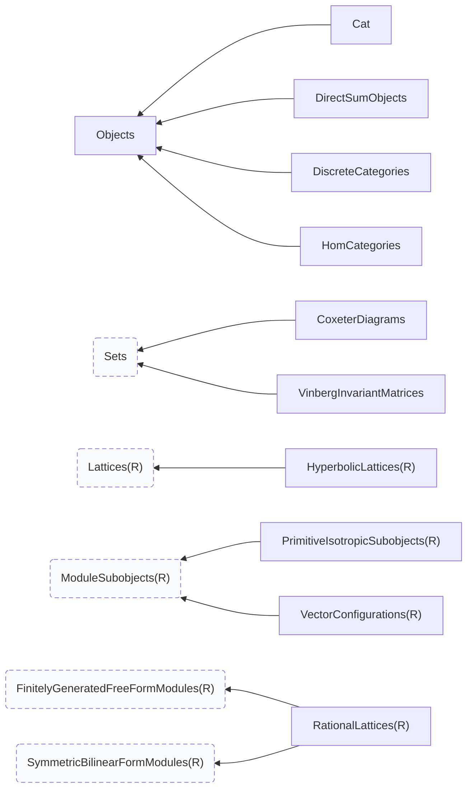
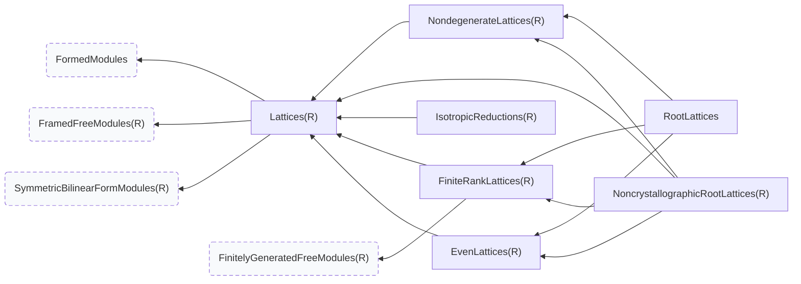
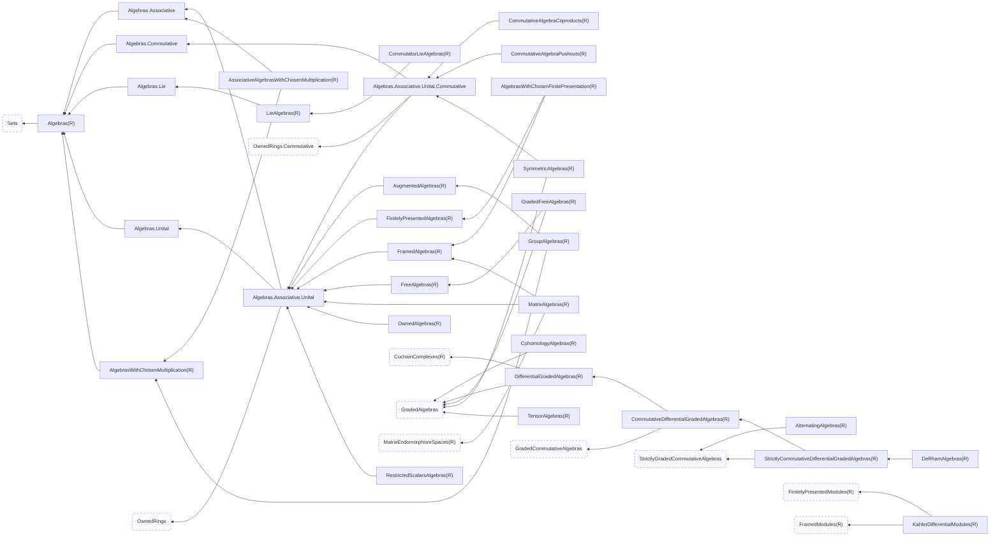
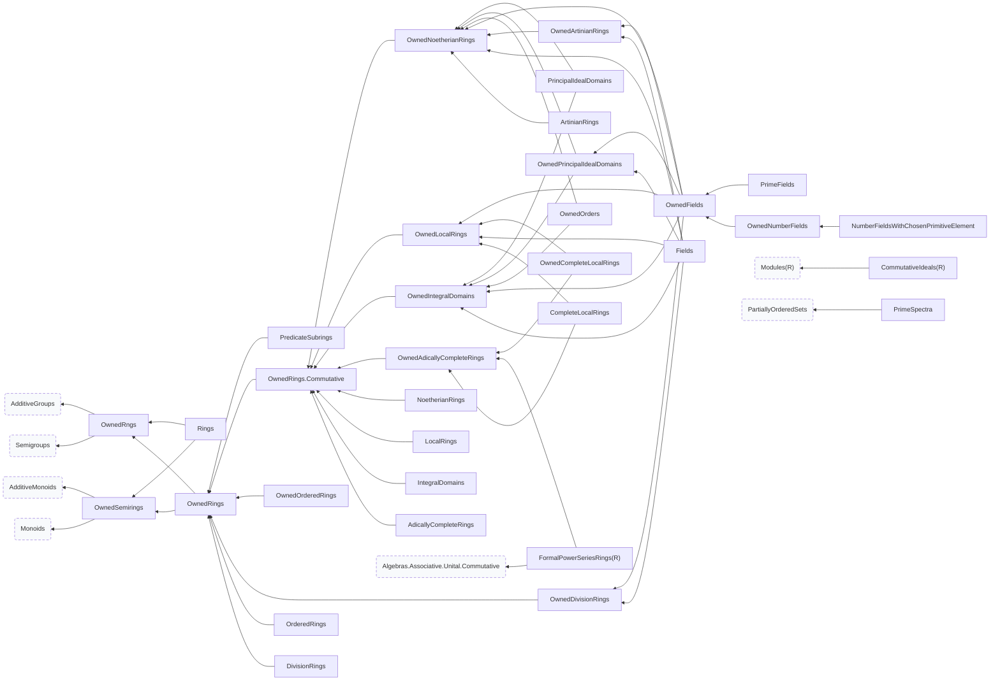
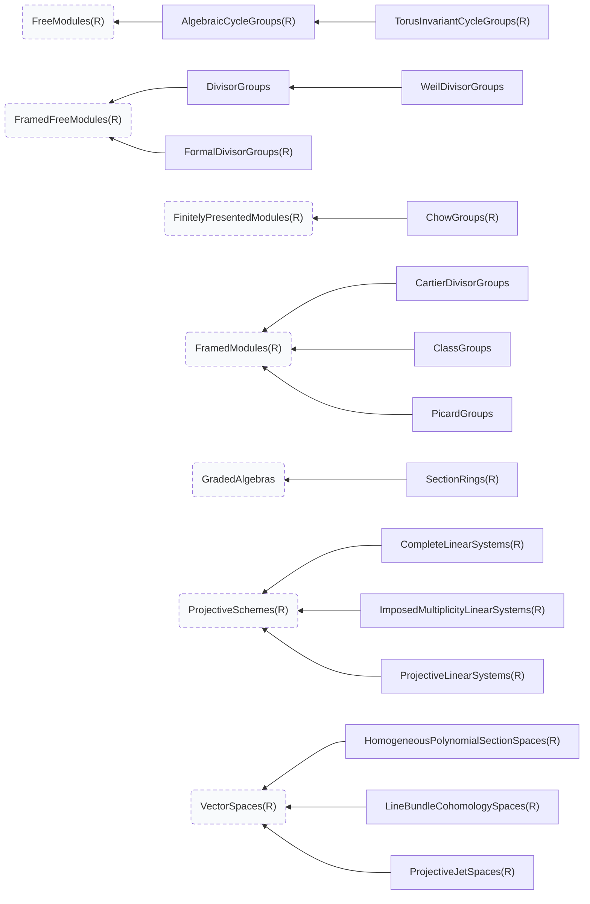
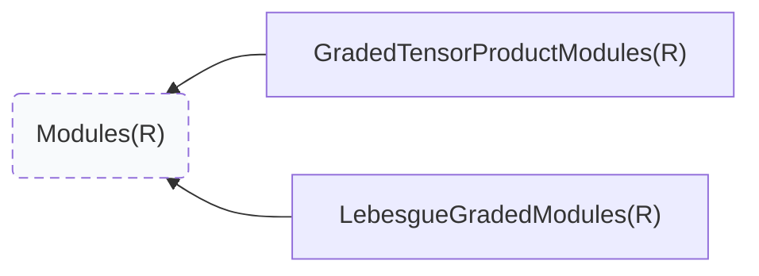
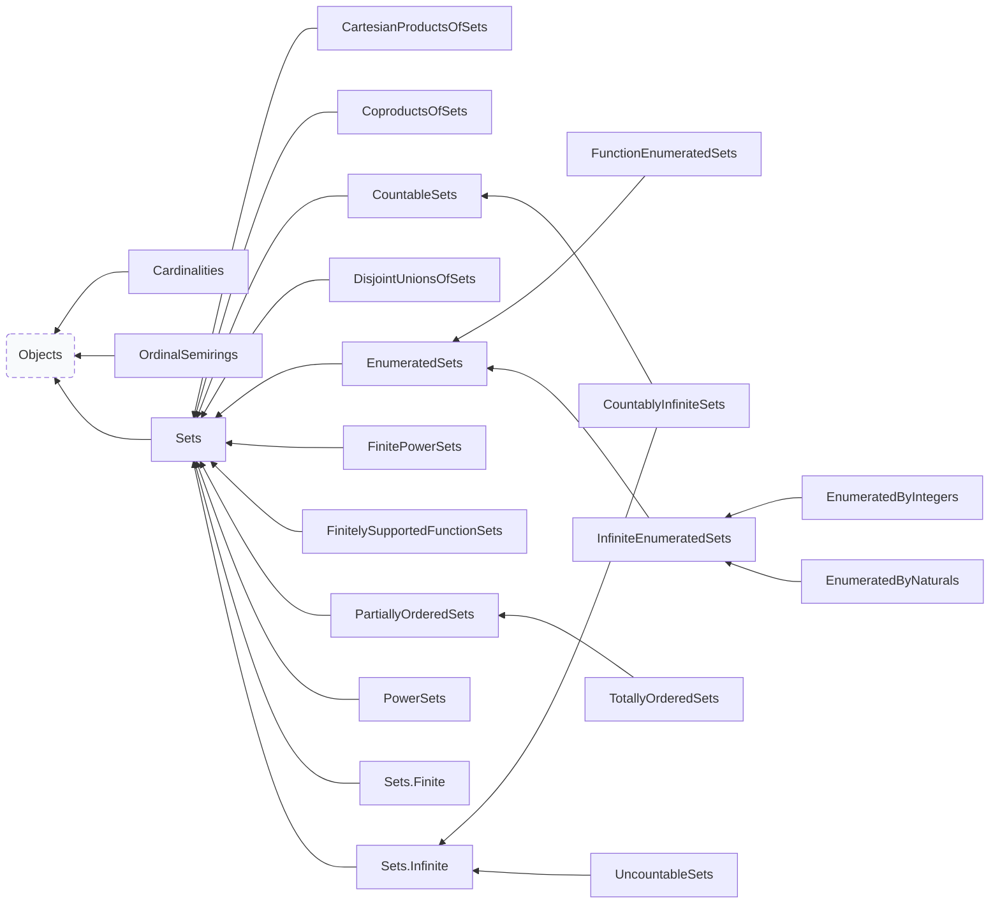
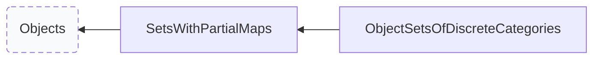

# The preamble, surveyed from a live session

This is the reference for what a session can build on: which categories
exist, what sits above and below each one, which operations an object of
each category answers to and where each operation is defined, which
functors move between categories, and which named specimens are on hand.

Everything here was read from a running session, not from the source text.
`super_categories` is a method, the base ring is an argument, and the
operations an object carries are assembled by Sage from the category graph
at runtime -- so a category's place and its methods are facts only a live
object can report.

```python
from dzack_research.preamble.all import *
```

## How to read an entry

A category parameterized by a ring is written `C(R)` and was probed at
`R = ZZ`; the relations hold for the parameter generally, and the
**probed as** line shows the object the survey actually held.

**Above** and **below** are the direct edges of the poset: `super_categories`
and its inverse. **Refines** is the transitive closure upward.

**Operations introduced here** are the ones this category *defines*.  Every
operation is written out once, at the category that owns it; a descendant
lists it under **inherited** with a link, because that is where placement
lives.  So an object of `C` answers to the union of the operations
introduced by `C` and by everything in its ancestry.

Operations are split by what they act on: **objects** of the category,
**elements** of those objects, and **morphisms** between them.

A category the survey could not build, or an operation whose signature
would not resolve, is recorded with the error rather than dropped.

The same survey is serialized to `docs/preamble-graph.json`, which carries
every operation name, so a question this prose cannot index is a `jq` away:

```bash
# which category owns discriminant_group?
jq -r '.categories | to_entries[]
      | select(.value.operations.objects[]?.name == "discriminant_group")
      | .key' docs/preamble-graph.json
```

The poset is drawn in `docs/preamble-graph.html` (pan and zoom), from
`docs/preamble-graph.dot`.

| | |
| :--- | ---: |
| categories in the poset | 327 |
| of those, built and interrogated | 235 |
| operations, each written once at its owner | 1957 |
| functors | 72, 11 of them with a domain and codomain resolved here |
| adjunctions | 22 |

## The category poset

An edge points from a category to a category it refines.  In the drawing the
arrow runs leftward and the chapters are boxed, so reading left is forgetting
structure and reading right is adding it; a dashed node is a category Sage
provides rather than one the preamble owns.

The top of the poset, refining nothing further: [`Objects`](#cat-objects).

The whole graph at once is [`preamble-graph.html`](preamble-graph.html); the diagrams below are its restriction to one chapter, together with any immediate supercategory that lies outside it.

## Getting from one category to another

Every functor the survey could build, indexed by where it starts.  This is
the table to read when the object you have and the object you want are in
different categories.

| from | functor | to |
| :--- | :--- | :--- |
| Category of abelian groups | [`AbelianGroupInclusionFunctor`](#fun-abeliangroupinclusionfunctor) | Category of groups |
| Category of discrete categories | [`ObjectSetFunctor`](#fun-objectsetfunctor) | Category of sets |
| Category of groups | [`AbelianizationFunctor`](#fun-abelianizationfunctor) | Category of abelian groups |
| Category of groups | [`GroupUnderlyingSetFunctor`](#fun-groupunderlyingsetfunctor) | Category of sets |
| Category of number fields | [`RingOfIntegersFunctor`](#fun-ringofintegersfunctor) | Category of owned orders |
| Category of owned orders | [`FractionFieldFunctor`](#fun-fractionfieldfunctor) | Category of number fields |
| Category of sets | [`FinitePowerSetFunctor`](#fun-finitepowersetfunctor) | Category of sets |
| Category of sets | [`FreeGroupFunctor`](#fun-freegroupfunctor) | Category of groups |
| Core of Category of sets | [`CardinalityFunctor`](#fun-cardinalityfunctor) | Category of cardinalities |
| Opposite of Category of sets | [`InverseImagePowerSetFunctor`](#fun-inverseimagepowersetfunctor) | Category of sets |
| Product of Opposite of Category of sets and Category of sets | [`ExponentialFunctor`](#fun-exponentialfunctor) | Category of sets |

### Adjunctions

| adjunction | left adjoint | | right adjoint |
| :--- | :--- | :---: | :--- |
| [`AbelianizationAdjunction`](#fun-abelianizationadjunction) | Abelianization functor | ⊣ | Inclusion of abelian groups into groups |
| [`FreeGroupUnderlyingSetAdjunction`](#fun-freegroupunderlyingsetadjunction) | Free-group functor | ⊣ | Underlying-set functor on groups |
| [`OrderNumberFieldAdjunction`](#fun-ordernumberfieldadjunction) | Fraction-field functor | ⊣ | Ring-of-integers functor |

80 further functors take data the survey does not choose for you (a ring map, a group, a subgroup pair); they are written out in their chapters with the arguments they want.

## Named specimens

Objects the catalogue has already built, with the invariants the survey could compute from them.

### `Embeddings` {#embeddings}

`src/dzack_research/preamble/catalogue.py:931`

| name | is | domain | codomain | category |
| :--- | :--- | :--- | :--- | :--- |
| `Embeddings.E8_2_into_TdP` | Generic morphism:
  From: Integral lattice of rank 8 and signature (0, 8)
  To:   Integral lattice of rank 20 and signature (2, 18) | Integral lattice of rank 8 and signature (0, 8) | Integral lattice of rank 20 and signature (2, 18) | Category of homsets of sets |
| `Embeddings.TCo_into_TEn` | Generic morphism:
  From: Integral lattice of rank 11 and signature (2, 9)
  To:   Integral lattice of rank 12 and signature (2, 10) | Integral lattice of rank 11 and signature (2, 9) | Integral lattice of rank 12 and signature (2, 10) | Category of homsets of sets |
| `Embeddings.TEn_into_TdP` | Generic morphism:
  From: Integral lattice of rank 12 and signature (2, 10)
  To:   Integral lattice of rank 20 and signature (2, 18) | Integral lattice of rank 12 and signature (2, 10) | Integral lattice of rank 20 and signature (2, 18) | Category of homsets of sets |
| `Embeddings.TdP_into_LK3` | Generic morphism:
  From: Integral lattice of rank 20 and signature (2, 18)
  To:   Integral lattice of rank 22 and signature (3, 19) | Integral lattice of rank 20 and signature (2, 18) | Integral lattice of rank 22 and signature (3, 19) | Category of homsets of sets |
| `Embeddings.TEn_into_LK3` | Generic morphism:
  From: Integral lattice of rank 12 and signature (2, 10)
  To:   Integral lattice of rank 22 and signature (3, 19) | Integral lattice of rank 12 and signature (2, 10) | Integral lattice of rank 22 and signature (3, 19) | Category of homsets of sets |
| `Embeddings.U_E8_2_into_TEn` | Generic morphism:
  From: Integral lattice of rank 10 and signature (1, 9)
  To:   Integral lattice of rank 12 and signature (2, 10) | Integral lattice of rank 10 and signature (1, 9) | Integral lattice of rank 12 and signature (2, 10) | Category of homsets of sets |

### `Involutions` {#involutions}

Named involutions of the K3 lattice in its displayed block framing.

`src/dzack_research/preamble/catalogue.py:902`

| name | is | domain | codomain | category |
| :--- | :--- | :--- | :--- | :--- |
| `Involutions.I_dP` | Generic endomorphism of Integral lattice of rank 22 and signature (3, 19) | Integral lattice of rank 22 and signature (3, 19) | Integral lattice of rank 22 and signature (3, 19) | Join of Category of groups and Category of endsets and Category of homsets of sets |
| `Involutions.I_En` | Generic endomorphism of Integral lattice of rank 22 and signature (3, 19) | Integral lattice of rank 22 and signature (3, 19) | Integral lattice of rank 22 and signature (3, 19) | Join of Category of groups and Category of endsets and Category of homsets of sets |
| `Involutions.I_Nik` | Generic endomorphism of Integral lattice of rank 22 and signature (3, 19) | Integral lattice of rank 22 and signature (3, 19) | Integral lattice of rank 22 and signature (3, 19) | Join of Category of groups and Category of endsets and Category of homsets of sets |

### `NamedLattices` {#namedlattices}

`src/dzack_research/preamble/catalogue.py:74`

| name | is | module_rank | signature_pair | discriminant | category |
| :--- | :--- | :--- | :--- | :--- | :--- |
| `NamedLattices.Zero` | Integral lattice of rank 0 and signature (0, 0) | 0 | (0, 0) | 1 | Join of Category of nondegenerate lattices and Category of even lattices and Category of finite-rank lattices |
| `NamedLattices.Z` | Integral lattice of rank 1 and signature (1, 0) | 1 | (1, 0) | 1 | Join of Category of nondegenerate lattices and Category of finite-rank lattices |
| `NamedLattices.Z_2` | Integral lattice of rank 1 and signature (1, 0) | 1 | (1, 0) | 2 | Join of Category of nondegenerate lattices and Category of even lattices and Category of finite-rank lattices |
| `NamedLattices.U` | Integral lattice of rank 2 and signature (1, 1) | 2 | (1, 1) | 1 | Join of Category of nondegenerate lattices and Category of even lattices and Category of finite-rank lattices |
| `NamedLattices.H` | Integral lattice of rank 2 and signature (1, 1) | 2 | (1, 1) | 1 | Join of Category of nondegenerate lattices and Category of even lattices and Category of finite-rank lattices |
| `NamedLattices.U_2` | Integral lattice of rank 2 and signature (1, 1) | 2 | (1, 1) | 4 | Join of Category of nondegenerate lattices and Category of even lattices and Category of finite-rank lattices |
| `NamedLattices.H_2` | Integral lattice of rank 2 and signature (1, 1) | 2 | (1, 1) | 4 | Join of Category of nondegenerate lattices and Category of even lattices and Category of finite-rank lattices |
| `NamedLattices.E8` | Integral lattice of rank 8 and signature (0, 8) | 8 | (0, 8) | 1 | Category of root lattices |
| `NamedLattices.E8_2` | Integral lattice of rank 8 and signature (0, 8) | 8 | (0, 8) | 256 | Join of Category of nondegenerate lattices and Category of even lattices and Category of finite-rank lattices |
| `NamedLattices.E10` | Integral lattice of rank 10 and signature (1, 9) | 10 | (1, 9) | 1 | Join of Category of nondegenerate lattices and Category of even lattices and Category of finite-rank lattices and Category of direct sum objects |
| `NamedLattices.E10_2` | Integral lattice of rank 10 and signature (1, 9) | 10 | (1, 9) | 1024 | Join of Category of nondegenerate lattices and Category of even lattices and Category of finite-rank lattices and Category of direct sum objects |
| `NamedLattices.Sdp` | Integral lattice of rank 2 and signature (1, 1) | 2 | (1, 1) | 4 | Join of Category of nondegenerate lattices and Category of even lattices and Category of finite-rank lattices |
| `NamedLattices.SEn` | Integral lattice of rank 10 and signature (1, 9) | 10 | (1, 9) | 1024 | Join of Category of nondegenerate lattices and Category of even lattices and Category of finite-rank lattices and Category of direct sum objects |
| `NamedLattices.Tco` | Integral lattice of rank 11 and signature (2, 9) | 11 | (2, 9) | 2048 | Join of Category of nondegenerate lattices and Category of even lattices and Category of finite-rank lattices |
| `NamedLattices.Sco` | Integral lattice of rank 11 and signature (1, 10) | 11 | (1, 10) | -2048 | Join of Category of nondegenerate lattices and Category of even lattices and Category of finite-rank lattices |
| `NamedLattices.TEn` | Integral lattice of rank 12 and signature (2, 10) | 12 | (2, 10) | 1024 | Join of Category of nondegenerate lattices and Category of even lattices and Category of finite-rank lattices |
| `NamedLattices.TdP` | Integral lattice of rank 20 and signature (2, 18) | 20 | (2, 18) | 4 | Join of Category of nondegenerate lattices and Category of even lattices and Category of finite-rank lattices |
| `NamedLattices.L_20_2_0` | Integral lattice of rank 20 and signature (2, 18) | 20 | (2, 18) | 4 | Join of Category of nondegenerate lattices and Category of even lattices and Category of finite-rank lattices |
| `NamedLattices.LK3` | Integral lattice of rank 22 and signature (3, 19) | 22 | (3, 19) | 1 | Join of Category of nondegenerate lattices and Category of even lattices and Category of finite-rank lattices |
| `NamedLattices.LK3_2` | Integral lattice of rank 21 and signature (2, 19) | 21 | (2, 19) | -2 | Join of Category of nondegenerate lattices and Category of even lattices and Category of finite-rank lattices |
| `NamedLattices.LK3_4` | Integral lattice of rank 21 and signature (2, 19) | 21 | (2, 19) | -4 | Join of Category of nondegenerate lattices and Category of even lattices and Category of finite-rank lattices |
| `NamedLattices.LpNik` | Integral lattice of rank 14 and signature (3, 11) | 14 | (3, 11) | 256 | Join of Category of nondegenerate lattices and Category of even lattices and Category of finite-rank lattices |
| `NamedLattices.LmNik` | Integral lattice of rank 8 and signature (0, 8) | 8 | (0, 8) | 256 | Join of Category of nondegenerate lattices and Category of even lattices and Category of finite-rank lattices |
| `NamedLattices.Mukai` | Integral lattice of rank 24 and signature (4, 20) | 24 | (4, 20) | 1 | Join of Category of nondegenerate lattices and Category of even lattices and Category of finite-rank lattices |
| `NamedLattices.MukaiExtended` | Integral lattice of rank 26 and signature (5, 21) | 26 | (5, 21) | 1 | Join of Category of nondegenerate lattices and Category of even lattices and Category of finite-rank lattices |
| `NamedLattices.MukaiAbelian` | Integral lattice of rank 8 and signature (4, 4) | 8 | (4, 4) | 1 | Join of Category of nondegenerate lattices and Category of even lattices and Category of finite-rank lattices |
| `NamedLattices.MukaiAbelianExtended` | Integral lattice of rank 10 and signature (5, 5) | 10 | (5, 5) | 1 | Join of Category of nondegenerate lattices and Category of even lattices and Category of finite-rank lattices |
| `NamedLattices.U_E8_2` | Integral lattice of rank 10 and signature (1, 9) | 10 | (1, 9) | 256 | Join of Category of nondegenerate lattices and Category of even lattices and Category of finite-rank lattices and Category of direct sum objects |
| `NamedLattices.BogachevKolpakovNonReflective` | Integral lattice of rank 3 and signature (1, 2) | 3 | (1, 2) | -2401 | Join of Category of nondegenerate lattices and Category of finite-rank lattices |
| `NamedLattices.BogachevKolpakovWithoutRoots` | Integral lattice of rank 3 and signature (1, 2) | 3 | (1, 2) | -117649 | Join of Category of nondegenerate lattices and Category of finite-rank lattices |
| `NamedLattices.A1` | Integral lattice of rank 1 and signature (0, 1) | 1 | (0, 1) | -2 | Category of root lattices |
| `NamedLattices.D4` | Integral lattice of rank 4 and signature (0, 4) | 4 | (0, 4) | 4 | Category of root lattices |
| `NamedLattices.D6` | Integral lattice of rank 6 and signature (0, 6) | 6 | (0, 6) | -4 | Category of root lattices |
| `NamedLattices.D8` | Integral lattice of rank 8 and signature (0, 8) | 8 | (0, 8) | 4 | Category of root lattices |
| `NamedLattices.E7` | Integral lattice of rank 7 and signature (0, 7) | 7 | (0, 7) | 2 | Category of root lattices |
| `NamedLattices.Z_m2` | Integral lattice of rank 1 and signature (0, 1) | 1 | (0, 1) | -2 | Join of Category of nondegenerate lattices and Category of even lattices and Category of finite-rank lattices |

## Abstract Category Theory & Universal Constructions

> Category of categories (Cat), Arrow and Slice categories, Limits, Colimits, Biproducts, Subobjects, and Diagram categories.



### Categories

Ordered by depth: the least structured first.

#### `Objects` {#cat-objects}

The root of the owned mathematical category graph.

```text
This category carries no mathematical supercategory. Sage's own
``Objects``/``Sets`` categories remain runtime substrate only and are not
semantic ancestors of owned categories.
```

- **not exported**: reachable only as a supercategory
- **probed as** `Category of represented mathematical objects`
- **below** [`AffineGroupSchemes(R)`](#cat-affinegroupschemes), [`Cardinalities`](#cat-cardinalities), [`Cat`](#cat-cat), [`DirectSumObjects`](#cat-directsumobjects), [`DiscreteCategories`](#cat-discretecategories), [`HomCategories`](#cat-homcategories), [`OrdinalSemirings`](#cat-ordinalsemirings), [`Sets`](#cat-sets), [`SetsWithPartialMaps`](#cat-setswithpartialmaps)
- **build an object** `Objects(x, *args, **opts)`

**Operations introduced here** (1 on objects)

*on objects*

- `ElementType()`
  - The root of the owned mathematical category graph.

**Inherited operations**, defined where they are owned:

| from | objects | elements | morphisms |
| :--- | ---: | ---: | ---: |
| `Parent` | 15 |  |  |
| `CategoryObject` | 14 |  |  |
| `SageObject` | 8 |  |  |

#### `Cat` {#cat-cat}

The represented category of categories.

```text
``Cat`` deliberately does not take the owned base that makes a category an
object of ``Cat``.  Applying it here would assert a self-membership
statement and would make ``Cat().Mor(Cat(), Cat())`` an apparent
1-categorical construction; that higher level is not modelled.  Every
other owned category is such an object.
```

- **defined at** `src/dzack_research/preamble/categories/abstract_categories/cat.py:196`
- **probed as** `Category of categories`
- **above** [`Objects`](#cat-objects)
- **refines**, transitively, in Sage's linearization order: [`Objects`](#cat-objects)
- **build an object** `Cat(x, *args, **opts)`

**Operations introduced here** (18 on objects)

*on objects*

- `ArrowCategory() -> 'Category'`
  - Return \(\mathrm{Ar}(C)=\mathrm{Fun}([1],C)\).
- `Core() -> 'Category'`
  - Return the maximal groupoid inside this category.
- `CosliceUnder(base_object: 'Parent') -> 'Category'`
  - Return the coslice \(X/C\).
- `CoveredObjectCategory(base_object: 'Parent') -> 'Category'`
  - Return the category of epic quotients covered by ``base_object`` here.
- `CoveredObjects(base_object: 'Parent') -> 'Category'`
- `CoveringObjectCategory(base_object: 'Parent') -> 'Category'`
  - Return the category of epic objects covering ``base_object`` here.
- `CoveringObjects(base_object: 'Parent') -> 'Category'`
- `ElementType() -> 'type[Element]'` <sub>read as an attribute</sub>
  - Return the complete implementation type for their elements.
- `ObjectType() -> 'type[Parent]'` <sub>read as an attribute</sub>
  - Return the complete implementation type for objects of this category.
- `SliceOver(base_object: 'Parent') -> 'Category'`
  - Return the slice \(C/X\).
- `SubobjectCategory(base_object: 'Parent') -> 'Category'`
  - Return the category of subobjects of ``base_object`` here.
- `Subobjects(base_object: 'Parent') -> 'Category'`
- `SuperobjectCategory(base_object: 'Parent') -> 'Category'`
  - Return the category of monic superobjects of ``base_object`` here.
- `Superobjects(base_object: 'Parent') -> 'Category'`
- `fiber_product(left_leg: 'Morphism', right_leg: 'Morphism') -> 'Parent'`
  - Return the fiber product of the cospan these two legs form.
- `opposite() -> 'Category'`
  - Return \(C^{op}\).
- `pushout(left_leg: 'Morphism', right_leg: 'Morphism') -> 'Parent'`
  - Return the pushout of the span these two legs form.
- `span(left_leg: 'Morphism', right_leg: 'Morphism') -> 'Parent'`
  - Return the span these two legs form, as an object of this category.

#### `DirectSumObjects` {#cat-directsumobjects}

Objects carrying a selected ordered family of direct summands.

- **defined at** `src/dzack_research/preamble/categories/abstract_categories/direct_sum_objects.py:17`
- **probed as** `Category of direct sum objects`
- **above** [`Objects`](#cat-objects)
- **below** [`BiproductModules(R)`](#cat-biproductmodules)
- **refines**, transitively, in Sage's linearization order: [`Objects`](#cat-objects)
- **build an object** `DirectSumObjects(x, *args, **opts)`
- **specimens** `NamedLattices.E10`, `NamedLattices.E10_2`, `NamedLattices.SEn`, `NamedLattices.U_E8_2`

**Operations introduced here** (5 on objects)

*on objects*

- `ElementType()`
  - Objects carrying a selected ordered family of direct summands.
- `number_of_summands() -> sage.structure.parent.Parent`
- `summand(label: ~LabelT) -> sage.structure.parent.Parent`
- `summand_index_set() -> sage.structure.parent.Parent`
- `summands() -> dzack_research.preamble.categories.sets.indexed_families.IndexedFamily`

**Inherited operations**, defined where they are owned:

| from | objects | elements | morphisms |
| :--- | ---: | ---: | ---: |
| `Parent` | 15 |  |  |
| `CategoryObject` | 14 |  |  |
| `SageObject` | 8 |  |  |
| [`Objects`](#cat-objects) | 1 |  |  |

#### `DiscreteCategories` {#cat-discretecategories}

The category of represented discrete categories.

- **defined at** `src/dzack_research/preamble/categories/abstract_categories/functors.py:361`
- **probed as** `Category of discrete categories`
- **above** [`Objects`](#cat-objects)
- **refines**, transitively, in Sage's linearization order: [`Objects`](#cat-objects)
- **build an object** `DiscreteCategories(x, *args, **opts)`

**Operations introduced here** (1 on objects)

*on objects*

- `ElementType()`
  - The category of represented discrete categories.

**Inherited operations**, defined where they are owned:

| from | objects | elements | morphisms |
| :--- | ---: | ---: | ---: |
| `Parent` | 15 |  |  |
| `CategoryObject` | 14 |  |  |
| `SageObject` | 8 |  |  |
| [`Objects`](#cat-objects) | 1 |  |  |

#### `HomCategories` {#cat-homcategories}

The category of represented fixed-endpoint Hom categories.

- **defined at** `src/dzack_research/preamble/categories/abstract_categories/hom_categories.py:837`
- **probed as** `Category of hom categories`
- **above** [`Objects`](#cat-objects)
- **refines**, transitively, in Sage's linearization order: [`Objects`](#cat-objects)
- **build an object** `HomCategories(x, *args, **opts)`

**Operations introduced here** (1 on objects)

*on objects*

- `ElementType()`
  - The category of represented fixed-endpoint Hom categories.

**Inherited operations**, defined where they are owned:

| from | objects | elements | morphisms |
| :--- | ---: | ---: | ---: |
| `Parent` | 15 |  |  |
| `CategoryObject` | 14 |  |  |
| `SageObject` | 8 |  |  |
| [`Objects`](#cat-objects) | 1 |  |  |

#### `CoxeterDiagrams` {#cat-coxeterdiagrams}

Finite Coxeter diagrams: a symmetric matrix of vertex angles.

- **defined at** `src/dzack_research/preamble/categories/coxeter_diagrams.py:144`
- **probed as** `Category of Coxeter diagrams`
- **above** [`Sets`](#cat-sets)
- **refines**, transitively, in Sage's linearization order: [`Sets`](#cat-sets) · [`Objects`](#cat-objects)
- **build an object** `CoxeterDiagrams(x, *args, **opts)`

**Operations introduced here** (61 on objects)

*on objects*

- `ElementType()`
  - Finite Coxeter diagrams: a symmetric matrix of vertex angles.
- `Aut()`
  - Return the group of diagram automorphisms.
- `cardinality()`
- `component_scaled_cartan_types()`
  - Return the component-indexed family of scaled Cartan types, retaining multiplicity.
- `connected_components()`
  - Return the connected components, as induced subdiagrams.
- `coxeter_entry(left, right)`
- `coxeter_group()`
  - Return the Coxeter group \(W\) of this diagram.
- `coxeter_matrix()`
- `drawing_conventions()`
- `edge_weight(left, right)`
- `elliptic_subdiagram_orbit_poset(*, connected=False)`
  - Return the elliptic subdiagram orbits in the orbit order.
- `elliptic_subdiagram_orbits(*, connected=False)`
  - Return one elliptic induced subdiagram per :meth:`Aut`-orbit.
- `elliptic_subdiagram_poset(*, connected=False)`
  - Return the elliptic induced subdiagrams ordered by inclusion.
- `elliptic_subdiagrams(*, connected=False)`
  - Return the elliptic induced subdiagrams.
- `equivariant_positions(automorphism)`
  - Return exact planar positions intertwining a finite diagram automorphism.
- `finitely_presented_coxeter_group()`
  - Return the same owned Coxeter group, which retains its defining presentation.
- `graph()`
  - Return the Coxeter graph: one vertex per mirror, edges labelled by the bond.
- `hom(images, codomain)`
- `index_set()`
- `induced_subdiagram(vertices)`
- `is_connected() -> bool`
  - Return whether this diagram has exactly one connected component.
- `is_elliptic() -> bool`
- `is_hyperbolic() -> bool`
- `is_parabolic() -> bool`
- `is_rooted() -> bool`
- `maximal_elliptic_subdiagrams(*, connected=False)`
  - Return the elliptic induced subdiagrams maximal for inclusion.
- `maximal_parabolic_subdiagrams(*, connected=False)`
  - Return the parabolic induced subdiagrams maximal for inclusion.
- `mirrors_are_divergent(left, right) -> bool`
  - Return whether the two mirrors diverge (are ultraparallel).
- `mirrors_are_parallel(left, right) -> bool`
  - Return whether the two mirrors are parallel.
- `negative_inertia_index()`
  - Return \(n_-\), the negative index of inertia of the Schlaefli form.
- `node_color(vertex)`
  - Return the archived rooted-diagram fill convention determined by root square.
- `num_vertices()`
- `parabolic_subdiagram_orbit_poset(*, connected=False)`
  - Return the parabolic subdiagram orbits in the orbit order.
- `parabolic_subdiagram_orbits(*, connected=False)`
  - Return one parabolic induced subdiagram per :meth:`Aut`-orbit.
- `parabolic_subdiagram_poset(*, connected=False)`
  - Return the parabolic induced subdiagrams ordered by inclusion.
- `parabolic_subdiagrams(*, connected=False)`
  - Return the parabolic induced subdiagrams.
- `plot(**options)`
- `positive_inertia_index()`
  - Return \(n_+\), the positive index of inertia of the Schlaefli form.
- `preferred_positions()`
  - Return stored presentation coordinates, or a computed graph layout.
- `root(vertex)`
  - Return the selected realizing root attached to ``vertex``.
- `root_gram_tensor()`
- `root_intersection_graph()`
  - Return the graph of root squares and root pairings.
- `root_lattice()`
  - Return the abstract lattice presented by the root Gram.
- `root_morphism()`
  - Return the morphism carrying each formal root to its realization.
- `root_realization()`
  - Return the lattice in which the diagram roots are realized.
- `roots()`
- `scaled_cartan_type()`
  - Recognize a connected elliptic crystallographic rooted diagram as ``(type, scale)``.
- `schlafli_tensor()`
  - Return the normalized reflection Gram tensor ``S_ii=1``.
- `schlaflian()`
  - Return \(\det C\) for the Schlaefli matrix \(C\) of this diagram.
- `subdiagram(vertices)`
- `subdiagram_orbit_poset(orbits)`
  - Return the orbit-inclusion poset on the supplied representatives.
- `subdiagram_orbits()`
  - Return one induced subdiagram per :meth:`Aut`-orbit.
- `subdiagram_poset()`
  - Return every induced subdiagram, ordered by inclusion of vertices.
- `tikz(**_options)`
- `tikz_picture()`
  - Return a TikZ view of this live Coxeter diagram.
- `vertex(position)`
- `vertex_names()`
- `vertex_weight(vertex)`
- `vertices()`
- `vinberg_invariant_matrix()`
  - Return the Vinberg invariant matrix of this diagram.
- `zero_inertia_index()`
  - Return \(n_0\), the dimension of the radical of the Schlaefli form.

**Inherited operations**, defined where they are owned:

| from | objects | elements | morphisms |
| :--- | ---: | ---: | ---: |
| `Parent` | 15 |  |  |
| `CategoryObject` | 14 |  |  |
| `SageObject` | 8 |  |  |
| [`Sets`](#cat-sets) | 7 |  |  |
| [`Objects`](#cat-objects) | 1 |  |  |

#### `VinbergInvariantMatrices` {#cat-vinberginvariantmatrices}

Symmetric matrices of Vinberg invariants on a finite set of mirrors.

- **defined at** `src/dzack_research/preamble/categories/vinberg_invariants.py:356`
- **probed as** `Category of Vinberg invariant matrices`
- **above** [`Sets`](#cat-sets)
- **refines**, transitively, in Sage's linearization order: [`Sets`](#cat-sets) · [`Objects`](#cat-objects)
- **build an object** `VinbergInvariantMatrices(x, *args, **opts)`

**Operations introduced here** (19 on objects)

*on objects*

- `ElementType()`
  - Symmetric matrices of Vinberg invariants on a finite set of mirrors.
- `base_ring()`
- `cardinality()`
- `coxeter_diagram()`
  - Return the Coxeter diagram of this invariant matrix.
- `coxeter_entry(left, right)`
  - Return the Coxeter bond \(m\) between the two mirrors.
- `coxeter_matrix()`
  - Return the Coxeter matrix this invariant matrix determines.
- `index_set()`
  - Return the ordered set of mirrors this matrix is indexed by.
- `is_compact_hyperbolic() -> bool`
  - Return whether this is a Lannér diagram.
- `is_crystallographic() -> bool`
  - Return whether every bond is \(2, 3, 4, 6\) or \(\infty\).
- `is_elliptic() -> bool`
  - Return whether the Schlaefli form is positive definite.
- `is_hyperbolic() -> bool`
  - Return whether the Schlaefli form has negative index of inertia one.
- `is_parabolic() -> bool`
  - Return whether the Schlaefli form is positive semidefinite of corank one.
- `is_paracompact_hyperbolic() -> bool`
  - Return whether this is a quasi-Lannér diagram.
- `is_simply_laced() -> bool`
  - Return whether every bond is \(2\) or \(3\).
- `projective_line()`
  - Return \(\mathbb P^1(R)\), where the invariants take their values.
- `submatrix(mirrors)`
  - Return the invariant matrix on the selected mirrors.
- `vinberg_invariant(left, right)`
  - Return \([4b(r,s)^2 : q(r)q(s)]\in\mathbb P^1(R)\) for the two mirrors.
- `vinberg_ratio(left, right)`
  - Return the dehomogenized invariant \(t=4\cos^2(\pi/m)\).
- `weighted_graph()`
  - Return the projectively weighted graph of mirrors.

**Inherited operations**, defined where they are owned:

| from | objects | elements | morphisms |
| :--- | ---: | ---: | ---: |
| `Parent` | 15 |  |  |
| `CategoryObject` | 14 |  |  |
| `SageObject` | 8 |  |  |
| [`Sets`](#cat-sets) | 7 |  |  |
| [`Objects`](#cat-objects) | 1 |  |  |

#### `PrimitiveIsotropicSubobjects(R)` {#cat-primitiveisotropicsubobjects}

Primitive totally isotropic subobjects of a lattice over `R`.

```text
Membership states two facts about the chosen monomorphism ``iota``: the
form of the codomain restricts to zero along it, and its cokernel is
torsion free.  Both are checked at admission by ``primitive_isotropic``.
```

- **defined at** `src/dzack_research/preamble/categories/isotropic_parabolics.py:50`
- **probed as** `Category of primitive totally isotropic subobjects`
- **above** [`ModuleSubobjects(R)`](#cat-modulesubobjects)
- **refines**, transitively, in Sage's linearization order: [`ModuleSubobjects(R)`](#cat-modulesubobjects) · [`Modules(R)`](#cat-modules) · [`AdditiveGroups.AdditiveCommutative`](#cat-additivegroups-additivecommutative) · [`AdditiveGroups`](#cat-additivegroups) · [`AdditiveMonoids`](#cat-additivemonoids) · [`AdditiveSemigroups`](#cat-additivesemigroups) · [`AdditiveMagmas`](#cat-additivemagmas) · [`Sets`](#cat-sets) · [`Objects`](#cat-objects)
- **build an object** `PrimitiveIsotropicSubobjects(R)(x, *args, **opts)`

**Operations introduced here** (17 on objects)

*on objects*

- `ElementType()`
  - Primitive totally isotropic subobjects of a lattice over ``R``.
- `acts_trivially_on_isotropic_reduction(automorphism) -> bool`
  - Return whether ``(g - 1)(I^perp)`` lies in ``iota(I)``.
- `ambient_lattice()`
  - Return the lattice this isotropic subobject sits in.
- `eichler_transvection(orthogonal_vector)`
  - Return the Eichler transvection ``E_{f,x}`` of this isotropic line.
- `into_perpendicular()` <sub>cached</sub>
  - Return ``I -> I^perp``, the inclusion factored through its own perpendicular.
- `is_equivalent_to(other) -> bool`
  - Return whether ``O(L)`` carries this isotropic subobject to ``other``.
- `is_totally_isotropic() -> bool`
  - Return whether the codomain's form restricts to zero along the inclusion.
- `isotropic_perpendicular()` <sub>cached</sub>
  - Return ``I^perp`` as a subobject of the same lattice.
- `isotropic_quotient()` <sub>cached</sub>
  - Return the represented module ``I^perp/I``.
- `isotropic_quotient_projection()`
  - Return the projection ``I^perp ->> I^perp/I``.
- `levi_quotient_action(automorphism)`
  - Return the descent of ``g`` to ``I^perp/I`` for ``g`` in ``P_I``.
- `levi_restriction(automorphism)`
  - Return ``g|_I`` in ``GL(I)`` for ``g`` in the parabolic subgroup.
- `parabolic_subgroup()` <sub>cached</sub>
  - Return ``P_I = Stab_{O(L)}(I)`` as a predicate subgroup of ``O(L)``.
- `stabilizes(automorphism) -> bool`
  - Return whether ``automorphism`` carries this subobject onto itself.
- `transporter_witness_to(other)`
  - Return one ``g`` in ``O(L)`` with ``g(I) = other``, or ``None``.
- `unipotent_group_generators()`
  - Return the Eichler transvections on a framing of ``f^perp``.
- `unipotent_radical()` <sub>cached</sub>
  - Return ``U_I``, the kernel of ``P_I -> GL(I) x O(I^perp/I)``.

**Inherited operations**, defined where they are owned:

| from | objects | elements | morphisms |
| :--- | ---: | ---: | ---: |
| [`Modules(R)`](#cat-modules) | 28 |  |  |
| `Parent` | 15 |  |  |
| `CategoryObject` | 14 |  |  |
| [`ModuleSubobjects(R)`](#cat-modulesubobjects) | 11 |  |  |
| `SageObject` | 8 |  |  |
| [`Sets`](#cat-sets) | 7 |  |  |
| [`AdditiveGroups`](#cat-additivegroups) | 2 |  |  |
| [`AdditiveMonoids`](#cat-additivemonoids) | 2 |  |  |
| [`AdditiveMagmas`](#cat-additivemagmas) | 1 |  |  |
| [`AdditiveSemigroups`](#cat-additivesemigroups) | 1 |  |  |
| [`Objects`](#cat-objects) | 1 |  |  |

#### `VectorConfigurations(R)` {#cat-vectorconfigurations}

Sublattices with a chosen ordered framing, regarded as vector configurations.

```text
Membership adds no property to the sublattice: it selects the framing as
the datum the operations below consume, which is what distinguishes a
configuration from the sublattice it spans.
```

- **defined at** `src/dzack_research/preamble/categories/vector_configurations.py:46`
- **probed as** `Category of vector configurations`
- **above** [`ModuleSubobjects(R)`](#cat-modulesubobjects)
- **refines**, transitively, in Sage's linearization order: [`ModuleSubobjects(R)`](#cat-modulesubobjects) · [`Modules(R)`](#cat-modules) · [`AdditiveGroups.AdditiveCommutative`](#cat-additivegroups-additivecommutative) · [`AdditiveGroups`](#cat-additivegroups) · [`AdditiveMonoids`](#cat-additivemonoids) · [`AdditiveSemigroups`](#cat-additivesemigroups) · [`AdditiveMagmas`](#cat-additivemagmas) · [`Sets`](#cat-sets) · [`Objects`](#cat-objects)
- **build an object** `VectorConfigurations(R)(x, *args, **opts)`

**Operations introduced here** (12 on objects)

*on objects*

- `ElementType()`
  - Sublattices with a chosen ordered framing, regarded as vector configurations.
- `ambient_isometry(position_map)`
  - Return the lifted element of ``O(L)`` when the framing bases ``L``.
- `ambient_isometry_from_automorphism(automorphism)`
  - Lift a graph automorphism to ``O(L)`` when the configuration frames ``L``.
- `canonical_pairing_matrix(algorithm=None)`
  - Return the Gram matrix in the canonical pairing-graph order.
- `canonical_position_map(algorithm=None)`
  - Return the framing-position map to canonical graph positions.
- `configuration_automorphism_group(algorithm=None)` <sub>cached</sub>
  - Return framing permutations preserving every pairing.
- `configuration_isometry(position_map)`
  - Return the isometry of the framed sublattice permuting the framing.
- `configuration_isometry_from_automorphism(automorphism)`
  - Lift one owned pairing-graph automorphism through libGAP.
- `configuration_positions()`
  - Return the ordered index set framing this configuration.
- `diagram_automorphism_isometries()`
  - Return the sublattice isometries lifted from every graph automorphism.
- `frames_its_lattice() -> bool`
  - Return whether the framing is a basis of the whole lattice.
- `preserves_every_pairing(position_map) -> bool`
  - Return whether a framing permutation preserves all squares and pairings.

**Inherited operations**, defined where they are owned:

| from | objects | elements | morphisms |
| :--- | ---: | ---: | ---: |
| [`Modules(R)`](#cat-modules) | 28 |  |  |
| `Parent` | 15 |  |  |
| `CategoryObject` | 14 |  |  |
| [`ModuleSubobjects(R)`](#cat-modulesubobjects) | 11 |  |  |
| `SageObject` | 8 |  |  |
| [`Sets`](#cat-sets) | 7 |  |  |
| [`AdditiveGroups`](#cat-additivegroups) | 2 |  |  |
| [`AdditiveMonoids`](#cat-additivemonoids) | 2 |  |  |
| [`AdditiveMagmas`](#cat-additivemagmas) | 1 |  |  |
| [`AdditiveSemigroups`](#cat-additivesemigroups) | 1 |  |  |
| [`Objects`](#cat-objects) | 1 |  |  |

#### `HyperbolicLattices(R)` {#cat-hyperboliclattices}

Lattices whose form has exactly one negative index of inertia.

```text
A lattice enters this category by being handed to it:
``HyperbolicLattices(ZZ)(L)`` checks the signature and refines ``L``,
returning the same object with the reflection algorithms available on it.
```

- **defined at** `src/dzack_research/preamble/categories/hyperbolic_lattices.py:582`
- **probed as** `Category of hyperbolic lattices`
- **above** [`Lattices(R)`](#cat-lattices)
- **refines**, transitively, in Sage's linearization order: [`Lattices(R)`](#cat-lattices) · [`SymmetricBilinearFormModules(R)`](#cat-symmetricbilinearformmodules) · [`FramedFreeModules(R)`](#cat-framedfreemodules) · [`FreeModules(R)`](#cat-freemodules) · [`BilinearFormModules(R)`](#cat-bilinearformmodules) · [`ProjectiveModules(R)`](#cat-projectivemodules) · [`FramedModules(R)`](#cat-framedmodules) · [`FormModules(R)`](#cat-formmodules) · [`Modules(R)`](#cat-modules) · [`AdditiveGroups.AdditiveCommutative`](#cat-additivegroups-additivecommutative) · [`AdditiveGroups`](#cat-additivegroups) · [`AdditiveMonoids`](#cat-additivemonoids) · [`AdditiveSemigroups`](#cat-additivesemigroups) · [`AdditiveMagmas`](#cat-additivemagmas) · [`FormedModules`](#cat-formedmodules) · [`PairedModules`](#cat-pairedmodules) · [`Sets`](#cat-sets) · [`Objects`](#cat-objects)
- **build an object** `HyperbolicLattices(R)(x, *args, **opts)`

**Operations introduced here** (19 on objects)

*on objects*

- `ElementType()`
  - Lattices whose form has exactly one negative index of inertia.
- `allcock_edgewalk()`
  - Return Allcock's full owned fundamental-domain report.
- `chamber_complex(controlling_vector=None, *, max_roots=None, max_decompositions=None)`
  - Return the lazy Weyl complex generated by the exact fundamental chamber.
- `coxeter_polyhedron(timelike, controlling_vector=None, *, max_roots=None, max_decompositions=None)`
  - Projectivize the exact root chamber in the component selected by ``timelike``.
- `dominant_cone(controlling_vector=None, *, max_roots=None, max_decompositions=None)`
  - Return the closed dominant cone defined by the selected simple roots.
- `edgewalk_is_reflective() -> bool`
  - Return whether \(W(L)\) has finite index in \(O(L)\).
- `edgewalk_simple_roots()`
  - Return the simple roots of the polyhedron the edgewalk walked.
- `fundamental_chamber(controlling_vector=None, *, max_roots=None, max_decompositions=None)`
  - Return the exact root-half-space cone cut out by Vinberg's walls.
- `hyperbolic_space(timelike)` <sub>cached</sub>
  - Return the projectivization of the positive-cone component containing ``timelike``.
- `is_cocompact(controlling_vector=None, *, max_roots=None, max_decompositions=None)`
  - Return whether \(W(L)\) acts cocompactly, or ``Unknown``.
- `is_reflective(controlling_vector=None, *, max_roots=None, max_decompositions=None)`
  - Return whether \(W(L)\) has finite index in \(O(L)\), or ``Unknown``.
- `isotropic_elements_below_height(timelike, height)`
  - Return the isotropic \(v\in L\) with \(\lvert b(v,t)\rvert\leq h\).
- `positive_cone_component(timelike)` <sub>cached</sub>
  - Return the chosen component of ``{x:q(x)>0}`` containing ``timelike``.
- `possible_root_lengths()`
  - Return the values \(\lvert q(r)\rvert\) a root of this lattice can take.
- `reflection_coxeter_diagram(controlling_vector=None, *, max_roots=None, max_decompositions=None)`
  - Return the Coxeter diagram of the fundamental polyhedron.
- `reflection_group(controlling_vector=None, *, max_roots=None, max_decompositions=None)`
  - Return \(W(L)\leq O(L)\), generated by the reflections in the roots.
- `vinberg_algorithm(controlling_vector=None, *, max_roots=None, max_decompositions=None)`
  - Return the roots accepted by Vinberg's algorithm.
- `vinberg_simple_roots(controlling_vector=None, *, max_roots=None, max_decompositions=None)`
  - Return the roots Vinberg's algorithm accepted.
- `weyl_group(controlling_vector=None, *, max_roots=None, max_decompositions=None)`
  - Return the reflection/Weyl subgroup \(W(L)\leq O(L)\).

**Inherited operations**, defined where they are owned:

| from | objects | elements | morphisms |
| :--- | ---: | ---: | ---: |
| [`Lattices(R)`](#cat-lattices) | 154 | 24 |  |
| [`Modules(R)`](#cat-modules) | 28 |  |  |
| [`FormModules(R)`](#cat-formmodules) | 20 | 5 |  |
| `Parent` | 15 |  |  |
| `CategoryObject` | 14 |  |  |
| [`FramedFreeModules(R)`](#cat-framedfreemodules) | 13 |  |  |
| [`FramedModules(R)`](#cat-framedmodules) | 11 |  |  |
| `SageObject` | 8 |  |  |
| [`SymmetricBilinearFormModules(R)`](#cat-symmetricbilinearformmodules) | 8 |  |  |
| [`FormedModules`](#cat-formedmodules) | 3 | 4 |  |
| [`Sets`](#cat-sets) | 7 |  |  |
| [`PairedModules`](#cat-pairedmodules) | 5 |  |  |
| [`ProjectiveModules(R)`](#cat-projectivemodules) | 4 |  |  |
| [`AdditiveGroups`](#cat-additivegroups) | 2 |  |  |
| [`AdditiveMonoids`](#cat-additivemonoids) | 2 |  |  |
| [`FreeModules(R)`](#cat-freemodules) | 2 |  |  |
| [`AdditiveMagmas`](#cat-additivemagmas) | 1 |  |  |
| [`AdditiveSemigroups`](#cat-additivesemigroups) | 1 |  |  |
| [`BilinearFormModules(R)`](#cat-bilinearformmodules) | 1 |  |  |
| [`Objects`](#cat-objects) | 1 |  |  |

#### `RationalLattices(R)` {#cat-rationallattices}

Nondegenerate finite free `R`-modules with `Frac(R)`-valued form.

- **defined at** `src/dzack_research/preamble/categories/rational_lattices.py:26`
- **probed as** `Category of rational lattices`
- **above** [`FinitelyGeneratedFreeFormModules(R)`](#cat-finitelygeneratedfreeformmodules), [`SymmetricBilinearFormModules(R)`](#cat-symmetricbilinearformmodules)
- **refines**, transitively, in Sage's linearization order: [`FinitelyGeneratedFreeFormModules(R)`](#cat-finitelygeneratedfreeformmodules) · [`FinitelyGeneratedFreeModules(R)`](#cat-finitelygeneratedfreemodules) · [`FreeFormModules(R)`](#cat-freeformmodules) · [`SymmetricBilinearFormModules(R)`](#cat-symmetricbilinearformmodules) · [`ModulesWithChosenFinitePresentation(R)`](#cat-moduleswithchosenfinitepresentation) · [`FramedFreeModules(R)`](#cat-framedfreemodules) · [`FreeModules(R)`](#cat-freemodules) · [`FinitelyGeneratedFormModules(R)`](#cat-finitelygeneratedformmodules) · [`BilinearFormModules(R)`](#cat-bilinearformmodules) · [`FinitelyPresentedModules(R)`](#cat-finitelypresentedmodules) · [`ProjectiveModules(R)`](#cat-projectivemodules) · [`FramedModules(R)`](#cat-framedmodules) · [`FinitelyGeneratedModules(R)`](#cat-finitelygeneratedmodules) · [`FormModules(R)`](#cat-formmodules) · [`Modules(R)`](#cat-modules) · [`AdditiveGroups.AdditiveCommutative`](#cat-additivegroups-additivecommutative) · [`AdditiveGroups`](#cat-additivegroups) · [`AdditiveMonoids`](#cat-additivemonoids) · [`AdditiveSemigroups`](#cat-additivesemigroups) · [`AdditiveMagmas`](#cat-additivemagmas) · [`Sets`](#cat-sets) · [`Objects`](#cat-objects)
- **build an object** `RationalLattices(R)(x, *args, **opts)`

**Operations introduced here** (4 on objects)

*on objects*

- `ElementType()`
  - Nondegenerate finite free ``R``-modules with ``Frac(R)``-valued form.
- `determinant()`
- `fraction_field()`
- `is_nondegenerate() -> bool`

**Inherited operations**, defined where they are owned:

| from | objects | elements | morphisms |
| :--- | ---: | ---: | ---: |
| [`Modules(R)`](#cat-modules) | 28 |  |  |
| [`FormModules(R)`](#cat-formmodules) | 20 | 5 |  |
| `Parent` | 15 |  |  |
| `CategoryObject` | 14 |  |  |
| [`FramedFreeModules(R)`](#cat-framedfreemodules) | 13 |  |  |
| [`FinitelyGeneratedModules(R)`](#cat-finitelygeneratedmodules) | 12 |  |  |
| [`ModulesWithChosenFinitePresentation(R)`](#cat-moduleswithchosenfinitepresentation) | 12 |  |  |
| [`FramedModules(R)`](#cat-framedmodules) | 11 |  |  |
| [`FinitelyGeneratedFreeFormModules(R)`](#cat-finitelygeneratedfreeformmodules) | 10 |  |  |
| `SageObject` | 8 |  |  |
| [`SymmetricBilinearFormModules(R)`](#cat-symmetricbilinearformmodules) | 8 |  |  |
| [`Sets`](#cat-sets) | 7 |  |  |
| [`FinitelyGeneratedFreeModules(R)`](#cat-finitelygeneratedfreemodules) | 5 |  |  |
| [`FinitelyPresentedModules(R)`](#cat-finitelypresentedmodules) | 5 |  |  |
| [`ProjectiveModules(R)`](#cat-projectivemodules) | 4 |  |  |
| [`FreeFormModules(R)`](#cat-freeformmodules) | 3 |  |  |
| [`AdditiveGroups`](#cat-additivegroups) | 2 |  |  |
| [`AdditiveMonoids`](#cat-additivemonoids) | 2 |  |  |
| [`FreeModules(R)`](#cat-freemodules) | 2 |  |  |
| [`AdditiveMagmas`](#cat-additivemagmas) | 1 |  |  |
| [`AdditiveSemigroups`](#cat-additivesemigroups) | 1 |  |  |
| [`BilinearFormModules(R)`](#cat-bilinearformmodules) | 1 |  |  |
| [`FinitelyGeneratedFormModules(R)`](#cat-finitelygeneratedformmodules) | 1 |  |  |
| [`Objects`](#cat-objects) | 1 |  |  |

#### `ArrowCategory` {#cat-arrowcategory}

The category `Arr(C)=Fun([1],C)`.

- **defined at** `src/dzack_research/preamble/categories/abstract_categories/arrow_categories.py:155`
- **not placed**: `ArrowCategory(base_category: 'Category')` annotates no parameter, so the survey has nothing to construct it from (`LEX-12`)

**Operations introduced here** (4 on objects)

*on objects*

- `arrow() -> 'Morphism'`
- `arrow_category() -> 'ArrowCategory'`
- `source_object() -> 'Parent'`
- `target_object() -> 'Parent'`

#### `AutCategoryConstruction` {#cat-autcategoryconstruction}

The family `A |-> Aut_C(A)`.

- **defined at** `src/dzack_research/preamble/categories/abstract_categories/hom_categories.py:1426`
- **not placed**: `AutCategoryConstruction(base_category: 'Category')` annotates no parameter, so the survey has nothing to construct it from (`LEX-12`)

#### `AutCategoryOf` {#cat-autcategoryof}

The family `A |-> Aut_C(A)`.

- **defined at** `src/dzack_research/preamble/categories/abstract_categories/hom_categories.py:1362`
- **not placed**: `AutCategoryOf(base_category: 'Category')` annotates no parameter, so the survey has nothing to construct it from (`LEX-12`)

#### `AutomorphismArrowCategory` {#cat-automorphismarrowcategory}

The full subcategory of the arrow category on automorphisms.

- **defined at** `src/dzack_research/preamble/categories/abstract_categories/arrow_categories.py:670`
- **not placed**: `AutomorphismArrowCategory(base_category: 'Category')` annotates no parameter, so the survey has nothing to construct it from (`LEX-12`)

#### `BiproductCategory` {#cat-biproductcategory}

Objects equipped with the selected finite biproduct structure.

- **defined at** `src/dzack_research/preamble/categories/abstract_categories/products.py:1456`
- **not placed**: `BiproductCategory(factors: 'IndexedFamily | Iterable[Parent]')` annotates no parameter, so the survey has nothing to construct it from (`LEX-12`)

#### `CoconeCategory` {#cat-coconecategory}

The category of cocones under one represented diagram.

- **defined at** `src/dzack_research/preamble/categories/abstract_categories/products.py:1011`
- **not placed**: `CoconeCategory(diagram: 'Functor')` annotates no parameter, so the survey has nothing to construct it from (`LEX-12`)

**Operations introduced here** (6 on objects)

*on objects*

- `apex() -> 'Parent'`
- `cocone_category() -> 'CoconeCategory'`
- `costructure_morphism(index: 'Parent') -> 'Morphism'`
- `costructure_morphisms() -> 'IndexedFamily'`
- `diagram() -> 'Functor'`
- `transformation() -> 'NaturalTransformation'`

#### `ColimitsOfCategory` {#cat-colimitsofcategory}

Owned base over Sage's `Category`.  Most categories use this one.

```text
To declare a category over this base, write three things.  Write
``super_categories()``.  Write the nested method classes for the surfaces
of this level.  If the level adds a datum, write one ``__init__`` that
takes that datum and sends the remainder up with
``super().__init__(**rest)``.  There is no other place to register data.

A parameterized category or a functorial construction uses one of the
other bases below.  Those bases differ only in the Sage base class.
```

- **defined at** `src/dzack_research/preamble/categories/abstract_categories/products.py:1304`
- **not placed**: `ColimitsOfCategory(index_category: 'Category', target_category: 'Category')` annotates no parameter, so the survey has nothing to construct it from (`LEX-12`)

#### `ConeCategory` {#cat-conecategory}

The category of cones over one represented diagram.

```text
Unverified specimens test nonidentity maps of cones and cocones, including
the identity on an object with nontrivial legs::

    sage: from dzack_research.preamble.categories.sets.finite_ordered_sets import finite_ordered_set
    sage: labels = finite_ordered_set(("j",))
    sage: index = DiscreteCategory(labels)
    sage: points = finite_ordered_set(("a", "b"))
    sage: one = finite_ordered_set(("*",))
    sage: diagram = ConstantDiagram(index, Sets(), one)
    sage: category = ConeCategory(diagram)
    sage: leg = Sets().Mor(points, one)(lambda point: "*")
    sage: cone = category.cone(points, lambda obj: leg)
    sage: hom = category.Mor(cone, cone)
    sage: hom is category.HomCategory().Of(cone, cone)
    True
    sage: swap = Sets().Mor(points, points)(lambda point: "b" if point == "a" else "a")
    sage: hom(swap) * hom(swap) == hom.identity()
    True
    sage: cocones = CoconeCategory(diagram)
    sage: leg = Sets().Mor(one, points)(lambda point: "a")
    sage: cocone = cocones.cocone(points, lambda obj: leg)
    sage: hom = cocones.Mor(cocone, cocone)
    sage: hom is cocones.HomCategory().Of(cocone, cocone)
    True
    sage: collapse = hom(Sets().Mor(points, points)(lambda point: "a"))
    sage: hom.identity() * collapse == collapse
    True
    sage: collapse * collapse == collapse
    True

Unverified specimen: even an empty cone diagram does not make a
non-morphism into a permitted apex map::

    sage: from dzack_research.preamble.categories.abstract_categories.arrow_categories import WideSubcategory, MonomorphismArrowCategory
    sage: injections = WideSubcategory(Sets(), MonomorphismArrowCategory(Sets()))
    sage: empty_shape = DiscreteCategory(finite_ordered_set(()))
    sage: diagram = ConstantDiagram(empty_shape, injections, points)
    sage: category = ConeCategory(diagram)
    sage: cone = category.cone(points, lambda obj: injections.identity(points))
    sage: hom = category.Mor(cone, cone)
    sage: hom(swap).apex_map() is swap
    True
    sage: hom(Sets().Mor(points, points)(lambda point: "a"))
    Traceback (most recent call last):
    ...
    ValueError: the apex map is not a morphism of the diagram's target category
```

- **defined at** `src/dzack_research/preamble/categories/abstract_categories/products.py:881`
- **not placed**: `ConeCategory(diagram: 'Functor')` annotates no parameter, so the survey has nothing to construct it from (`LEX-12`)

**Operations introduced here** (6 on objects)

*on objects*

- `apex() -> 'Parent'`
- `cone_category() -> 'ConeCategory'`
- `diagram() -> 'Functor'`
- `structure_morphism(index: 'Parent') -> 'Morphism'`
- `structure_morphisms() -> 'IndexedFamily'`
- `transformation() -> 'NaturalTransformation'`

#### `CoproductCoconeCategory` {#cat-coproductcoconecategory}

Selected coproduct cocones under one finite discrete diagram.

- **defined at** `src/dzack_research/preamble/categories/abstract_categories/products.py:1151`
- **not placed**: `CoproductCoconeCategory(diagram: 'Functor')` annotates no parameter, so the survey has nothing to construct it from (`LEX-12`)

#### `CoproductsOfCategory` {#cat-coproductsofcategory}

Owned base over Sage's `Category`.  Most categories use this one.

```text
To declare a category over this base, write three things.  Write
``super_categories()``.  Write the nested method classes for the surfaces
of this level.  If the level adds a datum, write one ``__init__`` that
takes that datum and sends the remainder up with
``super().__init__(**rest)``.  There is no other place to register data.

A parameterized category or a functorial construction uses one of the
other bases below.  Those bases differ only in the Sage base class.
```

- **defined at** `src/dzack_research/preamble/categories/abstract_categories/products.py:1406`
- **not placed**: `CoproductsOfCategory(index_category: 'Category', target_category: 'Category')` annotates no parameter, so the survey has nothing to construct it from (`LEX-12`)

#### `CoreCategory` {#cat-corecategory}

The maximal subgroupoid (core) of a represented category.

- **defined at** `src/dzack_research/preamble/categories/abstract_categories/arrow_categories.py:1216`
- **not placed**: `CoreCategory(base_category: 'Category')` annotates no parameter, so the survey has nothing to construct it from (`LEX-12`)

#### `CosliceCategory` {#cat-coslicecategory}

The coslice category \(X/C\).

- **defined at** `src/dzack_research/preamble/categories/abstract_categories/arrow_categories.py:596`
- **not placed**: `CosliceCategory(base_category: 'Category', base_object: 'Parent')` annotates no parameter, so the survey has nothing to construct it from (`LEX-12`)

#### `CoveredObjectCategory` {#cat-coveredobjectcategory}

The category of covered objects `X -> B` that are epic.

- **defined at** `src/dzack_research/preamble/categories/abstract_categories/arrow_categories.py:982`
- **not placed**: `CoveredObjectCategory(base_category: 'Category', base_object: 'Parent')` annotates no parameter, so the survey has nothing to construct it from (`LEX-12`)

#### `CoveringObjectCategory` {#cat-coveringobjectcategory}

The category of covering objects `A -> X` that are epic.

- **defined at** `src/dzack_research/preamble/categories/abstract_categories/arrow_categories.py:967`
- **not placed**: `CoveringObjectCategory(base_category: 'Category', base_object: 'Parent')` annotates no parameter, so the survey has nothing to construct it from (`LEX-12`)

#### `DiagramCategory` {#cat-diagramcategory}

The functor category `[J,C]` of diagrams of one shape.

- **defined at** `src/dzack_research/preamble/categories/abstract_categories/products.py:43`
- **not placed**: `DiagramCategory(index_category: 'Category', target_category: 'Category')` annotates no parameter, so the survey has nothing to construct it from (`LEX-12`)

#### `DirectSumCategory` {#cat-directsumcategory}

Objects equipped with the selected finite biproduct structure.

- **defined at** `src/dzack_research/preamble/categories/abstract_categories/products.py:1456`
- **not placed**: `DirectSumCategory(factors: 'IndexedFamily | Iterable[Parent]')` annotates no parameter, so the survey has nothing to construct it from (`LEX-12`)

#### `DirectedSystem` {#cat-directedsystem}

A diagram category whose index category represents a directed order.

- **defined at** `src/dzack_research/preamble/categories/abstract_categories/products.py:66`
- **not placed**: `DirectedSystem(index_category: 'Category', target_category: 'Category')` annotates no parameter, so the survey has nothing to construct it from (`LEX-12`)

#### `DiscreteCategory` {#cat-discretecategory}

The discrete category on one set.

```text
Unverified specimens retain unhashable labels and distinguish two equal
underlying sets supplied as different objects::

    sage: from dzack_research.preamble.categories.sets.finite_ordered_sets import finite_ordered_set
    sage: labels = finite_ordered_set(([0], [1]))
    sage: category = DiscreteCategory(labels)
    sage: category([0]) is category([0])
    True
    sage: category.objects().value([0]) is category([0])
    True
    sage: category.Mor(category([0]), category([1])).cardinality() == cardinal(0)
    True
    sage: identity = category.identity(category([0]))
    sage: identity * identity == identity
    True
    sage: other_labels = finite_ordered_set(([0], [1]))
    sage: DiscreteCategory(other_labels).object_set() is other_labels
    True
    sage: DiscreteCategory(other_labels) is not category
    True
```

- **defined at** `src/dzack_research/preamble/categories/abstract_categories/functors.py:260`
- **not placed**: `DiscreteCategory(object_set: 'Parent')` annotates no parameter, so the survey has nothing to construct it from (`LEX-12`)

**Operations introduced here** (2 on objects)

*on objects*

- `discrete_category() -> 'DiscreteCategory'`
- `value()`

#### `EndArrowCategory` {#cat-endarrowcategory}

The full subcategory of `Arr(C)` on endomorphisms.

- **defined at** `src/dzack_research/preamble/categories/abstract_categories/arrow_categories.py:650`
- **not placed**: `EndArrowCategory(base_category: 'Category')` annotates no parameter, so the survey has nothing to construct it from (`LEX-12`)

#### `EndCategoryConstruction` {#cat-endcategoryconstruction}

The family `A |-> End_C(A)`.

- **defined at** `src/dzack_research/preamble/categories/abstract_categories/hom_categories.py:1410`
- **not placed**: `EndCategoryConstruction(base_category: 'Category')` annotates no parameter, so the survey has nothing to construct it from (`LEX-12`)

#### `EndCategoryOf` {#cat-endcategoryof}

The family `A |-> End_C(A)`.

- **defined at** `src/dzack_research/preamble/categories/abstract_categories/hom_categories.py:1252`
- **not placed**: `EndCategoryOf(base_category: 'Category')` annotates no parameter, so the survey has nothing to construct it from (`LEX-12`)

#### `EpiCategoryConstruction` {#cat-epicategoryconstruction}

A family of fixed-endpoint subcategories of an existing `Mor`.

- **defined at** `src/dzack_research/preamble/categories/abstract_categories/hom_categories.py:1418`
- **not placed**: `EpiCategoryConstruction(base_category: 'Category')` annotates no parameter, so the survey has nothing to construct it from (`LEX-12`)

#### `EpiCategoryOf` {#cat-epicategoryof}

A family of fixed-endpoint subcategories of an existing `Mor`.

- **defined at** `src/dzack_research/preamble/categories/abstract_categories/hom_categories.py:1325`
- **not placed**: `EpiCategoryOf(base_category: 'Category')` annotates no parameter, so the survey has nothing to construct it from (`LEX-12`)

#### `EpimorphismArrowCategory` {#cat-epimorphismarrowcategory}

The full subcategory of the arrow category on represented epimorphisms.

```text
As for monomorphisms, the base category's declared epi family answers.
```

- **defined at** `src/dzack_research/preamble/categories/abstract_categories/arrow_categories.py:702`
- **not placed**: `EpimorphismArrowCategory(base_category: 'Category')` annotates no parameter, so the survey has nothing to construct it from (`LEX-12`)

#### `FunctorCategory` {#cat-functorcategory}

The category `[C,D]` of represented functors and natural transformations.

```text
Unverified construction specimens: all Cat Hom entrances select one
category, whose morphisms are actual natural transformations::

    sage: from dzack_research.preamble.categories.abstract_categories.functors import DiscreteCategory, NaturalTransformations
    sage: from dzack_research.preamble.categories.abstract_categories.hom_categories import category_packet
    sage: from dzack_research.preamble.categories.sets.finite_ordered_sets import finite_ordered_set
    sage: points = finite_ordered_set(("a", "b"))
    sage: category = DiscreteCategory(points)
    sage: cat = Cat()
    sage: hom = cat.Mor(category, category)
    sage: hom is cat.HomCategory().Of(category, category)
    True
    sage: hom is FunctorCategory(cat, category, category)
    True
    sage: hom is cat.EndCategory().Between(category, cat.object(category))
    True
    sage: hom.arrow_set() is cat.functor_homset(category, category)
    True
    sage: identity = IdentityFunctor(category)
    sage: transformations = NaturalTransformations(identity, identity)
    sage: transformations is hom.Mor(hom(identity), hom(identity))
    True
    sage: transformations is hom.arrow_set().two_hom(identity, identity)
    True
    sage: transformations is category_packet(hom.arrow_set()).Homs().Of(identity, identity)
    True
    sage: eta = transformations(lambda obj: category.Mor(obj, obj).identity())
    sage: (eta * eta).component(category("a")) == eta.component(category("a"))
    True
    sage: transformations.identity() * eta is eta
    True
    sage: eta * transformations.identity() is eta
    True
    sage: IdentityFunctor(hom)(eta) is eta
    True
    sage: hom.identity_2(cat.arrow(identity)).parent() is transformations
    True
    sage: arrows = cat.ArrowCategory()
    sage: obj = arrows(cat.arrow(identity))
    sage: square = arrows.Mor(obj, obj).identity()
    sage: square * square == square
    True
```

- **defined at** `src/dzack_research/preamble/categories/abstract_categories/cat.py:711`
- **not placed**: `FunctorCategory(category_of_categories: 'Cat', domain: 'Category', codomain: 'Category')` annotates no parameter, so the survey has nothing to construct it from (`LEX-12`)

#### `HomCategoryConstruction` {#cat-homcategoryconstruction}

The family `(A,B) |-> Hom_C(A,B)` attached to one category `C`.

- **defined at** `src/dzack_research/preamble/categories/abstract_categories/hom_categories.py:1406`
- **not placed**: `HomCategoryConstruction(base_category: 'Category')` annotates no parameter, so the survey has nothing to construct it from (`LEX-12`)

#### `HomCategoryOf` {#cat-homcategoryof}

The family `(A,B) |-> Hom_C(A,B)` attached to one category `C`.

- **defined at** `src/dzack_research/preamble/categories/abstract_categories/hom_categories.py:977`
- **not placed**: `HomCategoryOf(base_category: 'Category')` annotates no parameter, so the survey has nothing to construct it from (`LEX-12`)

#### `InverseSystem` {#cat-inversesystem}

The diagram category `[J^op,C]` for inverse systems indexed by `J`.

- **defined at** `src/dzack_research/preamble/categories/abstract_categories/products.py:70`
- **not placed**: `InverseSystem(index_category: 'Category', target_category: 'Category')` annotates no parameter, so the survey has nothing to construct it from (`LEX-12`)

#### `IsoArrowCategory` {#cat-isoarrowcategory}

The full subcategory of `Arr(C)` on explicitly represented isomorphisms.

- **defined at** `src/dzack_research/preamble/categories/abstract_categories/arrow_categories.py:660`
- **not placed**: `IsoArrowCategory(base_category: 'Category')` annotates no parameter, so the survey has nothing to construct it from (`LEX-12`)

#### `IsoCategoryConstruction` {#cat-isocategoryconstruction}

The family `(A,B) |-> Hom_C(A,B)` attached to one category `C`.

- **defined at** `src/dzack_research/preamble/categories/abstract_categories/hom_categories.py:1422`
- **not placed**: `IsoCategoryConstruction(base_category: 'Category')` annotates no parameter, so the survey has nothing to construct it from (`LEX-12`)

#### `IsoCategoryOf` {#cat-isocategoryof}

The family `(A,B) |-> Hom_C(A,B)` attached to one category `C`.

- **defined at** `src/dzack_research/preamble/categories/abstract_categories/hom_categories.py:1338`
- **not placed**: `IsoCategoryOf(base_category: 'Category')` annotates no parameter, so the survey has nothing to construct it from (`LEX-12`)

#### `LatticeHomset` {#cat-latticehomset}

A represented Hom object which is both a Sage Homset and a category.

```text
This mixed runtime parent deliberately retains Sage's raw ``Category`` base.
Its ``Parent.category()`` records the Hom object's enrichment placement;
replacing that parent role by ``OwnedCategoryObject`` would instead force
``category()`` to be ``Cat()`` and erase the represented Hom-set structure.
Pure category objects in this module use :class:`OwnedCategoryBase`; this
one is the boundary where the two runtime roles genuinely coincide.

This is the live counterpart of the archived owned Hom-category base.  It
keeps Sage's hard requirement that every ``Morphism`` be parented by an
actual ``Homset``, while also making that same parent the discrete category
``Hom_C(A,B)``.  Concrete categories subclass this and add enrichment to
the *same object*.
```

- **defined at** `src/dzack_research/preamble/categories/lattice_morphisms.py:834`
- **not placed**: `LatticeHomset(hom_family, domain, codomain)` annotates no parameter, so the survey has nothing to construct it from (`LEX-12`)

#### `LimitsOfCategory` {#cat-limitsofcategory}

Owned base over Sage's `Category`.  Most categories use this one.

```text
To declare a category over this base, write three things.  Write
``super_categories()``.  Write the nested method classes for the surfaces
of this level.  If the level adds a datum, write one ``__init__`` that
takes that datum and sends the remainder up with
``super().__init__(**rest)``.  There is no other place to register data.

A parameterized category or a functorial construction uses one of the
other bases below.  Those bases differ only in the Sage base class.
```

- **defined at** `src/dzack_research/preamble/categories/abstract_categories/products.py:1158`
- **not placed**: `LimitsOfCategory(index_category: 'Category', target_category: 'Category')` annotates no parameter, so the survey has nothing to construct it from (`LEX-12`)

#### `MonoCategoryConstruction` {#cat-monocategoryconstruction}

A family of fixed-endpoint subcategories of an existing `Mor`.

- **defined at** `src/dzack_research/preamble/categories/abstract_categories/hom_categories.py:1414`
- **not placed**: `MonoCategoryConstruction(base_category: 'Category')` annotates no parameter, so the survey has nothing to construct it from (`LEX-12`)

#### `MonoCategoryOf` {#cat-monocategoryof}

A family of fixed-endpoint subcategories of an existing `Mor`.

- **defined at** `src/dzack_research/preamble/categories/abstract_categories/hom_categories.py:1312`
- **not placed**: `MonoCategoryOf(base_category: 'Category')` annotates no parameter, so the survey has nothing to construct it from (`LEX-12`)

#### `MonomorphismArrowCategory` {#cat-monomorphismarrowcategory}

The full subcategory of the arrow category on represented monomorphisms.

```text
Which arrows are monic is the base category's own question, so this asks
the mono family that category declares.  Injectivity is the answer in sets
and modules and is the declared default there; it is neither necessary nor
sufficient in every category, so it is not the definition used here.
```

- **defined at** `src/dzack_research/preamble/categories/abstract_categories/arrow_categories.py:680`
- **not placed**: `MonomorphismArrowCategory(base_category: 'Category')` annotates no parameter, so the survey has nothing to construct it from (`LEX-12`)

#### `PosetCategory` {#cat-posetcategory}

The thin category attached to an owned partially ordered set `P`.

```text
Objects are the points of ``P`` and there is one arrow ``p -> q`` exactly
when ``p <= q``.  The object family is lazy, so an infinite poset remains
an infinite represented indexing category rather than an eagerly traversed
sequence.  ``le`` may be supplied when the owned set carries its order only
by construction rather than by element comparison.
```

- **defined at** `src/dzack_research/preamble/categories/abstract_categories/products.py:138`
- **not placed**: `PosetCategory(ordered_set, le=None)` annotates no parameter, so the survey has nothing to construct it from (`LEX-12`)

**Operations introduced here** (1 on objects)

*on objects*

- `value()`

#### `ProductConeCategory` {#cat-productconecategory}

Selected product cones over one finite discrete diagram.

- **defined at** `src/dzack_research/preamble/categories/abstract_categories/products.py:1144`
- **not placed**: `ProductConeCategory(diagram: 'Functor')` annotates no parameter, so the survey has nothing to construct it from (`LEX-12`)

#### `ProductsOfCategory` {#cat-productsofcategory}

Owned base over Sage's `Category`.  Most categories use this one.

```text
To declare a category over this base, write three things.  Write
``super_categories()``.  Write the nested method classes for the surfaces
of this level.  If the level adds a datum, write one ``__init__`` that
takes that datum and sends the remainder up with
``super().__init__(**rest)``.  There is no other place to register data.

A parameterized category or a functorial construction uses one of the
other bases below.  Those bases differ only in the Sage base class.
```

- **defined at** `src/dzack_research/preamble/categories/abstract_categories/products.py:1402`
- **not placed**: `ProductsOfCategory(index_category: 'Category', target_category: 'Category')` annotates no parameter, so the survey has nothing to construct it from (`LEX-12`)

#### `SliceCategory` {#cat-slicecategory}

The slice category \(C/X\).

```text
Unverified specimens retain equal-but-distinct base sets and keep the
slice and coslice fixed edges under nonidentity composition::

    sage: from dzack_research.preamble.categories.sets.finite_ordered_sets import finite_ordered_set
    sage: from dzack_research.preamble.categories.functors.core import IdentityFunctor
    sage: points = finite_ordered_set(("a", "b"))
    sage: other_points = finite_ordered_set(("a", "b"))
    sage: points == other_points and points is not other_points
    True
    sage: SliceCategory(Sets(), points).base_object() is points
    True
    sage: SliceCategory(Sets(), other_points).base_object() is other_points
    True
    sage: CosliceCategory(Sets(), other_points).base_object() is other_points
    True
    sage: SubobjectCategory(Sets(), other_points).base_object() is other_points
    True
    sage: one = finite_ordered_set(("*",))
    sage: swap = Sets().Mor(points, points)(lambda point: "b" if point == "a" else "a")
    sage: slice_category = SliceCategory(Sets(), one)
    sage: obj = slice_category(Sets().Mor(points, one)(lambda point: "*"))
    sage: hom = slice_category.Mor(obj, obj)
    sage: hom is slice_category.HomCategory().Of(obj, obj)
    True
    sage: square = hom(swap)
    sage: square * square == hom.identity()
    True
    sage: coslice = CosliceCategory(Sets(), one)
    sage: obj = coslice(Sets().Mor(one, points)(lambda point: "a"))
    sage: hom = coslice.Mor(obj, obj)
    sage: collapse = hom(Sets().Mor(points, points)(lambda point: "a"))
    sage: collapse * collapse == collapse
    True
    sage: hom.identity() * collapse == collapse
    True
    sage: algebras = EndofunctorAlgebras(IdentityFunctor(Sets()))
    sage: algebra = algebras.algebra(points, swap)
    sage: hom = algebras.Mor(algebra, algebra)
    sage: hom is algebras.HomCategory().Of(algebra, algebra)
    True
    sage: hom(swap) * hom(swap) == hom.identity()
    True
```

- **defined at** `src/dzack_research/preamble/categories/abstract_categories/arrow_categories.py:469`
- **not placed**: `SliceCategory(base_category: 'Category', base_object: 'Parent')` annotates no parameter, so the survey has nothing to construct it from (`LEX-12`)

#### `SpanCategory` {#cat-spancategory}

Spans in one category, over the shape `. <- . -> .`.

```text
That shape needs no new vocabulary.  A span :math:`A\leftarrow C\to B` is
an apex with one arrow to each of two objects, which is exactly a cone
over the discrete diagram on those two, so ``ConeCategory`` already owns
it and this is that category read as spans.

A span is an object here rather than a pair of arguments, so it has an
apex, two legs, a diagram, and its own colimit.  The colimit is computed
in the category the span lives in, which is where a pushout belongs and
which is what lets a category with a construction of its own supply it.
```

- **defined at** `src/dzack_research/preamble/categories/abstract_categories/products.py:1093`
- **not placed**: `SpanCategory(diagram: 'Functor')` annotates no parameter, so the survey has nothing to construct it from (`LEX-12`)

**Operations introduced here** (4 on objects)

*on objects*

- `left_leg() -> 'Morphism'`
- `pushout() -> 'Parent'`
  - Return the pushout of this span, the colimit of its diagram.
- `right_leg() -> 'Morphism'`
- `target_category() -> 'Category'`
  - The category the span lives in.

#### `SubobjectCategory` {#cat-subobjectcategory}

The category of represented subobjects of one fixed object.

```text
An object is an object ``A`` of the base category equipped with its chosen
monomorphism ``A.inclusion(): A -> X``.  Morphisms are the commuting
triangles between those inclusions.

Unverified specimen: a represented module subobject retains its selected
inclusion when its fixed-base placement and its Hom are requested::

    sage: from dzack_research.preamble.all import Modules, ZZ
    sage: from dzack_research.preamble.refine import refine
    sage: submodule = ZZ.ideal(2)
    sage: inclusion = submodule.inclusion()
    sage: category = SubobjectCategory(Modules(ZZ), inclusion.codomain())
    sage: submodule in category
    True
    sage: _ = refine(submodule, category)
    sage: submodule in category
    True
    sage: hom = category.Mor(submodule, submodule)
    sage: hom is category.HomCategory().Of(submodule, submodule)
    True
    sage: identity = hom.identity()
    sage: identity * identity == identity
    True
    sage: submodule.inclusion() is inclusion
    True
```

- **defined at** `src/dzack_research/preamble/categories/abstract_categories/arrow_categories.py:839`
- **not placed**: `SubobjectCategory(base_category: 'Category', base_object: 'Parent')` annotates no parameter, so the survey has nothing to construct it from (`LEX-12`)

#### `SubobjectHomset` {#cat-subobjecthomset}

A represented Hom object which is both a Sage Homset and a category.

```text
This mixed runtime parent deliberately retains Sage's raw ``Category`` base.
Its ``Parent.category()`` records the Hom object's enrichment placement;
replacing that parent role by ``OwnedCategoryObject`` would instead force
``category()`` to be ``Cat()`` and erase the represented Hom-set structure.
Pure category objects in this module use :class:`OwnedCategoryBase`; this
one is the boundary where the two runtime roles genuinely coincide.

This is the live counterpart of the archived owned Hom-category base.  It
keeps Sage's hard requirement that every ``Morphism`` be parented by an
actual ``Homset``, while also making that same parent the discrete category
``Hom_C(A,B)``.  Concrete categories subclass this and add enrichment to
the *same object*.
```

- **defined at** `src/dzack_research/preamble/categories/abstract_categories/arrow_categories.py:785`
- **not placed**: `SubobjectHomset(family: 'HomCategoryConstruction', domain: 'Parent', codomain: 'Parent')` annotates no parameter, so the survey has nothing to construct it from (`LEX-12`)

#### `SuperobjectCategory` {#cat-superobjectcategory}

The category of represented superobjects `X -> B` that are monic.

- **defined at** `src/dzack_research/preamble/categories/abstract_categories/arrow_categories.py:952`
- **not placed**: `SuperobjectCategory(base_category: 'Category', base_object: 'Parent')` annotates no parameter, so the survey has nothing to construct it from (`LEX-12`)

#### `TensorProductCategory` {#cat-tensorproductcategory}

Objects equipped with a chosen tensor-product universal bilinear map.

- **defined at** `src/dzack_research/preamble/categories/abstract_categories/products.py:1482`
- **not placed**: `TensorProductCategory(factors: 'IndexedFamily | Iterable[Parent]')` annotates no parameter, so the survey has nothing to construct it from (`LEX-12`)

#### `WideSubcategory` {#cat-widesubcategory}

A category with the same objects as `C` and a selected class of arrows.

```text
The selected arrows must include every identity and be closed under
composition. These are hypotheses on the supplied mathematical class,
not properties decidable by enumerating an arbitrary category.
Each fixed Hom retains that class's predicate and the original arrow parent.

Unverified specimens: injections form a wide subcategory of sets. A
noninjective map is an underlying set map, but is not an arrow here::

    sage: from dzack_research.preamble.categories.sets.finite_ordered_sets import finite_ordered_set
    sage: from dzack_research.preamble.categories.functors.core import IdentityFunctor, NaturalTransformation
    sage: points = finite_ordered_set(("a", "b"))
    sage: injections = WideSubcategory(Sets(), MonomorphismArrowCategory(Sets()))
    sage: maps = Sets().Mor(points, points)
    sage: hom = injections.Mor(points, points)
    sage: hom is injections.HomCategory().Of(points, points)
    True
    sage: points.Mor(points, category=injections) is hom
    True
    sage: hom.arrow_set() is maps
    True
    sage: swap = maps(lambda point: {"a": "b", "b": "a"}[point])
    sage: collapse = maps(lambda point: "a")
    sage: swap in hom, collapse in maps, collapse in hom
    (True, True, False)
    sage: hom.object(swap).arrow() is swap
    True
    sage: injections.compose(swap, swap) == injections.identity(points)
    True
    sage: identity = IdentityFunctor(injections)
    sage: identity(swap) is swap
    True
    sage: identity(collapse)
    Traceback (most recent call last):
    ...
    TypeError: the supplied map is not a morphism of the functor's domain
    sage: eta = NaturalTransformation(identity, identity, lambda obj: collapse)
    sage: eta.component(points)
    Traceback (most recent call last):
    ...
    TypeError: the component is not a morphism of the common codomain category
    sage: arrows = ArrowCategory(injections)
    sage: obj = arrows(injections.identity(points))
    sage: arrows.Mor(obj, obj)(swap, swap).left() is swap
    True
    sage: arrows.Mor(obj, obj)(collapse, collapse)
    Traceback (most recent call last):
    ...
    ValueError: the left edge is not a morphism of the base category

An underlying bijection still has to lie in the selected Hom; creating a
runtime parent never replaces this admission check.
```

- **defined at** `src/dzack_research/preamble/categories/abstract_categories/arrow_categories.py:1037`
- **not placed**: `WideSubcategory(base_category: 'Category', arrow_category: 'ArrowCategory')` annotates no parameter, so the survey has nothing to construct it from (`LEX-12`)

### Functors and adjunctions

#### `Bifunctor` {#fun-bifunctor}

A functor `C x D -> E` with a two-argument convenience API.

- **defined at** `src/dzack_research/preamble/categories/abstract_categories/functors.py:96`
- **built by** `Bifunctor(left_domain: 'Category', right_domain: 'Category', codomain: 'Category')`
- **not resolved here**: parameterized by data the survey does not choose for you

**Operations**

- `left_domain() -> 'Category'`
- `morphism_image(left_morphism: 'Map', right_morphism: 'Map | None' = None) -> 'Map'`
- `object_image(left: 'Parent', right: 'Parent | None' = None) -> 'Parent'`
- `right_domain() -> 'Category'`

#### `CodomainFunctor` {#fun-codomainfunctor}

The codomain functor `Arr(C) -> C`.

- **defined at** `src/dzack_research/preamble/categories/abstract_categories/functors.py:185`
- **built by** `CodomainFunctor(category: 'Category')`
- **not resolved here**: parameterized by data the survey does not choose for you

#### `ConstantDiagram` {#fun-constantdiagram}

The constant functor from an index category at one object.

- **defined at** `src/dzack_research/preamble/categories/abstract_categories/functors.py:445`
- **built by** `ConstantDiagram(index_category: 'Category', codomain: 'Category', value: 'Parent')`
- **not resolved here**: parameterized by data the survey does not choose for you

**Operations**

- `constant_value() -> 'Parent'`

#### `ContravariantFunctor` {#fun-contravariantfunctor}

A functor `C^op -> D` with convenience calls on arrows of `C`.

- **defined at** `src/dzack_research/preamble/categories/abstract_categories/functors.py:47`
- **built by** `ContravariantFunctor(domain: 'Category', codomain: 'Category')`
- **not resolved here**: parameterized by data the survey does not choose for you

**Operations**

- `adopt_object_image(preimage: 'Parent', image: 'Parent') -> 'Parent'`
  - Use a provenance-validated exact image object for ``preimage``.
- `base_domain() -> 'Category'`
- `chosen_preimage(image: 'Parent') -> 'Parent'`
  - Return the unique source object recorded for this exact functor image.
- `morphism_image(morphism: 'Map') -> 'Map'`
- `object_image(obj: 'Parent') -> 'Parent'`

#### `DiscreteDiagram` {#fun-discretediagram}

A functor from a discrete category, specified on its objects.

- **defined at** `src/dzack_research/preamble/categories/abstract_categories/functors.py:420`
- **built by** `DiscreteDiagram(index_category: 'Category', codomain: 'Category', values: 'IndexedFamily')`
- **not resolved here**: parameterized by data the survey does not choose for you

**Operations**

- `diagram_objects() -> 'IndexedFamily'`

#### `DiscreteFunctor` {#fun-discretefunctor}

A functor between discrete categories induced by a map of object sets.

- **defined at** `src/dzack_research/preamble/categories/abstract_categories/functors.py:378`
- **built by** `DiscreteFunctor(domain: 'DiscreteCategory', codomain: 'DiscreteCategory', object_map: 'Morphism | Callable[[SourcePointT], TargetPointT]')`
- **not resolved here**: parameterized by data the survey does not choose for you

**Operations**

- `object_map() -> 'Morphism'`

#### `DomainFunctor` {#fun-domainfunctor}

The domain functor `Arr(C) -> C`.

- **defined at** `src/dzack_research/preamble/categories/abstract_categories/functors.py:172`
- **built by** `DomainFunctor(category: 'Category')`
- **not resolved here**: parameterized by data the survey does not choose for you

#### `ObjectSetFunctor` {#fun-objectsetfunctor}

Take the object set of a represented discrete category.

- **defined at** `src/dzack_research/preamble/categories/abstract_categories/functors.py:404`
- **acts** Category of discrete categories → Category of sets
- **built by** `ObjectSetFunctor()`

### Objects

#### `CategoryObject` <sub>OBJECT</sub>

A Sage category regarded as an object of `Cat`.

- **defined at** `src/dzack_research/preamble/categories/abstract_categories/cat.py:37`
- **built by** `CategoryObject(category_of_categories: 'Cat', represented_category: 'Category')`

**Operations**

- `category_of_categories() -> 'Cat'`
- `represented_category() -> 'Category'`

### Morphisms and homsets

#### `CategoricalIsomorphism` <sub>MORPHISM</sub>

An isomorphism represented by mutually inverse arrows.

- **defined at** `src/dzack_research/preamble/categories/abstract_categories/hom_categories.py:677`
- **built by** `CategoricalIsomorphism(parent: 'Parent', forward: 'Morphism', inverse: 'Morphism', *, verify: 'bool' = True)`

**Operations**

- `forward() -> 'Morphism'`
- `inverse() -> 'Morphism'`

#### `CategoryFunctorMorphism` <sub>MORPHISM</sub>

A live functor regarded as a morphism in `Cat`.

- **defined at** `src/dzack_research/preamble/categories/abstract_categories/cat.py:59`
- **built by** `CategoryFunctorMorphism(parent: 'CategoryFunctorHomset', functor: 'Functor')`

**Operations**

- `functor() -> 'Functor'`

#### `CommutativeSquare` <sub>MORPHISM</sub>

A morphism between two arrow objects, i.e. a commuting square.

- **defined at** `src/dzack_research/preamble/categories/abstract_categories/arrow_categories.py:34`
- **built by** `CommutativeSquare(parent: 'ArrowHomset', left: 'Morphism', right: 'Morphism', *, verify: 'bool' = True)`

**Operations**

- `components()`
- `left() -> 'Morphism'`
- `right() -> 'Morphism'`

#### `LatticeEmbedding` <sub>MORPHISM</sub>

A form-preserving monomorphism of lattices.

- **defined at** `src/dzack_research/preamble/categories/lattice_morphisms.py:312`
- **built by** `LatticeEmbedding(parent, images, *, verify_injective=True)`

**Operations**

- `discriminant_inclusion()`
  - Return ``A_S -> A_L`` for an orthogonal direct-summand embedding.
- `factor_through(target_embedding)`
  - Factor this lattice embedding through a module embedding when possible.
- `is_injective() -> bool`
  - Return whether ``ker(self)=0`` when the kernel is computable.
- `isotropic_reduction()`
  - Return \(K_I=I^\perp/I\) for this totally isotropic embedding \(\iota:I\hookrightarrow L\).

#### `LatticeIsometry` <sub>MORPHISM</sub>

An invertible lattice morphism.

- **defined at** `src/dzack_research/preamble/categories/lattice_morphisms.py:534`
- **built by** `LatticeIsometry(parent, images)`

**Operations**

- `centralizer_discriminant_image()` <sub>cached</sub>
  - Return ``rho_L(Z_{O(L)}(self)) <= O(A_L)`` when OSCAR computes it.
- `centralizer_group()`
  - Return ``Z_{O(L)}(self)`` through the owned primitive-extension data.
- `cyclic_subgroup()`
  - Return the literal subgroup ``<self> <= O(L)``.
- `cyclotomic_summand(order)`
  - Return ``ker(Phi_order(self))`` as a primitive lattice subobject.
- `determinant()`
  - Return the determinant of this automorphism/isometry tensor.
- `discriminant_isometry()` <sub>cached</sub>
  - Return the induced isometry ``Disc(self): A_L -> A_M``.
- `discriminant_morphism()` <sub>cached</sub>
  - Return ``Disc(self)`` parented by ``O(A_L)`` for an automorphism.
- `equivariant_vector_orbit_representatives(square)`
  - Return vector-orbit representatives under ``Z_{O(L)}(self)`` in the supported regime.
- `formed_coinvariants()` <sub>cached</sub>
  - Return ``(L^self)^perp`` as a formed subobject of ``L``.
- `invariant_lattice()` <sub>cached</sub>
  - Return ``ker(self-id)`` as a formed subobject of the lattice.
- `inverse()`
  - Return the inverse isometry.
- `is_involution() -> bool`
  - Return whether this lattice automorphism satisfies ``self^2 = 1``.
- `is_surjective() -> bool`
  - Return whether ``coker(self)=0`` when the cokernel is computable.
- `preserves_positive_cone() -> bool`
  - Return whether an isometry preserves a component of the positive cone.
- `primitive_extension()` <sub>cached</sub>
  - Return the invariant/coinvariant primitive extension cut out by this isometry.
- `real_spinor_norm_sign()` <sub>cached</sub>
  - Return the sign of the real spinor norm in Dawes' convention.

#### `LatticeMorphism` <sub>MORPHISM</sub>

A module morphism preserving the lattice form.

- **defined at** `src/dzack_research/preamble/categories/lattice_morphisms.py:288`
- **built by** `LatticeMorphism(parent, images, *, elementwise=False)`

#### `NaturalTransformationMorphism` <sub>MORPHISM</sub>

A natural transformation as a morphism in a functor category.

- **defined at** `src/dzack_research/preamble/categories/abstract_categories/cat.py:596`
- **built by** `NaturalTransformationMorphism(parent: 'NaturalTransformationHomset', transformation: 'NaturalTransformation')`

**Operations**

- `component(obj: 'Parent') -> 'Morphism'`
- `naturality_square(morphism: 'Map') -> 'tuple[Morphism, Morphism]'`
- `transformation() -> 'NaturalTransformation'`

#### `OppositeMorphism` <sub>MORPHISM</sub>

An arrow of `C^op` represented by the reverse arrow in `C`.

- **defined at** `src/dzack_research/preamble/categories/abstract_categories/category_constructions.py:23`
- **built by** `OppositeMorphism(parent: 'OppositeHomset', underlying_arrow: 'Morphism')`

**Operations**

- `underlying_arrow() -> 'Morphism'`

#### `ProductMorphism` <sub>MORPHISM</sub>

A pair of morphisms in a product category.

- **defined at** `src/dzack_research/preamble/categories/abstract_categories/category_constructions.py:171`
- **built by** `ProductMorphism(parent: 'ProductHomset', first: 'Morphism', second: 'Morphism')`

**Operations**

- `first() -> 'Morphism'`
- `second() -> 'Morphism'`

#### `SubobjectMorphism` <sub>MORPHISM</sub>

The unique commuting-triangle map between two represented subobjects.

- **defined at** `src/dzack_research/preamble/categories/abstract_categories/arrow_categories.py:726`
- **built by** `SubobjectMorphism(parent: 'SubobjectHomset', factor_morphism: 'Morphism', *, verify: 'bool' = True)`

**Operations**

- `factor_morphism() -> 'Morphism'`

### Supporting classes

#### `CategoryPacket` <sub>CLASS</sub>

The coordinated `C / Hom_C / End_C / Iso_C / Aut_C` packet.

- **defined at** `src/dzack_research/preamble/categories/abstract_categories/hom_categories.py:851`
- **built by** `CategoryPacket(category: 'Category')`

**Operations**

- `Auts() -> 'AutCategoryOf'`
- `C() -> 'Category'`
  - SageObject.category(self) File: sage/structure/sage_object.pyx (starting at line 514)
- `Ends() -> 'EndCategoryOf'`
- `Epis() -> 'EpiCategoryOf'`
- `Homs() -> 'HomCategoryOf'`
- `Isos() -> 'IsoCategoryOf'`
- `Monos() -> 'MonoCategoryOf'`
- `category() -> 'Category'`
  - SageObject.category(self) File: sage/structure/sage_object.pyx (starting at line 514)
- `super_packets()`

#### `Cusp` <sub>CLASS</sub>

One `O(L)`-orbit of primitive totally isotropic subobjects of a rank.

```text
A cusp is the orbit itself, so membership is its primary operation:
``subobject in cusp`` asks the exact indefinite backend for an isometry
carrying the stated subobject to this orbit and answers whether one
exists.  ``representative`` is the member that backend chose, and
``transporter_witness`` returns one isometry realizing a membership.

The set of primitive isotropic subobjects is infinite whenever the lattice
is indefinite and isotropic, so this orbit is not a finite ``G``-set
quotient and does not present its points.  What is finite is the number of
cusps, which is why ``cusps`` enumerates them and no cusp enumerates its
members.

For rank one the stabilizer is the cusp's arithmetic group ``Gamma_v =
P_v``, delivered as the representative's ``parabolic_subgroup``; its
``unipotent_radical`` and Eichler transvections describe the boundary
component, and ``reduction_lattice`` is the lattice ``v^perp/v`` in which
that component's reflection group acts.
```

- **defined at** `src/dzack_research/preamble/categories/isotropic_orbits.py:434`
- **built by** `Cusp(representative)`

**Operations**

- `lattice()`
- `module_rank()`
- `parabolic_subgroup()`
  - Return ``Gamma = Stab_{O(L)}(I)`` of the representative.
- `reduction_lattice()`
  - Return ``I^perp/I``, the lattice this boundary component acts in.
- `representative()`
  - Return the member of this orbit the backend chose.
- `stabilizer_generators()`
  - Return backend generators of the representative's stabilizer.
- `transporter_witness(subobject)`
  - Return one ``g`` in ``O(L)`` carrying ``subobject`` to the representative.

#### `IsometryPrimitiveExtension` <sub>CLASS</sub>

The primitive extension `L^f + (L^f)^perp -> L` cut out by `f`.

```text
Every field below is an owned object: the two primitive sublattices with
their inclusions, the finite index of their orthogonal sum, and the glue
anti-isometry presenting the extension.
```

- **defined at** `src/dzack_research/preamble/categories/lattice_centralizers.py:754`
- **built by** `IsometryPrimitiveExtension(isometry)`

**Operations**

- `acts_as_negation_on_coinvariants() -> bool`
  - Return whether ``f`` restricts to ``-1`` on ``(L^f)^perp``.
- `centralizer_discriminant_image()`
  - Return ``rho_L(O(L,f)) <= O(A_L)``, the finite image of the centralizer.
- `centralizer_element(invariant_part, coinvariant_part)`
  - Assemble ``g`` in ``O(L,f)`` from a compatible pair of restrictions.
- `centralizer_group()`
  - Return ``O(L,f) = Z_{O(L)}(f)`` as a predicate subgroup of ``O(L)``.
- `coinvariant_extension_subgroup()` <sub>cached</sub>
  - Return the coinvariant restriction image in the full-glue involution case.
- `coinvariant_isotropic_equivalence_witness(left, right, *, flag=False)`
  - Return an ambient centralizer element carrying ``left`` to ``right``.
- `coinvariant_isotropic_orbit_representatives(rank, *, flag=False)`
  - Return anti-invariant isotropic orbits under the ambient centralizer image.
- `coinvariant_restriction(automorphism)`
  - Return ``g|_{(L^f)^perp}`` in ``O((L^f)^perp)`` for ``g`` in the centralizer.
- `equivariant_vector_orbit_decomposition(square)`
  - Return the exact decorated-vector orbit package for this isometry.
- `equivariant_vector_orbit_representatives(square)`
  - Return ``O(L,f)``-orbit representatives of the vectors of ``square``.
- `glue()` <sub>cached</sub>
  - Return the Nikulin anti-isometry ``H_+ -> H_-(-1)`` of this extension.
- `glue_graph()`
  - Return the graph of ``gamma`` inside ``A_{L^f} x A_{(L^f)^perp}(-1)``.
- `gluing_subgroup()`
  - Return ``H_+ = L/(L^f + (L^f)^perp)`` seen inside ``A_{L^f}``.
- `index()` <sub>cached</sub>
  - Return ``[L : L^f + (L^f)^perp]``, the order of the glue subgroup.
- `invariant_restriction(automorphism)`
  - Return ``g|_{L^f}`` in ``O(L^f)`` for ``g`` in the centralizer.
- `lift_coinvariant_extension_element(coinvariant_part)`
  - Lift ``g_-`` from the anti-invariant extension group to ``O(L,f)``.
- `orthogonal_sum_inclusion()` <sub>cached</sub>
  - Return the finite-index inclusion ``L^f + (L^f)^perp -> L``.
- `pair_preserves_glue_graph(invariant_part, coinvariant_part) -> bool`
  - Return whether ``(g_+, g_-)`` carries the graph of ``gamma`` onto itself.

#### `IsotropicFlag` <sub>CLASS</sub>

A primitive totally isotropic flag, recorded by its nested lattice subobjects.

- **defined at** `src/dzack_research/preamble/categories/isotropic_orbits.py:393`
- **built by** `IsotropicFlag(lattice, basis)`

**Operations**

- `basis()`
- `flag_length()`
  - Return how many terms this flag has.
- `lattice()`
- `terms()`
- `top()`

#### `VectorPrimitiveExtension` <sub>CLASS</sub>

Nikulin's primitive extension cut out by one anisotropic primitive vector.

```text
For ``w in L`` this records

``M = Zw ⊥ w^perp -> L``

together with its finite index, the two discriminant inclusions into
``A_M``, the gluing subgroup ``H=L/M <= A_M``, and representatives of
``A_L`` in ``H^perp``.
```

- **defined at** `src/dzack_research/preamble/categories/vector_orbits.py:17`
- **built by** `VectorPrimitiveExtension(lattice, element)`

**Operations**

- `class_of_representative(element)`
  - Return the class of ``A_L`` represented by an element of ``H^perp``.
- `complement_is_definite() -> bool`
  - Return whether the orthogonal complement is definite.
- `representative_of(discriminant_class)`
  - Return the selected representative in ``A_M`` of a class of ``A_L``.

### Functions

#### `Cocone` <sub>FUNCTION</sub>

- **defined at** `src/dzack_research/preamble/categories/abstract_categories/products.py:1520`
- **built by** `Cocone(diagram: 'Functor', apex: 'Parent', components: 'Callable[[Parent], Morphism]') -> 'Parent'`

#### `Cone` <sub>FUNCTION</sub>

- **defined at** `src/dzack_research/preamble/categories/abstract_categories/products.py:1512`
- **built by** `Cone(diagram: 'Functor', apex: 'Parent', components: 'Callable[[Parent], Morphism]') -> 'Parent'`

#### `CoveredObjectsOf` <sub>FUNCTION</sub>

- **defined at** `src/dzack_research/preamble/categories/abstract_categories/arrow_categories.py:1283`
- **built by** `CoveredObjectsOf(base_category: 'Category', base_object: 'Parent') -> 'CoveredObjectCategory'`

#### `CoveringObjectsOf` <sub>FUNCTION</sub>

- **defined at** `src/dzack_research/preamble/categories/abstract_categories/arrow_categories.py:1276`
- **built by** `CoveringObjectsOf(base_category: 'Category', base_object: 'Parent') -> 'CoveringObjectCategory'`

#### `DirectSumDecomposition` <sub>FUNCTION</sub>

Verify the constructor-owned decomposition `underlying_object = ⊕ M_i`.

```text
Direct-sum data is construction data, so this accessor never equips an
already existing parent.  It only verifies that the stated family agrees
with the decomposition selected by that parent's constructor.
```

- **defined at** `src/dzack_research/preamble/categories/abstract_categories/direct_sum_objects.py:62`
- **built by** `DirectSumDecomposition(underlying_object: sage.structure.parent.Parent, summands: dzack_research.preamble.categories.sets.indexed_families.IndexedFamily | collections.abc.Iterable[sage.structure.parent.Parent], summand_index_set: sage.structure.parent.Parent | None = None) -> sage.structure.parent.Parent`

#### `EndofunctorAlgebras` <sub>FUNCTION</sub>

Return `Inserter(T, Id)`, represented by exact arrow objects.

- **defined at** `src/dzack_research/preamble/categories/abstract_categories/arrow_categories.py:434`
- **built by** `EndofunctorAlgebras(endofunctor: 'Functor') -> '_EndofunctorAlgebraCategory'`

#### `Isomorphism` <sub>FUNCTION</sub>

Return the isomorphism represented by mutually inverse arrows.

- **defined at** `src/dzack_research/preamble/categories/abstract_categories/arrow_categories.py:1302`
- **built by** `Isomorphism(forward: 'Morphism', inverse: 'Morphism') -> 'CategoricalIsomorphism'`

#### `NaturalIsomorphism` <sub>FUNCTION</sub>

Return the isomorphism in `[C,D]` selected by inverse components.

```text
The two supplied component families define inverse natural transformations.
Their categorical packaging is therefore an isomorphism between the two
functor objects, not a Python pair of transformations.
```

- **defined at** `src/dzack_research/preamble/categories/abstract_categories/functors.py:490`
- **built by** `NaturalIsomorphism(source: 'Functor', target: 'Functor', components: 'Callable[[Parent], Morphism]', inverse_components: 'Callable[[Parent], Morphism]')`

#### `NaturalTransformations` <sub>FUNCTION</sub>

Return the actual Hom in the functor category.

- **defined at** `src/dzack_research/preamble/categories/abstract_categories/functors.py:479`
- **built by** `NaturalTransformations(source: 'Functor', target: 'Functor') -> 'Parent'`

#### `Span` <sub>FUNCTION</sub>

Return the span the two legs form, as an object.

```text
The legs share a domain, which is the apex; their codomains are the two
feet.
```

- **defined at** `src/dzack_research/preamble/categories/abstract_categories/products.py:1129`
- **built by** `Span(left_leg: 'Morphism', right_leg: 'Morphism') -> 'Parent'`

#### `are_in_one_stable_orbit` <sub>FUNCTION</sub>

Decide whether two primitive vectors share a `ker(rho_L)` orbit.

```text
The decision is Eichler's: under the criterion's hypothesis the square,
the divisibility and the divided discriminant class are a complete
invariant of the orbit.  Both vectors are required to be primitive,
because the criterion is a statement about primitive vectors.
```

- **defined at** `src/dzack_research/preamble/categories/eichler_criterion.py:1001`
- **built by** `are_in_one_stable_orbit(left, right) -> bool`

#### `category_packet` <sub>FUNCTION</sub>

The packet attached to this exact category object.

```text
Unverified specimen: a Homset's native value comparison must not identify
two categories whose endpoint parents are distinct::

    sage: from dzack_research.preamble.categories.sets.set_categories import Sets
    sage: from dzack_research.preamble.categories.sets.finite_ordered_sets import finite_ordered_set
    sage: left = finite_ordered_set(("a", "b"))
    sage: right = finite_ordered_set(("a", "b"))
    sage: left == right and left is not right
    True
    sage: first, second = Sets().Mor(left, left), Sets().Mor(right, right)
    sage: category_packet(first).C() is first
    True
    sage: category_packet(second).C() is second
    True
    sage: HomCategoryOf(first).base_category() is first
    True
    sage: HomCategoryOf(second).base_category() is second
    True
    sage: category_packet(first) is not category_packet(second)
    True
```

- **defined at** `src/dzack_research/preamble/categories/abstract_categories/hom_categories.py:949`
- **built by** `category_packet(category: 'Category') -> 'CategoryPacket'`

#### `common_category` <sub>FUNCTION</sub>

Return the greatest Sage category common to the stated objects.

- **defined at** `src/dzack_research/preamble/categories/abstract_categories/arrow_categories.py:643`
- **built by** `common_category(*objects: 'Parent') -> 'Category'`

#### `compose_functors` <sub>FUNCTION</sub>

Return `second ∘ first` in the current functor core.

- **defined at** `src/dzack_research/preamble/categories/abstract_categories/functors.py:465`
- **built by** `compose_functors(second: 'Functor', first: 'Functor') -> 'Functor'`

#### `coproduct_cocone_category` <sub>FUNCTION</sub>

- **defined at** `src/dzack_research/preamble/categories/abstract_categories/products.py:1550`
- **built by** `coproduct_cocone_category(factors: 'IndexedFamily | Iterable[Parent]', target_category: 'Category | None' = None) -> 'CoproductCoconeCategory'`

#### `covering_discriminant_classes` <sub>FUNCTION</sub>

Return the discriminant classes covering the primitive vectors of `square`.

```text
For a primitive ``v`` write ``d = div(v)``, so ``v/d`` lies in ``L^#`` and
``x = [v/d]`` lies in ``A_L``.  The order of ``x`` is exactly ``d``: a
smaller order ``e`` would put ``(e/d) v`` in ``L`` and contradict
primitivity.  The discriminant quadratic form then reads
``q_{A_L}(x) = q(v)/d^2`` in ``K/2R``.  Both statements are unconditional,
so the classes satisfying

``q_{A_L}(x) = square / ord(x)^2``

cover the primitive vectors of that square: every such vector has its
divided class among them, with its divisibility the order of that class.
This is the finite covering list, and it is computed by one pass over the
finite discriminant group with no search in ``L``.

Under Eichler's criterion the list is sharper still: the stable orthogonal
group is then transitive on the primitive vectors sharing a square and a
divided class, so each class in the list carries at most one stable orbit.
Which classes are actually attained is a separate question this list does
not answer, which is why it covers rather than enumerates.
```

- **defined at** `src/dzack_research/preamble/categories/eichler_criterion.py:932`
- **built by** `covering_discriminant_classes(lattice, square)`

#### `cusps` <sub>FUNCTION</sub>

Return the cusps of `lattice`: its `O(L)`-orbits of rank-`k` subobjects.

```text
The orbits are finite in number and come back as an ordered set, each
carrying its representative, that representative's parabolic subgroup and
stabilizer generators, and the transporter witnessing any membership.  For
rank one these are the zero-dimensional cusps of the arithmetic quotient,
for rank two the one-dimensional ones.
```

- **defined at** `src/dzack_research/preamble/categories/isotropic_orbits.py:727`
- **built by** `cusps(lattice, rank=1)`

#### `cyclotomic_summand` <sub>FUNCTION</sub>

Return `ker Phi_d(f)` as a primitive sublattice of the isometry's lattice.

```text
``Phi_d`` is the ``d``-th cyclotomic polynomial and ``d`` is ``order``.
The kernel of a module morphism into a torsion-free module is saturated,
so the result is a primitive sublattice with no separate saturation step.
For ``f`` of finite order ``n`` these summands, over the divisors ``d`` of
``n``, span a finite-index sublattice of ``L``; each is the intersection
of ``L`` with the rational subspace ``V_{Phi_d}``.
```

- **defined at** `src/dzack_research/preamble/categories/lattice_centralizers.py:1134`
- **built by** `cyclotomic_summand(isometry, order)`

#### `definite_complement_extensions` <sub>FUNCTION</sub>

Return every `g in O(L)` carrying `left` to `right` when complements are definite.

```text
This is Dawes' definite-complement route.  An isometry of the two
complements, together with ``left -> right``, defines an isometry
``C:M_left -> M_right`` on the orthogonal sums.  With the finite-index
inclusions ``A_i:M_i -> L``, its rational ambient extension is

``A_right * C * A_left^{-1}``.

Exactly the rational ambient morphisms preserving the integral lattice
belong to ``O(L)``.  Since the complement isometry homset is a finite
torsor in this regime, the returned tuple is exhaustive.
```

- **defined at** `src/dzack_research/preamble/categories/vector_orbits.py:213`
- **built by** `definite_complement_extensions(lattice, left, right)`

#### `diagonal_gram` <sub>FUNCTION</sub>

The diagonal type-$(0,2)$ tensor on `module`.

```text
``exceptions`` is the indexed family of diagonal values that differ
from ``default``.  The Lorentz form on \(R^{\mathbb N}\) is
``diagonal_gram(R^NN, {0: -1}, default=1)``.

EXAMPLES::

    sage: from dzack_research.preamble.categories.lattices import Lattices, diagonal_gram
    sage: G = diagonal_gram(ZZ^NN, {0: -1})
    sage: G
    [-1] ⊕ I_∞ ∈ (ZZ^NN ⊗ ZZ^NN)*
    sage: latex(G)
    [-1]\oplus I_{\infty}
    sage: G.parent()
    (ZZ^NN ⊗ ZZ^NN)*
    sage: Lattices(ZZ)(G)
    Integral lattice of rank +Infinity and signature (+Infinity, 1)
```

- **defined at** `src/dzack_research/preamble/categories/_lattice.py:956`
- **built by** `diagonal_gram(module, exceptions, default=1)`

#### `eichler_criterion_applies` <sub>FUNCTION</sub>

Return whether Eichler's criterion classifies primitive-vector orbits here.

- **defined at** `src/dzack_research/preamble/categories/eichler_criterion.py:996`
- **built by** `eichler_criterion_applies(lattice) -> bool`

#### `gluing_route_discriminant_classes` <sub>FUNCTION</sub>

Return the finite discriminant classes compatible with `left -> right`.

```text
For the primitive extensions ``M_i=Zw_i perp w_i^perp`` this enumerates
the full finite-form isometry torsors of the line and complement factors,
retains exactly the assembled maps ``A_{M_1}->A_{M_2}`` carrying
``H_1=L/M_1`` onto ``H_2=L/M_2``, and descends them to
``H_1^perp/H_1 -> H_2^perp/H_2 = A_L``.

These are the admissible classes in ``O(A_L)``.  Lifting such a class to
an actual element of ``O(L)`` is deliberately separate: it is governed by
the image of the discriminant representation and is not assumed here.
```

- **defined at** `src/dzack_research/preamble/categories/vector_orbits.py:348`
- **built by** `gluing_route_discriminant_classes(lattice, left, right)`

#### `hyperbolic_plane_summand_count` <sub>FUNCTION</sub>

Return how many indecomposable summands of `lattice` are hyperbolic planes.

- **defined at** `src/dzack_research/preamble/categories/eichler_criterion.py:973`
- **built by** `hyperbolic_plane_summand_count(lattice)`

#### `integral_double_cosets` <sub>FUNCTION</sub>

Return `subgroup \\ G / G_L` with all three sides retained.

- **defined at** `src/dzack_research/preamble/categories/rational_integral_stabilizers.py:485`
- **built by** `integral_double_cosets(subgroup, rational_group, lattice_inclusion)`

#### `integral_right_cosets` <sub>FUNCTION</sub>

Return `G/G_L` with the stabilizer explicitly on the right.

- **defined at** `src/dzack_research/preamble/categories/rational_integral_stabilizers.py:478`
- **built by** `integral_right_cosets(rational_group, lattice_inclusion)`

#### `integral_stabilizer` <sub>FUNCTION</sub>

Return `{g in G : g(L) = L}` for `L -> Res(V)` and a rational group `G`.

```text
``g(L) <= L`` is decided on the module generators of ``L``, because ``g``
is additive and ``L`` is their ``R``-span, and each membership is the lift
along ``lattice_inclusion``.  That containment alone is not ``g(L) = L``:
on the hyperbolic plane over ``QQ`` the isometry ``diag(2, 1/2)`` carries
the line ``ZZ e_0`` onto ``2 ZZ e_0``, properly inside itself.  Asking the
same of ``g^{-1}`` gives ``L = g(g^{-1}(L)) <= g(L)``, so the two
containments together are the equality, and both are decided by the same
lift.  Nothing is enumerated, so the subgroup is constructed for an
infinite ``G`` as well.
```

- **defined at** `src/dzack_research/preamble/categories/rational_integral_stabilizers.py:389`
- **built by** `integral_stabilizer(rational_group, lattice_inclusion)`

#### `integral_transporter` <sub>FUNCTION</sub>

Return one `g` in `G` with `g(L_1) = L_2`, or the empty transporter.

- **defined at** `src/dzack_research/preamble/categories/rational_integral_stabilizers.py:452`
- **built by** `integral_transporter(rational_group, source_inclusion, target_inclusion)`

#### `isometry_primitive_extension` <sub>FUNCTION</sub>

Return the primitive extension of `L` cut out by the isometry `f`.

- **defined at** `src/dzack_research/preamble/categories/lattice_centralizers.py:1163`
- **built by** `isometry_primitive_extension(isometry) -> dzack_research.preamble.categories.lattice_centralizers.IsometryPrimitiveExtension`

#### `lorentzian_reduction_complex` <sub>FUNCTION</sub>

Return the completed Lorentzian perfect-domain traversal of `lattice`.

```text
The external provider works in signature ``(n,1)``.  Negating a form of
signature ``(1,n)`` changes no integral orthogonal-group element and no
lattice-coordinate ray, so only the private engine Gram matrix is negated.
A marked perfect-domain traversal is a different arithmetic operation: the
local marked-cell objects above do not turn an unmarked traversal into the
orbit decomposition of marked cells.
```

- **defined at** `src/dzack_research/preamble/categories/reduction_complexes.py:1025`
- **built by** `lorentzian_reduction_complex(lattice, marked_vectors=None)`

#### `primitive_isotropic` <sub>FUNCTION</sub>

Return the primitive totally isotropic subobject spanned by the stated elements.

```text
Both admission conditions are decided before the subobject is refined, so
a refused span leaves no wrongly placed object behind in the subobject
cache.
```

- **defined at** `src/dzack_research/preamble/categories/isotropic_parabolics.py:356`
- **built by** `primitive_isotropic(lattice, module_generating_set)`

#### `primitive_isotropic_vectors` <sub>FUNCTION</sub>

Return the exact primitive-isotropic-vector locus of `lattice`.

```text
Membership is ``q(v) = 0`` together with the saturation of ``Z v``, which
is the statement ``div(v) = 1`` in ``Z v``: the vector is not a proper
multiple of another lattice vector.  Both conditions are decided from
their definitions, so the set is exact.

For an indefinite isotropic lattice this set is countably infinite, so it
is presented by its membership and not by an enumeration.  Its ``O(L)``
orbits are the cusps, and they are finite in number; representatives come
from ``L.O().isotropic_orbit_representatives(1)``.
```

- **defined at** `src/dzack_research/preamble/categories/isotropic_orbits.py:76`
- **built by** `primitive_isotropic_vectors(lattice)`

#### `product_cone_category` <sub>FUNCTION</sub>

- **defined at** `src/dzack_research/preamble/categories/abstract_categories/products.py:1543`
- **built by** `product_cone_category(factors: 'IndexedFamily | Iterable[Parent]', target_category: 'Category | None' = None) -> 'ProductConeCategory'`

#### `reflection_cosines` <sub>FUNCTION</sub>

Return \(X_{\mathrm{ref}}=\{\cos(\pi/n) : n\in\mathbb Z_{\geq 1}\}\).

```text
The values a Coxeter bond can take as a cosine, as an owned set: countably
infinite, enumerated by \(n\), and with exact membership through
:func:`_reflection_cosine_index`.  Position \(k\) of the enumeration
carries \(n=k+1\): the index set is \(\omega\) and the cosines start at
\(n=1\).

Membership is decided in \(\overline{\mathbb Q}\) and never by rounding,
so \(1/2\) and \((1+\sqrt 5)/4\) belong, being \(\cos(\pi/3)\) and
\(\cos(\pi/5)\), while \(1/3\) does not.
```

- **defined at** `src/dzack_research/preamble/categories/vinberg_invariants.py:312`
- **built by** `reflection_cosines()`

#### `signature_pair` <sub>FUNCTION</sub>

Return \((p,q)\) as an object of :func:`signature_pairs`.

- **defined at** `src/dzack_research/preamble/categories/_lattice.py:1095`
- **built by** `signature_pair(positive, negative)`

#### `signature_pairs` <sub>FUNCTION</sub>

Return \(\mathbf{Card}\times\mathbf{Card}\), where a signature pair lives.

```text
An index of inertia can be infinite -- \(\mathbb Z^{(\mathbb N)}\) with
its standard form has \((p,q)=(\aleph_0,0)\) -- so each entry is a
cardinal and the pair is an object of the product category.
```

- **defined at** `src/dzack_research/preamble/categories/_lattice.py:1084`
- **built by** `signature_pairs()`

#### `splits_two_hyperbolic_planes` <sub>FUNCTION</sub>

Return whether the represented decomposition has two hyperbolic-plane summands.

```text
This is the hypothesis of Eichler's criterion, read off the decomposition
the lattice was built with.  A lattice presented only by a Gram matrix has
no represented decomposition and answers ``False`` even when it is
abstractly isometric to one that splits ``U + U``.
```

- **defined at** `src/dzack_research/preamble/categories/eichler_criterion.py:983`
- **built by** `splits_two_hyperbolic_planes(lattice) -> bool`

#### `transport_isotropic_object` <sub>FUNCTION</sub>

Transport a primitive isotropic subobject or flag along a lattice isometry.

- **defined at** `src/dzack_research/preamble/categories/isotropic_orbits.py:871`
- **built by** `transport_isotropic_object(isometry, obj)`

#### `vector_configuration` <sub>FUNCTION</sub>

Return the sublattice framed by the stated ordered family of vectors.

- **defined at** `src/dzack_research/preamble/categories/vector_configurations.py:276`
- **built by** `vector_configuration(lattice, module_generating_set)`

## Functors & Adjunctions

> Functorial constructions, Adjunctions, Base change, Free/Forgetful, Cohomology, De Rham, Group actions, and Induction.

### Functors and adjunctions

#### `AbelianGroupInclusionFunctor` {#fun-abeliangroupinclusionfunctor}

The full inclusion `Ab -> Grp`.

- **defined at** `src/dzack_research/preamble/categories/functors/abelianization.py:98`
- **acts** Category of abelian groups → Category of groups
- **built by** `AbelianGroupInclusionFunctor()`

#### `AbelianizationAdjunction` {#fun-abelianizationadjunction}

`(-)^ab ⊣ i`.

- **defined at** `src/dzack_research/preamble/categories/functors/abelianization.py:114`
- **adjunction** Abelianization functor ⊣ Inclusion of abelian groups into groups
- **built by** `AbelianizationAdjunction()`

**Operations**

- `counit(abelian_group)`
  - Return the counit component at ``obj``.
- `unit(group)`
  - Return the unit component at ``obj``.

#### `AbelianizationFunctor` {#fun-abelianizationfunctor}

`G -> G/[G,G] : Grp -> Ab`.

- **defined at** `src/dzack_research/preamble/categories/functors/abelianization.py:29`
- **acts** Category of groups → Category of abelian groups
- **built by** `AbelianizationFunctor()`

**Operations**

- `quotient_projection(group)`
- `quotient_projection_from_image(abelianization)`

#### `Adjunction` {#fun-adjunction}

An adjunction `F ⊣ U` with its unit, counit, and Hom-set bijection.

- **defined at** `src/dzack_research/preamble/categories/functors/core.py:415`
- **built by** `Adjunction(left_adjoint: 'Functor', right_adjoint: 'Functor')`
- **not resolved here**: parameterized by data the survey does not choose for you

**Operations**

- `counit(obj: 'Parent') -> 'Morphism'` <sub>abstract, a contract on implementations</sub>
  - Return the counit component at ``obj``.
- `counit_transformation() -> 'NaturalTransformation'`
- `hom_set_isomorphism_forward(morphism: 'Morphism', source: 'Parent | None' = None) -> 'Morphism'`
  - Transpose ``f:F(A)->B`` to ``U(f) after eta_A``.
- `hom_set_isomorphism_inverse(morphism: 'Morphism', codomain: 'Parent | None' = None) -> 'Morphism'`
  - Transpose ``g:A->U(B)`` to ``epsilon_B after F(g)``.
- `left_adjoint() -> 'Functor'`
- `right_adjoint() -> 'Functor'`
- `unit(obj: 'Parent') -> 'Morphism'` <sub>abstract, a contract on implementations</sub>
  - Return the unit component at ``obj``.
- `unit_transformation() -> 'NaturalTransformation'`

#### `AlgebraBaseChangeAdjunction` {#fun-algebrabasechangeadjunction}

The represented algebra adjunction `S tensor_R - ⊣ Res_f`.

- **defined at** `src/dzack_research/preamble/categories/functors/algebra_scalar_change.py:211`
- **built by** `AlgebraBaseChangeAdjunction(ring_map)`
- **not resolved here**: parameterized by data the survey does not choose for you

**Operations**

- `counit(algebra)`
  - Return the counit component at ``obj``.
- `unit(algebra)`
  - Return the unit component at ``obj``.

#### `AlgebraRestrictionOfScalarsFunctor` {#fun-algebrarestrictionofscalarsfunctor}

`Res_f : Alg_S -> Alg_R` along `f : R -> S`.

- **defined at** `src/dzack_research/preamble/categories/functors/algebra_scalar_change.py:163`
- **built by** `AlgebraRestrictionOfScalarsFunctor(ring_map)`
- **not resolved here**: parameterized by data the survey does not choose for you

**Operations**

- `ring_map()`

#### `AlgebraScalarExtensionFunctor` {#fun-algebrascalarextensionfunctor}

`S tensor_R - : Alg_R -> Alg_S` along `f : R -> S`.

```text
The functor is mathematical on all algebras.  The live object adapter is
deliberately narrower: it materializes chosen finite polynomial
presentations and refuses to advertise an unavailable general tensor
algebra backend as though it had been constructed.
```

- **defined at** `src/dzack_research/preamble/categories/functors/algebra_scalar_change.py:74`
- **built by** `AlgebraScalarExtensionFunctor(ring_map)`
- **not resolved here**: parameterized by data the survey does not choose for you

**Operations**

- `ring_map()`

#### `AlgebraUnderlyingModuleFunctor` {#fun-algebraunderlyingmodulefunctor}

\(U\colon\mathbf{Alg}_R\to\mathbf{Mod}_R\).

- **defined at** `src/dzack_research/preamble/categories/functors/algebra_modules.py:379`
- **built by** `AlgebraUnderlyingModuleFunctor(base_ring, algebra_category=None)`
- **not resolved here**: parameterized by data the survey does not choose for you

**Operations**

- `base_ring()`

#### `AlternatingAlgebraFunctor` {#fun-alternatingalgebrafunctor}

Exterior-algebra functor on represented modules.

```text
No ordinary free/forgetful adjunction is asserted for this construction.
```

- **defined at** `src/dzack_research/preamble/categories/functors/free_algebras.py:98`
- **built by** `AlternatingAlgebraFunctor(base_ring)`
- **not resolved here**: parameterized by data the survey does not choose for you

**Operations**

- `base_ring()`

#### `BaseChangeAdjunction` {#fun-basechangeadjunction}

`S tensor_R - ⊣ Res_f`.

- **defined at** `src/dzack_research/preamble/categories/functors/scalar_change.py:246`
- **built by** `BaseChangeAdjunction(ring_map)`
- **not resolved here**: parameterized by data the survey does not choose for you

**Operations**

- `counit(module)`
  - Return the counit component at ``obj``.
- `unit(module)`
  - Return the unit component at ``obj``.

#### `BilinearFreeFormAdjunction` {#fun-bilinearfreeformadjunction}

The tautological bilinear-form classifier adjunction.

- **defined at** `src/dzack_research/preamble/categories/functors/free_forms.py:210`
- **built by** `BilinearFreeFormAdjunction(base_ring)`
- **not resolved here**: parameterized by data the survey does not choose for you

#### `BilinearUnderlyingModuleFunctor` {#fun-bilinearunderlyingmodulefunctor}

Forget the selected form while retaining the module object itself.

- **defined at** `src/dzack_research/preamble/categories/functors/free_forms.py:57`
- **built by** `BilinearUnderlyingModuleFunctor(base_ring)`
- **not resolved here**: parameterized by data the survey does not choose for you

**Operations**

- `base_ring()`

#### `BiproductBifunctor` {#fun-biproductbifunctor}

The direct-sum/biproduct bifunctor on finitely presented modules.

- **defined at** `src/dzack_research/preamble/categories/functors/linear_constructions.py:63`
- **built by** `BiproductBifunctor(base_ring)`
- **not resolved here**: parameterized by data the survey does not choose for you

#### `CardinalityFunctor` {#fun-cardinalityfunctor}

Send a set to its cardinal and a set isomorphism to the unique order arrow.

- **defined at** `src/dzack_research/preamble/categories/functors/cardinality.py:14`
- **acts** Core of Category of sets → Category of cardinalities
- **built by** `CardinalityFunctor()`

**Operations**

- `cartesian_product_comparison(product)`
  - Return ``prod_i #X_i -> #(prod_i X_i)`` for a represented set product.
- `coproduct_comparison(coproduct)`
  - Return ``sum_i #X_i -> #(coprod_i X_i)`` for a represented set coproduct.
- `power_set_comparison(power_set)`
  - Return ``2^(#X) -> #P(X)`` for a represented power set.

#### `CategoryInclusionFunctor` {#fun-categoryinclusionfunctor}

The canonical functor along a declared subcategory inclusion.

```text
If ``C`` is a subcategory of ``D``, every object and morphism of ``C`` is
already an object and morphism of ``D``.  The functor therefore changes
only the category in which the same mathematical data is read.
```

- **defined at** `src/dzack_research/preamble/categories/functors/core.py:250`
- **built by** `CategoryInclusionFunctor(subcategory: 'Category', supercategory: 'Category')`
- **not resolved here**: parameterized by data the survey does not choose for you

**Operations**

- `chosen_preimage(image: 'Parent') -> 'Parent'`
  - Return the unique source object recorded for this exact functor image.

#### `CochainUnderlyingGradedModuleFunctor` {#fun-cochainunderlyinggradedmodulefunctor}

Forget the differential while retaining the same graded module.

- **defined at** `src/dzack_research/preamble/categories/functors/cochain_complexes.py:11`
- **built by** `CochainUnderlyingGradedModuleFunctor(base_ring)`
- **not resolved here**: parameterized by data the survey does not choose for you

#### `CoextensionOfScalarsFunctor` {#fun-coextensionofscalarsfunctor}

`Hom_R(S, -) : Mod_R -> Mod_S` along `f: R -> S`, the right adjoint of `Res_f`.

```text
``S`` acts on ``Hom_R(S, M)`` through its right regular action,
``(s . phi)(t) = phi(t s)``.  The Hom is represented when ``S`` is a
finitely framed ``R``-module; ``Hom_ZZ(ZZ[x], M)`` is a countable product
the module layer does not build, and is refused.
```

- **defined at** `src/dzack_research/preamble/categories/functors/scalar_change.py:147`
- **built by** `CoextensionOfScalarsFunctor(ring_map)`
- **not resolved here**: parameterized by data the survey does not choose for you

**Operations**

- `ring_map()`
- `scalars_as_module()`
  - ``S`` as an ``R``-module, the domain of every ``Hom_R(S, M)``.

#### `CohomologyAlgebraFunctor` {#fun-cohomologyalgebrafunctor}

The graded cohomology-algebra functor `H^*` on represented DGAs.

- **defined at** `src/dzack_research/preamble/categories/functors/cohomology.py:101`
- **built by** `CohomologyAlgebraFunctor(base_ring)`
- **not resolved here**: parameterized by data the survey does not choose for you

**Operations**

- `base_ring()`

#### `CohomologyFunctor` {#fun-cohomologyfunctor}

The degree-`p` cohomology functor `H^p : Coch_R -> Mod_R`.

- **defined at** `src/dzack_research/preamble/categories/functors/cohomology.py:29`
- **built by** `CohomologyFunctor(base_ring, degree)`
- **not resolved here**: parameterized by data the survey does not choose for you

**Operations**

- `base_ring()`
- `degree()`

#### `CoinductionFunctor` {#fun-coinductionfunctor}

`Coind_H^G : Modules(R[H]) -> Modules(R[G])`, coextension along `R[H] -> R[G]`.

- **defined at** `src/dzack_research/preamble/categories/functors/group_induction.py:301`
- **built by** `CoinductionFunctor(ring_map)`
- **not resolved here**: parameterized by data the survey does not choose for you

**Operations**

- `element_from_values(coinduced, value_function)`
- `identity_representative()`
- `inclusion()`
- `representatives()`
- `subgroup()`
- `supergroup()`
- `value_at(coinduced, vector, representative)`

#### `CoinvariantsFunctor` {#fun-coinvariantsfunctor}

`(-)_G : Modules(R[G]) -> Modules(R)`, scalar extension along the augmentation.

- **defined at** `src/dzack_research/preamble/categories/functors/group_actions.py:289`
- **built by** `CoinvariantsFunctor(ring_map)`
- **not resolved here**: parameterized by data the survey does not choose for you

**Operations**

- `group()`

#### `CoinvariantsTrivialAdjunction` {#fun-coinvariantstrivialadjunction}

`(-)_G ⊣ Triv_G`, base change along the augmentation.

- **defined at** `src/dzack_research/preamble/categories/functors/group_actions.py:347`
- **built by** `CoinvariantsTrivialAdjunction(ring_map)`
- **not resolved here**: parameterized by data the survey does not choose for you

**Operations**

- `counit(module)`
  - Return the counit component at ``obj``.
- `unit(group_module)`
  - Return the unit component at ``obj``.

#### `CokernelArrowFunctor` {#fun-cokernelarrowfunctor}

The cokernel functor from the finite-free module arrow category.

- **defined at** `src/dzack_research/preamble/categories/functors/linear_constructions.py:115`
- **built by** `CokernelArrowFunctor(base_ring)`
- **not resolved here**: parameterized by data the survey does not choose for you

#### `ComposedFunctor` {#fun-composedfunctor}

The composite `second ∘ first`.

```text
Unverified specimen: a factor can have more recorded preimages than the
composite. That does not change the composite's already selected image::

    sage: from dzack_research.preamble.categories.abstract_categories.functors import DiscreteCategory, ConstantDiagram
    sage: from dzack_research.preamble.categories.sets.finite_ordered_sets import finite_ordered_set
    sage: from dzack_research.preamble.categories.sets.set_categories import Sets
    sage: labels = finite_ordered_set(("a", "b"))
    sage: source = DiscreteCategory(labels)
    sage: points = finite_ordered_set((0, 1))
    sage: first = IdentityFunctor(source)
    sage: second = ConstantDiagram(source, Sets(), points)
    sage: composite = first.then(second)
    sage: composite(source("a")) is points
    True
    sage: second(source("b")) is points
    True
    sage: composite.chosen_preimage(points) is source("a")
    True
    sage: composite.adopt_object_image(source("a"), points) is points
    True
    sage: first(source("b")) is source("b")
    True
    sage: composite.adopt_object_image(source("b"), points) is points
    True
```

- **defined at** `src/dzack_research/preamble/categories/functors/core.py:288`
- **built by** `ComposedFunctor(first: 'Functor', second: 'Functor')`
- **not resolved here**: parameterized by data the survey does not choose for you

**Operations**

- `adopt_object_image(preimage: 'Parent', image: 'Parent') -> 'Parent'`
  - Use a provenance-validated exact image object for ``preimage``.
- `chosen_preimage(image: 'Parent') -> 'Parent'`
  - Return the unique source object recorded for this exact functor image.
- `factors() -> 'tuple[Functor, ...]'`
- `is_faithful() -> 'bool'`

#### `CompositeAdjunction` {#fun-compositeadjunction}

The composite of `F ⊣ U` and `G ⊣ V` as `GF ⊣ UV`.

- **defined at** `src/dzack_research/preamble/categories/functors/core.py:477`
- **built by** `CompositeAdjunction(first: 'Adjunction', second: 'Adjunction')`
- **not resolved here**: parameterized by data the survey does not choose for you

**Operations**

- `counit(obj: 'Parent') -> 'Morphism'`
  - Return the counit component at ``obj``.
- `first() -> 'Adjunction'`
- `second() -> 'Adjunction'`
- `unit(obj: 'Parent') -> 'Morphism'`
  - Return the unit component at ``obj``.

#### `CompositeFunctor` {#fun-compositefunctor}

The composite `second ∘ first`.

```text
Unverified specimen: a factor can have more recorded preimages than the
composite. That does not change the composite's already selected image::

    sage: from dzack_research.preamble.categories.abstract_categories.functors import DiscreteCategory, ConstantDiagram
    sage: from dzack_research.preamble.categories.sets.finite_ordered_sets import finite_ordered_set
    sage: from dzack_research.preamble.categories.sets.set_categories import Sets
    sage: labels = finite_ordered_set(("a", "b"))
    sage: source = DiscreteCategory(labels)
    sage: points = finite_ordered_set((0, 1))
    sage: first = IdentityFunctor(source)
    sage: second = ConstantDiagram(source, Sets(), points)
    sage: composite = first.then(second)
    sage: composite(source("a")) is points
    True
    sage: second(source("b")) is points
    True
    sage: composite.chosen_preimage(points) is source("a")
    True
    sage: composite.adopt_object_image(source("a"), points) is points
    True
    sage: first(source("b")) is source("b")
    True
    sage: composite.adopt_object_image(source("b"), points) is points
    True
```

- **defined at** `src/dzack_research/preamble/categories/functors/core.py:288`
- **built by** `CompositeFunctor(first: 'Functor', second: 'Functor')`
- **not resolved here**: parameterized by data the survey does not choose for you

**Operations**

- `adopt_object_image(preimage: 'Parent', image: 'Parent') -> 'Parent'`
  - Use a provenance-validated exact image object for ``preimage``.
- `chosen_preimage(image: 'Parent') -> 'Parent'`
  - Return the unique source object recorded for this exact functor image.
- `factors() -> 'tuple[Functor, ...]'`
- `is_faithful() -> 'bool'`

#### `DeRhamAdjunction` {#fun-derhamadjunction}

The adjunction `DR_R ⊣ (-)^0`.

```text
On the represented algebras the Hom-set bijection is the universal
extension of an algebra map ``A -> B^0`` by ``da |-> d_B(a)``.
```

- **defined at** `src/dzack_research/preamble/categories/functors/de_rham.py:137`
- **built by** `DeRhamAdjunction(base_ring)`
- **not resolved here**: parameterized by data the survey does not choose for you

**Operations**

- `base_ring()`
- `counit(dga)`
  - Return the counit component at ``obj``.
- `unit(algebra)`
  - Return the unit component at ``obj``.

#### `DeRhamCohomologyAlgebraFunctor` {#fun-derhamcohomologyalgebrafunctor}

The composite `H^* ∘ DR_R`.

- **defined at** `src/dzack_research/preamble/categories/functors/cohomology.py:130`
- **built by** `DeRhamCohomologyAlgebraFunctor(base_ring)`
- **not resolved here**: parameterized by data the survey does not choose for you

**Operations**

- `base_ring()`

#### `DeRhamCohomologyFunctor` {#fun-derhamcohomologyfunctor}

The literal composite `H^p ∘ U_Coch ∘ DR_R`.

- **defined at** `src/dzack_research/preamble/categories/functors/cohomology.py:73`
- **built by** `DeRhamCohomologyFunctor(base_ring, degree)`
- **not resolved here**: parameterized by data the survey does not choose for you

**Operations**

- `base_ring()`
- `degree()`

#### `DeRhamFunctor` {#fun-derhamfunctor}

`DR_R : CAlg_R -> SCDGA_R^{>=0}` on represented affine algebras.

- **defined at** `src/dzack_research/preamble/categories/functors/de_rham.py:71`
- **built by** `DeRhamFunctor(base_ring)`
- **not resolved here**: parameterized by data the survey does not choose for you

**Operations**

- `base_ring()`

#### `DegreeZeroDGAFunctor` {#fun-degreezerodgafunctor}

Degree zero `(-)^0 : SCDGA_R^{>=0} -> CAlg_R`.

- **defined at** `src/dzack_research/preamble/categories/functors/de_rham.py:96`
- **built by** `DegreeZeroDGAFunctor(base_ring)`
- **not resolved here**: parameterized by data the survey does not choose for you

**Operations**

- `base_ring()`

#### `DirectImageSubobjectFunctor` {#fun-directimagesubobjectfunctor}

The monotone map `f_* : Sub(M) -> Sub(N)`.

- **defined at** `src/dzack_research/preamble/categories/functors/subobject_images.py:18`
- **built by** `DirectImageSubobjectFunctor(morphism)`
- **not resolved here**: parameterized by data the survey does not choose for you

**Operations**

- `morphism()`

#### `DualizationFunctor` {#fun-dualizationfunctor}

Finite-free duality `(-)^* : C^op -> C`.

- **defined at** `src/dzack_research/preamble/categories/functors/linear_constructions.py:23`
- **built by** `DualizationFunctor(base_ring)`
- **not resolved here**: parameterized by data the survey does not choose for you

**Operations**

- `double_dual_morphism(module)`
  - Return the canonical finite-free biduality map ``M -> M**``.

#### `ExponentialFunctor` {#fun-exponentialfunctor}

The internal-Hom functor `Set^op x Set -> Set`.

- **defined at** `src/dzack_research/preamble/categories/functors/set_constructions.py:25`
- **acts** Product of Opposite of Category of sets and Category of sets → Category of sets
- **built by** `ExponentialFunctor()`

**Operations**

- `morphism(precompose, postcompose)`
  - Return the product-category morphism induced by ``precompose`` and ``postcompose``.
- `opposite_sets()`
- `pair(exponent, codomain)`

#### `FinitePowerSetFunctor` {#fun-finitepowersetfunctor}

The covariant finite-power-set functor under direct image.

- **defined at** `src/dzack_research/preamble/categories/functors/set_constructions.py:86`
- **acts** Category of sets → Category of sets
- **built by** `FinitePowerSetFunctor()`

#### `FixedCardinalitySubsetFunctor` {#fun-fixedcardinalitysubsetfunctor}

Direct image on `k`-element subsets, defined on injective set maps.

- **defined at** `src/dzack_research/preamble/categories/functors/set_constructions.py:104`
- **built by** `FixedCardinalitySubsetFunctor(subset_cardinality)`
- **not resolved here**: parameterized by data the survey does not choose for you

**Operations**

- `subset_cardinality()`

#### `FractionFieldFunctor` {#fun-fractionfieldfunctor}

`Frac : Orders -> NumberFields`.

- **defined at** `src/dzack_research/preamble/categories/functors/orders_number_fields.py:26`
- **acts** Category of owned orders → Category of number fields
- **built by** `FractionFieldFunctor()`

#### `FreeBilinearFormFunctor` {#fun-freebilinearformfunctor}

Send `M` to `(M, M tensor M, universal pure tensor)`.

- **defined at** `src/dzack_research/preamble/categories/functors/free_forms.py:89`
- **built by** `FreeBilinearFormFunctor(base_ring)`
- **not resolved here**: parameterized by data the survey does not choose for you

**Operations**

- `base_ring()`

#### `FreeForgetfulAdjunction` {#fun-freeforgetfuladjunction}

`F_R ⊣ U` between sets and `R`-modules.

- **defined at** `src/dzack_research/preamble/categories/functors/free_forgetful.py:58`
- **built by** `FreeForgetfulAdjunction(base_ring)`
- **not resolved here**: parameterized by data the survey does not choose for you

**Operations**

- `counit(module)`
  - Return the counit component at ``obj``.
- `unit(set_object)`
  - Return the unit component at ``obj``.

#### `FreeGroupFunctor` {#fun-freegroupfunctor}

`F : Set -> Grp`.

- **defined at** `src/dzack_research/preamble/categories/functors/free_groups.py:21`
- **acts** Category of sets → Category of groups
- **built by** `FreeGroupFunctor()`

#### `FreeGroupUnderlyingSetAdjunction` {#fun-freegroupunderlyingsetadjunction}

The adjunction `F : Set <-> Grp : U`.

- **defined at** `src/dzack_research/preamble/categories/functors/free_groups.py:65`
- **adjunction** Free-group functor ⊣ Underlying-set functor on groups
- **built by** `FreeGroupUnderlyingSetAdjunction()`

**Operations**

- `counit(group)`
  - Return the counit component at ``obj``.
- `unit(set_object)`
  - Return the unit component at ``obj``.

#### `FreeModuleFunctor` {#fun-freemodulefunctor}

`F_R : Set -> Mod_R`.

- **defined at** `src/dzack_research/preamble/categories/functors/free_forgetful.py:14`
- **built by** `FreeModuleFunctor(base_ring)`
- **not resolved here**: parameterized by data the survey does not choose for you

**Operations**

- `base_ring()`

#### `FreeQuadraticFormFunctor` {#fun-freequadraticformfunctor}

Send `M` to `(M, Gamma^2(M), gamma_2)`.

- **defined at** `src/dzack_research/preamble/categories/functors/free_forms.py:134`
- **built by** `FreeQuadraticFormFunctor(base_ring)`
- **not resolved here**: parameterized by data the survey does not choose for you

**Operations**

- `base_ring()`

#### `Functor` {#fun-functor}

A functor with explicit actions on objects and morphisms.

```text
Unverified specimen: a proposed identity on underlying sets is not a
functor to the category of injections when applied to a noninjective map::

    sage: from dzack_research.preamble.categories.abstract_categories.arrow_categories import WideSubcategory, MonomorphismArrowCategory
    sage: from dzack_research.preamble.categories.sets.set_categories import Sets
    sage: from dzack_research.preamble.categories.sets.finite_ordered_sets import finite_ordered_set
    sage: injections = WideSubcategory(Sets(), MonomorphismArrowCategory(Sets()))
    sage: class ProposedInclusion(Functor):
    ....:     def __init__(self):
    ....:         super().__init__(Sets(), injections)
    ....:     def _apply_object(self, obj):
    ....:         return obj
    ....:     def _apply_morphism(self, arrow):
    ....:         return arrow
    sage: points = finite_ordered_set(("a", "b"))
    sage: maps = Sets().Mor(points, points)
    sage: swap = maps(lambda point: {"a": "b", "b": "a"}[point])
    sage: proposed = ProposedInclusion()
    sage: proposed(swap) is swap
    True
    sage: proposed(maps(lambda point: "a"))
    Traceback (most recent call last):
    ...
    TypeError: the image is not a morphism of the functor's codomain
```

- **defined at** `src/dzack_research/preamble/categories/functors/core.py:33`
- **built by** `Functor(domain: 'Category', codomain: 'Category')`
- **not resolved here**: parameterized by data the survey does not choose for you

**Operations**

- `adopt_object_image(preimage: 'Parent', image: 'Parent') -> 'Parent'`
  - Use a provenance-validated exact image object for ``preimage``.
- `chosen_preimage(image: 'Parent') -> 'Parent'`
  - Return the unique source object recorded for this exact functor image.
- `codomain() -> 'Category'`
- `domain() -> 'Category'`
- `factors() -> 'tuple[Functor, ...]'`
- `is_faithful() -> 'bool'`
- `morphism_image(morphism: 'Map') -> 'Map'`
- `object_image(obj: 'Parent') -> 'Parent'`
- `on_morphism(morphism: 'Map') -> 'Map'`
- `on_object(obj: 'Parent') -> 'Parent'`
- `then(other: 'Functor') -> 'CompositeFunctor'`
  - Return ``other ∘ self``.

#### `GroupModuleBaseChangeAdjunction` {#fun-groupmodulebasechangeadjunction}

`S tensor_R - ⊣ Res_f` on modules carrying a fixed `G`-action.

- **defined at** `src/dzack_research/preamble/categories/functors/group_scalar_change.py:150`
- **built by** `GroupModuleBaseChangeAdjunction(ring_map, group)`
- **not resolved here**: parameterized by data the survey does not choose for you

**Operations**

- `counit(group_module)`
  - Return the counit component at ``obj``.
- `unit(group_module)`
  - Return the unit component at ``obj``.

#### `GroupModuleRestrictionOfScalarsFunctor` {#fun-groupmodulerestrictionofscalarsfunctor}

`Res_f : S[G]-Mod -> R[G]-Mod`.

- **defined at** `src/dzack_research/preamble/categories/functors/group_scalar_change.py:85`
- **built by** `GroupModuleRestrictionOfScalarsFunctor(ring_map, group)`
- **not resolved here**: parameterized by data the survey does not choose for you

**Operations**

- `group()`
- `ring_map()`

#### `GroupModuleScalarExtensionFunctor` {#fun-groupmodulescalarextensionfunctor}

`S tensor_R - : R[G]-Mod -> S[G]-Mod` along one scalar map.

- **defined at** `src/dzack_research/preamble/categories/functors/group_scalar_change.py:42`
- **built by** `GroupModuleScalarExtensionFunctor(ring_map, group)`
- **not resolved here**: parameterized by data the survey does not choose for you

**Operations**

- `group()`
- `ring_map()`

#### `GroupUnderlyingSetFunctor` {#fun-groupunderlyingsetfunctor}

`U : Grp -> Set`.

- **defined at** `src/dzack_research/preamble/categories/functors/free_groups.py:44`
- **acts** Category of groups → Category of sets
- **built by** `GroupUnderlyingSetFunctor()`

#### `IdentityFunctor` {#fun-identityfunctor}

A functor with explicit actions on objects and morphisms.

```text
Unverified specimen: a proposed identity on underlying sets is not a
functor to the category of injections when applied to a noninjective map::

    sage: from dzack_research.preamble.categories.abstract_categories.arrow_categories import WideSubcategory, MonomorphismArrowCategory
    sage: from dzack_research.preamble.categories.sets.set_categories import Sets
    sage: from dzack_research.preamble.categories.sets.finite_ordered_sets import finite_ordered_set
    sage: injections = WideSubcategory(Sets(), MonomorphismArrowCategory(Sets()))
    sage: class ProposedInclusion(Functor):
    ....:     def __init__(self):
    ....:         super().__init__(Sets(), injections)
    ....:     def _apply_object(self, obj):
    ....:         return obj
    ....:     def _apply_morphism(self, arrow):
    ....:         return arrow
    sage: points = finite_ordered_set(("a", "b"))
    sage: maps = Sets().Mor(points, points)
    sage: swap = maps(lambda point: {"a": "b", "b": "a"}[point])
    sage: proposed = ProposedInclusion()
    sage: proposed(swap) is swap
    True
    sage: proposed(maps(lambda point: "a"))
    Traceback (most recent call last):
    ...
    TypeError: the image is not a morphism of the functor's codomain
```

- **defined at** `src/dzack_research/preamble/categories/functors/core.py:225`
- **built by** `IdentityFunctor(category: 'Category')`
- **not resolved here**: parameterized by data the survey does not choose for you

**Operations**

- `chosen_preimage(image: 'Parent') -> 'Parent'`
  - Return the unique source object recorded for this exact functor image.
- `factors() -> 'tuple[()]'`
- `is_faithful() -> 'bool'`

#### `InducedAutFunctor` {#fun-inducedautfunctor}

The functor `Aut_C(A) -> Aut_D(F(A))` induced by `F`.

- **defined at** `src/dzack_research/preamble/categories/functors/hom_packets.py:107`
- **built by** `InducedAutFunctor(functor, obj)`
- **not resolved here**: parameterized by data the survey does not choose for you

**Operations**

- `base_functor()`
- `morphism_image(morphism)`
- `object_image(arrow_object)`

#### `InducedEndFunctor` {#fun-inducedendfunctor}

The functor `End_C(A) -> End_D(F(A))` induced by `F`.

- **defined at** `src/dzack_research/preamble/categories/functors/hom_packets.py:68`
- **built by** `InducedEndFunctor(functor, obj)`
- **not resolved here**: parameterized by data the survey does not choose for you

**Operations**

- `base_functor()`
- `morphism_image(morphism)`
- `object_image(arrow_object)`

#### `InducedHomFunctor` {#fun-inducedhomfunctor}

The functor `Hom_C(A,B) -> Hom_D(F(A),F(B))` induced by `F`.

- **defined at** `src/dzack_research/preamble/categories/functors/hom_packets.py:14`
- **built by** `InducedHomFunctor(functor, domain_object, codomain_object)`
- **not resolved here**: parameterized by data the survey does not choose for you

**Operations**

- `base_functor()`
- `morphism_image(morphism)`
- `object_image(arrow_object)`

#### `InductionFunctor` {#fun-inductionfunctor}

`Ind_H^G : Modules(R[H]) -> Modules(R[G])`, scalar extension along `R[H] -> R[G]`.

- **defined at** `src/dzack_research/preamble/categories/functors/group_induction.py:200`
- **built by** `InductionFunctor(ring_map)`
- **not resolved here**: parameterized by data the survey does not choose for you

**Operations**

- `identity_representative()`
- `inclusion()`
- `representatives()`
- `subgroup()`
- `supergroup()`

#### `InductionRestrictionAdjunction` {#fun-inductionrestrictionadjunction}

`Ind_H^G ⊣ Res_H^G`, the base-change adjunction along `R[H] -> R[G]`.

- **defined at** `src/dzack_research/preamble/categories/functors/group_induction.py:441`
- **built by** `InductionRestrictionAdjunction(ring_map)`
- **not resolved here**: parameterized by data the survey does not choose for you

**Operations**

- `counit(group_module)`
  - Return the counit component at ``obj``.
- `unit(group_module)`
  - Return the unit component at ``obj``.

#### `InternalHomFromFunctor` {#fun-internalhomfromfunctor}

The endofunctor `Hom_R(M,-)` represented by internal Hom modules.

- **defined at** `src/dzack_research/preamble/categories/functors/tensor_hom.py:51`
- **built by** `InternalHomFromFunctor(fixed_source)`
- **not resolved here**: parameterized by data the survey does not choose for you

**Operations**

- `fixed_source()`

#### `InvariantsFunctor` {#fun-invariantsfunctor}

`(-)^G : Modules(R[G]) -> Modules(R)`, coextension along the augmentation.

- **defined at** `src/dzack_research/preamble/categories/functors/group_actions.py:254`
- **built by** `InvariantsFunctor(ring_map)`
- **not resolved here**: parameterized by data the survey does not choose for you

**Operations**

- `group()`

#### `InverseImagePowerSetFunctor` {#fun-inverseimagepowersetfunctor}

The contravariant power-set functor on the opposite of Set.

- **defined at** `src/dzack_research/preamble/categories/functors/set_constructions.py:62`
- **acts** Opposite of Category of sets → Category of sets
- **built by** `InverseImagePowerSetFunctor()`

**Operations**

- `opposite_morphism(morphism)`
- `opposite_sets()`

#### `InverseImageSubobjectFunctor` {#fun-inverseimagesubobjectfunctor}

The monotone map `f^{-1} : Sub(N) -> Sub(M)`.

- **defined at** `src/dzack_research/preamble/categories/functors/subobject_images.py:38`
- **built by** `InverseImageSubobjectFunctor(morphism)`
- **not resolved here**: parameterized by data the survey does not choose for you

**Operations**

- `morphism()`

#### `KernelArrowFunctor` {#fun-kernelarrowfunctor}

The kernel functor from the finite-free module arrow category.

- **defined at** `src/dzack_research/preamble/categories/functors/linear_constructions.py:89`
- **built by** `KernelArrowFunctor(base_ring)`
- **not resolved here**: parameterized by data the survey does not choose for you

#### `OrderNumberFieldAdjunction` {#fun-ordernumberfieldadjunction}

`Frac ⊣ O`.

- **defined at** `src/dzack_research/preamble/categories/functors/orders_number_fields.py:64`
- **adjunction** Fraction-field functor ⊣ Ring-of-integers functor
- **built by** `OrderNumberFieldAdjunction()`

**Operations**

- `counit(field)`
  - Return the counit component at ``obj``.
- `unit(order)`
  - Return the unit component at ``obj``.

#### `OrthogonalDirectSumBifunctor` {#fun-orthogonaldirectsumbifunctor}

The orthogonal-direct-sum bifunctor on finite-rank lattices.

- **defined at** `src/dzack_research/preamble/categories/functors/linear_constructions.py:142`
- **built by** `OrthogonalDirectSumBifunctor(base_ring)`
- **not resolved here**: parameterized by data the survey does not choose for you

#### `QuadraticFreeFormAdjunction` {#fun-quadraticfreeformadjunction}

The divided-square quadratic-form classifier adjunction.

- **defined at** `src/dzack_research/preamble/categories/functors/free_forms.py:238`
- **built by** `QuadraticFreeFormAdjunction(base_ring)`
- **not resolved here**: parameterized by data the survey does not choose for you

#### `QuadraticUnderlyingModuleFunctor` {#fun-quadraticunderlyingmodulefunctor}

Forget the selected form while retaining the module object itself.

- **defined at** `src/dzack_research/preamble/categories/functors/free_forms.py:73`
- **built by** `QuadraticUnderlyingModuleFunctor(base_ring)`
- **not resolved here**: parameterized by data the survey does not choose for you

**Operations**

- `base_ring()`

#### `RestrictionCoextensionAdjunction` {#fun-restrictioncoextensionadjunction}

`Res_f ⊣ Hom_R(S, -)`.

```text
The unit sends ``n`` to ``s |-> s n`` and the counit evaluates at ``1``.
```

- **defined at** `src/dzack_research/preamble/categories/functors/scalar_change.py:282`
- **built by** `RestrictionCoextensionAdjunction(ring_map)`
- **not resolved here**: parameterized by data the survey does not choose for you

**Operations**

- `counit(module)`
  - Return the counit component at ``obj``.
- `unit(module)`
  - Return the unit component at ``obj``.

#### `RestrictionCoinductionAdjunction` {#fun-restrictioncoinductionadjunction}

`Res_H^G ⊣ Coind_H^G`, the restriction/coextension adjunction along `R[H] -> R[G]`.

- **defined at** `src/dzack_research/preamble/categories/functors/group_induction.py:476`
- **built by** `RestrictionCoinductionAdjunction(ring_map)`
- **not resolved here**: parameterized by data the survey does not choose for you

**Operations**

- `counit(group_module)`
  - Return the counit component at ``obj``.
- `unit(group_module)`
  - Return the unit component at ``obj``.

#### `RestrictionOfActingGroupFunctor` {#fun-restrictionofactinggroupfunctor}

`Res_H^G : Modules(R[G]) -> Modules(R[H])`, restriction along `R[H] -> R[G]`.

- **defined at** `src/dzack_research/preamble/categories/functors/group_induction.py:153`
- **built by** `RestrictionOfActingGroupFunctor(ring_map)`
- **not resolved here**: parameterized by data the survey does not choose for you

**Operations**

- `inclusion()`
- `subgroup()`
- `supergroup()`

#### `RestrictionOfScalarsFunctor` {#fun-restrictionofscalarsfunctor}

`Res_f : Mod_S -> Mod_R` along `f:R -> S`.

- **defined at** `src/dzack_research/preamble/categories/functors/scalar_change.py:91`
- **built by** `RestrictionOfScalarsFunctor(ring_map)`
- **not resolved here**: parameterized by data the survey does not choose for you

**Operations**

- `ring_map()`

#### `RingOfIntegersFunctor` {#fun-ringofintegersfunctor}

`K -> O_K : NumberFields -> Orders`.

- **defined at** `src/dzack_research/preamble/categories/functors/orders_number_fields.py:46`
- **acts** Category of number fields → Category of owned orders
- **built by** `RingOfIntegersFunctor()`

#### `ScalarExtensionFunctor` {#fun-scalarextensionfunctor}

`S tensor_R - : Mod_R -> Mod_S` along `f:R -> S`.

```text
The mathematical functor is defined on every module.  The live computation
presently materializes the represented framed/free/presented cases for
which the module layer has an exact constructor.
```

- **defined at** `src/dzack_research/preamble/categories/functors/scalar_change.py:38`
- **built by** `ScalarExtensionFunctor(ring_map)`
- **not resolved here**: parameterized by data the survey does not choose for you

**Operations**

- `ring_map()`

#### `SubobjectImageAdjunction` {#fun-subobjectimageadjunction}

The Galois connection `f_* ⊣ f^{-1}` on fixed-ambient subobjects.

- **defined at** `src/dzack_research/preamble/categories/functors/subobject_images.py:58`
- **built by** `SubobjectImageAdjunction(morphism)`
- **not resolved here**: parameterized by data the survey does not choose for you

**Operations**

- `counit(subobject)`
  - Return the counit component at ``obj``.
- `unit(subobject)`
  - Return the unit component at ``obj``.

#### `SymmetricAlgebraAdjunction` {#fun-symmetricalgebraadjunction}

The adjunction \(\operatorname{Sym}_R\dashv U\) for commutative algebras.

- **defined at** `src/dzack_research/preamble/categories/functors/free_algebras.py:216`
- **built by** `SymmetricAlgebraAdjunction(base_ring)`
- **not resolved here**: parameterized by data the survey does not choose for you

#### `SymmetricAlgebraFunctor` {#fun-symmetricalgebrafunctor}

The functor \(\operatorname{Sym}_R:\mathbf{Mod}_R\to\mathbf{CAlg}_R\).

- **defined at** `src/dzack_research/preamble/categories/functors/free_algebras.py:90`
- **built by** `SymmetricAlgebraFunctor(base_ring)`
- **not resolved here**: parameterized by data the survey does not choose for you

#### `TensorAlgebraAdjunction` {#fun-tensoralgebraadjunction}

The adjunction \(T_R\dashv U:\mathbf{Mod}_R\leftrightarrows\mathbf{Alg}_R\).

- **defined at** `src/dzack_research/preamble/categories/functors/free_algebras.py:209`
- **built by** `TensorAlgebraAdjunction(base_ring)`
- **not resolved here**: parameterized by data the survey does not choose for you

#### `TensorAlgebraFunctor` {#fun-tensoralgebrafunctor}

The functor \(T_R:\mathbf{Mod}_R\to\mathbf{Alg}_R\).

- **defined at** `src/dzack_research/preamble/categories/functors/free_algebras.py:82`
- **built by** `TensorAlgebraFunctor(base_ring)`
- **not resolved here**: parameterized by data the survey does not choose for you

#### `TensorByFunctor` {#fun-tensorbyfunctor}

The endofunctor `- tensor_R M` on chosen finite presentations.

- **defined at** `src/dzack_research/preamble/categories/functors/tensor_hom.py:19`
- **built by** `TensorByFunctor(fixed_module)`
- **not resolved here**: parameterized by data the survey does not choose for you

**Operations**

- `fixed_module()`

#### `TensorHomAdjunction` {#fun-tensorhomadjunction}

The adjunction `- tensor_R M ⊣ Hom_R(M,-)`.

- **defined at** `src/dzack_research/preamble/categories/functors/tensor_hom.py:83`
- **built by** `TensorHomAdjunction(fixed_module)`
- **not resolved here**: parameterized by data the survey does not choose for you

**Operations**

- `counit(module)`
  - Return the counit component at ``obj``.
- `fixed_module()`
- `unit(module)`
  - Return the unit component at ``obj``.

#### `TrivialActionFunctor` {#fun-trivialactionfunctor}

`Triv_G : Modules(R) -> Modules(R[G])`, restriction along the augmentation.

- **defined at** `src/dzack_research/preamble/categories/functors/group_actions.py:229`
- **built by** `TrivialActionFunctor(ring_map)`
- **not resolved here**: parameterized by data the survey does not choose for you

**Operations**

- `group()`

#### `TrivialInvariantsAdjunction` {#fun-trivialinvariantsadjunction}

`Triv_G ⊣ (-)^G`, restriction/coextension along the augmentation.

- **defined at** `src/dzack_research/preamble/categories/functors/group_actions.py:320`
- **built by** `TrivialInvariantsAdjunction(ring_map)`
- **not resolved here**: parameterized by data the survey does not choose for you

**Operations**

- `counit(group_module)`
  - Return the counit component at ``obj``.
- `unit(module)`
  - Return the unit component at ``obj``.

#### `UnderlyingSetFunctor` {#fun-underlyingsetfunctor}

`U : Mod_R -> Set`; a module is already a set object.

- **defined at** `src/dzack_research/preamble/categories/functors/free_forgetful.py:38`
- **built by** `UnderlyingSetFunctor(base_ring)`
- **not resolved here**: parameterized by data the survey does not choose for you

### Supporting classes

#### `NaturalTransformation` <sub>CLASS</sub>

A natural transformation `source => target` given by its components.

- **defined at** `src/dzack_research/preamble/categories/functors/core.py:367`
- **built by** `NaturalTransformation(source: 'Functor', target: 'Functor', component: 'Callable[[Parent], Morphism]')`

**Operations**

- `component(obj: 'Parent') -> 'Morphism'` <sub>cached</sub>
- `naturality_square(morphism: 'Map') -> 'tuple[Morphism, Morphism]'`
  - Return the two composites that naturality asserts are equal.
- `source() -> 'Functor'`
- `target() -> 'Functor'`

### Functions

#### `abelianization_adjunction` <sub>FUNCTION</sub>

- **defined at** `src/dzack_research/preamble/categories/functors/abelianization.py:155`
- **built by** `abelianization_adjunction() -> dzack_research.preamble.categories.functors.abelianization.AbelianizationAdjunction`

#### `algebra_base_change_adjunction` <sub>FUNCTION</sub>

- **defined at** `src/dzack_research/preamble/categories/functors/algebra_scalar_change.py:240`
- **built by** `algebra_base_change_adjunction(ring_map) -> dzack_research.preamble.categories.functors.algebra_scalar_change.AlgebraBaseChangeAdjunction`

#### `algebra_underlying_module_functor` <sub>FUNCTION</sub>

- **defined at** `src/dzack_research/preamble/categories/functors/algebra_modules.py:456`
- **built by** `algebra_underlying_module_functor(base_ring, algebra_category=None) -> dzack_research.preamble.categories.functors.algebra_modules.AlgebraUnderlyingModuleFunctor`

#### `alternating_algebra_functor` <sub>FUNCTION</sub>

- **defined at** `src/dzack_research/preamble/categories/functors/free_algebras.py:223`
- **built by** `alternating_algebra_functor(base_ring) -> dzack_research.preamble.categories.functors.free_algebras.AlternatingAlgebraFunctor`

#### `base_change_adjunction` <sub>FUNCTION</sub>

- **defined at** `src/dzack_research/preamble/categories/functors/scalar_change.py:335`
- **built by** `base_change_adjunction(ring_map) -> dzack_research.preamble.categories.functors.scalar_change.BaseChangeAdjunction`

#### `bilinear_free_form_adjunction` <sub>FUNCTION</sub>

- **defined at** `src/dzack_research/preamble/categories/functors/free_forms.py:264`
- **built by** `bilinear_free_form_adjunction(base_ring) -> dzack_research.preamble.categories.functors.free_forms.BilinearFreeFormAdjunction`

#### `cardinality_functor` <sub>FUNCTION</sub>

- **defined at** `src/dzack_research/preamble/categories/functors/cardinality.py:80`
- **built by** `cardinality_functor() -> dzack_research.preamble.categories.functors.cardinality.CardinalityFunctor`

#### `category_inclusion` <sub>FUNCTION</sub>

Return the canonical functor attached to `subcategory <= supercategory`.

- **defined at** `src/dzack_research/preamble/categories/functors/core.py:280`
- **built by** `category_inclusion(subcategory: 'Category', supercategory: 'Category') -> 'CategoryInclusionFunctor'`

#### `cochain_underlying_graded_module_functor` <sub>FUNCTION</sub>

- **defined at** `src/dzack_research/preamble/categories/functors/cochain_complexes.py:25`
- **built by** `cochain_underlying_graded_module_functor(base_ring)`

#### `cohomology_algebra_functor` <sub>FUNCTION</sub>

- **defined at** `src/dzack_research/preamble/categories/functors/cohomology.py:158`
- **built by** `cohomology_algebra_functor(base_ring) -> dzack_research.preamble.categories.functors.cohomology.CohomologyAlgebraFunctor`

#### `cohomology_functor` <sub>FUNCTION</sub>

- **defined at** `src/dzack_research/preamble/categories/functors/cohomology.py:148`
- **built by** `cohomology_functor(base_ring, degree) -> dzack_research.preamble.categories.functors.cohomology.CohomologyFunctor`

#### `compose_adjunctions` <sub>FUNCTION</sub>

- **defined at** `src/dzack_research/preamble/categories/functors/core.py:507`
- **built by** `compose_adjunctions(first: 'Adjunction', second: 'Adjunction') -> 'CompositeAdjunction'`

#### `de_rham_adjunction` <sub>FUNCTION</sub>

- **defined at** `src/dzack_research/preamble/categories/functors/de_rham.py:178`
- **built by** `de_rham_adjunction(base_ring) -> dzack_research.preamble.categories.functors.de_rham.DeRhamAdjunction`

#### `de_rham_cohomology_algebra_functor` <sub>FUNCTION</sub>

- **defined at** `src/dzack_research/preamble/categories/functors/cohomology.py:163`
- **built by** `de_rham_cohomology_algebra_functor(base_ring) -> dzack_research.preamble.categories.functors.cohomology.DeRhamCohomologyAlgebraFunctor`

#### `de_rham_cohomology_functor` <sub>FUNCTION</sub>

- **defined at** `src/dzack_research/preamble/categories/functors/cohomology.py:153`
- **built by** `de_rham_cohomology_functor(base_ring, degree) -> dzack_research.preamble.categories.functors.cohomology.DeRhamCohomologyFunctor`

#### `de_rham_functor` <sub>FUNCTION</sub>

- **defined at** `src/dzack_research/preamble/categories/functors/de_rham.py:168`
- **built by** `de_rham_functor(base_ring) -> dzack_research.preamble.categories.functors.de_rham.DeRhamFunctor`

#### `degree_zero_dga_functor` <sub>FUNCTION</sub>

- **defined at** `src/dzack_research/preamble/categories/functors/de_rham.py:173`
- **built by** `degree_zero_dga_functor(base_ring) -> dzack_research.preamble.categories.functors.de_rham.DegreeZeroDGAFunctor`

#### `exponential_functor` <sub>FUNCTION</sub>

- **defined at** `src/dzack_research/preamble/categories/functors/set_constructions.py:133`
- **built by** `exponential_functor() -> dzack_research.preamble.categories.functors.set_constructions.ExponentialFunctor`

#### `finite_power_set_functor` <sub>FUNCTION</sub>

- **defined at** `src/dzack_research/preamble/categories/functors/set_constructions.py:143`
- **built by** `finite_power_set_functor() -> dzack_research.preamble.categories.functors.set_constructions.FinitePowerSetFunctor`

#### `fixed_cardinality_subset_functor` <sub>FUNCTION</sub>

- **defined at** `src/dzack_research/preamble/categories/functors/set_constructions.py:148`
- **built by** `fixed_cardinality_subset_functor(subset_cardinality) -> dzack_research.preamble.categories.functors.set_constructions.FixedCardinalitySubsetFunctor`

#### `free_forgetful_adjunction` <sub>FUNCTION</sub>

- **defined at** `src/dzack_research/preamble/categories/functors/free_forgetful.py:94`
- **built by** `free_forgetful_adjunction(base_ring) -> dzack_research.preamble.categories.functors.free_forgetful.FreeForgetfulAdjunction`

#### `free_group_underlying_set_adjunction` <sub>FUNCTION</sub>

- **defined at** `src/dzack_research/preamble/categories/functors/free_groups.py:96`
- **built by** `free_group_underlying_set_adjunction() -> dzack_research.preamble.categories.functors.free_groups.FreeGroupUnderlyingSetAdjunction`

#### `group_module_base_change_adjunction` <sub>FUNCTION</sub>

- **defined at** `src/dzack_research/preamble/categories/functors/group_scalar_change.py:202`
- **built by** `group_module_base_change_adjunction(ring_map, group) -> dzack_research.preamble.categories.functors.group_scalar_change.GroupModuleBaseChangeAdjunction`

#### `induced_aut_functor` <sub>FUNCTION</sub>

- **defined at** `src/dzack_research/preamble/categories/functors/hom_packets.py:157`
- **built by** `induced_aut_functor(functor, obj) -> dzack_research.preamble.categories.functors.hom_packets.InducedAutFunctor`

#### `induced_end_functor` <sub>FUNCTION</sub>

- **defined at** `src/dzack_research/preamble/categories/functors/hom_packets.py:153`
- **built by** `induced_end_functor(functor, obj) -> dzack_research.preamble.categories.functors.hom_packets.InducedEndFunctor`

#### `induced_hom_functor` <sub>FUNCTION</sub>

- **defined at** `src/dzack_research/preamble/categories/functors/hom_packets.py:149`
- **built by** `induced_hom_functor(functor, domain_object, codomain_object) -> dzack_research.preamble.categories.functors.hom_packets.InducedHomFunctor`

#### `inverse_image_power_set_functor` <sub>FUNCTION</sub>

- **defined at** `src/dzack_research/preamble/categories/functors/set_constructions.py:138`
- **built by** `inverse_image_power_set_functor() -> dzack_research.preamble.categories.functors.set_constructions.InverseImagePowerSetFunctor`

#### `module_localization_functor` <sub>FUNCTION</sub>

Compatibility spelling for the localization ring's canonical functor.

- **defined at** `src/dzack_research/preamble/categories/functors/module_localization.py:313`
- **built by** `module_localization_functor(localization_ring)`

#### `order_number_field_adjunction` <sub>FUNCTION</sub>

- **defined at** `src/dzack_research/preamble/categories/functors/orders_number_fields.py:97`
- **built by** `order_number_field_adjunction() -> dzack_research.preamble.categories.functors.orders_number_fields.OrderNumberFieldAdjunction`

#### `quadratic_free_form_adjunction` <sub>FUNCTION</sub>

- **defined at** `src/dzack_research/preamble/categories/functors/free_forms.py:269`
- **built by** `quadratic_free_form_adjunction(base_ring) -> dzack_research.preamble.categories.functors.free_forms.QuadraticFreeFormAdjunction`

#### `restriction_coextension_adjunction` <sub>FUNCTION</sub>

- **defined at** `src/dzack_research/preamble/categories/functors/scalar_change.py:340`
- **built by** `restriction_coextension_adjunction(ring_map) -> dzack_research.preamble.categories.functors.scalar_change.RestrictionCoextensionAdjunction`

#### `subobject_image_adjunction` <sub>FUNCTION</sub>

- **defined at** `src/dzack_research/preamble/categories/functors/subobject_images.py:78`
- **built by** `subobject_image_adjunction(morphism) -> dzack_research.preamble.categories.functors.subobject_images.SubobjectImageAdjunction`

#### `symmetric_algebra_adjunction` <sub>FUNCTION</sub>

- **defined at** `src/dzack_research/preamble/categories/functors/free_algebras.py:238`
- **built by** `symmetric_algebra_adjunction(base_ring) -> dzack_research.preamble.categories.functors.free_algebras.SymmetricAlgebraAdjunction`

#### `symmetric_algebra_functor` <sub>FUNCTION</sub>

- **defined at** `src/dzack_research/preamble/categories/functors/free_algebras.py:156`
- **built by** `symmetric_algebra_functor(base_ring) -> dzack_research.preamble.categories.functors.free_algebras.SymmetricAlgebraFunctor`

#### `tensor_algebra_adjunction` <sub>FUNCTION</sub>

- **defined at** `src/dzack_research/preamble/categories/functors/free_algebras.py:233`
- **built by** `tensor_algebra_adjunction(base_ring) -> dzack_research.preamble.categories.functors.free_algebras.TensorAlgebraAdjunction`

#### `tensor_algebra_functor` <sub>FUNCTION</sub>

- **defined at** `src/dzack_research/preamble/categories/functors/free_algebras.py:151`
- **built by** `tensor_algebra_functor(base_ring) -> dzack_research.preamble.categories.functors.free_algebras.TensorAlgebraFunctor`

#### `tensor_hom_adjunction` <sub>FUNCTION</sub>

- **defined at** `src/dzack_research/preamble/categories/functors/tensor_hom.py:126`
- **built by** `tensor_hom_adjunction(fixed_module) -> dzack_research.preamble.categories.functors.tensor_hom.TensorHomAdjunction`

## Lattices, Quadratic Forms & Invariants

> Free modules with quadratic forms, Genus, Definite/Root/Rational lattices, Isometries, Embeddings, Orbits, and Diagrams.



### Categories

Ordered by depth: the least structured first.

#### `Lattices(R)` {#cat-lattices}

The category of lattices over a base ring, and the constructor for its objects.

```text
Sage's ``IntegralLattice`` factory constructs finite nondegenerate
integral forms but does not provide the mathematical category used here.
``Lattices(R)`` owns the broader category of free `R`-modules with an
`R`-valued symmetric form; finite rank and nondegeneracy are refinements,
not hidden constructor assumptions.      Named descriptors (``U``, a finite
simply-laced Cartan type, a Euclidean rank) are owned Gram tensors.

Sage's meet/join lattices are :class:`LatticePosets`, a different
mathematical object.

EXAMPLES::

    sage: from dzack_research.preamble.categories.lattices import Lattices
    sage: Lattices(ZZ)
    Lattices(ZZ)
    sage: Lattices(ZZ).super_categories()
    [Category of framed free modules,
     Category of modules with a symmetric bilinear form,
     Category of formed modules]

    sage: C = Lattices(ZZ)
    sage: L = C("U")
    sage: L
    Integral lattice of rank 2 and signature (1, 1)
    sage: L in C
    True
    sage: C("A2")
    Integral lattice of rank 2 and signature (0, 2)
    sage: latex(L)
    \begin{gathered}
    L \in \mathrm{Lattices}(\mathbb{Z}), \quad \mathrm{rk}(L) = 2, \quad \mathrm{sig}(L) = (1, 1), \quad \mathrm{disc}(L) = 1 \\
    L = U \\
    G_L = \left(\begin{array}{rr}
    \cdot & 1 \\
    1 & \cdot
    \end{array}\right) \\
    \end{gathered}
    sage: latex(Lattices(ZZ))
    \mathrm{Lattices}(\mathbb{Z}) \in \mathrm{Cat}
```

- **defined at** `src/dzack_research/preamble/categories/lattices.py:508`
- **probed as** `Lattices(ZZ)`
- **above** [`FormedModules`](#cat-formedmodules), [`FramedFreeModules(R)`](#cat-framedfreemodules), [`SymmetricBilinearFormModules(R)`](#cat-symmetricbilinearformmodules)
- **below** [`EvenLattices(R)`](#cat-evenlattices), [`FiniteRankLattices(R)`](#cat-finiteranklattices), [`HyperbolicLattices(R)`](#cat-hyperboliclattices), [`IsotropicReductions(R)`](#cat-isotropicreductions), [`NoncrystallographicRootLattices(R)`](#cat-noncrystallographicrootlattices), [`NondegenerateLattices(R)`](#cat-nondegeneratelattices)
- **refines**, transitively, in Sage's linearization order: [`SymmetricBilinearFormModules(R)`](#cat-symmetricbilinearformmodules) · [`FramedFreeModules(R)`](#cat-framedfreemodules) · [`FreeModules(R)`](#cat-freemodules) · [`BilinearFormModules(R)`](#cat-bilinearformmodules) · [`ProjectiveModules(R)`](#cat-projectivemodules) · [`FramedModules(R)`](#cat-framedmodules) · [`FormModules(R)`](#cat-formmodules) · [`Modules(R)`](#cat-modules) · [`AdditiveGroups.AdditiveCommutative`](#cat-additivegroups-additivecommutative) · [`AdditiveGroups`](#cat-additivegroups) · [`AdditiveMonoids`](#cat-additivemonoids) · [`AdditiveSemigroups`](#cat-additivesemigroups) · [`AdditiveMagmas`](#cat-additivemagmas) · [`FormedModules`](#cat-formedmodules) · [`PairedModules`](#cat-pairedmodules) · [`Sets`](#cat-sets) · [`Objects`](#cat-objects)
- **build an object** `Lattices(R)(data: 'object', *args: 'object', **options: 'object') -> 'Lattices.ParentMethods'`

**Operations introduced here** (154 on objects, 24 on elements)

*on objects*

- `ElementType()`
  - Operations generic to every lattice element.
- `Aut()`
  - Return ``Isom(L,L)``, the orthogonal automorphism homset.
- `BKZ(block_size=20)`
  - Return the same formed lattice in a BKZ-reduced framing.
- `Emb(codomain)`
  - Return the set of form-preserving embeddings into ``codomain``.
- `HKZ()`
  - Return the full-block BKZ (HKZ) reframing.
- `I_perp_mod_I(vectors)`
  - Return ``I^perp/I`` for the primitive isotropic span of ``vectors``.
- `Isom(codomain)`
  - Return the set of isometries to ``codomain``.
- `LLL()`
  - Return the same formed lattice in an LLL-reduced framing.
- `Mor(codomain, category=None)`
- `O()`
  - Return ``O(L,b)=Aut(L,b)`` as the owned isometry group.
- `O_component()`
  - Return the subgroup preserving the selected positive-cone component.
- `O_plus()`
  - Return the stable orthogonal group ``ker(O(L) -> O(A_L))``.
- `SO()` <sub>cached</sub>
  - Return ``SO(L)=ker(det:O(L)->{+-1})`` as a predicate subgroup.
- `ambient_lattice()`
  - Return the ambient lattice of a represented lattice subobject.
- `approximate_closest_vector(target)`
- `b(left, right)`
  - Return the bilinear pairing \(b(v,w)\).
- `babai(target)`
- `basis()`
  - Return the selected lattice basis as actual lattice elements.
- `bilinear_orthogonal_group()`
  - Return ``O(L,b)``; explicit name for the lattice pairing.
- `biproduct_factors()` <sub>cached</sub>
  - Return the indexed family of summands of an orthogonal sum.
- `bkz_reduction(block_size=20)`
- `center_density()`
- `closest_vector(target)`
- `component_character()` <sub>cached</sub>
  - Return \(\chi_\Omega\colon O(L)\to C_2\), the character of the positive cone.
- `contact_polytope()`
- `correlation()`
- `correlation_morphism()` <sub>cached</sub>
  - Return ``L -> L^#``, ``v |-> b(v,-)``, whose selected-basis matrix is ``G``.
- `covering_radius()`
- `decomposition()` <sub>cached</sub>
  - Return the represented direct-sum decomposition, if present.
- `decomposition_names()`
  - Return the registered name of each indecomposable summand.
- `definite_complement_extensions(left, right)`
  - Return all isometries ``g`` with ``g(left)=right`` in the definite-complement regime.
- `delta()`
  - Return Nikulin's ``delta`` for an even 2-elementary lattice.
- `determinant()`
  - Return the determinant of a finite-rank lattice form.
- `discriminant()`
  - Return $d_\pm(b)=(-1)^{n(n-1)/2}\det G$, the signed determinant.
- `discriminant_bilinear_form()` <sub>cached</sub>
  - Return ``A_L`` with its descended ``K/R``-valued bilinear form.
- `discriminant_class(dual_lattice_element)`
  - Project an element of ``L^#`` to its discriminant class.
- `discriminant_group()`
  - Return the ``ZZ`` discriminant group with every form supported by ``L``.
- `discriminant_image()` <sub>cached</sub>
  - Return the computed image of ``rho_L`` when ``O(L)`` generators are known.
- `discriminant_length()`
  - Return the minimal number of generators of ``A_L`` over ``ZZ``.
- `discriminant_module()` <sub>cached</sub>
  - Return ``A_L = coker(L -> L^#)`` with the selected dual-basis presentation.
- `discriminant_projection()`
  - Return the quotient morphism ``L^# -> A_L``.
- `discriminant_quadratic_form()`
  - Return ``A_L`` with its ``K/2R``-valued quadratic form when ``L`` is even.
- `discriminant_representation()` <sub>cached</sub>
  - Return ``rho_L:O(L)->O(A_L)`` by functoriality of discriminants.
- `discriminant_representation_is_surjective() -> 'bool'` <sub>cached</sub>
  - Return whether the computed discriminant image equals ``O(A_L)``.
- `div(element)`
  - Return the divisibility ``gcd{b(element,x): x in L}`` over ``ZZ``.
- `divided_discriminant_class(element)`
  - Return the class represented by ``correlation(element)/div(element)``.
- `divisibility_ideal(element)`
  - Return the ideal \(b(v, L) = \{b(v,x) : x\in L\}\) of the base ring.
- `dual_basis()`
  - Return the selected basis of ``L^#`` dual to the selected basis of ``L``.
- `dual_lattice()` <sub>cached</sub>
  - Return the metric dual ``L^#`` on the algebraic dual module.
- `dual_module()` <sub>cached</sub>
  - Return the algebraic dual module ``Hom_R(L,R)`` in the dual framing.
- `eichler_transvection(isotropic, orthogonal)`
  - Return the Eichler transvection \(t(e,a)\in O(L)\).
- `embed_in_even_unimodular(positive, negative)`
  - Return one primitive embedding into an even unimodular lattice.
- `embeds_in_even_unimodular(positive, negative) -> 'bool'`
  - Decide primitive embeddability into an even unimodular ``II_{p,q}``.
- `equip_form_morphism()` <sub>cached</sub>
- `even_overlattice_inclusions()`
  - Return all even overlattice inclusions ``L -> L'``.
- `forget_form_morphism()` <sub>cached</sub>
- `form()` <sub>cached</sub>
  - Return the existing lattice pairing as a bilinear-form morphism.
- `gaussian_heuristic(*, exact_form=False)`
- `genus()` <sub>cached</sub>
  - Return the genus from signature and discriminant quadratic form.
- `get_isotropic_type(element) -> 'str'`
  - Classify a primitive isotropic vector in an even 2-elementary lattice.
- `glue_map(first, second)`
  - Return the glue anti-isometry presenting a primitive extension.
- `gluing_route_discriminant_classes(left, right)`
  - Return admissible ``O(A_L)`` classes from the primitive-extension gluing route.
- `gram_matrix(basis=None)`
  - Return the matrix of \(L\to\operatorname{Hom}_R(L,R)\) in the framing and its dual.
- `gram_tensor()`
  - Return the Gram tensor of the form: type $(0,2)$, not a matrix.
- `hadamard_ratio()`
- `hermite_invariant()`
- `hkz_reduction()`
- `identity_morphism()`
  - Return ``id_L`` in the lattice endomorphism homset.
- `indecomposable_name()`
- `indecomposable_summands()`
  - Return the family of indecomposable summands, in order.
- `is_coeven() -> 'bool'`
  - Return whether the discriminant quadratic form is integer-valued.
- `is_coodd() -> 'bool'`
  - Return the negation of :meth:`is_coeven`.
- `is_decomposable()`
- `is_definite() -> 'bool'`
- `is_even() -> 'bool'`
  - Return whether ``b(x,x)`` lies in ``2R`` for every lattice vector.
- `is_isometric(other)`
  - Return whether ``self`` and ``other`` are isometric when decidable.
- `is_isometric_to(other)`
  - Return the verified boolean isometry decision.
- `is_locally_isometric(other, prime) -> 'bool'`
  - Return whether ``self`` and ``other`` are isometric over ``ZZ_p``.
- `is_negative_definite() -> 'bool'`
- `is_nondegenerate() -> 'bool'`
  - Return whether the correlation map has zero radical.
- `is_p_elementary(prime) -> 'bool'`
  - Return whether ``A_L`` is an elementary abelian ``prime``-group.
- `is_positive_definite() -> 'bool'`
- `is_similar(other, scale)`
  - Return whether a similarity of the stated scale exists.
- `is_totally_isotropic() -> 'bool'`
  - Return whether the form vanishes identically: \(\operatorname{rad}(L)=L\).
- `is_unimodular() -> 'bool'`
  - Return whether the correlation ``L -> L^#`` is an isomorphism.
- `isometry_to(other)`
  - Return an explicit isometry ``self -> other`` when one is constructible.
- `isotropic_flag(*basis)`
- `isotropic_flag_locus(ranks)`
  - Return nested represented isotropic sublattices with the stated ranks.
- `isotropic_flag_orbit_representatives(rank=2)`
- `isotropic_line_orbit_representatives()`
- `isotropic_plane_orbit_representatives()`
- `isotropic_reduction()`
  - Return ``S^perp/S`` when this lattice is represented as a subobject.
- `isotropic_sublattice_locus(rank)`
  - Return represented totally isotropic rank-``rank`` sublattices.
- `kissing_number()`
- `lattice_category()`
  - Return the base-ring lattice category owning this object.
- `level()`
  - Return the level of a finite nondegenerate integral lattice.
- `linear_dual()`
  - Return the exact algebraic dual ``Hom_R(L,R)``.
- `lll_reduction()`
- `local_modification(prime, *discriminant_classes)`
  - Return the isotropic ``p``-primary overlattice modification.
- `maximal_overlattice()`
  - Return one maximal integral/even overlattice inclusion of ``L``.
- `metric_dual()`
  - Return the metric dual ``L^#``; explicit synonym for ``dual_lattice``.
- `metric_map()`
  - Return ``L -> L.linear_dual()``, ``v |-> b(v,-)``.
- `minimum()`
- `module_generating_set()`
  - Return the labels of the distinguished free-module framing.
- `module_generator(index)`
  - Return the module generator indexed by ``index``.
- `module_generators()` <sub>cached</sub>
- `module_rank()`
  - Return the rank of this lattice as a free module.
- `orthogonal_complement(sublattice=None)`
  - Return an orthogonal lattice subobject.
- `orthogonal_group()`
  - Return ``O(L,b)=Aut(L,b)`` as the owned isometry group.
- `overlattice(*discriminant_classes)`
  - Return the inclusion ``L -> L'`` generated by discriminant classes.
- `packing_density()`
- `packing_radius()`
- `perp(sublattice=None)`
  - Synonym for :meth:`orthogonal_complement`.
- `positive_cone_subgroup()`
  - Return the positive-cone-preserving subgroup in signature ``(1,n)``.
- `primitive_dual(element)`
  - Return ``correlation(element)/div(element)`` in ``L^#``.
- `primitive_isotropic_sublattices(rank=1)`
  - Return primitive totally isotropic rank-``rank`` subobjects of this lattice.
- `primitive_isotropic_subobject(*basis)`
- `primitive_isotropic_vectors()` <sub>cached</sub>
  - Return the exact locus of nonzero primitive isotropic vectors of this lattice.
- `primitive_sublattice_from(vectors)`
  - Return the saturated lattice subobject generated by ``vectors``.
- `q(vector)`
  - Return the quadratic form \(q(v)=b(v,v)\).
- `quadratic_orthogonal_group()`
  - Return ``O(L,q)`` for ``q(x)=b(x,x)``.
- `radical()`
  - Return ``rad(L)=id_L(L)^perp`` as a subobject of ``L``.
- `radical_quotient()`
  - Return the nondegenerate quotient ``L/rad(L)``.
- `rank()`
  - Return the lattice rank.
- `reflection(root)`
  - Return the integral orthogonal reflection in ``root``.
- `root_sublattice()`
- `roots()`
- `roots_of_square(square)`
- `saturation()`
  - Return the primitive closure as a lattice subobject of the same ambient lattice.
- `shortest_vectors()`
- `signature()`
  - Return the inertia pair ``(p,q)`` of the lattice form.
- `signature_pair()`
  - Return $(p,q)$: the positive and negative indices of inertia.
- `similarity(scale, images=None, codomain=None)`
  - Return an explicit similarity as an isometry from ``L(scale)``.
- `similarity_homset(other, scale)`
  - Return similarities of scale ``scale`` as ``Isom(L(scale),other)``.
- `special_orthogonal_group()` <sub>cached</sub>
  - Return ``SO(L)=ker(det:O(L)->{+-1})`` as a predicate subgroup.
- `spinor_kernel_subgroup()`
  - Return the kernel of the real spinor-norm sign on ``O(L)``.
- `stable_complement_root_reflections(element)`
  - Return stable reflections in root-orbit representatives of ``element^perp``.
- `stable_orthogonal_group()` <sub>cached</sub>
  - Return ``ker(rho_L)`` as the stable orthogonal subgroup.
- `sublattice_from(vectors, *, saturate=False)`
  - Return the lattice subobject spanned by ``vectors``.
- `subobject_on(module_generating_set)`
  - Return the span with the restricted lattice form.
- `successive_minima()`
- `summands()`
- `theta_series(precision=20, variable='q')`
- `twist(scalar)`
  - Keep the module and rescale its form by ``scalar``.
- `two_elementary_invariants()`
  - Return Nikulin's \((r,a,\delta)\) for an even 2-elementary lattice.
- `unformed_module()`
  - Read this same parent at its weaker module level.
- `value_module()`
- `vector_locus(norm, primitive=False)`
  - Return vectors of square ``norm``, optionally restricted to primitive vectors.
- `vector_primitive_extension(element)`
  - Return the primitive-extension/gluing datum cut out by ``element``.
- `vectors_of_square(square)`
- `vectors_of_square_and_divisibility(square, divisibility)`
- `voronoi_cell(bound=None)`
- `voronoi_relevant_vectors()`
- `with_isometry(isometry)`
  - Return this lattice equipped with the specified automorphism ``isometry``.

*on elements*

- `b(other)`
  - Return \(b(v,w)\) by contracting the Gram tensor on \(v\) and \(w\).
- `discriminant_class()`
  - Return ``[v/div(v)]`` in the discriminant module for primitive ``v``.
- `div()`
  - Return the positive integer generator of ``b(v,L)`` over ``ZZ``.
- `divided_discriminant_class()`
- `divisibility_ideal()`
- `divisor()`
  - Return the positive generator of ``b(v,L)`` over ``ZZ``.
- `e_perp_mod_e()`
  - Return ``v^perp/Rv``; archived synonym for :meth:`isotropic_reduction`.
- `is_isotropic() -> 'bool'`
  - Return whether \(q(v)=0\).
- `is_primitive() -> 'bool'`
  - Return whether \(Rv\hookrightarrow L\) has torsion-free cokernel.
- `is_root() -> 'bool'`
  - Return whether the orthogonal reflection in this vector is integral.
- `isotropic_reduction()`
  - Return \(v^\perp/Rv\) for an isotropic vector, with its parabolic data.
- `monomial_coefficients()`
- `norm()`
  - Return the form norm ``b(v,v)``.
- `orthogonal_complement()`
  - Return \(v^\perp\hookrightarrow L\) as a subobject of the lattice.
- `perp()`
  - Synonym for :meth:`orthogonal_complement`.
- `primitive_dual()`
  - Return ``v/div(v)`` under the metric embedding ``L -> L^#``.
- `primitive_dual_in_discriminant_bilinear_form()`
  - Return the class of ``v/div(v)`` in the discriminant bilinear form.
- `primitive_dual_in_discriminant_quadratic_form()`
  - Return the class of ``v/div(v)`` in the discriminant quadratic form.
- `q()`
  - Return \(q(v)=b(v,v)\).
- `sublattice()`
  - Return \(Rv\hookrightarrow L\): the rank-one subobject spanned by this vector, with its inclusion.
- `to_covector()`
  - Return \(b(v,-)\in\operatorname{Hom}_R(L,R)\), the image of \(v\) under the algebraic correlation.
- `to_list()`
  - Return the coordinates of this element as a Python list.
- `to_tuple()`
  - Return the coordinates of this element as a Python tuple.
- `to_vector()`
  - Return the coordinates of this element as a vector tensor of type $(1,0)$.

**Inherited operations**, defined where they are owned:

| from | objects | elements | morphisms |
| :--- | ---: | ---: | ---: |
| [`Modules(R)`](#cat-modules) | 28 |  |  |
| [`FormModules(R)`](#cat-formmodules) | 20 | 5 |  |
| `Parent` | 15 |  |  |
| `CategoryObject` | 14 |  |  |
| [`FramedFreeModules(R)`](#cat-framedfreemodules) | 13 |  |  |
| [`FramedModules(R)`](#cat-framedmodules) | 11 |  |  |
| `SageObject` | 8 |  |  |
| [`SymmetricBilinearFormModules(R)`](#cat-symmetricbilinearformmodules) | 8 |  |  |
| [`FormedModules`](#cat-formedmodules) | 3 | 4 |  |
| [`Sets`](#cat-sets) | 7 |  |  |
| [`PairedModules`](#cat-pairedmodules) | 5 |  |  |
| [`ProjectiveModules(R)`](#cat-projectivemodules) | 4 |  |  |
| [`AdditiveGroups`](#cat-additivegroups) | 2 |  |  |
| [`AdditiveMonoids`](#cat-additivemonoids) | 2 |  |  |
| [`FreeModules(R)`](#cat-freemodules) | 2 |  |  |
| [`AdditiveMagmas`](#cat-additivemagmas) | 1 |  |  |
| [`AdditiveSemigroups`](#cat-additivesemigroups) | 1 |  |  |
| [`BilinearFormModules(R)`](#cat-bilinearformmodules) | 1 |  |  |
| [`Objects`](#cat-objects) | 1 |  |  |

#### `EvenLattices(R)` {#cat-evenlattices}

Lattices satisfying `b(x,x) in 2R` for every lattice vector `x`.

- **defined at** `src/dzack_research/preamble/categories/lattices.py:3061`
- **probed as** `Category of even lattices`
- **above** [`Lattices(R)`](#cat-lattices)
- **below** [`NoncrystallographicRootLattices(R)`](#cat-noncrystallographicrootlattices), [`RootLattices`](#cat-rootlattices)
- **refines**, transitively, in Sage's linearization order: [`Lattices(R)`](#cat-lattices) · [`SymmetricBilinearFormModules(R)`](#cat-symmetricbilinearformmodules) · [`FramedFreeModules(R)`](#cat-framedfreemodules) · [`FreeModules(R)`](#cat-freemodules) · [`BilinearFormModules(R)`](#cat-bilinearformmodules) · [`ProjectiveModules(R)`](#cat-projectivemodules) · [`FramedModules(R)`](#cat-framedmodules) · [`FormModules(R)`](#cat-formmodules) · [`Modules(R)`](#cat-modules) · [`AdditiveGroups.AdditiveCommutative`](#cat-additivegroups-additivecommutative) · [`AdditiveGroups`](#cat-additivegroups) · [`AdditiveMonoids`](#cat-additivemonoids) · [`AdditiveSemigroups`](#cat-additivesemigroups) · [`AdditiveMagmas`](#cat-additivemagmas) · [`FormedModules`](#cat-formedmodules) · [`PairedModules`](#cat-pairedmodules) · [`Sets`](#cat-sets) · [`Objects`](#cat-objects)
- **build an object** `EvenLattices(R)(x, *args, **opts)`
- **specimens** `NamedLattices.Zero`, `NamedLattices.Z_2`, `NamedLattices.U`, `NamedLattices.H`, `NamedLattices.U_2`, `NamedLattices.H_2`, `NamedLattices.E8_2`, `NamedLattices.E10`, `NamedLattices.E10_2`, `NamedLattices.Sdp`, `NamedLattices.SEn`, `NamedLattices.Tco`, and 15 more

**Operations introduced here** (1 on objects)

*on objects*

- `ElementType()`
  - Lattices satisfying ``b(x,x) in 2R`` for every lattice vector ``x``.

**Inherited operations**, defined where they are owned:

| from | objects | elements | morphisms |
| :--- | ---: | ---: | ---: |
| [`Lattices(R)`](#cat-lattices) | 154 | 24 |  |
| [`Modules(R)`](#cat-modules) | 28 |  |  |
| [`FormModules(R)`](#cat-formmodules) | 20 | 5 |  |
| `Parent` | 15 |  |  |
| `CategoryObject` | 14 |  |  |
| [`FramedFreeModules(R)`](#cat-framedfreemodules) | 13 |  |  |
| [`FramedModules(R)`](#cat-framedmodules) | 11 |  |  |
| `SageObject` | 8 |  |  |
| [`SymmetricBilinearFormModules(R)`](#cat-symmetricbilinearformmodules) | 8 |  |  |
| [`FormedModules`](#cat-formedmodules) | 3 | 4 |  |
| [`Sets`](#cat-sets) | 7 |  |  |
| [`PairedModules`](#cat-pairedmodules) | 5 |  |  |
| [`ProjectiveModules(R)`](#cat-projectivemodules) | 4 |  |  |
| [`AdditiveGroups`](#cat-additivegroups) | 2 |  |  |
| [`AdditiveMonoids`](#cat-additivemonoids) | 2 |  |  |
| [`FreeModules(R)`](#cat-freemodules) | 2 |  |  |
| [`AdditiveMagmas`](#cat-additivemagmas) | 1 |  |  |
| [`AdditiveSemigroups`](#cat-additivesemigroups) | 1 |  |  |
| [`BilinearFormModules(R)`](#cat-bilinearformmodules) | 1 |  |  |
| [`Objects`](#cat-objects) | 1 |  |  |

#### `IsotropicReductions(R)` {#cat-isotropicreductions}

Lattices \(K_I=I^\perp/I\) built from a totally isotropic \(\iota:I\hookrightarrow L\).

```text
An object is the quotient lattice itself, together with the data that
built it: the embedding \(\iota\), the complement \(I^\perp\), the
inclusion \(I\hookrightarrow I^\perp\) and the chosen lifts of the
framing of \(K_I\) into \(I^\perp\).  The parabolic subgroup
\(P_I=\operatorname{Stab}_{O(L)}(I)\) acts on \(K_I\) through its Levi
quotient; the kernel of that action together with the restriction to
\(I\) is the unipotent radical.
```

- **defined at** `src/dzack_research/preamble/categories/lattices.py:3190`
- **probed as** `Category of isotropic reductions`
- **above** [`Lattices(R)`](#cat-lattices)
- **refines**, transitively, in Sage's linearization order: [`Lattices(R)`](#cat-lattices) · [`SymmetricBilinearFormModules(R)`](#cat-symmetricbilinearformmodules) · [`FramedFreeModules(R)`](#cat-framedfreemodules) · [`FreeModules(R)`](#cat-freemodules) · [`BilinearFormModules(R)`](#cat-bilinearformmodules) · [`ProjectiveModules(R)`](#cat-projectivemodules) · [`FramedModules(R)`](#cat-framedmodules) · [`FormModules(R)`](#cat-formmodules) · [`Modules(R)`](#cat-modules) · [`AdditiveGroups.AdditiveCommutative`](#cat-additivegroups-additivecommutative) · [`AdditiveGroups`](#cat-additivegroups) · [`AdditiveMonoids`](#cat-additivemonoids) · [`AdditiveSemigroups`](#cat-additivesemigroups) · [`AdditiveMagmas`](#cat-additivemagmas) · [`FormedModules`](#cat-formedmodules) · [`PairedModules`](#cat-pairedmodules) · [`Sets`](#cat-sets) · [`Objects`](#cat-objects)
- **build an object** `IsotropicReductions(R)(x, *args, **opts)`

**Operations introduced here** (21 on objects)

*on objects*

- `ElementType()`
  - Lattices \(K_I=I^\perp/I\) built from a totally isotropic \(\iota:I\hookrightarrow L\).
- `inclusion()`
  - Return \(I\hookrightarrow I^\perp\), the inclusion defining the quotient.
- `isotropic_embedding()`
  - Return \(\iota:I\hookrightarrow L\), the embedding this reduces.
- `isotropic_inclusion()`
  - Return \(I\hookrightarrow I^\perp\).
- `isotropic_sublattice()`
  - Return \(I\), the totally isotropic sublattice.
- `levi_action()` <sub>cached</sub>
  - Return \(P_I\to O(K_I)\), \(g\mapsto\bar g\), the action on \(I^\perp/I\).
- `levi_image()` <sub>cached</sub>
  - Return the exact subgroup ``im(P_I -> O(K_I))`` for definite ``K_I``.
- `levi_image_generators()` <sub>cached</sub>
  - Return exact generators of the image of ``P_I -> O(K_I)`` when ``K_I`` is definite.
- `levi_lift(isometry)`
  - Return a parabolic lift of ``isometry`` exactly when the gluing permits one.
- `lift_isometry(isometry)`
  - Return \(g\in P_I\) with \(\bar g=\) ``isometry``, when \(L\) splits along the lifts.
- `orthogonal_complement()`
  - Return \(I^\perp\hookrightarrow L\) as a subobject of the lattice.
- `parabolic_levi_exact_sequence()` <sub>cached</sub>
  - Return ``1 -> U_I -> P_I^1 -> M_I^1 -> 1`` in the represented rank-one regime.
- `parabolic_subgroup()` <sub>cached</sub>
  - Return \(P_I=\operatorname{Stab}_{O(L)}(I)\), the setwise stabilizer of \(I\).
- `pointwise_levi_image()` <sub>cached</sub>
  - Return the image of ``P_I^1`` in ``O(K_I)`` for a rank-one definite reduction.
- `pointwise_levi_lift(isometry)`
  - Return a lift in ``P_I^1`` exactly when ``isometry`` lies in its Levi image.
- `pointwise_parabolic_subgroup()` <sub>cached</sub>
  - Return ``P_I^1``, the subgroup fixing the isotropic sublattice pointwise.
- `projection()` <sub>cached</sub>
  - Return the quotient morphism \(\pi:I^\perp\twoheadrightarrow K_I\).
- `quotient_lattice()`
  - Return \(K_I=I^\perp/I\), which is this lattice.
- `rational_witt_decomposition()` <sub>cached</sub>
  - Return the exact rational Witt decomposition for a rank-one isotropic line.
- `reduction_lifts()`
  - Return the chosen lifts of the framing of \(K_I\) into \(I^\perp\).
- `unipotent_kernel()` <sub>cached</sub>
  - Return \(U_I=\ker(P_I\to GL(I)\times O(K_I))\), the unipotent radical.

**Inherited operations**, defined where they are owned:

| from | objects | elements | morphisms |
| :--- | ---: | ---: | ---: |
| [`Lattices(R)`](#cat-lattices) | 154 | 24 |  |
| [`Modules(R)`](#cat-modules) | 28 |  |  |
| [`FormModules(R)`](#cat-formmodules) | 20 | 5 |  |
| `Parent` | 15 |  |  |
| `CategoryObject` | 14 |  |  |
| [`FramedFreeModules(R)`](#cat-framedfreemodules) | 13 |  |  |
| [`FramedModules(R)`](#cat-framedmodules) | 11 |  |  |
| `SageObject` | 8 |  |  |
| [`SymmetricBilinearFormModules(R)`](#cat-symmetricbilinearformmodules) | 8 |  |  |
| [`FormedModules`](#cat-formedmodules) | 3 | 4 |  |
| [`Sets`](#cat-sets) | 7 |  |  |
| [`PairedModules`](#cat-pairedmodules) | 5 |  |  |
| [`ProjectiveModules(R)`](#cat-projectivemodules) | 4 |  |  |
| [`AdditiveGroups`](#cat-additivegroups) | 2 |  |  |
| [`AdditiveMonoids`](#cat-additivemonoids) | 2 |  |  |
| [`FreeModules(R)`](#cat-freemodules) | 2 |  |  |
| [`AdditiveMagmas`](#cat-additivemagmas) | 1 |  |  |
| [`AdditiveSemigroups`](#cat-additivesemigroups) | 1 |  |  |
| [`BilinearFormModules(R)`](#cat-bilinearformmodules) | 1 |  |  |
| [`Objects`](#cat-objects) | 1 |  |  |

#### `NondegenerateLattices(R)` {#cat-nondegeneratelattices}

Lattices whose correlation map has zero kernel.

- **defined at** `src/dzack_research/preamble/categories/lattices.py:3044`
- **probed as** `Category of nondegenerate lattices`
- **above** [`Lattices(R)`](#cat-lattices)
- **below** [`NoncrystallographicRootLattices(R)`](#cat-noncrystallographicrootlattices), [`RootLattices`](#cat-rootlattices)
- **refines**, transitively, in Sage's linearization order: [`Lattices(R)`](#cat-lattices) · [`SymmetricBilinearFormModules(R)`](#cat-symmetricbilinearformmodules) · [`FramedFreeModules(R)`](#cat-framedfreemodules) · [`FreeModules(R)`](#cat-freemodules) · [`BilinearFormModules(R)`](#cat-bilinearformmodules) · [`ProjectiveModules(R)`](#cat-projectivemodules) · [`FramedModules(R)`](#cat-framedmodules) · [`FormModules(R)`](#cat-formmodules) · [`Modules(R)`](#cat-modules) · [`AdditiveGroups.AdditiveCommutative`](#cat-additivegroups-additivecommutative) · [`AdditiveGroups`](#cat-additivegroups) · [`AdditiveMonoids`](#cat-additivemonoids) · [`AdditiveSemigroups`](#cat-additivesemigroups) · [`AdditiveMagmas`](#cat-additivemagmas) · [`FormedModules`](#cat-formedmodules) · [`PairedModules`](#cat-pairedmodules) · [`Sets`](#cat-sets) · [`Objects`](#cat-objects)
- **build an object** `NondegenerateLattices(R)(x, *args, **opts)`
- **specimens** `NamedLattices.Zero`, `NamedLattices.Z`, `NamedLattices.Z_2`, `NamedLattices.U`, `NamedLattices.H`, `NamedLattices.U_2`, `NamedLattices.H_2`, `NamedLattices.E8_2`, `NamedLattices.E10`, `NamedLattices.E10_2`, `NamedLattices.Sdp`, `NamedLattices.SEn`, and 18 more

**Operations introduced here** (1 on objects)

*on objects*

- `ElementType()`
  - Lattices whose correlation map has zero kernel.

**Inherited operations**, defined where they are owned:

| from | objects | elements | morphisms |
| :--- | ---: | ---: | ---: |
| [`Lattices(R)`](#cat-lattices) | 154 | 24 |  |
| [`Modules(R)`](#cat-modules) | 28 |  |  |
| [`FormModules(R)`](#cat-formmodules) | 20 | 5 |  |
| `Parent` | 15 |  |  |
| `CategoryObject` | 14 |  |  |
| [`FramedFreeModules(R)`](#cat-framedfreemodules) | 13 |  |  |
| [`FramedModules(R)`](#cat-framedmodules) | 11 |  |  |
| `SageObject` | 8 |  |  |
| [`SymmetricBilinearFormModules(R)`](#cat-symmetricbilinearformmodules) | 8 |  |  |
| [`FormedModules`](#cat-formedmodules) | 3 | 4 |  |
| [`Sets`](#cat-sets) | 7 |  |  |
| [`PairedModules`](#cat-pairedmodules) | 5 |  |  |
| [`ProjectiveModules(R)`](#cat-projectivemodules) | 4 |  |  |
| [`AdditiveGroups`](#cat-additivegroups) | 2 |  |  |
| [`AdditiveMonoids`](#cat-additivemonoids) | 2 |  |  |
| [`FreeModules(R)`](#cat-freemodules) | 2 |  |  |
| [`AdditiveMagmas`](#cat-additivemagmas) | 1 |  |  |
| [`AdditiveSemigroups`](#cat-additivesemigroups) | 1 |  |  |
| [`BilinearFormModules(R)`](#cat-bilinearformmodules) | 1 |  |  |
| [`Objects`](#cat-objects) | 1 |  |  |

#### `FiniteRankLattices(R)` {#cat-finiteranklattices}

Lattices whose underlying free module has finite rank.

- **defined at** `src/dzack_research/preamble/categories/lattices.py:3023`
- **probed as** `Category of finite-rank lattices`
- **above** [`FinitelyGeneratedFreeModules(R)`](#cat-finitelygeneratedfreemodules), [`Lattices(R)`](#cat-lattices)
- **below** [`NoncrystallographicRootLattices(R)`](#cat-noncrystallographicrootlattices), [`RootLattices`](#cat-rootlattices)
- **refines**, transitively, in Sage's linearization order: [`Lattices(R)`](#cat-lattices) · [`FinitelyGeneratedFreeModules(R)`](#cat-finitelygeneratedfreemodules) · [`SymmetricBilinearFormModules(R)`](#cat-symmetricbilinearformmodules) · [`ModulesWithChosenFinitePresentation(R)`](#cat-moduleswithchosenfinitepresentation) · [`FramedFreeModules(R)`](#cat-framedfreemodules) · [`FreeModules(R)`](#cat-freemodules) · [`BilinearFormModules(R)`](#cat-bilinearformmodules) · [`FinitelyPresentedModules(R)`](#cat-finitelypresentedmodules) · [`ProjectiveModules(R)`](#cat-projectivemodules) · [`FramedModules(R)`](#cat-framedmodules) · [`FinitelyGeneratedModules(R)`](#cat-finitelygeneratedmodules) · [`FormModules(R)`](#cat-formmodules) · [`Modules(R)`](#cat-modules) · [`AdditiveGroups.AdditiveCommutative`](#cat-additivegroups-additivecommutative) · [`AdditiveGroups`](#cat-additivegroups) · [`AdditiveMonoids`](#cat-additivemonoids) · [`AdditiveSemigroups`](#cat-additivesemigroups) · [`AdditiveMagmas`](#cat-additivemagmas) · [`FormedModules`](#cat-formedmodules) · [`PairedModules`](#cat-pairedmodules) · [`Sets`](#cat-sets) · [`Objects`](#cat-objects)
- **build an object** `FiniteRankLattices(R)(x, *args, **opts)`
- **specimens** `NamedLattices.Zero`, `NamedLattices.Z`, `NamedLattices.Z_2`, `NamedLattices.U`, `NamedLattices.H`, `NamedLattices.U_2`, `NamedLattices.H_2`, `NamedLattices.E8_2`, `NamedLattices.E10`, `NamedLattices.E10_2`, `NamedLattices.Sdp`, `NamedLattices.SEn`, and 18 more

**Operations introduced here** (1 on objects)

*on objects*

- `ElementType()`
  - Lattices whose underlying free module has finite rank.

**Inherited operations**, defined where they are owned:

| from | objects | elements | morphisms |
| :--- | ---: | ---: | ---: |
| [`Lattices(R)`](#cat-lattices) | 154 | 24 |  |
| [`Modules(R)`](#cat-modules) | 28 |  |  |
| [`FormModules(R)`](#cat-formmodules) | 20 | 5 |  |
| `Parent` | 15 |  |  |
| `CategoryObject` | 14 |  |  |
| [`FramedFreeModules(R)`](#cat-framedfreemodules) | 13 |  |  |
| [`FinitelyGeneratedModules(R)`](#cat-finitelygeneratedmodules) | 12 |  |  |
| [`ModulesWithChosenFinitePresentation(R)`](#cat-moduleswithchosenfinitepresentation) | 12 |  |  |
| [`FramedModules(R)`](#cat-framedmodules) | 11 |  |  |
| `SageObject` | 8 |  |  |
| [`SymmetricBilinearFormModules(R)`](#cat-symmetricbilinearformmodules) | 8 |  |  |
| [`FormedModules`](#cat-formedmodules) | 3 | 4 |  |
| [`Sets`](#cat-sets) | 7 |  |  |
| [`FinitelyGeneratedFreeModules(R)`](#cat-finitelygeneratedfreemodules) | 5 |  |  |
| [`FinitelyPresentedModules(R)`](#cat-finitelypresentedmodules) | 5 |  |  |
| [`PairedModules`](#cat-pairedmodules) | 5 |  |  |
| [`ProjectiveModules(R)`](#cat-projectivemodules) | 4 |  |  |
| [`AdditiveGroups`](#cat-additivegroups) | 2 |  |  |
| [`AdditiveMonoids`](#cat-additivemonoids) | 2 |  |  |
| [`FreeModules(R)`](#cat-freemodules) | 2 |  |  |
| [`AdditiveMagmas`](#cat-additivemagmas) | 1 |  |  |
| [`AdditiveSemigroups`](#cat-additivesemigroups) | 1 |  |  |
| [`BilinearFormModules(R)`](#cat-bilinearformmodules) | 1 |  |  |
| [`Objects`](#cat-objects) | 1 |  |  |

#### `NoncrystallographicRootLattices(R)` {#cat-noncrystallographicrootlattices}

Finite noncrystallographic root lattices over their exact coefficient order.

- **defined at** `src/dzack_research/preamble/categories/lattices.py:3602`
- **probed as** `Category of noncrystallographic root lattices`
- **above** [`EvenLattices(R)`](#cat-evenlattices), [`FiniteRankLattices(R)`](#cat-finiteranklattices), [`Lattices(R)`](#cat-lattices), [`NondegenerateLattices(R)`](#cat-nondegeneratelattices)
- **refines**, transitively, in Sage's linearization order: [`NondegenerateLattices(R)`](#cat-nondegeneratelattices) · [`EvenLattices(R)`](#cat-evenlattices) · [`FiniteRankLattices(R)`](#cat-finiteranklattices) · [`Lattices(R)`](#cat-lattices) · [`FinitelyGeneratedFreeModules(R)`](#cat-finitelygeneratedfreemodules) · [`SymmetricBilinearFormModules(R)`](#cat-symmetricbilinearformmodules) · [`ModulesWithChosenFinitePresentation(R)`](#cat-moduleswithchosenfinitepresentation) · [`FramedFreeModules(R)`](#cat-framedfreemodules) · [`FreeModules(R)`](#cat-freemodules) · [`BilinearFormModules(R)`](#cat-bilinearformmodules) · [`FinitelyPresentedModules(R)`](#cat-finitelypresentedmodules) · [`ProjectiveModules(R)`](#cat-projectivemodules) · [`FramedModules(R)`](#cat-framedmodules) · [`FinitelyGeneratedModules(R)`](#cat-finitelygeneratedmodules) · [`FormModules(R)`](#cat-formmodules) · [`Modules(R)`](#cat-modules) · [`AdditiveGroups.AdditiveCommutative`](#cat-additivegroups-additivecommutative) · [`AdditiveGroups`](#cat-additivegroups) · [`AdditiveMonoids`](#cat-additivemonoids) · [`AdditiveSemigroups`](#cat-additivesemigroups) · [`AdditiveMagmas`](#cat-additivemagmas) · [`FormedModules`](#cat-formedmodules) · [`PairedModules`](#cat-pairedmodules) · [`Sets`](#cat-sets) · [`Objects`](#cat-objects)
- **build an object** `NoncrystallographicRootLattices(R)(x, *args, **opts)`

**Operations introduced here** (6 on objects)

*on objects*

- `ElementType()`
  - Finite noncrystallographic root lattices over their exact coefficient order.
- `coxeter_number()`
- `coxeter_type()`
- `roots()` <sub>cached</sub>
  - Return the finite root orbit generated by the simple reflections.
- `simple_reflections()`
- `simple_roots()`

**Inherited operations**, defined where they are owned:

| from | objects | elements | morphisms |
| :--- | ---: | ---: | ---: |
| [`Lattices(R)`](#cat-lattices) | 154 | 24 |  |
| [`Modules(R)`](#cat-modules) | 28 |  |  |
| [`FormModules(R)`](#cat-formmodules) | 20 | 5 |  |
| `Parent` | 15 |  |  |
| `CategoryObject` | 14 |  |  |
| [`FramedFreeModules(R)`](#cat-framedfreemodules) | 13 |  |  |
| [`FinitelyGeneratedModules(R)`](#cat-finitelygeneratedmodules) | 12 |  |  |
| [`ModulesWithChosenFinitePresentation(R)`](#cat-moduleswithchosenfinitepresentation) | 12 |  |  |
| [`FramedModules(R)`](#cat-framedmodules) | 11 |  |  |
| `SageObject` | 8 |  |  |
| [`SymmetricBilinearFormModules(R)`](#cat-symmetricbilinearformmodules) | 8 |  |  |
| [`FormedModules`](#cat-formedmodules) | 3 | 4 |  |
| [`Sets`](#cat-sets) | 7 |  |  |
| [`FinitelyGeneratedFreeModules(R)`](#cat-finitelygeneratedfreemodules) | 5 |  |  |
| [`FinitelyPresentedModules(R)`](#cat-finitelypresentedmodules) | 5 |  |  |
| [`PairedModules`](#cat-pairedmodules) | 5 |  |  |
| [`ProjectiveModules(R)`](#cat-projectivemodules) | 4 |  |  |
| [`AdditiveGroups`](#cat-additivegroups) | 2 |  |  |
| [`AdditiveMonoids`](#cat-additivemonoids) | 2 |  |  |
| [`FreeModules(R)`](#cat-freemodules) | 2 |  |  |
| [`AdditiveMagmas`](#cat-additivemagmas) | 1 |  |  |
| [`AdditiveSemigroups`](#cat-additivesemigroups) | 1 |  |  |
| [`BilinearFormModules(R)`](#cat-bilinearformmodules) | 1 |  |  |
| [`EvenLattices(R)`](#cat-evenlattices) | 1 |  |  |
| [`FiniteRankLattices(R)`](#cat-finiteranklattices) | 1 |  |  |
| [`NondegenerateLattices(R)`](#cat-nondegeneratelattices) | 1 |  |  |
| [`Objects`](#cat-objects) | 1 |  |  |

#### `RootLattices` {#cat-rootlattices}

Negative-definite ADE root lattices with a chosen simple-root framing.

- **defined at** `src/dzack_research/preamble/categories/lattices.py:3658`
- **probed as** `Category of root lattices`
- **above** [`EvenLattices(R)`](#cat-evenlattices), [`FiniteRankLattices(R)`](#cat-finiteranklattices), [`NondegenerateLattices(R)`](#cat-nondegeneratelattices)
- **refines**, transitively, in Sage's linearization order: [`NondegenerateLattices(R)`](#cat-nondegeneratelattices) · [`EvenLattices(R)`](#cat-evenlattices) · [`FiniteRankLattices(R)`](#cat-finiteranklattices) · [`Lattices(R)`](#cat-lattices) · [`FinitelyGeneratedFreeModules(R)`](#cat-finitelygeneratedfreemodules) · [`SymmetricBilinearFormModules(R)`](#cat-symmetricbilinearformmodules) · [`ModulesWithChosenFinitePresentation(R)`](#cat-moduleswithchosenfinitepresentation) · [`FramedFreeModules(R)`](#cat-framedfreemodules) · [`FreeModules(R)`](#cat-freemodules) · [`BilinearFormModules(R)`](#cat-bilinearformmodules) · [`FinitelyPresentedModules(R)`](#cat-finitelypresentedmodules) · [`ProjectiveModules(R)`](#cat-projectivemodules) · [`FramedModules(R)`](#cat-framedmodules) · [`FinitelyGeneratedModules(R)`](#cat-finitelygeneratedmodules) · [`FormModules(R)`](#cat-formmodules) · [`Modules(R)`](#cat-modules) · [`AdditiveGroups.AdditiveCommutative`](#cat-additivegroups-additivecommutative) · [`AdditiveGroups`](#cat-additivegroups) · [`AdditiveMonoids`](#cat-additivemonoids) · [`AdditiveSemigroups`](#cat-additivesemigroups) · [`AdditiveMagmas`](#cat-additivemagmas) · [`FormedModules`](#cat-formedmodules) · [`PairedModules`](#cat-pairedmodules) · [`Sets`](#cat-sets) · [`Objects`](#cat-objects)
- **build an object** `RootLattices(x, *args, **opts)`
- **specimens** `NamedLattices.E8`, `NamedLattices.A1`, `NamedLattices.D4`, `NamedLattices.D6`, `NamedLattices.D8`, `NamedLattices.E7`

**Operations introduced here** (7 on objects, 4 on elements)

*on objects*

- `ElementType()`
  - Lattices whose correlation map has zero kernel.
- `cartan_type()`
- `coxeter_number()`
- `fundamental_weights()`
  - Return the weights dual to the simple coroots.
- `highest_root()`
  - Return the highest root in the selected simple-root framing.
- `simple_reflections()`
- `simple_roots()`
  - Return the selected framing, which is the chosen simple system.

*on elements*

- `coroot()`
  - Return ``alpha^vee = 2*b(alpha,-)/b(alpha,alpha)`` in ``L^#``.
- `height()`
- `is_negative_root() -> 'bool'`
- `is_positive_root() -> 'bool'`

**Inherited operations**, defined where they are owned:

| from | objects | elements | morphisms |
| :--- | ---: | ---: | ---: |
| [`Lattices(R)`](#cat-lattices) | 154 | 24 |  |
| [`Modules(R)`](#cat-modules) | 28 |  |  |
| [`FormModules(R)`](#cat-formmodules) | 20 | 5 |  |
| `Parent` | 15 |  |  |
| `CategoryObject` | 14 |  |  |
| [`FramedFreeModules(R)`](#cat-framedfreemodules) | 13 |  |  |
| [`FinitelyGeneratedModules(R)`](#cat-finitelygeneratedmodules) | 12 |  |  |
| [`ModulesWithChosenFinitePresentation(R)`](#cat-moduleswithchosenfinitepresentation) | 12 |  |  |
| [`FramedModules(R)`](#cat-framedmodules) | 11 |  |  |
| `SageObject` | 8 |  |  |
| [`SymmetricBilinearFormModules(R)`](#cat-symmetricbilinearformmodules) | 8 |  |  |
| [`FormedModules`](#cat-formedmodules) | 3 | 4 |  |
| [`Sets`](#cat-sets) | 7 |  |  |
| [`FinitelyGeneratedFreeModules(R)`](#cat-finitelygeneratedfreemodules) | 5 |  |  |
| [`FinitelyPresentedModules(R)`](#cat-finitelypresentedmodules) | 5 |  |  |
| [`PairedModules`](#cat-pairedmodules) | 5 |  |  |
| [`ProjectiveModules(R)`](#cat-projectivemodules) | 4 |  |  |
| [`AdditiveGroups`](#cat-additivegroups) | 2 |  |  |
| [`AdditiveMonoids`](#cat-additivemonoids) | 2 |  |  |
| [`FreeModules(R)`](#cat-freemodules) | 2 |  |  |
| [`AdditiveMagmas`](#cat-additivemagmas) | 1 |  |  |
| [`AdditiveSemigroups`](#cat-additivesemigroups) | 1 |  |  |
| [`BilinearFormModules(R)`](#cat-bilinearformmodules) | 1 |  |  |
| [`EvenLattices(R)`](#cat-evenlattices) | 1 |  |  |
| [`FiniteRankLattices(R)`](#cat-finiteranklattices) | 1 |  |  |
| [`NondegenerateLattices(R)`](#cat-nondegeneratelattices) | 1 |  |  |
| [`Objects`](#cat-objects) | 1 |  |  |

### Supporting classes

#### `Genus` <sub>CLASS</sub>

The genus determined by signature and discriminant quadratic form.

- **defined at** `src/dzack_research/preamble/categories/lattices.py:355`
- **built by** `Genus(signature_pair, discriminant_quadratic_form)`

**Operations**

- `class_number()`
- `determinant()`
  - Return the determinant of a representative of this genus.
- `discriminant_form()`
  - Return the finite discriminant quadratic form component.
- `excess(prime)`
- `exists() -> 'bool'`
  - Return whether the signature/discriminant-form datum is realizable.
- `level(prime)`
- `local_symbol(prime)`
  - Return the owned exact ``ZZ_p`` genus symbol at ``prime``.
- `mass()`
  - Return the Smith--Minkowski--Siegel mass for a definite genus.
- `representative()`
  - Return one owned integral lattice representing this genus.
- `representatives()`
  - Return the owned representatives enumerated by the exact backend.
- `signature_pair()`
  - Return the archimedean signature component ``(t_+,t_-)``.

### Functions

#### `nikulin_invariants` <sub>FUNCTION</sub>

Return \((r,a,\delta)\) as a point of \(\mathbb N^3\).

- **defined at** `src/dzack_research/preamble/categories/lattices.py:172`
- **built by** `nikulin_invariants(rank, discriminant_length, delta)`

## Modules, Complexes & Homological Algebra

> Framed free modules, Finitely presented modules, Formed modules, Group modules, Cochain complexes, Connections, and DG modules.

This chapter holds 44 categories, too many to draw legibly here; see [the interactive graph](preamble-graph.html).

### Categories

Ordered by depth: the least structured first.

#### `Modules(R)` {#cat-modules}

Modules over a ring, on the owned additive and scalar spines.

- **defined at** `src/dzack_research/preamble/categories/modules/pure/modules.py:146`
- **probed as** `Category of modules`
- **above** [`AdditiveGroups.AdditiveCommutative`](#cat-additivegroups-additivecommutative)
- **below** [`BiproductModules(R)`](#cat-biproductmodules), [`CommutativeIdeals(R)`](#cat-commutativeideals), [`DividedPowerModules`](#cat-dividedpowermodules), [`FinitelyGeneratedModules(R)`](#cat-finitelygeneratedmodules), [`FormModules(R)`](#cat-formmodules), [`FramedModules(R)`](#cat-framedmodules), [`FreeModules(R)`](#cat-freemodules), [`GeneralModules(R)`](#cat-generalmodules), [`GradedTensorProductModules(R)`](#cat-gradedtensorproductmodules), [`LebesgueGradedModules(R)`](#cat-lebesguegradedmodules), [`LinearHomModules(R)`](#cat-linearhommodules), [`LocalizedModules(R)`](#cat-localizedmodules), [`ModuleSubobjects(R)`](#cat-modulesubobjects), [`ProjectiveModules(R)`](#cat-projectivemodules), [`RestrictedScalarsModules(R)`](#cat-restrictedscalarsmodules), [`TensorProductModules(R)`](#cat-tensorproductmodules), [`TorsionModules(R)`](#cat-torsionmodules), [`VectorSpaces(R)`](#cat-vectorspaces)
- **refines**, transitively, in Sage's linearization order: [`AdditiveGroups.AdditiveCommutative`](#cat-additivegroups-additivecommutative) · [`AdditiveGroups`](#cat-additivegroups) · [`AdditiveMonoids`](#cat-additivemonoids) · [`AdditiveSemigroups`](#cat-additivesemigroups) · [`AdditiveMagmas`](#cat-additivemagmas) · [`Sets`](#cat-sets) · [`Objects`](#cat-objects)
- **build an object** `Modules(R)(x, *args, **opts)`

**Operations introduced here** (28 on objects)

*on objects*

- `ElementType()`
  - Additive groups whose addition is commutative.
- `Aut()`
  - Return ``Aut_R(M)``, the automorphisms of this module.
- `End()`
  - Return ``End_R(M)``, the endomorphism ring of this module.
- `Mor(codomain, category=None)`
- `annihilator()`
  - Return ``Ann_R(M)=ker(R -> End_R(M))``.
- `base_change(ring_map)`
- `base_ring()`
- `dual_module()`
  - Return the linear dual ``Hom_R(M, R)`` over a commutative ring.
- `generic_fibre_map()` <sub>cached</sub>
  - Return the unit ``M -> K tensor_R M`` of scalar extension to ``Frac(R)``.
- `is_finite()`
- `is_finitely_generated() -> bool`
- `is_flat() -> bool`
  - Decide flatness in the represented field/PID regimes.
- `is_framed() -> bool`
- `is_free() -> bool`
- `is_module() -> bool`
- `is_torsion_free() -> bool`
  - Return whether ``Tor(M)=0``, that is whether ``M -> K tensor_R M`` is injective.
- `localization(*datum)`
  - Return ``S^{-1}M`` by scalar extension to ``S^{-1}R``.
- `localization_at_prime(prime)`
  - Return the localized module ``M_p`` at a represented prime.
- `localize(*datum)`
  - Return ``S^{-1}M`` by scalar extension to ``S^{-1}R``.
- `localize_at_prime(prime)`
  - Return the localized module ``M_p`` at a represented prime.
- `module_category()`
- `restrict_scalars(ring_map)`
  - Read this module over the domain of ``ring_map``.
- `scalar_action()`
- `scalar_multiple(scalar, element)`
  - Return ``r*m = rho_M(r)(m)``.
- `torsion_submodule()`
  - Return ``Tor(M) = ker(M -> K tensor_R M)`` over an integral domain.
- `twist_scalar_action(ring_endomorphism)`
  - Twist this module's scalar action along a base-ring endomorphism.
- `underlying_additive_group()`
  - Return the additive group on which this module's scalars act.
- `vector_space()`
  - Return ``M tensor_R Frac(R)`` along the canonical fraction-field map.

**Inherited operations**, defined where they are owned:

| from | objects | elements | morphisms |
| :--- | ---: | ---: | ---: |
| `Parent` | 15 |  |  |
| `CategoryObject` | 14 |  |  |
| `SageObject` | 8 |  |  |
| [`Sets`](#cat-sets) | 7 |  |  |
| [`AdditiveGroups`](#cat-additivegroups) | 2 |  |  |
| [`AdditiveMonoids`](#cat-additivemonoids) | 2 |  |  |
| [`AdditiveMagmas`](#cat-additivemagmas) | 1 |  |  |
| [`AdditiveSemigroups`](#cat-additivesemigroups) | 1 |  |  |
| [`Objects`](#cat-objects) | 1 |  |  |

#### `DividedPowerModules` {#cat-dividedpowermodules}

- **not exported**: reachable only as a supercategory
- **probed as** `Category of divided powers of modules`
- **above** [`Modules(R)`](#cat-modules)
- **below** [`DividedSquareModules(R)`](#cat-dividedsquaremodules)
- **refines**, transitively, in Sage's linearization order: [`Modules(R)`](#cat-modules) · [`AdditiveGroups.AdditiveCommutative`](#cat-additivegroups-additivecommutative) · [`AdditiveGroups`](#cat-additivegroups) · [`AdditiveMonoids`](#cat-additivemonoids) · [`AdditiveSemigroups`](#cat-additivesemigroups) · [`AdditiveMagmas`](#cat-additivemagmas) · [`Sets`](#cat-sets) · [`Objects`](#cat-objects)
- **build an object** `DividedPowerModules(x, *args, **opts)`

**Operations introduced here** (1 on objects)

*on objects*

- `ElementType()`
  - Additive groups whose addition is commutative.

**Inherited operations**, defined where they are owned:

| from | objects | elements | morphisms |
| :--- | ---: | ---: | ---: |
| [`Modules(R)`](#cat-modules) | 28 |  |  |
| `Parent` | 15 |  |  |
| `CategoryObject` | 14 |  |  |
| `SageObject` | 8 |  |  |
| [`Sets`](#cat-sets) | 7 |  |  |
| [`AdditiveGroups`](#cat-additivegroups) | 2 |  |  |
| [`AdditiveMonoids`](#cat-additivemonoids) | 2 |  |  |
| `_PowerModuleParentMethods` | 2 |  |  |
| [`AdditiveMagmas`](#cat-additivemagmas) | 1 |  |  |
| [`AdditiveSemigroups`](#cat-additivesemigroups) | 1 |  |  |
| [`Objects`](#cat-objects) | 1 |  |  |

#### `FinitelyGeneratedModules(R)` {#cat-finitelygeneratedmodules}

A category over a ring, normalized to the session's owned ring.

- **defined at** `src/dzack_research/preamble/categories/modules/pure/modules.py:1267`
- **probed as** `Category of finitely generated modules`
- **above** [`Modules(R)`](#cat-modules)
- **below** [`FinitelyGeneratedFormModules(R)`](#cat-finitelygeneratedformmodules), [`FinitelyPresentedModules(R)`](#cat-finitelypresentedmodules)
- **refines**, transitively, in Sage's linearization order: [`Modules(R)`](#cat-modules) · [`AdditiveGroups.AdditiveCommutative`](#cat-additivegroups-additivecommutative) · [`AdditiveGroups`](#cat-additivegroups) · [`AdditiveMonoids`](#cat-additivemonoids) · [`AdditiveSemigroups`](#cat-additivesemigroups) · [`AdditiveMagmas`](#cat-additivemagmas) · [`Sets`](#cat-sets) · [`Objects`](#cat-objects)
- **build an object** `FinitelyGeneratedModules(R)(x, *args, **opts)`

**Operations introduced here** (12 on objects)

*on objects*

- `ElementType()`
  - Additive groups whose addition is commutative.
- `fiber(point)` <sub>cached</sub>
  - Return ``M(p)=M tensor_R kappa(p)`` at ``p in Spec(R)``.
- `fiber_dimension(point)`
  - Return ``dim_{kappa(p)} M(p)`` when the finite fiber is represented.
- `generic_rank()`
  - Return ``dim_K(M tensor_R K)`` for an integral-domain base ``R``.
- `is_finitely_generated() -> bool`
- `is_torsion() -> bool`
  - Return whether ``K tensor_R M = 0`` over an integral domain.
- `local_minimal_generators(point)`
  - Return a selected minimal generating set of ``M_p`` when represented.
- `local_number_of_generators(point)`
  - Return the minimal number of generators of ``M_p`` by Nakayama.
- `minimal_number_of_generators()`
  - Return ``dim_k(M/mM)`` for a finite module over a local ring.
- `rank_at(point)`
  - Return the local fiber rank ``dim_{kappa(p)} M(p)``.
- `rank_function()`
  - Return ``r_M : Spec(R) -> NN``, ``p |-> dim_{kappa(p)} M(p)``.
- `residue_module()`
  - Return ``M/mM = M tensor_R k`` for a represented local base ring.

**Inherited operations**, defined where they are owned:

| from | objects | elements | morphisms |
| :--- | ---: | ---: | ---: |
| [`Modules(R)`](#cat-modules) | 28 |  |  |
| `Parent` | 15 |  |  |
| `CategoryObject` | 14 |  |  |
| `SageObject` | 8 |  |  |
| [`Sets`](#cat-sets) | 7 |  |  |
| [`AdditiveGroups`](#cat-additivegroups) | 2 |  |  |
| [`AdditiveMonoids`](#cat-additivemonoids) | 2 |  |  |
| [`AdditiveMagmas`](#cat-additivemagmas) | 1 |  |  |
| [`AdditiveSemigroups`](#cat-additivesemigroups) | 1 |  |  |
| [`Objects`](#cat-objects) | 1 |  |  |

#### `FormModules(R)` {#cat-formmodules}

Modules over `R` equipped with a form.

- **defined at** `src/dzack_research/preamble/categories/modules/framed/formed/form_modules.py:818`
- **probed as** `Category of form modules`
- **above** [`Modules(R)`](#cat-modules)
- **below** [`BilinearFormModules(R)`](#cat-bilinearformmodules), [`FinitelyGeneratedFormModules(R)`](#cat-finitelygeneratedformmodules), [`FinitelyPresentedFormModules(R)`](#cat-finitelypresentedformmodules), [`FreeFormModules(R)`](#cat-freeformmodules), [`QuadraticFormModules(R)`](#cat-quadraticformmodules)
- **refines**, transitively, in Sage's linearization order: [`Modules(R)`](#cat-modules) · [`AdditiveGroups.AdditiveCommutative`](#cat-additivegroups-additivecommutative) · [`AdditiveGroups`](#cat-additivegroups) · [`AdditiveMonoids`](#cat-additivemonoids) · [`AdditiveSemigroups`](#cat-additivesemigroups) · [`AdditiveMagmas`](#cat-additivemagmas) · [`Sets`](#cat-sets) · [`Objects`](#cat-objects)
- **build an object** `FormModules(R)(x, *args, **opts)`

**Operations introduced here** (20 on objects, 5 on elements)

*on objects*

- `ElementType()`
  - Additive groups whose addition is commutative.
- `Mor(codomain, category=None)`
- `b(left, right)`
  - Evaluate the (polar) bilinear form on two elements of this module.
- `base_change(ring_map)`
  - Base-change a scalar-valued finite free form along ``R -> S``.
- `equip_form_morphism()` <sub>cached</sub>
  - Return the inverse canonical module identification into the formed copy.
- `fibered_formed_hom(codomain, ring_map, module_morphism, value_morphism)`
  - Construct a formed morphism over a coefficient-ring map.
- `forget_form_morphism()` <sub>cached</sub>
  - Return the canonical module identification from the formed copy.
- `form()` <sub>cached</sub>
- `formed_hom(module_morphism, value_morphism)`
  - Construct the general fixed-fiber formed morphism ``(f,h)``.
- `gram_tensor()`
  - Return the scalar Gram as its intrinsic type-``(0,2)`` tensor.
- `left_module()`
- `lower_index(tensor, slot=0)`
  - Lower one upper tensor index using this formed module.
- `norm(element)`
  - Return ``q(x)`` for a quadratic form, else ``b(x, x)``.
- `pairing(left, right)`
- `raise_index(tensor, slot=0)`
  - Raise one lower tensor index using this formed module.
- `raise_index_over_fraction_field(tensor, slot=0)`
  - Raise one lower index after the canonical fraction-field extension.
- `right_module()`
- `twist(scalar)`
- `unformed_module()`
  - Return the module used to equip this represented formed object.
- `value_module()`

*on elements*

- `b(other)`
  - Return the polar bilinear value ``b(self, other)``.
- `is_isotropic() -> bool`
  - Return whether this element has zero represented norm.
- `is_orthogonal_to(other) -> bool`
  - Return whether the polar/bilinear value ``b(self, other)`` is zero.
- `q()`
  - Return the represented quadratic/norm value of this element.
- `represents(value) -> bool`
  - Return whether this element has represented norm ``value``.

**Inherited operations**, defined where they are owned:

| from | objects | elements | morphisms |
| :--- | ---: | ---: | ---: |
| [`Modules(R)`](#cat-modules) | 28 |  |  |
| `Parent` | 15 |  |  |
| `CategoryObject` | 14 |  |  |
| `SageObject` | 8 |  |  |
| [`Sets`](#cat-sets) | 7 |  |  |
| [`AdditiveGroups`](#cat-additivegroups) | 2 |  |  |
| [`AdditiveMonoids`](#cat-additivemonoids) | 2 |  |  |
| [`AdditiveMagmas`](#cat-additivemagmas) | 1 |  |  |
| [`AdditiveSemigroups`](#cat-additivesemigroups) | 1 |  |  |
| [`Objects`](#cat-objects) | 1 |  |  |

#### `FramedModules(R)` {#cat-framedmodules}

Modules carrying a specified generating map from a set.

- **defined at** `src/dzack_research/preamble/categories/modules/pure/modules.py:2008`
- **probed as** `Category of framed modules`
- **above** [`Modules(R)`](#cat-modules)
- **below** [`CartierDivisorGroups`](#cat-cartierdivisorgroups), [`ClassGroups`](#cat-classgroups), [`FractionFieldQuotients(R)`](#cat-fractionfieldquotients), [`FractionalIdeals(R)`](#cat-fractionalideals), [`FramedFreeModules(R)`](#cat-framedfreemodules), [`KahlerDifferentialModules(R)`](#cat-kahlerdifferentialmodules), [`ModulesWithChosenFinitePresentation(R)`](#cat-moduleswithchosenfinitepresentation), [`PicardGroups`](#cat-picardgroups)
- **refines**, transitively, in Sage's linearization order: [`Modules(R)`](#cat-modules) · [`AdditiveGroups.AdditiveCommutative`](#cat-additivegroups-additivecommutative) · [`AdditiveGroups`](#cat-additivegroups) · [`AdditiveMonoids`](#cat-additivemonoids) · [`AdditiveSemigroups`](#cat-additivesemigroups) · [`AdditiveMagmas`](#cat-additivemagmas) · [`Sets`](#cat-sets) · [`Objects`](#cat-objects)
- **build an object** `FramedModules(R)(x, *args, **opts)`

**Operations introduced here** (11 on objects)

*on objects*

- `ElementType()`
  - Modules carrying a specified generating map from a set.
- `framing_morphism()`
  - Return the presentation \(F(S) \twoheadrightarrow M\) of the framing.
- `framing_object()` <sub>cached</sub>
  - Return this selected framing as an object of ``Arr(R-Mod)``.
- `inject_variables(scope=None, verbose=True)`
- `is_framed() -> bool`
- `linear_combination(coefficients, factor_on_left=True)`
- `module_generating_set()`
- `module_generator(label)`
- `module_generator_morphism()`
- `module_generators()` <sub>cached</sub>
- `number_of_module_generators()`

**Inherited operations**, defined where they are owned:

| from | objects | elements | morphisms |
| :--- | ---: | ---: | ---: |
| [`Modules(R)`](#cat-modules) | 28 |  |  |
| `Parent` | 15 |  |  |
| `CategoryObject` | 14 |  |  |
| `SageObject` | 8 |  |  |
| [`Sets`](#cat-sets) | 7 |  |  |
| [`AdditiveGroups`](#cat-additivegroups) | 2 |  |  |
| [`AdditiveMonoids`](#cat-additivemonoids) | 2 |  |  |
| [`AdditiveMagmas`](#cat-additivemagmas) | 1 |  |  |
| [`AdditiveSemigroups`](#cat-additivesemigroups) | 1 |  |  |
| [`Objects`](#cat-objects) | 1 |  |  |

#### `GeneralModules(R)` {#cat-generalmodules}

Modules presented by an abelian group and a ring morphism `rho : R -> End(A)`.

- **defined at** `src/dzack_research/preamble/categories/modules/general_modules.py:34`
- **probed as** `Category of general modules`
- **above** [`Modules(R)`](#cat-modules)
- **refines**, transitively, in Sage's linearization order: [`Modules(R)`](#cat-modules) · [`AdditiveGroups.AdditiveCommutative`](#cat-additivegroups-additivecommutative) · [`AdditiveGroups`](#cat-additivegroups) · [`AdditiveMonoids`](#cat-additivemonoids) · [`AdditiveSemigroups`](#cat-additivesemigroups) · [`AdditiveMagmas`](#cat-additivemagmas) · [`Sets`](#cat-sets) · [`Objects`](#cat-objects)
- **build an object** `GeneralModules(R)(x, *args, **opts)`

**Operations introduced here** (7 on objects, 2 on elements)

*on objects*

- `ElementType(parent, value) -> None`
  - One element of the module, which is one element of the underlying set.
- `cardinality()`
  - Return the cardinality of the set this module is built on.
- `is_finite()`
- `scalar_action_input()`
  - Return the supplied ``rho`` when the module was given one.
- `underlying_additive_group()`
- `underlying_set()`
  - Return the set this module is built on.
- `zero()`

*on elements*

- `underlying_element()`
  - Return this element read in the underlying set.
- `value()`
  - Return this element read in the underlying set.

**Inherited operations**, defined where they are owned:

| from | objects | elements | morphisms |
| :--- | ---: | ---: | ---: |
| [`Modules(R)`](#cat-modules) | 28 |  |  |
| `SageObject` | 8 | 8 |  |
| `Parent` | 15 |  |  |
| `CategoryObject` | 14 |  |  |
| `Element` |  | 9 |  |
| [`Sets`](#cat-sets) | 7 |  |  |
| [`AdditiveGroups`](#cat-additivegroups) | 2 |  |  |
| [`AdditiveMonoids`](#cat-additivemonoids) | 2 |  |  |
| `ModuleElement` |  | 2 |  |
| [`AdditiveMagmas`](#cat-additivemagmas) | 1 |  |  |
| [`AdditiveSemigroups`](#cat-additivesemigroups) | 1 |  |  |
| [`Objects`](#cat-objects) | 1 |  |  |

#### `LinearHomModules(R)` {#cat-linearhommodules}

Represented Hom parents closed under pointwise `R`-linear operations.

- **defined at** `src/dzack_research/preamble/categories/modules/pure/modules.py:1007`
- **probed as** `Category of linear Hom modules`
- **above** [`Modules(R)`](#cat-modules)
- **below** [`InternalHomModules(R)`](#cat-internalhommodules)
- **refines**, transitively, in Sage's linearization order: [`Modules(R)`](#cat-modules) · [`AdditiveGroups.AdditiveCommutative`](#cat-additivegroups-additivecommutative) · [`AdditiveGroups`](#cat-additivegroups) · [`AdditiveMonoids`](#cat-additivemonoids) · [`AdditiveSemigroups`](#cat-additivesemigroups) · [`AdditiveMagmas`](#cat-additivemagmas) · [`Sets`](#cat-sets) · [`Objects`](#cat-objects)
- **build an object** `LinearHomModules(R)(x, *args, **opts)`

**Operations introduced here** (7 on objects)

*on objects*

- `ElementType()`
  - Represented Hom parents closed under pointwise ``R``-linear operations.
- `as_morphism(element)`
- `evaluation(map_element, source_element)`
- `from_morphism(morphism)`
- `scalar_multiple(scalar, morphism)`
- `source_module()`
- `target_module()`

**Inherited operations**, defined where they are owned:

| from | objects | elements | morphisms |
| :--- | ---: | ---: | ---: |
| [`Modules(R)`](#cat-modules) | 28 |  |  |
| `Parent` | 15 |  |  |
| `CategoryObject` | 14 |  |  |
| `SageObject` | 8 |  |  |
| [`Sets`](#cat-sets) | 7 |  |  |
| [`AdditiveGroups`](#cat-additivegroups) | 2 |  |  |
| [`AdditiveMonoids`](#cat-additivemonoids) | 2 |  |  |
| [`AdditiveMagmas`](#cat-additivemagmas) | 1 |  |  |
| [`AdditiveSemigroups`](#cat-additivesemigroups) | 1 |  |  |
| [`Objects`](#cat-objects) | 1 |  |  |

#### `LocalizedModules(R)` {#cat-localizedmodules}

Modules represented as `S^{-1}M` for a chosen localization `S^{-1}R`.

- **defined at** `src/dzack_research/preamble/categories/modules/localizations.py:33`
- **probed as** `Category of localized modules`
- **above** [`Modules(R)`](#cat-modules)
- **refines**, transitively, in Sage's linearization order: [`Modules(R)`](#cat-modules) · [`AdditiveGroups.AdditiveCommutative`](#cat-additivegroups-additivecommutative) · [`AdditiveGroups`](#cat-additivegroups) · [`AdditiveMonoids`](#cat-additivemonoids) · [`AdditiveSemigroups`](#cat-additivesemigroups) · [`AdditiveMagmas`](#cat-additivemagmas) · [`Sets`](#cat-sets) · [`Objects`](#cat-objects)
- **build an object** `LocalizedModules(R)(x, *args, **opts)`

**Operations introduced here** (15 on objects, 3 on elements)

*on objects*

- `ElementType(parent, numerator, denominator) -> None`
  - A represented fraction ``m/s`` in ``S^{-1}M``.
- `base()`
- `base_ring()`
- `fraction(numerator, denominator=None, *, _trusted_denominator=False)`
- `is_finite()`
- `is_zero()`
  - Decide whether this localization is zero from finite generators or a finite source.
- `localization_functor()`
- `localization_prime_point()`
  - Return the point of ``Spec(R)`` whose local ring this localizes at.
- `localization_ring()`
- `localization_source_module()`
  - Return the ``M`` this module is ``S^{-1}M`` of.
- `localization_submonoid()`
- `localization_unit()`
- `restriction_to(target_ring)`
  - Return ``S^{-1}M -> T^{-1}M`` over the ring restriction ``S^{-1}R -> T^{-1}R``.
- `source_ring()`
- `zero()`

*on elements*

- `denominator()`
- `equality_status(other)`
  - Return ``True``, ``False``, or ``Unknown`` for fraction equality.
- `numerator()`

**Inherited operations**, defined where they are owned:

| from | objects | elements | morphisms |
| :--- | ---: | ---: | ---: |
| [`Modules(R)`](#cat-modules) | 28 |  |  |
| `SageObject` | 8 | 8 |  |
| `Parent` | 15 |  |  |
| `CategoryObject` | 14 |  |  |
| `Element` |  | 9 |  |
| [`Sets`](#cat-sets) | 7 |  |  |
| [`AdditiveGroups`](#cat-additivegroups) | 2 |  |  |
| [`AdditiveMonoids`](#cat-additivemonoids) | 2 |  |  |
| `ModuleElement` |  | 2 |  |
| [`AdditiveMagmas`](#cat-additivemagmas) | 1 |  |  |
| [`AdditiveSemigroups`](#cat-additivesemigroups) | 1 |  |  |
| [`Objects`](#cat-objects) | 1 |  |  |

#### `ModuleSubobjects(R)` {#cat-modulesubobjects}

Modules carrying a chosen monomorphism into another module.

- **defined at** `src/dzack_research/preamble/categories/modules/pure/modules.py:1082`
- **probed as** `Category of module subobjects`
- **above** [`Modules(R)`](#cat-modules)
- **below** [`FractionalIdeals(R)`](#cat-fractionalideals), [`PrimitiveIsotropicSubobjects(R)`](#cat-primitiveisotropicsubobjects), [`VectorConfigurations(R)`](#cat-vectorconfigurations)
- **refines**, transitively, in Sage's linearization order: [`Modules(R)`](#cat-modules) · [`AdditiveGroups.AdditiveCommutative`](#cat-additivegroups-additivecommutative) · [`AdditiveGroups`](#cat-additivegroups) · [`AdditiveMonoids`](#cat-additivemonoids) · [`AdditiveSemigroups`](#cat-additivesemigroups) · [`AdditiveMagmas`](#cat-additivemagmas) · [`Sets`](#cat-sets) · [`Objects`](#cat-objects)
- **build an object** `ModuleSubobjects(R)(x, *args, **opts)`

**Operations introduced here** (11 on objects)

*on objects*

- `ElementType()`
  - Modules carrying a chosen monomorphism into another module.
- `ambient_module()`
  - Return the ambient module, i.e. the codomain of the inclusion.
- `embedded_module_generators()`
  - Return the indexed family of selected generator images.
- `inclusion()` <sub>cached</sub>
  - Return the chosen monomorphism represented by constructor data.
- `index()`
- `intersection(other)`
  - Return the meet as the image of the kernel of ``(i,-j)``.
- `is_primitive() -> bool`
- `is_saturated() -> bool`
- `orthogonal_complement()`
  - Return the orthogonal complement by deferring to the inclusion.
- `saturation()`
  - Return the primitive closure by deferring to the inclusion.
- `sum(other)`
  - Return the join of two subobjects of the same codomain.

**Inherited operations**, defined where they are owned:

| from | objects | elements | morphisms |
| :--- | ---: | ---: | ---: |
| [`Modules(R)`](#cat-modules) | 28 |  |  |
| `Parent` | 15 |  |  |
| `CategoryObject` | 14 |  |  |
| `SageObject` | 8 |  |  |
| [`Sets`](#cat-sets) | 7 |  |  |
| [`AdditiveGroups`](#cat-additivegroups) | 2 |  |  |
| [`AdditiveMonoids`](#cat-additivemonoids) | 2 |  |  |
| [`AdditiveMagmas`](#cat-additivemagmas) | 1 |  |  |
| [`AdditiveSemigroups`](#cat-additivesemigroups) | 1 |  |  |
| [`Objects`](#cat-objects) | 1 |  |  |

#### `ProjectiveModules(R)` {#cat-projectivemodules}

A category over a ring, normalized to the session's owned ring.

- **defined at** `src/dzack_research/preamble/categories/modules/pure/modules.py:1957`
- **probed as** `Category of projective modules`
- **above** [`Modules(R)`](#cat-modules)
- **below** [`FinitelyGeneratedFreeModules(R)`](#cat-finitelygeneratedfreemodules), [`FreeModules(R)`](#cat-freemodules)
- **refines**, transitively, in Sage's linearization order: [`Modules(R)`](#cat-modules) · [`AdditiveGroups.AdditiveCommutative`](#cat-additivegroups-additivecommutative) · [`AdditiveGroups`](#cat-additivegroups) · [`AdditiveMonoids`](#cat-additivemonoids) · [`AdditiveSemigroups`](#cat-additivesemigroups) · [`AdditiveMagmas`](#cat-additivemagmas) · [`Sets`](#cat-sets) · [`Objects`](#cat-objects)
- **build an object** `ProjectiveModules(R)(x, *args, **opts)`

**Operations introduced here** (4 on objects)

*on objects*

- `ElementType()`
  - Additive groups whose addition is commutative.
- `is_projective() -> bool`
- `local_free_trivialization(point)`
  - Return the isomorphism ``R_p^r -> M_p`` at a point of the spectrum.
- `projective_rank(point)`
  - Return the local free rank of a finite projective module at ``point``.

**Inherited operations**, defined where they are owned:

| from | objects | elements | morphisms |
| :--- | ---: | ---: | ---: |
| [`Modules(R)`](#cat-modules) | 28 |  |  |
| `Parent` | 15 |  |  |
| `CategoryObject` | 14 |  |  |
| `SageObject` | 8 |  |  |
| [`Sets`](#cat-sets) | 7 |  |  |
| [`AdditiveGroups`](#cat-additivegroups) | 2 |  |  |
| [`AdditiveMonoids`](#cat-additivemonoids) | 2 |  |  |
| [`AdditiveMagmas`](#cat-additivemagmas) | 1 |  |  |
| [`AdditiveSemigroups`](#cat-additivesemigroups) | 1 |  |  |
| [`Objects`](#cat-objects) | 1 |  |  |

#### `RestrictedScalarsModules(R)` {#cat-restrictedscalarsmodules}

Modules obtained by reading an `S`-module over `R` along `R -> S`.

- **defined at** `src/dzack_research/preamble/categories/modules/pure/modules.py:2141`
- **probed as** `Category of restricted-scalars modules`
- **above** [`Modules(R)`](#cat-modules)
- **refines**, transitively, in Sage's linearization order: [`Modules(R)`](#cat-modules) · [`AdditiveGroups.AdditiveCommutative`](#cat-additivegroups-additivecommutative) · [`AdditiveGroups`](#cat-additivegroups) · [`AdditiveMonoids`](#cat-additivemonoids) · [`AdditiveSemigroups`](#cat-additivesemigroups) · [`AdditiveMagmas`](#cat-additivemagmas) · [`Sets`](#cat-sets) · [`Objects`](#cat-objects)
- **build an object** `RestrictedScalarsModules(R)(x, *args, **opts)`

**Operations introduced here** (6 on objects)

*on objects*

- `ElementType()`
  - Modules obtained by reading an ``S``-module over ``R`` along ``R -> S``.
- `extension_ring()`
- `module_over_extension()`
  - Return the original ``S``-module before restriction of scalars.
- `ring_map()`
  - Return the selected scalar map ``R -> S``.
- `scalar_multiple(scalar, element)`
- `underlying_additive_group()`
  - Return the unchanged additive group of the extension-ring module.

**Inherited operations**, defined where they are owned:

| from | objects | elements | morphisms |
| :--- | ---: | ---: | ---: |
| [`Modules(R)`](#cat-modules) | 28 |  |  |
| `Parent` | 15 |  |  |
| `CategoryObject` | 14 |  |  |
| `SageObject` | 8 |  |  |
| [`Sets`](#cat-sets) | 7 |  |  |
| [`AdditiveGroups`](#cat-additivegroups) | 2 |  |  |
| [`AdditiveMonoids`](#cat-additivemonoids) | 2 |  |  |
| [`AdditiveMagmas`](#cat-additivemagmas) | 1 |  |  |
| [`AdditiveSemigroups`](#cat-additivesemigroups) | 1 |  |  |
| [`Objects`](#cat-objects) | 1 |  |  |

#### `TensorProductModules(R)` {#cat-tensorproductmodules}

Modules carrying a selected tensor-product universal object.

- **defined at** `src/dzack_research/preamble/categories/modules/pure/modules.py:2580`
- **probed as** `Category of chosen tensor-product modules`
- **above** [`Modules(R)`](#cat-modules)
- **refines**, transitively, in Sage's linearization order: [`Modules(R)`](#cat-modules) · [`AdditiveGroups.AdditiveCommutative`](#cat-additivegroups-additivecommutative) · [`AdditiveGroups`](#cat-additivegroups) · [`AdditiveMonoids`](#cat-additivemonoids) · [`AdditiveSemigroups`](#cat-additivesemigroups) · [`AdditiveMagmas`](#cat-additivemagmas) · [`Sets`](#cat-sets) · [`Objects`](#cat-objects)
- **build an object** `TensorProductModules(R)(x, *args, **opts)`

**Operations introduced here** (6 on objects)

*on objects*

- `ElementType()`
  - Modules carrying a selected tensor-product universal object.
- `from_bilinear(bilinear)`
- `pure_tensor(left_element, right_element)`
  - Return the universal pure tensor of two elements.
- `tensor_factor(index)`
- `tensor_factors()`
  - Return the family of factors, indexed by the product's own index set.
- `universal_bilinear_map()`

**Inherited operations**, defined where they are owned:

| from | objects | elements | morphisms |
| :--- | ---: | ---: | ---: |
| [`Modules(R)`](#cat-modules) | 28 |  |  |
| `Parent` | 15 |  |  |
| `CategoryObject` | 14 |  |  |
| `SageObject` | 8 |  |  |
| [`Sets`](#cat-sets) | 7 |  |  |
| [`AdditiveGroups`](#cat-additivegroups) | 2 |  |  |
| [`AdditiveMonoids`](#cat-additivemonoids) | 2 |  |  |
| [`AdditiveMagmas`](#cat-additivemagmas) | 1 |  |  |
| [`AdditiveSemigroups`](#cat-additivesemigroups) | 1 |  |  |
| [`Objects`](#cat-objects) | 1 |  |  |

#### `TorsionModules(R)` {#cat-torsionmodules}

A category over a ring, normalized to the session's owned ring.

- **defined at** `src/dzack_research/preamble/categories/modules/pure/torsion_modules.py:39`
- **probed as** `Category of torsion modules`
- **above** [`Modules(R)`](#cat-modules)
- **below** [`FinitelyPresentedTorsionModules(R)`](#cat-finitelypresentedtorsionmodules)
- **refines**, transitively, in Sage's linearization order: [`Modules(R)`](#cat-modules) · [`AdditiveGroups.AdditiveCommutative`](#cat-additivegroups-additivecommutative) · [`AdditiveGroups`](#cat-additivegroups) · [`AdditiveMonoids`](#cat-additivemonoids) · [`AdditiveSemigroups`](#cat-additivesemigroups) · [`AdditiveMagmas`](#cat-additivemagmas) · [`Sets`](#cat-sets) · [`Objects`](#cat-objects)
- **build an object** `TorsionModules(R)(x, *args, **opts)`

**Operations introduced here** (2 on objects)

*on objects*

- `ElementType()`
  - Additive groups whose addition is commutative.
- `is_torsion() -> bool`

**Inherited operations**, defined where they are owned:

| from | objects | elements | morphisms |
| :--- | ---: | ---: | ---: |
| [`Modules(R)`](#cat-modules) | 28 |  |  |
| `Parent` | 15 |  |  |
| `CategoryObject` | 14 |  |  |
| `SageObject` | 8 |  |  |
| [`Sets`](#cat-sets) | 7 |  |  |
| [`AdditiveGroups`](#cat-additivegroups) | 2 |  |  |
| [`AdditiveMonoids`](#cat-additivemonoids) | 2 |  |  |
| [`AdditiveMagmas`](#cat-additivemagmas) | 1 |  |  |
| [`AdditiveSemigroups`](#cat-additivesemigroups) | 1 |  |  |
| [`Objects`](#cat-objects) | 1 |  |  |

#### `VectorSpaces(R)` {#cat-vectorspaces}

Vector spaces over a field.

- **defined at** `src/dzack_research/preamble/categories/modules/pure/modules.py:1201`
- **probed as** `Category of vector spaces`
- **above** [`Modules(R)`](#cat-modules)
- **below** [`HomogeneousPolynomialSectionSpaces(R)`](#cat-homogeneouspolynomialsectionspaces), [`LineBundleCohomologySpaces(R)`](#cat-linebundlecohomologyspaces), [`ProjectiveJetSpaces(R)`](#cat-projectivejetspaces)
- **refines**, transitively, in Sage's linearization order: [`Modules(R)`](#cat-modules) · [`AdditiveGroups.AdditiveCommutative`](#cat-additivegroups-additivecommutative) · [`AdditiveGroups`](#cat-additivegroups) · [`AdditiveMonoids`](#cat-additivemonoids) · [`AdditiveSemigroups`](#cat-additivesemigroups) · [`AdditiveMagmas`](#cat-additivemagmas) · [`Sets`](#cat-sets) · [`Objects`](#cat-objects)
- **build an object** `VectorSpaces(R)(x, *args, **opts)`

**Operations introduced here** (3 on objects)

*on objects*

- `ElementType()`
  - Vector spaces over a field.
- `basis_generator_labels()`
  - Return selected framing labels whose classes form a basis.
- `dimension()`
  - Return the dimension from this vector space's represented backend.

**Inherited operations**, defined where they are owned:

| from | objects | elements | morphisms |
| :--- | ---: | ---: | ---: |
| [`Modules(R)`](#cat-modules) | 28 |  |  |
| `Parent` | 15 |  |  |
| `CategoryObject` | 14 |  |  |
| `SageObject` | 8 |  |  |
| [`Sets`](#cat-sets) | 7 |  |  |
| [`AdditiveGroups`](#cat-additivegroups) | 2 |  |  |
| [`AdditiveMonoids`](#cat-additivemonoids) | 2 |  |  |
| [`AdditiveMagmas`](#cat-additivemagmas) | 1 |  |  |
| [`AdditiveSemigroups`](#cat-additivesemigroups) | 1 |  |  |
| [`Objects`](#cat-objects) | 1 |  |  |

#### `BilinearFormModules(R)` {#cat-bilinearformmodules}

A category over a ring, normalized to the session's owned ring.

- **defined at** `src/dzack_research/preamble/categories/modules/framed/formed/form_modules.py:1103`
- **probed as** `Category of modules with a bilinear form`
- **above** [`FormModules(R)`](#cat-formmodules)
- **below** [`FinitelyPresentedBilinearFormModules(R)`](#cat-finitelypresentedbilinearformmodules), [`SymmetricBilinearFormModules(R)`](#cat-symmetricbilinearformmodules)
- **refines**, transitively, in Sage's linearization order: [`FormModules(R)`](#cat-formmodules) · [`Modules(R)`](#cat-modules) · [`AdditiveGroups.AdditiveCommutative`](#cat-additivegroups-additivecommutative) · [`AdditiveGroups`](#cat-additivegroups) · [`AdditiveMonoids`](#cat-additivemonoids) · [`AdditiveSemigroups`](#cat-additivesemigroups) · [`AdditiveMagmas`](#cat-additivemagmas) · [`Sets`](#cat-sets) · [`Objects`](#cat-objects)
- **build an object** `BilinearFormModules(R)(x, *args, **opts)`

**Operations introduced here** (1 on objects)

*on objects*

- `ElementType()`
  - Additive groups whose addition is commutative.

**Inherited operations**, defined where they are owned:

| from | objects | elements | morphisms |
| :--- | ---: | ---: | ---: |
| [`Modules(R)`](#cat-modules) | 28 |  |  |
| [`FormModules(R)`](#cat-formmodules) | 20 | 5 |  |
| `Parent` | 15 |  |  |
| `CategoryObject` | 14 |  |  |
| `SageObject` | 8 |  |  |
| [`Sets`](#cat-sets) | 7 |  |  |
| [`AdditiveGroups`](#cat-additivegroups) | 2 |  |  |
| [`AdditiveMonoids`](#cat-additivemonoids) | 2 |  |  |
| [`AdditiveMagmas`](#cat-additivemagmas) | 1 |  |  |
| [`AdditiveSemigroups`](#cat-additivesemigroups) | 1 |  |  |
| [`Objects`](#cat-objects) | 1 |  |  |

#### `BiproductModules(R)` {#cat-biproductmodules}

A category over a ring, normalized to the session's owned ring.

- **defined at** `src/dzack_research/preamble/categories/modules/pure/modules.py:2796`
- **probed as** `Category of chosen module biproducts`
- **above** [`DirectSumObjects`](#cat-directsumobjects), [`Modules(R)`](#cat-modules)
- **refines**, transitively, in Sage's linearization order: [`Modules(R)`](#cat-modules) · [`AdditiveGroups.AdditiveCommutative`](#cat-additivegroups-additivecommutative) · [`AdditiveGroups`](#cat-additivegroups) · [`AdditiveMonoids`](#cat-additivemonoids) · [`AdditiveSemigroups`](#cat-additivesemigroups) · [`AdditiveMagmas`](#cat-additivemagmas) · [`DirectSumObjects`](#cat-directsumobjects) · [`Sets`](#cat-sets) · [`Objects`](#cat-objects)
- **build an object** `BiproductModules(R)(x, *args, **opts)`

**Operations introduced here** (15 on objects)

*on objects*

- `ElementType()`
  - Additive groups whose addition is commutative.
- `biproduct_factor(index)`
- `biproduct_factors()`
- `from_coproduct_cocone(legs)`
  - The unique map \(\bigoplus_i M_i \to X\) with the stated legs.
- `from_product_cone(legs)`
  - The unique map \(X \to \prod_i M_i\) with the stated legs.
- `from_summands(left_map, right_map)`
  - Return the unique map ``self -> X`` extending both summand maps.
- `injection(index)`
  - Return \(\iota_i : M_i \to \bigoplus_{j \in I} M_j\).
- `left_inclusion()`
  - Return \(\iota_0\), the injection at the first index.
- `left_injection()`
  - Return \(\iota_0\), the injection at the first index.
- `left_projection()`
  - Return \(\pi_0\), the projection at the first index.
- `projection(index)`
  - Return \(\pi_i : \bigoplus_{j \in I} M_j \to M_i\).
- `right_inclusion()`
  - Return \(\iota_1\), the injection at the second index.
- `right_injection()`
  - Return \(\iota_1\), the injection at the second index.
- `right_projection()`
  - Return \(\pi_1\), the projection at the second index.
- `to_product(left_map, right_map)`
  - Return the unique map ``X -> self`` with the specified projections.

**Inherited operations**, defined where they are owned:

| from | objects | elements | morphisms |
| :--- | ---: | ---: | ---: |
| [`Modules(R)`](#cat-modules) | 28 |  |  |
| `Parent` | 15 |  |  |
| `CategoryObject` | 14 |  |  |
| `SageObject` | 8 |  |  |
| [`Sets`](#cat-sets) | 7 |  |  |
| [`DirectSumObjects`](#cat-directsumobjects) | 5 |  |  |
| [`AdditiveGroups`](#cat-additivegroups) | 2 |  |  |
| [`AdditiveMonoids`](#cat-additivemonoids) | 2 |  |  |
| [`AdditiveMagmas`](#cat-additivemagmas) | 1 |  |  |
| [`AdditiveSemigroups`](#cat-additivesemigroups) | 1 |  |  |
| [`Objects`](#cat-objects) | 1 |  |  |

#### `CochainComplexes(R)` {#cat-cochaincomplexes}

A category over a ring, normalized to the session's owned ring.

- **defined at** `src/dzack_research/preamble/categories/modules/cochain_complexes.py:41`
- **probed as** `Category of cochain complexes`
- **above** [`GradedModules`](#cat-gradedmodules)
- **below** [`DifferentialGradedAlgebras(R)`](#cat-differentialgradedalgebras), [`ToricWeightCohomologyComplexes(R)`](#cat-toricweightcohomologycomplexes)
- **refines**, transitively, in Sage's linearization order: [`GradedModules`](#cat-gradedmodules) · [`Modules(R)`](#cat-modules) · [`AdditiveGroups.AdditiveCommutative`](#cat-additivegroups-additivecommutative) · [`AdditiveGroups`](#cat-additivegroups) · [`AdditiveMonoids`](#cat-additivemonoids) · [`AdditiveSemigroups`](#cat-additivesemigroups) · [`AdditiveMagmas`](#cat-additivemagmas) · [`Sets`](#cat-sets) · [`Objects`](#cat-objects)
- **build an object** `CochainComplexes(R)(x, *args, **opts)`

**Operations introduced here** (4 on objects)

*on objects*

- `ElementType()`
  - Additive groups whose addition is commutative.
- `cohomology(degree)`
- `d(element)`
- `differential()`

**Inherited operations**, defined where they are owned:

| from | objects | elements | morphisms |
| :--- | ---: | ---: | ---: |
| [`Modules(R)`](#cat-modules) | 28 |  |  |
| `Parent` | 15 |  |  |
| `CategoryObject` | 14 |  |  |
| [`GradedModules`](#cat-gradedmodules) | 8 | 4 |  |
| `SageObject` | 8 |  |  |
| [`Sets`](#cat-sets) | 7 |  |  |
| [`AdditiveGroups`](#cat-additivegroups) | 2 |  |  |
| [`AdditiveMonoids`](#cat-additivemonoids) | 2 |  |  |
| [`AdditiveMagmas`](#cat-additivemagmas) | 1 |  |  |
| [`AdditiveSemigroups`](#cat-additivesemigroups) | 1 |  |  |
| [`Objects`](#cat-objects) | 1 |  |  |

#### `DividedSquareModules(R)` {#cat-dividedsquaremodules}

Degree-two divided powers, classifying quadratic maps.

- **defined at** `src/dzack_research/preamble/categories/modules/powers.py:347`
- **probed as** `Category of divided-square modules`
- **above** [`DividedPowerModules`](#cat-dividedpowermodules)
- **refines**, transitively, in Sage's linearization order: [`DividedPowerModules`](#cat-dividedpowermodules) · [`Modules(R)`](#cat-modules) · [`AdditiveGroups.AdditiveCommutative`](#cat-additivegroups-additivecommutative) · [`AdditiveGroups`](#cat-additivegroups) · [`AdditiveMonoids`](#cat-additivemonoids) · [`AdditiveSemigroups`](#cat-additivesemigroups) · [`AdditiveMagmas`](#cat-additivemagmas) · [`Sets`](#cat-sets) · [`Objects`](#cat-objects)
- **build an object** `DividedSquareModules(R)(x, *args, **opts)`

**Operations introduced here** (5 on objects)

*on objects*

- `ElementType()`
  - Degree-two divided powers, classifying quadratic maps.
- `divided_square_source()`
- `from_quadratic(quadratic, codomain)`
  - Factor a quadratic map uniquely through the divided square.
- `polar(left, right)`
  - Return ``gamma_2(x+y)-gamma_2(x)-gamma_2(y)``.
- `quadratic(element)`
  - Return the universal quadratic value ``gamma_2(element)``.

**Inherited operations**, defined where they are owned:

| from | objects | elements | morphisms |
| :--- | ---: | ---: | ---: |
| [`Modules(R)`](#cat-modules) | 28 |  |  |
| `Parent` | 15 |  |  |
| `CategoryObject` | 14 |  |  |
| `SageObject` | 8 |  |  |
| [`Sets`](#cat-sets) | 7 |  |  |
| [`AdditiveGroups`](#cat-additivegroups) | 2 |  |  |
| [`AdditiveMonoids`](#cat-additivemonoids) | 2 |  |  |
| `_PowerModuleParentMethods` | 2 |  |  |
| [`AdditiveMagmas`](#cat-additivemagmas) | 1 |  |  |
| [`AdditiveSemigroups`](#cat-additivesemigroups) | 1 |  |  |
| [`DividedPowerModules`](#cat-dividedpowermodules) | 1 |  |  |
| [`Objects`](#cat-objects) | 1 |  |  |

#### `FinitelyPresentedModules(R)` {#cat-finitelypresentedmodules}

Modules admitting a finite presentation.

- **defined at** `src/dzack_research/preamble/categories/modules/pure/modules.py:1371`
- **probed as** `Category of finitely presented modules`
- **above** [`FinitelyGeneratedModules(R)`](#cat-finitelygeneratedmodules)
- **below** [`ChowGroups(R)`](#cat-chowgroups), [`CohomologyModules(R)`](#cat-cohomologymodules), [`FinitelyPresentedFormModules(R)`](#cat-finitelypresentedformmodules), [`FinitelyPresentedTorsionModules(R)`](#cat-finitelypresentedtorsionmodules), [`IntegralTopologicalCohomologyGroups(R)`](#cat-integraltopologicalcohomologygroups), [`KahlerDifferentialModules(R)`](#cat-kahlerdifferentialmodules), [`ModulesWithChosenFinitePresentation(R)`](#cat-moduleswithchosenfinitepresentation)
- **refines**, transitively, in Sage's linearization order: [`FinitelyGeneratedModules(R)`](#cat-finitelygeneratedmodules) · [`Modules(R)`](#cat-modules) · [`AdditiveGroups.AdditiveCommutative`](#cat-additivegroups-additivecommutative) · [`AdditiveGroups`](#cat-additivegroups) · [`AdditiveMonoids`](#cat-additivemonoids) · [`AdditiveSemigroups`](#cat-additivesemigroups) · [`AdditiveMagmas`](#cat-additivemagmas) · [`Sets`](#cat-sets) · [`Objects`](#cat-objects)
- **build an object** `FinitelyPresentedModules(R)(x, *args, **opts)`

**Operations introduced here** (5 on objects)

*on objects*

- `ElementType()`
  - Modules admitting a finite presentation.
- `ext(other, degree=0)`
  - Return ``Ext^degree(self, other)`` from the selected free resolution.
- `is_finitely_presented() -> bool`
- `projective_dimension()`
  - Return the projective dimension in the regimes where it is decided exactly.
- `tor(other, degree=0)`
  - Return ``Tor_degree(self, other)`` from the selected free resolution.

**Inherited operations**, defined where they are owned:

| from | objects | elements | morphisms |
| :--- | ---: | ---: | ---: |
| [`Modules(R)`](#cat-modules) | 28 |  |  |
| `Parent` | 15 |  |  |
| `CategoryObject` | 14 |  |  |
| [`FinitelyGeneratedModules(R)`](#cat-finitelygeneratedmodules) | 12 |  |  |
| `SageObject` | 8 |  |  |
| [`Sets`](#cat-sets) | 7 |  |  |
| [`AdditiveGroups`](#cat-additivegroups) | 2 |  |  |
| [`AdditiveMonoids`](#cat-additivemonoids) | 2 |  |  |
| [`AdditiveMagmas`](#cat-additivemagmas) | 1 |  |  |
| [`AdditiveSemigroups`](#cat-additivesemigroups) | 1 |  |  |
| [`Objects`](#cat-objects) | 1 |  |  |

#### `FractionFieldQuotients(R)` {#cat-fractionfieldquotients}

Modules `Frac(R) / a` for a fractional ideal `a` of `R`.

```text
The active computation engine specializes this construction to
``R = ZZ``, where Sage's :class:`QmodnZ` computes ``QQ / n ZZ``.
```

- **defined at** `src/dzack_research/preamble/categories/modules/framed/fraction_field_quotients.py:43`
- **probed as** `Category of fraction-field quotients`
- **above** [`FramedModules(R)`](#cat-framedmodules)
- **refines**, transitively, in Sage's linearization order: [`FramedModules(R)`](#cat-framedmodules) · [`Modules(R)`](#cat-modules) · [`AdditiveGroups.AdditiveCommutative`](#cat-additivegroups-additivecommutative) · [`AdditiveGroups`](#cat-additivegroups) · [`AdditiveMonoids`](#cat-additivemonoids) · [`AdditiveSemigroups`](#cat-additivesemigroups) · [`AdditiveMagmas`](#cat-additivemagmas) · [`Sets`](#cat-sets) · [`Objects`](#cat-objects)
- **build an object** `FractionFieldQuotients(R)(x, *args, **opts)`

**Operations introduced here** (10 on objects, 2 on elements)

*on objects*

- `ElementType(parent, backend_element) -> None`
  - What a class in \(\operatorname{Frac}(R)/R\) is.
- `an_element()`
- `base_ring()`
- `divisibility_chain(index)`
  - Return the chosen cofinal divisibility chain element ``d_index``.
- `fraction_field()`
- `lift(element)`
  - Return the selected representative of ``element`` in the fraction field.
- `modulus()`
  - Return a generator of the fractional ideal being quotiented out.
- `projection_from_fraction_field()`
  - Return the quotient map ``Frac(R) -> Frac(R) / a`` as an owned set map.
- `subobject_on(module_generators)`
  - Return the cyclic submodule generated by finitely many classes.
- `zero()`

*on elements*

- `additive_order()`
  - ModuleElement.additive_order(self) File: sage/structure/element.pyx (starting at line 2456)
- `lift()`
  - Return this class's representative in \(K\) under the chosen section.

**Inherited operations**, defined where they are owned:

| from | objects | elements | morphisms |
| :--- | ---: | ---: | ---: |
| [`Modules(R)`](#cat-modules) | 28 |  |  |
| `SageObject` | 8 | 8 |  |
| `Parent` | 15 |  |  |
| `CategoryObject` | 14 |  |  |
| [`FramedModules(R)`](#cat-framedmodules) | 11 |  |  |
| `Element` |  | 9 |  |
| [`Sets`](#cat-sets) | 7 |  |  |
| [`AdditiveGroups`](#cat-additivegroups) | 2 |  |  |
| [`AdditiveMonoids`](#cat-additivemonoids) | 2 |  |  |
| `ModuleElement` |  | 2 |  |
| [`AdditiveMagmas`](#cat-additivemagmas) | 1 |  |  |
| [`AdditiveSemigroups`](#cat-additivesemigroups) | 1 |  |  |
| [`Objects`](#cat-objects) | 1 |  |  |

#### `FreeModules(R)` {#cat-freemodules}

Modules admitting a basis.

- **defined at** `src/dzack_research/preamble/categories/modules/pure/modules.py:1242`
- **probed as** `Category of free modules`
- **above** [`Modules(R)`](#cat-modules), [`ProjectiveModules(R)`](#cat-projectivemodules)
- **below** [`AlgebraicCycleGroups(R)`](#cat-algebraiccyclegroups), [`FramedFreeModules(R)`](#cat-framedfreemodules)
- **refines**, transitively, in Sage's linearization order: [`ProjectiveModules(R)`](#cat-projectivemodules) · [`Modules(R)`](#cat-modules) · [`AdditiveGroups.AdditiveCommutative`](#cat-additivegroups-additivecommutative) · [`AdditiveGroups`](#cat-additivegroups) · [`AdditiveMonoids`](#cat-additivemonoids) · [`AdditiveSemigroups`](#cat-additivesemigroups) · [`AdditiveMagmas`](#cat-additivemagmas) · [`Sets`](#cat-sets) · [`Objects`](#cat-objects)
- **build an object** `FreeModules(R)(x, *args, **opts)`

**Operations introduced here** (2 on objects)

*on objects*

- `ElementType()`
  - Modules admitting a basis.
- `is_free() -> bool`

**Inherited operations**, defined where they are owned:

| from | objects | elements | morphisms |
| :--- | ---: | ---: | ---: |
| [`Modules(R)`](#cat-modules) | 28 |  |  |
| `Parent` | 15 |  |  |
| `CategoryObject` | 14 |  |  |
| `SageObject` | 8 |  |  |
| [`Sets`](#cat-sets) | 7 |  |  |
| [`ProjectiveModules(R)`](#cat-projectivemodules) | 4 |  |  |
| [`AdditiveGroups`](#cat-additivegroups) | 2 |  |  |
| [`AdditiveMonoids`](#cat-additivemonoids) | 2 |  |  |
| [`AdditiveMagmas`](#cat-additivemagmas) | 1 |  |  |
| [`AdditiveSemigroups`](#cat-additivesemigroups) | 1 |  |  |
| [`Objects`](#cat-objects) | 1 |  |  |

#### `InternalHomModules(R)` {#cat-internalhommodules}

The canonical full enriched Hom modules `Hom_R(M,N)`.

- **defined at** `src/dzack_research/preamble/categories/modules/pure/modules.py:1054`
- **probed as** `Category of internal Hom modules`
- **above** [`LinearHomModules(R)`](#cat-linearhommodules)
- **below** [`MatrixSpaces(R)`](#cat-matrixspaces)
- **refines**, transitively, in Sage's linearization order: [`LinearHomModules(R)`](#cat-linearhommodules) · [`Modules(R)`](#cat-modules) · [`AdditiveGroups.AdditiveCommutative`](#cat-additivegroups-additivecommutative) · [`AdditiveGroups`](#cat-additivegroups) · [`AdditiveMonoids`](#cat-additivemonoids) · [`AdditiveSemigroups`](#cat-additivesemigroups) · [`AdditiveMagmas`](#cat-additivemagmas) · [`Sets`](#cat-sets) · [`Objects`](#cat-objects)
- **build an object** `InternalHomModules(R)(x, *args, **opts)`

**Operations introduced here** (2 on objects)

*on objects*

- `ElementType()`
  - The canonical full enriched Hom modules ``Hom_R(M,N)``.
- `inclusion_into_generator_maps()`
  - The inclusion of the presented model of ``Hom(M, N)`` into ``N^{gens(M)}``.

**Inherited operations**, defined where they are owned:

| from | objects | elements | morphisms |
| :--- | ---: | ---: | ---: |
| [`Modules(R)`](#cat-modules) | 28 |  |  |
| `Parent` | 15 |  |  |
| `CategoryObject` | 14 |  |  |
| `SageObject` | 8 |  |  |
| [`LinearHomModules(R)`](#cat-linearhommodules) | 7 |  |  |
| [`Sets`](#cat-sets) | 7 |  |  |
| [`AdditiveGroups`](#cat-additivegroups) | 2 |  |  |
| [`AdditiveMonoids`](#cat-additivemonoids) | 2 |  |  |
| [`AdditiveMagmas`](#cat-additivemagmas) | 1 |  |  |
| [`AdditiveSemigroups`](#cat-additivesemigroups) | 1 |  |  |
| [`Objects`](#cat-objects) | 1 |  |  |

#### `QuadraticFormModules(R)` {#cat-quadraticformmodules}

A category over a ring, normalized to the session's owned ring.

- **defined at** `src/dzack_research/preamble/categories/modules/framed/formed/form_modules.py:1203`
- **probed as** `Category of modules with a quadratic form`
- **above** [`FormModules(R)`](#cat-formmodules)
- **below** [`FinitelyPresentedQuadraticFormModules(R)`](#cat-finitelypresentedquadraticformmodules)
- **refines**, transitively, in Sage's linearization order: [`FormModules(R)`](#cat-formmodules) · [`Modules(R)`](#cat-modules) · [`AdditiveGroups.AdditiveCommutative`](#cat-additivegroups-additivecommutative) · [`AdditiveGroups`](#cat-additivegroups) · [`AdditiveMonoids`](#cat-additivemonoids) · [`AdditiveSemigroups`](#cat-additivesemigroups) · [`AdditiveMagmas`](#cat-additivemagmas) · [`Sets`](#cat-sets) · [`Objects`](#cat-objects)
- **build an object** `QuadraticFormModules(R)(x, *args, **opts)`

**Operations introduced here** (3 on objects)

*on objects*

- `ElementType()`
  - Additive groups whose addition is commutative.
- `associated_bilinear_module()`
  - Return the bilinear module polarized from this quadratic form.
- `q(element)`
  - Evaluate the equipped quadratic form on ``element``.

**Inherited operations**, defined where they are owned:

| from | objects | elements | morphisms |
| :--- | ---: | ---: | ---: |
| [`Modules(R)`](#cat-modules) | 28 |  |  |
| [`FormModules(R)`](#cat-formmodules) | 20 | 5 |  |
| `Parent` | 15 |  |  |
| `CategoryObject` | 14 |  |  |
| `SageObject` | 8 |  |  |
| [`Sets`](#cat-sets) | 7 |  |  |
| [`AdditiveGroups`](#cat-additivegroups) | 2 |  |  |
| [`AdditiveMonoids`](#cat-additivemonoids) | 2 |  |  |
| [`AdditiveMagmas`](#cat-additivemagmas) | 1 |  |  |
| [`AdditiveSemigroups`](#cat-additivesemigroups) | 1 |  |  |
| [`Objects`](#cat-objects) | 1 |  |  |

#### `CohomologyModules(R)` {#cat-cohomologymodules}

Cohomology modules retaining their represented cycle quotient.

- **defined at** `src/dzack_research/preamble/categories/modules/cochain_complexes.py:128`
- **probed as** `Category of cohomology modules`
- **above** [`FinitelyPresentedModules(R)`](#cat-finitelypresentedmodules)
- **refines**, transitively, in Sage's linearization order: [`FinitelyPresentedModules(R)`](#cat-finitelypresentedmodules) · [`FinitelyGeneratedModules(R)`](#cat-finitelygeneratedmodules) · [`Modules(R)`](#cat-modules) · [`AdditiveGroups.AdditiveCommutative`](#cat-additivegroups-additivecommutative) · [`AdditiveGroups`](#cat-additivegroups) · [`AdditiveMonoids`](#cat-additivemonoids) · [`AdditiveSemigroups`](#cat-additivesemigroups) · [`AdditiveMagmas`](#cat-additivemagmas) · [`Sets`](#cat-sets) · [`Objects`](#cat-objects)
- **build an object** `CohomologyModules(R)(x, *args, **opts)`

**Operations introduced here** (6 on objects)

*on objects*

- `ElementType()`
  - Cohomology modules retaining their represented cycle quotient.
- `class_of_cycle(cycle)`
  - Return the cohomology class of a closed element of ``C^p``.
- `cochain_complex()`
- `cohomological_degree()`
- `cycle_representative(cohomology_class)`
  - Return the selected closed representative in ``C^p``.
- `degree()`

**Inherited operations**, defined where they are owned:

| from | objects | elements | morphisms |
| :--- | ---: | ---: | ---: |
| [`Modules(R)`](#cat-modules) | 28 |  |  |
| `Parent` | 15 |  |  |
| `CategoryObject` | 14 |  |  |
| [`FinitelyGeneratedModules(R)`](#cat-finitelygeneratedmodules) | 12 |  |  |
| `SageObject` | 8 |  |  |
| [`Sets`](#cat-sets) | 7 |  |  |
| [`FinitelyPresentedModules(R)`](#cat-finitelypresentedmodules) | 5 |  |  |
| [`AdditiveGroups`](#cat-additivegroups) | 2 |  |  |
| [`AdditiveMonoids`](#cat-additivemonoids) | 2 |  |  |
| [`AdditiveMagmas`](#cat-additivemagmas) | 1 |  |  |
| [`AdditiveSemigroups`](#cat-additivesemigroups) | 1 |  |  |
| [`Objects`](#cat-objects) | 1 |  |  |

#### `FinitelyGeneratedFormModules(R)` {#cat-finitelygeneratedformmodules}

A category over a ring, normalized to the session's owned ring.

- **defined at** `src/dzack_research/preamble/categories/modules/framed/formed/form_modules.py:1352`
- **probed as** `Category of finitely generated form modules`
- **above** [`FinitelyGeneratedModules(R)`](#cat-finitelygeneratedmodules), [`FormModules(R)`](#cat-formmodules)
- **below** [`FinitelyGeneratedFreeFormModules(R)`](#cat-finitelygeneratedfreeformmodules)
- **refines**, transitively, in Sage's linearization order: [`FinitelyGeneratedModules(R)`](#cat-finitelygeneratedmodules) · [`FormModules(R)`](#cat-formmodules) · [`Modules(R)`](#cat-modules) · [`AdditiveGroups.AdditiveCommutative`](#cat-additivegroups-additivecommutative) · [`AdditiveGroups`](#cat-additivegroups) · [`AdditiveMonoids`](#cat-additivemonoids) · [`AdditiveSemigroups`](#cat-additivesemigroups) · [`AdditiveMagmas`](#cat-additivemagmas) · [`Sets`](#cat-sets) · [`Objects`](#cat-objects)
- **build an object** `FinitelyGeneratedFormModules(R)(x, *args, **opts)`

**Operations introduced here** (1 on objects)

*on objects*

- `ElementType()`
  - Additive groups whose addition is commutative.

**Inherited operations**, defined where they are owned:

| from | objects | elements | morphisms |
| :--- | ---: | ---: | ---: |
| [`Modules(R)`](#cat-modules) | 28 |  |  |
| [`FormModules(R)`](#cat-formmodules) | 20 | 5 |  |
| `Parent` | 15 |  |  |
| `CategoryObject` | 14 |  |  |
| [`FinitelyGeneratedModules(R)`](#cat-finitelygeneratedmodules) | 12 |  |  |
| `SageObject` | 8 |  |  |
| [`Sets`](#cat-sets) | 7 |  |  |
| [`AdditiveGroups`](#cat-additivegroups) | 2 |  |  |
| [`AdditiveMonoids`](#cat-additivemonoids) | 2 |  |  |
| [`AdditiveMagmas`](#cat-additivemagmas) | 1 |  |  |
| [`AdditiveSemigroups`](#cat-additivesemigroups) | 1 |  |  |
| [`Objects`](#cat-objects) | 1 |  |  |

#### `FractionalIdeals(R)` {#cat-fractionalideals}

Fractional ideals of an integral domain, as modules in its fraction field.

- **defined at** `src/dzack_research/preamble/categories/modules/fractional_ideals.py:49`
- **probed as** `Category of fractional ideals`
- **above** [`FramedModules(R)`](#cat-framedmodules), [`ModuleSubobjects(R)`](#cat-modulesubobjects)
- **below** [`Ideals(R)`](#cat-ideals)
- **refines**, transitively, in Sage's linearization order: [`FramedModules(R)`](#cat-framedmodules) · [`ModuleSubobjects(R)`](#cat-modulesubobjects) · [`Modules(R)`](#cat-modules) · [`AdditiveGroups.AdditiveCommutative`](#cat-additivegroups-additivecommutative) · [`AdditiveGroups`](#cat-additivegroups) · [`AdditiveMonoids`](#cat-additivemonoids) · [`AdditiveSemigroups`](#cat-additivesemigroups) · [`AdditiveMagmas`](#cat-additivemagmas) · [`Sets`](#cat-sets) · [`Objects`](#cat-objects)
- **build an object** `FractionalIdeals(R)(x, *args, **opts)`

**Operations introduced here** (15 on objects)

*on objects*

- `ElementType(parent, value) -> None`
  - File: sage/structure/element.pyx (starting at line 2377)
- `an_element()`
- `as_submodule()`
  - Return this integral ideal as the represented submodule ``I <= R``.
- `fraction_field()`
- `gens()`
  - Return the selected ideal generators.
- `intersection(other)`
  - Return ``I intersect J`` inside the common fraction field.
- `inverse()`
  - Return ``I^{-1}={x in K : xI subseteq R}`` for an invertible ideal.
- `is_principal() -> bool`
- `is_projective() -> bool`
- `module_generators()` <sub>cached</sub>
- `principal_generator()`
  - Return ``a`` with ``I=aR`` when this ideal is principal.
- `ring()`
  - Return the coefficient ring ``R`` of this fractional ideal.
- `scalar_multiple(scalar, element)`
- `sum(other)`
  - Return ``I+J`` inside the common fraction field.
- `zero()`

**Inherited operations**, defined where they are owned:

| from | objects | elements | morphisms |
| :--- | ---: | ---: | ---: |
| [`Modules(R)`](#cat-modules) | 28 |  |  |
| `SageObject` | 8 | 8 |  |
| `Parent` | 15 |  |  |
| `CategoryObject` | 14 |  |  |
| [`FramedModules(R)`](#cat-framedmodules) | 11 |  |  |
| [`ModuleSubobjects(R)`](#cat-modulesubobjects) | 11 |  |  |
| `Element` |  | 9 |  |
| [`Sets`](#cat-sets) | 7 |  |  |
| [`AdditiveGroups`](#cat-additivegroups) | 2 |  |  |
| [`AdditiveMonoids`](#cat-additivemonoids) | 2 |  |  |
| `ModuleElement` |  | 2 |  |
| [`AdditiveMagmas`](#cat-additivemagmas) | 1 |  |  |
| [`AdditiveSemigroups`](#cat-additivesemigroups) | 1 |  |  |
| [`Objects`](#cat-objects) | 1 |  |  |

#### `SymmetricBilinearFormModules(R)` {#cat-symmetricbilinearformmodules}

A category over a ring, normalized to the session's owned ring.

- **defined at** `src/dzack_research/preamble/categories/modules/framed/formed/form_modules.py:1120`
- **probed as** `Category of modules with a symmetric bilinear form`
- **above** [`BilinearFormModules(R)`](#cat-bilinearformmodules)
- **below** [`Lattices(R)`](#cat-lattices), [`RationalLattices(R)`](#cat-rationallattices)
- **refines**, transitively, in Sage's linearization order: [`BilinearFormModules(R)`](#cat-bilinearformmodules) · [`FormModules(R)`](#cat-formmodules) · [`Modules(R)`](#cat-modules) · [`AdditiveGroups.AdditiveCommutative`](#cat-additivegroups-additivecommutative) · [`AdditiveGroups`](#cat-additivegroups) · [`AdditiveMonoids`](#cat-additivemonoids) · [`AdditiveSemigroups`](#cat-additivesemigroups) · [`AdditiveMagmas`](#cat-additivemagmas) · [`Sets`](#cat-sets) · [`Objects`](#cat-objects)
- **build an object** `SymmetricBilinearFormModules(R)(x, *args, **opts)`

**Operations introduced here** (8 on objects)

*on objects*

- `ElementType()`
  - Additive groups whose addition is commutative.
- `algebraic_correlation_morphism()`
- `correlation_isomorphism()`
- `hodge_discriminant(volume)`
- `hodge_star(volume, degree)`
- `hodge_star_over_fraction_field(volume, degree)`
- `multivector_hodge_star(volume, degree)`
- `to_quadratic_module()`
  - Return ``q(v)=b(v,v)/2`` when this symmetric form is even.

**Inherited operations**, defined where they are owned:

| from | objects | elements | morphisms |
| :--- | ---: | ---: | ---: |
| [`Modules(R)`](#cat-modules) | 28 |  |  |
| [`FormModules(R)`](#cat-formmodules) | 20 | 5 |  |
| `Parent` | 15 |  |  |
| `CategoryObject` | 14 |  |  |
| `SageObject` | 8 |  |  |
| [`Sets`](#cat-sets) | 7 |  |  |
| [`AdditiveGroups`](#cat-additivegroups) | 2 |  |  |
| [`AdditiveMonoids`](#cat-additivemonoids) | 2 |  |  |
| [`AdditiveMagmas`](#cat-additivemagmas) | 1 |  |  |
| [`AdditiveSemigroups`](#cat-additivesemigroups) | 1 |  |  |
| [`BilinearFormModules(R)`](#cat-bilinearformmodules) | 1 |  |  |
| [`Objects`](#cat-objects) | 1 |  |  |

#### `FinitelyPresentedFormModules(R)` {#cat-finitelypresentedformmodules}

A category over a ring, normalized to the session's owned ring.

- **defined at** `src/dzack_research/preamble/categories/modules/framed/formed/form_modules.py:1256`
- **probed as** `Category of finitely presented form modules`
- **above** [`FinitelyPresentedModules(R)`](#cat-finitelypresentedmodules), [`FormModules(R)`](#cat-formmodules)
- **below** [`FinitelyPresentedBilinearFormModules(R)`](#cat-finitelypresentedbilinearformmodules), [`FinitelyPresentedQuadraticFormModules(R)`](#cat-finitelypresentedquadraticformmodules)
- **refines**, transitively, in Sage's linearization order: [`FinitelyPresentedModules(R)`](#cat-finitelypresentedmodules) · [`FinitelyGeneratedModules(R)`](#cat-finitelygeneratedmodules) · [`FormModules(R)`](#cat-formmodules) · [`Modules(R)`](#cat-modules) · [`AdditiveGroups.AdditiveCommutative`](#cat-additivegroups-additivecommutative) · [`AdditiveGroups`](#cat-additivegroups) · [`AdditiveMonoids`](#cat-additivemonoids) · [`AdditiveSemigroups`](#cat-additivesemigroups) · [`AdditiveMagmas`](#cat-additivemagmas) · [`Sets`](#cat-sets) · [`Objects`](#cat-objects)
- **build an object** `FinitelyPresentedFormModules(R)(x, *args, **opts)`

**Operations introduced here** (2 on objects)

*on objects*

- `ElementType()`
  - Modules admitting a finite presentation.
- `base_change(ring_map)`
  - Base-change a scalar-valued finite free form along ``R -> S``.

**Inherited operations**, defined where they are owned:

| from | objects | elements | morphisms |
| :--- | ---: | ---: | ---: |
| [`Modules(R)`](#cat-modules) | 28 |  |  |
| [`FormModules(R)`](#cat-formmodules) | 20 | 5 |  |
| `Parent` | 15 |  |  |
| `CategoryObject` | 14 |  |  |
| [`FinitelyGeneratedModules(R)`](#cat-finitelygeneratedmodules) | 12 |  |  |
| `SageObject` | 8 |  |  |
| [`Sets`](#cat-sets) | 7 |  |  |
| [`FinitelyPresentedModules(R)`](#cat-finitelypresentedmodules) | 5 |  |  |
| [`AdditiveGroups`](#cat-additivegroups) | 2 |  |  |
| [`AdditiveMonoids`](#cat-additivemonoids) | 2 |  |  |
| [`AdditiveMagmas`](#cat-additivemagmas) | 1 |  |  |
| [`AdditiveSemigroups`](#cat-additivesemigroups) | 1 |  |  |
| [`Objects`](#cat-objects) | 1 |  |  |

#### `FinitelyPresentedTorsionModules(R)` {#cat-finitelypresentedtorsionmodules}

Finitely presented torsion modules over a PID.

- **defined at** `src/dzack_research/preamble/categories/modules/pure/torsion_modules.py:61`
- **probed as** `Category of finitely presented torsion modules`
- **above** [`FinitelyPresentedModules(R)`](#cat-finitelypresentedmodules), [`TorsionModules(R)`](#cat-torsionmodules)
- **below** [`DiscriminantModules(R)`](#cat-discriminantmodules), [`TorsionBilinearFormModules(R)`](#cat-torsionbilinearformmodules), [`TorsionQuadraticFormModules(R)`](#cat-torsionquadraticformmodules)
- **refines**, transitively, in Sage's linearization order: [`FinitelyPresentedModules(R)`](#cat-finitelypresentedmodules) · [`TorsionModules(R)`](#cat-torsionmodules) · [`FinitelyGeneratedModules(R)`](#cat-finitelygeneratedmodules) · [`Modules(R)`](#cat-modules) · [`AdditiveGroups.AdditiveCommutative`](#cat-additivegroups-additivecommutative) · [`AdditiveGroups`](#cat-additivegroups) · [`AdditiveMonoids`](#cat-additivemonoids) · [`AdditiveSemigroups`](#cat-additivesemigroups) · [`AdditiveMagmas`](#cat-additivemagmas) · [`Sets`](#cat-sets) · [`Objects`](#cat-objects)
- **build an object** `FinitelyPresentedTorsionModules(R)(x, *args, **opts)`

**Operations introduced here** (3 on objects)

*on objects*

- `ElementType()`
  - Finitely presented torsion modules over a PID.
- `elements()` <sub>cached</sub>
  - Return all elements through the private finite Smith workspace.
- `is_torsion() -> bool`

**Inherited operations**, defined where they are owned:

| from | objects | elements | morphisms |
| :--- | ---: | ---: | ---: |
| [`Modules(R)`](#cat-modules) | 28 |  |  |
| `Parent` | 15 |  |  |
| `CategoryObject` | 14 |  |  |
| [`FinitelyGeneratedModules(R)`](#cat-finitelygeneratedmodules) | 12 |  |  |
| `SageObject` | 8 |  |  |
| [`Sets`](#cat-sets) | 7 |  |  |
| [`FinitelyPresentedModules(R)`](#cat-finitelypresentedmodules) | 5 |  |  |
| [`AdditiveGroups`](#cat-additivegroups) | 2 |  |  |
| [`AdditiveMonoids`](#cat-additivemonoids) | 2 |  |  |
| [`TorsionModules(R)`](#cat-torsionmodules) | 2 |  |  |
| [`AdditiveMagmas`](#cat-additivemagmas) | 1 |  |  |
| [`AdditiveSemigroups`](#cat-additivesemigroups) | 1 |  |  |
| [`Objects`](#cat-objects) | 1 |  |  |

#### `FramedFreeModules(R)` {#cat-framedfreemodules}

Free modules equipped with the canonical basis map.

- **defined at** `src/dzack_research/preamble/categories/modules/framed/framed_free_modules.py:288`
- **probed as** `Category of framed free modules`
- **above** [`FramedModules(R)`](#cat-framedmodules), [`FreeModules(R)`](#cat-freemodules)
- **below** [`DivisorGroups`](#cat-divisorgroups), [`FinitelyGeneratedFreeModules(R)`](#cat-finitelygeneratedfreemodules), [`FormalDivisorGroups(R)`](#cat-formaldivisorgroups), [`FreeFormModules(R)`](#cat-freeformmodules), [`Lattices(R)`](#cat-lattices)
- **refines**, transitively, in Sage's linearization order: [`FreeModules(R)`](#cat-freemodules) · [`ProjectiveModules(R)`](#cat-projectivemodules) · [`FramedModules(R)`](#cat-framedmodules) · [`Modules(R)`](#cat-modules) · [`AdditiveGroups.AdditiveCommutative`](#cat-additivegroups-additivecommutative) · [`AdditiveGroups`](#cat-additivegroups) · [`AdditiveMonoids`](#cat-additivemonoids) · [`AdditiveSemigroups`](#cat-additivesemigroups) · [`AdditiveMagmas`](#cat-additivemagmas) · [`Sets`](#cat-sets) · [`Objects`](#cat-objects)
- **build an object** `FramedFreeModules(R)(x, *args, **opts)`

**Operations introduced here** (13 on objects)

*on objects*

- `ElementType()`
  - Free modules equipped with the canonical basis map.
- `base_change(ring_map, *, _extra_construction_data=None)`
  - Return ``S tensor_R M`` along the specified ring map ``R -> S``.
- `base_ring()`
- `cardinality()`
  - Return ``|R^(S)|``: ``|R|^|S|`` for finite ``S``, else ``max(|R|, |S|)`` by finite support.
- `framing_morphism()`
- `is_finite() -> bool`
  - Return whether the underlying free module is finite.
- `is_torsion_free() -> bool`
  - A free module over a domain is torsion-free.
- `module_generating_set()`
- `module_generator(label)`
- `module_generators()` <sub>cached</sub>
- `module_rank()`
  - Return the cardinality of the module generating set.
- `subobject_on(module_generating_set)`
  - Return the submodule spanned by the specified elements.
- `vector_space()` <sub>cached</sub>
  - Return ``M tensor_R Frac(R)`` along the canonical fraction-field map.

**Inherited operations**, defined where they are owned:

| from | objects | elements | morphisms |
| :--- | ---: | ---: | ---: |
| [`Modules(R)`](#cat-modules) | 28 |  |  |
| `Parent` | 15 |  |  |
| `CategoryObject` | 14 |  |  |
| [`FramedModules(R)`](#cat-framedmodules) | 11 |  |  |
| `SageObject` | 8 |  |  |
| [`Sets`](#cat-sets) | 7 |  |  |
| [`ProjectiveModules(R)`](#cat-projectivemodules) | 4 |  |  |
| [`AdditiveGroups`](#cat-additivegroups) | 2 |  |  |
| [`AdditiveMonoids`](#cat-additivemonoids) | 2 |  |  |
| [`FreeModules(R)`](#cat-freemodules) | 2 |  |  |
| [`AdditiveMagmas`](#cat-additivemagmas) | 1 |  |  |
| [`AdditiveSemigroups`](#cat-additivesemigroups) | 1 |  |  |
| [`Objects`](#cat-objects) | 1 |  |  |

#### `ModulesWithChosenFinitePresentation(R)` {#cat-moduleswithchosenfinitepresentation}

Finitely presented modules carrying one selected finite presentation.

- **defined at** `src/dzack_research/preamble/categories/modules/pure/modules.py:1422`
- **probed as** `Category of modules with a chosen finite presentation`
- **above** [`FinitelyPresentedModules(R)`](#cat-finitelypresentedmodules), [`FramedModules(R)`](#cat-framedmodules)
- **below** [`FinitelyGeneratedFreeModules(R)`](#cat-finitelygeneratedfreemodules)
- **refines**, transitively, in Sage's linearization order: [`FinitelyPresentedModules(R)`](#cat-finitelypresentedmodules) · [`FramedModules(R)`](#cat-framedmodules) · [`FinitelyGeneratedModules(R)`](#cat-finitelygeneratedmodules) · [`Modules(R)`](#cat-modules) · [`AdditiveGroups.AdditiveCommutative`](#cat-additivegroups-additivecommutative) · [`AdditiveGroups`](#cat-additivegroups) · [`AdditiveMonoids`](#cat-additivemonoids) · [`AdditiveSemigroups`](#cat-additivesemigroups) · [`AdditiveMagmas`](#cat-additivemagmas) · [`Sets`](#cat-sets) · [`Objects`](#cat-objects)
- **build an object** `ModulesWithChosenFinitePresentation(R)(x, *args, **opts)`

**Operations introduced here** (12 on objects)

*on objects*

- `ElementType()`
  - Finitely presented modules carrying one selected finite presentation.
- `adic_completion(ideal, *, precision=20)`
  - Return ``M tensor_R R_hat`` along the represented ``I``-adic completion.
- `adic_module_projection(exponent)` <sub>cached</sub>
  - Return ``M_hat -> Res(M/I^exponent M)`` over ``R_hat``.
- `adic_module_transition_map(higher_exponent, lower_exponent)` <sub>cached</sub>
  - Return ``M/I^higher M -> Res(M/I^lower M)``.
- `adic_module_truncation(exponent)` <sub>cached</sub>
  - Return ``M tensor_R R/I^exponent`` from the same selected presentation.
- `base_change_to_completion(completion)`
  - Return ``M tensor_R R_hat`` for one already selected completion.
- `completion_defining_ideal()`
- `completion_ring()`
- `completion_source_module()`
- `completion_unit()` <sub>cached</sub>
  - Return the canonical ``R``-linear map ``M -> Res_R(M_hat)``.
- `is_adically_completed_module() -> bool`
- `presentation_object()` <sub>cached</sub>
  - Return this module's selected presentation as an arrow object.

**Inherited operations**, defined where they are owned:

| from | objects | elements | morphisms |
| :--- | ---: | ---: | ---: |
| [`Modules(R)`](#cat-modules) | 28 |  |  |
| `Parent` | 15 |  |  |
| `CategoryObject` | 14 |  |  |
| [`FinitelyGeneratedModules(R)`](#cat-finitelygeneratedmodules) | 12 |  |  |
| [`FramedModules(R)`](#cat-framedmodules) | 11 |  |  |
| `SageObject` | 8 |  |  |
| [`Sets`](#cat-sets) | 7 |  |  |
| [`FinitelyPresentedModules(R)`](#cat-finitelypresentedmodules) | 5 |  |  |
| [`AdditiveGroups`](#cat-additivegroups) | 2 |  |  |
| [`AdditiveMonoids`](#cat-additivemonoids) | 2 |  |  |
| [`AdditiveMagmas`](#cat-additivemagmas) | 1 |  |  |
| [`AdditiveSemigroups`](#cat-additivesemigroups) | 1 |  |  |
| [`Objects`](#cat-objects) | 1 |  |  |

#### `DiscriminantModules(R)` {#cat-discriminantmodules}

Cokernels `A_L = coker(L -> L^#)` of nondegenerate finite lattices.

- **defined at** `src/dzack_research/preamble/categories/modules/framed/formed/discriminant_modules.py:49`
- **probed as** `Category of discriminant modules`
- **above** [`FinitelyPresentedTorsionModules(R)`](#cat-finitelypresentedtorsionmodules)
- **below** [`DiscriminantBilinearModules(R)`](#cat-discriminantbilinearmodules)
- **refines**, transitively, in Sage's linearization order: [`FinitelyPresentedTorsionModules(R)`](#cat-finitelypresentedtorsionmodules) · [`FinitelyPresentedModules(R)`](#cat-finitelypresentedmodules) · [`TorsionModules(R)`](#cat-torsionmodules) · [`FinitelyGeneratedModules(R)`](#cat-finitelygeneratedmodules) · [`Modules(R)`](#cat-modules) · [`AdditiveGroups.AdditiveCommutative`](#cat-additivegroups-additivecommutative) · [`AdditiveGroups`](#cat-additivegroups) · [`AdditiveMonoids`](#cat-additivemonoids) · [`AdditiveSemigroups`](#cat-additivesemigroups) · [`AdditiveMagmas`](#cat-additivemagmas) · [`Sets`](#cat-sets) · [`Objects`](#cat-objects)
- **build an object** `DiscriminantModules(R)(x, *args, **opts)`

**Operations introduced here** (12 on objects)

*on objects*

- `ElementType()`
  - Cokernels ``A_L = coker(L -> L^#)`` of nondegenerate finite lattices.
- `correlation()`
  - Return ``L -> L^#``, the presentation defining the discriminant quotient.
- `cover()`
  - Return the metric dual lattice whose quotient gives this discriminant module.
- `discriminant_class(dual_lattice_element)`
  - Return the class of an element of ``L^#`` in ``A_L``.
- `dual_lattice()`
  - Return the selected metric dual ``L^#`` covering this quotient.
- `dual_lattice_lift(element)`
  - Return a representative of ``element`` in the selected metric dual ``L^#``.
- `primary_components()`
  - Return the family \(p\mapsto A_p\) over the primes dividing \(|A|\).
- `primary_part(prime)`
  - Return the ``prime``-primary subgroup ``A_prime <= A``.
- `projection()` <sub>cached</sub>
  - Return the quotient map ``L^# -> A_L`` on the selected dual basis.
- `source_lattice()`
- `subgroup_on(generators)`
  - Return the finite subgroup generated by ``generators`` with its inclusion.
- `subgroups()` <sub>cached</sub>
  - Return all finite subgroups, exhaustively, for the represented finite module.

**Inherited operations**, defined where they are owned:

| from | objects | elements | morphisms |
| :--- | ---: | ---: | ---: |
| [`Modules(R)`](#cat-modules) | 28 |  |  |
| `Parent` | 15 |  |  |
| `CategoryObject` | 14 |  |  |
| [`FinitelyGeneratedModules(R)`](#cat-finitelygeneratedmodules) | 12 |  |  |
| `SageObject` | 8 |  |  |
| [`Sets`](#cat-sets) | 7 |  |  |
| [`FinitelyPresentedModules(R)`](#cat-finitelypresentedmodules) | 5 |  |  |
| [`FinitelyPresentedTorsionModules(R)`](#cat-finitelypresentedtorsionmodules) | 3 |  |  |
| [`AdditiveGroups`](#cat-additivegroups) | 2 |  |  |
| [`AdditiveMonoids`](#cat-additivemonoids) | 2 |  |  |
| [`TorsionModules(R)`](#cat-torsionmodules) | 2 |  |  |
| [`AdditiveMagmas`](#cat-additivemagmas) | 1 |  |  |
| [`AdditiveSemigroups`](#cat-additivesemigroups) | 1 |  |  |
| [`Objects`](#cat-objects) | 1 |  |  |

#### `Ideals(R)` {#cat-ideals}

Integral ideals `I <= R`.

- **defined at** `src/dzack_research/preamble/categories/modules/fractional_ideals.py:397`
- **probed as** `Category of ideals`
- **above** [`CommutativeIdeals(R)`](#cat-commutativeideals), [`FractionalIdeals(R)`](#cat-fractionalideals)
- **refines**, transitively, in Sage's linearization order: [`FractionalIdeals(R)`](#cat-fractionalideals) · [`CommutativeIdeals(R)`](#cat-commutativeideals) · [`FramedModules(R)`](#cat-framedmodules) · [`ModuleSubobjects(R)`](#cat-modulesubobjects) · [`Modules(R)`](#cat-modules) · [`AdditiveGroups.AdditiveCommutative`](#cat-additivegroups-additivecommutative) · [`AdditiveGroups`](#cat-additivegroups) · [`AdditiveMonoids`](#cat-additivemonoids) · [`AdditiveSemigroups`](#cat-additivesemigroups) · [`AdditiveMagmas`](#cat-additivemagmas) · [`Sets`](#cat-sets) · [`Objects`](#cat-objects)
- **build an object** `Ideals(R)(x, *args, **opts)`

**Operations introduced here** (3 on objects)

*on objects*

- `ElementType(parent, value) -> None`
  - Integral ideals ``I <= R``.
- `ideal_generators()`
- `ring()`

**Inherited operations**, defined where they are owned:

| from | objects | elements | morphisms |
| :--- | ---: | ---: | ---: |
| [`Modules(R)`](#cat-modules) | 28 |  |  |
| [`CommutativeIdeals(R)`](#cat-commutativeideals) | 21 |  |  |
| `SageObject` | 8 | 8 |  |
| [`FractionalIdeals(R)`](#cat-fractionalideals) | 15 |  |  |
| `Parent` | 15 |  |  |
| `CategoryObject` | 14 |  |  |
| [`FramedModules(R)`](#cat-framedmodules) | 11 |  |  |
| [`ModuleSubobjects(R)`](#cat-modulesubobjects) | 11 |  |  |
| `Element` |  | 9 |  |
| [`Sets`](#cat-sets) | 7 |  |  |
| [`AdditiveGroups`](#cat-additivegroups) | 2 |  |  |
| [`AdditiveMonoids`](#cat-additivemonoids) | 2 |  |  |
| `ModuleElement` |  | 2 |  |
| [`AdditiveMagmas`](#cat-additivemagmas) | 1 |  |  |
| [`AdditiveSemigroups`](#cat-additivesemigroups) | 1 |  |  |
| [`Objects`](#cat-objects) | 1 |  |  |

#### `FinitelyPresentedBilinearFormModules(R)` {#cat-finitelypresentedbilinearformmodules}

A category over a ring, normalized to the session's owned ring.

- **defined at** `src/dzack_research/preamble/categories/modules/framed/formed/form_modules.py:1279`
- **probed as** `Category of finitely presented modules with a bilinear form`
- **above** [`BilinearFormModules(R)`](#cat-bilinearformmodules), [`FinitelyPresentedFormModules(R)`](#cat-finitelypresentedformmodules)
- **below** [`TorsionBilinearFormModules(R)`](#cat-torsionbilinearformmodules)
- **refines**, transitively, in Sage's linearization order: [`FinitelyPresentedFormModules(R)`](#cat-finitelypresentedformmodules) · [`BilinearFormModules(R)`](#cat-bilinearformmodules) · [`FinitelyPresentedModules(R)`](#cat-finitelypresentedmodules) · [`FinitelyGeneratedModules(R)`](#cat-finitelygeneratedmodules) · [`FormModules(R)`](#cat-formmodules) · [`Modules(R)`](#cat-modules) · [`AdditiveGroups.AdditiveCommutative`](#cat-additivegroups-additivecommutative) · [`AdditiveGroups`](#cat-additivegroups) · [`AdditiveMonoids`](#cat-additivemonoids) · [`AdditiveSemigroups`](#cat-additivesemigroups) · [`AdditiveMagmas`](#cat-additivemagmas) · [`Sets`](#cat-sets) · [`Objects`](#cat-objects)
- **build an object** `FinitelyPresentedBilinearFormModules(R)(x, *args, **opts)`

**Operations introduced here** (1 on objects)

*on objects*

- `ElementType()`
  - Modules admitting a finite presentation.

**Inherited operations**, defined where they are owned:

| from | objects | elements | morphisms |
| :--- | ---: | ---: | ---: |
| [`Modules(R)`](#cat-modules) | 28 |  |  |
| [`FormModules(R)`](#cat-formmodules) | 20 | 5 |  |
| `Parent` | 15 |  |  |
| `CategoryObject` | 14 |  |  |
| [`FinitelyGeneratedModules(R)`](#cat-finitelygeneratedmodules) | 12 |  |  |
| `SageObject` | 8 |  |  |
| [`Sets`](#cat-sets) | 7 |  |  |
| [`FinitelyPresentedModules(R)`](#cat-finitelypresentedmodules) | 5 |  |  |
| [`AdditiveGroups`](#cat-additivegroups) | 2 |  |  |
| [`AdditiveMonoids`](#cat-additivemonoids) | 2 |  |  |
| [`FinitelyPresentedFormModules(R)`](#cat-finitelypresentedformmodules) | 2 |  |  |
| [`AdditiveMagmas`](#cat-additivemagmas) | 1 |  |  |
| [`AdditiveSemigroups`](#cat-additivesemigroups) | 1 |  |  |
| [`BilinearFormModules(R)`](#cat-bilinearformmodules) | 1 |  |  |
| [`Objects`](#cat-objects) | 1 |  |  |

#### `FinitelyPresentedQuadraticFormModules(R)` {#cat-finitelypresentedquadraticformmodules}

A category over a ring, normalized to the session's owned ring.

- **defined at** `src/dzack_research/preamble/categories/modules/framed/formed/form_modules.py:1301`
- **probed as** `Category of finitely presented modules with a quadratic form`
- **above** [`FinitelyPresentedFormModules(R)`](#cat-finitelypresentedformmodules), [`QuadraticFormModules(R)`](#cat-quadraticformmodules)
- **below** [`TorsionQuadraticFormModules(R)`](#cat-torsionquadraticformmodules)
- **refines**, transitively, in Sage's linearization order: [`FinitelyPresentedFormModules(R)`](#cat-finitelypresentedformmodules) · [`FinitelyPresentedModules(R)`](#cat-finitelypresentedmodules) · [`QuadraticFormModules(R)`](#cat-quadraticformmodules) · [`FinitelyGeneratedModules(R)`](#cat-finitelygeneratedmodules) · [`FormModules(R)`](#cat-formmodules) · [`Modules(R)`](#cat-modules) · [`AdditiveGroups.AdditiveCommutative`](#cat-additivegroups-additivecommutative) · [`AdditiveGroups`](#cat-additivegroups) · [`AdditiveMonoids`](#cat-additivemonoids) · [`AdditiveSemigroups`](#cat-additivesemigroups) · [`AdditiveMagmas`](#cat-additivemagmas) · [`Sets`](#cat-sets) · [`Objects`](#cat-objects)
- **build an object** `FinitelyPresentedQuadraticFormModules(R)(x, *args, **opts)`

**Operations introduced here** (1 on objects)

*on objects*

- `ElementType()`
  - Modules admitting a finite presentation.

**Inherited operations**, defined where they are owned:

| from | objects | elements | morphisms |
| :--- | ---: | ---: | ---: |
| [`Modules(R)`](#cat-modules) | 28 |  |  |
| [`FormModules(R)`](#cat-formmodules) | 20 | 5 |  |
| `Parent` | 15 |  |  |
| `CategoryObject` | 14 |  |  |
| [`FinitelyGeneratedModules(R)`](#cat-finitelygeneratedmodules) | 12 |  |  |
| `SageObject` | 8 |  |  |
| [`Sets`](#cat-sets) | 7 |  |  |
| [`FinitelyPresentedModules(R)`](#cat-finitelypresentedmodules) | 5 |  |  |
| [`QuadraticFormModules(R)`](#cat-quadraticformmodules) | 3 |  |  |
| [`AdditiveGroups`](#cat-additivegroups) | 2 |  |  |
| [`AdditiveMonoids`](#cat-additivemonoids) | 2 |  |  |
| [`FinitelyPresentedFormModules(R)`](#cat-finitelypresentedformmodules) | 2 |  |  |
| [`AdditiveMagmas`](#cat-additivemagmas) | 1 |  |  |
| [`AdditiveSemigroups`](#cat-additivesemigroups) | 1 |  |  |
| [`Objects`](#cat-objects) | 1 |  |  |

#### `FreeFormModules(R)` {#cat-freeformmodules}

A category over a ring, normalized to the session's owned ring.

- **defined at** `src/dzack_research/preamble/categories/modules/framed/formed/form_modules.py:1323`
- **probed as** `Category of free form modules`
- **above** [`FormModules(R)`](#cat-formmodules), [`FramedFreeModules(R)`](#cat-framedfreemodules)
- **below** [`FinitelyGeneratedFreeFormModules(R)`](#cat-finitelygeneratedfreeformmodules)
- **refines**, transitively, in Sage's linearization order: [`FramedFreeModules(R)`](#cat-framedfreemodules) · [`FreeModules(R)`](#cat-freemodules) · [`ProjectiveModules(R)`](#cat-projectivemodules) · [`FramedModules(R)`](#cat-framedmodules) · [`FormModules(R)`](#cat-formmodules) · [`Modules(R)`](#cat-modules) · [`AdditiveGroups.AdditiveCommutative`](#cat-additivegroups-additivecommutative) · [`AdditiveGroups`](#cat-additivegroups) · [`AdditiveMonoids`](#cat-additivemonoids) · [`AdditiveSemigroups`](#cat-additivesemigroups) · [`AdditiveMagmas`](#cat-additivemagmas) · [`Sets`](#cat-sets) · [`Objects`](#cat-objects)
- **build an object** `FreeFormModules(R)(x, *args, **opts)`

**Operations introduced here** (3 on objects)

*on objects*

- `ElementType()`
  - Free modules equipped with the canonical basis map.
- `base_change(ring_map)`
  - Base-change a scalar-valued finite free form along ``R -> S``.
- `subobject_on(module_generating_set)`
  - Return the span equipped with the pulled-back form.

**Inherited operations**, defined where they are owned:

| from | objects | elements | morphisms |
| :--- | ---: | ---: | ---: |
| [`Modules(R)`](#cat-modules) | 28 |  |  |
| [`FormModules(R)`](#cat-formmodules) | 20 | 5 |  |
| `Parent` | 15 |  |  |
| `CategoryObject` | 14 |  |  |
| [`FramedFreeModules(R)`](#cat-framedfreemodules) | 13 |  |  |
| [`FramedModules(R)`](#cat-framedmodules) | 11 |  |  |
| `SageObject` | 8 |  |  |
| [`Sets`](#cat-sets) | 7 |  |  |
| [`ProjectiveModules(R)`](#cat-projectivemodules) | 4 |  |  |
| [`AdditiveGroups`](#cat-additivegroups) | 2 |  |  |
| [`AdditiveMonoids`](#cat-additivemonoids) | 2 |  |  |
| [`FreeModules(R)`](#cat-freemodules) | 2 |  |  |
| [`AdditiveMagmas`](#cat-additivemagmas) | 1 |  |  |
| [`AdditiveSemigroups`](#cat-additivesemigroups) | 1 |  |  |
| [`Objects`](#cat-objects) | 1 |  |  |

#### `FinitelyGeneratedFreeModules(R)` {#cat-finitelygeneratedfreemodules}

Finite-rank free modules with a chosen ordered basis.

- **defined at** `src/dzack_research/preamble/categories/modules/pure/modules.py:1841`
- **probed as** `Category of finitely generated free modules`
- **above** [`FramedFreeModules(R)`](#cat-framedfreemodules), [`ModulesWithChosenFinitePresentation(R)`](#cat-moduleswithchosenfinitepresentation), [`ProjectiveModules(R)`](#cat-projectivemodules)
- **below** [`FiniteRankLattices(R)`](#cat-finiteranklattices), [`FinitelyGeneratedFreeFormModules(R)`](#cat-finitelygeneratedfreeformmodules), [`MatrixSpaces(R)`](#cat-matrixspaces)
- **refines**, transitively, in Sage's linearization order: [`ModulesWithChosenFinitePresentation(R)`](#cat-moduleswithchosenfinitepresentation) · [`FramedFreeModules(R)`](#cat-framedfreemodules) · [`FreeModules(R)`](#cat-freemodules) · [`FinitelyPresentedModules(R)`](#cat-finitelypresentedmodules) · [`ProjectiveModules(R)`](#cat-projectivemodules) · [`FramedModules(R)`](#cat-framedmodules) · [`FinitelyGeneratedModules(R)`](#cat-finitelygeneratedmodules) · [`Modules(R)`](#cat-modules) · [`AdditiveGroups.AdditiveCommutative`](#cat-additivegroups-additivecommutative) · [`AdditiveGroups`](#cat-additivegroups) · [`AdditiveMonoids`](#cat-additivemonoids) · [`AdditiveSemigroups`](#cat-additivesemigroups) · [`AdditiveMagmas`](#cat-additivemagmas) · [`Sets`](#cat-sets) · [`Objects`](#cat-objects)
- **build an object** `FinitelyGeneratedFreeModules(R)(x, *args, **opts)`

**Operations introduced here** (5 on objects)

*on objects*

- `ElementType()`
  - Finite-rank free modules with a chosen ordered basis.
- `dual_module()`
- `fitting_ideal(index)`
  - Return ``Fitt_i(R^n)``: zero below the rank, the unit ideal from it on.
- `free_resolution(steps=None)`
  - A free module is its own resolution, in degree zero alone.
- `is_zero() -> bool`
  - Return whether this finite free module is the zero module.

**Inherited operations**, defined where they are owned:

| from | objects | elements | morphisms |
| :--- | ---: | ---: | ---: |
| [`Modules(R)`](#cat-modules) | 28 |  |  |
| `Parent` | 15 |  |  |
| `CategoryObject` | 14 |  |  |
| [`FramedFreeModules(R)`](#cat-framedfreemodules) | 13 |  |  |
| [`FinitelyGeneratedModules(R)`](#cat-finitelygeneratedmodules) | 12 |  |  |
| [`ModulesWithChosenFinitePresentation(R)`](#cat-moduleswithchosenfinitepresentation) | 12 |  |  |
| [`FramedModules(R)`](#cat-framedmodules) | 11 |  |  |
| `SageObject` | 8 |  |  |
| [`Sets`](#cat-sets) | 7 |  |  |
| [`FinitelyPresentedModules(R)`](#cat-finitelypresentedmodules) | 5 |  |  |
| [`ProjectiveModules(R)`](#cat-projectivemodules) | 4 |  |  |
| [`AdditiveGroups`](#cat-additivegroups) | 2 |  |  |
| [`AdditiveMonoids`](#cat-additivemonoids) | 2 |  |  |
| [`FreeModules(R)`](#cat-freemodules) | 2 |  |  |
| [`AdditiveMagmas`](#cat-additivemagmas) | 1 |  |  |
| [`AdditiveSemigroups`](#cat-additivesemigroups) | 1 |  |  |
| [`Objects`](#cat-objects) | 1 |  |  |

#### `TorsionBilinearFormModules(R)` {#cat-torsionbilinearformmodules}

Finitely presented torsion modules with a bilinear form.

- **defined at** `src/dzack_research/preamble/categories/modules/framed/formed/torsion_form_modules.py:1503`
- **probed as** `Category of finitely presented torsion modules with a bilinear form`
- **above** [`FinitelyPresentedBilinearFormModules(R)`](#cat-finitelypresentedbilinearformmodules), [`FinitelyPresentedTorsionModules(R)`](#cat-finitelypresentedtorsionmodules)
- **below** [`DiscriminantBilinearModules(R)`](#cat-discriminantbilinearmodules)
- **refines**, transitively, in Sage's linearization order: [`FinitelyPresentedBilinearFormModules(R)`](#cat-finitelypresentedbilinearformmodules) · [`FinitelyPresentedFormModules(R)`](#cat-finitelypresentedformmodules) · [`FinitelyPresentedTorsionModules(R)`](#cat-finitelypresentedtorsionmodules) · [`BilinearFormModules(R)`](#cat-bilinearformmodules) · [`FinitelyPresentedModules(R)`](#cat-finitelypresentedmodules) · [`TorsionModules(R)`](#cat-torsionmodules) · [`FinitelyGeneratedModules(R)`](#cat-finitelygeneratedmodules) · [`FormModules(R)`](#cat-formmodules) · [`Modules(R)`](#cat-modules) · [`AdditiveGroups.AdditiveCommutative`](#cat-additivegroups-additivecommutative) · [`AdditiveGroups`](#cat-additivegroups) · [`AdditiveMonoids`](#cat-additivemonoids) · [`AdditiveSemigroups`](#cat-additivesemigroups) · [`AdditiveMagmas`](#cat-additivemagmas) · [`Sets`](#cat-sets) · [`Objects`](#cat-objects)
- **build an object** `TorsionBilinearFormModules(R)(x, *args, **opts)`

**Operations introduced here** (39 on objects)

*on objects*

- `ElementType()`
  - Finitely presented torsion modules with a bilinear form.
- `O()`
- `automorphism_group()` <sub>cached</sub>
  - Return ``O(A,b)`` as a finite owned group of live automorphisms.
- `form_vanishes_on(elements) -> bool`
- `gram_matrix()`
  - Return canonical rational representatives of the finite-form Gram values.
- `invariant_factor_form()` <sub>cached</sub>
  - Return the form-preserving isomorphism to invariant-factor framing.
- `is_anisotropic() -> bool`
- `is_anti_isometric(other) -> bool`
  - Return whether ``(self,b)`` is isometric to ``(other,-b)``.
- `is_isometric_to(other) -> bool`
  - Decide isometry of represented finite symmetric bilinear forms.
- `is_isomorphic(other) -> bool`
  - Decide isometry of represented finite symmetric bilinear forms.
- `is_metabolic() -> bool`
- `isotropic_subobjects()` <sub>cached</sub>
  - Return all subobjects on which the bilinear form vanishes.
- `lagrangian_subobjects()` <sub>cached</sub>
- `maximal_isotropic_subobjects()` <sub>cached</sub>
  - Return the bilinear-isotropic subobjects maximal by inclusion.
- `metabolizer()`
- `normal_form()`
  - Return the explicit isometry to this form in Jordan framing.
- `normal_form_isometry()`
  - Return the normal-form-to-original morphism.
- `orbit(element, group=None)`
  - Return the orbit of ``element`` under ``group`` or the full orthogonal group.
- `orbits(group=None)` <sub>cached</sub>
  - Return the orbit partition of the finite underlying module.
- `orbits_on_isotropic_subobjects(group=None)`
  - Return the orthogonal-group orbits on isotropic subobjects.
- `orbits_on_subobjects(group=None)`
  - Return the orthogonal-group orbits on all form-bearing subobjects.
- `orthogonal_group()`
- `orthogonal_quotient(subobject)`
- `orthogonal_subobject(subobject)`
- `p_adic_jordan_decomposition()`
  - Return the chosen Jordan generators indexed by their prime.
- `p_adic_jordan_form()`
  - Return the explicit isometry to this form in Jordan framing.
- `p_adic_jordan_module_generators()`
  - Return the chosen prime-by-prime Jordan generating family.
- `pontryagin_dual_identification()`
  - Return ``A -> Hom(A,K/R)``, ``x |-> b(x,-)``, for perfect ``b``.
- `primary_components()` <sub>cached</sub>
  - Return the prime-indexed family of primary form-bearing subobjects.
- `primary_decomposition()` <sub>cached</sub>
  - Return the prime-indexed family of primary form-bearing subobjects.
- `primary_part(prime)`
  - Return the ``prime``-primary bilinear-form-bearing subobject.
- `reframing_isometry(generators)`
  - Return the explicit isometry to this form on the selected generating family.
- `regenerate(generators)`
  - Return this finite form written on the selected generating family.
- `restricted_form(subobject)`
- `scale_submodule()` <sub>cached</sub>
  - Return the submodule of the value module generated by pairing values.
- `subobject_generated_by(generators)`
  - Return the span as a bilinear-form-bearing subobject.
- `subobjects()` <sub>cached</sub>
  - Return all form-bearing subobjects of this finite form.
- `subquotient_form(subobject, over)`
- `twist(scalar)`
  - Return the same finite module equipped with ``scalar*b``.

**Inherited operations**, defined where they are owned:

| from | objects | elements | morphisms |
| :--- | ---: | ---: | ---: |
| [`Modules(R)`](#cat-modules) | 28 |  |  |
| [`FormModules(R)`](#cat-formmodules) | 20 | 5 |  |
| `Parent` | 15 |  |  |
| `CategoryObject` | 14 |  |  |
| [`FinitelyGeneratedModules(R)`](#cat-finitelygeneratedmodules) | 12 |  |  |
| `SageObject` | 8 |  |  |
| [`Sets`](#cat-sets) | 7 |  |  |
| [`FinitelyPresentedModules(R)`](#cat-finitelypresentedmodules) | 5 |  |  |
| [`FinitelyPresentedTorsionModules(R)`](#cat-finitelypresentedtorsionmodules) | 3 |  |  |
| [`AdditiveGroups`](#cat-additivegroups) | 2 |  |  |
| [`AdditiveMonoids`](#cat-additivemonoids) | 2 |  |  |
| [`FinitelyPresentedFormModules(R)`](#cat-finitelypresentedformmodules) | 2 |  |  |
| [`TorsionModules(R)`](#cat-torsionmodules) | 2 |  |  |
| [`AdditiveMagmas`](#cat-additivemagmas) | 1 |  |  |
| [`AdditiveSemigroups`](#cat-additivesemigroups) | 1 |  |  |
| [`BilinearFormModules(R)`](#cat-bilinearformmodules) | 1 |  |  |
| [`FinitelyPresentedBilinearFormModules(R)`](#cat-finitelypresentedbilinearformmodules) | 1 |  |  |
| [`Objects`](#cat-objects) | 1 |  |  |

#### `TorsionQuadraticFormModules(R)` {#cat-torsionquadraticformmodules}

Finitely presented torsion modules with a quadratic form.

- **defined at** `src/dzack_research/preamble/categories/modules/framed/formed/torsion_form_modules.py:1821`
- **probed as** `Category of finitely presented torsion modules with a quadratic form`
- **above** [`FinitelyPresentedQuadraticFormModules(R)`](#cat-finitelypresentedquadraticformmodules), [`FinitelyPresentedTorsionModules(R)`](#cat-finitelypresentedtorsionmodules)
- **below** [`DiscriminantQuadraticModules(R)`](#cat-discriminantquadraticmodules)
- **refines**, transitively, in Sage's linearization order: [`FinitelyPresentedQuadraticFormModules(R)`](#cat-finitelypresentedquadraticformmodules) · [`FinitelyPresentedFormModules(R)`](#cat-finitelypresentedformmodules) · [`FinitelyPresentedTorsionModules(R)`](#cat-finitelypresentedtorsionmodules) · [`FinitelyPresentedModules(R)`](#cat-finitelypresentedmodules) · [`QuadraticFormModules(R)`](#cat-quadraticformmodules) · [`TorsionModules(R)`](#cat-torsionmodules) · [`FinitelyGeneratedModules(R)`](#cat-finitelygeneratedmodules) · [`FormModules(R)`](#cat-formmodules) · [`Modules(R)`](#cat-modules) · [`AdditiveGroups.AdditiveCommutative`](#cat-additivegroups-additivecommutative) · [`AdditiveGroups`](#cat-additivegroups) · [`AdditiveMonoids`](#cat-additivemonoids) · [`AdditiveSemigroups`](#cat-additivesemigroups) · [`AdditiveMagmas`](#cat-additivemagmas) · [`Sets`](#cat-sets) · [`Objects`](#cat-objects)
- **build an object** `TorsionQuadraticFormModules(R)(x, *args, **opts)`

**Operations introduced here** (39 on objects)

*on objects*

- `ElementType()`
  - Finitely presented torsion modules with a quadratic form.
- `O()`
- `associated_bilinear_form()`
  - Polarize ``q:A->QQ/2ZZ`` to ``b_q:A^2->QQ/ZZ``.
- `automorphism_group()` <sub>cached</sub>
  - Return ``O(A,q)`` as a finite owned group of live automorphisms.
- `form_vanishes_on(elements) -> bool`
- `gram_matrix()`
  - Return canonical rational representatives of the finite-form Gram values.
- `invariant_factor_form()` <sub>cached</sub>
  - Return the quadratic-form isomorphism to invariant-factor framing.
- `is_anisotropic() -> bool`
- `is_anti_isometric(other) -> bool`
  - Return whether ``(self,q)`` is isometric to ``(other,-q)``.
- `is_isometric_to(other) -> bool`
  - Decide isometry of represented finite quadratic forms.
- `is_isomorphic(other) -> bool`
  - Decide isometry of represented finite quadratic forms.
- `is_metabolic() -> bool`
- `isotropic_subobjects()` <sub>cached</sub>
  - Return all subobjects on which the quadratic form vanishes.
- `lagrangian_subobjects()` <sub>cached</sub>
- `maximal_isotropic_subobjects()` <sub>cached</sub>
  - Return the quadratic-isotropic subobjects maximal by inclusion.
- `metabolizer()`
- `normal_form()`
  - Return the explicit isometry to this quadratic form in Jordan framing.
- `normal_form_isometry()`
  - Return the normal-form-to-original morphism.
- `orbit(element, group=None)`
  - Return the orbit of ``element`` under ``group`` or the full orthogonal group.
- `orbits(group=None)` <sub>cached</sub>
  - Return the orbit partition of the finite underlying module.
- `orbits_on_isotropic_subobjects(group=None)`
  - Return the orthogonal-group orbits on isotropic subobjects.
- `orbits_on_subobjects(group=None)`
  - Return the orthogonal-group orbits on all form-bearing subobjects.
- `orthogonal_group()`
- `orthogonal_quotient(subobject)`
- `orthogonal_subobject(subobject)`
- `p_adic_jordan_decomposition()`
  - Return the chosen quadratic Jordan generators indexed by prime.
- `p_adic_jordan_form()`
  - Return the explicit isometry to this quadratic form in Jordan framing.
- `p_adic_jordan_module_generators()`
  - Return the chosen prime-by-prime quadratic Jordan generators.
- `primary_components()` <sub>cached</sub>
  - Return the prime-indexed family of primary form-bearing subobjects.
- `primary_decomposition()` <sub>cached</sub>
  - Return the prime-indexed family of primary form-bearing subobjects.
- `primary_part(prime)`
  - Return the ``prime``-primary quadratic-form-bearing subobject.
- `reframing_isometry(generators)`
  - Return the explicit isometry to this form on the selected generating family.
- `regenerate(generators)`
  - Return this finite form written on the selected generating family.
- `restricted_form(subobject)`
- `scale_submodule()` <sub>cached</sub>
  - Return the submodule of the value module generated by quadratic values.
- `subobject_generated_by(generators)`
  - Return the span as a quadratic-form-bearing subobject.
- `subobjects()` <sub>cached</sub>
  - Return all form-bearing subobjects of this finite form.
- `subquotient_form(subobject, over)`
- `twist(scalar)`
  - Return the same finite module equipped with ``scalar*q``.

**Inherited operations**, defined where they are owned:

| from | objects | elements | morphisms |
| :--- | ---: | ---: | ---: |
| [`Modules(R)`](#cat-modules) | 28 |  |  |
| [`FormModules(R)`](#cat-formmodules) | 20 | 5 |  |
| `Parent` | 15 |  |  |
| `CategoryObject` | 14 |  |  |
| [`FinitelyGeneratedModules(R)`](#cat-finitelygeneratedmodules) | 12 |  |  |
| `SageObject` | 8 |  |  |
| [`Sets`](#cat-sets) | 7 |  |  |
| [`FinitelyPresentedModules(R)`](#cat-finitelypresentedmodules) | 5 |  |  |
| [`FinitelyPresentedTorsionModules(R)`](#cat-finitelypresentedtorsionmodules) | 3 |  |  |
| [`QuadraticFormModules(R)`](#cat-quadraticformmodules) | 3 |  |  |
| [`AdditiveGroups`](#cat-additivegroups) | 2 |  |  |
| [`AdditiveMonoids`](#cat-additivemonoids) | 2 |  |  |
| [`FinitelyPresentedFormModules(R)`](#cat-finitelypresentedformmodules) | 2 |  |  |
| [`TorsionModules(R)`](#cat-torsionmodules) | 2 |  |  |
| [`AdditiveMagmas`](#cat-additivemagmas) | 1 |  |  |
| [`AdditiveSemigroups`](#cat-additivesemigroups) | 1 |  |  |
| [`FinitelyPresentedQuadraticFormModules(R)`](#cat-finitelypresentedquadraticformmodules) | 1 |  |  |
| [`Objects`](#cat-objects) | 1 |  |  |

#### `DiscriminantBilinearModules(R)` {#cat-discriminantbilinearmodules}

Discriminant modules with `K/R`-valued bilinear form.

- **defined at** `src/dzack_research/preamble/categories/modules/framed/formed/discriminant_modules.py:165`
- **probed as** `Category of discriminant bilinear modules`
- **above** [`DiscriminantModules(R)`](#cat-discriminantmodules), [`TorsionBilinearFormModules(R)`](#cat-torsionbilinearformmodules)
- **below** [`DiscriminantQuadraticModules(R)`](#cat-discriminantquadraticmodules)
- **refines**, transitively, in Sage's linearization order: [`TorsionBilinearFormModules(R)`](#cat-torsionbilinearformmodules) · [`FinitelyPresentedBilinearFormModules(R)`](#cat-finitelypresentedbilinearformmodules) · [`DiscriminantModules(R)`](#cat-discriminantmodules) · [`FinitelyPresentedFormModules(R)`](#cat-finitelypresentedformmodules) · [`FinitelyPresentedTorsionModules(R)`](#cat-finitelypresentedtorsionmodules) · [`BilinearFormModules(R)`](#cat-bilinearformmodules) · [`FinitelyPresentedModules(R)`](#cat-finitelypresentedmodules) · [`TorsionModules(R)`](#cat-torsionmodules) · [`FinitelyGeneratedModules(R)`](#cat-finitelygeneratedmodules) · [`FormModules(R)`](#cat-formmodules) · [`Modules(R)`](#cat-modules) · [`AdditiveGroups.AdditiveCommutative`](#cat-additivegroups-additivecommutative) · [`AdditiveGroups`](#cat-additivegroups) · [`AdditiveMonoids`](#cat-additivemonoids) · [`AdditiveSemigroups`](#cat-additivesemigroups) · [`AdditiveMagmas`](#cat-additivemagmas) · [`Sets`](#cat-sets) · [`Objects`](#cat-objects)
- **build an object** `DiscriminantBilinearModules(R)(x, *args, **opts)`

**Operations introduced here** (27 on objects)

*on objects*

- `ElementType()`
  - Discriminant modules with ``K/R``-valued bilinear form.
- `O()`
- `associated_quadratic_form()`
  - Return the canonical quadratic refinement when the source lattice is even.
- `automorphism_group()` <sub>cached</sub>
  - Return ``O(A,b)`` as live form automorphisms.
- `b(left, right)`
- `bilinear_value_module()`
- `discriminant_form_of_overlattice(subgroup)`
  - Return the Nikulin subquotient ``H^perp/H`` for the glued lattice.
- `form_vanishes_on(elements) -> bool`
  - Return whether the bilinear form vanishes on all pairs.
- `invariant_factor_form()` <sub>cached</sub>
  - Return the bilinear isometry to a normalized framed torsion form.
- `is_anti_isometric(other) -> bool`
- `is_isometric_to(other) -> bool`
- `is_isomorphic(other) -> bool`
- `is_metabolic() -> bool`
- `isotropic_subgroups()` <sub>cached</sub>
  - Return all subgroups on which the bilinear form vanishes.
- `lagrangian_subgroups()` <sub>cached</sub>
  - Return totally isotropic ``H`` with ``|H|^2=|A|``.
- `maximal_isotropic_subgroups()` <sub>cached</sub>
  - Return the isotropic subgroups maximal under inclusion.
- `metabolizer()`
  - Return one Lagrangian subgroup, refusing a nonmetabolic form.
- `normal_form()`
- `orthogonal_group()`
- `orthogonal_quotient(subgroup)`
  - Return ``H^perp/H`` with its descended bilinear form.
- `orthogonal_subgroup(subgroup)`
  - Return ``H^perp`` for a subgroup ``H <= A``.
- `overlattice_from_isotropic_subobject(subgroup)`
  - Return ``L -> L'`` for bilinear-isotropic glue ``H <= A_L``.
- `p_adic_jordan_decomposition()`
- `p_adic_jordan_form()`
- `p_adic_jordan_module_generators()`
- `pontryagin_dual_identification()`
  - Return ``A -> Hom(A,QQ/ZZ)``, ``x |-> b(x,-)``.
- `value_module()`

**Inherited operations**, defined where they are owned:

| from | objects | elements | morphisms |
| :--- | ---: | ---: | ---: |
| [`TorsionBilinearFormModules(R)`](#cat-torsionbilinearformmodules) | 39 |  |  |
| [`Modules(R)`](#cat-modules) | 28 |  |  |
| [`FormModules(R)`](#cat-formmodules) | 20 | 5 |  |
| `Parent` | 15 |  |  |
| `CategoryObject` | 14 |  |  |
| [`DiscriminantModules(R)`](#cat-discriminantmodules) | 12 |  |  |
| [`FinitelyGeneratedModules(R)`](#cat-finitelygeneratedmodules) | 12 |  |  |
| `SageObject` | 8 |  |  |
| [`Sets`](#cat-sets) | 7 |  |  |
| [`FinitelyPresentedModules(R)`](#cat-finitelypresentedmodules) | 5 |  |  |
| [`FinitelyPresentedTorsionModules(R)`](#cat-finitelypresentedtorsionmodules) | 3 |  |  |
| [`AdditiveGroups`](#cat-additivegroups) | 2 |  |  |
| [`AdditiveMonoids`](#cat-additivemonoids) | 2 |  |  |
| [`FinitelyPresentedFormModules(R)`](#cat-finitelypresentedformmodules) | 2 |  |  |
| [`TorsionModules(R)`](#cat-torsionmodules) | 2 |  |  |
| [`AdditiveMagmas`](#cat-additivemagmas) | 1 |  |  |
| [`AdditiveSemigroups`](#cat-additivesemigroups) | 1 |  |  |
| [`BilinearFormModules(R)`](#cat-bilinearformmodules) | 1 |  |  |
| [`FinitelyPresentedBilinearFormModules(R)`](#cat-finitelypresentedbilinearformmodules) | 1 |  |  |
| [`Objects`](#cat-objects) | 1 |  |  |

#### `MatrixSpaces(R)` {#cat-matrixspaces}

Hom objects between finitely generated framed free `R`-modules.

- **defined at** `src/dzack_research/preamble/categories/modules/pure/modules.py:3003`
- **probed as** `Category of matrix Hom objects`
- **above** [`FinitelyGeneratedFreeModules(R)`](#cat-finitelygeneratedfreemodules), [`InternalHomModules(R)`](#cat-internalhommodules)
- **below** [`MatrixEndomorphismSpaces(R)`](#cat-matrixendomorphismspaces)
- **refines**, transitively, in Sage's linearization order: [`FinitelyGeneratedFreeModules(R)`](#cat-finitelygeneratedfreemodules) · [`ModulesWithChosenFinitePresentation(R)`](#cat-moduleswithchosenfinitepresentation) · [`FramedFreeModules(R)`](#cat-framedfreemodules) · [`InternalHomModules(R)`](#cat-internalhommodules) · [`FreeModules(R)`](#cat-freemodules) · [`FinitelyPresentedModules(R)`](#cat-finitelypresentedmodules) · [`ProjectiveModules(R)`](#cat-projectivemodules) · [`FramedModules(R)`](#cat-framedmodules) · [`FinitelyGeneratedModules(R)`](#cat-finitelygeneratedmodules) · [`LinearHomModules(R)`](#cat-linearhommodules) · [`Modules(R)`](#cat-modules) · [`AdditiveGroups.AdditiveCommutative`](#cat-additivegroups-additivecommutative) · [`AdditiveGroups`](#cat-additivegroups) · [`AdditiveMonoids`](#cat-additivemonoids) · [`AdditiveSemigroups`](#cat-additivesemigroups) · [`AdditiveMagmas`](#cat-additivemagmas) · [`Sets`](#cat-sets) · [`Objects`](#cat-objects)
- **build an object** `MatrixSpaces(R)(x, *args, **opts)`

**Operations introduced here** (14 on objects, 19 on elements)

*on objects*

- `ElementType()`
  - Finite-rank free modules with a chosen ordered basis.
- `column_index_set()`
- `from_flat_entries(entries)`
- `from_rows(rows)`
  - Construct the matrix morphism with the stated row entries.
- `from_tensor(coordinate_tensor)`
  - Read a compatible type-``(1,1)`` tensor as this linear map.
- `matrix_shape()`
- `matrix_unit(row_label, column_label)`
- `module_generating_set()`
- `module_generator(label)`
- `module_generators()` <sub>cached</sub>
- `ncols()`
- `nrows()`
- `number_of_module_generators()`
- `row_index_set()`

*on elements*

- `T()`
- `column(column_label)`
- `columns()`
- `det()`
- `determinant()`
- `invariant_factors()`
- `inverse()`
  - Return the inverse matrix morphism with reversed endpoints.
- `list()`
- `matrix_entry(row_label, column_label)`
- `matrix_rank()`
- `matrix_shape()`
- `ncols()`
- `nrows()`
- `row(row_label)`
- `rows()`
- `smith_form()`
  - Return ``(D,U,V)`` from invariant-factor presentation normalization.
- `smith_normal_form()`
- `solve_right(target)`
  - Return ``x`` in the domain with ``self(x)=target``.
- `transpose()`

**Inherited operations**, defined where they are owned:

| from | objects | elements | morphisms |
| :--- | ---: | ---: | ---: |
| [`Modules(R)`](#cat-modules) | 28 |  |  |
| `Parent` | 15 |  |  |
| `CategoryObject` | 14 |  |  |
| [`FramedFreeModules(R)`](#cat-framedfreemodules) | 13 |  |  |
| [`FinitelyGeneratedModules(R)`](#cat-finitelygeneratedmodules) | 12 |  |  |
| [`ModulesWithChosenFinitePresentation(R)`](#cat-moduleswithchosenfinitepresentation) | 12 |  |  |
| [`FramedModules(R)`](#cat-framedmodules) | 11 |  |  |
| `SageObject` | 8 |  |  |
| [`LinearHomModules(R)`](#cat-linearhommodules) | 7 |  |  |
| [`Sets`](#cat-sets) | 7 |  |  |
| [`FinitelyGeneratedFreeModules(R)`](#cat-finitelygeneratedfreemodules) | 5 |  |  |
| [`FinitelyPresentedModules(R)`](#cat-finitelypresentedmodules) | 5 |  |  |
| [`ProjectiveModules(R)`](#cat-projectivemodules) | 4 |  |  |
| [`AdditiveGroups`](#cat-additivegroups) | 2 |  |  |
| [`AdditiveMonoids`](#cat-additivemonoids) | 2 |  |  |
| [`FreeModules(R)`](#cat-freemodules) | 2 |  |  |
| [`InternalHomModules(R)`](#cat-internalhommodules) | 2 |  |  |
| [`AdditiveMagmas`](#cat-additivemagmas) | 1 |  |  |
| [`AdditiveSemigroups`](#cat-additivesemigroups) | 1 |  |  |
| [`Objects`](#cat-objects) | 1 |  |  |

#### `FinitelyGeneratedFreeFormModules(R)` {#cat-finitelygeneratedfreeformmodules}

A category over a ring, normalized to the session's owned ring.

- **defined at** `src/dzack_research/preamble/categories/modules/framed/formed/form_modules.py:1372`
- **probed as** `Category of finitely generated free form modules`
- **above** [`FinitelyGeneratedFormModules(R)`](#cat-finitelygeneratedformmodules), [`FinitelyGeneratedFreeModules(R)`](#cat-finitelygeneratedfreemodules), [`FreeFormModules(R)`](#cat-freeformmodules)
- **below** [`RationalLattices(R)`](#cat-rationallattices)
- **refines**, transitively, in Sage's linearization order: [`FinitelyGeneratedFreeModules(R)`](#cat-finitelygeneratedfreemodules) · [`FreeFormModules(R)`](#cat-freeformmodules) · [`ModulesWithChosenFinitePresentation(R)`](#cat-moduleswithchosenfinitepresentation) · [`FramedFreeModules(R)`](#cat-framedfreemodules) · [`FreeModules(R)`](#cat-freemodules) · [`FinitelyGeneratedFormModules(R)`](#cat-finitelygeneratedformmodules) · [`FinitelyPresentedModules(R)`](#cat-finitelypresentedmodules) · [`ProjectiveModules(R)`](#cat-projectivemodules) · [`FramedModules(R)`](#cat-framedmodules) · [`FinitelyGeneratedModules(R)`](#cat-finitelygeneratedmodules) · [`FormModules(R)`](#cat-formmodules) · [`Modules(R)`](#cat-modules) · [`AdditiveGroups.AdditiveCommutative`](#cat-additivegroups-additivecommutative) · [`AdditiveGroups`](#cat-additivegroups) · [`AdditiveMonoids`](#cat-additivemonoids) · [`AdditiveSemigroups`](#cat-additivesemigroups) · [`AdditiveMagmas`](#cat-additivemagmas) · [`Sets`](#cat-sets) · [`Objects`](#cat-objects)
- **build an object** `FinitelyGeneratedFreeFormModules(R)(x, *args, **opts)`

**Operations introduced here** (10 on objects)

*on objects*

- `ElementType()`
  - Finite-rank free modules with a chosen ordered basis.
- `base_change(ring_map)`
  - Base-change a scalar-valued finite free form along ``R -> S``.
- `correlation_morphism()` <sub>cached</sub>
- `determinant()`
  - Return the determinant of the selected scalar-valued form.
- `dual_module()` <sub>cached</sub>
- `is_nondegenerate() -> bool`
- `is_unimodular() -> bool`
  - Return whether the correlation morphism is an isomorphism.
- `radical()` <sub>cached</sub>
  - Return ``rad(M)=ker(M -> M^vee)`` as an actual module subobject.
- `radical_quotient()` <sub>cached</sub>
  - Return ``M/rad(M)`` equipped with the descended form.
- `scale_submodule()`

**Inherited operations**, defined where they are owned:

| from | objects | elements | morphisms |
| :--- | ---: | ---: | ---: |
| [`Modules(R)`](#cat-modules) | 28 |  |  |
| [`FormModules(R)`](#cat-formmodules) | 20 | 5 |  |
| `Parent` | 15 |  |  |
| `CategoryObject` | 14 |  |  |
| [`FramedFreeModules(R)`](#cat-framedfreemodules) | 13 |  |  |
| [`FinitelyGeneratedModules(R)`](#cat-finitelygeneratedmodules) | 12 |  |  |
| [`ModulesWithChosenFinitePresentation(R)`](#cat-moduleswithchosenfinitepresentation) | 12 |  |  |
| [`FramedModules(R)`](#cat-framedmodules) | 11 |  |  |
| `SageObject` | 8 |  |  |
| [`Sets`](#cat-sets) | 7 |  |  |
| [`FinitelyGeneratedFreeModules(R)`](#cat-finitelygeneratedfreemodules) | 5 |  |  |
| [`FinitelyPresentedModules(R)`](#cat-finitelypresentedmodules) | 5 |  |  |
| [`ProjectiveModules(R)`](#cat-projectivemodules) | 4 |  |  |
| [`FreeFormModules(R)`](#cat-freeformmodules) | 3 |  |  |
| [`AdditiveGroups`](#cat-additivegroups) | 2 |  |  |
| [`AdditiveMonoids`](#cat-additivemonoids) | 2 |  |  |
| [`FreeModules(R)`](#cat-freemodules) | 2 |  |  |
| [`AdditiveMagmas`](#cat-additivemagmas) | 1 |  |  |
| [`AdditiveSemigroups`](#cat-additivesemigroups) | 1 |  |  |
| [`FinitelyGeneratedFormModules(R)`](#cat-finitelygeneratedformmodules) | 1 |  |  |
| [`Objects`](#cat-objects) | 1 |  |  |

#### `DiscriminantQuadraticModules(R)` {#cat-discriminantquadraticmodules}

Even-lattice discriminant modules with quadratic form in `K/2R`.

- **defined at** `src/dzack_research/preamble/categories/modules/framed/formed/discriminant_modules.py:420`
- **probed as** `Category of discriminant quadratic modules`
- **above** [`DiscriminantBilinearModules(R)`](#cat-discriminantbilinearmodules), [`TorsionQuadraticFormModules(R)`](#cat-torsionquadraticformmodules)
- **refines**, transitively, in Sage's linearization order: [`DiscriminantBilinearModules(R)`](#cat-discriminantbilinearmodules) · [`TorsionBilinearFormModules(R)`](#cat-torsionbilinearformmodules) · [`TorsionQuadraticFormModules(R)`](#cat-torsionquadraticformmodules) · [`FinitelyPresentedQuadraticFormModules(R)`](#cat-finitelypresentedquadraticformmodules) · [`FinitelyPresentedBilinearFormModules(R)`](#cat-finitelypresentedbilinearformmodules) · [`DiscriminantModules(R)`](#cat-discriminantmodules) · [`FinitelyPresentedFormModules(R)`](#cat-finitelypresentedformmodules) · [`FinitelyPresentedTorsionModules(R)`](#cat-finitelypresentedtorsionmodules) · [`BilinearFormModules(R)`](#cat-bilinearformmodules) · [`FinitelyPresentedModules(R)`](#cat-finitelypresentedmodules) · [`QuadraticFormModules(R)`](#cat-quadraticformmodules) · [`TorsionModules(R)`](#cat-torsionmodules) · [`FinitelyGeneratedModules(R)`](#cat-finitelygeneratedmodules) · [`FormModules(R)`](#cat-formmodules) · [`Modules(R)`](#cat-modules) · [`AdditiveGroups.AdditiveCommutative`](#cat-additivegroups-additivecommutative) · [`AdditiveGroups`](#cat-additivegroups) · [`AdditiveMonoids`](#cat-additivemonoids) · [`AdditiveSemigroups`](#cat-additivesemigroups) · [`AdditiveMagmas`](#cat-additivemagmas) · [`Sets`](#cat-sets) · [`Objects`](#cat-objects)
- **build an object** `DiscriminantQuadraticModules(R)(x, *args, **opts)`

**Operations introduced here** (28 on objects, 1 on elements)

*on objects*

- `ElementType()`
  - Discriminant modules with ``K/R``-valued bilinear form.
- `O()`
- `associated_bilinear_form()` <sub>cached</sub>
  - Return the ``QQ/ZZ``-valued polarization as a distinct object.
- `automorphism_group()` <sub>cached</sub>
  - Return ``O(A,q)`` as live quadratic-form automorphisms.
- `brown_invariant()` <sub>cached</sub>
  - Return the Brown invariant in ``ZZ/8ZZ`` from the exact Gauss sum.
- `discriminant_form_of_overlattice(subgroup)`
  - Return ``H^perp/H``, the discriminant form of the glued overlattice.
- `form_vanishes_on(elements) -> bool`
  - Return whether ``q`` vanishes on every supplied element.
- `invariant_factor_form()` <sub>cached</sub>
  - Return the quadratic isometry to invariant-factor framing.
- `is_anisotropic() -> bool`
- `is_anti_isometric(other) -> bool`
- `is_isometric_to(other) -> bool`
- `is_isomorphic(other) -> bool`
- `is_metabolic() -> bool`
- `isotropic_elements()` <sub>cached</sub>
  - Return the classes on which the quadratic form vanishes.
- `isotropic_subgroups()` <sub>cached</sub>
  - Return all subgroups on which ``q`` vanishes identically.
- `lagrangian_subgroups()` <sub>cached</sub>
  - Return isotropic ``H`` with ``|H|^2=|A|``.
- `maximal_isotropic_subgroups()` <sub>cached</sub>
  - Return the quadratic-isotropic subgroups maximal under inclusion.
- `metabolizer()`
  - Return one Lagrangian subgroup, refusing a nonmetabolic form.
- `normal_form()`
- `orthogonal_group()`
- `orthogonal_quotient(subgroup)`
  - Return ``H^perp/H`` with its descended quadratic form.
- `overlattice_from_isotropic_subobject(subgroup)`
  - Return ``L -> L'`` for q-isotropic glue ``H <= A_L``.
- `p_adic_jordan_decomposition()`
- `p_adic_jordan_form()`
- `p_adic_jordan_module_generators()`
- `q(element)`
- `quadratic_value_module()`
- `value_module()`

*on elements*

- `is_characteristic() -> bool`
  - Return whether this class is characteristic for the quadratic form.

**Inherited operations**, defined where they are owned:

| from | objects | elements | morphisms |
| :--- | ---: | ---: | ---: |
| [`TorsionBilinearFormModules(R)`](#cat-torsionbilinearformmodules) | 39 |  |  |
| [`TorsionQuadraticFormModules(R)`](#cat-torsionquadraticformmodules) | 39 |  |  |
| [`Modules(R)`](#cat-modules) | 28 |  |  |
| [`DiscriminantBilinearModules(R)`](#cat-discriminantbilinearmodules) | 27 |  |  |
| [`FormModules(R)`](#cat-formmodules) | 20 | 5 |  |
| `Parent` | 15 |  |  |
| `CategoryObject` | 14 |  |  |
| [`DiscriminantModules(R)`](#cat-discriminantmodules) | 12 |  |  |
| [`FinitelyGeneratedModules(R)`](#cat-finitelygeneratedmodules) | 12 |  |  |
| `SageObject` | 8 |  |  |
| [`Sets`](#cat-sets) | 7 |  |  |
| [`FinitelyPresentedModules(R)`](#cat-finitelypresentedmodules) | 5 |  |  |
| [`FinitelyPresentedTorsionModules(R)`](#cat-finitelypresentedtorsionmodules) | 3 |  |  |
| [`QuadraticFormModules(R)`](#cat-quadraticformmodules) | 3 |  |  |
| [`AdditiveGroups`](#cat-additivegroups) | 2 |  |  |
| [`AdditiveMonoids`](#cat-additivemonoids) | 2 |  |  |
| [`FinitelyPresentedFormModules(R)`](#cat-finitelypresentedformmodules) | 2 |  |  |
| [`TorsionModules(R)`](#cat-torsionmodules) | 2 |  |  |
| [`AdditiveMagmas`](#cat-additivemagmas) | 1 |  |  |
| [`AdditiveSemigroups`](#cat-additivesemigroups) | 1 |  |  |
| [`BilinearFormModules(R)`](#cat-bilinearformmodules) | 1 |  |  |
| [`FinitelyPresentedBilinearFormModules(R)`](#cat-finitelypresentedbilinearformmodules) | 1 |  |  |
| [`FinitelyPresentedQuadraticFormModules(R)`](#cat-finitelypresentedquadraticformmodules) | 1 |  |  |
| [`Objects`](#cat-objects) | 1 |  |  |

#### `MatrixEndomorphismSpaces(R)` {#cat-matrixendomorphismspaces}

The matrix realization of `End_R(F)` for a finite framed free module `F`.

- **defined at** `src/dzack_research/preamble/categories/modules/pure/modules.py:3347`
- **probed as** `Category of matrix endomorphism objects`
- **above** [`Algebras.Associative.Unital`](#cat-algebras-associative-unital), [`MatrixSpaces(R)`](#cat-matrixspaces), [`OwnedRings`](#cat-ownedrings)
- **below** [`MatrixAlgebras(R)`](#cat-matrixalgebras)
- **refines**, transitively, in Sage's linearization order: [`Algebras.Associative.Unital`](#cat-algebras-associative-unital) · [`OwnedRings`](#cat-ownedrings) · [`OwnedSemirings`](#cat-ownedsemirings) · [`Monoids`](#cat-monoids) · [`OwnedRngs`](#cat-ownedrngs) · [`Semigroups`](#cat-semigroups) · [`Magmas`](#cat-magmas) · [`MatrixSpaces(R)`](#cat-matrixspaces) · [`FinitelyGeneratedFreeModules(R)`](#cat-finitelygeneratedfreemodules) · [`ModulesWithChosenFinitePresentation(R)`](#cat-moduleswithchosenfinitepresentation) · [`FramedFreeModules(R)`](#cat-framedfreemodules) · [`InternalHomModules(R)`](#cat-internalhommodules) · [`FreeModules(R)`](#cat-freemodules) · [`FinitelyPresentedModules(R)`](#cat-finitelypresentedmodules) · [`ProjectiveModules(R)`](#cat-projectivemodules) · [`FramedModules(R)`](#cat-framedmodules) · [`FinitelyGeneratedModules(R)`](#cat-finitelygeneratedmodules) · [`LinearHomModules(R)`](#cat-linearhommodules) · [`Modules(R)`](#cat-modules) · [`AdditiveGroups.AdditiveCommutative`](#cat-additivegroups-additivecommutative) · [`AdditiveGroups`](#cat-additivegroups) · [`AdditiveMonoids`](#cat-additivemonoids) · [`AdditiveSemigroups`](#cat-additivesemigroups) · [`AdditiveMagmas`](#cat-additivemagmas) · [`Algebras.Unital`](#cat-algebras-unital) · [`Algebras.Associative`](#cat-algebras-associative) · [`Algebras(R)`](#cat-algebras) · [`Sets`](#cat-sets) · [`Objects`](#cat-objects)
- **build an object** `MatrixEndomorphismSpaces(R)(x, *args, **opts)`

**Operations introduced here** (4 on objects, 2 on elements)

*on objects*

- `ElementType()`
  - Associative unital algebras: the ring objects among algebras.
- `diagonal(entries)`
- `identity_matrix()`
- `is_commutative()`
  - Return whether \(\operatorname{End}_R(F)\cong M_n(R)\) commutes.

*on elements*

- `is_unit() -> bool`
  - Return whether this endomorphism is invertible in \(\operatorname{End}_R(M)\).
- `trace()`

**Inherited operations**, defined where they are owned:

| from | objects | elements | morphisms |
| :--- | ---: | ---: | ---: |
| [`MatrixSpaces(R)`](#cat-matrixspaces) | 14 | 19 |  |
| [`Modules(R)`](#cat-modules) | 28 |  |  |
| [`Algebras(R)`](#cat-algebras) | 25 |  |  |
| `Parent` | 15 |  |  |
| `CategoryObject` | 14 |  |  |
| [`FramedFreeModules(R)`](#cat-framedfreemodules) | 13 |  |  |
| [`FinitelyGeneratedModules(R)`](#cat-finitelygeneratedmodules) | 12 |  |  |
| [`ModulesWithChosenFinitePresentation(R)`](#cat-moduleswithchosenfinitepresentation) | 12 |  |  |
| [`FramedModules(R)`](#cat-framedmodules) | 11 |  |  |
| `SageObject` | 8 |  |  |
| [`LinearHomModules(R)`](#cat-linearhommodules) | 7 |  |  |
| [`OwnedRings`](#cat-ownedrings) | 7 |  |  |
| [`Sets`](#cat-sets) | 7 |  |  |
| [`FinitelyGeneratedFreeModules(R)`](#cat-finitelygeneratedfreemodules) | 5 |  |  |
| [`FinitelyPresentedModules(R)`](#cat-finitelypresentedmodules) | 5 |  |  |
| [`ProjectiveModules(R)`](#cat-projectivemodules) | 4 |  |  |
| [`AdditiveGroups`](#cat-additivegroups) | 2 |  |  |
| [`AdditiveMonoids`](#cat-additivemonoids) | 2 |  |  |
| [`FreeModules(R)`](#cat-freemodules) | 2 |  |  |
| [`InternalHomModules(R)`](#cat-internalhommodules) | 2 |  |  |
| `_UnitalAlgebraParentMethods` | 2 |  |  |
| [`AdditiveMagmas`](#cat-additivemagmas) | 1 |  |  |
| [`AdditiveSemigroups`](#cat-additivesemigroups) | 1 |  |  |
| [`Magmas`](#cat-magmas) | 1 |  |  |
| [`Monoids`](#cat-monoids) | 1 |  |  |
| [`Objects`](#cat-objects) | 1 |  |  |
| [`OwnedRngs`](#cat-ownedrngs) | 1 |  |  |
| [`OwnedSemirings`](#cat-ownedsemirings) | 1 |  |  |
| [`Semigroups`](#cat-semigroups) | 1 |  |  |

#### `CochainHomset` {#cat-cochainhomset}

A represented Hom object which is both a Sage Homset and a category.

```text
This mixed runtime parent deliberately retains Sage's raw ``Category`` base.
Its ``Parent.category()`` records the Hom object's enrichment placement;
replacing that parent role by ``OwnedCategoryObject`` would instead force
``category()`` to be ``Cat()`` and erase the represented Hom-set structure.
Pure category objects in this module use :class:`OwnedCategoryBase`; this
one is the boundary where the two runtime roles genuinely coincide.

This is the live counterpart of the archived owned Hom-category base.  It
keeps Sage's hard requirement that every ``Morphism`` be parented by an
actual ``Homset``, while also making that same parent the discrete category
``Hom_C(A,B)``.  Concrete categories subclass this and add enrichment to
the *same object*.
```

- **defined at** `src/dzack_research/preamble/categories/modules/cochain_complexes.py:482`
- **not placed**: `CochainHomset(hom_family, domain, codomain)` annotates no parameter, so the survey has nothing to construct it from (`LEX-12`)

#### `ConnectionHomset` {#cat-connectionhomset}

A restricted Hom category that also carries independent enrichment.

```text
Its elements may be structured witnesses (for example derivations) whose
actual categorical arrows live in :meth:`arrow_set`.  Unlike
:class:`CategoricalHomset`, this parent is therefore not itself a Homset
and cannot become a second Homset for the same fixed endpoints.
```

- **defined at** `src/dzack_research/preamble/categories/modules/connections.py:560`
- **not placed**: `ConnectionHomset(family, domain, codomain)` annotates no parameter, so the survey has nothing to construct it from (`LEX-12`)

#### `ConnectionSpace` {#cat-connectionspace}

A restricted Hom category that also carries independent enrichment.

```text
Its elements may be structured witnesses (for example derivations) whose
actual categorical arrows live in :meth:`arrow_set`.  Unlike
:class:`CategoricalHomset`, this parent is therefore not itself a Homset
and cannot become a second Homset for the same fixed endpoints.
```

- **defined at** `src/dzack_research/preamble/categories/modules/connections.py:388`
- **not placed**: `ConnectionSpace(family, restricted_source, restricted_target)` annotates no parameter, so the survey has nothing to construct it from (`LEX-12`)

#### `DifferentialGradedModules` {#cat-differentialgradedmodules}

Right differential graded modules over one selected DGA `(A,d)`.

- **defined at** `src/dzack_research/preamble/categories/modules/dg_modules.py:112`
- **not placed**: `DifferentialGradedModules(parameter: sage.structure.parent.Parent)` annotates no parameter, so the survey has nothing to construct it from (`LEX-12`)

**Operations introduced here** (2 on objects)

*on objects*

- `dga()`
- `is_differential_graded_module() -> bool`

#### `FiberedFormedModuleHomset` {#cat-fiberedformedmodulehomset}

A represented Hom object which is both a Sage Homset and a category.

```text
This mixed runtime parent deliberately retains Sage's raw ``Category`` base.
Its ``Parent.category()`` records the Hom object's enrichment placement;
replacing that parent role by ``OwnedCategoryObject`` would instead force
``category()`` to be ``Cat()`` and erase the represented Hom-set structure.
Pure category objects in this module use :class:`OwnedCategoryBase`; this
one is the boundary where the two runtime roles genuinely coincide.

This is the live counterpart of the archived owned Hom-category base.  It
keeps Sage's hard requirement that every ``Morphism`` be parented by an
actual ``Homset``, while also making that same parent the discrete category
``Hom_C(A,B)``.  Concrete categories subclass this and add enrichment to
the *same object*.
```

- **defined at** `src/dzack_research/preamble/categories/modules/framed/formed/form_modules.py:647`
- **not placed**: `FiberedFormedModuleHomset(domain, codomain, ring_map)` annotates no parameter, so the survey has nothing to construct it from (`LEX-12`)

#### `FormedModuleHomset` {#cat-formedmodulehomset}

A represented Hom object which is both a Sage Homset and a category.

```text
This mixed runtime parent deliberately retains Sage's raw ``Category`` base.
Its ``Parent.category()`` records the Hom object's enrichment placement;
replacing that parent role by ``OwnedCategoryObject`` would instead force
``category()`` to be ``Cat()`` and erase the represented Hom-set structure.
Pure category objects in this module use :class:`OwnedCategoryBase`; this
one is the boundary where the two runtime roles genuinely coincide.

This is the live counterpart of the archived owned Hom-category base.  It
keeps Sage's hard requirement that every ``Morphism`` be parented by an
actual ``Homset``, while also making that same parent the discrete category
``Hom_C(A,B)``.  Concrete categories subclass this and add enrichment to
the *same object*.
```

- **defined at** `src/dzack_research/preamble/categories/modules/framed/formed/form_modules.py:413`
- **not placed**: `FormedModuleHomset(hom_family, domain, codomain)` annotates no parameter, so the survey has nothing to construct it from (`LEX-12`)

#### `FormedModules` {#cat-formedmodules}

Modules equipped with a bilinear form \(M\otimes_R M\to W\).

```text
This is the diagonal of :class:`PairedModules`: a pairing of a module
with itself.
```

- **defined at** `src/dzack_research/preamble/categories/modules/framed/formed/form_modules.py:760`
- **not placed**: `FormedModules(parameter: sage.structure.parent.Parent)` annotates no parameter, so the survey has nothing to construct it from (`LEX-12`)
- **below** [`Lattices(R)`](#cat-lattices)

**Operations introduced here** (2 on objects, 4 on elements)

*on objects*

- `b(left, right)`
- `q(element)`

*on elements*

- `b(other)`
  - Return the bilinear value ``b(self, other)``.
- `is_isotropic() -> bool`
  - Return whether ``q(self)=0`` in the form's value module.
- `is_orthogonal_to(other) -> bool`
  - Return whether ``b(self, other)=0``.
- `q()`
  - Return the quadratic value ``q(self)=b(self,self)``.

#### `GradedAlgebraModules` {#cat-gradedalgebramodules}

Right graded modules over one selected graded algebra `A`.

- **defined at** `src/dzack_research/preamble/categories/modules/dg_modules.py:74`
- **not placed**: `GradedAlgebraModules(parameter: sage.structure.parent.Parent)` annotates no parameter, so the survey has nothing to construct it from (`LEX-12`)

**Operations introduced here** (3 on objects)

*on objects*

- `act(module_element, algebra_element)`
- `graded_algebra()`
- `right_action()`

#### `GradedModules` {#cat-gradedmodules}

Modules graded by a monoid.

```text
Let \(M\) be a monoid and \(R\) a ring. An \(M\)-graded \(R\)-module is
an \(R\)-module \(N\) together with a direct-sum decomposition
\(N = \bigoplus_{m \in M} N_m\). This is the nLab graded module over an
ungraded ring (an \(M\)-graded object of \(\mathbf{Mod}_R\)).

The default monoid is \(\mathbb{Z}\) (additive), which is Sage's graded
module axiom. An \(M\)-graded algebra is an \(M\)-graded module whose
product sends \(N_m \times N_{m'}\) into \(N_{mm'}\).
```

- **defined at** `src/dzack_research/preamble/categories/modules/graded_modules.py:148`
- **not placed**: `GradedModules(base_ring, grading_monoid: sage.structure.parent.Parent)` annotates no parameter, so the survey has nothing to construct it from (`LEX-12`)
- **below** [`CochainComplexes(R)`](#cat-cochaincomplexes)
- **specimens** `LebesgueConvolutionAlgebra`

**Operations introduced here** (7 on objects, 4 on elements)

*on objects*

- `combine_degrees(left, right)`
  - The monoid product of two degrees.
- `concentrated_degree()`
- `degree_on_module_generator(module_generator)`
  - Return the selected degree of one homogeneous framing generator.
- `graded_piece(degree)`
  - Return the represented degree piece as a subobject of this module.
- `grading_monoid()`
- `is_graded() -> bool`
- `module_generators_of_degree(degree)`
  - Return the selected framing generators lying in ``degree``.

*on elements*

- `degree()`
  - Return the largest degree occurring in the selected finite support.
- `homogeneous_components()`
  - Return the degree-indexed nonzero homogeneous components.
- `is_homogeneous() -> bool`
  - Whether all nonzero framing terms lie in one degree.
- `truncate(degree)`
  - Return the sum of homogeneous terms of degree strictly below ``degree``.

#### `GroupModuleHomset` {#cat-groupmodulehomset}

Python implementation shared by module-enriched Hom parents.

```text
This is not a mathematical Hom category.  Concrete Hom parents remain
distinct categories and use this class only to share ordinary module-Hom
operations.
```

- **defined at** `src/dzack_research/preamble/categories/modules/group_modules/group_modules.py:1050`
- **not placed**: `GroupModuleHomset(hom_family, domain, codomain)` annotates no parameter, so the survey has nothing to construct it from (`LEX-12`)

#### `ModulesWithConnection` {#cat-moduleswithconnection}

Modules over `A` equipped with an `A/R`-connection.

- **defined at** `src/dzack_research/preamble/categories/modules/connections.py:68`
- **not placed**: `ModulesWithConnection(parameter: sage.structure.parent.Parent)` annotates no parameter, so the survey has nothing to construct it from (`LEX-12`)

**Operations introduced here** (1 on objects)

*on objects*

- `connection()` <sub>cached</sub>

#### `ModulesWithFlatConnection` {#cat-moduleswithflatconnection}

Modules whose selected connection has zero curvature.

- **defined at** `src/dzack_research/preamble/categories/modules/connections.py:132`
- **not placed**: `ModulesWithFlatConnection(parameter: sage.structure.parent.Parent)` annotates no parameter, so the survey has nothing to construct it from (`LEX-12`)

**Operations introduced here** (1 on objects)

*on objects*

- `is_flat_connection() -> bool`

#### `PairedModules` {#cat-pairedmodules}

Pairings \(X\otimes_R Y\to W\).

```text
An object is classified by an element of
\(\operatorname{Hom}_R(X\otimes_R Y,W)\).  The diagonal \(X=Y\) is
:class:`FormedModules`.
```

- **defined at** `src/dzack_research/preamble/categories/modules/framed/formed/form_modules.py:705`
- **not placed**: `PairedModules(parameter: sage.structure.parent.Parent)` annotates no parameter, so the survey has nothing to construct it from (`LEX-12`)

**Operations introduced here** (4 on objects)

*on objects*

- `left_module()`
- `pairing(left, right)`
  - Evaluate the pairing on a pair of elements.
- `right_module()`
- `value_module()`

### Objects

#### `CochainComplexObject` <sub>OBJECT</sub>

A represented integer-graded cochain complex.

```text
A dictionary presentation has finite support and therefore declares every
unlisted degree to be the zero module.  An indexed-family presentation is
lazy over all integer degrees and does not identify an unrequested degree
with zero.
```

- **defined at** `src/dzack_research/preamble/categories/modules/cochain_complexes.py:241`
- **built by** `CochainComplexObject(base_ring, pieces, differentials, name=None, *, degree_index_set=None, extra_categories=(), extra_construction_data=None)`

**Operations**

- `Element(parent, components) -> None`
  - A finite family of homogeneous components.
- `cohomological_degree_set()`
- `degree_convention()`
- `differential_component(degree)`
- `has_finite_support() -> bool`
- `selected_degrees()`

#### `RestrictedScalarsModuleView` <sub>OBJECT</sub>

A distinct parent for the same additive group with a restricted scalar action.

- **defined at** `src/dzack_research/preamble/categories/modules/pure/modules.py:2197`
- **built by** `RestrictedScalarsModuleView(module, ring_map, *, subobject_ambient=None, subobject_generator_images=None, subobject_lift=None, subobject_inclusion_factory=None, subobject_verify_linearity=True)`

**Operations**

- `Element(parent, underlying_element) -> None`
  - File: sage/structure/element.pyx (starting at line 2377)
- `an_element()`
  - Parent.an_element(self) File: sage/structure/parent.pyx (starting at line 2766)
- `framing_morphism()`
- `module_generating_set()`
- `module_generator(label)`
- `module_generators()` <sub>cached</sub>
- `wrap(underlying_element)`
  - Read an element of the extension module in this restricted module.
- `zero()`

### Elements

#### `CochainComplexElement` <sub>ELEMENT</sub>

A finite family of homogeneous components.

- **defined at** `src/dzack_research/preamble/categories/modules/cochain_complexes.py:237`
- **built by** `CochainComplexElement(parent, components)`

#### `Connection` <sub>ELEMENT</sub>

An `R`-connection `E -> E tensor_A Omega^1_{A/R}`.

- **defined at** `src/dzack_research/preamble/categories/modules/connections.py:168`
- **built by** `Connection(parent, generator_images)`

**Operations**

- `algebra()`
- `as_morphism()`
- `curvature_on_generator(label)`
- `curvature_target()`
- `de_rham_module()`
  - Return the DG-module de Rham complex attached to this flat connection.
- `generator_image(label)`
- `is_flat() -> bool`
- `module()`
- `one_forms()`
- `target_module()`
- `underlying_linear_morphism()`

#### `ConnectionMorphism` <sub>ELEMENT</sub>

An `A`-linear map horizontal for the selected connections.

- **defined at** `src/dzack_research/preamble/categories/modules/connections.py:504`
- **built by** `ConnectionMorphism(parent, images, *, verify_horizontality=True)`

**Operations**

- `as_morphism()`
- `codomain()`
- `domain()`
- `underlying_linear_morphism()`

### Morphisms and homsets

#### `BilinearFormMorphism` <sub>MORPHISM</sub>

A linear map out of a chosen tensor product, hence a bilinear map.

- **defined at** `src/dzack_research/preamble/categories/modules/module_morphisms/module_morphisms.py:1683`
- **built by** `BilinearFormMorphism(parent, images, *, elementwise=False, verify_linearity=True)`

**Operations**

- `coordinate_values()`
- `left_module()`
- `module()`
- `norm(element)`
- `polar_form()`
- `pullback(morphism)`
- `right_module()`

#### `CochainMorphism` <sub>MORPHISM</sub>

A degree-zero morphism commuting with the selected differentials.

- **defined at** `src/dzack_research/preamble/categories/modules/cochain_complexes.py:389`
- **built by** `CochainMorphism(parent, components)`

**Operations**

- `component(degree)`

#### `FiberedFormedModuleMorphism` <sub>MORPHISM</sub>

A formed-module morphism over a coefficient-ring map `g:S1 -> S2`.

```text
The actual linear data live in the target fiber, exactly as required by
the Grothendieck/fibered-category formulation:

``module_morphism : S2 tensor_S1 L1 -> L2`` and
``value_morphism  : S2 tensor_S1 W1 -> W2``.

The active scalar-extension backend currently materializes this for the
scalar-valued finite-free formed objects supported by ``FormModule``'s
``base_change`` method.  Unsupported scalar extensions fail at object
construction rather than being represented by a semilinear fiction.
```

- **defined at** `src/dzack_research/preamble/categories/modules/framed/formed/form_modules.py:504`
- **built by** `FiberedFormedModuleMorphism(parent, module_morphism, value_morphism)`

**Operations**

- `base_changed_domain()`
- `map_value(value)`
- `module_morphism()`
- `ring_map()`
- `value_morphism()`

#### `FormEmbedding` <sub>MORPHISM</sub>

A form-preserving morphism whose module map is a monomorphism.

- **defined at** `src/dzack_research/preamble/categories/modules/framed/formed/form_modules.py:327`
- **built by** `FormEmbedding(parent, module_morphism, value_morphism, *, quadratic: bool)`

**Operations**

- `is_quadratic() -> bool`
- `orthogonal_complement()` <sub>cached</sub>
  - Return the orthogonal complement of this embedded formed submodule.

#### `FormedModuleMorphism` <sub>MORPHISM</sub>

A morphism of formed modules in one coefficient-ring fiber.

```text
The datum is a pair ``(f,h)`` with a module map on the underlying modules
and a module map on the value objects, satisfying the form square.  The
form is preserved exactly, and the morphism is an isometry onto its image,
exactly when ``h`` is the identity; :func:`is_form_morphism` asks that.
```

- **defined at** `src/dzack_research/preamble/categories/modules/framed/formed/form_modules.py:184`
- **built by** `FormedModuleMorphism(parent, module_morphism, value_morphism)`

**Operations**

- `is_injective() -> bool`
  - Return whether the underlying module map is injective.
- `map_value(value)`
- `module_morphism()`
- `value_morphism()`

#### `GroupModuleMorphism` <sub>MORPHISM</sub>

An `R`-linear map commuting with the chosen `G`-actions.

- **defined at** `src/dzack_research/preamble/categories/modules/group_modules/group_modules.py:932`
- **built by** `GroupModuleMorphism(parent, images, *, elementwise=False, verify_linearity=True, verify_equivariance=True)`

**Operations**

- `as_automorphism()`
  - Return this invertible equivariant endomorphism in ``Aut_{R[G]}(M)``.
- `inverse()`
  - The inverse of an equivariant isomorphism, still equivariant.
- `matrix()`
  - The matrix of the underlying coefficient-linear map.
- `natural_transformation()`
  - Return this equivariant map as the corresponding transformation ``BG => C``.
- `restrict_to(inclusion)`
  - Restrict this equivariant endomorphism along an equivariant inclusion.
- `underlying_arrow()`
  - The same map in ``Hom_R(Res M, Res N)``.
- `underlying_module_morphism()`
  - The same map in ``Hom_R(Res M, Res N)``.

#### `ModuleEmbedding` <sub>MORPHISM</sub>

A module morphism declared to be a monomorphism.

- **defined at** `src/dzack_research/preamble/categories/modules/module_morphisms/module_morphisms.py:1222`
- **built by** `ModuleEmbedding(parent, images, *, elementwise=False, verify_linearity=True)`

**Operations**

- `factor_through(target_embedding)`
  - Return the unique factor through ``target_embedding`` when it exists.
- `is_injective() -> bool`
  - Return whether ``ker(self)=0`` when the kernel is computable.

#### `PairingMorphism` <sub>MORPHISM</sub>

A linear map out of a chosen tensor product, hence a bilinear map.

- **defined at** `src/dzack_research/preamble/categories/modules/module_morphisms/module_morphisms.py:1683`
- **built by** `PairingMorphism(parent, images, *, elementwise=False, verify_linearity=True)`

**Operations**

- `coordinate_values()`
- `left_module()`
- `module()`
- `norm(element)`
- `polar_form()`
- `pullback(morphism)`
- `right_module()`

#### `QuadraticFormMorphism` <sub>MORPHISM</sub>

A classifier `Gamma^2(M) -> W`, read as the quadratic map `M -> W`.

- **defined at** `src/dzack_research/preamble/categories/modules/powers.py:146`
- **built by** `QuadraticFormMorphism(parent, images, *, elementwise=False, verify_linearity=True)`

**Operations**

- `b(left, right)`
- `classifying_morphism()`
- `gram_tensor()`
- `lift_coordinate_values()`
- `lift_pairing(left, right)`
- `module()`
- `polar_coordinate_values()`
- `polar_form()`
- `pullback(morphism)`

#### `TorsionFormIsometry` <sub>MORPHISM</sub>

An explicit isomorphism of finite framed torsion modules preserving a form.

- **defined at** `src/dzack_research/preamble/categories/modules/framed/formed/torsion_form_modules.py:171`
- **built by** `TorsionFormIsometry(parent, forward, inverse, *, quadratic: bool)`

**Operations**

- `inverse_morphism()`
  - Return the underlying inverse module morphism.
- `is_quadratic() -> bool`

### Supporting classes

#### `BilinearMap` <sub>CLASS</sub>

A bilinear map specified on the selected product framing.

- **defined at** `src/dzack_research/preamble/categories/modules/pure/modules.py:2475`
- **built by** `BilinearMap(left, right, codomain, generator_images)`

**Operations**

- `codomain()`
- `generator_image(left_label, right_label)`
- `generator_index_set()`
- `left_factor()`
- `right_factor()`

#### `CochainDifferential` <sub>CLASS</sub>

The degree-`+1` differential of a represented cochain complex.

- **defined at** `src/dzack_research/preamble/categories/modules/cochain_complexes.py:210`
- **built by** `CochainDifferential(complex_)`

**Operations**

- `complex()`
- `component(degree)`
- `degree_shift()`

#### `ConnectionDeRhamDifferential` <sub>CLASS</sub>

The covariant differential on `E tensor_A Omega^*_{A/R}`.

- **defined at** `src/dzack_research/preamble/categories/modules/connections.py:642`
- **built by** `ConnectionDeRhamDifferential(module)`

**Operations**

- `degree_shift()`
- `module()`

#### `ConnectionDeRhamModule` <sub>CLASS</sub>

Factory namespace for a flat connection's de Rham DG-module.

- **defined at** `src/dzack_research/preamble/categories/modules/connections.py:665`
- **built by** `ConnectionDeRhamModule(connection)`

#### `FreeResolution` <sub>CLASS</sub>

The exact resolution `0 -> F_n -> ... -> F_0 -> M -> 0` by free modules.

```text
The datum is an indexed family of free modules over the degrees carrying a
term, together with the family of differentials over the degrees that carry
one, which are the nonzero ones.  A module over a principal ideal domain
resolves in one step, while ``k = R/(x,y)`` over ``R = k[x,y]`` needs the
Koszul complex and two, so the degrees are what varies and the top degree is
read off them.  Outside those degrees everything is the zero module and the
zero map, which is what makes the resolution finite.
```

- **defined at** `src/dzack_research/preamble/categories/modules/pure/modules.py:1575`
- **built by** `FreeResolution(_module: sage.structure.parent.Parent, _degrees: sage.structure.parent.Parent, _terms: dzack_research.preamble.categories.sets.indexed_families.IndexedFamily, _differentials: dzack_research.preamble.categories.sets.indexed_families.IndexedFamily, _augmentation: dzack_research.preamble.categories.modules.module_morphisms.module_morphisms.ModuleMorphism, _zero_term: sage.structure.parent.Parent)`

**Operations**

- `augmentation()`
- `degrees()`
  - Return the degrees carrying a term, an owned ordered set.
- `differential(degree)`
- `is_exact()`
  - Decide exactness of ``0 -> F_n -> ... -> F_0 -> M -> 0``.
- `length()`
  - Return the largest degree carrying a nonzero term.
- `lift_morphism(morphism, target_resolution=None)`
  - Lift ``morphism : M -> N`` to a chain map of selected free resolutions.
- `module()`
- `term(degree)`

### Functions

#### `AlgebraicCorrelationMorphism` <sub>FUNCTION</sub>

Return `g^flat : M -> M^vee` for a scalar-valued bilinear metric.

- **defined at** `src/dzack_research/preamble/categories/modules/hodge.py:201`
- **built by** `AlgebraicCorrelationMorphism(metric)`

#### `BasedFreeModule` <sub>FUNCTION</sub>

Return the selected based free module on a rank or explicit labels.

- **defined at** `src/dzack_research/preamble/categories/modules/framed/framed_free_modules.py:887`
- **built by** `BasedFreeModule(base_ring, rank_or_labels)`

#### `BilinearForm` <sub>FUNCTION</sub>

Return `module` equipped with the stated bilinear form.

- **defined at** `src/dzack_research/preamble/categories/modules/framed/formed/form_modules.py:1582`
- **built by** `BilinearForm(module, value_module, datum)`

#### `Boundaries` <sub>FUNCTION</sub>

Return `im(d^(degree-1))` as a subobject of `C^degree`.

- **defined at** `src/dzack_research/preamble/categories/modules/cochain_complexes.py:666`
- **built by** `Boundaries(complex_, degree)`

#### `CochainComplex` <sub>FUNCTION</sub>

Notebook notation for `CochainComplexes(base_ring)(pieces, differentials)`.

- **defined at** `src/dzack_research/preamble/categories/modules/cochain_complexes.py:628`
- **built by** `CochainComplex(base_ring, pieces, differentials, name=None, *, extra_categories=(), extra_construction_data=None)`

#### `Cohomology` <sub>FUNCTION</sub>

Return `H^degree = ker(d^degree) / im(d^(degree-1))`.

- **defined at** `src/dzack_research/preamble/categories/modules/cochain_complexes.py:674`
- **built by** `Cohomology(complex_, degree)`

#### `Connections` <sub>FUNCTION</sub>

- **defined at** `src/dzack_research/preamble/categories/modules/connections.py:486`
- **built by** `Connections(module) -> dzack_research.preamble.categories.modules.connections.ConnectionSpace`

#### `CorrelationIsomorphism` <sub>FUNCTION</sub>

Return the perfect correlation `M ~= M^vee` for a unimodular form.

- **defined at** `src/dzack_research/preamble/categories/modules/hodge.py:230`
- **built by** `CorrelationIsomorphism(metric)`

#### `Cycles` <sub>FUNCTION</sub>

Return `ker(d^degree)` as a subobject of `C^degree`.

- **defined at** `src/dzack_research/preamble/categories/modules/cochain_complexes.py:661`
- **built by** `Cycles(complex_, degree)`

#### `DeterminantLine` <sub>FUNCTION</sub>

Return `det(module) = Lambda^rank(module) module`.

- **defined at** `src/dzack_research/preamble/categories/modules/hodge.py:55`
- **built by** `DeterminantLine(module)`

#### `DiscriminantModule` <sub>FUNCTION</sub>

Return the literal cokernel of `L -> L^#` with descended forms when supported.

- **defined at** `src/dzack_research/preamble/categories/modules/framed/formed/discriminant_modules.py:954`
- **built by** `DiscriminantModule(lattice)`

#### `DividedSquare` <sub>FUNCTION</sub>

Return `Gamma^2_R(M)`, the universal target for quadratic maps.

- **defined at** `src/dzack_research/preamble/categories/modules/powers.py:658`
- **built by** `DividedSquare(module)`

#### `Ext` <sub>FUNCTION</sub>

Return `Ext^degree(module, other)`, the cohomology of `Hom(F_•, other)`.

- **defined at** `src/dzack_research/preamble/categories/modules/derived_functors.py:78`
- **built by** `Ext(degree, module, other)`

#### `ExtMap` <sub>FUNCTION</sub>

Return the map on `Ext^degree` induced by `morphism` in one argument.

```text
The first variable is contravariant and the second is covariant.  Both
maps are induced on the owned cohomology quotient by the corresponding
internal-Hom component, rather than by recomputing an abstract Ext group.
```

- **defined at** `src/dzack_research/preamble/categories/modules/derived_functors.py:161`
- **built by** `ExtMap(degree, morphism, other, *, argument=1, lift=None)`

#### `ExteriorForms` <sub>FUNCTION</sub>

Return `Lambda^degree(module^vee)`.

- **defined at** `src/dzack_research/preamble/categories/modules/hodge.py:62`
- **built by** `ExteriorForms(module, degree)`

#### `FinitelyPresentedModule` <sub>FUNCTION</sub>

Return `coker(presentation)` in `R-Mod` with its selected module presentation.

- **defined at** `src/dzack_research/preamble/categories/modules/framed/finitely_generated/finitely_presented_modules.py:2197`
- **built by** `FinitelyPresentedModule(presentation, *, _cokernel_morphism=None, _extra_categories=(), _extra_construction_data=None, _subobject_ambient=None, _subobject_generator_images=None, _subobject_lift=None, _subobject_inclusion_factory=None, _subobject_verify_linearity=True, _biproduct_factors=None)`

#### `FormModule` <sub>FUNCTION</sub>

Return the same represented module construction equipped with `form`.

```text
The result remains a module object; it is not a wrapper around an
``underlying`` module.  A distinct represented parent is used so that two
different selected forms on isomorphic modules remain distinct structured
objects.
```

- **defined at** `src/dzack_research/preamble/categories/modules/framed/formed/form_modules.py:1479`
- **built by** `FormModule(form, *, _extra_categories=(), _extra_construction_data=None, _subobject_ambient=None, _subobject_generator_images=None, _subobject_lift=None, _subobject_inclusion_factory=None, _subobject_verify_linearity=True)`

#### `FractionFieldQuotient` <sub>FUNCTION</sub>

Return `Frac(base_ring) / modulus*base_ring` when natively supported.

- **defined at** `src/dzack_research/preamble/categories/modules/framed/fraction_field_quotients.py:346`
- **built by** `FractionFieldQuotient(base_ring, modulus=1)`

#### `FractionalIdeal` <sub>FUNCTION</sub>

Return the fractional ideal of `R` spanned by the stated elements of `Frac(R)`.

- **defined at** `src/dzack_research/preamble/categories/modules/fractional_ideals.py:775`
- **built by** `FractionalIdeal(base_ring, module_generating_set)`

#### `FramingVolumeTrivialization` <sub>FUNCTION</sub>

Explicitly trivialize `det(M)` using the selected framing.

```text
This is deliberately opt-in: a chosen module framing is not silently
treated as orientation data.  ``unit`` rescales the selected top wedge and
must be a unit of the coefficient ring.
```

- **defined at** `src/dzack_research/preamble/categories/modules/hodge.py:91`
- **built by** `FramingVolumeTrivialization(module, unit=None)`

#### `FreeModule` <sub>FUNCTION</sub>

Return the free module on a finite rank or an arbitrary index set.

- **defined at** `src/dzack_research/preamble/categories/modules/framed/framed_free_modules.py:792`
- **built by** `FreeModule(base_ring, rank_or_index_set)`

#### `FreeModuleOn` <sub>FUNCTION</sub>

Return \(F_R(S)\), retaining the actual labels in `S`.

- **defined at** `src/dzack_research/preamble/categories/modules/framed/framed_free_modules.py:838`
- **built by** `FreeModuleOn(base_ring, module_generating_set)`

#### `GeneralModule` <sub>FUNCTION</sub>

Return the `R`-module on `underlying_set` with the given structure.

```text
The supplied operations present the additive group and its scalar action.
A module given by ``rho : R -> End_Ab(X)`` is constructed by ``Modules(R)(rho)``.
```

- **defined at** `src/dzack_research/preamble/categories/modules/general_modules.py:345`
- **built by** `GeneralModule(ring, underlying_set, *, addition, zero, negation, scalar_action, verify=True)`

#### `HodgeDiscriminant` <sub>FUNCTION</sub>

Return `Delta_(g,eps) = det(g) / eps(e_1 wedge ... wedge e_n)^2`.

- **defined at** `src/dzack_research/preamble/categories/modules/hodge.py:251`
- **built by** `HodgeDiscriminant(metric, volume)`

#### `HodgeStar` <sub>FUNCTION</sub>

Return the Hodge isomorphism on covariant `degree`-forms.

```text
For a perfect metric this is the categorical composite

``Lambda^k M^vee --Lambda^k(g^sharp)--> Lambda^k M --PD--> Lambda^(n-k) M^vee``.
```

- **defined at** `src/dzack_research/preamble/categories/modules/hodge.py:258`
- **built by** `HodgeStar(metric, volume, degree)`

#### `HodgeStarOverFractionField` <sub>FUNCTION</sub>

Return the covariant-form Hodge isomorphism after `R -> Frac(R)`.

```text
This is the explicit scalar-extension path for a nondegenerate but
non-unimodular metric.  The returned isomorphism lives over the fraction
field; it is never reported as an integral Hodge star on ``metric``.
```

- **defined at** `src/dzack_research/preamble/categories/modules/hodge.py:307`
- **built by** `HodgeStarOverFractionField(metric, volume, degree)`

#### `InternalHom` <sub>FUNCTION</sub>

Return the canonical enriched Hom object `source.Hom(target)`.

- **defined at** `src/dzack_research/preamble/categories/modules/internal_hom.py:161`
- **built by** `InternalHom(source, target)`

#### `ModuleWithConnection` <sub>FUNCTION</sub>

Return a fresh finite-free module carrying the selected connection.

- **defined at** `src/dzack_research/preamble/categories/modules/connections.py:622`
- **built by** `ModuleWithConnection(connection)`

#### `MultivectorHodgeStar` <sub>FUNCTION</sub>

Return the integral multivector Hodge map `Lambda^k M -> Lambda^(n-k) M`.

```text
Unlike the covariant-form Hodge star, this direction uses ``g^flat`` and
therefore does not require the metric to be perfect over the coefficient
ring.  It need not be an isomorphism for a non-unimodular metric.
```

- **defined at** `src/dzack_research/preamble/categories/modules/hodge.py:284`
- **built by** `MultivectorHodgeStar(metric, volume, degree)`

#### `PoincareDuality` <sub>FUNCTION</sub>

Return `Lambda^k M ~= Lambda^(n-k) M^vee` from `volume`.

- **defined at** `src/dzack_research/preamble/categories/modules/hodge.py:134`
- **built by** `PoincareDuality(module, volume, degree)`

#### `QuadraticForm` <sub>FUNCTION</sub>

Return `module` equipped with the stated quadratic form.

- **defined at** `src/dzack_research/preamble/categories/modules/framed/formed/form_modules.py:1588`
- **built by** `QuadraticForm(module, value_module, datum)`

#### `QuadraticSquare` <sub>FUNCTION</sub>

Return `Gamma^2_R(M)`, the universal target for quadratic maps.

- **defined at** `src/dzack_research/preamble/categories/modules/powers.py:658`
- **built by** `QuadraticSquare(module)`

#### `Tor` <sub>FUNCTION</sub>

Return `Tor_degree(module, other)`, the homology of `F_• ⊗ other`.

- **defined at** `src/dzack_research/preamble/categories/modules/derived_functors.py:66`
- **built by** `Tor(degree, module, other)`

#### `TorMap` <sub>FUNCTION</sub>

Return the map on `Tor_degree` induced by `morphism` in one argument.

```text
With ``argument=1`` this is the existing covariance in the resolved
variable: a selected free-resolution lift gives a chain map
``F(M) -> F(M')``.  With ``argument=2`` the resolution of the fixed first
variable is unchanged and the component is
``id_{F_n} tensor morphism``.  In both cases a represented homology class
is sent through its selected cycle representative, so the map is induced
on the same owned quotient that defines :func:`Tor`.
```

- **defined at** `src/dzack_research/preamble/categories/modules/derived_functors.py:103`
- **built by** `TorMap(degree, morphism, other, *, argument=1, lift=None)`

#### `TorsionModule` <sub>FUNCTION</sub>

- **defined at** `src/dzack_research/preamble/categories/modules/pure/torsion_modules.py:266`
- **built by** `TorsionModule(presentation)`

#### `VolumeTrivialization` <sub>FUNCTION</sub>

Return the stated isomorphism `det(module) ~= R`.

```text
No orientation or volume is inferred from a framing.  This constructor
merely verifies two already represented mutually inverse module maps.
```

- **defined at** `src/dzack_research/preamble/categories/modules/hodge.py:72`
- **built by** `VolumeTrivialization(module, forward, inverse)`

#### `biproduct_morphism` <sub>FUNCTION</sub>

- **defined at** `src/dzack_research/preamble/categories/modules/pure/modules.py:2983`
- **built by** `biproduct_morphism(left_morphism, right_morphism, source=None, target=None)`

#### `cochain_homset` <sub>FUNCTION</sub>

- **defined at** `src/dzack_research/preamble/categories/modules/cochain_complexes.py:618`
- **built by** `cochain_homset(domain, codomain)`

#### `connection_homset` <sub>FUNCTION</sub>

- **defined at** `src/dzack_research/preamble/categories/modules/connections.py:613`
- **built by** `connection_homset(domain, codomain)`

#### `divided_square_morphism` <sub>FUNCTION</sub>

Return `Gamma^2(f)` for a module morphism `f`.

- **defined at** `src/dzack_research/preamble/categories/modules/powers.py:680`
- **built by** `divided_square_morphism(morphism, source=None, target=None)`

#### `fibered_formed_module_homset` <sub>FUNCTION</sub>

Return formed morphisms `domain -> codomain` lying over `ring_map`.

- **defined at** `src/dzack_research/preamble/categories/modules/framed/formed/form_modules.py:700`
- **built by** `fibered_formed_module_homset(domain, codomain, ring_map) -> dzack_research.preamble.categories.modules.framed.formed.form_modules.FiberedFormedModuleHomset`

#### `form_embedding` <sub>FUNCTION</sub>

Construct a form-preserving monomorphism on a chosen framing.

```text
The underlying module homset checks linearity and the selected relations.
The form square is checked by :class:`FormedModuleMorphism`, whose value
map is the identity here.  This works for both represented
:class:`FormModule` objects and discriminant-form objects, which
intentionally have their own structured-category realization rather than
being wrappers around one.
```

- **defined at** `src/dzack_research/preamble/categories/modules/framed/formed/form_modules.py:384`
- **built by** `form_embedding(domain, codomain, images, *, quadratic: bool | None = None) -> dzack_research.preamble.categories.modules.framed.formed.form_modules.FormEmbedding`

#### `formed_module_homset` <sub>FUNCTION</sub>

- **defined at** `src/dzack_research/preamble/categories/modules/framed/formed/form_modules.py:476`
- **built by** `formed_module_homset(domain, codomain) -> dzack_research.preamble.categories.modules.framed.formed.form_modules.FormedModuleHomset`

#### `free_resolution` <sub>FUNCTION</sub>

- **defined at** `src/dzack_research/preamble/categories/modules/pure/modules.py:1837`
- **built by** `free_resolution(module, steps=None)`

#### `internal_hom_morphism` <sub>FUNCTION</sub>

Return the map on internal Homs induced by pre- and postcomposition.

```text
``source_map`` runs from the new source to the old source and
``target_map`` from the old target to the new target, so the result is
``h |-> target_map * h * source_map``.
```

- **defined at** `src/dzack_research/preamble/categories/modules/internal_hom.py:169`
- **built by** `internal_hom_morphism(source_internal_hom, target_internal_hom, source_map, target_map)`

#### `module_embedding` <sub>FUNCTION</sub>

Construct a declared module monomorphism on a chosen framing.

- **defined at** `src/dzack_research/preamble/categories/modules/module_morphisms/module_morphisms.py:1668`
- **built by** `module_embedding(domain, codomain, images, *, verify_linearity=True) -> dzack_research.preamble.categories.modules.module_morphisms.module_morphisms.ModuleEmbedding`

#### `module_from_action` <sub>FUNCTION</sub>

Return the `R`-module on `underlying_set` with the given structure.

```text
The supplied operations present the additive group and its scalar action.
A module given by ``rho : R -> End_Ab(X)`` is constructed by ``Modules(R)(rho)``.
```

- **defined at** `src/dzack_research/preamble/categories/modules/general_modules.py:345`
- **built by** `module_from_action(ring, underlying_set, *, addition, zero, negation, scalar_action, verify=True)`

#### `module_homset` <sub>FUNCTION</sub>

`Hom_R(domain, codomain)` for `R` the base of `domain`; both must be placed over `R`.

- **defined at** `src/dzack_research/preamble/categories/modules/module_morphisms/module_morphisms.py:1611`
- **built by** `module_homset(domain, codomain) -> dzack_research.preamble.categories.modules.module_morphisms.module_morphisms.ModuleHomset`

#### `regular_dg_module` <sub>FUNCTION</sub>

Read a DGA as its canonical right DG-module over itself.

- **defined at** `src/dzack_research/preamble/categories/modules/dg_modules.py:154`
- **built by** `regular_dg_module(dga)`

#### `restrict_scalars` <sub>FUNCTION</sub>

Return `Res_R^S(module)` along the specified morphism `R -> S`.

- **defined at** `src/dzack_research/preamble/categories/modules/pure/modules.py:2422`
- **built by** `restrict_scalars(module, ring_map, *, _subobject_ambient=None, _subobject_generator_images=None, _subobject_lift=None, _subobject_inclusion_factory=None, _subobject_verify_linearity=True)`

#### `ring_as_module` <sub>FUNCTION</sub>

Return the canonical free rank-one module of a ring over itself.

- **defined at** `src/dzack_research/preamble/categories/modules/framed/framed_free_modules.py:892`
- **built by** `ring_as_module(ring)`

#### `sub_framing_morphism` <sub>FUNCTION</sub>

Construct the inclusion of a free module on part of another's framing.

```text
The caller states by calling this that the domain's framing injects into
the codomain's under the labels they share.  Linearity is not checked
because there is nothing to check: the morphism is the image of an
injection of sets under the free functor, which is linear by construction,
and the domain may be infinite.
```

- **defined at** `src/dzack_research/preamble/categories/modules/module_morphisms/module_morphisms.py:1645`
- **built by** `sub_framing_morphism(domain, codomain) -> dzack_research.preamble.categories.modules.module_morphisms.module_morphisms.SubFramingMorphism`

#### `tensor_product_morphism` <sub>FUNCTION</sub>

Return `f tensor g` on the chosen tensor products.

- **defined at** `src/dzack_research/preamble/categories/modules/tensor_products.py:55`
- **built by** `tensor_product_morphism(left_morphism, right_morphism, source=None, target=None)`

#### `twist_scalar_action` <sub>FUNCTION</sub>

Twist the scalar action of an `R`-module along `R -> R`.

```text
This is restriction of scalars along an endomorphism of the scalar ring;
it is unrelated to ``L.twist(a)``, which rescales a lattice form while
leaving its scalar action unchanged.
```

- **defined at** `src/dzack_research/preamble/categories/modules/pure/modules.py:2446`
- **built by** `twist_scalar_action(module, ring_endomorphism)`

## Algebras & Differential Graded Algebras

> Associative/Commutative algebras, DGAs, Cohomology algebras, De Rham algebras, Derivations, and Graded algebras.



### Categories

Ordered by depth: the least structured first.

#### `Algebras(R)` {#cat-algebras}

`R`-modules equipped with one bilinear multiplication.

```text
This is the algebra node.  Its datum is a morphism
\(m:A\otimes_R A\to A\); associativity, a chosen two-sided unit,
commutativity, and the Lie identities are refinements above this node.
The relation to ``Modules(R)`` is therefore the forgetful functor, not a
category inclusion: the algebra object retains the exact supplied module
as its carrier rather than turning that module into another category
object in place.
```

- **defined at** `src/dzack_research/preamble/categories/algebras/algebras.py:607`
- **probed as** `Category of algebras`
- **above** [`Sets`](#cat-sets)
- **below** [`Algebras.Associative`](#cat-algebras-associative), [`Algebras.Commutative`](#cat-algebras-commutative), [`Algebras.Lie`](#cat-algebras-lie), [`Algebras.Unital`](#cat-algebras-unital), [`AlgebrasWithChosenMultiplication(R)`](#cat-algebraswithchosenmultiplication)
- **refines**, transitively, in Sage's linearization order: [`Sets`](#cat-sets) · [`Objects`](#cat-objects)
- **build an object** `Algebras(R)(x, *args, **opts)`

**Operations introduced here** (19 on objects)

*on objects*

- `ElementType()`
  - ``R``-modules equipped with one bilinear multiplication.
- `Mor(codomain, category=None)`
- `algebra_base_ring()`
  - Return the scalar ring this algebra is an algebra over.
- `algebra_ideal_generated_by(subobject)`
  - Return the algebra ideal generated by one represented submodule.
- `algebra_quotient_ideal()`
- `algebra_quotient_projection()`
- `base_ring()`
- `center()` <sub>cached</sub>
  - Return the central submodule, promoted to an algebra when associativity guarantees closure.
- `center_inclusion()`
  - Return the retained inclusion of this represented center into its ambient algebra.
- `is_algebra() -> bool`
- `module_generating_set()`
- `module_generator(label)`
- `multiplication_morphism()` <sub>cached</sub>
  - The multiplication \(m\colon A\otimes_R A\to A\) as an \(R\)-module morphism.
- `product(left, right)`
  - Evaluate the selected multiplication on two carrier elements.
- `quotient_by_algebra_ideal(ideal)`
  - Return ``A/I`` with the multiplication induced from ``A``.
- `quotient_by_generated_algebra_ideal(subobject)`
  - Return the quotient by the algebra ideal generated by ``subobject``.
- `scalar_multiple(scalar, element)`
  - Use exactly the scalar action of the retained module.
- `underlying_module()`
  - Return the exact carrier under ``Alg_R -> Mod_R``.
- `zero()`

**Inherited operations**, defined where they are owned:

| from | objects | elements | morphisms |
| :--- | ---: | ---: | ---: |
| `Parent` | 15 |  |  |
| `CategoryObject` | 14 |  |  |
| `SageObject` | 8 |  |  |
| [`Sets`](#cat-sets) | 7 |  |  |
| [`Objects`](#cat-objects) | 1 |  |  |

#### `Algebras.Associative` {#cat-algebras-associative}

Algebras whose selected multiplication is associative.

- **not exported**: reachable only as a supercategory
- **probed as** `Category of associative algebras`
- **above** [`Algebras(R)`](#cat-algebras)
- **below** [`Algebras.Associative.Unital`](#cat-algebras-associative-unital), [`AssociativeAlgebrasWithChosenMultiplication(R)`](#cat-associativealgebraswithchosenmultiplication)
- **refines**, transitively, in Sage's linearization order: [`Algebras(R)`](#cat-algebras) · [`Sets`](#cat-sets) · [`Objects`](#cat-objects)
- **build an object** `Algebras.Associative(x, *args, **opts)`

Introduces no operations of its own: membership is the whole statement, and everything an object here answers to is inherited.

**Inherited operations**, defined where they are owned:

| from | objects | elements | morphisms |
| :--- | ---: | ---: | ---: |
| [`Algebras(R)`](#cat-algebras) | 20 |  |  |
| `Parent` | 15 |  |  |
| `CategoryObject` | 14 |  |  |
| `SageObject` | 8 |  |  |
| [`Sets`](#cat-sets) | 7 |  |  |
| [`Objects`](#cat-objects) | 1 |  |  |

#### `Algebras.Commutative` {#cat-algebras-commutative}

Algebras whose selected multiplication is commutative.

- **not exported**: reachable only as a supercategory
- **probed as** `Category of commutative algebras`
- **above** [`Algebras(R)`](#cat-algebras)
- **below** [`Algebras.Associative.Unital.Commutative`](#cat-algebras-associative-unital-commutative)
- **refines**, transitively, in Sage's linearization order: [`Algebras(R)`](#cat-algebras) · [`Sets`](#cat-sets) · [`Objects`](#cat-objects)
- **build an object** `Algebras.Commutative(x, *args, **opts)`

Introduces no operations of its own: membership is the whole statement, and everything an object here answers to is inherited.

**Inherited operations**, defined where they are owned:

| from | objects | elements | morphisms |
| :--- | ---: | ---: | ---: |
| [`Algebras(R)`](#cat-algebras) | 21 |  |  |
| `Parent` | 15 |  |  |
| `CategoryObject` | 14 |  |  |
| `SageObject` | 8 |  |  |
| [`Sets`](#cat-sets) | 7 |  |  |
| [`Objects`](#cat-objects) | 1 |  |  |

#### `Algebras.Lie` {#cat-algebras-lie}

Algebras whose selected bilinear multiplication satisfies the Lie identities.

```text
No associativity or unit is implied: the multiplication at this node
is the bracket itself.  Consequently the ordinary algebra Hom already
has the correct morphisms, namely the linear maps preserving that
multiplication.
```

- **not exported**: reachable only as a supercategory
- **probed as** `Category of Lie algebras`
- **above** [`Algebras(R)`](#cat-algebras)
- **below** [`LieAlgebras(R)`](#cat-liealgebras)
- **refines**, transitively, in Sage's linearization order: [`Algebras(R)`](#cat-algebras) · [`Sets`](#cat-sets) · [`Objects`](#cat-objects)
- **build an object** `Algebras.Lie(x, *args, **opts)`

Introduces no operations of its own: membership is the whole statement, and everything an object here answers to is inherited.

**Inherited operations**, defined where they are owned:

| from | objects | elements | morphisms |
| :--- | ---: | ---: | ---: |
| [`Algebras(R)`](#cat-algebras) | 21 |  |  |
| `Parent` | 15 |  |  |
| `CategoryObject` | 14 |  |  |
| `SageObject` | 8 |  |  |
| [`Sets`](#cat-sets) | 7 |  |  |
| [`Objects`](#cat-objects) | 1 |  |  |

#### `Algebras.Unital` {#cat-algebras-unital}

Algebras equipped with a selected two-sided unit, without associativity.

- **not exported**: reachable only as a supercategory
- **probed as** `Category of unital algebras`
- **above** [`Algebras(R)`](#cat-algebras)
- **below** [`Algebras.Associative.Unital`](#cat-algebras-associative-unital)
- **refines**, transitively, in Sage's linearization order: [`Algebras(R)`](#cat-algebras) · [`Sets`](#cat-sets) · [`Objects`](#cat-objects)
- **build an object** `Algebras.Unital(x, *args, **opts)`

Introduces no operations of its own: membership is the whole statement, and everything an object here answers to is inherited.

**Inherited operations**, defined where they are owned:

| from | objects | elements | morphisms |
| :--- | ---: | ---: | ---: |
| [`Algebras(R)`](#cat-algebras) | 20 |  |  |
| `Parent` | 15 |  |  |
| `CategoryObject` | 14 |  |  |
| `SageObject` | 8 |  |  |
| [`Sets`](#cat-sets) | 7 |  |  |
| `_UnitalAlgebraParentMethods` | 2 |  |  |
| [`Objects`](#cat-objects) | 1 |  |  |

#### `AlgebrasWithChosenMultiplication(R)` {#cat-algebraswithchosenmultiplication}

Algebras retaining their multiplication as an exact chosen morphism.

- **defined at** `src/dzack_research/preamble/categories/algebras/algebras.py:1276`
- **probed as** `Category of algebras with chosen multiplication`
- **above** [`Algebras(R)`](#cat-algebras)
- **below** [`AssociativeAlgebrasWithChosenMultiplication(R)`](#cat-associativealgebraswithchosenmultiplication), [`GroupAlgebras(R)`](#cat-groupalgebras)
- **refines**, transitively, in Sage's linearization order: [`Algebras(R)`](#cat-algebras) · [`Sets`](#cat-sets) · [`Objects`](#cat-objects)
- **build an object** `AlgebrasWithChosenMultiplication(R)(x, *args, **opts)`
- **specimens** `GradedLebesgueAlgebra`

**Operations introduced here** (2 on objects, 1 on elements)

*on objects*

- `ElementType(parent, underlying_element) -> None`
  - An algebra element retaining one exact element of the carrier module.
- `multiplication_morphism()`

*on elements*

- `underlying_element()`

**Inherited operations**, defined where they are owned:

| from | objects | elements | morphisms |
| :--- | ---: | ---: | ---: |
| [`Algebras(R)`](#cat-algebras) | 19 |  |  |
| `SageObject` | 8 | 8 |  |
| `Parent` | 15 |  |  |
| `CategoryObject` | 14 |  |  |
| `Element` |  | 9 |  |
| [`Sets`](#cat-sets) | 7 |  |  |
| `ModuleElement` |  | 2 |  |
| [`Objects`](#cat-objects) | 1 |  |  |

#### `LieAlgebras(R)` {#cat-liealgebras}

Lie algebras over a commutative owned base ring.

- **defined at** `src/dzack_research/preamble/categories/algebras/lie_algebras.py:108`
- **probed as** `Category of Lie algebras`
- **above** [`Algebras.Lie`](#cat-algebras-lie)
- **below** [`CommutatorLieAlgebras(R)`](#cat-commutatorliealgebras)
- **refines**, transitively, in Sage's linearization order: [`Algebras.Lie`](#cat-algebras-lie) · [`Algebras(R)`](#cat-algebras) · [`Sets`](#cat-sets) · [`Objects`](#cat-objects)
- **build an object** `LieAlgebras(R)(x, *args, **opts)`

**Operations introduced here** (2 on objects)

*on objects*

- `ElementType()`
  - Lie algebras over a commutative owned base ring.
- `bracket(left, right)`

**Inherited operations**, defined where they are owned:

| from | objects | elements | morphisms |
| :--- | ---: | ---: | ---: |
| [`Algebras(R)`](#cat-algebras) | 21 |  |  |
| `Parent` | 15 |  |  |
| `CategoryObject` | 14 |  |  |
| `SageObject` | 8 |  |  |
| [`Sets`](#cat-sets) | 7 |  |  |
| [`Objects`](#cat-objects) | 1 |  |  |

#### `AssociativeAlgebrasWithChosenMultiplication(R)` {#cat-associativealgebraswithchosenmultiplication}

Associative algebras interned on a chosen morphism \(A\otimes_R A\to A\).

- **defined at** `src/dzack_research/preamble/categories/algebras/algebras.py:82`
- **probed as** `Category of associative algebras with chosen multiplication`
- **above** [`Algebras.Associative`](#cat-algebras-associative), [`AlgebrasWithChosenMultiplication(R)`](#cat-algebraswithchosenmultiplication)
- **refines**, transitively, in Sage's linearization order: [`Algebras.Associative`](#cat-algebras-associative) · [`AlgebrasWithChosenMultiplication(R)`](#cat-algebraswithchosenmultiplication) · [`Algebras(R)`](#cat-algebras) · [`Sets`](#cat-sets) · [`Objects`](#cat-objects)
- **build an object** `AssociativeAlgebrasWithChosenMultiplication(R)(x, *args, **opts)`
- **specimens** `LebesgueConvolutionAlgebra`

**Operations introduced here** (6 on objects)

*on objects*

- `ElementType(parent, underlying_element) -> None`
  - Algebras whose selected multiplication is associative.
- `is_commutative() -> bool`
  - Whether the chosen multiplication commutes, decided at construction.
- `multiplication_morphism()`
- `multiplication_source_module()`
  - Return the exact supplied module that was equipped with multiplication.
- `source_algebra_unit()`
  - Return the selected source-module unit, or ``None`` when none was supplied.
- `source_multiplication()`
  - Return the multiplication originally supplied on the source module.

**Inherited operations**, defined where they are owned:

| from | objects | elements | morphisms |
| :--- | ---: | ---: | ---: |
| [`Algebras(R)`](#cat-algebras) | 20 |  |  |
| `SageObject` | 8 | 8 |  |
| `Parent` | 15 |  |  |
| `CategoryObject` | 14 |  |  |
| `Element` |  | 9 |  |
| [`Sets`](#cat-sets) | 7 |  |  |
| [`AlgebrasWithChosenMultiplication(R)`](#cat-algebraswithchosenmultiplication) | 2 | 1 |  |
| `ModuleElement` |  | 2 |  |
| [`Objects`](#cat-objects) | 1 |  |  |

#### `CommutatorLieAlgebras(R)` {#cat-commutatorliealgebras}

Associative algebras read as Lie algebras under \([x,y]=xy-yx\).

```text
The bracket is stated by
:class:`~dzack_research.preamble.categories.algebras.algebras.AssociativeAlgebras`,
which owns the product it is built from; this category adds the Lie
structure that product determines.  The passage is named by
``AssociativeAlgebras(R).commutator_lie_algebra()``.

Membership is a fact about every associative algebra over a commutative
ring, and ``AssociativeAlgebras`` states it once for all of them.  This
category does not name the associative algebras in turn: knowing that a
bracket is a commutator does not hand back the product it came from, since
many associative products share one commutator.  The passage in that
direction is the functor, not an edge.
```

- **defined at** `src/dzack_research/preamble/categories/algebras/lie_algebras.py:138`
- **probed as** `Category of commutator Lie algebras`
- **above** [`LieAlgebras(R)`](#cat-liealgebras)
- **refines**, transitively, in Sage's linearization order: [`LieAlgebras(R)`](#cat-liealgebras) · [`Algebras.Lie`](#cat-algebras-lie) · [`Algebras(R)`](#cat-algebras) · [`Sets`](#cat-sets) · [`Objects`](#cat-objects)
- **build an object** `CommutatorLieAlgebras(R)(x, *args, **opts)`

**Operations introduced here** (1 on objects)

*on objects*

- `ElementType()`
  - Associative algebras read as Lie algebras under \([x,y]=xy-yx\).

**Inherited operations**, defined where they are owned:

| from | objects | elements | morphisms |
| :--- | ---: | ---: | ---: |
| [`Algebras(R)`](#cat-algebras) | 21 |  |  |
| `Parent` | 15 |  |  |
| `CategoryObject` | 14 |  |  |
| `SageObject` | 8 |  |  |
| [`Sets`](#cat-sets) | 7 |  |  |
| [`LieAlgebras(R)`](#cat-liealgebras) | 2 |  |  |
| [`Objects`](#cat-objects) | 1 |  |  |

#### `KahlerDifferentialModules(R)` {#cat-kahlerdifferentialmodules}

Selected modules `Omega^1_{A/R}` for the coefficient algebra `A`.

- **defined at** `src/dzack_research/preamble/categories/algebras/kahler_differentials.py:40`
- **probed as** `Category of Kähler differential modules`
- **above** [`FinitelyPresentedModules(R)`](#cat-finitelypresentedmodules), [`FramedModules(R)`](#cat-framedmodules)
- **refines**, transitively, in Sage's linearization order: [`FinitelyPresentedModules(R)`](#cat-finitelypresentedmodules) · [`FramedModules(R)`](#cat-framedmodules) · [`FinitelyGeneratedModules(R)`](#cat-finitelygeneratedmodules) · [`Modules(R)`](#cat-modules) · [`AdditiveGroups.AdditiveCommutative`](#cat-additivegroups-additivecommutative) · [`AdditiveGroups`](#cat-additivegroups) · [`AdditiveMonoids`](#cat-additivemonoids) · [`AdditiveSemigroups`](#cat-additivesemigroups) · [`AdditiveMagmas`](#cat-additivemagmas) · [`Sets`](#cat-sets) · [`Objects`](#cat-objects)
- **build an object** `KahlerDifferentialModules(R)(x, *args, **opts)`

**Operations introduced here** (16 on objects)

*on objects*

- `ElementType()`
  - Selected modules ``Omega^1_{A/R}`` for the coefficient algebra ``A``.
- `ambient_differentials()`
  - Return ``Omega^1_{P/R} tensor_P A`` in the selected conormal sequence.
- `conormal_module()`
  - Return ``A tensor_P I ~= I/I^2`` for the selected quotient ``P -> A``.
- `conormal_morphism()`
  - Return ``I/I^2 -> Omega^1_{P/R} tensor_P A``, ``f |-> df``.
- `conormal_morphism_at(point)`
  - Base-change the selected conormal map to ``kappa(point)``.
- `cotangent_space(point)` <sub>cached</sub>
  - Return ``Omega^1_{A/R} tensor_A kappa(point)``.
- `derivation_classifier_isomorphism(target_module)`
  - Return ``Hom_A(Omega^1_{A/R},M) ~= Der_R(A,M)`` as an ``A``-module isomorphism.
- `differential_generator(algebra_generator_label)`
- `differential_projection()`
  - Return the quotient map onto ``Omega^1_{A/R}`` in the conormal sequence.
- `from_derivation(derivation)`
- `non_smooth_locus(relative_dimension)`
  - Return ``V(Fitt_d(Omega^1_{A/R}))`` for the supplied relative dimension ``d``.
- `representing_isomorphism(target_module)`
  - Return ``Hom_A(Omega^1_{A/R},M) ~= Der_R(A,M)`` as an ``A``-module isomorphism.
- `source_algebra()`
- `tangent_dimension(point)`
  - Return the dimension of the relative Zariski tangent space.
- `tangent_space(point)` <sub>cached</sub>
  - Return the relative Zariski tangent space dual to ``cotangent_space(point)``.
- `universal_derivation()` <sub>cached</sub>

**Inherited operations**, defined where they are owned:

| from | objects | elements | morphisms |
| :--- | ---: | ---: | ---: |
| [`Modules(R)`](#cat-modules) | 28 |  |  |
| `Parent` | 15 |  |  |
| `CategoryObject` | 14 |  |  |
| [`FinitelyGeneratedModules(R)`](#cat-finitelygeneratedmodules) | 12 |  |  |
| [`FramedModules(R)`](#cat-framedmodules) | 11 |  |  |
| `SageObject` | 8 |  |  |
| [`Sets`](#cat-sets) | 7 |  |  |
| [`FinitelyPresentedModules(R)`](#cat-finitelypresentedmodules) | 5 |  |  |
| [`AdditiveGroups`](#cat-additivegroups) | 2 |  |  |
| [`AdditiveMonoids`](#cat-additivemonoids) | 2 |  |  |
| [`AdditiveMagmas`](#cat-additivemagmas) | 1 |  |  |
| [`AdditiveSemigroups`](#cat-additivesemigroups) | 1 |  |  |
| [`Objects`](#cat-objects) | 1 |  |  |

#### `Algebras.Associative.Unital` {#cat-algebras-associative-unital}

Associative unital algebras: the ring objects among algebras.

- **not exported**: reachable only as a supercategory
- **probed as** `Category of algebras`
- **above** [`Algebras.Associative`](#cat-algebras-associative), [`Algebras.Unital`](#cat-algebras-unital), [`OwnedRings`](#cat-ownedrings)
- **below** [`Algebras.Associative.Unital.Commutative`](#cat-algebras-associative-unital-commutative), [`AugmentedAlgebras(R)`](#cat-augmentedalgebras), [`FinitelyPresentedAlgebras(R)`](#cat-finitelypresentedalgebras), [`FramedAlgebras(R)`](#cat-framedalgebras), [`FreeAlgebras(R)`](#cat-freealgebras), [`MatrixAlgebras(R)`](#cat-matrixalgebras), [`MatrixEndomorphismSpaces(R)`](#cat-matrixendomorphismspaces), [`OwnedAlgebras(R)`](#cat-ownedalgebras), [`RestrictedScalarsAlgebras(R)`](#cat-restrictedscalarsalgebras)
- **refines**, transitively, in Sage's linearization order: [`OwnedRings`](#cat-ownedrings) · [`OwnedSemirings`](#cat-ownedsemirings) · [`Monoids`](#cat-monoids) · [`OwnedRngs`](#cat-ownedrngs) · [`Semigroups`](#cat-semigroups) · [`Magmas`](#cat-magmas) · [`AdditiveGroups`](#cat-additivegroups) · [`AdditiveMonoids`](#cat-additivemonoids) · [`AdditiveSemigroups`](#cat-additivesemigroups) · [`AdditiveMagmas`](#cat-additivemagmas) · [`Algebras.Unital`](#cat-algebras-unital) · [`Algebras.Associative`](#cat-algebras-associative) · [`Algebras(R)`](#cat-algebras) · [`Sets`](#cat-sets) · [`Objects`](#cat-objects)
- **build an object** `Algebras.Associative.Unital(x, *args, **opts)`

Introduces no operations of its own: membership is the whole statement, and everything an object here answers to is inherited.

**Inherited operations**, defined where they are owned:

| from | objects | elements | morphisms |
| :--- | ---: | ---: | ---: |
| [`Algebras(R)`](#cat-algebras) | 25 |  |  |
| `Parent` | 15 |  |  |
| `CategoryObject` | 14 |  |  |
| `SageObject` | 8 |  |  |
| [`OwnedRings`](#cat-ownedrings) | 7 |  |  |
| [`Sets`](#cat-sets) | 7 |  |  |
| [`AdditiveMonoids`](#cat-additivemonoids) | 2 |  |  |
| `_UnitalAlgebraParentMethods` | 2 |  |  |
| [`AdditiveGroups`](#cat-additivegroups) | 1 |  |  |
| [`AdditiveMagmas`](#cat-additivemagmas) | 1 |  |  |
| [`AdditiveSemigroups`](#cat-additivesemigroups) | 1 |  |  |
| [`Magmas`](#cat-magmas) | 1 |  |  |
| [`Monoids`](#cat-monoids) | 1 |  |  |
| [`Objects`](#cat-objects) | 1 |  |  |
| [`OwnedRngs`](#cat-ownedrngs) | 1 |  |  |
| [`OwnedSemirings`](#cat-ownedsemirings) | 1 |  |  |
| [`Semigroups`](#cat-semigroups) | 1 |  |  |

#### `AugmentedAlgebras(R)` {#cat-augmentedalgebras}

Associative unital \(R\)-algebras equipped with an augmentation.

```text
An \(R\)-algebra is a ring \(A\) together with a ring homomorphism
\(R\to A\). If it is further equipped with an \(R\)-algebra homomorphism
the other way,
\[
\varepsilon\colon A\to R,
\]
then it is an *augmented* \(R\)-algebra. The kernel of \(\varepsilon\) is
the augmentation ideal. This is the nLab definition of an augmented
algebra (Cartan–Eilenberg: a supplemented algebra).
```

- **defined at** `src/dzack_research/preamble/categories/algebras/augmented_algebras.py:27`
- **probed as** `Category of augmented algebras`
- **above** [`Algebras.Associative.Unital`](#cat-algebras-associative-unital)
- **below** [`GroupAlgebras(R)`](#cat-groupalgebras)
- **refines**, transitively, in Sage's linearization order: [`Algebras.Associative.Unital`](#cat-algebras-associative-unital) · [`OwnedRings`](#cat-ownedrings) · [`OwnedSemirings`](#cat-ownedsemirings) · [`Monoids`](#cat-monoids) · [`OwnedRngs`](#cat-ownedrngs) · [`Semigroups`](#cat-semigroups) · [`Magmas`](#cat-magmas) · [`AdditiveGroups`](#cat-additivegroups) · [`AdditiveMonoids`](#cat-additivemonoids) · [`AdditiveSemigroups`](#cat-additivesemigroups) · [`AdditiveMagmas`](#cat-additivemagmas) · [`Algebras.Unital`](#cat-algebras-unital) · [`Algebras.Associative`](#cat-algebras-associative) · [`Algebras(R)`](#cat-algebras) · [`Sets`](#cat-sets) · [`Objects`](#cat-objects)
- **build an object** `AugmentedAlgebras(R)(x, *args, **opts)`

**Operations introduced here** (3 on objects)

*on objects*

- `ElementType()`
  - Associative unital \(R\)-algebras equipped with an augmentation.
- `augmentation()` <sub>cached</sub>
- `is_augmented() -> bool`

**Inherited operations**, defined where they are owned:

| from | objects | elements | morphisms |
| :--- | ---: | ---: | ---: |
| [`Algebras(R)`](#cat-algebras) | 25 |  |  |
| `Parent` | 15 |  |  |
| `CategoryObject` | 14 |  |  |
| `SageObject` | 8 |  |  |
| [`OwnedRings`](#cat-ownedrings) | 7 |  |  |
| [`Sets`](#cat-sets) | 7 |  |  |
| [`AdditiveMonoids`](#cat-additivemonoids) | 2 |  |  |
| `_UnitalAlgebraParentMethods` | 2 |  |  |
| [`AdditiveGroups`](#cat-additivegroups) | 1 |  |  |
| [`AdditiveMagmas`](#cat-additivemagmas) | 1 |  |  |
| [`AdditiveSemigroups`](#cat-additivesemigroups) | 1 |  |  |
| [`Magmas`](#cat-magmas) | 1 |  |  |
| [`Monoids`](#cat-monoids) | 1 |  |  |
| [`Objects`](#cat-objects) | 1 |  |  |
| [`OwnedRngs`](#cat-ownedrngs) | 1 |  |  |
| [`OwnedSemirings`](#cat-ownedsemirings) | 1 |  |  |
| [`Semigroups`](#cat-semigroups) | 1 |  |  |

#### `FinitelyPresentedAlgebras(R)` {#cat-finitelypresentedalgebras}

Algebras that admit a finite algebra presentation.

- **defined at** `src/dzack_research/preamble/categories/algebras/algebras.py:1518`
- **probed as** `Category of finitely presented algebras`
- **above** [`Algebras.Associative.Unital`](#cat-algebras-associative-unital)
- **below** [`AlgebrasWithChosenFinitePresentation(R)`](#cat-algebraswithchosenfinitepresentation)
- **refines**, transitively, in Sage's linearization order: [`Algebras.Associative.Unital`](#cat-algebras-associative-unital) · [`OwnedRings`](#cat-ownedrings) · [`OwnedSemirings`](#cat-ownedsemirings) · [`Monoids`](#cat-monoids) · [`OwnedRngs`](#cat-ownedrngs) · [`Semigroups`](#cat-semigroups) · [`Magmas`](#cat-magmas) · [`AdditiveGroups`](#cat-additivegroups) · [`AdditiveMonoids`](#cat-additivemonoids) · [`AdditiveSemigroups`](#cat-additivesemigroups) · [`AdditiveMagmas`](#cat-additivemagmas) · [`Algebras.Unital`](#cat-algebras-unital) · [`Algebras.Associative`](#cat-algebras-associative) · [`Algebras(R)`](#cat-algebras) · [`Sets`](#cat-sets) · [`Objects`](#cat-objects)
- **build an object** `FinitelyPresentedAlgebras(R)(x, *args, **opts)`

**Operations introduced here** (2 on objects)

*on objects*

- `ElementType()`
  - Algebras that admit a finite algebra presentation.
- `is_finitely_presented() -> bool`

**Inherited operations**, defined where they are owned:

| from | objects | elements | morphisms |
| :--- | ---: | ---: | ---: |
| [`Algebras(R)`](#cat-algebras) | 25 |  |  |
| `Parent` | 15 |  |  |
| `CategoryObject` | 14 |  |  |
| `SageObject` | 8 |  |  |
| [`OwnedRings`](#cat-ownedrings) | 7 |  |  |
| [`Sets`](#cat-sets) | 7 |  |  |
| [`AdditiveMonoids`](#cat-additivemonoids) | 2 |  |  |
| `_UnitalAlgebraParentMethods` | 2 |  |  |
| [`AdditiveGroups`](#cat-additivegroups) | 1 |  |  |
| [`AdditiveMagmas`](#cat-additivemagmas) | 1 |  |  |
| [`AdditiveSemigroups`](#cat-additivesemigroups) | 1 |  |  |
| [`Magmas`](#cat-magmas) | 1 |  |  |
| [`Monoids`](#cat-monoids) | 1 |  |  |
| [`Objects`](#cat-objects) | 1 |  |  |
| [`OwnedRngs`](#cat-ownedrngs) | 1 |  |  |
| [`OwnedSemirings`](#cat-ownedsemirings) | 1 |  |  |
| [`Semigroups`](#cat-semigroups) | 1 |  |  |

#### `FramedAlgebras(R)` {#cat-framedalgebras}

Algebras carrying a chosen algebra generating set.

- **defined at** `src/dzack_research/preamble/categories/algebras/algebras.py:1374`
- **probed as** `Category of framed algebras`
- **above** [`Algebras.Associative.Unital`](#cat-algebras-associative-unital)
- **below** [`AlgebrasWithChosenFinitePresentation(R)`](#cat-algebraswithchosenfinitepresentation), [`MatrixAlgebras(R)`](#cat-matrixalgebras)
- **refines**, transitively, in Sage's linearization order: [`Algebras.Associative.Unital`](#cat-algebras-associative-unital) · [`OwnedRings`](#cat-ownedrings) · [`OwnedSemirings`](#cat-ownedsemirings) · [`Monoids`](#cat-monoids) · [`OwnedRngs`](#cat-ownedrngs) · [`Semigroups`](#cat-semigroups) · [`Magmas`](#cat-magmas) · [`AdditiveGroups`](#cat-additivegroups) · [`AdditiveMonoids`](#cat-additivemonoids) · [`AdditiveSemigroups`](#cat-additivesemigroups) · [`AdditiveMagmas`](#cat-additivemagmas) · [`Algebras.Unital`](#cat-algebras-unital) · [`Algebras.Associative`](#cat-algebras-associative) · [`Algebras(R)`](#cat-algebras) · [`Sets`](#cat-sets) · [`Objects`](#cat-objects)
- **build an object** `FramedAlgebras(R)(x, *args, **opts)`

**Operations introduced here** (8 on objects)

*on objects*

- `ElementType()`
  - Algebras carrying a chosen algebra generating set.
- `algebra_generating_set()`
- `algebra_generator(label)`
- `algebra_generators()` <sub>cached</sub>
- `cardinality()`
- `is_central(element)`
  - Decide centrality from the selected algebra generating family.
- `number_of_algebra_generators()`
- `product_on_algebra_generators(left, right)`

**Inherited operations**, defined where they are owned:

| from | objects | elements | morphisms |
| :--- | ---: | ---: | ---: |
| [`Algebras(R)`](#cat-algebras) | 25 |  |  |
| `Parent` | 15 |  |  |
| `CategoryObject` | 14 |  |  |
| `SageObject` | 8 |  |  |
| [`OwnedRings`](#cat-ownedrings) | 7 |  |  |
| [`Sets`](#cat-sets) | 7 |  |  |
| [`AdditiveMonoids`](#cat-additivemonoids) | 2 |  |  |
| `_UnitalAlgebraParentMethods` | 2 |  |  |
| [`AdditiveGroups`](#cat-additivegroups) | 1 |  |  |
| [`AdditiveMagmas`](#cat-additivemagmas) | 1 |  |  |
| [`AdditiveSemigroups`](#cat-additivesemigroups) | 1 |  |  |
| [`Magmas`](#cat-magmas) | 1 |  |  |
| [`Monoids`](#cat-monoids) | 1 |  |  |
| [`Objects`](#cat-objects) | 1 |  |  |
| [`OwnedRngs`](#cat-ownedrngs) | 1 |  |  |
| [`OwnedSemirings`](#cat-ownedsemirings) | 1 |  |  |
| [`Semigroups`](#cat-semigroups) | 1 |  |  |

#### `FreeAlgebras(R)` {#cat-freealgebras}

A category over a ring, normalized to the session's owned ring.

- **defined at** `src/dzack_research/preamble/categories/algebras/free_algebras.py:533`
- **probed as** `Category of free algebras`
- **above** [`Algebras.Associative.Unital`](#cat-algebras-associative-unital)
- **below** [`GradedFreeAlgebras(R)`](#cat-gradedfreealgebras)
- **refines**, transitively, in Sage's linearization order: [`Algebras.Associative.Unital`](#cat-algebras-associative-unital) · [`OwnedRings`](#cat-ownedrings) · [`OwnedSemirings`](#cat-ownedsemirings) · [`Monoids`](#cat-monoids) · [`OwnedRngs`](#cat-ownedrngs) · [`Semigroups`](#cat-semigroups) · [`Magmas`](#cat-magmas) · [`AdditiveGroups`](#cat-additivegroups) · [`AdditiveMonoids`](#cat-additivemonoids) · [`AdditiveSemigroups`](#cat-additivesemigroups) · [`AdditiveMagmas`](#cat-additivemagmas) · [`Algebras.Unital`](#cat-algebras-unital) · [`Algebras.Associative`](#cat-algebras-associative) · [`Algebras(R)`](#cat-algebras) · [`Sets`](#cat-sets) · [`Objects`](#cat-objects)
- **build an object** `FreeAlgebras(R)(x, *args, **opts)`

**Operations introduced here** (2 on objects)

*on objects*

- `ElementType()`
  - Associative unital algebras: the ring objects among algebras.
- `is_free() -> bool`

**Inherited operations**, defined where they are owned:

| from | objects | elements | morphisms |
| :--- | ---: | ---: | ---: |
| [`Algebras(R)`](#cat-algebras) | 25 |  |  |
| `Parent` | 15 |  |  |
| `CategoryObject` | 14 |  |  |
| `SageObject` | 8 |  |  |
| [`OwnedRings`](#cat-ownedrings) | 7 |  |  |
| [`Sets`](#cat-sets) | 7 |  |  |
| [`AdditiveMonoids`](#cat-additivemonoids) | 2 |  |  |
| `_UnitalAlgebraParentMethods` | 2 |  |  |
| [`AdditiveGroups`](#cat-additivegroups) | 1 |  |  |
| [`AdditiveMagmas`](#cat-additivemagmas) | 1 |  |  |
| [`AdditiveSemigroups`](#cat-additivesemigroups) | 1 |  |  |
| [`Magmas`](#cat-magmas) | 1 |  |  |
| [`Monoids`](#cat-monoids) | 1 |  |  |
| [`Objects`](#cat-objects) | 1 |  |  |
| [`OwnedRngs`](#cat-ownedrngs) | 1 |  |  |
| [`OwnedSemirings`](#cat-ownedsemirings) | 1 |  |  |
| [`Semigroups`](#cat-semigroups) | 1 |  |  |

#### `OwnedAlgebras(R)` {#cat-ownedalgebras}

Algebras carrying their chosen structure map `R -> Z(A)`.

- **defined at** `src/dzack_research/preamble/categories/algebras/algebras.py:2315`
- **probed as** `Category of owned algebras`
- **above** [`Algebras.Associative.Unital`](#cat-algebras-associative-unital)
- **refines**, transitively, in Sage's linearization order: [`Algebras.Associative.Unital`](#cat-algebras-associative-unital) · [`OwnedRings`](#cat-ownedrings) · [`OwnedSemirings`](#cat-ownedsemirings) · [`Monoids`](#cat-monoids) · [`OwnedRngs`](#cat-ownedrngs) · [`Semigroups`](#cat-semigroups) · [`Magmas`](#cat-magmas) · [`AdditiveGroups`](#cat-additivegroups) · [`AdditiveMonoids`](#cat-additivemonoids) · [`AdditiveSemigroups`](#cat-additivesemigroups) · [`AdditiveMagmas`](#cat-additivemagmas) · [`Algebras.Unital`](#cat-algebras-unital) · [`Algebras.Associative`](#cat-algebras-associative) · [`Algebras(R)`](#cat-algebras) · [`Sets`](#cat-sets) · [`Objects`](#cat-objects)
- **build an object** `OwnedAlgebras(R)(x, *args, **opts)`

**Operations introduced here** (1 on objects)

*on objects*

- `ElementType()`
  - Algebras carrying their chosen structure map ``R -> Z(A)``.

**Inherited operations**, defined where they are owned:

| from | objects | elements | morphisms |
| :--- | ---: | ---: | ---: |
| [`Algebras(R)`](#cat-algebras) | 25 |  |  |
| `Parent` | 15 |  |  |
| `CategoryObject` | 14 |  |  |
| `SageObject` | 8 |  |  |
| [`OwnedRings`](#cat-ownedrings) | 7 |  |  |
| [`Sets`](#cat-sets) | 7 |  |  |
| [`AdditiveMonoids`](#cat-additivemonoids) | 2 |  |  |
| `_UnitalAlgebraParentMethods` | 2 |  |  |
| [`AdditiveGroups`](#cat-additivegroups) | 1 |  |  |
| [`AdditiveMagmas`](#cat-additivemagmas) | 1 |  |  |
| [`AdditiveSemigroups`](#cat-additivesemigroups) | 1 |  |  |
| [`Magmas`](#cat-magmas) | 1 |  |  |
| [`Monoids`](#cat-monoids) | 1 |  |  |
| [`Objects`](#cat-objects) | 1 |  |  |
| [`OwnedRngs`](#cat-ownedrngs) | 1 |  |  |
| [`OwnedSemirings`](#cat-ownedsemirings) | 1 |  |  |
| [`Semigroups`](#cat-semigroups) | 1 |  |  |

#### `RestrictedScalarsAlgebras(R)` {#cat-restrictedscalarsalgebras}

`R`-algebras obtained by restricting an algebra along `R -> S`.

- **defined at** `src/dzack_research/preamble/categories/algebras/restricted_scalars.py:38`
- **probed as** `Category of restricted-scalars algebras`
- **above** [`Algebras.Associative.Unital`](#cat-algebras-associative-unital)
- **refines**, transitively, in Sage's linearization order: [`Algebras.Associative.Unital`](#cat-algebras-associative-unital) · [`OwnedRings`](#cat-ownedrings) · [`OwnedSemirings`](#cat-ownedsemirings) · [`Monoids`](#cat-monoids) · [`OwnedRngs`](#cat-ownedrngs) · [`Semigroups`](#cat-semigroups) · [`Magmas`](#cat-magmas) · [`AdditiveGroups`](#cat-additivegroups) · [`AdditiveMonoids`](#cat-additivemonoids) · [`AdditiveSemigroups`](#cat-additivesemigroups) · [`AdditiveMagmas`](#cat-additivemagmas) · [`Algebras.Unital`](#cat-algebras-unital) · [`Algebras.Associative`](#cat-algebras-associative) · [`Algebras(R)`](#cat-algebras) · [`Sets`](#cat-sets) · [`Objects`](#cat-objects)
- **build an object** `RestrictedScalarsAlgebras(R)(x, *args, **opts)`

**Operations introduced here** (6 on objects)

*on objects*

- `ElementType()`
  - ``R``-algebras obtained by restricting an algebra along ``R -> S``.
- `algebra_over_extension()`
  - Return the original ``S``-algebra before scalar restriction.
- `extension_ring()`
- `restricted_algebra_generator_labels()`
- `restricted_scalar_generator_labels()`
- `ring_map()`
  - Return the selected scalar map ``R -> S``.

**Inherited operations**, defined where they are owned:

| from | objects | elements | morphisms |
| :--- | ---: | ---: | ---: |
| [`Algebras(R)`](#cat-algebras) | 25 |  |  |
| `Parent` | 15 |  |  |
| `CategoryObject` | 14 |  |  |
| `SageObject` | 8 |  |  |
| [`OwnedRings`](#cat-ownedrings) | 7 |  |  |
| [`Sets`](#cat-sets) | 7 |  |  |
| [`AdditiveMonoids`](#cat-additivemonoids) | 2 |  |  |
| `_UnitalAlgebraParentMethods` | 2 |  |  |
| [`AdditiveGroups`](#cat-additivegroups) | 1 |  |  |
| [`AdditiveMagmas`](#cat-additivemagmas) | 1 |  |  |
| [`AdditiveSemigroups`](#cat-additivesemigroups) | 1 |  |  |
| [`Magmas`](#cat-magmas) | 1 |  |  |
| [`Monoids`](#cat-monoids) | 1 |  |  |
| [`Objects`](#cat-objects) | 1 |  |  |
| [`OwnedRngs`](#cat-ownedrngs) | 1 |  |  |
| [`OwnedSemirings`](#cat-ownedsemirings) | 1 |  |  |
| [`Semigroups`](#cat-semigroups) | 1 |  |  |

#### `Algebras.Associative.Unital.Commutative` {#cat-algebras-associative-unital-commutative}

Commutative associative unital `R`-algebras.

- **not exported**: reachable only as a supercategory
- **probed as** `Category of commutative algebras`
- **above** [`Algebras.Associative.Unital`](#cat-algebras-associative-unital), [`Algebras.Commutative`](#cat-algebras-commutative), [`OwnedRings.Commutative`](#cat-ownedrings-commutative)
- **below** [`CommutativeAlgebraCoproducts(R)`](#cat-commutativealgebracoproducts), [`CommutativeAlgebraPushouts(R)`](#cat-commutativealgebrapushouts), [`FormalPowerSeriesRings(R)`](#cat-formalpowerseriesrings), [`SymmetricAlgebras(R)`](#cat-symmetricalgebras)
- **refines**, transitively, in Sage's linearization order: [`Algebras.Associative.Unital`](#cat-algebras-associative-unital) · [`OwnedRings.Commutative`](#cat-ownedrings-commutative) · [`OwnedRings`](#cat-ownedrings) · [`OwnedSemirings`](#cat-ownedsemirings) · [`Monoids`](#cat-monoids) · [`OwnedRngs`](#cat-ownedrngs) · [`Semigroups`](#cat-semigroups) · [`Magmas`](#cat-magmas) · [`AdditiveGroups`](#cat-additivegroups) · [`AdditiveMonoids`](#cat-additivemonoids) · [`AdditiveSemigroups`](#cat-additivesemigroups) · [`AdditiveMagmas`](#cat-additivemagmas) · [`Algebras.Unital`](#cat-algebras-unital) · [`Algebras.Associative`](#cat-algebras-associative) · [`Algebras.Commutative`](#cat-algebras-commutative) · [`Algebras(R)`](#cat-algebras) · [`Sets`](#cat-sets) · [`Objects`](#cat-objects)
- **build an object** `Algebras.Associative.Unital.Commutative(x, *args, **opts)`
- **specimens** `AA`, `CC`, `CDF`, `GradedLebesgueAlgebra`, `QQ`, `QQbar`, `RDF`, `RR`

Introduces no operations of its own: membership is the whole statement, and everything an object here answers to is inherited.

**Inherited operations**, defined where they are owned:

| from | objects | elements | morphisms |
| :--- | ---: | ---: | ---: |
| [`Algebras(R)`](#cat-algebras) | 28 |  |  |
| [`OwnedRings`](#cat-ownedrings) | 18 | 1 |  |
| `Parent` | 15 |  |  |
| `CategoryObject` | 14 |  |  |
| `SageObject` | 8 |  |  |
| [`Sets`](#cat-sets) | 7 |  |  |
| [`AdditiveMonoids`](#cat-additivemonoids) | 2 |  |  |
| `_UnitalAlgebraParentMethods` | 2 |  |  |
| [`AdditiveGroups`](#cat-additivegroups) | 1 |  |  |
| [`AdditiveMagmas`](#cat-additivemagmas) | 1 |  |  |
| [`AdditiveSemigroups`](#cat-additivesemigroups) | 1 |  |  |
| [`Magmas`](#cat-magmas) | 1 |  |  |
| [`Monoids`](#cat-monoids) | 1 |  |  |
| [`Objects`](#cat-objects) | 1 |  |  |
| [`OwnedRngs`](#cat-ownedrngs) | 1 |  |  |
| [`OwnedSemirings`](#cat-ownedsemirings) | 1 |  |  |
| [`Semigroups`](#cat-semigroups) | 1 |  |  |
| `_CommutativeUnitalAlgebraParentMethods` | 1 |  |  |

#### `AlgebrasWithChosenFinitePresentation(R)` {#cat-algebraswithchosenfinitepresentation}

Finitely presented algebras carrying one selected finite presentation.

- **defined at** `src/dzack_research/preamble/categories/algebras/algebras.py:1541`
- **probed as** `Category of algebras with a chosen finite presentation`
- **above** [`FinitelyPresentedAlgebras(R)`](#cat-finitelypresentedalgebras), [`FramedAlgebras(R)`](#cat-framedalgebras)
- **refines**, transitively, in Sage's linearization order: [`FinitelyPresentedAlgebras(R)`](#cat-finitelypresentedalgebras) · [`FramedAlgebras(R)`](#cat-framedalgebras) · [`Algebras.Associative.Unital`](#cat-algebras-associative-unital) · [`OwnedRings`](#cat-ownedrings) · [`OwnedSemirings`](#cat-ownedsemirings) · [`Monoids`](#cat-monoids) · [`OwnedRngs`](#cat-ownedrngs) · [`Semigroups`](#cat-semigroups) · [`Magmas`](#cat-magmas) · [`AdditiveGroups`](#cat-additivegroups) · [`AdditiveMonoids`](#cat-additivemonoids) · [`AdditiveSemigroups`](#cat-additivesemigroups) · [`AdditiveMagmas`](#cat-additivemagmas) · [`Algebras.Unital`](#cat-algebras-unital) · [`Algebras.Associative`](#cat-algebras-associative) · [`Algebras(R)`](#cat-algebras) · [`Sets`](#cat-sets) · [`Objects`](#cat-objects)
- **build an object** `AlgebrasWithChosenFinitePresentation(R)(x, *args, **opts)`

**Operations introduced here** (10 on objects)

*on objects*

- `ElementType()`
  - Finitely presented algebras carrying one selected finite presentation.
- `algebra_presentation_morphism()`
- `base_change(ring_map)`
- `is_torsion_free() -> bool`
  - Decide torsion-freeness in the supported integral PID-algebra regime.
- `lift_to_presentation(element)`
- `presentation()`
- `presentation_ideal()`
- `presentation_normal_form_terms(element)`
  - Return the selected reduced presentation representative as owned monomial terms.
- `presentation_ring()`
- `relations()`

**Inherited operations**, defined where they are owned:

| from | objects | elements | morphisms |
| :--- | ---: | ---: | ---: |
| [`Algebras(R)`](#cat-algebras) | 25 |  |  |
| `Parent` | 15 |  |  |
| `CategoryObject` | 14 |  |  |
| [`FramedAlgebras(R)`](#cat-framedalgebras) | 8 |  |  |
| `SageObject` | 8 |  |  |
| [`OwnedRings`](#cat-ownedrings) | 7 |  |  |
| [`Sets`](#cat-sets) | 7 |  |  |
| [`AdditiveMonoids`](#cat-additivemonoids) | 2 |  |  |
| [`FinitelyPresentedAlgebras(R)`](#cat-finitelypresentedalgebras) | 2 |  |  |
| `_UnitalAlgebraParentMethods` | 2 |  |  |
| [`AdditiveGroups`](#cat-additivegroups) | 1 |  |  |
| [`AdditiveMagmas`](#cat-additivemagmas) | 1 |  |  |
| [`AdditiveSemigroups`](#cat-additivesemigroups) | 1 |  |  |
| [`Magmas`](#cat-magmas) | 1 |  |  |
| [`Monoids`](#cat-monoids) | 1 |  |  |
| [`Objects`](#cat-objects) | 1 |  |  |
| [`OwnedRngs`](#cat-ownedrngs) | 1 |  |  |
| [`OwnedSemirings`](#cat-ownedsemirings) | 1 |  |  |
| [`Semigroups`](#cat-semigroups) | 1 |  |  |

#### `GroupAlgebras(R)` {#cat-groupalgebras}

Algebras of the form \(R[G]\), interned on their group.

```text
A data subcategory of \(R\)-algebras: an object is \(R[G]\) together with
the group \(G\) framing it.  The multiplication is the chosen morphism
\(R[G]\otimes_R R[G]\to R[G]\) extending the group law, and the augmentation
is determined by the datum, so this refines both chosen-multiplication
algebras and augmented algebras.
```

- **defined at** `src/dzack_research/preamble/categories/algebras/group_algebras.py:48`
- **probed as** `Category of group algebras`
- **above** [`AlgebrasWithChosenMultiplication(R)`](#cat-algebraswithchosenmultiplication), [`AugmentedAlgebras(R)`](#cat-augmentedalgebras)
- **refines**, transitively, in Sage's linearization order: [`AugmentedAlgebras(R)`](#cat-augmentedalgebras) · [`Algebras.Associative.Unital`](#cat-algebras-associative-unital) · [`OwnedRings`](#cat-ownedrings) · [`OwnedSemirings`](#cat-ownedsemirings) · [`Monoids`](#cat-monoids) · [`OwnedRngs`](#cat-ownedrngs) · [`Semigroups`](#cat-semigroups) · [`Magmas`](#cat-magmas) · [`AdditiveGroups`](#cat-additivegroups) · [`AdditiveMonoids`](#cat-additivemonoids) · [`AdditiveSemigroups`](#cat-additivesemigroups) · [`AdditiveMagmas`](#cat-additivemagmas) · [`Algebras.Unital`](#cat-algebras-unital) · [`Algebras.Associative`](#cat-algebras-associative) · [`AlgebrasWithChosenMultiplication(R)`](#cat-algebraswithchosenmultiplication) · [`Algebras(R)`](#cat-algebras) · [`Sets`](#cat-sets) · [`Objects`](#cat-objects)
- **build an object** `GroupAlgebras(R)(x, *args, **opts)`

**Operations introduced here** (7 on objects)

*on objects*

- `ElementType(parent, underlying_element) -> None`
  - Algebras of the form \(R[G]\), interned on their group.
- `augmentation()` <sub>cached</sub>
  - The algebra morphism \(\varepsilon\colon R[G]\to R\), \(g\mapsto 1\).
- `center()` <sub>cached</sub>
  - The centre \(Z(R[G])\), free on the conjugacy-class sums.
- `group()`
  - The group \(G\) this algebra is \(R[G]\) of.
- `group_inclusion()` <sub>cached</sub>
  - The monoid morphism \(G\to R[G]\), \(g\mapsto g\).
- `is_semisimple() -> bool`
  - Maschke's theorem in its ring form (Lam, FC, Theorem 6.1).
- `regular_representation()` <sub>cached</sub>
  - ``R[G]`` as a module over itself by left multiplication.

**Inherited operations**, defined where they are owned:

| from | objects | elements | morphisms |
| :--- | ---: | ---: | ---: |
| [`Algebras(R)`](#cat-algebras) | 25 |  |  |
| `SageObject` | 8 | 8 |  |
| `Parent` | 15 |  |  |
| `CategoryObject` | 14 |  |  |
| `Element` |  | 9 |  |
| [`OwnedRings`](#cat-ownedrings) | 7 |  |  |
| [`Sets`](#cat-sets) | 7 |  |  |
| [`AlgebrasWithChosenMultiplication(R)`](#cat-algebraswithchosenmultiplication) | 2 | 1 |  |
| [`AugmentedAlgebras(R)`](#cat-augmentedalgebras) | 3 |  |  |
| [`AdditiveMonoids`](#cat-additivemonoids) | 2 |  |  |
| `ModuleElement` |  | 2 |  |
| `_UnitalAlgebraParentMethods` | 2 |  |  |
| [`AdditiveGroups`](#cat-additivegroups) | 1 |  |  |
| [`AdditiveMagmas`](#cat-additivemagmas) | 1 |  |  |
| [`AdditiveSemigroups`](#cat-additivesemigroups) | 1 |  |  |
| [`Magmas`](#cat-magmas) | 1 |  |  |
| [`Monoids`](#cat-monoids) | 1 |  |  |
| [`Objects`](#cat-objects) | 1 |  |  |
| [`OwnedRngs`](#cat-ownedrngs) | 1 |  |  |
| [`OwnedSemirings`](#cat-ownedsemirings) | 1 |  |  |
| [`Semigroups`](#cat-semigroups) | 1 |  |  |

#### `CommutativeAlgebraCoproducts(R)` {#cat-commutativealgebracoproducts}

Commutative `R`-algebras equipped as selected binary coproducts.

- **defined at** `src/dzack_research/preamble/categories/algebras/algebras.py:1769`
- **probed as** `Category of commutative algebra coproducts`
- **above** [`Algebras.Associative.Unital.Commutative`](#cat-algebras-associative-unital-commutative)
- **refines**, transitively, in Sage's linearization order: [`Algebras.Associative.Unital.Commutative`](#cat-algebras-associative-unital-commutative) · [`Algebras.Associative.Unital`](#cat-algebras-associative-unital) · [`OwnedRings.Commutative`](#cat-ownedrings-commutative) · [`OwnedRings`](#cat-ownedrings) · [`OwnedSemirings`](#cat-ownedsemirings) · [`Monoids`](#cat-monoids) · [`OwnedRngs`](#cat-ownedrngs) · [`Semigroups`](#cat-semigroups) · [`Magmas`](#cat-magmas) · [`AdditiveGroups`](#cat-additivegroups) · [`AdditiveMonoids`](#cat-additivemonoids) · [`AdditiveSemigroups`](#cat-additivesemigroups) · [`AdditiveMagmas`](#cat-additivemagmas) · [`Algebras.Unital`](#cat-algebras-unital) · [`Algebras.Associative`](#cat-algebras-associative) · [`Algebras.Commutative`](#cat-algebras-commutative) · [`Algebras(R)`](#cat-algebras) · [`Sets`](#cat-sets) · [`Objects`](#cat-objects)
- **build an object** `CommutativeAlgebraCoproducts(R)(x, *args, **opts)`

**Operations introduced here** (9 on objects)

*on objects*

- `ElementType()`
  - Commutative ``R``-algebras equipped as selected binary coproducts.
- `coproduct_factors()`
  - Return the family of factors, indexed by the product's own index set.
- `coproduct_injection(index)` <sub>cached</sub>
- `coproduct_injections()`
- `from_cocone(left_map, right_map)`
- `left_coproduct_map()`
- `right_coproduct_map()`
- `tensor_factors()`
  - Return the family of factors, indexed by the product's own index set.
- `tensor_map(left_map, right_map)`

**Inherited operations**, defined where they are owned:

| from | objects | elements | morphisms |
| :--- | ---: | ---: | ---: |
| [`Algebras(R)`](#cat-algebras) | 28 |  |  |
| [`OwnedRings`](#cat-ownedrings) | 18 | 1 |  |
| `Parent` | 15 |  |  |
| `CategoryObject` | 14 |  |  |
| `SageObject` | 8 |  |  |
| [`Sets`](#cat-sets) | 7 |  |  |
| [`AdditiveMonoids`](#cat-additivemonoids) | 2 |  |  |
| `_UnitalAlgebraParentMethods` | 2 |  |  |
| [`AdditiveGroups`](#cat-additivegroups) | 1 |  |  |
| [`AdditiveMagmas`](#cat-additivemagmas) | 1 |  |  |
| [`AdditiveSemigroups`](#cat-additivesemigroups) | 1 |  |  |
| [`Magmas`](#cat-magmas) | 1 |  |  |
| [`Monoids`](#cat-monoids) | 1 |  |  |
| [`Objects`](#cat-objects) | 1 |  |  |
| [`OwnedRngs`](#cat-ownedrngs) | 1 |  |  |
| [`OwnedSemirings`](#cat-ownedsemirings) | 1 |  |  |
| [`Semigroups`](#cat-semigroups) | 1 |  |  |
| `_CommutativeUnitalAlgebraParentMethods` | 1 |  |  |

#### `CommutativeAlgebraPushouts(R)` {#cat-commutativealgebrapushouts}

Commutative `R`-algebras equipped as selected pushouts of one span.

- **defined at** `src/dzack_research/preamble/categories/algebras/algebras.py:1829`
- **probed as** `Category of commutative algebra pushouts`
- **above** [`Algebras.Associative.Unital.Commutative`](#cat-algebras-associative-unital-commutative)
- **refines**, transitively, in Sage's linearization order: [`Algebras.Associative.Unital.Commutative`](#cat-algebras-associative-unital-commutative) · [`Algebras.Associative.Unital`](#cat-algebras-associative-unital) · [`OwnedRings.Commutative`](#cat-ownedrings-commutative) · [`OwnedRings`](#cat-ownedrings) · [`OwnedSemirings`](#cat-ownedsemirings) · [`Monoids`](#cat-monoids) · [`OwnedRngs`](#cat-ownedrngs) · [`Semigroups`](#cat-semigroups) · [`Magmas`](#cat-magmas) · [`AdditiveGroups`](#cat-additivegroups) · [`AdditiveMonoids`](#cat-additivemonoids) · [`AdditiveSemigroups`](#cat-additivesemigroups) · [`AdditiveMagmas`](#cat-additivemagmas) · [`Algebras.Unital`](#cat-algebras-unital) · [`Algebras.Associative`](#cat-algebras-associative) · [`Algebras.Commutative`](#cat-algebras-commutative) · [`Algebras(R)`](#cat-algebras) · [`Sets`](#cat-sets) · [`Objects`](#cat-objects)
- **build an object** `CommutativeAlgebraPushouts(R)(x, *args, **opts)`

**Operations introduced here** (6 on objects)

*on objects*

- `ElementType()`
  - Commutative ``R``-algebras equipped as selected pushouts of one span.
- `from_pushout_cocone(left_map, right_map)`
- `left_pushout_map()`
- `pushout_maps()` <sub>cached</sub>
- `pushout_span()`
- `right_pushout_map()`

**Inherited operations**, defined where they are owned:

| from | objects | elements | morphisms |
| :--- | ---: | ---: | ---: |
| [`Algebras(R)`](#cat-algebras) | 28 |  |  |
| [`OwnedRings`](#cat-ownedrings) | 18 | 1 |  |
| `Parent` | 15 |  |  |
| `CategoryObject` | 14 |  |  |
| `SageObject` | 8 |  |  |
| [`Sets`](#cat-sets) | 7 |  |  |
| [`AdditiveMonoids`](#cat-additivemonoids) | 2 |  |  |
| `_UnitalAlgebraParentMethods` | 2 |  |  |
| [`AdditiveGroups`](#cat-additivegroups) | 1 |  |  |
| [`AdditiveMagmas`](#cat-additivemagmas) | 1 |  |  |
| [`AdditiveSemigroups`](#cat-additivesemigroups) | 1 |  |  |
| [`Magmas`](#cat-magmas) | 1 |  |  |
| [`Monoids`](#cat-monoids) | 1 |  |  |
| [`Objects`](#cat-objects) | 1 |  |  |
| [`OwnedRngs`](#cat-ownedrngs) | 1 |  |  |
| [`OwnedSemirings`](#cat-ownedsemirings) | 1 |  |  |
| [`Semigroups`](#cat-semigroups) | 1 |  |  |
| `_CommutativeUnitalAlgebraParentMethods` | 1 |  |  |

#### `CohomologyAlgebras(R)` {#cat-cohomologyalgebras}

Graded algebras `H^*(B)` represented from a DGA `B`.

- **defined at** `src/dzack_research/preamble/categories/algebras/cohomology_algebras.py:48`
- **probed as** `Category of cohomology algebras`
- **above** [`GradedAlgebras`](#cat-gradedalgebras)
- **refines**, transitively, in Sage's linearization order: [`GradedAlgebras`](#cat-gradedalgebras) · [`Algebras.Associative.Unital`](#cat-algebras-associative-unital) · [`OwnedRings`](#cat-ownedrings) · [`OwnedSemirings`](#cat-ownedsemirings) · [`Monoids`](#cat-monoids) · [`OwnedRngs`](#cat-ownedrngs) · [`Semigroups`](#cat-semigroups) · [`Magmas`](#cat-magmas) · [`GradedModules`](#cat-gradedmodules) · [`Modules(R)`](#cat-modules) · [`AdditiveGroups.AdditiveCommutative`](#cat-additivegroups-additivecommutative) · [`AdditiveGroups`](#cat-additivegroups) · [`AdditiveMonoids`](#cat-additivemonoids) · [`AdditiveSemigroups`](#cat-additivesemigroups) · [`AdditiveMagmas`](#cat-additivemagmas) · [`Algebras.Unital`](#cat-algebras-unital) · [`Algebras.Associative`](#cat-algebras-associative) · [`Algebras(R)`](#cat-algebras) · [`Sets`](#cat-sets) · [`Objects`](#cat-objects)
- **build an object** `CohomologyAlgebras(R)(x, *args, **opts)`

**Operations introduced here** (2 on objects)

*on objects*

- `ElementType()`
  - Graded algebras ``H^*(B)`` represented from a DGA ``B``.
- `source_dga()`

**Inherited operations**, defined where they are owned:

| from | objects | elements | morphisms |
| :--- | ---: | ---: | ---: |
| [`Modules(R)`](#cat-modules) | 28 |  |  |
| [`Algebras(R)`](#cat-algebras) | 25 |  |  |
| `Parent` | 15 |  |  |
| `CategoryObject` | 14 |  |  |
| [`GradedModules`](#cat-gradedmodules) | 8 | 4 |  |
| `SageObject` | 8 |  |  |
| [`OwnedRings`](#cat-ownedrings) | 7 |  |  |
| [`Sets`](#cat-sets) | 7 |  |  |
| [`GradedAlgebras`](#cat-gradedalgebras) | 4 | 2 |  |
| [`AdditiveGroups`](#cat-additivegroups) | 2 |  |  |
| [`AdditiveMonoids`](#cat-additivemonoids) | 2 |  |  |
| `_UnitalAlgebraParentMethods` | 2 |  |  |
| [`AdditiveMagmas`](#cat-additivemagmas) | 1 |  |  |
| [`AdditiveSemigroups`](#cat-additivesemigroups) | 1 |  |  |
| [`Magmas`](#cat-magmas) | 1 |  |  |
| [`Monoids`](#cat-monoids) | 1 |  |  |
| [`Objects`](#cat-objects) | 1 |  |  |
| [`OwnedRngs`](#cat-ownedrngs) | 1 |  |  |
| [`OwnedSemirings`](#cat-ownedsemirings) | 1 |  |  |
| [`Semigroups`](#cat-semigroups) | 1 |  |  |

#### `TensorAlgebras(R)` {#cat-tensoralgebras}

Tensor algebras of represented modules.

- **defined at** `src/dzack_research/preamble/categories/algebras/free_algebras.py:726`
- **probed as** `Category of tensor algebras`
- **above** [`GradedAlgebras`](#cat-gradedalgebras)
- **refines**, transitively, in Sage's linearization order: [`GradedAlgebras`](#cat-gradedalgebras) · [`Algebras.Associative.Unital`](#cat-algebras-associative-unital) · [`OwnedRings`](#cat-ownedrings) · [`OwnedSemirings`](#cat-ownedsemirings) · [`Monoids`](#cat-monoids) · [`OwnedRngs`](#cat-ownedrngs) · [`Semigroups`](#cat-semigroups) · [`Magmas`](#cat-magmas) · [`GradedModules`](#cat-gradedmodules) · [`Modules(R)`](#cat-modules) · [`AdditiveGroups.AdditiveCommutative`](#cat-additivegroups-additivecommutative) · [`AdditiveGroups`](#cat-additivegroups) · [`AdditiveMonoids`](#cat-additivemonoids) · [`AdditiveSemigroups`](#cat-additivesemigroups) · [`AdditiveMagmas`](#cat-additivemagmas) · [`Algebras.Unital`](#cat-algebras-unital) · [`Algebras.Associative`](#cat-algebras-associative) · [`Algebras(R)`](#cat-algebras) · [`Sets`](#cat-sets) · [`Objects`](#cat-objects)
- **build an object** `TensorAlgebras(R)(x, *args, **opts)`

**Operations introduced here** (4 on objects)

*on objects*

- `ElementType()`
  - Tensor algebras of represented modules.
- `center_inclusion()` <sub>cached</sub>
  - Return the inclusion ``Z(T) -> T`` under the selected center identification.
- `free_source_module()`
  - Return the module whose tensor algebra this object represents.
- `ring_center()` <sub>cached</sub>
  - Return the exact center of the represented free tensor algebra.

**Inherited operations**, defined where they are owned:

| from | objects | elements | morphisms |
| :--- | ---: | ---: | ---: |
| [`Modules(R)`](#cat-modules) | 28 |  |  |
| [`Algebras(R)`](#cat-algebras) | 25 |  |  |
| `Parent` | 15 |  |  |
| `CategoryObject` | 14 |  |  |
| [`GradedModules`](#cat-gradedmodules) | 8 | 4 |  |
| `SageObject` | 8 |  |  |
| [`OwnedRings`](#cat-ownedrings) | 7 |  |  |
| [`Sets`](#cat-sets) | 7 |  |  |
| [`GradedAlgebras`](#cat-gradedalgebras) | 4 | 2 |  |
| [`AdditiveGroups`](#cat-additivegroups) | 2 |  |  |
| [`AdditiveMonoids`](#cat-additivemonoids) | 2 |  |  |
| `_UnitalAlgebraParentMethods` | 2 |  |  |
| [`AdditiveMagmas`](#cat-additivemagmas) | 1 |  |  |
| [`AdditiveSemigroups`](#cat-additivesemigroups) | 1 |  |  |
| [`Magmas`](#cat-magmas) | 1 |  |  |
| [`Monoids`](#cat-monoids) | 1 |  |  |
| [`Objects`](#cat-objects) | 1 |  |  |
| [`OwnedRngs`](#cat-ownedrngs) | 1 |  |  |
| [`OwnedSemirings`](#cat-ownedsemirings) | 1 |  |  |
| [`Semigroups`](#cat-semigroups) | 1 |  |  |

#### `DifferentialGradedAlgebras(R)` {#cat-differentialgradedalgebras}

A category over a ring, normalized to the session's owned ring.

- **defined at** `src/dzack_research/preamble/categories/algebras/differential_graded_algebras.py:87`
- **probed as** `Category of differential graded algebras`
- **above** [`CochainComplexes(R)`](#cat-cochaincomplexes), [`GradedAlgebras`](#cat-gradedalgebras)
- **below** [`CommutativeDifferentialGradedAlgebras(R)`](#cat-commutativedifferentialgradedalgebras)
- **refines**, transitively, in Sage's linearization order: [`GradedAlgebras`](#cat-gradedalgebras) · [`Algebras.Associative.Unital`](#cat-algebras-associative-unital) · [`OwnedRings`](#cat-ownedrings) · [`OwnedSemirings`](#cat-ownedsemirings) · [`Monoids`](#cat-monoids) · [`OwnedRngs`](#cat-ownedrngs) · [`Semigroups`](#cat-semigroups) · [`Magmas`](#cat-magmas) · [`CochainComplexes(R)`](#cat-cochaincomplexes) · [`GradedModules`](#cat-gradedmodules) · [`Modules(R)`](#cat-modules) · [`AdditiveGroups.AdditiveCommutative`](#cat-additivegroups-additivecommutative) · [`AdditiveGroups`](#cat-additivegroups) · [`AdditiveMonoids`](#cat-additivemonoids) · [`AdditiveSemigroups`](#cat-additivesemigroups) · [`AdditiveMagmas`](#cat-additivemagmas) · [`Algebras.Unital`](#cat-algebras-unital) · [`Algebras.Associative`](#cat-algebras-associative) · [`Algebras(R)`](#cat-algebras) · [`Sets`](#cat-sets) · [`Objects`](#cat-objects)
- **build an object** `DifferentialGradedAlgebras(R)(x, *args, **opts)`

**Operations introduced here** (9 on objects)

*on objects*

- `ElementType()`
  - Associative unital algebras: the ring objects among algebras.
- `act(module_element, algebra_element)`
- `d(element)`
- `dga()`
- `differential()`
- `differential_component(degree)`
- `graded_algebra()`
- `is_differential_graded_module() -> bool`
- `right_action()`

**Inherited operations**, defined where they are owned:

| from | objects | elements | morphisms |
| :--- | ---: | ---: | ---: |
| [`Modules(R)`](#cat-modules) | 28 |  |  |
| [`Algebras(R)`](#cat-algebras) | 25 |  |  |
| `Parent` | 15 |  |  |
| `CategoryObject` | 14 |  |  |
| [`GradedModules`](#cat-gradedmodules) | 8 | 4 |  |
| `SageObject` | 8 |  |  |
| [`OwnedRings`](#cat-ownedrings) | 7 |  |  |
| [`Sets`](#cat-sets) | 7 |  |  |
| [`GradedAlgebras`](#cat-gradedalgebras) | 4 | 2 |  |
| [`CochainComplexes(R)`](#cat-cochaincomplexes) | 4 |  |  |
| [`AdditiveGroups`](#cat-additivegroups) | 2 |  |  |
| [`AdditiveMonoids`](#cat-additivemonoids) | 2 |  |  |
| `_UnitalAlgebraParentMethods` | 2 |  |  |
| [`AdditiveMagmas`](#cat-additivemagmas) | 1 |  |  |
| [`AdditiveSemigroups`](#cat-additivesemigroups) | 1 |  |  |
| [`Magmas`](#cat-magmas) | 1 |  |  |
| [`Monoids`](#cat-monoids) | 1 |  |  |
| [`Objects`](#cat-objects) | 1 |  |  |
| [`OwnedRngs`](#cat-ownedrngs) | 1 |  |  |
| [`OwnedSemirings`](#cat-ownedsemirings) | 1 |  |  |
| [`Semigroups`](#cat-semigroups) | 1 |  |  |

#### `GradedFreeAlgebras(R)` {#cat-gradedfreealgebras}

A category over a ring, normalized to the session's owned ring.

- **defined at** `src/dzack_research/preamble/categories/algebras/free_algebras.py:557`
- **probed as** `Category of graded free algebras`
- **above** [`FreeAlgebras(R)`](#cat-freealgebras), [`GradedAlgebras`](#cat-gradedalgebras)
- **refines**, transitively, in Sage's linearization order: [`GradedAlgebras`](#cat-gradedalgebras) · [`FreeAlgebras(R)`](#cat-freealgebras) · [`Algebras.Associative.Unital`](#cat-algebras-associative-unital) · [`OwnedRings`](#cat-ownedrings) · [`OwnedSemirings`](#cat-ownedsemirings) · [`Monoids`](#cat-monoids) · [`OwnedRngs`](#cat-ownedrngs) · [`Semigroups`](#cat-semigroups) · [`Magmas`](#cat-magmas) · [`GradedModules`](#cat-gradedmodules) · [`Modules(R)`](#cat-modules) · [`AdditiveGroups.AdditiveCommutative`](#cat-additivegroups-additivecommutative) · [`AdditiveGroups`](#cat-additivegroups) · [`AdditiveMonoids`](#cat-additivemonoids) · [`AdditiveSemigroups`](#cat-additivesemigroups) · [`AdditiveMagmas`](#cat-additivemagmas) · [`Algebras.Unital`](#cat-algebras-unital) · [`Algebras.Associative`](#cat-algebras-associative) · [`Algebras(R)`](#cat-algebras) · [`Sets`](#cat-sets) · [`Objects`](#cat-objects)
- **build an object** `GradedFreeAlgebras(R)(x, *args, **opts)`

**Operations introduced here** (5 on objects)

*on objects*

- `ElementType()`
  - Associative unital algebras: the ring objects among algebras.
- `degree_on_module_generator(module_generator)`
  - Return the degree of one represented homogeneous algebra basis element.
- `graded_piece(degree)`
  - Return the canonical degree piece of this free construction.
- `graded_piece_monomials(degree)`
  - Return the selected algebra basis of the canonical degree piece.
- `ideal_generators_in_degree(relations, degree)`
  - Return generators of the degree-``degree`` ideal generated in degree one.

**Inherited operations**, defined where they are owned:

| from | objects | elements | morphisms |
| :--- | ---: | ---: | ---: |
| [`Modules(R)`](#cat-modules) | 28 |  |  |
| [`Algebras(R)`](#cat-algebras) | 25 |  |  |
| `Parent` | 15 |  |  |
| `CategoryObject` | 14 |  |  |
| [`GradedModules`](#cat-gradedmodules) | 8 | 4 |  |
| `SageObject` | 8 |  |  |
| [`OwnedRings`](#cat-ownedrings) | 7 |  |  |
| [`Sets`](#cat-sets) | 7 |  |  |
| [`GradedAlgebras`](#cat-gradedalgebras) | 4 | 2 |  |
| [`AdditiveGroups`](#cat-additivegroups) | 2 |  |  |
| [`AdditiveMonoids`](#cat-additivemonoids) | 2 |  |  |
| [`FreeAlgebras(R)`](#cat-freealgebras) | 2 |  |  |
| `_UnitalAlgebraParentMethods` | 2 |  |  |
| [`AdditiveMagmas`](#cat-additivemagmas) | 1 |  |  |
| [`AdditiveSemigroups`](#cat-additivesemigroups) | 1 |  |  |
| [`Magmas`](#cat-magmas) | 1 |  |  |
| [`Monoids`](#cat-monoids) | 1 |  |  |
| [`Objects`](#cat-objects) | 1 |  |  |
| [`OwnedRngs`](#cat-ownedrngs) | 1 |  |  |
| [`OwnedSemirings`](#cat-ownedsemirings) | 1 |  |  |
| [`Semigroups`](#cat-semigroups) | 1 |  |  |

#### `AlternatingAlgebras(R)` {#cat-alternatingalgebras}

Exterior/alternating algebras.

- **defined at** `src/dzack_research/preamble/categories/algebras/free_algebras.py:844`
- **probed as** `Category of alternating algebras`
- **above** [`StrictlyGradedCommutativeAlgebras`](#cat-strictlygradedcommutativealgebras)
- **refines**, transitively, in Sage's linearization order: [`StrictlyGradedCommutativeAlgebras`](#cat-strictlygradedcommutativealgebras) · [`GradedCommutativeAlgebras`](#cat-gradedcommutativealgebras) · [`GradedAlgebras`](#cat-gradedalgebras) · [`Algebras.Associative.Unital`](#cat-algebras-associative-unital) · [`OwnedRings`](#cat-ownedrings) · [`OwnedSemirings`](#cat-ownedsemirings) · [`Monoids`](#cat-monoids) · [`OwnedRngs`](#cat-ownedrngs) · [`Semigroups`](#cat-semigroups) · [`Magmas`](#cat-magmas) · [`GradedModules`](#cat-gradedmodules) · [`Modules(R)`](#cat-modules) · [`AdditiveGroups.AdditiveCommutative`](#cat-additivegroups-additivecommutative) · [`AdditiveGroups`](#cat-additivegroups) · [`AdditiveMonoids`](#cat-additivemonoids) · [`AdditiveSemigroups`](#cat-additivesemigroups) · [`AdditiveMagmas`](#cat-additivemagmas) · [`Algebras.Unital`](#cat-algebras-unital) · [`Algebras.Associative`](#cat-algebras-associative) · [`Algebras(R)`](#cat-algebras) · [`Sets`](#cat-sets) · [`Objects`](#cat-objects)
- **build an object** `AlternatingAlgebras(R)(x, *args, **opts)`

**Operations introduced here** (4 on objects)

*on objects*

- `ElementType()`
  - Exterior/alternating algebras.
- `Mor(codomain, category=None)`
- `free_source_module()`
- `graded_piece(degree)`

**Inherited operations**, defined where they are owned:

| from | objects | elements | morphisms |
| :--- | ---: | ---: | ---: |
| [`Modules(R)`](#cat-modules) | 28 |  |  |
| [`Algebras(R)`](#cat-algebras) | 25 |  |  |
| `Parent` | 15 |  |  |
| `CategoryObject` | 14 |  |  |
| [`GradedModules`](#cat-gradedmodules) | 8 | 4 |  |
| `SageObject` | 8 |  |  |
| [`OwnedRings`](#cat-ownedrings) | 7 |  |  |
| [`Sets`](#cat-sets) | 7 |  |  |
| [`GradedAlgebras`](#cat-gradedalgebras) | 4 | 2 |  |
| [`AdditiveGroups`](#cat-additivegroups) | 2 |  |  |
| [`AdditiveMonoids`](#cat-additivemonoids) | 2 |  |  |
| `_UnitalAlgebraParentMethods` | 2 |  |  |
| [`AdditiveMagmas`](#cat-additivemagmas) | 1 |  |  |
| [`AdditiveSemigroups`](#cat-additivesemigroups) | 1 |  |  |
| [`GradedCommutativeAlgebras`](#cat-gradedcommutativealgebras) | 1 |  |  |
| [`Magmas`](#cat-magmas) | 1 |  |  |
| [`Monoids`](#cat-monoids) | 1 |  |  |
| [`Objects`](#cat-objects) | 1 |  |  |
| [`OwnedRngs`](#cat-ownedrngs) | 1 |  |  |
| [`OwnedSemirings`](#cat-ownedsemirings) | 1 |  |  |
| [`Semigroups`](#cat-semigroups) | 1 |  |  |
| [`StrictlyGradedCommutativeAlgebras`](#cat-strictlygradedcommutativealgebras) | 1 |  |  |

#### `CommutativeDifferentialGradedAlgebras(R)` {#cat-commutativedifferentialgradedalgebras}

A category over a ring, normalized to the session's owned ring.

- **defined at** `src/dzack_research/preamble/categories/algebras/differential_graded_algebras.py:169`
- **probed as** `Category of commutative differential graded algebras`
- **above** [`DifferentialGradedAlgebras(R)`](#cat-differentialgradedalgebras), [`GradedCommutativeAlgebras`](#cat-gradedcommutativealgebras)
- **below** [`StrictlyCommutativeDifferentialGradedAlgebras(R)`](#cat-strictlycommutativedifferentialgradedalgebras)
- **refines**, transitively, in Sage's linearization order: [`GradedCommutativeAlgebras`](#cat-gradedcommutativealgebras) · [`DifferentialGradedAlgebras(R)`](#cat-differentialgradedalgebras) · [`GradedAlgebras`](#cat-gradedalgebras) · [`Algebras.Associative.Unital`](#cat-algebras-associative-unital) · [`OwnedRings`](#cat-ownedrings) · [`OwnedSemirings`](#cat-ownedsemirings) · [`Monoids`](#cat-monoids) · [`OwnedRngs`](#cat-ownedrngs) · [`Semigroups`](#cat-semigroups) · [`Magmas`](#cat-magmas) · [`CochainComplexes(R)`](#cat-cochaincomplexes) · [`GradedModules`](#cat-gradedmodules) · [`Modules(R)`](#cat-modules) · [`AdditiveGroups.AdditiveCommutative`](#cat-additivegroups-additivecommutative) · [`AdditiveGroups`](#cat-additivegroups) · [`AdditiveMonoids`](#cat-additivemonoids) · [`AdditiveSemigroups`](#cat-additivesemigroups) · [`AdditiveMagmas`](#cat-additivemagmas) · [`Algebras.Unital`](#cat-algebras-unital) · [`Algebras.Associative`](#cat-algebras-associative) · [`Algebras(R)`](#cat-algebras) · [`Sets`](#cat-sets) · [`Objects`](#cat-objects)
- **build an object** `CommutativeDifferentialGradedAlgebras(R)(x, *args, **opts)`

**Operations introduced here** (1 on objects)

*on objects*

- `ElementType()`
  - Associative unital algebras: the ring objects among algebras.

**Inherited operations**, defined where they are owned:

| from | objects | elements | morphisms |
| :--- | ---: | ---: | ---: |
| [`Modules(R)`](#cat-modules) | 28 |  |  |
| [`Algebras(R)`](#cat-algebras) | 25 |  |  |
| `Parent` | 15 |  |  |
| `CategoryObject` | 14 |  |  |
| [`GradedModules`](#cat-gradedmodules) | 8 | 4 |  |
| [`DifferentialGradedAlgebras(R)`](#cat-differentialgradedalgebras) | 9 |  |  |
| `SageObject` | 8 |  |  |
| [`OwnedRings`](#cat-ownedrings) | 7 |  |  |
| [`Sets`](#cat-sets) | 7 |  |  |
| [`GradedAlgebras`](#cat-gradedalgebras) | 4 | 2 |  |
| [`CochainComplexes(R)`](#cat-cochaincomplexes) | 4 |  |  |
| [`AdditiveGroups`](#cat-additivegroups) | 2 |  |  |
| [`AdditiveMonoids`](#cat-additivemonoids) | 2 |  |  |
| `_UnitalAlgebraParentMethods` | 2 |  |  |
| [`AdditiveMagmas`](#cat-additivemagmas) | 1 |  |  |
| [`AdditiveSemigroups`](#cat-additivesemigroups) | 1 |  |  |
| [`GradedCommutativeAlgebras`](#cat-gradedcommutativealgebras) | 1 |  |  |
| [`Magmas`](#cat-magmas) | 1 |  |  |
| [`Monoids`](#cat-monoids) | 1 |  |  |
| [`Objects`](#cat-objects) | 1 |  |  |
| [`OwnedRngs`](#cat-ownedrngs) | 1 |  |  |
| [`OwnedSemirings`](#cat-ownedsemirings) | 1 |  |  |
| [`Semigroups`](#cat-semigroups) | 1 |  |  |

#### `SymmetricAlgebras(R)` {#cat-symmetricalgebras}

Symmetric algebras of represented modules.

- **defined at** `src/dzack_research/preamble/categories/algebras/free_algebras.py:795`
- **probed as** `Category of symmetric algebras`
- **above** [`Algebras.Associative.Unital.Commutative`](#cat-algebras-associative-unital-commutative), [`GradedAlgebras`](#cat-gradedalgebras)
- **refines**, transitively, in Sage's linearization order: [`GradedAlgebras`](#cat-gradedalgebras) · [`Algebras.Associative.Unital.Commutative`](#cat-algebras-associative-unital-commutative) · [`Algebras.Associative.Unital`](#cat-algebras-associative-unital) · [`OwnedRings.Commutative`](#cat-ownedrings-commutative) · [`OwnedRings`](#cat-ownedrings) · [`OwnedSemirings`](#cat-ownedsemirings) · [`Monoids`](#cat-monoids) · [`OwnedRngs`](#cat-ownedrngs) · [`Semigroups`](#cat-semigroups) · [`Magmas`](#cat-magmas) · [`GradedModules`](#cat-gradedmodules) · [`Modules(R)`](#cat-modules) · [`AdditiveGroups.AdditiveCommutative`](#cat-additivegroups-additivecommutative) · [`AdditiveGroups`](#cat-additivegroups) · [`AdditiveMonoids`](#cat-additivemonoids) · [`AdditiveSemigroups`](#cat-additivesemigroups) · [`AdditiveMagmas`](#cat-additivemagmas) · [`Algebras.Unital`](#cat-algebras-unital) · [`Algebras.Associative`](#cat-algebras-associative) · [`Algebras.Commutative`](#cat-algebras-commutative) · [`Algebras(R)`](#cat-algebras) · [`Sets`](#cat-sets) · [`Objects`](#cat-objects)
- **build an object** `SymmetricAlgebras(R)(x, *args, **opts)`

**Operations introduced here** (2 on objects)

*on objects*

- `ElementType()`
  - Symmetric algebras of represented modules.
- `free_source_module()`
  - Return the module whose symmetric algebra this object represents.

**Inherited operations**, defined where they are owned:

| from | objects | elements | morphisms |
| :--- | ---: | ---: | ---: |
| [`Algebras(R)`](#cat-algebras) | 28 |  |  |
| [`Modules(R)`](#cat-modules) | 28 |  |  |
| [`OwnedRings`](#cat-ownedrings) | 18 | 1 |  |
| `Parent` | 15 |  |  |
| `CategoryObject` | 14 |  |  |
| [`GradedModules`](#cat-gradedmodules) | 8 | 4 |  |
| `SageObject` | 8 |  |  |
| [`Sets`](#cat-sets) | 7 |  |  |
| [`GradedAlgebras`](#cat-gradedalgebras) | 4 | 2 |  |
| [`AdditiveGroups`](#cat-additivegroups) | 2 |  |  |
| [`AdditiveMonoids`](#cat-additivemonoids) | 2 |  |  |
| `_UnitalAlgebraParentMethods` | 2 |  |  |
| [`AdditiveMagmas`](#cat-additivemagmas) | 1 |  |  |
| [`AdditiveSemigroups`](#cat-additivesemigroups) | 1 |  |  |
| [`Magmas`](#cat-magmas) | 1 |  |  |
| [`Monoids`](#cat-monoids) | 1 |  |  |
| [`Objects`](#cat-objects) | 1 |  |  |
| [`OwnedRngs`](#cat-ownedrngs) | 1 |  |  |
| [`OwnedSemirings`](#cat-ownedsemirings) | 1 |  |  |
| [`Semigroups`](#cat-semigroups) | 1 |  |  |
| `_CommutativeUnitalAlgebraParentMethods` | 1 |  |  |

#### `StrictlyCommutativeDifferentialGradedAlgebras(R)` {#cat-strictlycommutativedifferentialgradedalgebras}

A category over a ring, normalized to the session's owned ring.

- **defined at** `src/dzack_research/preamble/categories/algebras/differential_graded_algebras.py:189`
- **probed as** `Category of strictly commutative differential graded algebras`
- **above** [`CommutativeDifferentialGradedAlgebras(R)`](#cat-commutativedifferentialgradedalgebras), [`StrictlyGradedCommutativeAlgebras`](#cat-strictlygradedcommutativealgebras)
- **below** [`DeRhamAlgebras(R)`](#cat-derhamalgebras)
- **refines**, transitively, in Sage's linearization order: [`StrictlyGradedCommutativeAlgebras`](#cat-strictlygradedcommutativealgebras) · [`CommutativeDifferentialGradedAlgebras(R)`](#cat-commutativedifferentialgradedalgebras) · [`GradedCommutativeAlgebras`](#cat-gradedcommutativealgebras) · [`DifferentialGradedAlgebras(R)`](#cat-differentialgradedalgebras) · [`GradedAlgebras`](#cat-gradedalgebras) · [`Algebras.Associative.Unital`](#cat-algebras-associative-unital) · [`OwnedRings`](#cat-ownedrings) · [`OwnedSemirings`](#cat-ownedsemirings) · [`Monoids`](#cat-monoids) · [`OwnedRngs`](#cat-ownedrngs) · [`Semigroups`](#cat-semigroups) · [`Magmas`](#cat-magmas) · [`CochainComplexes(R)`](#cat-cochaincomplexes) · [`GradedModules`](#cat-gradedmodules) · [`Modules(R)`](#cat-modules) · [`AdditiveGroups.AdditiveCommutative`](#cat-additivegroups-additivecommutative) · [`AdditiveGroups`](#cat-additivegroups) · [`AdditiveMonoids`](#cat-additivemonoids) · [`AdditiveSemigroups`](#cat-additivesemigroups) · [`AdditiveMagmas`](#cat-additivemagmas) · [`Algebras.Unital`](#cat-algebras-unital) · [`Algebras.Associative`](#cat-algebras-associative) · [`Algebras(R)`](#cat-algebras) · [`Sets`](#cat-sets) · [`Objects`](#cat-objects)
- **build an object** `StrictlyCommutativeDifferentialGradedAlgebras(R)(x, *args, **opts)`

**Operations introduced here** (1 on objects)

*on objects*

- `ElementType()`
  - Associative unital algebras: the ring objects among algebras.

**Inherited operations**, defined where they are owned:

| from | objects | elements | morphisms |
| :--- | ---: | ---: | ---: |
| [`Modules(R)`](#cat-modules) | 28 |  |  |
| [`Algebras(R)`](#cat-algebras) | 25 |  |  |
| `Parent` | 15 |  |  |
| `CategoryObject` | 14 |  |  |
| [`GradedModules`](#cat-gradedmodules) | 8 | 4 |  |
| [`DifferentialGradedAlgebras(R)`](#cat-differentialgradedalgebras) | 9 |  |  |
| `SageObject` | 8 |  |  |
| [`OwnedRings`](#cat-ownedrings) | 7 |  |  |
| [`Sets`](#cat-sets) | 7 |  |  |
| [`GradedAlgebras`](#cat-gradedalgebras) | 4 | 2 |  |
| [`CochainComplexes(R)`](#cat-cochaincomplexes) | 4 |  |  |
| [`AdditiveGroups`](#cat-additivegroups) | 2 |  |  |
| [`AdditiveMonoids`](#cat-additivemonoids) | 2 |  |  |
| `_UnitalAlgebraParentMethods` | 2 |  |  |
| [`AdditiveMagmas`](#cat-additivemagmas) | 1 |  |  |
| [`AdditiveSemigroups`](#cat-additivesemigroups) | 1 |  |  |
| [`CommutativeDifferentialGradedAlgebras(R)`](#cat-commutativedifferentialgradedalgebras) | 1 |  |  |
| [`GradedCommutativeAlgebras`](#cat-gradedcommutativealgebras) | 1 |  |  |
| [`Magmas`](#cat-magmas) | 1 |  |  |
| [`Monoids`](#cat-monoids) | 1 |  |  |
| [`Objects`](#cat-objects) | 1 |  |  |
| [`OwnedRngs`](#cat-ownedrngs) | 1 |  |  |
| [`OwnedSemirings`](#cat-ownedsemirings) | 1 |  |  |
| [`Semigroups`](#cat-semigroups) | 1 |  |  |
| [`StrictlyGradedCommutativeAlgebras`](#cat-strictlygradedcommutativealgebras) | 1 |  |  |

#### `DeRhamAlgebras(R)` {#cat-derhamalgebras}

A category over a ring, normalized to the session's owned ring.

- **defined at** `src/dzack_research/preamble/categories/algebras/de_rham_algebras.py:22`
- **probed as** `Category of algebraic de Rham algebras`
- **above** [`StrictlyCommutativeDifferentialGradedAlgebras(R)`](#cat-strictlycommutativedifferentialgradedalgebras)
- **refines**, transitively, in Sage's linearization order: [`StrictlyCommutativeDifferentialGradedAlgebras(R)`](#cat-strictlycommutativedifferentialgradedalgebras) · [`StrictlyGradedCommutativeAlgebras`](#cat-strictlygradedcommutativealgebras) · [`CommutativeDifferentialGradedAlgebras(R)`](#cat-commutativedifferentialgradedalgebras) · [`GradedCommutativeAlgebras`](#cat-gradedcommutativealgebras) · [`DifferentialGradedAlgebras(R)`](#cat-differentialgradedalgebras) · [`GradedAlgebras`](#cat-gradedalgebras) · [`Algebras.Associative.Unital`](#cat-algebras-associative-unital) · [`OwnedRings`](#cat-ownedrings) · [`OwnedSemirings`](#cat-ownedsemirings) · [`Monoids`](#cat-monoids) · [`OwnedRngs`](#cat-ownedrngs) · [`Semigroups`](#cat-semigroups) · [`Magmas`](#cat-magmas) · [`CochainComplexes(R)`](#cat-cochaincomplexes) · [`GradedModules`](#cat-gradedmodules) · [`Modules(R)`](#cat-modules) · [`AdditiveGroups.AdditiveCommutative`](#cat-additivegroups-additivecommutative) · [`AdditiveGroups`](#cat-additivegroups) · [`AdditiveMonoids`](#cat-additivemonoids) · [`AdditiveSemigroups`](#cat-additivesemigroups) · [`AdditiveMagmas`](#cat-additivemagmas) · [`Algebras.Unital`](#cat-algebras-unital) · [`Algebras.Associative`](#cat-algebras-associative) · [`Algebras(R)`](#cat-algebras) · [`Sets`](#cat-sets) · [`Objects`](#cat-objects)
- **build an object** `DeRhamAlgebras(R)(x, *args, **opts)`

**Operations introduced here** (3 on objects)

*on objects*

- `ElementType()`
  - Associative unital algebras: the ring objects among algebras.
- `de_rham_source_algebra()`
- `kahler_differentials()`

**Inherited operations**, defined where they are owned:

| from | objects | elements | morphisms |
| :--- | ---: | ---: | ---: |
| [`Modules(R)`](#cat-modules) | 28 |  |  |
| [`Algebras(R)`](#cat-algebras) | 25 |  |  |
| `Parent` | 15 |  |  |
| `CategoryObject` | 14 |  |  |
| [`GradedModules`](#cat-gradedmodules) | 8 | 4 |  |
| [`DifferentialGradedAlgebras(R)`](#cat-differentialgradedalgebras) | 9 |  |  |
| `SageObject` | 8 |  |  |
| [`OwnedRings`](#cat-ownedrings) | 7 |  |  |
| [`Sets`](#cat-sets) | 7 |  |  |
| [`GradedAlgebras`](#cat-gradedalgebras) | 4 | 2 |  |
| [`CochainComplexes(R)`](#cat-cochaincomplexes) | 4 |  |  |
| [`AdditiveGroups`](#cat-additivegroups) | 2 |  |  |
| [`AdditiveMonoids`](#cat-additivemonoids) | 2 |  |  |
| `_UnitalAlgebraParentMethods` | 2 |  |  |
| [`AdditiveMagmas`](#cat-additivemagmas) | 1 |  |  |
| [`AdditiveSemigroups`](#cat-additivesemigroups) | 1 |  |  |
| [`CommutativeDifferentialGradedAlgebras(R)`](#cat-commutativedifferentialgradedalgebras) | 1 |  |  |
| [`GradedCommutativeAlgebras`](#cat-gradedcommutativealgebras) | 1 |  |  |
| [`Magmas`](#cat-magmas) | 1 |  |  |
| [`Monoids`](#cat-monoids) | 1 |  |  |
| [`Objects`](#cat-objects) | 1 |  |  |
| [`OwnedRngs`](#cat-ownedrngs) | 1 |  |  |
| [`OwnedSemirings`](#cat-ownedsemirings) | 1 |  |  |
| [`Semigroups`](#cat-semigroups) | 1 |  |  |
| [`StrictlyCommutativeDifferentialGradedAlgebras(R)`](#cat-strictlycommutativedifferentialgradedalgebras) | 1 |  |  |
| [`StrictlyGradedCommutativeAlgebras`](#cat-strictlygradedcommutativealgebras) | 1 |  |  |

#### `MatrixAlgebras(R)` {#cat-matrixalgebras}

Finite matrix endomorphism Hom objects with their canonical algebra structure.

- **defined at** `src/dzack_research/preamble/categories/algebras/algebras.py:1434`
- **probed as** `Category of matrix algebras`
- **above** [`Algebras.Associative.Unital`](#cat-algebras-associative-unital), [`FramedAlgebras(R)`](#cat-framedalgebras), [`MatrixEndomorphismSpaces(R)`](#cat-matrixendomorphismspaces)
- **refines**, transitively, in Sage's linearization order: [`MatrixEndomorphismSpaces(R)`](#cat-matrixendomorphismspaces) · [`FramedAlgebras(R)`](#cat-framedalgebras) · [`Algebras.Associative.Unital`](#cat-algebras-associative-unital) · [`OwnedRings`](#cat-ownedrings) · [`OwnedSemirings`](#cat-ownedsemirings) · [`Monoids`](#cat-monoids) · [`OwnedRngs`](#cat-ownedrngs) · [`Semigroups`](#cat-semigroups) · [`Magmas`](#cat-magmas) · [`MatrixSpaces(R)`](#cat-matrixspaces) · [`FinitelyGeneratedFreeModules(R)`](#cat-finitelygeneratedfreemodules) · [`ModulesWithChosenFinitePresentation(R)`](#cat-moduleswithchosenfinitepresentation) · [`FramedFreeModules(R)`](#cat-framedfreemodules) · [`InternalHomModules(R)`](#cat-internalhommodules) · [`FreeModules(R)`](#cat-freemodules) · [`FinitelyPresentedModules(R)`](#cat-finitelypresentedmodules) · [`ProjectiveModules(R)`](#cat-projectivemodules) · [`FramedModules(R)`](#cat-framedmodules) · [`FinitelyGeneratedModules(R)`](#cat-finitelygeneratedmodules) · [`LinearHomModules(R)`](#cat-linearhommodules) · [`Modules(R)`](#cat-modules) · [`AdditiveGroups.AdditiveCommutative`](#cat-additivegroups-additivecommutative) · [`AdditiveGroups`](#cat-additivegroups) · [`AdditiveMonoids`](#cat-additivemonoids) · [`AdditiveSemigroups`](#cat-additivesemigroups) · [`AdditiveMagmas`](#cat-additivemagmas) · [`Algebras.Unital`](#cat-algebras-unital) · [`Algebras.Associative`](#cat-algebras-associative) · [`Algebras(R)`](#cat-algebras) · [`Sets`](#cat-sets) · [`Objects`](#cat-objects)
- **build an object** `MatrixAlgebras(R)(x, *args, **opts)`

**Operations introduced here** (5 on objects)

*on objects*

- `ElementType()`
  - Finite matrix endomorphism Hom objects with their canonical algebra structure.
- `algebra_base_ring()`
- `algebra_generating_set()`
- `algebra_generator(label)`
- `is_commutative() -> bool`
  - ``M_n(R)`` commutes exactly when ``n <= 1``.

**Inherited operations**, defined where they are owned:

| from | objects | elements | morphisms |
| :--- | ---: | ---: | ---: |
| [`MatrixSpaces(R)`](#cat-matrixspaces) | 14 | 19 |  |
| [`Modules(R)`](#cat-modules) | 28 |  |  |
| [`Algebras(R)`](#cat-algebras) | 25 |  |  |
| `Parent` | 15 |  |  |
| `CategoryObject` | 14 |  |  |
| [`FramedFreeModules(R)`](#cat-framedfreemodules) | 13 |  |  |
| [`FinitelyGeneratedModules(R)`](#cat-finitelygeneratedmodules) | 12 |  |  |
| [`ModulesWithChosenFinitePresentation(R)`](#cat-moduleswithchosenfinitepresentation) | 12 |  |  |
| [`FramedModules(R)`](#cat-framedmodules) | 11 |  |  |
| [`FramedAlgebras(R)`](#cat-framedalgebras) | 8 |  |  |
| `SageObject` | 8 |  |  |
| [`LinearHomModules(R)`](#cat-linearhommodules) | 7 |  |  |
| [`OwnedRings`](#cat-ownedrings) | 7 |  |  |
| [`Sets`](#cat-sets) | 7 |  |  |
| [`MatrixEndomorphismSpaces(R)`](#cat-matrixendomorphismspaces) | 4 | 2 |  |
| [`FinitelyGeneratedFreeModules(R)`](#cat-finitelygeneratedfreemodules) | 5 |  |  |
| [`FinitelyPresentedModules(R)`](#cat-finitelypresentedmodules) | 5 |  |  |
| [`ProjectiveModules(R)`](#cat-projectivemodules) | 4 |  |  |
| [`AdditiveGroups`](#cat-additivegroups) | 2 |  |  |
| [`AdditiveMonoids`](#cat-additivemonoids) | 2 |  |  |
| [`FreeModules(R)`](#cat-freemodules) | 2 |  |  |
| [`InternalHomModules(R)`](#cat-internalhommodules) | 2 |  |  |
| `_UnitalAlgebraParentMethods` | 2 |  |  |
| [`AdditiveMagmas`](#cat-additivemagmas) | 1 |  |  |
| [`AdditiveSemigroups`](#cat-additivesemigroups) | 1 |  |  |
| [`Magmas`](#cat-magmas) | 1 |  |  |
| [`Monoids`](#cat-monoids) | 1 |  |  |
| [`Objects`](#cat-objects) | 1 |  |  |
| [`OwnedRngs`](#cat-ownedrngs) | 1 |  |  |
| [`OwnedSemirings`](#cat-ownedsemirings) | 1 |  |  |
| [`Semigroups`](#cat-semigroups) | 1 |  |  |

#### `AlgebraHomset` {#cat-algebrahomset}

Shared equality protocol for represented algebra Hom parents.

- **defined at** `src/dzack_research/preamble/categories/algebras/algebras.py:2274`
- **not placed**: `AlgebraHomset(hom_family, domain, codomain)` annotates no parameter, so the survey has nothing to construct it from (`LEX-12`)

#### `CohomologyAlgebraHomset` {#cat-cohomologyalgebrahomset}

A represented Hom object which is both a Sage Homset and a category.

```text
This mixed runtime parent deliberately retains Sage's raw ``Category`` base.
Its ``Parent.category()`` records the Hom object's enrichment placement;
replacing that parent role by ``OwnedCategoryObject`` would instead force
``category()`` to be ``Cat()`` and erase the represented Hom-set structure.
Pure category objects in this module use :class:`OwnedCategoryBase`; this
one is the boundary where the two runtime roles genuinely coincide.

This is the live counterpart of the archived owned Hom-category base.  It
keeps Sage's hard requirement that every ``Morphism`` be parented by an
actual ``Homset``, while also making that same parent the discrete category
``Hom_C(A,B)``.  Concrete categories subclass this and add enrichment to
the *same object*.
```

- **defined at** `src/dzack_research/preamble/categories/algebras/cohomology_algebras.py:213`
- **not placed**: `CohomologyAlgebraHomset(hom_family, domain, codomain)` annotates no parameter, so the survey has nothing to construct it from (`LEX-12`)

#### `DGAHomset` {#cat-dgahomset}

A represented Hom object which is both a Sage Homset and a category.

```text
This mixed runtime parent deliberately retains Sage's raw ``Category`` base.
Its ``Parent.category()`` records the Hom object's enrichment placement;
replacing that parent role by ``OwnedCategoryObject`` would instead force
``category()`` to be ``Cat()`` and erase the represented Hom-set structure.
Pure category objects in this module use :class:`OwnedCategoryBase`; this
one is the boundary where the two runtime roles genuinely coincide.

This is the live counterpart of the archived owned Hom-category base.  It
keeps Sage's hard requirement that every ``Morphism`` be parented by an
actual ``Homset``, while also making that same parent the discrete category
``Hom_C(A,B)``.  Concrete categories subclass this and add enrichment to
the *same object*.
```

- **defined at** `src/dzack_research/preamble/categories/algebras/differential_graded_algebras.py:292`
- **not placed**: `DGAHomset(hom_family, domain, codomain)` annotates no parameter, so the survey has nothing to construct it from (`LEX-12`)

#### `DerivationSpace` {#cat-derivationspace}

The `A`-module `Der_R(A,M)` with its restricted Hom inclusion.

```text
The actual subobject of ``Hom_R(A,Res_R M)`` is
``Res_R Der_R(A,M)``.  Keeping these two scalar structures distinct is
essential: the derivation module is canonically an ``A``-module, whereas
its inclusion into the existing ``R``-linear Hom is only ``R``-linear.
```

- **defined at** `src/dzack_research/preamble/categories/algebras/derivations.py:314`
- **not placed**: `DerivationSpace(family, algebra, restricted_target)` annotates no parameter, so the survey has nothing to construct it from (`LEX-12`)

#### `GradedAlgebraHomset` {#cat-gradedalgebrahomset}

A represented Hom object which is both a Sage Homset and a category.

```text
This mixed runtime parent deliberately retains Sage's raw ``Category`` base.
Its ``Parent.category()`` records the Hom object's enrichment placement;
replacing that parent role by ``OwnedCategoryObject`` would instead force
``category()`` to be ``Cat()`` and erase the represented Hom-set structure.
Pure category objects in this module use :class:`OwnedCategoryBase`; this
one is the boundary where the two runtime roles genuinely coincide.

This is the live counterpart of the archived owned Hom-category base.  It
keeps Sage's hard requirement that every ``Morphism`` be parented by an
actual ``Homset``, while also making that same parent the discrete category
``Hom_C(A,B)``.  Concrete categories subclass this and add enrichment to
the *same object*.
```

- **defined at** `src/dzack_research/preamble/categories/algebras/graded_algebras.py:113`
- **not placed**: `GradedAlgebraHomset(hom_family, domain, codomain)` annotates no parameter, so the survey has nothing to construct it from (`LEX-12`)

#### `GradedAlgebras` {#cat-gradedalgebras}

Associative unital algebras graded by a monoid.

```text
Let \(M\) be a monoid. An \(M\)-graded \(R\)-algebra is an associative
unital \(R\)-algebra \(A\) together with a direct-sum decomposition
\(A = \bigoplus_{m \in M} A_m\) of the underlying module such that the
product sends \(A_m \times A_{m'}\) into \(A_{mm'}\).

The default monoid is \(\mathbb{Z}\) (additive), which is Sage's graded
algebra axiom. The additive monoid \(\mathbb{N}\) is the nonnegative
case. This is the nLab definition of a graded algebra; Stacks Project
tag 00JL is the special case \(M = \mathbb{N}\).
```

- **defined at** `src/dzack_research/preamble/categories/algebras/graded_algebras.py:167`
- **not placed**: `GradedAlgebras(base_ring, grading_monoid: sage.structure.parent.Parent)` annotates no parameter, so the survey has nothing to construct it from (`LEX-12`)
- **below** [`CohomologyAlgebras(R)`](#cat-cohomologyalgebras), [`DifferentialGradedAlgebras(R)`](#cat-differentialgradedalgebras), [`GradedFreeAlgebras(R)`](#cat-gradedfreealgebras), [`SectionRings(R)`](#cat-sectionrings), [`SymmetricAlgebras(R)`](#cat-symmetricalgebras), [`TensorAlgebras(R)`](#cat-tensoralgebras)
- **specimens** `GradedLebesgueAlgebra`

**Operations introduced here** (3 on objects, 2 on elements)

*on objects*

- `degree_zero_chart(localization)` <sub>cached</sub>
  - Return ``(S_f)_0``, the degree-zero part of a graded localization.
- `degree_zero_chart_restriction(source_localization, target_localization)`
  - Return the overlap map ``(S_f)_0 -> (S_fg)_0`` of two standard charts.
- `homogeneous_degree(element)`
  - Return the selected degree of one nonzero homogeneous element.

*on elements*

- `degree()`
- `is_homogeneous()`

#### `GradedAugmentedAlgebras` {#cat-gradedaugmentedalgebras}

Graded algebras over an augmented \(R\)-algebra.

```text
Let \(B\) be an augmented \(R\)-algebra and let \(A\) be a graded
\(B\)-algebra that is itself augmented over \(B\). The composite of
the two augmentations is an augmentation of \(A\) over \(R\):
\[
A \to B \to R.
\]
For a connected grading, \(B = A_u = R\) and the second map is the
identity. This is the nLab graded-plus-augmented situation
(Cartan–Eilenberg: a supplemented graded algebra).
```

- **defined at** `src/dzack_research/preamble/categories/algebras/augmented_algebras.py:76`
- **not placed**: `GradedAugmentedAlgebras(base_ring, grading_monoid)` annotates no parameter, so the survey has nothing to construct it from (`LEX-12`)

**Operations introduced here** (1 on objects)

*on objects*

- `ground_ring_augmentation()`
  - The composite augmentation \(A\to A_u\to R\).

#### `GradedCommutativeAlgebras` {#cat-gradedcommutativealgebras}

A category over a ring, normalized to the session's owned ring.

- **defined at** `src/dzack_research/preamble/categories/algebras/graded_commutative_algebras.py:64`
- **not placed**: `GradedCommutativeAlgebras(base_ring, grading_monoid, parity)` annotates no parameter, so the survey has nothing to construct it from (`LEX-12`)
- **below** [`CommutativeDifferentialGradedAlgebras(R)`](#cat-commutativedifferentialgradedalgebras)

#### `GradedDerivationSpace` {#cat-gradedderivationspace}

The `R`-submodule of degree-`r` graded derivations in `Hom_R`.

- **defined at** `src/dzack_research/preamble/categories/algebras/derivations.py:632`
- **not placed**: `GradedDerivationSpace(family, algebra, target)` annotates no parameter, so the survey has nothing to construct it from (`LEX-12`)

#### `LieAlgebraHomset` {#cat-liealgebrahomset}

`Hom_{R-Lie}(L, L')`, the bracket-preserving linear maps.

- **defined at** `src/dzack_research/preamble/categories/algebras/lie_algebras.py:87`
- **not placed**: `LieAlgebraHomset(family: 'HomCategoryOf', domain: 'Parent', codomain: 'Parent', *, category: 'Category | None' = None)` annotates no parameter, so the survey has nothing to construct it from (`LEX-12`)

#### `StrictlyGradedCommutativeAlgebras` {#cat-strictlygradedcommutativealgebras}

A category over a ring, normalized to the session's owned ring.

- **defined at** `src/dzack_research/preamble/categories/algebras/graded_commutative_algebras.py:106`
- **not placed**: `StrictlyGradedCommutativeAlgebras(base_ring, grading_monoid, parity)` annotates no parameter, so the survey has nothing to construct it from (`LEX-12`)
- **below** [`AlternatingAlgebras(R)`](#cat-alternatingalgebras), [`StrictlyCommutativeDifferentialGradedAlgebras(R)`](#cat-strictlycommutativedifferentialgradedalgebras)

### Functors and adjunctions

#### `GroupAlgebraFunctor` {#fun-groupalgebrafunctor}

\(R[-]\colon \mathbf{Grp}\to \mathbf{Alg}_R\).

```text
On a group morphism \(f\colon H\to G\) it is the algebra morphism
\(R[H]\to R[G]\) extending \(f\) \(R\)-linearly; for a subgroup
inclusion this is the ring morphism \(R[H]\to R[G]\).
```

- **defined at** `src/dzack_research/preamble/categories/algebras/group_algebras.py:189`
- **built by** `GroupAlgebraFunctor(base_ring)`
- **not resolved here**: parameterized by data the survey does not choose for you

**Operations**

- `base_ring()`

### Objects

#### `RestrictedGradedAlgebra` <sub>OBJECT</sub>

The same graded ring read over the constants of its degree-zero algebra.

- **defined at** `src/dzack_research/preamble/categories/algebras/restricted_graded_algebras.py:32`
- **built by** `RestrictedGradedAlgebra(extension_algebra, ring_map, *, extra_categories=())`

**Operations**

- `Element(parent, components) -> None`
  - A finite family of homogeneous components.
- `algebra_base_ring()`
- `algebra_generating_set()`
- `algebra_generator(label)`
  - Return the generator at a point of the coproduct framing.
- `algebra_structure_morphism()`
- `degree_zero_algebra()`
- `degree_zero_element(element)`
- `extension_algebra()`
- `from_degree_zero(element)`
- `is_commutative()`
  - The same multiplication read over fewer scalars commutes exactly when it did.
- `multiply(left, right)`
- `one()`
- `realize(element)`
  - Return the same finite homogeneous sum in the extension algebra.
- `ring_map()`

### Elements

#### `CohomologyAlgebraElement` <sub>ELEMENT</sub>

A finite family of homogeneous components.

- **defined at** `src/dzack_research/preamble/categories/algebras/cohomology_algebras.py:91`
- **built by** `CohomologyAlgebraElement(parent, components)`

#### `Derivation` <sub>ELEMENT</sub>

An actual `R`-linear arrow `A -> Res_R(M)` satisfying Leibniz.

```text
The public codomain of a derivation remains the original ``A``-module
``M``.  :meth:`underlying_linear_morphism` is the corresponding element of
the canonical ``Hom_R(A, Res_R(M))`` containing this derivation subobject.
```

- **defined at** `src/dzack_research/preamble/categories/algebras/derivations.py:91`
- **built by** `Derivation(parent, generator_images)`

**Operations**

- `as_morphism()`
- `codomain()`
- `domain()`
- `generator_image(label)`
- `restricted_codomain()`
- `underlying_linear_morphism()`

#### `Differential` <sub>ELEMENT</sub>

A represented degree-one square-zero graded derivation.

- **defined at** `src/dzack_research/preamble/categories/algebras/differential_graded_algebras.py:209`
- **built by** `Differential(algebra, function)`

#### `GradedDerivation` <sub>ELEMENT</sub>

A homogeneous graded derivation of a represented graded algebra.

```text
For shift ``r`` this represents a map ``D : A^p -> M^(p+r)`` satisfying
``D(ab) = D(a)b + (-1)^(r p) a D(b)`` on homogeneous ``a``.  It is an
actual ``R``-linear morphism, lying in a represented submodule of
``Hom_R(A,M)``.
```

- **defined at** `src/dzack_research/preamble/categories/algebras/derivations.py:531`
- **built by** `GradedDerivation(parent, function)`

**Operations**

- `algebra()`
- `as_morphism()`
- `check_on_generators() -> bool`
  - Check degree and graded Leibniz on a selected finite algebra framing.
- `degree_shift()`
- `target()`
- `underlying_linear_morphism()`

#### `RestrictedGradedAlgebraElement` <sub>ELEMENT</sub>

A finite family of homogeneous components.

- **defined at** `src/dzack_research/preamble/categories/algebras/restricted_graded_algebras.py:27`
- **built by** `RestrictedGradedAlgebraElement(parent, components)`

### Morphisms and homsets

#### `AlgebraMorphism` <sub>MORPHISM</sub>

An `R`-algebra morphism specified by the images of algebra generators.

- **defined at** `src/dzack_research/preamble/categories/algebras/algebras.py:1894`
- **built by** `AlgebraMorphism(parent, images)`

**Operations**

- `algebra_generator_images()`
- `algebra_generator_morphism()`
- `corestrict_to_center()`
  - Factor this algebra morphism through the represented centre of its codomain.

#### `CohomologyAlgebraMorphism` <sub>MORPHISM</sub>

The graded algebra morphism induced on cohomology by a DGA morphism.

- **defined at** `src/dzack_research/preamble/categories/algebras/cohomology_algebras.py:171`
- **built by** `CohomologyAlgebraMorphism(parent, dga_morphism)`

**Operations**

- `underlying_dga_morphism()`

#### `DGAMorphism` <sub>MORPHISM</sub>

Map(parent, codomain=None) File: sage/categories/map.pyx (starting at line 76)

```text
    Basic class for all maps.

    .. NOTE::

        The call method is of course not implemented in this base class. This must
        be done in the sub classes, by overloading ``_call_`` and possibly also
        ``_call_with_args``.

    EXAMPLES:

    Usually, instances of this class will not be constructed directly, but
    for example like this::

        sage: from sage.categories.morphism import SetMorphism
        sage: X.<x> = ZZ[]
        sage: Y = ZZ
        sage: phi = SetMorphism(Hom(X, Y, Rings()), lambda p: p[0])
        sage: phi(x^2+2*x-1)
        -1
        sage: R.<x,y> = QQ[]
        sage: f = R.hom([x+y, x-y], R)
        sage: f(x^2+2*x-1)
        x^2 + 2*x*y + y^2 + 2*x + 2*y - 1
```

- **defined at** `src/dzack_research/preamble/categories/algebras/differential_graded_algebras.py:224`
- **built by** `DGAMorphism(parent, function)`

**Operations**

- `component(degree)`
  - Return the degree-``degree`` linear component of this DGA map.

#### `DegreewiseLinearMorphism` <sub>MORPHISM</sub>

An `R`-linear map between two represented homogeneous pieces.

```text
This is deliberately independent of a selected finite framing. When the
source and target pieces admit the finite module-morphism backend,
:meth:`represented_module_morphism` exposes it and therefore enables the
usual kernel/image algorithms; otherwise the component remains a genuine
morphism with exact evaluation but no fabricated finite presentation.
```

- **defined at** `src/dzack_research/preamble/categories/algebras/differential_graded_algebras.py:30`
- **built by** `DegreewiseLinearMorphism(domain, codomain, function)`

**Operations**

- `image()`
- `kernel()`
- `represented_module_morphism()`

#### `DifferentialComponentMorphism` <sub>MORPHISM</sub>

A degreewise component of a represented DGA differential.

- **defined at** `src/dzack_research/preamble/categories/algebras/differential_graded_algebras.py:83`
- **built by** `DifferentialComponentMorphism(domain, codomain, function)`

#### `GradedAlgebraMorphism` <sub>MORPHISM</sub>

An algebra morphism preserving the selected grading.

- **defined at** `src/dzack_research/preamble/categories/algebras/graded_algebras.py:50`
- **built by** `GradedAlgebraMorphism(parent, images, *, check_degrees=True)`

**Operations**

- `underlying_algebra_morphism()`

#### `LieAlgebraMorphism` <sub>MORPHISM</sub>

An \(R\)-linear map with \(f([x,y])=[f(x),f(y)]\).

```text
A Lie morphism is a module morphism that additionally respects the
bracket, so it is constructed as one and the condition is checked on top.
Every linear-map question -- matrix, kernel, cokernel, composition -- is
then answered by the module level rather than restated here.
```

- **defined at** `src/dzack_research/preamble/categories/algebras/lie_algebras.py:18`
- **built by** `LieAlgebraMorphism(parent, images, *, elementwise=False, verify_linearity=True, verify_bracket=True)`

### Supporting classes

#### `CyclicCoverAlgebra` <sub>CLASS</sub>

The algebra `oplus_{i=0}^{n-1} L^{-i}` attached to `(L,s,n)`.

```text
On a chart trivializing ``L`` by ``e_i``, write
``s = f_i e_i^n``.  The local algebra is the selected finite-free quotient
``R_i[z_i]/(z_i^n-f_i)``.  If ``e_i = u_ij e_j`` on an overlap, the algebra
transition is ``z_i -> u_ij^{-1} z_j``.  The supplied branch section is
required to carry exactly the ``u_ij^n`` transition data of ``L^n``.
```

- **defined at** `src/dzack_research/preamble/categories/algebras/cyclic_cover_algebras.py:93`
- **built by** `CyclicCoverAlgebra(line_bundle: 'InvertibleSheaf', branch_section: 'CompatibleLocalSectionElement', degree: 'Integer')`

**Operations**

- `base_change(ring_map)`
- `branch_power() -> 'InvertibleSheaf'`
- `branch_section() -> 'CompatibleLocalSectionElement'`
- `chart_index_set() -> 'Parent'`
  - Return the exact finite index set labelling the cyclic-cover atlas.
- `constant_deck_transformation()`
  - Return the deck generator when the scalar base contains a primitive ``n``-th root.
- `cover() -> 'DistinguishedAffineCover'`
- `deck_transformation(root_of_unity)`
  - Return the global deck automorphism ``z_i -> root*z_i`` when ``root^n=1``.
- `degree() -> 'Integer'`
- `global_sections() -> 'CompatibleLocalAlgebraSections'`
- `gluing_datum() -> 'AlgebraGluingDatum'`
- `line_bundle() -> 'InvertibleSheaf'`
- `local_algebra(index: 'Integer') -> 'Parent'`
- `local_algebras() -> 'IndexedFamily'`
  - Return the chart algebras as the family they are, labelled by the atlas.
- `local_branch_coefficient(index: 'Integer') -> 'Element'`
- `local_deck_group_scheme_action(chart_index)`
  - Return the canonical ``mu_n`` action on one affine cover chart.
- `local_deck_transformation(chart_index, root_of_unity)`
- `local_equation(index: 'Integer') -> 'Element'`
- `local_multiplication(index: 'Integer') -> 'ModuleMorphism'`
- `local_presentation(index: 'Integer') -> 'tuple[Parent, IndexedFamily]'`
- `local_underlying_module(index: 'Integer') -> 'Parent'`
  - Return the same local algebra object, carrying its rank-``n`` module basis.
- `relative_spectrum()` <sub>cached</sub>
  - Return the finite cover as the relative spectrum of this descended algebra.
- `restricted_algebra(chart_index: 'Integer', *intersection_indices: 'Integer') -> 'Parent'`
- `scheme() -> 'Parent'`
- `sections() -> 'CompatibleLocalAlgebraSections'`
- `sheaf() -> 'GluedAlgebraSheaf'`
- `transition(source_index: 'Integer', target_index: 'Integer') -> 'CategoricalIsomorphism'`
- `underlying_module_datum() -> 'ModuleGluingDatum'`

### Functions

#### `AlternatingAlgebraOf` <sub>FUNCTION</sub>

- **defined at** `src/dzack_research/preamble/categories/algebras/power_algebras.py:324`
- **built by** `AlternatingAlgebraOf(module)`

#### `AlternatingAlgebraOn` <sub>FUNCTION</sub>

- **defined at** `src/dzack_research/preamble/categories/algebras/power_algebras.py:332`
- **built by** `AlternatingAlgebraOn(base_ring, algebra_generating_set)`

#### `AssociativeAlgebras` <sub>FUNCTION</sub>

The associative refinement of the general `R`-algebra node.

- **defined at** `src/dzack_research/preamble/categories/algebras/algebras.py:2794`
- **built by** `AssociativeAlgebras(base_ring)`

#### `CohomologyAlgebra` <sub>FUNCTION</sub>

Notebook notation for `CohomologyAlgebras(R)(dga)`.

- **defined at** `src/dzack_research/preamble/categories/algebras/cohomology_algebras.py:237`
- **built by** `CohomologyAlgebra(dga)`

#### `CommutativeAlgebras` <sub>FUNCTION</sub>

The category of commutative `R`-algebras.

```text
This conventional name retains the usual associative-unital meaning.
Commutativity itself remains an independent axiom on the general algebra
node.
```

- **defined at** `src/dzack_research/preamble/categories/algebras/algebras.py:2784`
- **built by** `CommutativeAlgebras(base_ring)`

#### `DeRhamAlgebra` <sub>FUNCTION</sub>

Return the strictly commutative DGA `Omega^*_{A/R}`.

```text
The exterior algebra itself is the existing authoritative
``AlternatingAlgebraOf(Omega^1_{A/R})``.  The public DGA is its restriction
from the degree-zero coefficient algebra ``A`` to the differential
constants ``R`` along the selected algebra structure morphism.
```

- **defined at** `src/dzack_research/preamble/categories/algebras/de_rham_algebras.py:122`
- **built by** `DeRhamAlgebra(algebra)`

#### `Derivations` <sub>FUNCTION</sub>

- **defined at** `src/dzack_research/preamble/categories/algebras/derivations.py:516`
- **built by** `Derivations(algebra, target_module) -> dzack_research.preamble.categories.algebras.derivations.DerivationSpace`

#### `FinitelyPresentedAlgebra` <sub>FUNCTION</sub>

Notebook notation for the selected finite-presentation algebra constructor.

- **defined at** `src/dzack_research/preamble/categories/algebras/free_algebras.py:515`
- **built by** `FinitelyPresentedAlgebra(presentation_ring, relations, *, _extra_categories=(), _extra_construction_data=None, _free_source_module=None)`

#### `FinitelyPresentedAlgebraOn` <sub>FUNCTION</sub>

Construct `R[S] / (relations)` with the displayed finite presentation.

- **defined at** `src/dzack_research/preamble/categories/algebras/finitely_presented_algebras.py:218`
- **built by** `FinitelyPresentedAlgebraOn(base_ring, algebra_generating_set, relations)`

#### `FreeAlgebraOn` <sub>FUNCTION</sub>

Return the free commutative algebra `R[S] = Sym(F_R(S))`.

- **defined at** `src/dzack_research/preamble/categories/algebras/free_algebras.py:91`
- **built by** `FreeAlgebraOn(base_ring, algebra_generating_set)`

#### `GradedCommutator` <sub>FUNCTION</sub>

Return the graded commutator of endo-derivations.

```text
For homogeneous derivations of shifts ``p`` and ``q`` this is
``D E - (-1)^(pq) E D`` and has shift ``p+q``.
```

- **defined at** `src/dzack_research/preamble/categories/algebras/cartan_calculus.py:58`
- **built by** `GradedCommutator(left, right)`

#### `GradedDerivations` <sub>FUNCTION</sub>

- **defined at** `src/dzack_research/preamble/categories/algebras/derivations.py:756`
- **built by** `GradedDerivations(algebra, target=None, shift=0) -> dzack_research.preamble.categories.algebras.derivations.GradedDerivationSpace`

#### `GroupAlgebra` <sub>FUNCTION</sub>

The group algebra \(R[G]\): the free \(R\)-module on \(G\), multiplied by the group law.

- **defined at** `src/dzack_research/preamble/categories/algebras/group_algebras.py:165`
- **built by** `GroupAlgebra(base_ring, group)`

#### `InteriorProduct` <sub>FUNCTION</sub>

Return contraction `i_X` as a degree `-1` derivation of `DR(A)`.

- **defined at** `src/dzack_research/preamble/categories/algebras/cartan_calculus.py:101`
- **built by** `InteriorProduct(vector_field)`

#### `KahlerDifferentials` <sub>FUNCTION</sub>

Notebook notation for `KahlerDifferentialModules(A)(A)`.

- **defined at** `src/dzack_research/preamble/categories/algebras/kahler_differentials.py:380`
- **built by** `KahlerDifferentials(algebra)`

#### `LieBracket` <sub>FUNCTION</sub>

Return the commutator `[left,right]` of two vector fields.

- **defined at** `src/dzack_research/preamble/categories/algebras/cartan_calculus.py:39`
- **built by** `LieBracket(left, right)`

#### `LieDerivative` <sub>FUNCTION</sub>

Return `L_X = [d,i_X]` as a degree-zero derivation of `DR(A)`.

- **defined at** `src/dzack_research/preamble/categories/algebras/cartan_calculus.py:156`
- **built by** `LieDerivative(vector_field)`

#### `SymmetricAlgebraOf` <sub>FUNCTION</sub>

Return \(\operatorname{Sym}_R(M)\) with `M`'s linear relations.

- **defined at** `src/dzack_research/preamble/categories/algebras/framed_free_algebras.py:69`
- **built by** `SymmetricAlgebraOf(module)`

#### `SymmetricAlgebraOn` <sub>FUNCTION</sub>

- **defined at** `src/dzack_research/preamble/categories/algebras/free_algebras.py:123`
- **built by** `SymmetricAlgebraOn(base_ring, algebra_generating_set)`

#### `TensorAlgebraOf` <sub>FUNCTION</sub>

Return \(T_R(M)\), including the linear relations of `M`.

- **defined at** `src/dzack_research/preamble/categories/algebras/framed_free_algebras.py:55`
- **built by** `TensorAlgebraOf(module)`

#### `TensorAlgebraOn` <sub>FUNCTION</sub>

- **defined at** `src/dzack_research/preamble/categories/algebras/free_algebras.py:138`
- **built by** `TensorAlgebraOn(base_ring, algebra_generating_set)`

#### `VectorFields` <sub>FUNCTION</sub>

Return `Der_R(A,A)` as the existing derivation module.

- **defined at** `src/dzack_research/preamble/categories/algebras/cartan_calculus.py:22`
- **built by** `VectorFields(algebra)`

#### `algebra_from_multiplication` <sub>FUNCTION</sub>

Return the algebra presented by an \(R\)-module morphism \(A\otimes_R A\to A\).

```text
``unit`` and ``commutative`` state what the caller already knows about
the multiplication.  When ``unit`` is ``None`` the two-sided unit is
solved for on the module generating set; when ``commutative`` is
``None`` commutativity is decided there.
```

- **defined at** `src/dzack_research/preamble/categories/algebras/algebras.py:2600`
- **built by** `algebra_from_multiplication(multiplication, base_ring=None, unital=True, *, extra_categories=(), extra_construction_data=None, unit=None, commutative=None)`

#### `algebra_homset` <sub>FUNCTION</sub>

`Hom_{R-Alg}(domain, codomain)` for `R` the base of `domain`; both must be placed over `R`.

- **defined at** `src/dzack_research/preamble/categories/algebras/algebras.py:2292`
- **built by** `algebra_homset(domain, codomain)`

#### `augmented_algebra` <sub>FUNCTION</sub>

Return the domain of `augmentation`, as an augmented algebra.

```text
An augmentation of an \(R\)-algebra is an algebra morphism \(A\to R\).
When \(A\) is graded, the unit-degree piece \(A_u\) is a subalgebra, and
\(A\) is an \(A_u\)-algebra; an augmentation of that algebra is a map
\(A\to A_u\).
```

- **defined at** `src/dzack_research/preamble/categories/algebras/augmented_algebras.py:198`
- **built by** `augmented_algebra(augmentation)`

#### `cohomology_algebra_homset` <sub>FUNCTION</sub>

- **defined at** `src/dzack_research/preamble/categories/algebras/cohomology_algebras.py:230`
- **built by** `cohomology_algebra_homset(domain, codomain)`

#### `commutative_algebra_coproduct` <sub>FUNCTION</sub>

Return `left tensor_R right`, the coproduct in commutative algebras.

- **defined at** `src/dzack_research/preamble/categories/algebras/algebras.py:2297`
- **built by** `commutative_algebra_coproduct(left, right)`

#### `commutative_algebra_pushout` <sub>FUNCTION</sub>

Return the pushout of two commutative-algebra maps with common domain.

- **defined at** `src/dzack_research/preamble/categories/algebras/algebras.py:2306`
- **built by** `commutative_algebra_pushout(left_map, right_map)`

#### `dga_homset` <sub>FUNCTION</sub>

- **defined at** `src/dzack_research/preamble/categories/algebras/differential_graded_algebras.py:322`
- **built by** `dga_homset(domain, codomain)`

#### `graded_algebra_homset` <sub>FUNCTION</sub>

- **defined at** `src/dzack_research/preamble/categories/algebras/graded_algebras.py:154`
- **built by** `graded_algebra_homset(domain, codomain) -> dzack_research.preamble.categories.algebras.graded_algebras.GradedAlgebraHomset`

#### `lie_algebra_homset` <sub>FUNCTION</sub>

`Hom_{R-Lie}(domain, codomain)` for `R` the base of `domain`.

```text
This is the ordinary general-algebra Hom for the Lie multiplication: a
linear map is a Lie morphism exactly when it preserves that selected
multiplication.  The legacy dedicated Hom classes remain importable while
callers migrate, but they are no longer the construction owner.
```

- **defined at** `src/dzack_research/preamble/categories/algebras/lie_algebras.py:167`
- **built by** `lie_algebra_homset(domain, codomain)`

#### `own_algebra` <sub>FUNCTION</sub>

Return the algebra object presented by the supplied ring map.

- **defined at** `src/dzack_research/preamble/categories/algebras/algebras.py:2658`
- **built by** `own_algebra(structure_map)`

#### `restrict_algebra_scalars` <sub>FUNCTION</sub>

Return `Res_f(B)` for `f : R -> S` and an `S`-algebra `B`.

```text
Scalar restriction itself is global: the returned algebra always retains
the exact underlying computation ring of ``B`` and composes its structure
map with ``f``.  The stronger chosen finite presentation is retained only
when it can be constructed from chosen presentations of both ``S/R`` and
``B/S`` along the selected structure map of ``S``.
```

- **defined at** `src/dzack_research/preamble/categories/algebras/restricted_scalars.py:322`
- **built by** `restrict_algebra_scalars(algebra, ring_map)`

#### `restrict_graded_algebra_scalars` <sub>FUNCTION</sub>

- **defined at** `src/dzack_research/preamble/categories/algebras/restricted_graded_algebras.py:175`
- **built by** `restrict_graded_algebra_scalars(algebra, ring_map)`

## Groups, Profinite Groups & Galois Theory

> Groups, Finitely presented groups, G-Sets, Actions, Profinite groups, Absolute Galois groups, Characters, and Inertia.

```mermaid
graph RL
  AbsoluteGaloisGroups["AbsoluteGaloisGroups"]
  AbsoluteGaloisGroupsOfFiniteFields["AbsoluteGaloisGroupsOfFiniteFields"]
  AdditiveGroups["AdditiveGroups"]
  AdditiveGroups.AdditiveCommutative["AdditiveGroups.AdditiveCommutative"]
  AdditiveMagmas["AdditiveMagmas"]
  AdditiveMonoids["AdditiveMonoids"]
  AdditiveSemigroups["AdditiveSemigroups"]
  CyclicGroups["CyclicGroups"]
  FinitelyGeneratedGroups["FinitelyGeneratedGroups"]
  FinitelyPresentedGroups["FinitelyPresentedGroups"]
  Groups["Groups"]
  GroupsWithChosenFiniteGeneratingSet["GroupsWithChosenFiniteGeneratingSet"]
  GroupsWithChosenFinitePresentation["GroupsWithChosenFinitePresentation"]
  Magmas["Magmas"]
  Monoids["Monoids"]
  OpenAbsoluteGaloisSubgroups["OpenAbsoluteGaloisSubgroups"]
  OrbitSets["OrbitSets"]
  OwnedFinitelyGeneratedGroups["OwnedFinitelyGeneratedGroups"]
  OwnedFinitelyPresentedGroups["OwnedFinitelyPresentedGroups"]
  OwnedGroups["OwnedGroups"]
  OwnedGroups.Commutative["OwnedGroups.Commutative"]
  ProfiniteGroups["ProfiniteGroups"]
  Semigroups["Semigroups"]
  TopologicalGroups["TopologicalGroups"]
  groups["groups"]
  Sets("Sets")
  Sets.Finite("Sets.Finite")
  AbsoluteGaloisGroups --> ProfiniteGroups
  AbsoluteGaloisGroupsOfFiniteFields --> AbsoluteGaloisGroups
  AbsoluteGaloisGroupsOfFiniteFields --> OwnedGroups.Commutative
  AdditiveGroups --> AdditiveMonoids
  AdditiveGroups.AdditiveCommutative --> AdditiveGroups
  AdditiveMagmas --> Sets
  AdditiveMonoids --> AdditiveSemigroups
  AdditiveSemigroups --> AdditiveMagmas
  CyclicGroups --> GroupsWithChosenFiniteGeneratingSet
  CyclicGroups --> OwnedGroups.Commutative
  FinitelyGeneratedGroups --> OwnedGroups
  FinitelyPresentedGroups --> OwnedFinitelyGeneratedGroups
  Groups --> Monoids
  GroupsWithChosenFiniteGeneratingSet --> OwnedFinitelyGeneratedGroups
  GroupsWithChosenFinitePresentation --> GroupsWithChosenFiniteGeneratingSet
  GroupsWithChosenFinitePresentation --> OwnedFinitelyPresentedGroups
  Magmas --> Sets
  Monoids --> Semigroups
  OpenAbsoluteGaloisSubgroups --> AbsoluteGaloisGroups
  OrbitSets --> Sets.Finite
  OwnedFinitelyGeneratedGroups --> OwnedGroups
  OwnedFinitelyPresentedGroups --> OwnedFinitelyGeneratedGroups
  OwnedGroups --> Monoids
  OwnedGroups.Commutative --> OwnedGroups
  ProfiniteGroups --> TopologicalGroups
  Semigroups --> Magmas
  TopologicalGroups --> OwnedGroups
  groups --> Monoids
  classDef outside stroke-dasharray:6 4,fill:#f8fafc;
  class Sets,Sets.Finite outside;
```



### Categories

Ordered by depth: the least structured first.

#### `AdditiveMagmas` {#cat-additivemagmas}

- **not exported**: reachable only as a supercategory
- **probed as** `Category of additive magmas`
- **above** [`Sets`](#cat-sets)
- **below** [`AdditiveSemigroups`](#cat-additivesemigroups)
- **refines**, transitively, in Sage's linearization order: [`Sets`](#cat-sets) · [`Objects`](#cat-objects)
- **build an object** `AdditiveMagmas(x, *args, **opts)`

**Operations introduced here** (1 on objects)

*on objects*

- `ElementType()`
  - The owned category of sets.

**Inherited operations**, defined where they are owned:

| from | objects | elements | morphisms |
| :--- | ---: | ---: | ---: |
| `Parent` | 15 |  |  |
| `CategoryObject` | 14 |  |  |
| `SageObject` | 8 |  |  |
| [`Sets`](#cat-sets) | 7 |  |  |
| [`Objects`](#cat-objects) | 1 |  |  |

#### `Magmas` {#cat-magmas}

- **not exported**: reachable only as a supercategory
- **probed as** `Category of magmas`
- **above** [`Sets`](#cat-sets)
- **below** [`Semigroups`](#cat-semigroups)
- **refines**, transitively, in Sage's linearization order: [`Sets`](#cat-sets) · [`Objects`](#cat-objects)
- **build an object** `Magmas(x, *args, **opts)`

**Operations introduced here** (1 on objects)

*on objects*

- `ElementType()`
  - The owned category of sets.

**Inherited operations**, defined where they are owned:

| from | objects | elements | morphisms |
| :--- | ---: | ---: | ---: |
| `Parent` | 15 |  |  |
| `CategoryObject` | 14 |  |  |
| `SageObject` | 8 |  |  |
| [`Sets`](#cat-sets) | 7 |  |  |
| [`Objects`](#cat-objects) | 1 |  |  |

#### `AdditiveSemigroups` {#cat-additivesemigroups}

- **not exported**: reachable only as a supercategory
- **probed as** `Category of additive semigroups`
- **above** [`AdditiveMagmas`](#cat-additivemagmas)
- **below** [`AdditiveMonoids`](#cat-additivemonoids)
- **refines**, transitively, in Sage's linearization order: [`AdditiveMagmas`](#cat-additivemagmas) · [`Sets`](#cat-sets) · [`Objects`](#cat-objects)
- **build an object** `AdditiveSemigroups(x, *args, **opts)`

**Operations introduced here** (1 on objects)

*on objects*

- `ElementType()`
  - The owned category of sets.

**Inherited operations**, defined where they are owned:

| from | objects | elements | morphisms |
| :--- | ---: | ---: | ---: |
| `Parent` | 15 |  |  |
| `CategoryObject` | 14 |  |  |
| `SageObject` | 8 |  |  |
| [`Sets`](#cat-sets) | 7 |  |  |
| [`AdditiveMagmas`](#cat-additivemagmas) | 1 |  |  |
| [`Objects`](#cat-objects) | 1 |  |  |

#### `OrbitSets` {#cat-orbitsets}

The finite orbit quotients \(X/G\) of a finite \(G\)-set.

- **defined at** `src/dzack_research/preamble/categories/group/g_sets.py:365`
- **probed as** `Category of orbit sets`
- **above** [`Sets.Finite`](#cat-sets-finite)
- **refines**, transitively, in Sage's linearization order: [`Sets.Finite`](#cat-sets-finite) · [`Sets`](#cat-sets) · [`Objects`](#cat-objects)
- **build an object** `OrbitSets(x, *args, **opts)`

**Operations introduced here** (6 on objects, 2 on elements)

*on objects*

- `ElementType(parent, index) -> None`
  - What an orbit is.
- `cardinality()`
- `g_set()`
- `orbit_of(point)`
- `orbit_points(orbit)`
- `ranking_map()` <sub>cached</sub>
  - The enumeration the orbit classes were built with.

*on elements*

- `points()`
- `representative()`

**Inherited operations**, defined where they are owned:

| from | objects | elements | morphisms |
| :--- | ---: | ---: | ---: |
| `SageObject` | 8 | 8 |  |
| `Parent` | 15 |  |  |
| `CategoryObject` | 14 |  |  |
| `Element` |  | 9 |  |
| [`Sets`](#cat-sets) | 8 |  |  |
| [`Objects`](#cat-objects) | 1 |  |  |

#### `Semigroups` {#cat-semigroups}

- **not exported**: reachable only as a supercategory
- **probed as** `Category of semigroups`
- **above** [`Magmas`](#cat-magmas)
- **below** [`Monoids`](#cat-monoids), [`OwnedRngs`](#cat-ownedrngs)
- **refines**, transitively, in Sage's linearization order: [`Magmas`](#cat-magmas) · [`Sets`](#cat-sets) · [`Objects`](#cat-objects)
- **build an object** `Semigroups(x, *args, **opts)`

**Operations introduced here** (1 on objects)

*on objects*

- `ElementType()`
  - The owned category of sets.

**Inherited operations**, defined where they are owned:

| from | objects | elements | morphisms |
| :--- | ---: | ---: | ---: |
| `Parent` | 15 |  |  |
| `CategoryObject` | 14 |  |  |
| `SageObject` | 8 |  |  |
| [`Sets`](#cat-sets) | 7 |  |  |
| [`Magmas`](#cat-magmas) | 1 |  |  |
| [`Objects`](#cat-objects) | 1 |  |  |

#### `AdditiveMonoids` {#cat-additivemonoids}

- **not exported**: reachable only as a supercategory
- **probed as** `Category of additive monoids`
- **above** [`AdditiveSemigroups`](#cat-additivesemigroups)
- **below** [`AdditiveGroups`](#cat-additivegroups), [`OwnedSemirings`](#cat-ownedsemirings)
- **refines**, transitively, in Sage's linearization order: [`AdditiveSemigroups`](#cat-additivesemigroups) · [`AdditiveMagmas`](#cat-additivemagmas) · [`Sets`](#cat-sets) · [`Objects`](#cat-objects)
- **build an object** `AdditiveMonoids(x, *args, **opts)`
- **specimens** `NonNegativeReals`

**Operations introduced here** (2 on objects)

*on objects*

- `ElementType()`
  - The owned category of sets.
- `monoidal_unit()`

**Inherited operations**, defined where they are owned:

| from | objects | elements | morphisms |
| :--- | ---: | ---: | ---: |
| `Parent` | 15 |  |  |
| `CategoryObject` | 14 |  |  |
| `SageObject` | 8 |  |  |
| [`Sets`](#cat-sets) | 7 |  |  |
| [`AdditiveMagmas`](#cat-additivemagmas) | 1 |  |  |
| [`AdditiveSemigroups`](#cat-additivesemigroups) | 1 |  |  |
| [`Objects`](#cat-objects) | 1 |  |  |

#### `Monoids` {#cat-monoids}

- **not exported**: reachable only as a supercategory
- **probed as** `Category of monoids`
- **above** [`Semigroups`](#cat-semigroups)
- **below** [`Groups`](#cat-groups), [`OwnedGroups`](#cat-ownedgroups), [`OwnedSemirings`](#cat-ownedsemirings), [`groups`](#cat-groups)
- **refines**, transitively, in Sage's linearization order: [`Semigroups`](#cat-semigroups) · [`Magmas`](#cat-magmas) · [`Sets`](#cat-sets) · [`Objects`](#cat-objects)
- **build an object** `Monoids(x, *args, **opts)`
- **specimens** `UnitInterval`

**Operations introduced here** (1 on objects)

*on objects*

- `ElementType()`
  - The owned category of sets.

**Inherited operations**, defined where they are owned:

| from | objects | elements | morphisms |
| :--- | ---: | ---: | ---: |
| `Parent` | 15 |  |  |
| `CategoryObject` | 14 |  |  |
| `SageObject` | 8 |  |  |
| [`Sets`](#cat-sets) | 7 |  |  |
| [`Magmas`](#cat-magmas) | 1 |  |  |
| [`Objects`](#cat-objects) | 1 |  |  |
| [`Semigroups`](#cat-semigroups) | 1 |  |  |

#### `AdditiveGroups` {#cat-additivegroups}

Base class for categories belonging to the owned mathematical graph.

```text
Over :class:`owned_category_bases.Category`, which ties this category's
``ParentMethods`` / ``ElementMethods`` / ``MorphismMethods`` into the
named classes as real bases.  Sage's own builder passes
``prepend_cls_bases=False``, so only a copy of the container's
``__dict__`` reaches the MRO -- a copy carries no bases, so it cannot
carry ``Parent``, so it cannot carry fields or a constructor.  That, and
nothing else, is why a level would otherwise need a hand-written parent
class beside its category.
```

- **defined at** `src/dzack_research/preamble/categories/group/magmas.py:88`
- **probed as** `Category of additive groups`
- **above** [`AdditiveMonoids`](#cat-additivemonoids)
- **below** [`AdditiveGroups.AdditiveCommutative`](#cat-additivegroups-additivecommutative), [`OwnedRngs`](#cat-ownedrngs)
- **refines**, transitively, in Sage's linearization order: [`AdditiveMonoids`](#cat-additivemonoids) · [`AdditiveSemigroups`](#cat-additivesemigroups) · [`AdditiveMagmas`](#cat-additivemagmas) · [`Sets`](#cat-sets) · [`Objects`](#cat-objects)
- **build an object** `AdditiveGroups(x, *args, **opts)`

**Operations introduced here** (1 on objects)

*on objects*

- `ElementType()`
  - The owned category of sets.

**Inherited operations**, defined where they are owned:

| from | objects | elements | morphisms |
| :--- | ---: | ---: | ---: |
| `Parent` | 15 |  |  |
| `CategoryObject` | 14 |  |  |
| `SageObject` | 8 |  |  |
| [`Sets`](#cat-sets) | 7 |  |  |
| [`AdditiveMonoids`](#cat-additivemonoids) | 2 |  |  |
| [`AdditiveMagmas`](#cat-additivemagmas) | 1 |  |  |
| [`AdditiveSemigroups`](#cat-additivesemigroups) | 1 |  |  |
| [`Objects`](#cat-objects) | 1 |  |  |

#### `Groups` {#cat-groups}

Groups whose notebook-facing group interface is owned by the preamble.

- **defined at** `src/dzack_research/preamble/categories/group/groups.py:1483`
- **probed as** `Category of groups`
- **above** [`Monoids`](#cat-monoids)
- **refines**, transitively, in Sage's linearization order: [`Monoids`](#cat-monoids) · [`Semigroups`](#cat-semigroups) · [`Magmas`](#cat-magmas) · [`Sets`](#cat-sets) · [`Objects`](#cat-objects)
- **build an object** `Groups(x, *args, **opts)`

Introduces no operations of its own: membership is the whole statement, and everything an object here answers to is inherited.

**Inherited operations**, defined where they are owned:

| from | objects | elements | morphisms |
| :--- | ---: | ---: | ---: |
| [`OwnedGroups`](#cat-ownedgroups) | 17 | 1 |  |
| `Parent` | 15 |  |  |
| `CategoryObject` | 14 |  |  |
| `SageObject` | 8 |  |  |
| [`Sets`](#cat-sets) | 7 |  |  |
| [`Magmas`](#cat-magmas) | 1 |  |  |
| [`Monoids`](#cat-monoids) | 1 |  |  |
| [`Objects`](#cat-objects) | 1 |  |  |
| [`Semigroups`](#cat-semigroups) | 1 |  |  |

#### `OwnedGroups` {#cat-ownedgroups}

Groups whose notebook-facing group interface is owned by the preamble.

- **defined at** `src/dzack_research/preamble/categories/group/groups.py:1483`
- **probed as** `Category of groups`
- **above** [`Monoids`](#cat-monoids)
- **below** [`FinitelyGeneratedGroups`](#cat-finitelygeneratedgroups), [`GeometricFundamentalGroups`](#cat-geometricfundamentalgroups), [`OwnedFinitelyGeneratedGroups`](#cat-ownedfinitelygeneratedgroups), [`OwnedGroups.Commutative`](#cat-ownedgroups-commutative), [`TopologicalGroups`](#cat-topologicalgroups), [`ToricFundamentalGroups`](#cat-toricfundamentalgroups)
- **refines**, transitively, in Sage's linearization order: [`Monoids`](#cat-monoids) · [`Semigroups`](#cat-semigroups) · [`Magmas`](#cat-magmas) · [`Sets`](#cat-sets) · [`Objects`](#cat-objects)
- **build an object** `OwnedGroups(x, *args, **opts)`
- **specimens** `Involutions.I_dP`, `Involutions.I_En`, `Involutions.I_Nik`

**Operations introduced here** (17 on objects, 1 on elements)

*on objects*

- `ElementType()`
  - The owned category of sets.
- `Aut()` <sub>cached</sub>
- `End()`
- `Mor(codomain, category=None)`
- `cardinality()`
- `classifying_category()` <sub>cached</sub>
  - Return ``BG``, with one object and this group's elements as arrows.
- `inclusion()`
- `is_abelian()`
- `is_arithmetic_group()`
- `is_finite()`
- `is_finitely_generated()`
- `is_finitely_presented()`
- `is_isomorphic_to(other)`
- `number_of_group_generators()`
  - Return the size of the chosen generating family, or ``Unknown``.
- `order()`
  - Return the group order as an integer when finite, else its cardinality.
- `subgroup(generators)`
- `supergroup()`

*on elements*

- `inverse()`
  - Return the group inverse.

**Inherited operations**, defined where they are owned:

| from | objects | elements | morphisms |
| :--- | ---: | ---: | ---: |
| `Parent` | 15 |  |  |
| `CategoryObject` | 14 |  |  |
| `SageObject` | 8 |  |  |
| [`Sets`](#cat-sets) | 7 |  |  |
| [`Magmas`](#cat-magmas) | 1 |  |  |
| [`Monoids`](#cat-monoids) | 1 |  |  |
| [`Objects`](#cat-objects) | 1 |  |  |
| [`Semigroups`](#cat-semigroups) | 1 |  |  |

#### `groups` {#cat-groups}

Groups whose notebook-facing group interface is owned by the preamble.

- **defined at** `src/dzack_research/preamble/categories/group/groups.py:1483`
- **probed as** `Category of groups`
- **above** [`Monoids`](#cat-monoids)
- **refines**, transitively, in Sage's linearization order: [`Monoids`](#cat-monoids) · [`Semigroups`](#cat-semigroups) · [`Magmas`](#cat-magmas) · [`Sets`](#cat-sets) · [`Objects`](#cat-objects)
- **build an object** `groups(x, *args, **opts)`

Introduces no operations of its own: membership is the whole statement, and everything an object here answers to is inherited.

**Inherited operations**, defined where they are owned:

| from | objects | elements | morphisms |
| :--- | ---: | ---: | ---: |
| [`OwnedGroups`](#cat-ownedgroups) | 17 | 1 |  |
| `Parent` | 15 |  |  |
| `CategoryObject` | 14 |  |  |
| `SageObject` | 8 |  |  |
| [`Sets`](#cat-sets) | 7 |  |  |
| [`Magmas`](#cat-magmas) | 1 |  |  |
| [`Monoids`](#cat-monoids) | 1 |  |  |
| [`Objects`](#cat-objects) | 1 |  |  |
| [`Semigroups`](#cat-semigroups) | 1 |  |  |

#### `AdditiveGroups.AdditiveCommutative` {#cat-additivegroups-additivecommutative}

Additive groups whose addition is commutative.

- **not exported**: reachable only as a supercategory
- **probed as** `Category of commutative additive groups`
- **above** [`AdditiveGroups`](#cat-additivegroups)
- **below** [`Modules(R)`](#cat-modules)
- **refines**, transitively, in Sage's linearization order: [`AdditiveGroups`](#cat-additivegroups) · [`AdditiveMonoids`](#cat-additivemonoids) · [`AdditiveSemigroups`](#cat-additivesemigroups) · [`AdditiveMagmas`](#cat-additivemagmas) · [`Sets`](#cat-sets) · [`Objects`](#cat-objects)
- **build an object** `AdditiveGroups.AdditiveCommutative(x, *args, **opts)`
- **specimens** `RR`

Introduces no operations of its own: membership is the whole statement, and everything an object here answers to is inherited.

**Inherited operations**, defined where they are owned:

| from | objects | elements | morphisms |
| :--- | ---: | ---: | ---: |
| `Parent` | 15 |  |  |
| `CategoryObject` | 14 |  |  |
| `SageObject` | 8 |  |  |
| [`Sets`](#cat-sets) | 7 |  |  |
| [`AdditiveGroups`](#cat-additivegroups) | 2 |  |  |
| [`AdditiveMonoids`](#cat-additivemonoids) | 2 |  |  |
| [`AdditiveMagmas`](#cat-additivemagmas) | 1 |  |  |
| [`AdditiveSemigroups`](#cat-additivesemigroups) | 1 |  |  |
| [`Objects`](#cat-objects) | 1 |  |  |

#### `FinitelyGeneratedGroups` {#cat-finitelygeneratedgroups}

Groups admitting some finite generating set.

- **defined at** `src/dzack_research/preamble/categories/group/groups.py:2050`
- **probed as** `Category of finitely generated groups`
- **above** [`OwnedGroups`](#cat-ownedgroups)
- **refines**, transitively, in Sage's linearization order: [`OwnedGroups`](#cat-ownedgroups) · [`Monoids`](#cat-monoids) · [`Semigroups`](#cat-semigroups) · [`Magmas`](#cat-magmas) · [`Sets`](#cat-sets) · [`Objects`](#cat-objects)
- **build an object** `FinitelyGeneratedGroups(x, *args, **opts)`

Introduces no operations of its own: membership is the whole statement, and everything an object here answers to is inherited.

**Inherited operations**, defined where they are owned:

| from | objects | elements | morphisms |
| :--- | ---: | ---: | ---: |
| [`OwnedGroups`](#cat-ownedgroups) | 17 | 1 |  |
| `Parent` | 15 |  |  |
| `CategoryObject` | 14 |  |  |
| `SageObject` | 8 |  |  |
| [`Sets`](#cat-sets) | 7 |  |  |
| [`OwnedFinitelyGeneratedGroups`](#cat-ownedfinitelygeneratedgroups) | 2 |  |  |
| [`Magmas`](#cat-magmas) | 1 |  |  |
| [`Monoids`](#cat-monoids) | 1 |  |  |
| [`Objects`](#cat-objects) | 1 |  |  |
| [`Semigroups`](#cat-semigroups) | 1 |  |  |

#### `OwnedFinitelyGeneratedGroups` {#cat-ownedfinitelygeneratedgroups}

Groups admitting some finite generating set.

- **defined at** `src/dzack_research/preamble/categories/group/groups.py:2050`
- **probed as** `Category of finitely generated groups`
- **above** [`OwnedGroups`](#cat-ownedgroups)
- **below** [`FinitelyPresentedGroups`](#cat-finitelypresentedgroups), [`GroupsWithChosenFiniteGeneratingSet`](#cat-groupswithchosenfinitegeneratingset), [`OwnedFinitelyPresentedGroups`](#cat-ownedfinitelypresentedgroups)
- **refines**, transitively, in Sage's linearization order: [`OwnedGroups`](#cat-ownedgroups) · [`Monoids`](#cat-monoids) · [`Semigroups`](#cat-semigroups) · [`Magmas`](#cat-magmas) · [`Sets`](#cat-sets) · [`Objects`](#cat-objects)
- **build an object** `OwnedFinitelyGeneratedGroups(x, *args, **opts)`

**Operations introduced here** (2 on objects)

*on objects*

- `ElementType()`
  - Groups admitting some finite generating set.
- `is_finitely_generated()`

**Inherited operations**, defined where they are owned:

| from | objects | elements | morphisms |
| :--- | ---: | ---: | ---: |
| [`OwnedGroups`](#cat-ownedgroups) | 17 | 1 |  |
| `Parent` | 15 |  |  |
| `CategoryObject` | 14 |  |  |
| `SageObject` | 8 |  |  |
| [`Sets`](#cat-sets) | 7 |  |  |
| [`Magmas`](#cat-magmas) | 1 |  |  |
| [`Monoids`](#cat-monoids) | 1 |  |  |
| [`Objects`](#cat-objects) | 1 |  |  |
| [`Semigroups`](#cat-semigroups) | 1 |  |  |

#### `OwnedGroups.Commutative` {#cat-ownedgroups-commutative}

- **not exported**: reachable only as a supercategory
- **probed as** `Category of abelian groups`
- **above** [`OwnedGroups`](#cat-ownedgroups)
- **below** [`AbsoluteGaloisGroupsOfFiniteFields`](#cat-absolutegaloisgroupsoffinitefields), [`CyclicGroups`](#cat-cyclicgroups)
- **refines**, transitively, in Sage's linearization order: [`OwnedGroups`](#cat-ownedgroups) · [`Monoids`](#cat-monoids) · [`Semigroups`](#cat-semigroups) · [`Magmas`](#cat-magmas) · [`Sets`](#cat-sets) · [`Objects`](#cat-objects)
- **build an object** `OwnedGroups.Commutative(x, *args, **opts)`

Introduces no operations of its own: membership is the whole statement, and everything an object here answers to is inherited.

**Inherited operations**, defined where they are owned:

| from | objects | elements | morphisms |
| :--- | ---: | ---: | ---: |
| [`OwnedGroups`](#cat-ownedgroups) | 22 | 1 |  |
| `Parent` | 15 |  |  |
| `CategoryObject` | 14 |  |  |
| `SageObject` | 8 |  |  |
| [`Sets`](#cat-sets) | 7 |  |  |
| [`Magmas`](#cat-magmas) | 1 |  |  |
| [`Monoids`](#cat-monoids) | 1 |  |  |
| [`Objects`](#cat-objects) | 1 |  |  |
| [`Semigroups`](#cat-semigroups) | 1 |  |  |

#### `TopologicalGroups` {#cat-topologicalgroups}

Owned groups equipped with a represented compatible topology.

- **not exported**: reachable only as a supercategory
- **probed as** `Category of topological groups`
- **above** [`OwnedGroups`](#cat-ownedgroups)
- **below** [`ProfiniteGroups`](#cat-profinitegroups)
- **refines**, transitively, in Sage's linearization order: [`OwnedGroups`](#cat-ownedgroups) · [`Monoids`](#cat-monoids) · [`Semigroups`](#cat-semigroups) · [`Magmas`](#cat-magmas) · [`Sets`](#cat-sets) · [`Objects`](#cat-objects)
- **build an object** `TopologicalGroups(x, *args, **opts)`

**Operations introduced here** (2 on objects)

*on objects*

- `ElementType()`
  - Owned groups equipped with a represented compatible topology.
- `is_topological_group() -> bool`

**Inherited operations**, defined where they are owned:

| from | objects | elements | morphisms |
| :--- | ---: | ---: | ---: |
| [`OwnedGroups`](#cat-ownedgroups) | 17 | 1 |  |
| `Parent` | 15 |  |  |
| `CategoryObject` | 14 |  |  |
| `SageObject` | 8 |  |  |
| [`Sets`](#cat-sets) | 7 |  |  |
| [`Magmas`](#cat-magmas) | 1 |  |  |
| [`Monoids`](#cat-monoids) | 1 |  |  |
| [`Objects`](#cat-objects) | 1 |  |  |
| [`Semigroups`](#cat-semigroups) | 1 |  |  |

#### `FinitelyPresentedGroups` {#cat-finitelypresentedgroups}

Finitely presented groups, as a property of the group.

- **defined at** `src/dzack_research/preamble/categories/group/groups.py:2173`
- **probed as** `Category of finitely presented groups`
- **above** [`OwnedFinitelyGeneratedGroups`](#cat-ownedfinitelygeneratedgroups)
- **refines**, transitively, in Sage's linearization order: [`OwnedFinitelyGeneratedGroups`](#cat-ownedfinitelygeneratedgroups) · [`OwnedGroups`](#cat-ownedgroups) · [`Monoids`](#cat-monoids) · [`Semigroups`](#cat-semigroups) · [`Magmas`](#cat-magmas) · [`Sets`](#cat-sets) · [`Objects`](#cat-objects)
- **build an object** `FinitelyPresentedGroups(x, *args, **opts)`

Introduces no operations of its own: membership is the whole statement, and everything an object here answers to is inherited.

**Inherited operations**, defined where they are owned:

| from | objects | elements | morphisms |
| :--- | ---: | ---: | ---: |
| [`OwnedGroups`](#cat-ownedgroups) | 17 | 1 |  |
| `Parent` | 15 |  |  |
| `CategoryObject` | 14 |  |  |
| `SageObject` | 8 |  |  |
| [`Sets`](#cat-sets) | 7 |  |  |
| [`OwnedFinitelyGeneratedGroups`](#cat-ownedfinitelygeneratedgroups) | 2 |  |  |
| [`OwnedFinitelyPresentedGroups`](#cat-ownedfinitelypresentedgroups) | 2 |  |  |
| [`Magmas`](#cat-magmas) | 1 |  |  |
| [`Monoids`](#cat-monoids) | 1 |  |  |
| [`Objects`](#cat-objects) | 1 |  |  |
| [`Semigroups`](#cat-semigroups) | 1 |  |  |

#### `GroupsWithChosenFiniteGeneratingSet` {#cat-groupswithchosenfinitegeneratingset}

Finitely generated groups carrying a chosen finite generating set.

- **defined at** `src/dzack_research/preamble/categories/group/groups.py:2069`
- **probed as** `Category of groups with chosen finite generating set`
- **above** [`OwnedFinitelyGeneratedGroups`](#cat-ownedfinitelygeneratedgroups)
- **below** [`CyclicGroups`](#cat-cyclicgroups), [`GroupsWithChosenFinitePresentation`](#cat-groupswithchosenfinitepresentation)
- **refines**, transitively, in Sage's linearization order: [`OwnedFinitelyGeneratedGroups`](#cat-ownedfinitelygeneratedgroups) · [`OwnedGroups`](#cat-ownedgroups) · [`Monoids`](#cat-monoids) · [`Semigroups`](#cat-semigroups) · [`Magmas`](#cat-magmas) · [`Sets`](#cat-sets) · [`Objects`](#cat-objects)
- **build an object** `GroupsWithChosenFiniteGeneratingSet(x, *args, **opts)`

**Operations introduced here** (4 on objects)

*on objects*

- `ElementType()`
  - Finitely generated groups carrying a chosen finite generating set.
- `conjugation_morphism()`
- `group_generators()` <sub>cached</sub>
- `number_of_group_generators()`

**Inherited operations**, defined where they are owned:

| from | objects | elements | morphisms |
| :--- | ---: | ---: | ---: |
| [`OwnedGroups`](#cat-ownedgroups) | 17 | 1 |  |
| `Parent` | 15 |  |  |
| `CategoryObject` | 14 |  |  |
| `SageObject` | 8 |  |  |
| [`Sets`](#cat-sets) | 7 |  |  |
| [`OwnedFinitelyGeneratedGroups`](#cat-ownedfinitelygeneratedgroups) | 2 |  |  |
| [`Magmas`](#cat-magmas) | 1 |  |  |
| [`Monoids`](#cat-monoids) | 1 |  |  |
| [`Objects`](#cat-objects) | 1 |  |  |
| [`Semigroups`](#cat-semigroups) | 1 |  |  |

#### `OwnedFinitelyPresentedGroups` {#cat-ownedfinitelypresentedgroups}

Finitely presented groups, as a property of the group.

- **defined at** `src/dzack_research/preamble/categories/group/groups.py:2173`
- **probed as** `Category of finitely presented groups`
- **above** [`OwnedFinitelyGeneratedGroups`](#cat-ownedfinitelygeneratedgroups)
- **below** [`GroupsWithChosenFinitePresentation`](#cat-groupswithchosenfinitepresentation)
- **refines**, transitively, in Sage's linearization order: [`OwnedFinitelyGeneratedGroups`](#cat-ownedfinitelygeneratedgroups) · [`OwnedGroups`](#cat-ownedgroups) · [`Monoids`](#cat-monoids) · [`Semigroups`](#cat-semigroups) · [`Magmas`](#cat-magmas) · [`Sets`](#cat-sets) · [`Objects`](#cat-objects)
- **build an object** `OwnedFinitelyPresentedGroups(x, *args, **opts)`

**Operations introduced here** (2 on objects)

*on objects*

- `ElementType()`
  - Finitely presented groups, as a property of the group.
- `is_finitely_presented()`

**Inherited operations**, defined where they are owned:

| from | objects | elements | morphisms |
| :--- | ---: | ---: | ---: |
| [`OwnedGroups`](#cat-ownedgroups) | 17 | 1 |  |
| `Parent` | 15 |  |  |
| `CategoryObject` | 14 |  |  |
| `SageObject` | 8 |  |  |
| [`Sets`](#cat-sets) | 7 |  |  |
| [`OwnedFinitelyGeneratedGroups`](#cat-ownedfinitelygeneratedgroups) | 2 |  |  |
| [`Magmas`](#cat-magmas) | 1 |  |  |
| [`Monoids`](#cat-monoids) | 1 |  |  |
| [`Objects`](#cat-objects) | 1 |  |  |
| [`Semigroups`](#cat-semigroups) | 1 |  |  |

#### `ProfiniteGroups` {#cat-profinitegroups}

Base class for categories belonging to the owned mathematical graph.

```text
Over :class:`owned_category_bases.Category`, which ties this category's
``ParentMethods`` / ``ElementMethods`` / ``MorphismMethods`` into the
named classes as real bases.  Sage's own builder passes
``prepend_cls_bases=False``, so only a copy of the container's
``__dict__`` reaches the MRO -- a copy carries no bases, so it cannot
carry ``Parent``, so it cannot carry fields or a constructor.  That, and
nothing else, is why a level would otherwise need a hand-written parent
class beside its category.
```

- **defined at** `src/dzack_research/preamble/categories/group/profinite/profinite_groups.py:9`
- **probed as** `Category of profinite groups`
- **above** [`TopologicalGroups`](#cat-topologicalgroups)
- **below** [`AbsoluteGaloisGroups`](#cat-absolutegaloisgroups)
- **refines**, transitively, in Sage's linearization order: [`TopologicalGroups`](#cat-topologicalgroups) · [`OwnedGroups`](#cat-ownedgroups) · [`Monoids`](#cat-monoids) · [`Semigroups`](#cat-semigroups) · [`Magmas`](#cat-magmas) · [`Sets`](#cat-sets) · [`Objects`](#cat-objects)
- **build an object** `ProfiniteGroups(x, *args, **opts)`

**Operations introduced here** (3 on objects)

*on objects*

- `ElementType()`
  - Owned groups equipped with a represented compatible topology.
- `is_profinite()`
- `topological_group_generators()` <sub>abstract, a contract on implementations</sub>

**Inherited operations**, defined where they are owned:

| from | objects | elements | morphisms |
| :--- | ---: | ---: | ---: |
| [`OwnedGroups`](#cat-ownedgroups) | 17 | 1 |  |
| `Parent` | 15 |  |  |
| `CategoryObject` | 14 |  |  |
| `SageObject` | 8 |  |  |
| [`Sets`](#cat-sets) | 7 |  |  |
| [`TopologicalGroups`](#cat-topologicalgroups) | 2 |  |  |
| [`Magmas`](#cat-magmas) | 1 |  |  |
| [`Monoids`](#cat-monoids) | 1 |  |  |
| [`Objects`](#cat-objects) | 1 |  |  |
| [`Semigroups`](#cat-semigroups) | 1 |  |  |

#### `AbsoluteGaloisGroups` {#cat-absolutegaloisgroups}

Groups (G_K=\operatorname{Aut}_K(\bar K)) with a chosen base point.

- **defined at** `src/dzack_research/preamble/categories/group/profinite/absolute_galois_groups.py:29`
- **probed as** `Category of absolute Galois groups`
- **above** [`ProfiniteGroups`](#cat-profinitegroups)
- **below** [`AbsoluteGaloisGroupsOfFiniteFields`](#cat-absolutegaloisgroupsoffinitefields), [`OpenAbsoluteGaloisSubgroups`](#cat-openabsolutegaloissubgroups)
- **refines**, transitively, in Sage's linearization order: [`ProfiniteGroups`](#cat-profinitegroups) · [`TopologicalGroups`](#cat-topologicalgroups) · [`OwnedGroups`](#cat-ownedgroups) · [`Monoids`](#cat-monoids) · [`Semigroups`](#cat-semigroups) · [`Magmas`](#cat-magmas) · [`Sets`](#cat-sets) · [`Objects`](#cat-objects)
- **build an object** `AbsoluteGaloisGroups(x, *args, **opts)`

**Operations introduced here** (6 on objects)

*on objects*

- `ElementType()`
  - Groups (G_K=\operatorname{Aut}_K(\bar K)) with a chosen base point.
- `characteristic()`
- `group_generators_are_computable() -> bool`
  - Whether an algebraic generating set is computable here.
- `has_computed_group_generators() -> bool`
  - Whether an algebraic generating set has been materialized.
- `is_abelian()`
- `is_profinite() -> bool`

**Inherited operations**, defined where they are owned:

| from | objects | elements | morphisms |
| :--- | ---: | ---: | ---: |
| [`OwnedGroups`](#cat-ownedgroups) | 17 | 1 |  |
| `Parent` | 15 |  |  |
| `CategoryObject` | 14 |  |  |
| `SageObject` | 8 |  |  |
| [`Sets`](#cat-sets) | 7 |  |  |
| [`ProfiniteGroups`](#cat-profinitegroups) | 3 |  |  |
| [`TopologicalGroups`](#cat-topologicalgroups) | 2 |  |  |
| [`Magmas`](#cat-magmas) | 1 |  |  |
| [`Monoids`](#cat-monoids) | 1 |  |  |
| [`Objects`](#cat-objects) | 1 |  |  |
| [`Semigroups`](#cat-semigroups) | 1 |  |  |

#### `CyclicGroups` {#cat-cyclicgroups}

Groups generated by one chosen element.

```text
The generator is the datum: a cyclic group is one for which such an element
exists, and an object of this category has selected one.  Everything below
is computed by walking that generator.
```

- **defined at** `src/dzack_research/preamble/categories/group/cyclic_subgroups.py:35`
- **probed as** `Category of cyclic groups`
- **above** [`GroupsWithChosenFiniteGeneratingSet`](#cat-groupswithchosenfinitegeneratingset), [`OwnedGroups.Commutative`](#cat-ownedgroups-commutative)
- **refines**, transitively, in Sage's linearization order: [`GroupsWithChosenFiniteGeneratingSet`](#cat-groupswithchosenfinitegeneratingset) · [`OwnedFinitelyGeneratedGroups`](#cat-ownedfinitelygeneratedgroups) · [`OwnedGroups.Commutative`](#cat-ownedgroups-commutative) · [`OwnedGroups`](#cat-ownedgroups) · [`Monoids`](#cat-monoids) · [`Semigroups`](#cat-semigroups) · [`Magmas`](#cat-magmas) · [`Sets`](#cat-sets) · [`Objects`](#cat-objects)
- **build an object** `CyclicGroups(x, *args, **opts)`

**Operations introduced here** (9 on objects)

*on objects*

- `ElementType()`
  - Groups generated by one chosen element.
- `cardinality()`
- `generator()`
  - Return the element this group is generated by.
- `group_generators()` <sub>cached</sub>
- `is_abelian()`
- `is_finite()`
- `number_of_group_generators()`
- `one()`
- `order()`

**Inherited operations**, defined where they are owned:

| from | objects | elements | morphisms |
| :--- | ---: | ---: | ---: |
| [`OwnedGroups`](#cat-ownedgroups) | 22 | 1 |  |
| `Parent` | 15 |  |  |
| `CategoryObject` | 14 |  |  |
| `SageObject` | 8 |  |  |
| [`Sets`](#cat-sets) | 7 |  |  |
| [`GroupsWithChosenFiniteGeneratingSet`](#cat-groupswithchosenfinitegeneratingset) | 4 |  |  |
| [`OwnedFinitelyGeneratedGroups`](#cat-ownedfinitelygeneratedgroups) | 2 |  |  |
| [`Magmas`](#cat-magmas) | 1 |  |  |
| [`Monoids`](#cat-monoids) | 1 |  |  |
| [`Objects`](#cat-objects) | 1 |  |  |
| [`Semigroups`](#cat-semigroups) | 1 |  |  |

#### `GroupsWithChosenFinitePresentation` {#cat-groupswithchosenfinitepresentation}

Groups carrying a chosen finite presentation.

- **defined at** `src/dzack_research/preamble/categories/group/groups.py:2192`
- **probed as** `Category of groups with chosen finite presentation`
- **above** [`GroupsWithChosenFiniteGeneratingSet`](#cat-groupswithchosenfinitegeneratingset), [`OwnedFinitelyPresentedGroups`](#cat-ownedfinitelypresentedgroups)
- **refines**, transitively, in Sage's linearization order: [`OwnedFinitelyPresentedGroups`](#cat-ownedfinitelypresentedgroups) · [`GroupsWithChosenFiniteGeneratingSet`](#cat-groupswithchosenfinitegeneratingset) · [`OwnedFinitelyGeneratedGroups`](#cat-ownedfinitelygeneratedgroups) · [`OwnedGroups`](#cat-ownedgroups) · [`Monoids`](#cat-monoids) · [`Semigroups`](#cat-semigroups) · [`Magmas`](#cat-magmas) · [`Sets`](#cat-sets) · [`Objects`](#cat-objects)
- **build an object** `GroupsWithChosenFinitePresentation(x, *args, **opts)`

**Operations introduced here** (4 on objects)

*on objects*

- `ElementType()`
  - Groups carrying a chosen finite presentation.
- `defining_relations()` <sub>cached</sub>
  - The chosen relators, as elements of the presenting free group.
- `presenting_free_group()`
- `quotient_by_relators(relators)`
  - Return ``G / <<relators>>``, the quotient by the normal closure of ``relators``.

**Inherited operations**, defined where they are owned:

| from | objects | elements | morphisms |
| :--- | ---: | ---: | ---: |
| [`OwnedGroups`](#cat-ownedgroups) | 17 | 1 |  |
| `Parent` | 15 |  |  |
| `CategoryObject` | 14 |  |  |
| `SageObject` | 8 |  |  |
| [`Sets`](#cat-sets) | 7 |  |  |
| [`GroupsWithChosenFiniteGeneratingSet`](#cat-groupswithchosenfinitegeneratingset) | 4 |  |  |
| [`OwnedFinitelyGeneratedGroups`](#cat-ownedfinitelygeneratedgroups) | 2 |  |  |
| [`OwnedFinitelyPresentedGroups`](#cat-ownedfinitelypresentedgroups) | 2 |  |  |
| [`Magmas`](#cat-magmas) | 1 |  |  |
| [`Monoids`](#cat-monoids) | 1 |  |  |
| [`Objects`](#cat-objects) | 1 |  |  |
| [`Semigroups`](#cat-semigroups) | 1 |  |  |

#### `OpenAbsoluteGaloisSubgroups` {#cat-openabsolutegaloissubgroups}

Open subgroups (G_E\subseteq G_K) carrying the embedding (E\to\bar K).

- **defined at** `src/dzack_research/preamble/categories/group/profinite/absolute_galois_groups.py:112`
- **probed as** `Category of open subgroups of absolute Galois groups`
- **above** [`AbsoluteGaloisGroups`](#cat-absolutegaloisgroups)
- **refines**, transitively, in Sage's linearization order: [`AbsoluteGaloisGroups`](#cat-absolutegaloisgroups) · [`ProfiniteGroups`](#cat-profinitegroups) · [`TopologicalGroups`](#cat-topologicalgroups) · [`OwnedGroups`](#cat-ownedgroups) · [`Monoids`](#cat-monoids) · [`Semigroups`](#cat-semigroups) · [`Magmas`](#cat-magmas) · [`Sets`](#cat-sets) · [`Objects`](#cat-objects)
- **build an object** `OpenAbsoluteGaloisSubgroups(x, *args, **opts)`

**Operations introduced here** (8 on objects)

*on objects*

- `ElementType()`
  - Open subgroups (G_E\subseteq G_K) carrying the embedding (E\to\bar K).
- `ambient()`
  - Return the ambient absolute Galois group ``G_K``.
- `embedding()`
- `fixed_extension()`
- `fixed_field()`
- `inclusion()`
- `index()`
- `supergroup()`

**Inherited operations**, defined where they are owned:

| from | objects | elements | morphisms |
| :--- | ---: | ---: | ---: |
| [`OwnedGroups`](#cat-ownedgroups) | 17 | 1 |  |
| `Parent` | 15 |  |  |
| `CategoryObject` | 14 |  |  |
| `SageObject` | 8 |  |  |
| [`Sets`](#cat-sets) | 7 |  |  |
| [`AbsoluteGaloisGroups`](#cat-absolutegaloisgroups) | 6 |  |  |
| [`ProfiniteGroups`](#cat-profinitegroups) | 3 |  |  |
| [`TopologicalGroups`](#cat-topologicalgroups) | 2 |  |  |
| [`Magmas`](#cat-magmas) | 1 |  |  |
| [`Monoids`](#cat-monoids) | 1 |  |  |
| [`Objects`](#cat-objects) | 1 |  |  |
| [`Semigroups`](#cat-semigroups) | 1 |  |  |

#### `AbsoluteGaloisGroupsOfFiniteFields` {#cat-absolutegaloisgroupsoffinitefields}

The procyclic absolute Galois groups of finite fields.

- **defined at** `src/dzack_research/preamble/categories/group/profinite/absolute_galois_groups.py:67`
- **probed as** `Category of absolute Galois groups of finite fields`
- **above** [`AbsoluteGaloisGroups`](#cat-absolutegaloisgroups), [`OwnedGroups.Commutative`](#cat-ownedgroups-commutative)
- **refines**, transitively, in Sage's linearization order: [`AbsoluteGaloisGroups`](#cat-absolutegaloisgroups) · [`ProfiniteGroups`](#cat-profinitegroups) · [`TopologicalGroups`](#cat-topologicalgroups) · [`OwnedGroups.Commutative`](#cat-ownedgroups-commutative) · [`OwnedGroups`](#cat-ownedgroups) · [`Monoids`](#cat-monoids) · [`Semigroups`](#cat-semigroups) · [`Magmas`](#cat-magmas) · [`Sets`](#cat-sets) · [`Objects`](#cat-objects)
- **build an object** `AbsoluteGaloisGroupsOfFiniteFields(x, *args, **opts)`

**Operations introduced here** (8 on objects)

*on objects*

- `ElementType()`
  - The procyclic absolute Galois groups of finite fields.
- `cardinality()`
- `is_abelian() -> bool`
- `is_finite() -> bool`
- `is_finitely_generated() -> bool`
- `order()`
- `topological_generating_family()`
  - Return the selected owned family topologically generating ``G_K``.
- `topological_group_generators()`

**Inherited operations**, defined where they are owned:

| from | objects | elements | morphisms |
| :--- | ---: | ---: | ---: |
| [`OwnedGroups`](#cat-ownedgroups) | 22 | 1 |  |
| `Parent` | 15 |  |  |
| `CategoryObject` | 14 |  |  |
| `SageObject` | 8 |  |  |
| [`Sets`](#cat-sets) | 7 |  |  |
| [`AbsoluteGaloisGroups`](#cat-absolutegaloisgroups) | 6 |  |  |
| [`ProfiniteGroups`](#cat-profinitegroups) | 3 |  |  |
| [`TopologicalGroups`](#cat-topologicalgroups) | 2 |  |  |
| [`Magmas`](#cat-magmas) | 1 |  |  |
| [`Monoids`](#cat-monoids) | 1 |  |  |
| [`Objects`](#cat-objects) | 1 |  |  |
| [`Semigroups`](#cat-semigroups) | 1 |  |  |

#### `AbsoluteGaloisGroup` {#cat-absolutegaloisgroup}

The automorphism group of one exact extension object (K\to\bar K).

```text
The extension is an object of the coslice category (K/\mathbf{Fields}),
equivalently an object of the slice of affine schemes over
(\operatorname{Spec}K).  Elements are precisely closure automorphisms
commuting with that structure map.
```

- **defined at** `src/dzack_research/preamble/categories/group/profinite/absolute_galois_group.py:400`
- **not placed**: `AbsoluteGaloisGroup(field, *, closure=None, embedding=None, extra_categories=())` annotates no parameter, so the survey has nothing to construct it from (`LEX-12`)

#### `ExactFieldHomset` {#cat-exactfieldhomset}

A represented Hom object which is both a Sage Homset and a category.

```text
This mixed runtime parent deliberately retains Sage's raw ``Category`` base.
Its ``Parent.category()`` records the Hom object's enrichment placement;
replacing that parent role by ``OwnedCategoryObject`` would instead force
``category()`` to be ``Cat()`` and erase the represented Hom-set structure.
Pure category objects in this module use :class:`OwnedCategoryBase`; this
one is the boundary where the two runtime roles genuinely coincide.

This is the live counterpart of the archived owned Hom-category base.  It
keeps Sage's hard requirement that every ``Morphism`` be parented by an
actual ``Homset``, while also making that same parent the discrete category
``Hom_C(A,B)``.  Concrete categories subclass this and add enrichment to
the *same object*.
```

- **defined at** `src/dzack_research/preamble/categories/group/profinite/field_morphisms.py:152`
- **not placed**: `ExactFieldHomset(domain, codomain)` annotates no parameter, so the survey has nothing to construct it from (`LEX-12`)

#### `FiniteGSets` {#cat-finitegsets}

The represented finite objects of `GSets(G)`.

- **defined at** `src/dzack_research/preamble/categories/group/g_sets.py:68`
- **not placed**: `FiniteGSets(group)` annotates no parameter, so the survey has nothing to construct it from (`LEX-12`)

**Operations introduced here** (14 on objects)

*on objects*

- `cardinality()`
- `fixed_points()`
  - The fixed-point set ``X^G``.
- `is_free_action()`
  - Whether every point stabilizer is trivial, when decidable.
- `is_parent_of(point) -> bool`
- `is_torsor()`
  - Whether this finite represented action is free and transitive.
- `is_transitive_action() -> bool`
  - Whether the action has one orbit.
- `orbit_stabilizers()`
  - The family of point stabilizers indexed by the orbit classes.
- `orbits()`
  - The orbit set ``X / G``.
- `permutation_representation()`
  - Return the chosen action as the group morphism ``G -> Sym(X)``.
- `point_set()`
  - Return the finite set used to present the points of this ``G``-set.
- `ranking_map()` <sub>cached</sub>
  - The point set's own enumeration, read on this $G$-set.
- `stabilizer(point)`
  - The subgroup ``G_point = {g in G : g.point = point}``.
- `transporter(source, target)`
  - Return the unique transporter between two points of a torsor.
- `transporter_witness(source, target)`
  - Return one ``g`` with ``g.source = target`` when one exists.

#### `GObjectHomset` {#cat-gobjecthomset}

The represented `Mor_G(X, Y)`: the equivariant morphisms of `C`.

```text
Equivariance is decided on the chosen generators of the acting group,
since the morphisms commuting with a group element form a subgroup.
```

- **defined at** `src/dzack_research/preamble/categories/group/g_objects.py:109`
- **not placed**: `GObjectHomset(hom_family, domain, codomain)` annotates no parameter, so the survey has nothing to construct it from (`LEX-12`)

#### `GObjects` {#cat-gobjects}

The category of objects of `C` with a chosen `G`-action.

- **defined at** `src/dzack_research/preamble/categories/group/g_objects.py:157`
- **not placed**: `GObjects(group, category)` annotates no parameter, so the survey has nothing to construct it from (`LEX-12`)

**Operations introduced here** (11 on objects)

*on objects*

- `act(group_element, element)`
  - Return ``group_element . element``.
- `acting_group()`
- `action()` <sub>cached</sub>
  - Return the chosen action as the set morphism ``G -> Mor_C(X, X)``.
- `action_functor()` <sub>cached</sub>
  - Return this represented action as the actual functor ``BG -> C``.
- `action_is_free()`
  - Decide whether the identity is the only element with a fixed point.
- `action_of(group_element)` <sub>cached</sub>
  - Return the automorphism of ``X`` in ``C`` induced by ``group_element``.
- `fixed_subobject_of(group_element)`
  - Return ``X^g``, the equalizer of ``rho(g)`` and the identity of ``X``.
- `is_invariant(element)`
  - Decide ``g . element = element`` for all ``g``, on the chosen generators.
- `nontrivial_stabilizer_subscheme()`
  - Return the locus of points fixed by some nonidentity element.
- `restrict_action(group_morphism)`
  - Return this object acted on by ``H`` through ``phi: H -> G``.
- `underlying_category()`
  - Return the category in which this object is acted on.

#### `GSetHomset` {#cat-gsethomset}

The equivariant Mor category between represented finite `G`-sets.

- **defined at** `src/dzack_research/preamble/categories/group/g_sets.py:352`
- **not placed**: `GSetHomset(hom_family, domain, codomain)` annotates no parameter, so the survey has nothing to construct it from (`LEX-12`)

#### `GroupAutomorphismGroup` {#cat-groupautomorphismgroup}

The canonical owned homset Hom(G,H).

- **defined at** `src/dzack_research/preamble/categories/group/groups.py:1359`
- **not placed**: `GroupAutomorphismGroup(hom_family, group, engine_subgroup=None)` annotates no parameter, so the survey has nothing to construct it from (`LEX-12`)

#### `GroupHomset` {#cat-grouphomset}

The canonical owned homset Hom(G,H).

- **defined at** `src/dzack_research/preamble/categories/group/groups.py:1194`
- **not placed**: `GroupHomset(hom_family, domain, codomain, *, category=None)` annotates no parameter, so the survey has nothing to construct it from (`LEX-12`)

#### `IndexedFreeGroupHomset` {#cat-indexedfreegrouphomset}

The canonical Hom-set out of the free group on a chosen set.

- **defined at** `src/dzack_research/preamble/categories/group/groups.py:1112`
- **not placed**: `IndexedFreeGroupHomset(hom_family, domain, codomain)` annotates no parameter, so the survey has nothing to construct it from (`LEX-12`)

#### `OpenAbsoluteGaloisSubgroup` {#cat-openabsolutegaloissubgroup}

The actual subgroup fixing one embedded finite extension (E/K).

- **defined at** `src/dzack_research/preamble/categories/group/profinite/absolute_galois_group.py:855`
- **not placed**: `OpenAbsoluteGaloisSubgroup(supergroup, extension: dzack_research.preamble.categories.group.profinite.galois_quotient.FiniteGaloisExtension)` annotates no parameter, so the survey has nothing to construct it from (`LEX-12`)

#### `PredicateSubgroups` {#cat-predicatesubgroups}

An owned category parameterized by one object of a stated category.

```text
``parameter_category`` is the statement.  ``Subgroups`` is parameterized
by a group, ``GSets`` by a group, ``DifferentialGradedModules`` by a
differential graded algebra, ``GradedAlgebraModules`` by a graded algebra,
``PredicateSubgroups`` by a whole category.  Each of those is a different
structure, and a family that does not say which one it wants can only
report a wrong argument from wherever inside the first operation happened
to need it -- ``this API expects a preamble group``, ``no attribute
'grading_monoid'`` -- naming nothing about what was wanted.

Stating it does two things.  A wrong parameter is refused at the boundary,
against the category it should have been in, and a member of the family
becomes constructible without knowing anything else about it: it is
``type(C)(C.parameter_category().an_object())``, which is what lets a
survey of the owned graph reach a parameterized family at all instead of
carrying a hand-written table of specimens.

A family that has not stated it says so by name, through Sage's optional
abstract-method protocol, and construction proceeds unchecked until it
does.
```

- **defined at** `src/dzack_research/preamble/categories/group/predicate_subgroups.py:21`
- **not placed**: `PredicateSubgroups(parameter: sage.structure.parent.Parent)` annotates no parameter, so the survey has nothing to construct it from (`LEX-12`)

**Operations introduced here** (18 on objects)

*on objects*

- `cardinality()`
- `character_data()`
- `character_data_is_complete() -> bool`
  - Whether the retained finite characters define this whole subgroup.
- `contains_character_kernel() -> bool`
- `cusps(rank=1)`
  - Return this arithmetic subgroup's primitive-isotropic cusp orbits.
- `defining_predicate()`
- `finite_character_quotient()`
- `inclusion()`
- `intersection(other)`
- `isotropic_are_equivalent(left, right, *, flag=False) -> bool`
- `isotropic_equivalence_witness(left, right, *, flag=False)`
- `isotropic_orbit_representatives(rank, *, flag=False)`
- `one()`
- `supergroup()`
- `tits_building_incidence()`
  - Return this subgroup's rank-one/rank-two quotient-building incidence.
- `vector_equivalence_witness(left, right)`
- `vector_orbit_representatives(square)`
- `vectors_are_equivalent(left, right) -> bool`

#### `Subgroups` {#cat-subgroups}

Groups represented as a specified subgroup of one ambient owned group.

- **defined at** `src/dzack_research/preamble/categories/group/groups.py:2296`
- **not placed**: `Subgroups(parameter: sage.structure.parent.Parent)` annotates no parameter, so the survey has nothing to construct it from (`LEX-12`)

**Operations introduced here** (2 on objects)

*on objects*

- `inclusion()`
- `supergroup()`

#### `Torsors` {#cat-torsors}

The owned category of free transitive `G`-sets.

- **defined at** `src/dzack_research/preamble/categories/group/g_sets.py:605`
- **not placed**: `Torsors(parameter: sage.structure.parent.Parent)` annotates no parameter, so the survey has nothing to construct it from (`LEX-12`)

**Operations introduced here** (4 on objects)

*on objects*

- `acting_group()`
  - Return the group named by this torsor's category node.
- `an_element()`
  - Return the selected point trivializing this represented torsor.
- `cardinality()`
  - ``|T| = |G|`` for a ``G``-torsor.
- `transporter(source, target)`
  - Return the unique group element carrying ``source`` to ``target``.

### Objects

#### `ContinuousGroupHomset` <sub>OBJECT</sub>

The class for collections of morphisms in a category.

```text
EXAMPLES::

    sage: H = Hom(QQ^2, QQ^3)                                                       # needs sage.modules
    sage: loads(H.dumps()) is H                                                     # needs sage.modules
    True

Homsets of unique parents are unique as well::

    sage: H = End(AffineSpace(2, names='x,y'))
    sage: loads(dumps(AffineSpace(2, names='x,y'))) is AffineSpace(2, names='x,y')
    True
    sage: loads(dumps(H)) is H
    True

Conversely, homsets of non-unique parents are non-unique::

    sage: P11 = ProductProjectiveSpaces(QQ, [1, 1])
    sage: H = End(P11)
    sage: loads(dumps(P11)) is ProductProjectiveSpaces(QQ, [1, 1])
    False
    sage: loads(dumps(P11)) == ProductProjectiveSpaces(QQ, [1, 1])
    True
    sage: loads(dumps(H)) is H
    False
    sage: loads(dumps(H)) == H
    True
```

- **defined at** `src/dzack_research/preamble/categories/group/profinite/galois_quotient.py:397`
- **built by** `ContinuousGroupHomset(domain, codomain)`

#### `FiniteGaloisQuotient` <sub>OBJECT</sub>

The finite quotient (\operatorname{Gal}(L/K)) as exact field maps.

- **defined at** `src/dzack_research/preamble/categories/group/profinite/galois_quotient.py:233`
- **built by** `FiniteGaloisQuotient(extension: dzack_research.preamble.categories.group.profinite.galois_quotient.FiniteGaloisExtension)`

**Operations**

- `Element(parent, index: int) -> None`
  - An exact (K)-automorphism of a represented finite extension (L/K).
- `automorphisms()`
- `base_field()`
- `cardinality()`
- `compose(left, right)`
- `extension_data() -> dzack_research.preamble.categories.group.profinite.galois_quotient.FiniteGaloisExtension`
- `group_generators()`
- `inverse(element)`
- `is_abelian() -> bool`
- `one()`
- `order()`
- `top_field()`

#### `FiniteGaloisSubgroup` <sub>OBJECT</sub>

A literal finite subgroup represented by selected quotient elements.

- **defined at** `src/dzack_research/preamble/categories/group/profinite/galois_decomposition.py:99`
- **built by** `FiniteGaloisSubgroup(supergroup, elements, description)`

**Operations**

- `cardinality()`
- `group_generators()`
- `one()`
- `order()`
- `supergroup()`

### Elements

#### `AbsoluteGaloisGroupElement` <sub>ELEMENT</sub>

A coherent, progressively realized automorphism of the chosen closure.

```text
A global exact map may be supplied directly.  A lift from a finite
quotient instead starts with one exact finite coordinate; additional
coordinates can be installed only after their compatibility is checked.
```

- **defined at** `src/dzack_research/preamble/categories/group/profinite/absolute_galois_group.py:67`
- **built by** `AbsoluteGaloisGroupElement(parent, *, exact_action: dzack_research.preamble.categories.group.profinite.field_morphisms.ExactFieldMorphism | None = None, coordinates=(), frobenius_exponent=None)`

**Operations**

- `as_morphism()`
- `codomain()`
- `conjugacy_class()`
- `domain()`
- `exact_action()`
- `extend_coordinate(restriction_map, coordinate) -> None`
  - Install a higher finite coordinate after checking compatibility.
- `fixes_base_field() -> bool`
- `frobenius_exponent()`
- `inverse()`
- `is_globally_evaluable() -> bool`
- `realized_stages()`
- `restrict(stage)`
- `restriction_coordinate(stage)`
- `underlying_field_morphism()`

#### `FiniteGaloisAutomorphism` <sub>ELEMENT</sub>

An exact (K)-automorphism of a represented finite extension (L/K).

- **defined at** `src/dzack_research/preamble/categories/group/profinite/galois_quotient.py:163`
- **built by** `FiniteGaloisAutomorphism(parent, index: int)`

**Operations**

- `action() -> dzack_research.preamble.categories.group.profinite.field_morphisms.ExactFieldMorphism`
- `as_morphism() -> dzack_research.preamble.categories.group.profinite.field_morphisms.ExactFieldMorphism`
- `inverse()`
- `multiplicative_order()`

#### `FrobeniusElement` <sub>ELEMENT</sub>

An integral power of the canonical (q)-Frobenius.

- **defined at** `src/dzack_research/preamble/categories/group/profinite/absolute_galois_group.py:252`
- **built by** `FrobeniusElement(parent, exponent=1)`

### Morphisms and homsets

#### `AbsoluteGaloisSliceAutomorphism` <sub>MORPHISM</sub>

The commuting square in (K/\mathbf{Fields}) defined by an element of (G_K).

- **defined at** `src/dzack_research/preamble/categories/group/profinite/absolute_galois_group.py:320`
- **built by** `AbsoluteGaloisSliceAutomorphism(parent, element)`

**Operations**

- `components()`
- `inverse()`
- `left()`
- `right()`

#### `CyclotomicCharacter` <sub>MORPHISM</sub>

The continuous character (\chi_n:G_K\to(\mathbb Z/n)^{\times}).

- **defined at** `src/dzack_research/preamble/categories/group/profinite/galois_characters.py:91`
- **built by** `CyclotomicCharacter(domain, n)`

**Operations**

- `modulus()`
- `primitive_root()`

#### `EquivariantMorphism` <sub>MORPHISM</sub>

A morphism of `C` between two `G`-objects that commutes with the actions.

- **defined at** `src/dzack_research/preamble/categories/group/g_objects.py:62`
- **built by** `EquivariantMorphism(parent, arrow)`

**Operations**

- `natural_transformation()`
  - Return the corresponding natural transformation between action functors.
- `underlying_arrow()`
  - Return the same morphism read in the underlying category.

#### `ExactFieldMorphism` <sub>MORPHISM</sub>

A field morphism with owned endpoints and an exact Sage map backend.

- **defined at** `src/dzack_research/preamble/categories/group/profinite/field_morphisms.py:53`
- **built by** `ExactFieldMorphism(parent, engine_morphism: sage.categories.map.Map)`

**Operations**

- `agrees_on_field(other) -> bool`
- `is_injective() -> bool`

#### `FiniteGroupClassFunction` <sub>MORPHISM</sub>

A class function `G -> A` stored on chosen conjugacy representatives.

- **defined at** `src/dzack_research/preamble/categories/group/class_functions.py:11`
- **built by** `FiniteGroupClassFunction(group, codomain, representatives, values)`

**Operations**

- `conjugacy_class_representatives()`
- `degree()`
  - The value at the identity: for a character, the dimension of its representation.
- `values()`

#### `GSetMorphism` <sub>MORPHISM</sub>

A set map checked to commute with the represented group actions.

- **defined at** `src/dzack_research/preamble/categories/group/g_sets.py:315`
- **built by** `GSetMorphism(parent, function)`

**Operations**

- `is_injective() -> bool`
- `is_surjective() -> bool`
  - Map.is_surjective(self) File: sage/categories/map.pyx (starting at line 1218)
- `natural_transformation()`
  - Return this equivariant map as the corresponding transformation ``BG => Set``.

#### `GaloisRestrictionMap` <sub>MORPHISM</sub>

The continuous quotient map (G_K\to\operatorname{Gal}(L/K)).

- **defined at** `src/dzack_research/preamble/categories/group/profinite/galois_quotient.py:408`
- **built by** `GaloisRestrictionMap(domain, codomain: dzack_research.preamble.categories.group.profinite.galois_quotient.FiniteGaloisQuotient)`

**Operations**

- `extension() -> dzack_research.preamble.categories.group.profinite.galois_quotient.FiniteGaloisExtension`
- `is_continuous() -> bool`
- `is_surjective() -> bool`
  - Map.is_surjective(self) File: sage/categories/map.pyx (starting at line 1218)
- `kernel()`

#### `IndexedFreeGroupHomomorphism` <sub>MORPHISM</sub>

A morphism out of the free group on a chosen set.

```text
The free group on an arbitrary set has no elementwise GAP model.  Its
universal morphisms are therefore evaluated directly on reduced words
instead of forcing this object through the unrelated libGAP path.
```

- **defined at** `src/dzack_research/preamble/categories/group/groups.py:1048`
- **built by** `IndexedFreeGroupHomomorphism(parent, images)`

**Operations**

- `generator_morphism()`
- `postcompose(morphism)`

#### `OpenSubgroupInclusion` <sub>MORPHISM</sub>

The literal inclusion of a realized open subgroup into its supergroup group.

- **defined at** `src/dzack_research/preamble/categories/group/profinite/absolute_galois_group.py:827`
- **built by** `OpenSubgroupInclusion(subgroup)`

**Operations**

- `is_continuous() -> bool`
- `is_injective() -> bool`

#### `ProfiniteCharacter` <sub>MORPHISM</sub>

A character factoring through one represented finite Galois quotient.

- **defined at** `src/dzack_research/preamble/categories/group/profinite/galois_characters.py:49`
- **built by** `ProfiniteCharacter(domain, codomain, extension: dzack_research.preamble.categories.group.profinite.galois_quotient.FiniteGaloisExtension)`

**Operations**

- `extension() -> dzack_research.preamble.categories.group.profinite.galois_quotient.FiniteGaloisExtension`
  - Return the finite Galois extension through which this character factors.
- `factor_extension() -> dzack_research.preamble.categories.group.profinite.galois_quotient.FiniteGaloisExtension`
- `factorization()`
- `is_continuous() -> bool`
- `kernel()`
- `restrict(subgroup)`

#### `QuadraticCharacter` <sub>MORPHISM</sub>

The character attached to (K(\sqrt a)/K) in characteristic not two.

- **defined at** `src/dzack_research/preamble/categories/group/profinite/galois_characters.py:169`
- **built by** `QuadraticCharacter(domain, a)`

**Operations**

- `square_class()`
- `square_root()`

#### `RestrictedProfiniteCharacter` <sub>MORPHISM</sub>

Map(parent, codomain=None) File: sage/categories/map.pyx (starting at line 76)

```text
    Basic class for all maps.

    .. NOTE::

        The call method is of course not implemented in this base class. This must
        be done in the sub classes, by overloading ``_call_`` and possibly also
        ``_call_with_args``.

    EXAMPLES:

    Usually, instances of this class will not be constructed directly, but
    for example like this::

        sage: from sage.categories.morphism import SetMorphism
        sage: X.<x> = ZZ[]
        sage: Y = ZZ
        sage: phi = SetMorphism(Hom(X, Y, Rings()), lambda p: p[0])
        sage: phi(x^2+2*x-1)
        -1
        sage: R.<x,y> = QQ[]
        sage: f = R.hom([x+y, x-y], R)
        sage: f(x^2+2*x-1)
        x^2 + 2*x*y + y^2 + 2*x + 2*y - 1
```

- **defined at** `src/dzack_research/preamble/categories/group/profinite/galois_characters.py:32`
- **built by** `RestrictedProfiniteCharacter(character, subgroup)`

**Operations**

- `is_continuous() -> bool`

### Supporting classes

#### `AbsoluteDecompositionGroup` <sub>CLASS</sub>

File: sage/structure/sage_object.pyx (starting at line 36)

```text
Base class for all (user-visible) objects in Sage

Every object that can end up being returned to the user should
inherit from :class:`SageObject`.

.. automethod:: _ascii_art_
.. automethod:: _cache_key
```

- **defined at** `src/dzack_research/preamble/categories/group/profinite/galois_decomposition.py:248`
- **built by** `AbsoluteDecompositionGroup(supergroup, prime, prolongation: dzack_research.preamble.categories.group.profinite.galois_decomposition.PrimeProlongation)`

**Operations**

- `ambient()`
  - Return the ambient absolute Galois group.
- `conjugacy_class()`
- `image(quotient)`
- `prime()`
- `prolongation()`
- `supergroup()`

#### `AbsoluteInertiaGroup` <sub>CLASS</sub>

File: sage/structure/sage_object.pyx (starting at line 36)

```text
Base class for all (user-visible) objects in Sage

Every object that can end up being returned to the user should
inherit from :class:`SageObject`.

.. automethod:: _ascii_art_
.. automethod:: _cache_key
```

- **defined at** `src/dzack_research/preamble/categories/group/profinite/galois_decomposition.py:286`
- **built by** `AbsoluteInertiaGroup(supergroup, prime, prolongation: dzack_research.preamble.categories.group.profinite.galois_decomposition.PrimeProlongation)`

**Operations**

- `ambient()`
  - Return the ambient absolute Galois group.
- `conjugacy_class()`
- `image(quotient)`
- `prime()`
- `prolongation()`
- `supergroup()`

#### `DecompositionGroupConjugacyClass` <sub>CLASS</sub>

File: sage/structure/sage_object.pyx (starting at line 36)

```text
Base class for all (user-visible) objects in Sage

Every object that can end up being returned to the user should
inherit from :class:`SageObject`.

.. automethod:: _ascii_art_
.. automethod:: _cache_key
```

- **defined at** `src/dzack_research/preamble/categories/group/profinite/galois_decomposition.py:324`
- **built by** `DecompositionGroupConjugacyClass(supergroup, prime)`

**Operations**

- `ambient()`
  - Return the ambient absolute Galois group.
- `prime()`
- `representative(prolongation)`
- `supergroup()`

#### `ElementConjugacyClass` <sub>CLASS</sub>

The conjugacy class of a represented global automorphism.

- **defined at** `src/dzack_research/preamble/categories/group/profinite/absolute_galois_group.py:259`
- **built by** `ElementConjugacyClass(supergroup, representative)`

**Operations**

- `ambient()`
  - Return the ambient absolute Galois group ``G_K``.
- `representative()`
- `supergroup()`

#### `FiniteElementConjugacyClass` <sub>CLASS</sub>

The actual conjugacy orbit of an element in a finite quotient.

- **defined at** `src/dzack_research/preamble/categories/group/profinite/galois_decomposition.py:155`
- **built by** `FiniteElementConjugacyClass(supergroup, representative)`

**Operations**

- `elements()`
- `representative()`
- `supergroup()`

#### `FiniteGaloisExtension` <sub>CLASS</sub>

A finite Galois field (L/K\subset\bar K) with both exact embeddings.

- **defined at** `src/dzack_research/preamble/categories/group/profinite/galois_quotient.py:64`
- **built by** `FiniteGaloisExtension(base_field, field, base_embedding: dzack_research.preamble.categories.group.profinite.field_morphisms.ExactFieldMorphism, closure, closure_embedding: dzack_research.preamble.categories.group.profinite.field_morphisms.ExactFieldMorphism)`

**Operations**

- `algebraic_closure()`
- `automorphisms()`
- `base_embedding() -> dzack_research.preamble.categories.group.profinite.field_morphisms.ExactFieldMorphism`
- `base_field()`
- `degree()`
- `embedding() -> dzack_research.preamble.categories.group.profinite.field_morphisms.ExactFieldMorphism`
- `field()`
- `is_galois() -> bool`

#### `FrobeniusConjugacyClass` <sub>CLASS</sub>

The canonical global Frobenius class at an unramified base prime.

- **defined at** `src/dzack_research/preamble/categories/group/profinite/galois_decomposition.py:394`
- **built by** `FrobeniusConjugacyClass(supergroup, prime)`

**Operations**

- `ambient()`
  - Return the ambient absolute Galois group.
- `conjugacy_class()`
- `image(quotient, prime_above)`
- `prime()`
- `supergroup()`

#### `InertiaGroupConjugacyClass` <sub>CLASS</sub>

File: sage/structure/sage_object.pyx (starting at line 36)

```text
Base class for all (user-visible) objects in Sage

Every object that can end up being returned to the user should
inherit from :class:`SageObject`.

.. automethod:: _ascii_art_
.. automethod:: _cache_key
```

- **defined at** `src/dzack_research/preamble/categories/group/profinite/galois_decomposition.py:359`
- **built by** `InertiaGroupConjugacyClass(supergroup, prime)`

**Operations**

- `ambient()`
  - Return the ambient absolute Galois group.
- `prime()`
- `representative(prolongation)`
- `supergroup()`

#### `LiftCoset` <sub>CLASS</sub>

The coset of all global extensions of one finite-level automorphism.

- **defined at** `src/dzack_research/preamble/categories/group/profinite/galois_quotient.py:451`
- **built by** `LiftCoset(restriction_map: dzack_research.preamble.categories.group.profinite.galois_quotient.GaloisRestrictionMap, element)`

**Operations**

- `ambient()`
  - Return the ambient absolute Galois group containing this coset.
- `extension() -> dzack_research.preamble.categories.group.profinite.galois_quotient.FiniteGaloisExtension`
- `finite_automorphism()`
- `kernel()`
- `representative(candidate=None)`
  - Return a supplied representative, or the canonical finite-field one.
- `supergroup()`

#### `OpenGaloisSubgroupConjugacyClass` <sub>CLASS</sub>

The conjugacy class obtained by forgetting (E\hookrightarrow\bar K).

- **defined at** `src/dzack_research/preamble/categories/group/profinite/absolute_galois_group.py:1031`
- **built by** `OpenGaloisSubgroupConjugacyClass(supergroup, extension_field)`

**Operations**

- `ambient()`
  - Return the ambient absolute Galois group ``G_K``.
- `base_embedding()`
- `fixed_field()`
- `index()`
- `representative(embedding=None)`
- `supergroup()`

#### `PrimeProlongation` <sub>CLASS</sub>

A coherent finite-stage oracle for a chosen prolongation (\bar v).

- **defined at** `src/dzack_research/preamble/categories/group/profinite/galois_decomposition.py:15`
- **built by** `PrimeProlongation(base_prime, at_stage)`

**Operations**

- `at(extension)`
- `base_prime()`

### Functions

#### `AbelianGroups` <sub>FUNCTION</sub>

The category of abelian groups.

- **defined at** `src/dzack_research/preamble/categories/group/groups.py:2389`
- **built by** `AbelianGroups()`

#### `FiniteAbelianGroups` <sub>FUNCTION</sub>

The category of finite abelian groups.

```text
One category cut out by two axioms, not a third class beside them.
```

- **defined at** `src/dzack_research/preamble/categories/group/groups.py:2394`
- **built by** `FiniteAbelianGroups()`

#### `FiniteGroups` <sub>FUNCTION</sub>

The category of finite groups.

- **defined at** `src/dzack_research/preamble/categories/group/groups.py:2379`
- **built by** `FiniteGroups()`

#### `GSets` <sub>FUNCTION</sub>

Return the category of `group`-sets: objects of `Sets()` with a chosen action.

- **defined at** `src/dzack_research/preamble/categories/group/g_sets.py:58`
- **built by** `GSets(group)`

#### `OwnedAbelianGroups` <sub>FUNCTION</sub>

The category of abelian groups.

- **defined at** `src/dzack_research/preamble/categories/group/groups.py:2389`
- **built by** `OwnedAbelianGroups()`

#### `OwnedFiniteAbelianGroups` <sub>FUNCTION</sub>

The category of finite abelian groups.

```text
One category cut out by two axioms, not a third class beside them.
```

- **defined at** `src/dzack_research/preamble/categories/group/groups.py:2394`
- **built by** `OwnedFiniteAbelianGroups()`

#### `OwnedFiniteGroups` <sub>FUNCTION</sub>

The category of finite groups.

- **defined at** `src/dzack_research/preamble/categories/group/groups.py:2379`
- **built by** `OwnedFiniteGroups()`

#### `Submonoids` <sub>FUNCTION</sub>

Return the generic subobject category of submonoids of `ambient_monoid`.

- **defined at** `src/dzack_research/preamble/categories/group/submonoids.py:134`
- **built by** `Submonoids(ambient_monoid)`

#### `absolute_galois_group_category` <sub>FUNCTION</sub>

- **defined at** `src/dzack_research/preamble/categories/group/profinite/absolute_galois_groups.py:151`
- **built by** `absolute_galois_group_category(field)`

#### `centralizer` <sub>FUNCTION</sub>

Notebook notation for the category-owned centralizer subgroup.

- **defined at** `src/dzack_research/preamble/categories/group/predicate_subgroups.py:539`
- **built by** `centralizer(containing_group, element)`

#### `continuous_group_homset` <sub>FUNCTION</sub>

Return the canonical continuous-group Hom for these exact endpoints.

- **defined at** `src/dzack_research/preamble/categories/group/profinite/galois_quotient.py:402`
- **built by** `continuous_group_homset(domain, codomain)`

#### `cyclic_subgroup` <sub>FUNCTION</sub>

Return the literal cyclic subgroup `<g> <= G` generated by `g`.

```text
This notebook notation delegates to :class:`CyclicGroups`, which owns the
selected generator and ambient subgroup placement.
```

- **defined at** `src/dzack_research/preamble/categories/group/cyclic_subgroups.py:23`
- **built by** `cyclic_subgroup(generator)`

#### `exact_embeddings` <sub>FUNCTION</sub>

Return all exact embeddings of `domain` into `codomain`.

- **defined at** `src/dzack_research/preamble/categories/group/profinite/field_morphisms.py:189`
- **built by** `exact_embeddings(domain, codomain)`

#### `exact_field_homset` <sub>FUNCTION</sub>

- **defined at** `src/dzack_research/preamble/categories/group/profinite/field_morphisms.py:177`
- **built by** `exact_field_homset(domain, codomain) -> dzack_research.preamble.categories.group.profinite.field_morphisms.ExactFieldHomset`

#### `extensions_along` <sub>FUNCTION</sub>

Return exactly the candidate automorphisms satisfying (\sigma j=j\tau).

- **defined at** `src/dzack_research/preamble/categories/group/profinite/galois_quotient.py:522`
- **built by** `extensions_along(automorphism, embedding, candidates)`

#### `field_generators` <sub>FUNCTION</sub>

Return exact elements which determine a unital map out of `field`.

- **defined at** `src/dzack_research/preamble/categories/group/profinite/field_morphisms.py:27`
- **built by** `field_generators(field)`

#### `finite_decomposition_group` <sub>FUNCTION</sub>

- **defined at** `src/dzack_research/preamble/categories/group/profinite/galois_decomposition.py:191`
- **built by** `finite_decomposition_group(quotient, prime_above) -> dzack_research.preamble.categories.group.profinite.galois_decomposition.FiniteGaloisSubgroup`

#### `finite_frobenius_class` <sub>FUNCTION</sub>

- **defined at** `src/dzack_research/preamble/categories/group/profinite/galois_decomposition.py:219`
- **built by** `finite_frobenius_class(quotient, base_prime, prime_above) -> dzack_research.preamble.categories.group.profinite.galois_decomposition.FiniteElementConjugacyClass`

#### `finite_g_set` <sub>FUNCTION</sub>

Return the finite owned `G`-set defined by `action(g,x)`.

- **defined at** `src/dzack_research/preamble/categories/group/g_sets.py:586`
- **built by** `finite_g_set(point_set, group, action)`

#### `finite_inertia_group` <sub>FUNCTION</sub>

- **defined at** `src/dzack_research/preamble/categories/group/profinite/galois_decomposition.py:205`
- **built by** `finite_inertia_group(quotient, prime_above) -> dzack_research.preamble.categories.group.profinite.galois_decomposition.FiniteGaloisSubgroup`

#### `first_exact_embedding` <sub>FUNCTION</sub>

Choose the first exact Sage embedding in its deterministic ordering.

- **defined at** `src/dzack_research/preamble/categories/group/profinite/field_morphisms.py:209`
- **built by** `first_exact_embedding(domain, codomain) -> dzack_research.preamble.categories.group.profinite.field_morphisms.ExactFieldMorphism`

#### `fixed_point_set` <sub>FUNCTION</sub>

Return the finite fixed-point set `X^G`.

- **defined at** `src/dzack_research/preamble/categories/group/g_sets.py:596`
- **built by** `fixed_point_set(g_set)`

#### `g_set_homset` <sub>FUNCTION</sub>

- **defined at** `src/dzack_research/preamble/categories/group/g_sets.py:514`
- **built by** `g_set_homset(domain, codomain) -> dzack_research.preamble.categories.group.g_sets.GSetHomset`

#### `generated_submonoid` <sub>FUNCTION</sub>

- **defined at** `src/dzack_research/preamble/categories/group/submonoids.py:139`
- **built by** `generated_submonoid(ambient, generators, *, description=None, structure_data=None)`

#### `group_homset` <sub>FUNCTION</sub>

- **defined at** `src/dzack_research/preamble/categories/group/groups.py:1286`
- **built by** `group_homset(domain, codomain)`

#### `open_absolute_galois_subgroup` <sub>FUNCTION</sub>

- **defined at** `src/dzack_research/preamble/categories/group/profinite/absolute_galois_group.py:1125`
- **built by** `open_absolute_galois_subgroup(supergroup, extension, embedding=None)`

#### `predicate_subgroup` <sub>FUNCTION</sub>

Notebook notation for the category-owned predicate subgroup.

- **defined at** `src/dzack_research/preamble/categories/group/predicate_subgroups.py:458`
- **built by** `predicate_subgroup(containing_group, predicate, description, *, character_data=None, character_data_complete=None)`

#### `predicate_submonoid` <sub>FUNCTION</sub>

- **defined at** `src/dzack_research/preamble/categories/group/submonoids.py:149`
- **built by** `predicate_submonoid(ambient, predicate, description, *, structure_data=None)`

#### `restrict_along` <sub>FUNCTION</sub>

Solve (j\tau=\sigma j) for the exact restriction `tau`.

- **defined at** `src/dzack_research/preamble/categories/group/profinite/galois_quotient.py:501`
- **built by** `restrict_along(automorphism: dzack_research.preamble.categories.group.profinite.field_morphisms.ExactFieldMorphism, embedding: dzack_research.preamble.categories.group.profinite.field_morphisms.ExactFieldMorphism) -> dzack_research.preamble.categories.group.profinite.field_morphisms.ExactFieldMorphism`

#### `trivial_g_set` <sub>FUNCTION</sub>

Equip a finite set with the trivial `group`-action.

- **defined at** `src/dzack_research/preamble/categories/group/g_sets.py:591`
- **built by** `trivial_g_set(point_set, group)`

## Rings, Fields & Commutative Algebra

> Owned rings, Fields, Number fields, Prime spectrum, Completions, Localizations, Exact real field, and Predicate subrings.



### Categories

Ordered by depth: the least structured first.

#### `PrimeSpectra` {#cat-primespectra}

The prime spectra \(\operatorname{Spec}R\), ordered by inclusion.

- **defined at** `src/dzack_research/preamble/categories/rings/commutative_algebra.py:84`
- **probed as** `Category of prime spectra`
- **above** [`PartiallyOrderedSets`](#cat-partiallyorderedsets)
- **refines**, transitively, in Sage's linearization order: [`PartiallyOrderedSets`](#cat-partiallyorderedsets) · [`Sets`](#cat-sets) · [`Objects`](#cat-objects)
- **build an object** `PrimeSpectra(x, *args, **opts)`

**Operations introduced here** (9 on objects, 16 on elements)

*on objects*

- `ElementType(parent, ideal) -> None`
  - What a prime point is.
- `D(function)`
- `V(ideal)`
- `closed_set(ideal)`
- `coordinate_ring()`
- `distinguished_open(function)`
- `generic_point()`
- `le(left, right) -> bool`
- `ring()`

*on elements*

- `closure_dimension()` <sub>cached</sub>
  - Return ``dim closure({p}) = dim R/p`` for this prime point.
- `embedding_dimension()` <sub>cached</sub>
  - Return ``dim_kappa(p) pR_p/(pR_p)^2``.
- `generic_local_length(ideal)`
  - Return ``length_{R_p}((R/I)_p)`` at an associated generic point.
- `height()` <sub>cached</sub>
  - Return the height of this point, the codimension of its closure.
- `ideal()`
- `is_locally_factorial() -> bool` <sub>cached</sub>
  - Return local factoriality where it follows from represented regularity.
- `is_regular() -> bool` <sub>cached</sub>
  - Return whether the local ring ``R_p`` is regular.
- `local_length(ideal)`
  - Return ``length_{R_p}((R/I)_p)`` for a finite local quotient.
- `local_ring()` <sub>cached</sub>
- `order_of_vanishing(function)`
  - Return ``ord_p(f)`` at this height-one point.
- `prime_ideal()`
- `residue_degree()` <sub>cached</sub>
  - Return ``[kappa(p):k]`` in the supported affine field case.
- `residue_field()` <sub>cached</sub>
- `residue_map()` <sub>cached</sub>
  - Return the canonical map ``R -> kappa(p)`` attached to this point.
- `specializes_to(other) -> bool`
- `stalk()` <sub>cached</sub>

**Inherited operations**, defined where they are owned:

| from | objects | elements | morphisms |
| :--- | ---: | ---: | ---: |
| `SageObject` | 8 | 8 |  |
| `Parent` | 15 |  |  |
| `CategoryObject` | 14 |  |  |
| `Element` |  | 9 |  |
| [`Sets`](#cat-sets) | 7 |  |  |
| [`Objects`](#cat-objects) | 1 |  |  |
| [`PartiallyOrderedSets`](#cat-partiallyorderedsets) | 1 |  |  |

#### `CommutativeIdeals(R)` {#cat-commutativeideals}

Ideals of `R`: subobjects of the rank-one `R`-module `R`.

- **defined at** `src/dzack_research/preamble/categories/rings/commutative_ideals.py:89`
- **probed as** `Category of commutative ideals`
- **above** [`Modules(R)`](#cat-modules)
- **below** [`Ideals(R)`](#cat-ideals)
- **refines**, transitively, in Sage's linearization order: [`Modules(R)`](#cat-modules) · [`AdditiveGroups.AdditiveCommutative`](#cat-additivegroups-additivecommutative) · [`AdditiveGroups`](#cat-additivegroups) · [`AdditiveMonoids`](#cat-additivemonoids) · [`AdditiveSemigroups`](#cat-additivesemigroups) · [`AdditiveMagmas`](#cat-additivemagmas) · [`Sets`](#cat-sets) · [`Objects`](#cat-objects)
- **build an object** `CommutativeIdeals(R)(x, *args, **opts)`

**Operations introduced here** (21 on objects)

*on objects*

- `ElementType()`
  - Ideals of ``R``: subobjects of the rank-one ``R``-module ``R``.
- `associated_primes()`
- `colon(other)`
  - Return the ideal quotient ``(I : J)``.
- `contains_ambient_element(element) -> bool`
  - Return whether an ambient ring element lies in this ideal.
- `contraction()`
  - Contract this selected localized extension back to its source ring.
- `contraction_from_localization()`
  - Contract this selected localized extension back to its source ring.
- `extension_to_localization(localization_ring)`
  - Return the represented localization ``S^{-1}I <= S^{-1}R``.
- `ideal_generators()`
- `ideal_quotient(other)`
  - Return the ideal quotient ``(I : J)``.
- `intersection(other)`
- `is_maximal()`
- `is_prime()`
- `power(exponent)`
- `primary_decomposition()`
- `product(other)`
- `quotient_ring()`
- `radical()`
  - Return ``sqrt(I)``.
- `ring()`
- `saturation(other)`
  - Return ``(I : J^infinity)``.
- `sum(other)`
- `syzygy_matrix()`

**Inherited operations**, defined where they are owned:

| from | objects | elements | morphisms |
| :--- | ---: | ---: | ---: |
| [`Modules(R)`](#cat-modules) | 28 |  |  |
| `Parent` | 15 |  |  |
| `CategoryObject` | 14 |  |  |
| `SageObject` | 8 |  |  |
| [`Sets`](#cat-sets) | 7 |  |  |
| [`AdditiveGroups`](#cat-additivegroups) | 2 |  |  |
| [`AdditiveMonoids`](#cat-additivemonoids) | 2 |  |  |
| [`AdditiveMagmas`](#cat-additivemagmas) | 1 |  |  |
| [`AdditiveSemigroups`](#cat-additivesemigroups) | 1 |  |  |
| [`Objects`](#cat-objects) | 1 |  |  |

#### `OwnedRngs` {#cat-ownedrngs}

Rngs on the owned operation spine.

- **defined at** `src/dzack_research/preamble/categories/rings/ring_foundation.py:998`
- **probed as** `Category of owned rngs`
- **above** [`AdditiveGroups`](#cat-additivegroups), [`Semigroups`](#cat-semigroups)
- **below** [`OwnedRings`](#cat-ownedrings), [`Rings`](#cat-rings)
- **refines**, transitively, in Sage's linearization order: [`Semigroups`](#cat-semigroups) · [`Magmas`](#cat-magmas) · [`AdditiveGroups`](#cat-additivegroups) · [`AdditiveMonoids`](#cat-additivemonoids) · [`AdditiveSemigroups`](#cat-additivesemigroups) · [`AdditiveMagmas`](#cat-additivemagmas) · [`Sets`](#cat-sets) · [`Objects`](#cat-objects)
- **build an object** `OwnedRngs(x, *args, **opts)`

**Operations introduced here** (1 on objects)

*on objects*

- `ElementType()`
  - Rngs on the owned operation spine.

**Inherited operations**, defined where they are owned:

| from | objects | elements | morphisms |
| :--- | ---: | ---: | ---: |
| `Parent` | 15 |  |  |
| `CategoryObject` | 14 |  |  |
| `SageObject` | 8 |  |  |
| [`Sets`](#cat-sets) | 7 |  |  |
| [`AdditiveMonoids`](#cat-additivemonoids) | 2 |  |  |
| [`AdditiveGroups`](#cat-additivegroups) | 1 |  |  |
| [`AdditiveMagmas`](#cat-additivemagmas) | 1 |  |  |
| [`AdditiveSemigroups`](#cat-additivesemigroups) | 1 |  |  |
| [`Magmas`](#cat-magmas) | 1 |  |  |
| [`Objects`](#cat-objects) | 1 |  |  |
| [`Semigroups`](#cat-semigroups) | 1 |  |  |

#### `OwnedSemirings` {#cat-ownedsemirings}

Semirings on the owned operation spine.

- **defined at** `src/dzack_research/preamble/categories/rings/ring_foundation.py:985`
- **probed as** `Category of owned semirings`
- **above** [`AdditiveMonoids`](#cat-additivemonoids), [`Monoids`](#cat-monoids)
- **below** [`OwnedRings`](#cat-ownedrings), [`Rings`](#cat-rings)
- **refines**, transitively, in Sage's linearization order: [`Monoids`](#cat-monoids) · [`Semigroups`](#cat-semigroups) · [`Magmas`](#cat-magmas) · [`AdditiveMonoids`](#cat-additivemonoids) · [`AdditiveSemigroups`](#cat-additivesemigroups) · [`AdditiveMagmas`](#cat-additivemagmas) · [`Sets`](#cat-sets) · [`Objects`](#cat-objects)
- **build an object** `OwnedSemirings(x, *args, **opts)`

**Operations introduced here** (1 on objects)

*on objects*

- `ElementType()`
  - Semirings on the owned operation spine.

**Inherited operations**, defined where they are owned:

| from | objects | elements | morphisms |
| :--- | ---: | ---: | ---: |
| `Parent` | 15 |  |  |
| `CategoryObject` | 14 |  |  |
| `SageObject` | 8 |  |  |
| [`Sets`](#cat-sets) | 7 |  |  |
| [`AdditiveMonoids`](#cat-additivemonoids) | 2 |  |  |
| [`AdditiveMagmas`](#cat-additivemagmas) | 1 |  |  |
| [`AdditiveSemigroups`](#cat-additivesemigroups) | 1 |  |  |
| [`Magmas`](#cat-magmas) | 1 |  |  |
| [`Monoids`](#cat-monoids) | 1 |  |  |
| [`Objects`](#cat-objects) | 1 |  |  |
| [`Semigroups`](#cat-semigroups) | 1 |  |  |

#### `OwnedRings` {#cat-ownedrings}

Unital rings whose notebook-facing ring interface is owned here.

- **defined at** `src/dzack_research/preamble/categories/rings/ring_foundation.py:1011`
- **probed as** `Category of owned rings`
- **above** [`OwnedRngs`](#cat-ownedrngs), [`OwnedSemirings`](#cat-ownedsemirings)
- **below** [`Algebras.Associative.Unital`](#cat-algebras-associative-unital), [`DivisionRings`](#cat-divisionrings), [`MatrixEndomorphismSpaces(R)`](#cat-matrixendomorphismspaces), [`OrderedRings`](#cat-orderedrings), [`OwnedDivisionRings`](#cat-owneddivisionrings), [`OwnedOrderedRings`](#cat-ownedorderedrings), [`OwnedRings.Commutative`](#cat-ownedrings-commutative), [`PredicateSubrings`](#cat-predicatesubrings)
- **refines**, transitively, in Sage's linearization order: [`OwnedSemirings`](#cat-ownedsemirings) · [`Monoids`](#cat-monoids) · [`OwnedRngs`](#cat-ownedrngs) · [`Semigroups`](#cat-semigroups) · [`Magmas`](#cat-magmas) · [`AdditiveGroups`](#cat-additivegroups) · [`AdditiveMonoids`](#cat-additivemonoids) · [`AdditiveSemigroups`](#cat-additivesemigroups) · [`AdditiveMagmas`](#cat-additivemagmas) · [`Sets`](#cat-sets) · [`Objects`](#cat-objects)
- **build an object** `OwnedRings(x, *args, **opts)`

**Operations introduced here** (7 on objects)

*on objects*

- `ElementType()`
  - Unital rings whose notebook-facing ring interface is owned here.
- `Mor(codomain, category=None)`
- `algebra_structure_morphism()`
  - The structure morphism of this ring as an algebra over itself.
- `cardinality()`
  - Return the exact represented cardinal of the underlying set.
- `fraction_field()`
  - Return the fraction field through its nonzero-element localization.
- `is_central(element)`
  - Return whether ``element`` is central in the foundational ring regimes.
- `ring_center()` <sub>cached</sub>
  - Return the centre ``Z(R)`` as a predicate-defined subring.

**Inherited operations**, defined where they are owned:

| from | objects | elements | morphisms |
| :--- | ---: | ---: | ---: |
| `Parent` | 15 |  |  |
| `CategoryObject` | 14 |  |  |
| `SageObject` | 8 |  |  |
| [`Sets`](#cat-sets) | 7 |  |  |
| [`AdditiveMonoids`](#cat-additivemonoids) | 2 |  |  |
| [`AdditiveGroups`](#cat-additivegroups) | 1 |  |  |
| [`AdditiveMagmas`](#cat-additivemagmas) | 1 |  |  |
| [`AdditiveSemigroups`](#cat-additivesemigroups) | 1 |  |  |
| [`Magmas`](#cat-magmas) | 1 |  |  |
| [`Monoids`](#cat-monoids) | 1 |  |  |
| [`Objects`](#cat-objects) | 1 |  |  |
| [`OwnedRngs`](#cat-ownedrngs) | 1 |  |  |
| [`OwnedSemirings`](#cat-ownedsemirings) | 1 |  |  |
| [`Semigroups`](#cat-semigroups) | 1 |  |  |

#### `Rings` {#cat-rings}

Unital rings whose notebook-facing ring interface is owned here.

- **defined at** `src/dzack_research/preamble/categories/rings/ring_foundation.py:1011`
- **probed as** `Category of owned rings`
- **above** [`OwnedRngs`](#cat-ownedrngs), [`OwnedSemirings`](#cat-ownedsemirings)
- **refines**, transitively, in Sage's linearization order: [`OwnedSemirings`](#cat-ownedsemirings) · [`Monoids`](#cat-monoids) · [`OwnedRngs`](#cat-ownedrngs) · [`Semigroups`](#cat-semigroups) · [`Magmas`](#cat-magmas) · [`AdditiveGroups`](#cat-additivegroups) · [`AdditiveMonoids`](#cat-additivemonoids) · [`AdditiveSemigroups`](#cat-additivesemigroups) · [`AdditiveMagmas`](#cat-additivemagmas) · [`Sets`](#cat-sets) · [`Objects`](#cat-objects)
- **build an object** `Rings(x, *args, **opts)`

Introduces no operations of its own: membership is the whole statement, and everything an object here answers to is inherited.

**Inherited operations**, defined where they are owned:

| from | objects | elements | morphisms |
| :--- | ---: | ---: | ---: |
| `Parent` | 15 |  |  |
| `CategoryObject` | 14 |  |  |
| `SageObject` | 8 |  |  |
| [`OwnedRings`](#cat-ownedrings) | 7 |  |  |
| [`Sets`](#cat-sets) | 7 |  |  |
| [`AdditiveMonoids`](#cat-additivemonoids) | 2 |  |  |
| [`AdditiveGroups`](#cat-additivegroups) | 1 |  |  |
| [`AdditiveMagmas`](#cat-additivemagmas) | 1 |  |  |
| [`AdditiveSemigroups`](#cat-additivesemigroups) | 1 |  |  |
| [`Magmas`](#cat-magmas) | 1 |  |  |
| [`Monoids`](#cat-monoids) | 1 |  |  |
| [`Objects`](#cat-objects) | 1 |  |  |
| [`OwnedRngs`](#cat-ownedrngs) | 1 |  |  |
| [`OwnedSemirings`](#cat-ownedsemirings) | 1 |  |  |
| [`Semigroups`](#cat-semigroups) | 1 |  |  |

#### `DivisionRings` {#cat-divisionrings}

Base class for categories belonging to the owned mathematical graph.

```text
Over :class:`owned_category_bases.Category`, which ties this category's
``ParentMethods`` / ``ElementMethods`` / ``MorphismMethods`` into the
named classes as real bases.  Sage's own builder passes
``prepend_cls_bases=False``, so only a copy of the container's
``__dict__`` reaches the MRO -- a copy carries no bases, so it cannot
carry ``Parent``, so it cannot carry fields or a constructor.  That, and
nothing else, is why a level would otherwise need a hand-written parent
class beside its category.
```

- **defined at** `src/dzack_research/preamble/categories/rings/ring_foundation.py:1558`
- **probed as** `Category of owned division rings`
- **above** [`OwnedRings`](#cat-ownedrings)
- **refines**, transitively, in Sage's linearization order: [`OwnedRings`](#cat-ownedrings) · [`OwnedSemirings`](#cat-ownedsemirings) · [`Monoids`](#cat-monoids) · [`OwnedRngs`](#cat-ownedrngs) · [`Semigroups`](#cat-semigroups) · [`Magmas`](#cat-magmas) · [`AdditiveGroups`](#cat-additivegroups) · [`AdditiveMonoids`](#cat-additivemonoids) · [`AdditiveSemigroups`](#cat-additivesemigroups) · [`AdditiveMagmas`](#cat-additivemagmas) · [`Sets`](#cat-sets) · [`Objects`](#cat-objects)
- **build an object** `DivisionRings(x, *args, **opts)`

Introduces no operations of its own: membership is the whole statement, and everything an object here answers to is inherited.

**Inherited operations**, defined where they are owned:

| from | objects | elements | morphisms |
| :--- | ---: | ---: | ---: |
| `Parent` | 15 |  |  |
| `CategoryObject` | 14 |  |  |
| `SageObject` | 8 |  |  |
| [`OwnedRings`](#cat-ownedrings) | 7 |  |  |
| [`Sets`](#cat-sets) | 7 |  |  |
| [`AdditiveMonoids`](#cat-additivemonoids) | 2 |  |  |
| [`AdditiveGroups`](#cat-additivegroups) | 1 |  |  |
| [`AdditiveMagmas`](#cat-additivemagmas) | 1 |  |  |
| [`AdditiveSemigroups`](#cat-additivesemigroups) | 1 |  |  |
| [`Magmas`](#cat-magmas) | 1 |  |  |
| [`Monoids`](#cat-monoids) | 1 |  |  |
| [`Objects`](#cat-objects) | 1 |  |  |
| [`OwnedDivisionRings`](#cat-owneddivisionrings) | 1 |  |  |
| [`OwnedRngs`](#cat-ownedrngs) | 1 |  |  |
| [`OwnedSemirings`](#cat-ownedsemirings) | 1 |  |  |
| [`Semigroups`](#cat-semigroups) | 1 |  |  |

#### `OrderedRings` {#cat-orderedrings}

Totally ordered rings in the owned scalar hierarchy.

- **defined at** `src/dzack_research/preamble/categories/rings/ring_foundation.py:1357`
- **probed as** `Category of owned ordered rings`
- **above** [`OwnedRings`](#cat-ownedrings)
- **refines**, transitively, in Sage's linearization order: [`OwnedRings`](#cat-ownedrings) · [`OwnedSemirings`](#cat-ownedsemirings) · [`Monoids`](#cat-monoids) · [`OwnedRngs`](#cat-ownedrngs) · [`Semigroups`](#cat-semigroups) · [`Magmas`](#cat-magmas) · [`AdditiveGroups`](#cat-additivegroups) · [`AdditiveMonoids`](#cat-additivemonoids) · [`AdditiveSemigroups`](#cat-additivesemigroups) · [`AdditiveMagmas`](#cat-additivemagmas) · [`Sets`](#cat-sets) · [`Objects`](#cat-objects)
- **build an object** `OrderedRings(x, *args, **opts)`

Introduces no operations of its own: membership is the whole statement, and everything an object here answers to is inherited.

**Inherited operations**, defined where they are owned:

| from | objects | elements | morphisms |
| :--- | ---: | ---: | ---: |
| `Parent` | 15 |  |  |
| `CategoryObject` | 14 |  |  |
| `SageObject` | 8 |  |  |
| [`OwnedRings`](#cat-ownedrings) | 7 |  |  |
| [`Sets`](#cat-sets) | 7 |  |  |
| [`AdditiveMonoids`](#cat-additivemonoids) | 2 |  |  |
| [`AdditiveGroups`](#cat-additivegroups) | 1 |  |  |
| [`AdditiveMagmas`](#cat-additivemagmas) | 1 |  |  |
| [`AdditiveSemigroups`](#cat-additivesemigroups) | 1 |  |  |
| [`Magmas`](#cat-magmas) | 1 |  |  |
| [`Monoids`](#cat-monoids) | 1 |  |  |
| [`Objects`](#cat-objects) | 1 |  |  |
| [`OwnedOrderedRings`](#cat-ownedorderedrings) | 1 |  |  |
| [`OwnedRngs`](#cat-ownedrngs) | 1 |  |  |
| [`OwnedSemirings`](#cat-ownedsemirings) | 1 |  |  |
| [`Semigroups`](#cat-semigroups) | 1 |  |  |

#### `OwnedDivisionRings` {#cat-owneddivisionrings}

Base class for categories belonging to the owned mathematical graph.

```text
Over :class:`owned_category_bases.Category`, which ties this category's
``ParentMethods`` / ``ElementMethods`` / ``MorphismMethods`` into the
named classes as real bases.  Sage's own builder passes
``prepend_cls_bases=False``, so only a copy of the container's
``__dict__`` reaches the MRO -- a copy carries no bases, so it cannot
carry ``Parent``, so it cannot carry fields or a constructor.  That, and
nothing else, is why a level would otherwise need a hand-written parent
class beside its category.
```

- **defined at** `src/dzack_research/preamble/categories/rings/ring_foundation.py:1558`
- **probed as** `Category of owned division rings`
- **above** [`OwnedRings`](#cat-ownedrings)
- **below** [`Fields`](#cat-fields), [`OwnedFields`](#cat-ownedfields)
- **refines**, transitively, in Sage's linearization order: [`OwnedRings`](#cat-ownedrings) · [`OwnedSemirings`](#cat-ownedsemirings) · [`Monoids`](#cat-monoids) · [`OwnedRngs`](#cat-ownedrngs) · [`Semigroups`](#cat-semigroups) · [`Magmas`](#cat-magmas) · [`AdditiveGroups`](#cat-additivegroups) · [`AdditiveMonoids`](#cat-additivemonoids) · [`AdditiveSemigroups`](#cat-additivesemigroups) · [`AdditiveMagmas`](#cat-additivemagmas) · [`Sets`](#cat-sets) · [`Objects`](#cat-objects)
- **build an object** `OwnedDivisionRings(x, *args, **opts)`

**Operations introduced here** (1 on objects)

*on objects*

- `ElementType()`
  - Unital rings whose notebook-facing ring interface is owned here.

**Inherited operations**, defined where they are owned:

| from | objects | elements | morphisms |
| :--- | ---: | ---: | ---: |
| `Parent` | 15 |  |  |
| `CategoryObject` | 14 |  |  |
| `SageObject` | 8 |  |  |
| [`OwnedRings`](#cat-ownedrings) | 7 |  |  |
| [`Sets`](#cat-sets) | 7 |  |  |
| [`AdditiveMonoids`](#cat-additivemonoids) | 2 |  |  |
| [`AdditiveGroups`](#cat-additivegroups) | 1 |  |  |
| [`AdditiveMagmas`](#cat-additivemagmas) | 1 |  |  |
| [`AdditiveSemigroups`](#cat-additivesemigroups) | 1 |  |  |
| [`Magmas`](#cat-magmas) | 1 |  |  |
| [`Monoids`](#cat-monoids) | 1 |  |  |
| [`Objects`](#cat-objects) | 1 |  |  |
| [`OwnedRngs`](#cat-ownedrngs) | 1 |  |  |
| [`OwnedSemirings`](#cat-ownedsemirings) | 1 |  |  |
| [`Semigroups`](#cat-semigroups) | 1 |  |  |

#### `OwnedOrderedRings` {#cat-ownedorderedrings}

Totally ordered rings in the owned scalar hierarchy.

- **not exported**: reachable only as a supercategory
- **probed as** `Category of owned ordered rings`
- **above** [`OwnedRings`](#cat-ownedrings)
- **refines**, transitively, in Sage's linearization order: [`OwnedRings`](#cat-ownedrings) · [`OwnedSemirings`](#cat-ownedsemirings) · [`Monoids`](#cat-monoids) · [`OwnedRngs`](#cat-ownedrngs) · [`Semigroups`](#cat-semigroups) · [`Magmas`](#cat-magmas) · [`AdditiveGroups`](#cat-additivegroups) · [`AdditiveMonoids`](#cat-additivemonoids) · [`AdditiveSemigroups`](#cat-additivesemigroups) · [`AdditiveMagmas`](#cat-additivemagmas) · [`Sets`](#cat-sets) · [`Objects`](#cat-objects)
- **build an object** `OwnedOrderedRings(x, *args, **opts)`
- **specimens** `QQ`, `ZZ`

**Operations introduced here** (1 on objects)

*on objects*

- `ElementType()`
  - Unital rings whose notebook-facing ring interface is owned here.

**Inherited operations**, defined where they are owned:

| from | objects | elements | morphisms |
| :--- | ---: | ---: | ---: |
| `Parent` | 15 |  |  |
| `CategoryObject` | 14 |  |  |
| `SageObject` | 8 |  |  |
| [`OwnedRings`](#cat-ownedrings) | 7 |  |  |
| [`Sets`](#cat-sets) | 7 |  |  |
| [`AdditiveMonoids`](#cat-additivemonoids) | 2 |  |  |
| [`AdditiveGroups`](#cat-additivegroups) | 1 |  |  |
| [`AdditiveMagmas`](#cat-additivemagmas) | 1 |  |  |
| [`AdditiveSemigroups`](#cat-additivesemigroups) | 1 |  |  |
| [`Magmas`](#cat-magmas) | 1 |  |  |
| [`Monoids`](#cat-monoids) | 1 |  |  |
| [`Objects`](#cat-objects) | 1 |  |  |
| [`OwnedRngs`](#cat-ownedrngs) | 1 |  |  |
| [`OwnedSemirings`](#cat-ownedsemirings) | 1 |  |  |
| [`Semigroups`](#cat-semigroups) | 1 |  |  |

#### `OwnedRings.Commutative` {#cat-ownedrings-commutative}

Commutative unital rings in the owned mathematical graph.

- **not exported**: reachable only as a supercategory
- **probed as** `Category of commutative rings`
- **above** [`OwnedRings`](#cat-ownedrings)
- **below** [`AdicallyCompleteRings`](#cat-adicallycompleterings), [`Algebras.Associative.Unital.Commutative`](#cat-algebras-associative-unital-commutative), [`IntegralDomains`](#cat-integraldomains), [`LocalRings`](#cat-localrings), [`NoetherianRings`](#cat-noetherianrings), [`OwnedAdicallyCompleteRings`](#cat-ownedadicallycompleterings), [`OwnedIntegralDomains`](#cat-ownedintegraldomains), [`OwnedLocalRings`](#cat-ownedlocalrings), [`OwnedNoetherianRings`](#cat-ownednoetherianrings)
- **refines**, transitively, in Sage's linearization order: [`OwnedRings`](#cat-ownedrings) · [`OwnedSemirings`](#cat-ownedsemirings) · [`Monoids`](#cat-monoids) · [`OwnedRngs`](#cat-ownedrngs) · [`Semigroups`](#cat-semigroups) · [`Magmas`](#cat-magmas) · [`AdditiveGroups`](#cat-additivegroups) · [`AdditiveMonoids`](#cat-additivemonoids) · [`AdditiveSemigroups`](#cat-additivesemigroups) · [`AdditiveMagmas`](#cat-additivemagmas) · [`Sets`](#cat-sets) · [`Objects`](#cat-objects)
- **build an object** `OwnedRings.Commutative(x, *args, **opts)`

Introduces no operations of its own: membership is the whole statement, and everything an object here answers to is inherited.

**Inherited operations**, defined where they are owned:

| from | objects | elements | morphisms |
| :--- | ---: | ---: | ---: |
| [`OwnedRings`](#cat-ownedrings) | 18 | 1 |  |
| `Parent` | 15 |  |  |
| `CategoryObject` | 14 |  |  |
| `SageObject` | 8 |  |  |
| [`Sets`](#cat-sets) | 7 |  |  |
| [`AdditiveMonoids`](#cat-additivemonoids) | 2 |  |  |
| [`AdditiveGroups`](#cat-additivegroups) | 1 |  |  |
| [`AdditiveMagmas`](#cat-additivemagmas) | 1 |  |  |
| [`AdditiveSemigroups`](#cat-additivesemigroups) | 1 |  |  |
| [`Magmas`](#cat-magmas) | 1 |  |  |
| [`Monoids`](#cat-monoids) | 1 |  |  |
| [`Objects`](#cat-objects) | 1 |  |  |
| [`OwnedRngs`](#cat-ownedrngs) | 1 |  |  |
| [`OwnedSemirings`](#cat-ownedsemirings) | 1 |  |  |
| [`Semigroups`](#cat-semigroups) | 1 |  |  |

#### `PredicateSubrings` {#cat-predicatesubrings}

Base class for categories belonging to the owned mathematical graph.

```text
Over :class:`owned_category_bases.Category`, which ties this category's
``ParentMethods`` / ``ElementMethods`` / ``MorphismMethods`` into the
named classes as real bases.  Sage's own builder passes
``prepend_cls_bases=False``, so only a copy of the container's
``__dict__`` reaches the MRO -- a copy carries no bases, so it cannot
carry ``Parent``, so it cannot carry fields or a constructor.  That, and
nothing else, is why a level would otherwise need a hand-written parent
class beside its category.
```

- **defined at** `src/dzack_research/preamble/categories/rings/ring_foundation.py:288`
- **probed as** `Category of predicate subrings`
- **above** [`OwnedRings`](#cat-ownedrings)
- **refines**, transitively, in Sage's linearization order: [`OwnedRings`](#cat-ownedrings) · [`OwnedSemirings`](#cat-ownedsemirings) · [`Monoids`](#cat-monoids) · [`OwnedRngs`](#cat-ownedrngs) · [`Semigroups`](#cat-semigroups) · [`Magmas`](#cat-magmas) · [`AdditiveGroups`](#cat-additivegroups) · [`AdditiveMonoids`](#cat-additivemonoids) · [`AdditiveSemigroups`](#cat-additivesemigroups) · [`AdditiveMagmas`](#cat-additivemagmas) · [`Sets`](#cat-sets) · [`Objects`](#cat-objects)
- **build an object** `PredicateSubrings(x, *args, **opts)`

**Operations introduced here** (6 on objects)

*on objects*

- `ElementType()`
  - Unital rings whose notebook-facing ring interface is owned here.
- `ambient_ring()`
- `defining_predicate()`
- `inclusion()`
- `one()`
- `zero()`

**Inherited operations**, defined where they are owned:

| from | objects | elements | morphisms |
| :--- | ---: | ---: | ---: |
| `Parent` | 15 |  |  |
| `CategoryObject` | 14 |  |  |
| `SageObject` | 8 |  |  |
| [`OwnedRings`](#cat-ownedrings) | 7 |  |  |
| [`Sets`](#cat-sets) | 7 |  |  |
| [`AdditiveMonoids`](#cat-additivemonoids) | 2 |  |  |
| [`AdditiveGroups`](#cat-additivegroups) | 1 |  |  |
| [`AdditiveMagmas`](#cat-additivemagmas) | 1 |  |  |
| [`AdditiveSemigroups`](#cat-additivesemigroups) | 1 |  |  |
| [`Magmas`](#cat-magmas) | 1 |  |  |
| [`Monoids`](#cat-monoids) | 1 |  |  |
| [`Objects`](#cat-objects) | 1 |  |  |
| [`OwnedRngs`](#cat-ownedrngs) | 1 |  |  |
| [`OwnedSemirings`](#cat-ownedsemirings) | 1 |  |  |
| [`Semigroups`](#cat-semigroups) | 1 |  |  |

#### `AdicallyCompleteRings` {#cat-adicallycompleterings}

Commutative rings represented as complete for a chosen adic topology.

- **defined at** `src/dzack_research/preamble/categories/rings/ring_foundation.py:1525`
- **probed as** `Category of owned adically complete rings`
- **above** [`OwnedRings.Commutative`](#cat-ownedrings-commutative)
- **refines**, transitively, in Sage's linearization order: [`OwnedRings.Commutative`](#cat-ownedrings-commutative) · [`OwnedRings`](#cat-ownedrings) · [`OwnedSemirings`](#cat-ownedsemirings) · [`Monoids`](#cat-monoids) · [`OwnedRngs`](#cat-ownedrngs) · [`Semigroups`](#cat-semigroups) · [`Magmas`](#cat-magmas) · [`AdditiveGroups`](#cat-additivegroups) · [`AdditiveMonoids`](#cat-additivemonoids) · [`AdditiveSemigroups`](#cat-additivesemigroups) · [`AdditiveMagmas`](#cat-additivemagmas) · [`Sets`](#cat-sets) · [`Objects`](#cat-objects)
- **build an object** `AdicallyCompleteRings(x, *args, **opts)`

Introduces no operations of its own: membership is the whole statement, and everything an object here answers to is inherited.

**Inherited operations**, defined where they are owned:

| from | objects | elements | morphisms |
| :--- | ---: | ---: | ---: |
| [`OwnedRings`](#cat-ownedrings) | 18 | 1 |  |
| `Parent` | 15 |  |  |
| `CategoryObject` | 14 |  |  |
| `SageObject` | 8 |  |  |
| [`Sets`](#cat-sets) | 7 |  |  |
| [`OwnedAdicallyCompleteRings`](#cat-ownedadicallycompleterings) | 3 |  |  |
| [`AdditiveMonoids`](#cat-additivemonoids) | 2 |  |  |
| [`AdditiveGroups`](#cat-additivegroups) | 1 |  |  |
| [`AdditiveMagmas`](#cat-additivemagmas) | 1 |  |  |
| [`AdditiveSemigroups`](#cat-additivesemigroups) | 1 |  |  |
| [`Magmas`](#cat-magmas) | 1 |  |  |
| [`Monoids`](#cat-monoids) | 1 |  |  |
| [`Objects`](#cat-objects) | 1 |  |  |
| [`OwnedRngs`](#cat-ownedrngs) | 1 |  |  |
| [`OwnedSemirings`](#cat-ownedsemirings) | 1 |  |  |
| [`Semigroups`](#cat-semigroups) | 1 |  |  |

#### `IntegralDomains` {#cat-integraldomains}

Commutative rings without zero divisors.

- **defined at** `src/dzack_research/preamble/categories/rings/ring_foundation.py:1373`
- **probed as** `Category of owned integral domains`
- **above** [`OwnedRings.Commutative`](#cat-ownedrings-commutative)
- **refines**, transitively, in Sage's linearization order: [`OwnedRings.Commutative`](#cat-ownedrings-commutative) · [`OwnedRings`](#cat-ownedrings) · [`OwnedSemirings`](#cat-ownedsemirings) · [`Monoids`](#cat-monoids) · [`OwnedRngs`](#cat-ownedrngs) · [`Semigroups`](#cat-semigroups) · [`Magmas`](#cat-magmas) · [`AdditiveGroups`](#cat-additivegroups) · [`AdditiveMonoids`](#cat-additivemonoids) · [`AdditiveSemigroups`](#cat-additivesemigroups) · [`AdditiveMagmas`](#cat-additivemagmas) · [`Sets`](#cat-sets) · [`Objects`](#cat-objects)
- **build an object** `IntegralDomains(x, *args, **opts)`

Introduces no operations of its own: membership is the whole statement, and everything an object here answers to is inherited.

**Inherited operations**, defined where they are owned:

| from | objects | elements | morphisms |
| :--- | ---: | ---: | ---: |
| [`OwnedRings`](#cat-ownedrings) | 18 | 1 |  |
| `Parent` | 15 |  |  |
| `CategoryObject` | 14 |  |  |
| `SageObject` | 8 |  |  |
| [`Sets`](#cat-sets) | 7 |  |  |
| [`OwnedIntegralDomains`](#cat-ownedintegraldomains) | 5 |  |  |
| [`AdditiveMonoids`](#cat-additivemonoids) | 2 |  |  |
| [`AdditiveGroups`](#cat-additivegroups) | 1 |  |  |
| [`AdditiveMagmas`](#cat-additivemagmas) | 1 |  |  |
| [`AdditiveSemigroups`](#cat-additivesemigroups) | 1 |  |  |
| [`Magmas`](#cat-magmas) | 1 |  |  |
| [`Monoids`](#cat-monoids) | 1 |  |  |
| [`Objects`](#cat-objects) | 1 |  |  |
| [`OwnedRngs`](#cat-ownedrngs) | 1 |  |  |
| [`OwnedSemirings`](#cat-ownedsemirings) | 1 |  |  |
| [`Semigroups`](#cat-semigroups) | 1 |  |  |

#### `LocalRings` {#cat-localrings}

Commutative rings equipped with their unique maximal ideal.

- **defined at** `src/dzack_research/preamble/categories/rings/ring_foundation.py:1487`
- **probed as** `Category of owned local rings`
- **above** [`OwnedRings.Commutative`](#cat-ownedrings-commutative)
- **refines**, transitively, in Sage's linearization order: [`OwnedRings.Commutative`](#cat-ownedrings-commutative) · [`OwnedRings`](#cat-ownedrings) · [`OwnedSemirings`](#cat-ownedsemirings) · [`Monoids`](#cat-monoids) · [`OwnedRngs`](#cat-ownedrngs) · [`Semigroups`](#cat-semigroups) · [`Magmas`](#cat-magmas) · [`AdditiveGroups`](#cat-additivegroups) · [`AdditiveMonoids`](#cat-additivemonoids) · [`AdditiveSemigroups`](#cat-additivesemigroups) · [`AdditiveMagmas`](#cat-additivemagmas) · [`Sets`](#cat-sets) · [`Objects`](#cat-objects)
- **build an object** `LocalRings(x, *args, **opts)`

Introduces no operations of its own: membership is the whole statement, and everything an object here answers to is inherited.

**Inherited operations**, defined where they are owned:

| from | objects | elements | morphisms |
| :--- | ---: | ---: | ---: |
| [`OwnedRings`](#cat-ownedrings) | 18 | 1 |  |
| `Parent` | 15 |  |  |
| `CategoryObject` | 14 |  |  |
| `SageObject` | 8 |  |  |
| [`Sets`](#cat-sets) | 7 |  |  |
| [`OwnedLocalRings`](#cat-ownedlocalrings) | 5 |  |  |
| [`AdditiveMonoids`](#cat-additivemonoids) | 2 |  |  |
| [`AdditiveGroups`](#cat-additivegroups) | 1 |  |  |
| [`AdditiveMagmas`](#cat-additivemagmas) | 1 |  |  |
| [`AdditiveSemigroups`](#cat-additivesemigroups) | 1 |  |  |
| [`Magmas`](#cat-magmas) | 1 |  |  |
| [`Monoids`](#cat-monoids) | 1 |  |  |
| [`Objects`](#cat-objects) | 1 |  |  |
| [`OwnedRngs`](#cat-ownedrngs) | 1 |  |  |
| [`OwnedSemirings`](#cat-ownedsemirings) | 1 |  |  |
| [`Semigroups`](#cat-semigroups) | 1 |  |  |

#### `NoetherianRings` {#cat-noetherianrings}

Noetherian commutative rings.

- **defined at** `src/dzack_research/preamble/categories/rings/ring_foundation.py:1454`
- **probed as** `Category of owned noetherian rings`
- **above** [`OwnedRings.Commutative`](#cat-ownedrings-commutative)
- **refines**, transitively, in Sage's linearization order: [`OwnedRings.Commutative`](#cat-ownedrings-commutative) · [`OwnedRings`](#cat-ownedrings) · [`OwnedSemirings`](#cat-ownedsemirings) · [`Monoids`](#cat-monoids) · [`OwnedRngs`](#cat-ownedrngs) · [`Semigroups`](#cat-semigroups) · [`Magmas`](#cat-magmas) · [`AdditiveGroups`](#cat-additivegroups) · [`AdditiveMonoids`](#cat-additivemonoids) · [`AdditiveSemigroups`](#cat-additivesemigroups) · [`AdditiveMagmas`](#cat-additivemagmas) · [`Sets`](#cat-sets) · [`Objects`](#cat-objects)
- **build an object** `NoetherianRings(x, *args, **opts)`

Introduces no operations of its own: membership is the whole statement, and everything an object here answers to is inherited.

**Inherited operations**, defined where they are owned:

| from | objects | elements | morphisms |
| :--- | ---: | ---: | ---: |
| [`OwnedRings`](#cat-ownedrings) | 18 | 1 |  |
| `Parent` | 15 |  |  |
| `CategoryObject` | 14 |  |  |
| `SageObject` | 8 |  |  |
| [`Sets`](#cat-sets) | 7 |  |  |
| [`OwnedNoetherianRings`](#cat-ownednoetherianrings) | 3 |  |  |
| [`AdditiveMonoids`](#cat-additivemonoids) | 2 |  |  |
| [`AdditiveGroups`](#cat-additivegroups) | 1 |  |  |
| [`AdditiveMagmas`](#cat-additivemagmas) | 1 |  |  |
| [`AdditiveSemigroups`](#cat-additivesemigroups) | 1 |  |  |
| [`Magmas`](#cat-magmas) | 1 |  |  |
| [`Monoids`](#cat-monoids) | 1 |  |  |
| [`Objects`](#cat-objects) | 1 |  |  |
| [`OwnedRngs`](#cat-ownedrngs) | 1 |  |  |
| [`OwnedSemirings`](#cat-ownedsemirings) | 1 |  |  |
| [`Semigroups`](#cat-semigroups) | 1 |  |  |

#### `OwnedAdicallyCompleteRings` {#cat-ownedadicallycompleterings}

Commutative rings represented as complete for a chosen adic topology.

- **not exported**: reachable only as a supercategory
- **probed as** `Category of owned adically complete rings`
- **above** [`OwnedRings.Commutative`](#cat-ownedrings-commutative)
- **below** [`CompleteLocalRings`](#cat-completelocalrings), [`FormalPowerSeriesRings(R)`](#cat-formalpowerseriesrings), [`OwnedCompleteLocalRings`](#cat-ownedcompletelocalrings)
- **refines**, transitively, in Sage's linearization order: [`OwnedRings.Commutative`](#cat-ownedrings-commutative) · [`OwnedRings`](#cat-ownedrings) · [`OwnedSemirings`](#cat-ownedsemirings) · [`Monoids`](#cat-monoids) · [`OwnedRngs`](#cat-ownedrngs) · [`Semigroups`](#cat-semigroups) · [`Magmas`](#cat-magmas) · [`AdditiveGroups`](#cat-additivegroups) · [`AdditiveMonoids`](#cat-additivemonoids) · [`AdditiveSemigroups`](#cat-additivesemigroups) · [`AdditiveMagmas`](#cat-additivemagmas) · [`Sets`](#cat-sets) · [`Objects`](#cat-objects)
- **build an object** `OwnedAdicallyCompleteRings(x, *args, **opts)`

**Operations introduced here** (3 on objects)

*on objects*

- `ElementType()`
  - Commutative rings represented as complete for a chosen adic topology.
- `ideal_of_definition()`
- `is_adically_complete()`

**Inherited operations**, defined where they are owned:

| from | objects | elements | morphisms |
| :--- | ---: | ---: | ---: |
| [`OwnedRings`](#cat-ownedrings) | 18 | 1 |  |
| `Parent` | 15 |  |  |
| `CategoryObject` | 14 |  |  |
| `SageObject` | 8 |  |  |
| [`Sets`](#cat-sets) | 7 |  |  |
| [`AdditiveMonoids`](#cat-additivemonoids) | 2 |  |  |
| [`AdditiveGroups`](#cat-additivegroups) | 1 |  |  |
| [`AdditiveMagmas`](#cat-additivemagmas) | 1 |  |  |
| [`AdditiveSemigroups`](#cat-additivesemigroups) | 1 |  |  |
| [`Magmas`](#cat-magmas) | 1 |  |  |
| [`Monoids`](#cat-monoids) | 1 |  |  |
| [`Objects`](#cat-objects) | 1 |  |  |
| [`OwnedRngs`](#cat-ownedrngs) | 1 |  |  |
| [`OwnedSemirings`](#cat-ownedsemirings) | 1 |  |  |
| [`Semigroups`](#cat-semigroups) | 1 |  |  |

#### `OwnedIntegralDomains` {#cat-ownedintegraldomains}

Commutative rings without zero divisors.

- **not exported**: reachable only as a supercategory
- **probed as** `Category of owned integral domains`
- **above** [`OwnedRings.Commutative`](#cat-ownedrings-commutative)
- **below** [`Fields`](#cat-fields), [`OwnedFields`](#cat-ownedfields), [`OwnedOrders`](#cat-ownedorders), [`OwnedPrincipalIdealDomains`](#cat-ownedprincipalidealdomains), [`PrincipalIdealDomains`](#cat-principalidealdomains)
- **refines**, transitively, in Sage's linearization order: [`OwnedRings.Commutative`](#cat-ownedrings-commutative) · [`OwnedRings`](#cat-ownedrings) · [`OwnedSemirings`](#cat-ownedsemirings) · [`Monoids`](#cat-monoids) · [`OwnedRngs`](#cat-ownedrngs) · [`Semigroups`](#cat-semigroups) · [`Magmas`](#cat-magmas) · [`AdditiveGroups`](#cat-additivegroups) · [`AdditiveMonoids`](#cat-additivemonoids) · [`AdditiveSemigroups`](#cat-additivesemigroups) · [`AdditiveMagmas`](#cat-additivemagmas) · [`Sets`](#cat-sets) · [`Objects`](#cat-objects)
- **build an object** `OwnedIntegralDomains(x, *args, **opts)`

**Operations introduced here** (5 on objects)

*on objects*

- `ElementType()`
  - Commutative rings without zero divisors.
- `fraction_field_localization()` <sub>cached</sub>
  - Return the represented localization ``(R-{0})^-1 R``.
- `fraction_field_map()` <sub>cached</sub>
  - Return the localization map ``R -> Frac(R)``.
- `is_integral_domain(*args, **kwargs)`
- `nonzero_multiplicative_submonoid()` <sub>cached</sub>
  - Return ``R - {0}``, the multiplicative submonoid defining ``Frac(R)``.

**Inherited operations**, defined where they are owned:

| from | objects | elements | morphisms |
| :--- | ---: | ---: | ---: |
| [`OwnedRings`](#cat-ownedrings) | 18 | 1 |  |
| `Parent` | 15 |  |  |
| `CategoryObject` | 14 |  |  |
| `SageObject` | 8 |  |  |
| [`Sets`](#cat-sets) | 7 |  |  |
| [`AdditiveMonoids`](#cat-additivemonoids) | 2 |  |  |
| [`AdditiveGroups`](#cat-additivegroups) | 1 |  |  |
| [`AdditiveMagmas`](#cat-additivemagmas) | 1 |  |  |
| [`AdditiveSemigroups`](#cat-additivesemigroups) | 1 |  |  |
| [`Magmas`](#cat-magmas) | 1 |  |  |
| [`Monoids`](#cat-monoids) | 1 |  |  |
| [`Objects`](#cat-objects) | 1 |  |  |
| [`OwnedRngs`](#cat-ownedrngs) | 1 |  |  |
| [`OwnedSemirings`](#cat-ownedsemirings) | 1 |  |  |
| [`Semigroups`](#cat-semigroups) | 1 |  |  |

#### `OwnedLocalRings` {#cat-ownedlocalrings}

Commutative rings equipped with their unique maximal ideal.

- **not exported**: reachable only as a supercategory
- **probed as** `Category of owned local rings`
- **above** [`OwnedRings.Commutative`](#cat-ownedrings-commutative)
- **below** [`CompleteLocalRings`](#cat-completelocalrings), [`Fields`](#cat-fields), [`OwnedCompleteLocalRings`](#cat-ownedcompletelocalrings), [`OwnedFields`](#cat-ownedfields)
- **refines**, transitively, in Sage's linearization order: [`OwnedRings.Commutative`](#cat-ownedrings-commutative) · [`OwnedRings`](#cat-ownedrings) · [`OwnedSemirings`](#cat-ownedsemirings) · [`Monoids`](#cat-monoids) · [`OwnedRngs`](#cat-ownedrngs) · [`Semigroups`](#cat-semigroups) · [`Magmas`](#cat-magmas) · [`AdditiveGroups`](#cat-additivegroups) · [`AdditiveMonoids`](#cat-additivemonoids) · [`AdditiveSemigroups`](#cat-additivesemigroups) · [`AdditiveMagmas`](#cat-additivemagmas) · [`Sets`](#cat-sets) · [`Objects`](#cat-objects)
- **build an object** `OwnedLocalRings(x, *args, **opts)`

**Operations introduced here** (5 on objects)

*on objects*

- `ElementType()`
  - Commutative rings equipped with their unique maximal ideal.
- `is_local()`
- `maximal_ideal()`
- `residue_field()`
- `residue_map()`
  - Return the local quotient map ``R -> kappa(m)``.

**Inherited operations**, defined where they are owned:

| from | objects | elements | morphisms |
| :--- | ---: | ---: | ---: |
| [`OwnedRings`](#cat-ownedrings) | 18 | 1 |  |
| `Parent` | 15 |  |  |
| `CategoryObject` | 14 |  |  |
| `SageObject` | 8 |  |  |
| [`Sets`](#cat-sets) | 7 |  |  |
| [`AdditiveMonoids`](#cat-additivemonoids) | 2 |  |  |
| [`AdditiveGroups`](#cat-additivegroups) | 1 |  |  |
| [`AdditiveMagmas`](#cat-additivemagmas) | 1 |  |  |
| [`AdditiveSemigroups`](#cat-additivesemigroups) | 1 |  |  |
| [`Magmas`](#cat-magmas) | 1 |  |  |
| [`Monoids`](#cat-monoids) | 1 |  |  |
| [`Objects`](#cat-objects) | 1 |  |  |
| [`OwnedRngs`](#cat-ownedrngs) | 1 |  |  |
| [`OwnedSemirings`](#cat-ownedsemirings) | 1 |  |  |
| [`Semigroups`](#cat-semigroups) | 1 |  |  |

#### `OwnedNoetherianRings` {#cat-ownednoetherianrings}

Noetherian commutative rings.

- **not exported**: reachable only as a supercategory
- **probed as** `Category of owned noetherian rings`
- **above** [`OwnedRings.Commutative`](#cat-ownedrings-commutative)
- **below** [`ArtinianRings`](#cat-artinianrings), [`Fields`](#cat-fields), [`OwnedArtinianRings`](#cat-ownedartinianrings), [`OwnedFields`](#cat-ownedfields), [`OwnedOrders`](#cat-ownedorders), [`OwnedPrincipalIdealDomains`](#cat-ownedprincipalidealdomains), [`PrincipalIdealDomains`](#cat-principalidealdomains)
- **refines**, transitively, in Sage's linearization order: [`OwnedRings.Commutative`](#cat-ownedrings-commutative) · [`OwnedRings`](#cat-ownedrings) · [`OwnedSemirings`](#cat-ownedsemirings) · [`Monoids`](#cat-monoids) · [`OwnedRngs`](#cat-ownedrngs) · [`Semigroups`](#cat-semigroups) · [`Magmas`](#cat-magmas) · [`AdditiveGroups`](#cat-additivegroups) · [`AdditiveMonoids`](#cat-additivemonoids) · [`AdditiveSemigroups`](#cat-additivesemigroups) · [`AdditiveMagmas`](#cat-additivemagmas) · [`Sets`](#cat-sets) · [`Objects`](#cat-objects)
- **build an object** `OwnedNoetherianRings(x, *args, **opts)`

**Operations introduced here** (3 on objects)

*on objects*

- `ElementType()`
  - Noetherian commutative rings.
- `is_noetherian()`
- `krull_dimension()`

**Inherited operations**, defined where they are owned:

| from | objects | elements | morphisms |
| :--- | ---: | ---: | ---: |
| [`OwnedRings`](#cat-ownedrings) | 18 | 1 |  |
| `Parent` | 15 |  |  |
| `CategoryObject` | 14 |  |  |
| `SageObject` | 8 |  |  |
| [`Sets`](#cat-sets) | 7 |  |  |
| [`AdditiveMonoids`](#cat-additivemonoids) | 2 |  |  |
| [`AdditiveGroups`](#cat-additivegroups) | 1 |  |  |
| [`AdditiveMagmas`](#cat-additivemagmas) | 1 |  |  |
| [`AdditiveSemigroups`](#cat-additivesemigroups) | 1 |  |  |
| [`Magmas`](#cat-magmas) | 1 |  |  |
| [`Monoids`](#cat-monoids) | 1 |  |  |
| [`Objects`](#cat-objects) | 1 |  |  |
| [`OwnedRngs`](#cat-ownedrngs) | 1 |  |  |
| [`OwnedSemirings`](#cat-ownedsemirings) | 1 |  |  |
| [`Semigroups`](#cat-semigroups) | 1 |  |  |

#### `ArtinianRings` {#cat-artinianrings}

Artinian commutative rings.

- **defined at** `src/dzack_research/preamble/categories/rings/ring_foundation.py:1472`
- **probed as** `Category of owned artinian rings`
- **above** [`OwnedNoetherianRings`](#cat-ownednoetherianrings)
- **refines**, transitively, in Sage's linearization order: [`OwnedNoetherianRings`](#cat-ownednoetherianrings) · [`OwnedRings.Commutative`](#cat-ownedrings-commutative) · [`OwnedRings`](#cat-ownedrings) · [`OwnedSemirings`](#cat-ownedsemirings) · [`Monoids`](#cat-monoids) · [`OwnedRngs`](#cat-ownedrngs) · [`Semigroups`](#cat-semigroups) · [`Magmas`](#cat-magmas) · [`AdditiveGroups`](#cat-additivegroups) · [`AdditiveMonoids`](#cat-additivemonoids) · [`AdditiveSemigroups`](#cat-additivesemigroups) · [`AdditiveMagmas`](#cat-additivemagmas) · [`Sets`](#cat-sets) · [`Objects`](#cat-objects)
- **build an object** `ArtinianRings(x, *args, **opts)`

Introduces no operations of its own: membership is the whole statement, and everything an object here answers to is inherited.

**Inherited operations**, defined where they are owned:

| from | objects | elements | morphisms |
| :--- | ---: | ---: | ---: |
| [`OwnedRings`](#cat-ownedrings) | 18 | 1 |  |
| `Parent` | 15 |  |  |
| `CategoryObject` | 14 |  |  |
| `SageObject` | 8 |  |  |
| [`Sets`](#cat-sets) | 7 |  |  |
| [`OwnedNoetherianRings`](#cat-ownednoetherianrings) | 3 |  |  |
| [`AdditiveMonoids`](#cat-additivemonoids) | 2 |  |  |
| [`OwnedArtinianRings`](#cat-ownedartinianrings) | 2 |  |  |
| [`AdditiveGroups`](#cat-additivegroups) | 1 |  |  |
| [`AdditiveMagmas`](#cat-additivemagmas) | 1 |  |  |
| [`AdditiveSemigroups`](#cat-additivesemigroups) | 1 |  |  |
| [`Magmas`](#cat-magmas) | 1 |  |  |
| [`Monoids`](#cat-monoids) | 1 |  |  |
| [`Objects`](#cat-objects) | 1 |  |  |
| [`OwnedRngs`](#cat-ownedrngs) | 1 |  |  |
| [`OwnedSemirings`](#cat-ownedsemirings) | 1 |  |  |
| [`Semigroups`](#cat-semigroups) | 1 |  |  |

#### `OwnedArtinianRings` {#cat-ownedartinianrings}

Artinian commutative rings.

- **not exported**: reachable only as a supercategory
- **probed as** `Category of owned artinian rings`
- **above** [`OwnedNoetherianRings`](#cat-ownednoetherianrings)
- **below** [`Fields`](#cat-fields), [`OwnedFields`](#cat-ownedfields)
- **refines**, transitively, in Sage's linearization order: [`OwnedNoetherianRings`](#cat-ownednoetherianrings) · [`OwnedRings.Commutative`](#cat-ownedrings-commutative) · [`OwnedRings`](#cat-ownedrings) · [`OwnedSemirings`](#cat-ownedsemirings) · [`Monoids`](#cat-monoids) · [`OwnedRngs`](#cat-ownedrngs) · [`Semigroups`](#cat-semigroups) · [`Magmas`](#cat-magmas) · [`AdditiveGroups`](#cat-additivegroups) · [`AdditiveMonoids`](#cat-additivemonoids) · [`AdditiveSemigroups`](#cat-additivesemigroups) · [`AdditiveMagmas`](#cat-additivemagmas) · [`Sets`](#cat-sets) · [`Objects`](#cat-objects)
- **build an object** `OwnedArtinianRings(x, *args, **opts)`

**Operations introduced here** (2 on objects)

*on objects*

- `ElementType()`
  - Artinian commutative rings.
- `is_artinian()`

**Inherited operations**, defined where they are owned:

| from | objects | elements | morphisms |
| :--- | ---: | ---: | ---: |
| [`OwnedRings`](#cat-ownedrings) | 18 | 1 |  |
| `Parent` | 15 |  |  |
| `CategoryObject` | 14 |  |  |
| `SageObject` | 8 |  |  |
| [`Sets`](#cat-sets) | 7 |  |  |
| [`OwnedNoetherianRings`](#cat-ownednoetherianrings) | 3 |  |  |
| [`AdditiveMonoids`](#cat-additivemonoids) | 2 |  |  |
| [`AdditiveGroups`](#cat-additivegroups) | 1 |  |  |
| [`AdditiveMagmas`](#cat-additivemagmas) | 1 |  |  |
| [`AdditiveSemigroups`](#cat-additivesemigroups) | 1 |  |  |
| [`Magmas`](#cat-magmas) | 1 |  |  |
| [`Monoids`](#cat-monoids) | 1 |  |  |
| [`Objects`](#cat-objects) | 1 |  |  |
| [`OwnedRngs`](#cat-ownedrngs) | 1 |  |  |
| [`OwnedSemirings`](#cat-ownedsemirings) | 1 |  |  |
| [`Semigroups`](#cat-semigroups) | 1 |  |  |

#### `CompleteLocalRings` {#cat-completelocalrings}

Local rings complete for the represented maximal-ideal/adic topology.

- **defined at** `src/dzack_research/preamble/categories/rings/ring_foundation.py:1545`
- **probed as** `Category of owned complete local rings`
- **above** [`OwnedAdicallyCompleteRings`](#cat-ownedadicallycompleterings), [`OwnedLocalRings`](#cat-ownedlocalrings)
- **refines**, transitively, in Sage's linearization order: [`OwnedLocalRings`](#cat-ownedlocalrings) · [`OwnedAdicallyCompleteRings`](#cat-ownedadicallycompleterings) · [`OwnedRings.Commutative`](#cat-ownedrings-commutative) · [`OwnedRings`](#cat-ownedrings) · [`OwnedSemirings`](#cat-ownedsemirings) · [`Monoids`](#cat-monoids) · [`OwnedRngs`](#cat-ownedrngs) · [`Semigroups`](#cat-semigroups) · [`Magmas`](#cat-magmas) · [`AdditiveGroups`](#cat-additivegroups) · [`AdditiveMonoids`](#cat-additivemonoids) · [`AdditiveSemigroups`](#cat-additivesemigroups) · [`AdditiveMagmas`](#cat-additivemagmas) · [`Sets`](#cat-sets) · [`Objects`](#cat-objects)
- **build an object** `CompleteLocalRings(x, *args, **opts)`

Introduces no operations of its own: membership is the whole statement, and everything an object here answers to is inherited.

**Inherited operations**, defined where they are owned:

| from | objects | elements | morphisms |
| :--- | ---: | ---: | ---: |
| [`OwnedRings`](#cat-ownedrings) | 18 | 1 |  |
| `Parent` | 15 |  |  |
| `CategoryObject` | 14 |  |  |
| `SageObject` | 8 |  |  |
| [`Sets`](#cat-sets) | 7 |  |  |
| [`OwnedLocalRings`](#cat-ownedlocalrings) | 5 |  |  |
| [`OwnedAdicallyCompleteRings`](#cat-ownedadicallycompleterings) | 3 |  |  |
| [`AdditiveMonoids`](#cat-additivemonoids) | 2 |  |  |
| [`AdditiveGroups`](#cat-additivegroups) | 1 |  |  |
| [`AdditiveMagmas`](#cat-additivemagmas) | 1 |  |  |
| [`AdditiveSemigroups`](#cat-additivesemigroups) | 1 |  |  |
| [`Magmas`](#cat-magmas) | 1 |  |  |
| [`Monoids`](#cat-monoids) | 1 |  |  |
| [`Objects`](#cat-objects) | 1 |  |  |
| [`OwnedCompleteLocalRings`](#cat-ownedcompletelocalrings) | 1 |  |  |
| [`OwnedRngs`](#cat-ownedrngs) | 1 |  |  |
| [`OwnedSemirings`](#cat-ownedsemirings) | 1 |  |  |
| [`Semigroups`](#cat-semigroups) | 1 |  |  |

#### `OwnedCompleteLocalRings` {#cat-ownedcompletelocalrings}

Local rings complete for the represented maximal-ideal/adic topology.

- **not exported**: reachable only as a supercategory
- **probed as** `Category of owned complete local rings`
- **above** [`OwnedAdicallyCompleteRings`](#cat-ownedadicallycompleterings), [`OwnedLocalRings`](#cat-ownedlocalrings)
- **refines**, transitively, in Sage's linearization order: [`OwnedLocalRings`](#cat-ownedlocalrings) · [`OwnedAdicallyCompleteRings`](#cat-ownedadicallycompleterings) · [`OwnedRings.Commutative`](#cat-ownedrings-commutative) · [`OwnedRings`](#cat-ownedrings) · [`OwnedSemirings`](#cat-ownedsemirings) · [`Monoids`](#cat-monoids) · [`OwnedRngs`](#cat-ownedrngs) · [`Semigroups`](#cat-semigroups) · [`Magmas`](#cat-magmas) · [`AdditiveGroups`](#cat-additivegroups) · [`AdditiveMonoids`](#cat-additivemonoids) · [`AdditiveSemigroups`](#cat-additivesemigroups) · [`AdditiveMagmas`](#cat-additivemagmas) · [`Sets`](#cat-sets) · [`Objects`](#cat-objects)
- **build an object** `OwnedCompleteLocalRings(x, *args, **opts)`

**Operations introduced here** (1 on objects)

*on objects*

- `ElementType()`
  - Local rings complete for the represented maximal-ideal/adic topology.

**Inherited operations**, defined where they are owned:

| from | objects | elements | morphisms |
| :--- | ---: | ---: | ---: |
| [`OwnedRings`](#cat-ownedrings) | 18 | 1 |  |
| `Parent` | 15 |  |  |
| `CategoryObject` | 14 |  |  |
| `SageObject` | 8 |  |  |
| [`Sets`](#cat-sets) | 7 |  |  |
| [`OwnedLocalRings`](#cat-ownedlocalrings) | 5 |  |  |
| [`OwnedAdicallyCompleteRings`](#cat-ownedadicallycompleterings) | 3 |  |  |
| [`AdditiveMonoids`](#cat-additivemonoids) | 2 |  |  |
| [`AdditiveGroups`](#cat-additivegroups) | 1 |  |  |
| [`AdditiveMagmas`](#cat-additivemagmas) | 1 |  |  |
| [`AdditiveSemigroups`](#cat-additivesemigroups) | 1 |  |  |
| [`Magmas`](#cat-magmas) | 1 |  |  |
| [`Monoids`](#cat-monoids) | 1 |  |  |
| [`Objects`](#cat-objects) | 1 |  |  |
| [`OwnedRngs`](#cat-ownedrngs) | 1 |  |  |
| [`OwnedSemirings`](#cat-ownedsemirings) | 1 |  |  |
| [`Semigroups`](#cat-semigroups) | 1 |  |  |

#### `OwnedOrders` {#cat-ownedorders}

Orders in number fields as a ring-theoretic property category.

- **defined at** `src/dzack_research/preamble/categories/rings/ring_foundation.py:1607`
- **probed as** `Category of owned orders`
- **above** [`OwnedIntegralDomains`](#cat-ownedintegraldomains), [`OwnedNoetherianRings`](#cat-ownednoetherianrings)
- **refines**, transitively, in Sage's linearization order: [`OwnedNoetherianRings`](#cat-ownednoetherianrings) · [`OwnedIntegralDomains`](#cat-ownedintegraldomains) · [`OwnedRings.Commutative`](#cat-ownedrings-commutative) · [`OwnedRings`](#cat-ownedrings) · [`OwnedSemirings`](#cat-ownedsemirings) · [`Monoids`](#cat-monoids) · [`OwnedRngs`](#cat-ownedrngs) · [`Semigroups`](#cat-semigroups) · [`Magmas`](#cat-magmas) · [`AdditiveGroups`](#cat-additivegroups) · [`AdditiveMonoids`](#cat-additivemonoids) · [`AdditiveSemigroups`](#cat-additivesemigroups) · [`AdditiveMagmas`](#cat-additivemagmas) · [`Sets`](#cat-sets) · [`Objects`](#cat-objects)
- **build an object** `OwnedOrders(x, *args, **opts)`

**Operations introduced here** (3 on objects)

*on objects*

- `ElementType()`
  - Orders in number fields as a ring-theoretic property category.
- `cardinality()`
- `is_maximal() -> bool`
  - Return whether this is the maximal order of its fraction field.

**Inherited operations**, defined where they are owned:

| from | objects | elements | morphisms |
| :--- | ---: | ---: | ---: |
| [`OwnedRings`](#cat-ownedrings) | 18 | 1 |  |
| `Parent` | 15 |  |  |
| `CategoryObject` | 14 |  |  |
| `SageObject` | 8 |  |  |
| [`Sets`](#cat-sets) | 7 |  |  |
| [`OwnedIntegralDomains`](#cat-ownedintegraldomains) | 5 |  |  |
| [`OwnedNoetherianRings`](#cat-ownednoetherianrings) | 3 |  |  |
| [`AdditiveMonoids`](#cat-additivemonoids) | 2 |  |  |
| [`AdditiveGroups`](#cat-additivegroups) | 1 |  |  |
| [`AdditiveMagmas`](#cat-additivemagmas) | 1 |  |  |
| [`AdditiveSemigroups`](#cat-additivesemigroups) | 1 |  |  |
| [`Magmas`](#cat-magmas) | 1 |  |  |
| [`Monoids`](#cat-monoids) | 1 |  |  |
| [`Objects`](#cat-objects) | 1 |  |  |
| [`OwnedRngs`](#cat-ownedrngs) | 1 |  |  |
| [`OwnedSemirings`](#cat-ownedsemirings) | 1 |  |  |
| [`Semigroups`](#cat-semigroups) | 1 |  |  |

#### `OwnedPrincipalIdealDomains` {#cat-ownedprincipalidealdomains}

Principal ideal domains in the owned ring hierarchy.

- **not exported**: reachable only as a supercategory
- **probed as** `Category of owned principal ideal domains`
- **above** [`OwnedIntegralDomains`](#cat-ownedintegraldomains), [`OwnedNoetherianRings`](#cat-ownednoetherianrings)
- **below** [`Fields`](#cat-fields), [`OwnedFields`](#cat-ownedfields)
- **refines**, transitively, in Sage's linearization order: [`OwnedNoetherianRings`](#cat-ownednoetherianrings) · [`OwnedIntegralDomains`](#cat-ownedintegraldomains) · [`OwnedRings.Commutative`](#cat-ownedrings-commutative) · [`OwnedRings`](#cat-ownedrings) · [`OwnedSemirings`](#cat-ownedsemirings) · [`Monoids`](#cat-monoids) · [`OwnedRngs`](#cat-ownedrngs) · [`Semigroups`](#cat-semigroups) · [`Magmas`](#cat-magmas) · [`AdditiveGroups`](#cat-additivegroups) · [`AdditiveMonoids`](#cat-additivemonoids) · [`AdditiveSemigroups`](#cat-additivesemigroups) · [`AdditiveMagmas`](#cat-additivemagmas) · [`Sets`](#cat-sets) · [`Objects`](#cat-objects)
- **build an object** `OwnedPrincipalIdealDomains(x, *args, **opts)`
- **specimens** `ZZ`

**Operations introduced here** (1 on objects)

*on objects*

- `ElementType()`
  - Principal ideal domains in the owned ring hierarchy.

**Inherited operations**, defined where they are owned:

| from | objects | elements | morphisms |
| :--- | ---: | ---: | ---: |
| [`OwnedRings`](#cat-ownedrings) | 18 | 1 |  |
| `Parent` | 15 |  |  |
| `CategoryObject` | 14 |  |  |
| `SageObject` | 8 |  |  |
| [`Sets`](#cat-sets) | 7 |  |  |
| [`OwnedIntegralDomains`](#cat-ownedintegraldomains) | 5 |  |  |
| [`OwnedNoetherianRings`](#cat-ownednoetherianrings) | 3 |  |  |
| [`AdditiveMonoids`](#cat-additivemonoids) | 2 |  |  |
| [`AdditiveGroups`](#cat-additivegroups) | 1 |  |  |
| [`AdditiveMagmas`](#cat-additivemagmas) | 1 |  |  |
| [`AdditiveSemigroups`](#cat-additivesemigroups) | 1 |  |  |
| [`Magmas`](#cat-magmas) | 1 |  |  |
| [`Monoids`](#cat-monoids) | 1 |  |  |
| [`Objects`](#cat-objects) | 1 |  |  |
| [`OwnedRngs`](#cat-ownedrngs) | 1 |  |  |
| [`OwnedSemirings`](#cat-ownedsemirings) | 1 |  |  |
| [`Semigroups`](#cat-semigroups) | 1 |  |  |

#### `PrincipalIdealDomains` {#cat-principalidealdomains}

Principal ideal domains in the owned ring hierarchy.

- **defined at** `src/dzack_research/preamble/categories/rings/ring_foundation.py:1429`
- **probed as** `Category of owned principal ideal domains`
- **above** [`OwnedIntegralDomains`](#cat-ownedintegraldomains), [`OwnedNoetherianRings`](#cat-ownednoetherianrings)
- **refines**, transitively, in Sage's linearization order: [`OwnedNoetherianRings`](#cat-ownednoetherianrings) · [`OwnedIntegralDomains`](#cat-ownedintegraldomains) · [`OwnedRings.Commutative`](#cat-ownedrings-commutative) · [`OwnedRings`](#cat-ownedrings) · [`OwnedSemirings`](#cat-ownedsemirings) · [`Monoids`](#cat-monoids) · [`OwnedRngs`](#cat-ownedrngs) · [`Semigroups`](#cat-semigroups) · [`Magmas`](#cat-magmas) · [`AdditiveGroups`](#cat-additivegroups) · [`AdditiveMonoids`](#cat-additivemonoids) · [`AdditiveSemigroups`](#cat-additivesemigroups) · [`AdditiveMagmas`](#cat-additivemagmas) · [`Sets`](#cat-sets) · [`Objects`](#cat-objects)
- **build an object** `PrincipalIdealDomains(x, *args, **opts)`

Introduces no operations of its own: membership is the whole statement, and everything an object here answers to is inherited.

**Inherited operations**, defined where they are owned:

| from | objects | elements | morphisms |
| :--- | ---: | ---: | ---: |
| [`OwnedRings`](#cat-ownedrings) | 18 | 1 |  |
| `Parent` | 15 |  |  |
| `CategoryObject` | 14 |  |  |
| `SageObject` | 8 |  |  |
| [`Sets`](#cat-sets) | 7 |  |  |
| [`OwnedIntegralDomains`](#cat-ownedintegraldomains) | 5 |  |  |
| [`OwnedNoetherianRings`](#cat-ownednoetherianrings) | 3 |  |  |
| [`AdditiveMonoids`](#cat-additivemonoids) | 2 |  |  |
| [`AdditiveGroups`](#cat-additivegroups) | 1 |  |  |
| [`AdditiveMagmas`](#cat-additivemagmas) | 1 |  |  |
| [`AdditiveSemigroups`](#cat-additivesemigroups) | 1 |  |  |
| [`Magmas`](#cat-magmas) | 1 |  |  |
| [`Monoids`](#cat-monoids) | 1 |  |  |
| [`Objects`](#cat-objects) | 1 |  |  |
| [`OwnedPrincipalIdealDomains`](#cat-ownedprincipalidealdomains) | 1 |  |  |
| [`OwnedRngs`](#cat-ownedrngs) | 1 |  |  |
| [`OwnedSemirings`](#cat-ownedsemirings) | 1 |  |  |
| [`Semigroups`](#cat-semigroups) | 1 |  |  |

#### `Fields` {#cat-fields}

Base class for categories belonging to the owned mathematical graph.

```text
Over :class:`owned_category_bases.Category`, which ties this category's
``ParentMethods`` / ``ElementMethods`` / ``MorphismMethods`` into the
named classes as real bases.  Sage's own builder passes
``prepend_cls_bases=False``, so only a copy of the container's
``__dict__`` reaches the MRO -- a copy carries no bases, so it cannot
carry ``Parent``, so it cannot carry fields or a constructor.  That, and
nothing else, is why a level would otherwise need a hand-written parent
class beside its category.
```

- **defined at** `src/dzack_research/preamble/categories/rings/ring_foundation.py:1567`
- **probed as** `Category of owned fields`
- **above** [`OwnedArtinianRings`](#cat-ownedartinianrings), [`OwnedDivisionRings`](#cat-owneddivisionrings), [`OwnedIntegralDomains`](#cat-ownedintegraldomains), [`OwnedLocalRings`](#cat-ownedlocalrings), [`OwnedNoetherianRings`](#cat-ownednoetherianrings), [`OwnedPrincipalIdealDomains`](#cat-ownedprincipalidealdomains)
- **refines**, transitively, in Sage's linearization order: [`OwnedPrincipalIdealDomains`](#cat-ownedprincipalidealdomains) · [`OwnedArtinianRings`](#cat-ownedartinianrings) · [`OwnedNoetherianRings`](#cat-ownednoetherianrings) · [`OwnedLocalRings`](#cat-ownedlocalrings) · [`OwnedIntegralDomains`](#cat-ownedintegraldomains) · [`OwnedRings.Commutative`](#cat-ownedrings-commutative) · [`OwnedDivisionRings`](#cat-owneddivisionrings) · [`OwnedRings`](#cat-ownedrings) · [`OwnedSemirings`](#cat-ownedsemirings) · [`Monoids`](#cat-monoids) · [`OwnedRngs`](#cat-ownedrngs) · [`Semigroups`](#cat-semigroups) · [`Magmas`](#cat-magmas) · [`AdditiveGroups`](#cat-additivegroups) · [`AdditiveMonoids`](#cat-additivemonoids) · [`AdditiveSemigroups`](#cat-additivesemigroups) · [`AdditiveMagmas`](#cat-additivemagmas) · [`Sets`](#cat-sets) · [`Objects`](#cat-objects)
- **build an object** `Fields(x, *args, **opts)`
- **specimens** `RR`

Introduces no operations of its own: membership is the whole statement, and everything an object here answers to is inherited.

**Inherited operations**, defined where they are owned:

| from | objects | elements | morphisms |
| :--- | ---: | ---: | ---: |
| [`OwnedRings`](#cat-ownedrings) | 18 | 1 |  |
| `Parent` | 15 |  |  |
| `CategoryObject` | 14 |  |  |
| `SageObject` | 8 |  |  |
| [`Sets`](#cat-sets) | 7 |  |  |
| [`OwnedFields`](#cat-ownedfields) | 5 |  |  |
| [`OwnedIntegralDomains`](#cat-ownedintegraldomains) | 5 |  |  |
| [`OwnedLocalRings`](#cat-ownedlocalrings) | 5 |  |  |
| [`OwnedNoetherianRings`](#cat-ownednoetherianrings) | 3 |  |  |
| [`AdditiveMonoids`](#cat-additivemonoids) | 2 |  |  |
| [`OwnedArtinianRings`](#cat-ownedartinianrings) | 2 |  |  |
| [`AdditiveGroups`](#cat-additivegroups) | 1 |  |  |
| [`AdditiveMagmas`](#cat-additivemagmas) | 1 |  |  |
| [`AdditiveSemigroups`](#cat-additivesemigroups) | 1 |  |  |
| [`Magmas`](#cat-magmas) | 1 |  |  |
| [`Monoids`](#cat-monoids) | 1 |  |  |
| [`Objects`](#cat-objects) | 1 |  |  |
| [`OwnedDivisionRings`](#cat-owneddivisionrings) | 1 |  |  |
| [`OwnedPrincipalIdealDomains`](#cat-ownedprincipalidealdomains) | 1 |  |  |
| [`OwnedRngs`](#cat-ownedrngs) | 1 |  |  |
| [`OwnedSemirings`](#cat-ownedsemirings) | 1 |  |  |
| [`Semigroups`](#cat-semigroups) | 1 |  |  |

#### `OwnedFields` {#cat-ownedfields}

Base class for categories belonging to the owned mathematical graph.

```text
Over :class:`owned_category_bases.Category`, which ties this category's
``ParentMethods`` / ``ElementMethods`` / ``MorphismMethods`` into the
named classes as real bases.  Sage's own builder passes
``prepend_cls_bases=False``, so only a copy of the container's
``__dict__`` reaches the MRO -- a copy carries no bases, so it cannot
carry ``Parent``, so it cannot carry fields or a constructor.  That, and
nothing else, is why a level would otherwise need a hand-written parent
class beside its category.
```

- **defined at** `src/dzack_research/preamble/categories/rings/ring_foundation.py:1567`
- **probed as** `Category of owned fields`
- **above** [`OwnedArtinianRings`](#cat-ownedartinianrings), [`OwnedDivisionRings`](#cat-owneddivisionrings), [`OwnedIntegralDomains`](#cat-ownedintegraldomains), [`OwnedLocalRings`](#cat-ownedlocalrings), [`OwnedNoetherianRings`](#cat-ownednoetherianrings), [`OwnedPrincipalIdealDomains`](#cat-ownedprincipalidealdomains)
- **below** [`OwnedNumberFields`](#cat-ownednumberfields), [`PrimeFields`](#cat-primefields)
- **refines**, transitively, in Sage's linearization order: [`OwnedPrincipalIdealDomains`](#cat-ownedprincipalidealdomains) · [`OwnedArtinianRings`](#cat-ownedartinianrings) · [`OwnedNoetherianRings`](#cat-ownednoetherianrings) · [`OwnedLocalRings`](#cat-ownedlocalrings) · [`OwnedIntegralDomains`](#cat-ownedintegraldomains) · [`OwnedRings.Commutative`](#cat-ownedrings-commutative) · [`OwnedDivisionRings`](#cat-owneddivisionrings) · [`OwnedRings`](#cat-ownedrings) · [`OwnedSemirings`](#cat-ownedsemirings) · [`Monoids`](#cat-monoids) · [`OwnedRngs`](#cat-ownedrngs) · [`Semigroups`](#cat-semigroups) · [`Magmas`](#cat-magmas) · [`AdditiveGroups`](#cat-additivegroups) · [`AdditiveMonoids`](#cat-additivemonoids) · [`AdditiveSemigroups`](#cat-additivesemigroups) · [`AdditiveMagmas`](#cat-additivemagmas) · [`Sets`](#cat-sets) · [`Objects`](#cat-objects)
- **build an object** `OwnedFields(x, *args, **opts)`
- **specimens** `AA`, `CC`, `CDF`, `QQbar`, `RDF`, `RR`

**Operations introduced here** (5 on objects)

*on objects*

- `ElementType()`
  - Principal ideal domains in the owned ring hierarchy.
- `absolute_galois_group()`
  - Return the absolute Galois group ``G_K`` of this field ``K``.
- `maximal_ideal()`
  - Return the zero ideal, the unique maximal ideal of a field.
- `residue_field()`
- `residue_map()`

**Inherited operations**, defined where they are owned:

| from | objects | elements | morphisms |
| :--- | ---: | ---: | ---: |
| [`OwnedRings`](#cat-ownedrings) | 18 | 1 |  |
| `Parent` | 15 |  |  |
| `CategoryObject` | 14 |  |  |
| `SageObject` | 8 |  |  |
| [`Sets`](#cat-sets) | 7 |  |  |
| [`OwnedIntegralDomains`](#cat-ownedintegraldomains) | 5 |  |  |
| [`OwnedLocalRings`](#cat-ownedlocalrings) | 5 |  |  |
| [`OwnedNoetherianRings`](#cat-ownednoetherianrings) | 3 |  |  |
| [`AdditiveMonoids`](#cat-additivemonoids) | 2 |  |  |
| [`OwnedArtinianRings`](#cat-ownedartinianrings) | 2 |  |  |
| [`AdditiveGroups`](#cat-additivegroups) | 1 |  |  |
| [`AdditiveMagmas`](#cat-additivemagmas) | 1 |  |  |
| [`AdditiveSemigroups`](#cat-additivesemigroups) | 1 |  |  |
| [`Magmas`](#cat-magmas) | 1 |  |  |
| [`Monoids`](#cat-monoids) | 1 |  |  |
| [`Objects`](#cat-objects) | 1 |  |  |
| [`OwnedDivisionRings`](#cat-owneddivisionrings) | 1 |  |  |
| [`OwnedPrincipalIdealDomains`](#cat-ownedprincipalidealdomains) | 1 |  |  |
| [`OwnedRngs`](#cat-ownedrngs) | 1 |  |  |
| [`OwnedSemirings`](#cat-ownedsemirings) | 1 |  |  |
| [`Semigroups`](#cat-semigroups) | 1 |  |  |

#### `FormalPowerSeriesRings(R)` {#cat-formalpowerseriesrings}

Formal power-series rings `R[[t]]` over the owned ring `R`.

- **defined at** `src/dzack_research/preamble/categories/rings/commutative_algebra.py:2986`
- **probed as** `Category of formal power-series rings`
- **above** [`Algebras.Associative.Unital.Commutative`](#cat-algebras-associative-unital-commutative), [`OwnedAdicallyCompleteRings`](#cat-ownedadicallycompleterings)
- **refines**, transitively, in Sage's linearization order: [`Algebras.Associative.Unital.Commutative`](#cat-algebras-associative-unital-commutative) · [`OwnedAdicallyCompleteRings`](#cat-ownedadicallycompleterings) · [`Algebras.Associative.Unital`](#cat-algebras-associative-unital) · [`OwnedRings.Commutative`](#cat-ownedrings-commutative) · [`OwnedRings`](#cat-ownedrings) · [`OwnedSemirings`](#cat-ownedsemirings) · [`Monoids`](#cat-monoids) · [`OwnedRngs`](#cat-ownedrngs) · [`Semigroups`](#cat-semigroups) · [`Magmas`](#cat-magmas) · [`AdditiveGroups`](#cat-additivegroups) · [`AdditiveMonoids`](#cat-additivemonoids) · [`AdditiveSemigroups`](#cat-additivesemigroups) · [`AdditiveMagmas`](#cat-additivemagmas) · [`Algebras.Unital`](#cat-algebras-unital) · [`Algebras.Associative`](#cat-algebras-associative) · [`Algebras.Commutative`](#cat-algebras-commutative) · [`Algebras(R)`](#cat-algebras) · [`Sets`](#cat-sets) · [`Objects`](#cat-objects)
- **build an object** `FormalPowerSeriesRings(R)(x, *args, **opts)`

**Operations introduced here** (2 on objects, 1 on elements)

*on objects*

- `ElementType()`
  - Commutative associative unital ``R``-algebras.
- `power_series_variable()`

*on elements*

- `coefficient(degree)`

**Inherited operations**, defined where they are owned:

| from | objects | elements | morphisms |
| :--- | ---: | ---: | ---: |
| [`Algebras(R)`](#cat-algebras) | 28 |  |  |
| [`OwnedRings`](#cat-ownedrings) | 18 | 1 |  |
| `Parent` | 15 |  |  |
| `CategoryObject` | 14 |  |  |
| `SageObject` | 8 |  |  |
| [`Sets`](#cat-sets) | 7 |  |  |
| [`OwnedAdicallyCompleteRings`](#cat-ownedadicallycompleterings) | 3 |  |  |
| [`AdditiveMonoids`](#cat-additivemonoids) | 2 |  |  |
| `_UnitalAlgebraParentMethods` | 2 |  |  |
| [`AdditiveGroups`](#cat-additivegroups) | 1 |  |  |
| [`AdditiveMagmas`](#cat-additivemagmas) | 1 |  |  |
| [`AdditiveSemigroups`](#cat-additivesemigroups) | 1 |  |  |
| [`Magmas`](#cat-magmas) | 1 |  |  |
| [`Monoids`](#cat-monoids) | 1 |  |  |
| [`Objects`](#cat-objects) | 1 |  |  |
| [`OwnedRngs`](#cat-ownedrngs) | 1 |  |  |
| [`OwnedSemirings`](#cat-ownedsemirings) | 1 |  |  |
| [`Semigroups`](#cat-semigroups) | 1 |  |  |
| `_CommutativeUnitalAlgebraParentMethods` | 1 |  |  |

#### `OwnedNumberFields` {#cat-ownednumberfields}

Finite extensions of `QQ`.

- **defined at** `src/dzack_research/preamble/categories/rings/number_fields.py:90`
- **probed as** `Category of number fields`
- **above** [`OwnedFields`](#cat-ownedfields)
- **below** [`NumberFieldsWithChosenPrimitiveElement`](#cat-numberfieldswithchosenprimitiveelement)
- **refines**, transitively, in Sage's linearization order: [`OwnedFields`](#cat-ownedfields) · [`OwnedPrincipalIdealDomains`](#cat-ownedprincipalidealdomains) · [`OwnedArtinianRings`](#cat-ownedartinianrings) · [`OwnedNoetherianRings`](#cat-ownednoetherianrings) · [`OwnedLocalRings`](#cat-ownedlocalrings) · [`OwnedIntegralDomains`](#cat-ownedintegraldomains) · [`OwnedRings.Commutative`](#cat-ownedrings-commutative) · [`OwnedDivisionRings`](#cat-owneddivisionrings) · [`OwnedRings`](#cat-ownedrings) · [`OwnedSemirings`](#cat-ownedsemirings) · [`Monoids`](#cat-monoids) · [`OwnedRngs`](#cat-ownedrngs) · [`Semigroups`](#cat-semigroups) · [`Magmas`](#cat-magmas) · [`AdditiveGroups`](#cat-additivegroups) · [`AdditiveMonoids`](#cat-additivemonoids) · [`AdditiveSemigroups`](#cat-additivesemigroups) · [`AdditiveMagmas`](#cat-additivemagmas) · [`Sets`](#cat-sets) · [`Objects`](#cat-objects)
- **build an object** `OwnedNumberFields(x, *args, **opts)`
- **specimens** `QQ`

**Operations introduced here** (20 on objects, 10 on elements)

*on objects*

- `ElementType()`
  - Principal ideal domains in the owned ring hierarchy.
- `Mor(codomain, category=None)`
- `as_algebra()`
  - Return this field with its selected finite ``QQ``-algebra presentation.
- `base_change_functor(base_ring=None)`
  - Return scalar extension from the selected base ring to ``QQ``.
- `class_number()`
  - Return the class number of the ring of integers.
- `degree()`
  - Return ``[K:QQ]`` as an owned integer.
- `discriminant()`
  - Return the discriminant of the ring of integers of ``K``.
- `embeddings(target)` <sub>cached</sub>
  - Return the exact owned field embeddings ``K -> target``.
- `extension(polynomial, name='a')`
  - Return the finite extension defined by an owned polynomial over ``self``.
- `galois_group()`
  - Return ``Gal(K/QQ)``; this name is reserved for Galois ``K``.
- `is_galois() -> bool`
  - Return whether ``K/QQ`` is Galois.
- `maximal_order()`
  - Return the maximal order ``O_K`` as an owned ring.
- `normal_closure()`
  - Return a chosen normal closure of ``K/QQ``.
- `normal_closure_galois_group()`
  - Return the Galois group of a chosen normal closure of ``K``.
- `order_generated_by(*generators)`
  - Return the order ``ZZ[generators]`` inside this number field.
- `primes_above(prime)`
  - Return the prime ideals of ``O_K`` above a rational prime.
- `ramified_primes()`
  - Return the rational primes ramified in ``K``.
- `ring_of_integers()`
  - Return the maximal order ``O_K`` as an owned ring.
- `signature()`
  - Return the signature pair ``(r_1,r_2)`` with ``r_1+2r_2=[K:QQ]``.
- `underlying_algebra(base_ring=None)`
  - Return the selected integral form ``R[alpha]`` of this number field.

*on elements*

- `characteristic_polynomial()`
  - Return the characteristic polynomial of multiplication by ``self`` over ``QQ``.
- `conjugates(target)`
  - Return the images of ``self`` under all owned embeddings into ``target``.
- `inverse()`
  - Return the multiplicative inverse of this nonzero field element.
- `is_integral() -> bool`
  - Return whether ``self`` is an algebraic integer.
- `matrix()`
  - Return the matrix of multiplication by ``self`` over ``QQ``.
- `minimal_polynomial()`
  - Return the minimal polynomial of ``self`` over ``QQ``.
- `multiplication_matrix()`
  - Return the matrix of multiplication by ``self`` over ``QQ``.
- `multiplication_morphism()` <sub>cached</sub>
  - Return multiplication by ``self`` on the selected finite ``QQ``-module presentation.
- `norm()`
  - Return the field norm ``N_{K/QQ}(self)``.
- `trace()`
  - Return the field trace ``Tr_{K/QQ}(self)``.

**Inherited operations**, defined where they are owned:

| from | objects | elements | morphisms |
| :--- | ---: | ---: | ---: |
| [`OwnedRings`](#cat-ownedrings) | 18 | 1 |  |
| `Parent` | 15 |  |  |
| `CategoryObject` | 14 |  |  |
| `SageObject` | 8 |  |  |
| [`Sets`](#cat-sets) | 7 |  |  |
| [`OwnedFields`](#cat-ownedfields) | 5 |  |  |
| [`OwnedIntegralDomains`](#cat-ownedintegraldomains) | 5 |  |  |
| [`OwnedLocalRings`](#cat-ownedlocalrings) | 5 |  |  |
| [`OwnedNoetherianRings`](#cat-ownednoetherianrings) | 3 |  |  |
| [`AdditiveMonoids`](#cat-additivemonoids) | 2 |  |  |
| [`OwnedArtinianRings`](#cat-ownedartinianrings) | 2 |  |  |
| [`AdditiveGroups`](#cat-additivegroups) | 1 |  |  |
| [`AdditiveMagmas`](#cat-additivemagmas) | 1 |  |  |
| [`AdditiveSemigroups`](#cat-additivesemigroups) | 1 |  |  |
| [`Magmas`](#cat-magmas) | 1 |  |  |
| [`Monoids`](#cat-monoids) | 1 |  |  |
| [`Objects`](#cat-objects) | 1 |  |  |
| [`OwnedDivisionRings`](#cat-owneddivisionrings) | 1 |  |  |
| [`OwnedPrincipalIdealDomains`](#cat-ownedprincipalidealdomains) | 1 |  |  |
| [`OwnedRngs`](#cat-ownedrngs) | 1 |  |  |
| [`OwnedSemirings`](#cat-ownedsemirings) | 1 |  |  |
| [`Semigroups`](#cat-semigroups) | 1 |  |  |

#### `PrimeFields` {#cat-primefields}

Prime fields \(\mathbf F_p\).

- **defined at** `src/dzack_research/preamble/categories/rings/ring_foundation.py:1635`
- **probed as** `Category of prime fields`
- **above** [`OwnedFields`](#cat-ownedfields)
- **refines**, transitively, in Sage's linearization order: [`OwnedFields`](#cat-ownedfields) · [`OwnedPrincipalIdealDomains`](#cat-ownedprincipalidealdomains) · [`OwnedArtinianRings`](#cat-ownedartinianrings) · [`OwnedNoetherianRings`](#cat-ownednoetherianrings) · [`OwnedLocalRings`](#cat-ownedlocalrings) · [`OwnedIntegralDomains`](#cat-ownedintegraldomains) · [`OwnedRings.Commutative`](#cat-ownedrings-commutative) · [`OwnedDivisionRings`](#cat-owneddivisionrings) · [`OwnedRings`](#cat-ownedrings) · [`OwnedSemirings`](#cat-ownedsemirings) · [`Monoids`](#cat-monoids) · [`OwnedRngs`](#cat-ownedrngs) · [`Semigroups`](#cat-semigroups) · [`Magmas`](#cat-magmas) · [`AdditiveGroups`](#cat-additivegroups) · [`AdditiveMonoids`](#cat-additivemonoids) · [`AdditiveSemigroups`](#cat-additivesemigroups) · [`AdditiveMagmas`](#cat-additivemagmas) · [`Sets`](#cat-sets) · [`Objects`](#cat-objects)
- **build an object** `PrimeFields(x, *args, **opts)`
- **specimens** `QQ`

**Operations introduced here** (1 on objects)

*on objects*

- `ElementType()`
  - Prime fields \(\mathbf F_p\).

**Inherited operations**, defined where they are owned:

| from | objects | elements | morphisms |
| :--- | ---: | ---: | ---: |
| [`OwnedRings`](#cat-ownedrings) | 18 | 1 |  |
| `Parent` | 15 |  |  |
| `CategoryObject` | 14 |  |  |
| `SageObject` | 8 |  |  |
| [`Sets`](#cat-sets) | 7 |  |  |
| [`OwnedFields`](#cat-ownedfields) | 5 |  |  |
| [`OwnedIntegralDomains`](#cat-ownedintegraldomains) | 5 |  |  |
| [`OwnedLocalRings`](#cat-ownedlocalrings) | 5 |  |  |
| [`OwnedNoetherianRings`](#cat-ownednoetherianrings) | 3 |  |  |
| [`AdditiveMonoids`](#cat-additivemonoids) | 2 |  |  |
| [`OwnedArtinianRings`](#cat-ownedartinianrings) | 2 |  |  |
| [`AdditiveGroups`](#cat-additivegroups) | 1 |  |  |
| [`AdditiveMagmas`](#cat-additivemagmas) | 1 |  |  |
| [`AdditiveSemigroups`](#cat-additivesemigroups) | 1 |  |  |
| [`Magmas`](#cat-magmas) | 1 |  |  |
| [`Monoids`](#cat-monoids) | 1 |  |  |
| [`Objects`](#cat-objects) | 1 |  |  |
| [`OwnedDivisionRings`](#cat-owneddivisionrings) | 1 |  |  |
| [`OwnedPrincipalIdealDomains`](#cat-ownedprincipalidealdomains) | 1 |  |  |
| [`OwnedRngs`](#cat-ownedrngs) | 1 |  |  |
| [`OwnedSemirings`](#cat-ownedsemirings) | 1 |  |  |
| [`Semigroups`](#cat-semigroups) | 1 |  |  |

#### `NumberFieldsWithChosenPrimitiveElement` {#cat-numberfieldswithchosenprimitiveelement}

Number fields carrying the primitive element selected by their presentation.

- **defined at** `src/dzack_research/preamble/categories/rings/number_fields.py:456`
- **probed as** `Category of number fields with a chosen primitive element`
- **above** [`OwnedNumberFields`](#cat-ownednumberfields)
- **refines**, transitively, in Sage's linearization order: [`OwnedNumberFields`](#cat-ownednumberfields) · [`OwnedFields`](#cat-ownedfields) · [`OwnedPrincipalIdealDomains`](#cat-ownedprincipalidealdomains) · [`OwnedArtinianRings`](#cat-ownedartinianrings) · [`OwnedNoetherianRings`](#cat-ownednoetherianrings) · [`OwnedLocalRings`](#cat-ownedlocalrings) · [`OwnedIntegralDomains`](#cat-ownedintegraldomains) · [`OwnedRings.Commutative`](#cat-ownedrings-commutative) · [`OwnedDivisionRings`](#cat-owneddivisionrings) · [`OwnedRings`](#cat-ownedrings) · [`OwnedSemirings`](#cat-ownedsemirings) · [`Monoids`](#cat-monoids) · [`OwnedRngs`](#cat-ownedrngs) · [`Semigroups`](#cat-semigroups) · [`Magmas`](#cat-magmas) · [`AdditiveGroups`](#cat-additivegroups) · [`AdditiveMonoids`](#cat-additivemonoids) · [`AdditiveSemigroups`](#cat-additivesemigroups) · [`AdditiveMagmas`](#cat-additivemagmas) · [`Sets`](#cat-sets) · [`Objects`](#cat-objects)
- **build an object** `NumberFieldsWithChosenPrimitiveElement(x, *args, **opts)`

**Operations introduced here** (6 on objects)

*on objects*

- `ElementType()`
  - Number fields carrying the primitive element selected by their presentation.
- `algebra_generating_set()`
- `algebra_generator(label)`
- `defining_polynomial()`
  - Return the owned defining polynomial of the selected primitive element.
- `embedding_images(target)`
  - Return the images of the selected primitive element under ``K -> target``.
- `primitive_element()`
  - Return the selected primitive element ``alpha``.

**Inherited operations**, defined where they are owned:

| from | objects | elements | morphisms |
| :--- | ---: | ---: | ---: |
| [`OwnedNumberFields`](#cat-ownednumberfields) | 20 | 10 |  |
| [`OwnedRings`](#cat-ownedrings) | 18 | 1 |  |
| `Parent` | 15 |  |  |
| `CategoryObject` | 14 |  |  |
| `SageObject` | 8 |  |  |
| [`Sets`](#cat-sets) | 7 |  |  |
| [`OwnedFields`](#cat-ownedfields) | 5 |  |  |
| [`OwnedIntegralDomains`](#cat-ownedintegraldomains) | 5 |  |  |
| [`OwnedLocalRings`](#cat-ownedlocalrings) | 5 |  |  |
| [`OwnedNoetherianRings`](#cat-ownednoetherianrings) | 3 |  |  |
| [`AdditiveMonoids`](#cat-additivemonoids) | 2 |  |  |
| [`OwnedArtinianRings`](#cat-ownedartinianrings) | 2 |  |  |
| [`AdditiveGroups`](#cat-additivegroups) | 1 |  |  |
| [`AdditiveMagmas`](#cat-additivemagmas) | 1 |  |  |
| [`AdditiveSemigroups`](#cat-additivesemigroups) | 1 |  |  |
| [`Magmas`](#cat-magmas) | 1 |  |  |
| [`Monoids`](#cat-monoids) | 1 |  |  |
| [`Objects`](#cat-objects) | 1 |  |  |
| [`OwnedDivisionRings`](#cat-owneddivisionrings) | 1 |  |  |
| [`OwnedPrincipalIdealDomains`](#cat-ownedprincipalidealdomains) | 1 |  |  |
| [`OwnedRngs`](#cat-ownedrngs) | 1 |  |  |
| [`OwnedSemirings`](#cat-ownedsemirings) | 1 |  |  |
| [`Semigroups`](#cat-semigroups) | 1 |  |  |

### Objects

#### `ExactRealField` <sub>OBJECT</sub>

The exact field of real numbers represented by closed exact expressions.

- **defined at** `src/dzack_research/preamble/rings/real.py:442`
- **built by** `ExactRealField()`

**Operations**

- `Element(parent: 'ExactRealField', expression: 'Expression') -> 'None'`
  - An exact, explicitly real number.
- `cardinality()`
- `characteristic()`
- `e() -> 'ExactRealNumber'`
- `fraction_field()`
  - CommutativeRing.fraction_field(self) File: sage/rings/ring.pyx (starting at line 513)
- `is_exact() -> 'bool'`
  - Parent.is_exact(self) -> bool File: sage/structure/parent.pyx (starting at line 2865)
- `is_finite() -> 'bool'`
- `one() -> 'ExactRealNumber'`
  - Ring.one(self) File: sage/rings/ring.pyx (starting at line 448)
- `pi() -> 'ExactRealNumber'`
- `relation(left: 'ExactRealNumber', right: 'ExactRealNumber', relation)`
  - Return a decided Boolean or an exact real relation predicate.
- `zero() -> 'ExactRealNumber'`
  - Ring.zero(self) File: sage/rings/ring.pyx (starting at line 424)

### Elements

#### `ExactRealNumber` <sub>ELEMENT</sub>

An exact, explicitly real number.

- **defined at** `src/dzack_research/preamble/rings/real.py:261`
- **built by** `ExactRealNumber(parent: 'ExactRealField', expression: 'Expression')`

**Operations**

- `cos()`
- `exp()`
- `expression() -> 'Expression'`
  - Return the exact symbolic expression representing this real.
- `is_negative()`
- `is_one()`
  - RingElement.is_one(self) File: sage/structure/element.pyx (starting at line 2677)
- `is_positive()`
- `is_real() -> 'bool'`
- `is_zero()`
  - Element.is_zero(self) File: sage/structure/element.pyx (starting at line 1044)
- `log(base=None)`
- `n(prec: 'int' = 53, digits: 'int | None' = None, **kwds)`
  - Return an explicit floating-point approximation of ``self``.
- `numerical_approx(prec: 'int' = 53, digits: 'int | None' = None, **kwds)`
  - Return an explicit floating-point approximation of ``self``.
- `sin()`
- `sqrt()`
  - CommutativeRingElement.sqrt(self, extend=True, all=False, name=None) File: sage/structure/element.pyx (starting at line 3263)
- `tan()`

### Morphisms and homsets

#### `DistinguishedOpenSubobject` <sub>MORPHISM</sub>

The distinguished open subobject `D(f) -> Spec(R)`.

- **defined at** `src/dzack_research/preamble/categories/rings/commutative_algebra.py:587`
- **built by** `DistinguishedOpenSubobject(spectrum, function)`

**Operations**

- `coordinate_ring()`
- `function()`

#### `ZariskiClosedSubobject` <sub>MORPHISM</sub>

The closed subobject `V(I) -> Spec(R)`.

- **defined at** `src/dzack_research/preamble/categories/rings/commutative_algebra.py:553`
- **built by** `ZariskiClosedSubobject(spectrum, ideal)`

**Operations**

- `defining_ideal()`

### Objects the session already holds

#### `AA` <sub>LIVE OBJECT</sub>

An owned ring parent with one private computational realization.

- **is** Algebraic Real Field
- **in** Join of Category of owned fields and Category of commutative algebras

#### `CC` <sub>LIVE OBJECT</sub>

An owned ring parent with one private computational realization.

- **is** Complex Field with 53 bits of precision
- **in** Join of Category of owned fields and Category of commutative algebras and Category of uncountable sets

#### `CDF` <sub>LIVE OBJECT</sub>

An owned ring parent with one private computational realization.

- **is** Complex Double Field
- **in** Join of Category of owned fields and Category of commutative algebras and Category of uncountable sets

#### `NonNegativeReals` <sub>LIVE OBJECT</sub>

The additive monoid \(([0,\infty],+)\).

- **is** Nonnegative extended real numbers
- **in** Category of infinite additive monoids

#### `QQ` <sub>LIVE OBJECT</sub>

An owned ring parent with one private computational realization.

- **is** Rational Field
- **in** Join of Category of prime fields and Category of number fields and Category of commutative algebras and Category of owned ordered rings and Category of countably infinite sets

#### `QQbar` <sub>LIVE OBJECT</sub>

An owned ring parent with one private computational realization.

- **is** Algebraic Field
- **in** Join of Category of owned fields and Category of commutative algebras and Category of countably infinite sets

#### `RDF` <sub>LIVE OBJECT</sub>

An owned ring parent with one private computational realization.

- **is** Real Double Field
- **in** Join of Category of owned fields and Category of commutative algebras and Category of uncountable sets

#### `RR` <sub>LIVE OBJECT</sub>

The exact field of real numbers represented by closed exact expressions.

- **is** Real Field
- **in** Join of Category of fields and Category of owned fields and Category of commutative algebras and Category of commutative additive groups and Category of uncountable sets and Category of infinite sets

#### `UnitInterval` <sub>LIVE OBJECT</sub>

The monoid \(([0,1],\oplus)\) with \(s\oplus t=s+t-1\) and identity \(1\).

- **is** unit interval under s⊕t = s+t-1
- **in** Category of infinite monoids

#### `ZZ` <sub>LIVE OBJECT</sub>

An owned ring parent with one private computational realization.

- **is** Integer Ring
- **in** Join of Category of orders with a chosen integral basis and Category of owned principal ideal domains and Category of owned ordered rings and Category of countably infinite sets

### Functions

#### `CommutativeIdeal` <sub>FUNCTION</sub>

Return `(generators) <= R` with its selected module inclusion.

- **defined at** `src/dzack_research/preamble/categories/rings/commutative_ideals.py:699`
- **built by** `CommutativeIdeal(ring, *generators)`

#### `CommutativeRings` <sub>FUNCTION</sub>

The category of commutative unital rings.

```text
The session name for ``OwnedRings().Commutative()``: commutativity is an
axiom on the operation, and this is the category it cuts out.
```

- **defined at** `src/dzack_research/preamble/categories/rings/ring_foundation.py:2583`
- **built by** `CommutativeRings()`

#### `ComplexField` <sub>FUNCTION</sub>

- **defined at** `src/dzack_research/preamble/rings/__init__.py:148`
- **built by** `ComplexField(*args, **kwargs)`

#### `CyclotomicField` <sub>FUNCTION</sub>

- **defined at** `src/dzack_research/preamble/rings/__init__.py:152`
- **built by** `CyclotomicField(*args, **kwargs)`

#### `DualNumbers` <sub>FUNCTION</sub>

Return the dual-number algebra `R[epsilon]/(epsilon^2)`.

- **defined at** `src/dzack_research/preamble/categories/rings/commutative_algebra.py:3107`
- **built by** `DualNumbers(base_ring, name='epsilon')`

#### `FiniteField` <sub>FUNCTION</sub>

- **defined at** `src/dzack_research/preamble/rings/__init__.py:121`
- **built by** `FiniteField(*args, **kwargs)`

#### `GF` <sub>FUNCTION</sub>

- **defined at** `src/dzack_research/preamble/rings/__init__.py:121`
- **built by** `GF(*args, **kwargs)`

#### `IntegerModRing` <sub>FUNCTION</sub>

- **defined at** `src/dzack_research/preamble/rings/__init__.py:132`
- **built by** `IntegerModRing(*args, **kwargs)`

#### `Integers` <sub>FUNCTION</sub>

- **defined at** `src/dzack_research/preamble/rings/__init__.py:132`
- **built by** `Integers(*args, **kwargs)`

#### `LaurentPolynomialRing` <sub>FUNCTION</sub>

- **defined at** `src/dzack_research/preamble/rings/__init__.py:168`
- **built by** `LaurentPolynomialRing(base_ring, *args, **kwargs)`

#### `MatrixSpace` <sub>FUNCTION</sub>

Return the public finite matrix Hom, with algebra structure when square.

- **defined at** `src/dzack_research/preamble/rings/__init__.py:179`
- **built by** `MatrixSpace(base_ring, nrows, ncols=None)`

#### `NumberField` <sub>FUNCTION</sub>

- **defined at** `src/dzack_research/preamble/rings/__init__.py:160`
- **built by** `NumberField(polynomial, *args, **kwargs)`

#### `PolynomialRing` <sub>FUNCTION</sub>

- **defined at** `src/dzack_research/preamble/rings/__init__.py:164`
- **built by** `PolynomialRing(base_ring, *args, **kwargs)`

#### `PowerSeriesRing` <sub>FUNCTION</sub>

- **defined at** `src/dzack_research/preamble/categories/rings/commutative_algebra.py:3068`
- **built by** `PowerSeriesRing(base_ring, *args, **kwargs)`

#### `PrimeField` <sub>FUNCTION</sub>

- **defined at** `src/dzack_research/preamble/rings/__init__.py:128`
- **built by** `PrimeField(characteristic)`

#### `Qp` <sub>FUNCTION</sub>

- **defined at** `src/dzack_research/preamble/rings/__init__.py:140`
- **built by** `Qp(*args, **kwargs)`

#### `QuadraticField` <sub>FUNCTION</sub>

- **defined at** `src/dzack_research/preamble/rings/__init__.py:156`
- **built by** `QuadraticField(*args, **kwargs)`

#### `RealApproximation` <sub>FUNCTION</sub>

Return the owned finite-precision real represented by `value`.

- **defined at** `src/dzack_research/preamble/rings/real.py:54`
- **built by** `RealApproximation(value)`

#### `RealField` <sub>FUNCTION</sub>

- **defined at** `src/dzack_research/preamble/rings/__init__.py:144`
- **built by** `RealField(*args, **kwargs)`

#### `ResidueField` <sub>FUNCTION</sub>

Return `R/m` for a maximal ideal, or the represented local residue field.

- **defined at** `src/dzack_research/preamble/categories/rings/commutative_algebra.py:2666`
- **built by** `ResidueField(ring, ideal=None)`

#### `Zmod` <sub>FUNCTION</sub>

- **defined at** `src/dzack_research/preamble/rings/__init__.py:132`
- **built by** `Zmod(*args, **kwargs)`

#### `Zp` <sub>FUNCTION</sub>

- **defined at** `src/dzack_research/preamble/categories/rings/commutative_algebra.py:3056`
- **built by** `Zp(*args, **kwargs)`

#### `predicate_subring` <sub>FUNCTION</sub>

- **defined at** `src/dzack_research/preamble/categories/rings/ring_foundation.py:973`
- **built by** `predicate_subring(ambient_ring, predicate, description, category=None)`

## Schemes & Algebraic Geometry

> Schemes, Affine/Projective schemes, Subschemes, Varieties, Curves, Surfaces, Polytopes, and Structure sheaves.

This chapter holds 42 categories, too many to draw legibly here; see [the interactive graph](preamble-graph.html).

### Categories

Ordered by depth: the least structured first.

#### `AffineGroupSchemes(R)` {#cat-affinegroupschemes}

Affine group schemes over `Spec(R)`, represented by their structure maps.

- **defined at** `src/dzack_research/preamble/categories/schemes/group_schemes.py:58`
- **probed as** `Category of affine group schemes over Integer Ring`
- **above** [`Objects`](#cat-objects)
- **refines**, transitively, in Sage's linearization order: [`Objects`](#cat-objects)
- **build an object** `AffineGroupSchemes(R)(x, *args, **opts)`

**Operations introduced here** (1 on objects)

*on objects*

- `ElementType()`
  - Affine group schemes over ``Spec(R)``, represented by their structure maps.

**Inherited operations**, defined where they are owned:

| from | objects | elements | morphisms |
| :--- | ---: | ---: | ---: |
| `Parent` | 15 |  |  |
| `CategoryObject` | 14 |  |  |
| `SageObject` | 8 |  |  |
| [`Objects`](#cat-objects) | 1 |  |  |

#### `ConvexPolytopes` {#cat-convexpolytopes}

Rational convex polytopes in a chosen coordinate lattice.

```text
Public coordinate data live in the owned modules ``ZZ^n`` and ``QQ^n``.
Sage's exact ``Polyhedron`` is retained only as the private polyhedral
computation engine.
```

- **defined at** `src/dzack_research/preamble/categories/schemes/polytopes.py:120`
- **probed as** `Category of convex polytopes`
- **above** [`Sets`](#cat-sets)
- **below** [`ConvexPolygons`](#cat-convexpolygons), [`LatticePolytopes`](#cat-latticepolytopes)
- **refines**, transitively, in Sage's linearization order: [`Sets`](#cat-sets) · [`Objects`](#cat-objects)
- **build an object** `ConvexPolytopes(x, *args, **opts)`

**Operations introduced here** (27 on objects)

*on objects*

- `ElementType()`
  - Rational convex polytopes in a chosen coordinate lattice.
- `ambient_lattice()`
  - Return the owned coordinate lattice ``ZZ^n``.
- `ambient_space()`
  - Return the owned rational coordinate module ``QQ^n``.
- `boundary_integral_points()`
- `contains_point(point) -> bool`
- `dimension()`
- `ehrhart_polynomial(variable='t')`
  - Return the exact owned Ehrhart polynomial by interpolation.
- `facets()`
  - Return the codimension-one faces as owned polytopes.
- `h_star_vector()`
  - Return the owned Ehrhart ``h*`` vector ``(h*_0,...,h*_d)``.
- `integral_points()`
- `interior_contains_point(point) -> bool`
- `interior_integral_points()`
- `is_compact() -> bool`
- `is_lattice_polytope() -> bool`
- `is_reflexive() -> bool`
- `is_smooth() -> bool`
- `n_boundary_points()`
- `n_integral_points()`
- `n_interior_points()`
- `n_vertices()`
- `normal_fan()` <sub>cached</sub>
  - Return the normal fan ``Sigma_P`` in ``N_R`` (CLS Def. 2.3.2).
- `normalized_volume()`
- `polar_dual()`
- `threejs_html()`
  - Return a local Three.js HTML view of a three-dimensional polytope.
- `toric_variety(base_ring)`
  - Return ``X_P``, the toric variety of the normal fan of ``P``.
- `vertices()`
- `volume()`

**Inherited operations**, defined where they are owned:

| from | objects | elements | morphisms |
| :--- | ---: | ---: | ---: |
| `Parent` | 15 |  |  |
| `CategoryObject` | 14 |  |  |
| `SageObject` | 8 |  |  |
| [`Sets`](#cat-sets) | 7 |  |  |
| [`Objects`](#cat-objects) | 1 |  |  |

#### `LogPairs(R)` {#cat-logpairs}

Pairs `(X, Delta)` of a variety and a chosen boundary divisor.

- **defined at** `src/dzack_research/preamble/categories/schemes/log_pairs.py:22`
- **probed as** `Category of log pairs over Integer Ring`
- **above** [`Sets`](#cat-sets)
- **below** [`ToricLogPairs(R)`](#cat-toriclogpairs)
- **refines**, transitively, in Sage's linearization order: [`Sets`](#cat-sets) · [`Objects`](#cat-objects)
- **build an object** `LogPairs(R)(x, *args, **opts)`

**Operations introduced here** (7 on objects)

*on objects*

- `ElementType()`
  - Pairs ``(X, Delta)`` of a variety and a chosen boundary divisor.
- `boundary_divisor()`
  - The boundary ``Delta``.
- `boundary_divisor_group()`
  - The divisor group ``Delta`` is an element of.
- `canonical_divisor()`
  - The canonical divisor ``K_X``, asked of the variety.
- `is_log_calabi_yau() -> bool`
  - Whether ``K_X + Delta`` is the zero divisor.
- `log_canonical_divisor()`
  - ``K_X + Delta``, the class whose vanishing is log Calabi--Yau.
- `log_scheme()`
  - The variety ``X`` of the pair.

**Inherited operations**, defined where they are owned:

| from | objects | elements | morphisms |
| :--- | ---: | ---: | ---: |
| `Parent` | 15 |  |  |
| `CategoryObject` | 14 |  |  |
| `SageObject` | 8 |  |  |
| [`Sets`](#cat-sets) | 7 |  |  |
| [`Objects`](#cat-objects) | 1 |  |  |

#### `RegularPolytopes` {#cat-regularpolytopes}

Finite spherical regular abstract polytopes named by Schlaefli symbols.

```text
The Schlaefli symbol ``{p_1,...,p_{n-1}}`` determines the string Coxeter
diagram ``[p_1,...,p_{n-1}]`` of the full reflection symmetry group.  This
owner records that abstract regular-polytope datum; it is distinct from the
rational-coordinate convex-polytope owner below, since examples such as the
dodecahedron require ``sqrt(5)`` coordinates in a Euclidean realization.
```

- **defined at** `src/dzack_research/preamble/categories/schemes/polytopes.py:40`
- **probed as** `Category of finite spherical regular polytopes`
- **above** [`Sets`](#cat-sets)
- **refines**, transitively, in Sage's linearization order: [`Sets`](#cat-sets) · [`Objects`](#cat-objects)
- **build an object** `RegularPolytopes(x, *args, **opts)`

**Operations introduced here** (5 on objects)

*on objects*

- `ElementType()`
  - Finite spherical regular abstract polytopes named by Schlaefli symbols.
- `dimension()`
- `schlafli_symbol()`
- `symmetry_coxeter_diagram()`
- `symmetry_group()`

**Inherited operations**, defined where they are owned:

| from | objects | elements | morphisms |
| :--- | ---: | ---: | ---: |
| `Parent` | 15 |  |  |
| `CategoryObject` | 14 |  |  |
| `SageObject` | 8 |  |  |
| [`Sets`](#cat-sets) | 7 |  |  |
| [`Objects`](#cat-objects) | 1 |  |  |

#### `RingedSpaces` {#cat-ringedspaces}

Ringed spaces `(X,O_X)`.

- **defined at** `src/dzack_research/preamble/categories/schemes/ringed_spaces.py:631`
- **probed as** `Category of ringed spaces`
- **above** [`Sets`](#cat-sets)
- **below** [`LocallyRingedSpaces`](#cat-locallyringedspaces)
- **refines**, transitively, in Sage's linearization order: [`Sets`](#cat-sets) · [`Objects`](#cat-objects)
- **build an object** `RingedSpaces(x, *args, **opts)`

**Operations introduced here** (3 on objects)

*on objects*

- `ElementType()`
  - Ringed spaces ``(X,O_X)``.
- `structure_sheaf()` <sub>cached</sub>
- `underlying_space()` <sub>cached</sub>

**Inherited operations**, defined where they are owned:

| from | objects | elements | morphisms |
| :--- | ---: | ---: | ---: |
| `Parent` | 15 |  |  |
| `CategoryObject` | 14 |  |  |
| `SageObject` | 8 |  |  |
| [`Sets`](#cat-sets) | 7 |  |  |
| [`Objects`](#cat-objects) | 1 |  |  |

#### `ConvexPolygons` {#cat-convexpolygons}

Convex polytopes of affine dimension two.

- **defined at** `src/dzack_research/preamble/categories/schemes/polytopes.py:596`
- **probed as** `Category of convex polygons`
- **above** [`ConvexPolytopes`](#cat-convexpolytopes)
- **below** [`LatticePolygons`](#cat-latticepolygons)
- **refines**, transitively, in Sage's linearization order: [`ConvexPolytopes`](#cat-convexpolytopes) · [`Sets`](#cat-sets) · [`Objects`](#cat-objects)
- **build an object** `ConvexPolygons(x, *args, **opts)`

**Operations introduced here** (1 on objects)

*on objects*

- `ElementType()`
  - Convex polytopes of affine dimension two.

**Inherited operations**, defined where they are owned:

| from | objects | elements | morphisms |
| :--- | ---: | ---: | ---: |
| [`ConvexPolytopes`](#cat-convexpolytopes) | 27 |  |  |
| `Parent` | 15 |  |  |
| `CategoryObject` | 14 |  |  |
| `SageObject` | 8 |  |  |
| [`Sets`](#cat-sets) | 7 |  |  |
| [`Objects`](#cat-objects) | 1 |  |  |

#### `LatticePolytopes` {#cat-latticepolytopes}

Convex polytopes all of whose vertices are lattice points.

- **defined at** `src/dzack_research/preamble/categories/schemes/polytopes.py:550`
- **probed as** `Category of lattice polytopes`
- **above** [`ConvexPolytopes`](#cat-convexpolytopes)
- **below** [`LatticePolygons`](#cat-latticepolygons)
- **refines**, transitively, in Sage's linearization order: [`ConvexPolytopes`](#cat-convexpolytopes) · [`Sets`](#cat-sets) · [`Objects`](#cat-objects)
- **build an object** `LatticePolytopes(x, *args, **opts)`

**Operations introduced here** (1 on objects)

*on objects*

- `ElementType()`
  - Convex polytopes all of whose vertices are lattice points.

**Inherited operations**, defined where they are owned:

| from | objects | elements | morphisms |
| :--- | ---: | ---: | ---: |
| [`ConvexPolytopes`](#cat-convexpolytopes) | 27 |  |  |
| `Parent` | 15 |  |  |
| `CategoryObject` | 14 |  |  |
| `SageObject` | 8 |  |  |
| [`Sets`](#cat-sets) | 7 |  |  |
| [`Objects`](#cat-objects) | 1 |  |  |

#### `LocallyRingedSpaces` {#cat-locallyringedspaces}

Ringed spaces whose stalks are local rings.

- **defined at** `src/dzack_research/preamble/categories/schemes/ringed_spaces.py:669`
- **probed as** `Category of locally ringed spaces`
- **above** [`RingedSpaces`](#cat-ringedspaces)
- **below** [`Schemes(R)`](#cat-schemes)
- **refines**, transitively, in Sage's linearization order: [`RingedSpaces`](#cat-ringedspaces) · [`Sets`](#cat-sets) · [`Objects`](#cat-objects)
- **build an object** `LocallyRingedSpaces(x, *args, **opts)`

**Operations introduced here** (3 on objects)

*on objects*

- `ElementType()`
  - Ringed spaces whose stalks are local rings.
- `covering_family(charts, embeddings, overlaps, *, ambient_chart_index)`
  - Return a represented finite covering family of this ringed space.
- `stalk(point)`

**Inherited operations**, defined where they are owned:

| from | objects | elements | morphisms |
| :--- | ---: | ---: | ---: |
| `Parent` | 15 |  |  |
| `CategoryObject` | 14 |  |  |
| `SageObject` | 8 |  |  |
| [`Sets`](#cat-sets) | 7 |  |  |
| [`RingedSpaces`](#cat-ringedspaces) | 3 |  |  |
| [`Objects`](#cat-objects) | 1 |  |  |

#### `ToricLogPairs(R)` {#cat-toriclogpairs}

Log pairs whose variety is toric and whose boundary is torus-invariant.

- **defined at** `src/dzack_research/preamble/categories/schemes/log_pairs.py:86`
- **probed as** `Category of toric log pairs over Integer Ring`
- **above** [`LogPairs(R)`](#cat-logpairs)
- **below** [`ADELogPairs(R)`](#cat-adelogpairs)
- **refines**, transitively, in Sage's linearization order: [`LogPairs(R)`](#cat-logpairs) · [`Sets`](#cat-sets) · [`Objects`](#cat-objects)
- **build an object** `ToricLogPairs(R)(x, *args, **opts)`

**Operations introduced here** (3 on objects)

*on objects*

- `ElementType()`
  - Log pairs whose variety is toric and whose boundary is torus-invariant.
- `fan()`
  - The fan of the variety of the pair.
- `is_toric_boundary() -> bool`
  - Whether ``Delta`` is the full toric boundary ``sum_rho D_rho``.

**Inherited operations**, defined where they are owned:

| from | objects | elements | morphisms |
| :--- | ---: | ---: | ---: |
| `Parent` | 15 |  |  |
| `CategoryObject` | 14 |  |  |
| `SageObject` | 8 |  |  |
| [`LogPairs(R)`](#cat-logpairs) | 7 |  |  |
| [`Sets`](#cat-sets) | 7 |  |  |
| [`Objects`](#cat-objects) | 1 |  |  |

#### `ADELogPairs(R)` {#cat-adelogpairs}

Toric log pairs equipped with an ADE type, its polygon and `p*`.

- **defined at** `src/dzack_research/preamble/categories/schemes/ade_surfaces.py:213`
- **probed as** `Category of ADE log pairs over Integer Ring`
- **above** [`ToricLogPairs(R)`](#cat-toriclogpairs)
- **refines**, transitively, in Sage's linearization order: [`ToricLogPairs(R)`](#cat-toriclogpairs) · [`LogPairs(R)`](#cat-logpairs) · [`Sets`](#cat-sets) · [`Objects`](#cat-objects)
- **build an object** `ADELogPairs(R)(x, *args, **opts)`

**Operations introduced here** (32 on objects)

*on objects*

- `ElementType()`
  - Toric log pairs equipped with an ADE type, its polygon and ``p*``.
- `ade_svg()`
  - Return a deterministic SVG view of the retained ADE polygon data.
- `base()`
  - Return this base ADE log pair itself.
- `blue_divisor()`
  - ``C``: the invariant divisors whose facet of ``Q`` contains ``p*``.
- `blue_line_divisor()`
  - Return the blue divisor ``C``; archived mathematical name.
- `codimension_in_toric_scheme()`
  - Return zero: the base scheme is its own toric ambient scheme.
- `complementary_divisor()`
  - ``C'``: the rest of the toric boundary, so that ``C + C' = Delta``.
- `cover_toric_threefold()`
  - ``V_P``, the toric threefold the double cover is cut out of.
- `coxeter_diagram()` <sub>cached</sub>
  - The owned Coxeter/Dynkin diagram of this finite or affine ADE type.
- `distinguished_boundary_points()` <sub>cached</sub>
  - Return the integral boundary points lying on a blue facet of ``Q``.
- `distinguished_point()`
  - The distinguished rational point ``p*`` on the boundary of ``Q``.
- `dynkin_diagram()`
  - Return the selected ADE Dynkin diagram; archived mathematical name.
- `dynkin_letter() -> str`
- `dynkin_rank()`
- `dynkin_variant()`
  - The decorations naming this member of its family.
- `integral_invariants()` <sub>cached</sub>
  - Return the archived integral polygon invariants as an owned family.
- `is_affine() -> bool`
  - Return whether this is an affine ADE family member.
- `is_affine_type() -> bool`
- `is_base() -> bool`
- `is_cover() -> bool`
- `letter() -> str`
  - Return the ADE letter; archived synonym for :meth:`dynkin_letter`.
- `p_star()`
  - Return the distinguished point ``p*``; archived mathematical name.
- `polarizing_polytope()`
  - Return the ADE polarizing polygon ``Q``.
- `polygon()`
  - The integral ADE polygon ``Q``.
- `polygon_vertex_order()`
  - Return the boundary-ordered vertices used by the ADE side data.
- `pyramid()` <sub>cached</sub>
  - The 3-polytope ``P``: the cone over ``Q`` with apex ``(p*, 2)``.
- `rank()`
  - Return the ADE rank; archived synonym for :meth:`dynkin_rank`.
- `scheme()`
  - Return the scheme of this ADE base log pair, namely ``Y=V_Q``.
- `side_decorations()`
  - The decorations of the sides of ``Q`` incident to ``p*``.
- `toric_scheme()`
  - Return the ambient toric scheme of this base pair, again ``Y=V_Q``.
- `variant()`
  - Return the selected ADE side-decoration variant.
- `vertices()` <sub>cached</sub>
  - Return the vertices of ``Q`` as the polygon's owned finite set.

**Inherited operations**, defined where they are owned:

| from | objects | elements | morphisms |
| :--- | ---: | ---: | ---: |
| `Parent` | 15 |  |  |
| `CategoryObject` | 14 |  |  |
| `SageObject` | 8 |  |  |
| [`LogPairs(R)`](#cat-logpairs) | 7 |  |  |
| [`Sets`](#cat-sets) | 7 |  |  |
| [`ToricLogPairs(R)`](#cat-toriclogpairs) | 3 |  |  |
| [`Objects`](#cat-objects) | 1 |  |  |

#### `Schemes(R)` {#cat-schemes}

Schemes over `Spec(R)` for the represented base ring `R`.

- **defined at** `src/dzack_research/preamble/categories/schemes/schemes.py:779`
- **probed as** `Category of schemes over Integer Ring`
- **above** [`LocallyRingedSpaces`](#cat-locallyringedspaces)
- **below** [`AffineSchemes(R)`](#cat-affineschemes), [`ClosedSubschemes(R)`](#cat-closedsubschemes), [`FiberProductSchemes(R)`](#cat-fiberproductschemes), [`FiniteTypeSchemes(R)`](#cat-finitetypeschemes), [`IntegralSchemes(R)`](#cat-integralschemes), [`NormalSchemes(R)`](#cat-normalschemes), [`ProductSchemes(R)`](#cat-productschemes), [`ProjectiveSchemes(R)`](#cat-projectiveschemes), [`QuasiAffineSchemes(R)`](#cat-quasiaffineschemes), [`QuasiProjectiveSchemes(R)`](#cat-quasiprojectiveschemes), [`SeparatedSchemes(R)`](#cat-separatedschemes), [`SmoothSchemes(R)`](#cat-smoothschemes), [`Varieties(R)`](#cat-varieties)
- **refines**, transitively, in Sage's linearization order: [`LocallyRingedSpaces`](#cat-locallyringedspaces) · [`RingedSpaces`](#cat-ringedspaces) · [`Sets`](#cat-sets) · [`Objects`](#cat-objects)
- **build an object** `Schemes(R)(x, *args, **opts)`

**Operations introduced here** (17 on objects)

*on objects*

- `ElementType()`
  - Schemes over ``Spec(R)`` for the represented base ring ``R``.
- `Mor(codomain, category=None)`
- `as_slice_object()`
- `base_change(ring_map)`
  - ``X_{R'} = X x_{Spec R} Spec R'`` along a scalar morphism ``R -> R'``.
- `base_scheme()`
- `categorical_identity_morphism()`
- `diagonal_morphism()` <sub>cached</sub>
  - ``Delta: X -> X x_S X``, the cone map with both legs the identity.
- `diagonal_subscheme()` <sub>cached</sub>
  - The closed subscheme ``Delta(X) <= X x_S X`` for affine ``X``.
- `point_count(extension_degree=1)`
  - Return ``#X(F_{q^n})`` for the stated extension degree ``n``.
- `point_counts(extension_degree)`
  - Return ``(#X(F_q),...,#X(F_{q^n}))`` for a finite base field.
- `point_morphism(coordinates)`
- `product_with(other)`
  - Return ``X x_S Y``, the product asked of the two objects.
- `projective_morphism_from_coordinates(target, coordinates)`
  - Return the projective morphism defined by a basepoint-free coordinate family.
- `relative_dimension()`
- `scheme_base_ring()`
- `scheme_category()`
- `structure_morphism()`

**Inherited operations**, defined where they are owned:

| from | objects | elements | morphisms |
| :--- | ---: | ---: | ---: |
| `Parent` | 15 |  |  |
| `CategoryObject` | 14 |  |  |
| `SageObject` | 8 |  |  |
| [`Sets`](#cat-sets) | 7 |  |  |
| [`LocallyRingedSpaces`](#cat-locallyringedspaces) | 3 |  |  |
| [`RingedSpaces`](#cat-ringedspaces) | 3 |  |  |
| [`Objects`](#cat-objects) | 1 |  |  |

#### `ClosedSubschemes(R)` {#cat-closedsubschemes}

Closed subschemes of schemes over `R`: a scheme with its closed immersion.

```text
An object is a scheme ``Z`` together with the chosen closed immersion
``Z -> X``.  ``ClosedEmbeddings(X)`` is the fibre of this category over
one scheme ``X``, where the subobject order and the ideal-sheaf data
live; this category collects those fibres over all ``R``-schemes so that
"is a closed subscheme" is a placement a session can ask without naming
the codomain of the immersion.
```

- **defined at** `src/dzack_research/preamble/categories/schemes/schemes.py:4345`
- **probed as** `Category of closed subschemes of schemes over Integer Ring`
- **above** [`Schemes(R)`](#cat-schemes)
- **below** [`ProjectiveCompleteIntersections(R)`](#cat-projectivecompleteintersections)
- **refines**, transitively, in Sage's linearization order: [`Schemes(R)`](#cat-schemes) · [`LocallyRingedSpaces`](#cat-locallyringedspaces) · [`RingedSpaces`](#cat-ringedspaces) · [`Sets`](#cat-sets) · [`Objects`](#cat-objects)
- **build an object** `ClosedSubschemes(R)(x, *args, **opts)`

**Operations introduced here** (1 on objects)

*on objects*

- `ElementType()`
  - Closed subschemes of schemes over ``R``: a scheme with its closed immersion.

**Inherited operations**, defined where they are owned:

| from | objects | elements | morphisms |
| :--- | ---: | ---: | ---: |
| [`Schemes(R)`](#cat-schemes) | 17 |  |  |
| `Parent` | 15 |  |  |
| `CategoryObject` | 14 |  |  |
| `SageObject` | 8 |  |  |
| [`Sets`](#cat-sets) | 7 |  |  |
| [`LocallyRingedSpaces`](#cat-locallyringedspaces) | 3 |  |  |
| [`RingedSpaces`](#cat-ringedspaces) | 3 |  |  |
| [`Objects`](#cat-objects) | 1 |  |  |

#### `FiberProductSchemes(R)` {#cat-fiberproductschemes}

Schemes equipped as selected pullbacks of one represented cospan.

- **defined at** `src/dzack_research/preamble/categories/schemes/schemes.py:3606`
- **probed as** `Category of fiber product schemes`
- **above** [`Schemes(R)`](#cat-schemes)
- **refines**, transitively, in Sage's linearization order: [`Schemes(R)`](#cat-schemes) · [`LocallyRingedSpaces`](#cat-locallyringedspaces) · [`RingedSpaces`](#cat-ringedspaces) · [`Sets`](#cat-sets) · [`Objects`](#cat-objects)
- **build an object** `FiberProductSchemes(R)(x, *args, **opts)`

**Operations introduced here** (7 on objects)

*on objects*

- `ElementType()`
  - Schemes equipped as selected pullbacks of one represented cospan.
- `fiber_product_base()`
- `fiber_product_cospan()`
- `fiber_product_projections()`
- `from_pullback_cone(left_map, right_map)`
  - Return the represented factorization of a cone through this pullback.
- `left_projection()`
- `right_projection()`

**Inherited operations**, defined where they are owned:

| from | objects | elements | morphisms |
| :--- | ---: | ---: | ---: |
| [`Schemes(R)`](#cat-schemes) | 17 |  |  |
| `Parent` | 15 |  |  |
| `CategoryObject` | 14 |  |  |
| `SageObject` | 8 |  |  |
| [`Sets`](#cat-sets) | 7 |  |  |
| [`LocallyRingedSpaces`](#cat-locallyringedspaces) | 3 |  |  |
| [`RingedSpaces`](#cat-ringedspaces) | 3 |  |  |
| [`Objects`](#cat-objects) | 1 |  |  |

#### `FiniteTypeSchemes(R)` {#cat-finitetypeschemes}

A full subcategory of `Sch/R` cut out by one property.

```text
A property is *absolute* when it descends the base tower: an affine,
integral or normal ``R``-scheme is affine, integral or normal as a scheme
over every scalar base of ``R``, and separatedness descends because
``Spec R -> Spec R_0`` is affine, hence separated, and separated
morphisms compose.  Finite type, smoothness and (quasi-)projectivity are
stated relative to the base and are read only over the stated one.
```

- **defined at** `src/dzack_research/preamble/categories/schemes/schemes.py:1296`
- **probed as** `Category of finite-type schemes over Integer Ring`
- **above** [`Schemes(R)`](#cat-schemes)
- **below** [`AffineSpaces(R)`](#cat-affinespaces), [`ProjectiveSchemes(R)`](#cat-projectiveschemes), [`Varieties(R)`](#cat-varieties)
- **refines**, transitively, in Sage's linearization order: [`Schemes(R)`](#cat-schemes) · [`LocallyRingedSpaces`](#cat-locallyringedspaces) · [`RingedSpaces`](#cat-ringedspaces) · [`Sets`](#cat-sets) · [`Objects`](#cat-objects)
- **build an object** `FiniteTypeSchemes(R)(x, *args, **opts)`

**Operations introduced here** (2 on objects)

*on objects*

- `ElementType()`
  - Schemes over ``Spec(R)`` for the represented base ring ``R``.
- `is_finite_type()`

**Inherited operations**, defined where they are owned:

| from | objects | elements | morphisms |
| :--- | ---: | ---: | ---: |
| [`Schemes(R)`](#cat-schemes) | 17 |  |  |
| `Parent` | 15 |  |  |
| `CategoryObject` | 14 |  |  |
| `SageObject` | 8 |  |  |
| [`Sets`](#cat-sets) | 7 |  |  |
| [`LocallyRingedSpaces`](#cat-locallyringedspaces) | 3 |  |  |
| [`RingedSpaces`](#cat-ringedspaces) | 3 |  |  |
| [`Objects`](#cat-objects) | 1 |  |  |

#### `IntegralSchemes(R)` {#cat-integralschemes}

A full subcategory of `Sch/R` cut out by one property.

```text
A property is *absolute* when it descends the base tower: an affine,
integral or normal ``R``-scheme is affine, integral or normal as a scheme
over every scalar base of ``R``, and separatedness descends because
``Spec R -> Spec R_0`` is affine, hence separated, and separated
morphisms compose.  Finite type, smoothness and (quasi-)projectivity are
stated relative to the base and are read only over the stated one.
```

- **defined at** `src/dzack_research/preamble/categories/schemes/schemes.py:1312`
- **probed as** `Category of integral schemes over Integer Ring`
- **above** [`Schemes(R)`](#cat-schemes)
- **below** [`Varieties(R)`](#cat-varieties)
- **refines**, transitively, in Sage's linearization order: [`Schemes(R)`](#cat-schemes) · [`LocallyRingedSpaces`](#cat-locallyringedspaces) · [`RingedSpaces`](#cat-ringedspaces) · [`Sets`](#cat-sets) · [`Objects`](#cat-objects)
- **build an object** `IntegralSchemes(R)(x, *args, **opts)`

**Operations introduced here** (2 on objects)

*on objects*

- `ElementType()`
  - Schemes over ``Spec(R)`` for the represented base ring ``R``.
- `is_integral()`

**Inherited operations**, defined where they are owned:

| from | objects | elements | morphisms |
| :--- | ---: | ---: | ---: |
| [`Schemes(R)`](#cat-schemes) | 17 |  |  |
| `Parent` | 15 |  |  |
| `CategoryObject` | 14 |  |  |
| `SageObject` | 8 |  |  |
| [`Sets`](#cat-sets) | 7 |  |  |
| [`LocallyRingedSpaces`](#cat-locallyringedspaces) | 3 |  |  |
| [`RingedSpaces`](#cat-ringedspaces) | 3 |  |  |
| [`Objects`](#cat-objects) | 1 |  |  |

#### `LatticePolygons` {#cat-latticepolygons}

Lattice polytopes of affine dimension two.

- **defined at** `src/dzack_research/preamble/categories/schemes/polytopes.py:672`
- **probed as** `Category of lattice polygons`
- **above** [`ConvexPolygons`](#cat-convexpolygons), [`LatticePolytopes`](#cat-latticepolytopes)
- **refines**, transitively, in Sage's linearization order: [`ConvexPolygons`](#cat-convexpolygons) · [`LatticePolytopes`](#cat-latticepolytopes) · [`ConvexPolytopes`](#cat-convexpolytopes) · [`Sets`](#cat-sets) · [`Objects`](#cat-objects)
- **build an object** `LatticePolygons(x, *args, **opts)`

**Operations introduced here** (1 on objects)

*on objects*

- `ElementType()`
  - Lattice polytopes of affine dimension two.

**Inherited operations**, defined where they are owned:

| from | objects | elements | morphisms |
| :--- | ---: | ---: | ---: |
| [`ConvexPolytopes`](#cat-convexpolytopes) | 27 |  |  |
| `Parent` | 15 |  |  |
| `CategoryObject` | 14 |  |  |
| `SageObject` | 8 |  |  |
| [`Sets`](#cat-sets) | 7 |  |  |
| [`ConvexPolygons`](#cat-convexpolygons) | 1 |  |  |
| [`LatticePolytopes`](#cat-latticepolytopes) | 1 |  |  |
| [`Objects`](#cat-objects) | 1 |  |  |

#### `NormalSchemes(R)` {#cat-normalschemes}

A full subcategory of `Sch/R` cut out by one property.

```text
A property is *absolute* when it descends the base tower: an affine,
integral or normal ``R``-scheme is affine, integral or normal as a scheme
over every scalar base of ``R``, and separatedness descends because
``Spec R -> Spec R_0`` is affine, hence separated, and separated
morphisms compose.  Finite type, smoothness and (quasi-)projectivity are
stated relative to the base and are read only over the stated one.
```

- **defined at** `src/dzack_research/preamble/categories/schemes/schemes.py:1329`
- **probed as** `Category of normal schemes over Integer Ring`
- **above** [`Schemes(R)`](#cat-schemes)
- **below** [`ToricSchemes(R)`](#cat-toricschemes)
- **refines**, transitively, in Sage's linearization order: [`Schemes(R)`](#cat-schemes) · [`LocallyRingedSpaces`](#cat-locallyringedspaces) · [`RingedSpaces`](#cat-ringedspaces) · [`Sets`](#cat-sets) · [`Objects`](#cat-objects)
- **build an object** `NormalSchemes(R)(x, *args, **opts)`

**Operations introduced here** (2 on objects)

*on objects*

- `ElementType()`
  - Schemes over ``Spec(R)`` for the represented base ring ``R``.
- `is_normal()`

**Inherited operations**, defined where they are owned:

| from | objects | elements | morphisms |
| :--- | ---: | ---: | ---: |
| [`Schemes(R)`](#cat-schemes) | 17 |  |  |
| `Parent` | 15 |  |  |
| `CategoryObject` | 14 |  |  |
| `SageObject` | 8 |  |  |
| [`Sets`](#cat-sets) | 7 |  |  |
| [`LocallyRingedSpaces`](#cat-locallyringedspaces) | 3 |  |  |
| [`RingedSpaces`](#cat-ringedspaces) | 3 |  |  |
| [`Objects`](#cat-objects) | 1 |  |  |

#### `ProductSchemes(R)` {#cat-productschemes}

Scheme products equipped with their stated factors and projections.

- **defined at** `src/dzack_research/preamble/categories/schemes/schemes.py:2332`
- **probed as** `Category of scheme products over Integer Ring`
- **above** [`Schemes(R)`](#cat-schemes)
- **below** [`ProductProjectiveSpaces(R)`](#cat-productprojectivespaces)
- **refines**, transitively, in Sage's linearization order: [`Schemes(R)`](#cat-schemes) · [`LocallyRingedSpaces`](#cat-locallyringedspaces) · [`RingedSpaces`](#cat-ringedspaces) · [`Sets`](#cat-sets) · [`Objects`](#cat-objects)
- **build an object** `ProductSchemes(R)(x, *args, **opts)`

**Operations introduced here** (6 on objects)

*on objects*

- `ElementType()`
  - Scheme products equipped with their stated factors and projections.
- `factors()`
  - Return the exact indexed family whose product this is.
- `from_product_cone(legs)`
  - Return the unique represented map into this selected product.
- `number_of_factors()`
- `projection(index)`
  - Return the projection to the factor carrying label ``index``.
- `projections()`
  - Return the projections indexed by the same set as :meth:`factors`.

**Inherited operations**, defined where they are owned:

| from | objects | elements | morphisms |
| :--- | ---: | ---: | ---: |
| [`Schemes(R)`](#cat-schemes) | 17 |  |  |
| `Parent` | 15 |  |  |
| `CategoryObject` | 14 |  |  |
| `SageObject` | 8 |  |  |
| [`Sets`](#cat-sets) | 7 |  |  |
| [`LocallyRingedSpaces`](#cat-locallyringedspaces) | 3 |  |  |
| [`RingedSpaces`](#cat-ringedspaces) | 3 |  |  |
| [`Objects`](#cat-objects) | 1 |  |  |

#### `SeparatedSchemes(R)` {#cat-separatedschemes}

A full subcategory of `Sch/R` cut out by one property.

```text
A property is *absolute* when it descends the base tower: an affine,
integral or normal ``R``-scheme is affine, integral or normal as a scheme
over every scalar base of ``R``, and separatedness descends because
``Spec R -> Spec R_0`` is affine, hence separated, and separated
morphisms compose.  Finite type, smoothness and (quasi-)projectivity are
stated relative to the base and are read only over the stated one.
```

- **defined at** `src/dzack_research/preamble/categories/schemes/schemes.py:1281`
- **probed as** `Category of separated schemes over Integer Ring`
- **above** [`Schemes(R)`](#cat-schemes)
- **below** [`AffineSchemes(R)`](#cat-affineschemes), [`ProjectiveSchemes(R)`](#cat-projectiveschemes), [`QuasiAffineSchemes(R)`](#cat-quasiaffineschemes), [`QuasiProjectiveSchemes(R)`](#cat-quasiprojectiveschemes), [`Varieties(R)`](#cat-varieties)
- **refines**, transitively, in Sage's linearization order: [`Schemes(R)`](#cat-schemes) · [`LocallyRingedSpaces`](#cat-locallyringedspaces) · [`RingedSpaces`](#cat-ringedspaces) · [`Sets`](#cat-sets) · [`Objects`](#cat-objects)
- **build an object** `SeparatedSchemes(R)(x, *args, **opts)`

**Operations introduced here** (2 on objects)

*on objects*

- `ElementType()`
  - Schemes over ``Spec(R)`` for the represented base ring ``R``.
- `is_separated()`

**Inherited operations**, defined where they are owned:

| from | objects | elements | morphisms |
| :--- | ---: | ---: | ---: |
| [`Schemes(R)`](#cat-schemes) | 17 |  |  |
| `Parent` | 15 |  |  |
| `CategoryObject` | 14 |  |  |
| `SageObject` | 8 |  |  |
| [`Sets`](#cat-sets) | 7 |  |  |
| [`LocallyRingedSpaces`](#cat-locallyringedspaces) | 3 |  |  |
| [`RingedSpaces`](#cat-ringedspaces) | 3 |  |  |
| [`Objects`](#cat-objects) | 1 |  |  |

#### `SmoothSchemes(R)` {#cat-smoothschemes}

A full subcategory of `Sch/R` cut out by one property.

```text
A property is *absolute* when it descends the base tower: an affine,
integral or normal ``R``-scheme is affine, integral or normal as a scheme
over every scalar base of ``R``, and separatedness descends because
``Spec R -> Spec R_0`` is affine, hence separated, and separated
morphisms compose.  Finite type, smoothness and (quasi-)projectivity are
stated relative to the base and are read only over the stated one.
```

- **defined at** `src/dzack_research/preamble/categories/schemes/schemes.py:1349`
- **probed as** `Category of smooth schemes over Integer Ring`
- **above** [`Schemes(R)`](#cat-schemes)
- **below** [`AffineSpaces(R)`](#cat-affinespaces), [`ProductProjectiveSpaces(R)`](#cat-productprojectivespaces), [`ProjectivePointBlowups(R)`](#cat-projectivepointblowups), [`ProjectiveSpaces(R)`](#cat-projectivespaces)
- **refines**, transitively, in Sage's linearization order: [`Schemes(R)`](#cat-schemes) · [`LocallyRingedSpaces`](#cat-locallyringedspaces) · [`RingedSpaces`](#cat-ringedspaces) · [`Sets`](#cat-sets) · [`Objects`](#cat-objects)
- **build an object** `SmoothSchemes(R)(x, *args, **opts)`

**Operations introduced here** (2 on objects)

*on objects*

- `ElementType()`
  - Schemes over ``Spec(R)`` for the represented base ring ``R``.
- `is_smooth()`

**Inherited operations**, defined where they are owned:

| from | objects | elements | morphisms |
| :--- | ---: | ---: | ---: |
| [`Schemes(R)`](#cat-schemes) | 17 |  |  |
| `Parent` | 15 |  |  |
| `CategoryObject` | 14 |  |  |
| `SageObject` | 8 |  |  |
| [`Sets`](#cat-sets) | 7 |  |  |
| [`LocallyRingedSpaces`](#cat-locallyringedspaces) | 3 |  |  |
| [`RingedSpaces`](#cat-ringedspaces) | 3 |  |  |
| [`Objects`](#cat-objects) | 1 |  |  |

#### `GeometricFundamentalGroups` {#cat-geometricfundamentalgroups}

Pointed fundamental groups of specified complex scheme realizations.

- **defined at** `src/dzack_research/preamble/categories/schemes/geometric_cohomology.py:342`
- **probed as** `Category of fundamental groups of specified pointed geometric realizations`
- **above** [`OwnedGroups`](#cat-ownedgroups)
- **refines**, transitively, in Sage's linearization order: [`OwnedGroups`](#cat-ownedgroups) · [`Monoids`](#cat-monoids) · [`Semigroups`](#cat-semigroups) · [`Magmas`](#cat-magmas) · [`Sets`](#cat-sets) · [`Objects`](#cat-objects)
- **build an object** `GeometricFundamentalGroups(x, *args, **opts)`

**Operations introduced here** (4 on objects)

*on objects*

- `ElementType()`
  - Pointed fundamental groups of specified complex scheme realizations.
- `base_point()`
- `realization_description()`
- `topological_scheme()`

**Inherited operations**, defined where they are owned:

| from | objects | elements | morphisms |
| :--- | ---: | ---: | ---: |
| [`OwnedGroups`](#cat-ownedgroups) | 17 | 1 |  |
| `Parent` | 15 |  |  |
| `CategoryObject` | 14 |  |  |
| `SageObject` | 8 |  |  |
| [`Sets`](#cat-sets) | 7 |  |  |
| [`Magmas`](#cat-magmas) | 1 |  |  |
| [`Monoids`](#cat-monoids) | 1 |  |  |
| [`Objects`](#cat-objects) | 1 |  |  |
| [`Semigroups`](#cat-semigroups) | 1 |  |  |

#### `QuasiAffineSchemes(R)` {#cat-quasiaffineschemes}

A full subcategory of `Sch/R` cut out by one property.

```text
A property is *absolute* when it descends the base tower: an affine,
integral or normal ``R``-scheme is affine, integral or normal as a scheme
over every scalar base of ``R``, and separatedness descends because
``Spec R -> Spec R_0`` is affine, hence separated, and separated
morphisms compose.  Finite type, smoothness and (quasi-)projectivity are
stated relative to the base and are read only over the stated one.
```

- **defined at** `src/dzack_research/preamble/categories/schemes/schemes.py:1916`
- **probed as** `Category of quasi-affine schemes over Integer Ring`
- **above** [`Schemes(R)`](#cat-schemes), [`SeparatedSchemes(R)`](#cat-separatedschemes)
- **below** [`AffineSchemes(R)`](#cat-affineschemes)
- **refines**, transitively, in Sage's linearization order: [`SeparatedSchemes(R)`](#cat-separatedschemes) · [`Schemes(R)`](#cat-schemes) · [`LocallyRingedSpaces`](#cat-locallyringedspaces) · [`RingedSpaces`](#cat-ringedspaces) · [`Sets`](#cat-sets) · [`Objects`](#cat-objects)
- **build an object** `QuasiAffineSchemes(R)(x, *args, **opts)`

**Operations introduced here** (2 on objects)

*on objects*

- `ElementType()`
  - Schemes over ``Spec(R)`` for the represented base ring ``R``.
- `is_quasi_affine()`

**Inherited operations**, defined where they are owned:

| from | objects | elements | morphisms |
| :--- | ---: | ---: | ---: |
| [`Schemes(R)`](#cat-schemes) | 17 |  |  |
| `Parent` | 15 |  |  |
| `CategoryObject` | 14 |  |  |
| `SageObject` | 8 |  |  |
| [`Sets`](#cat-sets) | 7 |  |  |
| [`LocallyRingedSpaces`](#cat-locallyringedspaces) | 3 |  |  |
| [`RingedSpaces`](#cat-ringedspaces) | 3 |  |  |
| [`SeparatedSchemes(R)`](#cat-separatedschemes) | 2 |  |  |
| [`Objects`](#cat-objects) | 1 |  |  |

#### `QuasiProjectiveSchemes(R)` {#cat-quasiprojectiveschemes}

A full subcategory of `Sch/R` cut out by one property.

```text
A property is *absolute* when it descends the base tower: an affine,
integral or normal ``R``-scheme is affine, integral or normal as a scheme
over every scalar base of ``R``, and separatedness descends because
``Spec R -> Spec R_0`` is affine, hence separated, and separated
morphisms compose.  Finite type, smoothness and (quasi-)projectivity are
stated relative to the base and are read only over the stated one.
```

- **defined at** `src/dzack_research/preamble/categories/schemes/schemes.py:1936`
- **probed as** `Category of quasi-projective schemes over Integer Ring`
- **above** [`Schemes(R)`](#cat-schemes), [`SeparatedSchemes(R)`](#cat-separatedschemes)
- **below** [`AffineSpaces(R)`](#cat-affinespaces), [`ProjectiveSchemes(R)`](#cat-projectiveschemes)
- **refines**, transitively, in Sage's linearization order: [`SeparatedSchemes(R)`](#cat-separatedschemes) · [`Schemes(R)`](#cat-schemes) · [`LocallyRingedSpaces`](#cat-locallyringedspaces) · [`RingedSpaces`](#cat-ringedspaces) · [`Sets`](#cat-sets) · [`Objects`](#cat-objects)
- **build an object** `QuasiProjectiveSchemes(R)(x, *args, **opts)`

**Operations introduced here** (2 on objects)

*on objects*

- `ElementType()`
  - Schemes over ``Spec(R)`` for the represented base ring ``R``.
- `is_quasi_projective()`

**Inherited operations**, defined where they are owned:

| from | objects | elements | morphisms |
| :--- | ---: | ---: | ---: |
| [`Schemes(R)`](#cat-schemes) | 17 |  |  |
| `Parent` | 15 |  |  |
| `CategoryObject` | 14 |  |  |
| `SageObject` | 8 |  |  |
| [`Sets`](#cat-sets) | 7 |  |  |
| [`LocallyRingedSpaces`](#cat-locallyringedspaces) | 3 |  |  |
| [`RingedSpaces`](#cat-ringedspaces) | 3 |  |  |
| [`SeparatedSchemes(R)`](#cat-separatedschemes) | 2 |  |  |
| [`Objects`](#cat-objects) | 1 |  |  |

#### `ToricFundamentalGroups` {#cat-toricfundamentalgroups}

Pointed fundamental groups of supported toric complex realizations.

- **defined at** `src/dzack_research/preamble/categories/schemes/geometric_cohomology.py:372`
- **probed as** `Category of fundamental groups of supported toric complex realizations`
- **above** [`OwnedGroups`](#cat-ownedgroups)
- **refines**, transitively, in Sage's linearization order: [`OwnedGroups`](#cat-ownedgroups) · [`Monoids`](#cat-monoids) · [`Semigroups`](#cat-semigroups) · [`Magmas`](#cat-magmas) · [`Sets`](#cat-sets) · [`Objects`](#cat-objects)
- **build an object** `ToricFundamentalGroups(x, *args, **opts)`

**Operations introduced here** (4 on objects)

*on objects*

- `ElementType()`
  - Pointed fundamental groups of supported toric complex realizations.
- `base_point_cone()`
  - Return the maximal cone indexing the selected torus-fixed basepoint.
- `realization_description()`
- `topological_scheme()`

**Inherited operations**, defined where they are owned:

| from | objects | elements | morphisms |
| :--- | ---: | ---: | ---: |
| [`OwnedGroups`](#cat-ownedgroups) | 17 | 1 |  |
| `Parent` | 15 |  |  |
| `CategoryObject` | 14 |  |  |
| `SageObject` | 8 |  |  |
| [`Sets`](#cat-sets) | 7 |  |  |
| [`Magmas`](#cat-magmas) | 1 |  |  |
| [`Monoids`](#cat-monoids) | 1 |  |  |
| [`Objects`](#cat-objects) | 1 |  |  |
| [`Semigroups`](#cat-semigroups) | 1 |  |  |

#### `AffineSchemes(R)` {#cat-affineschemes}

A full subcategory of `Sch/R` cut out by one property.

```text
A property is *absolute* when it descends the base tower: an affine,
integral or normal ``R``-scheme is affine, integral or normal as a scheme
over every scalar base of ``R``, and separatedness descends because
``Spec R -> Spec R_0`` is affine, hence separated, and separated
morphisms compose.  Finite type, smoothness and (quasi-)projectivity are
stated relative to the base and are read only over the stated one.
```

- **defined at** `src/dzack_research/preamble/categories/schemes/schemes.py:1363`
- **probed as** `Category of affine schemes over Integer Ring`
- **above** [`QuasiAffineSchemes(R)`](#cat-quasiaffineschemes), [`Schemes(R)`](#cat-schemes), [`SeparatedSchemes(R)`](#cat-separatedschemes)
- **below** [`AffineSpaces(R)`](#cat-affinespaces)
- **refines**, transitively, in Sage's linearization order: [`QuasiAffineSchemes(R)`](#cat-quasiaffineschemes) · [`SeparatedSchemes(R)`](#cat-separatedschemes) · [`Schemes(R)`](#cat-schemes) · [`LocallyRingedSpaces`](#cat-locallyringedspaces) · [`RingedSpaces`](#cat-ringedspaces) · [`Sets`](#cat-sets) · [`Objects`](#cat-objects)
- **build an object** `AffineSchemes(R)(x, *args, **opts)`

**Operations introduced here** (19 on objects)

*on objects*

- `ElementType()`
  - Schemes over ``Spec(R)`` for the represented base ring ``R``.
- `associated_module_sheaf(module)`
  - Return ``M~`` on the represented distinguished-open basis of this affine scheme.
- `closed_subscheme(*equations)`
- `coordinate_algebra()`
- `coordinate_ring()`
  - Return the owned coordinate ring/algebra of this affine scheme.
- `differential_rank_drop_subscheme(rank)`
  - Return the closed Fitting stratum ``V(Fitt_rank(Omega^1_{X/S}))``.
- `dimension()`
  - The Krull dimension of ``Spec A``, which is that of ``A``.
- `distinguished_open(element)`
  - Return \(D(f)\subseteq X\), the open locus where ``element`` is a unit.
- `distinguished_open_cover(*elements)`
  - Return the finite cover by ``D(f_i)`` when the ``f_i`` generate the unit ideal.
- `is_affine()`
- `is_flat() -> bool`
  - Return whether this represented affine scheme is flat over its base.
- `is_locally_factorial_at(point) -> bool`
  - Return local factoriality at ``p`` in the supported regular regime.
- `is_regular_at(point) -> bool`
  - Return whether ``O_{X,p}`` is a regular local ring.
- `is_singular_at(point) -> bool`
  - Return the negation of local regularity at ``p``.
- `relative_differentials()` <sub>cached</sub>
  - Return the affine module of relative Kähler differentials.
- `relative_dimension()`
  - ``dim A - dim R`` for ``Spec A -> Spec R``.
- `relative_nonsmooth_subscheme()`
  - Return the relative nonsmooth locus in the supported flat hypersurface regime.
- `relative_spectrum(algebra_structure)`
  - ``Spec_X(B~) -> X`` for the ``O_X``-algebra given by ``A -> B`` (Stacks, Tag 01LQ).
- `singular_subscheme()`
  - Return the nonsmooth closed subscheme in the supported equidimensional field case.

**Inherited operations**, defined where they are owned:

| from | objects | elements | morphisms |
| :--- | ---: | ---: | ---: |
| [`Schemes(R)`](#cat-schemes) | 17 |  |  |
| `Parent` | 15 |  |  |
| `CategoryObject` | 14 |  |  |
| `SageObject` | 8 |  |  |
| [`Sets`](#cat-sets) | 7 |  |  |
| [`LocallyRingedSpaces`](#cat-locallyringedspaces) | 3 |  |  |
| [`RingedSpaces`](#cat-ringedspaces) | 3 |  |  |
| [`QuasiAffineSchemes(R)`](#cat-quasiaffineschemes) | 2 |  |  |
| [`SeparatedSchemes(R)`](#cat-separatedschemes) | 2 |  |  |
| [`Objects`](#cat-objects) | 1 |  |  |

#### `ProjectiveSchemes(R)` {#cat-projectiveschemes}

A full subcategory of `Sch/R` cut out by one property.

```text
A property is *absolute* when it descends the base tower: an affine,
integral or normal ``R``-scheme is affine, integral or normal as a scheme
over every scalar base of ``R``, and separatedness descends because
``Spec R -> Spec R_0`` is affine, hence separated, and separated
morphisms compose.  Finite type, smoothness and (quasi-)projectivity are
stated relative to the base and are read only over the stated one.
```

- **defined at** `src/dzack_research/preamble/categories/schemes/schemes.py:1953`
- **probed as** `Category of projective schemes over Integer Ring`
- **above** [`FiniteTypeSchemes(R)`](#cat-finitetypeschemes), [`QuasiProjectiveSchemes(R)`](#cat-quasiprojectiveschemes), [`Schemes(R)`](#cat-schemes), [`SeparatedSchemes(R)`](#cat-separatedschemes)
- **below** [`CompleteLinearSystems(R)`](#cat-completelinearsystems), [`ImposedMultiplicityLinearSystems(R)`](#cat-imposedmultiplicitylinearsystems), [`ProductProjectiveSpaces(R)`](#cat-productprojectivespaces), [`ProjectiveCompleteIntersections(R)`](#cat-projectivecompleteintersections), [`ProjectiveLinearSystems(R)`](#cat-projectivelinearsystems), [`ProjectivePointBlowups(R)`](#cat-projectivepointblowups), [`ProjectiveSpaces(R)`](#cat-projectivespaces)
- **refines**, transitively, in Sage's linearization order: [`QuasiProjectiveSchemes(R)`](#cat-quasiprojectiveschemes) · [`SeparatedSchemes(R)`](#cat-separatedschemes) · [`FiniteTypeSchemes(R)`](#cat-finitetypeschemes) · [`Schemes(R)`](#cat-schemes) · [`LocallyRingedSpaces`](#cat-locallyringedspaces) · [`RingedSpaces`](#cat-ringedspaces) · [`Sets`](#cat-sets) · [`Objects`](#cat-objects)
- **build an object** `ProjectiveSchemes(R)(x, *args, **opts)`

**Operations introduced here** (3 on objects)

*on objects*

- `ElementType()`
  - Schemes over ``Spec(R)`` for the represented base ring ``R``.
- `closed_subscheme(*equations)`
  - ``V_+(f_1, ..., f_k)``, cut out by homogeneous equations.
- `is_projective()`

**Inherited operations**, defined where they are owned:

| from | objects | elements | morphisms |
| :--- | ---: | ---: | ---: |
| [`Schemes(R)`](#cat-schemes) | 17 |  |  |
| `Parent` | 15 |  |  |
| `CategoryObject` | 14 |  |  |
| `SageObject` | 8 |  |  |
| [`Sets`](#cat-sets) | 7 |  |  |
| [`LocallyRingedSpaces`](#cat-locallyringedspaces) | 3 |  |  |
| [`RingedSpaces`](#cat-ringedspaces) | 3 |  |  |
| [`FiniteTypeSchemes(R)`](#cat-finitetypeschemes) | 2 |  |  |
| [`QuasiProjectiveSchemes(R)`](#cat-quasiprojectiveschemes) | 2 |  |  |
| [`SeparatedSchemes(R)`](#cat-separatedschemes) | 2 |  |  |
| [`Objects`](#cat-objects) | 1 |  |  |

#### `Varieties(R)` {#cat-varieties}

Integral separated schemes of finite type over the stated base.

- **defined at** `src/dzack_research/preamble/categories/schemes/varieties.py:80`
- **probed as** `Category of varieties over Integer Ring`
- **above** [`FiniteTypeSchemes(R)`](#cat-finitetypeschemes), [`IntegralSchemes(R)`](#cat-integralschemes), [`Schemes(R)`](#cat-schemes), [`SeparatedSchemes(R)`](#cat-separatedschemes)
- **below** [`Curves(R)`](#cat-curves), [`Surfaces(R)`](#cat-surfaces), [`ToricSchemes(R)`](#cat-toricschemes)
- **refines**, transitively, in Sage's linearization order: [`SeparatedSchemes(R)`](#cat-separatedschemes) · [`FiniteTypeSchemes(R)`](#cat-finitetypeschemes) · [`IntegralSchemes(R)`](#cat-integralschemes) · [`Schemes(R)`](#cat-schemes) · [`LocallyRingedSpaces`](#cat-locallyringedspaces) · [`RingedSpaces`](#cat-ringedspaces) · [`Sets`](#cat-sets) · [`Objects`](#cat-objects)
- **build an object** `Varieties(R)(x, *args, **opts)`

**Operations introduced here** (1 on objects)

*on objects*

- `ElementType()`
  - Integral separated schemes of finite type over the stated base.

**Inherited operations**, defined where they are owned:

| from | objects | elements | morphisms |
| :--- | ---: | ---: | ---: |
| [`Schemes(R)`](#cat-schemes) | 17 |  |  |
| `Parent` | 15 |  |  |
| `CategoryObject` | 14 |  |  |
| `SageObject` | 8 |  |  |
| [`Sets`](#cat-sets) | 7 |  |  |
| [`LocallyRingedSpaces`](#cat-locallyringedspaces) | 3 |  |  |
| [`RingedSpaces`](#cat-ringedspaces) | 3 |  |  |
| [`FiniteTypeSchemes(R)`](#cat-finitetypeschemes) | 2 |  |  |
| [`IntegralSchemes(R)`](#cat-integralschemes) | 2 |  |  |
| [`SeparatedSchemes(R)`](#cat-separatedschemes) | 2 |  |  |
| [`Objects`](#cat-objects) | 1 |  |  |

#### `Curves(R)` {#cat-curves}

Varieties of relative dimension one over the stated base.

- **defined at** `src/dzack_research/preamble/categories/schemes/varieties.py:128`
- **probed as** `Category of curves over Integer Ring`
- **above** [`Varieties(R)`](#cat-varieties)
- **refines**, transitively, in Sage's linearization order: [`Varieties(R)`](#cat-varieties) · [`SeparatedSchemes(R)`](#cat-separatedschemes) · [`FiniteTypeSchemes(R)`](#cat-finitetypeschemes) · [`IntegralSchemes(R)`](#cat-integralschemes) · [`Schemes(R)`](#cat-schemes) · [`LocallyRingedSpaces`](#cat-locallyringedspaces) · [`RingedSpaces`](#cat-ringedspaces) · [`Sets`](#cat-sets) · [`Objects`](#cat-objects)
- **build an object** `Curves(R)(x, *args, **opts)`

**Operations introduced here** (9 on objects)

*on objects*

- `ElementType()`
  - Varieties of relative dimension one over the stated base.
- `arithmetic_genus()`
  - Return the arithmetic genus ``p_a(C)=1-P_C(0)``.
- `genus()`
  - Return geometric genus, never arithmetic genus by convention.
- `genus_comparison()`
- `geometric_genus()`
  - Return geometric genus from a selected normalization, or smoothness.
- `local_delta_contributions()`
- `normalization_curve()`
- `normalization_data()`
- `normalization_morphism()`

**Inherited operations**, defined where they are owned:

| from | objects | elements | morphisms |
| :--- | ---: | ---: | ---: |
| [`Schemes(R)`](#cat-schemes) | 17 |  |  |
| `Parent` | 15 |  |  |
| `CategoryObject` | 14 |  |  |
| `SageObject` | 8 |  |  |
| [`Sets`](#cat-sets) | 7 |  |  |
| [`LocallyRingedSpaces`](#cat-locallyringedspaces) | 3 |  |  |
| [`RingedSpaces`](#cat-ringedspaces) | 3 |  |  |
| [`FiniteTypeSchemes(R)`](#cat-finitetypeschemes) | 2 |  |  |
| [`IntegralSchemes(R)`](#cat-integralschemes) | 2 |  |  |
| [`SeparatedSchemes(R)`](#cat-separatedschemes) | 2 |  |  |
| [`Objects`](#cat-objects) | 1 |  |  |
| [`Varieties(R)`](#cat-varieties) | 1 |  |  |

#### `Surfaces(R)` {#cat-surfaces}

Varieties of relative dimension two over the stated base.

- **defined at** `src/dzack_research/preamble/categories/schemes/varieties.py:207`
- **probed as** `Category of surfaces over Integer Ring`
- **above** [`Varieties(R)`](#cat-varieties)
- **refines**, transitively, in Sage's linearization order: [`Varieties(R)`](#cat-varieties) · [`SeparatedSchemes(R)`](#cat-separatedschemes) · [`FiniteTypeSchemes(R)`](#cat-finitetypeschemes) · [`IntegralSchemes(R)`](#cat-integralschemes) · [`Schemes(R)`](#cat-schemes) · [`LocallyRingedSpaces`](#cat-locallyringedspaces) · [`RingedSpaces`](#cat-ringedspaces) · [`Sets`](#cat-sets) · [`Objects`](#cat-objects)
- **build an object** `Surfaces(R)(x, *args, **opts)`

**Operations introduced here** (1 on objects)

*on objects*

- `ElementType()`
  - Varieties of relative dimension two over the stated base.

**Inherited operations**, defined where they are owned:

| from | objects | elements | morphisms |
| :--- | ---: | ---: | ---: |
| [`Schemes(R)`](#cat-schemes) | 17 |  |  |
| `Parent` | 15 |  |  |
| `CategoryObject` | 14 |  |  |
| `SageObject` | 8 |  |  |
| [`Sets`](#cat-sets) | 7 |  |  |
| [`LocallyRingedSpaces`](#cat-locallyringedspaces) | 3 |  |  |
| [`RingedSpaces`](#cat-ringedspaces) | 3 |  |  |
| [`FiniteTypeSchemes(R)`](#cat-finitetypeschemes) | 2 |  |  |
| [`IntegralSchemes(R)`](#cat-integralschemes) | 2 |  |  |
| [`SeparatedSchemes(R)`](#cat-separatedschemes) | 2 |  |  |
| [`Objects`](#cat-objects) | 1 |  |  |
| [`Varieties(R)`](#cat-varieties) | 1 |  |  |

#### `IntegralTopologicalCohomologyGroups(R)` {#cat-integraltopologicalcohomologygroups}

Integral cohomology groups of a specified topological realization/theory.

- **defined at** `src/dzack_research/preamble/categories/schemes/geometric_cohomology.py:260`
- **probed as** `Category of integral cohomology groups of specified topological realizations`
- **above** [`FinitelyPresentedModules(R)`](#cat-finitelypresentedmodules)
- **below** [`IntegralSingularCohomologyGroups(R)`](#cat-integralsingularcohomologygroups), [`ResolutionIntegralCohomologyGroups(R)`](#cat-resolutionintegralcohomologygroups)
- **refines**, transitively, in Sage's linearization order: [`FinitelyPresentedModules(R)`](#cat-finitelypresentedmodules) · [`FinitelyGeneratedModules(R)`](#cat-finitelygeneratedmodules) · [`Modules(R)`](#cat-modules) · [`AdditiveGroups.AdditiveCommutative`](#cat-additivegroups-additivecommutative) · [`AdditiveGroups`](#cat-additivegroups) · [`AdditiveMonoids`](#cat-additivemonoids) · [`AdditiveSemigroups`](#cat-additivesemigroups) · [`AdditiveMagmas`](#cat-additivemagmas) · [`Sets`](#cat-sets) · [`Objects`](#cat-objects)
- **build an object** `IntegralTopologicalCohomologyGroups(R)(x, *args, **opts)`

**Operations introduced here** (6 on objects)

*on objects*

- `ElementType()`
  - Integral cohomology groups of a specified topological realization/theory.
- `cohomological_degree()`
- `cohomology_coefficients()`
- `cohomology_topology()`
- `realization_description()`
- `topological_scheme()`

**Inherited operations**, defined where they are owned:

| from | objects | elements | morphisms |
| :--- | ---: | ---: | ---: |
| [`Modules(R)`](#cat-modules) | 28 |  |  |
| `Parent` | 15 |  |  |
| `CategoryObject` | 14 |  |  |
| [`FinitelyGeneratedModules(R)`](#cat-finitelygeneratedmodules) | 12 |  |  |
| `SageObject` | 8 |  |  |
| [`Sets`](#cat-sets) | 7 |  |  |
| [`FinitelyPresentedModules(R)`](#cat-finitelypresentedmodules) | 5 |  |  |
| [`AdditiveGroups`](#cat-additivegroups) | 2 |  |  |
| [`AdditiveMonoids`](#cat-additivemonoids) | 2 |  |  |
| [`AdditiveMagmas`](#cat-additivemagmas) | 1 |  |  |
| [`AdditiveSemigroups`](#cat-additivesemigroups) | 1 |  |  |
| [`Objects`](#cat-objects) | 1 |  |  |

#### `ProjectiveCompleteIntersections(R)` {#cat-projectivecompleteintersections}

Closed complete intersections over a field or polynomial parameter base.

```text
The selected homogeneous equations are part of the construction.  Over a
field, and over a polynomial parameter algebra over a field, the homogeneous
coordinate ring is regular.  There a family of
``r`` generators whose ideal has height ``r`` is a regular sequence, hence
cuts out a complete intersection.  The represented criterion is therefore
exactly ``number of selected equations == codimension``.
```

- **defined at** `src/dzack_research/preamble/categories/schemes/complete_intersections.py:93`
- **probed as** `Category of projective complete intersections over Integer Ring`
- **above** [`ClosedSubschemes(R)`](#cat-closedsubschemes), [`ProjectiveSchemes(R)`](#cat-projectiveschemes)
- **refines**, transitively, in Sage's linearization order: [`ProjectiveSchemes(R)`](#cat-projectiveschemes) · [`QuasiProjectiveSchemes(R)`](#cat-quasiprojectiveschemes) · [`ClosedSubschemes(R)`](#cat-closedsubschemes) · [`SeparatedSchemes(R)`](#cat-separatedschemes) · [`FiniteTypeSchemes(R)`](#cat-finitetypeschemes) · [`Schemes(R)`](#cat-schemes) · [`LocallyRingedSpaces`](#cat-locallyringedspaces) · [`RingedSpaces`](#cat-ringedspaces) · [`Sets`](#cat-sets) · [`Objects`](#cat-objects)
- **build an object** `ProjectiveCompleteIntersections(R)(x, *args, **opts)`

**Operations introduced here** (27 on objects)

*on objects*

- `ElementType()`
  - Closed complete intersections over a field or polynomial parameter base.
- `adjunction_comparison()` <sub>cached</sub>
- `adjunction_isomorphism()`
- `adjunction_twist_degree()`
  - Return ``sum(d_i) - n - 1`` in ``K_X = O_X(sum d_i-n-1)``.
- `anticanonical_bundle()` <sub>cached</sub>
- `anticanonical_line_bundle()` <sub>cached</sub>
- `anticanonical_twist_degree()`
  - Return ``n + 1 - sum(d_i)`` for ``-K_X``.
- `base_change(ring_map)`
  - Base-change this complete-intersection family through its defining sections.
- `base_change_projection()`
- `base_change_source_complete_intersection()`
- `canonical_bundle()` <sub>cached</sub>
- `canonical_line_bundle()` <sub>cached</sub>
- `complete_intersection_ambient()`
- `complete_intersection_codimension()`
- `defining_degrees()`
- `del_pezzo_degree()`
  - Return ``(-K_X)^2`` for a represented del Pezzo complete intersection.
- `expected_dimension()`
- `family_base_scheme()`
- `family_morphism()`
  - Return the relative projective complete-intersection morphism to its base.
- `hodge_structure()` <sub>cached</sub>
- `integral_singular_cohomology(degree)`
- `integral_topology()` <sub>cached</sub>
- `is_complete_intersection() -> bool`
- `is_del_pezzo() -> bool`
  - Decide the del Pezzo condition for a smooth complete-intersection surface.
- `is_gorenstein() -> bool`
  - Return ``True``: a quotient of a regular ring by a regular sequence is Gorenstein.
- `is_normal() -> bool`
  - Decide normality by Serre's criterion in characteristic zero.
- `projective_degree()`
  - Return the complete-intersection degree ``prod d_i``.

**Inherited operations**, defined where they are owned:

| from | objects | elements | morphisms |
| :--- | ---: | ---: | ---: |
| [`Schemes(R)`](#cat-schemes) | 17 |  |  |
| `Parent` | 15 |  |  |
| `CategoryObject` | 14 |  |  |
| `SageObject` | 8 |  |  |
| [`Sets`](#cat-sets) | 7 |  |  |
| [`LocallyRingedSpaces`](#cat-locallyringedspaces) | 3 |  |  |
| [`ProjectiveSchemes(R)`](#cat-projectiveschemes) | 3 |  |  |
| [`RingedSpaces`](#cat-ringedspaces) | 3 |  |  |
| [`FiniteTypeSchemes(R)`](#cat-finitetypeschemes) | 2 |  |  |
| [`QuasiProjectiveSchemes(R)`](#cat-quasiprojectiveschemes) | 2 |  |  |
| [`SeparatedSchemes(R)`](#cat-separatedschemes) | 2 |  |  |
| [`ClosedSubschemes(R)`](#cat-closedsubschemes) | 1 |  |  |
| [`Objects`](#cat-objects) | 1 |  |  |

#### `ProjectivePointBlowups(R)` {#cat-projectivepointblowups}

Blowups of `P^2` at one represented rational point.

- **defined at** `src/dzack_research/preamble/categories/schemes/blowups.py:98`
- **probed as** `Category of projective-plane point blowups over Integer Ring`
- **above** [`ProjectiveSchemes(R)`](#cat-projectiveschemes), [`SmoothSchemes(R)`](#cat-smoothschemes)
- **refines**, transitively, in Sage's linearization order: [`ProjectiveSchemes(R)`](#cat-projectiveschemes) · [`QuasiProjectiveSchemes(R)`](#cat-quasiprojectiveschemes) · [`SmoothSchemes(R)`](#cat-smoothschemes) · [`SeparatedSchemes(R)`](#cat-separatedschemes) · [`FiniteTypeSchemes(R)`](#cat-finitetypeschemes) · [`Schemes(R)`](#cat-schemes) · [`LocallyRingedSpaces`](#cat-locallyringedspaces) · [`RingedSpaces`](#cat-ringedspaces) · [`Sets`](#cat-sets) · [`Objects`](#cat-objects)
- **build an object** `ProjectivePointBlowups(R)(x, *args, **opts)`

**Operations introduced here** (34 on objects)

*on objects*

- `ElementType()`
  - Blowups of ``P^2`` at one represented rational point.
- `anticanonical_bundle()` <sub>cached</sub>
- `anticanonical_line_bundle()` <sub>cached</sub>
- `blowdown()`
- `blowup_center()`
- `blowup_morphism()`
- `blowup_point()`
- `blowup_source()`
- `canonical_bundle()` <sub>cached</sub>
- `canonical_comparison()` <sub>cached</sub>
- `canonical_line_bundle()` <sub>cached</sub>
- `center_equations_in_graph_ring()`
- `curve_degree(curve)`
- `curve_multiplicity_at_center(curve)`
- `del_pezzo_degree()`
- `exceptional_divisor()` <sub>cached</sub>
- `exceptional_line_bundle()` <sub>cached</sub>
  - Return ``O_B(E)=O_{P^2 x P^1}(1,-1)|_B``.
- `exceptional_picard_class()`
- `graph_ambient_product()`
- `graph_relation()`
- `graph_section_space()`
- `hyperplane_picard_class()`
- `is_del_pezzo() -> bool`
- `picard_group()` <sub>cached</sub>
- `picard_intersection_pairing()` <sub>cached</sub>
- `picard_pullback_morphism()` <sub>cached</sub>
- `pullback_line_bundle(source_bundle)`
- `scheme_theoretic_inverse_image(hypersurface)`
- `source_coordinate_embedding()`
- `source_picard_group()` <sub>cached</sub>
- `strict_transform(hypersurface)`
- `strict_transform_picard_class(curve)`
- `total_transform(hypersurface)`
- `total_transform_picard_class(curve)`

**Inherited operations**, defined where they are owned:

| from | objects | elements | morphisms |
| :--- | ---: | ---: | ---: |
| [`Schemes(R)`](#cat-schemes) | 17 |  |  |
| `Parent` | 15 |  |  |
| `CategoryObject` | 14 |  |  |
| `SageObject` | 8 |  |  |
| [`Sets`](#cat-sets) | 7 |  |  |
| [`LocallyRingedSpaces`](#cat-locallyringedspaces) | 3 |  |  |
| [`ProjectiveSchemes(R)`](#cat-projectiveschemes) | 3 |  |  |
| [`RingedSpaces`](#cat-ringedspaces) | 3 |  |  |
| [`FiniteTypeSchemes(R)`](#cat-finitetypeschemes) | 2 |  |  |
| [`QuasiProjectiveSchemes(R)`](#cat-quasiprojectiveschemes) | 2 |  |  |
| [`SeparatedSchemes(R)`](#cat-separatedschemes) | 2 |  |  |
| [`SmoothSchemes(R)`](#cat-smoothschemes) | 2 |  |  |
| [`Objects`](#cat-objects) | 1 |  |  |

#### `ProjectiveSpaces(R)` {#cat-projectivespaces}

A category over a ring, normalized to the session's owned ring.

- **defined at** `src/dzack_research/preamble/categories/schemes/schemes.py:2094`
- **probed as** `Category of projective spaces over Integer Ring`
- **above** [`ProjectiveSchemes(R)`](#cat-projectiveschemes), [`SmoothSchemes(R)`](#cat-smoothschemes)
- **refines**, transitively, in Sage's linearization order: [`ProjectiveSchemes(R)`](#cat-projectiveschemes) · [`QuasiProjectiveSchemes(R)`](#cat-quasiprojectiveschemes) · [`SmoothSchemes(R)`](#cat-smoothschemes) · [`SeparatedSchemes(R)`](#cat-separatedschemes) · [`FiniteTypeSchemes(R)`](#cat-finitetypeschemes) · [`Schemes(R)`](#cat-schemes) · [`LocallyRingedSpaces`](#cat-locallyringedspaces) · [`RingedSpaces`](#cat-ringedspaces) · [`Sets`](#cat-sets) · [`Objects`](#cat-objects)
- **build an object** `ProjectiveSpaces(R)(x, *args, **opts)`

**Operations introduced here** (19 on objects)

*on objects*

- `ElementType()`
  - Schemes over ``Spec(R)`` for the represented base ring ``R``.
- `O(degree)`
  - Return the standard invertible sheaf ``O(d)`` on this projective space.
- `anticanonical_bundle()` <sub>cached</sub>
  - Return ``omega_{P^n_R}^{-1} = O(n+1)``.
- `anticanonical_line_bundle()` <sub>cached</sub>
  - Return ``omega_{P^n_R}^{-1} = O(n+1)``.
- `basic_open(homogeneous_element)`
  - Return ``D_+(homogeneous_element)`` as the complement of its zero locus.
- `canonical_bundle()` <sub>cached</sub>
  - Return ``omega_{P^n_R} = O(-n-1)`` in the standard smooth projective regime.
- `canonical_line_bundle()` <sub>cached</sub>
  - Return ``omega_{P^n_R} = O(-n-1)`` in the standard smooth projective regime.
- `class_group()`
- `divisor_class_theory()` <sub>cached</sub>
  - Return ``Pic(P^n_k)=Cl(P^n_k)=ZZ`` with the hyperplane comparison.
- `fan()` <sub>cached</sub>
  - Return the owned standard fan of ``P^n``.
- `glued_from_standard_charts()`
  - ``P^n_R`` presented as the gluing of its standard affine charts.
- `hyperplane(index=0)`
  - Return the coordinate hyperplane ``V(x_index)``.
- `picard_group()`
- `standard_affine_atlas()` <sub>cached</sub>
  - Return the verified standard affine atlas on this exact projective space.
- `standard_affine_chart(index)`
  - ``U_i = D_+(x_i)``, the ``i``-th standard affine chart.
- `standard_affine_charts()` <sub>cached</sub>
  - The family ``(U_0, ..., U_n)`` of standard affine charts of ``P^n_R``.
- `standard_chart_overlap(chart_index, other_index)`
  - ``U_i cap U_j = D(x_j/x_i)``, an open of the ``i``-th chart.
- `standard_chart_transition(source_index, target_index)`
  - ``phi_{ji}: U_i cap U_j -> U_j cap U_i``, the chart change and its inverse.
- `zeta_function()`
  - Return ``Z(P^d/F_q,T)=prod_{i=0}^d(1-q^i T)^(-1)``.

**Inherited operations**, defined where they are owned:

| from | objects | elements | morphisms |
| :--- | ---: | ---: | ---: |
| [`Schemes(R)`](#cat-schemes) | 17 |  |  |
| `Parent` | 15 |  |  |
| `CategoryObject` | 14 |  |  |
| `SageObject` | 8 |  |  |
| [`Sets`](#cat-sets) | 7 |  |  |
| [`LocallyRingedSpaces`](#cat-locallyringedspaces) | 3 |  |  |
| [`ProjectiveSchemes(R)`](#cat-projectiveschemes) | 3 |  |  |
| [`RingedSpaces`](#cat-ringedspaces) | 3 |  |  |
| [`FiniteTypeSchemes(R)`](#cat-finitetypeschemes) | 2 |  |  |
| [`QuasiProjectiveSchemes(R)`](#cat-quasiprojectiveschemes) | 2 |  |  |
| [`SeparatedSchemes(R)`](#cat-separatedschemes) | 2 |  |  |
| [`SmoothSchemes(R)`](#cat-smoothschemes) | 2 |  |  |
| [`Objects`](#cat-objects) | 1 |  |  |

#### `ToricGeometricLineBundleCohomologySpaces(R)` {#cat-toricgeometriclinebundlecohomologyspaces}

Total toric line-bundle cohomology assembled from its live weight complexes.

- **defined at** `src/dzack_research/preamble/categories/schemes/geometric_cohomology.py:80`
- **probed as** `Category of geometric toric line-bundle cohomology spaces`
- **above** [`LineBundleCohomologySpaces(R)`](#cat-linebundlecohomologyspaces)
- **refines**, transitively, in Sage's linearization order: [`LineBundleCohomologySpaces(R)`](#cat-linebundlecohomologyspaces) · [`VectorSpaces(R)`](#cat-vectorspaces) · [`Modules(R)`](#cat-modules) · [`AdditiveGroups.AdditiveCommutative`](#cat-additivegroups-additivecommutative) · [`AdditiveGroups`](#cat-additivegroups) · [`AdditiveMonoids`](#cat-additivemonoids) · [`AdditiveSemigroups`](#cat-additivesemigroups) · [`AdditiveMagmas`](#cat-additivemagmas) · [`Sets`](#cat-sets) · [`Objects`](#cat-objects)
- **build an object** `ToricGeometricLineBundleCohomologySpaces(R)(x, *args, **opts)`

**Operations introduced here** (5 on objects)

*on objects*

- `ElementType()`
  - Total toric line-bundle cohomology assembled from its live weight complexes.
- `cohomology_weight_inclusion(weight)`
- `cohomology_weight_piece(weight)`
- `cohomology_weight_projection(weight)`
- `cohomology_weight_support()`

**Inherited operations**, defined where they are owned:

| from | objects | elements | morphisms |
| :--- | ---: | ---: | ---: |
| [`Modules(R)`](#cat-modules) | 28 |  |  |
| `Parent` | 15 |  |  |
| `CategoryObject` | 14 |  |  |
| `SageObject` | 8 |  |  |
| [`Sets`](#cat-sets) | 7 |  |  |
| [`LineBundleCohomologySpaces(R)`](#cat-linebundlecohomologyspaces) | 4 |  |  |
| [`VectorSpaces(R)`](#cat-vectorspaces) | 3 |  |  |
| [`AdditiveGroups`](#cat-additivegroups) | 2 |  |  |
| [`AdditiveMonoids`](#cat-additivemonoids) | 2 |  |  |
| [`AdditiveMagmas`](#cat-additivemagmas) | 1 |  |  |
| [`AdditiveSemigroups`](#cat-additivesemigroups) | 1 |  |  |
| [`Objects`](#cat-objects) | 1 |  |  |

#### `ToricSchemes(R)` {#cat-toricschemes}

Toric varieties over the stated base field, each equipped with its fan.

- **defined at** `src/dzack_research/preamble/categories/schemes/toric/toric_schemes.py:515`
- **probed as** `Category of toric varieties over Integer Ring`
- **above** [`NormalSchemes(R)`](#cat-normalschemes), [`Varieties(R)`](#cat-varieties)
- **below** [`ToricFixedPointBlowups(R)`](#cat-toricfixedpointblowups)
- **refines**, transitively, in Sage's linearization order: [`Varieties(R)`](#cat-varieties) · [`SeparatedSchemes(R)`](#cat-separatedschemes) · [`FiniteTypeSchemes(R)`](#cat-finitetypeschemes) · [`NormalSchemes(R)`](#cat-normalschemes) · [`IntegralSchemes(R)`](#cat-integralschemes) · [`Schemes(R)`](#cat-schemes) · [`LocallyRingedSpaces`](#cat-locallyringedspaces) · [`RingedSpaces`](#cat-ringedspaces) · [`Sets`](#cat-sets) · [`Objects`](#cat-objects)
- **build an object** `ToricSchemes(R)(x, *args, **opts)`

**Operations introduced here** (86 on objects)

*on objects*

- `ElementType()`
  - Toric varieties over the stated base field, each equipped with its fan.
- `O1()` <sub>cached</sub>
  - Return ``O_{P^n}(1)`` from the selected hyperplane divisor.
- `affine_chart(cone)`
  - The affine chart ``U_sigma = Spec k[S_sigma]`` of one cone.
- `affine_cover()`
  - The charts of the maximal cones, which cover ``X_Sigma``.
- `ample_divisor_intersection(left, right)`
  - Return ``left . right`` by polarization on a smooth complete toric surface.
- `ample_divisor_self_intersection(divisor)`
  - Return ``D^2`` from the normalized area of ``P_D``.
- `anticanonical_bundle()` <sub>cached</sub>
  - Return ``omega_X^{-1} = O_X(-K_X)``.
- `anticanonical_line_bundle()` <sub>cached</sub>
  - Return ``omega_X^{-1} = O_X(-K_X)``.
- `associated_projective_morphism(divisor)`
  - Return the morphism ``phi_|D|: X -> |D|`` for a basepoint-free divisor.
- `canonical_bundle()` <sub>cached</sub>
  - Return ``omega_X = O_X(K_X)`` in the represented toric Cartier regime.
- `canonical_divisor()`
  - ``K_X = -sum_rho D_rho`` (CLS Thm. 8.2.3).
- `canonical_line_bundle()` <sub>cached</sub>
  - Return ``omega_X = O_X(K_X)`` in the represented toric Cartier regime.
- `cartier_class_projection()` <sub>cached</sub>
  - The quotient ``CDiv_T(X) ->> Pic(X)`` in the smooth toric regime.
- `cartier_datum(divisor, cone)`
  - ``m_sigma`` in ``M`` with ``<m_sigma, u_rho> = -a_rho`` on ``sigma(1)``.
- `cartier_divisor_group()` <sub>cached</sub>
  - Return the represented Cartier divisor group in the smooth toric regime.
- `cartier_to_weil_morphism()` <sub>cached</sub>
  - The inclusion ``CDiv_T(X) -> Div_T(X)`` on a smooth toric variety.
- `character_cocharacter_pairing()`
  - The perfect pairing ``M ⊗ N -> ZZ``.
- `character_divisor_morphism()` <sub>cached</sub>
  - ``M -> Div_T(X)``, ``m |-> div(chi^m)`` (CLS Thm. 4.1.3).
- `character_lattice()`
  - The lattice ``M`` of characters of the torus.
- `chow_group(cycle_dimension)` <sub>cached</sub>
  - Return the integral Chow group ``A_k(X)`` in the selected degree.
- `class_group()` <sub>cached</sub>
  - ``Cl(X) = Div_T(X)/div(chi^M)`` (CLS Thm. 4.1.3).
- `class_group_projection()` <sub>cached</sub>
  - The quotient ``Div_T(X) ->> Cl(X)``.
- `cocharacter_lattice()`
  - The lattice ``N`` of one-parameter subgroups of the torus.
- `compatible_divisor_section(divisor, section, *, line_bundle=None)`
  - Descend one character-basis section of ``O(D)`` to the toric affine atlas.
- `complete_linear_system(divisor)`
  - Return ``|D|`` as the projectivization of the represented section space.
- `cox_monomial_of_section(divisor, character)`
  - Return the Cox monomial representing ``chi^m`` as a section of ``O(D)``.
- `cox_ring()` <sub>cached</sub>
  - Return the Cox homogeneous coordinate ring graded by ``Cl(X)``.
- `cycle_class_isomorphism(codimension)` <sub>cached</sub>
  - Return the integral cycle-class isomorphism in the supported toric complex realization.
- `dimension()`
  - The rank of ``N`` (CLS Thm. 3.1.19).
- `divisor_class(divisor)`
  - The class in ``Cl(X)`` of a torus-invariant divisor.
- `divisor_intersection(left, right)`
  - Return ``left . right`` on a smooth complete toric surface.
- `divisor_polytope(divisor)`
  - ``P_D = {m in M_R : <m,u_rho> >= -a_rho for all rho}`` (CLS (4.3.2)).
- `divisor_section_characters(divisor)`
  - The characters spanning ``H^0(X, O_X(D))`` (CLS Prop. 4.3.3).
- `divisor_section_space(divisor)` <sub>cached</sub>
  - Return ``H^0(X,O_X(D))`` with the character basis of ``P_D cap M``.
- `face_localization(face, cone)`
  - The open immersion ``U_tau -> U_sigma`` of a face inclusion.
- `fan()`
  - The fan ``Sigma`` in ``N_R`` this variety was built from.
- `fundamental_group(base_point_cone=None)` <sub>cached</sub>
  - Return the pointed fundamental group of the supported complex realization.
- `has_torus_factor() -> bool`
  - Whether ``X`` splits off a torus factor (CLS Prop. 3.3.9).
- `hodge_structure()` <sub>cached</sub>
  - Return the pure Hodge-number data tied to the integral cohomology objects.
- `homogeneous_polynomial_section_space(divisor)` <sub>cached</sub>
  - Return ``H^0(X,O(D))`` with its actual Cox monomials as basis labels.
- `hyperplane_divisor()` <sub>cached</sub>
  - Return a torus-invariant hyperplane divisor on toric ``P^n``.
- `hyperplane_line_bundle()` <sub>cached</sub>
  - Return ``O_{P^n}(1)`` from the selected hyperplane divisor.
- `integral_singular_cohomology(degree)` <sub>cached</sub>
  - Return ``H^degree(X(CC),ZZ)`` in the supported smooth complete toric ``QQ`` regime.
- `invertible_sheaf_of_divisor(divisor)`
  - Return ``O_X(D)`` from the Cartier characters on the toric atlas.
- `is_ample(divisor) -> bool`
  - Whether ``D`` is ample (CLS Thm. 6.1.14).
- `is_basepoint_free(divisor) -> bool`
  - Whether ``O_X(D)`` is generated by its global sections (CLS Thm. 6.1.7).
- `is_cartier(divisor) -> bool`
  - Whether ``D = sum a_rho D_rho`` is Cartier (CLS Thm. 4.2.8).
- `is_complete() -> bool`
  - ``X_Sigma`` is complete exactly when ``Sigma`` is (CLS Thm. 3.4.1).
- `is_hirzebruch_surface(twist) -> bool`
  - Whether ``X`` is the Hirzebruch surface ``F_a``.
- `is_isomorphic_to(other) -> bool`
  - Whether an isomorphism of fans identifies the two varieties.
- `is_normal() -> bool`
  - Every toric variety of a fan is normal (CLS Thm. 1.3.5).
- `is_orbifold() -> bool`
  - ``X_Sigma`` has finite quotient singularities iff ``Sigma`` is simplicial.
- `is_polarized() -> bool`
  - Whether this variety was constructed from a polytope.
- `is_projective_space() -> bool`
  - Whether ``X`` is ``P^n`` for ``n`` its own dimension.
- `is_smooth() -> bool`
  - ``X_Sigma`` is smooth exactly when every cone is smooth (CLS Thm. 3.1.19).
- `is_toric() -> bool`
  - True: an object of this category was built from a fan.
- `is_weighted_projective_space(weights) -> bool`
  - Whether ``X`` is ``P(q_0,...,q_n)`` for the stated weights.
- `line_bundle_cohomology(divisor, degree)` <sub>cached</sub>
  - Return ``H^degree(X,O_X(D))`` from the represented toric weight complexes.
- `line_bundle_cohomology_dimensions(divisor)`
  - Return the degree-indexed dimensions of represented ``H^i(X,O_X(D))``.
- `local_character_divisor_morphism(cone)` <sub>cached</sub>
  - ``M -> Div_T(U_sigma)``, the principal divisors on one chart.
- `local_divisor_group(cone)` <sub>cached</sub>
  - ``Div_T(U_sigma)``, free on the rays of one cone (CLS §4.1).
- `local_divisor_restriction(divisor, cone)`
  - ``sum_{rho in sigma(1)} -a_rho D_rho`` in ``Div_T(U_sigma)``.
- `log_pair()`
  - The toric log pair ``(X, sum_rho D_rho)``.
- `middle_cohomology_form()` <sub>cached</sub>
  - Return the cup-product form on ``H^2(X(CC),ZZ)`` for a smooth complete toric surface.
- `order_of_character_along_prime_divisor(character, ray)`
  - Return ``ord_{D_rho}(chi^m)=<m,u_rho>`` (CLS Prop. 4.1.2).
- `picard_group()` <sub>cached</sub>
  - ``Pic(X) = CDiv_T(X)/M`` (CLS Thm. 4.2.1).
- `picard_intersection_pairing()` <sub>cached</sub>
  - Return the integral intersection pairing on ``Pic(X)`` for a smooth complete toric surface.
- `picard_to_class_group_morphism()` <sub>cached</sub>
  - The natural comparison ``Pic(X) -> Cl(X)`` for a smooth toric variety.
- `polarizing_divisor()` <sub>cached</sub>
  - Return the torus-invariant Cartier divisor whose polytope is the selected ``P``.
- `polarizing_polytope()`
  - The lattice polytope ``P`` with ``X = X_P``.
- `principal_divisor_of_character(character)`
  - Return ``div(chi^m)`` as an element of the represented Weil group.
- `relative_dimension()`
  - ``dim X_Sigma`` over the base field, which is the rank of ``N``.
- `section_homogeneous_polynomial_isomorphism(divisor)` <sub>cached</sub>
  - Identify character sections with homogeneous Cox polynomials linearly.
- `section_ring(divisor)` <sub>cached</sub>
  - Return ``oplus_{n>=0} H^0(X,O_X(nD))`` as an owned graded algebra.
- `toric_boundary_divisor()` <sub>cached</sub>
  - The toric boundary ``sum_rho D_rho``, the complement of the torus.
- `toric_morphism(lattice_morphism, codomain)`
  - The toric morphism induced by a fan-compatible lattice map.
- `torus()` <sub>cached</sub>
  - The dense torus ``T_N = Spec k[M]``, the chart of the zero cone.
- `torus_invariant_cycle_class_map(cycle_dimension)` <sub>cached</sub>
  - Return the rational-equivalence quotient from invariant cycles to ``CH_k(X)``.
- `torus_invariant_cycle_group(cycle_dimension)` <sub>cached</sub>
  - Return the free group on orbit closures of dimension ``cycle_dimension``.
- `torus_invariant_divisor_group()` <sub>cached</sub>
  - ``Div_T(X) = ⊕_rho ZZ D_rho``, free on the rays (CLS §4.1).
- `torus_invariant_divisor_support_subscheme(divisor)`
  - Return the reduced union of torus-invariant primes in an effective divisor.
- `torus_invariant_prime_divisor(ray)`
  - The prime divisor ``D_rho`` of one ray of the fan.
- `torus_orbits(orbit_dimension)`
  - The torus orbits of the stated dimension, as cones of the fan.
- `weil_divisor_group()` <sub>cached</sub>
  - ``Div_T(X) = ⊕_rho ZZ D_rho``, free on the rays (CLS §4.1).
- `weil_multiplicity(divisor, ray)`
  - Return the coefficient of ``D_rho`` in a torus-invariant Weil divisor.
- `zero_subscheme_of_divisor_section(divisor, section, *, line_bundle=None)`
  - Return the effective Cartier zero scheme of a represented toric section.

**Inherited operations**, defined where they are owned:

| from | objects | elements | morphisms |
| :--- | ---: | ---: | ---: |
| [`Schemes(R)`](#cat-schemes) | 17 |  |  |
| `Parent` | 15 |  |  |
| `CategoryObject` | 14 |  |  |
| `SageObject` | 8 |  |  |
| [`Sets`](#cat-sets) | 7 |  |  |
| [`LocallyRingedSpaces`](#cat-locallyringedspaces) | 3 |  |  |
| [`RingedSpaces`](#cat-ringedspaces) | 3 |  |  |
| [`FiniteTypeSchemes(R)`](#cat-finitetypeschemes) | 2 |  |  |
| [`IntegralSchemes(R)`](#cat-integralschemes) | 2 |  |  |
| [`NormalSchemes(R)`](#cat-normalschemes) | 2 |  |  |
| [`SeparatedSchemes(R)`](#cat-separatedschemes) | 2 |  |  |
| [`Objects`](#cat-objects) | 1 |  |  |
| [`Varieties(R)`](#cat-varieties) | 1 |  |  |

#### `ToricWeightCohomologyComplexes(R)` {#cat-toricweightcohomologycomplexes}

Shifted reduced simplicial complexes computing one toric sheaf-cohomology weight.

- **defined at** `src/dzack_research/preamble/categories/schemes/geometric_cohomology.py:53`
- **probed as** `Category of toric weight cohomology complexes`
- **above** [`CochainComplexes(R)`](#cat-cochaincomplexes)
- **refines**, transitively, in Sage's linearization order: [`CochainComplexes(R)`](#cat-cochaincomplexes) · [`GradedModules`](#cat-gradedmodules) · [`Modules(R)`](#cat-modules) · [`AdditiveGroups.AdditiveCommutative`](#cat-additivegroups-additivecommutative) · [`AdditiveGroups`](#cat-additivegroups) · [`AdditiveMonoids`](#cat-additivemonoids) · [`AdditiveSemigroups`](#cat-additivesemigroups) · [`AdditiveMagmas`](#cat-additivemagmas) · [`Sets`](#cat-sets) · [`Objects`](#cat-objects)
- **build an object** `ToricWeightCohomologyComplexes(R)(x, *args, **opts)`

**Operations introduced here** (5 on objects)

*on objects*

- `ElementType()`
  - Shifted reduced simplicial complexes computing one toric sheaf-cohomology weight.
- `cohomology_divisor()`
- `cohomology_scheme()`
- `cohomology_weight()`
- `comparison_description()`

**Inherited operations**, defined where they are owned:

| from | objects | elements | morphisms |
| :--- | ---: | ---: | ---: |
| [`Modules(R)`](#cat-modules) | 28 |  |  |
| `Parent` | 15 |  |  |
| `CategoryObject` | 14 |  |  |
| [`GradedModules`](#cat-gradedmodules) | 8 | 4 |  |
| `SageObject` | 8 |  |  |
| [`Sets`](#cat-sets) | 7 |  |  |
| [`CochainComplexes(R)`](#cat-cochaincomplexes) | 4 |  |  |
| [`AdditiveGroups`](#cat-additivegroups) | 2 |  |  |
| [`AdditiveMonoids`](#cat-additivemonoids) | 2 |  |  |
| [`AdditiveMagmas`](#cat-additivemagmas) | 1 |  |  |
| [`AdditiveSemigroups`](#cat-additivesemigroups) | 1 |  |  |
| [`Objects`](#cat-objects) | 1 |  |  |

#### `AffineSpaces(R)` {#cat-affinespaces}

A category over a ring, normalized to the session's owned ring.

- **defined at** `src/dzack_research/preamble/categories/schemes/schemes.py:2010`
- **probed as** `Category of affine spaces over Integer Ring`
- **above** [`AffineSchemes(R)`](#cat-affineschemes), [`FiniteTypeSchemes(R)`](#cat-finitetypeschemes), [`QuasiProjectiveSchemes(R)`](#cat-quasiprojectiveschemes), [`SmoothSchemes(R)`](#cat-smoothschemes)
- **refines**, transitively, in Sage's linearization order: [`AffineSchemes(R)`](#cat-affineschemes) · [`QuasiProjectiveSchemes(R)`](#cat-quasiprojectiveschemes) · [`QuasiAffineSchemes(R)`](#cat-quasiaffineschemes) · [`SmoothSchemes(R)`](#cat-smoothschemes) · [`SeparatedSchemes(R)`](#cat-separatedschemes) · [`FiniteTypeSchemes(R)`](#cat-finitetypeschemes) · [`Schemes(R)`](#cat-schemes) · [`LocallyRingedSpaces`](#cat-locallyringedspaces) · [`RingedSpaces`](#cat-ringedspaces) · [`Sets`](#cat-sets) · [`Objects`](#cat-objects)
- **build an object** `AffineSpaces(R)(x, *args, **opts)`

**Operations introduced here** (5 on objects)

*on objects*

- `ElementType()`
  - Schemes over ``Spec(R)`` for the represented base ring ``R``.
- `basic_open(element)`
  - Archived spelling for the distinguished open ``D(element)``.
- `class_group()` <sub>cached</sub>
  - Return ``Cl(A^n_k)=0`` over a field.
- `picard_group()` <sub>cached</sub>
  - Return ``Pic(A^n_k)=0`` over a field.
- `zeta_function()`
  - Return ``Z(A^d/F_q,T)=1/(1-q^d T)``.

**Inherited operations**, defined where they are owned:

| from | objects | elements | morphisms |
| :--- | ---: | ---: | ---: |
| [`AffineSchemes(R)`](#cat-affineschemes) | 19 |  |  |
| [`Schemes(R)`](#cat-schemes) | 17 |  |  |
| `Parent` | 15 |  |  |
| `CategoryObject` | 14 |  |  |
| `SageObject` | 8 |  |  |
| [`Sets`](#cat-sets) | 7 |  |  |
| [`LocallyRingedSpaces`](#cat-locallyringedspaces) | 3 |  |  |
| [`RingedSpaces`](#cat-ringedspaces) | 3 |  |  |
| [`FiniteTypeSchemes(R)`](#cat-finitetypeschemes) | 2 |  |  |
| [`QuasiAffineSchemes(R)`](#cat-quasiaffineschemes) | 2 |  |  |
| [`QuasiProjectiveSchemes(R)`](#cat-quasiprojectiveschemes) | 2 |  |  |
| [`SeparatedSchemes(R)`](#cat-separatedschemes) | 2 |  |  |
| [`SmoothSchemes(R)`](#cat-smoothschemes) | 2 |  |  |
| [`Objects`](#cat-objects) | 1 |  |  |

#### `IntegralSingularCohomologyGroups(R)` {#cat-integralsingularcohomologygroups}

Ordinary integral singular cohomology of specified complex realizations.

- **defined at** `src/dzack_research/preamble/categories/schemes/geometric_cohomology.py:309`
- **probed as** `Category of ordinary integral singular cohomology groups`
- **above** [`IntegralTopologicalCohomologyGroups(R)`](#cat-integraltopologicalcohomologygroups)
- **below** [`ToricIntegralSingularCohomologyGroups(R)`](#cat-toricintegralsingularcohomologygroups)
- **refines**, transitively, in Sage's linearization order: [`IntegralTopologicalCohomologyGroups(R)`](#cat-integraltopologicalcohomologygroups) · [`FinitelyPresentedModules(R)`](#cat-finitelypresentedmodules) · [`FinitelyGeneratedModules(R)`](#cat-finitelygeneratedmodules) · [`Modules(R)`](#cat-modules) · [`AdditiveGroups.AdditiveCommutative`](#cat-additivegroups-additivecommutative) · [`AdditiveGroups`](#cat-additivegroups) · [`AdditiveMonoids`](#cat-additivemonoids) · [`AdditiveSemigroups`](#cat-additivesemigroups) · [`AdditiveMagmas`](#cat-additivemagmas) · [`Sets`](#cat-sets) · [`Objects`](#cat-objects)
- **build an object** `IntegralSingularCohomologyGroups(R)(x, *args, **opts)`

**Operations introduced here** (1 on objects)

*on objects*

- `ElementType()`
  - Ordinary integral singular cohomology of specified complex realizations.

**Inherited operations**, defined where they are owned:

| from | objects | elements | morphisms |
| :--- | ---: | ---: | ---: |
| [`Modules(R)`](#cat-modules) | 28 |  |  |
| `Parent` | 15 |  |  |
| `CategoryObject` | 14 |  |  |
| [`FinitelyGeneratedModules(R)`](#cat-finitelygeneratedmodules) | 12 |  |  |
| `SageObject` | 8 |  |  |
| [`Sets`](#cat-sets) | 7 |  |  |
| [`IntegralTopologicalCohomologyGroups(R)`](#cat-integraltopologicalcohomologygroups) | 6 |  |  |
| [`FinitelyPresentedModules(R)`](#cat-finitelypresentedmodules) | 5 |  |  |
| [`AdditiveGroups`](#cat-additivegroups) | 2 |  |  |
| [`AdditiveMonoids`](#cat-additivemonoids) | 2 |  |  |
| [`AdditiveMagmas`](#cat-additivemagmas) | 1 |  |  |
| [`AdditiveSemigroups`](#cat-additivesemigroups) | 1 |  |  |
| [`Objects`](#cat-objects) | 1 |  |  |

#### `ProductProjectiveSpaces(R)` {#cat-productprojectivespaces}

Finite products of projective spaces over one base ring.

- **defined at** `src/dzack_research/preamble/categories/schemes/schemes.py:2485`
- **probed as** `Category of products of projective spaces over Integer Ring`
- **above** [`ProductSchemes(R)`](#cat-productschemes), [`ProjectiveSchemes(R)`](#cat-projectiveschemes), [`SmoothSchemes(R)`](#cat-smoothschemes)
- **refines**, transitively, in Sage's linearization order: [`ProjectiveSchemes(R)`](#cat-projectiveschemes) · [`QuasiProjectiveSchemes(R)`](#cat-quasiprojectiveschemes) · [`SmoothSchemes(R)`](#cat-smoothschemes) · [`SeparatedSchemes(R)`](#cat-separatedschemes) · [`FiniteTypeSchemes(R)`](#cat-finitetypeschemes) · [`ProductSchemes(R)`](#cat-productschemes) · [`Schemes(R)`](#cat-schemes) · [`LocallyRingedSpaces`](#cat-locallyringedspaces) · [`RingedSpaces`](#cat-ringedspaces) · [`Sets`](#cat-sets) · [`Objects`](#cat-objects)
- **build an object** `ProductProjectiveSpaces(R)(x, *args, **opts)`

**Operations introduced here** (7 on objects)

*on objects*

- `ElementType()`
  - Finite products of projective spaces over one base ring.
- `O(*degrees)`
  - Return ``O(d_1,...,d_r)`` on this product of projective spaces.
- `anticanonical_bundle()` <sub>cached</sub>
- `anticanonical_line_bundle()` <sub>cached</sub>
- `canonical_bundle()` <sub>cached</sub>
- `canonical_line_bundle()` <sub>cached</sub>
- `standard_affine_atlas()` <sub>cached</sub>
  - Return the product of the factors' standard affine atlases.

**Inherited operations**, defined where they are owned:

| from | objects | elements | morphisms |
| :--- | ---: | ---: | ---: |
| [`Schemes(R)`](#cat-schemes) | 17 |  |  |
| `Parent` | 15 |  |  |
| `CategoryObject` | 14 |  |  |
| `SageObject` | 8 |  |  |
| [`Sets`](#cat-sets) | 7 |  |  |
| [`ProductSchemes(R)`](#cat-productschemes) | 6 |  |  |
| [`LocallyRingedSpaces`](#cat-locallyringedspaces) | 3 |  |  |
| [`ProjectiveSchemes(R)`](#cat-projectiveschemes) | 3 |  |  |
| [`RingedSpaces`](#cat-ringedspaces) | 3 |  |  |
| [`FiniteTypeSchemes(R)`](#cat-finitetypeschemes) | 2 |  |  |
| [`QuasiProjectiveSchemes(R)`](#cat-quasiprojectiveschemes) | 2 |  |  |
| [`SeparatedSchemes(R)`](#cat-separatedschemes) | 2 |  |  |
| [`SmoothSchemes(R)`](#cat-smoothschemes) | 2 |  |  |
| [`Objects`](#cat-objects) | 1 |  |  |

#### `ResolutionIntegralCohomologyGroups(R)` {#cat-resolutionintegralcohomologygroups}

Integral cohomology computed on a specified resolution/normalization.

- **defined at** `src/dzack_research/preamble/categories/schemes/geometric_cohomology.py:320`
- **probed as** `Category of integral resolution cohomology groups`
- **above** [`IntegralTopologicalCohomologyGroups(R)`](#cat-integraltopologicalcohomologygroups)
- **refines**, transitively, in Sage's linearization order: [`IntegralTopologicalCohomologyGroups(R)`](#cat-integraltopologicalcohomologygroups) · [`FinitelyPresentedModules(R)`](#cat-finitelypresentedmodules) · [`FinitelyGeneratedModules(R)`](#cat-finitelygeneratedmodules) · [`Modules(R)`](#cat-modules) · [`AdditiveGroups.AdditiveCommutative`](#cat-additivegroups-additivecommutative) · [`AdditiveGroups`](#cat-additivegroups) · [`AdditiveMonoids`](#cat-additivemonoids) · [`AdditiveSemigroups`](#cat-additivesemigroups) · [`AdditiveMagmas`](#cat-additivemagmas) · [`Sets`](#cat-sets) · [`Objects`](#cat-objects)
- **build an object** `ResolutionIntegralCohomologyGroups(R)(x, *args, **opts)`

**Operations introduced here** (1 on objects)

*on objects*

- `ElementType()`
  - Integral cohomology computed on a specified resolution/normalization.

**Inherited operations**, defined where they are owned:

| from | objects | elements | morphisms |
| :--- | ---: | ---: | ---: |
| [`Modules(R)`](#cat-modules) | 28 |  |  |
| `Parent` | 15 |  |  |
| `CategoryObject` | 14 |  |  |
| [`FinitelyGeneratedModules(R)`](#cat-finitelygeneratedmodules) | 12 |  |  |
| `SageObject` | 8 |  |  |
| [`Sets`](#cat-sets) | 7 |  |  |
| [`IntegralTopologicalCohomologyGroups(R)`](#cat-integraltopologicalcohomologygroups) | 6 |  |  |
| [`FinitelyPresentedModules(R)`](#cat-finitelypresentedmodules) | 5 |  |  |
| [`AdditiveGroups`](#cat-additivegroups) | 2 |  |  |
| [`AdditiveMonoids`](#cat-additivemonoids) | 2 |  |  |
| [`AdditiveMagmas`](#cat-additivemagmas) | 1 |  |  |
| [`AdditiveSemigroups`](#cat-additivesemigroups) | 1 |  |  |
| [`Objects`](#cat-objects) | 1 |  |  |

#### `ToricFixedPointBlowups(R)` {#cat-toricfixedpointblowups}

Smooth toric surfaces obtained by blowing up one torus-fixed point.

```text
A torus-fixed point of a smooth toric surface is indexed by a maximal
two-dimensional cone ``sigma = <u,v>``.  Its blowup is the star subdivision
introducing the primitive ray ``u+v`` and replacing ``sigma`` by
``<u,u+v>`` and ``<u+v,v>``.  The identity lattice map from the subdivided
fan to the original fan is the blowdown morphism.
```

- **defined at** `src/dzack_research/preamble/categories/schemes/toric/blowups.py:15`
- **probed as** `Category of toric fixed-point blowups over Integer Ring`
- **above** [`ToricSchemes(R)`](#cat-toricschemes)
- **refines**, transitively, in Sage's linearization order: [`ToricSchemes(R)`](#cat-toricschemes) · [`Varieties(R)`](#cat-varieties) · [`SeparatedSchemes(R)`](#cat-separatedschemes) · [`FiniteTypeSchemes(R)`](#cat-finitetypeschemes) · [`NormalSchemes(R)`](#cat-normalschemes) · [`IntegralSchemes(R)`](#cat-integralschemes) · [`Schemes(R)`](#cat-schemes) · [`LocallyRingedSpaces`](#cat-locallyringedspaces) · [`RingedSpaces`](#cat-ringedspaces) · [`Sets`](#cat-sets) · [`Objects`](#cat-objects)
- **build an object** `ToricFixedPointBlowups(R)(x, *args, **opts)`

**Operations introduced here** (14 on objects)

*on objects*

- `ElementType()`
  - Smooth toric surfaces obtained by blowing up one torus-fixed point.
- `blowdown()`
- `blowup_center_cone()`
  - Return the maximal source-fan cone indexing the blown-up fixed point.
- `blowup_morphism()`
- `blowup_source()`
- `del_pezzo_degree()`
  - Return ``(-K)^2`` for a represented toric del Pezzo blowup.
- `exceptional_divisor()`
- `exceptional_picard_class()`
- `exceptional_ray()`
- `exceptional_self_intersection()`
- `is_del_pezzo() -> bool`
  - Decide the del Pezzo condition in the complete toric-surface regime.
- `is_toric_fixed_point_blowup() -> bool`
- `picard_pullback_morphism()` <sub>cached</sub>
  - Return ``f^*: Pic(X) -> Pic(Bl_p X)`` for the toric blowdown.
- `strict_transform_divisor(divisor)`
  - Return the strict transform of a torus-invariant divisor.

**Inherited operations**, defined where they are owned:

| from | objects | elements | morphisms |
| :--- | ---: | ---: | ---: |
| [`ToricSchemes(R)`](#cat-toricschemes) | 86 |  |  |
| [`Schemes(R)`](#cat-schemes) | 17 |  |  |
| `Parent` | 15 |  |  |
| `CategoryObject` | 14 |  |  |
| `SageObject` | 8 |  |  |
| [`Sets`](#cat-sets) | 7 |  |  |
| [`LocallyRingedSpaces`](#cat-locallyringedspaces) | 3 |  |  |
| [`RingedSpaces`](#cat-ringedspaces) | 3 |  |  |
| [`FiniteTypeSchemes(R)`](#cat-finitetypeschemes) | 2 |  |  |
| [`IntegralSchemes(R)`](#cat-integralschemes) | 2 |  |  |
| [`NormalSchemes(R)`](#cat-normalschemes) | 2 |  |  |
| [`SeparatedSchemes(R)`](#cat-separatedschemes) | 2 |  |  |
| [`Objects`](#cat-objects) | 1 |  |  |
| [`Varieties(R)`](#cat-varieties) | 1 |  |  |

#### `ToricIntegralSingularCohomologyGroups(R)` {#cat-toricintegralsingularcohomologygroups}

Integral singular cohomology of a specified smooth complete toric complex realization.

- **defined at** `src/dzack_research/preamble/categories/schemes/geometric_cohomology.py:331`
- **probed as** `Category of integral singular cohomology groups of smooth complete toric varieties`
- **above** [`IntegralSingularCohomologyGroups(R)`](#cat-integralsingularcohomologygroups)
- **refines**, transitively, in Sage's linearization order: [`IntegralSingularCohomologyGroups(R)`](#cat-integralsingularcohomologygroups) · [`IntegralTopologicalCohomologyGroups(R)`](#cat-integraltopologicalcohomologygroups) · [`FinitelyPresentedModules(R)`](#cat-finitelypresentedmodules) · [`FinitelyGeneratedModules(R)`](#cat-finitelygeneratedmodules) · [`Modules(R)`](#cat-modules) · [`AdditiveGroups.AdditiveCommutative`](#cat-additivegroups-additivecommutative) · [`AdditiveGroups`](#cat-additivegroups) · [`AdditiveMonoids`](#cat-additivemonoids) · [`AdditiveSemigroups`](#cat-additivesemigroups) · [`AdditiveMagmas`](#cat-additivemagmas) · [`Sets`](#cat-sets) · [`Objects`](#cat-objects)
- **build an object** `ToricIntegralSingularCohomologyGroups(R)(x, *args, **opts)`

**Operations introduced here** (1 on objects)

*on objects*

- `ElementType()`
  - Integral singular cohomology of a specified smooth complete toric complex realization.

**Inherited operations**, defined where they are owned:

| from | objects | elements | morphisms |
| :--- | ---: | ---: | ---: |
| [`Modules(R)`](#cat-modules) | 28 |  |  |
| `Parent` | 15 |  |  |
| `CategoryObject` | 14 |  |  |
| [`FinitelyGeneratedModules(R)`](#cat-finitelygeneratedmodules) | 12 |  |  |
| `SageObject` | 8 |  |  |
| [`Sets`](#cat-sets) | 7 |  |  |
| [`IntegralTopologicalCohomologyGroups(R)`](#cat-integraltopologicalcohomologygroups) | 6 |  |  |
| [`FinitelyPresentedModules(R)`](#cat-finitelypresentedmodules) | 5 |  |  |
| [`AdditiveGroups`](#cat-additivegroups) | 2 |  |  |
| [`AdditiveMonoids`](#cat-additivemonoids) | 2 |  |  |
| [`AdditiveMagmas`](#cat-additivemagmas) | 1 |  |  |
| [`AdditiveSemigroups`](#cat-additivesemigroups) | 1 |  |  |
| [`IntegralSingularCohomologyGroups(R)`](#cat-integralsingularcohomologygroups) | 1 |  |  |
| [`Objects`](#cat-objects) | 1 |  |  |

#### `AffineGSchemes` {#cat-affinegschemes}

Represented affine schemes with a chosen action of one group.

```text
This is the affine specialization of ``GObjects(G, Schemes(R))`` and the
construction owner for represented affine actions.  The generic
``GObjects`` category remains the functor category ``[BG, C]``.
```

- **defined at** `src/dzack_research/preamble/categories/schemes/schemes.py:1620`
- **not placed**: `AffineGSchemes(group, base_ring)` annotates no parameter, so the survey has nothing to construct it from (`LEX-12`)

**Operations introduced here** (12 on objects)

*on objects*

- `Mor(codomain, category=None)`
- `affine_quotient() -> Any` <sub>cached</sub>
  - Return ``Spec(A^G)`` for the supported affine linear action.
- `descend_invariant_family(family_morphism)`
  - Descend an invariant affine family map through the quotient.
- `factor_through_affine_quotient(morphism: Any) -> dzack_research.preamble.categories.schemes.schemes.SchemeMorphism`
  - Factor one invariant affine morphism uniquely through ``Spec(A^G)``.
- `fixed_ideal()` <sub>cached</sub>
  - Return the ideal defining the common fixed subscheme ``X^G``.
- `fixed_subscheme()` <sub>cached</sub>
  - Return the common fixed subscheme ``X^G`` of this affine action.
- `invariant_algebra() -> Any`
  - Return the represented invariant algebra ``A^G``.
- `invariant_algebra_element(element: Any) -> Any`
  - Express one verified invariant element of ``A`` in ``A^G``.
- `invariant_algebra_inclusion() -> Any`
  - Return the represented inclusion ``A^G -> A``.
- `quotient_base_change_comparison(ring_map)`
- `quotient_morphism() -> dzack_research.preamble.categories.schemes.schemes.SchemeMorphism` <sub>cached</sub>
  - Return the represented affine quotient map ``Spec(A) -> Spec(A^G)``.
- `unacted_scheme()`
  - Return the represented affine scheme before the action was equipped.

#### `AffineGroupSchemeActions` {#cat-affinegroupschemeactions}

Affine schemes over the same base with an action of one affine group scheme.

- **defined at** `src/dzack_research/preamble/categories/schemes/group_schemes.py:231`
- **not placed**: `AffineGroupSchemeActions(group_scheme)` annotates no parameter, so the survey has nothing to construct it from (`LEX-12`)

#### `ClosedEmbeddings` {#cat-closedembeddings}

Subobjects of `X` whose inclusion is a closed immersion.

```text
For affine \(X=\operatorname{Spec}A\) this is
\(\operatorname{Spec}(A/I)\hookrightarrow X\), induced by the quotient
\(A\twoheadrightarrow A/I\).  Every closed subscheme of \(X\) arises this
way from a unique ideal \(I\), so no further subclass exists to name; a
chosen finite generating set of \(I\) presents the coordinate algebra and
is stated on that algebra.
```

- **defined at** `src/dzack_research/preamble/categories/schemes/schemes.py:4005`
- **not placed**: `ClosedEmbeddings(parameter: sage.structure.parent.Parent)` annotates no parameter, so the survey has nothing to construct it from (`LEX-12`)

**Operations introduced here** (15 on objects)

*on objects*

- `O(degree)` <sub>cached</sub>
  - Return ``O_X(d)=i^*O_P(d)`` for a projective closed subscheme.
- `codimension()`
- `corestriction(morphism)`
  - The factorization ``T -> Z`` of a morphism ``T -> X`` landing in ``Z``.
- `defining_equations()`
  - Return the family of equations that cut this subscheme out.
- `defining_ideal_owned()` <sub>cached</sub>
  - Return ``I <= O(X)``, generated by the equations cutting this out.
- `fundamental_cycle()`
  - Return this closed subscheme's cycle with generic local multiplicities.
- `homogeneous_defining_equations(coordinate_ring)`
  - Raise projective defining equations into a selected owned coordinate algebra.
- `ideal_sheaf()`
  - ``I_Z = I~``, the quasi-coherent ideal sheaf of ``Z = V(I)`` on affine ``X``.
- `intersection(other)`
  - ``Z cap W = V(I + J)``, the scheme-theoretic intersection in ``X``.
- `intersection_multiplicity(other, point)`
  - ``i(p; Z . W)``, the multiplicity of the intersection at ``p``.
- `is_empty() -> bool`
  - Return whether this represented closed subscheme is empty.
- `open_complement()`
  - ``X \ Z``, the open subscheme on which the ideal of ``Z`` is the unit ideal.
- `proper_pushforward_cycle(cycle)`
  - Push ``cycle`` to the ambient scheme along this closed immersion.
- `serre_intersection(other, point)`
  - Return the supported local Tor intersection with ``other`` at ``point``.
- `serre_intersection_multiplicity(other, point)`
  - Return Serre's alternating Tor-length intersection multiplicity.

#### `CyclicCovers` {#cat-cycliccovers}

Degree-`n` cyclic covers of `Spec(A)`, with their deck action.

```text
An object is the affine ``A``-scheme ``Spec(A[z]/(z^n - f))`` equipped with
the deck action of ``C_n``; its structure morphism to the terminal affine
``A``-scheme is the finite cover morphism, so a cover is an object of
``Sch/Spec(A)`` with no further construction.  The category is a
subcategory of the affine ``C_n``-schemes over ``A``, which is where the
common fixed locus and the quotient of an action are already owned; the
deck fixed locus is the ramification subscheme ``V(z)``, because the
generator's fixed ideal is generated by ``(zeta - 1) z`` and ``zeta - 1``
is a unit.
```

- **defined at** `src/dzack_research/preamble/categories/schemes/cyclic_covers.py:591`
- **not placed**: `CyclicCovers(base_algebra, degree)` annotates no parameter, so the survey has nothing to construct it from (`LEX-12`)

**Operations introduced here** (17 on objects)

*on objects*

- `affine_quotient()`
  - Return ``X``: a cyclic cover is the quotient map onto its base.
- `branch_section()`
  - Return ``f``, the section of ``L^n = O_X`` the cover is branched along.
- `branch_subscheme()` <sub>cached</sub>
  - Return the branch subscheme ``V(f)`` of the base.
- `constant_deck_action()`
  - Return the constant ``C_n`` action selected by a primitive root of unity.
- `constant_deck_transformation(group_element)`
  - Return the selected constant deck automorphism of this cover.
- `cover_degree()`
  - Return ``n``: the cover is finite locally free of this rank.
- `cover_variable()`
  - Return ``z``, whose ``n``-th power is the branch section.
- `deck_group_scheme()`
  - Return the canonical deck group scheme ``mu_n``.
- `deck_group_scheme_action()`
  - Return the canonical action ``mu_n x X -> X``.
- `deck_root_of_unity()`
  - Return a primitive root identifying ``mu_n`` with the constant ``C_n`` here.
- `invariant_algebra()`
  - Return ``A``: the deck invariants are the degree-zero summand.
- `invariant_algebra_inclusion()`
  - Return ``A -> A[z]/(z^n - f)``, the algebra structure morphism.
- `is_etale_cover() -> bool`
  - Return whether the supported finite cyclic cover is everywhere étale.
- `quotient_morphism()`
  - Return the cover morphism, which is the deck quotient map.
- `ramification_subscheme()` <sub>cached</sub>
  - Return the Fitting ramification scheme ``V(n z^(n-1))`` upstairs.
- `ramification_support_subscheme()` <sub>cached</sub>
  - Return the reduced-support model ``V(z)`` of the ramification locus.
- `ramification_to_branch_morphism()` <sub>cached</sub>
  - Return the map from the ramification support to ``V(f)`` downstairs.

#### `OpenImmersions` {#cat-openimmersions}

Subobjects of `X` whose inclusion is an open immersion.

```text
The standard affine specimen is the distinguished open
\(D(f)=\operatorname{Spec}A[1/f]\subseteq\operatorname{Spec}A\), whose
inclusion is induced by the localization map \(A\to A[1/f]\).
```

- **defined at** `src/dzack_research/preamble/categories/schemes/schemes.py:4372`
- **not placed**: `OpenImmersions(parameter: sage.structure.parent.Parent)` annotates no parameter, so the survey has nothing to construct it from (`LEX-12`)

**Operations introduced here** (5 on objects)

*on objects*

- `corestriction(morphism)`
  - The factorization ``T -> D(f)`` of a morphism ``T -> X`` landing in ``D(f)``.
- `distinguished_open_element()`
- `flat_pullback_cycle(cycle)`
  - Pull ``cycle`` back along this flat open immersion.
- `inclusion_into(larger_open)`
  - The open immersion ``D(g) -> D(f)`` when ``D(g) <= D(f)`` in one affine scheme.
- `is_distinguished_open()`

#### `QuasiCoherentSheaves` {#cat-quasicoherentsheaves}

Quasi-coherent `O_X`-modules on one scheme `X`.

```text
On an affine ``X = Spec A`` the association ``M |-> M~`` is an equivalence
onto this category, inverse to global sections (Stacks, Tag 01I8).  The
category is therefore abelian and monoidal exactly because ``Modules(A)``
is, and every operation below is the module operation read through that
equivalence rather than a second definition of the same thing.  For the
same reason a morphism of quasi-coherent sheaves on an affine scheme is a
morphism of the two modules, so no separate arrow type is introduced.

On a scheme that is not affine no object of this category is represented:
a quasi-coherent sheaf there is gluing data, which
:meth:`DistinguishedAffineCover.glue_modules` assembles from modules on
the charts and transition isomorphisms on the overlaps.
```

- **defined at** `src/dzack_research/preamble/categories/schemes/ringed_spaces.py:528`
- **not placed**: `QuasiCoherentSheaves(parameter: sage.structure.parent.Parent)` annotates no parameter, so the survey has nothing to construct it from (`LEX-12`)

#### `RationalPolyhedralFans` {#cat-rationalpolyhedralfans}

Fans of strongly convex rational polyhedral cones in one lattice `N`.

```text
The parameter is the cocharacter lattice ``N``, an owned finitely
generated free ``ZZ``-module.  A fan is a finite set whose elements are
its cones, so the category refines finite sets.
```

- **defined at** `src/dzack_research/preamble/categories/schemes/toric/fans.py:79`
- **not placed**: `RationalPolyhedralFans(parameter: sage.structure.parent.Parent)` annotates no parameter, so the survey has nothing to construct it from (`LEX-12`)

**Operations introduced here** (15 on objects, 16 on elements)

*on objects*

- `cardinality()`
  - The number of cones, the origin included.
- `character_cocharacter_pairing()`
  - The perfect pairing ``M ⊗ N -> ZZ`` of the torus of this fan.
- `character_lattice()`
  - The character lattice ``M`` of the torus of this fan.
- `cocharacter_lattice()`
  - The cocharacter lattice ``N`` this fan lives in.
- `cones(dimension)`
  - The cones of the stated dimension, as a finite ordered set.
- `dimension()`
  - The rank of ``N``, which is the dimension of the toric variety.
- `is_compatible_with(lattice_morphism, codomain_fan) -> bool`
  - Whether ``phi`` carries every cone of this fan into a cone of ``codomain_fan``.
- `is_complete() -> bool`
  - Whether the cones cover ``N_R`` (CLS Def. 3.1.18).
- `is_isomorphic(other) -> bool`
  - Whether a lattice isomorphism carries this fan onto ``other``.
- `is_simplicial() -> bool`
- `is_smooth() -> bool`
  - Whether every cone is generated by part of a basis of ``N`` (CLS Def. 1.2.16).
- `lattice()`
  - The cocharacter lattice ``N`` this fan lives in.
- `maximal_cones()`
- `rays()`
  - The primitive ray generators, as elements of ``N``.
- `toric_variety(base_ring)`
  - The toric variety ``X_Sigma`` over the stated base.

*on elements*

- `character_lattice()`
  - The character lattice ``M`` the dual cone lives in.
- `contains(element) -> bool`
- `dimension()`
- `dual_cone_contains(character) -> bool`
  - Whether ``m`` is in ``sigma^vee``, i.e. ``<m,u> >= 0`` on every ray.
- `faces(dimension)`
  - The faces of the stated dimension, as cones of the same fan.
- `intersection(other)`
  - ``sigma cap tau``, a cone of the same fan (CLS Def. 3.1.2).
- `is_face_of(other) -> bool`
- `is_simplicial() -> bool`
- `is_smooth() -> bool`
- `lattice()`
- `orthogonal_contains(character) -> bool`
  - Whether ``m`` is in ``sigma^perp``, i.e. ``<m,u> = 0`` on every ray.
- `pair_with(character)`
  - The evaluation ``<m, -> `` of a character on this cone's rays.
- `rays()`
  - The primitive ray generators of this cone, as elements of ``N``.
- `relative_interior_contains(element) -> bool`
- `semigroup_coefficients(character)`
  - The multiplicities writing ``m`` over the chosen generators of ``S_sigma``.
- `semigroup_generators()` <sub>cached</sub>
  - The Hilbert basis of ``S_sigma = sigma^vee cap M`` (CLS Prop. 1.2.17).

#### `SchemeMonomorphisms` {#cat-schememonomorphisms}

Monomorphisms of schemes.

```text
A closed immersion and an open immersion are monomorphisms.  Which of the
two an inclusion is, is declared where it is constructed, and this reads
that declaration.  Injectivity on points is neither necessary nor
sufficient for a scheme monomorphism, so the inherited test does not apply.
```

- **defined at** `src/dzack_research/preamble/categories/schemes/schemes.py:4453`
- **not placed**: `SchemeMonomorphisms(base_category: 'Category')` annotates no parameter, so the survey has nothing to construct it from (`LEX-12`)

### Functors and adjunctions

#### `AffineSpaceAnalytificationFunctor` {#fun-affinespaceanalytificationfunctor}

Supported analytification of affine spaces and polynomial maps.

- **defined at** `src/dzack_research/preamble/categories/schemes/analytic_families.py:61`
- **built by** `AffineSpaceAnalytificationFunctor(scalar_embedding)`
- **not resolved here**: parameterized by data the survey does not choose for you

**Operations**

- `scalar_embedding()`

#### `AffineSpecFunctor` {#fun-affinespecfunctor}

The contravariant functor `Spec_R: CAlg_R -> AffSch_R`.

- **defined at** `src/dzack_research/preamble/categories/schemes/affine_spec.py:15`
- **built by** `AffineSpecFunctor(base_ring)`
- **not resolved here**: parameterized by data the survey does not choose for you

**Operations**

- `base_ring()`

#### `SchemeBaseChangeFunctor` {#fun-schemebasechangefunctor}

`- x_{Spec R} Spec R' : Sch/R -> Sch/R'` along `g: R -> R'`.

- **defined at** `src/dzack_research/preamble/categories/schemes/base_change.py:130`
- **built by** `SchemeBaseChangeFunctor(ring_map)`
- **not resolved here**: parameterized by data the survey does not choose for you

**Operations**

- `base_morphism()` <sub>cached</sub>
  - ``Spec g: Spec R' -> Spec R``, the affine morphism induced by the ring map.
- `projection(scheme)`
  - The projection ``X x_{Spec R} Spec R' -> X``.
- `ring_map()`

#### `SliceBaseChangeAdjunction` {#fun-slicebasechangeadjunction}

`Sigma_g ⊣ g^*` for a base morphism `g: S' -> S`.

- **defined at** `src/dzack_research/preamble/categories/schemes/base_change.py:351`
- **built by** `SliceBaseChangeAdjunction(base_morphism)`
- **not resolved here**: parameterized by data the survey does not choose for you

**Operations**

- `base_morphism()`
- `counit(family)`
  - ``Y x_S S' -> Y`` over ``S``, the projection to the family.
- `unit(family)`
  - ``X -> X x_S S'`` over ``S'``, the cone with legs ``id_X`` and ``X -> S'``.

#### `SliceCompositionFunctor` {#fun-slicecompositionfunctor}

`Sigma_g: Sch/S' -> Sch/S`, `(X -> S') |-> (X -> S' -> S)`.

- **defined at** `src/dzack_research/preamble/categories/schemes/base_change.py:327`
- **built by** `SliceCompositionFunctor(base_morphism)`
- **not resolved here**: parameterized by data the survey does not choose for you

**Operations**

- `base_morphism()`

#### `SlicePullbackFunctor` {#fun-slicepullbackfunctor}

`g^*: Sch/S -> Sch/S'`, `(X -> S) |-> (X x_S S' -> S')`.

- **defined at** `src/dzack_research/preamble/categories/schemes/base_change.py:296`
- **built by** `SlicePullbackFunctor(base_morphism)`
- **not resolved here**: parameterized by data the survey does not choose for you

**Operations**

- `base_morphism()`

### Morphisms and homsets

#### `SchemeMorphism` <sub>MORPHISM</sub>

Categorical wrapper around one native Sage scheme morphism.

- **defined at** `src/dzack_research/preamble/categories/schemes/schemes.py:114`
- **built by** `SchemeMorphism(native_morphism, *, domain=None, codomain=None, homset=None, pullback=None)`

**Operations**

- `base_change(ring_map)`
  - ``f_{R'}: X_{R'} -> Y_{R'}``, the morphism the base-change functor induces.
- `codomain()`
  - codomain: object File: sage/categories/map.pxd (starting at line 20)
- `compose(before)`
- `coordinate_algebra_morphism()`
- `direct_image(sheaf)`
  - ``f_* N~ = (Res_{f^#} N)~`` for affine ``f: Spec B -> Spec A`` (Stacks, Tag 01I8).
- `direct_image_functor()`
  - Return ``f_* : QCoh(X) -> QCoh(Y)`` for this affine morphism.
- `domain()`
  - domain: object File: sage/categories/map.pxd (starting at line 19)
- `evaluate_at(point)`
- `fixed_subscheme()`
  - ``X^f = Eq(f, id_X)``, the fixed subscheme of an endomorphism.
- `graph_morphism()` <sub>cached</sub>
  - ``Gamma_f = (id, f): X -> X x_S Y``.
- `graph_subscheme()` <sub>cached</sub>
  - The closed subscheme ``Gamma_f <= X x_S Y`` cut out by ``1 tensor b - f^#(b) tensor 1``.
- `inverse_image(closed_subscheme)`
  - ``f^{-1}(Z) = X x_Y Z`` as a closed subscheme of ``X``.
- `inverse_image_sheaf(sheaf)`
  - ``f^{-1} F``, the topological inverse image of a sheaf.
- `is_closed_immersion() -> bool`
  - Whether ``f^#`` is surjective, for affine ``f`` (Stacks, Tag 01HV).
- `module_pullback(sheaf)`
  - ``f^* M~ = (M tensor_A B)~``, scalar extension along ``f^#`` (Stacks, Tag 01I8).
- `module_pullback_functor()`
  - Return ``f^* : QCoh(Y) -> QCoh(X)`` for this affine morphism.
- `native_morphism()`
- `point_coordinates()`
  - Return the selected owned coordinate family when this morphism is a represented point.
- `pullback_on_coordinate_algebras()`
- `quasi_coherent_adjunction()` <sub>cached</sub>
  - Return the affine adjunction ``f^* \dashv f_*`` on represented QCoh.
- `scheme_theoretic_image()` <sub>cached</sub>
  - The closed subscheme ``V(ker f^#) <= Y`` for affine ``f: Spec A -> Spec B``.
- `then(after)`

### Supporting classes

#### `AT21ADEDoubleCover` <sub>CLASS</sub>

The AT21 double cover as a hypersurface in the toric pyramid threefold.

```text
If ``Q`` is the branch polytope and ``p*`` its distinguished point, the
pyramid ``P=conv(Q x {0},(p*,2))`` has a polarizing linear system containing
``F=z^2+f``.  Its zero scheme is the actual cover ``X``.  Projection on the
first two character coordinates induces the cover map ``X -> Y``.  The
torus point ``(1,1,-1)`` preserves ``F`` and restricts to the deck
involution.  This is the toric hypersurface realization of AT21 Sections
2--3, so it remains valid when ``omega_Y(C)`` is rank-one reflexive rather
than invertible.
```

- **defined at** `src/dzack_research/preamble/categories/schemes/ade_surfaces.py:827`
- **built by** `AT21ADEDoubleCover(base_pair, branch_section)`

**Operations**

- `ambient_hypersurface_section()`
- `ambient_polarizing_divisor()`
- `ambient_projection()`
- `ambient_toric_threefold()`
- `base_boundary_subscheme()`
- `base_pair()`
- `base_scheme()`
- `boundary_divisor()`
- `boundary_subscheme()`
  - Return ``D=pi^{-1}(C)`` scheme-theoretically.
- `branch_section()`
- `branch_subscheme()`
- `cover_morphism()`
- `deck_involution()`
- `dynkin_diagram()`
- `equipped_pair()`
  - Return the live equipped pair ``(X, D + epsilon R)``.
- `local_cover_map(cone)`
- `local_deck_involution(cone)`
- `local_global_singularity_comparison()`
- `local_surface_singularity()`
  - Return the source normal-form surface singularity for the E8 orbit specimen.
- `log_boundary_coefficient_ring()` <sub>cached</sub>
- `log_boundary_divisor()`
  - Return the equipped cover boundary ``D + epsilon R`` of AT21 Section 2.
- `polarizing_polytope()`
- `pulled_back_boundary()`
  - Return ``D=pi^{-1}(C)`` scheme-theoretically.
- `ramification_subscheme()`
- `scheme()`

#### `AT21ToricADEPair` <sub>CLASS</sub>

A source-admitted toric ADE base pair with its branch linear system.

```text
This is the toric part of Alexeev--Thompson's classification, not a second
scheme model.  The underlying :func:`ADELogPair` remains the actual toric
surface with its boundary.  Admission uses AT21 Theorems 4.8 and 4.10 for
the pure finite/affine shapes and Lemma 3.25 for the primed shapes that
remain toric.  In particular ``tilde A`` is not admitted here (AT21
Remark 3.11) and there is no affine ``E6`` case.

``variant`` is one of ``pure``, ``short``, ``both-short`` or ``prime``.
The name records the source shape rather than asking the archive polygon
parser to infer parity from a loose token sequence.
```

- **defined at** `src/dzack_research/preamble/categories/schemes/ade_surfaces.py:600`
- **built by** `AT21ToricADEPair(dynkin_letter, dynkin_rank, base_ring, *, variant='pure', affine=False)`

**Operations**

- `base_pair()`
- `boundary_divisor()`
- `branch_divisor_class()`
  - Return ``L=-2(K_Y+C)=2C'`` from AT21 Lemma 3.4.
- `branch_line_bundle()`
- `branch_newton_polygon(section)`
  - Return the convex hull of the nonzero character terms of ``section``.
- `branch_section(character_coefficients)`
  - Construct a branch section from coefficients indexed by lattice points of ``Q``.
- `branch_section_space()`
- `branch_subscheme(section)`
- `complementary_divisor()`
- `cover_toric_threefold()`
- `coxeter_diagram()`
- `distinguished_point()`
- `double_cover(section=None)`
- `dynkin_letter()`
- `dynkin_rank()`
- `full_newton_branch_section()` <sub>cached</sub>
  - A branch section whose Newton polygon is the whole selected ``Q``.
- `is_affine_type()`
- `polygon()`
- `pyramid()`
- `scheme()`
- `side_decorations()`
- `source_normal_form_section(*, constant=1)`
  - Return the AT21 Table 5 normal-form specimen in the D/E families.
- `source_variant()`
- `toric_scheme()`

#### `AffineInvariantQuotientBaseChangeComparison` <sub>CLASS</sub>

Compare `(X/G)_{k'}` with `X_{k'}/G` for a scalar field extension.

```text
The comparison map

``X_{k'}/G -> (X/G)_{k'}``

is forced by the universal property of the target invariant quotient: the
base-changed quotient map ``X_{k'} -> (X/G)_{k'}`` remains invariant.  The
map exists whenever both represented invariant algebras do.

When ``|G|`` is invertible in ``k'``, Reynolds averaging makes invariants an
exact direct summand and they commute with the field extension.  In that
regime :meth:`reynolds_isomorphism` constructs the inverse explicitly by
expressing every new invariant generator in the base-changed old invariant
generators through the same maintained subalgebra-membership certificates
used by the affine quotient universal property.
```

- **defined at** `src/dzack_research/preamble/categories/schemes/quotients.py:88`
- **built by** `AffineInvariantQuotientBaseChangeComparison(acted_scheme, ring_map)`

**Operations**

- `base_change_after_quotient()`
- `base_changed_acted_scheme()`
- `comparison_morphism()`
- `quotient_after_base_change()`
- `reynolds_hypothesis_holds() -> bool`
- `reynolds_isomorphism()` <sub>cached</sub>
- `ring_map()`
- `source_acted_scheme()`

#### `AffineModuleSheaf` <sub>CLASS</sub>

The quasi-coherent sheaf `M~` on the represented distinguished-open basis.

- **defined at** `src/dzack_research/preamble/categories/schemes/ringed_spaces.py:426`
- **built by** `AffineModuleSheaf(scheme, module)`

**Operations**

- `global_sections()`
- `module()`
- `restriction_map(source_open, target_open)`
  - Return the module restriction, linear over the structure-sheaf restriction.
- `ringed_space()`
- `scheme()`
- `sections_on_distinguished_open(distinguished_open)`
- `sheaf_category()`
  - ``QCoh(X)``, the category this sheaf is an object of.
- `stalk(point)`
  - ``M~_p = M_p``, the module localized at the prime of the point.

#### `AnalyticDiscFamily` <sub>CLASS</sub>

The analytic family `Delta x C -> Delta` from algebraic projection.

```text
The algebraic source is ``A^2_QQ -> A^1_QQ``, ``(x,t) |-> t``.  Under the
selected embedding ``QQ -> CC`` its analytification is ``C^2 -> C``.
Restricting the base to ``Delta={|t|<r}`` and the total space to its inverse
image gives a holomorphic family over an actual analytic disc.
```

- **defined at** `src/dzack_research/preamble/categories/schemes/analytic_families.py:113`
- **built by** `AnalyticDiscFamily(radius=1)`

**Operations**

- `algebraic_family_morphism()`
- `analytic_base()`
- `analytic_family_morphism()`
- `analytic_family_object()`
- `analytic_total_space()`
- `analytification_functor()`
- `analytified_family_morphism()`
- `coherent_cohomology_comparison()`
- `coherent_gaga_applies() -> bool`
  - Return whether this selected family satisfies the proper GAGA hypothesis.
- `comparison_maps()`
- `comparison_square_commutes() -> bool`
- `formal_comparison()`
- `scalar_embedding()`

#### `CompleteIntersectionAdjunctionComparison` <sub>CLASS</sub>

The adjunction comparison `omega_X ~= (omega_P tensor det N)_X`.

```text
Every line bundle in the comparison is an actual pullback ``O_X(d)``.
The determinant of the normal bundle is ``O_X(sum d_i)`` for the selected
regular sequence, while ``omega_P=O_P(-n-1)``.
```

- **defined at** `src/dzack_research/preamble/categories/schemes/complete_intersections.py:46`
- **built by** `CompleteIntersectionAdjunctionComparison(complete_intersection)`

**Operations**

- `adjunction_target()`
- `canonical_line_bundle()`
- `isomorphism()`
- `normal_determinant_line_bundle()`
- `restricted_ambient_canonical_bundle()`
- `scheme()`

#### `CoverRefinement` <sub>CLASS</sub>

`{D(f_i g_j)}` refining `{D(f_i)}` and `{D(g_j)}` on one affine scheme.

```text
A refinement of a cover ``U = {U_i}`` is a cover ``V = {V_k}`` with a map
``k |-> i(k)`` of index sets and inclusions ``V_k <= U_{i(k)}`` (Stacks,
Tag 00VI).  The common refinement of two distinguished covers is indexed
by pairs ``(i, j)``, refines both through the two projections, and its
inclusions are open immersions whose pullbacks are the restriction maps of
the structure sheaf, so restriction along ``X > U_i > V_{ij}`` composes
to restriction along ``X > V_{ij}``.
```

- **defined at** `src/dzack_research/preamble/categories/schemes/ringed_spaces.py:377`
- **built by** `CoverRefinement(first_cover, second_cover)`

**Operations**

- `ambient_scheme()`
- `coarse_cover(which)`
- `fine_cover()`
- `inclusion(which, fine_index)`
  - The open immersion ``V_k -> U_{i(k)}`` into the chosen coarse cover.
- `index_map(which, fine_index)`
  - ``k |-> i(k)``: the coarse chart of cover ``which`` containing fine chart ``k``.

#### `CurveGenusComparison` <sub>CLASS</sub>

The normalization-sequence equality between arithmetic and geometric genus.

- **defined at** `src/dzack_research/preamble/categories/schemes/curve_genus.py:83`
- **built by** `CurveGenusComparison(normalization_data)`

**Operations**

- `arithmetic_genus()`
- `geometric_genus()`
- `holds() -> bool`
- `normalization_data()`
- `total_delta_contribution()`

#### `CurveLocalDeltaContribution` <sub>CLASS</sub>

One closed singular point with its local delta and residue degree.

- **defined at** `src/dzack_research/preamble/categories/schemes/curve_genus.py:45`
- **built by** `CurveLocalDeltaContribution(singularity, point, *, projective_support=None)`

**Operations**

- `delta_invariant()` <sub>cached</sub>
- `local_point()`
- `projective_support()`
- `residue_degree()` <sub>cached</sub>
- `singularity()`
- `weighted_contribution()` <sub>cached</sub>

#### `CyclicCoverBaseChangeComparison` <sub>CLASS</sub>

Scalar change of a finite-atlas cyclic cover with its actual projection.

- **defined at** `src/dzack_research/preamble/categories/schemes/cyclic_covers.py:209`
- **built by** `CyclicCoverBaseChangeComparison(cyclic_algebra, ring_map)`

**Operations**

- `base_projection()`
- `changed_branch_power()`
- `changed_cyclic_algebra()`
- `changed_global_branch()`
- `changed_line_bundle()`
- `cover_square_commutes() -> bool`
- `deck_commutes(root_of_unity) -> bool`
- `lift_commutes(source_lift, changed_lift) -> bool`
- `local_projection(index)`
- `projection()`
- `ring_map()`
- `source_cyclic_algebra()`

#### `DistinguishedAffineCover` <sub>CLASS</sub>

A finite affine cover `X = union_i D(f_i)` on a represented affine scheme.

- **defined at** `src/dzack_research/preamble/categories/schemes/ringed_spaces.py:200`
- **built by** `DistinguishedAffineCover(scheme, elements)`

**Operations**

- `ambient_scheme()`
- `atlas()`
  - The set the charts are indexed by, and the only source of chart labels.
- `chart_label(index)`
  - Read ``index`` as a label of this cover's atlas.
- `chart_position(index)`
  - Where the chart at ``index`` sits in the atlas order.
- `common_refinement(other)`
  - The refinement ``{D(f_i g_j)}`` of this cover and ``other``, with its comparison maps.
- `defining_element(index)`
  - ``f_i``, the element whose distinguished open is the chart at ``index``.
- `defining_elements()`
- `glue_algebras(local_algebras, transitions)`
  - Return finite algebra descent data on this affine cover.
- `glue_modules(local_modules, transitions)`
  - Return the descent datum and glued module sheaf on this affine cover.
- `intersection(*indices)`
  - Return ``D(prod_i f_i)``, the represented intersection of selected charts.
- `intersection_indices(*indices)`
  - Read the stated chart labels, deduplicated and in the atlas order.
- `open(index)`
- `opens()`
- `overlap(left_index, right_index)`
- `restrict_algebra(algebra, chart_index, *intersection_indices)`
  - Return ``A_i|_{U_I}`` by algebra scalar extension along ``O(U_i) -> O(U_I)``.
- `restrict_module(module, chart_index, *intersection_indices)`
  - Return ``M_i|_{U_I}`` by scalar extension along ``O(U_i) -> O(U_I)``.
- `structure_sheaf_restriction(chart_index, other_index)`

#### `EnriquesMarkedIntegralCohomology` <sub>CLASS</sub>

A chosen equivariant marking of the quotient and K3 integral `H^2` data.

- **defined at** `src/dzack_research/preamble/categories/schemes/enriques_families.py:67`
- **built by** `EnriquesMarkedIntegralCohomology(enriques_surface)`

**Operations**

- `anti_invariant_lattice()`
- `canonical_torsion_submodule()`
- `discriminant_gluing_map()`
- `discriminant_gluing_subgroup()`
- `enriques_free_h2_lattice()`
- `enriques_involution_on_h2()`
- `free_h2_pullback()`
- `h2_trace()`
- `invariant_lattice()`
- `k3_h2_lattice()`
- `lefschetz_matches_geometric_fixed_locus() -> bool`
- `primitive_extension()`
- `primitive_gluing_index()`
- `surface()`
- `topological_lefschetz_number()`
- `torsion_h2_pullback()`

#### `FiniteGluedInvariantQuotient` <sub>CLASS</sub>

The quotient of a finite equivariant affine gluing by a finite group.

```text
The input is a finite indexed family of affine ``G``-schemes, one indexed
family of source-overlap isomorphisms, and one indexed family of their
descended quotient-overlap isomorphisms.  The construction verifies that
every source transition is ``G``-equivariant, checks the quotient descent
squares, glues the source and quotient atlases, and retains the induced
global action and quotient morphism.

For a represented affine target, an invariant map out of the glued source
factors uniquely through the quotient: existence is obtained chartwise from
the affine invariant quotient, and uniqueness follows chartwise from that
same universal property and globally from finite-gluing maps-out.
```

- **defined at** `src/dzack_research/preamble/categories/schemes/invariant_quotient_gluing.py:226`
- **built by** `FiniteGluedInvariantQuotient(base_ring: 'Parent', acting_group: 'Parent', acted_charts: 'IndexedFamily', source_transitions: 'IndexedFamily', quotient_transitions: 'IndexedFamily', source_scheme: 'Scheme | None' = None)`

**Operations**

- `acted_chart(index: 'Hashable') -> 'Scheme'`
- `acted_charts() -> 'IndexedFamily'`
- `acting_group() -> 'Parent'`
- `action() -> 'SetMorphism'`
- `action_is_free()`
  - Decide freeness locally on the represented invariant affine cover.
- `action_of(group_element: 'Element') -> 'SchemeMorphism'`
- `base_ring() -> 'Parent'`
- `chart_index_set() -> 'Parent'`
- `chart_indices() -> 'Parent'`
- `common_fixed_locus_is_empty() -> 'bool'`
  - Decide whether ``X^G`` is empty by the represented invariant atlas.
- `descend_invariant_family(family_morphism: 'SchemeMorphism') -> 'SchemeMorphism'`
  - Descend an invariant family map from the glued source to an affine base.
- `factor_invariant_affine_morphism(morphism: 'SchemeMorphism') -> 'SchemeMorphism'`
  - Return the unique affine-target factor of an invariant source morphism.
- `factor_through_quotient(morphism: 'SchemeMorphism') -> 'SchemeMorphism'`
  - Return the unique affine-target factor of an invariant source morphism.
- `fixed_locus_is_empty(group_element) -> 'bool'`
  - Decide emptiness of ``X^g`` on the invariant affine atlas.
- `global_action() -> 'SetMorphism'`
- `local_quotient(index: 'Hashable') -> 'Scheme'`
- `local_quotient_morphism(index: 'Hashable') -> 'SchemeMorphism'`
- `local_quotients() -> 'IndexedFamily'`
- `local_source_quotient_morphism(index: 'Hashable') -> 'SchemeMorphism'`
  - Return the affine quotient pullback on the corresponding source chart.
- `nontrivial_stabilizer_locus_is_empty() -> 'bool'`
  - Decide whether every nonidentity stabilizer locus misses every chart.
- `normalize_chart_index(index: 'Hashable') -> 'Hashable'`
- `pair_index_set() -> 'Parent'`
- `quotient() -> 'Scheme'`
- `quotient_morphism() -> 'SchemeMorphism'`
- `quotient_overlap_factor(source_index: 'Hashable', target_index: 'Hashable') -> 'SchemeMorphism'`
- `quotient_scheme() -> 'Scheme'`
- `quotient_transition_between(source_index: 'Hashable', target_index: 'Hashable') -> 'CategoricalIsomorphism'`
- `quotient_transitions() -> 'IndexedFamily'`
- `source() -> 'Scheme'`
- `source_chart(index: 'Hashable') -> 'Scheme'`
- `source_chart_action(index: 'Hashable', group_element: 'Element') -> 'SchemeMorphism'`
- `source_charts() -> 'IndexedFamily'`
- `source_overlap_action(source_index: 'Hashable', target_index: 'Hashable', group_element: 'Element') -> 'SchemeMorphism'`
- `source_scheme() -> 'Scheme'`
- `source_transition_between(source_index: 'Hashable', target_index: 'Hashable') -> 'CategoricalIsomorphism'`
- `source_transitions() -> 'IndexedFamily'`

#### `HesseBertiniFamily` <sub>CLASS</sub>

The Hesse cubic pencil with its exact good and exceptional parameter loci.

- **defined at** `src/dzack_research/preamble/categories/schemes/bertini_families.py:33`
- **built by** `HesseBertiniFamily()`

**Operations**

- `base_locus()`
- `base_locus_point()`
- `base_ring()`
- `basepoint()`
- `basepoint_first_jet_evaluation()`
- `basepoint_value_evaluation()`
- `discriminant()`
- `exceptional_member()` <sub>cached</sub>
- `exceptional_parameter_locus()`
  - Return ``V(t^3-1)``, the singular-fibre locus on this chart.
- `family()`
- `family_morphism()`
- `fiber(value)`
- `general_member()` <sub>cached</sub>
- `good_locus_restriction_map()`
- `good_parameter_locus()`
  - Return ``D(t^3-1)``, exactly the smooth-fibre locus on this chart.
- `linear_system()`
- `parameter()`
- `parameter_is_good(value) -> bool`
- `parameter_ring()`
- `parameter_scheme()`
- `restriction_to_good_locus()` <sub>cached</sub>
- `theorem_conclusion_is_exact() -> bool`
  - Record the computed conclusion without upgrading it to every fibre.
- `theorem_hypotheses() -> bool`
  - The selected Hesse/Bertini calculation uses characteristic zero.

#### `HigherDirectImageSheaf` <sub>CLASS</sub>

A selected `R^i pi_* ZZ` with its smooth-stratum local system.

- **defined at** `src/dzack_research/preamble/categories/schemes/monodromy.py:134`
- **built by** `HigherDirectImageSheaf(family_data, degree, smooth_stratum, local_system)`

**Operations**

- `coefficients()`
- `cohomological_degree()`
- `family_data()`
- `family_morphism()`
- `restriction_to_smooth_stratum()`
- `singular_fiber_specialization(*_arguments)`
- `smooth_stratum()`
- `stalk(point)`
- `stalk_to_fiber_comparison(point)`
  - Topological proper-base-change comparison at the selected smooth point.

#### `HorikawaEnriquesBaseChangeComparison` <sub>CLASS</sub>

Compatible scalar change of the K3 and Enriques quotient maps.

- **defined at** `src/dzack_research/preamble/categories/schemes/enriques_families.py:238`
- **built by** `HorikawaEnriquesBaseChangeComparison(source, ring_map)`

**Operations**

- `changed_action_is_free() -> bool`
- `changed_quotient_data()`
- `k3_comparison()`
- `local_quotient_projection(index)`
- `quotient_projection()`
- `quotient_square_commutes() -> bool`
- `ring_map()`
- `source()`

#### `HorikawaEnriquesSurface` <sub>CLASS</sub>

The quotient of a Horikawa K3 member by its fixed-point-free lift.

- **defined at** `src/dzack_research/preamble/categories/schemes/enriques_families.py:167`
- **built by** `HorikawaEnriquesSurface(k3_member=None)`

**Operations**

- `acting_group()`
- `anti_invariant_lattice()`
- `base_change(ring_map)`
- `discriminant_gluing_map()`
- `integral_cohomology()` <sub>cached</sub>
- `invariant_lattice()`
- `is_enriques() -> bool`
  - Apply the fixed-point-free K3 involution characterization.
- `k3_member()`
- `quotient_data()`
- `quotient_morphism()`
- `scheme()`

#### `HorikawaK3BaseChangeComparison` <sub>CLASS</sub>

Base change of one Horikawa cover with commuting lifted involutions.

- **defined at** `src/dzack_research/preamble/categories/schemes/k3_families.py:355`
- **built by** `HorikawaK3BaseChangeComparison(source, ring_map)`

**Operations**

- `base_projection()`
- `changed_cyclic_algebra()`
- `changed_enriques_lift()`
- `changed_nikulin_lift()`
- `changed_scheme()`
- `cover_projection()`
- `cover_square_commutes() -> bool`
- `cyclic_cover_comparison()`
- `involutions_commute_with_base_change() -> bool`
- `ring_map()`
- `source()`

#### `HorikawaK3DoubleCover` <sub>CLASS</sub>

One represented member of :class:`HorikawaK3Family`.

- **defined at** `src/dzack_research/preamble/categories/schemes/k3_families.py:201`
- **built by** `HorikawaK3DoubleCover(family, branch_section)`

**Operations**

- `base_change(ring_map)`
- `base_ring()`
- `base_surface()`
- `both_lifts_have_order_two() -> bool`
- `branch_avoids_tau_fixed_corners() -> bool` <sub>cached</sub>
- `branch_chart(index)`
- `branch_is_smooth() -> bool` <sub>cached</sub>
- `branch_section()`
- `compatible_branch_section()`
- `cover_line_bundle_is_anticanonical() -> bool`
- `cover_morphism()`
- `cyclic_algebra()`
- `deck_involution()`
- `deck_top_form_scalar()`
- `enriques_lift()`
- `enriques_lift_is_fixed_point_free() -> bool`
- `family()`
- `fixed_subschemes()`
- `is_k3() -> bool`
  - Apply the smooth anticanonical double-cover theorem to this member.
- `k3_theorem_hypotheses_hold() -> bool`
- `nikulin_lift()`
- `relative_cover()`
- `scheme()`

#### `HorikawaK3Family` <sub>CLASS</sub>

Invariant `(4,4)` branch sections and their double covers.

- **defined at** `src/dzack_research/preamble/categories/schemes/k3_families.py:65`
- **built by** `HorikawaK3Family(base_ring=None)`

**Operations**

- `acting_group()`
- `anti_invariant_branch_sections()`
- `base_action()`
- `base_ring()`
- `base_surface()`
- `branch_group_module()`
- `branch_isotypic_decomposition()` <sub>cached</sub>
- `branch_line_bundle()`
- `branch_linearization()`
- `branch_section_space()`
- `cover_line_bundle()`
- `default_branch_section()` <sub>cached</sub>
- `enriques_linearization()`
- `factor_labels()`
- `invariant_branch_sections()`
- `member(branch_section=None)`
- `nikulin_linearization()`

#### `IntegralLocalSystem` <sub>CLASS</sub>

A pointed integral local system represented by a `pi_1` action.

```text
On a connected pointed space, local systems of finitely generated modules
are equivalent to representations of the pointed fundamental group.  This
object retains both sides of that equivalence: the actual stalk module and
the actual action functor ``B pi_1 -> FormMod_ZZ``.
```

- **defined at** `src/dzack_research/preamble/categories/schemes/monodromy.py:80`
- **built by** `IntegralLocalSystem(base, pointed_fundamental_group, stalk_module, action_functor)`

**Operations**

- `base_point()`
- `base_space()`
- `is_locally_constant() -> bool`
- `monodromy_of(loop)`
- `monodromy_representation()`
- `pointed_fundamental_group()`
- `rank()`
- `stalk(point)`

#### `IsolatedHypersurfaceSingularity` <sub>CLASS</sub>

A hypersurface germ at the origin with finite Jacobian algebra.

- **defined at** `src/dzack_research/preamble/categories/schemes/singularities.py:120`
- **built by** `IsolatedHypersurfaceSingularity(polynomial_ring, equation)`

**Operations**

- `ade_normal_form_type()`
  - Return the selected ADE label when this equation is exactly a supported normal form.
- `ade_type_via_linear_right_equivalence(forward_images, inverse_images)`
  - Recognize an ADE normal form after one supplied linear coordinate change.
- `ambient_tangent_space()` <sub>cached</sub>
  - Return the coordinate tangent space of the ambient affine space at the origin.
- `completed_local_ring(*, precision=20)`
- `conductor_ideal_at_origin()`
  - Return the conductor ideal in the local ring at the selected origin.
- `delta_contribution_over_base(point)`
  - Return ``delta_p [kappa(p):k]`` without splitting the closed point.
- `delta_invariant()`
  - Return the local plane-curve delta invariant at the selected origin.
- `delta_invariant_at(point)`
  - Return the local delta invariant at a represented closed point.
- `equation()`
- `is_regular_at_origin() -> bool`
  - Return the hypersurface Jacobian criterion at the selected origin.
- `is_singular_at_origin() -> bool`
- `jacobian_generators()`
- `linear_right_equivalence_to(target, forward_images, inverse_images)`
  - Return an explicit linear right-equivalence to ``target``.
- `local_tjurina_number()`
  - Return the local Tjurina number from the same selected germ calculation.
- `milnor_algebra()`
- `milnor_number()`
- `number_of_branches_at_origin()`
  - Return the number of geometric branches of the reduced plane-curve germ.
- `polynomial_ring()`
- `tjurina_algebra()`
- `tjurina_number()`
- `zariski_tangent_embedding()` <sub>cached</sub>
  - Return the represented inclusion ``T_0 X -> T_0 A^n``.
- `zariski_tangent_space()` <sub>cached</sub>
  - Return ``ker(df_0)`` as a finite free vector space over the residue field.

#### `LegendreMonodromyFamily` <sub>CLASS</sub>

The Legendre degeneration together with `R^1 pi_* ZZ` on a punctured disc.

- **defined at** `src/dzack_research/preamble/categories/schemes/monodromy.py:200`
- **built by** `LegendreMonodromyFamily()`

**Operations**

- `base_point()`
- `family_morphism()`
- `family_scheme()`
- `fiber_cohomology(point)`
- `higher_direct_image()`
- `local_system()`
- `monodromy_preserves_pairing() -> bool`
- `monodromy_representation()`
- `nearby_cycles()`
- `parameter_algebra()`
- `pointed_fundamental_group()`
- `positive_monodromy()`
- `proper_base_change_hypotheses_hold(point) -> bool`
- `singular_fiber()`
- `singular_parameter()`
- `smooth_reference_fiber()`
- `smooth_stratum()`
- `stalk_to_fiber_comparison()`

#### `NodalCubicIntegralTopology` <sub>CLASS</sub>

Ordinary and normalization-resolution cohomology of the rational nodal cubic.

```text
Analytically, identifying the two preimages of the node in ``P^1`` gives
``C(C) ~= S^2 vee S^1``.  Thus ordinary cohomology has ``H^1=Z``, while
resolution cohomology means the ordinary cohomology of the normalization
``P^1`` and has ``H^1=0``.  The normalization morphism supplies the actual
contravariant comparison map between the two selected theories.
```

- **defined at** `src/dzack_research/preamble/categories/schemes/geometric_cohomology.py:1010`
- **built by** `NodalCubicIntegralTopology(scheme=None)`

**Operations**

- `base_point()` <sub>cached</sub>
- `fundamental_group()` <sub>cached</sub>
- `normalization_base_point()` <sub>cached</sub>
- `normalization_fundamental_group()` <sub>cached</sub>
- `normalization_fundamental_group_map()` <sub>cached</sub>
  - Return the induced map ``pi_1(P^1)->pi_1(C)`` of the pointed normalization.
- `normalization_morphism()` <sub>cached</sub>
- `normalization_pullback(degree)` <sub>cached</sub>
  - Return ``nu^*:H^degree(C,Z)->H^degree(P^1,Z)`` for the normalization.
- `normalization_scheme()`
- `ordinary_cohomology(degree)` <sub>cached</sub>
- `resolution_cohomology(degree)` <sub>cached</sub>
- `scheme()`

#### `PGL2IntegralTopology` <sub>CLASS</sub>

Ordinary integral cohomology of `PGL_2(C)` via its `SO(3)` retract.

```text
Polar decomposition retracts ``PGL_2(C)`` onto ``PU(2) ~= SO(3) ~= RP^3``.
Hence the integral cohomology has ``Z`` in degrees 0 and 3, ``Z/2`` in
degree 2, and zero otherwise.  This torsion is deliberately retained and
disappears after rational coefficient change.
```

- **defined at** `src/dzack_research/preamble/categories/schemes/geometric_cohomology.py:1168`
- **built by** `PGL2IntegralTopology(scheme=None)`

**Operations**

- `base_point()` <sub>cached</sub>
- `coefficient_change_to_rationals(degree)` <sub>cached</sub>
- `fundamental_group()` <sub>cached</sub>
- `integral_cohomology(degree)` <sub>cached</sub>
- `rational_cohomology(degree)` <sub>cached</sub>
- `realization_description()`
- `scheme()`

#### `PointedAnalyticFundamentalGroup` <sub>CLASS</sub>

A represented pointed `pi_1` with its actual group and base point.

- **defined at** `src/dzack_research/preamble/categories/schemes/monodromy.py:54`
- **built by** `PointedAnalyticFundamentalGroup(space, base_point, group, generator)`

**Operations**

- `base_point()`
- `group()`
- `positive_loop_generator()`
- `space()`

#### `ProjectiveCurveNormalizationData` <sub>CLASS</sub>

A selected projective normalization map and all of its local defects.

- **defined at** `src/dzack_research/preamble/categories/schemes/curve_genus.py:109`
- **built by** `ProjectiveCurveNormalizationData(curve, normalization_morphism, local_contributions)`

**Operations**

- `curve()`
- `genus_comparison()` <sub>cached</sub>
- `geometric_genus()`
- `is_geometrically_integral() -> bool`
- `local_contributions()`
- `normalization_curve()`
- `normalization_is_connected() -> bool`
- `normalization_morphism()`
- `total_delta_contribution()`

#### `ProjectivePointBlowupCanonicalComparison` <sub>CLASS</sub>

The line-bundle comparison `omega_B ~= pi^*omega_P tensor O_B(E)`.

- **defined at** `src/dzack_research/preamble/categories/schemes/blowups.py:59`
- **built by** `ProjectivePointBlowupCanonicalComparison(blowup)`

**Operations**

- `blowup()`
- `canonical_line_bundle()`
- `exceptional_line_bundle()`
- `isomorphism()`
- `pulled_back_source_canonical_bundle()`
- `target_line_bundle()`

#### `QuarticK3HodgeData` <sub>CLASS</sub>

Pure Hodge data of the selected smooth quartic K3 realization.

```text
Adjunction gives ``K_X = O_X``.  The represented restriction of the unique
constant section computes ``h^(2,0)=h^0(K_X)``.  Hodge symmetry gives
``h^(0,2)``, and the integral K3 lattice supplies ``b_2=22``, so the
remaining middle dimension is ``h^(1,1)``.  Thus the off-diagonal terms are
attached to the live canonical bundle and integral cohomology rather than a
toric diagonal template.
```

- **defined at** `src/dzack_research/preamble/categories/schemes/geometric_cohomology.py:811`
- **built by** `QuarticK3HodgeData(scheme)`

**Operations**

- `degree_hodge_numbers(degree)`
- `hodge_number(p, q)`
- `holomorphic_two_form_space()` <sub>cached</sub>
- `integral_cohomology(degree)`
- `integral_topology()`
- `is_pure() -> bool`
- `middle_betti_number()`
- `polarization_class()`
- `scheme()`

#### `QuarticK3IntegralTopology` <sub>CLASS</sub>

Integral singular cohomology of a smooth quartic K3 with one marking.

```text
Under the selected complex realization, a smooth quartic surface is a K3
surface.  Its middle integral cohomology with cup product is the even
unimodular K3 lattice ``3U + 2E8(-1)``.  A *marking* is additional data;
this object selects the catalogue marking in which the hyperplane class is
``e1 + 2 f1``, a primitive vector of square ``4``.  No toric Chow
comparison is used.
```

- **defined at** `src/dzack_research/preamble/categories/schemes/geometric_cohomology.py:666`
- **built by** `QuarticK3IntegralTopology(scheme)`

**Operations**

- `cup_product(left_degree, right_degree)` <sub>cached</sub>
  - Return the graded cup product in the selected K3 marking.
- `cup_product_pairing()` <sub>cached</sub>
- `first_chern_class(line_bundle)`
- `hodge_structure()` <sub>cached</sub>
- `hyperplane_c1_embedding()` <sub>cached</sub>
- `hyperplane_first_chern_class()` <sub>cached</sub>
- `integral_cohomology(degree)` <sub>cached</sub>
- `middle_cohomology_lattice()` <sub>cached</sub>
- `middle_cohomology_torsion_free_quotient()`
  - K3 middle cohomology is already torsion-free.
- `realization_description()`
- `scheme()`

#### `RelativeAffineFamily` <sub>CLASS</sub>

A represented affine family `X -> S` from equations over `O(S)`.

```text
The parameter algebra ``T`` is the scalar ring of the relative polynomial
presentation ``T[x_1,...,x_n]/(f_1,...,f_r)``.  Consequently the
structure map ``T -> A`` is already the defining algebra datum of the
family; this object only retains that datum together with the slice arrow
and delegates fibres, flatness and nonsmoothness to the existing scheme
and differential owners.
```

- **defined at** `src/dzack_research/preamble/categories/schemes/families.py:20`
- **built by** `RelativeAffineFamily(parameter_algebra, relative_variables, equations)`

**Operations**

- `as_dvr_family()`
  - Equip this family with the generic/special/completed DVR operations.
- `base_scheme()`
- `equations()`
- `fiber(base_morphism)`
  - Return ``X x_S S'`` for one represented ``S' -> S``.
- `is_flat() -> bool`
- `morphism()`
- `nonsmooth_subscheme()` <sub>cached</sub>
  - Return the represented relative nonsmooth Fitting subscheme.
- `parameter_algebra()`
- `presentation_ring()`
- `quotient_fiber(ideal)` <sub>cached</sub>
  - Return the fibre over ``Spec(T/I) -> Spec(T)``.
- `slice_object()`
- `total_algebra()`
- `total_space()`

#### `RelativeCyclicCoverLift` <sub>CLASS</sub>

One lift of a base automorphism through a represented relative cyclic cover.

- **defined at** `src/dzack_research/preamble/categories/schemes/cyclic_covers.py:392`
- **built by** `RelativeCyclicCoverLift(cyclic_algebra, linearization, group_element, base_automorphism, local_automorphisms, automorphism)`

**Operations**

- `automorphism()`
- `base_automorphism()`
- `cyclic_algebra()`
- `fiber_scalar()`
- `fixed_subscheme()`
- `group_element()`
- `has_order_two() -> bool`
- `is_fixed_point_free() -> bool`
- `linearization()`
- `local_automorphism(index)`
- `local_automorphisms()`
- `top_form_scalar()`

#### `SchemeUnderlyingSpace` <sub>CLASS</sub>

The underlying topological space of a represented ringed space.

```text
Sage's scheme parents do not expose a separate topological-space parent.
The owned API nevertheless keeps the mathematical structure explicit: this
object remembers the represented scheme and is the space on which open
and closed-subspace structure can later be attached.
```

- **defined at** `src/dzack_research/preamble/categories/schemes/ringed_spaces.py:18`
- **built by** `SchemeUnderlyingSpace(ringed_space)`

**Operations**

- `ringed_space()`
- `scheme()`

#### `SideDecoration` <sub>CLASS</sub>

The decoration of one side of `Q` incident to `p*`.

```text
``side`` is the point of ``NN x NN`` naming the two vertices the side
joins, ``length_class`` is ``"long"`` or ``"short"``, and
``vertex_colour`` is ``"white"`` or ``"black"``.  The classification is
Alexeev--Thompson's, and it distinguishes ADE types whose polygons
otherwise agree.
```

- **defined at** `src/dzack_research/preamble/categories/schemes/ade_surfaces.py:64`
- **built by** `SideDecoration(side: Any, length_class: str, vertex_colour: str)`

#### `StructureSheaf` <sub>CLASS</sub>

The represented structure sheaf `O_X` of a ringed space `X`.

- **defined at** `src/dzack_research/preamble/categories/schemes/ringed_spaces.py:39`
- **built by** `StructureSheaf(ringed_space)`

**Operations**

- `associated_module_sheaf(module)`
  - Return the represented affine sheaf ``M~`` on the distinguished-open basis.
- `global_sections()`
  - Return ``Gamma(X,O_X)`` in the exact cases represented live.
- `restriction_map(source_open, target_open)`
  - Return the represented restriction ``O(source_open) -> O(target_open)``.
- `ringed_space()`
- `scheme()`
- `sections()`
  - Return ``Gamma(X,O_X)`` in the exact cases represented live.
- `sections_on_distinguished_open(distinguished_open)`
  - Return ``O_X(D(f)) = Gamma(X,O_X)_f`` for an affine scheme.
- `stalk(point)`
  - Return ``O_{X,p}`` for a represented affine prime point.

#### `ToricHodgeData` <sub>CLASS</sub>

Pure Hodge numbers tied to the live integral cohomology of one toric realization.

- **defined at** `src/dzack_research/preamble/categories/schemes/geometric_cohomology.py:418`
- **built by** `ToricHodgeData(scheme)`

**Operations**

- `degree_hodge_numbers(degree)`
- `hodge_number(p, q)`
- `integral_cohomology(degree)`
- `is_pure() -> bool`
- `scheme()`

### Functions

#### `ADELogPair` <sub>FUNCTION</sub>

The base log pair `(V_Q, Delta)` of one ADE type.

- **defined at** `src/dzack_research/preamble/categories/schemes/ade_surfaces.py:568`
- **built by** `ADELogPair(dynkin_letter, dynkin_rank, base_ring, variant=(), affine=False)`

#### `AT21ADEPair` <sub>FUNCTION</sub>

Construct the source-admitted toric AT21 base pair.

- **defined at** `src/dzack_research/preamble/categories/schemes/ade_surfaces.py:1119`
- **built by** `AT21ADEPair(dynkin_letter, dynkin_rank, base_ring, *, variant='pure', affine=False)`

#### `AffineSpace` <sub>FUNCTION</sub>

Return the category-owned affine space `A^n_R`.

- **defined at** `src/dzack_research/preamble/categories/schemes/schemes.py:3238`
- **built by** `AffineSpace(dimension, base_ring, names=None)`

#### `ConvexPolygon` <sub>FUNCTION</sub>

- **defined at** `src/dzack_research/preamble/categories/schemes/polytopes.py:734`
- **built by** `ConvexPolygon(vertices, lattice=None)`

#### `ConvexPolytope` <sub>FUNCTION</sub>

- **defined at** `src/dzack_research/preamble/categories/schemes/polytopes.py:730`
- **built by** `ConvexPolytope(vertices, lattice=None)`

#### `LatticePolygon` <sub>FUNCTION</sub>

- **defined at** `src/dzack_research/preamble/categories/schemes/polytopes.py:744`
- **built by** `LatticePolygon(vertices, lattice=None)`

#### `LatticePolytope` <sub>FUNCTION</sub>

- **defined at** `src/dzack_research/preamble/categories/schemes/polytopes.py:740`
- **built by** `LatticePolytope(vertices, lattice=None)`

#### `LogPair` <sub>FUNCTION</sub>

The log pair of a variety and a chosen boundary divisor on it.

- **defined at** `src/dzack_research/preamble/categories/schemes/log_pairs.py:109`
- **built by** `LogPair(log_scheme, boundary_divisor)`

#### `NodalCubic` <sub>FUNCTION</sub>

Return the rational nodal cubic `y^2 z = x^2(x+z)` in `P^2`.

- **defined at** `src/dzack_research/preamble/categories/schemes/geometric_cohomology.py:936`
- **built by** `NodalCubic()`

#### `NodalCubicFundamentalGroup` <sub>FUNCTION</sub>

Return the pointed `pi_1` of the rational nodal cubic, an infinite cyclic group.

- **defined at** `src/dzack_research/preamble/categories/schemes/geometric_cohomology.py:973`
- **built by** `NodalCubicFundamentalGroup(scheme=None, base_point=None)`

#### `NodalCubicNormalization` <sub>FUNCTION</sub>

Return the explicit normalization `P^1 -> C` of :func:`NodalCubic`.

- **defined at** `src/dzack_research/preamble/categories/schemes/geometric_cohomology.py:952`
- **built by** `NodalCubicNormalization()`

#### `PGL2FundamentalGroup` <sub>FUNCTION</sub>

Return the pointed `pi_1(PGL_2(C)) ~= C_2`.

- **defined at** `src/dzack_research/preamble/categories/schemes/geometric_cohomology.py:1143`
- **built by** `PGL2FundamentalGroup(scheme=None, base_point=None)`

#### `PGL2IntegralCohomology` <sub>FUNCTION</sub>

- **defined at** `src/dzack_research/preamble/categories/schemes/geometric_cohomology.py:1236`
- **built by** `PGL2IntegralCohomology(degree)`

#### `ProjectiveCompleteIntersection` <sub>FUNCTION</sub>

Place a projective closed subscheme at its selected complete-intersection owner.

- **defined at** `src/dzack_research/preamble/categories/schemes/complete_intersections.py:334`
- **built by** `ProjectiveCompleteIntersection(subscheme)`

#### `ProjectiveGeneralLinearGroup2` <sub>FUNCTION</sub>

Return `PGL_2` over `QQ` as `P^3 - V(ad-bc)`.

- **defined at** `src/dzack_research/preamble/categories/schemes/geometric_cohomology.py:1123`
- **built by** `ProjectiveGeneralLinearGroup2()`

#### `ProjectiveLineFundamentalGroup` <sub>FUNCTION</sub>

Return the trivial pointed fundamental group of one represented projective line.

- **defined at** `src/dzack_research/preamble/categories/schemes/geometric_cohomology.py:994`
- **built by** `ProjectiveLineFundamentalGroup(line, base_point)`

#### `ProjectivePointBlowup` <sub>FUNCTION</sub>

Return `Bl_point(P^2)` from its regular-center Rees graph in `P^2 x P^1`.

- **defined at** `src/dzack_research/preamble/categories/schemes/blowups.py:365`
- **built by** `ProjectivePointBlowup(projective_plane, point)`

#### `ProjectiveSpace` <sub>FUNCTION</sub>

Return the category-owned projective space `P^n_R`.

- **defined at** `src/dzack_research/preamble/categories/schemes/schemes.py:3263`
- **built by** `ProjectiveSpace(dimension, base_ring, names=None)`

#### `QuarticK3IntegralCohomology` <sub>FUNCTION</sub>

Return `H^degree(X(CC),ZZ)` for a represented smooth quartic K3.

- **defined at** `src/dzack_research/preamble/categories/schemes/geometric_cohomology.py:871`
- **built by** `QuarticK3IntegralCohomology(scheme, degree)`

#### `Spec` <sub>FUNCTION</sub>

Return the category-owned affine scheme `Spec(A)` over its scalar base.

```text
If ``A`` is an owned commutative ``R``-algebra, the returned object lies in
``Schemes(R)`` and its structure morphism is induced contravariantly by
``R -> A``.  A bare commutative ring ``R`` is read as an ``R``-algebra over
itself when it is supplied as the explicit ``base_ring``, so
``Spec(R, base_ring=R)`` is the terminal affine ``R``-scheme.  Omitting the
base retains the coordinate algebra's represented scalar base.
```

- **defined at** `src/dzack_research/preamble/categories/schemes/schemes.py:2800`
- **built by** `Spec(ring_or_algebra, base_ring=None)`

#### `SpecFunctor` <sub>FUNCTION</sub>

- **defined at** `src/dzack_research/preamble/categories/schemes/affine_spec.py:40`
- **built by** `SpecFunctor(base_ring)`

#### `ToricCycleClassIsomorphism` <sub>FUNCTION</sub>

Return `CH^k(X) -> H^(2k)(X(CC),ZZ)` for smooth complete toric `X/QQ`.

- **defined at** `src/dzack_research/preamble/categories/schemes/geometric_cohomology.py:1288`
- **built by** `ToricCycleClassIsomorphism(scheme, codimension)`

#### `ToricFixedPointBlowup` <sub>FUNCTION</sub>

Blow up the torus-fixed point indexed by `center_cone` on a smooth toric surface.

- **defined at** `src/dzack_research/preamble/categories/schemes/toric/blowups.py:143`
- **built by** `ToricFixedPointBlowup(surface, center_cone)`

#### `ToricFundamentalGroup` <sub>FUNCTION</sub>

Return the pointed `pi_1` of a smooth complete toric complex realization.

```text
For a normal toric variety ``X_Sigma``, the fundamental group is the
quotient of ``N`` by the sublattice generated by ``|Sigma| cap N``.  A
complete fan has full support, hence that quotient is trivial.  A maximal
cone is retained as the selected torus-fixed basepoint.
```

- **defined at** `src/dzack_research/preamble/categories/schemes/geometric_cohomology.py:1351`
- **built by** `ToricFundamentalGroup(scheme, base_point_cone=None)`

#### `ToricHodgeStructure` <sub>FUNCTION</sub>

Return the pure diagonal Hodge data of a smooth complete toric complex realization.

- **defined at** `src/dzack_research/preamble/categories/schemes/geometric_cohomology.py:1371`
- **built by** `ToricHodgeStructure(scheme)`

#### `ToricIntegralSingularCohomology` <sub>FUNCTION</sub>

Return `H^degree(X(CC),ZZ)` through the integral toric cycle comparison.

```text
For a smooth complete complex toric variety, Danilov--Jurkiewicz identifies
the integral Chow ring with integral singular cohomology, with invariant
divisor classes in Chow codimension ``k`` mapping to degree ``2k``.
Odd cohomology vanishes and the even groups are torsion-free.
```

- **defined at** `src/dzack_research/preamble/categories/schemes/geometric_cohomology.py:1251`
- **built by** `ToricIntegralSingularCohomology(scheme, degree)`

#### `ToricLineBundleCohomology` <sub>FUNCTION</sub>

Assemble `H^degree(X,O_X(D))` as the direct sum of its weight cohomologies.

- **defined at** `src/dzack_research/preamble/categories/schemes/geometric_cohomology.py:589`
- **built by** `ToricLineBundleCohomology(scheme, divisor, degree)`

#### `ToricLogPair` <sub>FUNCTION</sub>

The toric log pair of a toric variety and a torus-invariant boundary.

- **defined at** `src/dzack_research/preamble/categories/schemes/log_pairs.py:119`
- **built by** `ToricLogPair(toric_variety, boundary_divisor)`

#### `ToricMiddleCohomologyForm` <sub>FUNCTION</sub>

Return `H^2(X(CC),ZZ)` with its cup-product intersection form.

- **defined at** `src/dzack_research/preamble/categories/schemes/geometric_cohomology.py:1330`
- **built by** `ToricMiddleCohomologyForm(scheme)`

#### `ToricPicardToChowIsomorphism` <sub>FUNCTION</sub>

Return `Pic(X) -> CH^1(X)` for a smooth complete toric surface.

- **defined at** `src/dzack_research/preamble/categories/schemes/geometric_cohomology.py:1312`
- **built by** `ToricPicardToChowIsomorphism(scheme)`

#### `ToricVariety` <sub>FUNCTION</sub>

The toric variety `X_Sigma` of a fan over a field.

```text
``X_Sigma`` is the scheme glued from the affine charts of the maximal cones
along the face localizations of their pairwise intersections (CLS
Thm. 3.1.5), and that glued scheme is what a session receives.  Sage's
``ToricVariety`` stays as the private space the fan-morphism construction
computes in; it is not the object and it does not reach a session.
```

- **defined at** `src/dzack_research/preamble/categories/schemes/toric/toric_schemes.py:1786`
- **built by** `ToricVariety(fan, base_ring, polarizing_polytope=None)`

#### `ToricWeightCohomology` <sub>FUNCTION</sub>

Return the owned weight piece `H^degree(X,O_X(D))_weight` from its complex.

- **defined at** `src/dzack_research/preamble/categories/schemes/geometric_cohomology.py:556`
- **built by** `ToricWeightCohomology(scheme, divisor, weight, degree)`

#### `ToricWeightCohomologyComplex` <sub>FUNCTION</sub>

Return the finite complex computing `H^*(X,O_X(D))_weight`.

```text
Sage's toric-divisor engine selects the simplicial complex ``V_{D,m}`` of
negative cones.  We retain only that finite combinatorial output and cross
its augmented cochain incidence matrices into owned free modules.  The
grading is shifted by one so degree ``i`` computes
``H~^(i-1)(V_{D,m})``, the toric line-bundle weight cohomology.
```

- **defined at** `src/dzack_research/preamble/categories/schemes/geometric_cohomology.py:493`
- **built by** `ToricWeightCohomologyComplex(scheme, divisor, weight)`

#### `affine_equation_family` <sub>FUNCTION</sub>

Construct a relative affine family from equations over the parameter algebra.

```text
``equations`` may be a finite ingress or a callable receiving the selected
relative polynomial presentation.  The callable form is useful when the
equations must refer to the exact owned presentation generators.
```

- **defined at** `src/dzack_research/preamble/categories/schemes/families.py:232`
- **built by** `affine_equation_family(parameter_algebra, relative_variables, equations)`

#### `affine_spec_functor` <sub>FUNCTION</sub>

- **defined at** `src/dzack_research/preamble/categories/schemes/affine_spec.py:40`
- **built by** `affine_spec_functor(base_ring)`

#### `analytic_disc_family` <sub>FUNCTION</sub>

- **defined at** `src/dzack_research/preamble/categories/schemes/analytic_families.py:236`
- **built by** `analytic_disc_family(radius=1)`

#### `cyclic_cover_base_change` <sub>FUNCTION</sub>

- **defined at** `src/dzack_research/preamble/categories/schemes/cyclic_covers.py:205`
- **built by** `cyclic_cover_base_change(cyclic_algebra, ring_map)`

#### `glued_invariant_quotient` <sub>FUNCTION</sub>

Construct a verified finite glued invariant quotient.

- **defined at** `src/dzack_research/preamble/categories/schemes/invariant_quotient_gluing.py:1024`
- **built by** `glued_invariant_quotient(base_ring: 'Parent', acting_group: 'Parent', acted_charts: 'IndexedFamily', source_transitions: 'IndexedFamily', quotient_transitions: 'IndexedFamily', source_scheme: 'Scheme | None' = None) -> 'FiniteGluedInvariantQuotient'`

#### `hesse_bertini_family` <sub>FUNCTION</sub>

- **defined at** `src/dzack_research/preamble/categories/schemes/bertini_families.py:179`
- **built by** `hesse_bertini_family()`

#### `horikawa_enriques_surface` <sub>FUNCTION</sub>

- **defined at** `src/dzack_research/preamble/categories/schemes/enriques_families.py:341`
- **built by** `horikawa_enriques_surface(k3_member=None)`

#### `horikawa_k3_family` <sub>FUNCTION</sub>

- **defined at** `src/dzack_research/preamble/categories/schemes/k3_families.py:449`
- **built by** `horikawa_k3_family(base_ring=None)`

#### `legendre_monodromy_family` <sub>FUNCTION</sub>

- **defined at** `src/dzack_research/preamble/categories/schemes/monodromy.py:383`
- **built by** `legendre_monodromy_family()`

#### `rational_quintic_with_nonrational_node_normalization` <sub>FUNCTION</sub>

Return a rational quintic with one degree-two singular closed point.

```text
``C: Y^2 Z^3 = X(X^2+Z^2)^2`` is normalized by

``[s:t] |-> [s^2 t^3 : s(s^4+t^4) : t^5]``.

On ``Z=1`` the singular prime ``(x^2+1,y)`` has residue degree two.  Its
local delta is one at each conjugate geometric point, so the one closed
point contributes ``2`` over ``QQ``; it is never expanded into two entries.
```

- **defined at** `src/dzack_research/preamble/categories/schemes/curve_genus.py:246`
- **built by** `rational_quintic_with_nonrational_node_normalization()`

#### `rational_quintic_with_two_nodes_normalization` <sub>FUNCTION</sub>

Return a rational quintic with two affine nodes and one point at infinity.

```text
``C: Y^2 Z^3 = X(X-Z)^2(X-4Z)^2`` has the normalization

``[s:t] |-> [s^2 t^3 : s(s^2-t^2)(s^2-4t^2) : t^5]``.
```

- **defined at** `src/dzack_research/preamble/categories/schemes/curve_genus.py:203`
- **built by** `rational_quintic_with_two_nodes_normalization()`

#### `relative_cyclic_cover_lift` <sub>FUNCTION</sub>

Lift one line-bundle-linearized base automorphism to the cyclic cover.

```text
If ``lambda_g:g^*L -> L`` is the selected linearization, the generator of
``L^{-1}`` transforms through ``lambda_g^{-1}``.  On every chart the ring
pullback therefore sends ``z`` to ``lambda_g^{-1} z`` and acts on the base
coefficients through the represented chart automorphism.  The branch
equation is checked before the local maps are glued.
```

- **defined at** `src/dzack_research/preamble/categories/schemes/cyclic_covers.py:471`
- **built by** `relative_cyclic_cover_lift(cyclic_algebra, linearization, group_element)`

#### `reynolds_invariant_base_change_hypothesis` <sub>FUNCTION</sub>

Return the finite linearly-reductive hypothesis used by the comparison.

```text
For a finite constant group over a field, averaging by ``1/|G|`` splits
invariants exactly when ``|G|`` is invertible.  A field extension preserves
the coefficient characteristic, so this is the represented regime in which
invariants commute with scalar extension.  Failure of this predicate is
*not* a negative theorem about a particular modular example; it says only
that the Reynolds comparison theorem is unavailable.
```

- **defined at** `src/dzack_research/preamble/categories/schemes/quotients.py:68`
- **built by** `reynolds_invariant_base_change_hypothesis(group, ring_map) -> bool`

#### `roots_of_unity_group_scheme` <sub>FUNCTION</sub>

Return `mu_degree = Spec(R[u]/(u^degree - 1))` over `Spec(R)`.

```text
The construction is valid over every represented commutative base ring;
no primitive root of unity and no invertibility hypothesis on ``degree`` is
imposed.  The multiplication, unit, and inverse are the actual scheme maps
dual to ``u |-> u_1 u_2``, ``u |-> 1``, and ``u |-> u^(degree-1)``.
```

- **defined at** `src/dzack_research/preamble/categories/schemes/group_schemes.py:406`
- **built by** `roots_of_unity_group_scheme(base_ring, degree: int)`

#### `scheme_base_change_functor` <sub>FUNCTION</sub>

- **defined at** `src/dzack_research/preamble/categories/schemes/base_change.py:291`
- **built by** `scheme_base_change_functor(ring_map) -> dzack_research.preamble.categories.schemes.base_change.SchemeBaseChangeFunctor`

#### `scheme_fiber_product` <sub>FUNCTION</sub>

Return `X x_S Y` in the represented affine and scalar-projective regimes.

- **defined at** `src/dzack_research/preamble/categories/schemes/schemes.py:3873`
- **built by** `scheme_fiber_product(left_map, right_map)`

#### `scheme_product` <sub>FUNCTION</sub>

Return the categorical product in the currently supported scheme regimes.

```text
The defining datum is an indexed family.  Positional arguments and one
tuple/list are syntactic ingress for the family on the canonical finite
ordinal; an explicit :class:`IndexedFamily` keeps its exact index set, so
repeated equal or identical factors still have distinct mathematical roles.

Affine spaces use ``A^m x A^n = A^{m+n}``; general represented affine
factors use the coproduct of their coordinate algebras; projective spaces
use Sage's multiprojective computation privately; finite mixtures of affine
schemes and projective spaces are glued from products of their affine charts.
Every route retains the same indexed factors and actual projection morphisms.
```

- **defined at** `src/dzack_research/preamble/categories/schemes/schemes.py:3489`
- **built by** `scheme_product(*schemes)`

#### `slice_base_change_adjunction` <sub>FUNCTION</sub>

- **defined at** `src/dzack_research/preamble/categories/schemes/base_change.py:383`
- **built by** `slice_base_change_adjunction(base_morphism) -> dzack_research.preamble.categories.schemes.base_change.SliceBaseChangeAdjunction`

## Divisors & Picard Theory

> Divisor groups, Cartier divisors, Weil divisors, Picard groups, Class groups, and Formal divisors.



### Categories

Ordered by depth: the least structured first.

#### `CartierDivisorGroups` {#cat-cartierdivisorgroups}

Owned base over Sage's `Category`.  Most categories use this one.

```text
To declare a category over this base, write three things.  Write
``super_categories()``.  Write the nested method classes for the surfaces
of this level.  If the level adds a datum, write one ``__init__`` that
takes that datum and sends the remainder up with
``super().__init__(**rest)``.  There is no other place to register data.

A parameterized category or a functorial construction uses one of the
other bases below.  Those bases differ only in the Sage base class.
```

- **defined at** `src/dzack_research/preamble/categories/divisors/cartier_divisor_groups.py:10`
- **probed as** `Category of Cartier divisor groups`
- **above** [`FramedModules(R)`](#cat-framedmodules)
- **refines**, transitively, in Sage's linearization order: [`FramedModules(R)`](#cat-framedmodules) · [`Modules(R)`](#cat-modules) · [`AdditiveGroups.AdditiveCommutative`](#cat-additivegroups-additivecommutative) · [`AdditiveGroups`](#cat-additivegroups) · [`AdditiveMonoids`](#cat-additivemonoids) · [`AdditiveSemigroups`](#cat-additivesemigroups) · [`AdditiveMagmas`](#cat-additivemagmas) · [`Sets`](#cat-sets) · [`Objects`](#cat-objects)
- **build an object** `CartierDivisorGroups(x, *args, **opts)`

**Operations introduced here** (2 on objects)

*on objects*

- `ElementType()`
  - Modules carrying a specified generating map from a set.
- `divisor_scheme()`

**Inherited operations**, defined where they are owned:

| from | objects | elements | morphisms |
| :--- | ---: | ---: | ---: |
| [`Modules(R)`](#cat-modules) | 28 |  |  |
| `Parent` | 15 |  |  |
| `CategoryObject` | 14 |  |  |
| [`FramedModules(R)`](#cat-framedmodules) | 11 |  |  |
| `SageObject` | 8 |  |  |
| [`Sets`](#cat-sets) | 7 |  |  |
| [`AdditiveGroups`](#cat-additivegroups) | 2 |  |  |
| [`AdditiveMonoids`](#cat-additivemonoids) | 2 |  |  |
| [`AdditiveMagmas`](#cat-additivemagmas) | 1 |  |  |
| [`AdditiveSemigroups`](#cat-additivesemigroups) | 1 |  |  |
| [`Objects`](#cat-objects) | 1 |  |  |

#### `ClassGroups` {#cat-classgroups}

Owned base over Sage's `Category`.  Most categories use this one.

```text
To declare a category over this base, write three things.  Write
``super_categories()``.  Write the nested method classes for the surfaces
of this level.  If the level adds a datum, write one ``__init__`` that
takes that datum and sends the remainder up with
``super().__init__(**rest)``.  There is no other place to register data.

A parameterized category or a functorial construction uses one of the
other bases below.  Those bases differ only in the Sage base class.
```

- **defined at** `src/dzack_research/preamble/categories/divisors/class_groups.py:10`
- **probed as** `Category of class groups`
- **above** [`FramedModules(R)`](#cat-framedmodules)
- **refines**, transitively, in Sage's linearization order: [`FramedModules(R)`](#cat-framedmodules) · [`Modules(R)`](#cat-modules) · [`AdditiveGroups.AdditiveCommutative`](#cat-additivegroups-additivecommutative) · [`AdditiveGroups`](#cat-additivegroups) · [`AdditiveMonoids`](#cat-additivemonoids) · [`AdditiveSemigroups`](#cat-additivesemigroups) · [`AdditiveMagmas`](#cat-additivemagmas) · [`Sets`](#cat-sets) · [`Objects`](#cat-objects)
- **build an object** `ClassGroups(x, *args, **opts)`

**Operations introduced here** (2 on objects)

*on objects*

- `ElementType()`
  - Modules carrying a specified generating map from a set.
- `class_group_scheme()`

**Inherited operations**, defined where they are owned:

| from | objects | elements | morphisms |
| :--- | ---: | ---: | ---: |
| [`Modules(R)`](#cat-modules) | 28 |  |  |
| `Parent` | 15 |  |  |
| `CategoryObject` | 14 |  |  |
| [`FramedModules(R)`](#cat-framedmodules) | 11 |  |  |
| `SageObject` | 8 |  |  |
| [`Sets`](#cat-sets) | 7 |  |  |
| [`AdditiveGroups`](#cat-additivegroups) | 2 |  |  |
| [`AdditiveMonoids`](#cat-additivemonoids) | 2 |  |  |
| [`AdditiveMagmas`](#cat-additivemagmas) | 1 |  |  |
| [`AdditiveSemigroups`](#cat-additivesemigroups) | 1 |  |  |
| [`Objects`](#cat-objects) | 1 |  |  |

#### `CompleteLinearSystems(R)` {#cat-completelinearsystems}

Projective spaces `|D| = P(H^0(X,O_X(D)))` with their defining data.

- **defined at** `src/dzack_research/preamble/categories/divisors/linear_systems.py:48`
- **probed as** `Category of complete linear systems`
- **above** [`ProjectiveSchemes(R)`](#cat-projectiveschemes)
- **refines**, transitively, in Sage's linearization order: [`ProjectiveSchemes(R)`](#cat-projectiveschemes) · [`QuasiProjectiveSchemes(R)`](#cat-quasiprojectiveschemes) · [`SeparatedSchemes(R)`](#cat-separatedschemes) · [`FiniteTypeSchemes(R)`](#cat-finitetypeschemes) · [`Schemes(R)`](#cat-schemes) · [`LocallyRingedSpaces`](#cat-locallyringedspaces) · [`RingedSpaces`](#cat-ringedspaces) · [`Sets`](#cat-sets) · [`Objects`](#cat-objects)
- **build an object** `CompleteLinearSystems(R)(x, *args, **opts)`

**Operations introduced here** (6 on objects)

*on objects*

- `ElementType()`
  - Projective spaces ``|D| = P(H^0(X,O_X(D)))`` with their defining data.
- `associated_morphism()`
  - Return the map defined by this complete linear system when basepoint-free.
- `linear_system_divisor()`
- `linear_system_scheme()`
- `projective_dimension()`
- `section_space()`

**Inherited operations**, defined where they are owned:

| from | objects | elements | morphisms |
| :--- | ---: | ---: | ---: |
| [`Schemes(R)`](#cat-schemes) | 17 |  |  |
| `Parent` | 15 |  |  |
| `CategoryObject` | 14 |  |  |
| `SageObject` | 8 |  |  |
| [`Sets`](#cat-sets) | 7 |  |  |
| [`LocallyRingedSpaces`](#cat-locallyringedspaces) | 3 |  |  |
| [`ProjectiveSchemes(R)`](#cat-projectiveschemes) | 3 |  |  |
| [`RingedSpaces`](#cat-ringedspaces) | 3 |  |  |
| [`FiniteTypeSchemes(R)`](#cat-finitetypeschemes) | 2 |  |  |
| [`QuasiProjectiveSchemes(R)`](#cat-quasiprojectiveschemes) | 2 |  |  |
| [`SeparatedSchemes(R)`](#cat-separatedschemes) | 2 |  |  |
| [`Objects`](#cat-objects) | 1 |  |  |

#### `HomogeneousPolynomialSectionSpaces(R)` {#cat-homogeneouspolynomialsectionspaces}

Finite homogeneous-polynomial section spaces on represented projective schemes.

- **defined at** `src/dzack_research/preamble/categories/divisors/linear_systems.py:78`
- **probed as** `Category of homogeneous polynomial section spaces`
- **above** [`VectorSpaces(R)`](#cat-vectorspaces)
- **refines**, transitively, in Sage's linearization order: [`VectorSpaces(R)`](#cat-vectorspaces) · [`Modules(R)`](#cat-modules) · [`AdditiveGroups.AdditiveCommutative`](#cat-additivegroups-additivecommutative) · [`AdditiveGroups`](#cat-additivegroups) · [`AdditiveMonoids`](#cat-additivemonoids) · [`AdditiveSemigroups`](#cat-additivesemigroups) · [`AdditiveMagmas`](#cat-additivemagmas) · [`Sets`](#cat-sets) · [`Objects`](#cat-objects)
- **build an object** `HomogeneousPolynomialSectionSpaces(R)(x, *args, **opts)`

**Operations introduced here** (8 on objects)

*on objects*

- `ElementType()`
  - Finite homogeneous-polynomial section spaces on represented projective schemes.
- `homogeneous_coordinate_ring()`
- `homogeneous_degree()`
- `homogeneous_polynomial(section)`
  - Return the homogeneous polynomial represented by ``section``.
- `pullback(morphism)`
  - Pull homogeneous sections back along a represented product projection.
- `pullback_by_projective_automorphism(morphism)`
  - Return ``morphism^*:H^0(P,O(d))->H^0(P,O(d))`` by homogeneous substitution.
- `section_from_homogeneous_polynomial(polynomial)`
  - Return the section represented by one homogeneous polynomial of this degree.
- `section_scheme()`

**Inherited operations**, defined where they are owned:

| from | objects | elements | morphisms |
| :--- | ---: | ---: | ---: |
| [`Modules(R)`](#cat-modules) | 28 |  |  |
| `Parent` | 15 |  |  |
| `CategoryObject` | 14 |  |  |
| `SageObject` | 8 |  |  |
| [`Sets`](#cat-sets) | 7 |  |  |
| [`VectorSpaces(R)`](#cat-vectorspaces) | 3 |  |  |
| [`AdditiveGroups`](#cat-additivegroups) | 2 |  |  |
| [`AdditiveMonoids`](#cat-additivemonoids) | 2 |  |  |
| [`AdditiveMagmas`](#cat-additivemagmas) | 1 |  |  |
| [`AdditiveSemigroups`](#cat-additivesemigroups) | 1 |  |  |
| [`Objects`](#cat-objects) | 1 |  |  |

#### `ImposedMultiplicityLinearSystems(R)` {#cat-imposedmultiplicitylinearsystems}

Projective parameter spaces of sections satisfying one jet condition.

- **defined at** `src/dzack_research/preamble/categories/divisors/linear_systems.py:383`
- **probed as** `Category of linear systems with imposed multiplicity`
- **above** [`ProjectiveSchemes(R)`](#cat-projectiveschemes)
- **refines**, transitively, in Sage's linearization order: [`ProjectiveSchemes(R)`](#cat-projectiveschemes) · [`QuasiProjectiveSchemes(R)`](#cat-quasiprojectiveschemes) · [`SeparatedSchemes(R)`](#cat-separatedschemes) · [`FiniteTypeSchemes(R)`](#cat-finitetypeschemes) · [`Schemes(R)`](#cat-schemes) · [`LocallyRingedSpaces`](#cat-locallyringedspaces) · [`RingedSpaces`](#cat-ringedspaces) · [`Sets`](#cat-sets) · [`Objects`](#cat-objects)
- **build an object** `ImposedMultiplicityLinearSystems(R)(x, *args, **opts)`

**Operations introduced here** (5 on objects)

*on objects*

- `ElementType()`
  - Projective parameter spaces of sections satisfying one jet condition.
- `ambient_section_space()`
- `constrained_section_space()`
- `imposed_jet_evaluation()`
- `imposed_vanishing_order()`

**Inherited operations**, defined where they are owned:

| from | objects | elements | morphisms |
| :--- | ---: | ---: | ---: |
| [`Schemes(R)`](#cat-schemes) | 17 |  |  |
| `Parent` | 15 |  |  |
| `CategoryObject` | 14 |  |  |
| `SageObject` | 8 |  |  |
| [`Sets`](#cat-sets) | 7 |  |  |
| [`LocallyRingedSpaces`](#cat-locallyringedspaces) | 3 |  |  |
| [`ProjectiveSchemes(R)`](#cat-projectiveschemes) | 3 |  |  |
| [`RingedSpaces`](#cat-ringedspaces) | 3 |  |  |
| [`FiniteTypeSchemes(R)`](#cat-finitetypeschemes) | 2 |  |  |
| [`QuasiProjectiveSchemes(R)`](#cat-quasiprojectiveschemes) | 2 |  |  |
| [`SeparatedSchemes(R)`](#cat-separatedschemes) | 2 |  |  |
| [`Objects`](#cat-objects) | 1 |  |  |

#### `LineBundleCohomologySpaces(R)` {#cat-linebundlecohomologyspaces}

Vector spaces represented as `H^i(X,L)` for one selected line bundle.

- **defined at** `src/dzack_research/preamble/categories/divisors/cohomology.py:13`
- **probed as** `Category of line-bundle cohomology spaces`
- **above** [`VectorSpaces(R)`](#cat-vectorspaces)
- **below** [`ToricGeometricLineBundleCohomologySpaces(R)`](#cat-toricgeometriclinebundlecohomologyspaces)
- **refines**, transitively, in Sage's linearization order: [`VectorSpaces(R)`](#cat-vectorspaces) · [`Modules(R)`](#cat-modules) · [`AdditiveGroups.AdditiveCommutative`](#cat-additivegroups-additivecommutative) · [`AdditiveGroups`](#cat-additivegroups) · [`AdditiveMonoids`](#cat-additivemonoids) · [`AdditiveSemigroups`](#cat-additivesemigroups) · [`AdditiveMagmas`](#cat-additivemagmas) · [`Sets`](#cat-sets) · [`Objects`](#cat-objects)
- **build an object** `LineBundleCohomologySpaces(R)(x, *args, **opts)`

**Operations introduced here** (4 on objects)

*on objects*

- `ElementType()`
  - Vector spaces represented as ``H^i(X,L)`` for one selected line bundle.
- `cohomological_degree()`
- `cohomology_divisor()`
- `cohomology_scheme()`

**Inherited operations**, defined where they are owned:

| from | objects | elements | morphisms |
| :--- | ---: | ---: | ---: |
| [`Modules(R)`](#cat-modules) | 28 |  |  |
| `Parent` | 15 |  |  |
| `CategoryObject` | 14 |  |  |
| `SageObject` | 8 |  |  |
| [`Sets`](#cat-sets) | 7 |  |  |
| [`VectorSpaces(R)`](#cat-vectorspaces) | 3 |  |  |
| [`AdditiveGroups`](#cat-additivegroups) | 2 |  |  |
| [`AdditiveMonoids`](#cat-additivemonoids) | 2 |  |  |
| [`AdditiveMagmas`](#cat-additivemagmas) | 1 |  |  |
| [`AdditiveSemigroups`](#cat-additivesemigroups) | 1 |  |  |
| [`Objects`](#cat-objects) | 1 |  |  |

#### `PicardGroups` {#cat-picardgroups}

Owned base over Sage's `Category`.  Most categories use this one.

```text
To declare a category over this base, write three things.  Write
``super_categories()``.  Write the nested method classes for the surfaces
of this level.  If the level adds a datum, write one ``__init__`` that
takes that datum and sends the remainder up with
``super().__init__(**rest)``.  There is no other place to register data.

A parameterized category or a functorial construction uses one of the
other bases below.  Those bases differ only in the Sage base class.
```

- **defined at** `src/dzack_research/preamble/categories/divisors/picard_groups.py:10`
- **probed as** `Category of Picard groups`
- **above** [`FramedModules(R)`](#cat-framedmodules)
- **refines**, transitively, in Sage's linearization order: [`FramedModules(R)`](#cat-framedmodules) · [`Modules(R)`](#cat-modules) · [`AdditiveGroups.AdditiveCommutative`](#cat-additivegroups-additivecommutative) · [`AdditiveGroups`](#cat-additivegroups) · [`AdditiveMonoids`](#cat-additivemonoids) · [`AdditiveSemigroups`](#cat-additivesemigroups) · [`AdditiveMagmas`](#cat-additivemagmas) · [`Sets`](#cat-sets) · [`Objects`](#cat-objects)
- **build an object** `PicardGroups(x, *args, **opts)`

**Operations introduced here** (7 on objects)

*on objects*

- `ElementType()`
  - Modules carrying a specified generating map from a set.
- `base_picard_inclusion()`
- `hyperplane_class()`
- `picard_scheme()`
- `projective_base_picard_group()`
- `projective_hyperplane_factor()`
- `projective_picard_biproduct()`

**Inherited operations**, defined where they are owned:

| from | objects | elements | morphisms |
| :--- | ---: | ---: | ---: |
| [`Modules(R)`](#cat-modules) | 28 |  |  |
| `Parent` | 15 |  |  |
| `CategoryObject` | 14 |  |  |
| [`FramedModules(R)`](#cat-framedmodules) | 11 |  |  |
| `SageObject` | 8 |  |  |
| [`Sets`](#cat-sets) | 7 |  |  |
| [`AdditiveGroups`](#cat-additivegroups) | 2 |  |  |
| [`AdditiveMonoids`](#cat-additivemonoids) | 2 |  |  |
| [`AdditiveMagmas`](#cat-additivemagmas) | 1 |  |  |
| [`AdditiveSemigroups`](#cat-additivesemigroups) | 1 |  |  |
| [`Objects`](#cat-objects) | 1 |  |  |

#### `ProjectiveJetSpaces(R)` {#cat-projectivejetspaces}

Finite local jet realizations `O(d)_p / m_p^r O(d)_p` on projective space.

- **defined at** `src/dzack_research/preamble/categories/divisors/linear_systems.py:332`
- **probed as** `Category of projective jet spaces`
- **above** [`VectorSpaces(R)`](#cat-vectorspaces)
- **refines**, transitively, in Sage's linearization order: [`VectorSpaces(R)`](#cat-vectorspaces) · [`Modules(R)`](#cat-modules) · [`AdditiveGroups.AdditiveCommutative`](#cat-additivegroups-additivecommutative) · [`AdditiveGroups`](#cat-additivegroups) · [`AdditiveMonoids`](#cat-additivemonoids) · [`AdditiveSemigroups`](#cat-additivesemigroups) · [`AdditiveMagmas`](#cat-additivemagmas) · [`Sets`](#cat-sets) · [`Objects`](#cat-objects)
- **build an object** `ProjectiveJetSpaces(R)(x, *args, **opts)`

**Operations introduced here** (13 on objects)

*on objects*

- `ElementType()`
  - Finite local jet realizations ``O(d)_p / m_p^r O(d)_p`` on projective space.
- `jet_affine_chart()`
- `jet_coordinate_index()`
- `jet_homogeneous_degree()`
- `jet_line_bundle()`
- `jet_local_quotient()`
- `jet_maximal_ideal()`
- `jet_order()`
- `jet_point()`
- `jet_projective_space()`
- `jet_residue_field()`
- `jet_spectrum_point()`
- `jet_stalk()`

**Inherited operations**, defined where they are owned:

| from | objects | elements | morphisms |
| :--- | ---: | ---: | ---: |
| [`Modules(R)`](#cat-modules) | 28 |  |  |
| `Parent` | 15 |  |  |
| `CategoryObject` | 14 |  |  |
| `SageObject` | 8 |  |  |
| [`Sets`](#cat-sets) | 7 |  |  |
| [`VectorSpaces(R)`](#cat-vectorspaces) | 3 |  |  |
| [`AdditiveGroups`](#cat-additivegroups) | 2 |  |  |
| [`AdditiveMonoids`](#cat-additivemonoids) | 2 |  |  |
| [`AdditiveMagmas`](#cat-additivemagmas) | 1 |  |  |
| [`AdditiveSemigroups`](#cat-additivesemigroups) | 1 |  |  |
| [`Objects`](#cat-objects) | 1 |  |  |

#### `ProjectiveLinearSystems(R)` {#cat-projectivelinearsystems}

Projective parameter spaces of represented section subspaces of `O(d)`.

- **defined at** `src/dzack_research/preamble/categories/divisors/linear_systems.py:266`
- **probed as** `Category of projective linear systems`
- **above** [`ProjectiveSchemes(R)`](#cat-projectiveschemes)
- **refines**, transitively, in Sage's linearization order: [`ProjectiveSchemes(R)`](#cat-projectiveschemes) · [`QuasiProjectiveSchemes(R)`](#cat-quasiprojectiveschemes) · [`SeparatedSchemes(R)`](#cat-separatedschemes) · [`FiniteTypeSchemes(R)`](#cat-finitetypeschemes) · [`Schemes(R)`](#cat-schemes) · [`LocallyRingedSpaces`](#cat-locallyringedspaces) · [`RingedSpaces`](#cat-ringedspaces) · [`Sets`](#cat-sets) · [`Objects`](#cat-objects)
- **build an object** `ProjectiveLinearSystems(R)(x, *args, **opts)`

**Operations introduced here** (12 on objects)

*on objects*

- `ElementType()`
  - Projective parameter spaces of represented section subspaces of ``O(d)``.
- `ambient_section_space()`
- `associated_morphism()` <sub>cached</sub>
- `base_locus()`
- `domain_of_definition()` <sub>cached</sub>
- `is_basepoint_free() -> bool`
- `line_bundle()`
- `projective_dimension()`
- `restriction_map(closed_subscheme)`
- `section_embedding()`
- `selected_section_space()`
- `selected_sections()`

**Inherited operations**, defined where they are owned:

| from | objects | elements | morphisms |
| :--- | ---: | ---: | ---: |
| [`Schemes(R)`](#cat-schemes) | 17 |  |  |
| `Parent` | 15 |  |  |
| `CategoryObject` | 14 |  |  |
| `SageObject` | 8 |  |  |
| [`Sets`](#cat-sets) | 7 |  |  |
| [`LocallyRingedSpaces`](#cat-locallyringedspaces) | 3 |  |  |
| [`ProjectiveSchemes(R)`](#cat-projectiveschemes) | 3 |  |  |
| [`RingedSpaces`](#cat-ringedspaces) | 3 |  |  |
| [`FiniteTypeSchemes(R)`](#cat-finitetypeschemes) | 2 |  |  |
| [`QuasiProjectiveSchemes(R)`](#cat-quasiprojectiveschemes) | 2 |  |  |
| [`SeparatedSchemes(R)`](#cat-separatedschemes) | 2 |  |  |
| [`Objects`](#cat-objects) | 1 |  |  |

#### `AlgebraicCycleGroups(R)` {#cat-algebraiccyclegroups}

Sparse free abelian groups on prime cycle components of one dimension.

- **defined at** `src/dzack_research/preamble/categories/divisors/chow_groups.py:30`
- **probed as** `Category of algebraic cycle groups`
- **above** [`FreeModules(R)`](#cat-freemodules)
- **below** [`TorusInvariantCycleGroups(R)`](#cat-torusinvariantcyclegroups)
- **refines**, transitively, in Sage's linearization order: [`FreeModules(R)`](#cat-freemodules) · [`ProjectiveModules(R)`](#cat-projectivemodules) · [`Modules(R)`](#cat-modules) · [`AdditiveGroups.AdditiveCommutative`](#cat-additivegroups-additivecommutative) · [`AdditiveGroups`](#cat-additivegroups) · [`AdditiveMonoids`](#cat-additivemonoids) · [`AdditiveSemigroups`](#cat-additivesemigroups) · [`AdditiveMagmas`](#cat-additivemagmas) · [`Sets`](#cat-sets) · [`Objects`](#cat-objects)
- **build an object** `AlgebraicCycleGroups(R)(x, *args, **opts)`

**Operations introduced here** (5 on objects)

*on objects*

- `ElementType()`
  - Sparse free abelian groups on prime cycle components of one dimension.
- `cycle_codimension()`
- `cycle_dimension()`
- `cycle_scheme()`
- `prime_cycle(point)`

**Inherited operations**, defined where they are owned:

| from | objects | elements | morphisms |
| :--- | ---: | ---: | ---: |
| [`Modules(R)`](#cat-modules) | 28 |  |  |
| `Parent` | 15 |  |  |
| `CategoryObject` | 14 |  |  |
| `SageObject` | 8 |  |  |
| [`Sets`](#cat-sets) | 7 |  |  |
| [`ProjectiveModules(R)`](#cat-projectivemodules) | 4 |  |  |
| [`AdditiveGroups`](#cat-additivegroups) | 2 |  |  |
| [`AdditiveMonoids`](#cat-additivemonoids) | 2 |  |  |
| [`FreeModules(R)`](#cat-freemodules) | 2 |  |  |
| [`AdditiveMagmas`](#cat-additivemagmas) | 1 |  |  |
| [`AdditiveSemigroups`](#cat-additivesemigroups) | 1 |  |  |
| [`Objects`](#cat-objects) | 1 |  |  |

#### `ChowGroups(R)` {#cat-chowgroups}

Finitely presented `ZZ`-modules carrying one scheme and cycle degree.

- **defined at** `src/dzack_research/preamble/categories/divisors/chow_groups.py:54`
- **probed as** `Category of Chow groups`
- **above** [`FinitelyPresentedModules(R)`](#cat-finitelypresentedmodules)
- **refines**, transitively, in Sage's linearization order: [`FinitelyPresentedModules(R)`](#cat-finitelypresentedmodules) · [`FinitelyGeneratedModules(R)`](#cat-finitelygeneratedmodules) · [`Modules(R)`](#cat-modules) · [`AdditiveGroups.AdditiveCommutative`](#cat-additivegroups-additivecommutative) · [`AdditiveGroups`](#cat-additivegroups) · [`AdditiveMonoids`](#cat-additivemonoids) · [`AdditiveSemigroups`](#cat-additivesemigroups) · [`AdditiveMagmas`](#cat-additivemagmas) · [`Sets`](#cat-sets) · [`Objects`](#cat-objects)
- **build an object** `ChowGroups(R)(x, *args, **opts)`

**Operations introduced here** (4 on objects)

*on objects*

- `ElementType()`
  - Finitely presented ``ZZ``-modules carrying one scheme and cycle degree.
- `chow_scheme()`
- `cycle_codimension()`
- `cycle_dimension()`

**Inherited operations**, defined where they are owned:

| from | objects | elements | morphisms |
| :--- | ---: | ---: | ---: |
| [`Modules(R)`](#cat-modules) | 28 |  |  |
| `Parent` | 15 |  |  |
| `CategoryObject` | 14 |  |  |
| [`FinitelyGeneratedModules(R)`](#cat-finitelygeneratedmodules) | 12 |  |  |
| `SageObject` | 8 |  |  |
| [`Sets`](#cat-sets) | 7 |  |  |
| [`FinitelyPresentedModules(R)`](#cat-finitelypresentedmodules) | 5 |  |  |
| [`AdditiveGroups`](#cat-additivegroups) | 2 |  |  |
| [`AdditiveMonoids`](#cat-additivemonoids) | 2 |  |  |
| [`AdditiveMagmas`](#cat-additivemagmas) | 1 |  |  |
| [`AdditiveSemigroups`](#cat-additivesemigroups) | 1 |  |  |
| [`Objects`](#cat-objects) | 1 |  |  |

#### `TorusInvariantCycleGroups(R)` {#cat-torusinvariantcyclegroups}

Free `ZZ`-modules on orbit closures in one fixed dimension.

- **defined at** `src/dzack_research/preamble/categories/divisors/chow_groups.py:75`
- **probed as** `Category of torus-invariant cycle groups`
- **above** [`AlgebraicCycleGroups(R)`](#cat-algebraiccyclegroups)
- **refines**, transitively, in Sage's linearization order: [`AlgebraicCycleGroups(R)`](#cat-algebraiccyclegroups) · [`FreeModules(R)`](#cat-freemodules) · [`ProjectiveModules(R)`](#cat-projectivemodules) · [`Modules(R)`](#cat-modules) · [`AdditiveGroups.AdditiveCommutative`](#cat-additivegroups-additivecommutative) · [`AdditiveGroups`](#cat-additivegroups) · [`AdditiveMonoids`](#cat-additivemonoids) · [`AdditiveSemigroups`](#cat-additivesemigroups) · [`AdditiveMagmas`](#cat-additivemagmas) · [`Sets`](#cat-sets) · [`Objects`](#cat-objects)
- **build an object** `TorusInvariantCycleGroups(R)(x, *args, **opts)`

**Operations introduced here** (1 on objects)

*on objects*

- `ElementType()`
  - Free ``ZZ``-modules on orbit closures in one fixed dimension.

**Inherited operations**, defined where they are owned:

| from | objects | elements | morphisms |
| :--- | ---: | ---: | ---: |
| [`Modules(R)`](#cat-modules) | 28 |  |  |
| `Parent` | 15 |  |  |
| `CategoryObject` | 14 |  |  |
| `SageObject` | 8 |  |  |
| [`Sets`](#cat-sets) | 7 |  |  |
| [`AlgebraicCycleGroups(R)`](#cat-algebraiccyclegroups) | 5 |  |  |
| [`ProjectiveModules(R)`](#cat-projectivemodules) | 4 |  |  |
| [`AdditiveGroups`](#cat-additivegroups) | 2 |  |  |
| [`AdditiveMonoids`](#cat-additivemonoids) | 2 |  |  |
| [`FreeModules(R)`](#cat-freemodules) | 2 |  |  |
| [`AdditiveMagmas`](#cat-additivemagmas) | 1 |  |  |
| [`AdditiveSemigroups`](#cat-additivesemigroups) | 1 |  |  |
| [`Objects`](#cat-objects) | 1 |  |  |

#### `DivisorGroups` {#cat-divisorgroups}

Free abelian groups on specified prime divisors.

- **defined at** `src/dzack_research/preamble/categories/divisors/divisor_groups.py:33`
- **probed as** `Category of divisor groups`
- **above** [`FramedFreeModules(R)`](#cat-framedfreemodules)
- **below** [`WeilDivisorGroups`](#cat-weildivisorgroups)
- **refines**, transitively, in Sage's linearization order: [`FramedFreeModules(R)`](#cat-framedfreemodules) · [`FreeModules(R)`](#cat-freemodules) · [`ProjectiveModules(R)`](#cat-projectivemodules) · [`FramedModules(R)`](#cat-framedmodules) · [`Modules(R)`](#cat-modules) · [`AdditiveGroups.AdditiveCommutative`](#cat-additivegroups-additivecommutative) · [`AdditiveGroups`](#cat-additivegroups) · [`AdditiveMonoids`](#cat-additivemonoids) · [`AdditiveSemigroups`](#cat-additivesemigroups) · [`AdditiveMagmas`](#cat-additivemagmas) · [`Sets`](#cat-sets) · [`Objects`](#cat-objects)
- **build an object** `DivisorGroups(x, *args, **opts)`

**Operations introduced here** (1 on objects)

*on objects*

- `ElementType()`
  - Free abelian groups on specified prime divisors.

**Inherited operations**, defined where they are owned:

| from | objects | elements | morphisms |
| :--- | ---: | ---: | ---: |
| [`Modules(R)`](#cat-modules) | 28 |  |  |
| `Parent` | 15 |  |  |
| `CategoryObject` | 14 |  |  |
| [`FramedFreeModules(R)`](#cat-framedfreemodules) | 13 |  |  |
| [`FramedModules(R)`](#cat-framedmodules) | 11 |  |  |
| `SageObject` | 8 |  |  |
| [`Sets`](#cat-sets) | 7 |  |  |
| [`ProjectiveModules(R)`](#cat-projectivemodules) | 4 |  |  |
| [`AdditiveGroups`](#cat-additivegroups) | 2 |  |  |
| [`AdditiveMonoids`](#cat-additivemonoids) | 2 |  |  |
| [`FreeModules(R)`](#cat-freemodules) | 2 |  |  |
| [`AdditiveMagmas`](#cat-additivemagmas) | 1 |  |  |
| [`AdditiveSemigroups`](#cat-additivesemigroups) | 1 |  |  |
| [`Objects`](#cat-objects) | 1 |  |  |

#### `FormalDivisorGroups(R)` {#cat-formaldivisorgroups}

Formal divisors with coefficients in a specified ring.

- **defined at** `src/dzack_research/preamble/categories/divisors/divisor_groups.py:58`
- **probed as** `Category of formal divisor groups`
- **above** [`FramedFreeModules(R)`](#cat-framedfreemodules)
- **refines**, transitively, in Sage's linearization order: [`FramedFreeModules(R)`](#cat-framedfreemodules) · [`FreeModules(R)`](#cat-freemodules) · [`ProjectiveModules(R)`](#cat-projectivemodules) · [`FramedModules(R)`](#cat-framedmodules) · [`Modules(R)`](#cat-modules) · [`AdditiveGroups.AdditiveCommutative`](#cat-additivegroups-additivecommutative) · [`AdditiveGroups`](#cat-additivegroups) · [`AdditiveMonoids`](#cat-additivemonoids) · [`AdditiveSemigroups`](#cat-additivesemigroups) · [`AdditiveMagmas`](#cat-additivemagmas) · [`Sets`](#cat-sets) · [`Objects`](#cat-objects)
- **build an object** `FormalDivisorGroups(R)(x, *args, **opts)`

**Operations introduced here** (5 on objects)

*on objects*

- `ElementType()`
  - Formal divisors with coefficients in a specified ring.
- `components(divisor)`
- `divisor_latex(divisor) -> str`
- `divisor_repr(divisor) -> str`
- `terms(divisor)`

**Inherited operations**, defined where they are owned:

| from | objects | elements | morphisms |
| :--- | ---: | ---: | ---: |
| [`Modules(R)`](#cat-modules) | 28 |  |  |
| `Parent` | 15 |  |  |
| `CategoryObject` | 14 |  |  |
| [`FramedFreeModules(R)`](#cat-framedfreemodules) | 13 |  |  |
| [`FramedModules(R)`](#cat-framedmodules) | 11 |  |  |
| `SageObject` | 8 |  |  |
| [`Sets`](#cat-sets) | 7 |  |  |
| [`ProjectiveModules(R)`](#cat-projectivemodules) | 4 |  |  |
| [`AdditiveGroups`](#cat-additivegroups) | 2 |  |  |
| [`AdditiveMonoids`](#cat-additivemonoids) | 2 |  |  |
| [`FreeModules(R)`](#cat-freemodules) | 2 |  |  |
| [`AdditiveMagmas`](#cat-additivemagmas) | 1 |  |  |
| [`AdditiveSemigroups`](#cat-additivesemigroups) | 1 |  |  |
| [`Objects`](#cat-objects) | 1 |  |  |

#### `WeilDivisorGroups` {#cat-weildivisorgroups}

Owned base over Sage's `Category`.  Most categories use this one.

```text
To declare a category over this base, write three things.  Write
``super_categories()``.  Write the nested method classes for the surfaces
of this level.  If the level adds a datum, write one ``__init__`` that
takes that datum and sends the remainder up with
``super().__init__(**rest)``.  There is no other place to register data.

A parameterized category or a functorial construction uses one of the
other bases below.  Those bases differ only in the Sage base class.
```

- **defined at** `src/dzack_research/preamble/categories/divisors/weil_divisor_groups.py:13`
- **probed as** `Category of Weil divisor groups`
- **above** [`DivisorGroups`](#cat-divisorgroups)
- **refines**, transitively, in Sage's linearization order: [`DivisorGroups`](#cat-divisorgroups) · [`FramedFreeModules(R)`](#cat-framedfreemodules) · [`FreeModules(R)`](#cat-freemodules) · [`ProjectiveModules(R)`](#cat-projectivemodules) · [`FramedModules(R)`](#cat-framedmodules) · [`Modules(R)`](#cat-modules) · [`AdditiveGroups.AdditiveCommutative`](#cat-additivegroups-additivecommutative) · [`AdditiveGroups`](#cat-additivegroups) · [`AdditiveMonoids`](#cat-additivemonoids) · [`AdditiveSemigroups`](#cat-additivesemigroups) · [`AdditiveMagmas`](#cat-additivemagmas) · [`Sets`](#cat-sets) · [`Objects`](#cat-objects)
- **build an object** `WeilDivisorGroups(x, *args, **opts)`

**Operations introduced here** (8 on objects)

*on objects*

- `ElementType()`
  - Free abelian groups on specified prime divisors.
- `affine_divisor_coordinate_ring()`
- `divisor_scheme()`
- `multiplicity(divisor, point)`
- `prime_divisor(point)`
- `prime_divisor_locus()`
- `prime_is_cartier_at(prime, point) -> bool`
  - Whether the prime Weil divisor ``V(prime)`` is Cartier at ``point``.
- `principal_divisor(rational_function)`

**Inherited operations**, defined where they are owned:

| from | objects | elements | morphisms |
| :--- | ---: | ---: | ---: |
| [`Modules(R)`](#cat-modules) | 28 |  |  |
| `Parent` | 15 |  |  |
| `CategoryObject` | 14 |  |  |
| [`FramedFreeModules(R)`](#cat-framedfreemodules) | 13 |  |  |
| [`FramedModules(R)`](#cat-framedmodules) | 11 |  |  |
| `SageObject` | 8 |  |  |
| [`Sets`](#cat-sets) | 7 |  |  |
| [`ProjectiveModules(R)`](#cat-projectivemodules) | 4 |  |  |
| [`AdditiveGroups`](#cat-additivegroups) | 2 |  |  |
| [`AdditiveMonoids`](#cat-additivemonoids) | 2 |  |  |
| [`FreeModules(R)`](#cat-freemodules) | 2 |  |  |
| [`AdditiveMagmas`](#cat-additivemagmas) | 1 |  |  |
| [`AdditiveSemigroups`](#cat-additivesemigroups) | 1 |  |  |
| [`DivisorGroups`](#cat-divisorgroups) | 1 |  |  |
| [`Objects`](#cat-objects) | 1 |  |  |

#### `SectionRings(R)` {#cat-sectionrings}

Nonnegatively graded section algebras over the stated coefficient ring.

- **defined at** `src/dzack_research/preamble/categories/divisors/section_rings.py:26`
- **probed as** `Category of section rings`
- **above** [`GradedAlgebras`](#cat-gradedalgebras)
- **refines**, transitively, in Sage's linearization order: [`GradedAlgebras`](#cat-gradedalgebras) · [`Algebras.Associative.Unital`](#cat-algebras-associative-unital) · [`OwnedRings`](#cat-ownedrings) · [`OwnedSemirings`](#cat-ownedsemirings) · [`Monoids`](#cat-monoids) · [`OwnedRngs`](#cat-ownedrngs) · [`Semigroups`](#cat-semigroups) · [`Magmas`](#cat-magmas) · [`GradedModules`](#cat-gradedmodules) · [`Modules(R)`](#cat-modules) · [`AdditiveGroups.AdditiveCommutative`](#cat-additivegroups-additivecommutative) · [`AdditiveGroups`](#cat-additivegroups) · [`AdditiveMonoids`](#cat-additivemonoids) · [`AdditiveSemigroups`](#cat-additivesemigroups) · [`AdditiveMagmas`](#cat-additivemagmas) · [`Algebras.Unital`](#cat-algebras-unital) · [`Algebras.Associative`](#cat-algebras-associative) · [`Algebras(R)`](#cat-algebras) · [`Sets`](#cat-sets) · [`Objects`](#cat-objects)
- **build an object** `SectionRings(R)(x, *args, **opts)`

**Operations introduced here** (11 on objects)

*on objects*

- `ElementType()`
  - Nonnegatively graded section algebras over the stated coefficient ring.
- `generator_degree(label)`
- `graded_piece(degree)` <sub>cached</sub>
  - Return the actual section module in nonnegative degree ``n``.
- `homogeneous_component_element(degree, section)`
  - Return one homogeneous section as the corresponding section-ring element.
- `homogeneous_component_map(degree)` <sub>cached</sub>
  - Return the map ``H^0(X,L^n) -> R(L)`` into the degree-``n`` component.
- `homogeneous_degree(element)`
  - Return the nonnegative degree of one homogeneous section-ring element.
- `section_divisor()`
- `section_line_bundle()`
- `section_multiplication(left_degree, right_degree)`
  - Multiply sections in two graded pieces of a projective line-bundle ring.
- `section_scheme()`
- `section_semigroup_generators()` <sub>cached</sub>

**Inherited operations**, defined where they are owned:

| from | objects | elements | morphisms |
| :--- | ---: | ---: | ---: |
| [`Modules(R)`](#cat-modules) | 28 |  |  |
| [`Algebras(R)`](#cat-algebras) | 25 |  |  |
| `Parent` | 15 |  |  |
| `CategoryObject` | 14 |  |  |
| [`GradedModules`](#cat-gradedmodules) | 8 | 4 |  |
| `SageObject` | 8 |  |  |
| [`OwnedRings`](#cat-ownedrings) | 7 |  |  |
| [`Sets`](#cat-sets) | 7 |  |  |
| [`GradedAlgebras`](#cat-gradedalgebras) | 4 | 2 |  |
| [`AdditiveGroups`](#cat-additivegroups) | 2 |  |  |
| [`AdditiveMonoids`](#cat-additivemonoids) | 2 |  |  |
| `_UnitalAlgebraParentMethods` | 2 |  |  |
| [`AdditiveMagmas`](#cat-additivemagmas) | 1 |  |  |
| [`AdditiveSemigroups`](#cat-additivesemigroups) | 1 |  |  |
| [`Magmas`](#cat-magmas) | 1 |  |  |
| [`Monoids`](#cat-monoids) | 1 |  |  |
| [`Objects`](#cat-objects) | 1 |  |  |
| [`OwnedRngs`](#cat-ownedrngs) | 1 |  |  |
| [`OwnedSemirings`](#cat-ownedsemirings) | 1 |  |  |
| [`Semigroups`](#cat-semigroups) | 1 |  |  |

#### `CoxRings` {#cat-coxrings}

Cox rings graded by the represented divisor class group of one toric scheme.

- **defined at** `src/dzack_research/preamble/categories/divisors/cox_rings.py:20`
- **not placed**: `CoxRings(scheme)` annotates no parameter, so the survey has nothing to construct it from (`LEX-12`)

**Operations introduced here** (4 on objects)

*on objects*

- `cox_rays()`
- `cox_scheme()`
- `generator_degree(label)`
- `homogeneous_degree(element)`
  - Return the class-group degree of a nonzero homogeneous Cox polynomial.

### Supporting classes

#### `AffineCodimensionOneChowComparison` <sub>CLASS</sub>

The selected comparison `Cl(X) ~= CH_{dim(X)-1}(X)`.

```text
A finite Weil-divisor presentation is embedded into the full Weil group.
Through :func:`AffineWeilCycleIsomorphism` it becomes a finite presentation
inside the full codimension-one cycle group.  The *same* principal-divisor
morphism then presents both the class group and the Chow quotient.
```

- **defined at** `src/dzack_research/preamble/categories/divisors/chow_groups.py:153`
- **built by** `AffineCodimensionOneChowComparison(divisor_classes, presentation_into_full_weil)`

**Operations**

- `chow_group()`
- `class_to_chow_isomorphism()`
- `cycle_class_projection()`
- `cycle_presentation()`
- `divisor_class_comparison()`
- `divisor_cycle_isomorphism()`
- `rational_equivalence_morphism()`
- `scheme()`

#### `DivisorClassComparison` <sub>CLASS</sub>

The quotient square from principal, Cartier and Weil divisor presentations.

- **defined at** `src/dzack_research/preamble/categories/divisors/general_divisors.py:369`
- **built by** `DivisorClassComparison(scheme, principal_source, cartier_group, weil_group, principal_to_cartier, principal_to_weil, cartier_to_weil)`

**Operations**

- `cartier_class_projection()`
- `cartier_divisor_group()`
- `cartier_to_weil_morphism()`
- `class_group()`
- `picard_group()`
- `picard_to_class_group_morphism()`
- `principal_divisor_source()`
- `principal_to_weil_morphism()`
- `scheme()`
- `weil_class_projection()`
- `weil_divisor_group()`

#### `FiniteAtlasCartierDivisor` <sub>CLASS</sub>

A Cartier divisor given by local rational equations on a finite affine atlas.

- **defined at** `src/dzack_research/preamble/categories/divisors/general_divisors.py:130`
- **built by** `FiniteAtlasCartierDivisor(gluing_datum, local_equations)`

**Operations**

- `associated_invertible_sheaf()`
- `gluing_datum()`
- `line_bundle()`
- `local_equation(index)`
- `scheme()`
- `transition_unit(source_index, target_index)`

#### `FiniteAtlasInvertibleSheaf` <sub>CLASS</sub>

A line bundle on a finite glued affine atlas via transition functions.

```text
Unlike :class:`InvertibleSheaf`, whose descent datum lives on one affine
scheme's distinguished-open cover and hence has a literal common overlap
ring, a finite glued atlas has two isomorphic presentations of every
overlap.  A transition unit ``u_ij`` therefore lives on the source-side
overlap, and the triple cocycle is

``u_ik = u_ij * phi_ij^*(u_jk)``

after restriction to the source-side triple overlap.  The scheme gluing
datum already owns ``phi_ij`` and its restrictions, so this class only
adds the rank-one descent data rather than duplicating scheme descent.
```

- **defined at** `src/dzack_research/preamble/categories/divisors/invertible_sheaves.py:208`
- **built by** `FiniteAtlasInvertibleSheaf(gluing_datum, transition_units, *, section_space=None, associated_divisor=None)`

**Operations**

- `associated_divisor()`
- `chart_indices()`
- `compatible_sections()` <sub>cached</sub>
- `cover()`
- `dual()`
  - Return the dual line bundle, with transition units ``u_ij^{-1}``.
- `global_sections()`
- `gluing_datum()`
- `local_module(index)`
- `local_trivialization(index)`
  - Return the literal rank-one free chart module trivializing this sheaf.
- `module_sheaf()` <sub>cached</sub>
- `morphism_to(target, local_maps)`
  - Return the descent morphism represented by the supplied chart maps.
- `ringed_space()`
- `scheme()`
- `sections()`
- `sheaf()`
- `tensor_power(exponent)`
  - Return ``self^tensor exponent`` using powers of the transition units.
- `tensor_product(other)`
  - Tensor two line bundles by multiplying their transition units.
- `transition_unit(source_index, target_index)`
  - Return the unit ``u_ij`` with ``e_i |-> u_ij e_j`` on the overlap.

#### `InvertibleSheaf` <sub>CLASS</sub>

A line bundle represented by rank-one free descent on one affine cover.

- **defined at** `src/dzack_research/preamble/categories/divisors/invertible_sheaves.py:51`
- **built by** `InvertibleSheaf(gluing_datum)`

**Operations**

- `cover()`
- `dual()`
  - Return the dual line bundle, with transition units ``u_ij^{-1}``.
- `global_sections()`
- `gluing_datum()`
- `local_module(index)`
- `local_trivialization(index)`
  - Return the literal rank-one free chart module trivializing this sheaf.
- `morphism_to(target, local_maps)`
  - Return the descent morphism represented by the supplied chart maps.
- `ringed_space()`
- `scheme()`
- `sections()`
- `sheaf()`
- `tensor_power(exponent)`
  - Return ``self^tensor exponent`` using powers of the transition units.
- `tensor_product(other)`
  - Tensor two line bundles by multiplying their transition units.
- `transition_unit(source_index, target_index)`
  - Return the unit ``u_ij`` with ``e_i |-> u_ij e_j`` on the overlap.

#### `ProductProjectiveLineBundleLinearization` <sub>CLASS</sub>

A C2 coordinate linearization of `O(d_1,...,d_r)` on a projective product.

```text
The scheme action stores the scalar weight of every homogeneous coordinate.
The induced action on a monomial section is the product of those weights to
its exponent vector, followed by the selected character twist.  Thus the
eigenspace decomposition is obtained from the represented action on the
common group-module owner rather than from a dimension formula.
```

- **defined at** `src/dzack_research/preamble/categories/divisors/linearizations.py:351`
- **built by** `ProductProjectiveLineBundleLinearization(line_bundle, scheme_action_functor, character)`

**Operations**

- `coherent_cohomology_group_module(degree)`
  - File: /home/dzack/research/src/dzack_research/preamble/categories/divisors/linearizations.py (starting at line 208) Return the induced ``G``-action on represented ``H^degree(P,O(d))``.
- `coordinate_weights()`
- `local_chart_automorphism(group_element, chart_index)`
- `local_jacobian_scalar(group_element, chart_index)`
  - Return the determinant of the diagonal action on affine chart coordinates.
- `projective_product()`
- `section_action_of(group_element)` <sub>cached</sub>
- `section_scheme()`

#### `ProductProjectiveSubschemeLineBundle` <sub>CLASS</sub>

The pullback of `O(d_1,...,d_r)` to a closed multiprojective subscheme.

- **defined at** `src/dzack_research/preamble/categories/divisors/invertible_sheaves.py:1140`
- **built by** `ProductProjectiveSubschemeLineBundle(closed_subscheme, ambient_line_bundle)`

**Operations**

- `ambient_line_bundle()`
- `dual()`
- `inclusion()`
- `is_ample() -> bool`
  - Return a theorem-backed positive ampleness decision from the ambient product.
- `multidegree()`
- `pullback_morphism()`
- `scheme()`
- `tensor_power(exponent)`
- `tensor_product(other)`

#### `ProductProjectiveSubschemeLineBundleIsomorphism` <sub>CLASS</sub>

The canonical comparison of equal-multidegree restricted line bundles.

- **defined at** `src/dzack_research/preamble/categories/divisors/invertible_sheaves.py:1214`
- **built by** `ProductProjectiveSubschemeLineBundleIsomorphism(source, target)`

**Operations**

- `codomain()`
- `domain()`
- `inverse()`
- `source()`
- `target()`

#### `ProjectiveLineBundleLinearization` <sub>CLASS</sub>

A character-twisted linearization of `O(d)` under a projective action.

- **defined at** `src/dzack_research/preamble/categories/divisors/linearizations.py:83`
- **built by** `ProjectiveLineBundleLinearization(line_bundle, scheme_action_functor, character)`

**Operations**

- `acted_scheme()` <sub>cached</sub>
  - Return the generic ``G``-object represented by the scheme action functor.
- `acting_group()`
- `character_value(group_element)`
- `cocycle_holds(left, right) -> bool`
  - Check the character part of ``lambda_{gh}=lambda_g o g^*lambda_h``.
- `coherent_cohomology_group_module(degree)` <sub>cached</sub>
  - Return the induced ``G``-action on represented ``H^degree(P,O(d))``.
- `eigensection_divisor(section, character)`
  - Return the invariant zero divisor of a selected eigensection.
- `equivariant_section_restriction(divisor)`
  - Restrict sections equivariantly to an invariant eigensection divisor.
- `fixed_point_fiber_evaluation(point)` <sub>cached</sub>
  - Return the equivariant evaluation ``H^0(P,L) -> L|_p`` at a fixed point.
- `invariant_sections()`
- `is_eigensection(section, character) -> bool`
- `is_eigensection_divisor(divisor) -> bool`
  - Return whether ``divisor`` was constructed from an eigensection of this lift.
- `isotypic_decomposition()`
- `line_bundle()`
- `linearization_isomorphism(group_element)` <sub>cached</sub>
- `point_is_fixed(point) -> bool`
- `projective_space()`
- `scheme_action_functor()`
- `scheme_action_of(group_element)`
- `section_action_of(group_element)` <sub>cached</sub>
  - Return ``s |-> chi(g) (g^-1)^*s`` on ``H^0(P,O(d))``.
- `section_group_module()` <sub>cached</sub>
  - Return the actual module over ``R[G]`` induced by this linearization.
- `section_scheme()`
- `twist(character)`
- `underlying_line_bundle()`

#### `ProjectiveLineBundleLinearizationIsomorphism` <sub>CLASS</sub>

One selected `lambda_g : g^*L -> L` in the standard `O(d)` model.

- **defined at** `src/dzack_research/preamble/categories/divisors/linearizations.py:45`
- **built by** `ProjectiveLineBundleLinearizationIsomorphism(linearization, group_element)`

**Operations**

- `codomain()`
- `domain()`
  - The canonically identified pullback ``g^*L``.
- `group_element()`
- `inverse()`
- `linearization()`
- `pullback_morphism()`
- `scalar()`

#### `ProjectiveSubschemeLineBundle` <sub>CLASS</sub>

The pullback `i^* O_P(d)` along a projective closed immersion.

```text
The defining datum is the actual closed immersion together with the
ambient projective line bundle.  No second projective-coordinate sheaf is
built on the subscheme.  This is the line-bundle object needed by
adjunction and strict-transform comparisons; computations of sections may
use the existing image-valued restriction map separately.
```

- **defined at** `src/dzack_research/preamble/categories/divisors/invertible_sheaves.py:798`
- **built by** `ProjectiveSubschemeLineBundle(closed_subscheme, ambient_line_bundle)`

**Operations**

- `ambient_line_bundle()`
- `degree()`
- `dual()`
- `inclusion()`
- `is_ample() -> bool`
  - Decide ampleness for restrictions of ``O(d)`` to projective subschemes.
- `pullback_morphism()`
- `represented_global_section_image()`
- `scheme()`
- `section_restriction_map()`
- `tensor_power(exponent)`
- `tensor_product(other)`

#### `ProjectiveSubschemeLineBundleIsomorphism` <sub>CLASS</sub>

The selected identity of two represented `O_X(d)` pullback presentations.

```text
Two objects here carry the same closed immersion and the same integer
degree but may have arisen by different tensor constructions.  Their
canonical comparison is induced by the identity of ``O_P(d)`` before
pullback.  The source and target remain distinct construction objects.
```

- **defined at** `src/dzack_research/preamble/categories/divisors/invertible_sheaves.py:880`
- **built by** `ProjectiveSubschemeLineBundleIsomorphism(source, target)`

**Operations**

- `codomain()`
- `domain()`
- `inverse()`
- `source()`
- `target()`

#### `SerreIntersectionData` <sub>CLASS</sub>

A supported local intersection represented by its Tor modules and lengths.

```text
For closed subschemes ``Y,Z`` of a smooth affine space ``X`` meeting only
at the selected closed point ``p``, localization gives

``Tor_i^{O_X}(O_Y,O_Z)_p = Tor_i^{O_{X,p}}(O_{Y,p},O_{Z,p})``.

Each global Tor module is then supported at ``p``, so its existing
finite-length operation computes the local length.  The Serre intersection
multiplicity is their alternating sum.
```

- **defined at** `src/dzack_research/preamble/categories/divisors/chow_groups.py:260`
- **built by** `SerreIntersectionData(left, right, point)`

**Operations**

- `ambient_scheme()`
- `left_structure_module()`
- `left_subscheme()`
- `multiplicity()`
- `point()`
- `right_structure_module()`
- `right_subscheme()`
- `tor_length(degree)`
- `tor_module(degree)`

### Functions

#### `AffineCycleGroup` <sub>FUNCTION</sub>

Return `Z_k(X)` for a represented Noetherian affine scheme `X`.

```text
The framing is the condition set of *all* prime points whose closures have
dimension ``k``. It is not enumerated; cycle elements remain finite-support
sparse sums, as algebraic cycles do mathematically.
```

- **defined at** `src/dzack_research/preamble/categories/divisors/chow_groups.py:89`
- **built by** `AffineCycleGroup(scheme, cycle_dimension)`

#### `AffineWeilCycleIsomorphism` <sub>FUNCTION</sub>

Identify Weil divisors with codimension-one cycles on normal affine `scheme`.

```text
Both groups are free abelian on the height-one points of the same spectrum;
the comparison changes only the mathematical role attached to that common
sparse framing.
```

- **defined at** `src/dzack_research/preamble/categories/divisors/chow_groups.py:131`
- **built by** `AffineWeilCycleIsomorphism(scheme)`

#### `C2DiagonalProductProjectiveAction` <sub>FUNCTION</sub>

Return the diagonal sign action `[x0:x1] |-> [x0:-x1]` on every P1 factor.

- **defined at** `src/dzack_research/preamble/categories/divisors/linearizations.py:458`
- **built by** `C2DiagonalProductProjectiveAction(projective_product, group=None)`

#### `C2ProductProjectiveLinearization` <sub>FUNCTION</sub>

Linearize a multiprojective `O(d_1,...,d_r)` for the diagonal sign action.

- **defined at** `src/dzack_research/preamble/categories/divisors/linearizations.py:545`
- **built by** `C2ProductProjectiveLinearization(line_bundle, twist=1)`

#### `C2ProjectiveLineLinearization` <sub>FUNCTION</sub>

Linearize `O(d)` for coordinate swap, twisted by the trivial/sign character.

- **defined at** `src/dzack_research/preamble/categories/divisors/linearizations.py:591`
- **built by** `C2ProjectiveLineLinearization(line_bundle, twist=1)`

#### `CartierDivisorGroup` <sub>FUNCTION</sub>

- **defined at** `src/dzack_research/preamble/categories/divisors/cartier_divisor_groups.py:28`
- **built by** `CartierDivisorGroup(module, scheme=None)`

#### `ChowGroup` <sub>FUNCTION</sub>

Read `module` as `A_cycle_dimension(scheme)` without changing it.

- **defined at** `src/dzack_research/preamble/categories/divisors/chow_groups.py:447`
- **built by** `ChowGroup(module, scheme, cycle_dimension)`

#### `ClassGroup` <sub>FUNCTION</sub>

- **defined at** `src/dzack_research/preamble/categories/divisors/class_groups.py:28`
- **built by** `ClassGroup(module, scheme=None)`

#### `ClosedImmersionCyclePushforward` <sub>FUNCTION</sub>

Push a cycle forward along its represented closed immersion.

```text
A closed immersion is proper.  On a prime component it preserves dimension
and residue field and sends the point by contraction along the quotient map;
hence the coefficient is unchanged.
```

- **defined at** `src/dzack_research/preamble/categories/divisors/chow_groups.py:363`
- **built by** `ClosedImmersionCyclePushforward(closed_subscheme, cycle)`

#### `CompleteLinearSystem` <sub>FUNCTION</sub>

Return the complete linear system of `divisor` on `scheme`.

```text
The represented convention is the projective space of nonzero global
sections modulo scalars.  Hence a section space of dimension ``r`` gives
``P^(r-1)``; the empty section space has no projectivization and is refused.
```

- **defined at** `src/dzack_research/preamble/categories/divisors/linear_systems.py:969`
- **built by** `CompleteLinearSystem(scheme, divisor, section_space)`

#### `CoordinateHyperplaneSectionRestriction` <sub>FUNCTION</sub>

Restrict degree-`d` sections of `P^n` to `x_i=0`.

```text
This is the exact map ``H^0(P^n,O(d)) -> H^0(P^{n-1},O(d))`` for the
coordinate hyperplane.  The kernel is the forms divisible by ``x_i`` and
the map is surjective for ``d >= 0``.
```

- **defined at** `src/dzack_research/preamble/categories/divisors/linear_systems.py:545`
- **built by** `CoordinateHyperplaneSectionRestriction(projective_space, degree, coordinate_index)`

#### `CoordinatePointJetEvaluation` <sub>FUNCTION</sub>

Coordinate-point spelling of :func:`ProjectivePointJetEvaluation`.

- **defined at** `src/dzack_research/preamble/categories/divisors/linear_systems.py:886`
- **built by** `CoordinatePointJetEvaluation(projective_space, degree, coordinate_index, jet_order)`

#### `CoxRing` <sub>FUNCTION</sub>

Return `k[x_rho | rho in Sigma(1)]` with `deg(x_rho)=[D_rho]`.

- **defined at** `src/dzack_research/preamble/categories/divisors/cox_rings.py:94`
- **built by** `CoxRing(scheme)`

#### `DistinguishedOpenCyclePullback` <sub>FUNCTION</sub>

Pull a cycle back along a represented distinguished open immersion.

```text
Open immersions are flat of relative dimension zero.  A prime component
survives exactly when it meets the open; then its ideal extends to the
localization and its multiplicity is unchanged.
```

- **defined at** `src/dzack_research/preamble/categories/divisors/chow_groups.py:389`
- **built by** `DistinguishedOpenCyclePullback(open_subscheme, cycle)`

#### `DivisorGroup` <sub>FUNCTION</sub>

- **defined at** `src/dzack_research/preamble/categories/divisors/divisor_groups.py:46`
- **built by** `DivisorGroup(module)`

#### `FormalDivisor` <sub>FUNCTION</sub>

Return the formal linear combination of the stated prime divisors.

```text
The divisor is an element of ``FormalDivisorGroup(R, S)`` for ``S`` the
prime divisors in ``terms``, in order of first appearance; that group
answers ``terms``, ``components`` and printing for it.
```

- **defined at** `src/dzack_research/preamble/categories/divisors/divisor_groups.py:116`
- **built by** `FormalDivisor(coefficient_ring, terms)`

#### `FormalDivisorGroup` <sub>FUNCTION</sub>

Return the group of formal divisors on the stated prime divisors, one per `(R, S)`.

- **defined at** `src/dzack_research/preamble/categories/divisors/divisor_groups.py:105`
- **built by** `FormalDivisorGroup(coefficient_ring, prime_divisors)`

#### `FundamentalCycle` <sub>FUNCTION</sub>

Return the fundamental cycle of an affine closed subscheme.

```text
If ``Z = V(I)`` has dimension ``d``, its coefficient at a generic point
``eta`` of a ``d``-dimensional irreducible component is
``length(O_{Z,eta})``. Embedded components of smaller dimension are not
generic points of the fundamental cycle; nilpotent thickness along a
top-dimensional component is retained by the local length.
```

- **defined at** `src/dzack_research/preamble/categories/divisors/chow_groups.py:422`
- **built by** `FundamentalCycle(closed_subscheme)`

#### `HomogeneousPolynomialSectionSpace` <sub>FUNCTION</sub>

Return the degree-`d` homogeneous polynomial space on `P^n`.

```text
Basis labels are the actual monomials in an owned homogeneous-coordinate
polynomial algebra, not anonymous positions.
```

- **defined at** `src/dzack_research/preamble/categories/divisors/linear_systems.py:420`
- **built by** `HomogeneousPolynomialSectionSpace(projective_scheme, degree, *, coordinate_names=None)`

#### `ImposedMultiplicityLinearSystem` <sub>FUNCTION</sub>

Coordinate-point spelling of :func:`ImposedPointMultiplicityLinearSystem`.

- **defined at** `src/dzack_research/preamble/categories/divisors/linear_systems.py:946`
- **built by** `ImposedMultiplicityLinearSystem(projective_space, degree, coordinate_index, vanishing_order)`

#### `ImposedPointMultiplicityLinearSystem` <sub>FUNCTION</sub>

Projectivize sections vanishing to order at least `r` at `point`.

- **defined at** `src/dzack_research/preamble/categories/divisors/linear_systems.py:917`
- **built by** `ImposedPointMultiplicityLinearSystem(line_bundle, point, vanishing_order)`

#### `LineBundleCohomologySpace` <sub>FUNCTION</sub>

Return one finite-dimensional represented `H^degree(X,O(D))`.

- **defined at** `src/dzack_research/preamble/categories/divisors/cohomology.py:34`
- **built by** `LineBundleCohomologySpace(scheme, divisor, degree, dimension)`

#### `PicardGroup` <sub>FUNCTION</sub>

- **defined at** `src/dzack_research/preamble/categories/divisors/picard_groups.py:70`
- **built by** `PicardGroup(module, scheme=None, construction_data=None)`

#### `ProjectiveLineCoordinateSwapAction` <sub>FUNCTION</sub>

Return the `C2` action on `P^1` interchanging its two coordinates.

- **defined at** `src/dzack_research/preamble/categories/divisors/linearizations.py:560`
- **built by** `ProjectiveLineCoordinateSwapAction(projective_line, group=None)`

#### `ProjectiveLinearSystem` <sub>FUNCTION</sub>

Return the projective linear system spanned by independent sections of `line_bundle`.

- **defined at** `src/dzack_research/preamble/categories/divisors/linear_systems.py:717`
- **built by** `ProjectiveLinearSystem(line_bundle, sections)`

#### `ProjectivePointJetEvaluation` <sub>FUNCTION</sub>

Return `H^0(P,L) -> L_p / m_p^r L_p` at a represented rational point.

```text
The local quotient is the defining object: choose a standard affine chart
containing ``p``, form its spectrum point, localize to ``O_{P,p}``, and
quotient by the ``r``-th power of its maximal ideal.  Centered affine
monomials of total degree below ``r`` give the finite free realization used
by the section map.  Thus a non-coordinate point changes the evaluation
coefficients without changing the mathematical jet object.
```

- **defined at** `src/dzack_research/preamble/categories/divisors/linear_systems.py:765`
- **built by** `ProjectivePointJetEvaluation(line_bundle, point, jet_order)`

#### `ProjectiveSectionRestriction` <sub>FUNCTION</sub>

Return the exact image-valued restriction map for `H^0(P,L) -> H^0(Z,L|_Z)`.

- **defined at** `src/dzack_research/preamble/categories/divisors/linear_systems.py:712`
- **built by** `ProjectiveSectionRestriction(line_bundle, closed_subscheme)`

#### `SectionRing` <sub>FUNCTION</sub>

Construct a section algebra through its owning :class:`SectionRings` category.

- **defined at** `src/dzack_research/preamble/categories/divisors/section_rings.py:384`
- **built by** `SectionRing(source, divisor=None)`

#### `SectionsVanishingAtPoint` <sub>FUNCTION</sub>

Sections whose germ lies in `m_p^r L_p`.

- **defined at** `src/dzack_research/preamble/categories/divisors/linear_systems.py:908`
- **built by** `SectionsVanishingAtPoint(line_bundle, point, vanishing_order)`

#### `SectionsVanishingToOrder` <sub>FUNCTION</sub>

Return degree-`d` sections vanishing to order at least `r` at a coordinate point.

- **defined at** `src/dzack_research/preamble/categories/divisors/linear_systems.py:936`
- **built by** `SectionsVanishingToOrder(projective_space, degree, coordinate_index, vanishing_order)`

#### `SerreIntersection` <sub>FUNCTION</sub>

Return the supported local Serre intersection of two closed subschemes.

- **defined at** `src/dzack_research/preamble/categories/divisors/chow_groups.py:358`
- **built by** `SerreIntersection(left, right, point)`

#### `TrivialInvertibleSheaf` <sub>FUNCTION</sub>

- **defined at** `src/dzack_research/preamble/categories/divisors/invertible_sheaves.py:1256`
- **built by** `TrivialInvertibleSheaf(cover)`

#### `WeilDivisorGroup` <sub>FUNCTION</sub>

- **defined at** `src/dzack_research/preamble/categories/divisors/weil_divisor_groups.py:90`
- **built by** `WeilDivisorGroup(module, scheme=None)`

#### `affine_normal_weil_divisor_group` <sub>FUNCTION</sub>

Return `WDiv(X)` for a represented normal Noetherian affine integral scheme.

```text
The basis is the actual height-one locus of ``Spec(A)``.  It is generally
infinite; elements remain finite-support sparse sums.
```

- **defined at** `src/dzack_research/preamble/categories/divisors/general_divisors.py:45`
- **built by** `affine_normal_weil_divisor_group(scheme)`

#### `projective_space_picard_group` <sub>FUNCTION</sub>

Return `Pic(P^n_S) = Pic(S) direct_sum ZZ[O(1)]` from represented `Pic(S)`.

```text
The base Picard group is required input.  In particular this construction
never replaces it by zero merely because the total space is projective.
```

- **defined at** `src/dzack_research/preamble/categories/divisors/general_divisors.py:342`
- **built by** `projective_space_picard_group(projective_space, base_picard_group)`

#### `trivial_picard_group` <sub>FUNCTION</sub>

Return the represented zero Picard group of a scheme whose triviality is known.

- **defined at** `src/dzack_research/preamble/categories/divisors/general_divisors.py:364`
- **built by** `trivial_picard_group(scheme)`

## Bilinear Forms, Quadratic Forms & Pairings

> Bilinear/Quadratic forms, Pairings, Gram matrices, and Form spaces.

### Functions

#### `BilinearForms` <sub>FUNCTION</sub>

Return `Hom_R(M tensor_R M,W)` whenever that universal object exists.

- **defined at** `src/dzack_research/preamble/categories/forms/forms.py:548`
- **built by** `BilinearForms(module, value_module)`

#### `Pairings` <sub>FUNCTION</sub>

Return `Hom_R(X tensor_R Y,W)` whenever that universal object exists.

- **defined at** `src/dzack_research/preamble/categories/forms/forms.py:533`
- **built by** `Pairings(left_module, right_module, value_module)`

#### `QuadraticForms` <sub>FUNCTION</sub>

Return `Hom_R(Gamma^2(M),W)` whenever the divided square is represented.

- **defined at** `src/dzack_research/preamble/categories/forms/forms.py:561`
- **built by** `QuadraticForms(module, value_module)`

#### `gram_tensor_from_graph` <sub>FUNCTION</sub>

Recover the type-`(0,2)` Gram tensor presented by a weighted graph.

- **defined at** `src/dzack_research/preamble/categories/forms/gram_matrices.py:100`
- **built by** `gram_tensor_from_graph(graph, base_ring)`

#### `gram_tensor_graph` <sub>FUNCTION</sub>

Return the owned weighted graph presented by a symmetric Gram tensor.

- **defined at** `src/dzack_research/preamble/categories/forms/gram_matrices.py:81`
- **built by** `gram_tensor_graph(gram)`

#### `tensor_connected_component_cuts` <sub>FUNCTION</sub>

Return cuts between consecutive connected diagonal blocks.

- **defined at** `src/dzack_research/preamble/categories/forms/gram_matrices.py:123`
- **built by** `tensor_connected_component_cuts(gram) -> list[int]`

## Function Spaces & Analysis

> Lebesgue modules, Lp, ell, C(X), Graded Lebesgue algebras, and Convolution algebras.



### Categories

Ordered by depth: the least structured first.

#### `GradedTensorProductModules(R)` {#cat-gradedtensorproductmodules}

Tensor squares of Lebesgue graded modules.

```text
Elements are finite sums of homogeneous pure tensors. This is not the
finitely presented tensor product: the summands \(L^{1/s}\) are not
finitely presented \(\mathbb R\)-modules.
```

- **defined at** `src/dzack_research/preamble/categories/functions/lebesgue_graded.py:206`
- **probed as** `Category of graded tensor products of Lebesgue modules`
- **above** [`Modules(R)`](#cat-modules)
- **refines**, transitively, in Sage's linearization order: [`Modules(R)`](#cat-modules) · [`AdditiveGroups.AdditiveCommutative`](#cat-additivegroups-additivecommutative) · [`AdditiveGroups`](#cat-additivegroups) · [`AdditiveMonoids`](#cat-additivemonoids) · [`AdditiveSemigroups`](#cat-additivesemigroups) · [`AdditiveMagmas`](#cat-additivemagmas) · [`Sets`](#cat-sets) · [`Objects`](#cat-objects)
- **build an object** `GradedTensorProductModules(R)(x, *args, **opts)`

**Operations introduced here** (4 on objects)

*on objects*

- `ElementType()`
  - Tensor squares of Lebesgue graded modules.
- `pure_tensor(left_element, right_element)`
  - Return the image of \((left, right)\) under \(\otimes\).
- `tensor_factor(index)`
- `tensor_factors()`
  - Return the family of factors, indexed by the product's own index set.

**Inherited operations**, defined where they are owned:

| from | objects | elements | morphisms |
| :--- | ---: | ---: | ---: |
| [`Modules(R)`](#cat-modules) | 28 |  |  |
| `Parent` | 15 |  |  |
| `CategoryObject` | 14 |  |  |
| `SageObject` | 8 |  |  |
| [`Sets`](#cat-sets) | 7 |  |  |
| [`AdditiveGroups`](#cat-additivegroups) | 2 |  |  |
| [`AdditiveMonoids`](#cat-additivemonoids) | 2 |  |  |
| [`AdditiveMagmas`](#cat-additivemagmas) | 1 |  |  |
| [`AdditiveSemigroups`](#cat-additivesemigroups) | 1 |  |  |
| [`Objects`](#cat-objects) | 1 |  |  |

#### `LebesgueGradedModules(R)` {#cat-lebesguegradedmodules}

Graded modules whose homogeneous pieces are Lebesgue spaces \(L^{1/s}\).

- **defined at** `src/dzack_research/preamble/categories/functions/lebesgue_graded.py:113`
- **probed as** `Category of Lebesgue graded modules`
- **above** [`Modules(R)`](#cat-modules)
- **refines**, transitively, in Sage's linearization order: [`Modules(R)`](#cat-modules) · [`AdditiveGroups.AdditiveCommutative`](#cat-additivegroups-additivecommutative) · [`AdditiveGroups`](#cat-additivegroups) · [`AdditiveMonoids`](#cat-additivemonoids) · [`AdditiveSemigroups`](#cat-additivesemigroups) · [`AdditiveMagmas`](#cat-additivemagmas) · [`Sets`](#cat-sets) · [`Objects`](#cat-objects)
- **build an object** `LebesgueGradedModules(R)(x, *args, **opts)`
- **specimens** `GradedLebesgueAlgebra`, `LebesgueConvolutionAlgebra`

**Operations introduced here** (8 on objects)

*on objects*

- `ElementType()`
  - Graded modules whose homogeneous pieces are Lebesgue spaces \(L^{1/s}\).
- `algebra_from_multiplication(multiplication, *, unital=True)`
  - Equip this graded Lebesgue module with its represented product.
- `degree_projection(degree)`
  - The projection \(\pi_s\colon N\to L^{1/s}\) onto a homogeneous piece.
- `integral_form()`
  - The linear form \(\varepsilon=\iota\circ\pi_1\colon N\to\mathbb R\).
- `integral_pairing()`
  - The pairing \(B\) as an element of \(\operatorname{Hom}(A\otimes A,\mathbb R)\).
- `integral_pairing_morphism()`
  - The pairing \(B=\varepsilon\circ m\colon A\otimes_{\mathbb R}A\to\mathbb R\).
- `integration_of_degree_one()`
  - Integration \(\iota\colon L^1\to\mathbb R\) of the degree-\(1\) piece.
- `unit_piece_projection()`
  - The graded augmentation \(A\to A_u\), for a unital graded algebra.

**Inherited operations**, defined where they are owned:

| from | objects | elements | morphisms |
| :--- | ---: | ---: | ---: |
| [`Modules(R)`](#cat-modules) | 28 |  |  |
| `Parent` | 15 |  |  |
| `CategoryObject` | 14 |  |  |
| `SageObject` | 8 |  |  |
| [`Sets`](#cat-sets) | 7 |  |  |
| [`AdditiveGroups`](#cat-additivegroups) | 2 |  |  |
| [`AdditiveMonoids`](#cat-additivemonoids) | 2 |  |  |
| [`AdditiveMagmas`](#cat-additivemagmas) | 1 |  |  |
| [`AdditiveSemigroups`](#cat-additivesemigroups) | 1 |  |  |
| [`Objects`](#cat-objects) | 1 |  |  |

### Objects

#### `GradedLebesgueModule` <sub>OBJECT</sub>

The \(M\)-graded module \(\bigoplus_{s\in M} L^{1/s}\).

```text
The monoid \(M\) supplies the index of Hölder degrees. The full
family uses \(([0,\infty],+)\); convolution uses \(([0,1],\oplus)\).
```

- **defined at** `src/dzack_research/preamble/categories/functions/lebesgue_graded.py:574`
- **built by** `GradedLebesgueModule(grading_monoid)`

**Operations**

- `Element(parent, components) -> None`
  - A finitely supported family of homogeneous Lebesgue classes.
- `graded_piece(degree)`
  - The homogeneous summand \(L^{1/s}\) in Hölder degree \(s\).
- `zero()`

#### `GradedTensorSquare` <sub>OBJECT</sub>

The tensor square \(N\otimes_{\mathbb R} N\) of a Lebesgue graded module.

- **defined at** `src/dzack_research/preamble/categories/functions/lebesgue_graded.py:414`
- **built by** `GradedTensorSquare(module)`

**Operations**

- `Element(parent, summands) -> None`
  - A finite sum of homogeneous pure tensors.
- `zero()`

#### `Lp` <sub>OBJECT</sub>

The \(\mathbb R\)-module \(L^p(\mathbb R)\), represented by functions.

```text
\(L^2(\mathbb R)\) is a module with the symmetric bilinear form
\(b(f,g)=\int_{\mathbb R}fg\).  A general \(L^p\) is not: Hölder pairs it
with \(L^{p'}\) as \(L^p * L^{p'}\).

EXAMPLES::

    sage: from dzack_research.preamble.all import (
    ....:     C, FormModules, FormedModules, Lp, PairedModules, RR,
    ....:     SymmetricBilinearFormModules, VectorSpaces, exp,
    ....: )
    sage: L = Lp(2)
    sage: L
    L^2(RR)
    sage: L in VectorSpaces(RR)
    True
    sage: L in SymmetricBilinearFormModules(RR)
    True
    sage: L in FormedModules(RR)
    True
    sage: L in PairedModules(RR)
    True
    sage: Lp(1) in FormModules(RR)
    False
    sage: Maps = C(Infinity, RR)
    sage: gaussian = Maps(exp(-Maps.indeterminate() ** 2))
    sage: L(gaussian)(0)
    1
    sage: L.b(L(gaussian), L(gaussian))
    1/2*sqrt(2)*sqrt(pi)
    sage: L.q(L(gaussian))
    1/2*sqrt(2)*sqrt(pi)
    sage: L.pairing_module() is L
    True
    sage: Lp(1) * Lp(Infinity) in PairedModules(RR)
    True
    sage: Lp(1) * Lp(Infinity) in FormedModules(RR)
    False
```

- **defined at** `src/dzack_research/preamble/categories/functions/real_functions.py:913`
- **built by** `Lp(p)`

**Operations**

- `conjugate_lebesgue_space()`
  - The space \(L^{p'}\) with \(1/p+1/p'=1\).
- `differentiability()`
  - Lebesgue classes are not a \(C^k\) mapping space.
- `integrability_exponent()`
- `pairing_module()` <sub>cached</sub>
  - The Hölder pairing module \(L^p\otimes L^{p'}\to\mathbb R\).

### Objects the session already holds

#### `GradedLebesgueAlgebra` <sub>LIVE OBJECT</sub>

A Lebesgue graded module interned on a chosen multiplication morphism.

- **is** graded Lebesgue algebra
- **in** Join of Category of algebras graded by Nonnegative extended real numbers over Real Field and Category of commutative algebras and Category of Lebesgue graded modules and Category of algebras with chosen multiplication

#### `LebesgueConvolutionAlgebra` <sub>LIVE OBJECT</sub>

A Lebesgue graded module interned on a chosen multiplication morphism.

- **is** Lebesgue convolution algebra
- **in** Join of Category of modules graded by unit interval under s⊕t = s+t-1 over Real Field and Category of Lebesgue graded modules and Category of associative algebras with chosen multiplication

### Functions

#### `C` <sub>FUNCTION</sub>

The constructor \(C\).  \(C^k(X,Y)\) is the mapping space of class \(k\).

```text
``C(k, X, Y)`` and ``C^k(X, Y)`` are the same space.  ``C(k, X)`` and
``C^k(X)`` are \(C^k(X,X)\).

EXAMPLES::

    sage: from dzack_research.preamble.all import Algebras, C, RR, VectorSpaces, exp
    sage: (C^Infinity)(RR) is C(Infinity, RR, RR)
    True
    sage: (C^2)(RR, RR) is C(2, RR)
    True
    sage: (C^Infinity)(RR)
    C(Infinity, RR)
    sage: (C^Infinity)(RR) in VectorSpaces(RR)
    True
    sage: (C^Infinity)(RR) in Algebras(RR)
    True
    sage: x = (C^Infinity)(RR).coordinate()
    sage: x(3)
    3
    sage: f = (C^Infinity)(RR)(exp)
    sage: f(0)
    1
    sage: (f * x)(0)
    0
    sage: f(x * x)(0)
    1
    sage: (C^Infinity)(RR).integral(x, 0)(2)
    2
```

- **defined at** `src/dzack_research/preamble/categories/functions/real_functions.py:862`
- **built by** `C(k, domain, codomain=None)`

#### `ell` <sub>FUNCTION</sub>

The constructor \(\ell\).  \(\ell^p(\mathbb R)\) is \(p\)-summable real sequences.

```text
``ell(p)``, ``ell(p, RR)``, and ``ell^p(RR)`` are the same space.

EXAMPLES::

    sage: from dzack_research.preamble.all import (
    ....:     FormedModules, PairedModules, QQ, RR, VectorSpaces, ell,
    ....: )
    sage: from sage.rings.polynomial.polynomial_ring_constructor import PolynomialRing
    sage: ell(2) is ell(2, RR)
    True
    sage: ell(2) in VectorSpaces(RR)
    True
    sage: ell(2) in FormedModules(RR)
    True
    sage: ell(1) in FormedModules(RR)
    False
    sage: n = ell(2).indeterminate()
    sage: geometric = ell(2)(2 ** (-n))
    sage: geometric(3)
    1/8
    sage: ell(2).b(geometric, geometric)
    4/3
    sage: t = PolynomialRing(QQ, "t").gen()
    sage: truncated = ell(2)(1 + t + t**2)
    sage: truncated(3)
    0
    sage: ell(2).b(truncated, truncated)
    3
    sage: ell(2) * ell(2) is ell(2)
    True
    sage: ell(1) * ell(Infinity) in PairedModules(RR)
    True
    sage: ell(1) * ell(Infinity) in FormedModules(RR)
    False
```

- **defined at** `src/dzack_research/preamble/categories/functions/real_functions.py:1105`
- **built by** `ell(p, values=None)`

#### `graded_lebesgue_algebra` <sub>FUNCTION</sub>

The pointwise algebra \(\bigoplus_s L^{1/s}\), interned from its product.

- **defined at** `src/dzack_research/preamble/categories/functions/lebesgue_graded.py:637`
- **built by** `graded_lebesgue_algebra()`

#### `lebesgue_convolution_algebra` <sub>FUNCTION</sub>

The convolution algebra \(\bigoplus_{s\in[0,1]} L^{1/s}\), interned from its product.

- **defined at** `src/dzack_research/preamble/categories/functions/lebesgue_graded.py:648`
- **built by** `lebesgue_convolution_algebra()`

## Sets, Cardinals & Ordinals

> Sets, Cardinalities, Ordinals, Enumerated sets, Fourier characters, Hermite polynomials, and Power sets.



### Categories

Ordered by depth: the least structured first.

#### `Cardinalities` {#cat-cardinalities}

The thin category associated to the represented cardinal order.

- **defined at** `src/dzack_research/preamble/categories/sets/cardinals.py:130`
- **probed as** `Category of cardinalities`
- **above** [`Objects`](#cat-objects)
- **refines**, transitively, in Sage's linearization order: [`Objects`](#cat-objects)
- **build an object** `Cardinalities(x, *args, **opts)`
- **specimens** `aleph0`, `continuum`

**Operations introduced here** (16 on objects)

*on objects*

- `ElementType()`
  - The thin category associated to the represented cardinal order.
- `Mor(codomain: 'Cardinalities.ObjectType | SupportsInt | AnInfinity', category: 'Category | None' = None) -> 'CardinalityHomset'`
- `aleph_index() -> 'Ordinal'`
- `cardinality() -> 'Cardinalities.ObjectType'`
- `expression() -> '_CardinalExpression'`
- `finite_value() -> 'int'`
  - Return the ordinary nonnegative integer representing this finite cardinal.
- `initial_ordinal() -> 'Ordinal'`
- `is_aleph() -> 'bool'`
- `is_continuum() -> 'bool'`
- `is_countable() -> 'bool'`
- `is_countably_infinite() -> 'bool'`
- `is_finite() -> 'bool'`
- `is_infinite() -> 'bool'`
- `is_uncountable() -> 'bool'`
- `is_uncountably_infinite() -> 'bool'`
- `sort_key() -> 'tuple[int, str]'`

**Inherited operations**, defined where they are owned:

| from | objects | elements | morphisms |
| :--- | ---: | ---: | ---: |
| `Parent` | 15 |  |  |
| `CategoryObject` | 14 |  |  |
| `SageObject` | 8 |  |  |
| [`Objects`](#cat-objects) | 1 |  |  |

#### `OrdinalSemirings` {#cat-ordinalsemirings}

The category containing the ordinal semiring under natural operations.

- **defined at** `src/dzack_research/preamble/categories/sets/cardinals.py:694`
- **probed as** `Category of ordinal semirings`
- **above** [`Objects`](#cat-objects)
- **refines**, transitively, in Sage's linearization order: [`Objects`](#cat-objects)
- **build an object** `OrdinalSemirings(x, *args, **opts)`

**Operations introduced here** (9 on objects, 7 on elements)

*on objects*

- `ElementType(parent: 'Parent', expression: '_OrdinalExpression') -> 'None'`
  - What an ordinal is.
- `Mor(codomain: 'OrdinalSemiring', category: 'Category | None' = None) -> 'OrdinalSemiringHomset'`
- `from_expression(expression: '_OrdinalExpression') -> 'Ordinal'`
- `initial(index: 'Ordinal | SupportsInt') -> 'Ordinal'`
- `natural_product(*factors) -> 'Ordinal'`
- `natural_sum(*summands) -> 'Ordinal'`
- `one() -> 'Ordinal'`
- `proves_le(left: 'Ordinal | SupportsInt', right: 'Ordinal | SupportsInt') -> 'bool'`
- `zero() -> 'Ordinal'`

*on elements*

- `cardinality() -> 'Cardinalities.ObjectType'`
- `expression() -> '_OrdinalExpression'`
- `initial_index() -> 'Ordinal'`
- `is_initial() -> 'bool'`
- `ordinal_power(exponent: 'Ordinal | SupportsInt') -> 'Ordinal'`
- `ordinal_product(other: 'Ordinal | SupportsInt') -> 'Ordinal'`
- `ordinal_sum(other: 'Ordinal | SupportsInt') -> 'Ordinal'`

**Inherited operations**, defined where they are owned:

| from | objects | elements | morphisms |
| :--- | ---: | ---: | ---: |
| `SageObject` | 8 | 8 |  |
| `Parent` | 15 |  |  |
| `CategoryObject` | 14 |  |  |
| `Element` |  | 9 |  |
| [`Semigroups`](#cat-semigroups) | 8 |  |  |
| [`Sets`](#cat-sets) | 7 | 1 |  |
| [`Magmas`](#cat-magmas) | 6 | 1 |  |
| [`Monoids`](#cat-monoids) | 3 | 3 |  |
| [`AdditiveMagmas`](#cat-additivemagmas) | 5 |  |  |
| [`AdditiveMonoids`](#cat-additivemonoids) | 1 |  |  |
| [`Objects`](#cat-objects) | 1 |  |  |

#### `Sets` {#cat-sets}

The owned category of sets.

```text
All Sage set objects are admitted.  The category owns the mathematical
constructions the preamble adds; Sage remains the implementation of
ordinary set maps.

Sage remains an implementation substrate for concrete parent and coercion
behavior, but the mathematical supercategory edge is entirely owned.
```

- **defined at** `src/dzack_research/preamble/categories/sets/set_categories.py:433`
- **probed as** `Category of sets`
- **above** [`Objects`](#cat-objects)
- **below** [`AdditiveMagmas`](#cat-additivemagmas), [`Algebras(R)`](#cat-algebras), [`CartesianProductsOfSets`](#cat-cartesianproductsofsets), [`ConvexPolytopes`](#cat-convexpolytopes), [`CoproductsOfSets`](#cat-coproductsofsets), [`CountableSets`](#cat-countablesets), [`CoxeterDiagrams`](#cat-coxeterdiagrams), [`DisjointUnionsOfSets`](#cat-disjointunionsofsets), [`EnumeratedSets`](#cat-enumeratedsets), [`FinitePowerSets`](#cat-finitepowersets), [`FinitelySupportedFunctionSets`](#cat-finitelysupportedfunctionsets), [`LogPairs(R)`](#cat-logpairs), [`Magmas`](#cat-magmas), [`PartiallyOrderedSets`](#cat-partiallyorderedsets), [`PowerSets`](#cat-powersets), [`RegularPolytopes`](#cat-regularpolytopes), [`RingedSpaces`](#cat-ringedspaces), [`Sets.Finite`](#cat-sets-finite), [`Sets.Infinite`](#cat-sets-infinite), [`VinbergInvariantMatrices`](#cat-vinberginvariantmatrices)
- **refines**, transitively, in Sage's linearization order: [`Objects`](#cat-objects)
- **build an object** `Sets(x, *args, **opts)`

**Operations introduced here** (7 on objects)

*on objects*

- `ElementType()`
  - The owned category of sets.
- `Mor(codomain: 'Parent', category: 'Category | None' = None) -> 'Category'`
- `exponential(exponent: 'Parent') -> 'Parent'`
- `finite_subsets() -> 'Parent'`
- `power_set() -> 'Parent'`
- `product_with(other: 'Parent') -> 'Parent'`
  - Return $X \times Y$, the product asked of the objects.
- `subsets_of_size(size: 'int') -> 'Parent'`

**Inherited operations**, defined where they are owned:

| from | objects | elements | morphisms |
| :--- | ---: | ---: | ---: |
| `Parent` | 15 |  |  |
| `CategoryObject` | 14 |  |  |
| `SageObject` | 8 |  |  |
| [`Objects`](#cat-objects) | 1 |  |  |

#### `CartesianProductsOfSets` {#cat-cartesianproductsofsets}

Dependent products of families of sets.

- **defined at** `src/dzack_research/preamble/categories/sets/set_categories.py:1444`
- **probed as** `Category of cartesian products of sets`
- **above** [`Sets`](#cat-sets)
- **refines**, transitively, in Sage's linearization order: [`Sets`](#cat-sets) · [`Objects`](#cat-objects)
- **build an object** `CartesianProductsOfSets(x, *args, **opts)`

**Operations introduced here** (9 on objects, 1 on elements)

*on objects*

- `ElementType(parent: 'Parent', components: 'Callable[[IndexT], SourcePointT]') -> 'None'`
  - What an element of a product of a family is.
- `cardinality() -> 'Parent'`
- `factor(index: 'IndexT') -> 'Parent'`
- `family() -> 'IndexedFamily[IndexT, Parent]'`
- `from_maps(source: 'Parent', maps: 'Callable[[IndexT], SetMorphism]') -> 'SetMorphism'`
  - Return the unique map into the product with the stated components.
- `has_finite_index_set() -> 'bool'`
- `index_set() -> 'Parent'`
- `projection(index: 'IndexT') -> 'SetMorphism'`
- `ranking_map() -> 'CategoricalIsomorphism'` <sub>cached</sub>
  - The mixed-radix enumeration of a finite product of finite factors.

*on elements*

- `component(index: 'IndexT') -> 'SourcePointT'`

**Inherited operations**, defined where they are owned:

| from | objects | elements | morphisms |
| :--- | ---: | ---: | ---: |
| `SageObject` | 8 | 8 |  |
| `Parent` | 15 |  |  |
| `CategoryObject` | 14 |  |  |
| `Element` |  | 9 |  |
| [`Sets`](#cat-sets) | 7 |  |  |
| [`Objects`](#cat-objects) | 1 |  |  |

#### `CoproductsOfSets` {#cat-coproductsofsets}

Dependent coproducts (disjoint unions) of families of sets.

- **defined at** `src/dzack_research/preamble/categories/sets/set_categories.py:1669`
- **probed as** `Category of coproducts of sets`
- **above** [`Sets`](#cat-sets)
- **refines**, transitively, in Sage's linearization order: [`Sets`](#cat-sets) · [`Objects`](#cat-objects)
- **build an object** `CoproductsOfSets(x, *args, **opts)`

**Operations introduced here** (9 on objects, 2 on elements)

*on objects*

- `ElementType(parent: 'Parent', index: 'IndexT', value: 'SourcePointT') -> 'None'`
  - What an element of a coproduct of a family is.
- `cardinality() -> 'Parent'`
- `cofactor(index: 'IndexT') -> 'Parent'`
- `family() -> 'IndexedFamily[IndexT, Parent]'`
- `from_maps(target: 'Parent', maps: 'Callable[[IndexT], SetMorphism]') -> 'SetMorphism'`
  - Return the unique map out of the coproduct extending the stated maps.
- `index_set() -> 'Parent'`
- `injection(index: 'IndexT') -> 'SetMorphism'`
- `is_parent_of(element) -> 'bool'`
- `ranking_map() -> 'CategoricalIsomorphism'` <sub>cached</sub>
  - The lazy enumeration by rank layer, diagonalized when infinite.

*on elements*

- `summand_element() -> 'SourcePointT'`
- `summand_index() -> 'IndexT'`

**Inherited operations**, defined where they are owned:

| from | objects | elements | morphisms |
| :--- | ---: | ---: | ---: |
| `SageObject` | 8 | 8 |  |
| `Parent` | 15 |  |  |
| `CategoryObject` | 14 |  |  |
| `Element` |  | 9 |  |
| [`Sets`](#cat-sets) | 7 |  |  |
| [`Objects`](#cat-objects) | 1 |  |  |

#### `CountableSets` {#cat-countablesets}

Sets equipped with a countable enumeration.

- **defined at** `src/dzack_research/preamble/categories/sets/set_categories.py:2210`
- **probed as** `Category of countable sets`
- **above** [`Sets`](#cat-sets)
- **below** [`CountablyInfiniteSets`](#cat-countablyinfinitesets)
- **refines**, transitively, in Sage's linearization order: [`Sets`](#cat-sets) · [`Objects`](#cat-objects)
- **build an object** `CountableSets(x, *args, **opts)`

**Operations introduced here** (1 on objects)

*on objects*

- `ElementType()`
  - Sets equipped with a countable enumeration.

**Inherited operations**, defined where they are owned:

| from | objects | elements | morphisms |
| :--- | ---: | ---: | ---: |
| `Parent` | 15 |  |  |
| `CategoryObject` | 14 |  |  |
| `SageObject` | 8 |  |  |
| [`Sets`](#cat-sets) | 7 |  |  |
| [`Objects`](#cat-objects) | 1 |  |  |

#### `DisjointUnionsOfSets` {#cat-disjointunionsofsets}

Dependent coproducts (disjoint unions) of families of sets.

- **defined at** `src/dzack_research/preamble/categories/sets/set_categories.py:1669`
- **probed as** `Category of coproducts of sets`
- **above** [`Sets`](#cat-sets)
- **refines**, transitively, in Sage's linearization order: [`Sets`](#cat-sets) · [`Objects`](#cat-objects)
- **build an object** `DisjointUnionsOfSets(x, *args, **opts)`

Introduces no operations of its own: membership is the whole statement, and everything an object here answers to is inherited.

**Inherited operations**, defined where they are owned:

| from | objects | elements | morphisms |
| :--- | ---: | ---: | ---: |
| `SageObject` | 8 | 8 |  |
| `Parent` | 15 |  |  |
| `CategoryObject` | 14 |  |  |
| [`CoproductsOfSets`](#cat-coproductsofsets) | 9 | 2 |  |
| `Element` |  | 9 |  |
| [`Sets`](#cat-sets) | 7 |  |  |
| [`Objects`](#cat-objects) | 1 |  |  |

#### `EnumeratedSets` {#cat-enumeratedsets}

Sets equipped with a represented ranking/enumeration.

- **defined at** `src/dzack_research/preamble/categories/sets/set_categories.py:50`
- **probed as** `Category of enumerated sets`
- **above** [`Sets`](#cat-sets)
- **below** [`FunctionEnumeratedSets`](#cat-functionenumeratedsets), [`InfiniteEnumeratedSets`](#cat-infiniteenumeratedsets)
- **refines**, transitively, in Sage's linearization order: [`Sets`](#cat-sets) · [`Objects`](#cat-objects)
- **build an object** `EnumeratedSets(x, *args, **opts)`

**Operations introduced here** (2 on objects)

*on objects*

- `ElementType()`
  - Sets equipped with a represented ranking/enumeration.
- `ranking_map() -> 'CategoricalIsomorphism'` <sub>abstract, a contract on implementations</sub>
  - Return the isomorphism onto the ordinal counting this set.

**Inherited operations**, defined where they are owned:

| from | objects | elements | morphisms |
| :--- | ---: | ---: | ---: |
| `Parent` | 15 |  |  |
| `CategoryObject` | 14 |  |  |
| `SageObject` | 8 |  |  |
| [`Sets`](#cat-sets) | 7 |  |  |
| [`Objects`](#cat-objects) | 1 |  |  |

#### `FinitePowerSets` {#cat-finitepowersets}

Finite power objects \(P_{fin}(X)\), the finite subsets of \(X\).

- **defined at** `src/dzack_research/preamble/categories/sets/set_categories.py:1361`
- **probed as** `Category of finite power sets`
- **above** [`Sets`](#cat-sets)
- **refines**, transitively, in Sage's linearization order: [`Sets`](#cat-sets) · [`Objects`](#cat-objects)
- **build an object** `FinitePowerSets(x, *args, **opts)`

**Operations introduced here** (4 on objects)

*on objects*

- `ElementType()`
  - Finite power objects \(P_{fin}(X)\), the finite subsets of \(X\).
- `cardinality() -> 'Parent'`
- `power_set() -> 'Parent'`
- `source() -> 'Parent'`

**Inherited operations**, defined where they are owned:

| from | objects | elements | morphisms |
| :--- | ---: | ---: | ---: |
| `Parent` | 15 |  |  |
| `CategoryObject` | 14 |  |  |
| `SageObject` | 8 |  |  |
| [`Sets`](#cat-sets) | 7 |  |  |
| [`Objects`](#cat-objects) | 1 |  |  |

#### `FinitelySupportedFunctionSets` {#cat-finitelysupportedfunctionsets}

Function sets whose elements have finite support.

- **defined at** `src/dzack_research/preamble/categories/sets/set_categories.py:2292`
- **probed as** `Category of finitely supported function sets`
- **above** [`Sets`](#cat-sets)
- **refines**, transitively, in Sage's linearization order: [`Sets`](#cat-sets) · [`Objects`](#cat-objects)
- **build an object** `FinitelySupportedFunctionSets(x, *args, **opts)`

**Operations introduced here** (1 on objects)

*on objects*

- `ElementType()`
  - Function sets whose elements have finite support.

**Inherited operations**, defined where they are owned:

| from | objects | elements | morphisms |
| :--- | ---: | ---: | ---: |
| `Parent` | 15 |  |  |
| `CategoryObject` | 14 |  |  |
| `SageObject` | 8 |  |  |
| [`Sets`](#cat-sets) | 7 |  |  |
| [`Objects`](#cat-objects) | 1 |  |  |

#### `PartiallyOrderedSets` {#cat-partiallyorderedsets}

Sets equipped with a partial order.

- **defined at** `src/dzack_research/preamble/categories/sets/set_categories.py:2267`
- **probed as** `Category of partially ordered sets`
- **above** [`Sets`](#cat-sets)
- **below** [`PrimeSpectra`](#cat-primespectra), [`TotallyOrderedSets`](#cat-totallyorderedsets)
- **refines**, transitively, in Sage's linearization order: [`Sets`](#cat-sets) · [`Objects`](#cat-objects)
- **build an object** `PartiallyOrderedSets(x, *args, **opts)`

**Operations introduced here** (1 on objects)

*on objects*

- `ElementType()`
  - Sets equipped with a partial order.

**Inherited operations**, defined where they are owned:

| from | objects | elements | morphisms |
| :--- | ---: | ---: | ---: |
| `Parent` | 15 |  |  |
| `CategoryObject` | 14 |  |  |
| `SageObject` | 8 |  |  |
| [`Sets`](#cat-sets) | 7 |  |  |
| [`Objects`](#cat-objects) | 1 |  |  |

#### `PowerSets` {#cat-powersets}

The power object \(P(X)\), represented by subobjects of `X`.

- **defined at** `src/dzack_research/preamble/categories/sets/set_categories.py:1068`
- **probed as** `Category of power sets`
- **above** [`Sets`](#cat-sets)
- **refines**, transitively, in Sage's linearization order: [`Sets`](#cat-sets) · [`Objects`](#cat-objects)
- **build an object** `PowerSets(x, *args, **opts)`

**Operations introduced here** (13 on objects)

*on objects*

- `ElementType()`
  - The power object \(P(X)\), represented by subobjects of ``X``.
- `base_set() -> 'Parent'`
- `bottom() -> 'SetInclusion'`
- `cardinality() -> 'Parent'`
- `cardinality_comparison() -> 'CardinalityMorphism'`
- `characteristic_hom_category() -> 'SetMorCategory'`
- `characteristic_homset() -> 'SetMorCategory'`
- `direct_image_morphism(morphism: 'SetMorphism') -> 'SetMorphism'`
- `from_characteristic_morphism(characteristic_morphism: 'SetMorphism') -> 'SetInclusion'`
- `from_predicate(predicate: 'Callable[[SourcePointT], bool]') -> 'SetInclusion'`
- `inverse_image_morphism(morphism: 'SetMorphism') -> 'SetMorphism'`
- `top() -> 'SetInclusion'`
- `truth_values() -> 'Parent'`

**Inherited operations**, defined where they are owned:

| from | objects | elements | morphisms |
| :--- | ---: | ---: | ---: |
| `Parent` | 15 |  |  |
| `CategoryObject` | 14 |  |  |
| `SageObject` | 8 |  |  |
| [`Sets`](#cat-sets) | 7 |  |  |
| [`Objects`](#cat-objects) | 1 |  |  |

#### `Sets.Finite` {#cat-sets-finite}

Sets whose cardinality is finite.

- **not exported**: reachable only as a supercategory
- **probed as** `Category of finite sets`
- **above** [`Sets`](#cat-sets)
- **below** [`OrbitSets`](#cat-orbitsets)
- **refines**, transitively, in Sage's linearization order: [`Sets`](#cat-sets) · [`Objects`](#cat-objects)
- **build an object** `Sets.Finite(x, *args, **opts)`

Introduces no operations of its own: membership is the whole statement, and everything an object here answers to is inherited.

**Inherited operations**, defined where they are owned:

| from | objects | elements | morphisms |
| :--- | ---: | ---: | ---: |
| `Parent` | 15 |  |  |
| `CategoryObject` | 14 |  |  |
| `SageObject` | 8 |  |  |
| [`Sets`](#cat-sets) | 8 |  |  |
| [`Objects`](#cat-objects) | 1 |  |  |

#### `Sets.Infinite` {#cat-sets-infinite}

Sets whose cardinality is infinite.

- **not exported**: reachable only as a supercategory
- **probed as** `Category of infinite sets`
- **above** [`Sets`](#cat-sets)
- **below** [`CountablyInfiniteSets`](#cat-countablyinfinitesets), [`UncountableSets`](#cat-uncountablesets)
- **refines**, transitively, in Sage's linearization order: [`Sets`](#cat-sets) · [`Objects`](#cat-objects)
- **build an object** `Sets.Infinite(x, *args, **opts)`
- **specimens** `NonNegativeReals`, `RR`, `UnitInterval`

Introduces no operations of its own: membership is the whole statement, and everything an object here answers to is inherited.

**Inherited operations**, defined where they are owned:

| from | objects | elements | morphisms |
| :--- | ---: | ---: | ---: |
| `Parent` | 15 |  |  |
| `CategoryObject` | 14 |  |  |
| `SageObject` | 8 |  |  |
| [`Sets`](#cat-sets) | 8 |  |  |
| [`Objects`](#cat-objects) | 1 |  |  |

#### `FunctionEnumeratedSets` {#cat-functionenumeratedsets}

Enumerated sets whose elements stand for functions.

- **defined at** `src/dzack_research/preamble/categories/sets/enumerated/function_sets.py:98`
- **probed as** `Category of function enumerated sets`
- **above** [`EnumeratedSets`](#cat-enumeratedsets)
- **refines**, transitively, in Sage's linearization order: [`EnumeratedSets`](#cat-enumeratedsets) · [`Sets`](#cat-sets) · [`Objects`](#cat-objects)
- **build an object** `FunctionEnumeratedSets(x, *args, **opts)`

**Operations introduced here** (1 on objects)

*on objects*

- `ElementType()`
  - Enumerated sets whose elements stand for functions.

**Inherited operations**, defined where they are owned:

| from | objects | elements | morphisms |
| :--- | ---: | ---: | ---: |
| `Parent` | 15 |  |  |
| `CategoryObject` | 14 |  |  |
| `SageObject` | 8 |  |  |
| [`Sets`](#cat-sets) | 7 |  |  |
| [`EnumeratedSets`](#cat-enumeratedsets) | 2 |  |  |
| [`Objects`](#cat-objects) | 1 |  |  |

#### `InfiniteEnumeratedSets` {#cat-infiniteenumeratedsets}

Countably infinite enumerated sets.

- **defined at** `src/dzack_research/preamble/categories/sets/set_categories.py:76`
- **probed as** `Category of infinite enumerated sets`
- **above** [`EnumeratedSets`](#cat-enumeratedsets)
- **below** [`EnumeratedByIntegers`](#cat-enumeratedbyintegers), [`EnumeratedByNaturals`](#cat-enumeratedbynaturals)
- **refines**, transitively, in Sage's linearization order: [`EnumeratedSets`](#cat-enumeratedsets) · [`Sets`](#cat-sets) · [`Objects`](#cat-objects)
- **build an object** `InfiniteEnumeratedSets(x, *args, **opts)`

**Operations introduced here** (1 on objects)

*on objects*

- `ElementType()`
  - Countably infinite enumerated sets.

**Inherited operations**, defined where they are owned:

| from | objects | elements | morphisms |
| :--- | ---: | ---: | ---: |
| `Parent` | 15 |  |  |
| `CategoryObject` | 14 |  |  |
| `SageObject` | 8 |  |  |
| [`Sets`](#cat-sets) | 7 |  |  |
| [`EnumeratedSets`](#cat-enumeratedsets) | 2 |  |  |
| [`Objects`](#cat-objects) | 1 |  |  |

#### `TotallyOrderedSets` {#cat-totallyorderedsets}

Sets equipped with a total order.

- **defined at** `src/dzack_research/preamble/categories/sets/set_categories.py:2278`
- **probed as** `Category of totally ordered sets`
- **above** [`PartiallyOrderedSets`](#cat-partiallyorderedsets)
- **refines**, transitively, in Sage's linearization order: [`PartiallyOrderedSets`](#cat-partiallyorderedsets) · [`Sets`](#cat-sets) · [`Objects`](#cat-objects)
- **build an object** `TotallyOrderedSets(x, *args, **opts)`

**Operations introduced here** (1 on objects)

*on objects*

- `ElementType()`
  - Sets equipped with a total order.

**Inherited operations**, defined where they are owned:

| from | objects | elements | morphisms |
| :--- | ---: | ---: | ---: |
| `Parent` | 15 |  |  |
| `CategoryObject` | 14 |  |  |
| `SageObject` | 8 |  |  |
| [`Sets`](#cat-sets) | 7 |  |  |
| [`Objects`](#cat-objects) | 1 |  |  |
| [`PartiallyOrderedSets`](#cat-partiallyorderedsets) | 1 |  |  |

#### `UncountableSets` {#cat-uncountablesets}

Sets whose represented cardinal is provably uncountable.

- **defined at** `src/dzack_research/preamble/categories/sets/set_categories.py:2248`
- **probed as** `Category of uncountable sets`
- **above** [`Sets.Infinite`](#cat-sets-infinite)
- **refines**, transitively, in Sage's linearization order: [`Sets.Infinite`](#cat-sets-infinite) · [`Sets`](#cat-sets) · [`Objects`](#cat-objects)
- **build an object** `UncountableSets(x, *args, **opts)`
- **specimens** `CC`, `CDF`, `RDF`, `RR`

**Operations introduced here** (1 on objects)

*on objects*

- `ElementType()`
  - Sets whose represented cardinal is provably uncountable.

**Inherited operations**, defined where they are owned:

| from | objects | elements | morphisms |
| :--- | ---: | ---: | ---: |
| `Parent` | 15 |  |  |
| `CategoryObject` | 14 |  |  |
| `SageObject` | 8 |  |  |
| [`Sets`](#cat-sets) | 8 |  |  |
| [`Objects`](#cat-objects) | 1 |  |  |

#### `CountablyInfiniteSets` {#cat-countablyinfinitesets}

Countably infinite sets.

- **defined at** `src/dzack_research/preamble/categories/sets/set_categories.py:2229`
- **probed as** `Category of countably infinite sets`
- **above** [`CountableSets`](#cat-countablesets), [`Sets.Infinite`](#cat-sets-infinite)
- **refines**, transitively, in Sage's linearization order: [`Sets.Infinite`](#cat-sets-infinite) · [`CountableSets`](#cat-countablesets) · [`Sets`](#cat-sets) · [`Objects`](#cat-objects)
- **build an object** `CountablyInfiniteSets(x, *args, **opts)`
- **specimens** `QQ`, `QQbar`, `ZZ`

**Operations introduced here** (1 on objects)

*on objects*

- `ElementType()`
  - Countably infinite sets.

**Inherited operations**, defined where they are owned:

| from | objects | elements | morphisms |
| :--- | ---: | ---: | ---: |
| `Parent` | 15 |  |  |
| `CategoryObject` | 14 |  |  |
| `SageObject` | 8 |  |  |
| [`Sets`](#cat-sets) | 8 |  |  |
| [`CountableSets`](#cat-countablesets) | 1 |  |  |
| [`Objects`](#cat-objects) | 1 |  |  |

#### `EnumeratedByIntegers` {#cat-enumeratedbyintegers}

Infinite enumerated sets whose functions are indexed by \(\mathbb Z\).

```text
The ranking map still runs through \(\mathbb N\); :meth:`function` takes the
integer index, and indexing takes the corresponding natural number.
```

- **defined at** `src/dzack_research/preamble/categories/sets/enumerated/function_sets.py:125`
- **probed as** `Category of enumerated by integers`
- **above** [`InfiniteEnumeratedSets`](#cat-infiniteenumeratedsets)
- **refines**, transitively, in Sage's linearization order: [`InfiniteEnumeratedSets`](#cat-infiniteenumeratedsets) · [`EnumeratedSets`](#cat-enumeratedsets) · [`Sets`](#cat-sets) · [`Objects`](#cat-objects)
- **build an object** `EnumeratedByIntegers(x, *args, **opts)`

**Operations introduced here** (3 on objects)

*on objects*

- `ElementType()`
  - Infinite enumerated sets whose functions are indexed by \(\mathbb Z\).
- `function(index: <class 'SupportsIndex'>) -> sage.symbolic.expression.Expression`
- `index_set() -> sage.structure.parent.Parent`

**Inherited operations**, defined where they are owned:

| from | objects | elements | morphisms |
| :--- | ---: | ---: | ---: |
| `Parent` | 15 |  |  |
| `CategoryObject` | 14 |  |  |
| `SageObject` | 8 |  |  |
| [`Sets`](#cat-sets) | 7 |  |  |
| [`EnumeratedSets`](#cat-enumeratedsets) | 2 |  |  |
| [`InfiniteEnumeratedSets`](#cat-infiniteenumeratedsets) | 1 |  |  |
| [`Objects`](#cat-objects) | 1 |  |  |

#### `EnumeratedByNaturals` {#cat-enumeratedbynaturals}

Infinite enumerated sets ranked by \(\mathbb N\).

- **defined at** `src/dzack_research/preamble/categories/sets/enumerated/function_sets.py:105`
- **probed as** `Category of enumerated by naturals`
- **above** [`InfiniteEnumeratedSets`](#cat-infiniteenumeratedsets)
- **refines**, transitively, in Sage's linearization order: [`InfiniteEnumeratedSets`](#cat-infiniteenumeratedsets) · [`EnumeratedSets`](#cat-enumeratedsets) · [`Sets`](#cat-sets) · [`Objects`](#cat-objects)
- **build an object** `EnumeratedByNaturals(x, *args, **opts)`

**Operations introduced here** (3 on objects)

*on objects*

- `ElementType()`
  - Infinite enumerated sets ranked by \(\mathbb N\).
- `function(index: <class 'SupportsIndex'>) -> sage.symbolic.expression.Expression`
- `index_set() -> sage.structure.parent.Parent`

**Inherited operations**, defined where they are owned:

| from | objects | elements | morphisms |
| :--- | ---: | ---: | ---: |
| `Parent` | 15 |  |  |
| `CategoryObject` | 14 |  |  |
| `SageObject` | 8 |  |  |
| [`Sets`](#cat-sets) | 7 |  |  |
| [`EnumeratedSets`](#cat-enumeratedsets) | 2 |  |  |
| [`InfiniteEnumeratedSets`](#cat-infiniteenumeratedsets) | 1 |  |  |
| [`Objects`](#cat-objects) | 1 |  |  |

### Objects

#### `FourierCharacters` <sub>OBJECT</sub>

The enumerated set \(\{e^{i n x} : n\in\mathbb Z\}\) as symbols \(F_n\in\mathrm{SR}\).

```text
Each character is the formal symbol \(F_n\), not an evaluated
exponential, so \(F_0\) does not collapse to \(1\).
```

- **defined at** `src/dzack_research/preamble/categories/sets/enumerated/fourier_characters.py:9`
- **built by** `FourierCharacters()`

#### `HermitePolynomials` <sub>OBJECT</sub>

The enumerated set \(\{H_n : n\in\mathbb N\}\subset\mathrm{SR}\).

- **defined at** `src/dzack_research/preamble/categories/sets/enumerated/hermite_polynomials.py:13`
- **built by** `HermitePolynomials()`

#### `LaurentMonomials` <sub>OBJECT</sub>

The enumerated set \(\{z^n : n\in\mathbb Z\}\subset\mathrm{SR}\).

- **defined at** `src/dzack_research/preamble/categories/sets/enumerated/laurent_monomials.py:13`
- **built by** `LaurentMonomials()`

#### `SincTranslates` <sub>OBJECT</sub>

The enumerated set \(\{\operatorname{sinc}(\,\cdot\,-n):n\in\mathbb Z\}\subset\mathrm{SR}\).

```text
Each translate is the formal symbol \(\mathrm{sinc}_n\), not Sage's
evaluated \(\operatorname{sinc}\).
```

- **defined at** `src/dzack_research/preamble/categories/sets/enumerated/sinc_translates.py:13`
- **built by** `SincTranslates()`

### Morphisms and homsets

#### `SetInclusion` <sub>MORPHISM</sub>

A represented subobject inclusion \(A\hookrightarrow X\).

- **defined at** `src/dzack_research/preamble/categories/sets/set_categories.py:952`
- **built by** `SetInclusion(domain: 'Parent', codomain: 'Parent', characteristic_morphism: 'SetMorphism | None' = None, finite_members: 'Iterable[SourcePointT] | None' = None)`

**Operations**

- `cardinality() -> 'Parent'`
- `characteristic_morphism() -> 'SetMorphism'`
- `complement() -> 'SetInclusion'`
- `difference(other: 'SetInclusion') -> 'SetInclusion'`
- `factor_through(target_inclusion: 'SetInclusion') -> 'SetMorphism'`
  - Return the canonical map of subset objects when this subset is contained.
- `inclusion() -> 'Self'`
- `intersection(other: 'SetInclusion') -> 'SetInclusion'`
- `is_injective() -> 'bool'`
  - Decide ``f(x) = f(y) => x = y`` by counting the image.
- `symmetric_difference(other: 'SetInclusion') -> 'SetInclusion'`
- `underlying_set() -> 'Parent'`
- `union(other: 'SetInclusion') -> 'SetInclusion'`

#### `SetInjection` <sub>MORPHISM</sub>

A set morphism supplied with the assertion that it is injective.

- **defined at** `src/dzack_research/preamble/categories/sets/set_categories.py:922`
- **built by** `SetInjection(parent: 'SetMorCategory', function: 'Callable[[SourcePointT], TargetPointT]')`

**Operations**

- `is_injective() -> 'bool'`
  - Decide ``f(x) = f(y) => x = y`` by counting the image.

#### `SetSurjection` <sub>MORPHISM</sub>

A set morphism supplied with the assertion that it is surjective.

- **defined at** `src/dzack_research/preamble/categories/sets/set_categories.py:929`
- **built by** `SetSurjection(parent: 'SetMorCategory', function: 'Callable[[SourcePointT], TargetPointT]')`

**Operations**

- `is_surjective() -> 'bool'`
  - Decide that every point of the codomain is a value.

### Objects the session already holds

#### `NN` <sub>LIVE OBJECT</sub>

- **is** Natural numbers
- **in** Category of natural number sets

#### `aleph0` <sub>LIVE OBJECT</sub>

- **is** ℵ_0
- **in** Category of cardinalities

#### `continuum` <sub>LIVE OBJECT</sub>

- **is** (2)^(ℵ_0)
- **in** Category of cardinalities

### Supporting classes

#### `CardinalComparison` <sub>CLASS</sub>

Create a collection of name/value pairs.

```text
Example enumeration:

>>> class Color(Enum):
...     RED = 1
...     BLUE = 2
...     GREEN = 3

Access them by:

- attribute access:

  >>> Color.RED
  <Color.RED: 1>

- value lookup:

  >>> Color(1)
  <Color.RED: 1>

- name lookup:

  >>> Color['RED']
  <Color.RED: 1>

Enumerations can be iterated over, and know how many members they have:

>>> len(Color)
3

>>> list(Color)
[<Color.RED: 1>, <Color.BLUE: 2>, <Color.GREEN: 3>]

Methods can be added to enumerations, and members can have their own
attributes -- see the documentation for details.
```

- **defined at** `src/dzack_research/preamble/categories/sets/cardinals.py:69`
- **built by** `CardinalComparison(*values)`

### Functions

#### `CartesianProductMorphism` <sub>FUNCTION</sub>

Return the componentwise map between two dependent products.

- **defined at** `src/dzack_research/preamble/categories/sets/set_categories.py:2004`
- **built by** `CartesianProductMorphism(source: 'Parent', target: 'Parent', component_morphisms: 'Callable[[IndexT], SetMorphism]') -> 'SetMorphism'`

#### `CartesianProductOfFamily` <sub>FUNCTION</sub>

Construct a product retaining its chosen labels and factor parents.

```text
Unverified specimens for nonordinal labels and canonical finite products::

    sage: from dzack_research.preamble.categories.sets.finite_ordered_sets import finite_ordered_set
    sage: labels = finite_ordered_set(("red", "blue"))
    sage: points = finite_ordered_set(("a", "b"))
    sage: family = indexed_family(labels, lambda label: points)
    sage: product = Sets().product(family)
    sage: product.index_set() is labels
    True
    sage: product is Sets().product(indexed_family(labels, lambda label: points))
    True
    sage: section = product(lambda label: "a" if label == "red" else "b")
    sage: product.projection("red")(section), product.projection("blue")(section)
    ('a', 'b')
    sage: coproduct = Sets().coproduct(family)
    sage: point = coproduct.injection("blue")("a")
    sage: point.summand_index(), point.summand_element()
    ('blue', 'a')
    sage: coproduct.index_set() is labels
    True

Unverified specimens for unhashable labels and empty products::

    sage: labels = finite_ordered_set(([0], [1]))
    sage: product = Sets().product(indexed_family(labels, lambda label: points))
    sage: section = product(("a", "b"))
    sage: product.projection([0])(section), product.projection([1])(section)
    ('a', 'b')
    sage: product.ranking_map().inverse()(product.ranking_map()(section)) == section
    True
    sage: len(tuple(product))
    4
    sage: unit = points ** 0
    sage: unit.cardinality() == cardinal(1)
    True
    sage: unit(()) == unit.ranking_map().inverse()(0)
    True
```

- **defined at** `src/dzack_research/preamble/categories/sets/set_categories.py:1935`
- **built by** `CartesianProductOfFamily(index_set: 'Parent', family: 'Callable[[IndexT], Parent]') -> 'Parent'`

#### `CartesianProductOfSets` <sub>FUNCTION</sub>

- **defined at** `src/dzack_research/preamble/categories/sets/set_categories.py:1996`
- **built by** `CartesianProductOfSets(*factors: 'Parent') -> 'Parent'`

#### `ConditionSet` <sub>FUNCTION</sub>

Notebook notation for the set-category condition construction.

- **defined at** `src/dzack_research/preamble/categories/sets/set_categories.py:896`
- **built by** `ConditionSet(universe: 'Parent', predicate: 'Callable[[SourcePointT], bool]') -> 'Parent'`

#### `CoproductMorphism` <sub>FUNCTION</sub>

Return the componentwise map between two dependent coproducts.

- **defined at** `src/dzack_research/preamble/categories/sets/set_categories.py:2046`
- **built by** `CoproductMorphism(source: 'Parent', target: 'Parent', component_morphisms: 'Callable[[IndexT], SetMorphism]') -> 'SetMorphism'`

#### `CoproductOfFamily` <sub>FUNCTION</sub>

- **defined at** `src/dzack_research/preamble/categories/sets/set_categories.py:2025`
- **built by** `CoproductOfFamily(index_set: 'Parent', family: 'Callable[[IndexT], Parent]') -> 'Parent'`

#### `CoproductOfSets` <sub>FUNCTION</sub>

- **defined at** `src/dzack_research/preamble/categories/sets/set_categories.py:2042`
- **built by** `CoproductOfSets(*cofactors: 'Parent') -> 'Parent'`

#### `ExponentialOfSets` <sub>FUNCTION</sub>

- **defined at** `src/dzack_research/preamble/categories/sets/set_categories.py:1283`
- **built by** `ExponentialOfSets(codomain: 'Parent', exponent: 'Parent') -> 'Parent'`

#### `FiniteSets` <sub>FUNCTION</sub>

The category of finite sets.

- **defined at** `src/dzack_research/preamble/categories/sets/set_categories.py:881`
- **built by** `FiniteSets() -> 'Category'`

#### `FiniteSubsets` <sub>FUNCTION</sub>

- **defined at** `src/dzack_research/preamble/categories/sets/set_categories.py:1416`
- **built by** `FiniteSubsets(source: 'Parent') -> 'Parent'`

#### `ImageSet` <sub>FUNCTION</sub>

Notebook notation for the set-category image construction.

- **defined at** `src/dzack_research/preamble/categories/sets/set_categories.py:904`
- **built by** `ImageSet(map_: 'Callable[[SourcePointT], TargetPointT]', domain_subset: 'Parent', *, category: 'Category | None' = None, is_injective: 'bool | None' = None, inverse: 'Callable[[TargetPointT], SourcePointT] | None' = None) -> 'Parent'`

#### `InfiniteSets` <sub>FUNCTION</sub>

The category of infinite sets.

- **defined at** `src/dzack_research/preamble/categories/sets/set_categories.py:886`
- **built by** `InfiniteSets() -> 'Category'`

#### `Ordinals` <sub>FUNCTION</sub>

- **defined at** `src/dzack_research/preamble/categories/sets/cardinals.py:962`
- **built by** `Ordinals() -> 'OrdinalSemiring'`

#### `PowerSet` <sub>FUNCTION</sub>

- **defined at** `src/dzack_research/preamble/categories/sets/set_categories.py:1210`
- **built by** `PowerSet(base_set: 'Parent') -> 'Parent'`

#### `Set` <sub>FUNCTION</sub>

Notebook notation for construction through :class:`Sets`.

- **defined at** `src/dzack_research/preamble/categories/sets/set_categories.py:891`
- **built by** `Set(source: 'Parent | Iterable[SourcePointT]') -> 'Parent'`

#### `SubsetsOfSize` <sub>FUNCTION</sub>

- **defined at** `src/dzack_research/preamble/categories/sets/set_categories.py:1356`
- **built by** `SubsetsOfSize(source: 'Parent', subset_cardinality: 'int') -> 'Parent'`

#### `aleph` <sub>FUNCTION</sub>

- **defined at** `src/dzack_research/preamble/categories/sets/cardinals.py:1004`
- **built by** `aleph(index: 'Ordinal | SupportsInt') -> 'Cardinalities.ObjectType'`

#### `cardinal` <sub>FUNCTION</sub>

- **defined at** `src/dzack_research/preamble/categories/sets/cardinals.py:983`
- **built by** `cardinal(value: 'Cardinalities.ObjectType | SupportsInt | AnInfinity') -> 'Cardinalities.ObjectType'`

#### `cartesian_product_of` <sub>FUNCTION</sub>

- **defined at** `src/dzack_research/preamble/categories/sets/set_categories.py:2000`
- **built by** `cartesian_product_of(factors: 'Iterable[Parent]') -> 'Parent'`

#### `omega` <sub>FUNCTION</sub>

- **defined at** `src/dzack_research/preamble/categories/sets/cardinals.py:971`
- **built by** `omega(index: 'Ordinal | SupportsInt') -> 'Ordinal'`

#### `ordinal` <sub>FUNCTION</sub>

- **defined at** `src/dzack_research/preamble/categories/sets/cardinals.py:967`
- **built by** `ordinal(value: 'Ordinal | SupportsInt') -> 'Ordinal'`

#### `set_injection` <sub>FUNCTION</sub>

- **defined at** `src/dzack_research/preamble/categories/sets/set_categories.py:936`
- **built by** `set_injection(domain: 'Parent', codomain: 'Parent', function: 'Callable[[SourcePointT], TargetPointT]') -> 'SetInjection'`

#### `set_surjection` <sub>FUNCTION</sub>

- **defined at** `src/dzack_research/preamble/categories/sets/set_categories.py:944`
- **built by** `set_surjection(domain: 'Parent', codomain: 'Parent', function: 'Callable[[SourcePointT], TargetPointT]') -> 'SetSurjection'`

## Named Catalogue & Classification Tables

> Named integral lattices (U, E8, LK3, Mukai, etc.), 2-elementary tables, Nikulin involutions, and Primitive embeddings.

### Functions

#### `signature_orthogonal_sums` <sub>FUNCTION</sub>

Enumerate multisets of the supplied blocks with the target signature.

- **defined at** `src/dzack_research/preamble/catalogue.py:856`
- **built by** `signature_orthogonal_sums(target_signature, blocks)`

#### `two_elementary_orthogonal_sums` <sub>FUNCTION</sub>

Return block-orthogonal realizations of the stated 2-elementary invariants.

- **defined at** `src/dzack_research/preamble/catalogue.py:801`
- **built by** `two_elementary_orthogonal_sums(target_signature, a, delta)`

#### `validate_negative_def_two_elementary_table` <sub>FUNCTION</sub>

Validate the signature and discriminant invariants of every listed class.

- **defined at** `src/dzack_research/preamble/catalogue.py:730`
- **built by** `validate_negative_def_two_elementary_table()`

#### `validate_two_elementary_table` <sub>FUNCTION</sub>

Validate every row against its signature and Nikulin invariants.

- **defined at** `src/dzack_research/preamble/catalogue.py:757`
- **built by** `validate_two_elementary_table()`

## Tensor Calculus

> Multilinear tensors, Tensor modules, Tensor shapes, and Tensor products.

### Objects

#### `TensorModule` <sub>OBJECT</sub>

The module of type-$(p,q)$ tensors with the given index ranks.

```text
If every contravariant index is a copy of \(M=R^n\) and every covariant
index is a copy of \(M\), this is
\(M^{\otimes p}\otimes(M^*)^{\otimes q}\).  A type-$(0,q)$ tensor
at infinite rank is an element of \((M^{\otimes q})^*\), not of
\((M^*)^{\otimes q}\).

EXAMPLES::

    sage: from dzack_research.preamble.tensors import tensor
    sage: G = tensor(ZZ, (), (2, 2), [[0, 1], [1, 0]])
    sage: G.parent()
    ((ZZ^2)*)^{⊗2}
    sage: G.tensor_type()
    (0, 2)
    sage: latex(G.parent())
    ((\mathbb{Z}^{2})^{*})^{\otimes 2}
```

- **defined at** `src/dzack_research/preamble/tensors/tensor.py:1444`
- **built by** `TensorModule(base_ring: sage.structure.parent.Parent, upper_ranks: tuple[int, ...], lower_ranks: tuple[int, ...])`

**Operations**

- `Element(parent: sage.structure.parent.Parent, entries: tuple) -> None`
  - A coordinate tensor that is not Sage's vector or matrix specialization.
- `construction()`
  - Return no functorial construction.
- `index_modules()`
  - Return the contravariant and covariant index modules \(R^{n_i}\).
- `tensor_indices()`
  - Return the owned generating set of each index module, slot by slot.
- `tensor_shape()`
  - Return the family assigning each index slot the rank of its module.
- `tensor_type() -> Any`
  - Return the type $(p, q)$ as a point of $\mathbb N^2$ (`CON-15`).
- `tensor_valence() -> Any`
- `zero() -> dzack_research.preamble.tensors.tensor._CoordinateTensor`

### Supporting classes

#### `Tensor` <sub>CLASS</sub>

A tensor of type $(p,q)$.

```text
A type-$(p,q)$ tensor on a module \(M\) is an element of
\(M^{\otimes p}\otimes(M^*)^{\otimes q}\).  When the index modules
differ, it is an element of the corresponding mixed tensor product.
At infinite rank a type-$(0,2)$ pairing lives in
\((M\otimes M)^*\), not in \((M^*)^{\otimes 2}\).

This class carries no storage.  Every tensor, of every valence, is an
element of a :class:`TensorModule` over the owned base ring.
```

- **defined at** `src/dzack_research/preamble/tensors/tensor.py:293`
- **built by** `Tensor()`

**Operations**

- `change_ring(ring)`
  - Change coefficients without changing tensor variance.
- `components()`
  - Return the finite rectangular component array of this tensor.
- `contract(*vectors, slot=0, other_slot=0)`
  - Contract represented tensor slots or fully evaluate a covariant tensor.
- `dual_tensor()`
  - Dualize a nondegenerate pairing or copairing.
- `index_modules()`
  - Return the contravariant and covariant index modules.
- `is_equal_tensor(other) -> bool`
  - Return whether ``other`` is the same tensor mathematically.
- `is_symmetric() -> bool`
  - Return whether a square two-index tensor is symmetric in its slots.
- `list()`
  - Return flattened finite components in tensor-index order.
- `lower_index(formed_module, slot=0)`
  - Lower one upper index with the Gram tensor of ``formed_module``.
- `pullback(morphism)`
  - Pull this covariant tensor back along an owned linear morphism.
- `raise_index(formed_module, slot=0)`
  - Raise one lower index with the inverse Gram tensor of ``formed_module``.
- `tensor_indices()`
  - Return the generating set of each index module.
- `tensor_order()`
  - Return the cardinal number of tensor indices.
- `tensor_product(other)`
  - Return the outer tensor product, preserving upper/lower slot order.
- `tensor_shape()`
  - Return the family assigning each index slot the rank of its module.
- `tensor_space()`
  - Return the module of which this tensor is an element.
- `tensor_type() -> Any`
  - Return $(p,q)$: $p$ contravariant indices and $q$ covariant indices.
- `tensor_valence() -> Any`
  - Return the type $(p,q)$; synonym of :meth:`tensor_type`.
- `trace(slot=0, other_slot=0)`
  - Contract one upper and one lower slot of this tensor.

### Functions

#### `tensor` <sub>FUNCTION</sub>

General tensor constructor with variance encoded in the rank vectors.

```text
``tensor.vector(R, data)``, ``tensor.covector(R, data)``, and
``tensor.matrix(R, data)`` are small typed conveniences over the main
``tensor(R, ps, qs, data)`` call.  They accept owned rings and mathematical
component data only; Sage constructor/storage compatibility is not public
API.

The main call is ``tensor(R, ps, qs, data)``.  ``ps`` lists upper-index
dimensions and ``qs`` lower-index dimensions.  Hence vectors and covectors
are different constructor calls even though both have one index.
```

- **defined at** `src/dzack_research/preamble/tensors/tensor.py:1893`
- **built by** `tensor(base_ring: sage.structure.parent.Parent, upper_ranks, lower_ranks, components=None, **kwds) -> dzack_research.preamble.tensors.tensor.Tensor`

## Logic & Predicates

> Three-valued logic predicates, queries, and certainty propagation.

### Supporting classes

#### `Predicate` <sub>CLASS</sub>

An unevaluated mathematical proposition.

- **defined at** `src/dzack_research/preamble/logic.py:14`
- **built by** `Predicate(...)`

### Functions

#### `ask` <sub>FUNCTION</sub>

Return the truth value of `statement`, or `Unknown` if undecided.

```text
``True`` and ``False`` pass through unchanged.  Predicates own their
evaluation algorithms.  ``Unknown`` also passes through, so callers can
compose this with existing Sage three-valued predicates.
```

- **defined at** `src/dzack_research/preamble/logic.py:27`
- **built by** `ask(statement, *, max_prec: int = 4096)`

## Specialized Geometries (Coble & Sterk)

> Coble surfaces, Sterk invariant theory, and Automorphic forms.

### Supporting classes

#### `Coble` <sub>CLASS</sub>

- **defined at** `src/dzack_research/preamble/coble.py:11`
- **built by** `Coble()`

**Operations**

- `isotropic_vectors()`
- `isotropic_vectors_in_TEn()`
- `isotropic_vectors_in_TdP()`
- `rank_ten_coxeter_roots()`
- `rank_ten_diagram()`

#### `Sterk` <sub>CLASS</sub>

- **defined at** `src/dzack_research/preamble/sterk.py:87`
- **built by** `Sterk()`

**Operations**

- `diagram_layouts()`
  - Return copies of the optional exact presentation coordinates.
- `diagrams()`
- `isotropic_vectors()`
- `roots_18_0_0()`
- `roots_18_2_0()`
- `selected_isotropic_vectors()`
- `sterk5_in_U_E8_2()`
  - Return Sterk 5's fourteen roots in ``U + E8(2)`` coordinates.
- `sterk_roots()`
- `sterks_in_TEn()`
  - Return the alternative Sterk 1--3 roots in ``TEn`` coordinates.

## Preamble Entrypoints & Utilities

> Top-level session loaders, environment initializers, and refinement helpers.



### Categories

Ordered by depth: the least structured first.

#### `SetsWithPartialMaps` {#cat-setswithpartialmaps}

The category whose objects are sets and whose morphisms are maps that are allowed to raise a :exc:`ValueError` on some inputs.

```text
This category is equivalent to the category of pointed sets,
via the equivalence sending an object X to X union {error},
a morphism f to the morphism of pointed sets that sends x
to f(x) if f does not raise an error on x, or to error if it
does.

EXAMPLES::

    sage: SetsWithPartialMaps()
    Category of sets with partial maps

    sage: SetsWithPartialMaps().super_categories()
    [Category of objects]

TESTS::

    sage: TestSuite(SetsWithPartialMaps()).run()
```

- **not exported**: reachable only as a supercategory
- **probed as** `Category of sets with partial maps`
- **above** [`Objects`](#cat-objects)
- **below** [`ObjectSetsOfDiscreteCategories`](#cat-objectsetsofdiscretecategories)
- **refines**, transitively, in Sage's linearization order: [`Objects`](#cat-objects)
- **build an object** `SetsWithPartialMaps(x, *args, **opts)`

Introduces no operations of its own: membership is the whole statement, and everything an object here answers to is inherited.

#### `ObjectSetsOfDiscreteCategories` {#cat-objectsetsofdiscretecategories}

The category of sets.

```text
The base category for collections of elements with = (equality).

This is also the category whose objects are all parents.

EXAMPLES::

    sage: Sets()
    Category of sets
    sage: Sets().super_categories()
    [Category of sets with partial maps]
    sage: Sets().all_super_categories()
    [Category of sets, Category of sets with partial maps, Category of objects]

Let us consider an example of set::

    sage: P = Sets().example("inherits")
    sage: P
    Set of prime numbers

See ``P??`` for the code.


P is in the category of sets::

    sage: P.category()
    Category of sets

and therefore gets its methods from the following classes::

    sage: for cl in P.__class__.mro(): print(cl)
    <class 'sage.categories.examples.sets_cat.PrimeNumbers_Inherits_with_category'>
    <class 'sage.categories.examples.sets_cat.PrimeNumbers_Inherits'>
    <class 'sage.categories.examples.sets_cat.PrimeNumbers_Abstract'>
    <class 'sage.structure.unique_representation.UniqueRepresentation'>
    <class 'sage.misc.fast_methods.WithEqualityById'>
    <class 'sage.structure.unique_representation.CachedRepresentation'>
    <class 'sage.structure.unique_representation.WithPicklingByInitArgs'>
    <class 'sage.structure.parent.Parent'>
    <class 'sage.structure.category_object.CategoryObject'>
    <class 'sage.structure.sage_object.SageObject'>
    <class 'sage.categories.sets_cat.Sets.parent_class'>
    <class 'sage.categories.sets_with_partial_maps.SetsWithPartialMaps.parent_class'>
    <class 'sage.categories.objects.Objects.parent_class'>
    <class 'object'>

We run some generic checks on P::

    sage: TestSuite(P).run(verbose=True)                                            # needs sage.libs.pari
    running ._test_an_element() . . . pass
    running ._test_cardinality() . . . pass
    running ._test_category() . . . pass
    running ._test_construction() . . . pass
    running ._test_elements() . . .
      Running the test suite of self.an_element()
      running ._test_category() . . . pass
      running ._test_eq() . . . pass
      running ._test_new() . . . pass
      running ._test_not_implemented_methods() . . . pass
      running ._test_pickling() . . . pass
      pass
    running ._test_elements_eq_reflexive() . . . pass
    running ._test_elements_eq_symmetric() . . . pass
    running ._test_elements_eq_transitive() . . . pass
    running ._test_elements_neq() . . . pass
    running ._test_eq() . . . pass
    running ._test_new() . . . pass
    running ._test_not_implemented_methods() . . . pass
    running ._test_pickling() . . . pass
    running ._test_some_elements() . . . pass

Now, we manipulate some elements of P::

    sage: P.an_element()
    47
    sage: x = P(3)
    sage: x.parent()
    Set of prime numbers
    sage: x in P, 4 in P
    (True, False)
    sage: x.is_prime()
    True

They get their methods from the following classes::

    sage: for cl in x.__class__.mro(): print(cl)
    <class 'sage.categories.examples.sets_cat.PrimeNumbers_Inherits_with_category.element_class'>
    <class 'sage.categories.examples.sets_cat.PrimeNumbers_Inherits.Element'>
    <class 'sage.rings.integer.IntegerWrapper'>
    <class 'sage.rings.integer.Integer'>
    <class 'sage.structure.element.EuclideanDomainElement'>
    <class 'sage.structure.element.PrincipalIdealDomainElement'>
    <class 'sage.structure.element.DedekindDomainElement'>
    <class 'sage.structure.element.IntegralDomainElement'>
    <class 'sage.structure.element.CommutativeRingElement'>
    <class 'sage.structure.element.RingElement'>
    <class 'sage.structure.element.ModuleElement'>
    <class 'sage.categories.examples.sets_cat.PrimeNumbers_Abstract.Element'>
    <class 'sage.structure.element.Element'>
    <class 'sage.structure.sage_object.SageObject'>
    <class 'sage.categories.sets_cat.Sets.element_class'>
    <class 'sage.categories.sets_with_partial_maps.SetsWithPartialMaps.element_class'>
    <class 'sage.categories.objects.Objects.element_class'>
    <... 'object'>

FIXME: Objects.element_class is not very meaningful ...


TESTS::

      sage: TestSuite(Sets()).run()
```

- **defined at** `/home/dzack/miniforge3/envs/sage/lib/python3.12/site-packages/sage/categories/sets_cat.py:100`
- **probed as** `Category of sets`
- **above** [`SetsWithPartialMaps`](#cat-setswithpartialmaps)
- **refines**, transitively, in Sage's linearization order: [`SetsWithPartialMaps`](#cat-setswithpartialmaps) · [`Objects`](#cat-objects)
- **build an object** `ObjectSetsOfDiscreteCategories(x, *args, **opts)`

Introduces no operations of its own: membership is the whole statement, and everything an object here answers to is inherited.

**Inherited operations**, defined where they are owned:

| from | objects | elements | morphisms |
| :--- | ---: | ---: | ---: |
| [`Sets`](#cat-sets) | 7 | 1 | 2 |

### Functions

#### `ComplexNumber` <sub>FUNCTION</sub>

- **defined at** `src/dzack_research/preamble/language_runtime.py:47`
- **built by** `ComplexNumber(real, imag=None)`

#### `Integer` <sub>FUNCTION</sub>

- **defined at** `src/dzack_research/preamble/language_runtime.py:31`
- **built by** `Integer(value=0)`

#### `RealNumber` <sub>FUNCTION</sub>

- **defined at** `src/dzack_research/preamble/language_runtime.py:37`
- **built by** `RealNumber(value)`

#### `ellipsis_iter` <sub>FUNCTION</sub>

- **defined at** `src/dzack_research/preamble/language_runtime.py:118`
- **built by** `ellipsis_iter(*args)`

#### `ellipsis_range` <sub>FUNCTION</sub>

- **defined at** `src/dzack_research/preamble/language_runtime.py:111`
- **built by** `ellipsis_range(*args)`

#### `factorial` <sub>FUNCTION</sub>

- **defined at** `src/dzack_research/preamble/language_runtime.py:104`
- **built by** `factorial(value)`

#### `lmap` <sub>FUNCTION</sub>

- **defined at** `src/dzack_research/preamble/utilities.py:11`
- **built by** `lmap(function: collections.abc.Callable[[T], U], values: collections.abc.Iterable[T]) -> list[U]`

#### `load` <sub>FUNCTION</sub>

Load a Sage file and restore this session's owned scalar vocabulary.

- **defined at** `src/dzack_research/preamble/all.py:1191`
- **built by** `load(filename: str, globals: dict | None = None, attach: bool = False) -> None`

#### `lzip` <sub>FUNCTION</sub>

- **defined at** `src/dzack_research/preamble/utilities.py:15`
- **built by** `lzip(*iterables: collections.abc.Iterable[T]) -> list[tuple[T, ...]]`

#### `matrix` <sub>FUNCTION</sub>

Construct the owned matrix-Hom represented by a rectangular row family.

- **defined at** `src/dzack_research/preamble/language_runtime.py:59`
- **built by** `matrix(rows)`

#### `symbolic_expression` <sub>FUNCTION</sub>

- **defined at** `src/dzack_research/preamble/language_runtime.py:128`
- **built by** `symbolic_expression(*_args, **_kwargs)`

#### `to_var_names` <sub>FUNCTION</sub>

- **defined at** `src/dzack_research/preamble/utilities.py:19`
- **built by** `to_var_names(names: str) -> list[str]`

#### `var` <sub>FUNCTION</sub>

- **defined at** `src/dzack_research/preamble/language_runtime.py:122`
- **built by** `var(*_args, **_kwargs)`

#### `zipsum` <sub>FUNCTION</sub>

Return the sum of pairwise terms from two equally sized iterables.

- **defined at** `src/dzack_research/preamble/utilities.py:23`
- **built by** `zipsum(coefficients: collections.abc.Iterable[C], elements: collections.abc.Iterable[G], zero: T, *, term: collections.abc.Callable[[C, G], T] | None = None) -> T`

## Every exported name

| name | kind | chapter |
| :--- | :--- | :--- |
| `AA` | live object | Rings, Fields & Commutative Algebra |
| `ADELogPair` | function | Schemes & Algebraic Geometry |
| [`ADELogPairs`](#cat-adelogpairs) | category | Schemes & Algebraic Geometry |
| `AT21ADEDoubleCover` | class | Schemes & Algebraic Geometry |
| `AT21ADEPair` | function | Schemes & Algebraic Geometry |
| `AT21ToricADEPair` | class | Schemes & Algebraic Geometry |
| [`AbelianGroupInclusionFunctor`](#fun-abeliangroupinclusionfunctor) | functor | Functors & Adjunctions |
| `AbelianGroups` | function | Groups, Profinite Groups & Galois Theory |
| [`AbelianizationAdjunction`](#fun-abelianizationadjunction) | adjunction | Functors & Adjunctions |
| [`AbelianizationFunctor`](#fun-abelianizationfunctor) | functor | Functors & Adjunctions |
| `AbsoluteDecompositionGroup` | class | Groups, Profinite Groups & Galois Theory |
| [`AbsoluteGaloisGroup`](#cat-absolutegaloisgroup) | category | Groups, Profinite Groups & Galois Theory |
| `AbsoluteGaloisGroupElement` | element | Groups, Profinite Groups & Galois Theory |
| [`AbsoluteGaloisGroups`](#cat-absolutegaloisgroups) | category | Groups, Profinite Groups & Galois Theory |
| [`AbsoluteGaloisGroupsOfFiniteFields`](#cat-absolutegaloisgroupsoffinitefields) | category | Groups, Profinite Groups & Galois Theory |
| `AbsoluteGaloisSliceAutomorphism` | morphism | Groups, Profinite Groups & Galois Theory |
| `AbsoluteInertiaGroup` | class | Groups, Profinite Groups & Galois Theory |
| [`AdditiveGroups`](#cat-additivegroups) | category | Groups, Profinite Groups & Galois Theory |
| [`AdicallyCompleteRings`](#cat-adicallycompleterings) | category | Rings, Fields & Commutative Algebra |
| [`Adjunction`](#fun-adjunction) | adjunction | Functors & Adjunctions |
| `AffineCodimensionOneChowComparison` | class | Divisors & Picard Theory |
| `AffineCycleGroup` | function | Divisors & Picard Theory |
| [`AffineGSchemes`](#cat-affinegschemes) | category | Schemes & Algebraic Geometry |
| [`AffineGroupSchemeActions`](#cat-affinegroupschemeactions) | category | Schemes & Algebraic Geometry |
| [`AffineGroupSchemes`](#cat-affinegroupschemes) | category | Schemes & Algebraic Geometry |
| `AffineInvariantQuotientBaseChangeComparison` | class | Schemes & Algebraic Geometry |
| `AffineModuleSheaf` | class | Schemes & Algebraic Geometry |
| [`AffineSchemes`](#cat-affineschemes) | category | Schemes & Algebraic Geometry |
| `AffineSpace` | function | Schemes & Algebraic Geometry |
| [`AffineSpaceAnalytificationFunctor`](#fun-affinespaceanalytificationfunctor) | functor | Schemes & Algebraic Geometry |
| [`AffineSpaces`](#cat-affinespaces) | category | Schemes & Algebraic Geometry |
| [`AffineSpecFunctor`](#fun-affinespecfunctor) | functor | Schemes & Algebraic Geometry |
| `AffineWeilCycleIsomorphism` | function | Divisors & Picard Theory |
| [`AlgebraBaseChangeAdjunction`](#fun-algebrabasechangeadjunction) | adjunction | Functors & Adjunctions |
| [`AlgebraHomset`](#cat-algebrahomset) | category | Algebras & Differential Graded Algebras |
| `AlgebraMorphism` | morphism | Algebras & Differential Graded Algebras |
| [`AlgebraRestrictionOfScalarsFunctor`](#fun-algebrarestrictionofscalarsfunctor) | functor | Functors & Adjunctions |
| [`AlgebraScalarExtensionFunctor`](#fun-algebrascalarextensionfunctor) | functor | Functors & Adjunctions |
| [`AlgebraUnderlyingModuleFunctor`](#fun-algebraunderlyingmodulefunctor) | functor | Functors & Adjunctions |
| `AlgebraicCorrelationMorphism` | function | Modules, Complexes & Homological Algebra |
| [`AlgebraicCycleGroups`](#cat-algebraiccyclegroups) | category | Divisors & Picard Theory |
| [`Algebras`](#cat-algebras) | category | Algebras & Differential Graded Algebras |
| [`AlgebrasWithChosenFinitePresentation`](#cat-algebraswithchosenfinitepresentation) | category | Algebras & Differential Graded Algebras |
| [`AlgebrasWithChosenMultiplication`](#cat-algebraswithchosenmultiplication) | category | Algebras & Differential Graded Algebras |
| [`AlternatingAlgebraFunctor`](#fun-alternatingalgebrafunctor) | functor | Functors & Adjunctions |
| `AlternatingAlgebraOf` | function | Algebras & Differential Graded Algebras |
| `AlternatingAlgebraOn` | function | Algebras & Differential Graded Algebras |
| [`AlternatingAlgebras`](#cat-alternatingalgebras) | category | Algebras & Differential Graded Algebras |
| `AnalyticDiscFamily` | class | Schemes & Algebraic Geometry |
| [`ArrowCategory`](#cat-arrowcategory) | category | Abstract Category Theory & Universal Constructions |
| [`ArtinianRings`](#cat-artinianrings) | category | Rings, Fields & Commutative Algebra |
| `AssociativeAlgebras` | function | Algebras & Differential Graded Algebras |
| [`AssociativeAlgebrasWithChosenMultiplication`](#cat-associativealgebraswithchosenmultiplication) | category | Algebras & Differential Graded Algebras |
| [`AugmentedAlgebras`](#cat-augmentedalgebras) | category | Algebras & Differential Graded Algebras |
| [`AutCategoryConstruction`](#cat-autcategoryconstruction) | category | Abstract Category Theory & Universal Constructions |
| [`AutCategoryOf`](#cat-autcategoryof) | category | Abstract Category Theory & Universal Constructions |
| [`AutomorphismArrowCategory`](#cat-automorphismarrowcategory) | category | Abstract Category Theory & Universal Constructions |
| [`BaseChangeAdjunction`](#fun-basechangeadjunction) | adjunction | Functors & Adjunctions |
| `BasedFreeModule` | function | Modules, Complexes & Homological Algebra |
| [`Bifunctor`](#fun-bifunctor) | functor | Abstract Category Theory & Universal Constructions |
| `BilinearForm` | function | Modules, Complexes & Homological Algebra |
| [`BilinearFormModules`](#cat-bilinearformmodules) | category | Modules, Complexes & Homological Algebra |
| `BilinearFormMorphism` | morphism | Modules, Complexes & Homological Algebra |
| `BilinearForms` | function | Bilinear Forms, Quadratic Forms & Pairings |
| [`BilinearFreeFormAdjunction`](#fun-bilinearfreeformadjunction) | adjunction | Functors & Adjunctions |
| `BilinearMap` | class | Modules, Complexes & Homological Algebra |
| [`BilinearUnderlyingModuleFunctor`](#fun-bilinearunderlyingmodulefunctor) | functor | Functors & Adjunctions |
| [`BiproductBifunctor`](#fun-biproductbifunctor) | functor | Functors & Adjunctions |
| [`BiproductCategory`](#cat-biproductcategory) | category | Abstract Category Theory & Universal Constructions |
| [`BiproductModules`](#cat-biproductmodules) | category | Modules, Complexes & Homological Algebra |
| `Boundaries` | function | Modules, Complexes & Homological Algebra |
| `C` | function | Function Spaces & Analysis |
| `C2DiagonalProductProjectiveAction` | function | Divisors & Picard Theory |
| `C2ProductProjectiveLinearization` | function | Divisors & Picard Theory |
| `C2ProjectiveLineLinearization` | function | Divisors & Picard Theory |
| `CC` | live object | Rings, Fields & Commutative Algebra |
| `CDF` | live object | Rings, Fields & Commutative Algebra |
| `CardinalComparison` | class | Sets, Cardinals & Ordinals |
| [`Cardinalities`](#cat-cardinalities) | category | Sets, Cardinals & Ordinals |
| [`CardinalityFunctor`](#fun-cardinalityfunctor) | functor | Functors & Adjunctions |
| `CartesianProductMorphism` | function | Sets, Cardinals & Ordinals |
| `CartesianProductOfFamily` | function | Sets, Cardinals & Ordinals |
| `CartesianProductOfSets` | function | Sets, Cardinals & Ordinals |
| [`CartesianProductsOfSets`](#cat-cartesianproductsofsets) | category | Sets, Cardinals & Ordinals |
| `CartierDivisorGroup` | function | Divisors & Picard Theory |
| [`CartierDivisorGroups`](#cat-cartierdivisorgroups) | category | Divisors & Picard Theory |
| [`Cat`](#cat-cat) | category | Abstract Category Theory & Universal Constructions |
| `CategoricalIsomorphism` | morphism | Abstract Category Theory & Universal Constructions |
| `CategoryFunctorMorphism` | morphism | Abstract Category Theory & Universal Constructions |
| [`CategoryInclusionFunctor`](#fun-categoryinclusionfunctor) | functor | Functors & Adjunctions |
| `CategoryObject` | object | Abstract Category Theory & Universal Constructions |
| `CategoryPacket` | class | Abstract Category Theory & Universal Constructions |
| `ChowGroup` | function | Divisors & Picard Theory |
| [`ChowGroups`](#cat-chowgroups) | category | Divisors & Picard Theory |
| `ClassGroup` | function | Divisors & Picard Theory |
| [`ClassGroups`](#cat-classgroups) | category | Divisors & Picard Theory |
| [`ClosedEmbeddings`](#cat-closedembeddings) | category | Schemes & Algebraic Geometry |
| `ClosedImmersionCyclePushforward` | function | Divisors & Picard Theory |
| [`ClosedSubschemes`](#cat-closedsubschemes) | category | Schemes & Algebraic Geometry |
| `Coble` | class | Specialized Geometries (Coble & Sterk) |
| `CochainComplex` | function | Modules, Complexes & Homological Algebra |
| `CochainComplexElement` | element | Modules, Complexes & Homological Algebra |
| `CochainComplexObject` | object | Modules, Complexes & Homological Algebra |
| [`CochainComplexes`](#cat-cochaincomplexes) | category | Modules, Complexes & Homological Algebra |
| `CochainDifferential` | class | Modules, Complexes & Homological Algebra |
| [`CochainHomset`](#cat-cochainhomset) | category | Modules, Complexes & Homological Algebra |
| `CochainMorphism` | morphism | Modules, Complexes & Homological Algebra |
| [`CochainUnderlyingGradedModuleFunctor`](#fun-cochainunderlyinggradedmodulefunctor) | functor | Functors & Adjunctions |
| `Cocone` | function | Abstract Category Theory & Universal Constructions |
| [`CoconeCategory`](#cat-coconecategory) | category | Abstract Category Theory & Universal Constructions |
| [`CodomainFunctor`](#fun-codomainfunctor) | functor | Abstract Category Theory & Universal Constructions |
| [`CoextensionOfScalarsFunctor`](#fun-coextensionofscalarsfunctor) | functor | Functors & Adjunctions |
| `Cohomology` | function | Modules, Complexes & Homological Algebra |
| `CohomologyAlgebra` | function | Algebras & Differential Graded Algebras |
| `CohomologyAlgebraElement` | element | Algebras & Differential Graded Algebras |
| [`CohomologyAlgebraFunctor`](#fun-cohomologyalgebrafunctor) | functor | Functors & Adjunctions |
| [`CohomologyAlgebraHomset`](#cat-cohomologyalgebrahomset) | category | Algebras & Differential Graded Algebras |
| `CohomologyAlgebraMorphism` | morphism | Algebras & Differential Graded Algebras |
| [`CohomologyAlgebras`](#cat-cohomologyalgebras) | category | Algebras & Differential Graded Algebras |
| [`CohomologyFunctor`](#fun-cohomologyfunctor) | functor | Functors & Adjunctions |
| [`CohomologyModules`](#cat-cohomologymodules) | category | Modules, Complexes & Homological Algebra |
| [`CoinductionFunctor`](#fun-coinductionfunctor) | functor | Functors & Adjunctions |
| [`CoinvariantsFunctor`](#fun-coinvariantsfunctor) | functor | Functors & Adjunctions |
| [`CoinvariantsTrivialAdjunction`](#fun-coinvariantstrivialadjunction) | adjunction | Functors & Adjunctions |
| [`CokernelArrowFunctor`](#fun-cokernelarrowfunctor) | functor | Functors & Adjunctions |
| [`ColimitsOfCategory`](#cat-colimitsofcategory) | category | Abstract Category Theory & Universal Constructions |
| [`CommutativeAlgebraCoproducts`](#cat-commutativealgebracoproducts) | category | Algebras & Differential Graded Algebras |
| [`CommutativeAlgebraPushouts`](#cat-commutativealgebrapushouts) | category | Algebras & Differential Graded Algebras |
| `CommutativeAlgebras` | function | Algebras & Differential Graded Algebras |
| [`CommutativeDifferentialGradedAlgebras`](#cat-commutativedifferentialgradedalgebras) | category | Algebras & Differential Graded Algebras |
| `CommutativeIdeal` | function | Rings, Fields & Commutative Algebra |
| [`CommutativeIdeals`](#cat-commutativeideals) | category | Rings, Fields & Commutative Algebra |
| `CommutativeRings` | function | Rings, Fields & Commutative Algebra |
| `CommutativeSquare` | morphism | Abstract Category Theory & Universal Constructions |
| [`CommutatorLieAlgebras`](#cat-commutatorliealgebras) | category | Algebras & Differential Graded Algebras |
| `CompleteIntersectionAdjunctionComparison` | class | Schemes & Algebraic Geometry |
| `CompleteLinearSystem` | function | Divisors & Picard Theory |
| [`CompleteLinearSystems`](#cat-completelinearsystems) | category | Divisors & Picard Theory |
| [`CompleteLocalRings`](#cat-completelocalrings) | category | Rings, Fields & Commutative Algebra |
| `ComplexField` | function | Rings, Fields & Commutative Algebra |
| `ComplexNumber` | function | Preamble Entrypoints & Utilities |
| [`ComposedFunctor`](#fun-composedfunctor) | functor | Functors & Adjunctions |
| [`CompositeAdjunction`](#fun-compositeadjunction) | adjunction | Functors & Adjunctions |
| [`CompositeFunctor`](#fun-compositefunctor) | functor | Functors & Adjunctions |
| `ConditionSet` | function | Sets, Cardinals & Ordinals |
| `Cone` | function | Abstract Category Theory & Universal Constructions |
| [`ConeCategory`](#cat-conecategory) | category | Abstract Category Theory & Universal Constructions |
| `Connection` | element | Modules, Complexes & Homological Algebra |
| `ConnectionDeRhamDifferential` | class | Modules, Complexes & Homological Algebra |
| `ConnectionDeRhamModule` | class | Modules, Complexes & Homological Algebra |
| [`ConnectionHomset`](#cat-connectionhomset) | category | Modules, Complexes & Homological Algebra |
| `ConnectionMorphism` | element | Modules, Complexes & Homological Algebra |
| [`ConnectionSpace`](#cat-connectionspace) | category | Modules, Complexes & Homological Algebra |
| `Connections` | function | Modules, Complexes & Homological Algebra |
| [`ConstantDiagram`](#fun-constantdiagram) | functor | Abstract Category Theory & Universal Constructions |
| `ContinuousGroupHomset` | object | Groups, Profinite Groups & Galois Theory |
| [`ContravariantFunctor`](#fun-contravariantfunctor) | functor | Abstract Category Theory & Universal Constructions |
| `ConvexPolygon` | function | Schemes & Algebraic Geometry |
| [`ConvexPolygons`](#cat-convexpolygons) | category | Schemes & Algebraic Geometry |
| `ConvexPolytope` | function | Schemes & Algebraic Geometry |
| [`ConvexPolytopes`](#cat-convexpolytopes) | category | Schemes & Algebraic Geometry |
| `CoordinateHyperplaneSectionRestriction` | function | Divisors & Picard Theory |
| `CoordinatePointJetEvaluation` | function | Divisors & Picard Theory |
| [`CoproductCoconeCategory`](#cat-coproductcoconecategory) | category | Abstract Category Theory & Universal Constructions |
| `CoproductMorphism` | function | Sets, Cardinals & Ordinals |
| `CoproductOfFamily` | function | Sets, Cardinals & Ordinals |
| `CoproductOfSets` | function | Sets, Cardinals & Ordinals |
| [`CoproductsOfCategory`](#cat-coproductsofcategory) | category | Abstract Category Theory & Universal Constructions |
| [`CoproductsOfSets`](#cat-coproductsofsets) | category | Sets, Cardinals & Ordinals |
| [`CoreCategory`](#cat-corecategory) | category | Abstract Category Theory & Universal Constructions |
| `CorrelationIsomorphism` | function | Modules, Complexes & Homological Algebra |
| [`CosliceCategory`](#cat-coslicecategory) | category | Abstract Category Theory & Universal Constructions |
| [`CountableSets`](#cat-countablesets) | category | Sets, Cardinals & Ordinals |
| [`CountablyInfiniteSets`](#cat-countablyinfinitesets) | category | Sets, Cardinals & Ordinals |
| `CoverRefinement` | class | Schemes & Algebraic Geometry |
| [`CoveredObjectCategory`](#cat-coveredobjectcategory) | category | Abstract Category Theory & Universal Constructions |
| `CoveredObjectsOf` | function | Abstract Category Theory & Universal Constructions |
| [`CoveringObjectCategory`](#cat-coveringobjectcategory) | category | Abstract Category Theory & Universal Constructions |
| `CoveringObjectsOf` | function | Abstract Category Theory & Universal Constructions |
| `CoxRing` | function | Divisors & Picard Theory |
| [`CoxRings`](#cat-coxrings) | category | Divisors & Picard Theory |
| [`CoxeterDiagrams`](#cat-coxeterdiagrams) | category | Abstract Category Theory & Universal Constructions |
| `CurveGenusComparison` | class | Schemes & Algebraic Geometry |
| `CurveLocalDeltaContribution` | class | Schemes & Algebraic Geometry |
| [`Curves`](#cat-curves) | category | Schemes & Algebraic Geometry |
| `Cusp` | class | Abstract Category Theory & Universal Constructions |
| `Cycles` | function | Modules, Complexes & Homological Algebra |
| `CyclicCoverAlgebra` | class | Algebras & Differential Graded Algebras |
| `CyclicCoverBaseChangeComparison` | class | Schemes & Algebraic Geometry |
| [`CyclicCovers`](#cat-cycliccovers) | category | Schemes & Algebraic Geometry |
| [`CyclicGroups`](#cat-cyclicgroups) | category | Groups, Profinite Groups & Galois Theory |
| `CyclotomicCharacter` | morphism | Groups, Profinite Groups & Galois Theory |
| `CyclotomicField` | function | Rings, Fields & Commutative Algebra |
| [`DGAHomset`](#cat-dgahomset) | category | Algebras & Differential Graded Algebras |
| `DGAMorphism` | morphism | Algebras & Differential Graded Algebras |
| [`DeRhamAdjunction`](#fun-derhamadjunction) | adjunction | Functors & Adjunctions |
| `DeRhamAlgebra` | function | Algebras & Differential Graded Algebras |
| [`DeRhamAlgebras`](#cat-derhamalgebras) | category | Algebras & Differential Graded Algebras |
| [`DeRhamCohomologyAlgebraFunctor`](#fun-derhamcohomologyalgebrafunctor) | functor | Functors & Adjunctions |
| [`DeRhamCohomologyFunctor`](#fun-derhamcohomologyfunctor) | functor | Functors & Adjunctions |
| [`DeRhamFunctor`](#fun-derhamfunctor) | functor | Functors & Adjunctions |
| `DecompositionGroupConjugacyClass` | class | Groups, Profinite Groups & Galois Theory |
| [`DegreeZeroDGAFunctor`](#fun-degreezerodgafunctor) | functor | Functors & Adjunctions |
| `DegreewiseLinearMorphism` | morphism | Algebras & Differential Graded Algebras |
| `Derivation` | element | Algebras & Differential Graded Algebras |
| [`DerivationSpace`](#cat-derivationspace) | category | Algebras & Differential Graded Algebras |
| `Derivations` | function | Algebras & Differential Graded Algebras |
| `DeterminantLine` | function | Modules, Complexes & Homological Algebra |
| [`DiagramCategory`](#cat-diagramcategory) | category | Abstract Category Theory & Universal Constructions |
| `Differential` | element | Algebras & Differential Graded Algebras |
| `DifferentialComponentMorphism` | morphism | Algebras & Differential Graded Algebras |
| [`DifferentialGradedAlgebras`](#cat-differentialgradedalgebras) | category | Algebras & Differential Graded Algebras |
| [`DifferentialGradedModules`](#cat-differentialgradedmodules) | category | Modules, Complexes & Homological Algebra |
| [`DirectImageSubobjectFunctor`](#fun-directimagesubobjectfunctor) | functor | Functors & Adjunctions |
| [`DirectSumCategory`](#cat-directsumcategory) | category | Abstract Category Theory & Universal Constructions |
| `DirectSumDecomposition` | function | Abstract Category Theory & Universal Constructions |
| [`DirectSumObjects`](#cat-directsumobjects) | category | Abstract Category Theory & Universal Constructions |
| [`DirectedSystem`](#cat-directedsystem) | category | Abstract Category Theory & Universal Constructions |
| [`DiscreteCategories`](#cat-discretecategories) | category | Abstract Category Theory & Universal Constructions |
| [`DiscreteCategory`](#cat-discretecategory) | category | Abstract Category Theory & Universal Constructions |
| [`DiscreteDiagram`](#fun-discretediagram) | functor | Abstract Category Theory & Universal Constructions |
| [`DiscreteFunctor`](#fun-discretefunctor) | functor | Abstract Category Theory & Universal Constructions |
| [`DiscriminantBilinearModules`](#cat-discriminantbilinearmodules) | category | Modules, Complexes & Homological Algebra |
| `DiscriminantModule` | function | Modules, Complexes & Homological Algebra |
| [`DiscriminantModules`](#cat-discriminantmodules) | category | Modules, Complexes & Homological Algebra |
| [`DiscriminantQuadraticModules`](#cat-discriminantquadraticmodules) | category | Modules, Complexes & Homological Algebra |
| [`DisjointUnionsOfSets`](#cat-disjointunionsofsets) | category | Sets, Cardinals & Ordinals |
| `DistinguishedAffineCover` | class | Schemes & Algebraic Geometry |
| `DistinguishedOpenCyclePullback` | function | Divisors & Picard Theory |
| `DistinguishedOpenSubobject` | morphism | Rings, Fields & Commutative Algebra |
| `DividedSquare` | function | Modules, Complexes & Homological Algebra |
| [`DividedSquareModules`](#cat-dividedsquaremodules) | category | Modules, Complexes & Homological Algebra |
| [`DivisionRings`](#cat-divisionrings) | category | Rings, Fields & Commutative Algebra |
| `DivisorClassComparison` | class | Divisors & Picard Theory |
| `DivisorGroup` | function | Divisors & Picard Theory |
| [`DivisorGroups`](#cat-divisorgroups) | category | Divisors & Picard Theory |
| [`DomainFunctor`](#fun-domainfunctor) | functor | Abstract Category Theory & Universal Constructions |
| `DualNumbers` | function | Rings, Fields & Commutative Algebra |
| [`DualizationFunctor`](#fun-dualizationfunctor) | functor | Functors & Adjunctions |
| `ElementConjugacyClass` | class | Groups, Profinite Groups & Galois Theory |
| [`Embeddings`](#embeddings) | catalogue | Named Catalogue & Classification Tables |
| [`EndArrowCategory`](#cat-endarrowcategory) | category | Abstract Category Theory & Universal Constructions |
| [`EndCategoryConstruction`](#cat-endcategoryconstruction) | category | Abstract Category Theory & Universal Constructions |
| [`EndCategoryOf`](#cat-endcategoryof) | category | Abstract Category Theory & Universal Constructions |
| `EndofunctorAlgebras` | function | Abstract Category Theory & Universal Constructions |
| `EnriquesMarkedIntegralCohomology` | class | Schemes & Algebraic Geometry |
| [`EnumeratedByIntegers`](#cat-enumeratedbyintegers) | category | Sets, Cardinals & Ordinals |
| [`EnumeratedByNaturals`](#cat-enumeratedbynaturals) | category | Sets, Cardinals & Ordinals |
| [`EnumeratedSets`](#cat-enumeratedsets) | category | Sets, Cardinals & Ordinals |
| [`EpiCategoryConstruction`](#cat-epicategoryconstruction) | category | Abstract Category Theory & Universal Constructions |
| [`EpiCategoryOf`](#cat-epicategoryof) | category | Abstract Category Theory & Universal Constructions |
| [`EpimorphismArrowCategory`](#cat-epimorphismarrowcategory) | category | Abstract Category Theory & Universal Constructions |
| `EquivariantMorphism` | morphism | Groups, Profinite Groups & Galois Theory |
| [`EvenLattices`](#cat-evenlattices) | category | Lattices, Quadratic Forms & Invariants |
| [`ExactFieldHomset`](#cat-exactfieldhomset) | category | Groups, Profinite Groups & Galois Theory |
| `ExactFieldMorphism` | morphism | Groups, Profinite Groups & Galois Theory |
| `ExactRealField` | object | Rings, Fields & Commutative Algebra |
| `ExactRealNumber` | element | Rings, Fields & Commutative Algebra |
| [`ExponentialFunctor`](#fun-exponentialfunctor) | functor | Functors & Adjunctions |
| `ExponentialOfSets` | function | Sets, Cardinals & Ordinals |
| `Ext` | function | Modules, Complexes & Homological Algebra |
| `ExtMap` | function | Modules, Complexes & Homological Algebra |
| `ExteriorForms` | function | Modules, Complexes & Homological Algebra |
| [`FiberProductSchemes`](#cat-fiberproductschemes) | category | Schemes & Algebraic Geometry |
| [`FiberedFormedModuleHomset`](#cat-fiberedformedmodulehomset) | category | Modules, Complexes & Homological Algebra |
| `FiberedFormedModuleMorphism` | morphism | Modules, Complexes & Homological Algebra |
| [`Fields`](#cat-fields) | category | Rings, Fields & Commutative Algebra |
| `FiniteAbelianGroups` | function | Groups, Profinite Groups & Galois Theory |
| `FiniteAtlasCartierDivisor` | class | Divisors & Picard Theory |
| `FiniteAtlasInvertibleSheaf` | class | Divisors & Picard Theory |
| `FiniteElementConjugacyClass` | class | Groups, Profinite Groups & Galois Theory |
| `FiniteField` | function | Rings, Fields & Commutative Algebra |
| [`FiniteGSets`](#cat-finitegsets) | category | Groups, Profinite Groups & Galois Theory |
| `FiniteGaloisAutomorphism` | element | Groups, Profinite Groups & Galois Theory |
| `FiniteGaloisExtension` | class | Groups, Profinite Groups & Galois Theory |
| `FiniteGaloisQuotient` | object | Groups, Profinite Groups & Galois Theory |
| `FiniteGaloisSubgroup` | object | Groups, Profinite Groups & Galois Theory |
| `FiniteGluedInvariantQuotient` | class | Schemes & Algebraic Geometry |
| `FiniteGroupClassFunction` | morphism | Groups, Profinite Groups & Galois Theory |
| `FiniteGroups` | function | Groups, Profinite Groups & Galois Theory |
| [`FinitePowerSetFunctor`](#fun-finitepowersetfunctor) | functor | Functors & Adjunctions |
| [`FinitePowerSets`](#cat-finitepowersets) | category | Sets, Cardinals & Ordinals |
| [`FiniteRankLattices`](#cat-finiteranklattices) | category | Lattices, Quadratic Forms & Invariants |
| `FiniteSets` | function | Sets, Cardinals & Ordinals |
| `FiniteSubsets` | function | Sets, Cardinals & Ordinals |
| [`FiniteTypeSchemes`](#cat-finitetypeschemes) | category | Schemes & Algebraic Geometry |
| [`FinitelyGeneratedFormModules`](#cat-finitelygeneratedformmodules) | category | Modules, Complexes & Homological Algebra |
| [`FinitelyGeneratedFreeFormModules`](#cat-finitelygeneratedfreeformmodules) | category | Modules, Complexes & Homological Algebra |
| [`FinitelyGeneratedFreeModules`](#cat-finitelygeneratedfreemodules) | category | Modules, Complexes & Homological Algebra |
| [`FinitelyGeneratedGroups`](#cat-finitelygeneratedgroups) | category | Groups, Profinite Groups & Galois Theory |
| [`FinitelyGeneratedModules`](#cat-finitelygeneratedmodules) | category | Modules, Complexes & Homological Algebra |
| `FinitelyPresentedAlgebra` | function | Algebras & Differential Graded Algebras |
| `FinitelyPresentedAlgebraOn` | function | Algebras & Differential Graded Algebras |
| [`FinitelyPresentedAlgebras`](#cat-finitelypresentedalgebras) | category | Algebras & Differential Graded Algebras |
| [`FinitelyPresentedBilinearFormModules`](#cat-finitelypresentedbilinearformmodules) | category | Modules, Complexes & Homological Algebra |
| [`FinitelyPresentedFormModules`](#cat-finitelypresentedformmodules) | category | Modules, Complexes & Homological Algebra |
| [`FinitelyPresentedGroups`](#cat-finitelypresentedgroups) | category | Groups, Profinite Groups & Galois Theory |
| `FinitelyPresentedModule` | function | Modules, Complexes & Homological Algebra |
| [`FinitelyPresentedModules`](#cat-finitelypresentedmodules) | category | Modules, Complexes & Homological Algebra |
| [`FinitelyPresentedQuadraticFormModules`](#cat-finitelypresentedquadraticformmodules) | category | Modules, Complexes & Homological Algebra |
| [`FinitelyPresentedTorsionModules`](#cat-finitelypresentedtorsionmodules) | category | Modules, Complexes & Homological Algebra |
| [`FinitelySupportedFunctionSets`](#cat-finitelysupportedfunctionsets) | category | Sets, Cardinals & Ordinals |
| [`FixedCardinalitySubsetFunctor`](#fun-fixedcardinalitysubsetfunctor) | functor | Functors & Adjunctions |
| `FormEmbedding` | morphism | Modules, Complexes & Homological Algebra |
| `FormModule` | function | Modules, Complexes & Homological Algebra |
| [`FormModules`](#cat-formmodules) | category | Modules, Complexes & Homological Algebra |
| `FormalDivisor` | function | Divisors & Picard Theory |
| `FormalDivisorGroup` | function | Divisors & Picard Theory |
| [`FormalDivisorGroups`](#cat-formaldivisorgroups) | category | Divisors & Picard Theory |
| [`FormalPowerSeriesRings`](#cat-formalpowerseriesrings) | category | Rings, Fields & Commutative Algebra |
| [`FormedModuleHomset`](#cat-formedmodulehomset) | category | Modules, Complexes & Homological Algebra |
| `FormedModuleMorphism` | morphism | Modules, Complexes & Homological Algebra |
| [`FormedModules`](#cat-formedmodules) | category | Modules, Complexes & Homological Algebra |
| `FourierCharacters` | object | Sets, Cardinals & Ordinals |
| [`FractionFieldFunctor`](#fun-fractionfieldfunctor) | functor | Functors & Adjunctions |
| `FractionFieldQuotient` | function | Modules, Complexes & Homological Algebra |
| [`FractionFieldQuotients`](#cat-fractionfieldquotients) | category | Modules, Complexes & Homological Algebra |
| `FractionalIdeal` | function | Modules, Complexes & Homological Algebra |
| [`FractionalIdeals`](#cat-fractionalideals) | category | Modules, Complexes & Homological Algebra |
| [`FramedAlgebras`](#cat-framedalgebras) | category | Algebras & Differential Graded Algebras |
| [`FramedFreeModules`](#cat-framedfreemodules) | category | Modules, Complexes & Homological Algebra |
| [`FramedModules`](#cat-framedmodules) | category | Modules, Complexes & Homological Algebra |
| `FramingVolumeTrivialization` | function | Modules, Complexes & Homological Algebra |
| `FreeAlgebraOn` | function | Algebras & Differential Graded Algebras |
| [`FreeAlgebras`](#cat-freealgebras) | category | Algebras & Differential Graded Algebras |
| [`FreeBilinearFormFunctor`](#fun-freebilinearformfunctor) | functor | Functors & Adjunctions |
| [`FreeForgetfulAdjunction`](#fun-freeforgetfuladjunction) | adjunction | Functors & Adjunctions |
| [`FreeFormModules`](#cat-freeformmodules) | category | Modules, Complexes & Homological Algebra |
| [`FreeGroupFunctor`](#fun-freegroupfunctor) | functor | Functors & Adjunctions |
| [`FreeGroupUnderlyingSetAdjunction`](#fun-freegroupunderlyingsetadjunction) | adjunction | Functors & Adjunctions |
| `FreeModule` | function | Modules, Complexes & Homological Algebra |
| [`FreeModuleFunctor`](#fun-freemodulefunctor) | functor | Functors & Adjunctions |
| `FreeModuleOn` | function | Modules, Complexes & Homological Algebra |
| [`FreeModules`](#cat-freemodules) | category | Modules, Complexes & Homological Algebra |
| [`FreeQuadraticFormFunctor`](#fun-freequadraticformfunctor) | functor | Functors & Adjunctions |
| `FreeResolution` | class | Modules, Complexes & Homological Algebra |
| `FrobeniusConjugacyClass` | class | Groups, Profinite Groups & Galois Theory |
| `FrobeniusElement` | element | Groups, Profinite Groups & Galois Theory |
| [`FunctionEnumeratedSets`](#cat-functionenumeratedsets) | category | Sets, Cardinals & Ordinals |
| [`Functor`](#fun-functor) | functor | Functors & Adjunctions |
| [`FunctorCategory`](#cat-functorcategory) | category | Abstract Category Theory & Universal Constructions |
| `FundamentalCycle` | function | Divisors & Picard Theory |
| `GF` | function | Rings, Fields & Commutative Algebra |
| [`GObjectHomset`](#cat-gobjecthomset) | category | Groups, Profinite Groups & Galois Theory |
| [`GObjects`](#cat-gobjects) | category | Groups, Profinite Groups & Galois Theory |
| [`GSetHomset`](#cat-gsethomset) | category | Groups, Profinite Groups & Galois Theory |
| `GSetMorphism` | morphism | Groups, Profinite Groups & Galois Theory |
| `GSets` | function | Groups, Profinite Groups & Galois Theory |
| `GaloisRestrictionMap` | morphism | Groups, Profinite Groups & Galois Theory |
| `GeneralModule` | function | Modules, Complexes & Homological Algebra |
| [`GeneralModules`](#cat-generalmodules) | category | Modules, Complexes & Homological Algebra |
| `Genus` | class | Lattices, Quadratic Forms & Invariants |
| [`GeometricFundamentalGroups`](#cat-geometricfundamentalgroups) | category | Schemes & Algebraic Geometry |
| [`GradedAlgebraHomset`](#cat-gradedalgebrahomset) | category | Algebras & Differential Graded Algebras |
| [`GradedAlgebraModules`](#cat-gradedalgebramodules) | category | Modules, Complexes & Homological Algebra |
| `GradedAlgebraMorphism` | morphism | Algebras & Differential Graded Algebras |
| [`GradedAlgebras`](#cat-gradedalgebras) | category | Algebras & Differential Graded Algebras |
| [`GradedAugmentedAlgebras`](#cat-gradedaugmentedalgebras) | category | Algebras & Differential Graded Algebras |
| [`GradedCommutativeAlgebras`](#cat-gradedcommutativealgebras) | category | Algebras & Differential Graded Algebras |
| `GradedCommutator` | function | Algebras & Differential Graded Algebras |
| `GradedDerivation` | element | Algebras & Differential Graded Algebras |
| [`GradedDerivationSpace`](#cat-gradedderivationspace) | category | Algebras & Differential Graded Algebras |
| `GradedDerivations` | function | Algebras & Differential Graded Algebras |
| [`GradedFreeAlgebras`](#cat-gradedfreealgebras) | category | Algebras & Differential Graded Algebras |
| `GradedLebesgueAlgebra` | live object | Function Spaces & Analysis |
| `GradedLebesgueModule` | object | Function Spaces & Analysis |
| [`GradedModules`](#cat-gradedmodules) | category | Modules, Complexes & Homological Algebra |
| [`GradedTensorProductModules`](#cat-gradedtensorproductmodules) | category | Function Spaces & Analysis |
| `GradedTensorSquare` | object | Function Spaces & Analysis |
| `GroupAlgebra` | function | Algebras & Differential Graded Algebras |
| [`GroupAlgebraFunctor`](#fun-groupalgebrafunctor) | functor | Algebras & Differential Graded Algebras |
| [`GroupAlgebras`](#cat-groupalgebras) | category | Algebras & Differential Graded Algebras |
| [`GroupAutomorphismGroup`](#cat-groupautomorphismgroup) | category | Groups, Profinite Groups & Galois Theory |
| [`GroupHomset`](#cat-grouphomset) | category | Groups, Profinite Groups & Galois Theory |
| [`GroupModuleBaseChangeAdjunction`](#fun-groupmodulebasechangeadjunction) | adjunction | Functors & Adjunctions |
| [`GroupModuleHomset`](#cat-groupmodulehomset) | category | Modules, Complexes & Homological Algebra |
| `GroupModuleMorphism` | morphism | Modules, Complexes & Homological Algebra |
| [`GroupModuleRestrictionOfScalarsFunctor`](#fun-groupmodulerestrictionofscalarsfunctor) | functor | Functors & Adjunctions |
| [`GroupModuleScalarExtensionFunctor`](#fun-groupmodulescalarextensionfunctor) | functor | Functors & Adjunctions |
| [`GroupUnderlyingSetFunctor`](#fun-groupunderlyingsetfunctor) | functor | Functors & Adjunctions |
| [`Groups`](#cat-groups) | category | Groups, Profinite Groups & Galois Theory |
| [`GroupsWithChosenFiniteGeneratingSet`](#cat-groupswithchosenfinitegeneratingset) | category | Groups, Profinite Groups & Galois Theory |
| [`GroupsWithChosenFinitePresentation`](#cat-groupswithchosenfinitepresentation) | category | Groups, Profinite Groups & Galois Theory |
| `HermitePolynomials` | object | Sets, Cardinals & Ordinals |
| `HesseBertiniFamily` | class | Schemes & Algebraic Geometry |
| `HigherDirectImageSheaf` | class | Schemes & Algebraic Geometry |
| `HodgeDiscriminant` | function | Modules, Complexes & Homological Algebra |
| `HodgeStar` | function | Modules, Complexes & Homological Algebra |
| `HodgeStarOverFractionField` | function | Modules, Complexes & Homological Algebra |
| [`HomCategories`](#cat-homcategories) | category | Abstract Category Theory & Universal Constructions |
| [`HomCategoryConstruction`](#cat-homcategoryconstruction) | category | Abstract Category Theory & Universal Constructions |
| [`HomCategoryOf`](#cat-homcategoryof) | category | Abstract Category Theory & Universal Constructions |
| `HomogeneousPolynomialSectionSpace` | function | Divisors & Picard Theory |
| [`HomogeneousPolynomialSectionSpaces`](#cat-homogeneouspolynomialsectionspaces) | category | Divisors & Picard Theory |
| `HorikawaEnriquesBaseChangeComparison` | class | Schemes & Algebraic Geometry |
| `HorikawaEnriquesSurface` | class | Schemes & Algebraic Geometry |
| `HorikawaK3BaseChangeComparison` | class | Schemes & Algebraic Geometry |
| `HorikawaK3DoubleCover` | class | Schemes & Algebraic Geometry |
| `HorikawaK3Family` | class | Schemes & Algebraic Geometry |
| [`HyperbolicLattices`](#cat-hyperboliclattices) | category | Abstract Category Theory & Universal Constructions |
| [`Ideals`](#cat-ideals) | category | Modules, Complexes & Homological Algebra |
| [`IdentityFunctor`](#fun-identityfunctor) | functor | Functors & Adjunctions |
| `ImageSet` | function | Sets, Cardinals & Ordinals |
| `ImposedMultiplicityLinearSystem` | function | Divisors & Picard Theory |
| [`ImposedMultiplicityLinearSystems`](#cat-imposedmultiplicitylinearsystems) | category | Divisors & Picard Theory |
| `ImposedPointMultiplicityLinearSystem` | function | Divisors & Picard Theory |
| `IndexedFreeGroupHomomorphism` | morphism | Groups, Profinite Groups & Galois Theory |
| [`IndexedFreeGroupHomset`](#cat-indexedfreegrouphomset) | category | Groups, Profinite Groups & Galois Theory |
| [`InducedAutFunctor`](#fun-inducedautfunctor) | functor | Functors & Adjunctions |
| [`InducedEndFunctor`](#fun-inducedendfunctor) | functor | Functors & Adjunctions |
| [`InducedHomFunctor`](#fun-inducedhomfunctor) | functor | Functors & Adjunctions |
| [`InductionFunctor`](#fun-inductionfunctor) | functor | Functors & Adjunctions |
| [`InductionRestrictionAdjunction`](#fun-inductionrestrictionadjunction) | adjunction | Functors & Adjunctions |
| `InertiaGroupConjugacyClass` | class | Groups, Profinite Groups & Galois Theory |
| [`InfiniteEnumeratedSets`](#cat-infiniteenumeratedsets) | category | Sets, Cardinals & Ordinals |
| `InfiniteSets` | function | Sets, Cardinals & Ordinals |
| `Integer` | function | Preamble Entrypoints & Utilities |
| `IntegerModRing` | function | Rings, Fields & Commutative Algebra |
| `Integers` | function | Rings, Fields & Commutative Algebra |
| [`IntegralDomains`](#cat-integraldomains) | category | Rings, Fields & Commutative Algebra |
| `IntegralLocalSystem` | class | Schemes & Algebraic Geometry |
| [`IntegralSchemes`](#cat-integralschemes) | category | Schemes & Algebraic Geometry |
| [`IntegralSingularCohomologyGroups`](#cat-integralsingularcohomologygroups) | category | Schemes & Algebraic Geometry |
| [`IntegralTopologicalCohomologyGroups`](#cat-integraltopologicalcohomologygroups) | category | Schemes & Algebraic Geometry |
| `InteriorProduct` | function | Algebras & Differential Graded Algebras |
| `InternalHom` | function | Modules, Complexes & Homological Algebra |
| [`InternalHomFromFunctor`](#fun-internalhomfromfunctor) | functor | Functors & Adjunctions |
| [`InternalHomModules`](#cat-internalhommodules) | category | Modules, Complexes & Homological Algebra |
| [`InvariantsFunctor`](#fun-invariantsfunctor) | functor | Functors & Adjunctions |
| [`InverseImagePowerSetFunctor`](#fun-inverseimagepowersetfunctor) | functor | Functors & Adjunctions |
| [`InverseImageSubobjectFunctor`](#fun-inverseimagesubobjectfunctor) | functor | Functors & Adjunctions |
| [`InverseSystem`](#cat-inversesystem) | category | Abstract Category Theory & Universal Constructions |
| `InvertibleSheaf` | class | Divisors & Picard Theory |
| [`Involutions`](#involutions) | catalogue | Named Catalogue & Classification Tables |
| [`IsoArrowCategory`](#cat-isoarrowcategory) | category | Abstract Category Theory & Universal Constructions |
| [`IsoCategoryConstruction`](#cat-isocategoryconstruction) | category | Abstract Category Theory & Universal Constructions |
| [`IsoCategoryOf`](#cat-isocategoryof) | category | Abstract Category Theory & Universal Constructions |
| `IsolatedHypersurfaceSingularity` | class | Schemes & Algebraic Geometry |
| `IsometryPrimitiveExtension` | class | Abstract Category Theory & Universal Constructions |
| `Isomorphism` | function | Abstract Category Theory & Universal Constructions |
| `IsotropicFlag` | class | Abstract Category Theory & Universal Constructions |
| [`IsotropicReductions`](#cat-isotropicreductions) | category | Lattices, Quadratic Forms & Invariants |
| [`KahlerDifferentialModules`](#cat-kahlerdifferentialmodules) | category | Algebras & Differential Graded Algebras |
| `KahlerDifferentials` | function | Algebras & Differential Graded Algebras |
| [`KernelArrowFunctor`](#fun-kernelarrowfunctor) | functor | Functors & Adjunctions |
| `LatticeEmbedding` | morphism | Abstract Category Theory & Universal Constructions |
| [`LatticeHomset`](#cat-latticehomset) | category | Abstract Category Theory & Universal Constructions |
| `LatticeIsometry` | morphism | Abstract Category Theory & Universal Constructions |
| `LatticeMorphism` | morphism | Abstract Category Theory & Universal Constructions |
| `LatticePolygon` | function | Schemes & Algebraic Geometry |
| [`LatticePolygons`](#cat-latticepolygons) | category | Schemes & Algebraic Geometry |
| `LatticePolytope` | function | Schemes & Algebraic Geometry |
| [`LatticePolytopes`](#cat-latticepolytopes) | category | Schemes & Algebraic Geometry |
| [`Lattices`](#cat-lattices) | category | Lattices, Quadratic Forms & Invariants |
| `LaurentMonomials` | object | Sets, Cardinals & Ordinals |
| `LaurentPolynomialRing` | function | Rings, Fields & Commutative Algebra |
| `LebesgueConvolutionAlgebra` | live object | Function Spaces & Analysis |
| [`LebesgueGradedModules`](#cat-lebesguegradedmodules) | category | Function Spaces & Analysis |
| `LegendreMonodromyFamily` | class | Schemes & Algebraic Geometry |
| [`LieAlgebraHomset`](#cat-liealgebrahomset) | category | Algebras & Differential Graded Algebras |
| `LieAlgebraMorphism` | morphism | Algebras & Differential Graded Algebras |
| [`LieAlgebras`](#cat-liealgebras) | category | Algebras & Differential Graded Algebras |
| `LieBracket` | function | Algebras & Differential Graded Algebras |
| `LieDerivative` | function | Algebras & Differential Graded Algebras |
| `LiftCoset` | class | Groups, Profinite Groups & Galois Theory |
| [`LimitsOfCategory`](#cat-limitsofcategory) | category | Abstract Category Theory & Universal Constructions |
| `LineBundleCohomologySpace` | function | Divisors & Picard Theory |
| [`LineBundleCohomologySpaces`](#cat-linebundlecohomologyspaces) | category | Divisors & Picard Theory |
| [`LinearHomModules`](#cat-linearhommodules) | category | Modules, Complexes & Homological Algebra |
| [`LocalRings`](#cat-localrings) | category | Rings, Fields & Commutative Algebra |
| [`LocalizedModules`](#cat-localizedmodules) | category | Modules, Complexes & Homological Algebra |
| [`LocallyRingedSpaces`](#cat-locallyringedspaces) | category | Schemes & Algebraic Geometry |
| `LogPair` | function | Schemes & Algebraic Geometry |
| [`LogPairs`](#cat-logpairs) | category | Schemes & Algebraic Geometry |
| `Lp` | object | Function Spaces & Analysis |
| [`MatrixAlgebras`](#cat-matrixalgebras) | category | Algebras & Differential Graded Algebras |
| [`MatrixEndomorphismSpaces`](#cat-matrixendomorphismspaces) | category | Modules, Complexes & Homological Algebra |
| `MatrixSpace` | function | Rings, Fields & Commutative Algebra |
| [`MatrixSpaces`](#cat-matrixspaces) | category | Modules, Complexes & Homological Algebra |
| `ModuleEmbedding` | morphism | Modules, Complexes & Homological Algebra |
| [`ModuleSubobjects`](#cat-modulesubobjects) | category | Modules, Complexes & Homological Algebra |
| `ModuleWithConnection` | function | Modules, Complexes & Homological Algebra |
| [`Modules`](#cat-modules) | category | Modules, Complexes & Homological Algebra |
| [`ModulesWithChosenFinitePresentation`](#cat-moduleswithchosenfinitepresentation) | category | Modules, Complexes & Homological Algebra |
| [`ModulesWithConnection`](#cat-moduleswithconnection) | category | Modules, Complexes & Homological Algebra |
| [`ModulesWithFlatConnection`](#cat-moduleswithflatconnection) | category | Modules, Complexes & Homological Algebra |
| [`MonoCategoryConstruction`](#cat-monocategoryconstruction) | category | Abstract Category Theory & Universal Constructions |
| [`MonoCategoryOf`](#cat-monocategoryof) | category | Abstract Category Theory & Universal Constructions |
| [`MonomorphismArrowCategory`](#cat-monomorphismarrowcategory) | category | Abstract Category Theory & Universal Constructions |
| `MultivectorHodgeStar` | function | Modules, Complexes & Homological Algebra |
| `NN` | live object | Sets, Cardinals & Ordinals |
| [`NamedLattices`](#namedlattices) | catalogue | Named Catalogue & Classification Tables |
| `NaturalIsomorphism` | function | Abstract Category Theory & Universal Constructions |
| `NaturalTransformation` | class | Functors & Adjunctions |
| `NaturalTransformationMorphism` | morphism | Abstract Category Theory & Universal Constructions |
| `NaturalTransformations` | function | Abstract Category Theory & Universal Constructions |
| `NodalCubic` | function | Schemes & Algebraic Geometry |
| `NodalCubicFundamentalGroup` | function | Schemes & Algebraic Geometry |
| `NodalCubicIntegralTopology` | class | Schemes & Algebraic Geometry |
| `NodalCubicNormalization` | function | Schemes & Algebraic Geometry |
| [`NoetherianRings`](#cat-noetherianrings) | category | Rings, Fields & Commutative Algebra |
| `NonNegativeReals` | live object | Rings, Fields & Commutative Algebra |
| [`NoncrystallographicRootLattices`](#cat-noncrystallographicrootlattices) | category | Lattices, Quadratic Forms & Invariants |
| [`NondegenerateLattices`](#cat-nondegeneratelattices) | category | Lattices, Quadratic Forms & Invariants |
| [`NormalSchemes`](#cat-normalschemes) | category | Schemes & Algebraic Geometry |
| `NumberField` | function | Rings, Fields & Commutative Algebra |
| [`NumberFieldsWithChosenPrimitiveElement`](#cat-numberfieldswithchosenprimitiveelement) | category | Rings, Fields & Commutative Algebra |
| [`ObjectSetFunctor`](#fun-objectsetfunctor) | functor | Abstract Category Theory & Universal Constructions |
| [`ObjectSetsOfDiscreteCategories`](#cat-objectsetsofdiscretecategories) | category | Preamble Entrypoints & Utilities |
| [`OpenAbsoluteGaloisSubgroup`](#cat-openabsolutegaloissubgroup) | category | Groups, Profinite Groups & Galois Theory |
| [`OpenAbsoluteGaloisSubgroups`](#cat-openabsolutegaloissubgroups) | category | Groups, Profinite Groups & Galois Theory |
| `OpenGaloisSubgroupConjugacyClass` | class | Groups, Profinite Groups & Galois Theory |
| [`OpenImmersions`](#cat-openimmersions) | category | Schemes & Algebraic Geometry |
| `OpenSubgroupInclusion` | morphism | Groups, Profinite Groups & Galois Theory |
| `OppositeMorphism` | morphism | Abstract Category Theory & Universal Constructions |
| [`OrbitSets`](#cat-orbitsets) | category | Groups, Profinite Groups & Galois Theory |
| [`OrderNumberFieldAdjunction`](#fun-ordernumberfieldadjunction) | adjunction | Functors & Adjunctions |
| [`OrderedRings`](#cat-orderedrings) | category | Rings, Fields & Commutative Algebra |
| [`OrdinalSemirings`](#cat-ordinalsemirings) | category | Sets, Cardinals & Ordinals |
| `Ordinals` | function | Sets, Cardinals & Ordinals |
| [`OrthogonalDirectSumBifunctor`](#fun-orthogonaldirectsumbifunctor) | functor | Functors & Adjunctions |
| `OwnedAbelianGroups` | function | Groups, Profinite Groups & Galois Theory |
| [`OwnedAlgebras`](#cat-ownedalgebras) | category | Algebras & Differential Graded Algebras |
| [`OwnedDivisionRings`](#cat-owneddivisionrings) | category | Rings, Fields & Commutative Algebra |
| [`OwnedFields`](#cat-ownedfields) | category | Rings, Fields & Commutative Algebra |
| `OwnedFiniteAbelianGroups` | function | Groups, Profinite Groups & Galois Theory |
| `OwnedFiniteGroups` | function | Groups, Profinite Groups & Galois Theory |
| [`OwnedFinitelyGeneratedGroups`](#cat-ownedfinitelygeneratedgroups) | category | Groups, Profinite Groups & Galois Theory |
| [`OwnedFinitelyPresentedGroups`](#cat-ownedfinitelypresentedgroups) | category | Groups, Profinite Groups & Galois Theory |
| [`OwnedGroups`](#cat-ownedgroups) | category | Groups, Profinite Groups & Galois Theory |
| [`OwnedNumberFields`](#cat-ownednumberfields) | category | Rings, Fields & Commutative Algebra |
| [`OwnedOrders`](#cat-ownedorders) | category | Rings, Fields & Commutative Algebra |
| [`OwnedRings`](#cat-ownedrings) | category | Rings, Fields & Commutative Algebra |
| [`OwnedRngs`](#cat-ownedrngs) | category | Rings, Fields & Commutative Algebra |
| [`OwnedSemirings`](#cat-ownedsemirings) | category | Rings, Fields & Commutative Algebra |
| `PGL2FundamentalGroup` | function | Schemes & Algebraic Geometry |
| `PGL2IntegralCohomology` | function | Schemes & Algebraic Geometry |
| `PGL2IntegralTopology` | class | Schemes & Algebraic Geometry |
| [`PairedModules`](#cat-pairedmodules) | category | Modules, Complexes & Homological Algebra |
| `PairingMorphism` | morphism | Modules, Complexes & Homological Algebra |
| `Pairings` | function | Bilinear Forms, Quadratic Forms & Pairings |
| [`PartiallyOrderedSets`](#cat-partiallyorderedsets) | category | Sets, Cardinals & Ordinals |
| `PicardGroup` | function | Divisors & Picard Theory |
| [`PicardGroups`](#cat-picardgroups) | category | Divisors & Picard Theory |
| `PoincareDuality` | function | Modules, Complexes & Homological Algebra |
| `PointedAnalyticFundamentalGroup` | class | Schemes & Algebraic Geometry |
| `PolynomialRing` | function | Rings, Fields & Commutative Algebra |
| [`PosetCategory`](#cat-posetcategory) | category | Abstract Category Theory & Universal Constructions |
| `PowerSeriesRing` | function | Rings, Fields & Commutative Algebra |
| `PowerSet` | function | Sets, Cardinals & Ordinals |
| [`PowerSets`](#cat-powersets) | category | Sets, Cardinals & Ordinals |
| `Predicate` | class | Logic & Predicates |
| [`PredicateSubgroups`](#cat-predicatesubgroups) | category | Groups, Profinite Groups & Galois Theory |
| [`PredicateSubrings`](#cat-predicatesubrings) | category | Rings, Fields & Commutative Algebra |
| `PrimeField` | function | Rings, Fields & Commutative Algebra |
| [`PrimeFields`](#cat-primefields) | category | Rings, Fields & Commutative Algebra |
| `PrimeProlongation` | class | Groups, Profinite Groups & Galois Theory |
| [`PrimeSpectra`](#cat-primespectra) | category | Rings, Fields & Commutative Algebra |
| [`PrimitiveIsotropicSubobjects`](#cat-primitiveisotropicsubobjects) | category | Abstract Category Theory & Universal Constructions |
| [`PrincipalIdealDomains`](#cat-principalidealdomains) | category | Rings, Fields & Commutative Algebra |
| [`ProductConeCategory`](#cat-productconecategory) | category | Abstract Category Theory & Universal Constructions |
| `ProductMorphism` | morphism | Abstract Category Theory & Universal Constructions |
| `ProductProjectiveLineBundleLinearization` | class | Divisors & Picard Theory |
| [`ProductProjectiveSpaces`](#cat-productprojectivespaces) | category | Schemes & Algebraic Geometry |
| `ProductProjectiveSubschemeLineBundle` | class | Divisors & Picard Theory |
| `ProductProjectiveSubschemeLineBundleIsomorphism` | class | Divisors & Picard Theory |
| [`ProductSchemes`](#cat-productschemes) | category | Schemes & Algebraic Geometry |
| [`ProductsOfCategory`](#cat-productsofcategory) | category | Abstract Category Theory & Universal Constructions |
| `ProfiniteCharacter` | morphism | Groups, Profinite Groups & Galois Theory |
| [`ProfiniteGroups`](#cat-profinitegroups) | category | Groups, Profinite Groups & Galois Theory |
| `ProjectiveCompleteIntersection` | function | Schemes & Algebraic Geometry |
| [`ProjectiveCompleteIntersections`](#cat-projectivecompleteintersections) | category | Schemes & Algebraic Geometry |
| `ProjectiveCurveNormalizationData` | class | Schemes & Algebraic Geometry |
| `ProjectiveGeneralLinearGroup2` | function | Schemes & Algebraic Geometry |
| [`ProjectiveJetSpaces`](#cat-projectivejetspaces) | category | Divisors & Picard Theory |
| `ProjectiveLineBundleLinearization` | class | Divisors & Picard Theory |
| `ProjectiveLineBundleLinearizationIsomorphism` | class | Divisors & Picard Theory |
| `ProjectiveLineCoordinateSwapAction` | function | Divisors & Picard Theory |
| `ProjectiveLineFundamentalGroup` | function | Schemes & Algebraic Geometry |
| `ProjectiveLinearSystem` | function | Divisors & Picard Theory |
| [`ProjectiveLinearSystems`](#cat-projectivelinearsystems) | category | Divisors & Picard Theory |
| [`ProjectiveModules`](#cat-projectivemodules) | category | Modules, Complexes & Homological Algebra |
| `ProjectivePointBlowup` | function | Schemes & Algebraic Geometry |
| `ProjectivePointBlowupCanonicalComparison` | class | Schemes & Algebraic Geometry |
| [`ProjectivePointBlowups`](#cat-projectivepointblowups) | category | Schemes & Algebraic Geometry |
| `ProjectivePointJetEvaluation` | function | Divisors & Picard Theory |
| [`ProjectiveSchemes`](#cat-projectiveschemes) | category | Schemes & Algebraic Geometry |
| `ProjectiveSectionRestriction` | function | Divisors & Picard Theory |
| `ProjectiveSpace` | function | Schemes & Algebraic Geometry |
| [`ProjectiveSpaces`](#cat-projectivespaces) | category | Schemes & Algebraic Geometry |
| `ProjectiveSubschemeLineBundle` | class | Divisors & Picard Theory |
| `ProjectiveSubschemeLineBundleIsomorphism` | class | Divisors & Picard Theory |
| `QQ` | live object | Rings, Fields & Commutative Algebra |
| `QQbar` | live object | Rings, Fields & Commutative Algebra |
| `Qp` | function | Rings, Fields & Commutative Algebra |
| `QuadraticCharacter` | morphism | Groups, Profinite Groups & Galois Theory |
| `QuadraticField` | function | Rings, Fields & Commutative Algebra |
| `QuadraticForm` | function | Modules, Complexes & Homological Algebra |
| [`QuadraticFormModules`](#cat-quadraticformmodules) | category | Modules, Complexes & Homological Algebra |
| `QuadraticFormMorphism` | morphism | Modules, Complexes & Homological Algebra |
| `QuadraticForms` | function | Bilinear Forms, Quadratic Forms & Pairings |
| [`QuadraticFreeFormAdjunction`](#fun-quadraticfreeformadjunction) | adjunction | Functors & Adjunctions |
| `QuadraticSquare` | function | Modules, Complexes & Homological Algebra |
| [`QuadraticUnderlyingModuleFunctor`](#fun-quadraticunderlyingmodulefunctor) | functor | Functors & Adjunctions |
| `QuarticK3HodgeData` | class | Schemes & Algebraic Geometry |
| `QuarticK3IntegralCohomology` | function | Schemes & Algebraic Geometry |
| `QuarticK3IntegralTopology` | class | Schemes & Algebraic Geometry |
| [`QuasiAffineSchemes`](#cat-quasiaffineschemes) | category | Schemes & Algebraic Geometry |
| [`QuasiCoherentSheaves`](#cat-quasicoherentsheaves) | category | Schemes & Algebraic Geometry |
| [`QuasiProjectiveSchemes`](#cat-quasiprojectiveschemes) | category | Schemes & Algebraic Geometry |
| `RDF` | live object | Rings, Fields & Commutative Algebra |
| `RR` | live object | Rings, Fields & Commutative Algebra |
| [`RationalLattices`](#cat-rationallattices) | category | Abstract Category Theory & Universal Constructions |
| [`RationalPolyhedralFans`](#cat-rationalpolyhedralfans) | category | Schemes & Algebraic Geometry |
| `RealApproximation` | function | Rings, Fields & Commutative Algebra |
| `RealField` | function | Rings, Fields & Commutative Algebra |
| `RealNumber` | function | Preamble Entrypoints & Utilities |
| [`RegularPolytopes`](#cat-regularpolytopes) | category | Schemes & Algebraic Geometry |
| `RelativeAffineFamily` | class | Schemes & Algebraic Geometry |
| `RelativeCyclicCoverLift` | class | Schemes & Algebraic Geometry |
| `ResidueField` | function | Rings, Fields & Commutative Algebra |
| [`ResolutionIntegralCohomologyGroups`](#cat-resolutionintegralcohomologygroups) | category | Schemes & Algebraic Geometry |
| `RestrictedGradedAlgebra` | object | Algebras & Differential Graded Algebras |
| `RestrictedGradedAlgebraElement` | element | Algebras & Differential Graded Algebras |
| `RestrictedProfiniteCharacter` | morphism | Groups, Profinite Groups & Galois Theory |
| [`RestrictedScalarsAlgebras`](#cat-restrictedscalarsalgebras) | category | Algebras & Differential Graded Algebras |
| `RestrictedScalarsModuleView` | object | Modules, Complexes & Homological Algebra |
| [`RestrictedScalarsModules`](#cat-restrictedscalarsmodules) | category | Modules, Complexes & Homological Algebra |
| [`RestrictionCoextensionAdjunction`](#fun-restrictioncoextensionadjunction) | adjunction | Functors & Adjunctions |
| [`RestrictionCoinductionAdjunction`](#fun-restrictioncoinductionadjunction) | adjunction | Functors & Adjunctions |
| [`RestrictionOfActingGroupFunctor`](#fun-restrictionofactinggroupfunctor) | functor | Functors & Adjunctions |
| [`RestrictionOfScalarsFunctor`](#fun-restrictionofscalarsfunctor) | functor | Functors & Adjunctions |
| [`RingOfIntegersFunctor`](#fun-ringofintegersfunctor) | functor | Functors & Adjunctions |
| [`RingedSpaces`](#cat-ringedspaces) | category | Schemes & Algebraic Geometry |
| [`Rings`](#cat-rings) | category | Rings, Fields & Commutative Algebra |
| [`RootLattices`](#cat-rootlattices) | category | Lattices, Quadratic Forms & Invariants |
| [`ScalarExtensionFunctor`](#fun-scalarextensionfunctor) | functor | Functors & Adjunctions |
| [`SchemeBaseChangeFunctor`](#fun-schemebasechangefunctor) | functor | Schemes & Algebraic Geometry |
| [`SchemeMonomorphisms`](#cat-schememonomorphisms) | category | Schemes & Algebraic Geometry |
| `SchemeMorphism` | morphism | Schemes & Algebraic Geometry |
| `SchemeUnderlyingSpace` | class | Schemes & Algebraic Geometry |
| [`Schemes`](#cat-schemes) | category | Schemes & Algebraic Geometry |
| `SectionRing` | function | Divisors & Picard Theory |
| [`SectionRings`](#cat-sectionrings) | category | Divisors & Picard Theory |
| `SectionsVanishingAtPoint` | function | Divisors & Picard Theory |
| `SectionsVanishingToOrder` | function | Divisors & Picard Theory |
| [`SeparatedSchemes`](#cat-separatedschemes) | category | Schemes & Algebraic Geometry |
| `SerreIntersection` | function | Divisors & Picard Theory |
| `SerreIntersectionData` | class | Divisors & Picard Theory |
| `Set` | function | Sets, Cardinals & Ordinals |
| `SetInclusion` | morphism | Sets, Cardinals & Ordinals |
| `SetInjection` | morphism | Sets, Cardinals & Ordinals |
| `SetSurjection` | morphism | Sets, Cardinals & Ordinals |
| [`Sets`](#cat-sets) | category | Sets, Cardinals & Ordinals |
| `SideDecoration` | class | Schemes & Algebraic Geometry |
| `SincTranslates` | object | Sets, Cardinals & Ordinals |
| [`SliceBaseChangeAdjunction`](#fun-slicebasechangeadjunction) | adjunction | Schemes & Algebraic Geometry |
| [`SliceCategory`](#cat-slicecategory) | category | Abstract Category Theory & Universal Constructions |
| [`SliceCompositionFunctor`](#fun-slicecompositionfunctor) | functor | Schemes & Algebraic Geometry |
| [`SlicePullbackFunctor`](#fun-slicepullbackfunctor) | functor | Schemes & Algebraic Geometry |
| [`SmoothSchemes`](#cat-smoothschemes) | category | Schemes & Algebraic Geometry |
| `Span` | function | Abstract Category Theory & Universal Constructions |
| [`SpanCategory`](#cat-spancategory) | category | Abstract Category Theory & Universal Constructions |
| `Spec` | function | Schemes & Algebraic Geometry |
| `SpecFunctor` | function | Schemes & Algebraic Geometry |
| `Sterk` | class | Specialized Geometries (Coble & Sterk) |
| [`StrictlyCommutativeDifferentialGradedAlgebras`](#cat-strictlycommutativedifferentialgradedalgebras) | category | Algebras & Differential Graded Algebras |
| [`StrictlyGradedCommutativeAlgebras`](#cat-strictlygradedcommutativealgebras) | category | Algebras & Differential Graded Algebras |
| `StructureSheaf` | class | Schemes & Algebraic Geometry |
| [`Subgroups`](#cat-subgroups) | category | Groups, Profinite Groups & Galois Theory |
| `Submonoids` | function | Groups, Profinite Groups & Galois Theory |
| [`SubobjectCategory`](#cat-subobjectcategory) | category | Abstract Category Theory & Universal Constructions |
| [`SubobjectHomset`](#cat-subobjecthomset) | category | Abstract Category Theory & Universal Constructions |
| [`SubobjectImageAdjunction`](#fun-subobjectimageadjunction) | adjunction | Functors & Adjunctions |
| `SubobjectMorphism` | morphism | Abstract Category Theory & Universal Constructions |
| `SubsetsOfSize` | function | Sets, Cardinals & Ordinals |
| [`SuperobjectCategory`](#cat-superobjectcategory) | category | Abstract Category Theory & Universal Constructions |
| [`Surfaces`](#cat-surfaces) | category | Schemes & Algebraic Geometry |
| [`SymmetricAlgebraAdjunction`](#fun-symmetricalgebraadjunction) | adjunction | Functors & Adjunctions |
| [`SymmetricAlgebraFunctor`](#fun-symmetricalgebrafunctor) | functor | Functors & Adjunctions |
| `SymmetricAlgebraOf` | function | Algebras & Differential Graded Algebras |
| `SymmetricAlgebraOn` | function | Algebras & Differential Graded Algebras |
| [`SymmetricAlgebras`](#cat-symmetricalgebras) | category | Algebras & Differential Graded Algebras |
| [`SymmetricBilinearFormModules`](#cat-symmetricbilinearformmodules) | category | Modules, Complexes & Homological Algebra |
| `Tensor` | class | Tensor Calculus |
| [`TensorAlgebraAdjunction`](#fun-tensoralgebraadjunction) | adjunction | Functors & Adjunctions |
| [`TensorAlgebraFunctor`](#fun-tensoralgebrafunctor) | functor | Functors & Adjunctions |
| `TensorAlgebraOf` | function | Algebras & Differential Graded Algebras |
| `TensorAlgebraOn` | function | Algebras & Differential Graded Algebras |
| [`TensorAlgebras`](#cat-tensoralgebras) | category | Algebras & Differential Graded Algebras |
| [`TensorByFunctor`](#fun-tensorbyfunctor) | functor | Functors & Adjunctions |
| [`TensorHomAdjunction`](#fun-tensorhomadjunction) | adjunction | Functors & Adjunctions |
| `TensorModule` | object | Tensor Calculus |
| [`TensorProductCategory`](#cat-tensorproductcategory) | category | Abstract Category Theory & Universal Constructions |
| [`TensorProductModules`](#cat-tensorproductmodules) | category | Modules, Complexes & Homological Algebra |
| `Tor` | function | Modules, Complexes & Homological Algebra |
| `TorMap` | function | Modules, Complexes & Homological Algebra |
| `ToricCycleClassIsomorphism` | function | Schemes & Algebraic Geometry |
| `ToricFixedPointBlowup` | function | Schemes & Algebraic Geometry |
| [`ToricFixedPointBlowups`](#cat-toricfixedpointblowups) | category | Schemes & Algebraic Geometry |
| `ToricFundamentalGroup` | function | Schemes & Algebraic Geometry |
| [`ToricFundamentalGroups`](#cat-toricfundamentalgroups) | category | Schemes & Algebraic Geometry |
| [`ToricGeometricLineBundleCohomologySpaces`](#cat-toricgeometriclinebundlecohomologyspaces) | category | Schemes & Algebraic Geometry |
| `ToricHodgeData` | class | Schemes & Algebraic Geometry |
| `ToricHodgeStructure` | function | Schemes & Algebraic Geometry |
| `ToricIntegralSingularCohomology` | function | Schemes & Algebraic Geometry |
| [`ToricIntegralSingularCohomologyGroups`](#cat-toricintegralsingularcohomologygroups) | category | Schemes & Algebraic Geometry |
| `ToricLineBundleCohomology` | function | Schemes & Algebraic Geometry |
| `ToricLogPair` | function | Schemes & Algebraic Geometry |
| [`ToricLogPairs`](#cat-toriclogpairs) | category | Schemes & Algebraic Geometry |
| `ToricMiddleCohomologyForm` | function | Schemes & Algebraic Geometry |
| `ToricPicardToChowIsomorphism` | function | Schemes & Algebraic Geometry |
| [`ToricSchemes`](#cat-toricschemes) | category | Schemes & Algebraic Geometry |
| `ToricVariety` | function | Schemes & Algebraic Geometry |
| `ToricWeightCohomology` | function | Schemes & Algebraic Geometry |
| `ToricWeightCohomologyComplex` | function | Schemes & Algebraic Geometry |
| [`ToricWeightCohomologyComplexes`](#cat-toricweightcohomologycomplexes) | category | Schemes & Algebraic Geometry |
| [`TorsionBilinearFormModules`](#cat-torsionbilinearformmodules) | category | Modules, Complexes & Homological Algebra |
| `TorsionFormIsometry` | morphism | Modules, Complexes & Homological Algebra |
| `TorsionModule` | function | Modules, Complexes & Homological Algebra |
| [`TorsionModules`](#cat-torsionmodules) | category | Modules, Complexes & Homological Algebra |
| [`TorsionQuadraticFormModules`](#cat-torsionquadraticformmodules) | category | Modules, Complexes & Homological Algebra |
| [`Torsors`](#cat-torsors) | category | Groups, Profinite Groups & Galois Theory |
| [`TorusInvariantCycleGroups`](#cat-torusinvariantcyclegroups) | category | Divisors & Picard Theory |
| [`TotallyOrderedSets`](#cat-totallyorderedsets) | category | Sets, Cardinals & Ordinals |
| [`TrivialActionFunctor`](#fun-trivialactionfunctor) | functor | Functors & Adjunctions |
| [`TrivialInvariantsAdjunction`](#fun-trivialinvariantsadjunction) | adjunction | Functors & Adjunctions |
| `TrivialInvertibleSheaf` | function | Divisors & Picard Theory |
| [`UncountableSets`](#cat-uncountablesets) | category | Sets, Cardinals & Ordinals |
| [`UnderlyingSetFunctor`](#fun-underlyingsetfunctor) | functor | Functors & Adjunctions |
| `UnitInterval` | live object | Rings, Fields & Commutative Algebra |
| [`Varieties`](#cat-varieties) | category | Schemes & Algebraic Geometry |
| [`VectorConfigurations`](#cat-vectorconfigurations) | category | Abstract Category Theory & Universal Constructions |
| `VectorFields` | function | Algebras & Differential Graded Algebras |
| `VectorPrimitiveExtension` | class | Abstract Category Theory & Universal Constructions |
| [`VectorSpaces`](#cat-vectorspaces) | category | Modules, Complexes & Homological Algebra |
| [`VinbergInvariantMatrices`](#cat-vinberginvariantmatrices) | category | Abstract Category Theory & Universal Constructions |
| `VolumeTrivialization` | function | Modules, Complexes & Homological Algebra |
| `WeilDivisorGroup` | function | Divisors & Picard Theory |
| [`WeilDivisorGroups`](#cat-weildivisorgroups) | category | Divisors & Picard Theory |
| [`WideSubcategory`](#cat-widesubcategory) | category | Abstract Category Theory & Universal Constructions |
| `ZZ` | live object | Rings, Fields & Commutative Algebra |
| `ZariskiClosedSubobject` | morphism | Rings, Fields & Commutative Algebra |
| `Zmod` | function | Rings, Fields & Commutative Algebra |
| `Zp` | function | Rings, Fields & Commutative Algebra |
| `abelianization_adjunction` | function | Functors & Adjunctions |
| `absolute_galois_group_category` | function | Groups, Profinite Groups & Galois Theory |
| `affine_equation_family` | function | Schemes & Algebraic Geometry |
| `affine_normal_weil_divisor_group` | function | Divisors & Picard Theory |
| `affine_spec_functor` | function | Schemes & Algebraic Geometry |
| `aleph` | function | Sets, Cardinals & Ordinals |
| `aleph0` | live object | Sets, Cardinals & Ordinals |
| `algebra_base_change_adjunction` | function | Functors & Adjunctions |
| `algebra_from_multiplication` | function | Algebras & Differential Graded Algebras |
| `algebra_homset` | function | Algebras & Differential Graded Algebras |
| `algebra_underlying_module_functor` | function | Functors & Adjunctions |
| `alternating_algebra_functor` | function | Functors & Adjunctions |
| `analytic_disc_family` | function | Schemes & Algebraic Geometry |
| `are_in_one_stable_orbit` | function | Abstract Category Theory & Universal Constructions |
| `ask` | function | Logic & Predicates |
| `augmented_algebra` | function | Algebras & Differential Graded Algebras |
| `base_change_adjunction` | function | Functors & Adjunctions |
| `bilinear_free_form_adjunction` | function | Functors & Adjunctions |
| `biproduct_morphism` | function | Modules, Complexes & Homological Algebra |
| `cardinal` | function | Sets, Cardinals & Ordinals |
| `cardinality_functor` | function | Functors & Adjunctions |
| `cartesian_product_of` | function | Sets, Cardinals & Ordinals |
| `category_inclusion` | function | Functors & Adjunctions |
| `category_packet` | function | Abstract Category Theory & Universal Constructions |
| `centralizer` | function | Groups, Profinite Groups & Galois Theory |
| `cochain_homset` | function | Modules, Complexes & Homological Algebra |
| `cochain_underlying_graded_module_functor` | function | Functors & Adjunctions |
| `cohomology_algebra_functor` | function | Functors & Adjunctions |
| `cohomology_algebra_homset` | function | Algebras & Differential Graded Algebras |
| `cohomology_functor` | function | Functors & Adjunctions |
| `common_category` | function | Abstract Category Theory & Universal Constructions |
| `commutative_algebra_coproduct` | function | Algebras & Differential Graded Algebras |
| `commutative_algebra_pushout` | function | Algebras & Differential Graded Algebras |
| `compose_adjunctions` | function | Functors & Adjunctions |
| `compose_functors` | function | Abstract Category Theory & Universal Constructions |
| `connection_homset` | function | Modules, Complexes & Homological Algebra |
| `continuous_group_homset` | function | Groups, Profinite Groups & Galois Theory |
| `continuum` | live object | Sets, Cardinals & Ordinals |
| `coproduct_cocone_category` | function | Abstract Category Theory & Universal Constructions |
| `covering_discriminant_classes` | function | Abstract Category Theory & Universal Constructions |
| `cusps` | function | Abstract Category Theory & Universal Constructions |
| `cyclic_cover_base_change` | function | Schemes & Algebraic Geometry |
| `cyclic_subgroup` | function | Groups, Profinite Groups & Galois Theory |
| `cyclotomic_summand` | function | Abstract Category Theory & Universal Constructions |
| `de_rham_adjunction` | function | Functors & Adjunctions |
| `de_rham_cohomology_algebra_functor` | function | Functors & Adjunctions |
| `de_rham_cohomology_functor` | function | Functors & Adjunctions |
| `de_rham_functor` | function | Functors & Adjunctions |
| `definite_complement_extensions` | function | Abstract Category Theory & Universal Constructions |
| `degree_zero_dga_functor` | function | Functors & Adjunctions |
| `dga_homset` | function | Algebras & Differential Graded Algebras |
| `diagonal_gram` | function | Abstract Category Theory & Universal Constructions |
| `divided_square_morphism` | function | Modules, Complexes & Homological Algebra |
| `eichler_criterion_applies` | function | Abstract Category Theory & Universal Constructions |
| `ell` | function | Function Spaces & Analysis |
| `ellipsis_iter` | function | Preamble Entrypoints & Utilities |
| `ellipsis_range` | function | Preamble Entrypoints & Utilities |
| `exact_embeddings` | function | Groups, Profinite Groups & Galois Theory |
| `exact_field_homset` | function | Groups, Profinite Groups & Galois Theory |
| `exponential_functor` | function | Functors & Adjunctions |
| `extensions_along` | function | Groups, Profinite Groups & Galois Theory |
| `factorial` | function | Preamble Entrypoints & Utilities |
| `fibered_formed_module_homset` | function | Modules, Complexes & Homological Algebra |
| `field_generators` | function | Groups, Profinite Groups & Galois Theory |
| `finite_decomposition_group` | function | Groups, Profinite Groups & Galois Theory |
| `finite_frobenius_class` | function | Groups, Profinite Groups & Galois Theory |
| `finite_g_set` | function | Groups, Profinite Groups & Galois Theory |
| `finite_inertia_group` | function | Groups, Profinite Groups & Galois Theory |
| `finite_power_set_functor` | function | Functors & Adjunctions |
| `first_exact_embedding` | function | Groups, Profinite Groups & Galois Theory |
| `fixed_cardinality_subset_functor` | function | Functors & Adjunctions |
| `fixed_point_set` | function | Groups, Profinite Groups & Galois Theory |
| `form_embedding` | function | Modules, Complexes & Homological Algebra |
| `formed_module_homset` | function | Modules, Complexes & Homological Algebra |
| `free_forgetful_adjunction` | function | Functors & Adjunctions |
| `free_group_underlying_set_adjunction` | function | Functors & Adjunctions |
| `free_resolution` | function | Modules, Complexes & Homological Algebra |
| `g_set_homset` | function | Groups, Profinite Groups & Galois Theory |
| `generated_submonoid` | function | Groups, Profinite Groups & Galois Theory |
| `glued_invariant_quotient` | function | Schemes & Algebraic Geometry |
| `gluing_route_discriminant_classes` | function | Abstract Category Theory & Universal Constructions |
| `graded_algebra_homset` | function | Algebras & Differential Graded Algebras |
| `graded_lebesgue_algebra` | function | Function Spaces & Analysis |
| `gram_tensor_from_graph` | function | Bilinear Forms, Quadratic Forms & Pairings |
| `gram_tensor_graph` | function | Bilinear Forms, Quadratic Forms & Pairings |
| `group_homset` | function | Groups, Profinite Groups & Galois Theory |
| `group_module_base_change_adjunction` | function | Functors & Adjunctions |
| [`groups`](#cat-groups) | category | Groups, Profinite Groups & Galois Theory |
| `hesse_bertini_family` | function | Schemes & Algebraic Geometry |
| `horikawa_enriques_surface` | function | Schemes & Algebraic Geometry |
| `horikawa_k3_family` | function | Schemes & Algebraic Geometry |
| `hyperbolic_plane_summand_count` | function | Abstract Category Theory & Universal Constructions |
| `induced_aut_functor` | function | Functors & Adjunctions |
| `induced_end_functor` | function | Functors & Adjunctions |
| `induced_hom_functor` | function | Functors & Adjunctions |
| `integral_double_cosets` | function | Abstract Category Theory & Universal Constructions |
| `integral_right_cosets` | function | Abstract Category Theory & Universal Constructions |
| `integral_stabilizer` | function | Abstract Category Theory & Universal Constructions |
| `integral_transporter` | function | Abstract Category Theory & Universal Constructions |
| `internal_hom_morphism` | function | Modules, Complexes & Homological Algebra |
| `inverse_image_power_set_functor` | function | Functors & Adjunctions |
| `isometry_primitive_extension` | function | Abstract Category Theory & Universal Constructions |
| `lebesgue_convolution_algebra` | function | Function Spaces & Analysis |
| `legendre_monodromy_family` | function | Schemes & Algebraic Geometry |
| `lie_algebra_homset` | function | Algebras & Differential Graded Algebras |
| `lmap` | function | Preamble Entrypoints & Utilities |
| `load` | function | Preamble Entrypoints & Utilities |
| `lorentzian_reduction_complex` | function | Abstract Category Theory & Universal Constructions |
| `lzip` | function | Preamble Entrypoints & Utilities |
| `matrix` | function | Preamble Entrypoints & Utilities |
| `module_embedding` | function | Modules, Complexes & Homological Algebra |
| `module_from_action` | function | Modules, Complexes & Homological Algebra |
| `module_homset` | function | Modules, Complexes & Homological Algebra |
| `module_localization_functor` | function | Functors & Adjunctions |
| `nikulin_invariants` | function | Lattices, Quadratic Forms & Invariants |
| `omega` | function | Sets, Cardinals & Ordinals |
| `open_absolute_galois_subgroup` | function | Groups, Profinite Groups & Galois Theory |
| `order_number_field_adjunction` | function | Functors & Adjunctions |
| `ordinal` | function | Sets, Cardinals & Ordinals |
| `own_algebra` | function | Algebras & Differential Graded Algebras |
| `predicate_subgroup` | function | Groups, Profinite Groups & Galois Theory |
| `predicate_submonoid` | function | Groups, Profinite Groups & Galois Theory |
| `predicate_subring` | function | Rings, Fields & Commutative Algebra |
| `primitive_isotropic` | function | Abstract Category Theory & Universal Constructions |
| `primitive_isotropic_vectors` | function | Abstract Category Theory & Universal Constructions |
| `product_cone_category` | function | Abstract Category Theory & Universal Constructions |
| `projective_space_picard_group` | function | Divisors & Picard Theory |
| `quadratic_free_form_adjunction` | function | Functors & Adjunctions |
| `rational_quintic_with_nonrational_node_normalization` | function | Schemes & Algebraic Geometry |
| `rational_quintic_with_two_nodes_normalization` | function | Schemes & Algebraic Geometry |
| `reflection_cosines` | function | Abstract Category Theory & Universal Constructions |
| `regular_dg_module` | function | Modules, Complexes & Homological Algebra |
| `relative_cyclic_cover_lift` | function | Schemes & Algebraic Geometry |
| `restrict_algebra_scalars` | function | Algebras & Differential Graded Algebras |
| `restrict_along` | function | Groups, Profinite Groups & Galois Theory |
| `restrict_graded_algebra_scalars` | function | Algebras & Differential Graded Algebras |
| `restrict_scalars` | function | Modules, Complexes & Homological Algebra |
| `restriction_coextension_adjunction` | function | Functors & Adjunctions |
| `reynolds_invariant_base_change_hypothesis` | function | Schemes & Algebraic Geometry |
| `ring_as_module` | function | Modules, Complexes & Homological Algebra |
| `roots_of_unity_group_scheme` | function | Schemes & Algebraic Geometry |
| `scheme_base_change_functor` | function | Schemes & Algebraic Geometry |
| `scheme_fiber_product` | function | Schemes & Algebraic Geometry |
| `scheme_product` | function | Schemes & Algebraic Geometry |
| `set_injection` | function | Sets, Cardinals & Ordinals |
| `set_surjection` | function | Sets, Cardinals & Ordinals |
| `signature_orthogonal_sums` | function | Named Catalogue & Classification Tables |
| `signature_pair` | function | Abstract Category Theory & Universal Constructions |
| `signature_pairs` | function | Abstract Category Theory & Universal Constructions |
| `slice_base_change_adjunction` | function | Schemes & Algebraic Geometry |
| `splits_two_hyperbolic_planes` | function | Abstract Category Theory & Universal Constructions |
| `sub_framing_morphism` | function | Modules, Complexes & Homological Algebra |
| `subobject_image_adjunction` | function | Functors & Adjunctions |
| `symbolic_expression` | function | Preamble Entrypoints & Utilities |
| `symmetric_algebra_adjunction` | function | Functors & Adjunctions |
| `symmetric_algebra_functor` | function | Functors & Adjunctions |
| `tensor` | function | Tensor Calculus |
| `tensor_algebra_adjunction` | function | Functors & Adjunctions |
| `tensor_algebra_functor` | function | Functors & Adjunctions |
| `tensor_connected_component_cuts` | function | Bilinear Forms, Quadratic Forms & Pairings |
| `tensor_hom_adjunction` | function | Functors & Adjunctions |
| `tensor_product_morphism` | function | Modules, Complexes & Homological Algebra |
| `to_var_names` | function | Preamble Entrypoints & Utilities |
| `transport_isotropic_object` | function | Abstract Category Theory & Universal Constructions |
| `trivial_g_set` | function | Groups, Profinite Groups & Galois Theory |
| `trivial_picard_group` | function | Divisors & Picard Theory |
| `twist_scalar_action` | function | Modules, Complexes & Homological Algebra |
| `two_elementary_orthogonal_sums` | function | Named Catalogue & Classification Tables |
| `validate_negative_def_two_elementary_table` | function | Named Catalogue & Classification Tables |
| `validate_two_elementary_table` | function | Named Catalogue & Classification Tables |
| `var` | function | Preamble Entrypoints & Utilities |
| `vector_configuration` | function | Abstract Category Theory & Universal Constructions |
| `zipsum` | function | Preamble Entrypoints & Utilities |
