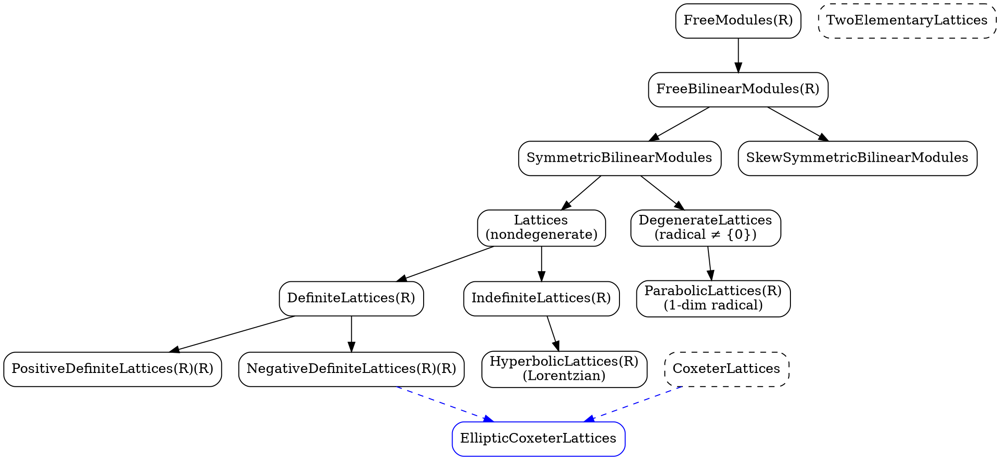

<!--
Origin: gitclones/Coxeter/tmp_restore/docs/api-planning/categories.md
Copied 2026-08-20 by the Coxeter-corpora enrichment migration
(PLAN-coxeter-deletion-audit-registry). Content below is unmodified.

This is a DESIGN RECORD: it states an intended interface, not the built
preamble. Divergences are listed in the INDEX.md of this corpus.
-->

# Category Structure for Lattices

## 🎯 CATEGORY HIERARCHY - CORE ARCHITECTURAL DESIGN

The category hierarchy is the **fundamental organizing principle** of this lattice component. Understanding this hierarchy is essential for working with the codebase.

**📖 See [MATHEMATICAL_FRAMEWORK.md](MATHEMATICAL_FRAMEWORK.md) for the complete mathematical foundation including the (R,F,V,b) context framework and future generalization to arbitrary Dedekind domains.**

## 🎯 ℤ-FIRST DESIGN: EASY DEFAULTS + ADVANCED PARAMETERIZATION

**DESIGN PRINCIPLE**: Common ℤ-lattices use simple names. Advanced users get explicit parameterization.

### Dual API Forms:
- **Default (ℤ)**: `Lattices`, `EllipticLattices`, `HyperbolicLattices` (most common)
- **Advanced (R)**: `Lattices(R)`, `EllipticLattices(R)`, `HyperbolicLattices(R)` (general Dedekind domains)

```
                         FreeModules             # Defaults to FreeModules(ZZ)
                    FreeModules(R)          # Advanced: explicit ring parameter
                    (finitely generated free R-modules, R = Dedekind domain)
                                 |
                      FreeBilinearModules        # Defaults to FreeBilinearModules(ZZ)
                   FreeBilinearModules(R)    # Advanced: explicit ring parameter
                    (free R-modules with b: L ⊗_R L → R)
                         ________|________
                        |                 |
              SymmetricBilinearModules    SkewSymmetricBilinearModules
            SymmetricBilinearModules(R)  SkewSymmetricBilinearModules(R)
              (b(v,w) = b(w,v))          (b(v,w) = -b(w,v))
                        |
                ________|________
               |                 |
            Lattices              DegenerateLattices     # ℤ-lattices (default)
          Lattices(R)           DegenerateLattices(R)   # R-lattices (advanced)
    (nondegenerate,              (radical ≠ {0})
     by definition)                      |
               |                  ParabolicLattices      # Defaults to ParabolicLattices(ZZ)
       ________|_____           ParabolicLattices(R)    # Advanced: explicit parameter
      |              |          (1-dim radical)
DefiniteLattices    IndefiniteLattices         # ℤ-lattices (default)
DefiniteLattices(R) IndefiniteLattices(R)     # R-lattices (advanced)
      |              |
  ____|____      HyperbolicLattices            # Defaults to HyperbolicLattices(ZZ)
 |         |     HyperbolicLattices(R)         # Advanced: explicit parameter
PositiveDefiniteLattices  NegativeDefiniteLattices     # ℤ-lattices (default)
PositiveDefiniteLattices(R) NegativeDefiniteLattices(R) # R-lattices (advanced)
                    (Lorentzian signature, R ⊆ ℝ)
```

### Usage Patterns

**90% Use Case (ℤ-lattices)**:
```python
# Clean, simple API for integral lattices
L = Lattices()                    # Integer lattices  
E = EllipticLattices()           # Negative definite ℤ-lattices
H = HyperbolicLattices()         # Lorentzian ℤ-lattices
P = ParabolicLattices()          # Affine ℤ-lattices

# Most Coxeter theory, root lattices, sphere packing
```

**10% Use Case (General Dedekind domains)**:
```python
# Explicit parameterization for advanced applications
R = NumberField(x^2 - 2)         # ℤ[√2]
L = Lattices(R)                  # R-lattices
E = EllipticLattices(R)          # Definite R-lattices

# Arithmetic geometry, algebraic number theory
```

**Backward Compatibility**: `Lattices(ZZ) == Lattices` (identical objects)

```

Orthogonal properties via Category.join():
- CoxeterLattices (admits Coxeter system structure)
- TwoElementaryLattices (discriminant group (Z/2Z)^a)
- PElementaryLattices(p) (discriminant group (Z/pZ)^a)
- Sublattices(L) (sublattices of fixed L)
```

## 🆕 PARALLEL TORSION HIERARCHY

For discriminant groups and finite quadratic forms, we need a parallel hierarchy:

```
                         TorsionModules(ZZ)
                    (finite abelian groups)
                                 |
                      TorsionQuadraticModules(ZZ)
                     (finite modules with quadratic forms)
                         ________|________
                        |                 |
         SymmetricTorsionQuadraticModules   SkewSymmetricTorsionQuadraticModules
                (q(x+y) = q(x) + q(y) + 2b(x,y))        (q alternating)
                        |
                ________|________
               |                 |
    NondegenerateTorsionQuadraticModules    DegenerateTorsionQuadraticModules
         (radical = {0})                      (radical ≠ {0})

Stratified subcategories via intersection with p-elementary abelian groups:
- TwoElementaryNondegenerateTorsionQuadraticModules 
  = NondegenerateTorsionQuadraticModules ∩ TwoElementaryAbelianGroups
- PElementaryNondegenerateTorsionQuadraticModules(p)
  = NondegenerateTorsionQuadraticModules ∩ PElementaryAbelianGroups(p)

Special case: DiscriminantQuadraticForms ⊆ NondegenerateTorsionQuadraticModules
            (arising as A_L = L*/L from lattices with quadratic form q_L)
```

**Connection to Lattices**: Every lattice L has an associated discriminant quadratic form (A_L, q_L) in DiscriminantQuadraticForms.

### Graphviz Representation



## Understanding the Hierarchy

### Key Design Principles

1. **Nondegeneracy is Default**: The main category `Lattices` contains only nondegenerate lattices by definition, aligning with SageMath's `IntegralLattice` class
2. **Explicit Naming**: We use `PositiveDefiniteLattices(R)(R)` and `NegativeDefiniteLattices(R)(R)` to avoid ambiguity
3. **Degenerate as Sibling**: Degenerate lattices form a separate branch, not a subcategory
4. **Orthogonal Properties**: Structure-based categories (root systems, elementary) are combined via `Category.join()`

## Base Categories

### FreeModules(R)

**OBJECTS:** Finitely generated free R-modules M ≅ R^n

**MORPHISMS:** R-module homomorphisms φ: M₁ → M₂

### FreeBilinearModules(R) 

**OBJECTS:** Pairs (M, b) where M is a free R-module and b: M × M → R is a bilinear form

**MORPHISMS:** R-module homomorphisms φ: M₁ → M₂ that preserve the bilinear form:
b₂(φ(v), φ(w)) = b₁(v, w) for all v, w ∈ M₁

**SUPER CATEGORY:** FreeModules(R)

### SymmetricBilinearModules

**OBJECTS:** Pairs (M, b) where b is symmetric: b(v,w) = b(w,v)

**MORPHISMS:** Same as FreeBilinearModules (inherited)

**KEY PROPERTIES:**
- **Radical:** rad(M) = {v ∈ M : b(v,w) = 0 for all w ∈ M}
- **Signature:** (p,q,r) where:
  - p = max{dim(V) : V ⊆ M submodule with b|_V positive definite}
  - q = max{dim(V) : V ⊆ M submodule with b|_V negative definite}
  - r = dim(rad(M))
- **Definite:** q = 0 or p = 0 (equivalently: b(v,v) has same sign for all non-zero v)
- **Positive definite:** (n,0,0) - equivalently b(v,v) > 0 for all non-zero v ∈ M
- **Negative definite:** (0,n,0) - equivalently b(v,v) < 0 for all non-zero v ∈ M
- **Indefinite:** p ≥ 1 and q ≥ 1
- **Degenerate:** r > 0 (equivalently rad(M) ≠ {0})
- **Nondegenerate:** r = 0 (equivalently rad(M) = {0})

**SUPER CATEGORY:** FreeBilinearModules(R)

## Main Category: Lattices

### Lattices (Nondegenerate Symmetric Bilinear Modules)

**DEFAULT FORM:** `Lattices` (integral ℤ-lattices - most common case)
**ADVANCED FORM:** `Lattices(R)` (lattices over general Dedekind domain R)

**DEFINITION:**
A lattice is a symmetric bilinear module (L, ⟨·,·⟩) with trivial radical.
In other words, Lattices = {M ∈ SymmetricBilinearModules : rad(M) = {0}}

**OBJECTS:** 
- **Default**: Nondegenerate symmetric bilinear modules over ℤ
- **Advanced**: Nondegenerate symmetric bilinear modules over R

**MORPHISMS:** Same as SymmetricBilinearModules (inherited)

**EXAMPLES:**
- **ℤ-lattices (default)**: ℤⁿ with standard inner product, root lattices A_n/D_n/E₆/E₇/E₈, even unimodular lattices like E₈, hyperbolic plane H = ℤ² with form ((0,1), (1,0))
- **R-lattices (advanced)**: Lattices over ℤ[√2], ℤ[ζ], other number rings

**PROPERTIES:**
- Inherits from FreeModules(R).FinitelyGenerated()
- Base ring is R
- All objects are integral by definition

## Signature-Based Subcategories

### DefiniteLattices(R)

**DEFINITION:**
DefiniteLattices(R) = Lattices ∩ {M : b(v,v) has the same sign for all non-zero v ∈ M}

**SUPER CATEGORY:** Lattices

### PositiveDefiniteLattices

**DEFAULT FORM:** `PositiveDefiniteLattices` (ℤ-lattices - sphere packing, coding theory)
**ADVANCED FORM:** `PositiveDefiniteLattices(R)` (R-lattices over general domains)

**DEFINITION:**
PositiveDefiniteLattices = DefiniteLattices ∩ {M : b(v,v) > 0 for all non-zero v ∈ M}

**EXAMPLES:**
- Standard Euclidean lattice Z^n with standard inner product
- A_n, D_n, E_6, E_7, E_8 root lattices (in standard number theory convention)
- The Leech lattice

**NOTE:** In number theory and sphere packing, these are sometimes called "elliptic".
We avoid this terminology to prevent confusion with negative definite conventions.

**SUPER CATEGORY:** DefiniteLattices(R)

### NegativeDefiniteLattices

**DEFAULT FORM:** `NegativeDefiniteLattices` (ℤ-lattices - Coxeter groups, algebraic geometry)  
**ADVANCED FORM:** `NegativeDefiniteLattices(R)` (R-lattices over general domains)

**DEFINITION:**
NegativeDefiniteLattices = DefiniteLattices ∩ {M : b(v,v) < 0 for all non-zero v ∈ M}

**EXAMPLES:**
- Root lattices A_n, D_n, E_6, E_7, E_8 (with negative Gram convention)
- The Leech lattice (rescaled to negative definite)

**SIGN CONVENTION:** This framework uses the **negative definite convention** standard in:
- **Algebraic geometry**: Intersection forms on algebraic varieties (K3 surfaces, etc.)
- **Coxeter group theory**: Root system Gram matrices with negative diagonal
- **Arithmetic geometry**: Quadratic forms arising from algebraic cycles

This differs from sphere packing literature (positive definite) but aligns with intersection theory on varieties. These lattices are called "elliptic" in Coxeter theory.

**SUPER CATEGORY:** DefiniteLattices(R)


### IndefiniteLattices(R)

**DEFINITION:**
IndefiniteLattices(R) = Lattices ∩ {M : ∃v,w ∈ M with b(v,v) > 0 and b(w,w) < 0}

**GEOMETRIC STRUCTURE:**
Indefinite lattices have a rich geometric structure including:
- Light cone: {v ∈ L ⊗ R : ⟨v,v⟩ = 0}
- Future/past cones: {v : ⟨v,v⟩ > 0} and {v : ⟨v,v⟩ < 0}

**SUPER CATEGORY:** Lattices

### HyperbolicLattices(R)

**DEFINITION:**
HyperbolicLattices(R) = IndefiniteLattices(R) ∩ {M : signature is (1, n-1, 0)}

(This means the maximal dimension of a positive definite submodule is 1,
while negative definite submodules can have dimension up to n-1)

**MATHEMATICAL SIGNIFICANCE:**
These lattices model hyperbolic space H^(n-1) and are the setting for
Vinberg's algorithm for finding fundamental domains of reflection groups.

**EXAMPLES:**
- Hyperbolic plane: Z² with form ((0,1), (1,0))
- Lorentzian lattices from Vinberg's classifications
- Hyperbolic root lattices

**SUPER CATEGORY:** IndefiniteLattices(R)

## Degenerate Lattices (Parallel Category)

### DegenerateLattices

**DEFINITION:**
DegenerateLattices = {M ∈ SymmetricBilinearModules : rad(M) ≠ {0}}

(The complement of Lattices within SymmetricBilinearModules)

**NOTE:** This is a sibling category to Lattices, not a subcategory.
Both partition SymmetricBilinearModules based on whether rad(M) = {0}.

**SUPER CATEGORY:** SymmetricBilinearModules

### ParabolicLattices(R)

**DEFINITION:**
A lattice is parabolic if:
- It is degenerate with a radical of dimension exactly 1
- The quotient module L/rad(L) is a negative definite lattice

**BASIS-INVARIANT CHARACTERIZATION:**
- dim(rad(L)) = 1
- For v ∈ L ∖ rad(L), the induced form on L/rad(L) satisfies ⟨̅v̅,̅v̅⟩ < 0

**CONVENTION:**
Following the framework's negative-definite sign convention, the factory 
automatically converts positive semi-definite forms to this convention.

**EXAMPLES:**
- Affine root lattices Ã_n, B̃_n, C̃_n, D̃_n, Ẽ_6, Ẽ_7, Ẽ_8, F̃_4, G̃_2

**NOTE:** These arise naturally as the lattices of affine Coxeter groups.

**SUPER CATEGORY:** DegenerateLattices

## Structure-Based Subcategories

#### Design Rationale: `CoxeterSystems` vs. `CoxeterLattices`

The distinction between `CoxeterSystems` and `CoxeterLattices` is a key aspect of our design, chosen to integrate cleanly with SageMath's categorical framework.

-   **`CoxeterSystems`**: This category represents the mathematical object of a simple root system with a specific geometric embedding `(Φ, ι)`. It is a standalone category for manipulating these structured objects directly.

-   **`CoxeterLattices`**: This is an "orthogonal" or "mixin" category. It does not represent a new type of mathematical object, but rather endows an existing `Lattice` object with the knowledge of its embedded `CoxeterSystem`. Its purpose is to enable `Category.join()`, allowing us to create combined categories like `EllipticCoxeterLattices`. An object in this joined category *is a* `Lattice`, ensuring it can be used polymorphically with other lattice functions.

This design separates the mathematical concepts from the implementation constructs needed for a flexible and powerful type system.

### CoxeterSystems (Structured Objects)

**DEFINITION:**
A Coxeter system is a pair (Φ, ι) where:
- Φ = {α₁, α₂, ..., αₙ} is a simple root system satisfying root system axioms
- ι: ⟨Φ⟩_R ↪ L is a primitive embedding into some ambient lattice L

**OBJECTS:**
Pairs (Φ, ι) where Φ is a simple root system and ι is a primitive embedding.

**MORPHISMS:**
A morphism φ: (Φ₁, ι₁) → (Φ₂, ι₂) consists of:
- Root system map f: Φ₁ → Φ₂ (preserving simple root structure)
- Lattice homomorphism g: L₁ → L₂
- Commutative diagram: g ∘ ι₁ = ι₂ ∘ ⟨f⟩

This forms a proper category with meaningful isomorphisms and automorphisms.

**INTERFACE:** See coxeter_systems.md for full interface

### CoxeterLattices

**DEFINITION:**
A Coxeter lattice is a pair (L, C) where:
- L is a lattice (nondegenerate integral lattice)
- C = (Φ, ι) is a Coxeter system with ι: ⟨Φ⟩_R ↪ L

**OBJECTS:**
Pairs (L, C) combining lattice structure with Coxeter system embeddings.

**MORPHISMS:**
A morphism h: (L₁, C₁) → (L₂, C₂) is a lattice homomorphism h: L₁ → L₂ 
(preserving bilinear form as required by FreeBilinearModules) such that:
- h maps simple roots of C₁ to simple roots of C₂
- The induced map preserves the Coxeter structure

**NOTE:** This is a "mixin" category for use with Category.join().
It endows lattices with Coxeter structure knowledge.

**SUPER CATEGORY:** Lattices

**INTERFACES:** 
- Parent methods: See coxeter_lattices.md
- Element methods: See coxeter_lattice_elements.md

### Elementary Lattices

#### TwoElementaryLattices

**DEFINITION:**
TwoElementaryLattices = Lattices ∩ {L : A_L = L*/L is (Z/2Z)^a for some a ≥ 0}

**INVARIANTS:**
These lattices are characterized by three invariants (r, a, δ) where:
- r = rank(L) (inherited from SymmetricBilinearModules)
- a = 2-rank of A_L (so |A_L| = 2^a)
- δ ∈ {0, 1} is the discriminant form invariant

**SIGNIFICANCE:**
2-elementary lattices arise naturally in algebraic geometry and topology,
particularly in the study of K3 surfaces and their moduli.

**SUPER CATEGORY:** Lattices

#### PElementaryLattices

**DEFINITION:**
PElementaryLattices(p) = Lattices ∩ {L : A_L = L*/L is a p-primary group}

(Where p-primary means every element has order a power of the prime p)

**PARAMETRIZED CATEGORY:**
This is a parametrized family of categories, one for each prime p.

**SUPER CATEGORY:** Lattices

### Sublattices

**DEFINITION:**
For a fixed lattice L, this is the category of all sublattices M ⊆ L.
The bilinear form on M is the restriction of L's form.

**OBJECTS:**
Pairs (M, ι) where M is a sublattice and ι: M → L is the inclusion.

**MORPHISMS:**
Inherited from FreeBilinearModules: A morphism between (M₁, ι₁) and (M₂, ι₂) 
is a lattice homomorphism φ: M₁ → M₂ such that ι₂ ∘ φ = ι₁ (the diagram commutes).

**PRIMITIVE EMBEDDINGS:**
A sublattice M ⊆ L is primitively embedded if L/M is torsion-free.

**PARAMETRIZED CATEGORY:**
This is a parametrized family of categories, one for each ambient lattice L.

**SUPER CATEGORY:** Lattices

## 🔄 TORSION QUADRATIC MODULES HIERARCHY

### Base Categories

#### TorsionModules

**DEFINITION:**
A torsion module is a finitely generated abelian group A where every
element has finite order. Equivalently, A ≅ ⊕ Z/n_i Z.

**OBJECTS:** Finite abelian groups

**MORPHISMS:** Group homomorphisms (R-module homomorphisms between finite groups)

**RELATION TO LATTICES:**
These arise naturally as discriminant groups A_L = L*/L of lattices.

**KEY PROPERTIES:**
- **Order:** |A| = number of elements
- **Exponent:** lcm of element orders
- **Elementary divisors:** Unique factorization A ≅ ⊕ Z/n_i Z

#### TorsionQuadraticModules

**DEFINITION:**
A torsion quadratic module is a finite abelian group A equipped with
a quadratic form q: A → Q/Z (or Q/nZ for appropriate n).

**OBJECTS:** Pairs (A, q) where A is a finite abelian group and q is a quadratic form

**MORPHISMS:** Group homomorphisms φ: A₁ → A₂ preserving the quadratic form:
q₂(φ(x)) = q₁(x) for all x ∈ A₁

**FUNDAMENTAL PRINCIPLE:**
The quadratic form is the fundamental structure; bilinear forms are derived
via polarization: b(x,y) = q(x+y) - q(x) - q(y).

**KEY PROPERTIES:**
- **Quadratic form:** q: A → Q/Z
- **Associated bilinear form:** b(x,y) = q(x+y) - q(x) - q(y)
- **Radical:** rad(A) = {x ∈ A : b(x,y) = 0 for all y ∈ A}
- **Nondegenerate:** rad(A) = {0}

**MATHEMATICAL SIGNIFICANCE:**
For p=2, quadratic forms q: A → Q/2Z contain more information than 
bilinear forms b: A × A → Q/Z, making them the correct foundation.

**SUPER CATEGORY:** TorsionModules

#### SymmetricTorsionQuadraticModules

**DEFINITION:**
A symmetric torsion quadratic module has a quadratic form q: A → Q/Z
such that the associated bilinear form b(x,y) = q(x+y) - q(x) - q(y)
satisfies b(x,y) = b(y,x) for all x,y ∈ A.

**OBJECTS:** Pairs (A, q) where the derived bilinear form is symmetric

**MORPHISMS:** Same as TorsionQuadraticModules (inherited)

**PROPERTIES:** Inherits all properties from TorsionQuadraticModules

**SUPER CATEGORY:** TorsionQuadraticModules

#### NondegenerateTorsionQuadraticModules

**DEFINITION:**
NondegenerateTorsionQuadraticModules = {M ∈ SymmetricTorsionQuadraticModules : rad(M) = {0}}

(Where radical is defined at the TorsionQuadraticModules level)

**STRATIFICATION:**
This category intersects with p-elementary abelian group categories to give:
- TwoElementaryNondegenerateTorsionQuadraticModules = 
  NondegenerateTorsionQuadraticModules ∩ TwoElementaryAbelianGroups
- PElementaryNondegenerateTorsionQuadraticModules(p) = 
  NondegenerateTorsionQuadraticModules ∩ PElementaryAbelianGroups(p)

**SUPER CATEGORY:** SymmetricTorsionQuadraticModules

#### DegenerateTorsionQuadraticModules

**DEFINITION:**
DegenerateTorsionQuadraticModules = {M ∈ SymmetricTorsionQuadraticModules : rad(M) ≠ {0}}

(The complement of NondegenerateTorsionQuadraticModules within SymmetricTorsionQuadraticModules)

**SUPER CATEGORY:** SymmetricTorsionQuadraticModules

#### SkewSymmetricTorsionQuadraticModules

**DEFINITION:**
A skew-symmetric torsion quadratic module has an alternating quadratic form
q: A → Q/Z such that q(x+y) = q(x) + q(y) for all x,y ∈ A.
This corresponds to skew-symmetric bilinear forms via polarization.

**SUPER CATEGORY:** TorsionQuadraticModules
### Discriminant Quadratic Forms and Specializations

#### DiscriminantQuadraticForms

**DEFINITION:**
Discriminant quadratic forms are the image of the fundamental functor:
Lattices → NondegenerateTorsionQuadraticModules
L ↦ (A_L = L*/L, q_L)

where q_L: A_L → Q/Z (or Q/2Z for even lattices) is the canonical
quadratic form induced by the lattice pairing.

**OBJECTS:** Pairs (A_L, q_L) arising as discriminant groups of lattices

**MORPHISMS:** Same as NondegenerateTorsionQuadraticModules (inherited)

**MATHEMATICAL PROPERTIES:**
- |A_L| = |discriminant(L)| (discriminant of lattice)
- The quadratic form q_L encodes the "arithmetic" of the lattice
- Classification up to isometry determines lattice genus
- Always nondegenerate (since L is nondegenerate)
- For p=2, q_L: A_L → Q/2Z contains more information than bilinear forms

**ADDITIONAL METHODS** (beyond NondegenerateTorsionQuadraticModules):
- `source_lattice()`: Return the lattice L such that self ≅ (L*/L, q_L)
- `signature_modulo_8()`: Return the signature of L modulo 8 (Brown invariant)
- `genus_symbol()`: Return the p-adic genus symbols for all primes

**STRATIFICATION VIA INTERSECTION:**
- TwoElementaryDiscriminantQuadraticForms = DiscriminantQuadraticForms ∩ TwoElementaryAbelianGroups  
- PElementaryDiscriminantQuadraticForms(p) = DiscriminantQuadraticForms ∩ PElementaryAbelianGroups(p)

**SUPER CATEGORY:** NondegenerateTorsionQuadraticModules

## Category Relationships

The complete hierarchy is shown in the diagram at the top of this document. Key relationships:

### Primary Hierarchy with Inherited Structure
- **FreeModules(R)**: Root category (free R-modules)
  - Defines: Module structure, homomorphisms
  
- **FreeBilinearModules(R)**: Adds bilinear form structure
  - Defines: Bilinear form, form-preserving morphisms
  - Inherits: Module structure from FreeModules
  
- **SymmetricBilinearModules**: Restricts to symmetric forms
  - Defines: Radical, signature (p,q,r), definite/indefinite properties
  - All are basis-invariant properties of the bilinear form
  - Inherits: Bilinear form structure and morphisms from FreeBilinearModules
  - Splits into:
    - **Lattices** = {M : rad(M) = {0}} (nondegenerate, r = 0)
    - **DegenerateLattices** = {M : rad(M) ≠ {0}} (r > 0)

### Parallel Torsion Hierarchy with Inherited Structure
- **TorsionModules(ZZ)**: Root for finite abelian groups
  - Defines: Finite group structure, order, exponent
  
- **TorsionQuadraticModules(ZZ)**: Adds quadratic form structure
  - Defines: Quadratic form q, derived bilinear form b, radical
  - Inherits: Group structure from TorsionModules
  
- **SymmetricTorsionQuadraticModules**: Restricts to symmetric derived forms
  - Inherits: All properties from TorsionQuadraticModules
  - Splits into:
    - **NondegenerateTorsionQuadraticModules** = {M : rad(M) = {0}}
    - **DegenerateTorsionQuadraticModules** = {M : rad(M) ≠ {0}}
    
- **DiscriminantQuadraticForms**: Image of functor Lattices → NondegenerateTorsionQuadraticModules
  - Inherits: All properties from NondegenerateTorsionQuadraticModules
  - Adds: Connection to source lattice, signature mod 8

### Stratification via Categorical Intersection
The p-elementary structure comes from intersecting quadratic form categories with abelian group categories:
- **TwoElementaryDiscriminantQuadraticForms** = DiscriminantQuadraticForms ∩ TwoElementaryAbelianGroups
- **PElementaryDiscriminantQuadraticForms(p)** = DiscriminantQuadraticForms ∩ PElementaryAbelianGroups(p)
- **TwoElementaryNondegenerateTorsionQuadraticModules** = NondegenerateTorsionQuadraticModules ∩ TwoElementaryAbelianGroups

### Subcategories as Intersections
All subcategories are defined as intersections with property-based collections:

**Within Lattices:**
- **DefiniteLattices(R)** = Lattices ∩ {M : M is definite}
  - **PositiveDefiniteLattices(R)(R)** = Lattices ∩ {M : b(v,v) > 0 for all non-zero v}
  - **NegativeDefiniteLattices(R)(R)** = Lattices ∩ {M : b(v,v) < 0 for all non-zero v}
- **IndefiniteLattices(R)** = Lattices ∩ {M : M is indefinite}
  - **HyperbolicLattices(R)** = Lattices ∩ {M : M has Lorentzian signature}
  
**Within DegenerateLattices:**
- **ParabolicLattices(R)** = DegenerateLattices ∩ {M : dim(rad(M)) = 1 and M/rad(M) is negative definite}

### Orthogonal Classifications (via Category.join())
These "mixin" categories can be combined with any signature-based category:

- **CoxeterLattices**: Pairs (L, C) where C embeds into L
- **TwoElementaryLattices** = Lattices ∩ {L : A_L is (Z/2Z)^a}
- **PElementaryLattices(p)** = Lattices ∩ {L : A_L is p-primary}
- **Sublattices(L)**: All sublattices of a fixed ambient lattice L

These inherit all morphism definitions from their parent categories.

### Inheritance Principle

**FUNDAMENTAL RULE**: Properties and morphisms are defined once at the appropriate level and inherited by all subcategories.

**Examples of Inheritance:**
1. **Morphisms**: Defined at FreeBilinearModules, inherited by all lattice categories
2. **Radical**: Defined at SymmetricBilinearModules, used to define Lattices vs DegenerateLattices
3. **Signature**: Defined at SymmetricBilinearModules, used to classify into definite/indefinite
4. **Rank**: Defined at FreeModules, available to all subcategories

**Subcategory Definition Pattern**:
```python
# Subcategories are ALWAYS intersections, never redefine inherited properties
DefiniteLattices(R) = Lattices ∩ {M : M.is_definite()}  # is_definite from parent
TwoElementaryLattices = Lattices ∩ {L : L.discriminant_group() is 2-elementary}
```

### Cross-Hierarchy Connections
The two hierarchies are connected by the discriminant quadratic form functor:
```python
# Fundamental functor: Lattices → DiscriminantQuadraticForms
def discriminant_form(lattice: Lattice) -> DiscriminantQuadraticForm:
    """Return (A_L, q_L) = (L*/L, q_L) with its canonical quadratic form."""
    
# Elementary lattice classification via discriminant quadratic forms
TwoElementaryLattices = {L : L.discriminant_form() in TwoElementaryDiscriminantQuadraticForms}
PElementaryLattices(p) = {L : L.discriminant_form() in PElementaryDiscriminantQuadraticForms(p)}

# Where the stratified categories are defined by intersection:
TwoElementaryDiscriminantQuadraticForms = DiscriminantQuadraticForms ∩ TwoElementaryAbelianGroups
PElementaryDiscriminantQuadraticForms(p) = DiscriminantQuadraticForms ∩ PElementaryAbelianGroups(p)
```

### Important Intersections
```python
# Coxeter lattices with specific signatures
EllipticCoxeterLattices = Category.join([CoxeterLattices(), NegativeDefiniteLattices(R)(R)()])
ParabolicCoxeterLattices = Category.join([CoxeterLattices(), ParabolicLattices(R)()])
HyperbolicCoxeterLattices = Category.join([CoxeterLattices(), HyperbolicLattices(R)()])

# Elementary lattices with specific signatures
TwoElementaryPositiveDefiniteLattices(R)(R) = Category.join([TwoElementaryLattices(), PositiveDefiniteLattices(R)(R)()])
TwoElementaryHyperbolicLattices(R) = Category.join([TwoElementaryLattices(), HyperbolicLattices(R)()])
```

## Mathematical Foundations

### Property Definition Hierarchy

**FUNDAMENTAL IMPLEMENTATION RULE**: "Define Once, Inherit Always"

Properties and methods are defined EXACTLY ONCE at the most general level where they make sense, then inherited by all subcategories. This prevents code duplication and ensures mathematical consistency.

1. **At FreeModules(R)**:
   - Rank, basis, coordinate representations  
   - Module homomorphisms: dual(), tensor(), direct_sum()

2. **At FreeBilinearModules(R)**:
   - Bilinear form b: M × M → R
   - Form-preserving morphisms
   - Enhanced dual(): (M*, ι) using canonical map ι(v)(w) = b(v,w)
   - Orthogonal group(), radical(), quotient_by_radical()

3. **At SymmetricBilinearModules**:
   - Radical: rad(M) = {v : b(v,w) = 0 for all w}
   - Signature (p,q,r): Maximal dimensions of positive/negative/zero subspaces
   - Definite/indefinite classification based on signature
   - Symmetric-specific optimizations

4. **At Lattices (Nondegenerate Case)**:
   - metric_dual(): L# = {v ∈ L ⊗ ℚ : b(v,L) ⊆ ℤ} (for integer lattices)
   - discriminant_group(): L#/L (finite abelian group for ℤ)
   - automorphism_group(): Group of self-isometries
   - Sublattice operations and root system embeddings

5. **At specific subcategories**:
   - Only properties unique to that subcategory
   - Everything else is inherited

### Dual Resolution: Key Mathematical Insight

The framework resolves the tension between two notions of "dual":

1. **Module-theoretic dual L***: Lives in the category of R-modules (L* = Hom_R(L, R))
2. **Metric dual L#**: Lives in the same ambient space as L (L# = {v ∈ L ⊗_R F : b(v,L) ⊆ R})

**Key Insight**: Both L and L# are R-submodules of the same ambient vector space V = L ⊗_R F. No "category escape" occurs - they're just different sublattices of V.

### Common Implementation Mistakes to Avoid

1. **DON'T** implement signature() at DefiniteLattices - it's inherited from SymmetricBilinearModules!
2. **DON'T** implement is_definite() at DefiniteLattices - that's circular logic!
3. **DON'T** implement radical() at Lattices - it's always {0} by definition!
4. **DO** implement new methods only when they make sense for ALL objects in the category

### Category Determination

Each category is defined by intrinsic mathematical properties:

1. **Signature-based categories**: Determined by the signature (p,q,r) invariant
   - Definite: p = 0 or q = 0
   - Hyperbolic: (1,n-1,0) - unique positive direction
   - Parabolic: (0,n-1,1) - negative definite quotient by 1-dimensional radical
2. **Structure-based categories**: Determined by additional algebraic structure (e.g., Coxeter systems)
3. **Elementary categories**: Determined by properties of the discriminant group
4. **Sublattice categories**: Relative to a fixed ambient lattice

### Dynamic Category Refinement

The category of an object can be refined as more structure is discovered:
- A lattice may initially be known only by its signature
- Discovery of a Coxeter system embedding refines it to CoxeterLattices
- Discovery of elementary discriminant group refines it to ElementaryLattices
- Categories can be joined: CoxeterLattices ∩ NegativeDefiniteLattices(R)(R) = EllipticCoxeterLattices

## Implementation Notes

### Inheritance Architecture

The category system enforces proper inheritance:

1. **Single Definition Principle**: Each property/method is defined exactly once
2. **Automatic Inheritance**: Subcategories automatically inherit all parent methods
3. **No Redundancy**: Subcategories never redefine inherited properties
4. **Interface Consistency**: All objects in a category share the same interface

### Category Benefits

1. **Mathematical Correctness**: Categories encode precise mathematical relationships
2. **Method Inheritance**: Objects automatically gain methods from all parent categories
3. **Dynamic Refinement**: Categories can be refined as structure is discovered
4. **Type Safety**: Category membership enforces mathematical constraints
5. **Composition via Join**: Complex categories built from simpler ones

### Factory Pattern

Objects determine their category membership through their properties, not through
explicit construction. The factory functions:
- Analyze mathematical properties
- Assign the most specific applicable category
- Ensure all inherited methods are available
- Validate mathematical consistency