# Introduction and Foundational Objects

## Enriques Surfaces

> [!DEFINITION] Enriques Surfaces [@AN06, Castelnuovo] An Enriques surface $Y$ is a smooth projective surface satisfying:
> - $K(Y) = 0$
> - $h^1(\mathcal{O}_Y) = h^2(\mathcal{O}_Y) = 0$
> - $\omega_Y \in \operatorname{Pic}(Y)[2]$

## Polarizations

> [!DEFINITION] Polarization and Numerical Polarization Let $Y$ be an Enriques surface.
> - The second cohomology is:
> $$
> H^2(Y; \mathbb{Z}) \cong \mathbb{Z}^{10} \oplus \mathbb{Z}_2 \langle c_1(\omega_Y) \rangle
> $$
> - $\operatorname{Num}(Y) \cong H^2(Y; \mathbb{Z}) / \text{torsion} \cong \mathbb{Z}^{10}$, which is isometric to the Enriques lattice:
> $$
> E_{10} := U \oplus E_8
> $$
> of signature $(1, 9)$.
> $U$ is the hyperbolic plane with basis $\langle e, f \rangle$ such that $e^2 = f^2 = 0$ and $e \cdot f = 1$.
> - $NS(X) = \operatorname{Pic}(X) / \operatorname{Pic}^0(X)$ and $\operatorname{Num}(X) = \operatorname{Pic}(X) / \operatorname{Pic}^\tau(X)$.
> - $L_1 \equiv L_2 \iff L_1 \cdot C = L_2 \cdot C$ for all curves $C$.

# Moduli Spaces and Torell Theorems

## Enriques Surface as Quotient

> Every Enriques surface $Y$ is of the form $Y = X / \iota$, where $X$ is a K3 surface and $\iota: X \to X$ is a fixed-point free nonsymplectic involution.
> The Hodge decomposition of $X$ is given by:
$$
H^{2}(X ; \mathbb{C}) = H^{2,0} \oplus H^{1,1} \oplus H^{0,2} = \langle \omega \rangle_{\mathbb{C}} \oplus H^{1,1} \oplus \langle \bar{\omega} \rangle_{\mathbb{C}}
$$
If $G \subset \operatorname{Aut}(X)$, the action $G \curvearrowright \langle \omega \rangle_{\mathbb{C}}$ induces a character $\alpha: G \to \mu_n$, where $n = \operatorname{ord}(g)$, such that $g(\omega) = \alpha(g) \omega$.
- An automorphism $g$ is **nonsymplectic** if $\alpha(g) \neq 1$.
- It is **symplectic** if $g(\omega) = \omega$ for all $g \in G$.

> [!THEOREM] [@CDL24; @Lan83] Deformations of numerically polarized Enriques surfaces are unobstructed.
> In particular, there exists an Artin stack $\mathcal{F}_{En, 2d}/k$.
> When $\operatorname{char}(k) \neq 2$ and $k = \mathbb{C}$, this stack is of finite type.

## Torell Theorems for Enriques Surfaces

[See @PS71]

Note that $\omega_X \cdot \omega_X = 0$ and $\omega_X \cdot \bar{\omega}_X > 0$.
The period domain for a lattice $L$ is:
$$
D_L := \{ [v] \in \mathbb{P}(L_{\mathbb{C}}) \mid v \cdot v = 0, v \cdot \bar{v} > 0 \}
$$
Take $L := N := U \oplus E_{10}(2)$, so $N^\perp = E_{10}(2)$.
We define the period map:
$$
P_Y: H^2(Y; \mathbb{Z}) \to T_{En} \to D_{T_{En}}, \quad \omega_Y \mapsto [\omega_Y]
$$

> [!THEOREM] Strong Torell Theorem [@PS71] Let $Y_1, Y_2$ be Enriques surfaces with K3 covers $X_1, X_2$.
> If an isometry $\varphi \in \operatorname{Isom}(H^{2}(Y_1; \mathbb{Z}), H^{2}(Y_2; \mathbb{Z}))$ extends to an isometry:
> $$
> \tilde{\varphi} \in \operatorname{Isom}(H^{2}(X_1; \mathbb{Z}), H^{2}(X_2; \mathbb{Z}))
> $$
> that preserves the periods $\omega_i$, then there exists an isomorphism $f: Y_1 \to Y_2$.

> [!THEOREM] Weak Torell Theorem If $[\omega_{Y_1}] = [\omega_{Y_2}]$ in $O(T_{En}) \backslash D_{T_{En}}$, then $Y_1 \cong Y_2$.
> More generally, there is an exact sequence:
> $$
> 0 \to K \to \operatorname{Aut}(Y) \to O(T_{En}) \to 0
> $$

> [!THEOREM] [@Nam84] There is a set bijection:
> $$
> \begin{aligned}
> \{\text{Enriques } Y\} / \cong & \longleftrightarrow O(T_{En}) \backslash D_{T_{En}}^{0} \\
> Y & \longmapsto [\omega_Y]
> \end{aligned}
> $$
> where $D_{T_{En}}^{0} = D_{T_{En}} \setminus \bigcup_{V \in \mathcal{C}^{2}(T_{En})} V^{\perp}$.

<!-- 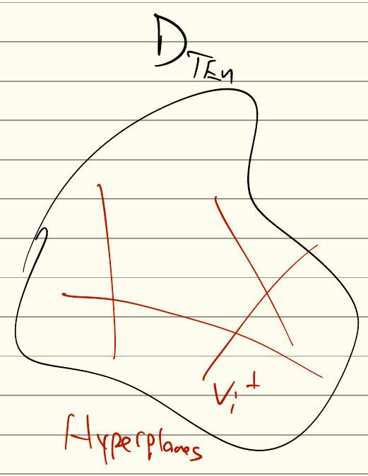  Reproduction good, do not change.
-->

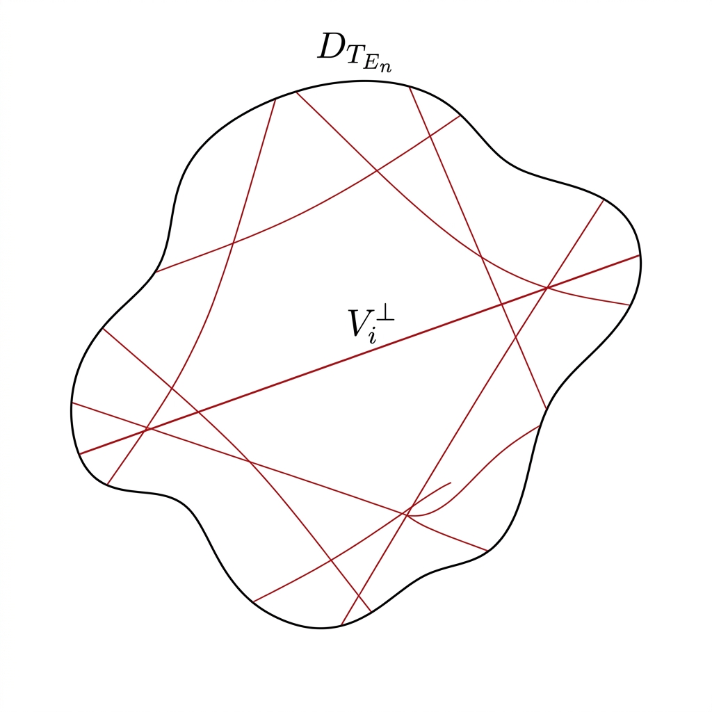

A similar construction applies to the stack $\mathcal{F}_{En, 2d}$.
In the case $d=1$:
- The invariant lattice is $S_{En} = U(2) \oplus E_8(2)$.
- The polarization is $h := e + f$, with $h^2 = (e+f)^2 = 2$.
- The group is $\Gamma_{En, 2}$, defined as the image:
$$
\Gamma_{En, 2} := \operatorname{im} [ \{ g \in O(L_{K3}) \mid g \iota_{En} = \iota_{En} g, g(h) = h \} \to O(T_{En}) ]
$$
- The moduli space is:
$$
\mathcal{F}_{En, 2} = \Gamma_{En, 2} \backslash D_{T_{En}}
$$
- [@Nam85]: There exists a unique $[V] \in \Gamma_{En} \backslash T_{En}$ with $V^2 = -2$.
  The divisor $\Delta_{(-2)} := H_V := V^\perp \in \mathcal{F}*{En}$ parameterizes $Y$ such that $Y = X/\iota*{En}$ where $X$ is a nodal K3 surface and $\iota_{En}$ fixes a node.
- $Y$ is then a rational Coble surface with a $\frac{1}{4}(1,1)$ singularity.
- We have the following isomorphisms for unpolarized and numerically polarized Enriques surfaces:
$$
\begin{aligned}
\Gamma_{En} \backslash (D_{T_{En}} \backslash \Delta_{(-2)}) & \cong \{ \text{unpolarized Enriques surfaces} \} \\
\Gamma_{En,2} \backslash (D_{T_{En}} \backslash \Delta_{(-2)}) & \cong \{ \text{numerically polarized Enriques surfaces} \}
\end{aligned}
$$
- In [@AEGS23], we compactify all of $\Gamma_{En,2} \backslash D_{T_{En}}$.
- [@Nam85]: There exists a unique $[v], [\omega] \in D_{T_{En}}$ with $v^2 = \omega^2 = -4$.
  Then $V^\perp = \langle 4 \rangle \oplus U \oplus E_8(2)$, implying $H_v$ is a nodal Enriques surface.
- $W^\perp \implies H_w$ is a unigonal Enriques surface (double cover of $\mathbb{P}(1,1,2)$).

So: 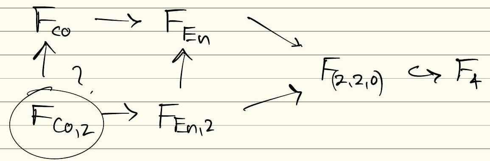 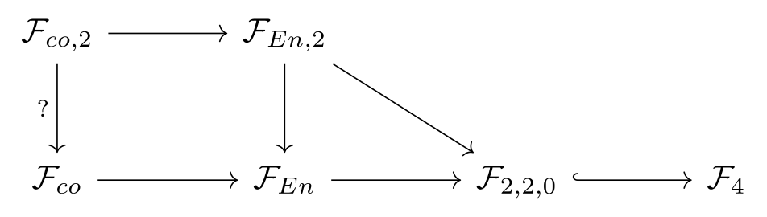

Past work: 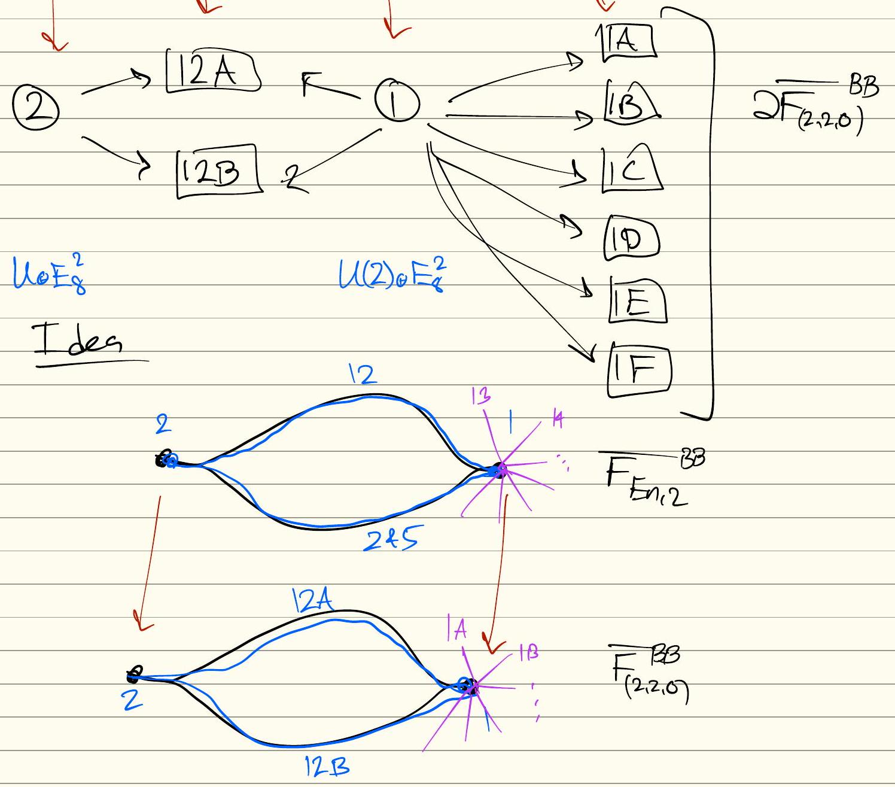 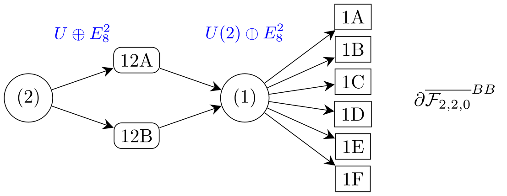 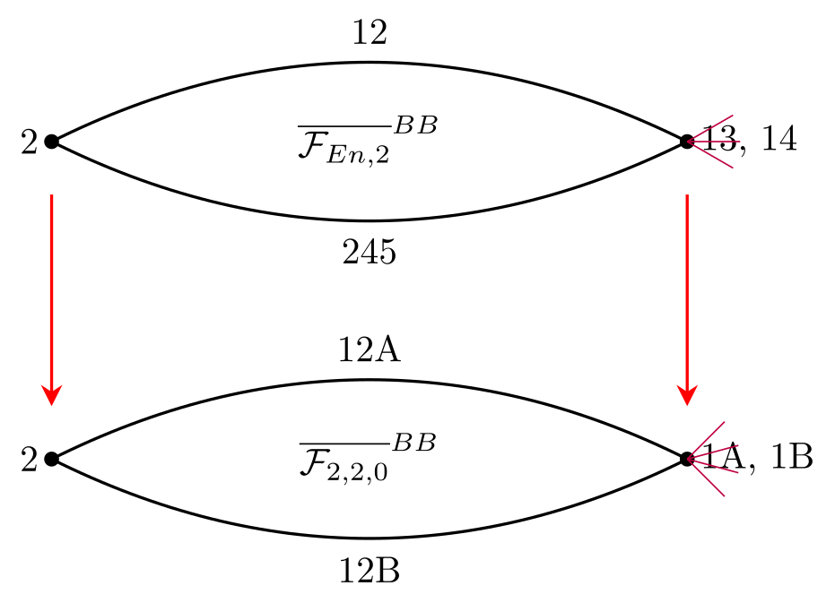

# Degenerations and Kulikov Models

## Stratification of the Moduli Space

**Why care?** Gives a stratification of $\overline{\mathcal{F}_{2,2,0}}$.

- **Points**: Type III degenerations $\implies$ elliptic subdiagrams.
- **Curves**: Type II degenerations $\implies$ maximal parabolic.
- E.g., $(18,2,0)$.

16-gon construction:
<!-- 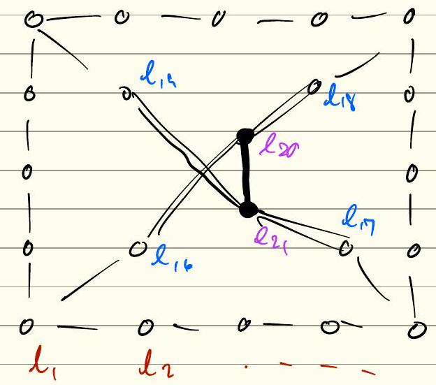  Reproduction fine, leave.
-->
<!-- 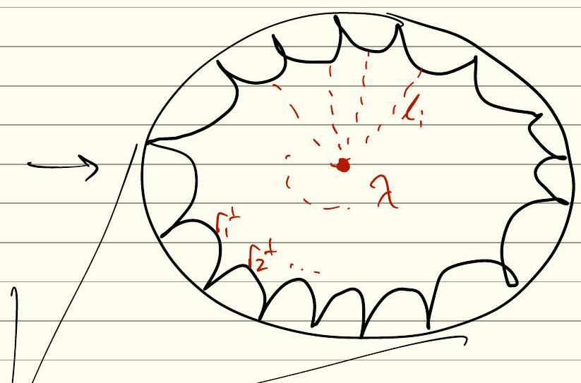  Reproduction fine, leave.
-->
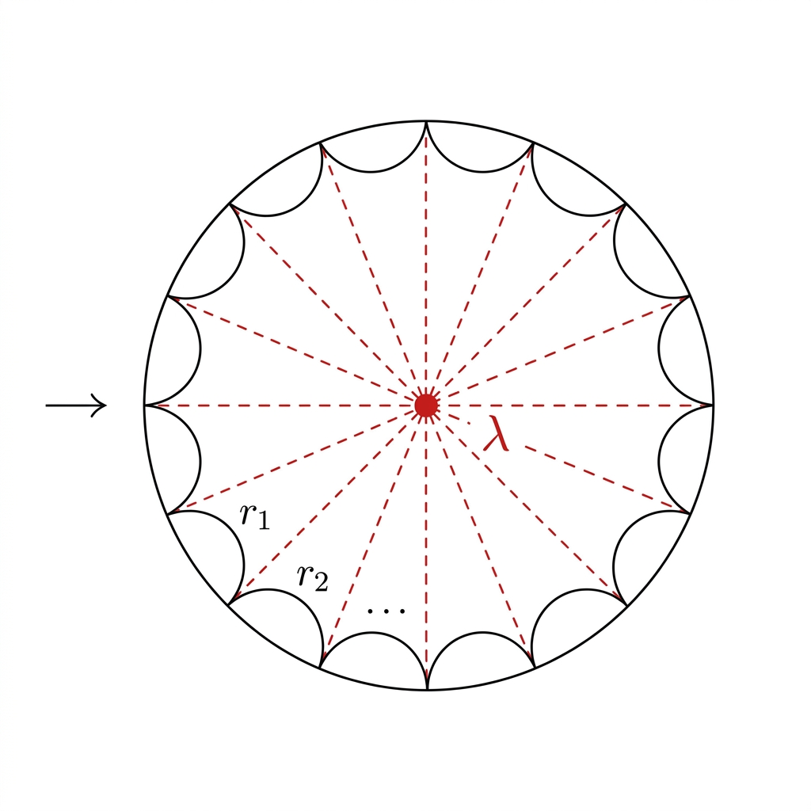 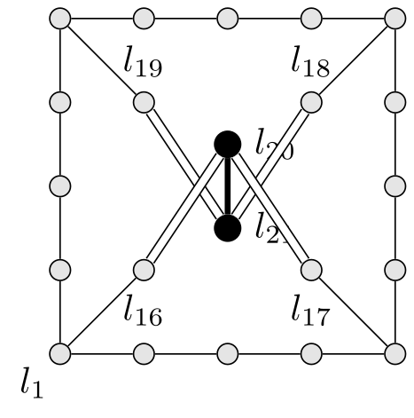 $\lambda \leadsto \vec{l} := \sum_{i=1}^{22} (\lambda \cdot r_i) \in \mathbb{Z}^{22}$

Use to construct $B(\lambda) = IAS^2$:

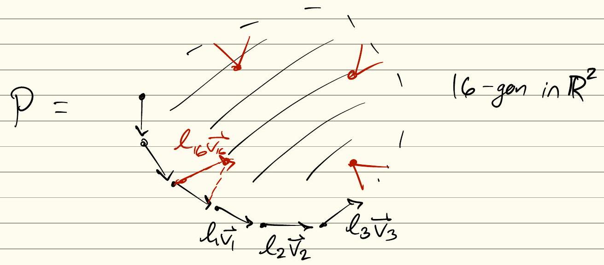
<!-- This diagram is missing a faithful reproduction.
It is an 18-gon with 4 symington surgeries (triangles cut out).
-->

Next: $B(\lambda)=P \cup P^{\circ f}: 4+4+16 \quad I^{\prime}$ singularities

## Kulikov Models and Type III Degenerations

> [!THEOREM] Semistable Reduction [@Mum77] Let $\mathcal{X}^\circ \to C^\circ$ be a family of smooth projective varieties.
> After a finite ramified base change, there exists a semistable model $\mathcal{X} \to C$.

> [!THEOREM] [@Kul77; @PP81] Let $\mathcal{X}^\circ \to C^\circ$ be a family of K3 surfaces.
> Then there exists a semistable model $\mathcal{X} \to C$ with $\omega_{\mathcal{X}/C} \cong \mathcal{O}_{\mathcal{X}}$.

> [!THEOREM] [$Fuj$] For degenerations of $K$-trivial varieties, the MMP runs, and from a semistable model one obtains a minimal dlt model with no lc centers of $(X, \Delta)$ lying over $X \setminus X^{snc}$.

> [!FACT] Kulikov Types A Kulikov model $\mathcal{X} \to C$ is of one of the following types:
> - **Type I**: $X_0$ is smooth.
> - **Type II**: $X_0$ has a double locus but no triple points.
> - **Type III**: $X_0$ has triple points.
>   Let $\Gamma(X_0)$ be the dual complex:
>   - **Vertices**: Irreducible components $V_i \subset X_0$.
>   - **Edges**: Double curves $D_{ij} := V_i \cap V_j$.
>   - **Faces**: Triple points $P_{ijk} := V_i \cap V_j \cap V_k$.

- **Type I**: $\Gamma(X_0) = \{ \bullet \}$.
- **Type II**: $\Gamma(X_0) \cong [0, 1]$ (an interval).
- **Type III**: $\Gamma(X_0) \cong S^2$ (a triangulation of the sphere).

> [!DEFINITION] ACP $(V, D)$ is an *ACP* if $D \in |-K_V|$ is a cycle of rational curves (e.g., $V$ is a toric surface and $D$ is its toric boundary).
> Define $Q(V, D) := 12 - \sum (D_i^2 + 3)$ if the number of components is greater than 2.

> [!THEOREM] [@FM83] If $\mathcal{X} \to C$ is a Type III Kulikov model, then:
> $$
> \sum_{j} Q(V_j, D_j) = 24
> $$

> [!THEOREM] Every family $\mathcal{X}^\circ \to C^\circ$ of K3 surfaces extends to a Kulikov model $\mathcal{X} \to C$.
> In Type III, the dual complex defines an $IAS^2$ with $Q=24$.

> [!THEOREM] [@Fri83] There exists a Kulikov model $\mathcal{X} \to \mathbb{D}$ with $X_0 \cong X$ (a smoothing) for any $d$-semistable Type III surface.

> [!THEOREM] Bijection There is a bijection:
> $$
> \left\{ \text{Type III Kulikov models } \mathcal{X} \to C \right\} \longleftrightarrow \left\{ IAS^2 X + d\text{-semistability} + Q=24 \right\}
> $$
> given by $\mathcal{X} \mapsto \Gamma(X_0) \cong \{B(\lambda) \mid \lambda \in \text{Fundamental Domain}\}$.

> [!THEOREM] [@Laz16; @AET19] If $(\mathcal{X}_{K3}^*, \epsilon \mathcal{R}^*) \xrightarrow{\pi} C^*$ is a family of stable K3 pairs, then there exists a Kulikov model $(\mathcal{X}, \epsilon \mathcal{R}) \to C$ with $\mathcal{R}_0$ nef and containing no strata of $X_0$.
> 
> - **Definition**: $(\mathcal{X}, \epsilon \mathcal{R})$ is a *divisor model* if $Q_{\mathcal{X}}(\mathcal{R})$ is relatively nef.
> - **Construction**: The stable model is given by $\bar{\mathcal{X}} := \operatorname{Proj}*{C} \bigoplus*{n=0}^{\infty} \pi_{*} \mathcal{O}_{\mathcal{X}}(n \mathcal{R})$.

> [!FACT] Lattice Data Let $(\mathcal{X}, \mathcal{D})$ be a pair such that $X_0$ is the central fiber.
> - $X_t$ is a K3 surface which is the universal cover of an Enriques surface, with $\iota_{En} \curvearrowright X_t$.
> - The fixed point set of the Coble involution $\iota_{co} \curvearrowright X_0$ consists of 10 $A_1$ singularities.
> - $\iota_{co}$ is nonsymplectic.

# Moduli of Coble Surfaces

## Geometric Background

- Coble studied Cremona transformations of $\mathbb{P}^{2}$ fixing special point sets.
- $\operatorname{Aut}(S) \cong W(E_{10})$ generically.
- The set $\{ \text{smooth rational negative curves on } S \} / \operatorname{Aut}(S)$ is finite.

> [!DEFINITION] Coble Surface [@Cob19; @Cob29] A *Coble Surface* is a smooth projective rational surface $S$ such that $|-K_S| = \varnothing$ but $|-2K_S| \neq \varnothing$.
> 
> **Example**: Let $C \in |Q_{\mathbb{P}^2}(6)|$ be an irreducible curve of genus $g(C)=0$ with $10 A_1$ singularities.
> Let $S := Bl_{sing(C)}(\mathbb{P}^2)$.
> The boundary is $|-2K_S| = \{C_1 + \dots + C_n\}$, where $1 \le n \le 10$.

> [!DEFINITION] Moduli of Coble Surfaces Let $\mathcal{M}_{C_0}$ be the locally closed subvariety:
> $$
> \mathcal{M}_{C_0} \subseteq (\mathbb{P}^2)^{10} / \operatorname{PGL}_3
> $$
> of dimension $20 - 8 = 12$.
> [@Cob19] showed there are $3$ "discriminant conditions", so $\dim \mathcal{M}_{C_0} = 9$.
> [@DK13] proved it is rational.

## Period Domain Presentation

$$
p_{1}, \dots, p_{10} = \operatorname{sing}(C) \in \mathbb{P}^2 \text{ (type } 10 A_1)
$$
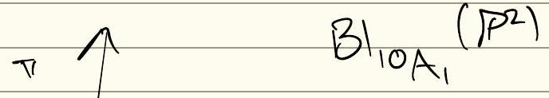 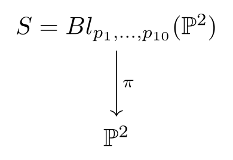
<!-- Fine, keep.
-->
Let $E_1, \dots, E_{10}$ be the exceptional divisors in $S$.
Let $E_0 = \pi^*(H)$, where $H \in \mathcal{O}*{\mathbb{P}^2}(1)$.
$S$ is a double cover branched in $\tilde{C}$.
Let $S*{co} := \langle e_0, e_1, \dots, e_{10} \rangle_{\mathbb{Z}} \subseteq \operatorname{Pic}(X) = L_{K3}$.
This is isometric to $I_{1,10}(2) \cong \langle -2 \rangle \oplus E_{10}(2)$.
The transcendental lattice is $T_{co} := S_{co}^\perp \cap L_{K3} = \langle 2 \rangle \oplus E_{10}(2)$.

Compare to $T_{En} = U \oplus E_{10}(2)$ and $S_{En} = E_{10}(2)$.

The polarization $h = e + f$ satisfies $h^2 = 2$.
The inclusion $\langle e + f \rangle \hookrightarrow U$ yields a primitive embedding:
$$
T_{co} = \langle e + f \rangle \oplus E_{10}(2) \subset T_{En} = U \oplus E_{10}(2) \subset L_{K3}
$$
and a corresponding map on the invariant lattices $S_{co} \to S_{En} \to L_{K3}$.
The signature is $(1, 10)$, so the lattice has rank $11$.
The moduli space is given by:
$$
\mathcal{M}_{co} \cong O(T_{co}) \backslash D(T_{co})
$$
This parameterizes degree 4 K3 surfaces with a nonsymplectic involution $\tau$ such that $L_{K3}^\tau = S_{co}$.
> [!LEMMA] Period Domain Embedding The map $\eta: T_{co} \hookrightarrow T_{En}$ is a primitive embedding.

> [!PROOF] The map is given by:
> $$
> \begin{aligned}
> \eta: \langle h \rangle \oplus E_{10}(2) & \to \langle e, f \rangle \oplus E_{10}(2) \\
> (h, x) & \mapsto (e+f, x)
> \end{aligned}
> $$
> The check matrix is $n = \begin{pmatrix} 1 & 0 \\ 0 & 1 \\ \hline 0 & \text{id} \end{pmatrix}$, which has $\operatorname{SNF}(n) = \begin{pmatrix} \text{id} & 0 \\ \hline 0 & 0 \end{pmatrix}$, hence it is torsion-free and primitive.
> It is an isometry because $h^2 = 2$ and $(e+f)^2 = 2$.

## Lattice Towers and Embeddings

> [!LEMMA] Lattice Tower There is a sequence of embeddings:
> $$
> T_{co} \hookrightarrow T_{En} \hookrightarrow T_{dp} \hookrightarrow L_{K3}
> $$
> unique up to $O(L_{K3})$, yielding an embedding $T_{co} \hookrightarrow T_{dp} = (2,2,0)$ and thus an open immersion $\mathcal{F}*{C_0} \hookrightarrow \mathcal{F}*{(2,2,0)}$.

> [!PROOF] Use [@Ale24] to reduce to showing $S_{En} \to S_{C_0}$ is unique up to isometry.
> This reduces to showing $f: E_{10} \to \langle 2 \rangle \oplus E_{10}$ is unique.

> [!LEMMA] (Uniqueness) If $f: L \xrightarrow{x \mapsto (0, x)} L' \oplus L$ and $L$ is unimodular, then $f$ is unique.

> [!PROOF] Overlattices of $f(L) \oplus f(L)^{\perp}$ correspond to "gluing" subgroups $\Gamma \subseteq A_{f(L)} \oplus A_{f(L)^{\perp}}$ where $\Gamma$ embeds into both.
> But $L$ is unimodular $\implies \Gamma = 0$ is unique.
> Thus the only overlattice is $L \oplus L'$.
> Conclude because $E_{10}$ is unimodular.

> [!THEOREM] Theorem Z [@AE22] $\mathcal{F}*{co}$ is the normalization of a closed subvariety of either $\mathcal{F}*{En}$ or $\mathcal{F}_{2,2,0}$.

> [!PROOF]
> - **Cusp Diagram**: Computed using the "mirror move" [@AE22, Lemma] and Vinberg's algorithm [@Nin89]. 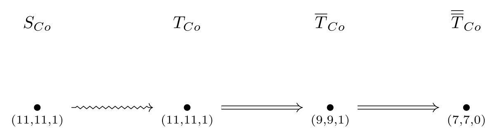
> - **Morphism Extension**: Uses [@KK72, Lemma].
> - **Correspondence**: By [@AE22], there exists a unique vector:
> $$
> [V_0] \in T_{c0} / O(T_{c0}), \quad V_0^2 = 0
> $$

Vinberg's Algorithm (verified by Coxeter diagrams) implies there is $1$ maximal parabolic for $v_{0}^{+} / v_0$.

<!-- NOTE: The reproduction fig_05 was hallucinated and showed the wrong diagram.
-->
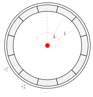

> [!COROLLARY] Coble degenerations are of Type II (with $D^2$ dual complexes).

**Goal**: Describe all degenerations in $\overline{\mathcal{F}*{co}^0}$ or $\overline{\mathcal{F}*{co,2}}$.

**Example for Enriques**:
$$
B_3(2, 0^{15}, \underbrace{2, 4, 6, 4}_{\text{Surgeries}} \mid 0, 4) \in \mathbb{Z}^{22} \ni \vec{l}
$$
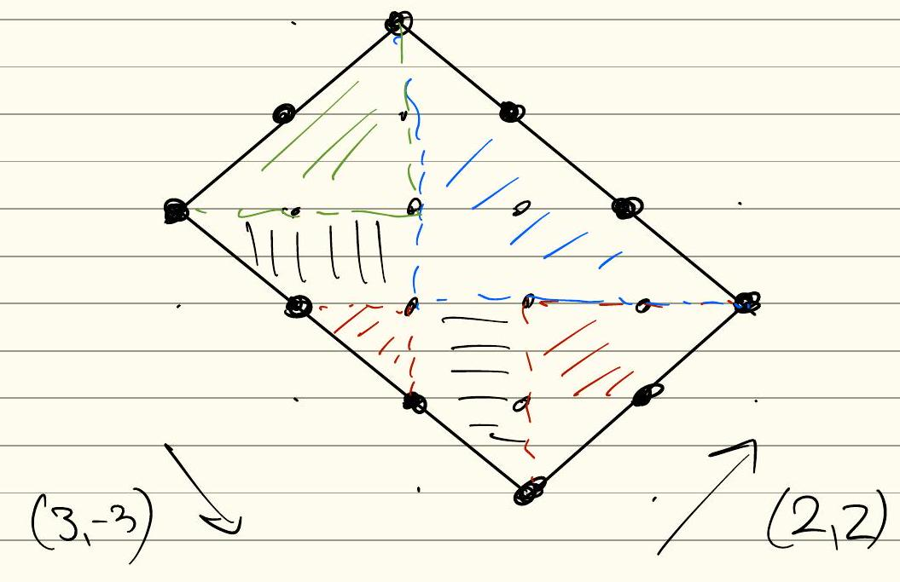
<!-- This needs a reproduction.
It's a rotated rectangle.
The edges are described by EXPLICIT vectors in the image.
It is a lattice polytope, triangulated into basis triangles.. Lines are used for shading, colors are used to shade different regions.
-->
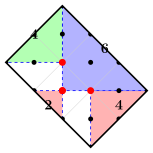

$$
\mathcal{F}_{En} = O(T_{En}) \backslash D_{T_{En}}, \quad \mathcal{F}_{En,2} = \Gamma_{En,2} \backslash D_{T_{En}}
$$
where $\Gamma_{En,2} = \operatorname{Stab}(h) \cap Z(\iota_{En})$.
$$
\mathcal{F}_{co} = O(T_{co}) \backslash D_{T_{co}}, \quad \mathcal{F}_{co,2} = \Gamma_{co,2} \backslash D_{T_{co}}
$$
where $\Gamma_{co,2} = \operatorname{Stab}(h) \cap Z(\iota_{co})$.

For the Enriques case, $h = e + f \in S_{co} = U(2)$ has $h^2 = 4$.
This is the image of some $h' \in \operatorname{Num}(Y)$ with $(h')^2 = 2$ under the pullback:
$$
\begin{aligned}
\rho^*: H^2(Y; \mathbb{Z}) & \to H^2(X; \mathbb{Z}) \\
(x, y) & \mapsto (x, 0, x, y, y)
\end{aligned}
$$

Consider a polarized surface $(S, h)$ with $h^2 = 2$.
The involution $\rho \curvearrowright X$ induces $\rho^*(H^2(S; \mathbb{Z})) \hookrightarrow L_{K3}$.
Since $S_{co} = \langle -2 \rangle \oplus E_{10}(2)$, the same polarization $h = e + f \in E_{10}(2)$ should work.
Need formula for $\iota_{co}$.

The invariant lattice $L_{K3}^{\langle \iota_{En} \rangle}$ can be computed via linear algebra:
$$
\iota_{En}(v) = v \iff (\iota_{En} - I)v = 0 \implies T_{En} = \operatorname{Ker}(\iota_{En} - I)
$$
- Need a map $\mathcal{F}*{co,2} \to \mathcal{F}*{En,2}$ (should define $\Gamma_{co,2}$ so this holds).

# Compactifications and Stable Models

## KSBA Stable Models

The stable limit of pairs $(X^*, \epsilon R^*)$ is KSBA. For Enriques surfaces, these correspond to pairs $(Z, [L_Z])$ where $L_Z^2 = 2$.
Let $M := L_Z^{\otimes 2}$, so $\deg M = 8$.
If $M$ is big and nef, then $|M|$ defines a map $\rho: Z \to \mathbb{P}^4$ with $R_Z := \operatorname{Ram}(\rho)$ ample.
> [!THEOREM] KSBA Compactification There exists a KSBA compactification of pairs:
> $$
> \begin{aligned}
> \left\{ (Z, [L_Z]) \mid L_Z^2 = 2 \right\} / \sim & \cong \left\{ (Z, M) \mid M^2 = 8 \right\} / \sim \\
> & \cong \left\{ (Z, \epsilon R_Z) \mid R_Z \in |M| \right\}
> \end{aligned}
> $$
> If $(S, [L_S])$ has $L_S^2 = 2$ ample, $M_S := L_S^{\otimes 2}$ defines a canonical $R_Z$.

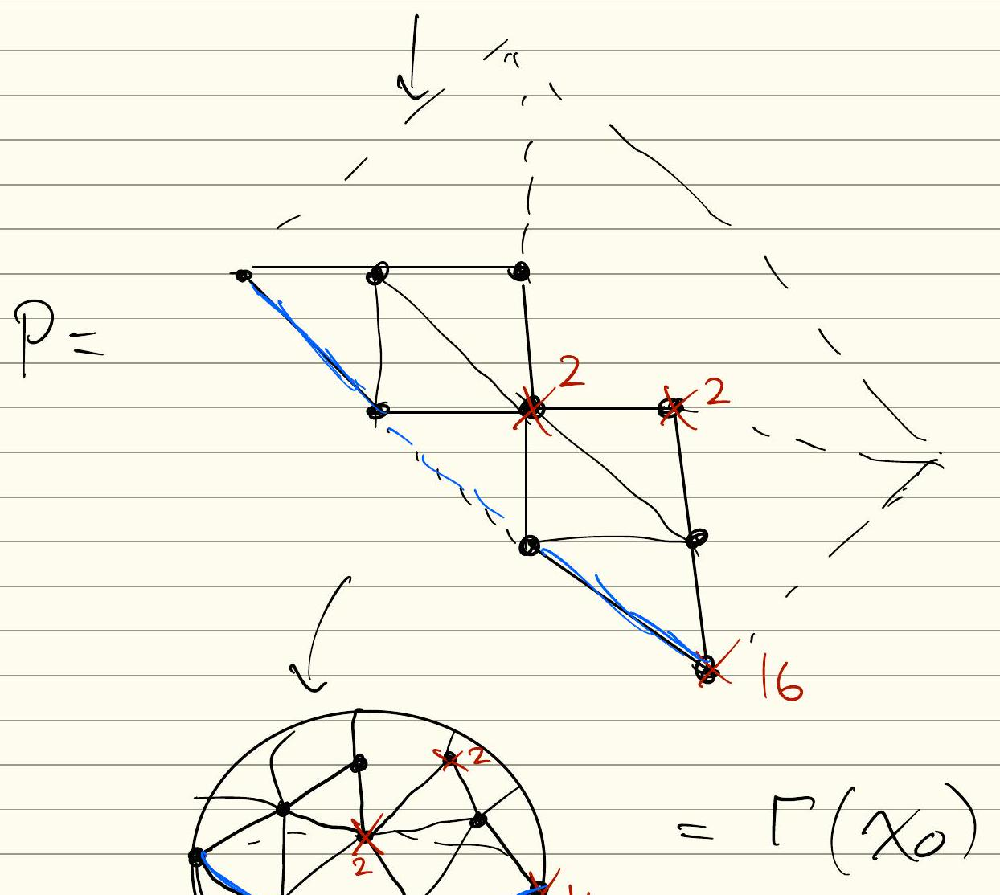 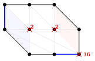 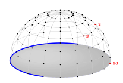

We need to understand the $\Gamma_{co,2}$-orbits of $v, J$.

> [!LEMMA] Orbits There are at least 5 orbits of vectors $v$ with $v^2 = 0$.

> [!PROOF] Consider $A_{Tco}$ and enumerate orbits there.

> [!CONJECTURE] The normalization of the boundary of the Coble moduli space is isomorphic to the Enriques moduli space: $(\overline{\mathcal{F}*{co,2}})^{\text{normalization}} \cong \overline{\mathcal{F}*{En,2}}$.
